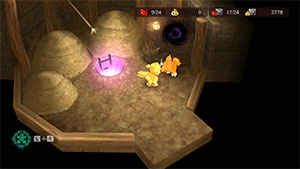

  

# Overview

<table class="dungeonOverview">
  <tr>
    <th>Unlock</th>
    <td class="highlightYellow">Clear Cid's Memories (Chapter 1).</td>
  </tr>
  <tr>
    <th>Location</th>
    <td class="highlightYellow">Silo (Chapter 2+)</td>
  </tr>
</table>

<table class="dungeonTable">
  <tr>
    <th>Title</th>
    <td colspan="3">The Botanical Garden</td>
  </tr>
  <tr>
    <th>Description</th>
    <td colspan="3">A dungeon filled with marauding plant monsters. Use your wits and skill to make it through!</td>
  </tr>
  <tr>
    <th>Floors</th>
    <td>6F</td>
    <th>Bosses</th>
    <td>5F</td>
  </tr>
  <tr>
    <th>Change Crystals</th>
    <td>0F</td>
    <th>Checkpoints</th>
    <td>None</td>
  </tr>
  <tr>
    <th>Max Level</th>
    <td>15</td>
    <th>Bring Buddy</th>
    <td>Yes</td>
  </tr>
  <tr>
    <th>Bring In Items</th>
    <td>No</td>
    <th>Take Out Items</th>
    <td>No</td>
  </tr>
  <tr>
    <th>Shops/Duels</th>
    <td>No</td>
    <th>Den of Monsters</th>
    <td>No</td>
  </tr>
  <tr>
    <th>Reapers</th>
    <td>Yes</td>
    <th>Bookmark</th>
    <td>No</td>
  </tr>
  <tr>
    <th>Unidentified</th>
    <td colspan="3">Equipment, Consumables</td>
  </tr>
  <tr>
    <th>Rewards</th>
    <td colspan="3">1.  Camilla's Memories (6F). 2.  Camilla added to  Buddy Registry. 3. Dungeon added to  Mirror of Training. 4. Can unlock  A Treasure Hunter's Memories.</td>
  </tr>
</table>

# Strategy

[Content]

# Monsters

<ul><li><a href="#monster-table">Monster Table</a></li><li><a href="#monster-details">Monster Details</a></li></ul>

 

 Monster Table 

Monster Colors - Boss F - 　 means field of view is limited. R - 　 means  Reaper can spawn.

<table class="monsterTable">
  <thead>
    <tr>
      <th>F</th>
      <th colspan="5">Monsters</th>
      <th>R</th>
    </tr>
  </thead>
  <tbody>
    <tr class="changeCrystal">
      <td class="centeredText">0</td>
      <td colspan="5" class="centeredText">Change Crystal</td>
      <td></td>
    </tr>
    <tr>
      <td class="centeredText highlightFog">1</td>
      <td> Ochu (45%)</td>
      <td> Mandra (45%)</td>
      <td> Cactuar (10%)</td>
      <td class="highlightGray"></td>
      <td class="highlightGray"></td>
      <td class="highlightReaper"></td>
    </tr>
    <tr>
      <td class="centeredText highlightFog">2</td>
      <td> Ochu (45%)</td>
      <td> Mandra (45%)</td>
      <td> Cactuar (10%)</td>
      <td class="highlightGray"></td>
      <td class="highlightGray"></td>
      <td class="highlightReaper"></td>
    </tr>
    <tr>
      <td class="centeredText highlightFog">3</td>
      <td> Ochu (40%)</td>
      <td> Mandra (30%)</td>
      <td> Cactuar (15%)</td>
      <td> Mandragora (15%)</td>
      <td class="highlightGray"></td>
      <td class="highlightReaper"></td>
    </tr>
    <tr>
      <td class="centeredText highlightFog">4</td>
      <td> Ochu (30%)</td>
      <td> Mandra (20%)</td>
      <td> Cactuar (15%)</td>
      <td> Mandragora (15%)</td>
      <td> Malboro (20%)</td>
      <td class="highlightReaper"></td>
    </tr>
    <tr>
      <td class="centeredText">5</td>
      <td> Devil Chocobo</td>
      <td class="highlightGray"></td>
      <td class="highlightGray"></td>
      <td class="highlightGray"></td>
      <td class="highlightGray"></td>
      <td class="highlightGray"></td>
    </tr>
    <tr class="highlightYellow">
      <td class="centeredText">6</td>
      <td colspan="5" class="centeredText"> Camilla's Memories</td>
      <td></td>
    </tr>
  </tbody>
</table>

 

 Monster Details 

Stat Colors - Hard Mode

### Standard

#### Ochu (1-4F)

<table class="buddyOverview">
  <tr class="noPad">
    <th colspan="13" class="highlightGreen">Stats</th>
  </tr>
  <tr>
    <td rowspan="4"></td>
    <td class="hp">HP</td>
    <td>45 / 57</td>
    <td class="atk">Attack</td>
    <td>20 / 22</td>
    <td class="mag">Magic</td>
    <td>24 / 25</td>
    <th>JP</th>
    <td>-</td>
    <th>Item 1</th>
    <td colspan="3">Leather Talons (14%)</td>
  </tr>
  <tr>
    <td class="sp">Exp</td>
    <td>64</td>
    <td class="def">Defense</td>
    <td>39 / 40</td>
    <td class="mnd">Mind</td>
    <td>33 / 34</td>
    <th>BP</th>
    <td>3 (50%)</td>
    <th>Item 2</th>
    <td colspan="3">Potion (14%)</td>
  </tr>
  <tr>
    <th>Hit</th>
    <td>95</td>
    <th>Evasion</th>
    <td>2</td>
    <th>Crit</th>
    <td>5</td>
    <th>Gil</th>
    <td>-</td>
    <th>Steal</th>
    <td colspan="3">Potion (60%)</td>
  </tr>
  <tr>
    <th>Lv</th>
    <td>8</td>
    <th>Special</th>
    <td>-</td>
    <th>Resist</th>
    <td colspan="3"></td>
    <th>Weak</th>
    <td colspan="3">-</td>
  </tr>
  <tr>
    <th colspan="13" class="abilityName">Poison Tentacles</th>
  </tr>
  <tr class="elementIcon">
    <th>Element</th>
    <td>-</td>
    <th>Range</th>
    <td></td>
    <th>Notes</th>
    <td colspan="8" class="leftText">Deal damage + Poison to a target 1 tile ahead.</td>
  </tr>
  <tr>
    <th>Rate / CD</th>
    <td colspan="2">20% / 3T</td>
    <th>Count</th>
    <td>∞</td>
    <th>Multiplier</th>
    <td>x1.0</td>
    <th>Value</th>
    <td>0</td>
    <th>Type</th>
    <td class="leftText">Physical</td>
    <th>Calc</th>
    <td class="leftText">Stat</td>
  </tr>
</table>

#### Mandra (1-4F)

<table class="buddyOverview">
  <tr class="noPad">
    <th colspan="13" class="highlightGreen">Stats</th>
  </tr>
  <tr>
    <td rowspan="4"></td>
    <td class="hp">HP</td>
    <td>45 / 57</td>
    <td class="atk">Attack</td>
    <td>20 / 22</td>
    <td class="mag">Magic</td>
    <td>24 / 25</td>
    <th>JP</th>
    <td>-</td>
    <th>Item 1</th>
    <td colspan="3">Leather Saddle (14%)</td>
  </tr>
  <tr>
    <td class="sp">Exp</td>
    <td>64</td>
    <td class="def">Defense</td>
    <td>39 / 40</td>
    <td class="mnd">Mind</td>
    <td>33 / 34</td>
    <th>BP</th>
    <td>3 (50%)</td>
    <th>Item 2</th>
    <td colspan="3">Ether (14%)</td>
  </tr>
  <tr>
    <th>Hit</th>
    <td>95</td>
    <th>Evasion</th>
    <td>2</td>
    <th>Crit</th>
    <td>5</td>
    <th>Gil</th>
    <td>-</td>
    <th>Steal</th>
    <td colspan="3">Ether (60%)</td>
  </tr>
  <tr>
    <th>Lv</th>
    <td>8</td>
    <th>Special</th>
    <td>-</td>
    <th>Resist</th>
    <td colspan="3"></td>
    <th>Weak</th>
    <td colspan="3">-</td>
  </tr>
  <tr>
    <th colspan="13" class="abilityName">Seeds</th>
  </tr>
  <tr class="elementIcon">
    <th>Element</th>
    <td>-</td>
    <th>Range</th>
    <td></td>
    <th>Notes</th>
    <td colspan="8" class="leftText">Deal damage to a target up to 3 tiles ahead.</td>
  </tr>
  <tr>
    <th>Rate / CD</th>
    <td colspan="2">20% / 0T</td>
    <th>Count</th>
    <td>∞</td>
    <th>Multiplier</th>
    <td>x2.0</td>
    <th>Value</th>
    <td>0</td>
    <th>Type</th>
    <td class="leftText">Physical</td>
    <th>Calc</th>
    <td class="leftText">Stat</td>
  </tr>
  <tr>
    <th colspan="13" class="abilityName">Scream</th>
  </tr>
  <tr class="elementIcon">
    <th>Element</th>
    <td>-</td>
    <th>Range</th>
    <td></td>
    <th>Notes</th>
    <td colspan="8" class="leftText">Inflict Stun on targets in a 2 tile radius.</td>
  </tr>
  <tr>
    <th>Rate / CD</th>
    <td colspan="2">10% / 4T</td>
    <th>Count</th>
    <td>∞</td>
    <th>Multiplier</th>
    <td>x1.0</td>
    <th>Value</th>
    <td>0</td>
    <th>Type</th>
    <td class="leftText">Other</td>
    <th>Calc</th>
    <td class="leftText">None</td>
  </tr>
</table>

#### Cactuar (1-4F)

<table class="buddyOverview">
  <tr class="noPad">
    <th colspan="13" class="highlightGreen">Stats</th>
  </tr>
  <tr>
    <td rowspan="4"></td>
    <td class="hp">HP</td>
    <td>45 / 57</td>
    <td class="atk">Attack</td>
    <td>25 / 27</td>
    <td class="mag">Magic</td>
    <td>16 / 17</td>
    <th>JP</th>
    <td>-</td>
    <th>Item 1</th>
    <td colspan="3">Bronze Talons (30%)</td>
  </tr>
  <tr>
    <td class="sp">Exp</td>
    <td>76</td>
    <td class="def">Defense</td>
    <td>39 / 40</td>
    <td class="mnd">Mind</td>
    <td>45 / 46</td>
    <th>BP</th>
    <td>3 (50%)</td>
    <th>Item 2</th>
    <td colspan="3">Bronze Saddle (30%)</td>
  </tr>
  <tr>
    <th>Hit</th>
    <td>95</td>
    <th>Evasion</th>
    <td>8</td>
    <th>Crit</th>
    <td>5</td>
    <th>Gil</th>
    <td>-</td>
    <th>Steal</th>
    <td colspan="3">Antidote (60%)</td>
  </tr>
  <tr>
    <th>Lv</th>
    <td>8</td>
    <th>Special</th>
    <td>-</td>
    <th>Resist</th>
    <td colspan="3"></td>
    <th>Weak</th>
    <td colspan="3"></td>
  </tr>
  <tr>
    <th colspan="13" class="abilityName">1000 Needles</th>
  </tr>
  <tr class="elementIcon">
    <th>Element</th>
    <td>-</td>
    <th>Range</th>
    <td></td>
    <th>Notes</th>
    <td colspan="8" class="leftText">Reduce a target's HP to one digit up to 3 tiles ahead.</td>
  </tr>
  <tr>
    <th>Rate / CD</th>
    <td colspan="2">20% / 8T</td>
    <th>Count</th>
    <td>∞</td>
    <th>Multiplier</th>
    <td>x1.0</td>
    <th>Value</th>
    <td>-1</td>
    <th>Type</th>
    <td class="leftText">Physical</td>
    <th>Calc</th>
    <td class="leftText">Ratio</td>
  </tr>
</table>

#### Mandragora (3-4F)

<table class="buddyOverview">
  <tr class="noPad">
    <th colspan="13" class="highlightGreen">Stats</th>
  </tr>
  <tr>
    <td rowspan="4"></td>
    <td class="hp">HP</td>
    <td>45 / 57</td>
    <td class="atk">Attack</td>
    <td>20 / 22</td>
    <td class="mag">Magic</td>
    <td>24 / 25</td>
    <th>JP</th>
    <td>-</td>
    <th>Item 1</th>
    <td colspan="3">Potion (14%)</td>
  </tr>
  <tr>
    <td class="sp">Exp</td>
    <td>64</td>
    <td class="def">Defense</td>
    <td>39 / 40</td>
    <td class="mnd">Mind</td>
    <td>33 / 34</td>
    <th>BP</th>
    <td>3 (50%)</td>
    <th>Item 2</th>
    <td colspan="3">Ether (14%)</td>
  </tr>
  <tr>
    <th>Hit</th>
    <td>95</td>
    <th>Evasion</th>
    <td>2</td>
    <th>Crit</th>
    <td>5</td>
    <th>Gil</th>
    <td>-</td>
    <th>Steal</th>
    <td colspan="3">Eye Drops (60%)</td>
  </tr>
  <tr>
    <th>Lv</th>
    <td>8</td>
    <th>Special</th>
    <td>-</td>
    <th>Resist</th>
    <td colspan="3"></td>
    <th>Weak</th>
    <td colspan="3">-</td>
  </tr>
  <tr>
    <th colspan="13" class="abilityName">Seeds</th>
  </tr>
  <tr class="elementIcon">
    <th>Element</th>
    <td>-</td>
    <th>Range</th>
    <td></td>
    <th>Notes</th>
    <td colspan="8" class="leftText">Deal damage to a target up to 3 tiles ahead.</td>
  </tr>
  <tr>
    <th>Rate / CD</th>
    <td colspan="2">20% / 0T</td>
    <th>Count</th>
    <td>∞</td>
    <th>Multiplier</th>
    <td>x2.0</td>
    <th>Value</th>
    <td>0</td>
    <th>Type</th>
    <td class="leftText">Physical</td>
    <th>Calc</th>
    <td class="leftText">Stat</td>
  </tr>
  <tr>
    <th colspan="13" class="abilityName">Scream</th>
  </tr>
  <tr class="elementIcon">
    <th>Element</th>
    <td>-</td>
    <th>Range</th>
    <td></td>
    <th>Notes</th>
    <td colspan="8" class="leftText">Inflict Stun on targets in a 2 tile radius.</td>
  </tr>
  <tr>
    <th>Rate / CD</th>
    <td colspan="2">10% / 4T</td>
    <th>Count</th>
    <td>∞</td>
    <th>Multiplier</th>
    <td>x1.0</td>
    <th>Value</th>
    <td>0</td>
    <th>Type</th>
    <td class="leftText">Other</td>
    <th>Calc</th>
    <td class="leftText">None</td>
  </tr>
  <tr>
    <th colspan="13" class="abilityName">Baby's Breath</th>
  </tr>
  <tr class="elementIcon">
    <th>Element</th>
    <td>-</td>
    <th>Range</th>
    <td></td>
    <th>Notes</th>
    <td colspan="8" class="leftText">Inflict Blind on targets in a 1 tile radius.</td>
  </tr>
  <tr>
    <th>Rate / CD</th>
    <td colspan="2">10% / 4T</td>
    <th>Count</th>
    <td>∞</td>
    <th>Multiplier</th>
    <td>x1.0</td>
    <th>Value</th>
    <td>0</td>
    <th>Type</th>
    <td class="leftText">Other</td>
    <th>Calc</th>
    <td class="leftText">None</td>
  </tr>
</table>

#### Malboro (4F)

<table class="buddyOverview">
  <tr class="noPad">
    <th colspan="13" class="highlightGreen">Stats</th>
  </tr>
  <tr>
    <td rowspan="4"></td>
    <td class="hp">HP</td>
    <td>45 / 57</td>
    <td class="atk">Attack</td>
    <td>20 / 22</td>
    <td class="mag">Magic</td>
    <td>24 / 25</td>
    <th>JP</th>
    <td>-</td>
    <th>Item 1</th>
    <td colspan="3">Bronze Saddle (8%)</td>
  </tr>
  <tr>
    <td class="sp">Exp</td>
    <td>64</td>
    <td class="def">Defense</td>
    <td>39 / 40</td>
    <td class="mnd">Mind</td>
    <td>33 / 34</td>
    <th>BP</th>
    <td>3 (50%)</td>
    <th>Item 2</th>
    <td colspan="3">Bronze Talons (8%)</td>
  </tr>
  <tr>
    <th>Hit</th>
    <td>95</td>
    <th>Evasion</th>
    <td>2</td>
    <th>Crit</th>
    <td>5</td>
    <th>Gil</th>
    <td>-</td>
    <th>Steal</th>
    <td colspan="3">Antidote (60%)</td>
  </tr>
  <tr>
    <th>Lv</th>
    <td>8</td>
    <th>Special</th>
    <td>-</td>
    <th>Resist</th>
    <td colspan="3"></td>
    <th>Weak</th>
    <td colspan="3">-</td>
  </tr>
  <tr>
    <th colspan="13" class="abilityName">Bad Breath</th>
  </tr>
  <tr class="elementIcon">
    <th>Element</th>
    <td>-</td>
    <th>Range</th>
    <td></td>
    <th>Notes</th>
    <td colspan="8" class="leftText">Inflict Blind, Confuse, or Silence on a target 1 tile ahead.</td>
  </tr>
  <tr>
    <th>Rate / CD</th>
    <td colspan="2">20% / 3T</td>
    <th>Count</th>
    <td>∞</td>
    <th>Multiplier</th>
    <td>x1.0</td>
    <th>Value</th>
    <td>0</td>
    <th>Type</th>
    <td class="leftText">Other</td>
    <th>Calc</th>
    <td class="leftText">None</td>
  </tr>
</table>

### Boss

#### Devil Chocobo (5F)

<table class="buddyOverview">
  <tr class="noPad">
    <th colspan="14" class="highlightBoss">Stats</th>
  </tr>
  <tr>
    <td rowspan="4"></td>
    <td class="hp">HP</td>
    <td>200 / 239</td>
    <td class="atk">Attack</td>
    <td>44 / 44</td>
    <td class="mag">Magic</td>
    <td>50 / 50</td>
    <th>JP</th>
    <td colspan="2">-</td>
    <th>Item 1</th>
    <td colspan="5">-</td>
  </tr>
  <tr>
    <td class="sp">Exp</td>
    <td>0</td>
    <td class="def">Defense</td>
    <td>46 / 46</td>
    <td class="mnd">Mind</td>
    <td>50 / 50</td>
    <th>BP</th>
    <td colspan="2">1 (100%)</td>
    <th>Item 2</th>
    <td colspan="5">-</td>
  </tr>
  <tr>
    <th>Hit</th>
    <td>90</td>
    <th>Evasion</th>
    <td>10</td>
    <th>Crit</th>
    <td>10</td>
    <th>Gil</th>
    <td colspan="2">-</td>
    <th>Steal</th>
    <td colspan="5">Ether (100%)</td>
  </tr>
  <tr>
    <th>Lv</th>
    <td>15</td>
    <th>Special</th>
    <td>-</td>
    <th>Resist</th>
    <td colspan="4">-</td>
    <th>Weak</th>
    <td colspan="5">-</td>
  </tr>
  <tr>
    <th colspan="14" class="statusResists">Status Resistances</th>
  </tr>
  <tr>
    <th></th>
    <th></th>
    <th></th>
    <th></th>
    <th></th>
    <th></th>
    <th></th>
    <th></th>
    <th></th>
    <th colspan="2">Knockback</th>
    <th>Stun</th>
    <th>Warp</th>
    <th>Ratio</th>
  </tr>
  <tr>
    <td>◯</td>
    <td>◯</td>
    <td>◯</td>
    <td>◯</td>
    <td>◯</td>
    <td>◯</td>
    <td>◯</td>
    <td>◯</td>
    <td>◯</td>
    <td colspan="2">◯</td>
    <td>◯</td>
    <td>◯</td>
    <td>◯</td>
  </tr>
  <tr>
    <th colspan="14" class="abilityName">Devil Claw</th>
  </tr>
  <tr class="elementIcon">
    <th>Element</th>
    <td>-</td>
    <th>Range</th>
    <td></td>
    <th>Notes</th>
    <td colspan="13" class="leftText">Deal damage to a target 1 tile ahead.</td>
  </tr>
  <tr>
    <th>Rate / CD</th>
    <td colspan="2">20% | 30% / 0T</td>
    <th>Count</th>
    <td>∞</td>
    <th>Multiplier</th>
    <td>x2.0</td>
    <th>Value</th>
    <td>0</td>
    <th>Type</th>
    <td colspan="2" class="leftText">Physical</td>
    <th>Calc</th>
    <td class="leftText">Stat</td>
  </tr>
  <tr>
    <th colspan="14" class="abilityName">Purple Breath</th>
  </tr>
  <tr class="elementIcon">
    <th>Element</th>
    <td>-</td>
    <th>Range</th>
    <td></td>
    <th>Notes</th>
    <td colspan="13" class="leftText">Deal damage + Poison to targets lined up within 10 tiles.</td>
  </tr>
  <tr>
    <th>Rate / CD</th>
    <td colspan="2">10% | 20% / 0T</td>
    <th>Count</th>
    <td>∞</td>
    <th>Multiplier</th>
    <td>x1.0</td>
    <th>Value</th>
    <td>0</td>
    <th>Type</th>
    <td colspan="2" class="leftText">Magic</td>
    <th>Calc</th>
    <td class="leftText">Stat</td>
  </tr>
  <tr>
    <th colspan="14" class="abilityName">Lucid Eye</th>
  </tr>
  <tr class="elementIcon">
    <th>Element</th>
    <td>-</td>
    <th>Range</th>
    <td></td>
    <th>Notes</th>
    <td colspan="13" class="leftText">Deal damage to targets in a 3 tile radius from up to 3 tiles ahead.</td>
  </tr>
  <tr>
    <th>Rate / CD</th>
    <td colspan="2">10% | 20% / 0T</td>
    <th>Count</th>
    <td>∞</td>
    <th>Multiplier</th>
    <td>x1.0</td>
    <th>Value</th>
    <td>0</td>
    <th>Type</th>
    <td colspan="2" class="leftText">Magic</td>
    <th>Calc</th>
    <td class="leftText">Stat</td>
  </tr>
</table>

# Items

<ul><li><a href="#floor">Floor</a></li><li><a href="#drop-/-steal">Drop / Steal</a></li></ul>

 

 Floor 

See the dungeon data JSON file for exact item spawn rates per floor.

<table class="dungeonItemTable">
  <tr>
    <th colspan="3" class="highlightPurple"> Talons</th>
  </tr>
  <tr>
    <th>Item</th>
    <th>Floor</th>
    <th>Rate Range</th>
  </tr>
  <tr>
    <td>Leather Talons</td>
    <td>1-4</td>
    <td>4.76%</td>
  </tr>
  <tr>
    <td>Wood Talons</td>
    <td>1-4</td>
    <td>7.14%</td>
  </tr>
  <tr>
    <td>Bronze Talons</td>
    <td>1-4</td>
    <td>9.52%</td>
  </tr>
  <tr>
    <th colspan="3" class="highlightPurple"> Saddles</th>
  </tr>
  <tr>
    <th>Item</th>
    <th>Floor</th>
    <th>Rate Range</th>
  </tr>
  <tr>
    <td>Leather Saddle</td>
    <td>1-4</td>
    <td>4.76%</td>
  </tr>
  <tr>
    <td>Wood Saddle</td>
    <td>1-4</td>
    <td>7.14%</td>
  </tr>
  <tr>
    <td>Bronze Saddle</td>
    <td>1-4</td>
    <td>9.52%</td>
  </tr>
  <tr>
    <th colspan="3" class="highlightPurple"> Greens</th>
  </tr>
  <tr>
    <th>Item</th>
    <th>Floor</th>
    <th>Rate Range</th>
  </tr>
  <tr>
    <td>Gysahl Greens</td>
    <td>1-4</td>
    <td>9.52%</td>
  </tr>
  <tr>
    <th colspan="3" class="highlightPurple"> Medicines</th>
  </tr>
  <tr>
    <th>Item</th>
    <th>Floor</th>
    <th>Rate Range</th>
  </tr>
  <tr>
    <td>Potion</td>
    <td>1-4</td>
    <td>23.81%</td>
  </tr>
  <tr>
    <td>Ether</td>
    <td>1-4</td>
    <td>9.52%</td>
  </tr>
  <tr>
    <td>Antidote</td>
    <td>1-4</td>
    <td>14.29%</td>
  </tr>
</table>

 

 Drop / Steal 

Monster Colors - Boss

<table class="dungeonDropTable">
  <thead>
    <tr>
      <th>Floor</th>
      <th>Monster</th>
      <th>Drop 1</th>
      <th>Drop 2</th>
      <th>Steal</th>
    </tr>
  </thead>
  <tbody>
    <tr>
      <td>1-4</td>
      <td> Ochu</td>
      <td>Leather Talons (14%)</td>
      <td>Potion (14%)</td>
      <td>Potion (60%)</td>
    </tr>
    <tr>
      <td>1-4</td>
      <td> Mandra</td>
      <td>Leather Saddle (14%)</td>
      <td>Ether (14%)</td>
      <td>Ether (60%)</td>
    </tr>
    <tr>
      <td>1-4</td>
      <td> Cactuar</td>
      <td>Bronze Talons (30%)</td>
      <td>Bronze Saddle (30%)</td>
      <td>Antidote (60%)</td>
    </tr>
    <tr>
      <td>3-4</td>
      <td> Mandragora</td>
      <td>Potion (14%)</td>
      <td>Ether (14%)</td>
      <td>Eye Drops (60%)</td>
    </tr>
    <tr>
      <td>4</td>
      <td> Malboro</td>
      <td>Bronze Saddle (8%)</td>
      <td>Bronze Talons (8%)</td>
      <td>Antidote (60%)</td>
    </tr>
    <tr>
      <td>5</td>
      <td> Devil Chocobo</td>
      <td>-</td>
      <td>-</td>
      <td>Ether (100%)</td>
    </tr>
  </tbody>
</table>
