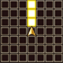

  

# Overview

<table class="dungeonOverview">
  <tr>
    <th>Unlock</th>
    <td class="highlightYellow">Clear A Maiden's Memories (Chapter 2).</td>
  </tr>
  <tr>
    <th>Location</th>
    <td class="highlightYellow">Silo (Chapter 2+)</td>
  </tr>
</table>

<table class="dungeonTable">
  <tr>
    <th>Title</th>
    <td colspan="3">Treasure Hunt</td>
  </tr>
  <tr>
    <th>Description</th>
    <td colspan="3">A dungeon where hoarders of loot come to win or lose their fortune. Who will claim all the glory?</td>
  </tr>
  <tr>
    <th>Floors</th>
    <td>6F</td>
    <th>Bosses</th>
    <td>5F</td>
  </tr>
  <tr>
    <th>Change Crystals</th>
    <td>0F</td>
    <th>Checkpoints</th>
    <td>None</td>
  </tr>
  <tr>
    <th>Max Level</th>
    <td>30</td>
    <th>Bring Buddy</th>
    <td>Yes</td>
  </tr>
  <tr>
    <th>Bring In Items</th>
    <td>No</td>
    <th>Take Out Items</th>
    <td>No</td>
  </tr>
  <tr>
    <th>Shops/Duels</th>
    <td>No</td>
    <th>Den of Monsters</th>
    <td>No</td>
  </tr>
  <tr>
    <th>Reapers</th>
    <td>Yes</td>
    <th>Bookmark</th>
    <td>No</td>
  </tr>
  <tr>
    <th>Unidentified</th>
    <td colspan="3">None</td>
  </tr>
  <tr>
    <th>Rewards</th>
    <td colspan="3">1.  Atla's Memories (6F). 2.  Atla added to  Buddy Registry. 3. Dungeon added to  Mirror of Training. 4. Can unlock  Insatiable Hunger.</td>
  </tr>
</table>

# Strategy

[Content]

# Monsters

<ul><li><a href="#monster-table">Monster Table</a></li><li><a href="#monster-details">Monster Details</a></li></ul>

 

 Monster Table 

Monster Colors - Boss F - 　 means field of view is limited. R - 　 means  Reaper can spawn.

<table class="monsterTable">
  <thead>
    <tr>
      <th>F</th>
      <th colspan="6">Monsters</th>
      <th>R</th>
    </tr>
  </thead>
  <tbody>
    <tr class="changeCrystal">
      <td class="centeredText">0</td>
      <td colspan="6" class="centeredText">Change Crystal</td>
      <td></td>
    </tr>
    <tr class="highlightYellow">
      <td class="centeredText">1</td>
      <td colspan="6" class="centeredText">Static Item Floor</td>
      <td></td>
    </tr>
    <tr>
      <td class="centeredText">2</td>
      <td> Magic Pot (50%)</td>
      <td> Ghost (20%)</td>
      <td> Wraith (20%)</td>
      <td> Cactuar (10%)</td>
      <td class="highlightGray"></td>
      <td class="highlightGray"></td>
      <td class="highlightReaper"></td>
    </tr>
    <tr>
      <td class="centeredText">3</td>
      <td> Magic Pot (50%)</td>
      <td> Ghost (15%)</td>
      <td> Wraith (15%)</td>
      <td> Cactuar (10%)</td>
      <td> Iron Giant Steel (10%)</td>
      <td class="highlightGray"></td>
      <td class="highlightReaper"></td>
    </tr>
    <tr>
      <td class="centeredText">4</td>
      <td> Magic Pot (40%)</td>
      <td> Ghost (10%)</td>
      <td> Wraith (10%)</td>
      <td> Cactuar (10%)</td>
      <td> Iron Giant Steel (10%)</td>
      <td> Lamia (20%)</td>
      <td class="highlightReaper"></td>
    </tr>
    <tr>
      <td class="centeredText">5</td>
      <td> Cryshale</td>
      <td class="highlightGray"></td>
      <td class="highlightGray"></td>
      <td class="highlightGray"></td>
      <td class="highlightGray"></td>
      <td class="highlightGray"></td>
      <td class="highlightGray"></td>
    </tr>
    <tr class="highlightYellow">
      <td class="centeredText">6</td>
      <td colspan="6" class="centeredText"> Atla's Memories</td>
      <td></td>
    </tr>
  </tbody>
</table>

 

 Monster Details 

Stat Colors - Hard Mode

### Standard

#### Magic Pot (2-4F)

<table class="buddyOverview">
  <tr class="noPad">
    <th colspan="13" class="highlightGreen">Stats</th>
  </tr>
  <tr>
    <td rowspan="4"></td>
    <td class="hp">HP</td>
    <td>62 / 76</td>
    <td class="atk">Attack</td>
    <td>74 / 77</td>
    <td class="mag">Magic</td>
    <td>46 / 47</td>
    <th>JP</th>
    <td>-</td>
    <th>Item 1</th>
    <td colspan="3">Potion (20%)</td>
  </tr>
  <tr>
    <td class="sp">Exp</td>
    <td>116</td>
    <td class="def">Defense</td>
    <td>45 / 46</td>
    <td class="mnd">Mind</td>
    <td>59 / 60</td>
    <th>BP</th>
    <td>3 (50%)</td>
    <th>Item 2</th>
    <td colspan="3">Ether (10%)</td>
  </tr>
  <tr>
    <th>Hit</th>
    <td>95</td>
    <th>Evasion</th>
    <td>8</td>
    <th>Crit</th>
    <td>5</td>
    <th>Gil</th>
    <td>-</td>
    <th>Steal</th>
    <td colspan="3">Hi-Potion (30%)</td>
  </tr>
  <tr>
    <th>Lv</th>
    <td>22</td>
    <th>Special</th>
    <td>-</td>
    <th>Resist</th>
    <td colspan="3"></td>
    <th>Weak</th>
    <td colspan="3">-</td>
  </tr>
  <tr>
    <th colspan="13" class="abilityName">Steal</th>
  </tr>
  <tr class="elementIcon">
    <th>Element</th>
    <td>-</td>
    <th>Range</th>
    <td></td>
    <th>Notes</th>
    <td colspan="8" class="leftText">Steal an inventory item from a target 1 tile ahead.</td>
  </tr>
  <tr>
    <th>Rate / CD</th>
    <td colspan="2">50% / 0T</td>
    <th>Count</th>
    <td>∞</td>
    <th>Multiplier</th>
    <td>x1.0</td>
    <th>Value</th>
    <td>0</td>
    <th>Type</th>
    <td class="leftText">Other</td>
    <th>Calc</th>
    <td class="leftText">None</td>
  </tr>
</table>

#### Ghost (2-4F)

<table class="buddyOverview">
  <tr class="noPad">
    <th colspan="13" class="highlightGreen">Stats</th>
  </tr>
  <tr>
    <td rowspan="4"></td>
    <td class="hp">HP</td>
    <td>62 / 76</td>
    <td class="atk">Attack</td>
    <td>44 / 47</td>
    <td class="mag">Magic</td>
    <td>46 / 47</td>
    <th>JP</th>
    <td>-</td>
    <th>Item 1</th>
    <td colspan="3">Potion (20%)</td>
  </tr>
  <tr>
    <td class="sp">Exp</td>
    <td>116</td>
    <td class="def">Defense</td>
    <td>45 / 46</td>
    <td class="mnd">Mind</td>
    <td>59 / 60</td>
    <th>BP</th>
    <td>3 (50%)</td>
    <th>Item 2</th>
    <td colspan="3">Stinky Greens (10%)</td>
  </tr>
  <tr>
    <th>Hit</th>
    <td>95</td>
    <th>Evasion</th>
    <td>8</td>
    <th>Crit</th>
    <td>5</td>
    <th>Gil</th>
    <td>-</td>
    <th>Steal</th>
    <td colspan="3">Hi-Ether (30%)</td>
  </tr>
  <tr>
    <th>Lv</th>
    <td>22</td>
    <th>Special</th>
    <td></td>
    <th>Resist</th>
    <td colspan="3"></td>
    <th>Weak</th>
    <td colspan="3"></td>
  </tr>
  <tr>
    <th colspan="13" class="abilityName">Rust in Pieces</th>
  </tr>
  <tr class="elementIcon">
    <th>Element</th>
    <td>-</td>
    <th>Range</th>
    <td></td>
    <th>Notes</th>
    <td colspan="8" class="leftText">Lower hone value of equipped Talons or Saddle by 1.</td>
  </tr>
  <tr>
    <th>Rate / CD</th>
    <td colspan="2">10% / 3T</td>
    <th>Count</th>
    <td>∞</td>
    <th>Multiplier</th>
    <td>x1.0</td>
    <th>Value</th>
    <td>0</td>
    <th>Type</th>
    <td class="leftText">Other</td>
    <th>Calc</th>
    <td class="leftText">None</td>
  </tr>
  <tr>
    <th colspan="13" class="abilityName">Rot-a-lot</th>
  </tr>
  <tr class="elementIcon">
    <th>Element</th>
    <td>-</td>
    <th>Range</th>
    <td></td>
    <th>Notes</th>
    <td colspan="8" class="leftText">Transform a Greens category item into Stinky Greens.</td>
  </tr>
  <tr>
    <th>Rate / CD</th>
    <td colspan="2">30% / 3T</td>
    <th>Count</th>
    <td>∞</td>
    <th>Multiplier</th>
    <td>x1.0</td>
    <th>Value</th>
    <td>0</td>
    <th>Type</th>
    <td class="leftText">Other</td>
    <th>Calc</th>
    <td class="leftText">None</td>
  </tr>
</table>

#### Wraith (2-4F)

<table class="buddyOverview">
  <tr class="noPad">
    <th colspan="13" class="highlightGreen">Stats</th>
  </tr>
  <tr>
    <td rowspan="4"></td>
    <td class="hp">HP</td>
    <td>62 / 76</td>
    <td class="atk">Attack</td>
    <td>44 / 47</td>
    <td class="mag">Magic</td>
    <td>46 / 47</td>
    <th>JP</th>
    <td>-</td>
    <th>Item 1</th>
    <td colspan="3">Potion (20%)</td>
  </tr>
  <tr>
    <td class="sp">Exp</td>
    <td>116</td>
    <td class="def">Defense</td>
    <td>45 / 46</td>
    <td class="mnd">Mind</td>
    <td>59 / 60</td>
    <th>BP</th>
    <td>3 (50%)</td>
    <th>Item 2</th>
    <td colspan="3">Stinky Greens (10%)</td>
  </tr>
  <tr>
    <th>Hit</th>
    <td>95</td>
    <th>Evasion</th>
    <td>8</td>
    <th>Crit</th>
    <td>5</td>
    <th>Gil</th>
    <td>-</td>
    <th>Steal</th>
    <td colspan="3">Hi-Ether (30%)</td>
  </tr>
  <tr>
    <th>Lv</th>
    <td>22</td>
    <th>Special</th>
    <td></td>
    <th>Resist</th>
    <td colspan="3"></td>
    <th>Weak</th>
    <td colspan="3"></td>
  </tr>
  <tr>
    <th colspan="13" class="abilityName">Rust in Pieces</th>
  </tr>
  <tr class="elementIcon">
    <th>Element</th>
    <td>-</td>
    <th>Range</th>
    <td></td>
    <th>Notes</th>
    <td colspan="8" class="leftText">Lower hone value of equipped Talons or Saddle by 1.</td>
  </tr>
  <tr>
    <th>Rate / CD</th>
    <td colspan="2">30% / 3T</td>
    <th>Count</th>
    <td>∞</td>
    <th>Multiplier</th>
    <td>x1.0</td>
    <th>Value</th>
    <td>0</td>
    <th>Type</th>
    <td class="leftText">Other</td>
    <th>Calc</th>
    <td class="leftText">None</td>
  </tr>
  <tr>
    <th colspan="13" class="abilityName">Rot-a-lot</th>
  </tr>
  <tr class="elementIcon">
    <th>Element</th>
    <td>-</td>
    <th>Range</th>
    <td></td>
    <th>Notes</th>
    <td colspan="8" class="leftText">Transform a Greens category item into Stinky Greens.</td>
  </tr>
  <tr>
    <th>Rate / CD</th>
    <td colspan="2">10% / 3T</td>
    <th>Count</th>
    <td>∞</td>
    <th>Multiplier</th>
    <td>x1.0</td>
    <th>Value</th>
    <td>0</td>
    <th>Type</th>
    <td class="leftText">Other</td>
    <th>Calc</th>
    <td class="leftText">None</td>
  </tr>
</table>

#### Cactuar (2-4F)

<table class="buddyOverview">
  <tr class="noPad">
    <th colspan="13" class="highlightGreen">Stats</th>
  </tr>
  <tr>
    <td rowspan="4"></td>
    <td class="hp">HP</td>
    <td>84 / 104</td>
    <td class="atk">Attack</td>
    <td>74 / 77</td>
    <td class="mag">Magic</td>
    <td>30 / 31</td>
    <th>JP</th>
    <td>-</td>
    <th>Item 1</th>
    <td colspan="3">Polishing Cream (80%)</td>
  </tr>
  <tr>
    <td class="sp">Exp</td>
    <td>175</td>
    <td class="def">Defense</td>
    <td>53 / 54</td>
    <td class="mnd">Mind</td>
    <td>59 / 60</td>
    <th>BP</th>
    <td>3 (50%)</td>
    <th>Item 2</th>
    <td colspan="3">-</td>
  </tr>
  <tr>
    <th>Hit</th>
    <td>95</td>
    <th>Evasion</th>
    <td>8</td>
    <th>Crit</th>
    <td>5</td>
    <th>Gil</th>
    <td>-</td>
    <th>Steal</th>
    <td colspan="3">Polishing Cream (30%)</td>
  </tr>
  <tr>
    <th>Lv</th>
    <td>22</td>
    <th>Special</th>
    <td></td>
    <th>Resist</th>
    <td colspan="3"></td>
    <th>Weak</th>
    <td colspan="3"></td>
  </tr>
  <tr>
    <th colspan="13" class="abilityName">1000 Needles</th>
  </tr>
  <tr class="elementIcon">
    <th>Element</th>
    <td>-</td>
    <th>Range</th>
    <td></td>
    <th>Notes</th>
    <td colspan="8" class="leftText">Reduce a target's HP to one digit up to 3 tiles ahead.</td>
  </tr>
  <tr>
    <th>Rate / CD</th>
    <td colspan="2">30% / 8T</td>
    <th>Count</th>
    <td>∞</td>
    <th>Multiplier</th>
    <td>x1.0</td>
    <th>Value</th>
    <td>-1</td>
    <th>Type</th>
    <td class="leftText">Physical</td>
    <th>Calc</th>
    <td class="leftText">Ratio</td>
  </tr>
</table>

#### Iron Giant Steel (3-4F)

<table class="buddyOverview">
  <tr class="noPad">
    <th colspan="13" class="highlightGreen">Stats</th>
  </tr>
  <tr>
    <td rowspan="4"></td>
    <td class="hp">HP</td>
    <td>126 / 155</td>
    <td class="atk">Attack</td>
    <td>74 / 77</td>
    <td class="mag">Magic</td>
    <td>30 / 31</td>
    <th>JP</th>
    <td>-</td>
    <th>Item 1</th>
    <td colspan="3">Steel Saddle (30%)</td>
  </tr>
  <tr>
    <td class="sp">Exp</td>
    <td>175</td>
    <td class="def">Defense</td>
    <td>53 / 54</td>
    <td class="mnd">Mind</td>
    <td>39 / 40</td>
    <th>BP</th>
    <td>3 (50%)</td>
    <th>Item 2</th>
    <td colspan="3">Heavy Saddle (20%)</td>
  </tr>
  <tr>
    <th>Hit</th>
    <td>85</td>
    <th>Evasion</th>
    <td>2</td>
    <th>Crit</th>
    <td>5</td>
    <th>Gil</th>
    <td>-</td>
    <th>Steal</th>
    <td colspan="3">Hi-Potion (30%)</td>
  </tr>
  <tr>
    <th>Lv</th>
    <td>22</td>
    <th>Special</th>
    <td></td>
    <th>Resist</th>
    <td colspan="3">-</td>
    <th>Weak</th>
    <td colspan="3"></td>
  </tr>
  <tr>
    <th colspan="13" class="abilityName">Battle Cry</th>
  </tr>
  <tr class="elementIcon">
    <th>Element</th>
    <td>-</td>
    <th>Range</th>
    <td></td>
    <th>Notes</th>
    <td colspan="8" class="leftText">Temporarily cast Bravery.</td>
  </tr>
  <tr>
    <th>Rate / CD</th>
    <td colspan="2">10% / 30T</td>
    <th>Count</th>
    <td>∞</td>
    <th>Multiplier</th>
    <td>x1.0</td>
    <th>Value</th>
    <td>0</td>
    <th>Type</th>
    <td class="leftText">Other</td>
    <th>Calc</th>
    <td class="leftText">None</td>
  </tr>
</table>

#### Lamia (4F)

<table class="buddyOverview">
  <tr class="noPad">
    <th colspan="13" class="highlightGreen">Stats</th>
  </tr>
  <tr>
    <td rowspan="4"></td>
    <td class="hp">HP</td>
    <td>84 / 104</td>
    <td class="atk">Attack</td>
    <td>44 / 47</td>
    <td class="mag">Magic</td>
    <td>46 / 47</td>
    <th>JP</th>
    <td>-</td>
    <th>Item 1</th>
    <td colspan="3">Steel Talons (30%)</td>
  </tr>
  <tr>
    <td class="sp">Exp</td>
    <td>175</td>
    <td class="def">Defense</td>
    <td>53 / 54</td>
    <td class="mnd">Mind</td>
    <td>59 / 60</td>
    <th>BP</th>
    <td>3 (50%)</td>
    <th>Item 2</th>
    <td colspan="3">Treasure Talons (20%)</td>
  </tr>
  <tr>
    <th>Hit</th>
    <td>95</td>
    <th>Evasion</th>
    <td>4</td>
    <th>Crit</th>
    <td>5</td>
    <th>Gil</th>
    <td>-</td>
    <th>Steal</th>
    <td colspan="3">Warp Wings (30%)</td>
  </tr>
  <tr>
    <th>Lv</th>
    <td>22</td>
    <th>Special</th>
    <td>-</td>
    <th>Resist</th>
    <td colspan="3">-</td>
    <th>Weak</th>
    <td colspan="3"></td>
  </tr>
  <tr>
    <th colspan="13" class="abilityName">Cursed Dance</th>
  </tr>
  <tr class="elementIcon">
    <th>Element</th>
    <td>-</td>
    <th>Range</th>
    <td></td>
    <th>Notes</th>
    <td colspan="8" class="leftText">Curse equipped Talons, Saddle, or Collar.</td>
  </tr>
  <tr>
    <th>Rate / CD</th>
    <td colspan="2">30% / 12T</td>
    <th>Count</th>
    <td>∞</td>
    <th>Multiplier</th>
    <td>x1.0</td>
    <th>Value</th>
    <td>0</td>
    <th>Type</th>
    <td class="leftText">Other</td>
    <th>Calc</th>
    <td class="leftText">None</td>
  </tr>
</table>

### Boss

#### Cryshale (5F)

<table class="buddyOverview">
  <tr class="noPad">
    <th colspan="14" class="highlightBoss">Stats</th>
  </tr>
  <tr>
    <td rowspan="4"></td>
    <td class="hp">HP</td>
    <td>400 / 479</td>
    <td class="atk">Attack</td>
    <td>73 / 73</td>
    <td class="mag">Magic</td>
    <td>75 / 75</td>
    <th>JP</th>
    <td colspan="2">-</td>
    <th>Item 1</th>
    <td colspan="5">-</td>
  </tr>
  <tr>
    <td class="sp">Exp</td>
    <td>0</td>
    <td class="def">Defense</td>
    <td>72 / 72</td>
    <td class="mnd">Mind</td>
    <td>66 / 66</td>
    <th>BP</th>
    <td colspan="2">1 (100%)</td>
    <th>Item 2</th>
    <td colspan="5">-</td>
  </tr>
  <tr>
    <th>Hit</th>
    <td>30</td>
    <th>Evasion</th>
    <td>5</td>
    <th>Crit</th>
    <td>5</td>
    <th>Gil</th>
    <td colspan="2">-</td>
    <th>Steal</th>
    <td colspan="5">Hi-Potion (100%)</td>
  </tr>
  <tr>
    <th>Lv</th>
    <td>30</td>
    <th>Special</th>
    <td></td>
    <th>Resist</th>
    <td colspan="4">-</td>
    <th>Weak</th>
    <td colspan="5">-</td>
  </tr>
  <tr>
    <th colspan="14" class="statusResists">Status Resistances</th>
  </tr>
  <tr>
    <th></th>
    <th></th>
    <th></th>
    <th></th>
    <th></th>
    <th></th>
    <th></th>
    <th></th>
    <th></th>
    <th colspan="2">Knockback</th>
    <th>Stun</th>
    <th>Warp</th>
    <th>Ratio</th>
  </tr>
  <tr>
    <td>✕</td>
    <td>✕</td>
    <td>✕</td>
    <td>✕</td>
    <td>◯</td>
    <td>◯</td>
    <td>◯</td>
    <td>◯</td>
    <td>◯</td>
    <td colspan="2">◯</td>
    <td>◯</td>
    <td>◯</td>
    <td>◯</td>
  </tr>
  <tr>
    <th colspan="14" class="abilityName">Ram</th>
  </tr>
  <tr class="elementIcon">
    <th>Element</th>
    <td>-</td>
    <th>Range</th>
    <td></td>
    <th>Notes</th>
    <td colspan="13" class="leftText">Deal damage + Knockback to a target 1 tile ahead.</td>
  </tr>
  <tr>
    <th>Rate / CD</th>
    <td colspan="2">10% | 10% / 0T</td>
    <th>Count</th>
    <td>∞</td>
    <th>Multiplier</th>
    <td>x1.0</td>
    <th>Value</th>
    <td>0</td>
    <th>Type</th>
    <td colspan="2" class="leftText">Physical</td>
    <th>Calc</th>
    <td class="leftText">Stat</td>
  </tr>
  <tr>
    <th colspan="14" class="abilityName">Light Arrows</th>
  </tr>
  <tr class="elementIcon">
    <th>Element</th>
    <td>-</td>
    <th>Range</th>
    <td></td>
    <th>Notes</th>
    <td colspan="13" class="leftText">Deal damage to targets in a 3 tile radius.</td>
  </tr>
  <tr>
    <th>Rate / CD</th>
    <td colspan="2">10% | 10% / 0T</td>
    <th>Count</th>
    <td>∞</td>
    <th>Multiplier</th>
    <td>x1.0</td>
    <th>Value</th>
    <td>0</td>
    <th>Type</th>
    <td colspan="2" class="leftText">Magic</td>
    <th>Calc</th>
    <td class="leftText">Stat</td>
  </tr>
  <tr>
    <th colspan="14" class="abilityName">Spinning Smash</th>
  </tr>
  <tr class="elementIcon">
    <th>Element</th>
    <td>-</td>
    <th>Range</th>
    <td></td>
    <th>Notes</th>
    <td colspan="13" class="leftText">Deal damage to targets in a 3 tile radius.</td>
  </tr>
  <tr>
    <th>Rate / CD</th>
    <td colspan="2">20% | 20% / 0T</td>
    <th>Count</th>
    <td>∞</td>
    <th>Multiplier</th>
    <td>x1.0</td>
    <th>Value</th>
    <td>0</td>
    <th>Type</th>
    <td colspan="2" class="leftText">Magic</td>
    <th>Calc</th>
    <td class="leftText">Stat</td>
  </tr>
  <tr>
    <th colspan="14" class="abilityName">Plasga</th>
  </tr>
  <tr class="elementIcon">
    <th>Element</th>
    <td>-</td>
    <th>Range</th>
    <td></td>
    <th>Notes</th>
    <td colspan="13" class="leftText">Deal damage + Slow to targets lined up within 10 tiles.</td>
  </tr>
  <tr>
    <th>Rate / CD</th>
    <td colspan="2">20% | 20% / 1T</td>
    <th>Count</th>
    <td>∞</td>
    <th>Multiplier</th>
    <td>x1.0</td>
    <th>Value</th>
    <td>0</td>
    <th>Type</th>
    <td colspan="2" class="leftText">Magic</td>
    <th>Calc</th>
    <td class="leftText">Stat</td>
  </tr>
  <tr>
    <th colspan="14" class="abilityName">Jewel Strike</th>
  </tr>
  <tr class="elementIcon">
    <th>Element</th>
    <td>-</td>
    <th>Range</th>
    <td></td>
    <th>Notes</th>
    <td colspan="13" class="leftText">Deal damage + Stun to targets in a 1 tile radius.</td>
  </tr>
  <tr>
    <th>Rate / CD</th>
    <td colspan="2">10% | 10% / 1T</td>
    <th>Count</th>
    <td>∞</td>
    <th>Multiplier</th>
    <td>x1.0</td>
    <th>Value</th>
    <td>0</td>
    <th>Type</th>
    <td colspan="2" class="leftText">Magic</td>
    <th>Calc</th>
    <td class="leftText">Stat</td>
  </tr>
</table>

# Items

<ul><li><a href="#static">Static</a></li><li><a href="#floor">Floor</a></li><li><a href="#drop-/-steal">Drop / Steal</a></li></ul>

 

 Static 

※ Hone value for Bronze Talons and Bronze Saddle on 1F seems to be random (-1 ~ +4).

<table class="dungeonItemTable">
  <tr>
    <th colspan="3" class="highlightPurple"> Talons</th>
  </tr>
  <tr>
    <th>Item</th>
    <th>Floor</th>
    <th>Count</th>
  </tr>
  <tr>
    <td>Bronze Talons</td>
    <td>1</td>
    <td>1</td>
  </tr>
  <tr>
    <th colspan="3" class="highlightPurple"> Saddles</th>
  </tr>
  <tr>
    <th>Item</th>
    <th>Floor</th>
    <th>Count</th>
  </tr>
  <tr>
    <td>Bronze Saddle</td>
    <td>1</td>
    <td>1</td>
  </tr>
  <tr>
    <th colspan="3" class="highlightPurple"> Greens</th>
  </tr>
  <tr>
    <th>Item</th>
    <th>Floor</th>
    <th>Count</th>
  </tr>
  <tr>
    <td>Gysahl Greens</td>
    <td>1</td>
    <td>4</td>
  </tr>
  <tr>
    <th colspan="3" class="highlightPurple"> Medicines</th>
  </tr>
  <tr>
    <th>Item</th>
    <th>Floor</th>
    <th>Count</th>
  </tr>
  <tr>
    <td>Potion</td>
    <td>1</td>
    <td>2</td>
  </tr>
  <tr>
    <td>Hi-Potion</td>
    <td>1</td>
    <td>1</td>
  </tr>
  <tr>
    <td>Ether</td>
    <td>1</td>
    <td>2</td>
  </tr>
  <tr>
    <td>Silence Drink</td>
    <td>1</td>
    <td>1</td>
  </tr>
  <tr>
    <td>Sleep Drink</td>
    <td>1</td>
    <td>1</td>
  </tr>
  <tr>
    <td>Slow Drink</td>
    <td>1</td>
    <td>1</td>
  </tr>
  <tr>
    <td>Haste Drink</td>
    <td>1</td>
    <td>1</td>
  </tr>
  <tr>
    <th colspan="3" class="highlightPurple"> Books</th>
  </tr>
  <tr>
    <th>Item</th>
    <th>Floor</th>
    <th>Count</th>
  </tr>
  <tr>
    <td>Fire Book[2]</td>
    <td>1</td>
    <td>1</td>
  </tr>
  <tr>
    <td>Blizzard Book[2]</td>
    <td>1</td>
    <td>1</td>
  </tr>
  <tr>
    <td>Water Book[2]</td>
    <td>1</td>
    <td>1</td>
  </tr>
  <tr>
    <td>Thunder Book[2]</td>
    <td>1</td>
    <td>1</td>
  </tr>
  <tr>
    <td>Sleep Book[2]</td>
    <td>1</td>
    <td>1</td>
  </tr>
  <tr>
    <td>Silence Book[2]</td>
    <td>1</td>
    <td>1</td>
  </tr>
  <tr>
    <td>Confuse Book[2]</td>
    <td>1</td>
    <td>1</td>
  </tr>
  <tr>
    <td>Immobilize Book[2]</td>
    <td>1</td>
    <td>1</td>
  </tr>
  <tr>
    <td>Dispel Book[1]</td>
    <td>1</td>
    <td>1</td>
  </tr>
  <tr>
    <th colspan="3" class="highlightPurple"> Other</th>
  </tr>
  <tr>
    <th>Item</th>
    <th>Floor</th>
    <th>Count</th>
  </tr>
  <tr>
    <td>Warp Wings</td>
    <td>1</td>
    <td>1</td>
  </tr>
  <tr>
    <td>Phoenix Down</td>
    <td>1</td>
    <td>1</td>
  </tr>
  <tr>
    <td>Polishing Cream</td>
    <td>1</td>
    <td>4</td>
  </tr>
</table>

 

 Floor 

See the dungeon data JSON file for exact item spawn rates per floor. ※ Item rates for 1F in this section are assumed to be for Dig / Ingenuity.

<table class="dungeonItemTable">
  <tr>
    <th colspan="3" class="highlightPurple"> Talons</th>
  </tr>
  <tr>
    <th>Item</th>
    <th>Floor</th>
    <th>Rate Range</th>
  </tr>
  <tr>
    <td>Wood Talons</td>
    <td>1-4</td>
    <td>1.79% ~ 2.99%</td>
  </tr>
  <tr>
    <td>Bronze Talons</td>
    <td>1-4</td>
    <td>1.79% ~ 2.99%</td>
  </tr>
  <tr>
    <td>Copper Talons</td>
    <td>1-4</td>
    <td>0.89% ~ 1.49%</td>
  </tr>
  <tr>
    <th colspan="3" class="highlightPurple"> Saddles</th>
  </tr>
  <tr>
    <th>Item</th>
    <th>Floor</th>
    <th>Rate Range</th>
  </tr>
  <tr>
    <td>Wood Saddle</td>
    <td>1-4</td>
    <td>1.79% ~ 2.99%</td>
  </tr>
  <tr>
    <td>Bronze Saddle</td>
    <td>1-4</td>
    <td>1.79% ~ 2.99%</td>
  </tr>
  <tr>
    <td>Copper Saddle</td>
    <td>1-4</td>
    <td>0.89% ~ 1.49%</td>
  </tr>
  <tr>
    <th colspan="3" class="highlightPurple"> Collars</th>
  </tr>
  <tr>
    <th>Item</th>
    <th>Floor</th>
    <th>Rate Range</th>
  </tr>
  <tr>
    <td>Regen Collar</td>
    <td>1-4</td>
    <td>1.49%</td>
  </tr>
  <tr>
    <td>Memory Collar</td>
    <td>1-4</td>
    <td>1.49%</td>
  </tr>
  <tr>
    <th colspan="3" class="highlightPurple"> Greens</th>
  </tr>
  <tr>
    <th>Item</th>
    <th>Floor</th>
    <th>Rate Range</th>
  </tr>
  <tr>
    <td>Gysahl Greens</td>
    <td>1-4</td>
    <td>2.99%</td>
  </tr>
  <tr>
    <td>Large Gysahl Greens</td>
    <td>1-4</td>
    <td>2.68% ~ 2.99%</td>
  </tr>
  <tr>
    <th colspan="3" class="highlightPurple"> Medicines</th>
  </tr>
  <tr>
    <th>Item</th>
    <th>Floor</th>
    <th>Rate Range</th>
  </tr>
  <tr>
    <td>Potion</td>
    <td>1-4</td>
    <td>5.36% ~ 7.46%</td>
  </tr>
  <tr>
    <td>Ether</td>
    <td>1-4</td>
    <td>5.36% ~ 7.46%</td>
  </tr>
  <tr>
    <td>Hi-Potion</td>
    <td>1-4</td>
    <td>3.57% ~ 4.48%</td>
  </tr>
  <tr>
    <td>Hi-Ether</td>
    <td>1-4</td>
    <td>3.57% ~ 4.48%</td>
  </tr>
  <tr>
    <td>Silence Drink</td>
    <td>1-4</td>
    <td>4.46% ~ 5.97%</td>
  </tr>
  <tr>
    <td>Slow Drink</td>
    <td>1-4</td>
    <td>4.46% ~ 5.97%</td>
  </tr>
  <tr>
    <td>Haste Drink</td>
    <td>1-4</td>
    <td>4.46% ~ 5.97%</td>
  </tr>
  <tr>
    <th colspan="3" class="highlightPurple"> Books</th>
  </tr>
  <tr>
    <th>Item</th>
    <th>Floor</th>
    <th>Rate Range</th>
  </tr>
  <tr>
    <td>Fire Book</td>
    <td>1-4</td>
    <td>2.99%</td>
  </tr>
  <tr>
    <td>Blizzard Book</td>
    <td>1-4</td>
    <td>2.99%</td>
  </tr>
  <tr>
    <td>Thunder Book</td>
    <td>1-4</td>
    <td>2.99%</td>
  </tr>
  <tr>
    <td>Water Book</td>
    <td>1-4</td>
    <td>2.99%</td>
  </tr>
  <tr>
    <td>Aero Book</td>
    <td>1-4</td>
    <td>2.99%</td>
  </tr>
  <tr>
    <td>Stone Book</td>
    <td>1-4</td>
    <td>2.99%</td>
  </tr>
  <tr>
    <td>Confuse Book</td>
    <td>1-4</td>
    <td>2.99%</td>
  </tr>
  <tr>
    <td>Immobilize Book</td>
    <td>1-4</td>
    <td>2.99%</td>
  </tr>
  <tr>
    <td>Dispel Book</td>
    <td>1-4</td>
    <td>2.99%</td>
  </tr>
  <tr>
    <th colspan="3" class="highlightPurple"> Other</th>
  </tr>
  <tr>
    <th>Item</th>
    <th>Floor</th>
    <th>Rate Range</th>
  </tr>
  <tr>
    <td>Warp Wings</td>
    <td>1-4</td>
    <td>2.99%</td>
  </tr>
  <tr>
    <td>Phoenix Down</td>
    <td>1-4</td>
    <td>1.49%</td>
  </tr>
  <tr>
    <td>Polishing Cream</td>
    <td>1-4</td>
    <td>2.68% ~ 2.99%</td>
  </tr>
</table>

 

 Drop / Steal 

Monster Colors - Boss

<table class="dungeonDropTable">
  <thead>
    <tr>
      <th>Floor</th>
      <th>Monster</th>
      <th>Drop 1</th>
      <th>Drop 2</th>
      <th>Steal</th>
    </tr>
  </thead>
  <tbody>
    <tr>
      <td>2-4</td>
      <td> Magic Pot</td>
      <td>Potion (20%)</td>
      <td>Ether (10%)</td>
      <td>Hi-Potion (30%)</td>
    </tr>
    <tr>
      <td>2-4</td>
      <td> Ghost</td>
      <td>Potion (20%)</td>
      <td>Stinky Greens (10%)</td>
      <td>Hi-Ether (30%)</td>
    </tr>
    <tr>
      <td>2-4</td>
      <td> Wraith</td>
      <td>Potion (20%)</td>
      <td>Stinky Greens (10%)</td>
      <td>Hi-Ether (30%)</td>
    </tr>
    <tr>
      <td>2-4</td>
      <td> Cactuar</td>
      <td>Polishing Cream (80%)</td>
      <td>-</td>
      <td>Polishing Cream (30%)</td>
    </tr>
    <tr>
      <td>3-4</td>
      <td> Iron Giant Steel</td>
      <td>Steel Saddle (30%)</td>
      <td>Heavy Saddle (20%)</td>
      <td>Hi-Potion (30%)</td>
    </tr>
    <tr>
      <td>4</td>
      <td> Lamia</td>
      <td>Steel Talons (30%)</td>
      <td>Treasure Talons (20%)</td>
      <td>Warp Wings (30%)</td>
    </tr>
    <tr>
      <td>5</td>
      <td> Cryshale</td>
      <td>-</td>
      <td>-</td>
      <td>Hi-Potion (100%)</td>
    </tr>
  </tbody>
</table>
