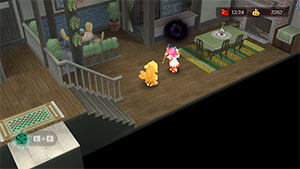
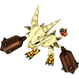

  

# Overview

<table class="dungeonOverview">
  <tr>
    <th>Unlock</th>
    <td class="highlightYellow">Reach Guardian of the Flame 10F (Chapter 2).</td>
  </tr>
  <tr>
    <th>Location</th>
    <td class="highlightYellow">Empty House (Chapter 2+)</td>
  </tr>
</table>

<table class="dungeonTable">
  <tr>
    <th>Title</th>
    <td colspan="3">Haunted Dungeon</td>
  </tr>
  <tr>
    <th>Description</th>
    <td colspan="3">A dungeon filled with undead monsters. You don't recover HP or SP each turn! Tread carefully to make it through!</td>
  </tr>
  <tr>
    <th>Floors</th>
    <td>6F</td>
    <th>Bosses</th>
    <td>5F</td>
  </tr>
  <tr>
    <th>Change Crystals</th>
    <td>0F</td>
    <th>Checkpoints</th>
    <td>None</td>
  </tr>
  <tr>
    <th>Max Level</th>
    <td>20</td>
    <th>Bring Buddy</th>
    <td>Yes</td>
  </tr>
  <tr>
    <th>Bring In Items</th>
    <td>No</td>
    <th>Take Out Items</th>
    <td>No</td>
  </tr>
  <tr>
    <th>Shops/Duels</th>
    <td>No</td>
    <th>Den of Monsters</th>
    <td>No</td>
  </tr>
  <tr>
    <th>Reapers</th>
    <td>Yes</td>
    <th>Bookmark</th>
    <td>No</td>
  </tr>
  <tr>
    <th>Unidentified</th>
    <td colspan="3">None</td>
  </tr>
  <tr>
    <th>Rewards</th>
    <td colspan="3">1.  Shiroma's Memories (6F). 2.  Shiroma added to  Buddy Registry. 3. Dungeon added to  Mirror of Training. 4. Can unlock  The Genius Inventor's Memories. ・ Must also clear Guardian of the Flame.</td>
  </tr>
</table>

# Strategy

[Content]

# Monsters

<ul><li><a href="#monster-table">Monster Table</a></li><li><a href="#monster-details">Monster Details</a></li></ul>

 

 Monster Table 

Monster Colors - Boss F - 　 means field of view is limited. R - 　 means  Reaper can spawn.

<table class="monsterTable">
  <thead>
    <tr>
      <th>F</th>
      <th colspan="5">Monsters</th>
      <th>R</th>
    </tr>
  </thead>
  <tbody>
    <tr class="changeCrystal">
      <td class="centeredText">0</td>
      <td colspan="5" class="centeredText">Change Crystal</td>
      <td></td>
    </tr>
    <tr>
      <td class="centeredText">1</td>
      <td> Ghost (45%)</td>
      <td> Skeleton (45%)</td>
      <td> Sahagin Zombie (10%)</td>
      <td class="highlightGray"></td>
      <td class="highlightGray"></td>
      <td class="highlightReaper"></td>
    </tr>
    <tr>
      <td class="centeredText">2</td>
      <td> Ghost (31%)</td>
      <td> Skeleton (31%)</td>
      <td> Sahagin Zombie (12%)</td>
      <td> Wraith (25%)</td>
      <td class="highlightGray"></td>
      <td class="highlightReaper"></td>
    </tr>
    <tr>
      <td class="centeredText">3</td>
      <td> Ghost (20%)</td>
      <td> Skeleton (20%)</td>
      <td> Sahagin Zombie (20%)</td>
      <td> Wraith (20%)</td>
      <td> Bloodbones (20%)</td>
      <td class="highlightReaper"></td>
    </tr>
    <tr>
      <td class="centeredText">4</td>
      <td> Ghost (20%)</td>
      <td> Skeleton (20%)</td>
      <td> Sahagin Zombie (20%)</td>
      <td> Wraith (20%)</td>
      <td> Bloodbones (20%)</td>
      <td class="highlightReaper"></td>
    </tr>
    <tr>
      <td class="centeredText">5</td>
      <td> Skullhammer</td>
      <td class="highlightGray"></td>
      <td class="highlightGray"></td>
      <td class="highlightGray"></td>
      <td class="highlightGray"></td>
      <td class="highlightGray"></td>
    </tr>
    <tr class="highlightYellow">
      <td class="centeredText">6</td>
      <td colspan="5" class="centeredText"> Shiroma's Memories</td>
      <td></td>
    </tr>
  </tbody>
</table>

 

 Monster Details 

Stat Colors - Hard Mode

### Standard

#### Ghost (1-4F)

<table class="buddyOverview">
  <tr class="noPad">
    <th colspan="13" class="highlightGreen">Stats</th>
  </tr>
  <tr>
    <td rowspan="4"></td>
    <td class="hp">HP</td>
    <td>46 / 57</td>
    <td class="atk">Attack</td>
    <td>24 / 26</td>
    <td class="mag">Magic</td>
    <td>38 / 39</td>
    <th>JP</th>
    <td>-</td>
    <th>Item 1</th>
    <td colspan="3">Wood Saddle (15%)</td>
  </tr>
  <tr>
    <td class="sp">Exp</td>
    <td>78</td>
    <td class="def">Defense</td>
    <td>38 / 39</td>
    <td class="mnd">Mind</td>
    <td>51 / 52</td>
    <th>BP</th>
    <td>3 (50%)</td>
    <th>Item 2</th>
    <td colspan="3">Ether (5%)</td>
  </tr>
  <tr>
    <th>Hit</th>
    <td>95</td>
    <th>Evasion</th>
    <td>8</td>
    <th>Crit</th>
    <td>5</td>
    <th>Gil</th>
    <td>-</td>
    <th>Steal</th>
    <td colspan="3">Ether (30%)</td>
  </tr>
  <tr>
    <th>Lv</th>
    <td>14</td>
    <th>Special</th>
    <td></td>
    <th>Resist</th>
    <td colspan="3"></td>
    <th>Weak</th>
    <td colspan="3"></td>
  </tr>
  <tr>
    <th colspan="13" class="abilityName">Hunger Strike</th>
  </tr>
  <tr class="elementIcon">
    <th>Element</th>
    <td>-</td>
    <th>Range</th>
    <td></td>
    <th>Notes</th>
    <td colspan="8" class="leftText">Lower Food Level by 10.</td>
  </tr>
  <tr>
    <th>Rate / CD</th>
    <td colspan="2">15% / 3T</td>
    <th>Count</th>
    <td>∞</td>
    <th>Multiplier</th>
    <td>x1.0</td>
    <th>Value</th>
    <td>10</td>
    <th>Type</th>
    <td class="leftText">Magic</td>
    <th>Calc</th>
    <td class="leftText">Fixed</td>
  </tr>
</table>

#### Skeleton (1-4F)

<table class="buddyOverview">
  <tr class="noPad">
    <th colspan="13" class="highlightGreen">Stats</th>
  </tr>
  <tr>
    <td rowspan="4"></td>
    <td class="hp">HP</td>
    <td>46 / 57</td>
    <td class="atk">Attack</td>
    <td>32 / 34</td>
    <td class="mag">Magic</td>
    <td>38 / 39</td>
    <th>JP</th>
    <td>-</td>
    <th>Item 1</th>
    <td colspan="3">Wood Talons (15%)</td>
  </tr>
  <tr>
    <td class="sp">Exp</td>
    <td>98</td>
    <td class="def">Defense</td>
    <td>53 / 54</td>
    <td class="mnd">Mind</td>
    <td>31 / 32</td>
    <th>BP</th>
    <td>3 (50%)</td>
    <th>Item 2</th>
    <td colspan="3">Potion (5%)</td>
  </tr>
  <tr>
    <th>Hit</th>
    <td>95</td>
    <th>Evasion</th>
    <td>4</td>
    <th>Crit</th>
    <td>5</td>
    <th>Gil</th>
    <td>-</td>
    <th>Steal</th>
    <td colspan="3">Potion (30%)</td>
  </tr>
  <tr>
    <th>Lv</th>
    <td>14</td>
    <th>Special</th>
    <td></td>
    <th>Resist</th>
    <td colspan="3"></td>
    <th>Weak</th>
    <td colspan="3"></td>
  </tr>
  <tr>
    <th colspan="13" class="abilityName">Poison Slash</th>
  </tr>
  <tr class="elementIcon">
    <th>Element</th>
    <td>-</td>
    <th>Range</th>
    <td></td>
    <th>Notes</th>
    <td colspan="8" class="leftText">Deal damage + Poison to a target 1 tile ahead.</td>
  </tr>
  <tr>
    <th>Rate / CD</th>
    <td colspan="2">15% / 3T</td>
    <th>Count</th>
    <td>∞</td>
    <th>Multiplier</th>
    <td>x1.0</td>
    <th>Value</th>
    <td>0</td>
    <th>Type</th>
    <td class="leftText">Physical</td>
    <th>Calc</th>
    <td class="leftText">Stat</td>
  </tr>
</table>

#### Sahagin Zombie (1-4F)

<table class="buddyOverview">
  <tr class="noPad">
    <th colspan="13" class="highlightGreen">Stats</th>
  </tr>
  <tr>
    <td rowspan="4"></td>
    <td class="hp">HP</td>
    <td>62 / 76</td>
    <td class="atk">Attack</td>
    <td>32 / 34</td>
    <td class="mag">Magic</td>
    <td>30 / 31</td>
    <th>JP</th>
    <td>-</td>
    <th>Item 1</th>
    <td colspan="3">Bronze Saddle (20%)</td>
  </tr>
  <tr>
    <td class="sp">Exp</td>
    <td>117</td>
    <td class="def">Defense</td>
    <td>45 / 46</td>
    <td class="mnd">Mind</td>
    <td>39 / 40</td>
    <th>BP</th>
    <td>3 (50%)</td>
    <th>Item 2</th>
    <td colspan="3">Bronze Talons (20%)</td>
  </tr>
  <tr>
    <th>Hit</th>
    <td>95</td>
    <th>Evasion</th>
    <td>4</td>
    <th>Crit</th>
    <td>5</td>
    <th>Gil</th>
    <td>-</td>
    <th>Steal</th>
    <td colspan="3">Antidote (60%)</td>
  </tr>
  <tr>
    <th>Lv</th>
    <td>14</td>
    <th>Special</th>
    <td></td>
    <th>Resist</th>
    <td colspan="3">-</td>
    <th>Weak</th>
    <td colspan="3"></td>
  </tr>
  <tr>
    <th colspan="13" class="abilityName">Bubble Shower</th>
  </tr>
  <tr class="elementIcon">
    <th>Element</th>
    <td></td>
    <th>Range</th>
    <td></td>
    <th>Notes</th>
    <td colspan="8" class="leftText">Deal water damage to a target up to 3 tiles ahead.</td>
  </tr>
  <tr>
    <th>Rate / CD</th>
    <td colspan="2">15% / 0T</td>
    <th>Count</th>
    <td>∞</td>
    <th>Multiplier</th>
    <td>x1.0</td>
    <th>Value</th>
    <td>0</td>
    <th>Type</th>
    <td class="leftText">Magic</td>
    <th>Calc</th>
    <td class="leftText">Stat</td>
  </tr>
</table>

#### Wraith (2-4F)

<table class="buddyOverview">
  <tr class="noPad">
    <th colspan="13" class="highlightGreen">Stats</th>
  </tr>
  <tr>
    <td rowspan="4"></td>
    <td class="hp">HP</td>
    <td>46 / 57</td>
    <td class="atk">Attack</td>
    <td>24 / 26</td>
    <td class="mag">Magic</td>
    <td>38 / 39</td>
    <th>JP</th>
    <td>-</td>
    <th>Item 1</th>
    <td colspan="3">Wood Saddle (15%)</td>
  </tr>
  <tr>
    <td class="sp">Exp</td>
    <td>78</td>
    <td class="def">Defense</td>
    <td>38 / 39</td>
    <td class="mnd">Mind</td>
    <td>51 / 52</td>
    <th>BP</th>
    <td>3 (50%)</td>
    <th>Item 2</th>
    <td colspan="3">Ether (5%)</td>
  </tr>
  <tr>
    <th>Hit</th>
    <td>95</td>
    <th>Evasion</th>
    <td>8</td>
    <th>Crit</th>
    <td>5</td>
    <th>Gil</th>
    <td>-</td>
    <th>Steal</th>
    <td colspan="3">Ether (30%)</td>
  </tr>
  <tr>
    <th>Lv</th>
    <td>14</td>
    <th>Special</th>
    <td></td>
    <th>Resist</th>
    <td colspan="3"></td>
    <th>Weak</th>
    <td colspan="3"></td>
  </tr>
  <tr>
    <th colspan="13" class="abilityName">Hunger Strike</th>
  </tr>
  <tr class="elementIcon">
    <th>Element</th>
    <td>-</td>
    <th>Range</th>
    <td></td>
    <th>Notes</th>
    <td colspan="8" class="leftText">Lower Food Level by 10.</td>
  </tr>
  <tr>
    <th>Rate / CD</th>
    <td colspan="2">15% / 3T</td>
    <th>Count</th>
    <td>∞</td>
    <th>Multiplier</th>
    <td>x1.0</td>
    <th>Value</th>
    <td>10</td>
    <th>Type</th>
    <td class="leftText">Magic</td>
    <th>Calc</th>
    <td class="leftText">Fixed</td>
  </tr>
  <tr>
    <th colspan="13" class="abilityName">Rot-a-lot</th>
  </tr>
  <tr class="elementIcon">
    <th>Element</th>
    <td>-</td>
    <th>Range</th>
    <td></td>
    <th>Notes</th>
    <td colspan="8" class="leftText">Transform a Greens category item into Stinky Greens.</td>
  </tr>
  <tr>
    <th>Rate / CD</th>
    <td colspan="2">15% / 3T</td>
    <th>Count</th>
    <td>∞</td>
    <th>Multiplier</th>
    <td>x1.0</td>
    <th>Value</th>
    <td>0</td>
    <th>Type</th>
    <td class="leftText">Other</td>
    <th>Calc</th>
    <td class="leftText">None</td>
  </tr>
</table>

#### Bloodbones (3-4F)

<table class="buddyOverview">
  <tr class="noPad">
    <th colspan="13" class="highlightGreen">Stats</th>
  </tr>
  <tr>
    <td rowspan="4"></td>
    <td class="hp">HP</td>
    <td>46 / 57</td>
    <td class="atk">Attack</td>
    <td>32 / 34</td>
    <td class="mag">Magic</td>
    <td>38 / 39</td>
    <th>JP</th>
    <td>-</td>
    <th>Item 1</th>
    <td colspan="3">Wood Talons (15%)</td>
  </tr>
  <tr>
    <td class="sp">Exp</td>
    <td>98</td>
    <td class="def">Defense</td>
    <td>53 / 54</td>
    <td class="mnd">Mind</td>
    <td>31 / 32</td>
    <th>BP</th>
    <td>3 (50%)</td>
    <th>Item 2</th>
    <td colspan="3">Potion (5%)</td>
  </tr>
  <tr>
    <th>Hit</th>
    <td>95</td>
    <th>Evasion</th>
    <td>4</td>
    <th>Crit</th>
    <td>5</td>
    <th>Gil</th>
    <td>-</td>
    <th>Steal</th>
    <td colspan="3">Potion (30%)</td>
  </tr>
  <tr>
    <th>Lv</th>
    <td>14</td>
    <th>Special</th>
    <td></td>
    <th>Resist</th>
    <td colspan="3"></td>
    <th>Weak</th>
    <td colspan="3"></td>
  </tr>
  <tr>
    <th colspan="13" class="abilityName">Poison Slash</th>
  </tr>
  <tr class="elementIcon">
    <th>Element</th>
    <td>-</td>
    <th>Range</th>
    <td></td>
    <th>Notes</th>
    <td colspan="8" class="leftText">Deal damage + Poison to a target 1 tile ahead.</td>
  </tr>
  <tr>
    <th>Rate / CD</th>
    <td colspan="2">15% / 3T</td>
    <th>Count</th>
    <td>∞</td>
    <th>Multiplier</th>
    <td>x1.0</td>
    <th>Value</th>
    <td>0</td>
    <th>Type</th>
    <td class="leftText">Physical</td>
    <th>Calc</th>
    <td class="leftText">Stat</td>
  </tr>
  <tr>
    <th colspan="13" class="abilityName">Horror Cloud</th>
  </tr>
  <tr class="elementIcon">
    <th>Element</th>
    <td>-</td>
    <th>Range</th>
    <td></td>
    <th>Notes</th>
    <td colspan="8" class="leftText">Inflict Slow on a target 1 tile ahead.</td>
  </tr>
  <tr>
    <th>Rate / CD</th>
    <td colspan="2">15% / 3T</td>
    <th>Count</th>
    <td>∞</td>
    <th>Multiplier</th>
    <td>x1.0</td>
    <th>Value</th>
    <td>0</td>
    <th>Type</th>
    <td class="leftText">Other</td>
    <th>Calc</th>
    <td class="leftText">None</td>
  </tr>
</table>

### Boss

#### Skullhammer (5F)

<table class="buddyOverview">
  <tr class="noPad">
    <th colspan="14" class="highlightBoss">Stats</th>
  </tr>
  <tr>
    <td rowspan="4"></td>
    <td class="hp">HP</td>
    <td>600 / 719</td>
    <td class="atk">Attack</td>
    <td>41 / 41</td>
    <td class="mag">Magic</td>
    <td>39 / 39</td>
    <th>JP</th>
    <td colspan="2">-</td>
    <th>Item 1</th>
    <td colspan="5">-</td>
  </tr>
  <tr>
    <td class="sp">Exp</td>
    <td>0</td>
    <td class="def">Defense</td>
    <td>22 / 22</td>
    <td class="mnd">Mind</td>
    <td>37 / 37</td>
    <th>BP</th>
    <td colspan="2">1 (100%)</td>
    <th>Item 2</th>
    <td colspan="5">-</td>
  </tr>
  <tr>
    <th>Hit</th>
    <td>90</td>
    <th>Evasion</th>
    <td>5</td>
    <th>Crit</th>
    <td>5</td>
    <th>Gil</th>
    <td colspan="2">-</td>
    <th>Steal</th>
    <td colspan="5">Warp Wings (100%)</td>
  </tr>
  <tr>
    <th>Lv</th>
    <td>20</td>
    <th>Special</th>
    <td></td>
    <th>Resist</th>
    <td colspan="4">-</td>
    <th>Weak</th>
    <td colspan="5">-</td>
  </tr>
  <tr>
    <th colspan="14" class="statusResists">Status Resistances</th>
  </tr>
  <tr>
    <th></th>
    <th></th>
    <th></th>
    <th></th>
    <th></th>
    <th></th>
    <th></th>
    <th></th>
    <th></th>
    <th colspan="2">Knockback</th>
    <th>Stun</th>
    <th>Warp</th>
    <th>Ratio</th>
  </tr>
  <tr>
    <td>◯</td>
    <td>✕</td>
    <td>✕</td>
    <td>◯</td>
    <td>◯</td>
    <td>◯</td>
    <td>✕</td>
    <td>◯</td>
    <td>◯</td>
    <td colspan="2">◯</td>
    <td>◯</td>
    <td>◯</td>
    <td>◯</td>
  </tr>
  <tr>
    <th colspan="14" class="abilityName">Hammer Whirl</th>
  </tr>
  <tr class="elementIcon">
    <th>Element</th>
    <td>-</td>
    <th>Range</th>
    <td></td>
    <th>Notes</th>
    <td colspan="13" class="leftText">Deal damage to targets in a 1 tile radius.</td>
  </tr>
  <tr>
    <th>Rate / CD</th>
    <td colspan="2">15% | 15% / 0T</td>
    <th>Count</th>
    <td>∞</td>
    <th>Multiplier</th>
    <td>x1.0</td>
    <th>Value</th>
    <td>0</td>
    <th>Type</th>
    <td colspan="2" class="leftText">Physical</td>
    <th>Calc</th>
    <td class="leftText">Stat</td>
  </tr>
  <tr>
    <th colspan="14" class="abilityName">Hammer Bash</th>
  </tr>
  <tr class="elementIcon">
    <th>Element</th>
    <td>-</td>
    <th>Range</th>
    <td></td>
    <th>Notes</th>
    <td colspan="13" class="leftText">Deal damage to a target 1 tile ahead.</td>
  </tr>
  <tr>
    <th>Rate / CD</th>
    <td colspan="2">15% | 15% / 0T</td>
    <th>Count</th>
    <td>∞</td>
    <th>Multiplier</th>
    <td>x2.0</td>
    <th>Value</th>
    <td>0</td>
    <th>Type</th>
    <td colspan="2" class="leftText">Physical</td>
    <th>Calc</th>
    <td class="leftText">Stat</td>
  </tr>
  <tr>
    <th colspan="14" class="abilityName">Quake</th>
  </tr>
  <tr class="elementIcon">
    <th>Element</th>
    <td></td>
    <th>Range</th>
    <td></td>
    <th>Notes</th>
    <td colspan="13" class="leftText">Deal earth damage to targets in a 3 tile radius.</td>
  </tr>
  <tr>
    <th>Rate / CD</th>
    <td colspan="2">5% | 30% / 1T</td>
    <th>Count</th>
    <td>∞</td>
    <th>Multiplier</th>
    <td>x1.0</td>
    <th>Value</th>
    <td>12</td>
    <th>Type</th>
    <td colspan="2" class="leftText">Magic</td>
    <th>Calc</th>
    <td class="leftText">Stat</td>
  </tr>
</table>

#### Skull (5F)

<table class="buddyOverview">
  <tr class="noPad">
    <th colspan="14" class="highlightBoss">Stats</th>
  </tr>
  <tr>
    <td rowspan="4"></td>
    <td class="hp">HP</td>
    <td>150 / 179</td>
    <td class="atk">Attack</td>
    <td>41 / 41</td>
    <td class="mag">Magic</td>
    <td>39 / 39</td>
    <th>JP</th>
    <td colspan="2">-</td>
    <th>Item 1</th>
    <td colspan="5">-</td>
  </tr>
  <tr>
    <td class="sp">Exp</td>
    <td>0</td>
    <td class="def">Defense</td>
    <td>22 / 22</td>
    <td class="mnd">Mind</td>
    <td>37 / 37</td>
    <th>BP</th>
    <td colspan="2">-</td>
    <th>Item 2</th>
    <td colspan="5">-</td>
  </tr>
  <tr>
    <th>Hit</th>
    <td>90</td>
    <th>Evasion</th>
    <td>5</td>
    <th>Crit</th>
    <td>5</td>
    <th>Gil</th>
    <td colspan="2">-</td>
    <th>Steal</th>
    <td colspan="5">-</td>
  </tr>
  <tr>
    <th>Lv</th>
    <td>20</td>
    <th>Special</th>
    <td></td>
    <th>Resist</th>
    <td colspan="4">-</td>
    <th>Weak</th>
    <td colspan="5">-</td>
  </tr>
  <tr>
    <th colspan="14" class="statusResists">Status Resistances</th>
  </tr>
  <tr>
    <th></th>
    <th></th>
    <th></th>
    <th></th>
    <th></th>
    <th></th>
    <th></th>
    <th></th>
    <th></th>
    <th colspan="2">Knockback</th>
    <th>Stun</th>
    <th>Warp</th>
    <th>Ratio</th>
  </tr>
  <tr>
    <td>◯</td>
    <td>✕</td>
    <td>✕</td>
    <td>◯</td>
    <td>◯</td>
    <td>◯</td>
    <td>✕</td>
    <td>◯</td>
    <td>◯</td>
    <td colspan="2">◯</td>
    <td>◯</td>
    <td>◯</td>
    <td>◯</td>
  </tr>
</table>

#### Right Hammer (5F)

<table class="buddyOverview">
  <tr class="noPad">
    <th colspan="14" class="highlightBoss">Stats</th>
  </tr>
  <tr>
    <td rowspan="4"></td>
    <td class="hp">HP</td>
    <td>150 / 179</td>
    <td class="atk">Attack</td>
    <td>41 / 41</td>
    <td class="mag">Magic</td>
    <td>39 / 39</td>
    <th>JP</th>
    <td colspan="2">-</td>
    <th>Item 1</th>
    <td colspan="5">-</td>
  </tr>
  <tr>
    <td class="sp">Exp</td>
    <td>0</td>
    <td class="def">Defense</td>
    <td>22 / 22</td>
    <td class="mnd">Mind</td>
    <td>37 / 37</td>
    <th>BP</th>
    <td colspan="2">-</td>
    <th>Item 2</th>
    <td colspan="5">-</td>
  </tr>
  <tr>
    <th>Hit</th>
    <td>90</td>
    <th>Evasion</th>
    <td>5</td>
    <th>Crit</th>
    <td>5</td>
    <th>Gil</th>
    <td colspan="2">-</td>
    <th>Steal</th>
    <td colspan="5">-</td>
  </tr>
  <tr>
    <th>Lv</th>
    <td>20</td>
    <th>Special</th>
    <td></td>
    <th>Resist</th>
    <td colspan="4">-</td>
    <th>Weak</th>
    <td colspan="5">-</td>
  </tr>
  <tr>
    <th colspan="14" class="statusResists">Status Resistances</th>
  </tr>
  <tr>
    <th></th>
    <th></th>
    <th></th>
    <th></th>
    <th></th>
    <th></th>
    <th></th>
    <th></th>
    <th></th>
    <th colspan="2">Knockback</th>
    <th>Stun</th>
    <th>Warp</th>
    <th>Ratio</th>
  </tr>
  <tr>
    <td>◯</td>
    <td>✕</td>
    <td>✕</td>
    <td>◯</td>
    <td>◯</td>
    <td>◯</td>
    <td>✕</td>
    <td>◯</td>
    <td>◯</td>
    <td colspan="2">◯</td>
    <td>◯</td>
    <td>◯</td>
    <td>◯</td>
  </tr>
</table>

#### Left Hammer (5F)

<table class="buddyOverview">
  <tr class="noPad">
    <th colspan="14" class="highlightBoss">Stats</th>
  </tr>
  <tr>
    <td rowspan="4"></td>
    <td class="hp">HP</td>
    <td>150 / 179</td>
    <td class="atk">Attack</td>
    <td>41 / 41</td>
    <td class="mag">Magic</td>
    <td>39 / 39</td>
    <th>JP</th>
    <td colspan="2">-</td>
    <th>Item 1</th>
    <td colspan="5">-</td>
  </tr>
  <tr>
    <td class="sp">Exp</td>
    <td>0</td>
    <td class="def">Defense</td>
    <td>22 / 22</td>
    <td class="mnd">Mind</td>
    <td>37 / 37</td>
    <th>BP</th>
    <td colspan="2">-</td>
    <th>Item 2</th>
    <td colspan="5">-</td>
  </tr>
  <tr>
    <th>Hit</th>
    <td>90</td>
    <th>Evasion</th>
    <td>5</td>
    <th>Crit</th>
    <td>5</td>
    <th>Gil</th>
    <td colspan="2">-</td>
    <th>Steal</th>
    <td colspan="5">-</td>
  </tr>
  <tr>
    <th>Lv</th>
    <td>20</td>
    <th>Special</th>
    <td></td>
    <th>Resist</th>
    <td colspan="4">-</td>
    <th>Weak</th>
    <td colspan="5">-</td>
  </tr>
  <tr>
    <th colspan="14" class="statusResists">Status Resistances</th>
  </tr>
  <tr>
    <th></th>
    <th></th>
    <th></th>
    <th></th>
    <th></th>
    <th></th>
    <th></th>
    <th></th>
    <th></th>
    <th colspan="2">Knockback</th>
    <th>Stun</th>
    <th>Warp</th>
    <th>Ratio</th>
  </tr>
  <tr>
    <td>◯</td>
    <td>✕</td>
    <td>✕</td>
    <td>◯</td>
    <td>◯</td>
    <td>◯</td>
    <td>✕</td>
    <td>◯</td>
    <td>◯</td>
    <td colspan="2">◯</td>
    <td>◯</td>
    <td>◯</td>
    <td>◯</td>
  </tr>
</table>

#### Skull Heart (5F)

<table class="buddyOverview">
  <tr class="noPad">
    <th colspan="14" class="highlightBoss">Stats</th>
  </tr>
  <tr>
    <td rowspan="4"></td>
    <td class="hp">HP</td>
    <td>150 / 179</td>
    <td class="atk">Attack</td>
    <td>41 / 41</td>
    <td class="mag">Magic</td>
    <td>39 / 39</td>
    <th>JP</th>
    <td colspan="2">-</td>
    <th>Item 1</th>
    <td colspan="5">-</td>
  </tr>
  <tr>
    <td class="sp">Exp</td>
    <td>0</td>
    <td class="def">Defense</td>
    <td>22 / 22</td>
    <td class="mnd">Mind</td>
    <td>37 / 37</td>
    <th>BP</th>
    <td colspan="2">1 (100%)</td>
    <th>Item 2</th>
    <td colspan="5">-</td>
  </tr>
  <tr>
    <th>Hit</th>
    <td>90</td>
    <th>Evasion</th>
    <td>5</td>
    <th>Crit</th>
    <td>5</td>
    <th>Gil</th>
    <td colspan="2">-</td>
    <th>Steal</th>
    <td colspan="5">-</td>
  </tr>
  <tr>
    <th>Lv</th>
    <td>20</td>
    <th>Special</th>
    <td></td>
    <th>Resist</th>
    <td colspan="4">-</td>
    <th>Weak</th>
    <td colspan="5">-</td>
  </tr>
  <tr>
    <th colspan="14" class="statusResists">Status Resistances</th>
  </tr>
  <tr>
    <th></th>
    <th></th>
    <th></th>
    <th></th>
    <th></th>
    <th></th>
    <th></th>
    <th></th>
    <th></th>
    <th colspan="2">Knockback</th>
    <th>Stun</th>
    <th>Warp</th>
    <th>Ratio</th>
  </tr>
  <tr>
    <td>✕</td>
    <td>✕</td>
    <td>✕</td>
    <td>✕</td>
    <td>✕</td>
    <td>✕</td>
    <td>✕</td>
    <td>✕</td>
    <td>✕</td>
    <td colspan="2">◯</td>
    <td>✕</td>
    <td>◯</td>
    <td>◯</td>
  </tr>
  <tr>
    <th colspan="14" class="abilityName">Recombine</th>
  </tr>
  <tr class="elementIcon">
    <th>Element</th>
    <td>-</td>
    <th>Range</th>
    <td></td>
    <th>Notes</th>
    <td colspan="13" class="leftText">Reforms Skullhammer, only used if parts aren't destroyed.</td>
  </tr>
  <tr>
    <th>Rate / CD</th>
    <td colspan="2">100% | 100% / 0T</td>
    <th>Count</th>
    <td>∞</td>
    <th>Multiplier</th>
    <td>x1.0</td>
    <th>Value</th>
    <td>0</td>
    <th>Type</th>
    <td colspan="2" class="leftText">Other</td>
    <th>Calc</th>
    <td class="leftText">None</td>
  </tr>
</table>

# Items

<ul><li><a href="#floor">Floor</a></li><li><a href="#drop-/-steal">Drop / Steal</a></li></ul>

 

 Floor 

See the dungeon data JSON file for exact item spawn rates per floor.

<table class="dungeonItemTable">
  <tr>
    <th colspan="3" class="highlightPurple"> Talons</th>
  </tr>
  <tr>
    <th>Item</th>
    <th>Floor</th>
    <th>Rate Range</th>
  </tr>
  <tr>
    <td>Wood Talons</td>
    <td>1-4</td>
    <td>13.64%</td>
  </tr>
  <tr>
    <td>Bronze Talons</td>
    <td>1-4</td>
    <td>6.82%</td>
  </tr>
  <tr>
    <th colspan="3" class="highlightPurple"> Saddles</th>
  </tr>
  <tr>
    <th>Item</th>
    <th>Floor</th>
    <th>Rate Range</th>
  </tr>
  <tr>
    <td>Wood Saddle</td>
    <td>1-4</td>
    <td>13.64%</td>
  </tr>
  <tr>
    <td>Bronze Saddle</td>
    <td>1-4</td>
    <td>6.82%</td>
  </tr>
  <tr>
    <th colspan="3" class="highlightPurple"> Greens</th>
  </tr>
  <tr>
    <th>Item</th>
    <th>Floor</th>
    <th>Rate Range</th>
  </tr>
  <tr>
    <td>Gysahl Greens</td>
    <td>1-4</td>
    <td>9.09%</td>
  </tr>
  <tr>
    <th colspan="3" class="highlightPurple"> Medicines</th>
  </tr>
  <tr>
    <th>Item</th>
    <th>Floor</th>
    <th>Rate Range</th>
  </tr>
  <tr>
    <td>Potion</td>
    <td>1-4</td>
    <td>22.73%</td>
  </tr>
  <tr>
    <td>Ether</td>
    <td>1-4</td>
    <td>18.18%</td>
  </tr>
  <tr>
    <td>Antidote</td>
    <td>1-4</td>
    <td>9.09%</td>
  </tr>
</table>

 

 Drop / Steal 

Monster Colors - Boss

<table class="dungeonDropTable">
  <thead>
    <tr>
      <th>Floor</th>
      <th>Monster</th>
      <th>Drop 1</th>
      <th>Drop 2</th>
      <th>Steal</th>
    </tr>
  </thead>
  <tbody>
    <tr>
      <td>1-4</td>
      <td> Ghost</td>
      <td>Wood Saddle (15%)</td>
      <td>Ether (5%)</td>
      <td>Ether (30%)</td>
    </tr>
    <tr>
      <td>1-4</td>
      <td> Skeleton</td>
      <td>Wood Talons (15%)</td>
      <td>Potion (5%)</td>
      <td>Potion (30%)</td>
    </tr>
    <tr>
      <td>1-4</td>
      <td> Sahagin Zombie</td>
      <td>Bronze Saddle (20%)</td>
      <td>Bronze Talons (20%)</td>
      <td>Antidote (60%)</td>
    </tr>
    <tr>
      <td>2-4</td>
      <td> Wraith</td>
      <td>Wood Saddle (15%)</td>
      <td>Ether (5%)</td>
      <td>Ether (30%)</td>
    </tr>
    <tr>
      <td>3-4</td>
      <td> Bloodbones</td>
      <td>Wood Talons (15%)</td>
      <td>Potion (5%)</td>
      <td>Potion (30%)</td>
    </tr>
    <tr>
      <td>5</td>
      <td> Skullhammer</td>
      <td>-</td>
      <td>-</td>
      <td>Warp Wings (100%)</td>
    </tr>
    <tr>
      <td>5</td>
      <td> Skull</td>
      <td>-</td>
      <td>-</td>
      <td>-</td>
    </tr>
    <tr>
      <td>5</td>
      <td> Right Hammer</td>
      <td>-</td>
      <td>-</td>
      <td>-</td>
    </tr>
    <tr>
      <td>5</td>
      <td> Left Hammer</td>
      <td>-</td>
      <td>-</td>
      <td>-</td>
    </tr>
    <tr>
      <td>5</td>
      <td> Skull Heart</td>
      <td>-</td>
      <td>-</td>
      <td>-</td>
    </tr>
  </tbody>
</table>
