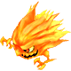

  

# Overview

<table class="dungeonOverview">
  <tr>
    <th>Unlock</th>
    <td class="highlightYellow">Clear Harry's Memories (Chapter 3).</td>
  </tr>
  <tr>
    <th>Location</th>
    <td class="highlightYellow">???</td>
  </tr>
</table>

<table class="dungeonTable">
  <tr>
    <th>Title</th>
    <td colspan="3">Watch Your HP</td>
  </tr>
  <tr>
    <th>Description</th>
    <td colspan="3">You are stuck at 1 HP. Avoid monster attacks and tread carefully to make it through!</td>
  </tr>
  <tr>
    <th>Floors</th>
    <td>8F</td>
    <th>Bosses</th>
    <td>7F</td>
  </tr>
  <tr>
    <th>Change Crystals</th>
    <td>0F</td>
    <th>Checkpoints</th>
    <td>None</td>
  </tr>
  <tr>
    <th>Max Level</th>
    <td>20</td>
    <th>Bring Buddy</th>
    <td>No</td>
  </tr>
  <tr>
    <th>Bring In Items</th>
    <td>No</td>
    <th>Take Out Items</th>
    <td>No</td>
  </tr>
  <tr>
    <th>Shops/Duels</th>
    <td>No</td>
    <th>Den of Monsters</th>
    <td>No</td>
  </tr>
  <tr>
    <th>Reapers</th>
    <td>Yes</td>
    <th>Bookmark</th>
    <td>No</td>
  </tr>
  <tr>
    <th>Unidentified</th>
    <td colspan="3">Equipment, Consumables</td>
  </tr>
  <tr>
    <th>Rewards</th>
    <td colspan="3">1.  Charlotte's Memories (8F). 2. Dungeon added to  Mirror of Training.</td>
  </tr>
</table>

# Strategy

[Content]

# Monsters

<ul><li><a href="#monster-table">Monster Table</a></li><li><a href="#monster-details">Monster Details</a></li></ul>

 

 Monster Table 

Monster Colors - Boss F - 　 means field of view is limited. R - 　 means  Reaper can spawn.

<table class="monsterTable">
  <thead>
    <tr>
      <th>F</th>
      <th colspan="6">Monsters</th>
      <th>R</th>
    </tr>
  </thead>
  <tbody>
    <tr class="changeCrystal">
      <td class="centeredText">0</td>
      <td colspan="6" class="centeredText">Change Crystal</td>
      <td></td>
    </tr>
    <tr>
      <td class="centeredText highlightFog">1</td>
      <td> Steel Bat (25%)</td>
      <td> Turtle (25%)</td>
      <td> Goblin Guard (25%)</td>
      <td> Bomb (25%)</td>
      <td class="highlightGray"></td>
      <td class="highlightGray"></td>
      <td class="highlightReaper"></td>
    </tr>
    <tr>
      <td class="centeredText highlightFog">2</td>
      <td> Steel Bat (25%)</td>
      <td> Turtle (25%)</td>
      <td> Goblin Guard (25%)</td>
      <td> Bomb (25%)</td>
      <td class="highlightGray"></td>
      <td class="highlightGray"></td>
      <td class="highlightReaper"></td>
    </tr>
    <tr>
      <td class="centeredText highlightFog">3</td>
      <td> Steel Bat (17%)</td>
      <td> Turtle (17%)</td>
      <td> Goblin Guard (17%)</td>
      <td> Bomb (17%)</td>
      <td> Sahagin Zombie (17%)</td>
      <td> Iron Giant (17%)</td>
      <td class="highlightReaper"></td>
    </tr>
    <tr>
      <td class="centeredText highlightFog">4</td>
      <td> Steel Bat (17%)</td>
      <td> Turtle (17%)</td>
      <td> Water Elemental (17%)</td>
      <td> Bomb (17%)</td>
      <td> Sahagin Zombie (17%)</td>
      <td> Iron Giant (17%)</td>
      <td class="highlightReaper"></td>
    </tr>
    <tr>
      <td class="centeredText highlightFog">5</td>
      <td class="highlightGray"></td>
      <td> Turtle (20%)</td>
      <td> Water Elemental (20%)</td>
      <td> Bomb (20%)</td>
      <td> Sahagin Zombie (20%)</td>
      <td> Iron Giant (20%)</td>
      <td class="highlightReaper"></td>
    </tr>
    <tr>
      <td class="centeredText highlightFog">6</td>
      <td class="highlightGray"></td>
      <td> Turtle (20%)</td>
      <td> Water Elemental (20%)</td>
      <td> Bomb (20%)</td>
      <td> Sahagin Zombie (20%)</td>
      <td> Iron Giant (20%)</td>
      <td class="highlightReaper"></td>
    </tr>
    <tr>
      <td class="centeredText">7</td>
      <td> Iron Giant Shade</td>
      <td class="highlightGray"></td>
      <td class="highlightGray"></td>
      <td class="highlightGray"></td>
      <td class="highlightGray"></td>
      <td class="highlightGray"></td>
      <td class="highlightGray"></td>
    </tr>
    <tr class="highlightYellow">
      <td class="centeredText">8</td>
      <td colspan="6" class="centeredText"> Charlotte's Memories</td>
      <td></td>
    </tr>
  </tbody>
</table>

 

 Monster Details 

Stat Colors - Hard Mode

### Standard

#### Goblin Guard (1-3F)

<table class="buddyOverview">
  <tr class="noPad">
    <th colspan="13" class="highlightGreen">Stats</th>
  </tr>
  <tr>
    <td rowspan="4"></td>
    <td class="hp">HP</td>
    <td>38 / 50</td>
    <td class="atk">Attack</td>
    <td>6 / 8</td>
    <td class="mag">Magic</td>
    <td>9 / 10</td>
    <th>JP</th>
    <td>-</td>
    <th>Item 1</th>
    <td colspan="3">Hi-Ether (10%)</td>
  </tr>
  <tr>
    <td class="sp">Exp</td>
    <td>8</td>
    <td class="def">Defense</td>
    <td>31 / 32</td>
    <td class="mnd">Mind</td>
    <td>26 / 27</td>
    <th>BP</th>
    <td>3 (50%)</td>
    <th>Item 2</th>
    <td colspan="3">Protect Book (5%)</td>
  </tr>
  <tr>
    <th>Hit</th>
    <td>95</td>
    <th>Evasion</th>
    <td>4</td>
    <th>Crit</th>
    <td>20</td>
    <th>Gil</th>
    <td>-</td>
    <th>Steal</th>
    <td colspan="3">Protect Book (100%)</td>
  </tr>
  <tr>
    <th>Lv</th>
    <td>1</td>
    <th>Special</th>
    <td>-</td>
    <th>Resist</th>
    <td colspan="3"></td>
    <th>Weak</th>
    <td colspan="3"></td>
  </tr>
  <tr>
    <th colspan="13" class="abilityName">Goblin Punch</th>
  </tr>
  <tr class="elementIcon">
    <th>Element</th>
    <td>-</td>
    <th>Range</th>
    <td></td>
    <th>Notes</th>
    <td colspan="8" class="leftText">Deal damage to a target 1 tile ahead.</td>
  </tr>
  <tr>
    <th>Rate / CD</th>
    <td colspan="2">25% / 0T</td>
    <th>Count</th>
    <td>∞</td>
    <th>Multiplier</th>
    <td>x2.0</td>
    <th>Value</th>
    <td>0</td>
    <th>Type</th>
    <td class="leftText">Physical</td>
    <th>Calc</th>
    <td class="leftText">Stat</td>
  </tr>
</table>

#### Steel Bat (1-4F)

<table class="buddyOverview">
  <tr class="noPad">
    <th colspan="13" class="highlightGreen">Stats</th>
  </tr>
  <tr>
    <td rowspan="4"></td>
    <td class="hp">HP</td>
    <td>20 / 26</td>
    <td class="atk">Attack</td>
    <td>3 / 5</td>
    <td class="mag">Magic</td>
    <td>17 / 18</td>
    <th>JP</th>
    <td>-</td>
    <th>Item 1</th>
    <td colspan="3">Potion (20%)</td>
  </tr>
  <tr>
    <td class="sp">Exp</td>
    <td>6</td>
    <td class="def">Defense</td>
    <td>24 / 25</td>
    <td class="mnd">Mind</td>
    <td>38 / 39</td>
    <th>BP</th>
    <td>3 (50%)</td>
    <th>Item 2</th>
    <td colspan="3">Fire Book (5%)</td>
  </tr>
  <tr>
    <th>Hit</th>
    <td>95</td>
    <th>Evasion</th>
    <td>8</td>
    <th>Crit</th>
    <td>5</td>
    <th>Gil</th>
    <td>-</td>
    <th>Steal</th>
    <td colspan="3">Evasion Collar (100%)</td>
  </tr>
  <tr>
    <th>Lv</th>
    <td>1</td>
    <th>Special</th>
    <td></td>
    <th>Resist</th>
    <td colspan="3"></td>
    <th>Weak</th>
    <td colspan="3"></td>
  </tr>
  <tr>
    <th colspan="13" class="abilityName">Blood Drain</th>
  </tr>
  <tr class="elementIcon">
    <th>Element</th>
    <td>-</td>
    <th>Range</th>
    <td></td>
    <th>Notes</th>
    <td colspan="8" class="leftText">Drain HP from a target 1 tile ahead.</td>
  </tr>
  <tr>
    <th>Rate / CD</th>
    <td colspan="2">25% / 3T</td>
    <th>Count</th>
    <td>∞</td>
    <th>Multiplier</th>
    <td>x1.0</td>
    <th>Value</th>
    <td>0</td>
    <th>Type</th>
    <td class="leftText">Magic</td>
    <th>Calc</th>
    <td class="leftText">Stat</td>
  </tr>
</table>

#### Turtle (1-6F)

<table class="buddyOverview">
  <tr class="noPad">
    <th colspan="13" class="highlightGreen">Stats</th>
  </tr>
  <tr>
    <td rowspan="4"></td>
    <td class="hp">HP</td>
    <td>38 / 50</td>
    <td class="atk">Attack</td>
    <td>11 / 13</td>
    <td class="mag">Magic</td>
    <td>17 / 18</td>
    <th>JP</th>
    <td>-</td>
    <th>Item 1</th>
    <td colspan="3">Hi-Ether (10%)</td>
  </tr>
  <tr>
    <td class="sp">Exp</td>
    <td>8</td>
    <td class="def">Defense</td>
    <td>39 / 40</td>
    <td class="mnd">Mind</td>
    <td>18 / 19</td>
    <th>BP</th>
    <td>3 (50%)</td>
    <th>Item 2</th>
    <td colspan="3">Blizzard Book (5%)</td>
  </tr>
  <tr>
    <th>Hit</th>
    <td>95</td>
    <th>Evasion</th>
    <td>2</td>
    <th>Crit</th>
    <td>5</td>
    <th>Gil</th>
    <td>-</td>
    <th>Steal</th>
    <td colspan="3">Dia Book (100%)</td>
  </tr>
  <tr>
    <th>Lv</th>
    <td>1</td>
    <th>Special</th>
    <td></td>
    <th>Resist</th>
    <td colspan="3">-</td>
    <th>Weak</th>
    <td colspan="3"></td>
  </tr>
  <tr>
    <th colspan="13" class="abilityName">Miraculous Shell</th>
  </tr>
  <tr class="elementIcon">
    <th>Element</th>
    <td>-</td>
    <th>Range</th>
    <td></td>
    <th>Notes</th>
    <td colspan="8" class="leftText">Temporarily cast Protect.</td>
  </tr>
  <tr>
    <th>Rate / CD</th>
    <td colspan="2">5% / 12T</td>
    <th>Count</th>
    <td>∞</td>
    <th>Multiplier</th>
    <td>x1.0</td>
    <th>Value</th>
    <td>0</td>
    <th>Type</th>
    <td class="leftText">Other</td>
    <th>Calc</th>
    <td class="leftText">None</td>
  </tr>
</table>

#### Bomb (1-6F)

<table class="buddyOverview">
  <tr class="noPad">
    <th colspan="13" class="highlightGreen">Stats</th>
  </tr>
  <tr>
    <td rowspan="4"></td>
    <td class="hp">HP</td>
    <td>38 / 50</td>
    <td class="atk">Attack</td>
    <td>3 / 5</td>
    <td class="mag">Magic</td>
    <td>17 / 18</td>
    <th>JP</th>
    <td>-</td>
    <th>Item 1</th>
    <td colspan="3">Fire Book (15%)</td>
  </tr>
  <tr>
    <td class="sp">Exp</td>
    <td>8</td>
    <td class="def">Defense</td>
    <td>24 / 25</td>
    <td class="mnd">Mind</td>
    <td>26 / 27</td>
    <th>BP</th>
    <td>3 (50%)</td>
    <th>Item 2</th>
    <td colspan="3">Bomb Shard (10%)</td>
  </tr>
  <tr>
    <th>Hit</th>
    <td>95</td>
    <th>Evasion</th>
    <td>4</td>
    <th>Crit</th>
    <td>5</td>
    <th>Gil</th>
    <td>-</td>
    <th>Steal</th>
    <td colspan="3">Fire Book (100%)</td>
  </tr>
  <tr>
    <th>Lv</th>
    <td>1</td>
    <th>Special</th>
    <td></td>
    <th>Resist</th>
    <td colspan="3"></td>
    <th>Weak</th>
    <td colspan="3"></td>
  </tr>
  <tr>
    <th colspan="13" class="abilityName">Self-Destruct</th>
  </tr>
  <tr class="elementIcon">
    <th>Element</th>
    <td></td>
    <th>Range</th>
    <td></td>
    <th>Notes</th>
    <td colspan="8" class="leftText">Halve the HP of targets in a 3 tile radius, then collapse.</td>
  </tr>
  <tr>
    <th>Rate / CD</th>
    <td colspan="2">10% / 0T</td>
    <th>Count</th>
    <td>1</td>
    <th>Multiplier</th>
    <td>x1.0</td>
    <th>Value</th>
    <td>50</td>
    <th>Type</th>
    <td class="leftText">Magic</td>
    <th>Calc</th>
    <td class="leftText">Ratio</td>
  </tr>
  <tr>
    <th colspan="13" class="abilityName">Blaze</th>
  </tr>
  <tr class="elementIcon">
    <th>Element</th>
    <td>-</td>
    <th>Range</th>
    <td></td>
    <th>Notes</th>
    <td colspan="8" class="leftText">Temporarily cast Bravery.</td>
  </tr>
  <tr>
    <th>Rate / CD</th>
    <td colspan="2">5% / 5T</td>
    <th>Count</th>
    <td>∞</td>
    <th>Multiplier</th>
    <td>x1.0</td>
    <th>Value</th>
    <td>0</td>
    <th>Type</th>
    <td class="leftText">Other</td>
    <th>Calc</th>
    <td class="leftText">None</td>
  </tr>
</table>

#### Sahagin Zombie (3-6F)

<table class="buddyOverview">
  <tr class="noPad">
    <th colspan="13" class="highlightGreen">Stats</th>
  </tr>
  <tr>
    <td rowspan="4"></td>
    <td class="hp">HP</td>
    <td>25 / 33</td>
    <td class="atk">Attack</td>
    <td>6 / 8</td>
    <td class="mag">Magic</td>
    <td>17 / 18</td>
    <th>JP</th>
    <td>-</td>
    <th>Item 1</th>
    <td colspan="3">Potion (20%)</td>
  </tr>
  <tr>
    <td class="sp">Exp</td>
    <td>9</td>
    <td class="def">Defense</td>
    <td>31 / 32</td>
    <td class="mnd">Mind</td>
    <td>26 / 27</td>
    <th>BP</th>
    <td>3 (50%)</td>
    <th>Item 2</th>
    <td colspan="3">Appraisal Glasses (20%)</td>
  </tr>
  <tr>
    <th>Hit</th>
    <td>95</td>
    <th>Evasion</th>
    <td>4</td>
    <th>Crit</th>
    <td>5</td>
    <th>Gil</th>
    <td>-</td>
    <th>Steal</th>
    <td colspan="3">Fire Book (100%)</td>
  </tr>
  <tr>
    <th>Lv</th>
    <td>1</td>
    <th>Special</th>
    <td></td>
    <th>Resist</th>
    <td colspan="3">-</td>
    <th>Weak</th>
    <td colspan="3"></td>
  </tr>
  <tr>
    <th colspan="13" class="abilityName">Trident</th>
  </tr>
  <tr class="elementIcon">
    <th>Element</th>
    <td>-</td>
    <th>Range</th>
    <td></td>
    <th>Notes</th>
    <td colspan="8" class="leftText">Deal damage + Knockback to a target 1 tile ahead.</td>
  </tr>
  <tr>
    <th>Rate / CD</th>
    <td colspan="2">10% / 0T</td>
    <th>Count</th>
    <td>∞</td>
    <th>Multiplier</th>
    <td>x1.0</td>
    <th>Value</th>
    <td>0</td>
    <th>Type</th>
    <td class="leftText">Physical</td>
    <th>Calc</th>
    <td class="leftText">Stat</td>
  </tr>
</table>

#### Iron Giant (3-6F)

<table class="buddyOverview">
  <tr class="noPad">
    <th colspan="13" class="highlightGreen">Stats</th>
  </tr>
  <tr>
    <td rowspan="4"></td>
    <td class="hp">HP</td>
    <td>38 / 50</td>
    <td class="atk">Attack</td>
    <td>11 / 13</td>
    <td class="mag">Magic</td>
    <td>9 / 10</td>
    <th>JP</th>
    <td>-</td>
    <th>Item 1</th>
    <td colspan="3">Appraisal Glasses (10%)</td>
  </tr>
  <tr>
    <td class="sp">Exp</td>
    <td>9</td>
    <td class="def">Defense</td>
    <td>31 / 32</td>
    <td class="mnd">Mind</td>
    <td>18 / 19</td>
    <th>BP</th>
    <td>3 (50%)</td>
    <th>Item 2</th>
    <td colspan="3">Expanding Drink (10%)</td>
  </tr>
  <tr>
    <th>Hit</th>
    <td>85</td>
    <th>Evasion</th>
    <td>2</td>
    <th>Crit</th>
    <td>5</td>
    <th>Gil</th>
    <td>-</td>
    <th>Steal</th>
    <td colspan="3">Dark Book (100%)</td>
  </tr>
  <tr>
    <th>Lv</th>
    <td>1</td>
    <th>Special</th>
    <td></td>
    <th>Resist</th>
    <td colspan="3">-</td>
    <th>Weak</th>
    <td colspan="3"></td>
  </tr>
  <tr>
    <th colspan="13" class="abilityName">Battle Cry</th>
  </tr>
  <tr class="elementIcon">
    <th>Element</th>
    <td>-</td>
    <th>Range</th>
    <td></td>
    <th>Notes</th>
    <td colspan="8" class="leftText">Temporarily cast Bravery.</td>
  </tr>
  <tr>
    <th>Rate / CD</th>
    <td colspan="2">5% / 30T</td>
    <th>Count</th>
    <td>∞</td>
    <th>Multiplier</th>
    <td>x1.0</td>
    <th>Value</th>
    <td>0</td>
    <th>Type</th>
    <td class="leftText">Other</td>
    <th>Calc</th>
    <td class="leftText">None</td>
  </tr>
  <tr>
    <th colspan="13" class="abilityName">Slash</th>
  </tr>
  <tr class="elementIcon">
    <th>Element</th>
    <td>-</td>
    <th>Range</th>
    <td></td>
    <th>Notes</th>
    <td colspan="8" class="leftText">Deal damage to a target 1 tile ahead.</td>
  </tr>
  <tr>
    <th>Rate / CD</th>
    <td colspan="2">15% / 0T</td>
    <th>Count</th>
    <td>∞</td>
    <th>Multiplier</th>
    <td>x2.0</td>
    <th>Value</th>
    <td>0</td>
    <th>Type</th>
    <td class="leftText">Physical</td>
    <th>Calc</th>
    <td class="leftText">Stat</td>
  </tr>
</table>

#### Water Elemental (4-6F)

<table class="buddyOverview">
  <tr class="noPad">
    <th colspan="13" class="highlightGreen">Stats</th>
  </tr>
  <tr>
    <td rowspan="4"></td>
    <td class="hp">HP</td>
    <td>2 / 2</td>
    <td class="atk">Attack</td>
    <td>3 / 5</td>
    <td class="mag">Magic</td>
    <td>17 / 18</td>
    <th>JP</th>
    <td>-</td>
    <th>Item 1</th>
    <td colspan="3">Hi-Ether (20%)</td>
  </tr>
  <tr>
    <td class="sp">Exp</td>
    <td>8</td>
    <td class="def">Defense</td>
    <td>31 / 32</td>
    <td class="mnd">Mind</td>
    <td>26 / 27</td>
    <th>BP</th>
    <td>3 (50%)</td>
    <th>Item 2</th>
    <td colspan="3">Phoenix Down (5%)</td>
  </tr>
  <tr>
    <th>Hit</th>
    <td>95</td>
    <th>Evasion</th>
    <td>4</td>
    <th>Crit</th>
    <td>0</td>
    <th>Gil</th>
    <td>-</td>
    <th>Steal</th>
    <td colspan="3">Blizzard Book (100%)</td>
  </tr>
  <tr>
    <th>Lv</th>
    <td>1</td>
    <th>Special</th>
    <td></td>
    <th>Resist</th>
    <td colspan="3"></td>
    <th>Weak</th>
    <td colspan="3"></td>
  </tr>
  <tr>
    <th colspan="13" class="abilityName">Cura</th>
  </tr>
  <tr class="elementIcon">
    <th>Element</th>
    <td>-</td>
    <th>Range</th>
    <td></td>
    <th>Notes</th>
    <td colspan="8" class="leftText">Heal HP of self or a target up to 3 tiles ahead.</td>
  </tr>
  <tr>
    <th>Rate / CD</th>
    <td colspan="2">5% / 8T</td>
    <th>Count</th>
    <td>∞</td>
    <th>Multiplier</th>
    <td>x1.0</td>
    <th>Value</th>
    <td>60</td>
    <th>Type</th>
    <td class="leftText">Healing</td>
    <th>Calc</th>
    <td class="leftText">Stat</td>
  </tr>
</table>

### Boss

#### Iron Giant Shade (7F)

<table class="buddyOverview">
  <tr class="noPad">
    <th colspan="14" class="highlightBoss">Stats</th>
  </tr>
  <tr>
    <td rowspan="4"></td>
    <td class="hp">HP</td>
    <td>40 / 47</td>
    <td class="atk">Attack</td>
    <td>50 / 50</td>
    <td class="mag">Magic</td>
    <td>30 / 30</td>
    <th>JP</th>
    <td colspan="2">-</td>
    <th>Item 1</th>
    <td colspan="5">-</td>
  </tr>
  <tr>
    <td class="sp">Exp</td>
    <td>0</td>
    <td class="def">Defense</td>
    <td>65 / 65</td>
    <td class="mnd">Mind</td>
    <td>30 / 30</td>
    <th>BP</th>
    <td colspan="2">-</td>
    <th>Item 2</th>
    <td colspan="5">-</td>
  </tr>
  <tr>
    <th>Hit</th>
    <td>75</td>
    <th>Evasion</th>
    <td>5</td>
    <th>Crit</th>
    <td>20</td>
    <th>Gil</th>
    <td colspan="2">-</td>
    <th>Steal</th>
    <td colspan="5">Giga Bashers (100%)</td>
  </tr>
  <tr>
    <th>Lv</th>
    <td>15</td>
    <th>Special</th>
    <td></td>
    <th>Resist</th>
    <td colspan="4">-</td>
    <th>Weak</th>
    <td colspan="5"></td>
  </tr>
  <tr>
    <th colspan="14" class="statusResists">Status Resistances</th>
  </tr>
  <tr>
    <th></th>
    <th></th>
    <th></th>
    <th></th>
    <th></th>
    <th></th>
    <th></th>
    <th></th>
    <th></th>
    <th colspan="2">Knockback</th>
    <th>Stun</th>
    <th>Warp</th>
    <th>Ratio</th>
  </tr>
  <tr>
    <td>◯</td>
    <td>◯</td>
    <td>◯</td>
    <td>◯</td>
    <td>◯</td>
    <td>◯</td>
    <td>◯</td>
    <td>◯</td>
    <td>◯</td>
    <td colspan="2">◯</td>
    <td>◯</td>
    <td>◯</td>
    <td>◯</td>
  </tr>
  <tr>
    <th colspan="14" class="abilityName">Slash</th>
  </tr>
  <tr class="elementIcon">
    <th>Element</th>
    <td>-</td>
    <th>Range</th>
    <td></td>
    <th>Notes</th>
    <td colspan="13" class="leftText">Deal damage to a target 1 tile ahead.</td>
  </tr>
  <tr>
    <th>Rate / CD</th>
    <td colspan="2">30% | 10% / 0T</td>
    <th>Count</th>
    <td>∞</td>
    <th>Multiplier</th>
    <td>x2.0</td>
    <th>Value</th>
    <td>0</td>
    <th>Type</th>
    <td colspan="2" class="leftText">Physical</td>
    <th>Calc</th>
    <td class="leftText">Stat</td>
  </tr>
  <tr>
    <th colspan="14" class="abilityName">Multi Slash</th>
  </tr>
  <tr class="elementIcon">
    <th>Element</th>
    <td>-</td>
    <th>Range</th>
    <td></td>
    <th>Notes</th>
    <td colspan="13" class="leftText">Deal damage + Knockback to a target 1 tile ahead.</td>
  </tr>
  <tr>
    <th>Rate / CD</th>
    <td colspan="2">10% | 30% / 0T</td>
    <th>Count</th>
    <td>∞</td>
    <th>Multiplier</th>
    <td>x1.0</td>
    <th>Value</th>
    <td>0</td>
    <th>Type</th>
    <td colspan="2" class="leftText">Physical</td>
    <th>Calc</th>
    <td class="leftText">Stat</td>
  </tr>
</table>

# Items

<ul><li><a href="#floor">Floor</a></li><li><a href="#drop-/-steal">Drop / Steal</a></li></ul>

 

 Floor 

See the dungeon data JSON file for exact item spawn rates per floor. Colors - Dig / Ingenuity exclusive

<table class="dungeonItemTable">
  <tr>
    <th colspan="3" class="highlightPurple"> Greens</th>
  </tr>
  <tr>
    <th>Item</th>
    <th>Floor</th>
    <th>Rate Range</th>
  </tr>
  <tr>
    <td>Gysahl Greens</td>
    <td>1-6</td>
    <td>4.76%</td>
  </tr>
  <tr>
    <td>Sticky Greens</td>
    <td>1-6</td>
    <td>4.76%</td>
  </tr>
  <tr>
    <td>Crawly Greens</td>
    <td>1-6</td>
    <td>4.76%</td>
  </tr>
  <tr>
    <td>Slimming Greens</td>
    <td>1-6</td>
    <td>4.76%</td>
  </tr>
  <tr>
    <th colspan="3" class="highlightPurple"> Medicines</th>
  </tr>
  <tr>
    <th>Item</th>
    <th>Floor</th>
    <th>Rate Range</th>
  </tr>
  <tr>
    <td>Potion</td>
    <td>1-6</td>
    <td>4.76%</td>
  </tr>
  <tr>
    <td>Ether</td>
    <td>1-6</td>
    <td>4.76%</td>
  </tr>
  <tr>
    <td>Remedy</td>
    <td>1-6</td>
    <td>4.76%</td>
  </tr>
  <tr>
    <td>Amnesia Drink</td>
    <td>1-6</td>
    <td>4.76%</td>
  </tr>
  <tr>
    <td>Blind Drink</td>
    <td>1-6</td>
    <td>4.76%</td>
  </tr>
  <tr>
    <td>Silence Drink</td>
    <td>1-6</td>
    <td>4.76%</td>
  </tr>
  <tr>
    <td>Slow Drink</td>
    <td>1-6</td>
    <td>4.76%</td>
  </tr>
  <tr class="dig">
    <td>Explosive Drink</td>
    <td>7</td>
    <td>100%</td>
  </tr>
  <tr>
    <th colspan="3" class="highlightPurple"> Books</th>
  </tr>
  <tr>
    <th>Item</th>
    <th>Floor</th>
    <th>Rate Range</th>
  </tr>
  <tr>
    <td>Fire Book</td>
    <td>1-6</td>
    <td>2.38%</td>
  </tr>
  <tr>
    <td>Poison Book</td>
    <td>1-6</td>
    <td>4.76%</td>
  </tr>
  <tr>
    <td>Sleep Book</td>
    <td>1-6</td>
    <td>4.76%</td>
  </tr>
  <tr>
    <td>Silence Book</td>
    <td>1-6</td>
    <td>4.76%</td>
  </tr>
  <tr>
    <td>Blind Book</td>
    <td>1-6</td>
    <td>4.76%</td>
  </tr>
  <tr>
    <td>Confuse Book</td>
    <td>1-6</td>
    <td>4.76%</td>
  </tr>
  <tr>
    <td>Immobilize Book</td>
    <td>1-6</td>
    <td>4.76%</td>
  </tr>
  <tr>
    <td>Slow Book</td>
    <td>1-6</td>
    <td>4.76%</td>
  </tr>
  <tr>
    <th colspan="3" class="highlightPurple"> Other</th>
  </tr>
  <tr>
    <th>Item</th>
    <th>Floor</th>
    <th>Rate Range</th>
  </tr>
  <tr>
    <td>Appraisal Glasses</td>
    <td>1-6</td>
    <td>4.76%</td>
  </tr>
  <tr>
    <td>Warp Wings</td>
    <td>1-6</td>
    <td>4.76%</td>
  </tr>
  <tr>
    <td>Rage of Zeus</td>
    <td>1-6</td>
    <td>2.38%</td>
  </tr>
</table>

 

 Drop / Steal 

Monster Colors - Boss

<table class="dungeonDropTable">
  <thead>
    <tr>
      <th>Floor</th>
      <th>Monster</th>
      <th>Drop 1</th>
      <th>Drop 2</th>
      <th>Steal</th>
    </tr>
  </thead>
  <tbody>
    <tr>
      <td>1-3</td>
      <td> Goblin Guard</td>
      <td>Hi-Ether (10%)</td>
      <td>Protect Book (5%)</td>
      <td>Protect Book (100%)</td>
    </tr>
    <tr>
      <td>1-4</td>
      <td> Steel Bat</td>
      <td>Potion (20%)</td>
      <td>Fire Book (5%)</td>
      <td>Evasion Collar (100%)</td>
    </tr>
    <tr>
      <td>1-6</td>
      <td> Turtle</td>
      <td>Hi-Ether (10%)</td>
      <td>Blizzard Book (5%)</td>
      <td>Dia Book (100%)</td>
    </tr>
    <tr>
      <td>1-6</td>
      <td> Bomb</td>
      <td>Fire Book (15%)</td>
      <td>Bomb Shard (10%)</td>
      <td>Fire Book (100%)</td>
    </tr>
    <tr>
      <td>3-6</td>
      <td> Sahagin Zombie</td>
      <td>Potion (20%)</td>
      <td>Appraisal Glasses (20%)</td>
      <td>Fire Book (100%)</td>
    </tr>
    <tr>
      <td>3-6</td>
      <td> Iron Giant</td>
      <td>Appraisal Glasses (10%)</td>
      <td>Expanding Drink (10%)</td>
      <td>Dark Book (100%)</td>
    </tr>
    <tr>
      <td>4-6</td>
      <td> Water Elemental</td>
      <td>Hi-Ether (20%)</td>
      <td>Phoenix Down (5%)</td>
      <td>Blizzard Book (100%)</td>
    </tr>
    <tr>
      <td>7</td>
      <td> Iron Giant Shade</td>
      <td>-</td>
      <td>-</td>
      <td>Giga Bashers (100%)</td>
    </tr>
  </tbody>
</table>
