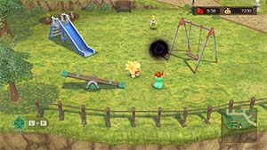
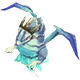
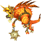
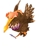
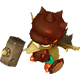

  

# Overview

<table class="dungeonOverview">
  <tr>
    <th>Unlock</th>
    <td class="highlightYellow">Clear Roddy's Memories (Chapter 4).</td>
  </tr>
  <tr>
    <th>Location</th>
    <td class="highlightYellow">Playground (Chapter 4+)</td>
  </tr>
</table>

<table class="dungeonTable">
  <tr>
    <th>Title</th>
    <td colspan="3">Rooms of All Sizes</td>
  </tr>
  <tr>
    <th>Description</th>
    <td colspan="3">A dungeon filled with dens of monsters. Use your wits and skill to make it through!</td>
  </tr>
  <tr>
    <th>Floors</th>
    <td>5F</td>
    <th>Bosses</th>
    <td>None</td>
  </tr>
  <tr>
    <th>Change Crystals</th>
    <td>0F</td>
    <th>Checkpoints</th>
    <td>None</td>
  </tr>
  <tr>
    <th>Max Level</th>
    <td>30</td>
    <th>Bring Buddy</th>
    <td>Yes</td>
  </tr>
  <tr>
    <th>Bring In Items</th>
    <td>No</td>
    <th>Take Out Items</th>
    <td>No</td>
  </tr>
  <tr>
    <th>Shops/Duels</th>
    <td>No</td>
    <th>Den of Monsters</th>
    <td>Yes</td>
  </tr>
  <tr>
    <th>Reapers</th>
    <td>Yes</td>
    <th>Bookmark</th>
    <td>No</td>
  </tr>
  <tr>
    <th>Unidentified</th>
    <td colspan="3">Equipment, Consumables</td>
  </tr>
  <tr>
    <th>Rewards</th>
    <td colspan="3">1.  Dancer's Memories (5F). 2.  Claire's Memories (5F). 3. Dungeon added to  Mirror of Training.</td>
  </tr>
</table>

# Strategy

[Content]

# Monsters

<ul><li><a href="#monster-table">Monster Table</a></li><li><a href="#monster-details">Monster Details</a></li></ul>

 

 Monster Table 

Monster Colors - Boss F - 　 means field of view is limited. R - 　 means  Reaper can spawn.

<table class="monsterTable">
  <thead>
    <tr>
      <th>F</th>
      <th colspan="6">Monsters</th>
      <th>R</th>
    </tr>
  </thead>
  <tbody>
    <tr class="changeCrystal">
      <td class="centeredText">0</td>
      <td colspan="6" class="centeredText">Change Crystal</td>
      <td></td>
    </tr>
    <tr>
      <td class="centeredText">1</td>
      <td> Mandra (20%)</td>
      <td> Ice Dragon (20%)</td>
      <td> Coeurl (10%)</td>
      <td> Bomb (10%)</td>
      <td> Tonberry (20%)</td>
      <td> Goblin (20%)</td>
      <td class="highlightReaper"></td>
    </tr>
    <tr>
      <td class="centeredText">2</td>
      <td> Mandra (17%)</td>
      <td> Ice Dragon (17%)</td>
      <td> Coeurl (17%)</td>
      <td> Bomb (17%)</td>
      <td> Tonberry (17%)</td>
      <td> Goblin (17%)</td>
      <td class="highlightReaper"></td>
    </tr>
    <tr>
      <td class="centeredText">3</td>
      <td> Mandragora (17%)</td>
      <td> Heat Basilisk (17%)</td>
      <td> Malboro (17%)</td>
      <td> Vulture (17%)</td>
      <td> Turtle (17%)</td>
      <td> Red Cap (17%)</td>
      <td class="highlightReaper"></td>
    </tr>
    <tr>
      <td class="centeredText">4</td>
      <td> Mandragora (17%)</td>
      <td> Dark Dragon (17%)</td>
      <td> Malboro (17%)</td>
      <td> Vulture (17%)</td>
      <td> Turtle (17%)</td>
      <td> Red Cap (17%)</td>
      <td class="highlightReaper"></td>
    </tr>
    <tr class="highlightYellow">
      <td class="centeredText">5</td>
      <td colspan="6" class="centeredText"> Dancer's Memories  Claire's Memories</td>
      <td></td>
    </tr>
  </tbody>
</table>

 

 Monster Details 

Stat Colors - Hard Mode

### Standard

#### Mandra (1-2F)

<table class="buddyOverview">
  <tr class="noPad">
    <th colspan="13" class="highlightGreen">Stats</th>
  </tr>
  <tr>
    <td rowspan="4"></td>
    <td class="hp">HP</td>
    <td>56 / 70</td>
    <td class="atk">Attack</td>
    <td>28 / 30</td>
    <td class="mag">Magic</td>
    <td>28 / 29</td>
    <th>JP</th>
    <td>-</td>
    <th>Item 1</th>
    <td colspan="3">Hi-Potion (20%)</td>
  </tr>
  <tr>
    <td class="sp">Exp</td>
    <td>76</td>
    <td class="def">Defense</td>
    <td>43 / 44</td>
    <td class="mnd">Mind</td>
    <td>37 / 38</td>
    <th>BP</th>
    <td>3 (50%)</td>
    <th>Item 2</th>
    <td colspan="3">Hi-Ether (8%)</td>
  </tr>
  <tr>
    <th>Hit</th>
    <td>95</td>
    <th>Evasion</th>
    <td>2</td>
    <th>Crit</th>
    <td>5</td>
    <th>Gil</th>
    <td>-</td>
    <th>Steal</th>
    <td colspan="3">Hi-Ether (35%)</td>
  </tr>
  <tr>
    <th>Lv</th>
    <td>12</td>
    <th>Special</th>
    <td>-</td>
    <th>Resist</th>
    <td colspan="3"></td>
    <th>Weak</th>
    <td colspan="3">-</td>
  </tr>
  <tr>
    <th colspan="13" class="abilityName">Seeds</th>
  </tr>
  <tr class="elementIcon">
    <th>Element</th>
    <td>-</td>
    <th>Range</th>
    <td></td>
    <th>Notes</th>
    <td colspan="8" class="leftText">Deal damage to a target up to 3 tiles ahead.</td>
  </tr>
  <tr>
    <th>Rate / CD</th>
    <td colspan="2">10% / 0T</td>
    <th>Count</th>
    <td>∞</td>
    <th>Multiplier</th>
    <td>x2.0</td>
    <th>Value</th>
    <td>0</td>
    <th>Type</th>
    <td class="leftText">Physical</td>
    <th>Calc</th>
    <td class="leftText">Stat</td>
  </tr>
  <tr>
    <th colspan="13" class="abilityName">Scream</th>
  </tr>
  <tr class="elementIcon">
    <th>Element</th>
    <td>-</td>
    <th>Range</th>
    <td></td>
    <th>Notes</th>
    <td colspan="8" class="leftText">Inflict Stun on targets in a 2 tile radius.</td>
  </tr>
  <tr>
    <th>Rate / CD</th>
    <td colspan="2">10% / 4T</td>
    <th>Count</th>
    <td>∞</td>
    <th>Multiplier</th>
    <td>x1.0</td>
    <th>Value</th>
    <td>0</td>
    <th>Type</th>
    <td class="leftText">Other</td>
    <th>Calc</th>
    <td class="leftText">None</td>
  </tr>
  <tr>
    <th colspan="13" class="abilityName">Dreamy Flower</th>
  </tr>
  <tr class="elementIcon">
    <th>Element</th>
    <td>-</td>
    <th>Range</th>
    <td></td>
    <th>Notes</th>
    <td colspan="8" class="leftText">Inflict Sleep on targets in a 1 tile radius.</td>
  </tr>
  <tr>
    <th>Rate / CD</th>
    <td colspan="2">15% / 4T</td>
    <th>Count</th>
    <td>∞</td>
    <th>Multiplier</th>
    <td>x1.0</td>
    <th>Value</th>
    <td>0</td>
    <th>Type</th>
    <td class="leftText">Other</td>
    <th>Calc</th>
    <td class="leftText">None</td>
  </tr>
</table>

#### Ice Dragon (1-2F)

<table class="buddyOverview">
  <tr class="noPad">
    <th colspan="13" class="highlightGreen">Stats</th>
  </tr>
  <tr>
    <td rowspan="4"></td>
    <td class="hp">HP</td>
    <td>50 / 63</td>
    <td class="atk">Attack</td>
    <td>34 / 36</td>
    <td class="mag">Magic</td>
    <td>26 / 27</td>
    <th>JP</th>
    <td>-</td>
    <th>Item 1</th>
    <td colspan="3">Hi-Potion (10%)</td>
  </tr>
  <tr>
    <td class="sp">Exp</td>
    <td>88</td>
    <td class="def">Defense</td>
    <td>41 / 42</td>
    <td class="mnd">Mind</td>
    <td>47 / 48</td>
    <th>BP</th>
    <td>3 (50%)</td>
    <th>Item 2</th>
    <td colspan="3">Sleep Book (8%)</td>
  </tr>
  <tr>
    <th>Hit</th>
    <td>85</td>
    <th>Evasion</th>
    <td>8</td>
    <th>Crit</th>
    <td>0</td>
    <th>Gil</th>
    <td>-</td>
    <th>Steal</th>
    <td colspan="3">Sleep Book (35%)</td>
  </tr>
  <tr>
    <th>Lv</th>
    <td>10</td>
    <th>Special</th>
    <td></td>
    <th>Resist</th>
    <td colspan="3"></td>
    <th>Weak</th>
    <td colspan="3"></td>
  </tr>
  <tr>
    <th colspan="13" class="abilityName">Dragon Breath</th>
  </tr>
  <tr class="elementIcon">
    <th>Element</th>
    <td></td>
    <th>Range</th>
    <td></td>
    <th>Notes</th>
    <td colspan="8" class="leftText">Deal ice damage to all targets up to 2 tiles ahead.</td>
  </tr>
  <tr>
    <th>Rate / CD</th>
    <td colspan="2">16% / 0T</td>
    <th>Count</th>
    <td>∞</td>
    <th>Multiplier</th>
    <td>x1.0</td>
    <th>Value</th>
    <td>0</td>
    <th>Type</th>
    <td class="leftText">Magic</td>
    <th>Calc</th>
    <td class="leftText">Stat</td>
  </tr>
  <tr>
    <th colspan="13" class="abilityName">Slow Breath</th>
  </tr>
  <tr class="elementIcon">
    <th>Element</th>
    <td>-</td>
    <th>Range</th>
    <td></td>
    <th>Notes</th>
    <td colspan="8" class="leftText">Deal damage + Slow to a target 1 tile ahead.</td>
  </tr>
  <tr>
    <th>Rate / CD</th>
    <td colspan="2">4% / 6T</td>
    <th>Count</th>
    <td>∞</td>
    <th>Multiplier</th>
    <td>x1.0</td>
    <th>Value</th>
    <td>0</td>
    <th>Type</th>
    <td class="leftText">Magic</td>
    <th>Calc</th>
    <td class="leftText">Stat</td>
  </tr>
</table>

#### Coeurl (1-2F)

<table class="buddyOverview">
  <tr class="noPad">
    <th colspan="13" class="highlightGreen">Stats</th>
  </tr>
  <tr>
    <td rowspan="4"></td>
    <td class="hp">HP</td>
    <td>40 / 50</td>
    <td class="atk">Attack</td>
    <td>26 / 28</td>
    <td class="mag">Magic</td>
    <td>19 / 20</td>
    <th>JP</th>
    <td>-</td>
    <th>Item 1</th>
    <td colspan="3">Hi-Potion (10%)</td>
  </tr>
  <tr>
    <td class="sp">Exp</td>
    <td>75</td>
    <td class="def">Defense</td>
    <td>35 / 36</td>
    <td class="mnd">Mind</td>
    <td>36 / 37</td>
    <th>BP</th>
    <td>3 (50%)</td>
    <th>Item 2</th>
    <td colspan="3">Silence Book (8%)</td>
  </tr>
  <tr>
    <th>Hit</th>
    <td>85</td>
    <th>Evasion</th>
    <td>8</td>
    <th>Crit</th>
    <td>5</td>
    <th>Gil</th>
    <td>-</td>
    <th>Steal</th>
    <td colspan="3">Silence Book (35%)</td>
  </tr>
  <tr>
    <th>Lv</th>
    <td>11</td>
    <th>Special</th>
    <td></td>
    <th>Resist</th>
    <td colspan="3">-</td>
    <th>Weak</th>
    <td colspan="3">-</td>
  </tr>
  <tr>
    <th colspan="13" class="abilityName">Bite</th>
  </tr>
  <tr class="elementIcon">
    <th>Element</th>
    <td>-</td>
    <th>Range</th>
    <td></td>
    <th>Notes</th>
    <td colspan="8" class="leftText">Deal damage + Immobilize to a target 1 tile ahead.</td>
  </tr>
  <tr>
    <th>Rate / CD</th>
    <td colspan="2">10% / 4T</td>
    <th>Count</th>
    <td>∞</td>
    <th>Multiplier</th>
    <td>x1.0</td>
    <th>Value</th>
    <td>0</td>
    <th>Type</th>
    <td class="leftText">Physical</td>
    <th>Calc</th>
    <td class="leftText">Stat</td>
  </tr>
</table>

#### Bomb (1-2F)

<table class="buddyOverview">
  <tr class="noPad">
    <th colspan="13" class="highlightGreen">Stats</th>
  </tr>
  <tr>
    <td rowspan="4"></td>
    <td class="hp">HP</td>
    <td>63 / 80</td>
    <td class="atk">Attack</td>
    <td>15 / 16</td>
    <td class="mag">Magic</td>
    <td>23 / 24</td>
    <th>JP</th>
    <td>-</td>
    <th>Item 1</th>
    <td colspan="3">Hi-Potion (10%)</td>
  </tr>
  <tr>
    <td class="sp">Exp</td>
    <td>52</td>
    <td class="def">Defense</td>
    <td>31 / 32</td>
    <td class="mnd">Mind</td>
    <td>32 / 33</td>
    <th>BP</th>
    <td>3 (50%)</td>
    <th>Item 2</th>
    <td colspan="3">Bomb Shard (8%)</td>
  </tr>
  <tr>
    <th>Hit</th>
    <td>95</td>
    <th>Evasion</th>
    <td>4</td>
    <th>Crit</th>
    <td>5</td>
    <th>Gil</th>
    <td>-</td>
    <th>Steal</th>
    <td colspan="3">Bomb Shard (35%)</td>
  </tr>
  <tr>
    <th>Lv</th>
    <td>7</td>
    <th>Special</th>
    <td>-</td>
    <th>Resist</th>
    <td colspan="3"></td>
    <th>Weak</th>
    <td colspan="3"></td>
  </tr>
  <tr>
    <th colspan="13" class="abilityName">Self-Destruct</th>
  </tr>
  <tr class="elementIcon">
    <th>Element</th>
    <td></td>
    <th>Range</th>
    <td></td>
    <th>Notes</th>
    <td colspan="8" class="leftText">Halve the HP of targets in a 3 tile radius, then collapse.</td>
  </tr>
  <tr>
    <th>Rate / CD</th>
    <td colspan="2">25% / 0T</td>
    <th>Count</th>
    <td>1</td>
    <th>Multiplier</th>
    <td>x1.0</td>
    <th>Value</th>
    <td>50</td>
    <th>Type</th>
    <td class="leftText">Magic</td>
    <th>Calc</th>
    <td class="leftText">Ratio</td>
  </tr>
</table>

#### Tonberry (1-2F)

<table class="buddyOverview">
  <tr class="noPad">
    <th colspan="13" class="highlightGreen">Stats</th>
  </tr>
  <tr>
    <td rowspan="4"></td>
    <td class="hp">HP</td>
    <td>46 / 57</td>
    <td class="atk">Attack</td>
    <td>32 / 34</td>
    <td class="mag">Magic</td>
    <td>38 / 39</td>
    <th>JP</th>
    <td>-</td>
    <th>Item 1</th>
    <td colspan="3">Hi-Potion (10%)</td>
  </tr>
  <tr>
    <td class="sp">Exp</td>
    <td>117</td>
    <td class="def">Defense</td>
    <td>38 / 39</td>
    <td class="mnd">Mind</td>
    <td>999 / 999</td>
    <th>BP</th>
    <td>3 (50%)</td>
    <th>Item 2</th>
    <td colspan="3">Protect Book (8%)</td>
  </tr>
  <tr>
    <th>Hit</th>
    <td>95</td>
    <th>Evasion</th>
    <td>8</td>
    <th>Crit</th>
    <td>100</td>
    <th>Gil</th>
    <td>-</td>
    <th>Steal</th>
    <td colspan="3">Protect Book (35%)</td>
  </tr>
  <tr>
    <th>Lv</th>
    <td>14</td>
    <th>Special</th>
    <td></td>
    <th>Resist</th>
    <td colspan="3"></td>
    <th>Weak</th>
    <td colspan="3">-</td>
  </tr>
  <tr>
    <th colspan="13" class="abilityName">Knife</th>
  </tr>
  <tr class="elementIcon">
    <th>Element</th>
    <td>-</td>
    <th>Range</th>
    <td></td>
    <th>Notes</th>
    <td colspan="8" class="leftText">Halve the HP of a target 1 tile ahead.</td>
  </tr>
  <tr>
    <th>Rate / CD</th>
    <td colspan="2">25% / 6T</td>
    <th>Count</th>
    <td>∞</td>
    <th>Multiplier</th>
    <td>x1.0</td>
    <th>Value</th>
    <td>50</td>
    <th>Type</th>
    <td class="leftText">Physical</td>
    <th>Calc</th>
    <td class="leftText">Ratio</td>
  </tr>
</table>

#### Goblin (1-2F)

<table class="buddyOverview">
  <tr class="noPad">
    <th colspan="13" class="highlightGreen">Stats</th>
  </tr>
  <tr>
    <td rowspan="4"></td>
    <td class="hp">HP</td>
    <td>76 / 95</td>
    <td class="atk">Attack</td>
    <td>24 / 26</td>
    <td class="mag">Magic</td>
    <td>18 / 19</td>
    <th>JP</th>
    <td>-</td>
    <th>Item 1</th>
    <td colspan="3">Hi-Potion (10%)</td>
  </tr>
  <tr>
    <td class="sp">Exp</td>
    <td>74</td>
    <td class="def">Defense</td>
    <td>41 / 42</td>
    <td class="mnd">Mind</td>
    <td>35 / 36</td>
    <th>BP</th>
    <td>3 (50%)</td>
    <th>Item 2</th>
    <td colspan="3">Meteor Book (4%)</td>
  </tr>
  <tr>
    <th>Hit</th>
    <td>95</td>
    <th>Evasion</th>
    <td>4</td>
    <th>Crit</th>
    <td>20</td>
    <th>Gil</th>
    <td>-</td>
    <th>Steal</th>
    <td colspan="3">Meteor Book (20%)</td>
  </tr>
  <tr>
    <th>Lv</th>
    <td>10</td>
    <th>Special</th>
    <td>-</td>
    <th>Resist</th>
    <td colspan="3"></td>
    <th>Weak</th>
    <td colspan="3"></td>
  </tr>
  <tr>
    <th colspan="13" class="abilityName">Goblin Punch</th>
  </tr>
  <tr class="elementIcon">
    <th>Element</th>
    <td>-</td>
    <th>Range</th>
    <td></td>
    <th>Notes</th>
    <td colspan="8" class="leftText">Deal damage to a target 1 tile ahead.</td>
  </tr>
  <tr>
    <th>Rate / CD</th>
    <td colspan="2">25% / 0T</td>
    <th>Count</th>
    <td>∞</td>
    <th>Multiplier</th>
    <td>x2.0</td>
    <th>Value</th>
    <td>0</td>
    <th>Type</th>
    <td class="leftText">Physical</td>
    <th>Calc</th>
    <td class="leftText">Stat</td>
  </tr>
</table>

#### Heat Basilisk (3F)

<table class="buddyOverview">
  <tr class="noPad">
    <th colspan="13" class="highlightGreen">Stats</th>
  </tr>
  <tr>
    <td rowspan="4"></td>
    <td class="hp">HP</td>
    <td>53 / 67</td>
    <td class="atk">Attack</td>
    <td>20 / 21</td>
    <td class="mag">Magic</td>
    <td>27 / 28</td>
    <th>JP</th>
    <td>-</td>
    <th>Item 1</th>
    <td colspan="3">Hi-Potion (10%)</td>
  </tr>
  <tr>
    <td class="sp">Exp</td>
    <td>90</td>
    <td class="def">Defense</td>
    <td>35 / 36</td>
    <td class="mnd">Mind</td>
    <td>28 / 29</td>
    <th>BP</th>
    <td>3 (50%)</td>
    <th>Item 2</th>
    <td colspan="3">Slowga Book (8%)</td>
  </tr>
  <tr>
    <th>Hit</th>
    <td>85</td>
    <th>Evasion</th>
    <td>4</td>
    <th>Crit</th>
    <td>20</td>
    <th>Gil</th>
    <td>-</td>
    <th>Steal</th>
    <td colspan="3">Slowga Book (35%)</td>
  </tr>
  <tr>
    <th>Lv</th>
    <td>11</td>
    <th>Special</th>
    <td></td>
    <th>Resist</th>
    <td colspan="3">-</td>
    <th>Weak</th>
    <td colspan="3"></td>
  </tr>
  <tr>
    <th colspan="13" class="abilityName">Flames</th>
  </tr>
  <tr class="elementIcon">
    <th>Element</th>
    <td></td>
    <th>Range</th>
    <td></td>
    <th>Notes</th>
    <td colspan="8" class="leftText">Deal fire damage to all targets up to 2 tiles ahead.</td>
  </tr>
  <tr>
    <th>Rate / CD</th>
    <td colspan="2">10% / 0T</td>
    <th>Count</th>
    <td>∞</td>
    <th>Multiplier</th>
    <td>x1.0</td>
    <th>Value</th>
    <td>0</td>
    <th>Type</th>
    <td class="leftText">Magic</td>
    <th>Calc</th>
    <td class="leftText">Stat</td>
  </tr>
</table>

#### Mandragora (3-4F)

<table class="buddyOverview">
  <tr class="noPad">
    <th colspan="13" class="highlightGreen">Stats</th>
  </tr>
  <tr>
    <td rowspan="4"></td>
    <td class="hp">HP</td>
    <td>56 / 70</td>
    <td class="atk">Attack</td>
    <td>28 / 30</td>
    <td class="mag">Magic</td>
    <td>28 / 29</td>
    <th>JP</th>
    <td>-</td>
    <th>Item 1</th>
    <td colspan="3">Hi-Potion (20%)</td>
  </tr>
  <tr>
    <td class="sp">Exp</td>
    <td>76</td>
    <td class="def">Defense</td>
    <td>43 / 44</td>
    <td class="mnd">Mind</td>
    <td>37 / 38</td>
    <th>BP</th>
    <td>3 (50%)</td>
    <th>Item 2</th>
    <td colspan="3">Hi-Ether (8%)</td>
  </tr>
  <tr>
    <th>Hit</th>
    <td>95</td>
    <th>Evasion</th>
    <td>2</td>
    <th>Crit</th>
    <td>5</td>
    <th>Gil</th>
    <td>-</td>
    <th>Steal</th>
    <td colspan="3">Hi-Ether (35%)</td>
  </tr>
  <tr>
    <th>Lv</th>
    <td>12</td>
    <th>Special</th>
    <td>-</td>
    <th>Resist</th>
    <td colspan="3"></td>
    <th>Weak</th>
    <td colspan="3">-</td>
  </tr>
  <tr>
    <th colspan="13" class="abilityName">Seeds</th>
  </tr>
  <tr class="elementIcon">
    <th>Element</th>
    <td>-</td>
    <th>Range</th>
    <td></td>
    <th>Notes</th>
    <td colspan="8" class="leftText">Deal damage to a target up to 3 tiles ahead.</td>
  </tr>
  <tr>
    <th>Rate / CD</th>
    <td colspan="2">10% / 0T</td>
    <th>Count</th>
    <td>∞</td>
    <th>Multiplier</th>
    <td>x2.0</td>
    <th>Value</th>
    <td>0</td>
    <th>Type</th>
    <td class="leftText">Physical</td>
    <th>Calc</th>
    <td class="leftText">Stat</td>
  </tr>
  <tr>
    <th colspan="13" class="abilityName">Scream</th>
  </tr>
  <tr class="elementIcon">
    <th>Element</th>
    <td>-</td>
    <th>Range</th>
    <td></td>
    <th>Notes</th>
    <td colspan="8" class="leftText">Inflict Stun on targets in a 2 tile radius.</td>
  </tr>
  <tr>
    <th>Rate / CD</th>
    <td colspan="2">10% / 4T</td>
    <th>Count</th>
    <td>∞</td>
    <th>Multiplier</th>
    <td>x1.0</td>
    <th>Value</th>
    <td>0</td>
    <th>Type</th>
    <td class="leftText">Other</td>
    <th>Calc</th>
    <td class="leftText">None</td>
  </tr>
  <tr>
    <th colspan="13" class="abilityName">Baby's Breath</th>
  </tr>
  <tr class="elementIcon">
    <th>Element</th>
    <td>-</td>
    <th>Range</th>
    <td></td>
    <th>Notes</th>
    <td colspan="8" class="leftText">Inflict Blind on targets in a 1 tile radius.</td>
  </tr>
  <tr>
    <th>Rate / CD</th>
    <td colspan="2">15% / 4T</td>
    <th>Count</th>
    <td>∞</td>
    <th>Multiplier</th>
    <td>x1.0</td>
    <th>Value</th>
    <td>0</td>
    <th>Type</th>
    <td class="leftText">Other</td>
    <th>Calc</th>
    <td class="leftText">None</td>
  </tr>
</table>

#### Malboro (3-4F)

<table class="buddyOverview">
  <tr class="noPad">
    <th colspan="13" class="highlightGreen">Stats</th>
  </tr>
  <tr>
    <td rowspan="4"></td>
    <td class="hp">HP</td>
    <td>62 / 76</td>
    <td class="atk">Attack</td>
    <td>32 / 34</td>
    <td class="mag">Magic</td>
    <td>30 / 31</td>
    <th>JP</th>
    <td>-</td>
    <th>Item 1</th>
    <td colspan="3">Hi-Potion (10%)</td>
  </tr>
  <tr>
    <td class="sp">Exp</td>
    <td>98</td>
    <td class="def">Defense</td>
    <td>45 / 46</td>
    <td class="mnd">Mind</td>
    <td>39 / 40</td>
    <th>BP</th>
    <td>3 (50%)</td>
    <th>Item 2</th>
    <td colspan="3">Sleepga Book (8%)</td>
  </tr>
  <tr>
    <th>Hit</th>
    <td>95</td>
    <th>Evasion</th>
    <td>2</td>
    <th>Crit</th>
    <td>5</td>
    <th>Gil</th>
    <td>-</td>
    <th>Steal</th>
    <td colspan="3">Sleepga Book (35%)</td>
  </tr>
  <tr>
    <th>Lv</th>
    <td>14</td>
    <th>Special</th>
    <td>-</td>
    <th>Resist</th>
    <td colspan="3"></td>
    <th>Weak</th>
    <td colspan="3">-</td>
  </tr>
  <tr>
    <th colspan="13" class="abilityName">Bad Breath</th>
  </tr>
  <tr class="elementIcon">
    <th>Element</th>
    <td>-</td>
    <th>Range</th>
    <td></td>
    <th>Notes</th>
    <td colspan="8" class="leftText">Inflict Blind, Confuse, or Silence on a target 1 tile ahead.</td>
  </tr>
  <tr>
    <th>Rate / CD</th>
    <td colspan="2">20% / 3T</td>
    <th>Count</th>
    <td>∞</td>
    <th>Multiplier</th>
    <td>x1.0</td>
    <th>Value</th>
    <td>0</td>
    <th>Type</th>
    <td class="leftText">Other</td>
    <th>Calc</th>
    <td class="leftText">None</td>
  </tr>
</table>

#### Vulture (3-4F)

<table class="buddyOverview">
  <tr class="noPad">
    <th colspan="13" class="highlightGreen">Stats</th>
  </tr>
  <tr>
    <td rowspan="4"></td>
    <td class="hp">HP</td>
    <td>42 / 52</td>
    <td class="atk">Attack</td>
    <td>38 / 40</td>
    <td class="mag">Magic</td>
    <td>20 / 21</td>
    <th>JP</th>
    <td>-</td>
    <th>Item 1</th>
    <td colspan="3">Hi-Potion (10%)</td>
  </tr>
  <tr>
    <td class="sp">Exp</td>
    <td>76</td>
    <td class="def">Defense</td>
    <td>36 / 37</td>
    <td class="mnd">Mind</td>
    <td>37 / 38</td>
    <th>BP</th>
    <td>3 (50%)</td>
    <th>Item 2</th>
    <td colspan="3">Antarctic Wind (8%)</td>
  </tr>
  <tr>
    <th>Hit</th>
    <td>85</td>
    <th>Evasion</th>
    <td>8</td>
    <th>Crit</th>
    <td>20</td>
    <th>Gil</th>
    <td>-</td>
    <th>Steal</th>
    <td colspan="3">Antarctic Wind (35%)</td>
  </tr>
  <tr>
    <th>Lv</th>
    <td>12</td>
    <th>Special</th>
    <td></td>
    <th>Resist</th>
    <td colspan="3">-</td>
    <th>Weak</th>
    <td colspan="3"></td>
  </tr>
  <tr>
    <th colspan="13" class="abilityName">Wing Flap</th>
  </tr>
  <tr class="elementIcon">
    <th>Element</th>
    <td>-</td>
    <th>Range</th>
    <td></td>
    <th>Notes</th>
    <td colspan="8" class="leftText">Temporarily cast Haste.</td>
  </tr>
  <tr>
    <th>Rate / CD</th>
    <td colspan="2">8% / 30T</td>
    <th>Count</th>
    <td>∞</td>
    <th>Multiplier</th>
    <td>x1.0</td>
    <th>Value</th>
    <td>0</td>
    <th>Type</th>
    <td class="leftText">Other</td>
    <th>Calc</th>
    <td class="leftText">None</td>
  </tr>
  <tr>
    <th colspan="13" class="abilityName">Gale</th>
  </tr>
  <tr class="elementIcon">
    <th>Element</th>
    <td></td>
    <th>Range</th>
    <td></td>
    <th>Notes</th>
    <td colspan="8" class="leftText">Deal wind damage to a target 1 tile ahead.</td>
  </tr>
  <tr>
    <th>Rate / CD</th>
    <td colspan="2">12% / 0T</td>
    <th>Count</th>
    <td>∞</td>
    <th>Multiplier</th>
    <td>x1.0</td>
    <th>Value</th>
    <td>0</td>
    <th>Type</th>
    <td class="leftText">Magic</td>
    <th>Calc</th>
    <td class="leftText">Stat</td>
  </tr>
</table>

#### Turtle (3-4F)

<table class="buddyOverview">
  <tr class="noPad">
    <th colspan="13" class="highlightGreen">Stats</th>
  </tr>
  <tr>
    <td rowspan="4"></td>
    <td class="hp">HP</td>
    <td>88 / 111</td>
    <td class="atk">Attack</td>
    <td>40 / 42</td>
    <td class="mag">Magic</td>
    <td>29 / 30</td>
    <th>JP</th>
    <td>-</td>
    <th>Item 1</th>
    <td colspan="3">Hi-Potion (10%)</td>
  </tr>
  <tr>
    <td class="sp">Exp</td>
    <td>77</td>
    <td class="def">Defense</td>
    <td>52 / 53</td>
    <td class="mnd">Mind</td>
    <td>30 / 31</td>
    <th>BP</th>
    <td>3 (50%)</td>
    <th>Item 2</th>
    <td colspan="3">Protect Book (8%)</td>
  </tr>
  <tr>
    <th>Hit</th>
    <td>95</td>
    <th>Evasion</th>
    <td>2</td>
    <th>Crit</th>
    <td>5</td>
    <th>Gil</th>
    <td>-</td>
    <th>Steal</th>
    <td colspan="3">Protect Book (35%)</td>
  </tr>
  <tr>
    <th>Lv</th>
    <td>13</td>
    <th>Special</th>
    <td></td>
    <th>Resist</th>
    <td colspan="3">-</td>
    <th>Weak</th>
    <td colspan="3"></td>
  </tr>
  <tr>
    <th colspan="13" class="abilityName">Miraculous Shell</th>
  </tr>
  <tr class="elementIcon">
    <th>Element</th>
    <td>-</td>
    <th>Range</th>
    <td></td>
    <th>Notes</th>
    <td colspan="8" class="leftText">Temporarily cast Protect.</td>
  </tr>
  <tr>
    <th>Rate / CD</th>
    <td colspan="2">5% / 12T</td>
    <th>Count</th>
    <td>∞</td>
    <th>Multiplier</th>
    <td>x1.0</td>
    <th>Value</th>
    <td>0</td>
    <th>Type</th>
    <td class="leftText">Other</td>
    <th>Calc</th>
    <td class="leftText">None</td>
  </tr>
</table>

#### Red Cap (3-4F)

<table class="buddyOverview">
  <tr class="noPad">
    <th colspan="13" class="highlightGreen">Stats</th>
  </tr>
  <tr>
    <td rowspan="4"></td>
    <td class="hp">HP</td>
    <td>80 / 100</td>
    <td class="atk">Attack</td>
    <td>26 / 28</td>
    <td class="mag">Magic</td>
    <td>19 / 20</td>
    <th>JP</th>
    <td>-</td>
    <th>Item 1</th>
    <td colspan="3">Hi-Potion (10%)</td>
  </tr>
  <tr>
    <td class="sp">Exp</td>
    <td>75</td>
    <td class="def">Defense</td>
    <td>42 / 43</td>
    <td class="mnd">Mind</td>
    <td>36 / 37</td>
    <th>BP</th>
    <td>3 (50%)</td>
    <th>Item 2</th>
    <td colspan="3">Meteor Book (4%)</td>
  </tr>
  <tr>
    <th>Hit</th>
    <td>95</td>
    <th>Evasion</th>
    <td>4</td>
    <th>Crit</th>
    <td>20</td>
    <th>Gil</th>
    <td>-</td>
    <th>Steal</th>
    <td colspan="3">Meteor Book (20%)</td>
  </tr>
  <tr>
    <th>Lv</th>
    <td>11</td>
    <th>Special</th>
    <td>-</td>
    <th>Resist</th>
    <td colspan="3"></td>
    <th>Weak</th>
    <td colspan="3"></td>
  </tr>
  <tr>
    <th colspan="13" class="abilityName">Goblin Punch</th>
  </tr>
  <tr class="elementIcon">
    <th>Element</th>
    <td>-</td>
    <th>Range</th>
    <td></td>
    <th>Notes</th>
    <td colspan="8" class="leftText">Deal damage to a target 1 tile ahead.</td>
  </tr>
  <tr>
    <th>Rate / CD</th>
    <td colspan="2">25% / 0T</td>
    <th>Count</th>
    <td>∞</td>
    <th>Multiplier</th>
    <td>x2.0</td>
    <th>Value</th>
    <td>0</td>
    <th>Type</th>
    <td class="leftText">Physical</td>
    <th>Calc</th>
    <td class="leftText">Stat</td>
  </tr>
  <tr>
    <th colspan="13" class="abilityName">Goblin's Grit</th>
  </tr>
  <tr class="elementIcon">
    <th>Element</th>
    <td>-</td>
    <th>Range</th>
    <td></td>
    <th>Notes</th>
    <td colspan="8" class="leftText">Temporarily cast Bravery.</td>
  </tr>
  <tr>
    <th>Rate / CD</th>
    <td colspan="2">4% / 30T</td>
    <th>Count</th>
    <td>∞</td>
    <th>Multiplier</th>
    <td>x1.0</td>
    <th>Value</th>
    <td>0</td>
    <th>Type</th>
    <td class="leftText">Other</td>
    <th>Calc</th>
    <td class="leftText">None</td>
  </tr>
</table>

#### Dark Dragon (4F)

<table class="buddyOverview">
  <tr class="noPad">
    <th colspan="13" class="highlightGreen">Stats</th>
  </tr>
  <tr>
    <td rowspan="4"></td>
    <td class="hp">HP</td>
    <td>67 / 83</td>
    <td class="atk">Attack</td>
    <td>46 / 49</td>
    <td class="mag">Magic</td>
    <td>32 / 33</td>
    <th>JP</th>
    <td>-</td>
    <th>Item 1</th>
    <td colspan="3">Dark Book (8%)</td>
  </tr>
  <tr>
    <td class="sp">Exp</td>
    <td>120</td>
    <td class="def">Defense</td>
    <td>47 / 48</td>
    <td class="mnd">Mind</td>
    <td>53 / 54</td>
    <th>BP</th>
    <td>3 (50%)</td>
    <th>Item 2</th>
    <td colspan="3">Flare Book (4%)</td>
  </tr>
  <tr>
    <th>Hit</th>
    <td>85</td>
    <th>Evasion</th>
    <td>8</td>
    <th>Crit</th>
    <td>0</td>
    <th>Gil</th>
    <td>-</td>
    <th>Steal</th>
    <td colspan="3">Flare Book (20%)</td>
  </tr>
  <tr>
    <th>Lv</th>
    <td>16</td>
    <th>Special</th>
    <td></td>
    <th>Resist</th>
    <td colspan="3"></td>
    <th>Weak</th>
    <td colspan="3"></td>
  </tr>
  <tr>
    <th colspan="13" class="abilityName">Dragon Breath</th>
  </tr>
  <tr class="elementIcon">
    <th>Element</th>
    <td></td>
    <th>Range</th>
    <td></td>
    <th>Notes</th>
    <td colspan="8" class="leftText">Deal dark damage to all targets up to 2 tiles ahead.</td>
  </tr>
  <tr>
    <th>Rate / CD</th>
    <td colspan="2">20% / 0T</td>
    <th>Count</th>
    <td>∞</td>
    <th>Multiplier</th>
    <td>x1.0</td>
    <th>Value</th>
    <td>0</td>
    <th>Type</th>
    <td class="leftText">Magic</td>
    <th>Calc</th>
    <td class="leftText">Stat</td>
  </tr>
  <tr>
    <th colspan="13" class="abilityName">Slow Breath</th>
  </tr>
  <tr class="elementIcon">
    <th>Element</th>
    <td>-</td>
    <th>Range</th>
    <td></td>
    <th>Notes</th>
    <td colspan="8" class="leftText">Deal damage + Slow to a target 1 tile ahead.</td>
  </tr>
  <tr>
    <th>Rate / CD</th>
    <td colspan="2">10% / 6T</td>
    <th>Count</th>
    <td>∞</td>
    <th>Multiplier</th>
    <td>x1.0</td>
    <th>Value</th>
    <td>0</td>
    <th>Type</th>
    <td class="leftText">Magic</td>
    <th>Calc</th>
    <td class="leftText">Stat</td>
  </tr>
</table>

# Items

<ul><li><a href="#floor">Floor</a></li><li><a href="#drop-/-steal">Drop / Steal</a></li></ul>

 

 Floor 

See the dungeon data JSON file for exact item spawn rates per floor.

<table class="dungeonItemTable">
  <tr>
    <th colspan="3" class="highlightPurple"> Medicines</th>
  </tr>
  <tr>
    <th>Item</th>
    <th>Floor</th>
    <th>Rate Range</th>
  </tr>
  <tr>
    <td>Hi-Potion</td>
    <td>1-4</td>
    <td>5.52%</td>
  </tr>
  <tr>
    <td>Ether</td>
    <td>1-4</td>
    <td>5.52%</td>
  </tr>
  <tr>
    <td>Hi-Ether</td>
    <td>1-4</td>
    <td>2.76%</td>
  </tr>
  <tr>
    <td>Remedy</td>
    <td>1-4</td>
    <td>5.52%</td>
  </tr>
  <tr>
    <td>Amnesia Drink</td>
    <td>1-4</td>
    <td>5.52%</td>
  </tr>
  <tr>
    <td>Explosive Drink</td>
    <td>1-4</td>
    <td>5.52%</td>
  </tr>
  <tr>
    <td>Blind Drink</td>
    <td>1-4</td>
    <td>5.52%</td>
  </tr>
  <tr>
    <td>Silence Drink</td>
    <td>1-4</td>
    <td>5.52%</td>
  </tr>
  <tr>
    <td>Sleep Drink</td>
    <td>1-4</td>
    <td>5.52%</td>
  </tr>
  <tr>
    <td>Slow Drink</td>
    <td>1-4</td>
    <td>5.52%</td>
  </tr>
  <tr>
    <td>Haste Drink</td>
    <td>1-4</td>
    <td>5.52%</td>
  </tr>
  <tr>
    <td>Damaging Drink</td>
    <td>1-4</td>
    <td>5.52%</td>
  </tr>
  <tr>
    <th colspan="3" class="highlightPurple"> Books</th>
  </tr>
  <tr>
    <th>Item</th>
    <th>Floor</th>
    <th>Rate Range</th>
  </tr>
  <tr>
    <td>Poison Book</td>
    <td>1-4</td>
    <td>2.76%</td>
  </tr>
  <tr>
    <td>Sleep Book</td>
    <td>1-4</td>
    <td>2.76%</td>
  </tr>
  <tr>
    <td>Silence Book</td>
    <td>1-4</td>
    <td>2.76%</td>
  </tr>
  <tr>
    <td>Blind Book</td>
    <td>1-4</td>
    <td>2.76%</td>
  </tr>
  <tr>
    <td>Confuse Book</td>
    <td>1-4</td>
    <td>2.76%</td>
  </tr>
  <tr>
    <td>Immobilize Book</td>
    <td>1-4</td>
    <td>2.76%</td>
  </tr>
  <tr>
    <td>Slow Book</td>
    <td>1-4</td>
    <td>2.76%</td>
  </tr>
  <tr>
    <td>Protect Book</td>
    <td>1-4</td>
    <td>2.76%</td>
  </tr>
  <tr>
    <td>Shell Book</td>
    <td>1-4</td>
    <td>2.76%</td>
  </tr>
  <tr>
    <td>Sleepga Book</td>
    <td>1-4</td>
    <td>1.66%</td>
  </tr>
  <tr>
    <td>Slowga Book</td>
    <td>1-4</td>
    <td>1.66%</td>
  </tr>
  <tr>
    <th colspan="3" class="highlightPurple"> Other</th>
  </tr>
  <tr>
    <th>Item</th>
    <th>Floor</th>
    <th>Rate Range</th>
  </tr>
  <tr>
    <td>Warp Wings</td>
    <td>1-4</td>
    <td>5.52%</td>
  </tr>
  <tr>
    <td>Scholar's Glasses</td>
    <td>1-4</td>
    <td>2.76%</td>
  </tr>
</table>

 

 Drop / Steal 

 

<table class="dungeonDropTable">
  <thead>
    <tr>
      <th>Floor</th>
      <th>Monster</th>
      <th>Drop 1</th>
      <th>Drop 2</th>
      <th>Steal</th>
    </tr>
  </thead>
  <tbody>
    <tr>
      <td>1-2</td>
      <td> Mandra</td>
      <td>Hi-Potion (20%)</td>
      <td>Hi-Ether (8%)</td>
      <td>Hi-Ether (35%)</td>
    </tr>
    <tr>
      <td>1-2</td>
      <td> Ice Dragon</td>
      <td>Hi-Potion (10%)</td>
      <td>Sleep Book (8%)</td>
      <td>Sleep Book (35%)</td>
    </tr>
    <tr>
      <td>1-2</td>
      <td> Coeurl</td>
      <td>Hi-Potion (10%)</td>
      <td>Silence Book (8%)</td>
      <td>Silence Book (35%)</td>
    </tr>
    <tr>
      <td>1-2</td>
      <td> Bomb</td>
      <td>Hi-Potion (10%)</td>
      <td>Bomb Shard (8%)</td>
      <td>Bomb Shard (35%)</td>
    </tr>
    <tr>
      <td>1-2</td>
      <td> Tonberry</td>
      <td>Hi-Potion (10%)</td>
      <td>Protect Book (8%)</td>
      <td>Protect Book (35%)</td>
    </tr>
    <tr>
      <td>1-2</td>
      <td> Goblin</td>
      <td>Hi-Potion (10%)</td>
      <td>Meteor Book (4%)</td>
      <td>Meteor Book (20%)</td>
    </tr>
    <tr>
      <td>3</td>
      <td> Heat Basilisk</td>
      <td>Hi-Potion (10%)</td>
      <td>Slowga Book (8%)</td>
      <td>Slowga Book (35%)</td>
    </tr>
    <tr>
      <td>3-4</td>
      <td> Mandragora</td>
      <td>Hi-Potion (20%)</td>
      <td>Hi-Ether (8%)</td>
      <td>Hi-Ether (35%)</td>
    </tr>
    <tr>
      <td>3-4</td>
      <td> Malboro</td>
      <td>Hi-Potion (10%)</td>
      <td>Sleepga Book (8%)</td>
      <td>Sleepga Book (35%)</td>
    </tr>
    <tr>
      <td>3-4</td>
      <td> Vulture</td>
      <td>Hi-Potion (10%)</td>
      <td>Antarctic Wind (8%)</td>
      <td>Antarctic Wind (35%)</td>
    </tr>
    <tr>
      <td>3-4</td>
      <td> Turtle</td>
      <td>Hi-Potion (10%)</td>
      <td>Protect Book (8%)</td>
      <td>Protect Book (35%)</td>
    </tr>
    <tr>
      <td>3-4</td>
      <td> Red Cap</td>
      <td>Hi-Potion (10%)</td>
      <td>Meteor Book (4%)</td>
      <td>Meteor Book (20%)</td>
    </tr>
    <tr>
      <td>4</td>
      <td> Dark Dragon</td>
      <td>Dark Book (8%)</td>
      <td>Flare Book (4%)</td>
      <td>Flare Book (20%)</td>
    </tr>
  </tbody>
</table>
