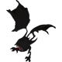
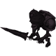
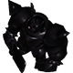
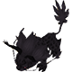
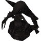
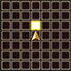

  

# Overview

<table class="dungeonOverview">
  <tr>
    <th>Unlock</th>
    <td class="highlightYellow">Clear Guardian of the Dark (Chapter 5).</td>
  </tr>
  <tr>
    <th>Location</th>
    <td class="highlightYellow">Stella's House (Chapter 6)</td>
  </tr>
</table>

<table class="dungeonTable">
  <tr>
    <th>Title</th>
    <td colspan="3">The Looming Shadow</td>
  </tr>
  <tr>
    <th>Description</th>
    <td colspan="3">A dungeon filled with powerful shadow monsters. Use your wits and skill to make it through!</td>
  </tr>
  <tr>
    <th>Floors</th>
    <td>6F</td>
    <th>Bosses</th>
    <td>5F</td>
  </tr>
  <tr>
    <th>Change Crystals</th>
    <td>0F</td>
    <th>Checkpoints</th>
    <td>None</td>
  </tr>
  <tr>
    <th>Max Level</th>
    <td>90</td>
    <th>Bring Buddy</th>
    <td>No</td>
  </tr>
  <tr>
    <th>Bring In Items</th>
    <td>No</td>
    <th>Take Out Items</th>
    <td>No</td>
  </tr>
  <tr>
    <th>Shops/Duels</th>
    <td>No</td>
    <th>Den of Monsters</th>
    <td>Yes</td>
  </tr>
  <tr>
    <th>Reapers</th>
    <td>Yes</td>
    <th>Bookmark</th>
    <td>No</td>
  </tr>
  <tr>
    <th>Unidentified</th>
    <td colspan="3">Equipment, Consumables</td>
  </tr>
  <tr>
    <th>Rewards</th>
    <td colspan="3">1.  Croma's Memories (6F). 2.  Croma added to  Buddy Registry. 3. Dungeon added to  Mirror of Training.</td>
  </tr>
</table>

# Strategy

[Content]

# Monsters

<ul><li><a href="#monster-table">Monster Table</a></li><li><a href="#monster-details">Monster Details</a></li></ul>

 

 Monster Table 

Monster Colors - Boss F - 　 means field of view is limited. M - 　 means a Den of Monsters can appear. R - 　 means  Reaper can spawn.

<table class="monsterTable">
  <thead>
    <tr>
      <th>F</th>
      <th>M</th>
      <th colspan="6">Monsters</th>
      <th>R</th>
    </tr>
  </thead>
  <tbody>
    <tr class="changeCrystal">
      <td class="centeredText">0</td>
      <td></td>
      <td colspan="6" class="centeredText">Change Crystal</td>
      <td></td>
    </tr>
    <tr>
      <td class="centeredText highlightFog">1</td>
      <td class="highlightGray"></td>
      <td> Ghost Shade (40%)</td>
      <td> Floater Shade (40%)</td>
      <td> Tonberry Shade (20%)</td>
      <td class="highlightGray"></td>
      <td class="highlightGray"></td>
      <td class="highlightGray"></td>
      <td class="highlightReaper"></td>
    </tr>
    <tr>
      <td class="centeredText highlightFog">2</td>
      <td class="highlightMH"></td>
      <td> Skeleton Shade (22%)</td>
      <td> Demon Shade (22%)</td>
      <td> Tonberry Shade (11%)</td>
      <td> Iron Giant Shade (22%)</td>
      <td> Vulture Shade (22%)</td>
      <td class="highlightGray"></td>
      <td class="highlightReaper"></td>
    </tr>
    <tr>
      <td class="centeredText highlightFog">3</td>
      <td class="highlightMH"></td>
      <td> Skeleton Shade (25%)</td>
      <td> Flan Shade (25%)</td>
      <td> Tonberry Shade (12%)</td>
      <td> Lizard Shade (12%)</td>
      <td> Coeurl Shade (12%)</td>
      <td> Bat Shade (12%)</td>
      <td class="highlightReaper"></td>
    </tr>
    <tr>
      <td class="centeredText highlightFog">4</td>
      <td class="highlightMH"></td>
      <td> Skeleton Shade (10%)</td>
      <td> Lamia Shade (20%)</td>
      <td> Tonberry Shade (10%)</td>
      <td> Lizard Shade (20%)</td>
      <td> Coeurl Shade (20%)</td>
      <td> Bat Shade (20%)</td>
      <td class="highlightReaper"></td>
    </tr>
    <tr>
      <td class="centeredText">5</td>
      <td class="highlightGray"></td>
      <td> Croma Shade x 3</td>
      <td class="highlightGray"></td>
      <td class="highlightGray"></td>
      <td class="highlightGray"></td>
      <td class="highlightGray"></td>
      <td class="highlightGray"></td>
      <td class="highlightGray"></td>
    </tr>
    <tr class="highlightYellow">
      <td class="centeredText">6</td>
      <td></td>
      <td colspan="6" class="centeredText"> Croma's Memories</td>
      <td></td>
    </tr>
  </tbody>
</table>

 

 Monster Details 

Stat Colors - Hard Mode

### Standard

#### Ghost Shade (1F)

<table class="buddyOverview">
  <tr class="noPad">
    <th colspan="13" class="highlightGreen">Stats</th>
  </tr>
  <tr>
    <td rowspan="4"></td>
    <td class="hp">HP</td>
    <td>102 / 124</td>
    <td class="atk">Attack</td>
    <td>112 / 116</td>
    <td class="mag">Magic</td>
    <td>79 / 81</td>
    <th>JP</th>
    <td>-</td>
    <th>Item 1</th>
    <td colspan="3">Silence Drink (30%)</td>
  </tr>
  <tr>
    <td class="sp">Exp</td>
    <td>212</td>
    <td class="def">Defense</td>
    <td>72 / 73</td>
    <td class="mnd">Mind</td>
    <td>70 / 71</td>
    <th>BP</th>
    <td>-</td>
    <th>Item 2</th>
    <td colspan="3">Ether (20%)</td>
  </tr>
  <tr>
    <th>Hit</th>
    <td>95</td>
    <th>Evasion</th>
    <td>8</td>
    <th>Crit</th>
    <td>5</td>
    <th>Gil</th>
    <td>-</td>
    <th>Steal</th>
    <td colspan="3">Devil's Tonic (15%)</td>
  </tr>
  <tr>
    <th>Lv</th>
    <td>42</td>
    <th>Special</th>
    <td></td>
    <th>Resist</th>
    <td colspan="3"></td>
    <th>Weak</th>
    <td colspan="3"></td>
  </tr>
  <tr>
    <th colspan="13" class="abilityName">Hunger Strike</th>
  </tr>
  <tr class="elementIcon">
    <th>Element</th>
    <td>-</td>
    <th>Range</th>
    <td></td>
    <th>Notes</th>
    <td colspan="8" class="leftText">Lower Food Level by 10.</td>
  </tr>
  <tr>
    <th>Rate / CD</th>
    <td colspan="2">50% / 3T</td>
    <th>Count</th>
    <td>∞</td>
    <th>Multiplier</th>
    <td>x1.0</td>
    <th>Value</th>
    <td>10</td>
    <th>Type</th>
    <td class="leftText">Magic</td>
    <th>Calc</th>
    <td class="leftText">Fixed</td>
  </tr>
  <tr>
    <th colspan="13" class="abilityName">Protect</th>
  </tr>
  <tr class="elementIcon">
    <th>Element</th>
    <td>-</td>
    <th>Range</th>
    <td></td>
    <th>Notes</th>
    <td colspan="8" class="leftText">Temporarily cast Protect on self or a target up to 2 tiles ahead.</td>
  </tr>
  <tr>
    <th>Rate / CD</th>
    <td colspan="2">5% / 6T</td>
    <th>Count</th>
    <td>∞</td>
    <th>Multiplier</th>
    <td>x1.0</td>
    <th>Value</th>
    <td>0</td>
    <th>Type</th>
    <td class="leftText">Other</td>
    <th>Calc</th>
    <td class="leftText">None</td>
  </tr>
</table>

#### Floater Shade (1F)

<table class="buddyOverview">
  <tr class="noPad">
    <th colspan="13" class="highlightGreen">Stats</th>
  </tr>
  <tr>
    <td rowspan="4"></td>
    <td class="hp">HP</td>
    <td>140 / 171</td>
    <td class="atk">Attack</td>
    <td>112 / 116</td>
    <td class="mag">Magic</td>
    <td>79 / 81</td>
    <th>JP</th>
    <td>-</td>
    <th>Item 1</th>
    <td colspan="3">Devil's Tonic (30%)</td>
  </tr>
  <tr>
    <td class="sp">Exp</td>
    <td>266</td>
    <td class="def">Defense</td>
    <td>80 / 81</td>
    <td class="mnd">Mind</td>
    <td>70 / 71</td>
    <th>BP</th>
    <td>-</td>
    <th>Item 2</th>
    <td colspan="3">Ether (20%)</td>
  </tr>
  <tr>
    <th>Hit</th>
    <td>95</td>
    <th>Evasion</th>
    <td>8</td>
    <th>Crit</th>
    <td>5</td>
    <th>Gil</th>
    <td>-</td>
    <th>Steal</th>
    <td colspan="3">Devil's Tonic (15%)</td>
  </tr>
  <tr>
    <th>Lv</th>
    <td>42</td>
    <th>Special</th>
    <td></td>
    <th>Resist</th>
    <td colspan="3"></td>
    <th>Weak</th>
    <td colspan="3">-</td>
  </tr>
  <tr>
    <th colspan="13" class="abilityName">Manaward</th>
  </tr>
  <tr class="elementIcon">
    <th>Element</th>
    <td>-</td>
    <th>Range</th>
    <td></td>
    <th>Notes</th>
    <td colspan="8" class="leftText">Temporarily cast Manaward on self.</td>
  </tr>
  <tr>
    <th>Rate / CD</th>
    <td colspan="2">20% / 10T</td>
    <th>Count</th>
    <td>∞</td>
    <th>Multiplier</th>
    <td>x1.0</td>
    <th>Value</th>
    <td>0</td>
    <th>Type</th>
    <td class="leftText">Other</td>
    <th>Calc</th>
    <td class="leftText">None</td>
  </tr>
  <tr>
    <th colspan="13" class="abilityName">Hypnosis</th>
  </tr>
  <tr class="elementIcon">
    <th>Element</th>
    <td>-</td>
    <th>Range</th>
    <td></td>
    <th>Notes</th>
    <td colspan="8" class="leftText">Inflict Sleep on a target 1 tile ahead.</td>
  </tr>
  <tr>
    <th>Rate / CD</th>
    <td colspan="2">10% / 3T</td>
    <th>Count</th>
    <td>∞</td>
    <th>Multiplier</th>
    <td>x1.0</td>
    <th>Value</th>
    <td>0</td>
    <th>Type</th>
    <td class="leftText">Other</td>
    <th>Calc</th>
    <td class="leftText">None</td>
  </tr>
  <tr>
    <th colspan="13" class="abilityName">Gaze</th>
  </tr>
  <tr class="elementIcon">
    <th>Element</th>
    <td>-</td>
    <th>Range</th>
    <td></td>
    <th>Notes</th>
    <td colspan="8" class="leftText">Inflict Silence on a target 1 tile ahead.</td>
  </tr>
  <tr>
    <th>Rate / CD</th>
    <td colspan="2">10% / 6T</td>
    <th>Count</th>
    <td>∞</td>
    <th>Multiplier</th>
    <td>x1.0</td>
    <th>Value</th>
    <td>0</td>
    <th>Type</th>
    <td class="leftText">Other</td>
    <th>Calc</th>
    <td class="leftText">None</td>
  </tr>
</table>

#### Tonberry Shade (1-4F)

<table class="buddyOverview">
  <tr class="noPad">
    <th colspan="13" class="highlightGreen">Stats</th>
  </tr>
  <tr>
    <td rowspan="4"></td>
    <td class="hp">HP</td>
    <td>128 / 155</td>
    <td class="atk">Attack</td>
    <td>183 / 186</td>
    <td class="mag">Magic</td>
    <td>105 / 107</td>
    <th>JP</th>
    <td>-</td>
    <th>Item 1</th>
    <td colspan="3">Shell Book (15%)</td>
  </tr>
  <tr>
    <td class="sp">Exp</td>
    <td>406</td>
    <td class="def">Defense</td>
    <td>96 / 97</td>
    <td class="mnd">Mind</td>
    <td>999 / 999</td>
    <th>BP</th>
    <td>-</td>
    <th>Item 2</th>
    <td colspan="3">Hi-Potion (15%)</td>
  </tr>
  <tr>
    <th>Hit</th>
    <td>95</td>
    <th>Evasion</th>
    <td>8</td>
    <th>Crit</th>
    <td>100</td>
    <th>Gil</th>
    <td>-</td>
    <th>Steal</th>
    <td colspan="3">Devil's Tonic (15%)</td>
  </tr>
  <tr>
    <th>Lv</th>
    <td>55</td>
    <th>Special</th>
    <td></td>
    <th>Resist</th>
    <td colspan="3"></td>
    <th>Weak</th>
    <td colspan="3">-</td>
  </tr>
  <tr>
    <th colspan="13" class="abilityName">Knife</th>
  </tr>
  <tr class="elementIcon">
    <th>Element</th>
    <td>-</td>
    <th>Range</th>
    <td></td>
    <th>Notes</th>
    <td colspan="8" class="leftText">Halve the HP of a target 1 tile ahead.</td>
  </tr>
  <tr>
    <th>Rate / CD</th>
    <td colspan="2">20% / 6T</td>
    <th>Count</th>
    <td>∞</td>
    <th>Multiplier</th>
    <td>x1.0</td>
    <th>Value</th>
    <td>50</td>
    <th>Type</th>
    <td class="leftText">Physical</td>
    <th>Calc</th>
    <td class="leftText">Ratio</td>
  </tr>
</table>

#### Iron Giant Shade (2F)

<table class="buddyOverview">
  <tr class="noPad">
    <th colspan="13" class="highlightGreen">Stats</th>
  </tr>
  <tr>
    <td rowspan="4"></td>
    <td class="hp">HP</td>
    <td>244 / 297</td>
    <td class="atk">Attack</td>
    <td>184 / 188</td>
    <td class="mag">Magic</td>
    <td>79 / 81</td>
    <th>JP</th>
    <td>-</td>
    <th>Item 1</th>
    <td colspan="3">Appraisal Glasses (25%)</td>
  </tr>
  <tr>
    <td class="sp">Exp</td>
    <td>376</td>
    <td class="def">Defense</td>
    <td>94 / 98</td>
    <td class="mnd">Mind</td>
    <td>53 / 53</td>
    <th>BP</th>
    <td>-</td>
    <th>Item 2</th>
    <td colspan="3">Hi-Potion (20%)</td>
  </tr>
  <tr>
    <th>Hit</th>
    <td>85</td>
    <th>Evasion</th>
    <td>2</td>
    <th>Crit</th>
    <td>5</td>
    <th>Gil</th>
    <td>-</td>
    <th>Steal</th>
    <td colspan="3">Ether (25%)</td>
  </tr>
  <tr>
    <th>Lv</th>
    <td>50</td>
    <th>Special</th>
    <td></td>
    <th>Resist</th>
    <td colspan="3">-</td>
    <th>Weak</th>
    <td colspan="3"></td>
  </tr>
  <tr>
    <th colspan="13" class="abilityName">Slash</th>
  </tr>
  <tr class="elementIcon">
    <th>Element</th>
    <td>-</td>
    <th>Range</th>
    <td></td>
    <th>Notes</th>
    <td colspan="8" class="leftText">Deal damage to a target 1 tile ahead.</td>
  </tr>
  <tr>
    <th>Rate / CD</th>
    <td colspan="2">25% / 0T</td>
    <th>Count</th>
    <td>∞</td>
    <th>Multiplier</th>
    <td>x2.0</td>
    <th>Value</th>
    <td>0</td>
    <th>Type</th>
    <td class="leftText">Physical</td>
    <th>Calc</th>
    <td class="leftText">Stat</td>
  </tr>
  <tr>
    <th colspan="13" class="abilityName">Multi Slash</th>
  </tr>
  <tr class="elementIcon">
    <th>Element</th>
    <td>-</td>
    <th>Range</th>
    <td></td>
    <th>Notes</th>
    <td colspan="8" class="leftText">Deal damage + Knockback to a target 1 tile ahead.</td>
  </tr>
  <tr>
    <th>Rate / CD</th>
    <td colspan="2">25% / 0T</td>
    <th>Count</th>
    <td>∞</td>
    <th>Multiplier</th>
    <td>x1.0</td>
    <th>Value</th>
    <td>0</td>
    <th>Type</th>
    <td class="leftText">Physical</td>
    <th>Calc</th>
    <td class="leftText">Stat</td>
  </tr>
</table>

#### Demon Shade (2F)

<table class="buddyOverview">
  <tr class="noPad">
    <th colspan="13" class="highlightGreen">Stats</th>
  </tr>
  <tr>
    <td rowspan="4"></td>
    <td class="hp">HP</td>
    <td>118 / 143</td>
    <td class="atk">Attack</td>
    <td>164 / 168</td>
    <td class="mag">Magic</td>
    <td>95 / 97</td>
    <th>JP</th>
    <td>-</td>
    <th>Item 1</th>
    <td colspan="3">Poison Drink (20%)</td>
  </tr>
  <tr>
    <td class="sp">Exp</td>
    <td>376</td>
    <td class="def">Defense</td>
    <td>94 / 98</td>
    <td class="mnd">Mind</td>
    <td>73 / 73</td>
    <th>BP</th>
    <td>-</td>
    <th>Item 2</th>
    <td colspan="3">Hi-Potion (20%)</td>
  </tr>
  <tr>
    <th>Hit</th>
    <td>85</td>
    <th>Evasion</th>
    <td>4</td>
    <th>Crit</th>
    <td>5</td>
    <th>Gil</th>
    <td>-</td>
    <th>Steal</th>
    <td colspan="3">Ether (25%)</td>
  </tr>
  <tr>
    <th>Lv</th>
    <td>50</td>
    <th>Special</th>
    <td></td>
    <th>Resist</th>
    <td colspan="3"></td>
    <th>Weak</th>
    <td colspan="3"></td>
  </tr>
  <tr>
    <th colspan="13" class="abilityName">Manaward</th>
  </tr>
  <tr class="elementIcon">
    <th>Element</th>
    <td>-</td>
    <th>Range</th>
    <td></td>
    <th>Notes</th>
    <td colspan="8" class="leftText">Temporarily cast Manaward on self.</td>
  </tr>
  <tr>
    <th>Rate / CD</th>
    <td colspan="2">20% / 10T</td>
    <th>Count</th>
    <td>∞</td>
    <th>Multiplier</th>
    <td>x1.0</td>
    <th>Value</th>
    <td>0</td>
    <th>Type</th>
    <td class="leftText">Other</td>
    <th>Calc</th>
    <td class="leftText">None</td>
  </tr>
  <tr>
    <th colspan="13" class="abilityName">Demon Touch</th>
  </tr>
  <tr class="elementIcon">
    <th>Element</th>
    <td>-</td>
    <th>Range</th>
    <td></td>
    <th>Notes</th>
    <td colspan="8" class="leftText">Halve an adjacent target's SP.</td>
  </tr>
  <tr>
    <th>Rate / CD</th>
    <td colspan="2">10% / 3T</td>
    <th>Count</th>
    <td>∞</td>
    <th>Multiplier</th>
    <td>x1.0</td>
    <th>Value</th>
    <td>50</td>
    <th>Type</th>
    <td class="leftText">Magic</td>
    <th>Calc</th>
    <td class="leftText">Ratio</td>
  </tr>
</table>

#### Vulture Shade (2F)

<table class="buddyOverview">
  <tr class="noPad">
    <th colspan="13" class="highlightGreen">Stats</th>
  </tr>
  <tr>
    <td rowspan="4"></td>
    <td class="hp">HP</td>
    <td>118 / 143</td>
    <td class="atk">Attack</td>
    <td>184 / 188</td>
    <td class="mag">Magic</td>
    <td>79 / 81</td>
    <th>JP</th>
    <td>-</td>
    <th>Item 1</th>
    <td colspan="3">Warp Wings (20%)</td>
  </tr>
  <tr>
    <td class="sp">Exp</td>
    <td>314</td>
    <td class="def">Defense</td>
    <td>86 / 90</td>
    <td class="mnd">Mind</td>
    <td>61 / 61</td>
    <th>BP</th>
    <td>-</td>
    <th>Item 2</th>
    <td colspan="3">Ether (20%)</td>
  </tr>
  <tr>
    <th>Hit</th>
    <td>85</td>
    <th>Evasion</th>
    <td>8</td>
    <th>Crit</th>
    <td>20</td>
    <th>Gil</th>
    <td>-</td>
    <th>Steal</th>
    <td colspan="3">Ether (25%)</td>
  </tr>
  <tr>
    <th>Lv</th>
    <td>50</td>
    <th>Special</th>
    <td></td>
    <th>Resist</th>
    <td colspan="3">-</td>
    <th>Weak</th>
    <td colspan="3"></td>
  </tr>
  <tr>
    <th colspan="13" class="abilityName">Wing Flap</th>
  </tr>
  <tr class="elementIcon">
    <th>Element</th>
    <td>-</td>
    <th>Range</th>
    <td></td>
    <th>Notes</th>
    <td colspan="8" class="leftText">Temporarily cast Haste.</td>
  </tr>
  <tr>
    <th>Rate / CD</th>
    <td colspan="2">5% / 30T</td>
    <th>Count</th>
    <td>∞</td>
    <th>Multiplier</th>
    <td>x1.0</td>
    <th>Value</th>
    <td>0</td>
    <th>Type</th>
    <td class="leftText">Other</td>
    <th>Calc</th>
    <td class="leftText">None</td>
  </tr>
</table>

#### Skeleton Shade (2-4F)

<table class="buddyOverview">
  <tr class="noPad">
    <th colspan="13" class="highlightGreen">Stats</th>
  </tr>
  <tr>
    <td rowspan="4"></td>
    <td class="hp">HP</td>
    <td>122 / 148</td>
    <td class="atk">Attack</td>
    <td>172 / 176</td>
    <td class="mag">Magic</td>
    <td>99 / 101</td>
    <th>JP</th>
    <td>-</td>
    <th>Item 1</th>
    <td colspan="3">Blind Drink (20%)</td>
  </tr>
  <tr>
    <td class="sp">Exp</td>
    <td>316</td>
    <td class="def">Defense</td>
    <td>108 / 110</td>
    <td class="mnd">Mind</td>
    <td>53 / 54</td>
    <th>BP</th>
    <td>-</td>
    <th>Item 2</th>
    <td colspan="3">Hi-Potion (20%)</td>
  </tr>
  <tr>
    <th>Hit</th>
    <td>95</td>
    <th>Evasion</th>
    <td>4</td>
    <th>Crit</th>
    <td>5</td>
    <th>Gil</th>
    <td>-</td>
    <th>Steal</th>
    <td colspan="3">Ether (25%)</td>
  </tr>
  <tr>
    <th>Lv</th>
    <td>52</td>
    <th>Special</th>
    <td></td>
    <th>Resist</th>
    <td colspan="3"></td>
    <th>Weak</th>
    <td colspan="3"></td>
  </tr>
  <tr>
    <th colspan="13" class="abilityName">Manaward</th>
  </tr>
  <tr class="elementIcon">
    <th>Element</th>
    <td>-</td>
    <th>Range</th>
    <td></td>
    <th>Notes</th>
    <td colspan="8" class="leftText">Temporarily cast Manaward on self.</td>
  </tr>
  <tr>
    <th>Rate / CD</th>
    <td colspan="2">20% / 10T</td>
    <th>Count</th>
    <td>∞</td>
    <th>Multiplier</th>
    <td>x1.0</td>
    <th>Value</th>
    <td>0</td>
    <th>Type</th>
    <td class="leftText">Other</td>
    <th>Calc</th>
    <td class="leftText">None</td>
  </tr>
  <tr>
    <th colspan="13" class="abilityName">Summon</th>
  </tr>
  <tr class="elementIcon">
    <th>Element</th>
    <td>-</td>
    <th>Range</th>
    <td></td>
    <th>Notes</th>
    <td colspan="8" class="leftText">Warp a different monster on the current floor to self.</td>
  </tr>
  <tr>
    <th>Rate / CD</th>
    <td colspan="2">25% / 12T</td>
    <th>Count</th>
    <td>1</td>
    <th>Multiplier</th>
    <td>x1.0</td>
    <th>Value</th>
    <td>0</td>
    <th>Type</th>
    <td class="leftText">Other</td>
    <th>Calc</th>
    <td class="leftText">None</td>
  </tr>
  <tr>
    <th colspan="13" class="abilityName">Poison Slash</th>
  </tr>
  <tr class="elementIcon">
    <th>Element</th>
    <td>-</td>
    <th>Range</th>
    <td></td>
    <th>Notes</th>
    <td colspan="8" class="leftText">Deal damage + Poison to a target 1 tile ahead.</td>
  </tr>
  <tr>
    <th>Rate / CD</th>
    <td colspan="2">10% / 3T</td>
    <th>Count</th>
    <td>∞</td>
    <th>Multiplier</th>
    <td>x1.0</td>
    <th>Value</th>
    <td>0</td>
    <th>Type</th>
    <td class="leftText">Physical</td>
    <th>Calc</th>
    <td class="leftText">Stat</td>
  </tr>
</table>

#### Flan Shade (3F)

<table class="buddyOverview">
  <tr class="noPad">
    <th colspan="13" class="highlightGreen">Stats</th>
  </tr>
  <tr>
    <td rowspan="4"></td>
    <td class="hp">HP</td>
    <td>252 / 307</td>
    <td class="atk">Attack</td>
    <td>152 / 156</td>
    <td class="mag">Magic</td>
    <td>91 / 93</td>
    <th>JP</th>
    <td>-</td>
    <th>Item 1</th>
    <td colspan="3">Slow Drink (25%)</td>
  </tr>
  <tr>
    <td class="sp">Exp</td>
    <td>316</td>
    <td class="def">Defense</td>
    <td>91 / 92</td>
    <td class="mnd">Mind</td>
    <td>61 / 62</td>
    <th>BP</th>
    <td>-</td>
    <th>Item 2</th>
    <td colspan="3">Hi-Potion (20%)</td>
  </tr>
  <tr>
    <th>Hit</th>
    <td>95</td>
    <th>Evasion</th>
    <td>4</td>
    <th>Crit</th>
    <td>5</td>
    <th>Gil</th>
    <td>-</td>
    <th>Steal</th>
    <td colspan="3">Ether (25%)</td>
  </tr>
  <tr>
    <th>Lv</th>
    <td>52</td>
    <th>Special</th>
    <td>-</td>
    <th>Resist</th>
    <td colspan="3">-</td>
    <th>Weak</th>
    <td colspan="3">-</td>
  </tr>
  <tr>
    <th colspan="13" class="abilityName">Divide</th>
  </tr>
  <tr class="elementIcon">
    <th>Element</th>
    <td>-</td>
    <th>Range</th>
    <td></td>
    <th>Notes</th>
    <td colspan="8" class="leftText">Reduce current HP by 1/2 to create a clone when hit.</td>
  </tr>
  <tr>
    <th>Rate / CD</th>
    <td colspan="2">50% / 0T</td>
    <th>Count</th>
    <td>1</td>
    <th>Multiplier</th>
    <td>x1.0</td>
    <th>Value</th>
    <td>0</td>
    <th>Type</th>
    <td class="leftText">Other</td>
    <th>Calc</th>
    <td class="leftText">None</td>
  </tr>
  <tr>
    <th colspan="13" class="abilityName">Jiggle</th>
  </tr>
  <tr class="elementIcon">
    <th>Element</th>
    <td>-</td>
    <th>Range</th>
    <td></td>
    <th>Notes</th>
    <td colspan="8" class="leftText">Lower Food Level by 10.</td>
  </tr>
  <tr>
    <th>Rate / CD</th>
    <td colspan="2">25% / 8T</td>
    <th>Count</th>
    <td>∞</td>
    <th>Multiplier</th>
    <td>x1.0</td>
    <th>Value</th>
    <td>10</td>
    <th>Type</th>
    <td class="leftText">Magic</td>
    <th>Calc</th>
    <td class="leftText">Fixed</td>
  </tr>
</table>

#### Coeurl Shade (3-4F)

<table class="buddyOverview">
  <tr class="noPad">
    <th colspan="13" class="highlightGreen">Stats</th>
  </tr>
  <tr>
    <td rowspan="4"></td>
    <td class="hp">HP</td>
    <td>122 / 148</td>
    <td class="atk">Attack</td>
    <td>172 / 176</td>
    <td class="mag">Magic</td>
    <td>83 / 85</td>
    <th>JP</th>
    <td>-</td>
    <th>Item 1</th>
    <td colspan="3">Hi-Potion (15%)</td>
  </tr>
  <tr>
    <td class="sp">Exp</td>
    <td>316</td>
    <td class="def">Defense</td>
    <td>91 / 92</td>
    <td class="mnd">Mind</td>
    <td>61 / 62</td>
    <th>BP</th>
    <td>-</td>
    <th>Item 2</th>
    <td colspan="3">Hi-Potion (20%)</td>
  </tr>
  <tr>
    <th>Hit</th>
    <td>85</td>
    <th>Evasion</th>
    <td>8</td>
    <th>Crit</th>
    <td>5</td>
    <th>Gil</th>
    <td>-</td>
    <th>Steal</th>
    <td colspan="3">Shell Book (25%)</td>
  </tr>
  <tr>
    <th>Lv</th>
    <td>52</td>
    <th>Special</th>
    <td></td>
    <th>Resist</th>
    <td colspan="3">-</td>
    <th>Weak</th>
    <td colspan="3">-</td>
  </tr>
  <tr>
    <th colspan="13" class="abilityName">Bite</th>
  </tr>
  <tr class="elementIcon">
    <th>Element</th>
    <td>-</td>
    <th>Range</th>
    <td></td>
    <th>Notes</th>
    <td colspan="8" class="leftText">Deal damage + Immobilize to a target 1 tile ahead.</td>
  </tr>
  <tr>
    <th>Rate / CD</th>
    <td colspan="2">10% / 4T</td>
    <th>Count</th>
    <td>∞</td>
    <th>Multiplier</th>
    <td>x1.0</td>
    <th>Value</th>
    <td>0</td>
    <th>Type</th>
    <td class="leftText">Physical</td>
    <th>Calc</th>
    <td class="leftText">Stat</td>
  </tr>
  <tr>
    <th colspan="13" class="abilityName">Scratch</th>
  </tr>
  <tr class="elementIcon">
    <th>Element</th>
    <td>-</td>
    <th>Range</th>
    <td></td>
    <th>Notes</th>
    <td colspan="8" class="leftText">Deal damage + Knockback to a target 1 tile ahead.</td>
  </tr>
  <tr>
    <th>Rate / CD</th>
    <td colspan="2">10% / 0T</td>
    <th>Count</th>
    <td>∞</td>
    <th>Multiplier</th>
    <td>x1.0</td>
    <th>Value</th>
    <td>0</td>
    <th>Type</th>
    <td class="leftText">Physical</td>
    <th>Calc</th>
    <td class="leftText">Stat</td>
  </tr>
</table>

#### Bat Shade (3-4F)

<table class="buddyOverview">
  <tr class="noPad">
    <th colspan="13" class="highlightGreen">Stats</th>
  </tr>
  <tr>
    <td rowspan="4"></td>
    <td class="hp">HP</td>
    <td>130 / 158</td>
    <td class="atk">Attack</td>
    <td>166 / 169</td>
    <td class="mag">Magic</td>
    <td>99 / 101</td>
    <th>JP</th>
    <td>-</td>
    <th>Item 1</th>
    <td colspan="3">Ether (20%)</td>
  </tr>
  <tr>
    <td class="sp">Exp</td>
    <td>272</td>
    <td class="def">Defense</td>
    <td>97 / 99</td>
    <td class="mnd">Mind</td>
    <td>74 / 75</td>
    <th>BP</th>
    <td>-</td>
    <th>Item 2</th>
    <td colspan="3">Amnesia Drink (25%)</td>
  </tr>
  <tr>
    <th>Hit</th>
    <td>95</td>
    <th>Evasion</th>
    <td>8</td>
    <th>Crit</th>
    <td>5</td>
    <th>Gil</th>
    <td>-</td>
    <th>Steal</th>
    <td colspan="3">Warp Wings (30%)</td>
  </tr>
  <tr>
    <th>Lv</th>
    <td>56</td>
    <th>Special</th>
    <td></td>
    <th>Resist</th>
    <td colspan="3"></td>
    <th>Weak</th>
    <td colspan="3"></td>
  </tr>
  <tr>
    <th colspan="13" class="abilityName">Manaward</th>
  </tr>
  <tr class="elementIcon">
    <th>Element</th>
    <td>-</td>
    <th>Range</th>
    <td></td>
    <th>Notes</th>
    <td colspan="8" class="leftText">Temporarily cast Manaward on self.</td>
  </tr>
  <tr>
    <th>Rate / CD</th>
    <td colspan="2">20% / 10T</td>
    <th>Count</th>
    <td>∞</td>
    <th>Multiplier</th>
    <td>x1.0</td>
    <th>Value</th>
    <td>0</td>
    <th>Type</th>
    <td class="leftText">Other</td>
    <th>Calc</th>
    <td class="leftText">None</td>
  </tr>
  <tr>
    <th colspan="13" class="abilityName">Wing Flap</th>
  </tr>
  <tr class="elementIcon">
    <th>Element</th>
    <td>-</td>
    <th>Range</th>
    <td></td>
    <th>Notes</th>
    <td colspan="8" class="leftText">Temporarily cast Haste.</td>
  </tr>
  <tr>
    <th>Rate / CD</th>
    <td colspan="2">5% / 30T</td>
    <th>Count</th>
    <td>∞</td>
    <th>Multiplier</th>
    <td>x1.0</td>
    <th>Value</th>
    <td>0</td>
    <th>Type</th>
    <td class="leftText">Other</td>
    <th>Calc</th>
    <td class="leftText">None</td>
  </tr>
</table>

#### Lizard Shade (3-4F)

<table class="buddyOverview">
  <tr class="noPad">
    <th colspan="13" class="highlightGreen">Stats</th>
  </tr>
  <tr>
    <td rowspan="4"></td>
    <td class="hp">HP</td>
    <td>179 / 218</td>
    <td class="atk">Attack</td>
    <td>166 / 169</td>
    <td class="mag">Magic</td>
    <td>99 / 101</td>
    <th>JP</th>
    <td>-</td>
    <th>Item 1</th>
    <td colspan="3">Sleep Drink (25%)</td>
  </tr>
  <tr>
    <td class="sp">Exp</td>
    <td>408</td>
    <td class="def">Defense</td>
    <td>97 / 99</td>
    <td class="mnd">Mind</td>
    <td>54 / 55</td>
    <th>BP</th>
    <td>-</td>
    <th>Item 2</th>
    <td colspan="3">Hi-Potion (15%)</td>
  </tr>
  <tr>
    <th>Hit</th>
    <td>85</td>
    <th>Evasion</th>
    <td>4</td>
    <th>Crit</th>
    <td>20</td>
    <th>Gil</th>
    <td>-</td>
    <th>Steal</th>
    <td colspan="3">Shell Book (30%)</td>
  </tr>
  <tr>
    <th>Lv</th>
    <td>56</td>
    <th>Special</th>
    <td></td>
    <th>Resist</th>
    <td colspan="3">-</td>
    <th>Weak</th>
    <td colspan="3"></td>
  </tr>
  <tr>
    <th colspan="13" class="abilityName">Poison Breath</th>
  </tr>
  <tr class="elementIcon">
    <th>Element</th>
    <td>-</td>
    <th>Range</th>
    <td></td>
    <th>Notes</th>
    <td colspan="8" class="leftText">Deal damage + Poison to a target 1 tile ahead.</td>
  </tr>
  <tr>
    <th>Rate / CD</th>
    <td colspan="2">10% / 3T</td>
    <th>Count</th>
    <td>∞</td>
    <th>Multiplier</th>
    <td>x1.0</td>
    <th>Value</th>
    <td>0</td>
    <th>Type</th>
    <td class="leftText">Magic</td>
    <th>Calc</th>
    <td class="leftText">Stat</td>
  </tr>
</table>

#### Lamia Shade (4F)

<table class="buddyOverview">
  <tr class="noPad">
    <th colspan="13" class="highlightGreen">Stats</th>
  </tr>
  <tr>
    <td rowspan="4"></td>
    <td class="hp">HP</td>
    <td>168 / 205</td>
    <td class="atk">Attack</td>
    <td>152 / 156</td>
    <td class="mag">Magic</td>
    <td>99 / 101</td>
    <th>JP</th>
    <td>-</td>
    <th>Item 1</th>
    <td colspan="3">Appraisal Glasses (25%)</td>
  </tr>
  <tr>
    <td class="sp">Exp</td>
    <td>379</td>
    <td class="def">Defense</td>
    <td>99 / 100</td>
    <td class="mnd">Mind</td>
    <td>73 / 74</td>
    <th>BP</th>
    <td>-</td>
    <th>Item 2</th>
    <td colspan="3">Devil's Tonic (25%)</td>
  </tr>
  <tr>
    <th>Hit</th>
    <td>95</td>
    <th>Evasion</th>
    <td>4</td>
    <th>Crit</th>
    <td>5</td>
    <th>Gil</th>
    <td>-</td>
    <th>Steal</th>
    <td colspan="3">Appraisal Glasses (25%)</td>
  </tr>
  <tr>
    <th>Lv</th>
    <td>52</td>
    <th>Special</th>
    <td>-</td>
    <th>Resist</th>
    <td colspan="3">-</td>
    <th>Weak</th>
    <td colspan="3"></td>
  </tr>
  <tr>
    <th colspan="13" class="abilityName">Manaward</th>
  </tr>
  <tr class="elementIcon">
    <th>Element</th>
    <td>-</td>
    <th>Range</th>
    <td></td>
    <th>Notes</th>
    <td colspan="8" class="leftText">Temporarily cast Manaward on self.</td>
  </tr>
  <tr>
    <th>Rate / CD</th>
    <td colspan="2">20% / 10T</td>
    <th>Count</th>
    <td>∞</td>
    <th>Multiplier</th>
    <td>x1.0</td>
    <th>Value</th>
    <td>0</td>
    <th>Type</th>
    <td class="leftText">Other</td>
    <th>Calc</th>
    <td class="leftText">None</td>
  </tr>
  <tr>
    <th colspan="13" class="abilityName">Entice</th>
  </tr>
  <tr class="elementIcon">
    <th>Element</th>
    <td>-</td>
    <th>Range</th>
    <td></td>
    <th>Notes</th>
    <td colspan="8" class="leftText">Inflict Confuse on a target 1 tile ahead.</td>
  </tr>
  <tr>
    <th>Rate / CD</th>
    <td colspan="2">10% / 8T</td>
    <th>Count</th>
    <td>∞</td>
    <th>Multiplier</th>
    <td>x1.0</td>
    <th>Value</th>
    <td>0</td>
    <th>Type</th>
    <td class="leftText">Other</td>
    <th>Calc</th>
    <td class="leftText">None</td>
  </tr>
  <tr>
    <th colspan="13" class="abilityName">Slap</th>
  </tr>
  <tr class="elementIcon">
    <th>Element</th>
    <td>-</td>
    <th>Range</th>
    <td></td>
    <th>Notes</th>
    <td colspan="8" class="leftText">Deal damage + Stun to a target 1 tile ahead.</td>
  </tr>
  <tr>
    <th>Rate / CD</th>
    <td colspan="2">12% / 3T</td>
    <th>Count</th>
    <td>∞</td>
    <th>Multiplier</th>
    <td>x1.0</td>
    <th>Value</th>
    <td>0</td>
    <th>Type</th>
    <td class="leftText">Physical</td>
    <th>Calc</th>
    <td class="leftText">Stat</td>
  </tr>
</table>

### Boss

#### Croma Shade (5F)

<table class="buddyOverview">
  <tr class="noPad">
    <th colspan="14" class="highlightBoss">Stats</th>
  </tr>
  <tr>
    <td rowspan="4"></td>
    <td class="hp">HP</td>
    <td>540 / 647</td>
    <td class="atk">Attack</td>
    <td>145 / 145</td>
    <td class="mag">Magic</td>
    <td>154 / 154</td>
    <th>JP</th>
    <td colspan="2">-</td>
    <th>Item 1</th>
    <td colspan="5">-</td>
  </tr>
  <tr>
    <td class="sp">Exp</td>
    <td>0</td>
    <td class="def">Defense</td>
    <td>88 / 88</td>
    <td class="mnd">Mind</td>
    <td>118 / 118</td>
    <th>BP</th>
    <td colspan="2">-</td>
    <th>Item 2</th>
    <td colspan="5">-</td>
  </tr>
  <tr>
    <th>Hit</th>
    <td>95</td>
    <th>Evasion</th>
    <td>3</td>
    <th>Crit</th>
    <td>5</td>
    <th>Gil</th>
    <td colspan="2">-</td>
    <th>Steal</th>
    <td colspan="5">Bahamut Magicite (20%)</td>
  </tr>
  <tr>
    <th>Lv</th>
    <td>60</td>
    <th>Special</th>
    <td>-</td>
    <th>Resist</th>
    <td colspan="4">-</td>
    <th>Weak</th>
    <td colspan="5">-</td>
  </tr>
  <tr>
    <th colspan="14" class="statusResists">Status Resistances</th>
  </tr>
  <tr>
    <th></th>
    <th></th>
    <th></th>
    <th></th>
    <th></th>
    <th></th>
    <th></th>
    <th></th>
    <th></th>
    <th colspan="2">Knockback</th>
    <th>Stun</th>
    <th>Warp</th>
    <th>Ratio</th>
  </tr>
  <tr>
    <td>◯</td>
    <td>◯</td>
    <td>✕</td>
    <td>◯</td>
    <td>◯</td>
    <td>◯</td>
    <td>◯</td>
    <td>◯</td>
    <td>◯</td>
    <td colspan="2">◯</td>
    <td>✕</td>
    <td>◯</td>
    <td>◯</td>
  </tr>
  <tr>
    <th colspan="14" class="abilityName">Maxym</th>
  </tr>
  <tr class="elementIcon">
    <th>Element</th>
    <td>-</td>
    <th>Range</th>
    <td></td>
    <th>Notes</th>
    <td colspan="13" class="leftText">Deal damage to targets in the room.</td>
  </tr>
  <tr>
    <th>Rate / CD</th>
    <td colspan="2">0% | 100% / 6T</td>
    <th>Count</th>
    <td>∞</td>
    <th>Multiplier</th>
    <td>x4.0</td>
    <th>Value</th>
    <td>20</td>
    <th>Type</th>
    <td colspan="2" class="leftText">Magic</td>
    <th>Calc</th>
    <td class="leftText">Stat</td>
  </tr>
  <tr>
    <th colspan="14" class="abilityName">Warp</th>
  </tr>
  <tr class="elementIcon">
    <th>Element</th>
    <td>-</td>
    <th>Range</th>
    <td></td>
    <th>Notes</th>
    <td colspan="13" class="leftText">Warp to a random tile in the room when hit.</td>
  </tr>
  <tr>
    <th>Rate / CD</th>
    <td colspan="2">100% | 100% / 0T</td>
    <th>Count</th>
    <td>∞</td>
    <th>Multiplier</th>
    <td>x1.0</td>
    <th>Value</th>
    <td>0</td>
    <th>Type</th>
    <td colspan="2" class="leftText">Other</td>
    <th>Calc</th>
    <td class="leftText">None</td>
  </tr>
  <tr>
    <th colspan="14" class="abilityName">Dark</th>
  </tr>
  <tr class="elementIcon">
    <th>Element</th>
    <td></td>
    <th>Range</th>
    <td></td>
    <th>Notes</th>
    <td colspan="13" class="leftText">Deal dark damage to a target up to 3 tiles ahead.</td>
  </tr>
  <tr>
    <th>Rate / CD</th>
    <td colspan="2">20% | 0% / 6T</td>
    <th>Count</th>
    <td>∞</td>
    <th>Multiplier</th>
    <td>x1.0</td>
    <th>Value</th>
    <td>8</td>
    <th>Type</th>
    <td colspan="2" class="leftText">Magic</td>
    <th>Calc</th>
    <td class="leftText">Stat</td>
  </tr>
  <tr>
    <th colspan="14" class="abilityName">Flare</th>
  </tr>
  <tr class="elementIcon">
    <th>Element</th>
    <td>-</td>
    <th>Range</th>
    <td></td>
    <th>Notes</th>
    <td colspan="13" class="leftText">Deal damage to a target up to 3 tiles ahead.</td>
  </tr>
  <tr>
    <th>Rate / CD</th>
    <td colspan="2">0% | 25% / 12T</td>
    <th>Count</th>
    <td>∞</td>
    <th>Multiplier</th>
    <td>x2.0</td>
    <th>Value</th>
    <td>24</td>
    <th>Type</th>
    <td colspan="2" class="leftText">Magic</td>
    <th>Calc</th>
    <td class="leftText">Stat</td>
  </tr>
  <tr>
    <th colspan="14" class="abilityName">Blizzaga</th>
  </tr>
  <tr class="elementIcon">
    <th>Element</th>
    <td></td>
    <th>Range</th>
    <td></td>
    <th>Notes</th>
    <td colspan="13" class="leftText">Deal ice damage to targets in a 2 tile radius from up to 3 tiles ahead.</td>
  </tr>
  <tr>
    <th>Rate / CD</th>
    <td colspan="2">8% | 12% / 8T</td>
    <th>Count</th>
    <td>∞</td>
    <th>Multiplier</th>
    <td>x2.0</td>
    <th>Value</th>
    <td>12</td>
    <th>Type</th>
    <td colspan="2" class="leftText">Magic</td>
    <th>Calc</th>
    <td class="leftText">Stat</td>
  </tr>
  <tr>
    <th colspan="14" class="abilityName">Thundaga</th>
  </tr>
  <tr class="elementIcon">
    <th>Element</th>
    <td></td>
    <th>Range</th>
    <td></td>
    <th>Notes</th>
    <td colspan="13" class="leftText">Deal thunder damage to targets in a 2 tile radius from up to 3 tiles ahead.</td>
  </tr>
  <tr>
    <th>Rate / CD</th>
    <td colspan="2">8% | 12% / 8T</td>
    <th>Count</th>
    <td>∞</td>
    <th>Multiplier</th>
    <td>x2.0</td>
    <th>Value</th>
    <td>12</td>
    <th>Type</th>
    <td colspan="2" class="leftText">Magic</td>
    <th>Calc</th>
    <td class="leftText">Stat</td>
  </tr>
  <tr>
    <th colspan="14" class="abilityName">Firaga</th>
  </tr>
  <tr class="elementIcon">
    <th>Element</th>
    <td></td>
    <th>Range</th>
    <td></td>
    <th>Notes</th>
    <td colspan="13" class="leftText">Deal fire damage to targets in a 2 tile radius from up to 3 tiles ahead.</td>
  </tr>
  <tr>
    <th>Rate / CD</th>
    <td colspan="2">0% | 12% / 8T</td>
    <th>Count</th>
    <td>∞</td>
    <th>Multiplier</th>
    <td>x2.0</td>
    <th>Value</th>
    <td>12</td>
    <th>Type</th>
    <td colspan="2" class="leftText">Magic</td>
    <th>Calc</th>
    <td class="leftText">Stat</td>
  </tr>
  <tr>
    <th colspan="14" class="abilityName">Cure</th>
  </tr>
  <tr class="elementIcon">
    <th>Element</th>
    <td>-</td>
    <th>Range</th>
    <td></td>
    <th>Notes</th>
    <td colspan="13" class="leftText">Heal HP of self or a target up to 2 tiles ahead.</td>
  </tr>
  <tr>
    <th>Rate / CD</th>
    <td colspan="2">5% | 10% / 4T</td>
    <th>Count</th>
    <td>∞</td>
    <th>Multiplier</th>
    <td>x1.0</td>
    <th>Value</th>
    <td>30</td>
    <th>Type</th>
    <td colspan="2" class="leftText">Healing</td>
    <th>Calc</th>
    <td class="leftText">Stat</td>
  </tr>
  <tr>
    <th colspan="14" class="abilityName">Manaward</th>
  </tr>
  <tr class="elementIcon">
    <th>Element</th>
    <td>-</td>
    <th>Range</th>
    <td></td>
    <th>Notes</th>
    <td colspan="13" class="leftText">Temporarily cast Manaward on self.</td>
  </tr>
  <tr>
    <th>Rate / CD</th>
    <td colspan="2">50% | 0% / 10T</td>
    <th>Count</th>
    <td>∞</td>
    <th>Multiplier</th>
    <td>x1.0</td>
    <th>Value</th>
    <td>0</td>
    <th>Type</th>
    <td colspan="2" class="leftText">Other</td>
    <th>Calc</th>
    <td class="leftText">None</td>
  </tr>
  <tr>
    <th colspan="14" class="abilityName">Immobilizer</th>
  </tr>
  <tr class="elementIcon">
    <th>Element</th>
    <td>-</td>
    <th>Range</th>
    <td></td>
    <th>Notes</th>
    <td colspan="13" class="leftText">Inflict Immobilize on a target 1 tile ahead.</td>
  </tr>
  <tr>
    <th>Rate / CD</th>
    <td colspan="2">100% | 100% / 0T</td>
    <th>Count</th>
    <td>∞</td>
    <th>Multiplier</th>
    <td>x1.0</td>
    <th>Value</th>
    <td>0</td>
    <th>Type</th>
    <td colspan="2" class="leftText">Other</td>
    <th>Calc</th>
    <td class="leftText">None</td>
  </tr>
</table>

# Items

 Floor 

See the dungeon data JSON file for exact item spawn rates per floor. Colors - Dig / Ingenuity exclusive

<table class="dungeonItemTable">
  <tr>
    <th colspan="3" class="highlightPurple"> Talons</th>
  </tr>
  <tr>
    <th>Item</th>
    <th>Floor</th>
    <th>Rate Range</th>
  </tr>
  <tr>
    <td>Irma's Talons</td>
    <td>1-4</td>
    <td>4.13% ~ 4.2%</td>
  </tr>
  <tr>
    <td>Genji's Talons</td>
    <td>1-4</td>
    <td>4.13% ~ 4.2%</td>
  </tr>
  <tr>
    <th colspan="3" class="highlightPurple"> Saddles</th>
  </tr>
  <tr>
    <th>Item</th>
    <th>Floor</th>
    <th>Rate Range</th>
  </tr>
  <tr>
    <td>Thunder Saddle</td>
    <td>2-4</td>
    <td>4.13% ~ 4.2%</td>
  </tr>
  <tr>
    <td>Ice Saddle</td>
    <td>2-4</td>
    <td>4.13% ~ 4.2%</td>
  </tr>
  <tr>
    <th colspan="3" class="highlightPurple"> Medicines</th>
  </tr>
  <tr>
    <th>Item</th>
    <th>Floor</th>
    <th>Rate Range</th>
  </tr>
  <tr>
    <td>X-Potion</td>
    <td>1-4</td>
    <td>8.26% ~ 10.53%</td>
  </tr>
  <tr>
    <td>Ether</td>
    <td>1-4</td>
    <td>8.26% ~ 10.53%</td>
  </tr>
  <tr>
    <td>Amnesia Drink</td>
    <td>1-4</td>
    <td>8.26% ~ 10.53%</td>
  </tr>
  <tr>
    <td>Blind Drink</td>
    <td>1-4</td>
    <td>8.26% ~ 10.53%</td>
  </tr>
  <tr>
    <td>Poison Drink</td>
    <td>1-4</td>
    <td>4.13% ~ 5.26%</td>
  </tr>
  <tr>
    <td>Sleep Drink</td>
    <td>1-4</td>
    <td>8.26% ~ 10.53%</td>
  </tr>
  <tr>
    <td>Slow Drink</td>
    <td>1-4</td>
    <td>5.81% ~ 8.4%</td>
  </tr>
  <tr>
    <td>Haste Drink</td>
    <td>1-4</td>
    <td>4.13% ~ 5.26%</td>
  </tr>
  <tr>
    <td>Silence Drink</td>
    <td>1-4</td>
    <td>4.13% ~ 5.26%</td>
  </tr>
  <tr>
    <td>Devil's Tonic</td>
    <td>1-4</td>
    <td>4.13% ~ 5.26%</td>
  </tr>
  <tr>
    <th colspan="3" class="highlightPurple"> Books</th>
  </tr>
  <tr>
    <th>Item</th>
    <th>Floor</th>
    <th>Rate Range</th>
  </tr>
  <tr>
    <td>Drain Book</td>
    <td>2-4</td>
    <td>2.48% ~ 2.52%</td>
  </tr>
  <tr>
    <td>Shell Book</td>
    <td>2-4</td>
    <td>4.13%</td>
  </tr>
  <tr>
    <td>Poison Book</td>
    <td>3</td>
    <td>1.68%</td>
  </tr>
  <tr>
    <td>Confuse Book</td>
    <td>4</td>
    <td>1.65%</td>
  </tr>
  <tr class="dig">
    <td>Shell Book</td>
    <td>5</td>
    <td>100%</td>
  </tr>
  <tr>
    <th colspan="3" class="highlightPurple"> Other</th>
  </tr>
  <tr>
    <th>Item</th>
    <th>Floor</th>
    <th>Rate Range</th>
  </tr>
  <tr>
    <td>Scholar's Glasses</td>
    <td>1-4</td>
    <td>1.16% ~ 4.13%</td>
  </tr>
  <tr>
    <td>Warp Wings</td>
    <td>3-4</td>
    <td>4.2% ~ 4.13%</td>
  </tr>
  <tr>
    <td>Angel's Robe</td>
    <td>3-4</td>
    <td>0.84% ~ 0.83%</td>
  </tr>
</table>

 

 Drop / Steal 

Monster Colors - Boss

<table class="dungeonDropTable">
  <thead>
    <tr>
      <th>Floor</th>
      <th>Monster</th>
      <th>Drop 1</th>
      <th>Drop 2</th>
      <th>Steal</th>
    </tr>
  </thead>
  <tbody>
    <tr>
      <td>1</td>
      <td> Ghost Shade</td>
      <td>Silence Drink (30%)</td>
      <td>Ether (20%)</td>
      <td>Devil's Tonic (15%)</td>
    </tr>
    <tr>
      <td>1</td>
      <td> Floater Shade</td>
      <td>Devil's Tonic (30%)</td>
      <td>Ether (20%)</td>
      <td>Devil's Tonic (15%)</td>
    </tr>
    <tr>
      <td>1-4</td>
      <td> Tonberry Shade</td>
      <td>Shell Book (15%)</td>
      <td>Hi-Potion (15%)</td>
      <td>Devil's Tonic (15%)</td>
    </tr>
    <tr>
      <td>2</td>
      <td> Iron Giant Shade</td>
      <td>Appraisal Glasses (25%)</td>
      <td>Hi-Potion (20%)</td>
      <td>Ether (25%)</td>
    </tr>
    <tr>
      <td>2</td>
      <td> Demon Shade</td>
      <td>Poison Drink (20%)</td>
      <td>Hi-Potion (20%)</td>
      <td>Ether (25%)</td>
    </tr>
    <tr>
      <td>2</td>
      <td> Vulture Shade</td>
      <td>Warp Wings (20%)</td>
      <td>Ether (20%)</td>
      <td>Ether (25%)</td>
    </tr>
    <tr>
      <td>2-4</td>
      <td> Skeleton Shade</td>
      <td>Blind Drink (20%)</td>
      <td>Hi-Potion (20%)</td>
      <td>Ether (25%)</td>
    </tr>
    <tr>
      <td>3</td>
      <td> Flan Shade</td>
      <td>Slow Drink (25%)</td>
      <td>Hi-Potion (20%)</td>
      <td>Ether (25%)</td>
    </tr>
    <tr>
      <td>3-4</td>
      <td> Coeurl Shade</td>
      <td>Hi-Potion (15%)</td>
      <td>Hi-Potion (20%)</td>
      <td>Shell Book (25%)</td>
    </tr>
    <tr>
      <td>3-4</td>
      <td> Bat Shade</td>
      <td>Ether (20%)</td>
      <td>Amnesia Drink (25%)</td>
      <td>Warp Wings (30%)</td>
    </tr>
    <tr>
      <td>3-4</td>
      <td> Lizard Shade</td>
      <td>Sleep Drink (25%)</td>
      <td>Hi-Potion (15%)</td>
      <td>Shell Book (30%)</td>
    </tr>
    <tr>
      <td>4</td>
      <td> Lamia Shade</td>
      <td>Appraisal Glasses (25%)</td>
      <td>Devil's Tonic (25%)</td>
      <td>Appraisal Glasses (25%)</td>
    </tr>
    <tr>
      <td>5</td>
      <td> Croma Shade</td>
      <td>-</td>
      <td>-</td>
      <td>Bahamut Magicite (20%)</td>
    </tr>
  </tbody>
</table>
