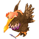
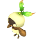
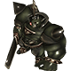

  

# Overview

<table class="dungeonOverview">
  <tr>
    <th>Unlock</th>
    <td class="highlightYellow">???</td>
  </tr>
  <tr>
    <th>Location</th>
    <td class="highlightYellow">???</td>
  </tr>
</table>

<table class="dungeonTable">
  <tr>
    <th>Title</th>
    <td colspan="3">Divine Judgment</td>
  </tr>
  <tr>
    <th>Description</th>
    <td colspan="3">A new challenge from the Guardian Beast of Light! Can you emerge victorious?</td>
  </tr>
  <tr>
    <th>Floors</th>
    <td>6F</td>
    <th>Bosses</th>
    <td>5F</td>
  </tr>
  <tr>
    <th>Change Crystals</th>
    <td>0F</td>
    <th>Checkpoints</th>
    <td>None</td>
  </tr>
  <tr>
    <th>Max Level</th>
    <td>80</td>
    <th>Bring Buddy</th>
    <td>Yes</td>
  </tr>
  <tr>
    <th>Bring In Items</th>
    <td>No</td>
    <th>Take Out Items</th>
    <td>No</td>
  </tr>
  <tr>
    <th>Shops/Duels</th>
    <td>No</td>
    <th>Den of Monsters</th>
    <td>Yes</td>
  </tr>
  <tr>
    <th>Reapers</th>
    <td>Yes</td>
    <th>Bookmark</th>
    <td>No</td>
  </tr>
  <tr>
    <th>Unidentified</th>
    <td colspan="3">Equipment, Consumables</td>
  </tr>
  <tr>
    <th>Rewards</th>
    <td colspan="3">1. ???</td>
  </tr>
</table>

# Strategy

[Content]

# Monsters

<ul><li><a href="#monster-table">Monster Table</a></li><li><a href="#monster-details">Monster Details</a></li></ul>

 

 Monster Table 

Monster Colors - Boss F - 　 means field of view is limited. M - 　 means a Monster Den can appear. R - 　 means  Reaper can spawn.

<table class="monsterTable">
  <thead>
    <tr>
      <th>F</th>
      <th>M</th>
      <th colspan="6">Monsters</th>
      <th>R</th>
    </tr>
  </thead>
  <tbody>
    <tr class="changeCrystal">
      <td class="centeredText">0</td>
      <td></td>
      <td colspan="6" class="centeredText">Change Crystal</td>
      <td></td>
    </tr>
    <tr>
      <td class="centeredText">1</td>
      <td class="highlightGray"></td>
      <td> Dry Cactuar (14%)</td>
      <td> Vulture (29%)</td>
      <td> Tonberry (29%)</td>
      <td> Mandra (29%)</td>
      <td class="highlightGray"></td>
      <td class="highlightGray"></td>
      <td class="highlightReaper"></td>
    </tr>
    <tr>
      <td class="centeredText">2</td>
      <td class="highlightMH"></td>
      <td> Dry Cactuar (17%)</td>
      <td> Flying Eye (22%)</td>
      <td> Iron Giant (22%)</td>
      <td> Bloodbones (17%)</td>
      <td> Coeurl (22%)</td>
      <td class="highlightGray"></td>
      <td class="highlightReaper"></td>
    </tr>
    <tr>
      <td class="centeredText">3</td>
      <td class="highlightMH"></td>
      <td> Light Elemental (19%)</td>
      <td> Simurgh (19%)</td>
      <td> Master Tonberry (19%)</td>
      <td> Mandragora (19%)</td>
      <td> Belial (15%)</td>
      <td> Cactuar (9%)</td>
      <td class="highlightReaper"></td>
    </tr>
    <tr>
      <td class="centeredText">4</td>
      <td class="highlightMH"></td>
      <td> Light Elemental (18%)</td>
      <td> Ahriman (18%)</td>
      <td> Iron Giant Steel (18%)</td>
      <td> Queen Coeurl (18%)</td>
      <td> Lizard (14%)</td>
      <td> Cactuar (14%)</td>
      <td class="highlightReaper"></td>
    </tr>
    <tr>
      <td class="centeredText">5</td>
      <td class="highlightGray"></td>
      <td> Alexander</td>
      <td> Right Arm</td>
      <td> Left Arm</td>
      <td class="highlightGray"></td>
      <td class="highlightGray"></td>
      <td class="highlightGray"></td>
      <td class="highlightGray"></td>
    </tr>
    <tr class="highlightYellow">
      <td class="centeredText">6</td>
      <td></td>
      <td colspan="6"></td>
      <td></td>
    </tr>
  </tbody>
</table>

 

 Monster Details 

Stat Colors - Hard Mode

### Standard

#### Mandra (1F)

<table class="buddyOverview">
  <tr class="noPad">
    <th colspan="13" class="highlightGreen">Stats</th>
  </tr>
  <tr>
    <td rowspan="4"></td>
    <td class="hp">HP</td>
    <td>126 / 154</td>
    <td class="atk">Attack</td>
    <td>110 / 115</td>
    <td class="mag">Magic</td>
    <td>61 / 63</td>
    <th>JP</th>
    <td>-</td>
    <th>Item 1</th>
    <td colspan="3">Potion (15%)</td>
  </tr>
  <tr>
    <td class="sp">Exp</td>
    <td>221</td>
    <td class="def">Defense</td>
    <td>73 / 74</td>
    <td class="mnd">Mind</td>
    <td>57 / 57</td>
    <th>BP</th>
    <td>3 (50%)</td>
    <th>Item 2</th>
    <td colspan="3">Devil's Tonic (25%)</td>
  </tr>
  <tr>
    <th>Hit</th>
    <td>95</td>
    <th>Evasion</th>
    <td>2</td>
    <th>Crit</th>
    <td>5</td>
    <th>Gil</th>
    <td>-</td>
    <th>Steal</th>
    <td colspan="3">Potion (30%)</td>
  </tr>
  <tr>
    <th>Lv</th>
    <td>37</td>
    <th>Special</th>
    <td>-</td>
    <th>Resist</th>
    <td colspan="3"></td>
    <th>Weak</th>
    <td colspan="3">-</td>
  </tr>
  <tr>
    <th colspan="13" class="abilityName">Seeds</th>
  </tr>
  <tr class="elementIcon">
    <th>Element</th>
    <td>-</td>
    <th>Range</th>
    <td></td>
    <th>Notes</th>
    <td colspan="8" class="leftText">Deal damage to a target up to 3 tiles ahead.</td>
  </tr>
  <tr>
    <th>Rate / CD</th>
    <td colspan="2">20% / 0T</td>
    <th>Count</th>
    <td>∞</td>
    <th>Multiplier</th>
    <td>x2.0</td>
    <th>Value</th>
    <td>0</td>
    <th>Type</th>
    <td class="leftText">Physical</td>
    <th>Calc</th>
    <td class="leftText">Stat</td>
  </tr>
  <tr>
    <th colspan="13" class="abilityName">Dreamy Flower</th>
  </tr>
  <tr class="elementIcon">
    <th>Element</th>
    <td>-</td>
    <th>Range</th>
    <td></td>
    <th>Notes</th>
    <td colspan="8" class="leftText">Inflict Sleep on targets in a 1 tile radius.</td>
  </tr>
  <tr>
    <th>Rate / CD</th>
    <td colspan="2">10% / 4T</td>
    <th>Count</th>
    <td>∞</td>
    <th>Multiplier</th>
    <td>x1.0</td>
    <th>Value</th>
    <td>0</td>
    <th>Type</th>
    <td class="leftText">Other</td>
    <th>Calc</th>
    <td class="leftText">None</td>
  </tr>
  <tr>
    <th colspan="13" class="abilityName">Baby's Breath</th>
  </tr>
  <tr class="elementIcon">
    <th>Element</th>
    <td>-</td>
    <th>Range</th>
    <td></td>
    <th>Notes</th>
    <td colspan="8" class="leftText">Inflict Blind on targets in a 1 tile radius.</td>
  </tr>
  <tr>
    <th>Rate / CD</th>
    <td colspan="2">10% / 4T</td>
    <th>Count</th>
    <td>∞</td>
    <th>Multiplier</th>
    <td>x1.0</td>
    <th>Value</th>
    <td>0</td>
    <th>Type</th>
    <td class="leftText">Other</td>
    <th>Calc</th>
    <td class="leftText">None</td>
  </tr>
</table>

#### Tonberry (1F)

<table class="buddyOverview">
  <tr class="noPad">
    <th colspan="13" class="highlightGreen">Stats</th>
  </tr>
  <tr>
    <td rowspan="4"></td>
    <td class="hp">HP</td>
    <td>92 / 112</td>
    <td class="atk">Attack</td>
    <td>110 / 115</td>
    <td class="mag">Magic</td>
    <td>69 / 71</td>
    <th>JP</th>
    <td>-</td>
    <th>Item 1</th>
    <td colspan="3">Potion (15%)</td>
  </tr>
  <tr>
    <td class="sp">Exp</td>
    <td>265</td>
    <td class="def">Defense</td>
    <td>65 / 66</td>
    <td class="mnd">Mind</td>
    <td>999 / 999</td>
    <th>BP</th>
    <td>3 (50%)</td>
    <th>Item 2</th>
    <td colspan="3">Poison Drink (25%)</td>
  </tr>
  <tr>
    <th>Hit</th>
    <td>95</td>
    <th>Evasion</th>
    <td>8</td>
    <th>Crit</th>
    <td>100</td>
    <th>Gil</th>
    <td>-</td>
    <th>Steal</th>
    <td colspan="3">Potion (30%)</td>
  </tr>
  <tr>
    <th>Lv</th>
    <td>37</td>
    <th>Special</th>
    <td></td>
    <th>Resist</th>
    <td colspan="3"></td>
    <th>Weak</th>
    <td colspan="3">-</td>
  </tr>
  <tr>
    <th colspan="13" class="abilityName">Knife</th>
  </tr>
  <tr class="elementIcon">
    <th>Element</th>
    <td>-</td>
    <th>Range</th>
    <td></td>
    <th>Notes</th>
    <td colspan="8" class="leftText">Halve the HP of a target 1 tile ahead.</td>
  </tr>
  <tr>
    <th>Rate / CD</th>
    <td colspan="2">10% / 6T</td>
    <th>Count</th>
    <td>∞</td>
    <th>Multiplier</th>
    <td>x1.0</td>
    <th>Value</th>
    <td>50</td>
    <th>Type</th>
    <td class="leftText">Physical</td>
    <th>Calc</th>
    <td class="leftText">Ratio</td>
  </tr>
  <tr>
    <th colspan="13" class="abilityName">Slow</th>
  </tr>
  <tr class="elementIcon">
    <th>Element</th>
    <td>-</td>
    <th>Range</th>
    <td></td>
    <th>Notes</th>
    <td colspan="8" class="leftText">Inflict Slow on a target up to 2 tiles ahead.</td>
  </tr>
  <tr>
    <th>Rate / CD</th>
    <td colspan="2">5% / 6T</td>
    <th>Count</th>
    <td>∞</td>
    <th>Multiplier</th>
    <td>x1.0</td>
    <th>Value</th>
    <td>0</td>
    <th>Type</th>
    <td class="leftText">Other</td>
    <th>Calc</th>
    <td class="leftText">None</td>
  </tr>
</table>

#### Vulture (1F)

<table class="buddyOverview">
  <tr class="noPad">
    <th colspan="13" class="highlightGreen">Stats</th>
  </tr>
  <tr>
    <td rowspan="4"></td>
    <td class="hp">HP</td>
    <td>92 / 112</td>
    <td class="atk">Attack</td>
    <td>130 / 135</td>
    <td class="mag">Magic</td>
    <td>53 / 55</td>
    <th>JP</th>
    <td>-</td>
    <th>Item 1</th>
    <td colspan="3">Potion (15%)</td>
  </tr>
  <tr>
    <td class="sp">Exp</td>
    <td>221</td>
    <td class="def">Defense</td>
    <td>65 / 66</td>
    <td class="mnd">Mind</td>
    <td>57 / 57</td>
    <th>BP</th>
    <td>3 (50%)</td>
    <th>Item 2</th>
    <td colspan="3">Blind Drink (25%)</td>
  </tr>
  <tr>
    <th>Hit</th>
    <td>85</td>
    <th>Evasion</th>
    <td>8</td>
    <th>Crit</th>
    <td>20</td>
    <th>Gil</th>
    <td>-</td>
    <th>Steal</th>
    <td colspan="3">Potion (30%)</td>
  </tr>
  <tr>
    <th>Lv</th>
    <td>37</td>
    <th>Special</th>
    <td></td>
    <th>Resist</th>
    <td colspan="3">-</td>
    <th>Weak</th>
    <td colspan="3"></td>
  </tr>
  <tr>
    <th colspan="13" class="abilityName">Wing Flap</th>
  </tr>
  <tr class="elementIcon">
    <th>Element</th>
    <td>-</td>
    <th>Range</th>
    <td></td>
    <th>Notes</th>
    <td colspan="8" class="leftText">Temporarily cast Haste.</td>
  </tr>
  <tr>
    <th>Rate / CD</th>
    <td colspan="2">10% / 30T</td>
    <th>Count</th>
    <td>∞</td>
    <th>Multiplier</th>
    <td>x1.0</td>
    <th>Value</th>
    <td>0</td>
    <th>Type</th>
    <td class="leftText">Other</td>
    <th>Calc</th>
    <td class="leftText">None</td>
  </tr>
  <tr>
    <th colspan="13" class="abilityName">Gale</th>
  </tr>
  <tr class="elementIcon">
    <th>Element</th>
    <td></td>
    <th>Range</th>
    <td></td>
    <th>Notes</th>
    <td colspan="8" class="leftText">Deal wind damage to a target 1 tile ahead.</td>
  </tr>
  <tr>
    <th>Rate / CD</th>
    <td colspan="2">10% / 0T</td>
    <th>Count</th>
    <td>∞</td>
    <th>Multiplier</th>
    <td>x1.0</td>
    <th>Value</th>
    <td>0</td>
    <th>Type</th>
    <td class="leftText">Magic</td>
    <th>Calc</th>
    <td class="leftText">Stat</td>
  </tr>
</table>

#### Dry Cactuar (1-2F)

<table class="buddyOverview">
  <tr class="noPad">
    <th colspan="13" class="highlightGreen">Stats</th>
  </tr>
  <tr>
    <td rowspan="4"></td>
    <td class="hp">HP</td>
    <td>140 / 171</td>
    <td class="atk">Attack</td>
    <td>152 / 156</td>
    <td class="mag">Magic</td>
    <td>63 / 65</td>
    <th>JP</th>
    <td>-</td>
    <th>Item 1</th>
    <td colspan="3">Hi-Potion (35%)</td>
  </tr>
  <tr>
    <td class="sp">Exp</td>
    <td>319</td>
    <td class="def">Defense</td>
    <td>80 / 81</td>
    <td class="mnd">Mind</td>
    <td>70 / 71</td>
    <th>BP</th>
    <td>3 (50%)</td>
    <th>Item 2</th>
    <td colspan="3">Ether (35%)</td>
  </tr>
  <tr>
    <th>Hit</th>
    <td>95</td>
    <th>Evasion</th>
    <td>8</td>
    <th>Crit</th>
    <td>5</td>
    <th>Gil</th>
    <td>-</td>
    <th>Steal</th>
    <td colspan="3">Ether (30%)</td>
  </tr>
  <tr>
    <th>Lv</th>
    <td>42</td>
    <th>Special</th>
    <td>-</td>
    <th>Resist</th>
    <td colspan="3"></td>
    <th>Weak</th>
    <td colspan="3"></td>
  </tr>
  <tr>
    <th colspan="13" class="abilityName">Gil Toss</th>
  </tr>
  <tr class="elementIcon">
    <th>Element</th>
    <td>-</td>
    <th>Range</th>
    <td></td>
    <th>Notes</th>
    <td colspan="8" class="leftText">Deal damage to a target up to 3 tiles ahead.</td>
  </tr>
  <tr>
    <th>Rate / CD</th>
    <td colspan="2">30% / 0T</td>
    <th>Count</th>
    <td>∞</td>
    <th>Multiplier</th>
    <td>x2.0</td>
    <th>Value</th>
    <td>0</td>
    <th>Type</th>
    <td class="leftText">Physical</td>
    <th>Calc</th>
    <td class="leftText">Stat</td>
  </tr>
  <tr>
    <th colspan="13" class="abilityName">Erase</th>
  </tr>
  <tr class="elementIcon">
    <th>Element</th>
    <td>-</td>
    <th>Range</th>
    <td></td>
    <th>Notes</th>
    <td colspan="8" class="leftText">Wipe player buffs of a target up to 3 tiles ahead.</td>
  </tr>
  <tr>
    <th>Rate / CD</th>
    <td colspan="2">10% / 6T</td>
    <th>Count</th>
    <td>∞</td>
    <th>Multiplier</th>
    <td>x1.0</td>
    <th>Value</th>
    <td>0</td>
    <th>Type</th>
    <td class="leftText">Other</td>
    <th>Calc</th>
    <td class="leftText">None</td>
  </tr>
</table>

#### Flying Eye (2F)

<table class="buddyOverview">
  <tr class="noPad">
    <th colspan="13" class="highlightGreen">Stats</th>
  </tr>
  <tr>
    <td rowspan="4"></td>
    <td class="hp">HP</td>
    <td>140 / 171</td>
    <td class="atk">Attack</td>
    <td>112 / 116</td>
    <td class="mag">Magic</td>
    <td>79 / 81</td>
    <th>JP</th>
    <td>-</td>
    <th>Item 1</th>
    <td colspan="3">Potion (20%)</td>
  </tr>
  <tr>
    <td class="sp">Exp</td>
    <td>266</td>
    <td class="def">Defense</td>
    <td>80 / 81</td>
    <td class="mnd">Mind</td>
    <td>70 / 71</td>
    <th>BP</th>
    <td>3 (50%)</td>
    <th>Item 2</th>
    <td colspan="3">Silence Drink (30%)</td>
  </tr>
  <tr>
    <th>Hit</th>
    <td>95</td>
    <th>Evasion</th>
    <td>8</td>
    <th>Crit</th>
    <td>5</td>
    <th>Gil</th>
    <td>-</td>
    <th>Steal</th>
    <td colspan="3">Potion (30%)</td>
  </tr>
  <tr>
    <th>Lv</th>
    <td>42</td>
    <th>Special</th>
    <td></td>
    <th>Resist</th>
    <td colspan="3"></td>
    <th>Weak</th>
    <td colspan="3">-</td>
  </tr>
  <tr>
    <th colspan="13" class="abilityName">Hypnosis</th>
  </tr>
  <tr class="elementIcon">
    <th>Element</th>
    <td>-</td>
    <th>Range</th>
    <td></td>
    <th>Notes</th>
    <td colspan="8" class="leftText">Inflict Sleep on a target 1 tile ahead.</td>
  </tr>
  <tr>
    <th>Rate / CD</th>
    <td colspan="2">15% / 3T</td>
    <th>Count</th>
    <td>∞</td>
    <th>Multiplier</th>
    <td>x1.0</td>
    <th>Value</th>
    <td>0</td>
    <th>Type</th>
    <td class="leftText">Other</td>
    <th>Calc</th>
    <td class="leftText">None</td>
  </tr>
  <tr>
    <th colspan="13" class="abilityName">Protect</th>
  </tr>
  <tr class="elementIcon">
    <th>Element</th>
    <td>-</td>
    <th>Range</th>
    <td></td>
    <th>Notes</th>
    <td colspan="8" class="leftText">Temporarily cast Protect on self or a target up to 2 tiles ahead.</td>
  </tr>
  <tr>
    <th>Rate / CD</th>
    <td colspan="2">10% / 6T</td>
    <th>Count</th>
    <td>∞</td>
    <th>Multiplier</th>
    <td>x1.0</td>
    <th>Value</th>
    <td>0</td>
    <th>Type</th>
    <td class="leftText">Other</td>
    <th>Calc</th>
    <td class="leftText">None</td>
  </tr>
  <tr>
    <th colspan="13" class="abilityName">Gaze</th>
  </tr>
  <tr class="elementIcon">
    <th>Element</th>
    <td>-</td>
    <th>Range</th>
    <td></td>
    <th>Notes</th>
    <td colspan="8" class="leftText">Inflict Silence on a target 1 tile ahead.</td>
  </tr>
  <tr>
    <th>Rate / CD</th>
    <td colspan="2">10% / 6T</td>
    <th>Count</th>
    <td>∞</td>
    <th>Multiplier</th>
    <td>x1.0</td>
    <th>Value</th>
    <td>0</td>
    <th>Type</th>
    <td class="leftText">Other</td>
    <th>Calc</th>
    <td class="leftText">None</td>
  </tr>
</table>

#### Iron Giant (2F)

<table class="buddyOverview">
  <tr class="noPad">
    <th colspan="13" class="highlightGreen">Stats</th>
  </tr>
  <tr>
    <td rowspan="4"></td>
    <td class="hp">HP</td>
    <td>210 / 256</td>
    <td class="atk">Attack</td>
    <td>152 / 156</td>
    <td class="mag">Magic</td>
    <td>63 / 65</td>
    <th>JP</th>
    <td>-</td>
    <th>Item 1</th>
    <td colspan="3">Potion (20%)</td>
  </tr>
  <tr>
    <td class="sp">Exp</td>
    <td>319</td>
    <td class="def">Defense</td>
    <td>80 / 81</td>
    <td class="mnd">Mind</td>
    <td>50 / 51</td>
    <th>BP</th>
    <td>3 (50%)</td>
    <th>Item 2</th>
    <td colspan="3">Sleep Drink (30%)</td>
  </tr>
  <tr>
    <th>Hit</th>
    <td>85</td>
    <th>Evasion</th>
    <td>2</td>
    <th>Crit</th>
    <td>5</td>
    <th>Gil</th>
    <td>-</td>
    <th>Steal</th>
    <td colspan="3">Potion (30%)</td>
  </tr>
  <tr>
    <th>Lv</th>
    <td>42</td>
    <th>Special</th>
    <td></td>
    <th>Resist</th>
    <td colspan="3">-</td>
    <th>Weak</th>
    <td colspan="3"></td>
  </tr>
  <tr>
    <th colspan="13" class="abilityName">Battle Cry</th>
  </tr>
  <tr class="elementIcon">
    <th>Element</th>
    <td>-</td>
    <th>Range</th>
    <td></td>
    <th>Notes</th>
    <td colspan="8" class="leftText">Temporarily cast Bravery.</td>
  </tr>
  <tr>
    <th>Rate / CD</th>
    <td colspan="2">5% / 30T</td>
    <th>Count</th>
    <td>∞</td>
    <th>Multiplier</th>
    <td>x1.0</td>
    <th>Value</th>
    <td>0</td>
    <th>Type</th>
    <td class="leftText">Other</td>
    <th>Calc</th>
    <td class="leftText">None</td>
  </tr>
  <tr>
    <th colspan="13" class="abilityName">Slash</th>
  </tr>
  <tr class="elementIcon">
    <th>Element</th>
    <td>-</td>
    <th>Range</th>
    <td></td>
    <th>Notes</th>
    <td colspan="8" class="leftText">Deal damage to a target 1 tile ahead.</td>
  </tr>
  <tr>
    <th>Rate / CD</th>
    <td colspan="2">10% / 0T</td>
    <th>Count</th>
    <td>∞</td>
    <th>Multiplier</th>
    <td>x2.0</td>
    <th>Value</th>
    <td>0</td>
    <th>Type</th>
    <td class="leftText">Physical</td>
    <th>Calc</th>
    <td class="leftText">Stat</td>
  </tr>
</table>

#### Coeurl (2F)

<table class="buddyOverview">
  <tr class="noPad">
    <th colspan="13" class="highlightGreen">Stats</th>
  </tr>
  <tr>
    <td rowspan="4"></td>
    <td class="hp">HP</td>
    <td>102 / 124</td>
    <td class="atk">Attack</td>
    <td>132 / 136</td>
    <td class="mag">Magic</td>
    <td>63 / 65</td>
    <th>JP</th>
    <td>-</td>
    <th>Item 1</th>
    <td colspan="3">Potion (20%)</td>
  </tr>
  <tr>
    <td class="sp">Exp</td>
    <td>266</td>
    <td class="def">Defense</td>
    <td>72 / 73</td>
    <td class="mnd">Mind</td>
    <td>58 / 59</td>
    <th>BP</th>
    <td>3 (50%)</td>
    <th>Item 2</th>
    <td colspan="3">Amnesia Drink (30%)</td>
  </tr>
  <tr>
    <th>Hit</th>
    <td>85</td>
    <th>Evasion</th>
    <td>8</td>
    <th>Crit</th>
    <td>5</td>
    <th>Gil</th>
    <td>-</td>
    <th>Steal</th>
    <td colspan="3">Potion (30%)</td>
  </tr>
  <tr>
    <th>Lv</th>
    <td>42</td>
    <th>Special</th>
    <td></td>
    <th>Resist</th>
    <td colspan="3">-</td>
    <th>Weak</th>
    <td colspan="3">-</td>
  </tr>
  <tr>
    <th colspan="13" class="abilityName">Bite</th>
  </tr>
  <tr class="elementIcon">
    <th>Element</th>
    <td>-</td>
    <th>Range</th>
    <td></td>
    <th>Notes</th>
    <td colspan="8" class="leftText">Deal damage + Immobilize to a target 1 tile ahead.</td>
  </tr>
  <tr>
    <th>Rate / CD</th>
    <td colspan="2">30% / 4T</td>
    <th>Count</th>
    <td>∞</td>
    <th>Multiplier</th>
    <td>x1.0</td>
    <th>Value</th>
    <td>0</td>
    <th>Type</th>
    <td class="leftText">Physical</td>
    <th>Calc</th>
    <td class="leftText">Stat</td>
  </tr>
  <tr>
    <th colspan="13" class="abilityName">Chaotic Eye</th>
  </tr>
  <tr class="elementIcon">
    <th>Element</th>
    <td>-</td>
    <th>Range</th>
    <td></td>
    <th>Notes</th>
    <td colspan="8" class="leftText">Inflict Silence on a target 1 tile ahead.</td>
  </tr>
  <tr>
    <th>Rate / CD</th>
    <td colspan="2">10% / 4T</td>
    <th>Count</th>
    <td>∞</td>
    <th>Multiplier</th>
    <td>x1.0</td>
    <th>Value</th>
    <td>0</td>
    <th>Type</th>
    <td class="leftText">Other</td>
    <th>Calc</th>
    <td class="leftText">None</td>
  </tr>
</table>

#### Bloodbones (2F)

<table class="buddyOverview">
  <tr class="noPad">
    <th colspan="13" class="highlightGreen">Stats</th>
  </tr>
  <tr>
    <td rowspan="4"></td>
    <td class="hp">HP</td>
    <td>106 / 129</td>
    <td class="atk">Attack</td>
    <td>140 / 144</td>
    <td class="mag">Magic</td>
    <td>83 / 85</td>
    <th>JP</th>
    <td>-</td>
    <th>Item 1</th>
    <td colspan="3">Hi-Potion (24%)</td>
  </tr>
  <tr>
    <td class="sp">Exp</td>
    <td>268</td>
    <td class="def">Defense</td>
    <td>91 / 93</td>
    <td class="mnd">Mind</td>
    <td>51 / 51</td>
    <th>BP</th>
    <td>3 (50%)</td>
    <th>Item 2</th>
    <td colspan="3">Slow Drink (30%)</td>
  </tr>
  <tr>
    <th>Hit</th>
    <td>95</td>
    <th>Evasion</th>
    <td>4</td>
    <th>Crit</th>
    <td>5</td>
    <th>Gil</th>
    <td>-</td>
    <th>Steal</th>
    <td colspan="3">Ether (30%)</td>
  </tr>
  <tr>
    <th>Lv</th>
    <td>44</td>
    <th>Special</th>
    <td></td>
    <th>Resist</th>
    <td colspan="3"></td>
    <th>Weak</th>
    <td colspan="3"></td>
  </tr>
  <tr>
    <th colspan="13" class="abilityName">Poison Slash</th>
  </tr>
  <tr class="elementIcon">
    <th>Element</th>
    <td>-</td>
    <th>Range</th>
    <td></td>
    <th>Notes</th>
    <td colspan="8" class="leftText">Deal damage + Poison to a target 1 tile ahead.</td>
  </tr>
  <tr>
    <th>Rate / CD</th>
    <td colspan="2">10% / 3T</td>
    <th>Count</th>
    <td>∞</td>
    <th>Multiplier</th>
    <td>x1.0</td>
    <th>Value</th>
    <td>0</td>
    <th>Type</th>
    <td class="leftText">Physical</td>
    <th>Calc</th>
    <td class="leftText">Stat</td>
  </tr>
  <tr>
    <th colspan="13" class="abilityName">Horror Cloud</th>
  </tr>
  <tr class="elementIcon">
    <th>Element</th>
    <td>-</td>
    <th>Range</th>
    <td></td>
    <th>Notes</th>
    <td colspan="8" class="leftText">Inflict Slow on a target 1 tile ahead.</td>
  </tr>
  <tr>
    <th>Rate / CD</th>
    <td colspan="2">10% / 3T</td>
    <th>Count</th>
    <td>∞</td>
    <th>Multiplier</th>
    <td>x1.0</td>
    <th>Value</th>
    <td>0</td>
    <th>Type</th>
    <td class="leftText">Other</td>
    <th>Calc</th>
    <td class="leftText">None</td>
  </tr>
  <tr>
    <th colspan="13" class="abilityName">Summon</th>
  </tr>
  <tr class="elementIcon">
    <th>Element</th>
    <td>-</td>
    <th>Range</th>
    <td></td>
    <th>Notes</th>
    <td colspan="8" class="leftText">Warp a different monster on the current floor to self.</td>
  </tr>
  <tr>
    <th>Rate / CD</th>
    <td colspan="2">10% / 12T</td>
    <th>Count</th>
    <td>1</td>
    <th>Multiplier</th>
    <td>x1.0</td>
    <th>Value</th>
    <td>0</td>
    <th>Type</th>
    <td class="leftText">Other</td>
    <th>Calc</th>
    <td class="leftText">None</td>
  </tr>
</table>

#### Mandragora (3F)

<table class="buddyOverview">
  <tr class="noPad">
    <th colspan="13" class="highlightGreen">Stats</th>
  </tr>
  <tr>
    <td rowspan="4"></td>
    <td class="hp">HP</td>
    <td>151 / 184</td>
    <td class="atk">Attack</td>
    <td>148 / 152</td>
    <td class="mag">Magic</td>
    <td>79 / 81</td>
    <th>JP</th>
    <td>-</td>
    <th>Item 1</th>
    <td colspan="3">Hi-Potion (20%)</td>
  </tr>
  <tr>
    <td class="sp">Exp</td>
    <td>290</td>
    <td class="def">Defense</td>
    <td>85 / 86</td>
    <td class="mnd">Mind</td>
    <td>59 / 60</td>
    <th>BP</th>
    <td>3 (50%)</td>
    <th>Item 2</th>
    <td colspan="3">Devil's Tonic (35%)</td>
  </tr>
  <tr>
    <th>Hit</th>
    <td>95</td>
    <th>Evasion</th>
    <td>2</td>
    <th>Crit</th>
    <td>5</td>
    <th>Gil</th>
    <td>-</td>
    <th>Steal</th>
    <td colspan="3">Devil's Tonic (30%)</td>
  </tr>
  <tr>
    <th>Lv</th>
    <td>46</td>
    <th>Special</th>
    <td>-</td>
    <th>Resist</th>
    <td colspan="3"></td>
    <th>Weak</th>
    <td colspan="3">-</td>
  </tr>
  <tr>
    <th colspan="13" class="abilityName">Seeds</th>
  </tr>
  <tr class="elementIcon">
    <th>Element</th>
    <td>-</td>
    <th>Range</th>
    <td></td>
    <th>Notes</th>
    <td colspan="8" class="leftText">Deal damage to a target up to 3 tiles ahead.</td>
  </tr>
  <tr>
    <th>Rate / CD</th>
    <td colspan="2">20% / 0T</td>
    <th>Count</th>
    <td>∞</td>
    <th>Multiplier</th>
    <td>x2.0</td>
    <th>Value</th>
    <td>0</td>
    <th>Type</th>
    <td class="leftText">Physical</td>
    <th>Calc</th>
    <td class="leftText">Stat</td>
  </tr>
  <tr>
    <th colspan="13" class="abilityName">Dreamy Flower</th>
  </tr>
  <tr class="elementIcon">
    <th>Element</th>
    <td>-</td>
    <th>Range</th>
    <td></td>
    <th>Notes</th>
    <td colspan="8" class="leftText">Inflict Sleep on targets in a 1 tile radius.</td>
  </tr>
  <tr>
    <th>Rate / CD</th>
    <td colspan="2">10% / 4T</td>
    <th>Count</th>
    <td>∞</td>
    <th>Multiplier</th>
    <td>x1.0</td>
    <th>Value</th>
    <td>0</td>
    <th>Type</th>
    <td class="leftText">Other</td>
    <th>Calc</th>
    <td class="leftText">None</td>
  </tr>
  <tr>
    <th colspan="13" class="abilityName">Scream</th>
  </tr>
  <tr class="elementIcon">
    <th>Element</th>
    <td>-</td>
    <th>Range</th>
    <td></td>
    <th>Notes</th>
    <td colspan="8" class="leftText">Inflict Stun on targets in a 2 tile radius.</td>
  </tr>
  <tr>
    <th>Rate / CD</th>
    <td colspan="2">10% / 4T</td>
    <th>Count</th>
    <td>∞</td>
    <th>Multiplier</th>
    <td>x1.0</td>
    <th>Value</th>
    <td>0</td>
    <th>Type</th>
    <td class="leftText">Other</td>
    <th>Calc</th>
    <td class="leftText">None</td>
  </tr>
</table>

#### Master Tonberry (3F)

<table class="buddyOverview">
  <tr class="noPad">
    <th colspan="13" class="highlightGreen">Stats</th>
  </tr>
  <tr>
    <td rowspan="4"></td>
    <td class="hp">HP</td>
    <td>122 / 148</td>
    <td class="atk">Attack</td>
    <td>172 / 176</td>
    <td class="mag">Magic</td>
    <td>99 / 101</td>
    <th>JP</th>
    <td>-</td>
    <th>Item 1</th>
    <td colspan="3">Ether (20%)</td>
  </tr>
  <tr>
    <td class="sp">Exp</td>
    <td>379</td>
    <td class="def">Defense</td>
    <td>91 / 92</td>
    <td class="mnd">Mind</td>
    <td>999 / 999</td>
    <th>BP</th>
    <td>3 (50%)</td>
    <th>Item 2</th>
    <td colspan="3">Poison Drink (35%)</td>
  </tr>
  <tr>
    <th>Hit</th>
    <td>95</td>
    <th>Evasion</th>
    <td>8</td>
    <th>Crit</th>
    <td>100</td>
    <th>Gil</th>
    <td>-</td>
    <th>Steal</th>
    <td colspan="3">Poison Drink (30%)</td>
  </tr>
  <tr>
    <th>Lv</th>
    <td>52</td>
    <th>Special</th>
    <td></td>
    <th>Resist</th>
    <td colspan="3"></td>
    <th>Weak</th>
    <td colspan="3">-</td>
  </tr>
  <tr>
    <th colspan="13" class="abilityName">Knife</th>
  </tr>
  <tr class="elementIcon">
    <th>Element</th>
    <td>-</td>
    <th>Range</th>
    <td></td>
    <th>Notes</th>
    <td colspan="8" class="leftText">Halve the HP of a target 1 tile ahead.</td>
  </tr>
  <tr>
    <th>Rate / CD</th>
    <td colspan="2">10% / 6T</td>
    <th>Count</th>
    <td>∞</td>
    <th>Multiplier</th>
    <td>x1.0</td>
    <th>Value</th>
    <td>50</td>
    <th>Type</th>
    <td class="leftText">Physical</td>
    <th>Calc</th>
    <td class="leftText">Ratio</td>
  </tr>
  <tr>
    <th colspan="13" class="abilityName">Jugular</th>
  </tr>
  <tr class="elementIcon">
    <th>Element</th>
    <td>-</td>
    <th>Range</th>
    <td></td>
    <th>Notes</th>
    <td colspan="8" class="leftText">Reduce an adjacent target's HP to one digit + Knockback.</td>
  </tr>
  <tr>
    <th>Rate / CD</th>
    <td colspan="2">5% / 6T</td>
    <th>Count</th>
    <td>∞</td>
    <th>Multiplier</th>
    <td>x1.0</td>
    <th>Value</th>
    <td>-1</td>
    <th>Type</th>
    <td class="leftText">Physical</td>
    <th>Calc</th>
    <td class="leftText">Ratio</td>
  </tr>
  <tr>
    <th colspan="13" class="abilityName">Slow</th>
  </tr>
  <tr class="elementIcon">
    <th>Element</th>
    <td>-</td>
    <th>Range</th>
    <td></td>
    <th>Notes</th>
    <td colspan="8" class="leftText">Inflict Slow on a target up to 2 tiles ahead.</td>
  </tr>
  <tr>
    <th>Rate / CD</th>
    <td colspan="2">5% / 6T</td>
    <th>Count</th>
    <td>∞</td>
    <th>Multiplier</th>
    <td>x1.0</td>
    <th>Value</th>
    <td>0</td>
    <th>Type</th>
    <td class="leftText">Other</td>
    <th>Calc</th>
    <td class="leftText">None</td>
  </tr>
</table>

#### Simurgh (3F)

<table class="buddyOverview">
  <tr class="noPad">
    <th colspan="13" class="highlightGreen">Stats</th>
  </tr>
  <tr>
    <td rowspan="4"></td>
    <td class="hp">HP</td>
    <td>110 / 134</td>
    <td class="atk">Attack</td>
    <td>168 / 172</td>
    <td class="mag">Magic</td>
    <td>71 / 73</td>
    <th>JP</th>
    <td>-</td>
    <th>Item 1</th>
    <td colspan="3">Hi-Potion (20%)</td>
  </tr>
  <tr>
    <td class="sp">Exp</td>
    <td>290</td>
    <td class="def">Defense</td>
    <td>77 / 78</td>
    <td class="mnd">Mind</td>
    <td>59 / 60</td>
    <th>BP</th>
    <td>3 (50%)</td>
    <th>Item 2</th>
    <td colspan="3">Blind Drink (35%)</td>
  </tr>
  <tr>
    <th>Hit</th>
    <td>85</td>
    <th>Evasion</th>
    <td>8</td>
    <th>Crit</th>
    <td>20</td>
    <th>Gil</th>
    <td>-</td>
    <th>Steal</th>
    <td colspan="3">Blind Drink (30%)</td>
  </tr>
  <tr>
    <th>Lv</th>
    <td>46</td>
    <th>Special</th>
    <td></td>
    <th>Resist</th>
    <td colspan="3">-</td>
    <th>Weak</th>
    <td colspan="3"></td>
  </tr>
  <tr>
    <th colspan="13" class="abilityName">Wing Flap</th>
  </tr>
  <tr class="elementIcon">
    <th>Element</th>
    <td>-</td>
    <th>Range</th>
    <td></td>
    <th>Notes</th>
    <td colspan="8" class="leftText">Temporarily cast Haste.</td>
  </tr>
  <tr>
    <th>Rate / CD</th>
    <td colspan="2">20% / 30T</td>
    <th>Count</th>
    <td>∞</td>
    <th>Multiplier</th>
    <td>x1.0</td>
    <th>Value</th>
    <td>0</td>
    <th>Type</th>
    <td class="leftText">Other</td>
    <th>Calc</th>
    <td class="leftText">None</td>
  </tr>
  <tr>
    <th colspan="13" class="abilityName">Peck</th>
  </tr>
  <tr class="elementIcon">
    <th>Element</th>
    <td>-</td>
    <th>Range</th>
    <td></td>
    <th>Notes</th>
    <td colspan="8" class="leftText">Deal damage + Knockback to a target 1 tile ahead.</td>
  </tr>
  <tr>
    <th>Rate / CD</th>
    <td colspan="2">20% / 0T</td>
    <th>Count</th>
    <td>∞</td>
    <th>Multiplier</th>
    <td>x2.0</td>
    <th>Value</th>
    <td>0</td>
    <th>Type</th>
    <td class="leftText">Physical</td>
    <th>Calc</th>
    <td class="leftText">Stat</td>
  </tr>
  <tr>
    <th colspan="13" class="abilityName">Gale</th>
  </tr>
  <tr class="elementIcon">
    <th>Element</th>
    <td></td>
    <th>Range</th>
    <td></td>
    <th>Notes</th>
    <td colspan="8" class="leftText">Deal wind damage to a target 1 tile ahead.</td>
  </tr>
  <tr>
    <th>Rate / CD</th>
    <td colspan="2">10% / 0T</td>
    <th>Count</th>
    <td>∞</td>
    <th>Multiplier</th>
    <td>x1.0</td>
    <th>Value</th>
    <td>0</td>
    <th>Type</th>
    <td class="leftText">Magic</td>
    <th>Calc</th>
    <td class="leftText">Stat</td>
  </tr>
</table>

#### Belial (3F)

<table class="buddyOverview">
  <tr class="noPad">
    <th colspan="13" class="highlightGreen">Stats</th>
  </tr>
  <tr>
    <td rowspan="4"></td>
    <td class="hp">HP</td>
    <td>112 / 136</td>
    <td class="atk">Attack</td>
    <td>152 / 156</td>
    <td class="mag">Magic</td>
    <td>89 / 91</td>
    <th>JP</th>
    <td>-</td>
    <th>Item 1</th>
    <td colspan="3">Hi-Potion (24%)</td>
  </tr>
  <tr>
    <td class="sp">Exp</td>
    <td>349</td>
    <td class="def">Defense</td>
    <td>86 / 92</td>
    <td class="mnd">Mind</td>
    <td>72 / 72</td>
    <th>BP</th>
    <td>3 (50%)</td>
    <th>Item 2</th>
    <td colspan="3">Slow Drink (30%)</td>
  </tr>
  <tr>
    <th>Hit</th>
    <td>85</td>
    <th>Evasion</th>
    <td>4</td>
    <th>Crit</th>
    <td>5</td>
    <th>Gil</th>
    <td>-</td>
    <th>Steal</th>
    <td colspan="3">Ether (30%)</td>
  </tr>
  <tr>
    <th>Lv</th>
    <td>47</td>
    <th>Special</th>
    <td></td>
    <th>Resist</th>
    <td colspan="3"></td>
    <th>Weak</th>
    <td colspan="3"></td>
  </tr>
  <tr>
    <th colspan="13" class="abilityName">Demon Touch</th>
  </tr>
  <tr class="elementIcon">
    <th>Element</th>
    <td>-</td>
    <th>Range</th>
    <td></td>
    <th>Notes</th>
    <td colspan="8" class="leftText">Halve an adjacent target's SP.</td>
  </tr>
  <tr>
    <th>Rate / CD</th>
    <td colspan="2">20% / 3T</td>
    <th>Count</th>
    <td>∞</td>
    <th>Multiplier</th>
    <td>x1.0</td>
    <th>Value</th>
    <td>50</td>
    <th>Type</th>
    <td class="leftText">Magic</td>
    <th>Calc</th>
    <td class="leftText">Ratio</td>
  </tr>
  <tr>
    <th colspan="13" class="abilityName">Annul</th>
  </tr>
  <tr class="elementIcon">
    <th>Element</th>
    <td>-</td>
    <th>Range</th>
    <td></td>
    <th>Notes</th>
    <td colspan="8" class="leftText">Reduce an adjacent target's SP to 0.</td>
  </tr>
  <tr>
    <th>Rate / CD</th>
    <td colspan="2">10% / 3T</td>
    <th>Count</th>
    <td>∞</td>
    <th>Multiplier</th>
    <td>x1.0</td>
    <th>Value</th>
    <td>100</td>
    <th>Type</th>
    <td class="leftText">Magic</td>
    <th>Calc</th>
    <td class="leftText">Ratio</td>
  </tr>
  <tr>
    <th colspan="13" class="abilityName">Dark</th>
  </tr>
  <tr class="elementIcon">
    <th>Element</th>
    <td></td>
    <th>Range</th>
    <td></td>
    <th>Notes</th>
    <td colspan="8" class="leftText">Deal dark damage to a target up to 3 tiles ahead.</td>
  </tr>
  <tr>
    <th>Rate / CD</th>
    <td colspan="2">10% / 6T</td>
    <th>Count</th>
    <td>∞</td>
    <th>Multiplier</th>
    <td>x1.0</td>
    <th>Value</th>
    <td>8</td>
    <th>Type</th>
    <td class="leftText">Magic</td>
    <th>Calc</th>
    <td class="leftText">Stat</td>
  </tr>
  <tr>
    <th colspan="13" class="abilityName">Demon Eye</th>
  </tr>
  <tr class="elementIcon">
    <th>Element</th>
    <td>-</td>
    <th>Range</th>
    <td></td>
    <th>Notes</th>
    <td colspan="8" class="leftText">Inflict Silence on a target 1 tile ahead.</td>
  </tr>
  <tr>
    <th>Rate / CD</th>
    <td colspan="2">10% / 3T</td>
    <th>Count</th>
    <td>∞</td>
    <th>Multiplier</th>
    <td>x1.0</td>
    <th>Value</th>
    <td>0</td>
    <th>Type</th>
    <td class="leftText">Other</td>
    <th>Calc</th>
    <td class="leftText">None</td>
  </tr>
</table>

#### Cactuar (3-4F)

<table class="buddyOverview">
  <tr class="noPad">
    <th colspan="13" class="highlightGreen">Stats</th>
  </tr>
  <tr>
    <td rowspan="4"></td>
    <td class="hp">HP</td>
    <td>162 / 197</td>
    <td class="atk">Attack</td>
    <td>184 / 188</td>
    <td class="mag">Magic</td>
    <td>79 / 81</td>
    <th>JP</th>
    <td>-</td>
    <th>Item 1</th>
    <td colspan="3">Potion (30%)</td>
  </tr>
  <tr>
    <td class="sp">Exp</td>
    <td>376</td>
    <td class="def">Defense</td>
    <td>94 / 98</td>
    <td class="mnd">Mind</td>
    <td>73 / 73</td>
    <th>BP</th>
    <td>3 (50%)</td>
    <th>Item 2</th>
    <td colspan="3">X-Potion (30%)</td>
  </tr>
  <tr>
    <th>Hit</th>
    <td>95</td>
    <th>Evasion</th>
    <td>8</td>
    <th>Crit</th>
    <td>5</td>
    <th>Gil</th>
    <td>-</td>
    <th>Steal</th>
    <td colspan="3">Ether (30%)</td>
  </tr>
  <tr>
    <th>Lv</th>
    <td>50</td>
    <th>Special</th>
    <td>-</td>
    <th>Resist</th>
    <td colspan="3"></td>
    <th>Weak</th>
    <td colspan="3"></td>
  </tr>
  <tr>
    <th colspan="13" class="abilityName">Gil Toss</th>
  </tr>
  <tr class="elementIcon">
    <th>Element</th>
    <td>-</td>
    <th>Range</th>
    <td></td>
    <th>Notes</th>
    <td colspan="8" class="leftText">Deal damage to a target up to 3 tiles ahead.</td>
  </tr>
  <tr>
    <th>Rate / CD</th>
    <td colspan="2">30% / 0T</td>
    <th>Count</th>
    <td>∞</td>
    <th>Multiplier</th>
    <td>x2.0</td>
    <th>Value</th>
    <td>0</td>
    <th>Type</th>
    <td class="leftText">Physical</td>
    <th>Calc</th>
    <td class="leftText">Stat</td>
  </tr>
  <tr>
    <th colspan="13" class="abilityName">Erase</th>
  </tr>
  <tr class="elementIcon">
    <th>Element</th>
    <td>-</td>
    <th>Range</th>
    <td></td>
    <th>Notes</th>
    <td colspan="8" class="leftText">Wipe player buffs of a target up to 3 tiles ahead.</td>
  </tr>
  <tr>
    <th>Rate / CD</th>
    <td colspan="2">10% / 6T</td>
    <th>Count</th>
    <td>∞</td>
    <th>Multiplier</th>
    <td>x1.0</td>
    <th>Value</th>
    <td>0</td>
    <th>Type</th>
    <td class="leftText">Other</td>
    <th>Calc</th>
    <td class="leftText">None</td>
  </tr>
  <tr>
    <th colspan="13" class="abilityName">1000 Needles</th>
  </tr>
  <tr class="elementIcon">
    <th>Element</th>
    <td>-</td>
    <th>Range</th>
    <td></td>
    <th>Notes</th>
    <td colspan="8" class="leftText">Reduce a target's HP to one digit up to 3 tiles ahead.</td>
  </tr>
  <tr>
    <th>Rate / CD</th>
    <td colspan="2">5% / 8T</td>
    <th>Count</th>
    <td>∞</td>
    <th>Multiplier</th>
    <td>x1.0</td>
    <th>Value</th>
    <td>-1</td>
    <th>Type</th>
    <td class="leftText">Physical</td>
    <th>Calc</th>
    <td class="leftText">Ratio</td>
  </tr>
</table>

#### Light Elemental (3-4F)

<table class="buddyOverview">
  <tr class="noPad">
    <th colspan="13" class="highlightGreen">Stats</th>
  </tr>
  <tr>
    <td rowspan="4"></td>
    <td class="hp">HP</td>
    <td>4 / 5</td>
    <td class="atk">Attack</td>
    <td>160 / 163</td>
    <td class="mag">Magic</td>
    <td>95 / 97</td>
    <th>JP</th>
    <td>-</td>
    <th>Item 1</th>
    <td colspan="3">Hi-Potion (25%)</td>
  </tr>
  <tr>
    <td class="sp">Exp</td>
    <td>338</td>
    <td class="def">Defense</td>
    <td>104 / 105</td>
    <td class="mnd">Mind</td>
    <td>62 / 62</td>
    <th>BP</th>
    <td>3 (50%)</td>
    <th>Item 2</th>
    <td colspan="3">Haste Drink (30%)</td>
  </tr>
  <tr>
    <th>Hit</th>
    <td>95</td>
    <th>Evasion</th>
    <td>4</td>
    <th>Crit</th>
    <td>0</td>
    <th>Gil</th>
    <td>-</td>
    <th>Steal</th>
    <td colspan="3">Ether (30%)</td>
  </tr>
  <tr>
    <th>Lv</th>
    <td>54</td>
    <th>Special</th>
    <td></td>
    <th>Resist</th>
    <td colspan="3"></td>
    <th>Weak</th>
    <td colspan="3"></td>
  </tr>
  <tr>
    <th colspan="13" class="abilityName">Holy</th>
  </tr>
  <tr class="elementIcon">
    <th>Element</th>
    <td></td>
    <th>Range</th>
    <td></td>
    <th>Notes</th>
    <td colspan="8" class="leftText">Deal light damage to a target up to 3 tiles ahead.</td>
  </tr>
  <tr>
    <th>Rate / CD</th>
    <td colspan="2">10% / 12T</td>
    <th>Count</th>
    <td>∞</td>
    <th>Multiplier</th>
    <td>x2.0</td>
    <th>Value</th>
    <td>16</td>
    <th>Type</th>
    <td class="leftText">Magic</td>
    <th>Calc</th>
    <td class="leftText">Stat</td>
  </tr>
  <tr>
    <th colspan="13" class="abilityName">Cura</th>
  </tr>
  <tr class="elementIcon">
    <th>Element</th>
    <td>-</td>
    <th>Range</th>
    <td></td>
    <th>Notes</th>
    <td colspan="8" class="leftText">Heal HP of self or a target up to 3 tiles ahead.</td>
  </tr>
  <tr>
    <th>Rate / CD</th>
    <td colspan="2">5% / 8T</td>
    <th>Count</th>
    <td>∞</td>
    <th>Multiplier</th>
    <td>x1.0</td>
    <th>Value</th>
    <td>60</td>
    <th>Type</th>
    <td class="leftText">Healing</td>
    <th>Calc</th>
    <td class="leftText">Stat</td>
  </tr>
</table>

#### Ahriman (4F)

<table class="buddyOverview">
  <tr class="noPad">
    <th colspan="13" class="highlightGreen">Stats</th>
  </tr>
  <tr>
    <td rowspan="4"></td>
    <td class="hp">HP</td>
    <td>151 / 184</td>
    <td class="atk">Attack</td>
    <td>128 / 132</td>
    <td class="mag">Magic</td>
    <td>87 / 89</td>
    <th>JP</th>
    <td>-</td>
    <th>Item 1</th>
    <td colspan="3">Ether (20%)</td>
  </tr>
  <tr>
    <td class="sp">Exp</td>
    <td>290</td>
    <td class="def">Defense</td>
    <td>85 / 86</td>
    <td class="mnd">Mind</td>
    <td>71 / 72</td>
    <th>BP</th>
    <td>3 (50%)</td>
    <th>Item 2</th>
    <td colspan="3">Silence Drink (35%)</td>
  </tr>
  <tr>
    <th>Hit</th>
    <td>95</td>
    <th>Evasion</th>
    <td>8</td>
    <th>Crit</th>
    <td>5</td>
    <th>Gil</th>
    <td>-</td>
    <th>Steal</th>
    <td colspan="3">Silence Drink (30%)</td>
  </tr>
  <tr>
    <th>Lv</th>
    <td>46</td>
    <th>Special</th>
    <td></td>
    <th>Resist</th>
    <td colspan="3"></td>
    <th>Weak</th>
    <td colspan="3">-</td>
  </tr>
  <tr>
    <th colspan="13" class="abilityName">Gaze</th>
  </tr>
  <tr class="elementIcon">
    <th>Element</th>
    <td>-</td>
    <th>Range</th>
    <td></td>
    <th>Notes</th>
    <td colspan="8" class="leftText">Inflict Silence on a target 1 tile ahead.</td>
  </tr>
  <tr>
    <th>Rate / CD</th>
    <td colspan="2">15% / 6T</td>
    <th>Count</th>
    <td>∞</td>
    <th>Multiplier</th>
    <td>x1.0</td>
    <th>Value</th>
    <td>0</td>
    <th>Type</th>
    <td class="leftText">Other</td>
    <th>Calc</th>
    <td class="leftText">None</td>
  </tr>
  <tr>
    <th colspan="13" class="abilityName">Protect</th>
  </tr>
  <tr class="elementIcon">
    <th>Element</th>
    <td>-</td>
    <th>Range</th>
    <td></td>
    <th>Notes</th>
    <td colspan="8" class="leftText">Temporarily cast Protect on self or a target up to 2 tiles ahead.</td>
  </tr>
  <tr>
    <th>Rate / CD</th>
    <td colspan="2">10% / 6T</td>
    <th>Count</th>
    <td>∞</td>
    <th>Multiplier</th>
    <td>x1.0</td>
    <th>Value</th>
    <td>0</td>
    <th>Type</th>
    <td class="leftText">Other</td>
    <th>Calc</th>
    <td class="leftText">None</td>
  </tr>
  <tr>
    <th colspan="13" class="abilityName">Haste</th>
  </tr>
  <tr class="elementIcon">
    <th>Element</th>
    <td>-</td>
    <th>Range</th>
    <td></td>
    <th>Notes</th>
    <td colspan="8" class="leftText">Temporarily cast Haste on self or a target up to 2 tiles ahead.</td>
  </tr>
  <tr>
    <th>Rate / CD</th>
    <td colspan="2">10% / 10T</td>
    <th>Count</th>
    <td>∞</td>
    <th>Multiplier</th>
    <td>x1.0</td>
    <th>Value</th>
    <td>0</td>
    <th>Type</th>
    <td class="leftText">Other</td>
    <th>Calc</th>
    <td class="leftText">None</td>
  </tr>
  <tr>
    <th colspan="13" class="abilityName">Manaward</th>
  </tr>
  <tr class="elementIcon">
    <th>Element</th>
    <td>-</td>
    <th>Range</th>
    <td></td>
    <th>Notes</th>
    <td colspan="8" class="leftText">Temporarily cast Manaward on self.</td>
  </tr>
  <tr>
    <th>Rate / CD</th>
    <td colspan="2">10% / 10T</td>
    <th>Count</th>
    <td>∞</td>
    <th>Multiplier</th>
    <td>x1.0</td>
    <th>Value</th>
    <td>0</td>
    <th>Type</th>
    <td class="leftText">Other</td>
    <th>Calc</th>
    <td class="leftText">None</td>
  </tr>
</table>

#### Iron Giant Steel (4F)

<table class="buddyOverview">
  <tr class="noPad">
    <th colspan="13" class="highlightGreen">Stats</th>
  </tr>
  <tr>
    <td rowspan="4"></td>
    <td class="hp">HP</td>
    <td>223 / 272</td>
    <td class="atk">Attack</td>
    <td>164 / 168</td>
    <td class="mag">Magic</td>
    <td>69 / 71</td>
    <th>JP</th>
    <td>-</td>
    <th>Item 1</th>
    <td colspan="3">Hi-Potion (20%)</td>
  </tr>
  <tr>
    <td class="sp">Exp</td>
    <td>322</td>
    <td class="def">Defense</td>
    <td>84 / 85</td>
    <td class="mnd">Mind</td>
    <td>51 / 51</td>
    <th>BP</th>
    <td>3 (50%)</td>
    <th>Item 2</th>
    <td colspan="3">Sleep Drink (35%)</td>
  </tr>
  <tr>
    <th>Hit</th>
    <td>85</td>
    <th>Evasion</th>
    <td>2</td>
    <th>Crit</th>
    <td>5</td>
    <th>Gil</th>
    <td>-</td>
    <th>Steal</th>
    <td colspan="3">Sleep Drink (30%)</td>
  </tr>
  <tr>
    <th>Lv</th>
    <td>45</td>
    <th>Special</th>
    <td></td>
    <th>Resist</th>
    <td colspan="3">-</td>
    <th>Weak</th>
    <td colspan="3"></td>
  </tr>
  <tr>
    <th colspan="13" class="abilityName">Battle Cry</th>
  </tr>
  <tr class="elementIcon">
    <th>Element</th>
    <td>-</td>
    <th>Range</th>
    <td></td>
    <th>Notes</th>
    <td colspan="8" class="leftText">Temporarily cast Bravery.</td>
  </tr>
  <tr>
    <th>Rate / CD</th>
    <td colspan="2">5% / 30T</td>
    <th>Count</th>
    <td>∞</td>
    <th>Multiplier</th>
    <td>x1.0</td>
    <th>Value</th>
    <td>0</td>
    <th>Type</th>
    <td class="leftText">Other</td>
    <th>Calc</th>
    <td class="leftText">None</td>
  </tr>
  <tr>
    <th colspan="13" class="abilityName">Slash</th>
  </tr>
  <tr class="elementIcon">
    <th>Element</th>
    <td>-</td>
    <th>Range</th>
    <td></td>
    <th>Notes</th>
    <td colspan="8" class="leftText">Deal damage to a target 1 tile ahead.</td>
  </tr>
  <tr>
    <th>Rate / CD</th>
    <td colspan="2">10% / 0T</td>
    <th>Count</th>
    <td>∞</td>
    <th>Multiplier</th>
    <td>x2.0</td>
    <th>Value</th>
    <td>0</td>
    <th>Type</th>
    <td class="leftText">Physical</td>
    <th>Calc</th>
    <td class="leftText">Stat</td>
  </tr>
  <tr>
    <th colspan="13" class="abilityName">Multi Slash</th>
  </tr>
  <tr class="elementIcon">
    <th>Element</th>
    <td>-</td>
    <th>Range</th>
    <td></td>
    <th>Notes</th>
    <td colspan="8" class="leftText">Deal damage + Knockback to a target 1 tile ahead.</td>
  </tr>
  <tr>
    <th>Rate / CD</th>
    <td colspan="2">10% / 0T</td>
    <th>Count</th>
    <td>∞</td>
    <th>Multiplier</th>
    <td>x1.0</td>
    <th>Value</th>
    <td>0</td>
    <th>Type</th>
    <td class="leftText">Physical</td>
    <th>Calc</th>
    <td class="leftText">Stat</td>
  </tr>
</table>

#### Queen Coeurl (4F)

<table class="buddyOverview">
  <tr class="noPad">
    <th colspan="13" class="highlightGreen">Stats</th>
  </tr>
  <tr>
    <td rowspan="4"></td>
    <td class="hp">HP</td>
    <td>110 / 134</td>
    <td class="atk">Attack</td>
    <td>148 / 152</td>
    <td class="mag">Magic</td>
    <td>71 / 73</td>
    <th>JP</th>
    <td>-</td>
    <th>Item 1</th>
    <td colspan="3">Hi-Potion (20%)</td>
  </tr>
  <tr>
    <td class="sp">Exp</td>
    <td>290</td>
    <td class="def">Defense</td>
    <td>77 / 78</td>
    <td class="mnd">Mind</td>
    <td>59 / 60</td>
    <th>BP</th>
    <td>3 (50%)</td>
    <th>Item 2</th>
    <td colspan="3">Amnesia Drink (35%)</td>
  </tr>
  <tr>
    <th>Hit</th>
    <td>85</td>
    <th>Evasion</th>
    <td>8</td>
    <th>Crit</th>
    <td>5</td>
    <th>Gil</th>
    <td>-</td>
    <th>Steal</th>
    <td colspan="3">Amnesia Drink (30%)</td>
  </tr>
  <tr>
    <th>Lv</th>
    <td>46</td>
    <th>Special</th>
    <td></td>
    <th>Resist</th>
    <td colspan="3">-</td>
    <th>Weak</th>
    <td colspan="3">-</td>
  </tr>
  <tr>
    <th colspan="13" class="abilityName">Bite</th>
  </tr>
  <tr class="elementIcon">
    <th>Element</th>
    <td>-</td>
    <th>Range</th>
    <td></td>
    <th>Notes</th>
    <td colspan="8" class="leftText">Deal damage + Immobilize to a target 1 tile ahead.</td>
  </tr>
  <tr>
    <th>Rate / CD</th>
    <td colspan="2">30% / 4T</td>
    <th>Count</th>
    <td>∞</td>
    <th>Multiplier</th>
    <td>x1.0</td>
    <th>Value</th>
    <td>0</td>
    <th>Type</th>
    <td class="leftText">Physical</td>
    <th>Calc</th>
    <td class="leftText">Stat</td>
  </tr>
  <tr>
    <th colspan="13" class="abilityName">Chaotic Eye</th>
  </tr>
  <tr class="elementIcon">
    <th>Element</th>
    <td>-</td>
    <th>Range</th>
    <td></td>
    <th>Notes</th>
    <td colspan="8" class="leftText">Inflict Silence on a target 1 tile ahead.</td>
  </tr>
  <tr>
    <th>Rate / CD</th>
    <td colspan="2">10% / 4T</td>
    <th>Count</th>
    <td>∞</td>
    <th>Multiplier</th>
    <td>x1.0</td>
    <th>Value</th>
    <td>0</td>
    <th>Type</th>
    <td class="leftText">Other</td>
    <th>Calc</th>
    <td class="leftText">None</td>
  </tr>
</table>

#### Lizard (4F)

<table class="buddyOverview">
  <tr class="noPad">
    <th colspan="13" class="highlightGreen">Stats</th>
  </tr>
  <tr>
    <td rowspan="4"></td>
    <td class="hp">HP</td>
    <td>162 / 197</td>
    <td class="atk">Attack</td>
    <td>144 / 148</td>
    <td class="mag">Magic</td>
    <td>87 / 89</td>
    <th>JP</th>
    <td>-</td>
    <th>Item 1</th>
    <td colspan="3">Hi-Potion (24%)</td>
  </tr>
  <tr>
    <td class="sp">Exp</td>
    <td>376</td>
    <td class="def">Defense</td>
    <td>86 / 90</td>
    <td class="mnd">Mind</td>
    <td>53 / 53</td>
    <th>BP</th>
    <td>3 (50%)</td>
    <th>Item 2</th>
    <td colspan="3">Slow Drink (30%)</td>
  </tr>
  <tr>
    <th>Hit</th>
    <td>85</td>
    <th>Evasion</th>
    <td>4</td>
    <th>Crit</th>
    <td>20</td>
    <th>Gil</th>
    <td>-</td>
    <th>Steal</th>
    <td colspan="3">Ether (30%)</td>
  </tr>
  <tr>
    <th>Lv</th>
    <td>50</td>
    <th>Special</th>
    <td></td>
    <th>Resist</th>
    <td colspan="3">-</td>
    <th>Weak</th>
    <td colspan="3"></td>
  </tr>
  <tr>
    <th colspan="13" class="abilityName">Flames</th>
  </tr>
  <tr class="elementIcon">
    <th>Element</th>
    <td></td>
    <th>Range</th>
    <td></td>
    <th>Notes</th>
    <td colspan="8" class="leftText">Deal fire damage to all targets up to 2 tiles ahead.</td>
  </tr>
  <tr>
    <th>Rate / CD</th>
    <td colspan="2">10% / 0T</td>
    <th>Count</th>
    <td>∞</td>
    <th>Multiplier</th>
    <td>x1.0</td>
    <th>Value</th>
    <td>0</td>
    <th>Type</th>
    <td class="leftText">Magic</td>
    <th>Calc</th>
    <td class="leftText">Stat</td>
  </tr>
  <tr>
    <th colspan="13" class="abilityName">Poison Breath</th>
  </tr>
  <tr class="elementIcon">
    <th>Element</th>
    <td>-</td>
    <th>Range</th>
    <td></td>
    <th>Notes</th>
    <td colspan="8" class="leftText">Deal damage + Poison to a target 1 tile ahead.</td>
  </tr>
  <tr>
    <th>Rate / CD</th>
    <td colspan="2">10% / 3T</td>
    <th>Count</th>
    <td>∞</td>
    <th>Multiplier</th>
    <td>x1.0</td>
    <th>Value</th>
    <td>0</td>
    <th>Type</th>
    <td class="leftText">Magic</td>
    <th>Calc</th>
    <td class="leftText">Stat</td>
  </tr>
</table>

### Boss

#### Alexander (5F)

<table class="buddyOverview">
  <tr class="noPad">
    <th colspan="14" class="highlightBoss">Stats</th>
  </tr>
  <tr>
    <td rowspan="4"></td>
    <td class="hp">HP</td>
    <td>5800 / 6955</td>
    <td class="atk">Attack</td>
    <td>180 / 180</td>
    <td class="mag">Magic</td>
    <td>136 / 136</td>
    <th>JP</th>
    <td colspan="2">-</td>
    <th>Item 1</th>
    <td colspan="5">-</td>
  </tr>
  <tr>
    <td class="sp">Exp</td>
    <td>0</td>
    <td class="def">Defense</td>
    <td>55 / 55</td>
    <td class="mnd">Mind</td>
    <td>64 / 64</td>
    <th>BP</th>
    <td colspan="2">2 (100%)</td>
    <th>Item 2</th>
    <td colspan="5">-</td>
  </tr>
  <tr>
    <th>Hit</th>
    <td>100</td>
    <th>Evasion</th>
    <td>0</td>
    <th>Crit</th>
    <td>10</td>
    <th>Gil</th>
    <td colspan="2">-</td>
    <th>Steal</th>
    <td colspan="5">Phoenix Down (50%)</td>
  </tr>
  <tr>
    <th>Lv</th>
    <td>45</td>
    <th>Special</th>
    <td>-</td>
    <th>Resist</th>
    <td colspan="4">-</td>
    <th>Weak</th>
    <td colspan="5">-</td>
  </tr>
  <tr>
    <th colspan="14" class="statusResists">Status Resistances</th>
  </tr>
  <tr>
    <th></th>
    <th></th>
    <th></th>
    <th></th>
    <th></th>
    <th></th>
    <th></th>
    <th></th>
    <th></th>
    <th colspan="2">Knockback</th>
    <th>Stun</th>
    <th>Warp</th>
    <th>Ratio</th>
  </tr>
  <tr>
    <td>◯</td>
    <td>✕</td>
    <td>✕</td>
    <td>✕</td>
    <td>✕</td>
    <td>◯</td>
    <td>✕</td>
    <td>◯</td>
    <td>◯</td>
    <td colspan="2">✕</td>
    <td>✕</td>
    <td>✕</td>
    <td>◯</td>
  </tr>
  <tr>
    <th colspan="14" class="abilityName">Last Judgment</th>
  </tr>
  <tr class="elementIcon">
    <th>Element</th>
    <td></td>
    <th>Range</th>
    <td></td>
    <th>Notes</th>
    <td colspan="13" class="leftText">Deal light damage to targets in the room, wipe player buffs, restore Left Arm and Right Arm, remove Holy Judgment's charge-up.</td>
  </tr>
  <tr>
    <th>Rate / CD</th>
    <td colspan="2">0% | 100% / 0T</td>
    <th>Count</th>
    <td>1</td>
    <th>Multiplier</th>
    <td>x4.0</td>
    <th>Value</th>
    <td>30</td>
    <th>Type</th>
    <td colspan="2" class="leftText">Magic</td>
    <th>Calc</th>
    <td class="leftText">Stat</td>
  </tr>
  <tr>
    <th colspan="14" class="abilityName">Holy Judgment</th>
  </tr>
  <tr class="elementIcon">
    <th>Element</th>
    <td></td>
    <th>Range</th>
    <td></td>
    <th>Notes</th>
    <td colspan="13" class="leftText">Deal light damage + Strong Knockback to targets lined up within 10 tiles.</td>
  </tr>
  <tr>
    <th>Rate / CD</th>
    <td colspan="2">90% | 100% / 6T</td>
    <th>Count</th>
    <td>∞</td>
    <th>Multiplier</th>
    <td>x2.0</td>
    <th>Value</th>
    <td>24</td>
    <th>Type</th>
    <td colspan="2" class="leftText">Magic</td>
    <th>Calc</th>
    <td class="leftText">Stat</td>
  </tr>
  <tr>
    <th colspan="14" class="abilityName">Restore</th>
  </tr>
  <tr class="elementIcon">
    <th>Element</th>
    <td>-</td>
    <th>Range</th>
    <td></td>
    <th>Notes</th>
    <td colspan="13" class="leftText">Restore Left Arm and Right Arm.</td>
  </tr>
  <tr>
    <th>Rate / CD</th>
    <td colspan="2">75% | 75% / 6T</td>
    <th>Count</th>
    <td>∞</td>
    <th>Multiplier</th>
    <td>x1.0</td>
    <th>Value</th>
    <td>0</td>
    <th>Type</th>
    <td colspan="2" class="leftText">Other</td>
    <th>Calc</th>
    <td class="leftText">None</td>
  </tr>
  <tr>
    <th colspan="14" class="abilityName">Homing Laser</th>
  </tr>
  <tr class="elementIcon">
    <th>Element</th>
    <td>-</td>
    <th>Range</th>
    <td></td>
    <th>Notes</th>
    <td colspan="13" class="leftText">Deal damage to Chocobo's previous position on the next turn.</td>
  </tr>
  <tr>
    <th>Rate / CD</th>
    <td colspan="2">100% | 100% / 3T</td>
    <th>Count</th>
    <td>∞</td>
    <th>Multiplier</th>
    <td>x3.0</td>
    <th>Value</th>
    <td>25</td>
    <th>Type</th>
    <td colspan="2" class="leftText">Magic</td>
    <th>Calc</th>
    <td class="leftText">Stat</td>
  </tr>
  <tr>
    <th colspan="14" class="abilityName">Pray</th>
  </tr>
  <tr class="elementIcon">
    <th>Element</th>
    <td>-</td>
    <th>Range</th>
    <td></td>
    <th>Notes</th>
    <td colspan="13" class="leftText">Heal the user's HP by 10% + Cure ailments.</td>
  </tr>
  <tr>
    <th>Rate / CD</th>
    <td colspan="2">10% | 0% / 16T</td>
    <th>Count</th>
    <td>3</td>
    <th>Multiplier</th>
    <td>x1.0</td>
    <th>Value</th>
    <td>10</td>
    <th>Type</th>
    <td colspan="2" class="leftText">Healing</td>
    <th>Calc</th>
    <td class="leftText">Unknown</td>
  </tr>
</table>

#### Left Arm (5F)

<table class="buddyOverview">
  <tr class="noPad">
    <th colspan="14" class="highlightBoss">Stats</th>
  </tr>
  <tr>
    <td rowspan="4"></td>
    <td class="hp">HP</td>
    <td>100 / 119</td>
    <td class="atk">Attack</td>
    <td>176 / 176</td>
    <td class="mag">Magic</td>
    <td>100 / 100</td>
    <th>JP</th>
    <td colspan="2">-</td>
    <th>Item 1</th>
    <td colspan="5">Hi-Potion (50%)</td>
  </tr>
  <tr>
    <td class="sp">Exp</td>
    <td>0</td>
    <td class="def">Defense</td>
    <td>103 / 103</td>
    <td class="mnd">Mind</td>
    <td>111 / 111</td>
    <th>BP</th>
    <td colspan="2">-</td>
    <th>Item 2</th>
    <td colspan="5">-</td>
  </tr>
  <tr>
    <th>Hit</th>
    <td>100</td>
    <th>Evasion</th>
    <td>0</td>
    <th>Crit</th>
    <td>5</td>
    <th>Gil</th>
    <td colspan="2">-</td>
    <th>Steal</th>
    <td colspan="5">Hi-Ether (50%)</td>
  </tr>
  <tr>
    <th>Lv</th>
    <td>40</td>
    <th>Special</th>
    <td></td>
    <th>Resist</th>
    <td colspan="4">-</td>
    <th>Weak</th>
    <td colspan="5">-</td>
  </tr>
  <tr>
    <th colspan="14" class="statusResists">Status Resistances</th>
  </tr>
  <tr>
    <th></th>
    <th></th>
    <th></th>
    <th></th>
    <th></th>
    <th></th>
    <th></th>
    <th></th>
    <th></th>
    <th colspan="2">Knockback</th>
    <th>Stun</th>
    <th>Warp</th>
    <th>Ratio</th>
  </tr>
  <tr>
    <td>◯</td>
    <td>◯</td>
    <td>◯</td>
    <td>◯</td>
    <td>◯</td>
    <td>◯</td>
    <td>◯</td>
    <td>◯</td>
    <td>◯</td>
    <td colspan="2">◯</td>
    <td>◯</td>
    <td>◯</td>
    <td>◯</td>
  </tr>
</table>

#### Right Arm (5F)

<table class="buddyOverview">
  <tr class="noPad">
    <th colspan="14" class="highlightBoss">Stats</th>
  </tr>
  <tr>
    <td rowspan="4"></td>
    <td class="hp">HP</td>
    <td>100 / 119</td>
    <td class="atk">Attack</td>
    <td>178 / 178</td>
    <td class="mag">Magic</td>
    <td>100 / 100</td>
    <th>JP</th>
    <td colspan="2">-</td>
    <th>Item 1</th>
    <td colspan="5">Hi-Ether (50%)</td>
  </tr>
  <tr>
    <td class="sp">Exp</td>
    <td>0</td>
    <td class="def">Defense</td>
    <td>103 / 103</td>
    <td class="mnd">Mind</td>
    <td>111 / 111</td>
    <th>BP</th>
    <td colspan="2">-</td>
    <th>Item 2</th>
    <td colspan="5">-</td>
  </tr>
  <tr>
    <th>Hit</th>
    <td>100</td>
    <th>Evasion</th>
    <td>0</td>
    <th>Crit</th>
    <td>5</td>
    <th>Gil</th>
    <td colspan="2">-</td>
    <th>Steal</th>
    <td colspan="5">Hi-Potion (50%)</td>
  </tr>
  <tr>
    <th>Lv</th>
    <td>40</td>
    <th>Special</th>
    <td></td>
    <th>Resist</th>
    <td colspan="4">-</td>
    <th>Weak</th>
    <td colspan="5">-</td>
  </tr>
  <tr>
    <th colspan="14" class="statusResists">Status Resistances</th>
  </tr>
  <tr>
    <th></th>
    <th></th>
    <th></th>
    <th></th>
    <th></th>
    <th></th>
    <th></th>
    <th></th>
    <th></th>
    <th colspan="2">Knockback</th>
    <th>Stun</th>
    <th>Warp</th>
    <th>Ratio</th>
  </tr>
  <tr>
    <td>◯</td>
    <td>◯</td>
    <td>◯</td>
    <td>◯</td>
    <td>◯</td>
    <td>◯</td>
    <td>◯</td>
    <td>◯</td>
    <td>◯</td>
    <td colspan="2">◯</td>
    <td>◯</td>
    <td>◯</td>
    <td>◯</td>
  </tr>
  <tr>
    <th colspan="14" class="abilityName">Cura</th>
  </tr>
  <tr class="elementIcon">
    <th>Element</th>
    <td>-</td>
    <th>Range</th>
    <td></td>
    <th>Notes</th>
    <td colspan="13" class="leftText">Heal HP of self or a target up to 3 tiles ahead.</td>
  </tr>
  <tr>
    <th>Rate / CD</th>
    <td colspan="2">100% | 0% / 8T</td>
    <th>Count</th>
    <td>∞</td>
    <th>Multiplier</th>
    <td>x1.0</td>
    <th>Value</th>
    <td>60</td>
    <th>Type</th>
    <td colspan="2" class="leftText">Healing</td>
    <th>Calc</th>
    <td class="leftText">Stat</td>
  </tr>
  <tr>
    <th colspan="14" class="abilityName">Protect</th>
  </tr>
  <tr class="elementIcon">
    <th>Element</th>
    <td>-</td>
    <th>Range</th>
    <td></td>
    <th>Notes</th>
    <td colspan="13" class="leftText">Temporarily cast Protect on self or a target up to 2 tiles ahead.</td>
  </tr>
  <tr>
    <th>Rate / CD</th>
    <td colspan="2">100% | 0% / 6T</td>
    <th>Count</th>
    <td>∞</td>
    <th>Multiplier</th>
    <td>x1.0</td>
    <th>Value</th>
    <td>0</td>
    <th>Type</th>
    <td colspan="2" class="leftText">Other</td>
    <th>Calc</th>
    <td class="leftText">None</td>
  </tr>
  <tr>
    <th colspan="14" class="abilityName">Shell</th>
  </tr>
  <tr class="elementIcon">
    <th>Element</th>
    <td>-</td>
    <th>Range</th>
    <td></td>
    <th>Notes</th>
    <td colspan="13" class="leftText">Temporarily cast Shell on self or a target up to 2 tiles ahead.</td>
  </tr>
  <tr>
    <th>Rate / CD</th>
    <td colspan="2">100% | 0% / 6T</td>
    <th>Count</th>
    <td>∞</td>
    <th>Multiplier</th>
    <td>x1.0</td>
    <th>Value</th>
    <td>0</td>
    <th>Type</th>
    <td colspan="2" class="leftText">Other</td>
    <th>Calc</th>
    <td class="leftText">None</td>
  </tr>
</table>

# Items

 Floor 

See the dungeon data JSON file for exact item spawn rates per floor. Colors - Dig / Ingenuity exclusive

<table class="dungeonItemTable">
  <tr>
    <th colspan="3" class="highlightPurple"> Talons</th>
  </tr>
  <tr>
    <th>Item</th>
    <th>Floor</th>
    <th>Rate Range</th>
  </tr>
  <tr>
    <td>Earth Talons</td>
    <td>1-4</td>
    <td>9.8% ~ 12.2%</td>
  </tr>
  <tr>
    <td>Elemental Bashers</td>
    <td>1-4</td>
    <td>20.0% ~ 9.8%</td>
  </tr>
  <tr>
    <td>Titanium Talons</td>
    <td>3-4</td>
    <td>12.2% ~ 9.8%</td>
  </tr>
  <tr>
    <td>Silence Talons</td>
    <td>3-4</td>
    <td>12.2% ~ 9.8%</td>
  </tr>
  <tr>
    <td>Critical Talons</td>
    <td>4</td>
    <td>9.8%</td>
  </tr>
  <tr>
    <th colspan="3" class="highlightPurple"> Saddles</th>
  </tr>
  <tr>
    <th>Item</th>
    <th>Floor</th>
    <th>Rate Range</th>
  </tr>
  <tr>
    <td>Earth Saddle</td>
    <td>2-4</td>
    <td>4.9% ~ 6.1%</td>
  </tr>
  <tr>
    <td>No-Confuse Saddle</td>
    <td>2-4</td>
    <td>4.9% ~ 6.1%</td>
  </tr>
  <tr>
    <td>Lightweight Saddle</td>
    <td>2-4</td>
    <td>4.9% ~ 6.1%</td>
  </tr>
  <tr>
    <th colspan="3" class="highlightPurple"> Medicines</th>
  </tr>
  <tr>
    <th>Item</th>
    <th>Floor</th>
    <th>Rate Range</th>
  </tr>
  <tr>
    <td>X-Potion</td>
    <td>1-4</td>
    <td>14.71% ~ 23.08%</td>
  </tr>
  <tr>
    <td>Ether</td>
    <td>1-2</td>
    <td>20.0% ~ 15.38%</td>
  </tr>
  <tr>
    <td>Hi-Ether</td>
    <td>3-4</td>
    <td>12.2% ~ 9.8%</td>
  </tr>
  <tr>
    <th colspan="3" class="highlightPurple"> Other</th>
  </tr>
  <tr>
    <th>Item</th>
    <th>Floor</th>
    <th>Rate Range</th>
  </tr>
  <tr>
    <td>Appraisal Glasses</td>
    <td>1-4</td>
    <td>4.9% ~ 7.69%</td>
  </tr>
  <tr>
    <td>Rage of Zeus</td>
    <td>1-4</td>
    <td>2.94% ~ 4.62%</td>
  </tr>
  <tr>
    <td>Warp Wings</td>
    <td>1-4</td>
    <td>1.96% ~ 3.08%</td>
  </tr>
  <tr>
    <td>Angel's Robe</td>
    <td>3-4</td>
    <td>2.44%</td>
  </tr>
  <tr class="dig">
    <td>Angel's Robe</td>
    <td>5</td>
    <td>100.0%</td>
  </tr>
</table>

 

 Drop / Steal 

Monster Colors - Boss

<table class="dungeonDropTable">
  <thead>
    <tr>
      <th>Floor</th>
      <th>Monster</th>
      <th>Drop 1</th>
      <th>Drop 2</th>
      <th>Steal</th>
    </tr>
  </thead>
  <tbody>
    <tr>
      <td>1</td>
      <td> Mandra</td>
      <td>Potion (15%)</td>
      <td>Devil's Tonic (25%)</td>
      <td>Potion (30%)</td>
    </tr>
    <tr>
      <td>1</td>
      <td> Tonberry</td>
      <td>Potion (15%)</td>
      <td>Poison Drink (25%)</td>
      <td>Potion (30%)</td>
    </tr>
    <tr>
      <td>1</td>
      <td> Vulture</td>
      <td>Potion (15%)</td>
      <td>Blind Drink (25%)</td>
      <td>Potion (30%)</td>
    </tr>
    <tr>
      <td>1-2</td>
      <td> Dry Cactuar</td>
      <td>Hi-Potion (35%)</td>
      <td>Ether (35%)</td>
      <td>Ether (30%)</td>
    </tr>
    <tr>
      <td>2</td>
      <td> Flying Eye</td>
      <td>Potion (20%)</td>
      <td>Silence Drink (30%)</td>
      <td>Potion (30%)</td>
    </tr>
    <tr>
      <td>2</td>
      <td> Iron Giant</td>
      <td>Potion (20%)</td>
      <td>Sleep Drink (30%)</td>
      <td>Potion (30%)</td>
    </tr>
    <tr>
      <td>2</td>
      <td> Coeurl</td>
      <td>Potion (20%)</td>
      <td>Amnesia Drink (30%)</td>
      <td>Potion (30%)</td>
    </tr>
    <tr>
      <td>2</td>
      <td> Bloodbones</td>
      <td>Hi-Potion (24%)</td>
      <td>Slow Drink (30%)</td>
      <td>Ether (30%)</td>
    </tr>
    <tr>
      <td>3</td>
      <td> Mandragora</td>
      <td>Hi-Potion (20%)</td>
      <td>Devil's Tonic (35%)</td>
      <td>Devil's Tonic (30%)</td>
    </tr>
    <tr>
      <td>3</td>
      <td> Master Tonberry</td>
      <td>Ether (20%)</td>
      <td>Poison Drink (35%)</td>
      <td>Poison Drink (30%)</td>
    </tr>
    <tr>
      <td>3</td>
      <td> Simurgh</td>
      <td>Hi-Potion (20%)</td>
      <td>Blind Drink (35%)</td>
      <td>Blind Drink (30%)</td>
    </tr>
    <tr>
      <td>3</td>
      <td> Belial</td>
      <td>Hi-Potion (24%)</td>
      <td>Slow Drink (30%)</td>
      <td>Ether (30%)</td>
    </tr>
    <tr>
      <td>3-4</td>
      <td> Cactuar</td>
      <td>Potion (30%)</td>
      <td>X-Potion (30%)</td>
      <td>Ether (30%)</td>
    </tr>
    <tr>
      <td>3-4</td>
      <td> Light Elemental</td>
      <td>Hi-Potion (25%)</td>
      <td>Haste Drink (30%)</td>
      <td>Ether (30%)</td>
    </tr>
    <tr>
      <td>4</td>
      <td> Ahriman</td>
      <td>Ether (20%)</td>
      <td>Silence Drink (35%)</td>
      <td>Silence Drink (30%)</td>
    </tr>
    <tr>
      <td>4</td>
      <td> Iron Giant Steel</td>
      <td>Hi-Potion (20%)</td>
      <td>Sleep Drink (35%)</td>
      <td>Sleep Drink (30%)</td>
    </tr>
    <tr>
      <td>4</td>
      <td> Queen Coeurl</td>
      <td>Hi-Potion (20%)</td>
      <td>Amnesia Drink (35%)</td>
      <td>Amnesia Drink (30%)</td>
    </tr>
    <tr>
      <td>4</td>
      <td> Lizard</td>
      <td>Hi-Potion (24%)</td>
      <td>Slow Drink (30%)</td>
      <td>Ether (30%)</td>
    </tr>
    <tr>
      <td>5</td>
      <td> Alexander</td>
      <td>-</td>
      <td>-</td>
      <td>Phoenix Down (50%)</td>
    </tr>
    <tr>
      <td>5</td>
      <td> Left Arm</td>
      <td>Hi-Potion (50%)</td>
      <td>-</td>
      <td>Hi-Ether (50%)</td>
    </tr>
    <tr>
      <td>5</td>
      <td> Right Arm</td>
      <td>Hi-Ether (50%)</td>
      <td>-</td>
      <td>Hi-Potion (50%)</td>
    </tr>
  </tbody>
</table>
