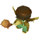
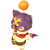

  

# Overview

<table class="dungeonOverview">
  <tr>
    <th>Unlock</th>
    <td class="highlightYellow">???</td>
  </tr>
  <tr>
    <th>Location</th>
    <td class="highlightYellow">???</td>
  </tr>
</table>

<table class="dungeonTable">
  <tr>
    <th>Title</th>
    <td colspan="3">Dungeon of Heroes!</td>
  </tr>
  <tr>
    <th>Description</th>
    <td colspan="3">A challenge from the mightiest hero! Dig deep and see if you can come out on top!</td>
  </tr>
  <tr>
    <th>Floors</th>
    <td>6F</td>
    <th>Bosses</th>
    <td>5F</td>
  </tr>
  <tr>
    <th>Change Crystals</th>
    <td>0F</td>
    <th>Checkpoints</th>
    <td>None</td>
  </tr>
  <tr>
    <th>Max Level</th>
    <td>99</td>
    <th>Bring Buddy</th>
    <td>No</td>
  </tr>
  <tr>
    <th>Bring In Items</th>
    <td>No</td>
    <th>Take Out Items</th>
    <td>No</td>
  </tr>
  <tr>
    <th>Shops/Duels</th>
    <td>No</td>
    <th>Den of Monsters</th>
    <td>No</td>
  </tr>
  <tr>
    <th>Reapers</th>
    <td>Yes</td>
    <th>Bookmark</th>
    <td>No</td>
  </tr>
  <tr>
    <th>Unidentified</th>
    <td colspan="3">Equipment, Consumables</td>
  </tr>
  <tr>
    <th>Rewards</th>
    <td colspan="3">1. ???</td>
  </tr>
</table>

# Strategy

[Content]

# Monsters

<ul><li><a href="#monster-table">Monster Table</a></li><li><a href="#monster-details">Monster Details</a></li></ul>

 

 Monster Table 

Monster Colors - Boss F - 　 means field of view is limited. M - 　 means a Monster Den can appear. R - 　 means  Reaper can spawn.

<table class="monsterTable">
  <thead>
    <tr>
      <th>F</th>
      <th>M</th>
      <th colspan="5">Monsters</th>
      <th>R</th>
    </tr>
  </thead>
  <tbody>
    <tr class="changeCrystal">
      <td class="centeredText">0</td>
      <td></td>
      <td colspan="5" class="centeredText">Change Crystal</td>
      <td></td>
    </tr>
    <tr>
      <td class="centeredText highlightFog">1</td>
      <td class="highlightGray"></td>
      <td> Goblin (100%)</td>
      <td class="highlightGray"></td>
      <td class="highlightGray"></td>
      <td class="highlightGray"></td>
      <td class="highlightGray"></td>
      <td class="highlightReaper"></td>
    </tr>
    <tr>
      <td class="centeredText highlightFog">2</td>
      <td class="highlightMH"></td>
      <td> Goblin (56%)</td>
      <td> Goblin Guard (44%)</td>
      <td class="highlightGray"></td>
      <td class="highlightGray"></td>
      <td class="highlightGray"></td>
      <td class="highlightReaper"></td>
    </tr>
    <tr>
      <td class="centeredText highlightFog">3</td>
      <td class="highlightMH"></td>
      <td> Simurgh (23%)</td>
      <td> Mandra Red (18%)</td>
      <td> Lamia (18%)</td>
      <td> Flan Amarillo (23%)</td>
      <td> Lizard (18%)</td>
      <td class="highlightReaper"></td>
    </tr>
    <tr>
      <td class="centeredText highlightFog">4</td>
      <td class="highlightMH"></td>
      <td> Simurgh (17%)</td>
      <td> Mandra Red (22%)</td>
      <td> Lamia (22%)</td>
      <td> Flan Amarillo (17%)</td>
      <td> Lizard (22%)</td>
      <td class="highlightReaper"></td>
    </tr>
    <tr>
      <td class="centeredText">5</td>
      <td class="highlightGray"></td>
      <td> Dungeon Hero X</td>
      <td class="highlightGray"></td>
      <td class="highlightGray"></td>
      <td class="highlightGray"></td>
      <td class="highlightGray"></td>
      <td class="highlightGray"></td>
    </tr>
    <tr class="highlightYellow">
      <td class="centeredText">0</td>
      <td></td>
      <td colspan="5" class="centeredText"></td>
      <td></td>
    </tr>
  </tbody>
</table>

 

 Monster Details 

Stat Colors - Hard Mode

### Standard

#### Goblin (1-2F)

<table class="buddyOverview">
  <tr class="noPad">
    <th colspan="13" class="highlightGreen">Stats</th>
  </tr>
  <tr>
    <td rowspan="4"></td>
    <td class="hp">HP</td>
    <td>151 / 187</td>
    <td class="atk">Attack</td>
    <td>72 / 75</td>
    <td class="mag">Magic</td>
    <td>36 / 37</td>
    <th>JP</th>
    <td>-</td>
    <th>Item 1</th>
    <td colspan="3">Blind Book (20%)</td>
  </tr>
  <tr>
    <td class="sp">Exp</td>
    <td>172</td>
    <td class="def">Defense</td>
    <td>59 / 60</td>
    <td class="mnd">Mind</td>
    <td>53 / 54</td>
    <th>BP</th>
    <td>3 (50%)</td>
    <th>Item 2</th>
    <td colspan="3">Warp Wings (25%)</td>
  </tr>
  <tr>
    <th>Hit</th>
    <td>95</td>
    <th>Evasion</th>
    <td>4</td>
    <th>Crit</th>
    <td>20</td>
    <th>Gil</th>
    <td>-</td>
    <th>Steal</th>
    <td colspan="3">Scholar's Glasses (30%)</td>
  </tr>
  <tr>
    <th>Lv</th>
    <td>28</td>
    <th>Special</th>
    <td>-</td>
    <th>Resist</th>
    <td colspan="3"></td>
    <th>Weak</th>
    <td colspan="3"></td>
  </tr>
  <tr>
    <th colspan="13" class="abilityName">Goblin Punch</th>
  </tr>
  <tr class="elementIcon">
    <th>Element</th>
    <td>-</td>
    <th>Range</th>
    <td></td>
    <th>Notes</th>
    <td colspan="8" class="leftText">Deal damage to a target 1 tile ahead.</td>
  </tr>
  <tr>
    <th>Rate / CD</th>
    <td colspan="2">25% / 0T</td>
    <th>Count</th>
    <td>∞</td>
    <th>Multiplier</th>
    <td>x2.0</td>
    <th>Value</th>
    <td>0</td>
    <th>Type</th>
    <td class="leftText">Physical</td>
    <th>Calc</th>
    <td class="leftText">Stat</td>
  </tr>
</table>

#### Goblin Guard (2F)

<table class="buddyOverview">
  <tr class="noPad">
    <th colspan="13" class="highlightGreen">Stats</th>
  </tr>
  <tr>
    <td rowspan="4"></td>
    <td class="hp">HP</td>
    <td>172 / 212</td>
    <td class="atk">Attack</td>
    <td>90 / 95</td>
    <td class="mag">Magic</td>
    <td>45 / 47</td>
    <th>JP</th>
    <td>-</td>
    <th>Item 1</th>
    <td colspan="3">Hi-Potion (20%)</td>
  </tr>
  <tr>
    <td class="sp">Exp</td>
    <td>197</td>
    <td class="def">Defense</td>
    <td>66 / 67</td>
    <td class="mnd">Mind</td>
    <td>55 / 55</td>
    <th>BP</th>
    <td>3 (50%)</td>
    <th>Item 2</th>
    <td colspan="3">Angel's Robe (25%)</td>
  </tr>
  <tr>
    <th>Hit</th>
    <td>95</td>
    <th>Evasion</th>
    <td>4</td>
    <th>Crit</th>
    <td>20</td>
    <th>Gil</th>
    <td>-</td>
    <th>Steal</th>
    <td colspan="3">Warp Wings (30%)</td>
  </tr>
  <tr>
    <th>Lv</th>
    <td>33</td>
    <th>Special</th>
    <td>-</td>
    <th>Resist</th>
    <td colspan="3"></td>
    <th>Weak</th>
    <td colspan="3"></td>
  </tr>
  <tr>
    <th colspan="13" class="abilityName">Goblin Punch</th>
  </tr>
  <tr class="elementIcon">
    <th>Element</th>
    <td>-</td>
    <th>Range</th>
    <td></td>
    <th>Notes</th>
    <td colspan="8" class="leftText">Deal damage to a target 1 tile ahead.</td>
  </tr>
  <tr>
    <th>Rate / CD</th>
    <td colspan="2">25% / 0T</td>
    <th>Count</th>
    <td>∞</td>
    <th>Multiplier</th>
    <td>x2.0</td>
    <th>Value</th>
    <td>0</td>
    <th>Type</th>
    <td class="leftText">Physical</td>
    <th>Calc</th>
    <td class="leftText">Stat</td>
  </tr>
  <tr>
    <th colspan="13" class="abilityName">Goblin Shield</th>
  </tr>
  <tr class="elementIcon">
    <th>Element</th>
    <td>-</td>
    <th>Range</th>
    <td></td>
    <th>Notes</th>
    <td colspan="8" class="leftText">Temporarily cast Protect.</td>
  </tr>
  <tr>
    <th>Rate / CD</th>
    <td colspan="2">8% / 30T</td>
    <th>Count</th>
    <td>∞</td>
    <th>Multiplier</th>
    <td>x1.0</td>
    <th>Value</th>
    <td>0</td>
    <th>Type</th>
    <td class="leftText">Other</td>
    <th>Calc</th>
    <td class="leftText">None</td>
  </tr>
</table>

#### Mandra Red (3-4F)

<table class="buddyOverview">
  <tr class="noPad">
    <th colspan="13" class="highlightGreen">Stats</th>
  </tr>
  <tr>
    <td rowspan="4"></td>
    <td class="hp">HP</td>
    <td>129 / 158</td>
    <td class="atk">Attack</td>
    <td>115 / 120</td>
    <td class="mag">Magic</td>
    <td>63 / 65</td>
    <th>JP</th>
    <td>-</td>
    <th>Item 1</th>
    <td colspan="3">X-Potion (25%)</td>
  </tr>
  <tr>
    <td class="sp">Exp</td>
    <td>242</td>
    <td class="def">Defense</td>
    <td>74 / 75</td>
    <td class="mnd">Mind</td>
    <td>57 / 57</td>
    <th>BP</th>
    <td>3 (50%)</td>
    <th>Item 2</th>
    <td colspan="3">Poison Book (30%)</td>
  </tr>
  <tr>
    <th>Hit</th>
    <td>95</td>
    <th>Evasion</th>
    <td>2</td>
    <th>Crit</th>
    <td>5</td>
    <th>Gil</th>
    <td>-</td>
    <th>Steal</th>
    <td colspan="3">Hi-Potion (30%)</td>
  </tr>
  <tr>
    <th>Lv</th>
    <td>38</td>
    <th>Special</th>
    <td>-</td>
    <th>Resist</th>
    <td colspan="3"></td>
    <th>Weak</th>
    <td colspan="3">-</td>
  </tr>
  <tr>
    <th colspan="13" class="abilityName">Dreamy Flower</th>
  </tr>
  <tr class="elementIcon">
    <th>Element</th>
    <td>-</td>
    <th>Range</th>
    <td></td>
    <th>Notes</th>
    <td colspan="8" class="leftText">Inflict Sleep on targets in a 1 tile radius.</td>
  </tr>
  <tr>
    <th>Rate / CD</th>
    <td colspan="2">12% / 4T</td>
    <th>Count</th>
    <td>∞</td>
    <th>Multiplier</th>
    <td>x1.0</td>
    <th>Value</th>
    <td>0</td>
    <th>Type</th>
    <td class="leftText">Other</td>
    <th>Calc</th>
    <td class="leftText">None</td>
  </tr>
  <tr>
    <th colspan="13" class="abilityName">Baby's Breath</th>
  </tr>
  <tr class="elementIcon">
    <th>Element</th>
    <td>-</td>
    <th>Range</th>
    <td></td>
    <th>Notes</th>
    <td colspan="8" class="leftText">Inflict Blind on targets in a 1 tile radius.</td>
  </tr>
  <tr>
    <th>Rate / CD</th>
    <td colspan="2">12% / 4T</td>
    <th>Count</th>
    <td>∞</td>
    <th>Multiplier</th>
    <td>x1.0</td>
    <th>Value</th>
    <td>0</td>
    <th>Type</th>
    <td class="leftText">Other</td>
    <th>Calc</th>
    <td class="leftText">None</td>
  </tr>
</table>

#### Simurgh (3-4F)

<table class="buddyOverview">
  <tr class="noPad">
    <th colspan="13" class="highlightGreen">Stats</th>
  </tr>
  <tr>
    <td rowspan="4"></td>
    <td class="hp">HP</td>
    <td>96 / 117</td>
    <td class="atk">Attack</td>
    <td>140 / 144</td>
    <td class="mag">Magic</td>
    <td>57 / 59</td>
    <th>JP</th>
    <td>-</td>
    <th>Item 1</th>
    <td colspan="3">Hi-Potion (25%)</td>
  </tr>
  <tr>
    <td class="sp">Exp</td>
    <td>243</td>
    <td class="def">Defense</td>
    <td>67 / 68</td>
    <td class="mnd">Mind</td>
    <td>57 / 58</td>
    <th>BP</th>
    <td>3 (50%)</td>
    <th>Item 2</th>
    <td colspan="3">Sleep Book (30%)</td>
  </tr>
  <tr>
    <th>Hit</th>
    <td>85</td>
    <th>Evasion</th>
    <td>8</td>
    <th>Crit</th>
    <td>20</td>
    <th>Gil</th>
    <td>-</td>
    <th>Steal</th>
    <td colspan="3">Ether (30%)</td>
  </tr>
  <tr>
    <th>Lv</th>
    <td>39</td>
    <th>Special</th>
    <td></td>
    <th>Resist</th>
    <td colspan="3">-</td>
    <th>Weak</th>
    <td colspan="3"></td>
  </tr>
  <tr>
    <th colspan="13" class="abilityName">Wing Flap</th>
  </tr>
  <tr class="elementIcon">
    <th>Element</th>
    <td>-</td>
    <th>Range</th>
    <td></td>
    <th>Notes</th>
    <td colspan="8" class="leftText">Temporarily cast Haste.</td>
  </tr>
  <tr>
    <th>Rate / CD</th>
    <td colspan="2">10% / 30T</td>
    <th>Count</th>
    <td>∞</td>
    <th>Multiplier</th>
    <td>x1.0</td>
    <th>Value</th>
    <td>0</td>
    <th>Type</th>
    <td class="leftText">Other</td>
    <th>Calc</th>
    <td class="leftText">None</td>
  </tr>
  <tr>
    <th colspan="13" class="abilityName">Peck</th>
  </tr>
  <tr class="elementIcon">
    <th>Element</th>
    <td>-</td>
    <th>Range</th>
    <td></td>
    <th>Notes</th>
    <td colspan="8" class="leftText">Deal damage + Knockback to a target 1 tile ahead.</td>
  </tr>
  <tr>
    <th>Rate / CD</th>
    <td colspan="2">25% / 0T</td>
    <th>Count</th>
    <td>∞</td>
    <th>Multiplier</th>
    <td>x2.0</td>
    <th>Value</th>
    <td>0</td>
    <th>Type</th>
    <td class="leftText">Physical</td>
    <th>Calc</th>
    <td class="leftText">Stat</td>
  </tr>
</table>

#### Flan Amarillo (3-4F)

<table class="buddyOverview">
  <tr class="noPad">
    <th colspan="13" class="highlightGreen">Stats</th>
  </tr>
  <tr>
    <td rowspan="4"></td>
    <td class="hp">HP</td>
    <td>202 / 247</td>
    <td class="atk">Attack</td>
    <td>104 / 108</td>
    <td class="mag">Magic</td>
    <td>67 / 69</td>
    <th>JP</th>
    <td>-</td>
    <th>Item 1</th>
    <td colspan="3">X-Potion (25%)</td>
  </tr>
  <tr>
    <td class="sp">Exp</td>
    <td>244</td>
    <td class="def">Defense</td>
    <td>68 / 71</td>
    <td class="mnd">Mind</td>
    <td>58 / 58</td>
    <th>BP</th>
    <td>3 (50%)</td>
    <th>Item 2</th>
    <td colspan="3">Confuse Book (30%)</td>
  </tr>
  <tr>
    <th>Hit</th>
    <td>95</td>
    <th>Evasion</th>
    <td>4</td>
    <th>Crit</th>
    <td>5</td>
    <th>Gil</th>
    <td>-</td>
    <th>Steal</th>
    <td colspan="3">Warp Wings (30%)</td>
  </tr>
  <tr>
    <th>Lv</th>
    <td>40</td>
    <th>Special</th>
    <td>-</td>
    <th>Resist</th>
    <td colspan="3"></td>
    <th>Weak</th>
    <td colspan="3"></td>
  </tr>
  <tr>
    <th colspan="13" class="abilityName">Divide</th>
  </tr>
  <tr class="elementIcon">
    <th>Element</th>
    <td>-</td>
    <th>Range</th>
    <td></td>
    <th>Notes</th>
    <td colspan="8" class="leftText">Reduce current HP by 1/2 to create a clone when hit.</td>
  </tr>
  <tr>
    <th>Rate / CD</th>
    <td colspan="2">80% / 0T</td>
    <th>Count</th>
    <td>1</td>
    <th>Multiplier</th>
    <td>x1.0</td>
    <th>Value</th>
    <td>0</td>
    <th>Type</th>
    <td class="leftText">Other</td>
    <th>Calc</th>
    <td class="leftText">None</td>
  </tr>
</table>

#### Lamia (3-4F)

<table class="buddyOverview">
  <tr class="noPad">
    <th colspan="13" class="highlightGreen">Stats</th>
  </tr>
  <tr>
    <td rowspan="4"></td>
    <td class="hp">HP</td>
    <td>134 / 164</td>
    <td class="atk">Attack</td>
    <td>104 / 108</td>
    <td class="mag">Magic</td>
    <td>75 / 77</td>
    <th>JP</th>
    <td>-</td>
    <th>Item 1</th>
    <td colspan="3">Appraisal Glasses (25%)</td>
  </tr>
  <tr>
    <td class="sp">Exp</td>
    <td>292</td>
    <td class="def">Defense</td>
    <td>76 / 79</td>
    <td class="mnd">Mind</td>
    <td>70 / 70</td>
    <th>BP</th>
    <td>3 (50%)</td>
    <th>Item 2</th>
    <td colspan="3">Immobilize Book (30%)</td>
  </tr>
  <tr>
    <th>Hit</th>
    <td>95</td>
    <th>Evasion</th>
    <td>4</td>
    <th>Crit</th>
    <td>5</td>
    <th>Gil</th>
    <td>-</td>
    <th>Steal</th>
    <td colspan="3">Ether (30%)</td>
  </tr>
  <tr>
    <th>Lv</th>
    <td>40</td>
    <th>Special</th>
    <td>-</td>
    <th>Resist</th>
    <td colspan="3">-</td>
    <th>Weak</th>
    <td colspan="3"></td>
  </tr>
  <tr>
    <th colspan="13" class="abilityName">Entice</th>
  </tr>
  <tr class="elementIcon">
    <th>Element</th>
    <td>-</td>
    <th>Range</th>
    <td></td>
    <th>Notes</th>
    <td colspan="8" class="leftText">Inflict Confuse on a target 1 tile ahead.</td>
  </tr>
  <tr>
    <th>Rate / CD</th>
    <td colspan="2">10% / 8T</td>
    <th>Count</th>
    <td>∞</td>
    <th>Multiplier</th>
    <td>x1.0</td>
    <th>Value</th>
    <td>0</td>
    <th>Type</th>
    <td class="leftText">Other</td>
    <th>Calc</th>
    <td class="leftText">None</td>
  </tr>
  <tr>
    <th colspan="13" class="abilityName">Erase</th>
  </tr>
  <tr class="elementIcon">
    <th>Element</th>
    <td>-</td>
    <th>Range</th>
    <td></td>
    <th>Notes</th>
    <td colspan="8" class="leftText">Wipe player buffs of a target up to 3 tiles ahead.</td>
  </tr>
  <tr>
    <th>Rate / CD</th>
    <td colspan="2">8% / 6T</td>
    <th>Count</th>
    <td>∞</td>
    <th>Multiplier</th>
    <td>x1.0</td>
    <th>Value</th>
    <td>0</td>
    <th>Type</th>
    <td class="leftText">Other</td>
    <th>Calc</th>
    <td class="leftText">None</td>
  </tr>
  <tr>
    <th colspan="13" class="abilityName">Manaward</th>
  </tr>
  <tr class="elementIcon">
    <th>Element</th>
    <td>-</td>
    <th>Range</th>
    <td></td>
    <th>Notes</th>
    <td colspan="8" class="leftText">Temporarily cast Manaward on self.</td>
  </tr>
  <tr>
    <th>Rate / CD</th>
    <td colspan="2">5% / 10T</td>
    <th>Count</th>
    <td>∞</td>
    <th>Multiplier</th>
    <td>x1.0</td>
    <th>Value</th>
    <td>0</td>
    <th>Type</th>
    <td class="leftText">Other</td>
    <th>Calc</th>
    <td class="leftText">None</td>
  </tr>
  <tr>
    <th colspan="13" class="abilityName">Protect</th>
  </tr>
  <tr class="elementIcon">
    <th>Element</th>
    <td>-</td>
    <th>Range</th>
    <td></td>
    <th>Notes</th>
    <td colspan="8" class="leftText">Temporarily cast Protect on self or a target up to 2 tiles ahead.</td>
  </tr>
  <tr>
    <th>Rate / CD</th>
    <td colspan="2">5% / 6T</td>
    <th>Count</th>
    <td>∞</td>
    <th>Multiplier</th>
    <td>x1.0</td>
    <th>Value</th>
    <td>0</td>
    <th>Type</th>
    <td class="leftText">Other</td>
    <th>Calc</th>
    <td class="leftText">None</td>
  </tr>
</table>

#### Lizard (3-4F)

<table class="buddyOverview">
  <tr class="noPad">
    <th colspan="13" class="highlightGreen">Stats</th>
  </tr>
  <tr>
    <td rowspan="4"></td>
    <td class="hp">HP</td>
    <td>137 / 167</td>
    <td class="atk">Attack</td>
    <td>108 / 112</td>
    <td class="mag">Magic</td>
    <td>69 / 71</td>
    <th>JP</th>
    <td>-</td>
    <th>Item 1</th>
    <td colspan="3">Explosive Drink (30%)</td>
  </tr>
  <tr>
    <td class="sp">Exp</td>
    <td>294</td>
    <td class="def">Defense</td>
    <td>71 / 72</td>
    <td class="mnd">Mind</td>
    <td>50 / 50</td>
    <th>BP</th>
    <td>3 (50%)</td>
    <th>Item 2</th>
    <td colspan="3">Protect Book (30%)</td>
  </tr>
  <tr>
    <th>Hit</th>
    <td>85</td>
    <th>Evasion</th>
    <td>4</td>
    <th>Crit</th>
    <td>20</td>
    <th>Gil</th>
    <td>-</td>
    <th>Steal</th>
    <td colspan="3">Warp Wings (30%)</td>
  </tr>
  <tr>
    <th>Lv</th>
    <td>41</td>
    <th>Special</th>
    <td></td>
    <th>Resist</th>
    <td colspan="3">-</td>
    <th>Weak</th>
    <td colspan="3"></td>
  </tr>
  <tr>
    <th colspan="13" class="abilityName">Poison Breath</th>
  </tr>
  <tr class="elementIcon">
    <th>Element</th>
    <td>-</td>
    <th>Range</th>
    <td></td>
    <th>Notes</th>
    <td colspan="8" class="leftText">Deal damage + Poison to a target 1 tile ahead.</td>
  </tr>
  <tr>
    <th>Rate / CD</th>
    <td colspan="2">10% / 3T</td>
    <th>Count</th>
    <td>∞</td>
    <th>Multiplier</th>
    <td>x1.0</td>
    <th>Value</th>
    <td>0</td>
    <th>Type</th>
    <td class="leftText">Magic</td>
    <th>Calc</th>
    <td class="leftText">Stat</td>
  </tr>
</table>

### Boss

#### Dungeon Hero X (5F)

<table class="buddyOverview">
  <tr class="noPad">
    <th colspan="14" class="highlightBoss">Stats</th>
  </tr>
  <tr>
    <td rowspan="4"></td>
    <td class="hp">HP</td>
    <td>7070 / 8478</td>
    <td class="atk">Attack</td>
    <td>200 / 200</td>
    <td class="mag">Magic</td>
    <td>99 / 99</td>
    <th>JP</th>
    <td colspan="2">-</td>
    <th>Item 1</th>
    <td colspan="5">-</td>
  </tr>
  <tr>
    <td class="sp">Exp</td>
    <td>0</td>
    <td class="def">Defense</td>
    <td>200 / 200</td>
    <td class="mnd">Mind</td>
    <td>99 / 99</td>
    <th>BP</th>
    <td colspan="2">0 (100%)</td>
    <th>Item 2</th>
    <td colspan="5">-</td>
  </tr>
  <tr>
    <th>Hit</th>
    <td>90</td>
    <th>Evasion</th>
    <td>5</td>
    <th>Crit</th>
    <td>5</td>
    <th>Gil</th>
    <td colspan="2">-</td>
    <th>Steal</th>
    <td colspan="5">Explosive Drink (100%)</td>
  </tr>
  <tr>
    <th>Lv</th>
    <td>60</td>
    <th>Special</th>
    <td></td>
    <th>Resist</th>
    <td colspan="4">-</td>
    <th>Weak</th>
    <td colspan="5">-</td>
  </tr>
  <tr>
    <th colspan="14" class="statusResists">Status Resistances</th>
  </tr>
  <tr>
    <th></th>
    <th></th>
    <th></th>
    <th></th>
    <th></th>
    <th></th>
    <th></th>
    <th></th>
    <th></th>
    <th colspan="2">Knockback</th>
    <th>Stun</th>
    <th>Warp</th>
    <th>Ratio</th>
  </tr>
  <tr>
    <td>◯</td>
    <td>◯</td>
    <td>◯</td>
    <td>◯</td>
    <td>◯</td>
    <td>◯</td>
    <td>◯</td>
    <td>◯</td>
    <td>◯</td>
    <td colspan="2">◯</td>
    <td>✕</td>
    <td>◯</td>
    <td>◯</td>
  </tr>
  <tr>
    <th colspan="14" class="abilityName">Mog Beam X</th>
  </tr>
  <tr class="elementIcon">
    <th>Element</th>
    <td>-</td>
    <th>Range</th>
    <td></td>
    <th>Notes</th>
    <td colspan="13" class="leftText">Deal 77 damage to self.</td>
  </tr>
  <tr>
    <th>Rate / CD</th>
    <td colspan="2">5% | 30% / 6T</td>
    <th>Count</th>
    <td>∞</td>
    <th>Multiplier</th>
    <td>x1.0</td>
    <th>Value</th>
    <td>77</td>
    <th>Type</th>
    <td colspan="2" class="leftText">Magic</td>
    <th>Calc</th>
    <td class="leftText">Fixed</td>
  </tr>
  <tr>
    <th colspan="14" class="abilityName">Mog Beam X</th>
  </tr>
  <tr class="elementIcon">
    <th>Element</th>
    <td>-</td>
    <th>Range</th>
    <td></td>
    <th>Notes</th>
    <td colspan="13" class="leftText">Deal 777 damage to targets lined up within 10 tiles (3 tiles wide).</td>
  </tr>
  <tr>
    <th>Rate / CD</th>
    <td colspan="2">20% | 10% / 6T</td>
    <th>Count</th>
    <td>∞</td>
    <th>Multiplier</th>
    <td>x1.0</td>
    <th>Value</th>
    <td>777</td>
    <th>Type</th>
    <td colspan="2" class="leftText">Magic</td>
    <th>Calc</th>
    <td class="leftText">Fixed</td>
  </tr>
</table>

# Items

 Floor 

See the dungeon data JSON file for exact item spawn rates per floor. Colors - Dig / Ingenuity exclusive

<table class="dungeonItemTable">
  <tr>
    <th colspan="3" class="highlightPurple"> Talons</th>
  </tr>
  <tr>
    <th>Item</th>
    <th>Floor</th>
    <th>Rate Range</th>
  </tr>
  <tr>
    <td>Adaman Talons</td>
    <td>1-4</td>
    <td>5.41%</td>
  </tr>
  <tr>
    <td>Confuse Talons</td>
    <td>1-4</td>
    <td>5.41%</td>
  </tr>
  <tr>
    <td>Trident Talons</td>
    <td>1-4</td>
    <td>5.41%</td>
  </tr>
  <tr>
    <td>Critical Talons</td>
    <td>1-4</td>
    <td>5.41%</td>
  </tr>
  <tr>
    <th colspan="3" class="highlightPurple"> Saddles</th>
  </tr>
  <tr>
    <th>Item</th>
    <th>Floor</th>
    <th>Rate Range</th>
  </tr>
  <tr>
    <td>Crystal Saddle</td>
    <td>2-4</td>
    <td>5.41%</td>
  </tr>
  <tr>
    <td>Orichalcum Saddle</td>
    <td>2-4</td>
    <td>5.41%</td>
  </tr>
  <tr>
    <td>Earth Saddle</td>
    <td>2-4</td>
    <td>5.41%</td>
  </tr>
  <tr>
    <td>King's Saddle</td>
    <td>2-4</td>
    <td>5.41%</td>
  </tr>
  <tr>
    <th colspan="3" class="highlightPurple"> Medicines</th>
  </tr>
  <tr>
    <th>Item</th>
    <th>Floor</th>
    <th>Rate Range</th>
  </tr>
  <tr>
    <td>X-Potion</td>
    <td>1-4</td>
    <td>5.41% ~ 6.9%</td>
  </tr>
  <tr>
    <td>Hi-Ether</td>
    <td>1-4</td>
    <td>2.7% ~ 3.45%</td>
  </tr>
  <tr>
    <td>Haste Drink</td>
    <td>1-4</td>
    <td>2.7% ~ 3.45%</td>
  </tr>
  <tr class="dig">
    <td>Explosive Drink</td>
    <td>5</td>
    <td>100.0%</td>
  </tr>
  <tr>
    <th colspan="3" class="highlightPurple"> Books</th>
  </tr>
  <tr>
    <th>Item</th>
    <th>Floor</th>
    <th>Rate Range</th>
  </tr>
  <tr>
    <td>Protect Book</td>
    <td>1-4</td>
    <td>5.41% ~ 6.9%</td>
  </tr>
  <tr>
    <td>Sleep Book</td>
    <td>1-4</td>
    <td>5.41% ~ 6.9%</td>
  </tr>
  <tr>
    <td>Silence Book</td>
    <td>1-4</td>
    <td>5.41% ~ 6.9%</td>
  </tr>
  <tr>
    <td>Blind Book</td>
    <td>1-4</td>
    <td>5.41% ~ 6.9%</td>
  </tr>
  <tr>
    <td>Confuse Book</td>
    <td>1-4</td>
    <td>5.41% ~ 6.9%</td>
  </tr>
  <tr>
    <td>Immobilize Book</td>
    <td>1-4</td>
    <td>5.41% ~ 6.9%</td>
  </tr>
  <tr>
    <td>Slow Book</td>
    <td>1-4</td>
    <td>5.41% ~ 6.9%</td>
  </tr>
  <tr>
    <th colspan="3" class="highlightPurple"> Other</th>
  </tr>
  <tr>
    <th>Item</th>
    <th>Floor</th>
    <th>Rate Range</th>
  </tr>
  <tr>
    <td>Scholar's Glasses</td>
    <td>1-4</td>
    <td>2.7% ~ 3.45%</td>
  </tr>
  <tr>
    <td>Angel's Robe</td>
    <td>1-4</td>
    <td>2.7% ~ 3.45%</td>
  </tr>
  <tr>
    <td>Warp Wings</td>
    <td>1-4</td>
    <td>2.7% ~ 3.45%</td>
  </tr>
</table>

 

 Drop / Steal 

Monster Colors - Boss

<table class="dungeonDropTable">
  <thead>
    <tr>
      <th>Floor</th>
      <th>Monster</th>
      <th>Drop 1</th>
      <th>Drop 2</th>
      <th>Steal</th>
    </tr>
  </thead>
  <tbody>
    <tr>
      <td>1-2</td>
      <td> Goblin</td>
      <td>Blind Book (20%)</td>
      <td>Warp Wings (25%)</td>
      <td>Scholar's Glasses (30%)</td>
    </tr>
    <tr>
      <td>2</td>
      <td> Goblin Guard</td>
      <td>Hi-Potion (20%)</td>
      <td>Angel's Robe (25%)</td>
      <td>Warp Wings (30%)</td>
    </tr>
    <tr>
      <td>3-4</td>
      <td> Mandra Red</td>
      <td>X-Potion (25%)</td>
      <td>Poison Book (30%)</td>
      <td>Hi-Potion (30%)</td>
    </tr>
    <tr>
      <td>3-4</td>
      <td> Simurgh</td>
      <td>Hi-Potion (25%)</td>
      <td>Sleep Book (30%)</td>
      <td>Ether (30%)</td>
    </tr>
    <tr>
      <td>3-4</td>
      <td> Flan Amarillo</td>
      <td>X-Potion (25%)</td>
      <td>Confuse Book (30%)</td>
      <td>Warp Wings (30%)</td>
    </tr>
    <tr>
      <td>3-4</td>
      <td> Lamia</td>
      <td>Appraisal Glasses (25%)</td>
      <td>Immobilize Book (30%)</td>
      <td>Ether (30%)</td>
    </tr>
    <tr>
      <td>3-4</td>
      <td> Lizard</td>
      <td>Explosive Drink (30%)</td>
      <td>Protect Book (30%)</td>
      <td>Warp Wings (30%)</td>
    </tr>
    <tr>
      <td>5</td>
      <td> Dungeon Hero X</td>
      <td>-</td>
      <td>-</td>
      <td>Explosive Drink (100%)</td>
    </tr>
  </tbody>
</table>
