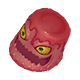

  

# Overview

<table class="dungeonOverview">
  <tr>
    <th>Unlock</th>
    <td class="highlightYellow">Clear Freja's Memories (Chapter 2).</td>
  </tr>
  <tr>
    <th>Location</th>
    <td class="highlightYellow">Flora's Flowers (Chapter 2+)</td>
  </tr>
</table>

<table class="dungeonTable">
  <tr>
    <th>Title</th>
    <td colspan="3">Flan Fantasy</td>
  </tr>
  <tr>
    <th>Description</th>
    <td colspan="3">A dungeon crawling with flan. Defeat all enemies to reveal the stairs!</td>
  </tr>
  <tr>
    <th>Floors</th>
    <td>5F</td>
    <th>Bosses</th>
    <td>1-2, 4F</td>
  </tr>
  <tr>
    <th>Change Crystals</th>
    <td>0F</td>
    <th>Checkpoints</th>
    <td>None</td>
  </tr>
  <tr>
    <th>Max Level</th>
    <td>10</td>
    <th>Bring Buddy</th>
    <td>No</td>
  </tr>
  <tr>
    <th>Bring In Items</th>
    <td>No</td>
    <th>Take Out Items</th>
    <td>No</td>
  </tr>
  <tr>
    <th>Shops/Duels</th>
    <td>No</td>
    <th>Den of Monsters</th>
    <td>No</td>
  </tr>
  <tr>
    <th>Reapers</th>
    <td>No</td>
    <th>Bookmark</th>
    <td>No</td>
  </tr>
  <tr>
    <th>Unidentified</th>
    <td colspan="3">None</td>
  </tr>
  <tr>
    <th>Rewards</th>
    <td colspan="3">1.  Flora's Memories (5F). 2. Dungeon added to  Mirror of Training. 3.  Flora's Flowers access. ・ Plant  Mystery Seeds at Stella's Farm. 4. Can unlock  Meddit's Memories.</td>
  </tr>
</table>

# Strategy

[Content]

# Monsters

<ul><li><a href="#monster-table">Monster Table</a></li><li><a href="#monster-details">Monster Details</a></li></ul>

 

 Monster Table 

Monster Colors - Boss F - 　 means field of view is limited.

<table class="monsterTable">
  <thead>
    <tr>
      <th>F</th>
      <th colspan="5">Monsters</th>
    </tr>
  </thead>
  <tbody>
    <tr class="changeCrystal">
      <td class="centeredText">0</td>
      <td colspan="5" class="centeredText">Change Crystal</td>
    </tr>
    <tr>
      <td class="centeredText">1</td>
      <td> Ice Flan</td>
      <td> Red Marshmallow x 2</td>
      <td class="highlightGray"></td>
      <td class="highlightGray"></td>
      <td class="highlightGray"></td>
    </tr>
    <tr>
      <td class="centeredText">2</td>
      <td> Flan Amarillo</td>
      <td> Red Marshmallow x 3</td>
      <td class="highlightGray"></td>
      <td class="highlightGray"></td>
      <td class="highlightGray"></td>
    </tr>
    <tr>
      <td class="centeredText">3</td>
      <td> Flan Princess</td>
      <td> Dark Bavarois</td>
      <td class="highlightGray"></td>
      <td class="highlightGray"></td>
      <td class="highlightGray"></td>
    </tr>
    <tr>
      <td class="centeredText">4</td>
      <td> Flan Princess</td>
      <td> Red Marshmallow x 2</td>
      <td> Ice Flan x 2</td>
      <td> Flan Amarillo x 2</td>
      <td> Dark Bavarois</td>
    </tr>
    <tr class="highlightYellow">
      <td class="centeredText">5</td>
      <td colspan="5" class="centeredText"> Flora's Memories</td>
    </tr>
  </tbody>
</table>

 

 Monster Details 

Stat Colors - Hard Mode

### Standard

#### Red Marshmallow (1-2/4F)

<table class="buddyOverview">
  <tr class="noPad">
    <th colspan="13" class="highlightGreen">Stats</th>
  </tr>
  <tr>
    <td rowspan="4"></td>
    <td class="hp">HP</td>
    <td>46 / 61</td>
    <td class="atk">Attack</td>
    <td>8 / 10</td>
    <td class="mag">Magic</td>
    <td>19 / 20</td>
    <th>JP</th>
    <td>-</td>
    <th>Item 1</th>
    <td colspan="3">Potion (50%)</td>
  </tr>
  <tr>
    <td class="sp">Exp</td>
    <td>40</td>
    <td class="def">Defense</td>
    <td>27 / 28</td>
    <td class="mnd">Mind</td>
    <td>28 / 29</td>
    <th>BP</th>
    <td>3 (50%)</td>
    <th>Item 2</th>
    <td colspan="3">-</td>
  </tr>
  <tr>
    <th>Hit</th>
    <td>95</td>
    <th>Evasion</th>
    <td>4</td>
    <th>Crit</th>
    <td>5</td>
    <th>Gil</th>
    <td>-</td>
    <th>Steal</th>
    <td colspan="3">Potion (20%)</td>
  </tr>
  <tr>
    <th>Lv</th>
    <td>3</td>
    <th>Special</th>
    <td>-</td>
    <th>Resist</th>
    <td colspan="3"></td>
    <th>Weak</th>
    <td colspan="3"></td>
  </tr>
  <tr>
    <th colspan="13" class="abilityName">Divide</th>
  </tr>
  <tr class="elementIcon">
    <th>Element</th>
    <td>-</td>
    <th>Range</th>
    <td></td>
    <th>Notes</th>
    <td colspan="8" class="leftText">Reduce current HP by 1/2 to create a clone when hit.</td>
  </tr>
  <tr>
    <th>Rate / CD</th>
    <td colspan="2">25% / 0T</td>
    <th>Count</th>
    <td>1</td>
    <th>Multiplier</th>
    <td>x1.0</td>
    <th>Value</th>
    <td>0</td>
    <th>Type</th>
    <td class="leftText">Other</td>
    <th>Calc</th>
    <td class="leftText">None</td>
  </tr>
  <tr>
    <th colspan="13" class="abilityName">Digest</th>
  </tr>
  <tr class="elementIcon">
    <th>Element</th>
    <td>-</td>
    <th>Range</th>
    <td></td>
    <th>Notes</th>
    <td colspan="8" class="leftText">Drain HP from a target 1 tile ahead.</td>
  </tr>
  <tr>
    <th>Rate / CD</th>
    <td colspan="2">5% / 4T</td>
    <th>Count</th>
    <td>∞</td>
    <th>Multiplier</th>
    <td>x1.0</td>
    <th>Value</th>
    <td>0</td>
    <th>Type</th>
    <td class="leftText">Magic</td>
    <th>Calc</th>
    <td class="leftText">Stat</td>
  </tr>
  <tr>
    <th colspan="13" class="abilityName">Jiggle</th>
  </tr>
  <tr class="elementIcon">
    <th>Element</th>
    <td>-</td>
    <th>Range</th>
    <td></td>
    <th>Notes</th>
    <td colspan="8" class="leftText">Lower Food Level by 10.</td>
  </tr>
  <tr>
    <th>Rate / CD</th>
    <td colspan="2">5% / 8T</td>
    <th>Count</th>
    <td>∞</td>
    <th>Multiplier</th>
    <td>x1.0</td>
    <th>Value</th>
    <td>10</td>
    <th>Type</th>
    <td class="leftText">Magic</td>
    <th>Calc</th>
    <td class="leftText">Fixed</td>
  </tr>
</table>

#### Flan Princess (3F)

<table class="buddyOverview">
  <tr class="noPad">
    <th colspan="13" class="highlightGreen">Stats</th>
  </tr>
  <tr>
    <td rowspan="4"></td>
    <td class="hp">HP</td>
    <td>97 / 121</td>
    <td class="atk">Attack</td>
    <td>26 / 28</td>
    <td class="mag">Magic</td>
    <td>31 / 32</td>
    <th>JP</th>
    <td>-</td>
    <th>Item 1</th>
    <td colspan="3">Hi-Potion (50%)</td>
  </tr>
  <tr>
    <td class="sp">Exp</td>
    <td>99</td>
    <td class="def">Defense</td>
    <td>39 / 40</td>
    <td class="mnd">Mind</td>
    <td>40 / 41</td>
    <th>BP</th>
    <td>3 (50%)</td>
    <th>Item 2</th>
    <td colspan="3">Hi-Ether (50%)</td>
  </tr>
  <tr>
    <th>Hit</th>
    <td>95</td>
    <th>Evasion</th>
    <td>4</td>
    <th>Crit</th>
    <td>5</td>
    <th>Gil</th>
    <td>-</td>
    <th>Steal</th>
    <td colspan="3">Potion (20%)</td>
  </tr>
  <tr>
    <th>Lv</th>
    <td>15</td>
    <th>Special</th>
    <td>-</td>
    <th>Resist</th>
    <td colspan="3"></td>
    <th>Weak</th>
    <td colspan="3"></td>
  </tr>
  <tr>
    <th colspan="13" class="abilityName">Divide</th>
  </tr>
  <tr class="elementIcon">
    <th>Element</th>
    <td>-</td>
    <th>Range</th>
    <td></td>
    <th>Notes</th>
    <td colspan="8" class="leftText">Reduce current HP by 1/2 to create a clone when hit.</td>
  </tr>
  <tr>
    <th>Rate / CD</th>
    <td colspan="2">100% / 0T</td>
    <th>Count</th>
    <td>1</td>
    <th>Multiplier</th>
    <td>x1.0</td>
    <th>Value</th>
    <td>0</td>
    <th>Type</th>
    <td class="leftText">Other</td>
    <th>Calc</th>
    <td class="leftText">None</td>
  </tr>
  <tr>
    <th colspan="13" class="abilityName">Jiggle</th>
  </tr>
  <tr class="elementIcon">
    <th>Element</th>
    <td>-</td>
    <th>Range</th>
    <td></td>
    <th>Notes</th>
    <td colspan="8" class="leftText">Lower Food Level by 10.</td>
  </tr>
  <tr>
    <th>Rate / CD</th>
    <td colspan="2">100% / 8T</td>
    <th>Count</th>
    <td>∞</td>
    <th>Multiplier</th>
    <td>x1.0</td>
    <th>Value</th>
    <td>10</td>
    <th>Type</th>
    <td class="leftText">Magic</td>
    <th>Calc</th>
    <td class="leftText">Fixed</td>
  </tr>
</table>

#### Dark Bavarois (3-4F)

<table class="buddyOverview">
  <tr class="noPad">
    <th colspan="13" class="highlightGreen">Stats</th>
  </tr>
  <tr>
    <td rowspan="4"></td>
    <td class="hp">HP</td>
    <td>38 / 50</td>
    <td class="atk">Attack</td>
    <td>3 / 5</td>
    <td class="mag">Magic</td>
    <td>17 / 18</td>
    <th>JP</th>
    <td>-</td>
    <th>Item 1</th>
    <td colspan="3">Potion (50%)</td>
  </tr>
  <tr>
    <td class="sp">Exp</td>
    <td>8</td>
    <td class="def">Defense</td>
    <td>24 / 25</td>
    <td class="mnd">Mind</td>
    <td>26 / 27</td>
    <th>BP</th>
    <td>3 (50%)</td>
    <th>Item 2</th>
    <td colspan="3">-</td>
  </tr>
  <tr>
    <th>Hit</th>
    <td>95</td>
    <th>Evasion</th>
    <td>4</td>
    <th>Crit</th>
    <td>5</td>
    <th>Gil</th>
    <td>-</td>
    <th>Steal</th>
    <td colspan="3">Potion (20%)</td>
  </tr>
  <tr>
    <th>Lv</th>
    <td>1</td>
    <th>Special</th>
    <td>-</td>
    <th>Resist</th>
    <td colspan="3"></td>
    <th>Weak</th>
    <td colspan="3"></td>
  </tr>
  <tr>
    <th colspan="13" class="abilityName">Divide</th>
  </tr>
  <tr class="elementIcon">
    <th>Element</th>
    <td>-</td>
    <th>Range</th>
    <td></td>
    <th>Notes</th>
    <td colspan="8" class="leftText">Reduce current HP by 1/2 to create a clone when hit.</td>
  </tr>
  <tr>
    <th>Rate / CD</th>
    <td colspan="2">50% / 0T</td>
    <th>Count</th>
    <td>1</td>
    <th>Multiplier</th>
    <td>x1.0</td>
    <th>Value</th>
    <td>0</td>
    <th>Type</th>
    <td class="leftText">Other</td>
    <th>Calc</th>
    <td class="leftText">None</td>
  </tr>
  <tr>
    <th colspan="13" class="abilityName">Jiggle</th>
  </tr>
  <tr class="elementIcon">
    <th>Element</th>
    <td>-</td>
    <th>Range</th>
    <td></td>
    <th>Notes</th>
    <td colspan="8" class="leftText">Lower Food Level by 10.</td>
  </tr>
  <tr>
    <th>Rate / CD</th>
    <td colspan="2">5% / 8T</td>
    <th>Count</th>
    <td>∞</td>
    <th>Multiplier</th>
    <td>x1.0</td>
    <th>Value</th>
    <td>10</td>
    <th>Type</th>
    <td class="leftText">Magic</td>
    <th>Calc</th>
    <td class="leftText">Fixed</td>
  </tr>
</table>

#### Ice Flan (4F)

<table class="buddyOverview">
  <tr class="noPad">
    <th colspan="13" class="highlightGreen">Stats</th>
  </tr>
  <tr>
    <td rowspan="4"></td>
    <td class="hp">HP</td>
    <td>51 / 65</td>
    <td class="atk">Attack</td>
    <td>10 / 11</td>
    <td class="mag">Magic</td>
    <td>20 / 21</td>
    <th>JP</th>
    <td>-</td>
    <th>Item 1</th>
    <td colspan="3">Potion (50%)</td>
  </tr>
  <tr>
    <td class="sp">Exp</td>
    <td>24</td>
    <td class="def">Defense</td>
    <td>28 / 29</td>
    <td class="mnd">Mind</td>
    <td>29 / 30</td>
    <th>BP</th>
    <td>3 (50%)</td>
    <th>Item 2</th>
    <td colspan="3">-</td>
  </tr>
  <tr>
    <th>Hit</th>
    <td>95</td>
    <th>Evasion</th>
    <td>4</td>
    <th>Crit</th>
    <td>5</td>
    <th>Gil</th>
    <td>-</td>
    <th>Steal</th>
    <td colspan="3">Potion (20%)</td>
  </tr>
  <tr>
    <th>Lv</th>
    <td>4</td>
    <th>Special</th>
    <td>-</td>
    <th>Resist</th>
    <td colspan="3"></td>
    <th>Weak</th>
    <td colspan="3"></td>
  </tr>
  <tr>
    <th colspan="13" class="abilityName">Divide</th>
  </tr>
  <tr class="elementIcon">
    <th>Element</th>
    <td>-</td>
    <th>Range</th>
    <td></td>
    <th>Notes</th>
    <td colspan="8" class="leftText">Reduce current HP by 1/2 to create a clone when hit.</td>
  </tr>
  <tr>
    <th>Rate / CD</th>
    <td colspan="2">50% / 0T</td>
    <th>Count</th>
    <td>1</td>
    <th>Multiplier</th>
    <td>x1.0</td>
    <th>Value</th>
    <td>0</td>
    <th>Type</th>
    <td class="leftText">Other</td>
    <th>Calc</th>
    <td class="leftText">None</td>
  </tr>
  <tr>
    <th colspan="13" class="abilityName">Digest</th>
  </tr>
  <tr class="elementIcon">
    <th>Element</th>
    <td>-</td>
    <th>Range</th>
    <td></td>
    <th>Notes</th>
    <td colspan="8" class="leftText">Drain HP from a target 1 tile ahead.</td>
  </tr>
  <tr>
    <th>Rate / CD</th>
    <td colspan="2">10% / 4T</td>
    <th>Count</th>
    <td>∞</td>
    <th>Multiplier</th>
    <td>x1.0</td>
    <th>Value</th>
    <td>0</td>
    <th>Type</th>
    <td class="leftText">Magic</td>
    <th>Calc</th>
    <td class="leftText">Stat</td>
  </tr>
  <tr>
    <th colspan="13" class="abilityName">Jiggle</th>
  </tr>
  <tr class="elementIcon">
    <th>Element</th>
    <td>-</td>
    <th>Range</th>
    <td></td>
    <th>Notes</th>
    <td colspan="8" class="leftText">Lower Food Level by 10.</td>
  </tr>
  <tr>
    <th>Rate / CD</th>
    <td colspan="2">5% / 8T</td>
    <th>Count</th>
    <td>∞</td>
    <th>Multiplier</th>
    <td>x1.0</td>
    <th>Value</th>
    <td>10</td>
    <th>Type</th>
    <td class="leftText">Magic</td>
    <th>Calc</th>
    <td class="leftText">Fixed</td>
  </tr>
</table>

#### Flan Amarillo (4F)

<table class="buddyOverview">
  <tr class="noPad">
    <th colspan="13" class="highlightGreen">Stats</th>
  </tr>
  <tr>
    <td rowspan="4"></td>
    <td class="hp">HP</td>
    <td>55 / 70</td>
    <td class="atk">Attack</td>
    <td>11 / 13</td>
    <td class="mag">Magic</td>
    <td>21 / 22</td>
    <th>JP</th>
    <td>-</td>
    <th>Item 1</th>
    <td colspan="3">Potion (50%)</td>
  </tr>
  <tr>
    <td class="sp">Exp</td>
    <td>32</td>
    <td class="def">Defense</td>
    <td>29 / 30</td>
    <td class="mnd">Mind</td>
    <td>30 / 31</td>
    <th>BP</th>
    <td>3 (50%)</td>
    <th>Item 2</th>
    <td colspan="3">-</td>
  </tr>
  <tr>
    <th>Hit</th>
    <td>95</td>
    <th>Evasion</th>
    <td>4</td>
    <th>Crit</th>
    <td>5</td>
    <th>Gil</th>
    <td>-</td>
    <th>Steal</th>
    <td colspan="3">Potion (20%)</td>
  </tr>
  <tr>
    <th>Lv</th>
    <td>5</td>
    <th>Special</th>
    <td>-</td>
    <th>Resist</th>
    <td colspan="3"></td>
    <th>Weak</th>
    <td colspan="3"></td>
  </tr>
  <tr>
    <th colspan="13" class="abilityName">Divide</th>
  </tr>
  <tr class="elementIcon">
    <th>Element</th>
    <td>-</td>
    <th>Range</th>
    <td></td>
    <th>Notes</th>
    <td colspan="8" class="leftText">Reduce current HP by 1/2 to create a clone when hit.</td>
  </tr>
  <tr>
    <th>Rate / CD</th>
    <td colspan="2">50% / 0T</td>
    <th>Count</th>
    <td>1</td>
    <th>Multiplier</th>
    <td>x1.0</td>
    <th>Value</th>
    <td>0</td>
    <th>Type</th>
    <td class="leftText">Other</td>
    <th>Calc</th>
    <td class="leftText">None</td>
  </tr>
  <tr>
    <th colspan="13" class="abilityName">Digest</th>
  </tr>
  <tr class="elementIcon">
    <th>Element</th>
    <td>-</td>
    <th>Range</th>
    <td></td>
    <th>Notes</th>
    <td colspan="8" class="leftText">Drain HP from a target 1 tile ahead.</td>
  </tr>
  <tr>
    <th>Rate / CD</th>
    <td colspan="2">10% / 4T</td>
    <th>Count</th>
    <td>∞</td>
    <th>Multiplier</th>
    <td>x1.0</td>
    <th>Value</th>
    <td>0</td>
    <th>Type</th>
    <td class="leftText">Magic</td>
    <th>Calc</th>
    <td class="leftText">Stat</td>
  </tr>
  <tr>
    <th colspan="13" class="abilityName">Jiggle</th>
  </tr>
  <tr class="elementIcon">
    <th>Element</th>
    <td>-</td>
    <th>Range</th>
    <td></td>
    <th>Notes</th>
    <td colspan="8" class="leftText">Lower Food Level by 10.</td>
  </tr>
  <tr>
    <th>Rate / CD</th>
    <td colspan="2">5% / 8T</td>
    <th>Count</th>
    <td>∞</td>
    <th>Multiplier</th>
    <td>x1.0</td>
    <th>Value</th>
    <td>10</td>
    <th>Type</th>
    <td class="leftText">Magic</td>
    <th>Calc</th>
    <td class="leftText">Fixed</td>
  </tr>
</table>

### Boss

#### Ice Flan (1F)

<table class="buddyOverview">
  <tr class="noPad">
    <th colspan="14" class="highlightBoss">Stats</th>
  </tr>
  <tr>
    <td rowspan="4"></td>
    <td class="hp">HP</td>
    <td>75 / 89</td>
    <td class="atk">Attack</td>
    <td>16 / 16</td>
    <td class="mag">Magic</td>
    <td>20 / 20</td>
    <th>JP</th>
    <td colspan="2">-</td>
    <th>Item 1</th>
    <td colspan="5">Potion (100%)</td>
  </tr>
  <tr>
    <td class="sp">Exp</td>
    <td>0</td>
    <td class="def">Defense</td>
    <td>32 / 32</td>
    <td class="mnd">Mind</td>
    <td>32 / 32</td>
    <th>BP</th>
    <td colspan="2">3 (50%)</td>
    <th>Item 2</th>
    <td colspan="5">Hi-Ether (50%)</td>
  </tr>
  <tr>
    <th>Hit</th>
    <td>80</td>
    <th>Evasion</th>
    <td>0</td>
    <th>Crit</th>
    <td>10</td>
    <th>Gil</th>
    <td colspan="2">-</td>
    <th>Steal</th>
    <td colspan="5">Hi-Potion (100%)</td>
  </tr>
  <tr>
    <th>Lv</th>
    <td>7</td>
    <th>Special</th>
    <td>-</td>
    <th>Resist</th>
    <td colspan="4"></td>
    <th>Weak</th>
    <td colspan="5"></td>
  </tr>
  <tr>
    <th colspan="14" class="statusResists">Status Resistances</th>
  </tr>
  <tr>
    <th></th>
    <th></th>
    <th></th>
    <th></th>
    <th></th>
    <th></th>
    <th></th>
    <th></th>
    <th></th>
    <th colspan="2">Knockback</th>
    <th>Stun</th>
    <th>Warp</th>
    <th>Ratio</th>
  </tr>
  <tr>
    <td>◯</td>
    <td>◯</td>
    <td>◯</td>
    <td>◯</td>
    <td>◯</td>
    <td>◯</td>
    <td>◯</td>
    <td>◯</td>
    <td>◯</td>
    <td colspan="2">◯</td>
    <td>◯</td>
    <td>◯</td>
    <td>◯</td>
  </tr>
  <tr>
    <th colspan="14" class="abilityName">Divide</th>
  </tr>
  <tr class="elementIcon">
    <th>Element</th>
    <td>-</td>
    <th>Range</th>
    <td></td>
    <th>Notes</th>
    <td colspan="13" class="leftText">Reduce current HP by 1/2 to create a clone when hit.</td>
  </tr>
  <tr>
    <th>Rate / CD</th>
    <td colspan="2">40% | 25% / 0T</td>
    <th>Count</th>
    <td>1</td>
    <th>Multiplier</th>
    <td>x1.0</td>
    <th>Value</th>
    <td>0</td>
    <th>Type</th>
    <td colspan="2" class="leftText">Other</td>
    <th>Calc</th>
    <td class="leftText">None</td>
  </tr>
  <tr>
    <th colspan="14" class="abilityName">Digest</th>
  </tr>
  <tr class="elementIcon">
    <th>Element</th>
    <td>-</td>
    <th>Range</th>
    <td></td>
    <th>Notes</th>
    <td colspan="13" class="leftText">Drain HP from a target 1 tile ahead.</td>
  </tr>
  <tr>
    <th>Rate / CD</th>
    <td colspan="2">10% | 10% / 4T</td>
    <th>Count</th>
    <td>∞</td>
    <th>Multiplier</th>
    <td>x1.0</td>
    <th>Value</th>
    <td>0</td>
    <th>Type</th>
    <td colspan="2" class="leftText">Magic</td>
    <th>Calc</th>
    <td class="leftText">Stat</td>
  </tr>
  <tr>
    <th colspan="14" class="abilityName">Jiggle</th>
  </tr>
  <tr class="elementIcon">
    <th>Element</th>
    <td>-</td>
    <th>Range</th>
    <td></td>
    <th>Notes</th>
    <td colspan="13" class="leftText">Lower Food Level by 10.</td>
  </tr>
  <tr>
    <th>Rate / CD</th>
    <td colspan="2">20% | 20% / 8T</td>
    <th>Count</th>
    <td>∞</td>
    <th>Multiplier</th>
    <td>x1.0</td>
    <th>Value</th>
    <td>10</td>
    <th>Type</th>
    <td colspan="2" class="leftText">Magic</td>
    <th>Calc</th>
    <td class="leftText">Fixed</td>
  </tr>
</table>

#### Flan Amarillo (2F)

<table class="buddyOverview">
  <tr class="noPad">
    <th colspan="14" class="highlightBoss">Stats</th>
  </tr>
  <tr>
    <td rowspan="4"></td>
    <td class="hp">HP</td>
    <td>85 / 101</td>
    <td class="atk">Attack</td>
    <td>17 / 17</td>
    <td class="mag">Magic</td>
    <td>22 / 22</td>
    <th>JP</th>
    <td colspan="2">-</td>
    <th>Item 1</th>
    <td colspan="5">Potion (100%)</td>
  </tr>
  <tr>
    <td class="sp">Exp</td>
    <td>0</td>
    <td class="def">Defense</td>
    <td>32 / 32</td>
    <td class="mnd">Mind</td>
    <td>32 / 32</td>
    <th>BP</th>
    <td colspan="2">3 (50%)</td>
    <th>Item 2</th>
    <td colspan="5">Hi-Ether (50%)</td>
  </tr>
  <tr>
    <th>Hit</th>
    <td>80</td>
    <th>Evasion</th>
    <td>0</td>
    <th>Crit</th>
    <td>10</td>
    <th>Gil</th>
    <td colspan="2">-</td>
    <th>Steal</th>
    <td colspan="5">Hi-Potion (100%)</td>
  </tr>
  <tr>
    <th>Lv</th>
    <td>7</td>
    <th>Special</th>
    <td>-</td>
    <th>Resist</th>
    <td colspan="4"></td>
    <th>Weak</th>
    <td colspan="5"></td>
  </tr>
  <tr>
    <th colspan="14" class="statusResists">Status Resistances</th>
  </tr>
  <tr>
    <th></th>
    <th></th>
    <th></th>
    <th></th>
    <th></th>
    <th></th>
    <th></th>
    <th></th>
    <th></th>
    <th colspan="2">Knockback</th>
    <th>Stun</th>
    <th>Warp</th>
    <th>Ratio</th>
  </tr>
  <tr>
    <td>◯</td>
    <td>◯</td>
    <td>◯</td>
    <td>◯</td>
    <td>◯</td>
    <td>◯</td>
    <td>◯</td>
    <td>◯</td>
    <td>◯</td>
    <td colspan="2">◯</td>
    <td>◯</td>
    <td>◯</td>
    <td>◯</td>
  </tr>
  <tr>
    <th colspan="14" class="abilityName">Divide</th>
  </tr>
  <tr class="elementIcon">
    <th>Element</th>
    <td>-</td>
    <th>Range</th>
    <td></td>
    <th>Notes</th>
    <td colspan="13" class="leftText">Reduce current HP by 1/2 to create a clone when hit.</td>
  </tr>
  <tr>
    <th>Rate / CD</th>
    <td colspan="2">40% | 25% / 0T</td>
    <th>Count</th>
    <td>1</td>
    <th>Multiplier</th>
    <td>x1.0</td>
    <th>Value</th>
    <td>0</td>
    <th>Type</th>
    <td colspan="2" class="leftText">Other</td>
    <th>Calc</th>
    <td class="leftText">None</td>
  </tr>
  <tr>
    <th colspan="14" class="abilityName">Digest</th>
  </tr>
  <tr class="elementIcon">
    <th>Element</th>
    <td>-</td>
    <th>Range</th>
    <td></td>
    <th>Notes</th>
    <td colspan="13" class="leftText">Drain HP from a target 1 tile ahead.</td>
  </tr>
  <tr>
    <th>Rate / CD</th>
    <td colspan="2">20% | 10% / 4T</td>
    <th>Count</th>
    <td>∞</td>
    <th>Multiplier</th>
    <td>x1.0</td>
    <th>Value</th>
    <td>0</td>
    <th>Type</th>
    <td colspan="2" class="leftText">Magic</td>
    <th>Calc</th>
    <td class="leftText">Stat</td>
  </tr>
  <tr>
    <th colspan="14" class="abilityName">Jiggle</th>
  </tr>
  <tr class="elementIcon">
    <th>Element</th>
    <td>-</td>
    <th>Range</th>
    <td></td>
    <th>Notes</th>
    <td colspan="13" class="leftText">Lower Food Level by 10.</td>
  </tr>
  <tr>
    <th>Rate / CD</th>
    <td colspan="2">20% | 20% / 8T</td>
    <th>Count</th>
    <td>∞</td>
    <th>Multiplier</th>
    <td>x1.0</td>
    <th>Value</th>
    <td>10</td>
    <th>Type</th>
    <td colspan="2" class="leftText">Magic</td>
    <th>Calc</th>
    <td class="leftText">Fixed</td>
  </tr>
</table>

#### Flan Princess (4F)

<table class="buddyOverview">
  <tr class="noPad">
    <th colspan="14" class="highlightBoss">Stats</th>
  </tr>
  <tr>
    <td rowspan="4"></td>
    <td class="hp">HP</td>
    <td>300 / 359</td>
    <td class="atk">Attack</td>
    <td>13 / 13</td>
    <td class="mag">Magic</td>
    <td>25 / 25</td>
    <th>JP</th>
    <td colspan="2">-</td>
    <th>Item 1</th>
    <td colspan="5">Potion (100%)</td>
  </tr>
  <tr>
    <td class="sp">Exp</td>
    <td>0</td>
    <td class="def">Defense</td>
    <td>32 / 32</td>
    <td class="mnd">Mind</td>
    <td>35 / 35</td>
    <th>BP</th>
    <td colspan="2">3 (50%)</td>
    <th>Item 2</th>
    <td colspan="5">Hi-Ether (50%)</td>
  </tr>
  <tr>
    <th>Hit</th>
    <td>80</td>
    <th>Evasion</th>
    <td>0</td>
    <th>Crit</th>
    <td>10</td>
    <th>Gil</th>
    <td colspan="2">-</td>
    <th>Steal</th>
    <td colspan="5">Hi-Potion (100%)</td>
  </tr>
  <tr>
    <th>Lv</th>
    <td>7</td>
    <th>Special</th>
    <td>-</td>
    <th>Resist</th>
    <td colspan="4"></td>
    <th>Weak</th>
    <td colspan="5"></td>
  </tr>
  <tr>
    <th colspan="14" class="statusResists">Status Resistances</th>
  </tr>
  <tr>
    <th></th>
    <th></th>
    <th></th>
    <th></th>
    <th></th>
    <th></th>
    <th></th>
    <th></th>
    <th></th>
    <th colspan="2">Knockback</th>
    <th>Stun</th>
    <th>Warp</th>
    <th>Ratio</th>
  </tr>
  <tr>
    <td>◯</td>
    <td>◯</td>
    <td>◯</td>
    <td>◯</td>
    <td>◯</td>
    <td>◯</td>
    <td>◯</td>
    <td>◯</td>
    <td>◯</td>
    <td colspan="2">◯</td>
    <td>◯</td>
    <td>◯</td>
    <td>◯</td>
  </tr>
  <tr>
    <th colspan="14" class="abilityName">Divide</th>
  </tr>
  <tr class="elementIcon">
    <th>Element</th>
    <td>-</td>
    <th>Range</th>
    <td></td>
    <th>Notes</th>
    <td colspan="13" class="leftText">Reduce current HP by 1/2 to create a clone when hit.</td>
  </tr>
  <tr>
    <th>Rate / CD</th>
    <td colspan="2">100% | 100% / 0T</td>
    <th>Count</th>
    <td>1</td>
    <th>Multiplier</th>
    <td>x1.0</td>
    <th>Value</th>
    <td>0</td>
    <th>Type</th>
    <td colspan="2" class="leftText">Other</td>
    <th>Calc</th>
    <td class="leftText">None</td>
  </tr>
  <tr>
    <th colspan="14" class="abilityName">Jiggle</th>
  </tr>
  <tr class="elementIcon">
    <th>Element</th>
    <td>-</td>
    <th>Range</th>
    <td></td>
    <th>Notes</th>
    <td colspan="13" class="leftText">Lower Food Level by 10.</td>
  </tr>
  <tr>
    <th>Rate / CD</th>
    <td colspan="2">100% | 100% / 8T</td>
    <th>Count</th>
    <td>∞</td>
    <th>Multiplier</th>
    <td>x1.0</td>
    <th>Value</th>
    <td>10</td>
    <th>Type</th>
    <td colspan="2" class="leftText">Magic</td>
    <th>Calc</th>
    <td class="leftText">Fixed</td>
  </tr>
</table>

# Items

<ul><li><a href="#floor">Floor</a></li><li><a href="#drop-/-steal">Drop / Steal</a></li></ul>

 

 Floor 

See the dungeon data JSON file for exact item spawn rates per floor. Colors - Dig / Ingenuity exclusive

<table class="dungeonItemTable">
  <tr>
    <th colspan="3" class="highlightPurple"> Greens</th>
  </tr>
  <tr>
    <th>Item</th>
    <th>Floor</th>
    <th>Rate Range</th>
  </tr>
  <tr class="dig">
    <td>Gysahl Greens</td>
    <td>2, 4</td>
    <td>100%</td>
  </tr>
  <tr>
    <th colspan="3" class="highlightPurple"> Medicines</th>
  </tr>
  <tr>
    <th>Item</th>
    <th>Floor</th>
    <th>Rate Range</th>
  </tr>
  <tr class="dig">
    <td>Explosive Drink</td>
    <td>3</td>
    <td>100%</td>
  </tr>
  <tr>
    <th colspan="3" class="highlightPurple"> Other</th>
  </tr>
  <tr>
    <th>Item</th>
    <th>Floor</th>
    <th>Rate Range</th>
  </tr>
  <tr class="dig">
    <td>Warp Wings</td>
    <td>1</td>
    <td>100%</td>
  </tr>
</table>

 

 Drop / Steal 

Monster Colors - Boss

<table class="dungeonDropTable">
  <thead>
    <tr>
      <th>Floor</th>
      <th>Monster</th>
      <th>Drop 1</th>
      <th>Drop 2</th>
      <th>Steal</th>
    </tr>
  </thead>
  <tbody>
    <tr>
      <td>1-2, 4</td>
      <td> Red Marshmallow</td>
      <td>Potion (50%)</td>
      <td>-</td>
      <td>Potion (20%)</td>
    </tr>
    <tr>
      <td>1</td>
      <td> Ice Flan</td>
      <td>Potion (100%)</td>
      <td>Hi-Ether (50%)</td>
      <td>Hi-Potion (100%)</td>
    </tr>
    <tr>
      <td>2</td>
      <td> Flan Amarillo</td>
      <td>Potion (100%)</td>
      <td>Hi-Ether (50%)</td>
      <td>Hi-Potion (100%)</td>
    </tr>
    <tr>
      <td>3</td>
      <td> Flan Princess</td>
      <td>Hi-Potion (50%)</td>
      <td>Hi-Ether (50%)</td>
      <td>Potion (20%)</td>
    </tr>
    <tr>
      <td>3-4</td>
      <td> Dark Bavarois</td>
      <td>Potion (50%)</td>
      <td>-</td>
      <td>Potion (20%)</td>
    </tr>
    <tr>
      <td>4</td>
      <td> Ice Flan</td>
      <td>Potion (50%)</td>
      <td>-</td>
      <td>Potion (20%)</td>
    </tr>
    <tr>
      <td>4</td>
      <td> Flan Amarillo</td>
      <td>Potion (50%)</td>
      <td>-</td>
      <td>Potion (20%)</td>
    </tr>
    <tr>
      <td>4</td>
      <td> Flan Princess</td>
      <td>Potion (100%)</td>
      <td>Hi-Ether (50%)</td>
      <td>Hi-Potion (100%)</td>
    </tr>
  </tbody>
</table>
