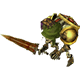
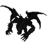

  

# Overview

<table class="dungeonOverview">
  <tr>
    <th>Unlock</th>
    <td class="highlightYellow">Clear Guardian of the Flame (Chapter 2).</td>
  </tr>
  <tr>
    <th>Location</th>
    <td class="highlightYellow">Harry's Hardware (Chapter 3+)</td>
  </tr>
</table>

<table class="dungeonTable">
  <tr>
    <th>Title</th>
    <td colspan="3">A Ravenous Journey</td>
  </tr>
  <tr>
    <th>Description</th>
    <td colspan="3">Food Level stays at 0%. Watch your HP to make it through!</td>
  </tr>
  <tr>
    <th>Floors</th>
    <td>6F</td>
    <th>Bosses</th>
    <td>5F</td>
  </tr>
  <tr>
    <th>Change Crystals</th>
    <td>0F</td>
    <th>Checkpoints</th>
    <td>None</td>
  </tr>
  <tr>
    <th>Max Level</th>
    <td>20</td>
    <th>Bring Buddy</th>
    <td>Yes</td>
  </tr>
  <tr>
    <th>Bring In Items</th>
    <td>No</td>
    <th>Take Out Items</th>
    <td>No</td>
  </tr>
  <tr>
    <th>Shops/Duels</th>
    <td>No</td>
    <th>Den of Monsters</th>
    <td>Yes</td>
  </tr>
  <tr>
    <th>Reapers</th>
    <td>No</td>
    <th>Bookmark</th>
    <td>No</td>
  </tr>
  <tr>
    <th>Unidentified</th>
    <td colspan="3">Equipment, Consumables</td>
  </tr>
  <tr>
    <th>Rewards</th>
    <td colspan="3">1.  Harry's Memories (6F). 2. Dungeon added to  Mirror of Training. 3. Can unlock  Charlotte's Memories.</td>
  </tr>
</table>

# Strategy

[Content]

# Monsters

<ul><li><a href="#monster-table">Monster Table</a></li><li><a href="#monster-details">Monster Details</a></li></ul>

 

 Monster Table 

Monster Colors - Boss F - 　 means field of view is limited. M - 　 means a Monster Den can appear. R - 　 means  Reaper can spawn.

<table class="monsterTable">
  <thead>
    <tr>
      <th>F</th>
      <th>M</th>
      <th colspan="6">Monsters</th>
      <th>R</th>
    </tr>
  </thead>
  <tbody>
    <tr class="changeCrystal">
      <td class="centeredText">0</td>
      <td></td>
      <td colspan="6" class="centeredText">Change Crystal</td>
      <td></td>
    </tr>
    <tr>
      <td class="centeredText highlightFog">1</td>
      <td class="highlightMH"></td>
      <td> Tonberry (21%)</td>
      <td> Ghost (21%)</td>
      <td> Flying Eye (21%)</td>
      <td> Cactuar (14%)</td>
      <td> Magic Pot (10%)</td>
      <td> Light Elemental (14%)</td>
      <td class="highlightReaper"></td>
    </tr>
    <tr>
      <td class="centeredText highlightFog">2</td>
      <td class="highlightMH"></td>
      <td> Tonberry (21%)</td>
      <td> Ghost (21%)</td>
      <td> Flying Eye (21%)</td>
      <td> Cactuar (14%)</td>
      <td> Magic Pot (10%)</td>
      <td> Light Elemental (14%)</td>
      <td class="highlightReaper"></td>
    </tr>
    <tr>
      <td class="centeredText highlightFog">3</td>
      <td class="highlightMH"></td>
      <td> Skeleton (21%)</td>
      <td> Lamia (21%)</td>
      <td> Demon (21%)</td>
      <td> Cactuar (14%)</td>
      <td> Magic Pot (10%)</td>
      <td> Light Elemental (14%)</td>
      <td class="highlightReaper"></td>
    </tr>
    <tr>
      <td class="centeredText highlightFog">4</td>
      <td class="highlightMH"></td>
      <td> Skeleton (21%)</td>
      <td> Lamia (21%)</td>
      <td> Demon (21%)</td>
      <td> Cactuar (14%)</td>
      <td> Magic Pot (10%)</td>
      <td> Light Elemental (14%)</td>
      <td class="highlightReaper"></td>
    </tr>
    <tr>
      <td class="centeredText">5</td>
      <td class="highlightGray"></td>
      <td> Demon Shade</td>
      <td class="highlightGray"></td>
      <td class="highlightGray"></td>
      <td class="highlightGray"></td>
      <td class="highlightGray"></td>
      <td class="highlightGray"></td>
      <td class="highlightGray"></td>
    </tr>
    <tr class="highlightYellow">
      <td class="centeredText">6</td>
      <td></td>
      <td colspan="6" class="centeredText"> Harry's Memories</td>
      <td></td>
    </tr>
  </tbody>
</table>

 

 Monster Details 

Stat Colors - Hard Mode

### Standard

#### Tonberry (1-2F)

<table class="buddyOverview">
  <tr class="noPad">
    <th colspan="13" class="highlightGreen">Stats</th>
  </tr>
  <tr>
    <td rowspan="4"></td>
    <td class="hp">HP</td>
    <td>44 / 55</td>
    <td class="atk">Attack</td>
    <td>30 / 32</td>
    <td class="mag">Magic</td>
    <td>37 / 38</td>
    <th>JP</th>
    <td>-</td>
    <th>Item 1</th>
    <td colspan="3">Potion (16%)</td>
  </tr>
  <tr>
    <td class="sp">Exp</td>
    <td>92</td>
    <td class="def">Defense</td>
    <td>37 / 38</td>
    <td class="mnd">Mind</td>
    <td>999 / 999</td>
    <th>BP</th>
    <td>3 (50%)</td>
    <th>Item 2</th>
    <td colspan="3">Poison Book (16%)</td>
  </tr>
  <tr>
    <th>Hit</th>
    <td>95</td>
    <th>Evasion</th>
    <td>8</td>
    <th>Crit</th>
    <td>100</td>
    <th>Gil</th>
    <td>-</td>
    <th>Steal</th>
    <td colspan="3">Remedy (50%)</td>
  </tr>
  <tr>
    <th>Lv</th>
    <td>13</td>
    <th>Special</th>
    <td></td>
    <th>Resist</th>
    <td colspan="3"></td>
    <th>Weak</th>
    <td colspan="3">-</td>
  </tr>
  <tr>
    <th colspan="13" class="abilityName">Knife</th>
  </tr>
  <tr class="elementIcon">
    <th>Element</th>
    <td>-</td>
    <th>Range</th>
    <td></td>
    <th>Notes</th>
    <td colspan="8" class="leftText">Halve the HP of a target 1 tile ahead.</td>
  </tr>
  <tr>
    <th>Rate / CD</th>
    <td colspan="2">25% / 6T</td>
    <th>Count</th>
    <td>∞</td>
    <th>Multiplier</th>
    <td>x1.0</td>
    <th>Value</th>
    <td>50</td>
    <th>Type</th>
    <td class="leftText">Physical</td>
    <th>Calc</th>
    <td class="leftText">Ratio</td>
  </tr>
  <tr>
    <th colspan="13" class="abilityName">Slow</th>
  </tr>
  <tr class="elementIcon">
    <th>Element</th>
    <td>-</td>
    <th>Range</th>
    <td></td>
    <th>Notes</th>
    <td colspan="8" class="leftText">Inflict Slow on a target up to 2 tiles ahead.</td>
  </tr>
  <tr>
    <th>Rate / CD</th>
    <td colspan="2">5% / 6T</td>
    <th>Count</th>
    <td>∞</td>
    <th>Multiplier</th>
    <td>x1.0</td>
    <th>Value</th>
    <td>0</td>
    <th>Type</th>
    <td class="leftText">Other</td>
    <th>Calc</th>
    <td class="leftText">None</td>
  </tr>
</table>

#### Ghost (1-2F)

<table class="buddyOverview">
  <tr class="noPad">
    <th colspan="13" class="highlightGreen">Stats</th>
  </tr>
  <tr>
    <td rowspan="4"></td>
    <td class="hp">HP</td>
    <td>38 / 47</td>
    <td class="atk">Attack</td>
    <td>19 / 20</td>
    <td class="mag">Magic</td>
    <td>34 / 35</td>
    <th>JP</th>
    <td>-</td>
    <th>Item 1</th>
    <td colspan="3">Potion (16%)</td>
  </tr>
  <tr>
    <td class="sp">Exp</td>
    <td>59</td>
    <td class="def">Defense</td>
    <td>34 / 35</td>
    <td class="mnd">Mind</td>
    <td>47 / 48</td>
    <th>BP</th>
    <td>3 (50%)</td>
    <th>Item 2</th>
    <td colspan="3">Drain Book (16%)</td>
  </tr>
  <tr>
    <th>Hit</th>
    <td>95</td>
    <th>Evasion</th>
    <td>8</td>
    <th>Crit</th>
    <td>5</td>
    <th>Gil</th>
    <td>-</td>
    <th>Steal</th>
    <td colspan="3">Poison Drink (50%)</td>
  </tr>
  <tr>
    <th>Lv</th>
    <td>10</td>
    <th>Special</th>
    <td></td>
    <th>Resist</th>
    <td colspan="3"></td>
    <th>Weak</th>
    <td colspan="3"></td>
  </tr>
  <tr>
    <th colspan="13" class="abilityName">Dark</th>
  </tr>
  <tr class="elementIcon">
    <th>Element</th>
    <td></td>
    <th>Range</th>
    <td></td>
    <th>Notes</th>
    <td colspan="8" class="leftText">Deal dark damage to a target up to 3 tiles ahead.</td>
  </tr>
  <tr>
    <th>Rate / CD</th>
    <td colspan="2">5% / 6T</td>
    <th>Count</th>
    <td>∞</td>
    <th>Multiplier</th>
    <td>x1.0</td>
    <th>Value</th>
    <td>8</td>
    <th>Type</th>
    <td class="leftText">Magic</td>
    <th>Calc</th>
    <td class="leftText">Stat</td>
  </tr>
</table>

#### Flying Eye (1-2F)

<table class="buddyOverview">
  <tr class="noPad">
    <th colspan="13" class="highlightGreen">Stats</th>
  </tr>
  <tr>
    <td rowspan="4"></td>
    <td class="hp">HP</td>
    <td>48 / 59</td>
    <td class="atk">Attack</td>
    <td>17 / 19</td>
    <td class="mag">Magic</td>
    <td>33 / 34</td>
    <th>JP</th>
    <td>-</td>
    <th>Item 1</th>
    <td colspan="3">Potion (16%)</td>
  </tr>
  <tr>
    <td class="sp">Exp</td>
    <td>72</td>
    <td class="def">Defense</td>
    <td>40 / 41</td>
    <td class="mnd">Mind</td>
    <td>46 / 47</td>
    <th>BP</th>
    <td>3 (50%)</td>
    <th>Item 2</th>
    <td colspan="3">Confuse Book (12%)</td>
  </tr>
  <tr>
    <th>Hit</th>
    <td>95</td>
    <th>Evasion</th>
    <td>8</td>
    <th>Crit</th>
    <td>5</td>
    <th>Gil</th>
    <td>-</td>
    <th>Steal</th>
    <td colspan="3">Ether (50%)</td>
  </tr>
  <tr>
    <th>Lv</th>
    <td>9</td>
    <th>Special</th>
    <td></td>
    <th>Resist</th>
    <td colspan="3"></td>
    <th>Weak</th>
    <td colspan="3">-</td>
  </tr>
  <tr>
    <th colspan="13" class="abilityName">Hypnosis</th>
  </tr>
  <tr class="elementIcon">
    <th>Element</th>
    <td>-</td>
    <th>Range</th>
    <td></td>
    <th>Notes</th>
    <td colspan="8" class="leftText">Inflict Sleep on a target 1 tile ahead.</td>
  </tr>
  <tr>
    <th>Rate / CD</th>
    <td colspan="2">10% / 3T</td>
    <th>Count</th>
    <td>∞</td>
    <th>Multiplier</th>
    <td>x1.0</td>
    <th>Value</th>
    <td>0</td>
    <th>Type</th>
    <td class="leftText">Other</td>
    <th>Calc</th>
    <td class="leftText">None</td>
  </tr>
  <tr>
    <th colspan="13" class="abilityName">Protect</th>
  </tr>
  <tr class="elementIcon">
    <th>Element</th>
    <td>-</td>
    <th>Range</th>
    <td></td>
    <th>Notes</th>
    <td colspan="8" class="leftText">Temporarily cast Protect on self or a target up to 2 tiles ahead.</td>
  </tr>
  <tr>
    <th>Rate / CD</th>
    <td colspan="2">5% / 6T</td>
    <th>Count</th>
    <td>∞</td>
    <th>Multiplier</th>
    <td>x1.0</td>
    <th>Value</th>
    <td>0</td>
    <th>Type</th>
    <td class="leftText">Other</td>
    <th>Calc</th>
    <td class="leftText">None</td>
  </tr>
</table>

#### Cactuar (1-4F)

<table class="buddyOverview">
  <tr class="noPad">
    <th colspan="13" class="highlightGreen">Stats</th>
  </tr>
  <tr>
    <td rowspan="4"></td>
    <td class="hp">HP</td>
    <td>56 / 70</td>
    <td class="atk">Attack</td>
    <td>38 / 40</td>
    <td class="mag">Magic</td>
    <td>20 / 21</td>
    <th>JP</th>
    <td>-</td>
    <th>Item 1</th>
    <td colspan="3">Potion (80%)</td>
  </tr>
  <tr>
    <td class="sp">Exp</td>
    <td>91</td>
    <td class="def">Defense</td>
    <td>43 / 44</td>
    <td class="mnd">Mind</td>
    <td>49 / 50</td>
    <th>BP</th>
    <td>3 (50%)</td>
    <th>Item 2</th>
    <td colspan="3">Hi-Potion (20%)</td>
  </tr>
  <tr>
    <th>Hit</th>
    <td>95</td>
    <th>Evasion</th>
    <td>8</td>
    <th>Crit</th>
    <td>5</td>
    <th>Gil</th>
    <td>-</td>
    <th>Steal</th>
    <td colspan="3">Remedy (50%)</td>
  </tr>
  <tr>
    <th>Lv</th>
    <td>12</td>
    <th>Special</th>
    <td>-</td>
    <th>Resist</th>
    <td colspan="3"></td>
    <th>Weak</th>
    <td colspan="3"></td>
  </tr>
  <tr>
    <th colspan="13" class="abilityName">Gil Toss</th>
  </tr>
  <tr class="elementIcon">
    <th>Element</th>
    <td>-</td>
    <th>Range</th>
    <td></td>
    <th>Notes</th>
    <td colspan="8" class="leftText">Deal damage to a target up to 3 tiles ahead.</td>
  </tr>
  <tr>
    <th>Rate / CD</th>
    <td colspan="2">5% / 0T</td>
    <th>Count</th>
    <td>∞</td>
    <th>Multiplier</th>
    <td>x2.0</td>
    <th>Value</th>
    <td>0</td>
    <th>Type</th>
    <td class="leftText">Physical</td>
    <th>Calc</th>
    <td class="leftText">Stat</td>
  </tr>
</table>

#### Magic Pot (1-4F)

<table class="buddyOverview">
  <tr class="noPad">
    <th colspan="13" class="highlightGreen">Stats</th>
  </tr>
  <tr>
    <td rowspan="4"></td>
    <td class="hp">HP</td>
    <td>42 / 52</td>
    <td class="atk">Attack</td>
    <td>38 / 40</td>
    <td class="mag">Magic</td>
    <td>36 / 37</td>
    <th>JP</th>
    <td>-</td>
    <th>Item 1</th>
    <td colspan="3">Hi-Potion (12%)</td>
  </tr>
  <tr>
    <td class="sp">Exp</td>
    <td>60</td>
    <td class="def">Defense</td>
    <td>36 / 37</td>
    <td class="mnd">Mind</td>
    <td>49 / 50</td>
    <th>BP</th>
    <td>3 (50%)</td>
    <th>Item 2</th>
    <td colspan="3">Dia Book (12%)</td>
  </tr>
  <tr>
    <th>Hit</th>
    <td>95</td>
    <th>Evasion</th>
    <td>8</td>
    <th>Crit</th>
    <td>5</td>
    <th>Gil</th>
    <td>-</td>
    <th>Steal</th>
    <td colspan="3">Remedy (50%)</td>
  </tr>
  <tr>
    <th>Lv</th>
    <td>12</td>
    <th>Special</th>
    <td>-</td>
    <th>Resist</th>
    <td colspan="3"></td>
    <th>Weak</th>
    <td colspan="3">-</td>
  </tr>
  <tr>
    <th colspan="13" class="abilityName">Steal</th>
  </tr>
  <tr class="elementIcon">
    <th>Element</th>
    <td>-</td>
    <th>Range</th>
    <td></td>
    <th>Notes</th>
    <td colspan="8" class="leftText">Steal an inventory item from a target 1 tile ahead.</td>
  </tr>
  <tr>
    <th>Rate / CD</th>
    <td colspan="2">25% / 0T</td>
    <th>Count</th>
    <td>∞</td>
    <th>Multiplier</th>
    <td>x1.0</td>
    <th>Value</th>
    <td>0</td>
    <th>Type</th>
    <td class="leftText">Other</td>
    <th>Calc</th>
    <td class="leftText">None</td>
  </tr>
</table>

#### Light Elemental (1-4F)

<table class="buddyOverview">
  <tr class="noPad">
    <th colspan="13" class="highlightGreen">Stats</th>
  </tr>
  <tr>
    <td rowspan="4"></td>
    <td class="hp">HP</td>
    <td>2 / 2</td>
    <td class="atk">Attack</td>
    <td>19 / 20</td>
    <td class="mag">Magic</td>
    <td>26 / 27</td>
    <th>JP</th>
    <td>-</td>
    <th>Item 1</th>
    <td colspan="3">Hi-Potion (12%)</td>
  </tr>
  <tr>
    <td class="sp">Exp</td>
    <td>74</td>
    <td class="def">Defense</td>
    <td>41 / 42</td>
    <td class="mnd">Mind</td>
    <td>35 / 36</td>
    <th>BP</th>
    <td>3 (50%)</td>
    <th>Item 2</th>
    <td colspan="3">Dia Book (12%)</td>
  </tr>
  <tr>
    <th>Hit</th>
    <td>95</td>
    <th>Evasion</th>
    <td>4</td>
    <th>Crit</th>
    <td>0</td>
    <th>Gil</th>
    <td>-</td>
    <th>Steal</th>
    <td colspan="3">Remedy (50%)</td>
  </tr>
  <tr>
    <th>Lv</th>
    <td>10</td>
    <th>Special</th>
    <td></td>
    <th>Resist</th>
    <td colspan="3"></td>
    <th>Weak</th>
    <td colspan="3"></td>
  </tr>
  <tr>
    <th colspan="13" class="abilityName">Cura</th>
  </tr>
  <tr class="elementIcon">
    <th>Element</th>
    <td>-</td>
    <th>Range</th>
    <td></td>
    <th>Notes</th>
    <td colspan="8" class="leftText">Heal HP of self or a target up to 3 tiles ahead.</td>
  </tr>
  <tr>
    <th>Rate / CD</th>
    <td colspan="2">20% / 8T</td>
    <th>Count</th>
    <td>∞</td>
    <th>Multiplier</th>
    <td>x1.0</td>
    <th>Value</th>
    <td>60</td>
    <th>Type</th>
    <td class="leftText">Healing</td>
    <th>Calc</th>
    <td class="leftText">Stat</td>
  </tr>
</table>

#### Skeleton (3-4F)

<table class="buddyOverview">
  <tr class="noPad">
    <th colspan="13" class="highlightGreen">Stats</th>
  </tr>
  <tr>
    <td rowspan="4"></td>
    <td class="hp">HP</td>
    <td>40 / 50</td>
    <td class="atk">Attack</td>
    <td>26 / 28</td>
    <td class="mag">Magic</td>
    <td>35 / 36</td>
    <th>JP</th>
    <td>-</td>
    <th>Item 1</th>
    <td colspan="3">Potion (16%)</td>
  </tr>
  <tr>
    <td class="sp">Exp</td>
    <td>75</td>
    <td class="def">Defense</td>
    <td>50 / 51</td>
    <td class="mnd">Mind</td>
    <td>28 / 29</td>
    <th>BP</th>
    <td>3 (50%)</td>
    <th>Item 2</th>
    <td colspan="3">Drain Book (12%)</td>
  </tr>
  <tr>
    <th>Hit</th>
    <td>95</td>
    <th>Evasion</th>
    <td>4</td>
    <th>Crit</th>
    <td>5</td>
    <th>Gil</th>
    <td>-</td>
    <th>Steal</th>
    <td colspan="3">Poison Drink (50%)</td>
  </tr>
  <tr>
    <th>Lv</th>
    <td>11</td>
    <th>Special</th>
    <td></td>
    <th>Resist</th>
    <td colspan="3"></td>
    <th>Weak</th>
    <td colspan="3"></td>
  </tr>
  <tr>
    <th colspan="13" class="abilityName">Poison Slash</th>
  </tr>
  <tr class="elementIcon">
    <th>Element</th>
    <td>-</td>
    <th>Range</th>
    <td></td>
    <th>Notes</th>
    <td colspan="8" class="leftText">Deal damage + Poison to a target 1 tile ahead.</td>
  </tr>
  <tr>
    <th>Rate / CD</th>
    <td colspan="2">15% / 3T</td>
    <th>Count</th>
    <td>∞</td>
    <th>Multiplier</th>
    <td>x1.0</td>
    <th>Value</th>
    <td>0</td>
    <th>Type</th>
    <td class="leftText">Physical</td>
    <th>Calc</th>
    <td class="leftText">Stat</td>
  </tr>
  <tr>
    <th colspan="13" class="abilityName">Horror Cloud</th>
  </tr>
  <tr class="elementIcon">
    <th>Element</th>
    <td>-</td>
    <th>Range</th>
    <td></td>
    <th>Notes</th>
    <td colspan="8" class="leftText">Inflict Slow on a target 1 tile ahead.</td>
  </tr>
  <tr>
    <th>Rate / CD</th>
    <td colspan="2">5% / 3T</td>
    <th>Count</th>
    <td>∞</td>
    <th>Multiplier</th>
    <td>x1.0</td>
    <th>Value</th>
    <td>0</td>
    <th>Type</th>
    <td class="leftText">Other</td>
    <th>Calc</th>
    <td class="leftText">None</td>
  </tr>
</table>

#### Lamia (3-4F)

<table class="buddyOverview">
  <tr class="noPad">
    <th colspan="13" class="highlightGreen">Stats</th>
  </tr>
  <tr>
    <td rowspan="4"></td>
    <td class="hp">HP</td>
    <td>53 / 67</td>
    <td class="atk">Attack</td>
    <td>20 / 21</td>
    <td class="mag">Magic</td>
    <td>35 / 36</td>
    <th>JP</th>
    <td>-</td>
    <th>Item 1</th>
    <td colspan="3">Potion (16%)</td>
  </tr>
  <tr>
    <td class="sp">Exp</td>
    <td>90</td>
    <td class="def">Defense</td>
    <td>42 / 43</td>
    <td class="mnd">Mind</td>
    <td>48 / 49</td>
    <th>BP</th>
    <td>3 (50%)</td>
    <th>Item 2</th>
    <td colspan="3">Confuse Book (12%)</td>
  </tr>
  <tr>
    <th>Hit</th>
    <td>95</td>
    <th>Evasion</th>
    <td>4</td>
    <th>Crit</th>
    <td>5</td>
    <th>Gil</th>
    <td>-</td>
    <th>Steal</th>
    <td colspan="3">Remedy (50%)</td>
  </tr>
  <tr>
    <th>Lv</th>
    <td>11</td>
    <th>Special</th>
    <td>-</td>
    <th>Resist</th>
    <td colspan="3">-</td>
    <th>Weak</th>
    <td colspan="3"></td>
  </tr>
  <tr>
    <th colspan="13" class="abilityName">Entice</th>
  </tr>
  <tr class="elementIcon">
    <th>Element</th>
    <td>-</td>
    <th>Range</th>
    <td></td>
    <th>Notes</th>
    <td colspan="8" class="leftText">Inflict Confuse on a target 1 tile ahead.</td>
  </tr>
  <tr>
    <th>Rate / CD</th>
    <td colspan="2">15% / 8T</td>
    <th>Count</th>
    <td>∞</td>
    <th>Multiplier</th>
    <td>x1.0</td>
    <th>Value</th>
    <td>0</td>
    <th>Type</th>
    <td class="leftText">Other</td>
    <th>Calc</th>
    <td class="leftText">None</td>
  </tr>
  <tr>
    <th colspan="13" class="abilityName">Erase</th>
  </tr>
  <tr class="elementIcon">
    <th>Element</th>
    <td>-</td>
    <th>Range</th>
    <td></td>
    <th>Notes</th>
    <td colspan="8" class="leftText">Wipe player buffs of a target up to 3 tiles ahead.</td>
  </tr>
  <tr>
    <th>Rate / CD</th>
    <td colspan="2">10% / 6T</td>
    <th>Count</th>
    <td>∞</td>
    <th>Multiplier</th>
    <td>x1.0</td>
    <th>Value</th>
    <td>0</td>
    <th>Type</th>
    <td class="leftText">Other</td>
    <th>Calc</th>
    <td class="leftText">None</td>
  </tr>
</table>

#### Demon (3-4F)

<table class="buddyOverview">
  <tr class="noPad">
    <th colspan="13" class="highlightGreen">Stats</th>
  </tr>
  <tr>
    <td rowspan="4"></td>
    <td class="hp">HP</td>
    <td>42 / 52</td>
    <td class="atk">Attack</td>
    <td>28 / 30</td>
    <td class="mag">Magic</td>
    <td>36 / 37</td>
    <th>JP</th>
    <td>-</td>
    <th>Item 1</th>
    <td colspan="3">Potion (16%)</td>
  </tr>
  <tr>
    <td class="sp">Exp</td>
    <td>91</td>
    <td class="def">Defense</td>
    <td>43 / 44</td>
    <td class="mnd">Mind</td>
    <td>49 / 50</td>
    <th>BP</th>
    <td>3 (50%)</td>
    <th>Item 2</th>
    <td colspan="3">Sleep Book (12%)</td>
  </tr>
  <tr>
    <th>Hit</th>
    <td>85</td>
    <th>Evasion</th>
    <td>4</td>
    <th>Crit</th>
    <td>5</td>
    <th>Gil</th>
    <td>-</td>
    <th>Steal</th>
    <td colspan="3">Ether (50%)</td>
  </tr>
  <tr>
    <th>Lv</th>
    <td>12</td>
    <th>Special</th>
    <td></td>
    <th>Resist</th>
    <td colspan="3"></td>
    <th>Weak</th>
    <td colspan="3"></td>
  </tr>
  <tr>
    <th colspan="13" class="abilityName">Demon Touch</th>
  </tr>
  <tr class="elementIcon">
    <th>Element</th>
    <td>-</td>
    <th>Range</th>
    <td></td>
    <th>Notes</th>
    <td colspan="8" class="leftText">Halve an adjacent target's SP.</td>
  </tr>
  <tr>
    <th>Rate / CD</th>
    <td colspan="2">10% / 3T</td>
    <th>Count</th>
    <td>∞</td>
    <th>Multiplier</th>
    <td>x1.0</td>
    <th>Value</th>
    <td>50</td>
    <th>Type</th>
    <td class="leftText">Magic</td>
    <th>Calc</th>
    <td class="leftText">Ratio</td>
  </tr>
</table>

### Boss

#### Demon Shade (5F)

<table class="buddyOverview">
  <tr class="noPad">
    <th colspan="14" class="highlightBoss">Stats</th>
  </tr>
  <tr>
    <td rowspan="4"></td>
    <td class="hp">HP</td>
    <td>270 / 323</td>
    <td class="atk">Attack</td>
    <td>35 / 35</td>
    <td class="mag">Magic</td>
    <td>27 / 27</td>
    <th>JP</th>
    <td colspan="2">-</td>
    <th>Item 1</th>
    <td colspan="5">-</td>
  </tr>
  <tr>
    <td class="sp">Exp</td>
    <td>0</td>
    <td class="def">Defense</td>
    <td>35 / 35</td>
    <td class="mnd">Mind</td>
    <td>31 / 31</td>
    <th>BP</th>
    <td colspan="2">-</td>
    <th>Item 2</th>
    <td colspan="5">-</td>
  </tr>
  <tr>
    <th>Hit</th>
    <td>85</td>
    <th>Evasion</th>
    <td>5</td>
    <th>Crit</th>
    <td>10</td>
    <th>Gil</th>
    <td colspan="2">-</td>
    <th>Steal</th>
    <td colspan="5">Demon Bashers (100%)</td>
  </tr>
  <tr>
    <th>Lv</th>
    <td>20</td>
    <th>Special</th>
    <td></td>
    <th>Resist</th>
    <td colspan="4"></td>
    <th>Weak</th>
    <td colspan="5"></td>
  </tr>
  <tr>
    <th colspan="14" class="statusResists">Status Resistances</th>
  </tr>
  <tr>
    <th></th>
    <th></th>
    <th></th>
    <th></th>
    <th></th>
    <th></th>
    <th></th>
    <th></th>
    <th></th>
    <th colspan="2">Knockback</th>
    <th>Stun</th>
    <th>Warp</th>
    <th>Ratio</th>
  </tr>
  <tr>
    <td>◯</td>
    <td>◯</td>
    <td>◯</td>
    <td>◯</td>
    <td>◯</td>
    <td>◯</td>
    <td>◯</td>
    <td>◯</td>
    <td>◯</td>
    <td colspan="2">◯</td>
    <td>◯</td>
    <td>◯</td>
    <td>◯</td>
  </tr>
  <tr>
    <th colspan="14" class="abilityName">Demon Touch</th>
  </tr>
  <tr class="elementIcon">
    <th>Element</th>
    <td>-</td>
    <th>Range</th>
    <td></td>
    <th>Notes</th>
    <td colspan="13" class="leftText">Halve an adjacent target's SP.</td>
  </tr>
  <tr>
    <th>Rate / CD</th>
    <td colspan="2">10% | 10% / 3T</td>
    <th>Count</th>
    <td>∞</td>
    <th>Multiplier</th>
    <td>x1.0</td>
    <th>Value</th>
    <td>50</td>
    <th>Type</th>
    <td colspan="2" class="leftText">Magic</td>
    <th>Calc</th>
    <td class="leftText">Ratio</td>
  </tr>
  <tr>
    <th colspan="14" class="abilityName">Dark</th>
  </tr>
  <tr class="elementIcon">
    <th>Element</th>
    <td></td>
    <th>Range</th>
    <td></td>
    <th>Notes</th>
    <td colspan="13" class="leftText">Deal dark damage to a target up to 3 tiles ahead.</td>
  </tr>
  <tr>
    <th>Rate / CD</th>
    <td colspan="2">20% | 20% / 6T</td>
    <th>Count</th>
    <td>∞</td>
    <th>Multiplier</th>
    <td>x1.0</td>
    <th>Value</th>
    <td>8</td>
    <th>Type</th>
    <td colspan="2" class="leftText">Magic</td>
    <th>Calc</th>
    <td class="leftText">Stat</td>
  </tr>
</table>

# Items

<ul><li><a href="#floor">Floor</a></li><li><a href="#drop-/-steal">Drop / Steal</a></li></ul>

 

 Floor 

See the dungeon data JSON file for exact item spawn rates per floor. Colors - Dig / Ingenuity exclusive

<table class="dungeonItemTable">
  <tr>
    <th colspan="3" class="highlightPurple"> Medicines</th>
  </tr>
  <tr>
    <th>Item</th>
    <th>Floor</th>
    <th>Rate Range</th>
  </tr>
  <tr>
    <td>Potion</td>
    <td>1-4</td>
    <td>27.4%</td>
  </tr>
  <tr>
    <td>Hi-Potion</td>
    <td>1-4</td>
    <td>20.55%</td>
  </tr>
  <tr>
    <td>Amnesia Drink</td>
    <td>1-4</td>
    <td>6.85%</td>
  </tr>
  <tr>
    <td>Salt Water</td>
    <td>1-4</td>
    <td>6.85%</td>
  </tr>
  <tr>
    <td>Goblin's Tonic</td>
    <td>1-4</td>
    <td>6.85%</td>
  </tr>
  <tr>
    <td>Sleep Drink</td>
    <td>1-4</td>
    <td>6.85%</td>
  </tr>
  <tr>
    <td>Remedy</td>
    <td>1-4</td>
    <td>6.85%</td>
  </tr>
  <tr>
    <td>Poison Drink</td>
    <td>1-4</td>
    <td>6.85%</td>
  </tr>
  <tr class="dig">
    <td>Hi-Potion</td>
    <td>5</td>
    <td>100%</td>
  </tr>
  <tr>
    <th colspan="3" class="highlightPurple"> Other</th>
  </tr>
  <tr>
    <th>Item</th>
    <th>Floor</th>
    <th>Rate Range</th>
  </tr>
  <tr>
    <td>Warp Wings</td>
    <td>1-4</td>
    <td>4.11%</td>
  </tr>
  <tr>
    <td>Appraisal Glasses</td>
    <td>1-4</td>
    <td>6.85%</td>
  </tr>
</table>

 

 Drop / Steal 

Monster Colors - Boss

<table class="dungeonDropTable">
  <thead>
    <tr>
      <th>Floor</th>
      <th>Monster</th>
      <th>Drop 1</th>
      <th>Drop 2</th>
      <th>Steal</th>
    </tr>
  </thead>
  <tbody>
    <tr>
      <td>1-2</td>
      <td> Flying Eye</td>
      <td>Potion (16%)</td>
      <td>Confuse Book (12%)</td>
      <td>Ether (50%)</td>
    </tr>
    <tr>
      <td>1-2</td>
      <td> Tonberry</td>
      <td>Potion (16%)</td>
      <td>Poison Book (16%)</td>
      <td>Remedy (50%)</td>
    </tr>
    <tr>
      <td>1-2</td>
      <td> Ghost</td>
      <td>Potion (16%)</td>
      <td>Drain Book (16%)</td>
      <td>Poison Drink (50%)</td>
    </tr>
    <tr>
      <td>1-4</td>
      <td> Magic Pot</td>
      <td>Hi-Potion (12%)</td>
      <td>Dia Book (12%)</td>
      <td>Remedy (50%)</td>
    </tr>
    <tr>
      <td>1-4</td>
      <td> Cactuar</td>
      <td>Potion (80%)</td>
      <td>Hi-Potion (20%)</td>
      <td>Remedy (50%)</td>
    </tr>
    <tr>
      <td>1-4</td>
      <td> Light Elemental</td>
      <td>Hi-Potion (12%)</td>
      <td>Dia Book (12%)</td>
      <td>Remedy (50%)</td>
    </tr>
    <tr>
      <td>3-4</td>
      <td> Lamia</td>
      <td>Potion (16%)</td>
      <td>Confuse Book (12%)</td>
      <td>Remedy (50%)</td>
    </tr>
    <tr>
      <td>3-4</td>
      <td> Skeleton</td>
      <td>Potion (16%)</td>
      <td>Drain Book (12%)</td>
      <td>Poison Drink (50%)</td>
    </tr>
    <tr>
      <td>3-4</td>
      <td> Demon</td>
      <td>Potion (16%)</td>
      <td>Sleep Book (12%)</td>
      <td>Ether (50%)</td>
    </tr>
    <tr>
      <td>5</td>
      <td> Demon Shade</td>
      <td>-</td>
      <td>-</td>
      <td>Demon Bashers (100%)</td>
    </tr>
  </tbody>
</table>
