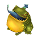
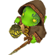
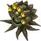
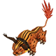
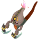
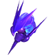

  

# Overview

<table class="dungeonOverview">
  <tr>
    <th>Unlock</th>
    <td class="highlightYellow">Clear A Treasure Hunter's Memories (Chapter 2).</td>
  </tr>
  <tr>
    <th>Location</th>
    <td class="highlightYellow">Stella's Farm (Chapter 2+)</td>
  </tr>
</table>

<table class="dungeonTable">
  <tr>
    <th>Title</th>
    <td colspan="3">-</td>
  </tr>
  <tr>
    <th>Description</th>
    <td colspan="3">Normal dungeon with no restrictions.</td>
  </tr>
  <tr>
    <th>Floors</th>
    <td>51F</td>
    <th>Bosses</th>
    <td>25F, 50F</td>
  </tr>
  <tr>
    <th>Change Crystals</th>
    <td>0F</td>
    <th>Checkpoints</th>
    <td>None</td>
  </tr>
  <tr>
    <th>Max Level</th>
    <td>-</td>
    <th>Bring Buddy</th>
    <td>Yes</td>
  </tr>
  <tr>
    <th>Bring In Items</th>
    <td>Yes</td>
    <th>Take Out Items</th>
    <td>Yes</td>
  </tr>
  <tr>
    <th>Shops/Duels</th>
    <td>No</td>
    <th>Den of Monsters</th>
    <td>Yes</td>
  </tr>
  <tr>
    <th>Reapers</th>
    <td>Yes</td>
    <th>Bookmark</th>
    <td>Yes</td>
  </tr>
  <tr>
    <th>Unidentified</th>
    <td colspan="3">Equipment, Consumables</td>
  </tr>
  <tr>
    <th>Rewards</th>
    <td colspan="3">1.  Amethyst's Memories (51F). 2.  Scarecrow added to  Buddy Registry. 3. Dungeon added to  Mirror of Memory. 4.  Insatiable Hunger (Endless) unlocked.</td>
  </tr>
</table>

# Strategy

[Content]

# Monsters

<ul><li><a href="#monster-table">Monster Table</a></li><li><a href="#monster-details">Monster Details</a></li></ul>

 

 Monster Table 

Monster Colors - Boss F - 　 means field of view is limited. M - 　 means a Den of Monsters can appear. R - 　 means  Reaper can spawn.

<table class="monsterTable">
  <thead>
    <tr>
      <th>F</th>
      <th>M</th>
      <th colspan="6">Monsters</th>
      <th>R</th>
    </tr>
  </thead>
  <tbody>
    <tr class="changeCrystal">
      <td class="centeredText">0</td>
      <td></td>
      <td colspan="6" class="centeredText">Change Crystal</td>
      <td></td>
    </tr>
    <tr>
      <td class="centeredText highlightFog">1</td>
      <td class="highlightGray"></td>
      <td> Frog (20%)</td>
      <td> Mandra (20%)</td>
      <td> Tonberry (20%)</td>
      <td> Malboro (25%)</td>
      <td> Cactuar (15%)</td>
      <td class="highlightGray"></td>
      <td class="highlightReaper"></td>
    </tr>
    <tr>
      <td class="centeredText highlightFog">2</td>
      <td class="highlightGray"></td>
      <td> Frog (20%)</td>
      <td> Mandra (20%)</td>
      <td> Tonberry (20%)</td>
      <td> Malboro (25%)</td>
      <td> Cactuar (15%)</td>
      <td class="highlightGray"></td>
      <td class="highlightReaper"></td>
    </tr>
    <tr>
      <td class="centeredText highlightFog">3</td>
      <td class="highlightMH"></td>
      <td> Frog (20%)</td>
      <td> Mandra (20%)</td>
      <td> Tonberry (20%)</td>
      <td> Malboro (25%)</td>
      <td> Cactuar (15%)</td>
      <td class="highlightGray"></td>
      <td class="highlightReaper"></td>
    </tr>
    <tr>
      <td class="centeredText highlightFog">4</td>
      <td class="highlightMH"></td>
      <td> Frog (20%)</td>
      <td> Mandra (20%)</td>
      <td> Tonberry (20%)</td>
      <td> Malboro (25%)</td>
      <td> Cactuar (15%)</td>
      <td class="highlightGray"></td>
      <td class="highlightReaper"></td>
    </tr>
    <tr>
      <td class="centeredText highlightFog">5</td>
      <td class="highlightMH"></td>
      <td> Frog (20%)</td>
      <td> Mandra (20%)</td>
      <td> Tonberry (20%)</td>
      <td> Malboro (25%)</td>
      <td> Cactuar (15%)</td>
      <td class="highlightGray"></td>
      <td class="highlightReaper"></td>
    </tr>
    <tr>
      <td class="centeredText highlightFog">6</td>
      <td class="highlightMH"></td>
      <td> Frog (20%)</td>
      <td> Mandra (20%)</td>
      <td> Tonberry (20%)</td>
      <td> Malboro (25%)</td>
      <td> Cactuar (15%)</td>
      <td class="highlightGray"></td>
      <td class="highlightReaper"></td>
    </tr>
    <tr>
      <td class="centeredText highlightFog">7</td>
      <td class="highlightMH"></td>
      <td> Frog (20%)</td>
      <td> Mandra (20%)</td>
      <td> Tonberry (20%)</td>
      <td> Malboro (25%)</td>
      <td> Dry Cactuar (15%)</td>
      <td class="highlightGray"></td>
      <td class="highlightReaper"></td>
    </tr>
    <tr>
      <td class="centeredText highlightFog">8</td>
      <td class="highlightMH"></td>
      <td> Frog (20%)</td>
      <td> Mandra (20%)</td>
      <td> Tonberry (20%)</td>
      <td> Malboro (25%)</td>
      <td> Dry Cactuar (15%)</td>
      <td class="highlightGray"></td>
      <td class="highlightReaper"></td>
    </tr>
    <tr>
      <td class="centeredText highlightFog">9</td>
      <td class="highlightMH"></td>
      <td> Frog (20%)</td>
      <td> Mandra (20%)</td>
      <td> Tonberry (20%)</td>
      <td> Malboro (25%)</td>
      <td> Dry Cactuar (15%)</td>
      <td class="highlightGray"></td>
      <td class="highlightReaper"></td>
    </tr>
    <tr>
      <td class="centeredText highlightFog">10</td>
      <td class="highlightMH"></td>
      <td> Frog (20%)</td>
      <td> Mandra (20%)</td>
      <td> Tonberry (20%)</td>
      <td> Malboro (25%)</td>
      <td> Dry Cactuar (15%)</td>
      <td class="highlightGray"></td>
      <td class="highlightReaper"></td>
    </tr>
    <tr>
      <td class="centeredText highlightFog">11</td>
      <td class="highlightMH"></td>
      <td> Frog (20%)</td>
      <td> Mandra (20%)</td>
      <td> Tonberry (20%)</td>
      <td> Malboro (25%)</td>
      <td> Dry Cactuar (15%)</td>
      <td class="highlightGray"></td>
      <td class="highlightReaper"></td>
    </tr>
    <tr>
      <td class="centeredText highlightFog">12</td>
      <td class="highlightMH"></td>
      <td> Frog (20%)</td>
      <td> Mandra (20%)</td>
      <td> Tonberry (20%)</td>
      <td> Malboro (25%)</td>
      <td> Dry Cactuar (15%)</td>
      <td class="highlightGray"></td>
      <td class="highlightReaper"></td>
    </tr>
    <tr>
      <td class="centeredText highlightFog">13</td>
      <td class="highlightMH"></td>
      <td> Toad (20%)</td>
      <td> Mandragora (20%)</td>
      <td> Master Tonberry (20%)</td>
      <td> Great Malboro (25%)</td>
      <td> Water Elemental (15%)</td>
      <td class="highlightGray"></td>
      <td class="highlightReaper"></td>
    </tr>
    <tr>
      <td class="centeredText highlightFog">14</td>
      <td class="highlightMH"></td>
      <td> Toad (20%)</td>
      <td> Mandragora (20%)</td>
      <td> Master Tonberry (20%)</td>
      <td> Great Malboro (25%)</td>
      <td> Water Elemental (15%)</td>
      <td class="highlightGray"></td>
      <td class="highlightReaper"></td>
    </tr>
    <tr>
      <td class="centeredText highlightFog">15</td>
      <td class="highlightMH"></td>
      <td> Toad (20%)</td>
      <td> Mandragora (20%)</td>
      <td> Master Tonberry (20%)</td>
      <td> Great Malboro (25%)</td>
      <td> Water Elemental (15%)</td>
      <td class="highlightGray"></td>
      <td class="highlightReaper"></td>
    </tr>
    <tr>
      <td class="centeredText highlightFog">16</td>
      <td class="highlightMH"></td>
      <td> Toad (20%)</td>
      <td> Mandragora (20%)</td>
      <td> Master Tonberry (20%)</td>
      <td> Great Malboro (25%)</td>
      <td> Water Elemental (15%)</td>
      <td class="highlightGray"></td>
      <td class="highlightReaper"></td>
    </tr>
    <tr>
      <td class="centeredText highlightFog">17</td>
      <td class="highlightMH"></td>
      <td> Toad (20%)</td>
      <td> Mandragora (20%)</td>
      <td> Master Tonberry (20%)</td>
      <td> Great Malboro (25%)</td>
      <td> Water Elemental (15%)</td>
      <td class="highlightGray"></td>
      <td class="highlightReaper"></td>
    </tr>
    <tr>
      <td class="centeredText highlightFog">18</td>
      <td class="highlightMH"></td>
      <td> Toad (20%)</td>
      <td> Mandragora (20%)</td>
      <td> Master Tonberry (20%)</td>
      <td> Great Malboro (25%)</td>
      <td> Water Elemental (15%)</td>
      <td class="highlightGray"></td>
      <td class="highlightReaper"></td>
    </tr>
    <tr>
      <td class="centeredText highlightFog">19</td>
      <td class="highlightMH"></td>
      <td> Toad (20%)</td>
      <td> Mandragora (20%)</td>
      <td> Master Tonberry (20%)</td>
      <td> Great Malboro (25%)</td>
      <td> Light Elemental (15%)</td>
      <td class="highlightGray"></td>
      <td class="highlightReaper"></td>
    </tr>
    <tr>
      <td class="centeredText highlightFog">20</td>
      <td class="highlightMH"></td>
      <td> Toad (20%)</td>
      <td> Mandragora (20%)</td>
      <td> Master Tonberry (20%)</td>
      <td> Great Malboro (25%)</td>
      <td> Light Elemental (15%)</td>
      <td class="highlightGray"></td>
      <td class="highlightReaper"></td>
    </tr>
    <tr>
      <td class="centeredText highlightFog">21</td>
      <td class="highlightMH"></td>
      <td> Toad (20%)</td>
      <td> Mandragora (20%)</td>
      <td> Master Tonberry (20%)</td>
      <td> Great Malboro (25%)</td>
      <td> Light Elemental (15%)</td>
      <td class="highlightGray"></td>
      <td class="highlightReaper"></td>
    </tr>
    <tr>
      <td class="centeredText highlightFog">22</td>
      <td class="highlightMH"></td>
      <td> Toad (20%)</td>
      <td> Mandragora (20%)</td>
      <td> Master Tonberry (20%)</td>
      <td> Great Malboro (25%)</td>
      <td> Light Elemental (15%)</td>
      <td class="highlightGray"></td>
      <td class="highlightReaper"></td>
    </tr>
    <tr>
      <td class="centeredText highlightFog">23</td>
      <td class="highlightMH"></td>
      <td> Toad (20%)</td>
      <td> Mandragora (20%)</td>
      <td> Master Tonberry (20%)</td>
      <td> Great Malboro (25%)</td>
      <td> Light Elemental (15%)</td>
      <td class="highlightGray"></td>
      <td class="highlightReaper"></td>
    </tr>
    <tr>
      <td class="centeredText highlightFog">24</td>
      <td class="highlightGray"></td>
      <td> Toad (20%)</td>
      <td> Mandragora (20%)</td>
      <td> Master Tonberry (20%)</td>
      <td> Great Malboro (25%)</td>
      <td> Light Elemental (15%)</td>
      <td class="highlightGray"></td>
      <td class="highlightReaper"></td>
    </tr>
    <tr>
      <td class="centeredText">25</td>
      <td class="highlightGray"></td>
      <td> Devil Chocobo</td>
      <td class="highlightGray"></td>
      <td class="highlightGray"></td>
      <td class="highlightGray"></td>
      <td class="highlightGray"></td>
      <td class="highlightGray"></td>
      <td class="highlightGray"></td>
    </tr>
    <tr>
      <td class="centeredText highlightFog">26</td>
      <td class="highlightGray"></td>
      <td> Vulture (20%)</td>
      <td> Ghost (20%)</td>
      <td> Flying Eye (15%)</td>
      <td> Coeurl (15%)</td>
      <td> Iron Giant Silver (15%)</td>
      <td> Magic Pot (15%)</td>
      <td class="highlightReaper"></td>
    </tr>
    <tr>
      <td class="centeredText highlightFog">27</td>
      <td class="highlightGray"></td>
      <td> Vulture (20%)</td>
      <td> Ghost (20%)</td>
      <td> Flying Eye (15%)</td>
      <td> Coeurl (15%)</td>
      <td> Iron Giant Silver (15%)</td>
      <td> Magic Pot (15%)</td>
      <td class="highlightReaper"></td>
    </tr>
    <tr>
      <td class="centeredText highlightFog">28</td>
      <td class="highlightMH"></td>
      <td> Vulture (20%)</td>
      <td> Ghost (20%)</td>
      <td> Flying Eye (15%)</td>
      <td> Coeurl (15%)</td>
      <td> Iron Giant Silver (15%)</td>
      <td> Magic Pot (15%)</td>
      <td class="highlightReaper"></td>
    </tr>
    <tr>
      <td class="centeredText highlightFog">29</td>
      <td class="highlightMH"></td>
      <td> Vulture (20%)</td>
      <td> Ghost (20%)</td>
      <td> Flying Eye (15%)</td>
      <td> Coeurl (15%)</td>
      <td> Iron Giant Silver (15%)</td>
      <td> Magic Pot (15%)</td>
      <td class="highlightReaper"></td>
    </tr>
    <tr>
      <td class="centeredText highlightFog">30</td>
      <td class="highlightMH"></td>
      <td> Vulture (20%)</td>
      <td> Ghost (20%)</td>
      <td> Flying Eye (15%)</td>
      <td> Coeurl (15%)</td>
      <td> Iron Giant Silver (15%)</td>
      <td> Magic Pot (15%)</td>
      <td class="highlightReaper"></td>
    </tr>
    <tr>
      <td class="centeredText highlightFog">31</td>
      <td class="highlightMH"></td>
      <td> Vulture (20%)</td>
      <td> Ghost (20%)</td>
      <td> Flying Eye (15%)</td>
      <td> Coeurl (15%)</td>
      <td> Iron Giant Silver (15%)</td>
      <td> Magic Pot (15%)</td>
      <td class="highlightReaper"></td>
    </tr>
    <tr>
      <td class="centeredText highlightFog">32</td>
      <td class="highlightMH"></td>
      <td> Vulture (20%)</td>
      <td> Ghost (20%)</td>
      <td> Flying Eye (15%)</td>
      <td> Panther (15%)</td>
      <td> Iron Giant Silver (15%)</td>
      <td> Magic Pot (15%)</td>
      <td class="highlightReaper"></td>
    </tr>
    <tr>
      <td class="centeredText highlightFog">33</td>
      <td class="highlightMH"></td>
      <td> Vulture (20%)</td>
      <td> Ghost (20%)</td>
      <td> Flying Eye (15%)</td>
      <td> Panther (15%)</td>
      <td> Iron Giant Silver (15%)</td>
      <td> Magic Pot (15%)</td>
      <td class="highlightReaper"></td>
    </tr>
    <tr>
      <td class="centeredText highlightFog">34</td>
      <td class="highlightMH"></td>
      <td> Cockatrice (20%)</td>
      <td> Wraith (20%)</td>
      <td> Flying Eye (15%)</td>
      <td> Panther (15%)</td>
      <td> Iron Giant Silver (15%)</td>
      <td> Magic Pot (15%)</td>
      <td class="highlightReaper"></td>
    </tr>
    <tr>
      <td class="centeredText highlightFog">35</td>
      <td class="highlightMH"></td>
      <td> Cockatrice (20%)</td>
      <td> Wraith (20%)</td>
      <td> Flying Eye (15%)</td>
      <td> Panther (15%)</td>
      <td> Iron Giant Silver (15%)</td>
      <td> Magic Pot (15%)</td>
      <td class="highlightReaper"></td>
    </tr>
    <tr>
      <td class="centeredText highlightFog">36</td>
      <td class="highlightMH"></td>
      <td> Cockatrice (20%)</td>
      <td> Wraith (20%)</td>
      <td> Flying Eye (15%)</td>
      <td> Panther (15%)</td>
      <td> Iron Giant Silver (15%)</td>
      <td> Magic Pot (15%)</td>
      <td class="highlightReaper"></td>
    </tr>
    <tr>
      <td class="centeredText highlightFog">37</td>
      <td class="highlightMH"></td>
      <td> Cockatrice (20%)</td>
      <td> Wraith (20%)</td>
      <td> Flying Eye (15%)</td>
      <td> Panther (15%)</td>
      <td> Iron Giant Silver (15%)</td>
      <td> Magic Pot (15%)</td>
      <td class="highlightReaper"></td>
    </tr>
    <tr>
      <td class="centeredText highlightFog">38</td>
      <td class="highlightMH"></td>
      <td> Cockatrice (20%)</td>
      <td> Wraith (20%)</td>
      <td> Ahriman (15%)</td>
      <td> Lamia (15%)</td>
      <td> Iron Giant Steel (15%)</td>
      <td> Magic Pot (15%)</td>
      <td class="highlightReaper"></td>
    </tr>
    <tr>
      <td class="centeredText highlightFog">39</td>
      <td class="highlightMH"></td>
      <td> Cockatrice (20%)</td>
      <td> Wraith (20%)</td>
      <td> Ahriman (15%)</td>
      <td> Lamia (15%)</td>
      <td> Iron Giant Steel (15%)</td>
      <td> Magic Pot (15%)</td>
      <td class="highlightReaper"></td>
    </tr>
    <tr>
      <td class="centeredText highlightFog">40</td>
      <td class="highlightMH"></td>
      <td> Cockatrice (20%)</td>
      <td> Wraith (20%)</td>
      <td> Ahriman (15%)</td>
      <td> Lamia (15%)</td>
      <td> Iron Giant Steel (15%)</td>
      <td> Magic Pot (15%)</td>
      <td class="highlightReaper"></td>
    </tr>
    <tr>
      <td class="centeredText highlightFog">41</td>
      <td class="highlightMH"></td>
      <td> Cockatrice (20%)</td>
      <td> Wraith (20%)</td>
      <td> Ahriman (15%)</td>
      <td> Lamia (15%)</td>
      <td> Iron Giant Steel (15%)</td>
      <td> Magic Pot (15%)</td>
      <td class="highlightReaper"></td>
    </tr>
    <tr>
      <td class="centeredText highlightFog">42</td>
      <td class="highlightMH"></td>
      <td> Simurgh (20%)</td>
      <td> Revenant (20%)</td>
      <td> Ahriman (15%)</td>
      <td> Lamia (15%)</td>
      <td> Iron Giant Steel (15%)</td>
      <td> Magic Pot (15%)</td>
      <td class="highlightReaper"></td>
    </tr>
    <tr>
      <td class="centeredText highlightFog">43</td>
      <td class="highlightMH"></td>
      <td> Simurgh (20%)</td>
      <td> Revenant (20%)</td>
      <td> Ahriman (15%)</td>
      <td> Lamia (15%)</td>
      <td> Iron Giant Steel (15%)</td>
      <td> Magic Pot (15%)</td>
      <td class="highlightReaper"></td>
    </tr>
    <tr>
      <td class="centeredText highlightFog">44</td>
      <td class="highlightMH"></td>
      <td> Simurgh (20%)</td>
      <td> Revenant (20%)</td>
      <td> Ahriman (15%)</td>
      <td> Lamia Queen (15%)</td>
      <td> Iron Giant Steel (15%)</td>
      <td> Magic Pot (15%)</td>
      <td class="highlightReaper"></td>
    </tr>
    <tr>
      <td class="centeredText highlightFog">45</td>
      <td class="highlightMH"></td>
      <td> Simurgh (20%)</td>
      <td> Revenant (20%)</td>
      <td> Ahriman (15%)</td>
      <td> Lamia Queen (15%)</td>
      <td> Iron Giant Steel (15%)</td>
      <td> Magic Pot (15%)</td>
      <td class="highlightReaper"></td>
    </tr>
    <tr>
      <td class="centeredText highlightFog">46</td>
      <td class="highlightMH"></td>
      <td> Simurgh (20%)</td>
      <td> Revenant (20%)</td>
      <td> Ahriman (15%)</td>
      <td> Lamia Queen (15%)</td>
      <td> Iron Giant Steel (15%)</td>
      <td> Magic Pot (15%)</td>
      <td class="highlightReaper"></td>
    </tr>
    <tr>
      <td class="centeredText highlightFog">47</td>
      <td class="highlightMH"></td>
      <td> Simurgh (20%)</td>
      <td> Revenant (20%)</td>
      <td> Ahriman (15%)</td>
      <td> Lamia Queen (15%)</td>
      <td> Iron Giant Steel (15%)</td>
      <td> Magic Pot (15%)</td>
      <td class="highlightReaper"></td>
    </tr>
    <tr>
      <td class="centeredText highlightFog">48</td>
      <td class="highlightMH"></td>
      <td> Simurgh (20%)</td>
      <td> Revenant (20%)</td>
      <td> Ahriman (15%)</td>
      <td> Lamia Queen (15%)</td>
      <td> Iron Giant Steel (15%)</td>
      <td> Magic Pot (15%)</td>
      <td class="highlightReaper"></td>
    </tr>
    <tr>
      <td class="centeredText highlightFog">49</td>
      <td class="highlightGray"></td>
      <td> Simurgh (20%)</td>
      <td> Revenant (20%)</td>
      <td> Ahriman (15%)</td>
      <td> Lamia Queen (15%)</td>
      <td> Iron Giant Steel (15%)</td>
      <td> Magic Pot (15%)</td>
      <td class="highlightReaper"></td>
    </tr>
    <tr>
      <td class="centeredText">50</td>
      <td class="highlightGray"></td>
      <td> Cryshale</td>
      <td class="highlightGray"></td>
      <td class="highlightGray"></td>
      <td class="highlightGray"></td>
      <td class="highlightGray"></td>
      <td class="highlightGray"></td>
      <td class="highlightGray"></td>
    </tr>
    <tr class="highlightYellow">
      <td class="centeredText">51</td>
      <td></td>
      <td colspan="6" class="centeredText"> Amethyst's Memories</td>
      <td></td>
    </tr>
  </tbody>
</table>

 

 Monster Details 

Stat Colors - Hard Mode

### Standard

#### Cactuar (1-6F)

<table class="buddyOverview">
  <tr class="noPad">
    <th colspan="13" class="highlightGreen">Stats</th>
  </tr>
  <tr>
    <td rowspan="4"></td>
    <td class="hp">HP</td>
    <td>106 / 130</td>
    <td class="atk">Attack</td>
    <td>98 / 100</td>
    <td class="mag">Magic</td>
    <td>39 / 41</td>
    <th>JP</th>
    <td>40 (40%)</td>
    <th>Item 1</th>
    <td colspan="3">-</td>
  </tr>
  <tr>
    <td class="sp">Exp</td>
    <td>232</td>
    <td class="def">Defense</td>
    <td>61 / 63</td>
    <td class="mnd">Mind</td>
    <td>66 / 67</td>
    <th>BP</th>
    <td>3 (50%)</td>
    <th>Item 2</th>
    <td colspan="3">-</td>
  </tr>
  <tr>
    <th>Hit</th>
    <td>95</td>
    <th>Evasion</th>
    <td>8</td>
    <th>Crit</th>
    <td>5</td>
    <th>Gil</th>
    <td>74 (30%)</td>
    <th>Steal</th>
    <td colspan="3">Bejeweled Collar (60%)</td>
  </tr>
  <tr>
    <th>Lv</th>
    <td>30</td>
    <th>Special</th>
    <td></td>
    <th>Resist</th>
    <td colspan="3"></td>
    <th>Weak</th>
    <td colspan="3"></td>
  </tr>
  <tr>
    <th colspan="13" class="abilityName">Gil Toss</th>
  </tr>
  <tr class="elementIcon">
    <th>Element</th>
    <td>-</td>
    <th>Range</th>
    <td></td>
    <th>Notes</th>
    <td colspan="8" class="leftText">Deal damage to a target up to 3 tiles ahead.</td>
  </tr>
  <tr>
    <th>Rate / CD</th>
    <td colspan="2">30% / 0T</td>
    <th>Count</th>
    <td>∞</td>
    <th>Multiplier</th>
    <td>x2.0</td>
    <th>Value</th>
    <td>0</td>
    <th>Type</th>
    <td class="leftText">Physical</td>
    <th>Calc</th>
    <td class="leftText">Stat</td>
  </tr>
  <tr>
    <th colspan="13" class="abilityName">Erase</th>
  </tr>
  <tr class="elementIcon">
    <th>Element</th>
    <td>-</td>
    <th>Range</th>
    <td></td>
    <th>Notes</th>
    <td colspan="8" class="leftText">Wipe player buffs of a target up to 3 tiles ahead.</td>
  </tr>
  <tr>
    <th>Rate / CD</th>
    <td colspan="2">10% / 6T</td>
    <th>Count</th>
    <td>∞</td>
    <th>Multiplier</th>
    <td>x1.0</td>
    <th>Value</th>
    <td>0</td>
    <th>Type</th>
    <td class="leftText">Other</td>
    <th>Calc</th>
    <td class="leftText">None</td>
  </tr>
  <tr>
    <th colspan="13" class="abilityName">1000 Needles</th>
  </tr>
  <tr class="elementIcon">
    <th>Element</th>
    <td>-</td>
    <th>Range</th>
    <td></td>
    <th>Notes</th>
    <td colspan="8" class="leftText">Reduce a target's HP to one digit up to 3 tiles ahead.</td>
  </tr>
  <tr>
    <th>Rate / CD</th>
    <td colspan="2">5% / 8T</td>
    <th>Count</th>
    <td>∞</td>
    <th>Multiplier</th>
    <td>x1.0</td>
    <th>Value</th>
    <td>-1</td>
    <th>Type</th>
    <td class="leftText">Physical</td>
    <th>Calc</th>
    <td class="leftText">Ratio</td>
  </tr>
</table>

#### Frog (1-12F)

<table class="buddyOverview">
  <tr class="noPad">
    <th colspan="13" class="highlightGreen">Stats</th>
  </tr>
  <tr>
    <td rowspan="4"></td>
    <td class="hp">HP</td>
    <td>164 / 201</td>
    <td class="atk">Attack</td>
    <td>60 / 65</td>
    <td class="mag">Magic</td>
    <td>41 / 43</td>
    <th>JP</th>
    <td>26 (40%)</td>
    <th>Item 1</th>
    <td colspan="3">Poison Drink (14%)</td>
  </tr>
  <tr>
    <td class="sp">Exp</td>
    <td>156</td>
    <td class="def">Defense</td>
    <td>55 / 56</td>
    <td class="mnd">Mind</td>
    <td>55 / 55</td>
    <th>BP</th>
    <td>3 (50%)</td>
    <th>Item 2</th>
    <td colspan="3">Stinky Greens (8%)</td>
  </tr>
  <tr>
    <th>Hit</th>
    <td>95</td>
    <th>Evasion</th>
    <td>2</td>
    <th>Crit</th>
    <td>5</td>
    <th>Gil</th>
    <td>64 (30%)</td>
    <th>Steal</th>
    <td colspan="3">Poison Drink (60%)</td>
  </tr>
  <tr>
    <th>Lv</th>
    <td>31</td>
    <th>Special</th>
    <td>-</td>
    <th>Resist</th>
    <td colspan="3">-</td>
    <th>Weak</th>
    <td colspan="3"></td>
  </tr>
  <tr>
    <th colspan="13" class="abilityName">Silence</th>
  </tr>
  <tr class="elementIcon">
    <th>Element</th>
    <td>-</td>
    <th>Range</th>
    <td></td>
    <th>Notes</th>
    <td colspan="8" class="leftText">Inflict Silence on a target up to 3 tiles ahead.</td>
  </tr>
  <tr>
    <th>Rate / CD</th>
    <td colspan="2">10% / 6T</td>
    <th>Count</th>
    <td>∞</td>
    <th>Multiplier</th>
    <td>x1.0</td>
    <th>Value</th>
    <td>0</td>
    <th>Type</th>
    <td class="leftText">Other</td>
    <th>Calc</th>
    <td class="leftText">None</td>
  </tr>
  <tr>
    <th colspan="13" class="abilityName">Jump</th>
  </tr>
  <tr class="elementIcon">
    <th>Element</th>
    <td>-</td>
    <th>Range</th>
    <td></td>
    <th>Notes</th>
    <td colspan="8" class="leftText">Deal damage + Knockback to a target 1 tile ahead.</td>
  </tr>
  <tr>
    <th>Rate / CD</th>
    <td colspan="2">20% / 0T</td>
    <th>Count</th>
    <td>∞</td>
    <th>Multiplier</th>
    <td>x1.0</td>
    <th>Value</th>
    <td>0</td>
    <th>Type</th>
    <td class="leftText">Physical</td>
    <th>Calc</th>
    <td class="leftText">Stat</td>
  </tr>
  <tr>
    <th colspan="13" class="abilityName">Poison Horn</th>
  </tr>
  <tr class="elementIcon">
    <th>Element</th>
    <td>-</td>
    <th>Range</th>
    <td></td>
    <th>Notes</th>
    <td colspan="8" class="leftText">Deal damage + Poison to a target 1 tile ahead.</td>
  </tr>
  <tr>
    <th>Rate / CD</th>
    <td colspan="2">10% / 3T</td>
    <th>Count</th>
    <td>∞</td>
    <th>Multiplier</th>
    <td>x1.0</td>
    <th>Value</th>
    <td>0</td>
    <th>Type</th>
    <td class="leftText">Physical</td>
    <th>Calc</th>
    <td class="leftText">Stat</td>
  </tr>
</table>

#### Mandra (1-12F)

<table class="buddyOverview">
  <tr class="noPad">
    <th colspan="13" class="highlightGreen">Stats</th>
  </tr>
  <tr>
    <td rowspan="4"></td>
    <td class="hp">HP</td>
    <td>109 / 134</td>
    <td class="atk">Attack</td>
    <td>80 / 85</td>
    <td class="mag">Magic</td>
    <td>49 / 51</td>
    <th>JP</th>
    <td>24 (40%)</td>
    <th>Item 1</th>
    <td colspan="3">Gysahl Greens (14%)</td>
  </tr>
  <tr>
    <td class="sp">Exp</td>
    <td>195</td>
    <td class="def">Defense</td>
    <td>63 / 64</td>
    <td class="mnd">Mind</td>
    <td>55 / 55</td>
    <th>BP</th>
    <td>3 (50%)</td>
    <th>Item 2</th>
    <td colspan="3">Large Gysahl Greens (8%)</td>
  </tr>
  <tr>
    <th>Hit</th>
    <td>95</td>
    <th>Evasion</th>
    <td>2</td>
    <th>Crit</th>
    <td>5</td>
    <th>Gil</th>
    <td>64 (10%)</td>
    <th>Steal</th>
    <td colspan="3">Large Gysahl Greens (60%)</td>
  </tr>
  <tr>
    <th>Lv</th>
    <td>31</td>
    <th>Special</th>
    <td>-</td>
    <th>Resist</th>
    <td colspan="3"></td>
    <th>Weak</th>
    <td colspan="3">-</td>
  </tr>
  <tr>
    <th colspan="13" class="abilityName">Seeds</th>
  </tr>
  <tr class="elementIcon">
    <th>Element</th>
    <td>-</td>
    <th>Range</th>
    <td></td>
    <th>Notes</th>
    <td colspan="8" class="leftText">Deal damage to a target up to 3 tiles ahead.</td>
  </tr>
  <tr>
    <th>Rate / CD</th>
    <td colspan="2">20% / 0T</td>
    <th>Count</th>
    <td>∞</td>
    <th>Multiplier</th>
    <td>x2.0</td>
    <th>Value</th>
    <td>0</td>
    <th>Type</th>
    <td class="leftText">Physical</td>
    <th>Calc</th>
    <td class="leftText">Stat</td>
  </tr>
  <tr>
    <th colspan="13" class="abilityName">Dreamy Flower</th>
  </tr>
  <tr class="elementIcon">
    <th>Element</th>
    <td>-</td>
    <th>Range</th>
    <td></td>
    <th>Notes</th>
    <td colspan="8" class="leftText">Inflict Sleep on targets in a 1 tile radius.</td>
  </tr>
  <tr>
    <th>Rate / CD</th>
    <td colspan="2">10% / 4T</td>
    <th>Count</th>
    <td>∞</td>
    <th>Multiplier</th>
    <td>x1.0</td>
    <th>Value</th>
    <td>0</td>
    <th>Type</th>
    <td class="leftText">Other</td>
    <th>Calc</th>
    <td class="leftText">None</td>
  </tr>
  <tr>
    <th colspan="13" class="abilityName">Baby's Breath</th>
  </tr>
  <tr class="elementIcon">
    <th>Element</th>
    <td>-</td>
    <th>Range</th>
    <td></td>
    <th>Notes</th>
    <td colspan="8" class="leftText">Inflict Blind on targets in a 1 tile radius.</td>
  </tr>
  <tr>
    <th>Rate / CD</th>
    <td colspan="2">10% / 4T</td>
    <th>Count</th>
    <td>∞</td>
    <th>Multiplier</th>
    <td>x1.0</td>
    <th>Value</th>
    <td>0</td>
    <th>Type</th>
    <td class="leftText">Other</td>
    <th>Calc</th>
    <td class="leftText">None</td>
  </tr>
</table>

#### Tonberry (1-12F)

<table class="buddyOverview">
  <tr class="noPad">
    <th colspan="13" class="highlightGreen">Stats</th>
  </tr>
  <tr>
    <td rowspan="4"></td>
    <td class="hp">HP</td>
    <td>84 / 103</td>
    <td class="atk">Attack</td>
    <td>90 / 95</td>
    <td class="mag">Magic</td>
    <td>61 / 63</td>
    <th>JP</th>
    <td>40 (40%)</td>
    <th>Item 1</th>
    <td colspan="3">Garnet Talons (8%)</td>
  </tr>
  <tr>
    <td class="sp">Exp</td>
    <td>236</td>
    <td class="def">Defense</td>
    <td>58 / 59</td>
    <td class="mnd">Mind</td>
    <td>999 / 999</td>
    <th>BP</th>
    <td>3 (50%)</td>
    <th>Item 2</th>
    <td colspan="3">Hi-Ether (8%)</td>
  </tr>
  <tr>
    <th>Hit</th>
    <td>95</td>
    <th>Evasion</th>
    <td>8</td>
    <th>Crit</th>
    <td>100</td>
    <th>Gil</th>
    <td>81 (30%)</td>
    <th>Steal</th>
    <td colspan="3">Hi-Potion (60%)</td>
  </tr>
  <tr>
    <th>Lv</th>
    <td>33</td>
    <th>Special</th>
    <td></td>
    <th>Resist</th>
    <td colspan="3"></td>
    <th>Weak</th>
    <td colspan="3">-</td>
  </tr>
  <tr>
    <th colspan="13" class="abilityName">Knife</th>
  </tr>
  <tr class="elementIcon">
    <th>Element</th>
    <td>-</td>
    <th>Range</th>
    <td></td>
    <th>Notes</th>
    <td colspan="8" class="leftText">Halve the HP of a target 1 tile ahead.</td>
  </tr>
  <tr>
    <th>Rate / CD</th>
    <td colspan="2">10% / 6T</td>
    <th>Count</th>
    <td>∞</td>
    <th>Multiplier</th>
    <td>x1.0</td>
    <th>Value</th>
    <td>50</td>
    <th>Type</th>
    <td class="leftText">Physical</td>
    <th>Calc</th>
    <td class="leftText">Ratio</td>
  </tr>
  <tr>
    <th colspan="13" class="abilityName">Slow</th>
  </tr>
  <tr class="elementIcon">
    <th>Element</th>
    <td>-</td>
    <th>Range</th>
    <td></td>
    <th>Notes</th>
    <td colspan="8" class="leftText">Inflict Slow on a target up to 2 tiles ahead.</td>
  </tr>
  <tr>
    <th>Rate / CD</th>
    <td colspan="2">5% / 6T</td>
    <th>Count</th>
    <td>∞</td>
    <th>Multiplier</th>
    <td>x1.0</td>
    <th>Value</th>
    <td>0</td>
    <th>Type</th>
    <td class="leftText">Other</td>
    <th>Calc</th>
    <td class="leftText">None</td>
  </tr>
</table>

#### Malboro (1-12F)

<table class="buddyOverview">
  <tr class="noPad">
    <th colspan="13" class="highlightGreen">Stats</th>
  </tr>
  <tr>
    <td rowspan="4"></td>
    <td class="hp">HP</td>
    <td>118 / 143</td>
    <td class="atk">Attack</td>
    <td>95 / 100</td>
    <td class="mag">Magic</td>
    <td>55 / 57</td>
    <th>JP</th>
    <td>32 (40%)</td>
    <th>Item 1</th>
    <td colspan="3">Gysahl Greens (14%)</td>
  </tr>
  <tr>
    <td class="sp">Exp</td>
    <td>218</td>
    <td class="def">Defense</td>
    <td>67 / 69</td>
    <td class="mnd">Mind</td>
    <td>55 / 56</td>
    <th>BP</th>
    <td>3 (50%)</td>
    <th>Item 2</th>
    <td colspan="3">Hi-Potion (8%)</td>
  </tr>
  <tr>
    <th>Hit</th>
    <td>95</td>
    <th>Evasion</th>
    <td>2</td>
    <th>Crit</th>
    <td>5</td>
    <th>Gil</th>
    <td>70 (10%)</td>
    <th>Steal</th>
    <td colspan="3">Remedy (60%)</td>
  </tr>
  <tr>
    <th>Lv</th>
    <td>34</td>
    <th>Special</th>
    <td>-</td>
    <th>Resist</th>
    <td colspan="3"></td>
    <th>Weak</th>
    <td colspan="3">-</td>
  </tr>
  <tr>
    <th colspan="13" class="abilityName">Bad Breath</th>
  </tr>
  <tr class="elementIcon">
    <th>Element</th>
    <td>-</td>
    <th>Range</th>
    <td></td>
    <th>Notes</th>
    <td colspan="8" class="leftText">Inflict Blind, Confuse, or Silence on a target 1 tile ahead.</td>
  </tr>
  <tr>
    <th>Rate / CD</th>
    <td colspan="2">30% / 3T</td>
    <th>Count</th>
    <td>∞</td>
    <th>Multiplier</th>
    <td>x1.0</td>
    <th>Value</th>
    <td>0</td>
    <th>Type</th>
    <td class="leftText">Other</td>
    <th>Calc</th>
    <td class="leftText">None</td>
  </tr>
</table>

#### Dry Cactuar (7-12F)

<table class="buddyOverview">
  <tr class="noPad">
    <th colspan="13" class="highlightGreen">Stats</th>
  </tr>
  <tr>
    <td rowspan="4"></td>
    <td class="hp">HP</td>
    <td>120 / 147</td>
    <td class="atk">Attack</td>
    <td>120 / 125</td>
    <td class="mag">Magic</td>
    <td>49 / 51</td>
    <th>JP</th>
    <td>40 (40%)</td>
    <th>Item 1</th>
    <td colspan="3">-</td>
  </tr>
  <tr>
    <td class="sp">Exp</td>
    <td>262</td>
    <td class="def">Defense</td>
    <td>69 / 70</td>
    <td class="mnd">Mind</td>
    <td>68 / 68</td>
    <th>BP</th>
    <td>3 (50%)</td>
    <th>Item 2</th>
    <td colspan="3">-</td>
  </tr>
  <tr>
    <th>Hit</th>
    <td>95</td>
    <th>Evasion</th>
    <td>8</td>
    <th>Crit</th>
    <td>5</td>
    <th>Gil</th>
    <td>86 (30%)</td>
    <th>Steal</th>
    <td colspan="3">Bejeweled Collar (60%)</td>
  </tr>
  <tr>
    <th>Lv</th>
    <td>35</td>
    <th>Special</th>
    <td></td>
    <th>Resist</th>
    <td colspan="3"></td>
    <th>Weak</th>
    <td colspan="3"></td>
  </tr>
  <tr>
    <th colspan="13" class="abilityName">Gil Toss</th>
  </tr>
  <tr class="elementIcon">
    <th>Element</th>
    <td>-</td>
    <th>Range</th>
    <td></td>
    <th>Notes</th>
    <td colspan="8" class="leftText">Deal damage to a target up to 3 tiles ahead.</td>
  </tr>
  <tr>
    <th>Rate / CD</th>
    <td colspan="2">30% / 0T</td>
    <th>Count</th>
    <td>∞</td>
    <th>Multiplier</th>
    <td>x2.0</td>
    <th>Value</th>
    <td>0</td>
    <th>Type</th>
    <td class="leftText">Physical</td>
    <th>Calc</th>
    <td class="leftText">Stat</td>
  </tr>
  <tr>
    <th colspan="13" class="abilityName">Erase</th>
  </tr>
  <tr class="elementIcon">
    <th>Element</th>
    <td>-</td>
    <th>Range</th>
    <td></td>
    <th>Notes</th>
    <td colspan="8" class="leftText">Wipe player buffs of a target up to 3 tiles ahead.</td>
  </tr>
  <tr>
    <th>Rate / CD</th>
    <td colspan="2">10% / 6T</td>
    <th>Count</th>
    <td>∞</td>
    <th>Multiplier</th>
    <td>x1.0</td>
    <th>Value</th>
    <td>0</td>
    <th>Type</th>
    <td class="leftText">Other</td>
    <th>Calc</th>
    <td class="leftText">None</td>
  </tr>
</table>

#### Water Elemental (13-18F)

<table class="buddyOverview">
  <tr class="noPad">
    <th colspan="13" class="highlightGreen">Stats</th>
  </tr>
  <tr>
    <td rowspan="4"></td>
    <td class="hp">HP</td>
    <td>4 / 4</td>
    <td class="atk">Attack</td>
    <td>80 / 85</td>
    <td class="mag">Magic</td>
    <td>57 / 59</td>
    <th>JP</th>
    <td>50 (40%)</td>
    <th>Item 1</th>
    <td colspan="3">-</td>
  </tr>
  <tr>
    <td class="sp">Exp</td>
    <td>219</td>
    <td class="def">Defense</td>
    <td>69 / 70</td>
    <td class="mnd">Mind</td>
    <td>56 / 56</td>
    <th>BP</th>
    <td>3 (50%)</td>
    <th>Item 2</th>
    <td colspan="3">-</td>
  </tr>
  <tr>
    <th>Hit</th>
    <td>95</td>
    <th>Evasion</th>
    <td>4</td>
    <th>Crit</th>
    <td>0</td>
    <th>Gil</th>
    <td>-</td>
    <th>Steal</th>
    <td colspan="3">Turbo Ether (60%)</td>
  </tr>
  <tr>
    <th>Lv</th>
    <td>35</td>
    <th>Special</th>
    <td></td>
    <th>Resist</th>
    <td colspan="3"></td>
    <th>Weak</th>
    <td colspan="3"></td>
  </tr>
  <tr>
    <th colspan="13" class="abilityName">Water</th>
  </tr>
  <tr class="elementIcon">
    <th>Element</th>
    <td></td>
    <th>Range</th>
    <td></td>
    <th>Notes</th>
    <td colspan="8" class="leftText">Deal water damage to a target up to 2 tiles ahead.</td>
  </tr>
  <tr>
    <th>Rate / CD</th>
    <td colspan="2">20% / 4T</td>
    <th>Count</th>
    <td>∞</td>
    <th>Multiplier</th>
    <td>x1.0</td>
    <th>Value</th>
    <td>8</td>
    <th>Type</th>
    <td class="leftText">Magic</td>
    <th>Calc</th>
    <td class="leftText">Stat</td>
  </tr>
  <tr>
    <th colspan="13" class="abilityName">Cure</th>
  </tr>
  <tr class="elementIcon">
    <th>Element</th>
    <td>-</td>
    <th>Range</th>
    <td></td>
    <th>Notes</th>
    <td colspan="8" class="leftText">Heal HP of self or a target up to 2 tiles ahead.</td>
  </tr>
  <tr>
    <th>Rate / CD</th>
    <td colspan="2">5% / 4T</td>
    <th>Count</th>
    <td>∞</td>
    <th>Multiplier</th>
    <td>x1.0</td>
    <th>Value</th>
    <td>30</td>
    <th>Type</th>
    <td class="leftText">Healing</td>
    <th>Calc</th>
    <td class="leftText">Stat</td>
  </tr>
</table>

#### Toad (13-24F)

<table class="buddyOverview">
  <tr class="noPad">
    <th colspan="13" class="highlightGreen">Stats</th>
  </tr>
  <tr>
    <td rowspan="4"></td>
    <td class="hp">HP</td>
    <td>177 / 217</td>
    <td class="atk">Attack</td>
    <td>75 / 80</td>
    <td class="mag">Magic</td>
    <td>47 / 49</td>
    <th>JP</th>
    <td>26 (40%)</td>
    <th>Item 1</th>
    <td colspan="3">Poison Drink (14%)</td>
  </tr>
  <tr>
    <td class="sp">Exp</td>
    <td>174</td>
    <td class="def">Defense</td>
    <td>59 / 61</td>
    <td class="mnd">Mind</td>
    <td>55 / 56</td>
    <th>BP</th>
    <td>3 (50%)</td>
    <th>Item 2</th>
    <td colspan="3">Stinky Greens (8%)</td>
  </tr>
  <tr>
    <th>Hit</th>
    <td>95</td>
    <th>Evasion</th>
    <td>2</td>
    <th>Crit</th>
    <td>5</td>
    <th>Gil</th>
    <td>70 (30%)</td>
    <th>Steal</th>
    <td colspan="3">Poison Drink (60%)</td>
  </tr>
  <tr>
    <th>Lv</th>
    <td>34</td>
    <th>Special</th>
    <td>-</td>
    <th>Resist</th>
    <td colspan="3">-</td>
    <th>Weak</th>
    <td colspan="3"></td>
  </tr>
  <tr>
    <th colspan="13" class="abilityName">Silence</th>
  </tr>
  <tr class="elementIcon">
    <th>Element</th>
    <td>-</td>
    <th>Range</th>
    <td></td>
    <th>Notes</th>
    <td colspan="8" class="leftText">Inflict Silence on a target up to 3 tiles ahead.</td>
  </tr>
  <tr>
    <th>Rate / CD</th>
    <td colspan="2">10% / 6T</td>
    <th>Count</th>
    <td>∞</td>
    <th>Multiplier</th>
    <td>x1.0</td>
    <th>Value</th>
    <td>0</td>
    <th>Type</th>
    <td class="leftText">Other</td>
    <th>Calc</th>
    <td class="leftText">None</td>
  </tr>
  <tr>
    <th colspan="13" class="abilityName">Jump</th>
  </tr>
  <tr class="elementIcon">
    <th>Element</th>
    <td>-</td>
    <th>Range</th>
    <td></td>
    <th>Notes</th>
    <td colspan="8" class="leftText">Deal damage + Knockback to a target 1 tile ahead.</td>
  </tr>
  <tr>
    <th>Rate / CD</th>
    <td colspan="2">20% / 0T</td>
    <th>Count</th>
    <td>∞</td>
    <th>Multiplier</th>
    <td>x1.0</td>
    <th>Value</th>
    <td>0</td>
    <th>Type</th>
    <td class="leftText">Physical</td>
    <th>Calc</th>
    <td class="leftText">Stat</td>
  </tr>
  <tr>
    <th colspan="13" class="abilityName">Sticky Goo</th>
  </tr>
  <tr class="elementIcon">
    <th>Element</th>
    <td>-</td>
    <th>Range</th>
    <td></td>
    <th>Notes</th>
    <td colspan="8" class="leftText">Inflict Slow on a target 1 tile ahead.</td>
  </tr>
  <tr>
    <th>Rate / CD</th>
    <td colspan="2">10% / 6T</td>
    <th>Count</th>
    <td>∞</td>
    <th>Multiplier</th>
    <td>x1.0</td>
    <th>Value</th>
    <td>0</td>
    <th>Type</th>
    <td class="leftText">Other</td>
    <th>Calc</th>
    <td class="leftText">None</td>
  </tr>
</table>

#### Mandragora (13-24F)

<table class="buddyOverview">
  <tr class="noPad">
    <th colspan="13" class="highlightGreen">Stats</th>
  </tr>
  <tr>
    <td rowspan="4"></td>
    <td class="hp">HP</td>
    <td>118 / 143</td>
    <td class="atk">Attack</td>
    <td>95 / 100</td>
    <td class="mag">Magic</td>
    <td>55 / 57</td>
    <th>JP</th>
    <td>30 (40%)</td>
    <th>Item 1</th>
    <td colspan="3">Gysahl Greens (14%)</td>
  </tr>
  <tr>
    <td class="sp">Exp</td>
    <td>218</td>
    <td class="def">Defense</td>
    <td>67 / 69</td>
    <td class="mnd">Mind</td>
    <td>55 / 56</td>
    <th>BP</th>
    <td>3 (50%)</td>
    <th>Item 2</th>
    <td colspan="3">Large Gysahl Greens (8%)</td>
  </tr>
  <tr>
    <th>Hit</th>
    <td>95</td>
    <th>Evasion</th>
    <td>2</td>
    <th>Crit</th>
    <td>5</td>
    <th>Gil</th>
    <td>70 (10%)</td>
    <th>Steal</th>
    <td colspan="3">Large Gysahl Greens (60%)</td>
  </tr>
  <tr>
    <th>Lv</th>
    <td>34</td>
    <th>Special</th>
    <td>-</td>
    <th>Resist</th>
    <td colspan="3"></td>
    <th>Weak</th>
    <td colspan="3">-</td>
  </tr>
  <tr>
    <th colspan="13" class="abilityName">Seeds</th>
  </tr>
  <tr class="elementIcon">
    <th>Element</th>
    <td>-</td>
    <th>Range</th>
    <td></td>
    <th>Notes</th>
    <td colspan="8" class="leftText">Deal damage to a target up to 3 tiles ahead.</td>
  </tr>
  <tr>
    <th>Rate / CD</th>
    <td colspan="2">20% / 0T</td>
    <th>Count</th>
    <td>∞</td>
    <th>Multiplier</th>
    <td>x2.0</td>
    <th>Value</th>
    <td>0</td>
    <th>Type</th>
    <td class="leftText">Physical</td>
    <th>Calc</th>
    <td class="leftText">Stat</td>
  </tr>
  <tr>
    <th colspan="13" class="abilityName">Dreamy Flower</th>
  </tr>
  <tr class="elementIcon">
    <th>Element</th>
    <td>-</td>
    <th>Range</th>
    <td></td>
    <th>Notes</th>
    <td colspan="8" class="leftText">Inflict Sleep on targets in a 1 tile radius.</td>
  </tr>
  <tr>
    <th>Rate / CD</th>
    <td colspan="2">10% / 4T</td>
    <th>Count</th>
    <td>∞</td>
    <th>Multiplier</th>
    <td>x1.0</td>
    <th>Value</th>
    <td>0</td>
    <th>Type</th>
    <td class="leftText">Other</td>
    <th>Calc</th>
    <td class="leftText">None</td>
  </tr>
  <tr>
    <th colspan="13" class="abilityName">Scream</th>
  </tr>
  <tr class="elementIcon">
    <th>Element</th>
    <td>-</td>
    <th>Range</th>
    <td></td>
    <th>Notes</th>
    <td colspan="8" class="leftText">Inflict Stun on targets in a 2 tile radius.</td>
  </tr>
  <tr>
    <th>Rate / CD</th>
    <td colspan="2">10% / 4T</td>
    <th>Count</th>
    <td>∞</td>
    <th>Multiplier</th>
    <td>x1.0</td>
    <th>Value</th>
    <td>0</td>
    <th>Type</th>
    <td class="leftText">Other</td>
    <th>Calc</th>
    <td class="leftText">None</td>
  </tr>
</table>

#### Master Tonberry (13-24F)

<table class="buddyOverview">
  <tr class="noPad">
    <th colspan="13" class="highlightGreen">Stats</th>
  </tr>
  <tr>
    <td rowspan="4"></td>
    <td class="hp">HP</td>
    <td>90 / 110</td>
    <td class="atk">Attack</td>
    <td>105 / 110</td>
    <td class="mag">Magic</td>
    <td>67 / 69</td>
    <th>JP</th>
    <td>40 (40%)</td>
    <th>Item 1</th>
    <td colspan="3">Turbo Ether (8%)</td>
  </tr>
  <tr>
    <td class="sp">Exp</td>
    <td>264</td>
    <td class="def">Defense</td>
    <td>62 / 65</td>
    <td class="mnd">Mind</td>
    <td>999 / 999</td>
    <th>BP</th>
    <td>3 (50%)</td>
    <th>Item 2</th>
    <td colspan="3">Gysahl Greens (8%)</td>
  </tr>
  <tr>
    <th>Hit</th>
    <td>95</td>
    <th>Evasion</th>
    <td>8</td>
    <th>Crit</th>
    <td>100</td>
    <th>Gil</th>
    <td>88 (30%)</td>
    <th>Steal</th>
    <td colspan="3">Hi-Potion (60%)</td>
  </tr>
  <tr>
    <th>Lv</th>
    <td>36</td>
    <th>Special</th>
    <td></td>
    <th>Resist</th>
    <td colspan="3"></td>
    <th>Weak</th>
    <td colspan="3">-</td>
  </tr>
  <tr>
    <th colspan="13" class="abilityName">Knife</th>
  </tr>
  <tr class="elementIcon">
    <th>Element</th>
    <td>-</td>
    <th>Range</th>
    <td></td>
    <th>Notes</th>
    <td colspan="8" class="leftText">Halve the HP of a target 1 tile ahead.</td>
  </tr>
  <tr>
    <th>Rate / CD</th>
    <td colspan="2">10% / 6T</td>
    <th>Count</th>
    <td>∞</td>
    <th>Multiplier</th>
    <td>x1.0</td>
    <th>Value</th>
    <td>50</td>
    <th>Type</th>
    <td class="leftText">Physical</td>
    <th>Calc</th>
    <td class="leftText">Ratio</td>
  </tr>
  <tr>
    <th colspan="13" class="abilityName">Jugular</th>
  </tr>
  <tr class="elementIcon">
    <th>Element</th>
    <td>-</td>
    <th>Range</th>
    <td></td>
    <th>Notes</th>
    <td colspan="8" class="leftText">Reduce an adjacent target's HP to one digit + Knockback.</td>
  </tr>
  <tr>
    <th>Rate / CD</th>
    <td colspan="2">5% / 6T</td>
    <th>Count</th>
    <td>∞</td>
    <th>Multiplier</th>
    <td>x1.0</td>
    <th>Value</th>
    <td>-1</td>
    <th>Type</th>
    <td class="leftText">Physical</td>
    <th>Calc</th>
    <td class="leftText">Ratio</td>
  </tr>
  <tr>
    <th colspan="13" class="abilityName">Slow</th>
  </tr>
  <tr class="elementIcon">
    <th>Element</th>
    <td>-</td>
    <th>Range</th>
    <td></td>
    <th>Notes</th>
    <td colspan="8" class="leftText">Inflict Slow on a target up to 2 tiles ahead.</td>
  </tr>
  <tr>
    <th>Rate / CD</th>
    <td colspan="2">5% / 6T</td>
    <th>Count</th>
    <td>∞</td>
    <th>Multiplier</th>
    <td>x1.0</td>
    <th>Value</th>
    <td>0</td>
    <th>Type</th>
    <td class="leftText">Other</td>
    <th>Calc</th>
    <td class="leftText">None</td>
  </tr>
</table>

#### Great Malboro (13-24F)

<table class="buddyOverview">
  <tr class="noPad">
    <th colspan="13" class="highlightGreen">Stats</th>
  </tr>
  <tr>
    <td rowspan="4"></td>
    <td class="hp">HP</td>
    <td>126 / 154</td>
    <td class="atk">Attack</td>
    <td>110 / 115</td>
    <td class="mag">Magic</td>
    <td>61 / 63</td>
    <th>JP</th>
    <td>32 (40%)</td>
    <th>Item 1</th>
    <td colspan="3">Gysahl Greens (14%)</td>
  </tr>
  <tr>
    <td class="sp">Exp</td>
    <td>221</td>
    <td class="def">Defense</td>
    <td>73 / 74</td>
    <td class="mnd">Mind</td>
    <td>57 / 57</td>
    <th>BP</th>
    <td>3 (50%)</td>
    <th>Item 2</th>
    <td colspan="3">Hi-Potion (8%)</td>
  </tr>
  <tr>
    <th>Hit</th>
    <td>95</td>
    <th>Evasion</th>
    <td>2</td>
    <th>Crit</th>
    <td>5</td>
    <th>Gil</th>
    <td>76 (10%)</td>
    <th>Steal</th>
    <td colspan="3">Remedy (60%)</td>
  </tr>
  <tr>
    <th>Lv</th>
    <td>37</td>
    <th>Special</th>
    <td>-</td>
    <th>Resist</th>
    <td colspan="3"></td>
    <th>Weak</th>
    <td colspan="3">-</td>
  </tr>
  <tr>
    <th colspan="13" class="abilityName">Bad Breath</th>
  </tr>
  <tr class="elementIcon">
    <th>Element</th>
    <td>-</td>
    <th>Range</th>
    <td></td>
    <th>Notes</th>
    <td colspan="8" class="leftText">Inflict Blind, Confuse, or Silence on a target 1 tile ahead.</td>
  </tr>
  <tr>
    <th>Rate / CD</th>
    <td colspan="2">30% / 3T</td>
    <th>Count</th>
    <td>∞</td>
    <th>Multiplier</th>
    <td>x1.0</td>
    <th>Value</th>
    <td>0</td>
    <th>Type</th>
    <td class="leftText">Other</td>
    <th>Calc</th>
    <td class="leftText">None</td>
  </tr>
  <tr>
    <th colspan="13" class="abilityName">Poison Tentacles</th>
  </tr>
  <tr class="elementIcon">
    <th>Element</th>
    <td>-</td>
    <th>Range</th>
    <td></td>
    <th>Notes</th>
    <td colspan="8" class="leftText">Deal damage + Poison to a target 1 tile ahead.</td>
  </tr>
  <tr>
    <th>Rate / CD</th>
    <td colspan="2">10% / 3T</td>
    <th>Count</th>
    <td>∞</td>
    <th>Multiplier</th>
    <td>x1.0</td>
    <th>Value</th>
    <td>0</td>
    <th>Type</th>
    <td class="leftText">Physical</td>
    <th>Calc</th>
    <td class="leftText">Stat</td>
  </tr>
</table>

#### Light Elemental (19-24F)

<table class="buddyOverview">
  <tr class="noPad">
    <th colspan="13" class="highlightGreen">Stats</th>
  </tr>
  <tr>
    <td rowspan="4"></td>
    <td class="hp">HP</td>
    <td>4 / 4</td>
    <td class="atk">Attack</td>
    <td>80 / 85</td>
    <td class="mag">Magic</td>
    <td>57 / 59</td>
    <th>JP</th>
    <td>50 (40%)</td>
    <th>Item 1</th>
    <td colspan="3">-</td>
  </tr>
  <tr>
    <td class="sp">Exp</td>
    <td>219</td>
    <td class="def">Defense</td>
    <td>69 / 70</td>
    <td class="mnd">Mind</td>
    <td>56 / 56</td>
    <th>BP</th>
    <td>3 (50%)</td>
    <th>Item 2</th>
    <td colspan="3">-</td>
  </tr>
  <tr>
    <th>Hit</th>
    <td>95</td>
    <th>Evasion</th>
    <td>4</td>
    <th>Crit</th>
    <td>0</td>
    <th>Gil</th>
    <td>-</td>
    <th>Steal</th>
    <td colspan="3">Turbo Ether (60%)</td>
  </tr>
  <tr>
    <th>Lv</th>
    <td>35</td>
    <th>Special</th>
    <td></td>
    <th>Resist</th>
    <td colspan="3"></td>
    <th>Weak</th>
    <td colspan="3"></td>
  </tr>
  <tr>
    <th colspan="13" class="abilityName">Dia</th>
  </tr>
  <tr class="elementIcon">
    <th>Element</th>
    <td></td>
    <th>Range</th>
    <td></td>
    <th>Notes</th>
    <td colspan="8" class="leftText">Deal light damage to a target up to 3 tiles ahead.</td>
  </tr>
  <tr>
    <th>Rate / CD</th>
    <td colspan="2">20% / 6T</td>
    <th>Count</th>
    <td>∞</td>
    <th>Multiplier</th>
    <td>x1.0</td>
    <th>Value</th>
    <td>8</td>
    <th>Type</th>
    <td class="leftText">Magic</td>
    <th>Calc</th>
    <td class="leftText">Stat</td>
  </tr>
  <tr>
    <th colspan="13" class="abilityName">Holy</th>
  </tr>
  <tr class="elementIcon">
    <th>Element</th>
    <td></td>
    <th>Range</th>
    <td></td>
    <th>Notes</th>
    <td colspan="8" class="leftText">Deal light damage to a target up to 3 tiles ahead.</td>
  </tr>
  <tr>
    <th>Rate / CD</th>
    <td colspan="2">10% / 12T</td>
    <th>Count</th>
    <td>∞</td>
    <th>Multiplier</th>
    <td>x2.0</td>
    <th>Value</th>
    <td>16</td>
    <th>Type</th>
    <td class="leftText">Magic</td>
    <th>Calc</th>
    <td class="leftText">Stat</td>
  </tr>
  <tr>
    <th colspan="13" class="abilityName">Cura</th>
  </tr>
  <tr class="elementIcon">
    <th>Element</th>
    <td>-</td>
    <th>Range</th>
    <td></td>
    <th>Notes</th>
    <td colspan="8" class="leftText">Heal HP of self or a target up to 3 tiles ahead.</td>
  </tr>
  <tr>
    <th>Rate / CD</th>
    <td colspan="2">5% / 8T</td>
    <th>Count</th>
    <td>∞</td>
    <th>Multiplier</th>
    <td>x1.0</td>
    <th>Value</th>
    <td>60</td>
    <th>Type</th>
    <td class="leftText">Healing</td>
    <th>Calc</th>
    <td class="leftText">Stat</td>
  </tr>
</table>

#### Coeurl (26-31F)

<table class="buddyOverview">
  <tr class="noPad">
    <th colspan="13" class="highlightGreen">Stats</th>
  </tr>
  <tr>
    <td rowspan="4"></td>
    <td class="hp">HP</td>
    <td>90 / 110</td>
    <td class="atk">Attack</td>
    <td>105 / 110</td>
    <td class="mag">Magic</td>
    <td>51 / 53</td>
    <th>JP</th>
    <td>24 (40%)</td>
    <th>Item 1</th>
    <td colspan="3">Hi-Potion (14%)</td>
  </tr>
  <tr>
    <td class="sp">Exp</td>
    <td>220</td>
    <td class="def">Defense</td>
    <td>62 / 65</td>
    <td class="mnd">Mind</td>
    <td>56 / 57</td>
    <th>BP</th>
    <td>3 (50%)</td>
    <th>Item 2</th>
    <td colspan="3">Emerald Talons (8%)</td>
  </tr>
  <tr>
    <th>Hit</th>
    <td>85</td>
    <th>Evasion</th>
    <td>8</td>
    <th>Crit</th>
    <td>5</td>
    <th>Gil</th>
    <td>74 (10%)</td>
    <th>Steal</th>
    <td colspan="3">Hi-Potion (60%)</td>
  </tr>
  <tr>
    <th>Lv</th>
    <td>36</td>
    <th>Special</th>
    <td></td>
    <th>Resist</th>
    <td colspan="3">-</td>
    <th>Weak</th>
    <td colspan="3">-</td>
  </tr>
  <tr>
    <th colspan="13" class="abilityName">Bite</th>
  </tr>
  <tr class="elementIcon">
    <th>Element</th>
    <td>-</td>
    <th>Range</th>
    <td></td>
    <th>Notes</th>
    <td colspan="8" class="leftText">Deal damage + Immobilize to a target 1 tile ahead.</td>
  </tr>
  <tr>
    <th>Rate / CD</th>
    <td colspan="2">30% / 4T</td>
    <th>Count</th>
    <td>∞</td>
    <th>Multiplier</th>
    <td>x1.0</td>
    <th>Value</th>
    <td>0</td>
    <th>Type</th>
    <td class="leftText">Physical</td>
    <th>Calc</th>
    <td class="leftText">Stat</td>
  </tr>
  <tr>
    <th colspan="13" class="abilityName">Chaotic Eye</th>
  </tr>
  <tr class="elementIcon">
    <th>Element</th>
    <td>-</td>
    <th>Range</th>
    <td></td>
    <th>Notes</th>
    <td colspan="8" class="leftText">Inflict Silence on a target 1 tile ahead.</td>
  </tr>
  <tr>
    <th>Rate / CD</th>
    <td colspan="2">10% / 4T</td>
    <th>Count</th>
    <td>∞</td>
    <th>Multiplier</th>
    <td>x1.0</td>
    <th>Value</th>
    <td>0</td>
    <th>Type</th>
    <td class="leftText">Other</td>
    <th>Calc</th>
    <td class="leftText">None</td>
  </tr>
</table>

#### Vulture (26-33F)

<table class="buddyOverview">
  <tr class="noPad">
    <th colspan="13" class="highlightGreen">Stats</th>
  </tr>
  <tr>
    <td rowspan="4"></td>
    <td class="hp">HP</td>
    <td>90 / 110</td>
    <td class="atk">Attack</td>
    <td>125 / 130</td>
    <td class="mag">Magic</td>
    <td>51 / 53</td>
    <th>JP</th>
    <td>24 (40%)</td>
    <th>Item 1</th>
    <td colspan="3">Hi-Potion (14%)</td>
  </tr>
  <tr>
    <td class="sp">Exp</td>
    <td>220</td>
    <td class="def">Defense</td>
    <td>62 / 65</td>
    <td class="mnd">Mind</td>
    <td>56 / 57</td>
    <th>BP</th>
    <td>3 (50%)</td>
    <th>Item 2</th>
    <td colspan="3">Warp Wings (8%)</td>
  </tr>
  <tr>
    <th>Hit</th>
    <td>85</td>
    <th>Evasion</th>
    <td>8</td>
    <th>Crit</th>
    <td>20</td>
    <th>Gil</th>
    <td>88 (10%)</td>
    <th>Steal</th>
    <td colspan="3">Warp Wings (30%)</td>
  </tr>
  <tr>
    <th>Lv</th>
    <td>36</td>
    <th>Special</th>
    <td></td>
    <th>Resist</th>
    <td colspan="3">-</td>
    <th>Weak</th>
    <td colspan="3"></td>
  </tr>
  <tr>
    <th colspan="13" class="abilityName">Wing Flap</th>
  </tr>
  <tr class="elementIcon">
    <th>Element</th>
    <td>-</td>
    <th>Range</th>
    <td></td>
    <th>Notes</th>
    <td colspan="8" class="leftText">Temporarily cast Haste.</td>
  </tr>
  <tr>
    <th>Rate / CD</th>
    <td colspan="2">10% / 30T</td>
    <th>Count</th>
    <td>∞</td>
    <th>Multiplier</th>
    <td>x1.0</td>
    <th>Value</th>
    <td>0</td>
    <th>Type</th>
    <td class="leftText">Other</td>
    <th>Calc</th>
    <td class="leftText">None</td>
  </tr>
  <tr>
    <th colspan="13" class="abilityName">Gale</th>
  </tr>
  <tr class="elementIcon">
    <th>Element</th>
    <td></td>
    <th>Range</th>
    <td></td>
    <th>Notes</th>
    <td colspan="8" class="leftText">Deal wind damage to a target 1 tile ahead.</td>
  </tr>
  <tr>
    <th>Rate / CD</th>
    <td colspan="2">10% / 0T</td>
    <th>Count</th>
    <td>∞</td>
    <th>Multiplier</th>
    <td>x1.0</td>
    <th>Value</th>
    <td>0</td>
    <th>Type</th>
    <td class="leftText">Magic</td>
    <th>Calc</th>
    <td class="leftText">Stat</td>
  </tr>
</table>

#### Ghost (26-33F)

<table class="buddyOverview">
  <tr class="noPad">
    <th colspan="13" class="highlightGreen">Stats</th>
  </tr>
  <tr>
    <td rowspan="4"></td>
    <td class="hp">HP</td>
    <td>90 / 110</td>
    <td class="atk">Attack</td>
    <td>85 / 90</td>
    <td class="mag">Magic</td>
    <td>67 / 69</td>
    <th>JP</th>
    <td>2 (40%)</td>
    <th>Item 1</th>
    <td colspan="3">Stinky Greens (14%)</td>
  </tr>
  <tr>
    <td class="sp">Exp</td>
    <td>176</td>
    <td class="def">Defense</td>
    <td>62 / 65</td>
    <td class="mnd">Mind</td>
    <td>68 / 69</td>
    <th>BP</th>
    <td>3 (50%)</td>
    <th>Item 2</th>
    <td colspan="3">Warp Wings (8%)</td>
  </tr>
  <tr>
    <th>Hit</th>
    <td>95</td>
    <th>Evasion</th>
    <td>8</td>
    <th>Crit</th>
    <td>5</td>
    <th>Gil</th>
    <td>-</td>
    <th>Steal</th>
    <td colspan="3">Stinky Greens (60%)</td>
  </tr>
  <tr>
    <th>Lv</th>
    <td>36</td>
    <th>Special</th>
    <td></td>
    <th>Resist</th>
    <td colspan="3"></td>
    <th>Weak</th>
    <td colspan="3"></td>
  </tr>
  <tr>
    <th colspan="13" class="abilityName">Hunger Strike</th>
  </tr>
  <tr class="elementIcon">
    <th>Element</th>
    <td>-</td>
    <th>Range</th>
    <td></td>
    <th>Notes</th>
    <td colspan="8" class="leftText">Lower Food Level by 10.</td>
  </tr>
  <tr>
    <th>Rate / CD</th>
    <td colspan="2">40% / 3T</td>
    <th>Count</th>
    <td>∞</td>
    <th>Multiplier</th>
    <td>x1.0</td>
    <th>Value</th>
    <td>10</td>
    <th>Type</th>
    <td class="leftText">Magic</td>
    <th>Calc</th>
    <td class="leftText">Fixed</td>
  </tr>
  <tr>
    <th colspan="13" class="abilityName">Rust in Pieces</th>
  </tr>
  <tr class="elementIcon">
    <th>Element</th>
    <td>-</td>
    <th>Range</th>
    <td></td>
    <th>Notes</th>
    <td colspan="8" class="leftText">Lower hone value of equipped Talons or Saddle by 1.</td>
  </tr>
  <tr>
    <th>Rate / CD</th>
    <td colspan="2">10% / 3T</td>
    <th>Count</th>
    <td>∞</td>
    <th>Multiplier</th>
    <td>x1.0</td>
    <th>Value</th>
    <td>0</td>
    <th>Type</th>
    <td class="leftText">Other</td>
    <th>Calc</th>
    <td class="leftText">None</td>
  </tr>
</table>

#### Flying Eye (26-37F)

<table class="buddyOverview">
  <tr class="noPad">
    <th colspan="13" class="highlightGreen">Stats</th>
  </tr>
  <tr>
    <td rowspan="4"></td>
    <td class="hp">HP</td>
    <td>123 / 151</td>
    <td class="atk">Attack</td>
    <td>85 / 90</td>
    <td class="mag">Magic</td>
    <td>67 / 69</td>
    <th>JP</th>
    <td>26 (40%)</td>
    <th>Item 1</th>
    <td colspan="3">Hi-Potion (14%)</td>
  </tr>
  <tr>
    <td class="sp">Exp</td>
    <td>220</td>
    <td class="def">Defense</td>
    <td>70 / 73</td>
    <td class="mnd">Mind</td>
    <td>68 / 69</td>
    <th>BP</th>
    <td>3 (50%)</td>
    <th>Item 2</th>
    <td colspan="3">Hi-Ether (8%)</td>
  </tr>
  <tr>
    <th>Hit</th>
    <td>95</td>
    <th>Evasion</th>
    <td>8</td>
    <th>Crit</th>
    <td>5</td>
    <th>Gil</th>
    <td>74 (10%)</td>
    <th>Steal</th>
    <td colspan="3">Warp Wings (30%)</td>
  </tr>
  <tr>
    <th>Lv</th>
    <td>36</td>
    <th>Special</th>
    <td></td>
    <th>Resist</th>
    <td colspan="3"></td>
    <th>Weak</th>
    <td colspan="3">-</td>
  </tr>
  <tr>
    <th colspan="13" class="abilityName">Hypnosis</th>
  </tr>
  <tr class="elementIcon">
    <th>Element</th>
    <td>-</td>
    <th>Range</th>
    <td></td>
    <th>Notes</th>
    <td colspan="8" class="leftText">Inflict Sleep on a target 1 tile ahead.</td>
  </tr>
  <tr>
    <th>Rate / CD</th>
    <td colspan="2">15% / 3T</td>
    <th>Count</th>
    <td>∞</td>
    <th>Multiplier</th>
    <td>x1.0</td>
    <th>Value</th>
    <td>0</td>
    <th>Type</th>
    <td class="leftText">Other</td>
    <th>Calc</th>
    <td class="leftText">None</td>
  </tr>
  <tr>
    <th colspan="13" class="abilityName">Protect</th>
  </tr>
  <tr class="elementIcon">
    <th>Element</th>
    <td>-</td>
    <th>Range</th>
    <td></td>
    <th>Notes</th>
    <td colspan="8" class="leftText">Temporarily cast Protect on self or a target up to 2 tiles ahead.</td>
  </tr>
  <tr>
    <th>Rate / CD</th>
    <td colspan="2">10% / 6T</td>
    <th>Count</th>
    <td>∞</td>
    <th>Multiplier</th>
    <td>x1.0</td>
    <th>Value</th>
    <td>0</td>
    <th>Type</th>
    <td class="leftText">Other</td>
    <th>Calc</th>
    <td class="leftText">None</td>
  </tr>
  <tr>
    <th colspan="13" class="abilityName">Gaze</th>
  </tr>
  <tr class="elementIcon">
    <th>Element</th>
    <td>-</td>
    <th>Range</th>
    <td></td>
    <th>Notes</th>
    <td colspan="8" class="leftText">Inflict Silence on a target 1 tile ahead.</td>
  </tr>
  <tr>
    <th>Rate / CD</th>
    <td colspan="2">10% / 6T</td>
    <th>Count</th>
    <td>∞</td>
    <th>Multiplier</th>
    <td>x1.0</td>
    <th>Value</th>
    <td>0</td>
    <th>Type</th>
    <td class="leftText">Other</td>
    <th>Calc</th>
    <td class="leftText">None</td>
  </tr>
</table>

#### Iron Giant Silver (26-37F)

<table class="buddyOverview">
  <tr class="noPad">
    <th colspan="13" class="highlightGreen">Stats</th>
  </tr>
  <tr>
    <td rowspan="4"></td>
    <td class="hp">HP</td>
    <td>198 / 242</td>
    <td class="atk">Attack</td>
    <td>140 / 144</td>
    <td class="mag">Magic</td>
    <td>57 / 59</td>
    <th>JP</th>
    <td>24 (40%)</td>
    <th>Item 1</th>
    <td colspan="3">Hi-Potion (14%)</td>
  </tr>
  <tr>
    <td class="sp">Exp</td>
    <td>291</td>
    <td class="def">Defense</td>
    <td>75 / 76</td>
    <td class="mnd">Mind</td>
    <td>49 / 50</td>
    <th>BP</th>
    <td>3 (50%)</td>
    <th>Item 2</th>
    <td colspan="3">Emerald Saddle (8%)</td>
  </tr>
  <tr>
    <th>Hit</th>
    <td>85</td>
    <th>Evasion</th>
    <td>2</td>
    <th>Crit</th>
    <td>5</td>
    <th>Gil</th>
    <td>96 (10%)</td>
    <th>Steal</th>
    <td colspan="3">Emerald Saddle (60%)</td>
  </tr>
  <tr>
    <th>Lv</th>
    <td>39</td>
    <th>Special</th>
    <td></td>
    <th>Resist</th>
    <td colspan="3">-</td>
    <th>Weak</th>
    <td colspan="3"></td>
  </tr>
  <tr>
    <th colspan="13" class="abilityName">Battle Cry</th>
  </tr>
  <tr class="elementIcon">
    <th>Element</th>
    <td>-</td>
    <th>Range</th>
    <td></td>
    <th>Notes</th>
    <td colspan="8" class="leftText">Temporarily cast Bravery.</td>
  </tr>
  <tr>
    <th>Rate / CD</th>
    <td colspan="2">5% / 30T</td>
    <th>Count</th>
    <td>∞</td>
    <th>Multiplier</th>
    <td>x1.0</td>
    <th>Value</th>
    <td>0</td>
    <th>Type</th>
    <td class="leftText">Other</td>
    <th>Calc</th>
    <td class="leftText">None</td>
  </tr>
  <tr>
    <th colspan="13" class="abilityName">Slash</th>
  </tr>
  <tr class="elementIcon">
    <th>Element</th>
    <td>-</td>
    <th>Range</th>
    <td></td>
    <th>Notes</th>
    <td colspan="8" class="leftText">Deal damage to a target 1 tile ahead.</td>
  </tr>
  <tr>
    <th>Rate / CD</th>
    <td colspan="2">10% / 0T</td>
    <th>Count</th>
    <td>∞</td>
    <th>Multiplier</th>
    <td>x2.0</td>
    <th>Value</th>
    <td>0</td>
    <th>Type</th>
    <td class="leftText">Physical</td>
    <th>Calc</th>
    <td class="leftText">Stat</td>
  </tr>
</table>

#### Magic Pot (26-49F)

<table class="buddyOverview">
  <tr class="noPad">
    <th colspan="13" class="highlightGreen">Stats</th>
  </tr>
  <tr>
    <td rowspan="4"></td>
    <td class="hp">HP</td>
    <td>94 / 115</td>
    <td class="atk">Attack</td>
    <td>135 / 140</td>
    <td class="mag">Magic</td>
    <td>71 / 73</td>
    <th>JP</th>
    <td>-</td>
    <th>Item 1</th>
    <td colspan="3">-</td>
  </tr>
  <tr>
    <td class="sp">Exp</td>
    <td>193</td>
    <td class="def">Defense</td>
    <td>66 / 67</td>
    <td class="mnd">Mind</td>
    <td>69 / 69</td>
    <th>BP</th>
    <td>3 (50%)</td>
    <th>Item 2</th>
    <td colspan="3">-</td>
  </tr>
  <tr>
    <th>Hit</th>
    <td>95</td>
    <th>Evasion</th>
    <td>8</td>
    <th>Crit</th>
    <td>5</td>
    <th>Gil</th>
    <td>-</td>
    <th>Steal</th>
    <td colspan="3">Elixir (5%)</td>
  </tr>
  <tr>
    <th>Lv</th>
    <td>38</td>
    <th>Special</th>
    <td>-</td>
    <th>Resist</th>
    <td colspan="3"></td>
    <th>Weak</th>
    <td colspan="3">-</td>
  </tr>
  <tr>
    <th colspan="13" class="abilityName">Steal</th>
  </tr>
  <tr class="elementIcon">
    <th>Element</th>
    <td>-</td>
    <th>Range</th>
    <td></td>
    <th>Notes</th>
    <td colspan="8" class="leftText">Steal an inventory item from a target 1 tile ahead.</td>
  </tr>
  <tr>
    <th>Rate / CD</th>
    <td colspan="2">50% / 0T</td>
    <th>Count</th>
    <td>∞</td>
    <th>Multiplier</th>
    <td>x1.0</td>
    <th>Value</th>
    <td>0</td>
    <th>Type</th>
    <td class="leftText">Other</td>
    <th>Calc</th>
    <td class="leftText">None</td>
  </tr>
  <tr>
    <th colspan="13" class="abilityName">Thunder</th>
  </tr>
  <tr class="elementIcon">
    <th>Element</th>
    <td></td>
    <th>Range</th>
    <td></td>
    <th>Notes</th>
    <td colspan="8" class="leftText">Deal thunder damage to a target up to 2 tiles ahead.</td>
  </tr>
  <tr>
    <th>Rate / CD</th>
    <td colspan="2">10% / 4T</td>
    <th>Count</th>
    <td>∞</td>
    <th>Multiplier</th>
    <td>x1.0</td>
    <th>Value</th>
    <td>8</td>
    <th>Type</th>
    <td class="leftText">Magic</td>
    <th>Calc</th>
    <td class="leftText">Stat</td>
  </tr>
  <tr>
    <th colspan="13" class="abilityName">Cure</th>
  </tr>
  <tr class="elementIcon">
    <th>Element</th>
    <td>-</td>
    <th>Range</th>
    <td></td>
    <th>Notes</th>
    <td colspan="8" class="leftText">Heal HP of self or a target up to 2 tiles ahead.</td>
  </tr>
  <tr>
    <th>Rate / CD</th>
    <td colspan="2">5% / 4T</td>
    <th>Count</th>
    <td>∞</td>
    <th>Multiplier</th>
    <td>x1.0</td>
    <th>Value</th>
    <td>30</td>
    <th>Type</th>
    <td class="leftText">Healing</td>
    <th>Calc</th>
    <td class="leftText">Stat</td>
  </tr>
</table>

#### Panther (32-37F)

<table class="buddyOverview">
  <tr class="noPad">
    <th colspan="13" class="highlightGreen">Stats</th>
  </tr>
  <tr>
    <td rowspan="4"></td>
    <td class="hp">HP</td>
    <td>98 / 119</td>
    <td class="atk">Attack</td>
    <td>124 / 128</td>
    <td class="mag">Magic</td>
    <td>59 / 61</td>
    <th>JP</th>
    <td>32 (40%)</td>
    <th>Item 1</th>
    <td colspan="3">Hi-Potion (14%)</td>
  </tr>
  <tr>
    <td class="sp">Exp</td>
    <td>244</td>
    <td class="def">Defense</td>
    <td>68 / 71</td>
    <td class="mnd">Mind</td>
    <td>58 / 58</td>
    <th>BP</th>
    <td>3 (50%)</td>
    <th>Item 2</th>
    <td colspan="3">Sapphire Talons (8%)</td>
  </tr>
  <tr>
    <th>Hit</th>
    <td>85</td>
    <th>Evasion</th>
    <td>8</td>
    <th>Crit</th>
    <td>5</td>
    <th>Gil</th>
    <td>82 (10%)</td>
    <th>Steal</th>
    <td colspan="3">X-Potion (60%)</td>
  </tr>
  <tr>
    <th>Lv</th>
    <td>40</td>
    <th>Special</th>
    <td></td>
    <th>Resist</th>
    <td colspan="3">-</td>
    <th>Weak</th>
    <td colspan="3">-</td>
  </tr>
  <tr>
    <th colspan="13" class="abilityName">Bite</th>
  </tr>
  <tr class="elementIcon">
    <th>Element</th>
    <td>-</td>
    <th>Range</th>
    <td></td>
    <th>Notes</th>
    <td colspan="8" class="leftText">Deal damage + Immobilize to a target 1 tile ahead.</td>
  </tr>
  <tr>
    <th>Rate / CD</th>
    <td colspan="2">30% / 4T</td>
    <th>Count</th>
    <td>∞</td>
    <th>Multiplier</th>
    <td>x1.0</td>
    <th>Value</th>
    <td>0</td>
    <th>Type</th>
    <td class="leftText">Physical</td>
    <th>Calc</th>
    <td class="leftText">Stat</td>
  </tr>
  <tr>
    <th colspan="13" class="abilityName">Chaotic Eye</th>
  </tr>
  <tr class="elementIcon">
    <th>Element</th>
    <td>-</td>
    <th>Range</th>
    <td></td>
    <th>Notes</th>
    <td colspan="8" class="leftText">Inflict Silence on a target 1 tile ahead.</td>
  </tr>
  <tr>
    <th>Rate / CD</th>
    <td colspan="2">10% / 4T</td>
    <th>Count</th>
    <td>∞</td>
    <th>Multiplier</th>
    <td>x1.0</td>
    <th>Value</th>
    <td>0</td>
    <th>Type</th>
    <td class="leftText">Other</td>
    <th>Calc</th>
    <td class="leftText">None</td>
  </tr>
</table>

#### Cockatrice (34-41F)

<table class="buddyOverview">
  <tr class="noPad">
    <th colspan="13" class="highlightGreen">Stats</th>
  </tr>
  <tr>
    <td rowspan="4"></td>
    <td class="hp">HP</td>
    <td>96 / 117</td>
    <td class="atk">Attack</td>
    <td>140 / 144</td>
    <td class="mag">Magic</td>
    <td>57 / 59</td>
    <th>JP</th>
    <td>30 (40%)</td>
    <th>Item 1</th>
    <td colspan="3">Hi-Potion (14%)</td>
  </tr>
  <tr>
    <td class="sp">Exp</td>
    <td>243</td>
    <td class="def">Defense</td>
    <td>67 / 68</td>
    <td class="mnd">Mind</td>
    <td>57 / 58</td>
    <th>BP</th>
    <td>3 (50%)</td>
    <th>Item 2</th>
    <td colspan="3">Warp Wings (8%)</td>
  </tr>
  <tr>
    <th>Hit</th>
    <td>85</td>
    <th>Evasion</th>
    <td>8</td>
    <th>Crit</th>
    <td>20</td>
    <th>Gil</th>
    <td>96 (10%)</td>
    <th>Steal</th>
    <td colspan="3">Warp Wings (30%)</td>
  </tr>
  <tr>
    <th>Lv</th>
    <td>39</td>
    <th>Special</th>
    <td></td>
    <th>Resist</th>
    <td colspan="3">-</td>
    <th>Weak</th>
    <td colspan="3"></td>
  </tr>
  <tr>
    <th colspan="13" class="abilityName">Wing Flap</th>
  </tr>
  <tr class="elementIcon">
    <th>Element</th>
    <td>-</td>
    <th>Range</th>
    <td></td>
    <th>Notes</th>
    <td colspan="8" class="leftText">Temporarily cast Haste.</td>
  </tr>
  <tr>
    <th>Rate / CD</th>
    <td colspan="2">10% / 30T</td>
    <th>Count</th>
    <td>∞</td>
    <th>Multiplier</th>
    <td>x1.0</td>
    <th>Value</th>
    <td>0</td>
    <th>Type</th>
    <td class="leftText">Other</td>
    <th>Calc</th>
    <td class="leftText">None</td>
  </tr>
  <tr>
    <th colspan="13" class="abilityName">Peck</th>
  </tr>
  <tr class="elementIcon">
    <th>Element</th>
    <td>-</td>
    <th>Range</th>
    <td></td>
    <th>Notes</th>
    <td colspan="8" class="leftText">Deal damage + Knockback to a target 1 tile ahead.</td>
  </tr>
  <tr>
    <th>Rate / CD</th>
    <td colspan="2">10% / 0T</td>
    <th>Count</th>
    <td>∞</td>
    <th>Multiplier</th>
    <td>x2.0</td>
    <th>Value</th>
    <td>0</td>
    <th>Type</th>
    <td class="leftText">Physical</td>
    <th>Calc</th>
    <td class="leftText">Stat</td>
  </tr>
</table>

#### Wraith (34-41F)

<table class="buddyOverview">
  <tr class="noPad">
    <th colspan="13" class="highlightGreen">Stats</th>
  </tr>
  <tr>
    <td rowspan="4"></td>
    <td class="hp">HP</td>
    <td>96 / 117</td>
    <td class="atk">Attack</td>
    <td>100 / 104</td>
    <td class="mag">Magic</td>
    <td>73 / 75</td>
    <th>JP</th>
    <td>2 (40%)</td>
    <th>Item 1</th>
    <td colspan="3">Hi-Ether (8%)</td>
  </tr>
  <tr>
    <td class="sp">Exp</td>
    <td>194</td>
    <td class="def">Defense</td>
    <td>67 / 68</td>
    <td class="mnd">Mind</td>
    <td>69 / 70</td>
    <th>BP</th>
    <td>3 (50%)</td>
    <th>Item 2</th>
    <td colspan="3">Warp Wings (8%)</td>
  </tr>
  <tr>
    <th>Hit</th>
    <td>95</td>
    <th>Evasion</th>
    <td>8</td>
    <th>Crit</th>
    <td>5</td>
    <th>Gil</th>
    <td>-</td>
    <th>Steal</th>
    <td colspan="3">Stinky Greens (60%)</td>
  </tr>
  <tr>
    <th>Lv</th>
    <td>39</td>
    <th>Special</th>
    <td></td>
    <th>Resist</th>
    <td colspan="3"></td>
    <th>Weak</th>
    <td colspan="3"></td>
  </tr>
  <tr>
    <th colspan="13" class="abilityName">Hunger Strike</th>
  </tr>
  <tr class="elementIcon">
    <th>Element</th>
    <td>-</td>
    <th>Range</th>
    <td></td>
    <th>Notes</th>
    <td colspan="8" class="leftText">Lower Food Level by 10.</td>
  </tr>
  <tr>
    <th>Rate / CD</th>
    <td colspan="2">40% / 3T</td>
    <th>Count</th>
    <td>∞</td>
    <th>Multiplier</th>
    <td>x1.0</td>
    <th>Value</th>
    <td>10</td>
    <th>Type</th>
    <td class="leftText">Magic</td>
    <th>Calc</th>
    <td class="leftText">Fixed</td>
  </tr>
  <tr>
    <th colspan="13" class="abilityName">Rust in Pieces</th>
  </tr>
  <tr class="elementIcon">
    <th>Element</th>
    <td>-</td>
    <th>Range</th>
    <td></td>
    <th>Notes</th>
    <td colspan="8" class="leftText">Lower hone value of equipped Talons or Saddle by 1.</td>
  </tr>
  <tr>
    <th>Rate / CD</th>
    <td colspan="2">10% / 3T</td>
    <th>Count</th>
    <td>∞</td>
    <th>Multiplier</th>
    <td>x1.0</td>
    <th>Value</th>
    <td>0</td>
    <th>Type</th>
    <td class="leftText">Other</td>
    <th>Calc</th>
    <td class="leftText">None</td>
  </tr>
  <tr>
    <th colspan="13" class="abilityName">Rot-a-lot</th>
  </tr>
  <tr class="elementIcon">
    <th>Element</th>
    <td>-</td>
    <th>Range</th>
    <td></td>
    <th>Notes</th>
    <td colspan="8" class="leftText">Transform a Greens category item into Stinky Greens.</td>
  </tr>
  <tr>
    <th>Rate / CD</th>
    <td colspan="2">10% / 3T</td>
    <th>Count</th>
    <td>∞</td>
    <th>Multiplier</th>
    <td>x1.0</td>
    <th>Value</th>
    <td>0</td>
    <th>Type</th>
    <td class="leftText">Other</td>
    <th>Calc</th>
    <td class="leftText">None</td>
  </tr>
</table>

#### Lamia (38-43F)

<table class="buddyOverview">
  <tr class="noPad">
    <th colspan="13" class="highlightGreen">Stats</th>
  </tr>
  <tr>
    <td rowspan="4"></td>
    <td class="hp">HP</td>
    <td>123 / 151</td>
    <td class="atk">Attack</td>
    <td>85 / 90</td>
    <td class="mag">Magic</td>
    <td>67 / 69</td>
    <th>JP</th>
    <td>18 (40%)</td>
    <th>Item 1</th>
    <td colspan="3">Hi-Potion (8%)</td>
  </tr>
  <tr>
    <td class="sp">Exp</td>
    <td>264</td>
    <td class="def">Defense</td>
    <td>70 / 73</td>
    <td class="mnd">Mind</td>
    <td>68 / 69</td>
    <th>BP</th>
    <td>3 (50%)</td>
    <th>Item 2</th>
    <td colspan="3">Hi-Ether (8%)</td>
  </tr>
  <tr>
    <th>Hit</th>
    <td>95</td>
    <th>Evasion</th>
    <td>4</td>
    <th>Crit</th>
    <td>5</td>
    <th>Gil</th>
    <td>74 (30%)</td>
    <th>Steal</th>
    <td colspan="3">Goblin's Tonic (60%)</td>
  </tr>
  <tr>
    <th>Lv</th>
    <td>36</td>
    <th>Special</th>
    <td>-</td>
    <th>Resist</th>
    <td colspan="3">-</td>
    <th>Weak</th>
    <td colspan="3"></td>
  </tr>
  <tr>
    <th colspan="13" class="abilityName">Entice</th>
  </tr>
  <tr class="elementIcon">
    <th>Element</th>
    <td>-</td>
    <th>Range</th>
    <td></td>
    <th>Notes</th>
    <td colspan="8" class="leftText">Inflict Confuse on a target 1 tile ahead.</td>
  </tr>
  <tr>
    <th>Rate / CD</th>
    <td colspan="2">10% / 8T</td>
    <th>Count</th>
    <td>∞</td>
    <th>Multiplier</th>
    <td>x1.0</td>
    <th>Value</th>
    <td>0</td>
    <th>Type</th>
    <td class="leftText">Other</td>
    <th>Calc</th>
    <td class="leftText">None</td>
  </tr>
  <tr>
    <th colspan="13" class="abilityName">Silence</th>
  </tr>
  <tr class="elementIcon">
    <th>Element</th>
    <td>-</td>
    <th>Range</th>
    <td></td>
    <th>Notes</th>
    <td colspan="8" class="leftText">Inflict Silence on a target up to 3 tiles ahead.</td>
  </tr>
  <tr>
    <th>Rate / CD</th>
    <td colspan="2">10% / 6T</td>
    <th>Count</th>
    <td>∞</td>
    <th>Multiplier</th>
    <td>x1.0</td>
    <th>Value</th>
    <td>0</td>
    <th>Type</th>
    <td class="leftText">Other</td>
    <th>Calc</th>
    <td class="leftText">None</td>
  </tr>
</table>

#### Ahriman (38-49F)

<table class="buddyOverview">
  <tr class="noPad">
    <th colspan="13" class="highlightGreen">Stats</th>
  </tr>
  <tr>
    <td rowspan="4"></td>
    <td class="hp">HP</td>
    <td>134 / 164</td>
    <td class="atk">Attack</td>
    <td>104 / 108</td>
    <td class="mag">Magic</td>
    <td>75 / 77</td>
    <th>JP</th>
    <td>32 (40%)</td>
    <th>Item 1</th>
    <td colspan="3">Hi-Ether (14%)</td>
  </tr>
  <tr>
    <td class="sp">Exp</td>
    <td>244</td>
    <td class="def">Defense</td>
    <td>76 / 79</td>
    <td class="mnd">Mind</td>
    <td>70 / 70</td>
    <th>BP</th>
    <td>3 (50%)</td>
    <th>Item 2</th>
    <td colspan="3">Turbo Ether (8%)</td>
  </tr>
  <tr>
    <th>Hit</th>
    <td>95</td>
    <th>Evasion</th>
    <td>8</td>
    <th>Crit</th>
    <td>5</td>
    <th>Gil</th>
    <td>82 (10%)</td>
    <th>Steal</th>
    <td colspan="3">Warp Wings (30%)</td>
  </tr>
  <tr>
    <th>Lv</th>
    <td>40</td>
    <th>Special</th>
    <td></td>
    <th>Resist</th>
    <td colspan="3"></td>
    <th>Weak</th>
    <td colspan="3">-</td>
  </tr>
  <tr>
    <th colspan="13" class="abilityName">Gaze</th>
  </tr>
  <tr class="elementIcon">
    <th>Element</th>
    <td>-</td>
    <th>Range</th>
    <td></td>
    <th>Notes</th>
    <td colspan="8" class="leftText">Inflict Silence on a target 1 tile ahead.</td>
  </tr>
  <tr>
    <th>Rate / CD</th>
    <td colspan="2">15% / 6T</td>
    <th>Count</th>
    <td>∞</td>
    <th>Multiplier</th>
    <td>x1.0</td>
    <th>Value</th>
    <td>0</td>
    <th>Type</th>
    <td class="leftText">Other</td>
    <th>Calc</th>
    <td class="leftText">None</td>
  </tr>
  <tr>
    <th colspan="13" class="abilityName">Protect</th>
  </tr>
  <tr class="elementIcon">
    <th>Element</th>
    <td>-</td>
    <th>Range</th>
    <td></td>
    <th>Notes</th>
    <td colspan="8" class="leftText">Temporarily cast Protect on self or a target up to 2 tiles ahead.</td>
  </tr>
  <tr>
    <th>Rate / CD</th>
    <td colspan="2">10% / 6T</td>
    <th>Count</th>
    <td>∞</td>
    <th>Multiplier</th>
    <td>x1.0</td>
    <th>Value</th>
    <td>0</td>
    <th>Type</th>
    <td class="leftText">Other</td>
    <th>Calc</th>
    <td class="leftText">None</td>
  </tr>
  <tr>
    <th colspan="13" class="abilityName">Haste</th>
  </tr>
  <tr class="elementIcon">
    <th>Element</th>
    <td>-</td>
    <th>Range</th>
    <td></td>
    <th>Notes</th>
    <td colspan="8" class="leftText">Temporarily cast Haste on self or a target up to 2 tiles ahead.</td>
  </tr>
  <tr>
    <th>Rate / CD</th>
    <td colspan="2">10% / 10T</td>
    <th>Count</th>
    <td>∞</td>
    <th>Multiplier</th>
    <td>x1.0</td>
    <th>Value</th>
    <td>0</td>
    <th>Type</th>
    <td class="leftText">Other</td>
    <th>Calc</th>
    <td class="leftText">None</td>
  </tr>
  <tr>
    <th colspan="13" class="abilityName">Manaward</th>
  </tr>
  <tr class="elementIcon">
    <th>Element</th>
    <td>-</td>
    <th>Range</th>
    <td></td>
    <th>Notes</th>
    <td colspan="8" class="leftText">Temporarily cast Manaward on self.</td>
  </tr>
  <tr>
    <th>Rate / CD</th>
    <td colspan="2">10% / 10T</td>
    <th>Count</th>
    <td>∞</td>
    <th>Multiplier</th>
    <td>x1.0</td>
    <th>Value</th>
    <td>0</td>
    <th>Type</th>
    <td class="leftText">Other</td>
    <th>Calc</th>
    <td class="leftText">None</td>
  </tr>
</table>

#### Iron Giant Steel (38-49F)

<table class="buddyOverview">
  <tr class="noPad">
    <th colspan="13" class="highlightGreen">Stats</th>
  </tr>
  <tr>
    <td rowspan="4"></td>
    <td class="hp">HP</td>
    <td>210 / 256</td>
    <td class="atk">Attack</td>
    <td>152 / 156</td>
    <td class="mag">Magic</td>
    <td>63 / 65</td>
    <th>JP</th>
    <td>32 (40%)</td>
    <th>Item 1</th>
    <td colspan="3">X-Potion (14%)</td>
  </tr>
  <tr>
    <td class="sp">Exp</td>
    <td>319</td>
    <td class="def">Defense</td>
    <td>80 / 81</td>
    <td class="mnd">Mind</td>
    <td>50 / 51</td>
    <th>BP</th>
    <td>3 (50%)</td>
    <th>Item 2</th>
    <td colspan="3">Sapphire Saddle (8%)</td>
  </tr>
  <tr>
    <th>Hit</th>
    <td>85</td>
    <th>Evasion</th>
    <td>2</td>
    <th>Crit</th>
    <td>5</td>
    <th>Gil</th>
    <td>103 (10%)</td>
    <th>Steal</th>
    <td colspan="3">Sapphire Saddle (60%)</td>
  </tr>
  <tr>
    <th>Lv</th>
    <td>42</td>
    <th>Special</th>
    <td></td>
    <th>Resist</th>
    <td colspan="3">-</td>
    <th>Weak</th>
    <td colspan="3"></td>
  </tr>
  <tr>
    <th colspan="13" class="abilityName">Battle Cry</th>
  </tr>
  <tr class="elementIcon">
    <th>Element</th>
    <td>-</td>
    <th>Range</th>
    <td></td>
    <th>Notes</th>
    <td colspan="8" class="leftText">Temporarily cast Bravery.</td>
  </tr>
  <tr>
    <th>Rate / CD</th>
    <td colspan="2">5% / 30T</td>
    <th>Count</th>
    <td>∞</td>
    <th>Multiplier</th>
    <td>x1.0</td>
    <th>Value</th>
    <td>0</td>
    <th>Type</th>
    <td class="leftText">Other</td>
    <th>Calc</th>
    <td class="leftText">None</td>
  </tr>
  <tr>
    <th colspan="13" class="abilityName">Slash</th>
  </tr>
  <tr class="elementIcon">
    <th>Element</th>
    <td>-</td>
    <th>Range</th>
    <td></td>
    <th>Notes</th>
    <td colspan="8" class="leftText">Deal damage to a target 1 tile ahead.</td>
  </tr>
  <tr>
    <th>Rate / CD</th>
    <td colspan="2">10% / 0T</td>
    <th>Count</th>
    <td>∞</td>
    <th>Multiplier</th>
    <td>x2.0</td>
    <th>Value</th>
    <td>0</td>
    <th>Type</th>
    <td class="leftText">Physical</td>
    <th>Calc</th>
    <td class="leftText">Stat</td>
  </tr>
  <tr>
    <th colspan="13" class="abilityName">Multi Slash</th>
  </tr>
  <tr class="elementIcon">
    <th>Element</th>
    <td>-</td>
    <th>Range</th>
    <td></td>
    <th>Notes</th>
    <td colspan="8" class="leftText">Deal damage + Knockback to a target 1 tile ahead.</td>
  </tr>
  <tr>
    <th>Rate / CD</th>
    <td colspan="2">10% / 0T</td>
    <th>Count</th>
    <td>∞</td>
    <th>Multiplier</th>
    <td>x1.0</td>
    <th>Value</th>
    <td>0</td>
    <th>Type</th>
    <td class="leftText">Physical</td>
    <th>Calc</th>
    <td class="leftText">Stat</td>
  </tr>
</table>

#### Simurgh (42-49F)

<table class="buddyOverview">
  <tr class="noPad">
    <th colspan="13" class="highlightGreen">Stats</th>
  </tr>
  <tr>
    <td rowspan="4"></td>
    <td class="hp">HP</td>
    <td>102 / 124</td>
    <td class="atk">Attack</td>
    <td>152 / 156</td>
    <td class="mag">Magic</td>
    <td>63 / 65</td>
    <th>JP</th>
    <td>32 (40%)</td>
    <th>Item 1</th>
    <td colspan="3">Hi-Potion (14%)</td>
  </tr>
  <tr>
    <td class="sp">Exp</td>
    <td>266</td>
    <td class="def">Defense</td>
    <td>72 / 73</td>
    <td class="mnd">Mind</td>
    <td>58 / 59</td>
    <th>BP</th>
    <td>3 (50%)</td>
    <th>Item 2</th>
    <td colspan="3">Warp Wings (8%)</td>
  </tr>
  <tr>
    <th>Hit</th>
    <td>85</td>
    <th>Evasion</th>
    <td>8</td>
    <th>Crit</th>
    <td>20</td>
    <th>Gil</th>
    <td>103 (10%)</td>
    <th>Steal</th>
    <td colspan="3">Warp Wings (30%)</td>
  </tr>
  <tr>
    <th>Lv</th>
    <td>42</td>
    <th>Special</th>
    <td></td>
    <th>Resist</th>
    <td colspan="3">-</td>
    <th>Weak</th>
    <td colspan="3"></td>
  </tr>
  <tr>
    <th colspan="13" class="abilityName">Wing Flap</th>
  </tr>
  <tr class="elementIcon">
    <th>Element</th>
    <td>-</td>
    <th>Range</th>
    <td></td>
    <th>Notes</th>
    <td colspan="8" class="leftText">Temporarily cast Haste.</td>
  </tr>
  <tr>
    <th>Rate / CD</th>
    <td colspan="2">20% / 30T</td>
    <th>Count</th>
    <td>∞</td>
    <th>Multiplier</th>
    <td>x1.0</td>
    <th>Value</th>
    <td>0</td>
    <th>Type</th>
    <td class="leftText">Other</td>
    <th>Calc</th>
    <td class="leftText">None</td>
  </tr>
  <tr>
    <th colspan="13" class="abilityName">Peck</th>
  </tr>
  <tr class="elementIcon">
    <th>Element</th>
    <td>-</td>
    <th>Range</th>
    <td></td>
    <th>Notes</th>
    <td colspan="8" class="leftText">Deal damage + Knockback to a target 1 tile ahead.</td>
  </tr>
  <tr>
    <th>Rate / CD</th>
    <td colspan="2">20% / 0T</td>
    <th>Count</th>
    <td>∞</td>
    <th>Multiplier</th>
    <td>x2.0</td>
    <th>Value</th>
    <td>0</td>
    <th>Type</th>
    <td class="leftText">Physical</td>
    <th>Calc</th>
    <td class="leftText">Stat</td>
  </tr>
  <tr>
    <th colspan="13" class="abilityName">Gale</th>
  </tr>
  <tr class="elementIcon">
    <th>Element</th>
    <td></td>
    <th>Range</th>
    <td></td>
    <th>Notes</th>
    <td colspan="8" class="leftText">Deal wind damage to a target 1 tile ahead.</td>
  </tr>
  <tr>
    <th>Rate / CD</th>
    <td colspan="2">10% / 0T</td>
    <th>Count</th>
    <td>∞</td>
    <th>Multiplier</th>
    <td>x1.0</td>
    <th>Value</th>
    <td>0</td>
    <th>Type</th>
    <td class="leftText">Magic</td>
    <th>Calc</th>
    <td class="leftText">Stat</td>
  </tr>
</table>

#### Revenant (42-49F)

<table class="buddyOverview">
  <tr class="noPad">
    <th colspan="13" class="highlightGreen">Stats</th>
  </tr>
  <tr>
    <td rowspan="4"></td>
    <td class="hp">HP</td>
    <td>102 / 124</td>
    <td class="atk">Attack</td>
    <td>112 / 116</td>
    <td class="mag">Magic</td>
    <td>79 / 81</td>
    <th>JP</th>
    <td>2 (40%)</td>
    <th>Item 1</th>
    <td colspan="3">Stinky Greens (14%)</td>
  </tr>
  <tr>
    <td class="sp">Exp</td>
    <td>212</td>
    <td class="def">Defense</td>
    <td>72 / 73</td>
    <td class="mnd">Mind</td>
    <td>70 / 71</td>
    <th>BP</th>
    <td>3 (50%)</td>
    <th>Item 2</th>
    <td colspan="3">Warp Wings (8%)</td>
  </tr>
  <tr>
    <th>Hit</th>
    <td>95</td>
    <th>Evasion</th>
    <td>8</td>
    <th>Crit</th>
    <td>5</td>
    <th>Gil</th>
    <td>-</td>
    <th>Steal</th>
    <td colspan="3">Stinky Greens (60%)</td>
  </tr>
  <tr>
    <th>Lv</th>
    <td>42</td>
    <th>Special</th>
    <td></td>
    <th>Resist</th>
    <td colspan="3"></td>
    <th>Weak</th>
    <td colspan="3"></td>
  </tr>
  <tr>
    <th colspan="13" class="abilityName">Hunger Strike</th>
  </tr>
  <tr class="elementIcon">
    <th>Element</th>
    <td>-</td>
    <th>Range</th>
    <td></td>
    <th>Notes</th>
    <td colspan="8" class="leftText">Lower Food Level by 10.</td>
  </tr>
  <tr>
    <th>Rate / CD</th>
    <td colspan="2">40% / 3T</td>
    <th>Count</th>
    <td>∞</td>
    <th>Multiplier</th>
    <td>x1.0</td>
    <th>Value</th>
    <td>10</td>
    <th>Type</th>
    <td class="leftText">Magic</td>
    <th>Calc</th>
    <td class="leftText">Fixed</td>
  </tr>
  <tr>
    <th colspan="13" class="abilityName">Rust in Pieces</th>
  </tr>
  <tr class="elementIcon">
    <th>Element</th>
    <td>-</td>
    <th>Range</th>
    <td></td>
    <th>Notes</th>
    <td colspan="8" class="leftText">Lower hone value of equipped Talons or Saddle by 1.</td>
  </tr>
  <tr>
    <th>Rate / CD</th>
    <td colspan="2">10% / 3T</td>
    <th>Count</th>
    <td>∞</td>
    <th>Multiplier</th>
    <td>x1.0</td>
    <th>Value</th>
    <td>0</td>
    <th>Type</th>
    <td class="leftText">Other</td>
    <th>Calc</th>
    <td class="leftText">None</td>
  </tr>
  <tr>
    <th colspan="13" class="abilityName">Curse</th>
  </tr>
  <tr class="elementIcon">
    <th>Element</th>
    <td>-</td>
    <th>Range</th>
    <td></td>
    <th>Notes</th>
    <td colspan="8" class="leftText">Curse equipped Talons, Saddle, or Collar.</td>
  </tr>
  <tr>
    <th>Rate / CD</th>
    <td colspan="2">10% / 3T</td>
    <th>Count</th>
    <td>∞</td>
    <th>Multiplier</th>
    <td>x1.0</td>
    <th>Value</th>
    <td>0</td>
    <th>Type</th>
    <td class="leftText">Other</td>
    <th>Calc</th>
    <td class="leftText">None</td>
  </tr>
</table>

#### Lamia Queen (44-49F)

<table class="buddyOverview">
  <tr class="noPad">
    <th colspan="13" class="highlightGreen">Stats</th>
  </tr>
  <tr>
    <td rowspan="4"></td>
    <td class="hp">HP</td>
    <td>134 / 164</td>
    <td class="atk">Attack</td>
    <td>104 / 108</td>
    <td class="mag">Magic</td>
    <td>75 / 77</td>
    <th>JP</th>
    <td>20 (40%)</td>
    <th>Item 1</th>
    <td colspan="3">Hi-Potion (8%)</td>
  </tr>
  <tr>
    <td class="sp">Exp</td>
    <td>292</td>
    <td class="def">Defense</td>
    <td>76 / 79</td>
    <td class="mnd">Mind</td>
    <td>70 / 70</td>
    <th>BP</th>
    <td>3 (50%)</td>
    <th>Item 2</th>
    <td colspan="3">Hi-Ether (8%)</td>
  </tr>
  <tr>
    <th>Hit</th>
    <td>95</td>
    <th>Evasion</th>
    <td>4</td>
    <th>Crit</th>
    <td>5</td>
    <th>Gil</th>
    <td>82 (30%)</td>
    <th>Steal</th>
    <td colspan="3">Goblin's Tonic (60%)</td>
  </tr>
  <tr>
    <th>Lv</th>
    <td>40</td>
    <th>Special</th>
    <td>-</td>
    <th>Resist</th>
    <td colspan="3">-</td>
    <th>Weak</th>
    <td colspan="3"></td>
  </tr>
  <tr>
    <th colspan="13" class="abilityName">Entice</th>
  </tr>
  <tr class="elementIcon">
    <th>Element</th>
    <td>-</td>
    <th>Range</th>
    <td></td>
    <th>Notes</th>
    <td colspan="8" class="leftText">Inflict Confuse on a target 1 tile ahead.</td>
  </tr>
  <tr>
    <th>Rate / CD</th>
    <td colspan="2">10% / 8T</td>
    <th>Count</th>
    <td>∞</td>
    <th>Multiplier</th>
    <td>x1.0</td>
    <th>Value</th>
    <td>0</td>
    <th>Type</th>
    <td class="leftText">Other</td>
    <th>Calc</th>
    <td class="leftText">None</td>
  </tr>
  <tr>
    <th colspan="13" class="abilityName">Silence</th>
  </tr>
  <tr class="elementIcon">
    <th>Element</th>
    <td>-</td>
    <th>Range</th>
    <td></td>
    <th>Notes</th>
    <td colspan="8" class="leftText">Inflict Silence on a target up to 3 tiles ahead.</td>
  </tr>
  <tr>
    <th>Rate / CD</th>
    <td colspan="2">10% / 6T</td>
    <th>Count</th>
    <td>∞</td>
    <th>Multiplier</th>
    <td>x1.0</td>
    <th>Value</th>
    <td>0</td>
    <th>Type</th>
    <td class="leftText">Other</td>
    <th>Calc</th>
    <td class="leftText">None</td>
  </tr>
  <tr>
    <th colspan="13" class="abilityName">Cursed Dance</th>
  </tr>
  <tr class="elementIcon">
    <th>Element</th>
    <td>-</td>
    <th>Range</th>
    <td></td>
    <th>Notes</th>
    <td colspan="8" class="leftText">Curse equipped Talons, Saddle, or Collar.</td>
  </tr>
  <tr>
    <th>Rate / CD</th>
    <td colspan="2">10% / 12T</td>
    <th>Count</th>
    <td>∞</td>
    <th>Multiplier</th>
    <td>x1.0</td>
    <th>Value</th>
    <td>0</td>
    <th>Type</th>
    <td class="leftText">Other</td>
    <th>Calc</th>
    <td class="leftText">None</td>
  </tr>
</table>

### Boss

#### Devil Chocobo (25F)

<table class="buddyOverview">
  <tr class="noPad">
    <th colspan="14" class="highlightBoss">Stats</th>
  </tr>
  <tr>
    <td rowspan="4"></td>
    <td class="hp">HP</td>
    <td>2500 / 2998</td>
    <td class="atk">Attack</td>
    <td>145 / 145</td>
    <td class="mag">Magic</td>
    <td>90 / 90</td>
    <th>JP</th>
    <td colspan="2">-</td>
    <th>Item 1</th>
    <td colspan="5">-</td>
  </tr>
  <tr>
    <td class="sp">Exp</td>
    <td>0</td>
    <td class="def">Defense</td>
    <td>75 / 75</td>
    <td class="mnd">Mind</td>
    <td>50 / 50</td>
    <th>BP</th>
    <td colspan="2">1 (100%)</td>
    <th>Item 2</th>
    <td colspan="5">-</td>
  </tr>
  <tr>
    <th>Hit</th>
    <td>90</td>
    <th>Evasion</th>
    <td>10</td>
    <th>Crit</th>
    <td>10</td>
    <th>Gil</th>
    <td colspan="2">-</td>
    <th>Steal</th>
    <td colspan="5">Turbo Ether (100%)</td>
  </tr>
  <tr>
    <th>Lv</th>
    <td>45</td>
    <th>Special</th>
    <td>-</td>
    <th>Resist</th>
    <td colspan="4">-</td>
    <th>Weak</th>
    <td colspan="5">-</td>
  </tr>
  <tr>
    <th colspan="14" class="statusResists">Status Resistances</th>
  </tr>
  <tr>
    <th></th>
    <th></th>
    <th></th>
    <th></th>
    <th></th>
    <th></th>
    <th></th>
    <th></th>
    <th></th>
    <th colspan="2">Knockback</th>
    <th>Stun</th>
    <th>Warp</th>
    <th>Ratio</th>
  </tr>
  <tr>
    <td>◯</td>
    <td>✕</td>
    <td>✕</td>
    <td>◯</td>
    <td>✕</td>
    <td>◯</td>
    <td>✕</td>
    <td>◯</td>
    <td>◯</td>
    <td colspan="2">◯</td>
    <td>◯</td>
    <td>◯</td>
    <td>◯</td>
  </tr>
  <tr>
    <th colspan="14" class="abilityName">Devil Claw</th>
  </tr>
  <tr class="elementIcon">
    <th>Element</th>
    <td>-</td>
    <th>Range</th>
    <td></td>
    <th>Notes</th>
    <td colspan="13" class="leftText">Deal damage to a target 1 tile ahead.</td>
  </tr>
  <tr>
    <th>Rate / CD</th>
    <td colspan="2">20% | 30% / 0T</td>
    <th>Count</th>
    <td>∞</td>
    <th>Multiplier</th>
    <td>x2.0</td>
    <th>Value</th>
    <td>0</td>
    <th>Type</th>
    <td colspan="2" class="leftText">Physical</td>
    <th>Calc</th>
    <td class="leftText">Stat</td>
  </tr>
  <tr>
    <th colspan="14" class="abilityName">Purple Breath</th>
  </tr>
  <tr class="elementIcon">
    <th>Element</th>
    <td>-</td>
    <th>Range</th>
    <td></td>
    <th>Notes</th>
    <td colspan="13" class="leftText">Deal damage + Poison to targets lined up within 10 tiles.</td>
  </tr>
  <tr>
    <th>Rate / CD</th>
    <td colspan="2">10% | 20% / 0T</td>
    <th>Count</th>
    <td>∞</td>
    <th>Multiplier</th>
    <td>x1.0</td>
    <th>Value</th>
    <td>0</td>
    <th>Type</th>
    <td colspan="2" class="leftText">Magic</td>
    <th>Calc</th>
    <td class="leftText">Stat</td>
  </tr>
  <tr>
    <th colspan="14" class="abilityName">Lucid Eye</th>
  </tr>
  <tr class="elementIcon">
    <th>Element</th>
    <td>-</td>
    <th>Range</th>
    <td></td>
    <th>Notes</th>
    <td colspan="13" class="leftText">Deal damage to targets in a 3 tile radius from up to 3 tiles ahead.</td>
  </tr>
  <tr>
    <th>Rate / CD</th>
    <td colspan="2">10% | 20% / 0T</td>
    <th>Count</th>
    <td>∞</td>
    <th>Multiplier</th>
    <td>x1.0</td>
    <th>Value</th>
    <td>0</td>
    <th>Type</th>
    <td colspan="2" class="leftText">Magic</td>
    <th>Calc</th>
    <td class="leftText">Stat</td>
  </tr>
</table>

#### Cryshale (50F)

<table class="buddyOverview">
  <tr class="noPad">
    <th colspan="14" class="highlightBoss">Stats</th>
  </tr>
  <tr>
    <td rowspan="4"></td>
    <td class="hp">HP</td>
    <td>3000 / 3597</td>
    <td class="atk">Attack</td>
    <td>135 / 135</td>
    <td class="mag">Magic</td>
    <td>85 / 85</td>
    <th>JP</th>
    <td colspan="2">-</td>
    <th>Item 1</th>
    <td colspan="5">-</td>
  </tr>
  <tr>
    <td class="sp">Exp</td>
    <td>0</td>
    <td class="def">Defense</td>
    <td>65 / 65</td>
    <td class="mnd">Mind</td>
    <td>83 / 83</td>
    <th>BP</th>
    <td colspan="2">1 (100%)</td>
    <th>Item 2</th>
    <td colspan="5">-</td>
  </tr>
  <tr>
    <th>Hit</th>
    <td>90</td>
    <th>Evasion</th>
    <td>5</td>
    <th>Crit</th>
    <td>5</td>
    <th>Gil</th>
    <td colspan="2">-</td>
    <th>Steal</th>
    <td colspan="5">X-Potion (100%)</td>
  </tr>
  <tr>
    <th>Lv</th>
    <td>45</td>
    <th>Special</th>
    <td></td>
    <th>Resist</th>
    <td colspan="4">-</td>
    <th>Weak</th>
    <td colspan="5">-</td>
  </tr>
  <tr>
    <th colspan="14" class="statusResists">Status Resistances</th>
  </tr>
  <tr>
    <th></th>
    <th></th>
    <th></th>
    <th></th>
    <th></th>
    <th></th>
    <th></th>
    <th></th>
    <th></th>
    <th colspan="2">Knockback</th>
    <th>Stun</th>
    <th>Warp</th>
    <th>Ratio</th>
  </tr>
  <tr>
    <td>✕</td>
    <td>✕</td>
    <td>✕</td>
    <td>✕</td>
    <td>✕</td>
    <td>◯</td>
    <td>✕</td>
    <td>◯</td>
    <td>◯</td>
    <td colspan="2">◯</td>
    <td>◯</td>
    <td>◯</td>
    <td>◯</td>
  </tr>
  <tr>
    <th colspan="14" class="abilityName">Ram</th>
  </tr>
  <tr class="elementIcon">
    <th>Element</th>
    <td>-</td>
    <th>Range</th>
    <td></td>
    <th>Notes</th>
    <td colspan="13" class="leftText">Deal damage + Knockback to a target 1 tile ahead.</td>
  </tr>
  <tr>
    <th>Rate / CD</th>
    <td colspan="2">10% | 10% / 0T</td>
    <th>Count</th>
    <td>∞</td>
    <th>Multiplier</th>
    <td>x1.0</td>
    <th>Value</th>
    <td>0</td>
    <th>Type</th>
    <td colspan="2" class="leftText">Physical</td>
    <th>Calc</th>
    <td class="leftText">Stat</td>
  </tr>
  <tr>
    <th colspan="14" class="abilityName">Light Arrows</th>
  </tr>
  <tr class="elementIcon">
    <th>Element</th>
    <td>-</td>
    <th>Range</th>
    <td></td>
    <th>Notes</th>
    <td colspan="13" class="leftText">Deal damage to targets in a 3 tile radius.</td>
  </tr>
  <tr>
    <th>Rate / CD</th>
    <td colspan="2">10% | 10% / 0T</td>
    <th>Count</th>
    <td>∞</td>
    <th>Multiplier</th>
    <td>x1.0</td>
    <th>Value</th>
    <td>0</td>
    <th>Type</th>
    <td colspan="2" class="leftText">Magic</td>
    <th>Calc</th>
    <td class="leftText">Stat</td>
  </tr>
  <tr>
    <th colspan="14" class="abilityName">Spinning Smash</th>
  </tr>
  <tr class="elementIcon">
    <th>Element</th>
    <td>-</td>
    <th>Range</th>
    <td></td>
    <th>Notes</th>
    <td colspan="13" class="leftText">Deal damage to targets in a 3 tile radius.</td>
  </tr>
  <tr>
    <th>Rate / CD</th>
    <td colspan="2">20% | 20% / 0T</td>
    <th>Count</th>
    <td>∞</td>
    <th>Multiplier</th>
    <td>x1.0</td>
    <th>Value</th>
    <td>0</td>
    <th>Type</th>
    <td colspan="2" class="leftText">Magic</td>
    <th>Calc</th>
    <td class="leftText">Stat</td>
  </tr>
  <tr>
    <th colspan="14" class="abilityName">Plasga</th>
  </tr>
  <tr class="elementIcon">
    <th>Element</th>
    <td>-</td>
    <th>Range</th>
    <td></td>
    <th>Notes</th>
    <td colspan="13" class="leftText">Deal damage + Slow to targets lined up within 10 tiles.</td>
  </tr>
  <tr>
    <th>Rate / CD</th>
    <td colspan="2">20% | 20% / 1T</td>
    <th>Count</th>
    <td>∞</td>
    <th>Multiplier</th>
    <td>x1.0</td>
    <th>Value</th>
    <td>0</td>
    <th>Type</th>
    <td colspan="2" class="leftText">Magic</td>
    <th>Calc</th>
    <td class="leftText">Stat</td>
  </tr>
  <tr>
    <th colspan="14" class="abilityName">Jewel Strike</th>
  </tr>
  <tr class="elementIcon">
    <th>Element</th>
    <td>-</td>
    <th>Range</th>
    <td></td>
    <th>Notes</th>
    <td colspan="13" class="leftText">Deal damage + Stun to targets in a 1 tile radius.</td>
  </tr>
  <tr>
    <th>Rate / CD</th>
    <td colspan="2">10% | 10% / 1T</td>
    <th>Count</th>
    <td>∞</td>
    <th>Multiplier</th>
    <td>x1.0</td>
    <th>Value</th>
    <td>0</td>
    <th>Type</th>
    <td colspan="2" class="leftText">Magic</td>
    <th>Calc</th>
    <td class="leftText">Stat</td>
  </tr>
</table>

# Items

<ul><li><a href="#floor">Floor</a></li><li><a href="#drop-/-steal">Drop / Steal</a></li></ul>

 

 Floor 

See the dungeon data JSON file for exact item spawn rates per floor.

<table class="dungeonItemTable">
  <tr>
    <th colspan="3" class="highlightPurple"> Talons</th>
  </tr>
  <tr>
    <th>Item</th>
    <th>Floor</th>
    <th>Rate Range</th>
  </tr>
  <tr>
    <td>Mythril Talons</td>
    <td>1-5</td>
    <td>0.91%</td>
  </tr>
  <tr>
    <td>Sleep Talons</td>
    <td>1-10</td>
    <td>0.91% ~ 0.92%</td>
  </tr>
  <tr>
    <td>Garnet Talons</td>
    <td>1-15</td>
    <td>0.91% ~ 1.85%</td>
  </tr>
  <tr>
    <td>Treasure Talons</td>
    <td>1-20</td>
    <td>0.91% ~ 0.92%</td>
  </tr>
  <tr>
    <td>Rage Talons</td>
    <td>1-30</td>
    <td>0.87% ~ 0.92%</td>
  </tr>
  <tr>
    <td>Thunder Talons</td>
    <td>1-49</td>
    <td>0.86% ~ 0.92%</td>
  </tr>
  <tr>
    <td>Absolute Talons</td>
    <td>1-49</td>
    <td>0.86% ~ 0.92%</td>
  </tr>
  <tr>
    <td>Gil Talons</td>
    <td>1-49</td>
    <td>0.86% ~ 0.92%</td>
  </tr>
  <tr>
    <td>Elemental Bashers</td>
    <td>1-49</td>
    <td>0.86% ~ 0.92%</td>
  </tr>
  <tr>
    <td>Emerald Talons</td>
    <td>11-30</td>
    <td>0.87% ~ 1.85%</td>
  </tr>
  <tr>
    <td>Happy Talons</td>
    <td>11-49</td>
    <td>0.86% ~ 0.92%</td>
  </tr>
  <tr>
    <td>Undead Bashers</td>
    <td>11-49</td>
    <td>0.86% ~ 0.92%</td>
  </tr>
  <tr>
    <td>Sapphire Talons</td>
    <td>21-40</td>
    <td>0.86% ~ 1.8%</td>
  </tr>
  <tr>
    <td>Silence Talons</td>
    <td>21-49</td>
    <td>0.86% ~ 0.9%</td>
  </tr>
  <tr>
    <td>Ruby Talons</td>
    <td>31-49</td>
    <td>1.72% ~ 1.77%</td>
  </tr>
  <tr>
    <td>Trident Talons</td>
    <td>31-49</td>
    <td>0.86% ~ 0.88%</td>
  </tr>
  <tr>
    <th colspan="3" class="highlightPurple"> Saddles</th>
  </tr>
  <tr>
    <th>Item</th>
    <th>Floor</th>
    <th>Rate Range</th>
  </tr>
  <tr>
    <td>Mythril Saddle</td>
    <td>1-5</td>
    <td>0.91%</td>
  </tr>
  <tr>
    <td>No-Sleep Saddle</td>
    <td>1-10</td>
    <td>0.91% ~ 0.92%</td>
  </tr>
  <tr>
    <td>Garnet Saddle</td>
    <td>1-15</td>
    <td>0.91% ~ 1.85%</td>
  </tr>
  <tr>
    <td>Heavy Saddle</td>
    <td>1-35</td>
    <td>0.86% ~ 0.92%</td>
  </tr>
  <tr>
    <td>Thunder Saddle</td>
    <td>1-49</td>
    <td>0.86% ~ 0.92%</td>
  </tr>
  <tr>
    <td>Absolute Saddle</td>
    <td>1-49</td>
    <td>0.86% ~ 0.92%</td>
  </tr>
  <tr>
    <td>Lightweight Saddle</td>
    <td>1-49</td>
    <td>0.86% ~ 0.92%</td>
  </tr>
  <tr>
    <td>Emerald Saddle</td>
    <td>11-30</td>
    <td>0.87% ~ 1.85%</td>
  </tr>
  <tr>
    <td>Sapphire Saddle</td>
    <td>21-40</td>
    <td>0.86% ~ 1.8%</td>
  </tr>
  <tr>
    <td>No-Silence Saddle</td>
    <td>21-49</td>
    <td>0.86% ~ 0.9%</td>
  </tr>
  <tr>
    <td>Ruby Saddle</td>
    <td>31-49</td>
    <td>1.72% ~ 1.77%</td>
  </tr>
  <tr>
    <td>Life Saddle</td>
    <td>31-49</td>
    <td>0.86% ~ 0.88%</td>
  </tr>
  <tr>
    <th colspan="3" class="highlightPurple"> Collars</th>
  </tr>
  <tr>
    <th>Item</th>
    <th>Floor</th>
    <th>Rate Range</th>
  </tr>
  <tr>
    <td>No-Confuse Collar</td>
    <td>1-49</td>
    <td>0.86% ~ 0.92%</td>
  </tr>
  <tr>
    <td>No-Slow Collar</td>
    <td>1-49</td>
    <td>0.86% ~ 0.92%</td>
  </tr>
  <tr>
    <td>Hunger Collar</td>
    <td>1-49</td>
    <td>0.86% ~ 0.92%</td>
  </tr>
  <tr>
    <td>Defense Collar</td>
    <td>1-49</td>
    <td>0.86% ~ 0.92%</td>
  </tr>
  <tr>
    <td>Strength Collar</td>
    <td>1-49</td>
    <td>0.86% ~ 0.92%</td>
  </tr>
  <tr>
    <td>Regen Collar</td>
    <td>1-49</td>
    <td>0.86% ~ 0.92%</td>
  </tr>
  <tr>
    <td>Fatigue Collar</td>
    <td>1-49</td>
    <td>0.86% ~ 0.92%</td>
  </tr>
  <tr>
    <td>No-SP Collar</td>
    <td>1-49</td>
    <td>0.86% ~ 0.92%</td>
  </tr>
  <tr>
    <td>Anti-Theft Collar</td>
    <td>1-49</td>
    <td>0.86% ~ 0.92%</td>
  </tr>
  <tr>
    <td>Evasion Collar</td>
    <td>1-49</td>
    <td>0.86% ~ 0.92%</td>
  </tr>
  <tr>
    <td>Slow Collar</td>
    <td>1-49</td>
    <td>0.86% ~ 0.92%</td>
  </tr>
  <tr>
    <td>Silence Collar</td>
    <td>1-49</td>
    <td>0.86% ~ 0.92%</td>
  </tr>
  <tr>
    <td>Blind Collar</td>
    <td>1-49</td>
    <td>0.86% ~ 0.92%</td>
  </tr>
  <tr>
    <td>Bejeweled Collar</td>
    <td>1-49</td>
    <td>0.86% ~ 0.92%</td>
  </tr>
  <tr>
    <td>Clairvoyance Collar</td>
    <td>26-49</td>
    <td>0.86% ~ 0.88%</td>
  </tr>
  <tr>
    <td>Appraiser's Collar</td>
    <td>26-49</td>
    <td>0.86% ~ 0.88%</td>
  </tr>
  <tr>
    <th colspan="3" class="highlightPurple"> Greens</th>
  </tr>
  <tr>
    <th>Item</th>
    <th>Floor</th>
    <th>Rate Range</th>
  </tr>
  <tr>
    <td>Gysahl Greens</td>
    <td>1-49</td>
    <td>1.72% ~ 1.85%</td>
  </tr>
  <tr>
    <td>Large Gysahl Greens</td>
    <td>1-49</td>
    <td>0.86% ~ 0.92%</td>
  </tr>
  <tr>
    <td>Stinky Greens</td>
    <td>1-49</td>
    <td>0.86% ~ 0.92%</td>
  </tr>
  <tr>
    <td>Sticky Greens</td>
    <td>1-49</td>
    <td>0.86% ~ 0.92%</td>
  </tr>
  <tr>
    <td>Crawly Greens</td>
    <td>1-49</td>
    <td>0.86% ~ 0.92%</td>
  </tr>
  <tr>
    <td>Filling Greens</td>
    <td>1-49</td>
    <td>0.86% ~ 0.92%</td>
  </tr>
  <tr>
    <td>Slimming Greens</td>
    <td>1-49</td>
    <td>0.86% ~ 0.92%</td>
  </tr>
  <tr>
    <th colspan="3" class="highlightPurple"> Medicines</th>
  </tr>
  <tr>
    <th>Item</th>
    <th>Floor</th>
    <th>Rate Range</th>
  </tr>
  <tr>
    <td>Salt Water</td>
    <td>1-24</td>
    <td>0.9% ~ 0.92%</td>
  </tr>
  <tr>
    <td>Hi-Potion</td>
    <td>1-49</td>
    <td>2.58% ~ 2.77%</td>
  </tr>
  <tr>
    <td>X-Potion</td>
    <td>1-49</td>
    <td>1.72% ~ 1.85%</td>
  </tr>
  <tr>
    <td>Hi-Ether</td>
    <td>1-49</td>
    <td>2.58% ~ 2.77%</td>
  </tr>
  <tr>
    <td>Turbo Ether</td>
    <td>1-49</td>
    <td>1.72% ~ 1.85%</td>
  </tr>
  <tr>
    <td>Antidote</td>
    <td>1-49</td>
    <td>0.86% ~ 0.92%</td>
  </tr>
  <tr>
    <td>Echo Drops</td>
    <td>1-49</td>
    <td>0.86% ~ 0.92%</td>
  </tr>
  <tr>
    <td>Eye Drops</td>
    <td>1-49</td>
    <td>0.86% ~ 0.92%</td>
  </tr>
  <tr>
    <td>Expanding Drink</td>
    <td>1-49</td>
    <td>0.86% ~ 0.92%</td>
  </tr>
  <tr>
    <td>Shrinking Drink</td>
    <td>1-49</td>
    <td>0.86% ~ 0.92%</td>
  </tr>
  <tr>
    <td>Amnesia Drink</td>
    <td>1-49</td>
    <td>0.86% ~ 0.92%</td>
  </tr>
  <tr>
    <td>Explosive Drink</td>
    <td>1-49</td>
    <td>0.86% ~ 0.92%</td>
  </tr>
  <tr>
    <td>Blind Drink</td>
    <td>1-49</td>
    <td>0.86% ~ 0.92%</td>
  </tr>
  <tr>
    <td>Silence Drink</td>
    <td>1-49</td>
    <td>0.86% ~ 0.92%</td>
  </tr>
  <tr>
    <td>Poison Drink</td>
    <td>1-49</td>
    <td>0.86% ~ 0.92%</td>
  </tr>
  <tr>
    <td>Sleep Drink</td>
    <td>1-49</td>
    <td>0.86% ~ 0.92%</td>
  </tr>
  <tr>
    <td>Haste Drink</td>
    <td>1-49</td>
    <td>0.86% ~ 0.92%</td>
  </tr>
  <tr>
    <td>Goblin's Tonic</td>
    <td>1-49</td>
    <td>0.86% ~ 0.92%</td>
  </tr>
  <tr>
    <td>Devil's Tonic</td>
    <td>1-49</td>
    <td>0.86% ~ 0.92%</td>
  </tr>
  <tr>
    <td>Remedy</td>
    <td>26-49</td>
    <td>0.86% ~ 0.88%</td>
  </tr>
  <tr>
    <th colspan="3" class="highlightPurple"> Books</th>
  </tr>
  <tr>
    <th>Item</th>
    <th>Floor</th>
    <th>Rate Range</th>
  </tr>
  <tr>
    <td>Fire Book</td>
    <td>1-49</td>
    <td>1.72% ~ 1.85%</td>
  </tr>
  <tr>
    <td>Blizzard Book</td>
    <td>1-49</td>
    <td>1.72% ~ 1.85%</td>
  </tr>
  <tr>
    <td>Thunder Book</td>
    <td>1-49</td>
    <td>1.72% ~ 1.85%</td>
  </tr>
  <tr>
    <td>Water Book</td>
    <td>1-49</td>
    <td>1.72% ~ 1.85%</td>
  </tr>
  <tr>
    <td>Aero Book</td>
    <td>1-49</td>
    <td>1.72% ~ 1.85%</td>
  </tr>
  <tr>
    <td>Stone Book</td>
    <td>1-49</td>
    <td>1.72% ~ 1.85%</td>
  </tr>
  <tr>
    <td>Drain Book</td>
    <td>1-49</td>
    <td>1.72% ~ 1.85%</td>
  </tr>
  <tr>
    <td>Poison Book</td>
    <td>1-49</td>
    <td>1.72% ~ 1.85%</td>
  </tr>
  <tr>
    <td>Sleep Book</td>
    <td>1-49</td>
    <td>1.72% ~ 1.85%</td>
  </tr>
  <tr>
    <td>Silence Book</td>
    <td>1-49</td>
    <td>1.72% ~ 1.85%</td>
  </tr>
  <tr>
    <td>Blind Book</td>
    <td>1-49</td>
    <td>1.72% ~ 1.85%</td>
  </tr>
  <tr>
    <td>Confuse Book</td>
    <td>1-49</td>
    <td>1.72% ~ 1.85%</td>
  </tr>
  <tr>
    <td>Immobilize Book</td>
    <td>1-49</td>
    <td>1.72% ~ 1.85%</td>
  </tr>
  <tr>
    <td>Slow Book</td>
    <td>1-49</td>
    <td>1.72% ~ 1.85%</td>
  </tr>
  <tr>
    <td>Protect Book</td>
    <td>1-49</td>
    <td>1.72% ~ 1.85%</td>
  </tr>
  <tr>
    <td>Shell Book</td>
    <td>1-49</td>
    <td>1.72% ~ 1.85%</td>
  </tr>
  <tr>
    <td>Dispel Book</td>
    <td>1-49</td>
    <td>1.72% ~ 1.85%</td>
  </tr>
  <tr>
    <td>Sight Book</td>
    <td>1-49</td>
    <td>1.72% ~ 1.85%</td>
  </tr>
  <tr>
    <td>Sleepga Book</td>
    <td>26-49</td>
    <td>0.86% ~ 0.88%</td>
  </tr>
  <tr>
    <td>Slowga Book</td>
    <td>26-49</td>
    <td>0.86% ~ 0.88%</td>
  </tr>
  <tr>
    <th colspan="3" class="highlightPurple"> Other</th>
  </tr>
  <tr>
    <th>Item</th>
    <th>Floor</th>
    <th>Rate Range</th>
  </tr>
  <tr>
    <td>Appraisal Glasses</td>
    <td>1-49</td>
    <td>2.58% ~ 2.77%</td>
  </tr>
  <tr>
    <td>Scholar's Glasses</td>
    <td>1-49</td>
    <td>0.86% ~ 0.92%</td>
  </tr>
  <tr>
    <td>Phoenix Down</td>
    <td>1-49</td>
    <td>0.43% ~ 0.46%</td>
  </tr>
  <tr>
    <td>Angel's Robe</td>
    <td>1-49</td>
    <td>0.86% ~ 0.92%</td>
  </tr>
  <tr>
    <td>Teleport Wings</td>
    <td>1-49</td>
    <td>0.86% ~ 0.92%</td>
  </tr>
  <tr>
    <td>Warp Wings</td>
    <td>1-49</td>
    <td>1.72% ~ 1.85%</td>
  </tr>
  <tr>
    <td>Polishing Cream</td>
    <td>1-49</td>
    <td>0.69% ~ 0.74%</td>
  </tr>
</table>

 

 Drop / Steal 

Monster Colors - Boss

<table class="dungeonDropTable">
  <thead>
    <tr>
      <th>Floor</th>
      <th>Monster</th>
      <th>Drop 1</th>
      <th>Drop 2</th>
      <th>Steal</th>
    </tr>
  </thead>
  <tbody>
    <tr>
      <td>1-6</td>
      <td> Cactuar</td>
      <td>-</td>
      <td>-</td>
      <td>Bejeweled Collar (60%)</td>
    </tr>
    <tr>
      <td>1-12</td>
      <td> Frog</td>
      <td>Poison Drink (14%)</td>
      <td>Stinky Greens (8%)</td>
      <td>Poison Drink (60%)</td>
    </tr>
    <tr>
      <td>1-12</td>
      <td> Mandra</td>
      <td>Gysahl Greens (14%)</td>
      <td>Large Gysahl Greens (8%)</td>
      <td>Large Gysahl Greens (60%)</td>
    </tr>
    <tr>
      <td>1-12</td>
      <td> Tonberry</td>
      <td>Garnet Talons (8%)</td>
      <td>Hi-Ether (8%)</td>
      <td>Hi-Potion (60%)</td>
    </tr>
    <tr>
      <td>1-12</td>
      <td> Malboro</td>
      <td>Gysahl Greens (14%)</td>
      <td>Hi-Potion (8%)</td>
      <td>Remedy (60%)</td>
    </tr>
    <tr>
      <td>7-12</td>
      <td> Dry Cactuar</td>
      <td>-</td>
      <td>-</td>
      <td>Bejeweled Collar (60%)</td>
    </tr>
    <tr>
      <td>13-18</td>
      <td> Water Elemental</td>
      <td>-</td>
      <td>-</td>
      <td>Turbo Ether (60%)</td>
    </tr>
    <tr>
      <td>13-24</td>
      <td> Toad</td>
      <td>Poison Drink (14%)</td>
      <td>Stinky Greens (8%)</td>
      <td>Poison Drink (60%)</td>
    </tr>
    <tr>
      <td>13-24</td>
      <td> Mandragora</td>
      <td>Gysahl Greens (14%)</td>
      <td>Large Gysahl Greens (8%)</td>
      <td>Large Gysahl Greens (60%)</td>
    </tr>
    <tr>
      <td>13-24</td>
      <td> Master Tonberry</td>
      <td>Turbo Ether (8%)</td>
      <td>Gysahl Greens (8%)</td>
      <td>Hi-Potion (60%)</td>
    </tr>
    <tr>
      <td>13-24</td>
      <td> Great Malboro</td>
      <td>Gysahl Greens (14%)</td>
      <td>Hi-Potion (8%)</td>
      <td>Remedy (60%)</td>
    </tr>
    <tr>
      <td>19-24</td>
      <td> Light Elemental</td>
      <td>-</td>
      <td>-</td>
      <td>Turbo Ether (60%)</td>
    </tr>
    <tr>
      <td>26-31</td>
      <td> Coeurl</td>
      <td>Hi-Potion (14%)</td>
      <td>Emerald Talons (8%)</td>
      <td>Hi-Potion (60%)</td>
    </tr>
    <tr>
      <td>26-33</td>
      <td> Vulture</td>
      <td>Hi-Potion (14%)</td>
      <td>Warp Wings (8%)</td>
      <td>Warp Wings (30%)</td>
    </tr>
    <tr>
      <td>26-33</td>
      <td> Ghost</td>
      <td>Stinky Greens (14%)</td>
      <td>Warp Wings (8%)</td>
      <td>Stinky Greens (60%)</td>
    </tr>
    <tr>
      <td>26-37</td>
      <td> Flying Eye</td>
      <td>Hi-Potion (14%)</td>
      <td>Hi-Ether (8%)</td>
      <td>Warp Wings (30%)</td>
    </tr>
    <tr>
      <td>26-37</td>
      <td> Iron Giant Silver</td>
      <td>Hi-Potion (14%)</td>
      <td>Emerald Saddle (8%)</td>
      <td>Emerald Saddle (60%)</td>
    </tr>
    <tr>
      <td>26-49</td>
      <td> Magic Pot</td>
      <td>-</td>
      <td>-</td>
      <td>Elixir (5%)</td>
    </tr>
    <tr>
      <td>32-37</td>
      <td> Panther</td>
      <td>Hi-Potion (14%)</td>
      <td>Sapphire Talons (8%)</td>
      <td>X-Potion (60%)</td>
    </tr>
    <tr>
      <td>34-41</td>
      <td> Cockatrice</td>
      <td>Hi-Potion (14%)</td>
      <td>Warp Wings (8%)</td>
      <td>Warp Wings (30%)</td>
    </tr>
    <tr>
      <td>34-41</td>
      <td> Wraith</td>
      <td>Hi-Ether (8%)</td>
      <td>Warp Wings (8%)</td>
      <td>Stinky Greens (60%)</td>
    </tr>
    <tr>
      <td>38-43</td>
      <td> Lamia</td>
      <td>Hi-Potion (8%)</td>
      <td>Hi-Ether (8%)</td>
      <td>Goblin's Tonic (60%)</td>
    </tr>
    <tr>
      <td>38-49</td>
      <td> Ahriman</td>
      <td>Hi-Ether (14%)</td>
      <td>Turbo Ether (8%)</td>
      <td>Warp Wings (30%)</td>
    </tr>
    <tr>
      <td>38-49</td>
      <td> Iron Giant Steel</td>
      <td>X-Potion (14%)</td>
      <td>Sapphire Saddle (8%)</td>
      <td>Sapphire Saddle (60%)</td>
    </tr>
    <tr>
      <td>42-49</td>
      <td> Simurgh</td>
      <td>Hi-Potion (14%)</td>
      <td>Warp Wings (8%)</td>
      <td>Warp Wings (30%)</td>
    </tr>
    <tr>
      <td>42-49</td>
      <td> Revenant</td>
      <td>Stinky Greens (14%)</td>
      <td>Warp Wings (8%)</td>
      <td>Stinky Greens (60%)</td>
    </tr>
    <tr>
      <td>44-49</td>
      <td> Lamia Queen</td>
      <td>Hi-Potion (8%)</td>
      <td>Hi-Ether (8%)</td>
      <td>Goblin's Tonic (60%)</td>
    </tr>
    <tr>
      <td>25</td>
      <td> Devil Chocobo</td>
      <td>-</td>
      <td>-</td>
      <td>Turbo Ether (100%)</td>
    </tr>
    <tr>
      <td>50</td>
      <td> Cryshale</td>
      <td>-</td>
      <td>-</td>
      <td>X-Potion (100%)</td>
    </tr>
  </tbody>
</table>
