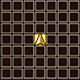

# Overview

- Food items restore Food Level.
    - If Food Level is already at max, Max Food Level increases instead.
- Food items can be turned into Stinky Greens from certain enemy abilities or traps.

# Magicite List

ID = Item number used by the game internally.

<table class="itemList">
  <tr>
    <th colspan="5">Magicite</th>
  </tr>
  <tr>
    <th>ID</th>
    <th>Name</th>
    <th>Notes</th>
    <th>Range</th>
    <th>Sell</th>
  </tr>
  <tr>
    <td>348</td>
    <td class="itemName"><a href="#phoenix-magicite">Phoenix Magicite</a></td>
    <td></td>
    <td class="range"></td>
    <td>400</td>
  </tr>
  <tr>
    <td>349</td>
    <td class="itemName"><a href="#leviathan-magicite">Leviathan Magicite</a></td>
    <td></td>
    <td class="range"></td>
    <td>400</td>
  </tr>
  <tr>
    <td>350</td>
    <td class="itemName"><a href="#alexander-magicite">Alexander Magicite</a></td>
    <td></td>
    <td class="range"></td>
    <td>400</td>
  </tr>
  <tr>
    <td>351</td>
    <td class="itemName"><a href="#ifrit-magicite">Ifrit Magicite</a></td>
    <td></td>
    <td class="range"></td>
    <td>400</td>
  </tr>
  <tr>
    <td>352</td>
    <td class="itemName"><a href="#shiva-magicite">Shiva Magicite</a></td>
    <td></td>
    <td class="range"></td>
    <td>400</td>
  </tr>
  <tr>
    <td>353</td>
    <td class="itemName"><a href="#ramuh-magicite">Ramuh Magicite</a></td>
    <td></td>
    <td class="range"></td>
    <td>400</td>
  </tr>
  <tr>
    <td>354</td>
    <td class="itemName"><a href="#bahamut-magicite">Bahamut Magicite</a></td>
    <td></td>
    <td class="range"></td>
    <td>400</td>
  </tr>
</table>
