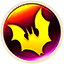

# Overview

- Talons increase the amount of damage you deal with physical attacks while equipped.
    - Kicking talons at an enemy deals damage equal to the talon's attack stat.
- Talons can be honed or fused at [Freja's Forge](/system/shops-and-forges#freja's-forge) after clearing [Freja's Memories](/story-dungeons/freja's-memories) (Chapter 2).
    - It's possible to attempt honing over the limit once a talon's hone value is raised to its limit.
        - Forges inside dungeons have a 100% success rate for honing over the limit.
        - Success: Hone value +5 (max hone value stays the same). ・Honing over the limit cannot be done again while hone value is at this new limit.
        - Failure: Hone value decreases (max hone value stays the same). ・Honing over the limit can be attempted again once hone value is raised back to its limit.
- Some talons have special abilities called Brands, which can be fused into other talons.
    - If a Brand is found innately on a pair of talons, the effect remains even if the Brand is removed.
        - Example: Fire Talons with the  Brand removed still adds Fire element to attacks.
    - Multiple copies of the same Brand cannot be fused into the same pair of talons.
- Slot count  for talons is random - They can have fewer slots than the listed max slot count value.
    - This applies to talons found on the floor, dropped by or stolen from enemies, etc.
    - Talons from [Shops](/system/shops-and-forges) and [Goblin's Fortune](/system/goblin's-fortune) always have the highest possible slot count.
- Certain talons have innate rustproof, which does not take up a Brand slot.
    - Innate rustproof cannot be fused into other talons, since it's not the  Brand.

# Talons List

See [Talon Details](#talon-details) for item locations.

#### Explanation

- ID: Item number used by the game internally.
- Hone: Honing limit (not including the +5 from honing over the limit).
- Max: Total attack after adding base attack + honing over the limit (no brands).
- RP: Whether or not the talons have innate rustproof.

 

<table class="itemList brandImage">
  <tr>
    <th colspan="10">Talons</th>
  </tr>
  <tr>
    <th>ID</th>
    <th>Name</th>
    <th>Atk</th>
    <th>Hone</th>
    <th>Max</th>
    <th>Slot</th>
    <th>Brand</th>
    <th>RP</th>
    <th>Notes</th>
    <th>Sell</th>
  </tr>
  <tr>
    <td>0</td>
    <td class="itemName"><a href="#rusty-talons">Rusty Talons</a></td>
    <td>1</td>
    <td>5</td>
    <td>11</td>
    <td>2</td>
    <td>-</td>
    <td class="no">No</td>
    <td>No added effects.</td>
    <td>12</td>
  </tr>
  <tr>
    <td>1</td>
    <td class="itemName"><a href="#leather-talons">Leather Talons</a></td>
    <td>3</td>
    <td>6</td>
    <td>14</td>
    <td>2</td>
    <td>-</td>
    <td class="yes">Yes</td>
    <td>Never rusts.</td>
    <td>20</td>
  </tr>
  <tr>
    <td>2</td>
    <td class="itemName"><a href="#wood-talons">Wood Talons</a></td>
    <td>4</td>
    <td>8</td>
    <td>17</td>
    <td>3</td>
    <td>-</td>
    <td class="yes">Yes</td>
    <td>Never rusts.</td>
    <td>28</td>
  </tr>
  <tr>
    <td>3</td>
    <td class="itemName"><a href="#bronze-talons">Bronze Talons</a></td>
    <td>7</td>
    <td>10</td>
    <td>22</td>
    <td>3</td>
    <td>-</td>
    <td class="no">No</td>
    <td>No added effects.</td>
    <td>36</td>
  </tr>
  <tr>
    <td>4</td>
    <td class="itemName"><a href="#copper-talons">Copper Talons</a></td>
    <td>8</td>
    <td>12</td>
    <td>25</td>
    <td>4</td>
    <td>-</td>
    <td class="no">No</td>
    <td>No added effects.</td>
    <td>44</td>
  </tr>
  <tr>
    <td>5</td>
    <td class="itemName"><a href="#iron-talons">Iron Talons</a></td>
    <td>10</td>
    <td>14</td>
    <td>29</td>
    <td>4</td>
    <td>-</td>
    <td class="no">No</td>
    <td>No added effects.</td>
    <td>52</td>
  </tr>
  <tr>
    <td>6</td>
    <td class="itemName"><a href="#steel-talons">Steel Talons</a></td>
    <td>12</td>
    <td>16</td>
    <td>33</td>
    <td>4</td>
    <td>-</td>
    <td class="no">No</td>
    <td>No added effects.</td>
    <td>60</td>
  </tr>
  <tr>
    <td>7</td>
    <td class="itemName"><a href="#coral-talons">Coral Talons</a></td>
    <td>14</td>
    <td>18</td>
    <td>37</td>
    <td>4</td>
    <td>-</td>
    <td class="yes">Yes</td>
    <td>Never rusts.</td>
    <td>68</td>
  </tr>
  <tr>
    <td>8</td>
    <td class="itemName"><a href="#mythril-talons">Mythril Talons</a></td>
    <td>16</td>
    <td>20</td>
    <td>41</td>
    <td>5</td>
    <td>-</td>
    <td class="no">No</td>
    <td>No added effects.</td>
    <td>76</td>
  </tr>
  <tr>
    <td>9</td>
    <td class="itemName"><a href="#garnet-talons">Garnet Talons</a></td>
    <td>18</td>
    <td>22</td>
    <td>45</td>
    <td>5</td>
    <td>-</td>
    <td class="yes">Yes</td>
    <td>Never rusts.</td>
    <td>84</td>
  </tr>
  <tr>
    <td>10</td>
    <td class="itemName"><a href="#emerald-talons">Emerald Talons</a></td>
    <td>20</td>
    <td>24</td>
    <td>49</td>
    <td>5</td>
    <td>-</td>
    <td class="yes">Yes</td>
    <td>Never rusts.</td>
    <td>92</td>
  </tr>
  <tr>
    <td>11</td>
    <td class="itemName"><a href="#sapphire-talons">Sapphire Talons</a></td>
    <td>22</td>
    <td>26</td>
    <td>53</td>
    <td>5</td>
    <td>-</td>
    <td class="yes">Yes</td>
    <td>Never rusts.</td>
    <td>100</td>
  </tr>
  <tr>
    <td>12</td>
    <td class="itemName"><a href="#ruby-talons">Ruby Talons</a></td>
    <td>24</td>
    <td>28</td>
    <td>57</td>
    <td>5</td>
    <td>-</td>
    <td class="yes">Yes</td>
    <td>Never rusts.</td>
    <td>108</td>
  </tr>
  <tr>
    <td>13</td>
    <td class="itemName"><a href="#diamond-talons">Diamond Talons</a></td>
    <td>26</td>
    <td>32</td>
    <td>63</td>
    <td>6</td>
    <td>-</td>
    <td class="yes">Yes</td>
    <td>Never rusts.</td>
    <td>116</td>
  </tr>
  <tr>
    <td>14</td>
    <td class="itemName"><a href="#platinum-talons">Platinum Talons</a></td>
    <td>28</td>
    <td>36</td>
    <td>69</td>
    <td>6</td>
    <td>-</td>
    <td class="yes">Yes</td>
    <td>Never rusts.</td>
    <td>124</td>
  </tr>
  <tr>
    <td>15</td>
    <td class="itemName"><a href="#gemsteel-talons">Gemsteel Talons</a></td>
    <td>30</td>
    <td>38</td>
    <td>73</td>
    <td>6</td>
    <td>-</td>
    <td class="no">No</td>
    <td>No added effects.</td>
    <td>132</td>
  </tr>
  <tr>
    <td>16</td>
    <td class="itemName"><a href="#rune-talons">Rune Talons</a></td>
    <td>32</td>
    <td>42</td>
    <td>79</td>
    <td>6</td>
    <td>-</td>
    <td class="no">No</td>
    <td>No added effects.</td>
    <td>140</td>
  </tr>
  <tr>
    <td>17</td>
    <td class="itemName"><a href="#titanium-talons">Titanium Talons</a></td>
    <td>34</td>
    <td>44</td>
    <td>83</td>
    <td>6</td>
    <td>-</td>
    <td class="yes">Yes</td>
    <td>Never rusts.</td>
    <td>148</td>
  </tr>
  <tr>
    <td>18</td>
    <td class="itemName"><a href="#adaman-talons">Adaman Talons</a></td>
    <td>36</td>
    <td>46</td>
    <td>87</td>
    <td>6</td>
    <td>-</td>
    <td class="no">No</td>
    <td>No added effects.</td>
    <td>156</td>
  </tr>
  <tr>
    <td>19</td>
    <td class="itemName"><a href="#crystal-talons">Crystal Talons</a></td>
    <td>38</td>
    <td>48</td>
    <td>91</td>
    <td class="maxSlot">7</td>
    <td>-</td>
    <td class="yes">Yes</td>
    <td>Never rusts.</td>
    <td>164</td>
  </tr>
  <tr>
    <td>20</td>
    <td class="itemName"><a href="#orichalcum-talons">Orichalcum Talons</a></td>
    <td>40</td>
    <td>52</td>
    <td>97</td>
    <td class="maxSlot">7</td>
    <td>-</td>
    <td class="no">No</td>
    <td>No added effects.</td>
    <td>172</td>
  </tr>
  <tr>
    <td>21</td>
    <td class="itemName"><a href="#damascus-talons">Damascus Talons</a></td>
    <td>42</td>
    <td>62</td>
    <td>109</td>
    <td class="maxSlot">7</td>
    <td>-</td>
    <td class="no">No</td>
    <td>No added effects.</td>
    <td>180</td>
  </tr>
  <tr>
    <td>22</td>
    <td class="itemName"><a href="#king's-talons">King's Talons</a></td>
    <td>44</td>
    <td>70</td>
    <td>119</td>
    <td class="maxSlot">7</td>
    <td>-</td>
    <td class="no">No</td>
    <td>No added effects.</td>
    <td>188</td>
  </tr>
  <tr>
    <td>23</td>
    <td class="itemName"><a href="#genji's-talons">Genji's Talons</a></td>
    <td>46</td>
    <td>80</td>
    <td>131</td>
    <td class="maxSlot">7</td>
    <td>-</td>
    <td class="no">No</td>
    <td>No added effects.</td>
    <td>196</td>
  </tr>
  <tr>
    <td>24</td>
    <td class="itemName"><a href="#irma's-talons">Irma's Talons</a></td>
    <td>48</td>
    <td>90</td>
    <td>143</td>
    <td class="maxSlot">7</td>
    <td>-</td>
    <td class="no">No</td>
    <td>No added effects.</td>
    <td>204</td>
  </tr>
  <tr>
    <td>25</td>
    <td class="itemName"><a href="#shinryu's-talons">Shinryu's Talons</a></td>
    <td>50</td>
    <td class="maxHone">94</td>
    <td class="best">149</td>
    <td class="maxSlot">7</td>
    <td>-</td>
    <td class="yes">Yes</td>
    <td>Never rusts.</td>
    <td>600</td>
  </tr>
  <tr>
    <td>710</td>
    <td class="itemName"><a href="#alpha-talons">Alpha Talons</a></td>
    <td>50</td>
    <td class="maxHone">94</td>
    <td class="best">149</td>
    <td class="maxSlot">7</td>
    <td>-</td>
    <td class="yes">Yes</td>
    <td>Never rusts.</td>
    <td>600</td>
  </tr>
  <tr>
    <td>26</td>
    <td class="itemName"><a href="#fire-talons">Fire Talons</a></td>
    <td>5</td>
    <td>5</td>
    <td>15</td>
    <td>3</td>
    <td></td>
    <td class="no">No</td>
    <td>Fire element added to attacks.</td>
    <td>40</td>
  </tr>
  <tr>
    <td>27</td>
    <td class="itemName"><a href="#water-talons">Water Talons</a></td>
    <td>11</td>
    <td>11</td>
    <td>27</td>
    <td>4</td>
    <td></td>
    <td class="no">No</td>
    <td>Water element added to attacks.</td>
    <td>48</td>
  </tr>
  <tr>
    <td>28</td>
    <td class="itemName"><a href="#ice-talons">Ice Talons</a></td>
    <td>24</td>
    <td>10</td>
    <td>39</td>
    <td>4</td>
    <td></td>
    <td class="no">No</td>
    <td>Ice element added to attacks.</td>
    <td>56</td>
  </tr>
  <tr>
    <td>29</td>
    <td class="itemName"><a href="#thunder-talons">Thunder Talons</a></td>
    <td>24</td>
    <td>14</td>
    <td>43</td>
    <td>5</td>
    <td></td>
    <td class="no">No</td>
    <td>Thunder element added to attacks.</td>
    <td>64</td>
  </tr>
  <tr>
    <td>683</td>
    <td class="itemName"><a href="#wind-talons">Wind Talons</a></td>
    <td>28</td>
    <td>26</td>
    <td>59</td>
    <td>5</td>
    <td></td>
    <td class="no">No</td>
    <td>Wind element added to attacks.</td>
    <td>72</td>
  </tr>
  <tr>
    <td>30</td>
    <td class="itemName"><a href="#earth-talons">Earth Talons</a></td>
    <td>30</td>
    <td>30</td>
    <td>65</td>
    <td>5</td>
    <td></td>
    <td class="no">No</td>
    <td>Earth element added to attacks.</td>
    <td>80</td>
  </tr>
  <tr>
    <td>31</td>
    <td class="itemName"><a href="#light-talons">Light Talons</a></td>
    <td>40</td>
    <td>30</td>
    <td>75</td>
    <td>6</td>
    <td></td>
    <td class="no">No</td>
    <td>Light element added to attacks.</td>
    <td>88</td>
  </tr>
  <tr>
    <td>684</td>
    <td class="itemName"><a href="#dark-talons">Dark Talons</a></td>
    <td>40</td>
    <td>30</td>
    <td>75</td>
    <td>6</td>
    <td></td>
    <td class="no">No</td>
    <td>Dark element added to attacks.</td>
    <td>88</td>
  </tr>
  <tr>
    <td>32</td>
    <td class="itemName"><a href="#gold-talons">Gold Talons</a></td>
    <td>6</td>
    <td>8</td>
    <td>19</td>
    <td>3</td>
    <td></td>
    <td class="yes">Yes</td>
    <td>Never rusts.</td>
    <td>60</td>
  </tr>
  <tr>
    <td>33</td>
    <td class="itemName"><a href="#poison-talons">Poison Talons</a></td>
    <td>16</td>
    <td>4</td>
    <td>25</td>
    <td>4</td>
    <td></td>
    <td class="no">No</td>
    <td>Chance to inflict Poison.</td>
    <td>60</td>
  </tr>
  <tr>
    <td>34</td>
    <td class="itemName"><a href="#holy-talons">Holy Talons</a></td>
    <td>50</td>
    <td>22</td>
    <td>77</td>
    <td>6</td>
    <td></td>
    <td class="no">No</td>
    <td>Talons cannot be cursed.</td>
    <td>60</td>
  </tr>
  <tr>
    <td>35</td>
    <td class="itemName"><a href="#blind-talons">Blind Talons</a></td>
    <td>12</td>
    <td>4</td>
    <td>21</td>
    <td>3</td>
    <td></td>
    <td class="no">No</td>
    <td>Chance to inflict Blind.</td>
    <td>60</td>
  </tr>
  <tr>
    <td>36</td>
    <td class="itemName"><a href="#silence-talons">Silence Talons</a></td>
    <td>26</td>
    <td>20</td>
    <td>51</td>
    <td>5</td>
    <td></td>
    <td class="no">No</td>
    <td>Chance to inflict Silence.</td>
    <td>60</td>
  </tr>
  <tr>
    <td>37</td>
    <td class="itemName"><a href="#sleep-talons">Sleep Talons</a></td>
    <td>20</td>
    <td>10</td>
    <td>35</td>
    <td>4</td>
    <td></td>
    <td class="no">No</td>
    <td>Chance to inflict Sleep.</td>
    <td>60</td>
  </tr>
  <tr>
    <td>38</td>
    <td class="itemName"><a href="#confuse-talons">Confuse Talons</a></td>
    <td>32</td>
    <td>35</td>
    <td>72</td>
    <td>6</td>
    <td></td>
    <td class="no">No</td>
    <td>Chance to inflict Confuse.</td>
    <td>60</td>
  </tr>
  <tr>
    <td>39</td>
    <td class="itemName"><a href="#slow-talons">Slow Talons</a></td>
    <td>70</td>
    <td>18</td>
    <td>93</td>
    <td class="maxSlot">7</td>
    <td></td>
    <td class="no">No</td>
    <td>Chance to inflict Slow.</td>
    <td>60</td>
  </tr>
  <tr>
    <td>40</td>
    <td class="itemName"><a href="#absolute-talons">Absolute Talons</a></td>
    <td>45</td>
    <td>0</td>
    <td>45</td>
    <td>2</td>
    <td></td>
    <td class="no">No</td>
    <td>Cannot be honed or fused.</td>
    <td>80</td>
  </tr>
  <tr>
    <td>41</td>
    <td class="itemName"><a href="#gil-talons">Gil Talons</a></td>
    <td>28</td>
    <td>10</td>
    <td>43</td>
    <td>5</td>
    <td></td>
    <td class="no">No</td>
    <td>Increases Gil drop rate.</td>
    <td>100</td>
  </tr>
  <tr>
    <td>42</td>
    <td class="itemName"><a href="#happy-talons">Happy Talons</a></td>
    <td>24</td>
    <td>20</td>
    <td>49</td>
    <td>5</td>
    <td></td>
    <td class="no">No</td>
    <td>Defeated foes grant x1.25 Exp.</td>
    <td>100</td>
  </tr>
  <tr>
    <td>43</td>
    <td class="itemName"><a href="#unlucky-talons">Unlucky Talons</a></td>
    <td>20</td>
    <td>8</td>
    <td>33</td>
    <td>6</td>
    <td></td>
    <td class="no">No</td>
    <td>Defeated foes won't drop anything.</td>
    <td>100</td>
  </tr>
  <tr>
    <td>44</td>
    <td class="itemName"><a href="#rage-talons">Rage Talons</a></td>
    <td>18</td>
    <td>8</td>
    <td>31</td>
    <td>4</td>
    <td></td>
    <td class="no">No</td>
    <td>Add an additional +5 to Attack.</td>
    <td>100</td>
  </tr>
  <tr>
    <td>45</td>
    <td class="itemName"><a href="#immobilizing-talons">Immobilizing Talons</a></td>
    <td>50</td>
    <td>34</td>
    <td>89</td>
    <td class="maxSlot">7</td>
    <td></td>
    <td class="no">No</td>
    <td>Chance to inflict Immobilize.</td>
    <td>100</td>
  </tr>
  <tr>
    <td>46</td>
    <td class="itemName"><a href="#trident-talons">Trident Talons</a></td>
    <td>36</td>
    <td>20</td>
    <td>61</td>
    <td>5</td>
    <td></td>
    <td class="no">No</td>
    <td>Strike 3 forward directions at once.</td>
    <td>200</td>
  </tr>
  <tr>
    <td>47</td>
    <td class="itemName"><a href="#critical-talons">Critical Talons</a></td>
    <td>30</td>
    <td>30</td>
    <td>65</td>
    <td>6</td>
    <td></td>
    <td class="no">No</td>
    <td>Increases critical hit rate by 10.</td>
    <td>160</td>
  </tr>
  <tr>
    <td>686</td>
    <td class="itemName"><a href="#stun-talons">Stun Talons</a></td>
    <td>30</td>
    <td>30</td>
    <td>65</td>
    <td>5</td>
    <td></td>
    <td class="no">No</td>
    <td>Chance to inflict Stun.</td>
    <td>200</td>
  </tr>
  <tr>
    <td>48</td>
    <td class="itemName"><a href="#treasure-talons">Treasure Talons</a></td>
    <td>16</td>
    <td>9</td>
    <td>30</td>
    <td>4</td>
    <td></td>
    <td class="no">No</td>
    <td>Increases item drop rate.</td>
    <td>240</td>
  </tr>
  <tr>
    <td>49</td>
    <td class="itemName"><a href="#giga-bashers">Giga Bashers</a></td>
    <td>18</td>
    <td>12</td>
    <td>35</td>
    <td>4</td>
    <td></td>
    <td class="no">No</td>
    <td>Huge damage to Giant types.</td>
    <td>160</td>
  </tr>
  <tr>
    <td>50</td>
    <td class="itemName"><a href="#undead-bashers">Undead Bashers</a></td>
    <td>30</td>
    <td>16</td>
    <td>51</td>
    <td>5</td>
    <td></td>
    <td class="no">No</td>
    <td>Huge damage to Undead types.</td>
    <td>160</td>
  </tr>
  <tr>
    <td>51</td>
    <td class="itemName"><a href="#demon-bashers">Demon Bashers</a></td>
    <td>40</td>
    <td>36</td>
    <td>81</td>
    <td>6</td>
    <td></td>
    <td class="no">No</td>
    <td>Huge damage to Demonic types.</td>
    <td>160</td>
  </tr>
  <tr>
    <td>52</td>
    <td class="itemName"><a href="#dragon-bashers">Dragon Bashers</a></td>
    <td class="best">80</td>
    <td>40</td>
    <td>125</td>
    <td class="maxSlot">7</td>
    <td></td>
    <td class="no">No</td>
    <td>Huge damage to Draconic types.</td>
    <td>160</td>
  </tr>
  <tr>
    <td>53</td>
    <td class="itemName"><a href="#elemental-bashers">Elemental Bashers</a></td>
    <td>26</td>
    <td>16</td>
    <td>47</td>
    <td>5</td>
    <td></td>
    <td class="no">No</td>
    <td>Huge damage to Elemental types.</td>
    <td>160</td>
  </tr>
  <tr>
    <td>54</td>
    <td class="itemName"><a href="#floater-bashers">Floater Bashers</a></td>
    <td>40</td>
    <td>30</td>
    <td>75</td>
    <td>6</td>
    <td></td>
    <td class="no">No</td>
    <td>Huge damage to Flying types.</td>
    <td>160</td>
  </tr>
  <tr class="unused">
    <td>685</td>
    <td class="itemName"><a href="#six-element-talons">Six-Element Talons</a></td>
    <td>40</td>
    <td>30</td>
    <td>75</td>
    <td>5</td>
    <td></td>
    <td class="no">No</td>
    <td>Not obtainable in regular play.</td>
    <td>200</td>
  </tr>
</table>

# Talons Details

<table class="monsterPageTable">
  <tbody>
    <tr>
      <th>
        

          
Rusty Talons

        

      </th>
    </tr>
    <tr>
      <td>
        

          

             
          

          

            

              
Attack

              
1

              
Hone

              
5

              
Max

              
11

              
Slot

              
2

              
Brand

              
-

              
RP

              
No

              
Sell

              
12

            

            
Metal talons that are rusting away. Honing them won't help much. Still better than nothing.

            
item_locations

          

        

      </td>
    </tr>
    <tr>
      <th>
        

          
Leather Talons

        

      </th>
    </tr>
    <tr>
      <td>
        

          

             
          

          

            

              
Attack

              
3

              
Hone

              
6

              
Max

              
14

              
Slot

              
2

              
Brand

              
-

              
RP

              
Yes

              
Sell

              
20

            

            
Essential gear for novice treasure hunters. Made of leather and somewhat lacking in power. Will not rust.

            
item_locations

          

        

      </td>
    </tr>
    <tr>
      <th>
        

          
Wood Talons

        

      </th>
    </tr>
    <tr>
      <td>
        

          

             
          

          

            

              
Attack

              
4

              
Hone

              
8

              
Max

              
17

              
Slot

              
3

              
Brand

              
-

              
RP

              
Yes

              
Sell

              
28

            

            
Talons hewn from hardwood. Deadlier than you'd expect and easy to wield. Will not rust.

            
item_locations

          

        

      </td>
    </tr>
    <tr>
      <th>
        

          
Bronze Talons

        

      </th>
    </tr>
    <tr>
      <td>
        

          

             
          

          

            

              
Attack

              
7

              
Hone

              
10

              
Max

              
22

              
Slot

              
3

              
Brand

              
-

              
RP

              
No

              
Sell

              
36

            

            
Talons made from malleable bronze. Easy to produce and decently powerful.

            
item_locations

          

        

      </td>
    </tr>
    <tr>
      <th>
        

          
Copper Talons

        

      </th>
    </tr>
    <tr>
      <td>
        

          

             
          

          

            

              
Attack

              
8

              
Hone

              
12

              
Max

              
25

              
Slot

              
4

              
Brand

              
-

              
RP

              
No

              
Sell

              
44

            

            
Talons with an exquisite burnished finish. Seasoned treasure hunters wouldn't want to wield a lesser weapon.

            
item_locations

          

        

      </td>
    </tr>
    <tr>
      <th>
        

          
Iron Talons

        

      </th>
    </tr>
    <tr>
      <td>
        

          

             
          

          

            

              
Attack

              
10

              
Hone

              
14

              
Max

              
29

              
Slot

              
4

              
Brand

              
-

              
RP

              
No

              
Sell

              
52

            

            
Talons forged by a local blacksmith. Made with scrap iron of middling quality.

            
item_locations

          

        

      </td>
    </tr>
    <tr>
      <th>
        

          
Steel Talons

        

      </th>
    </tr>
    <tr>
      <td>
        

          

             
          

          

            

              
Attack

              
12

              
Hone

              
16

              
Max

              
33

              
Slot

              
4

              
Brand

              
-

              
RP

              
No

              
Sell

              
60

            

            
Talons honed by a skilled artisan. They boast exceptional power, and will serve their wielder well in the long term.

            
item_locations

          

        

      </td>
    </tr>
    <tr>
      <th>
        

          
Coral Talons

        

      </th>
    </tr>
    <tr>
      <td>
        

          

             
          

          

            

              
Attack

              
14

              
Hone

              
18

              
Max

              
37

              
Slot

              
4

              
Brand

              
-

              
RP

              
Yes

              
Sell

              
68

            

            
Beautiful talons crafted from special coral blessed by the god of the sea. Will not rust.

            
item_locations

          

        

      </td>
    </tr>
    <tr>
      <th>
        

          
Mythril Talons

        

      </th>
    </tr>
    <tr>
      <td>
        

          

             
          

          

            

              
Attack

              
16

              
Hone

              
20

              
Max

              
41

              
Slot

              
5

              
Brand

              
-

              
RP

              
No

              
Sell

              
76

            

            
Talons forged from mythril, a metal stronger than steel and more alluring than silver. Level up your treasure hunting game with these!

            
item_locations

          

        

      </td>
    </tr>
    <tr>
      <th>
        

          
Garnet Talons

        

      </th>
    </tr>
    <tr>
      <td>
        

          

             
          

          

            

              
Attack

              
18

              
Hone

              
22

              
Max

              
45

              
Slot

              
5

              
Brand

              
-

              
RP

              
Yes

              
Sell

              
84

            

            
Talons set with deep crimson garnets that shine with a dazzling light. These precious stones symbolize truth. Will not rust.

            
item_locations

          

        

      </td>
    </tr>
    <tr>
      <th>
        

          
Emerald Talons

        

      </th>
    </tr>
    <tr>
      <td>
        

          

             
          

          

            

              
Attack

              
20

              
Hone

              
24

              
Max

              
49

              
Slot

              
5

              
Brand

              
-

              
RP

              
Yes

              
Sell

              
92

            

            
Talons set with pure green emeralds that shine with a dazzling light. These precious stones symbolize good luck. Will not rust.

            
item_locations

          

        

      </td>
    </tr>
    <tr>
      <th>
        

          
Sapphire Talons

        

      </th>
    </tr>
    <tr>
      <td>
        

          

             
          

          

            

              
Attack

              
22

              
Hone

              
26

              
Max

              
53

              
Slot

              
5

              
Brand

              
-

              
RP

              
Yes

              
Sell

              
100

            

            
Talons set with muted blue sapphires that shine with a dazzling light. These precious stones symbolize affection. Will not rust.

            
item_locations

          

        

      </td>
    </tr>
    <tr>
      <th>
        

          
Ruby Talons

        

      </th>
    </tr>
    <tr>
      <td>
        

          

             
          

          

            

              
Attack

              
24

              
Hone

              
28

              
Max

              
57

              
Slot

              
5

              
Brand

              
-

              
RP

              
Yes

              
Sell

              
108

            

            
Talons set with fiery red rubies that shine with a dazzling light. These precious stones symbolize passion. Will not rust.

            
item_locations

          

        

      </td>
    </tr>
    <tr>
      <th>
        

          
Diamond Talons

        

      </th>
    </tr>
    <tr>
      <td>
        

          

             
          

          

            

              
Attack

              
26

              
Hone

              
32

              
Max

              
63

              
Slot

              
6

              
Brand

              
-

              
RP

              
Yes

              
Sell

              
116

            

            
Talons set with diamonds, the hardest and most beautiful gems of all. These precious stones symbolize purity. Will not rust.

            
item_locations

          

        

      </td>
    </tr>
    <tr>
      <th>
        

          
Platinum Talons

        

      </th>
    </tr>
    <tr>
      <td>
        

          

             
          

          

            

              
Attack

              
28

              
Hone

              
36

              
Max

              
69

              
Slot

              
6

              
Brand

              
-

              
RP

              
Yes

              
Sell

              
124

            

            
Talons made of precious platinum that shine with a white gleam. Will not rust.

            
item_locations

          

        

      </td>
    </tr>
    <tr>
      <th>
        

          
Gemsteel Talons

        

      </th>
    </tr>
    <tr>
      <td>
        

          

             
          

          

            

              
Attack

              
30

              
Hone

              
38

              
Max

              
73

              
Slot

              
6

              
Brand

              
-

              
RP

              
No

              
Sell

              
132

            

            
Talons of the finest quality gemsteel, a metal smelted by arcane means using precious ore found only in the Fuego Mines.

            
item_locations

          

        

      </td>
    </tr>
    <tr>
      <th>
        

          
Rune Talons

        

      </th>
    </tr>
    <tr>
      <td>
        

          

             
          

          

            

              
Attack

              
32

              
Hone

              
42

              
Max

              
79

              
Slot

              
6

              
Brand

              
-

              
RP

              
No

              
Sell

              
140

            

            
Silver talons inscribed with sacred runes from ancient times. The magic sealed within enhances their destructive power.

            
item_locations

          

        

      </td>
    </tr>
    <tr>
      <th>
        

          
Titanium Talons

        

      </th>
    </tr>
    <tr>
      <td>
        

          

             
          

          

            

              
Attack

              
34

              
Hone

              
44

              
Max

              
83

              
Slot

              
6

              
Brand

              
-

              
RP

              
Yes

              
Sell

              
148

            

            
High-grade talons made of titanium, a metal with incredible tensile strength. Will not rust.

            
item_locations

          

        

      </td>
    </tr>
    <tr>
      <th>
        

          
Adaman Talons

        

      </th>
    </tr>
    <tr>
      <td>
        

          

             
          

          

            

              
Attack

              
36

              
Hone

              
46

              
Max

              
87

              
Slot

              
6

              
Brand

              
-

              
RP

              
No

              
Sell

              
156

            

            
Priceless talons made from adamantite, a legendary metal said to be the hardest material in existence.

            
item_locations

          

        

      </td>
    </tr>
    <tr>
      <th>
        

          
Crystal Talons

        

      </th>
    </tr>
    <tr>
      <td>
        

          

             
          

          

            

              
Attack

              
38

              
Hone

              
48

              
Max

              
91

              
Slot

              
7

              
Brand

              
-

              
RP

              
Yes

              
Sell

              
164

            

            
Mysterious talons that can only be used by those chosen by the crystals. Will not rust.

            
item_locations

          

        

      </td>
    </tr>
    <tr>
      <th>
        

          
Orichalcum Talons

        

      </th>
    </tr>
    <tr>
      <td>
        

          

             
          

          

            

              
Attack

              
40

              
Hone

              
52

              
Max

              
97

              
Slot

              
7

              
Brand

              
-

              
RP

              
No

              
Sell

              
172

            

            
Wondrous talons made from orichalcum, a legendary metal said to only exist in myths.

            
item_locations

          

        

      </td>
    </tr>
    <tr>
      <th>
        

          
Damascus Talons

        

      </th>
    </tr>
    <tr>
      <td>
        

          

             
          

          

            

              
Attack

              
42

              
Hone

              
62

              
Max

              
109

              
Slot

              
7

              
Brand

              
-

              
RP

              
No

              
Sell

              
180

            

            
Talons exquisitely crafted from special steel which can only be forged using secret techniques passed down from ancient times.

            
item_locations

          

        

      </td>
    </tr>
    <tr>
      <th>
        

          
King's Talons

        

      </th>
    </tr>
    <tr>
      <td>
        

          

             
          

          

            

              
Attack

              
44

              
Hone

              
70

              
Max

              
119

              
Slot

              
7

              
Brand

              
-

              
RP

              
No

              
Sell

              
188

            

            
Talons only a true king is permitted to wield. Their elaborate adornments befit royalty.

            
item_locations

          

        

      </td>
    </tr>
    <tr>
      <th>
        

          
Genji's Talons

        

      </th>
    </tr>
    <tr>
      <td>
        

          

             
          

          

            

              
Attack

              
46

              
Hone

              
80

              
Max

              
131

              
Slot

              
7

              
Brand

              
-

              
RP

              
No

              
Sell

              
196

            

            
Talons forged in far eastern lands. Said to have been used by a legendary hero.

            
item_locations

          

        

      </td>
    </tr>
    <tr>
      <th>
        

          
Irma's Talons

        

      </th>
    </tr>
    <tr>
      <td>
        

          

             
          

          

            

              
Attack

              
48

              
Hone

              
90

              
Max

              
143

              
Slot

              
7

              
Brand

              
-

              
RP

              
No

              
Sell

              
204

            

            
Talons prized by the tribe of Irma, a bloodline of renowned treasure hunters. Prized for both their beauty and utility.

            
item_locations

          

        

      </td>
    </tr>
    <tr>
      <th>
        

          
Shinryu's Talons

        

      </th>
    </tr>
    <tr>
      <td>
        

          

             
          

          

            

              
Attack

              
50

              
Hone

              
94

              
Max

              
149

              
Slot

              
7

              
Brand

              
-

              
RP

              
Yes

              
Sell

              
600

            

            
The ultimate talons! Only one brave enough to battle the legendary dragon Shinryu can wield them. Will not rust.

            
item_locations

          

        

      </td>
    </tr>
    <tr>
      <th>
        

          
Alpha Talons

        

      </th>
    </tr>
    <tr>
      <td>
        

          

             
          

          

            

              
Attack

              
50

              
Hone

              
94

              
Max

              
149

              
Slot

              
7

              
Brand

              
-

              
RP

              
Yes

              
Sell

              
600

            

            
Talons that match the mysterious Alpha job. They are unnaturally sharp, and undoubtedly forged by a master craftsman. Will not rust.

            
item_locations

          

        

      </td>
    </tr>
    <tr>
      <th>
        

          
Fire Talons

        

      </th>
    </tr>
    <tr>
      <td>
        

          

             
          

          

            

              
Attack

              
5

              
Hone

              
5

              
Max

              
15

              
Slot

              
3

              
Brand

              

              
RP

              
No

              
Sell

              
40

            

            
Talons blessed by Fire spirits. Deal huge damage to Ice-type foes.

            
item_locations

          

        

      </td>
    </tr>
    <tr>
      <th>
        

          
Water Talons

        

      </th>
    </tr>
    <tr>
      <td>
        

          

             
          

          

            

              
Attack

              
11

              
Hone

              
11

              
Max

              
27

              
Slot

              
4

              
Brand

              

              
RP

              
No

              
Sell

              
48

            

            
Talons blessed by Water spirits. Deal huge damage to Fire-type foes.

            
item_locations

          

        

      </td>
    </tr>
    <tr>
      <th>
        

          
Ice Talons

        

      </th>
    </tr>
    <tr>
      <td>
        

          

             
          

          

            

              
Attack

              
24

              
Hone

              
10

              
Max

              
39

              
Slot

              
4

              
Brand

              

              
RP

              
No

              
Sell

              
56

            

            
Talons blessed by Ice spirits. Deal huge damage to Wind-type foes.

            
item_locations

          

        

      </td>
    </tr>
    <tr>
      <th>
        

          
Thunder Talons

        

      </th>
    </tr>
    <tr>
      <td>
        

          

             
          

          

            

              
Attack

              
24

              
Hone

              
14

              
Max

              
43

              
Slot

              
5

              
Brand

              

              
RP

              
No

              
Sell

              
64

            

            
Talons blessed by Thunder spirits. Deal huge damage to Water-type foes.

            
item_locations

          

        

      </td>
    </tr>
    <tr>
      <th>
        

          
Wind Talons

        

      </th>
    </tr>
    <tr>
      <td>
        

          

             
          

          

            

              
Attack

              
28

              
Hone

              
26

              
Max

              
59

              
Slot

              
5

              
Brand

              

              
RP

              
No

              
Sell

              
72

            

            
Talons blessed by Wind spirits. Deal huge damage to Earth-type foes.

            
item_locations

          

        

      </td>
    </tr>
    <tr>
      <th>
        

          
Earth Talons

        

      </th>
    </tr>
    <tr>
      <td>
        

          

             
          

          

            

              
Attack

              
30

              
Hone

              
30

              
Max

              
65

              
Slot

              
5

              
Brand

              

              
RP

              
No

              
Sell

              
80

            

            
Talons blessed by Earth spirits. Deal huge damage to Thunder-type foes.

            
item_locations

          

        

      </td>
    </tr>
    <tr>
      <th>
        

          
Light Talons

        

      </th>
    </tr>
    <tr>
      <td>
        

          

             
          

          

            

              
Attack

              
40

              
Hone

              
30

              
Max

              
75

              
Slot

              
6

              
Brand

              

              
RP

              
No

              
Sell

              
88

            

            
Talons blessed by Light spirits. Deal huge damage to Dark-type foes.

            
item_locations

          

        

      </td>
    </tr>
    <tr>
      <th>
        

          
Dark Talons

        

      </th>
    </tr>
    <tr>
      <td>
        

          

             
          

          

            

              
Attack

              
40

              
Hone

              
30

              
Max

              
75

              
Slot

              
6

              
Brand

              

              
RP

              
No

              
Sell

              
88

            

            
Talons blessed by Dark spirits. Deal huge damage to Light-type foes.

            
item_locations

          

        

      </td>
    </tr>
    <tr>
      <th>
        

          
Gold Talons

        

      </th>
    </tr>
    <tr>
      <td>
        

          

             
          

          

            

              
Attack

              
6

              
Hone

              
8

              
Max

              
19

              
Slot

              
3

              
Brand

              

              
RP

              
Yes

              
Sell

              
60

            

            
Talons plated with gold. Neither powerful nor valuable, but immune to rust. Perfect for fusion!

            
item_locations

          

        

      </td>
    </tr>
    <tr>
      <th>
        

          
Poison Talons

        

      </th>
    </tr>
    <tr>
      <td>
        

          

             
          

          

            

              
Attack

              
16

              
Hone

              
4

              
Max

              
25

              
Slot

              
4

              
Brand

              

              
RP

              
No

              
Sell

              
60

            

            
Talons imbued with magic that sometimes inflicts poison, damaging foes whenever they act.

            
item_locations

          

        

      </td>
    </tr>
    <tr>
      <th>
        

          
Holy Talons

        

      </th>
    </tr>
    <tr>
      <td>
        

          

             
          

          

            

              
Attack

              
50

              
Hone

              
22

              
Max

              
77

              
Slot

              
6

              
Brand

              

              
RP

              
No

              
Sell

              
60

            

            
Talons blessed with holy power. Protect the wielder from curses. Also popular components for fusion.

            
item_locations

          

        

      </td>
    </tr>
    <tr>
      <th>
        

          
Blind Talons

        

      </th>
    </tr>
    <tr>
      <td>
        

          

             
          

          

            

              
Attack

              
12

              
Hone

              
4

              
Max

              
21

              
Slot

              
3

              
Brand

              

              
RP

              
No

              
Sell

              
60

            

            
Talons imbued with magic that sometimes blinds foes, temporarily robbing them of their sight and making their attacks miss more often.

            
item_locations

          

        

      </td>
    </tr>
    <tr>
      <th>
        

          
Silence Talons

        

      </th>
    </tr>
    <tr>
      <td>
        

          

             
          

          

            

              
Attack

              
26

              
Hone

              
20

              
Max

              
51

              
Slot

              
5

              
Brand

              

              
RP

              
No

              
Sell

              
60

            

            
Talons imbued with magic that sometimes silences foes, preventing them from casting spells and using abilities.

            
item_locations

          

        

      </td>
    </tr>
    <tr>
      <th>
        

          
Sleep Talons

        

      </th>
    </tr>
    <tr>
      <td>
        

          

             
          

          

            

              
Attack

              
20

              
Hone

              
10

              
Max

              
35

              
Slot

              
4

              
Brand

              

              
RP

              
No

              
Sell

              
60

            

            
Talons imbued with magic that sometimes puts foes to sleep, taking them out of the fight...for a while, at least.

            
item_locations

          

        

      </td>
    </tr>
    <tr>
      <th>
        

          
Confuse Talons

        

      </th>
    </tr>
    <tr>
      <td>
        

          

             
          

          

            

              
Attack

              
32

              
Hone

              
35

              
Max

              
72

              
Slot

              
6

              
Brand

              

              
RP

              
No

              
Sell

              
60

            

            
Talons imbued with magic that sometimes confuses foes, temporarily causing them to act erratically.

            
item_locations

          

        

      </td>
    </tr>
    <tr>
      <th>
        

          
Slow Talons

        

      </th>
    </tr>
    <tr>
      <td>
        

          

             
          

          

            

              
Attack

              
70

              
Hone

              
18

              
Max

              
93

              
Slot

              
7

              
Brand

              

              
RP

              
No

              
Sell

              
60

            

            
Talons imbued with magic that sometimes slows foes down, temporarily making them sluggish and lethargic.

            
item_locations

          

        

      </td>
    </tr>
    <tr>
      <th>
        

          
Absolute Talons

        

      </th>
    </tr>
    <tr>
      <td>
        

          

             
          

          

            

              
Attack

              
45

              
Hone

              
0

              
Max

              
45

              
Slot

              
2

              
Brand

              

              
RP

              
No

              
Sell

              
80

            

            
Talons that deal heavy damage but can't be honed or fused due to the material used. Bear a brand that makes them immune to rust.

            
item_locations

          

        

      </td>
    </tr>
    <tr>
      <th>
        

          
Gil Talons

        

      </th>
    </tr>
    <tr>
      <td>
        

          

             
          

          

            

              
Attack

              
28

              
Hone

              
10

              
Max

              
43

              
Slot

              
5

              
Brand

              

              
RP

              
No

              
Sell

              
100

            

            
Talons that improve your chances of collecting gil when you defeat foes. Almost guaranteed to make you rich!

            
item_locations

          

        

      </td>
    </tr>
    <tr>
      <th>
        

          
Happy Talons

        

      </th>
    </tr>
    <tr>
      <td>
        

          

             
          

          

            

              
Attack

              
24

              
Hone

              
20

              
Max

              
49

              
Slot

              
5

              
Brand

              

              
RP

              
No

              
Sell

              
100

            

            
Talons that help you develop your abilities more quickly when you defeat foes. Sure to make you feel happy all over!

            
item_locations

          

        

      </td>
    </tr>
    <tr>
      <th>
        

          
Unlucky Talons

        

      </th>
    </tr>
    <tr>
      <td>
        

          

             
          

          

            

              
Attack

              
20

              
Hone

              
8

              
Max

              
33

              
Slot

              
6

              
Brand

              

              
RP

              
No

              
Sell

              
100

            

            
Talons that prevent foes from dropping items or gil upon defeat.

            
item_locations

          

        

      </td>
    </tr>
    <tr>
      <th>
        

          
Rage Talons

        

      </th>
    </tr>
    <tr>
      <td>
        

          

             
          

          

            

              
Attack

              
18

              
Hone

              
8

              
Max

              
31

              
Slot

              
4

              
Brand

              

              
RP

              
No

              
Sell

              
100

            

            
Talons that fill you with fury and increase damage dealt to foes.

            
item_locations

          

        

      </td>
    </tr>
    <tr>
      <th>
        

          
Immobilizing Talons

        

      </th>
    </tr>
    <tr>
      <td>
        

          

             
          

          

            

              
Attack

              
50

              
Hone

              
34

              
Max

              
89

              
Slot

              
7

              
Brand

              

              
RP

              
No

              
Sell

              
100

            

            
Talons imbued with magic that sometimes immobilizes foes, temporarily holding them in place.

            
item_locations

          

        

      </td>
    </tr>
    <tr>
      <th>
        

          
Trident Talons

        

      </th>
    </tr>
    <tr>
      <td>
        

          

             
          

          

            

              
Attack

              
36

              
Hone

              
20

              
Max

              
61

              
Slot

              
5

              
Brand

              

              
RP

              
No

              
Sell

              
200

            

            
Talons that strike a wide area in front of you, dealing damage to foes directly ahead of you and diagonally to the left and right.

            
item_locations

          

        

      </td>
    </tr>
    <tr>
      <th>
        

          
Critical Talons

        

      </th>
    </tr>
    <tr>
      <td>
        

          

             
          

          

            

              
Attack

              
30

              
Hone

              
30

              
Max

              
65

              
Slot

              
6

              
Brand

              

              
RP

              
No

              
Sell

              
160

            

            
Talons that sharpen your senses, making it easier to land critical hits on foes.

            
item_locations

          

        

      </td>
    </tr>
    <tr>
      <th>
        

          
Stun Talons

        

      </th>
    </tr>
    <tr>
      <td>
        

          

             
          

          

            

              
Attack

              
30

              
Hone

              
30

              
Max

              
65

              
Slot

              
5

              
Brand

              

              
RP

              
No

              
Sell

              
200

            

            
Talons that sometimes stun foes, preventing them from acting on their next turn.

            
item_locations

          

        

      </td>
    </tr>
    <tr>
      <th>
        

          
Treasure Talons

        

      </th>
    </tr>
    <tr>
      <td>
        

          

             
          

          

            

              
Attack

              
16

              
Hone

              
9

              
Max

              
30

              
Slot

              
4

              
Brand

              

              
RP

              
No

              
Sell

              
240

            

            
Talons that improve your chances of finding items when you defeat foes. Your bag will be full in no time!

            
item_locations

          

        

      </td>
    </tr>
    <tr>
      <th>
        

          
Giga Bashers

        

      </th>
    </tr>
    <tr>
      <td>
        

          

             
          

          

            

              
Attack

              
18

              
Hone

              
12

              
Max

              
35

              
Slot

              
4

              
Brand

              

              
RP

              
No

              
Sell

              
160

            

            
Talons that deal huge damage to giant foes.

            
item_locations

          

        

      </td>
    </tr>
    <tr>
      <th>
        

          
Undead Bashers

        

      </th>
    </tr>
    <tr>
      <td>
        

          

             
          

          

            

              
Attack

              
30

              
Hone

              
16

              
Max

              
51

              
Slot

              
5

              
Brand

              

              
RP

              
No

              
Sell

              
160

            

            
Talons that deal huge damage to undead foes such as Ghosts and Skeletons.

            
item_locations

          

        

      </td>
    </tr>
    <tr>
      <th>
        

          
Demon Bashers

        

      </th>
    </tr>
    <tr>
      <td>
        

          

             
          

          

            

              
Attack

              
40

              
Hone

              
36

              
Max

              
81

              
Slot

              
6

              
Brand

              

              
RP

              
No

              
Sell

              
160

            

            
Talons that deal huge damage to demonic foes such as Moloch and Belial.

            
item_locations

          

        

      </td>
    </tr>
    <tr>
      <th>
        

          
Dragon Bashers

        

      </th>
    </tr>
    <tr>
      <td>
        

          

             
          

          

            

              
Attack

              
80

              
Hone

              
40

              
Max

              
125

              
Slot

              
7

              
Brand

              

              
RP

              
No

              
Sell

              
160

            

            
Talons that deal huge damage to draconic foes such as Fire Dragons.

            
item_locations

          

        

      </td>
    </tr>
    <tr>
      <th>
        

          
Elemental Bashers

        

      </th>
    </tr>
    <tr>
      <td>
        

          

             
          

          

            

              
Attack

              
26

              
Hone

              
16

              
Max

              
47

              
Slot

              
5

              
Brand

              

              
RP

              
No

              
Sell

              
160

            

            
Talons that deal huge damage to elemental foes.

            
item_locations

          

        

      </td>
    </tr>
    <tr>
      <th>
        

          
Floater Bashers

        

      </th>
    </tr>
    <tr>
      <td>
        

          

             
          

          

            

              
Attack

              
40

              
Hone

              
30

              
Max

              
75

              
Slot

              
6

              
Brand

              

              
RP

              
No

              
Sell

              
160

            

            
Talons that deal huge damage to flying foes such as Floaters and Bats.

            
item_locations

          

        

      </td>
    </tr>
    <tr>
      <th>
        

          
Six-Element Talons

        

      </th>
    </tr>
    <tr>
      <td>
        

          

             
          

          

            

              
Attack

              
40

              
Hone

              
30

              
Max

              
75

              
Slot

              
5

              
Brand

              

              
RP

              
No

              
Sell

              
200

            

            
Talons blessed by Fire, Ice, Water, Thunder, Wind, and Earth spirits. Deal extra damage to foes of all elements. Branded using a special technique.

            
item_locations

          

        

      </td>
    </tr>
  </tbody>
</table>
