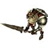

# Dungeons

### Pastor Roche's Memories - Enemy Data

#### Bloodbones (Unused)

<table class="buddyOverview">
  <tr class="noPad">
    <th colspan="11" class="highlightGreen">Stats</th>
  </tr>
  <tr>
    <td rowspan="4"></td>
    <td class="hp">HP</td>
    <td>40 / ?</td>
    <td class="atk">Attack</td>
    <td>26 / ?</td>
    <td class="mag">Magic</td>
    <td>35 / ?</td>
    <th>JP</th>
    <td>-</td>
    <th>Item 1</th>
    <td class="leftText">Potion (60%)</td>
  </tr>
  <tr>
    <td class="sp">Exp</td>
    <td>75</td>
    <td class="def">Defense</td>
    <td>50 / ?</td>
    <td class="mnd">Mind</td>
    <td>28 / ?</td>
    <th>BP</th>
    <td>3 (50%)</td>
    <th>Item 2</th>
    <td class="leftText">Ether (40%)</td>
  </tr>
  <tr>
    <th>Hit</th>
    <td>95</td>
    <th>Evasion</th>
    <td>4</td>
    <th>Crit</th>
    <td>5</td>
    <th>Gil</th>
    <td>-</td>
    <th>Steal</th>
    <td class="leftText">Potion (80%)</td>
  </tr>
  <tr>
    <th>Lv</th>
    <td>11</td>
    <th>Special</th>
    <td></td>
    <th>Resist</th>
    <td colspan="3"></td>
    <th>Weak</th>
    <td></td>
  </tr>
  <tr>
    <th colspan="11" class="abilityName">Poison Slash</th>
  </tr>
  <tr>
    <th>Rate / CD</th>
    <td colspan="2">20% / 3T</td>
    <th>Range</th>
    <td></td>
    <th>Element</th>
    <td>-</td>
    <th>Value</th>
    <td>0</td>
    <th>Type</th>
    <td class="leftText">Physical</td>
  </tr>
  <tr>
    <th>Notes</th>
    <td colspan="10" class="leftText"></td>
  </tr>
  <tr>
    <th colspan="11" class="abilityName">Horror Cloud</th>
  </tr>
  <tr>
    <th>Rate / CD</th>
    <td colspan="2">10% / 3T</td>
    <th>Range</th>
    <td></td>
    <th>Element</th>
    <td>-</td>
    <th>Value</th>
    <td>0</td>
    <th>Type</th>
    <td class="leftText">Other</td>
  </tr>
  <tr>
    <th>Notes</th>
    <td colspan="10" class="leftText"></td>
  </tr>
</table>

### Guardian of the Dark - Enemy Data

#### Raffaello (Unused)

<table class="buddyOverview">
  <tr class="noPad">
    <th colspan="14" class="highlightOrange2">Stats</th>
  </tr>
  <tr>
    <td rowspan="4"></td>
    <td class="hp">HP</td>
    <td>9999 / ?</td>
    <td class="atk">Attack</td>
    <td>190 / ?</td>
    <td class="mag">Magic</td>
    <td>255 / ?</td>
    <th>JP</th>
    <td colspan="2">-</td>
    <th>Item 1</th>
    <td colspan="5">-</td>
  </tr>
  <tr>
    <td class="sp">Exp</td>
    <td>0</td>
    <td class="def">Defense</td>
    <td>120 / ?</td>
    <td class="mnd">Mind</td>
    <td>80 / ?</td>
    <th>BP</th>
    <td colspan="2">-</td>
    <th>Item 2</th>
    <td colspan="5">-</td>
  </tr>
  <tr>
    <th>Hit</th>
    <td>255</td>
    <th>Evasion</th>
    <td>5</td>
    <th>Crit</th>
    <td>10</td>
    <th>Gil</th>
    <td colspan="2">-</td>
    <th>Steal</th>
    <td colspan="5">X-Potion (30%)</td>
  </tr>
  <tr>
    <th>Lv</th>
    <td>99</td>
    <th>Special</th>
    <td>-</td>
    <th>Resist</th>
    <td colspan="4">-</td>
    <th>Weak</th>
    <td colspan="5">-</td>
  </tr>
  <tr>
    <th colspan="14" class="statusResists">Status Resistances</th>
  </tr>
  <tr>
    <th></th>
    <th></th>
    <th></th>
    <th></th>
    <th></th>
    <th></th>
    <th></th>
    <th></th>
    <th></th>
    <th>Knock</th>
    <th>Stun</th>
    <th>Warp</th>
    <th>Ratio</th>
  </tr>
  <tr>
    <td>◯</td>
    <td>✕</td>
    <td>✕</td>
    <td>✕</td>
    <td>✕</td>
    <td>◯</td>
    <td>◯</td>
    <td>◯</td>
    <td>◯</td>
    <td>◯</td>
    <td>✕</td>
    <td>✕</td>
    <td>✕</td>
  </tr>
</table>
