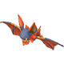
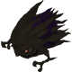
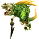
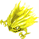
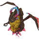

  

 

<table class="dungeonNext">
  <tr>
    <th>Previous</th>
    <td><a href="/chocobo-3/story-dungeons/guardian-of-the-dark">Guardian of the Dark</a></td>
    <th>Next</th>
    <td><a href="/chocobo-3/story-dungeons/mystery-dungeon">Mystery Dungeon</a></td>
  </tr>
</table>

# Overview

<table class="dungeonOverview">
  <tr>
    <th>Unlock</th>
    <td class="highlightYellow">Clear Guardian of the Dark (Chapter 5).</td>
  </tr>
  <tr>
    <th>Location</th>
    <td class="highlightYellow">Blue Sky Park (Chapter 6)</td>
  </tr>
</table>

<table class="dungeonTable">
  <tr>
    <th>Title</th>
    <td colspan="3">-</td>
  </tr>
  <tr>
    <th>Description</th>
    <td colspan="3">Normal dungeon with no restrictions.</td>
  </tr>
  <tr>
    <th>Floors</th>
    <td>99F</td>
    <th>Bosses</th>
    <td>20F, 40F, 65F, 95F, 99F</td>
  </tr>
  <tr>
    <th>Change Crystals</th>
    <td>0F</td>
    <th>Checkpoints</th>
    <td>21F, 41F, 66F</td>
  </tr>
  <tr>
    <th>Max Level</th>
    <td>-</td>
    <th>Bring Buddy</th>
    <td>Yes</td>
  </tr>
  <tr>
    <th>Bring In Items</th>
    <td>Yes</td>
    <th>Take Out Items</th>
    <td>Yes</td>
  </tr>
  <tr>
    <th>Shops/Duels</th>
    <td>Yes</td>
    <th>Den of Monsters</th>
    <td>Yes</td>
  </tr>
  <tr>
    <th>Reapers</th>
    <td>Yes</td>
    <th>Bookmark</th>
    <td>Yes</td>
  </tr>
  <tr>
    <th>Unidentified</th>
    <td colspan="3">Equipment, Consumables</td>
  </tr>
  <tr>
    <th>Rewards</th>
    <td colspan="3">1. Can receive  Mog's Letter 1 (Reach 21F). 　・ Unlocks  Flames of Rebirth. 2. Can receive  Mog's Letter 2 (Reach 41F). 　・ Unlocks  Lord of the Sea. 3. Can receive  Mog's Letter 3 (Reach 66F). 　・ Unlocks  Divine Judgment. 4. Can receive  Mog's Letter 4 (Reach 96F). 　・ Unlocks  The Great Dragon King. 5.  Chocobo's Memories (99F) 6.  Dragon Crest (99F) 7. Dungeon added to  Mirror of Memory. 8. Can receive  Secret Ticket 2 (Clear). 　・ Unlocks  Dungeon of Heroes!. 9. Can receive  Secret Ticket 3 (Clear). 　・ Unlocks  Mystery Dungeon.</td>
  </tr>
</table>

# Strategy

[Content]

# Monsters

<ul><li><a href="#monster-table">Monster Table</a></li><li><a href="#monster-details">Monster Details</a></li></ul>

 

 Monster Table 

Monster Colors - Boss F - 　 means field of view is limited, N means it's a checkpoint floor. S - 　 means a Shop Trap can appear. D - 　 means a Duel Trap can appear. M - 　 means a Monster Den can appear. R - 　 means  Reaper can spawn.

<table class="monsterTable">
  <thead>
    <tr>
      <th>F</th>
      <th>S</th>
      <th>D</th>
      <th>M</th>
      <th colspan="5">Monsters</th>
      <th>R</th>
    </tr>
  </thead>
  <tbody>
    <tr class="changeCrystal">
      <td class="centeredText">0</td>
      <td></td>
      <td></td>
      <td></td>
      <td colspan="5" class="centeredText">Change Crystal</td>
      <td></td>
    </tr>
    <tr>
      <td class="centeredText highlightFog">1</td>
      <td class="highlightGray"></td>
      <td class="highlightGray"></td>
      <td class="highlightGray"></td>
      <td> Bat Shade (33%)</td>
      <td> Flan Shade (33%)</td>
      <td> Floater Shade (33%)</td>
      <td class="highlightGray"></td>
      <td class="highlightGray"></td>
      <td class="highlightReaper"></td>
    </tr>
    <tr>
      <td class="centeredText highlightFog">2</td>
      <td class="highlightGray"></td>
      <td class="highlightGray"></td>
      <td class="highlightGray"></td>
      <td> Bat Shade (33%)</td>
      <td> Flan Shade (33%)</td>
      <td> Floater Shade (33%)</td>
      <td class="highlightGray"></td>
      <td class="highlightGray"></td>
      <td class="highlightReaper"></td>
    </tr>
    <tr>
      <td class="centeredText highlightFog">3</td>
      <td class="highlightShop"></td>
      <td class="highlightDuel"></td>
      <td class="highlightGray"></td>
      <td> Bat Shade (33%)</td>
      <td> Flan Shade (33%)</td>
      <td> Floater Shade (33%)</td>
      <td class="highlightGray"></td>
      <td class="highlightGray"></td>
      <td class="highlightReaper"></td>
    </tr>
    <tr>
      <td class="centeredText highlightFog">4</td>
      <td class="highlightShop"></td>
      <td class="highlightDuel"></td>
      <td class="highlightGray"></td>
      <td> Bat Shade (33%)</td>
      <td> Flan Shade (33%)</td>
      <td> Floater Shade (33%)</td>
      <td class="highlightGray"></td>
      <td class="highlightGray"></td>
      <td class="highlightReaper"></td>
    </tr>
    <tr>
      <td class="centeredText highlightFog">5</td>
      <td class="highlightShop"></td>
      <td class="highlightDuel"></td>
      <td class="highlightMH"></td>
      <td> Ghost Shade (21%)</td>
      <td> Red Marshmallow (21%)</td>
      <td> Werebat (21%)</td>
      <td> Goblin (21%)</td>
      <td> Fire Elemental (14%)</td>
      <td class="highlightReaper"></td>
    </tr>
    <tr>
      <td class="centeredText highlightFog">6</td>
      <td class="highlightShop"></td>
      <td class="highlightDuel"></td>
      <td class="highlightMH"></td>
      <td> Ghost Shade (21%)</td>
      <td> Red Marshmallow (21%)</td>
      <td> Werebat (21%)</td>
      <td> Goblin (21%)</td>
      <td> Fire Elemental (14%)</td>
      <td class="highlightReaper"></td>
    </tr>
    <tr>
      <td class="centeredText highlightFog">7</td>
      <td class="highlightShop"></td>
      <td class="highlightDuel"></td>
      <td class="highlightMH"></td>
      <td> Ghost Shade (21%)</td>
      <td> Red Marshmallow (21%)</td>
      <td> Werebat (21%)</td>
      <td> Goblin (21%)</td>
      <td> Fire Elemental (14%)</td>
      <td class="highlightReaper"></td>
    </tr>
    <tr>
      <td class="centeredText highlightFog">8</td>
      <td class="highlightShop"></td>
      <td class="highlightDuel"></td>
      <td class="highlightMH"></td>
      <td> Ghost Shade (21%)</td>
      <td> Red Marshmallow (21%)</td>
      <td> Werebat (21%)</td>
      <td> Goblin (21%)</td>
      <td> Fire Elemental (14%)</td>
      <td class="highlightReaper"></td>
    </tr>
    <tr>
      <td class="centeredText highlightFog">9</td>
      <td class="highlightShop"></td>
      <td class="highlightDuel"></td>
      <td class="highlightMH"></td>
      <td> Ghost Shade (21%)</td>
      <td> Goblin Guard (21%)</td>
      <td> Bomb (21%)</td>
      <td> Mandra Red (21%)</td>
      <td> Fire Elemental (14%)</td>
      <td class="highlightReaper"></td>
    </tr>
    <tr>
      <td class="centeredText highlightFog">10</td>
      <td class="highlightShop"></td>
      <td class="highlightDuel"></td>
      <td class="highlightMH"></td>
      <td> Ghost Shade (21%)</td>
      <td> Goblin Guard (21%)</td>
      <td> Bomb (21%)</td>
      <td> Mandra Red (21%)</td>
      <td> Fire Elemental (14%)</td>
      <td class="highlightReaper"></td>
    </tr>
    <tr>
      <td class="centeredText highlightFog">11</td>
      <td class="highlightShop"></td>
      <td class="highlightDuel"></td>
      <td class="highlightMH"></td>
      <td> Goblin Shade (21%)</td>
      <td> Goblin Guard (21%)</td>
      <td> Bomb (21%)</td>
      <td> Mandra Red (21%)</td>
      <td> Fire Elemental (14%)</td>
      <td class="highlightReaper"></td>
    </tr>
    <tr>
      <td class="centeredText highlightFog">12</td>
      <td class="highlightShop"></td>
      <td class="highlightDuel"></td>
      <td class="highlightMH"></td>
      <td> Goblin Shade (21%)</td>
      <td> Goblin Guard (21%)</td>
      <td> Bomb (21%)</td>
      <td> Mandra Red (21%)</td>
      <td> Fire Elemental (14%)</td>
      <td class="highlightReaper"></td>
    </tr>
    <tr>
      <td class="centeredText highlightFog">13</td>
      <td class="highlightShop"></td>
      <td class="highlightDuel"></td>
      <td class="highlightMH"></td>
      <td> Goblin Shade (21%)</td>
      <td> Desert Sahagin (21%)</td>
      <td> Red Cap (21%)</td>
      <td> Land Turtle (21%)</td>
      <td> Fire Elemental (14%)</td>
      <td class="highlightReaper"></td>
    </tr>
    <tr>
      <td class="centeredText highlightFog">14</td>
      <td class="highlightShop"></td>
      <td class="highlightDuel"></td>
      <td class="highlightMH"></td>
      <td> Goblin Shade (21%)</td>
      <td> Desert Sahagin (21%)</td>
      <td> Red Cap (21%)</td>
      <td> Land Turtle (21%)</td>
      <td> Fire Elemental (14%)</td>
      <td class="highlightReaper"></td>
    </tr>
    <tr>
      <td class="centeredText highlightFog">15</td>
      <td class="highlightShop"></td>
      <td class="highlightDuel"></td>
      <td class="highlightMH"></td>
      <td> Goblin Shade (21%)</td>
      <td> Desert Sahagin (21%)</td>
      <td> Red Cap (21%)</td>
      <td> Land Turtle (21%)</td>
      <td> Fire Elemental (14%)</td>
      <td class="highlightReaper"></td>
    </tr>
    <tr>
      <td class="centeredText highlightFog">16</td>
      <td class="highlightShop"></td>
      <td class="highlightDuel"></td>
      <td class="highlightMH"></td>
      <td> Goblin Shade (21%)</td>
      <td> Desert Sahagin (21%)</td>
      <td> Red Cap (21%)</td>
      <td> Land Turtle (21%)</td>
      <td> Fire Elemental (14%)</td>
      <td class="highlightReaper"></td>
    </tr>
    <tr>
      <td class="centeredText highlightFog">17</td>
      <td class="highlightShop"></td>
      <td class="highlightDuel"></td>
      <td class="highlightMH"></td>
      <td> Vulture Shade (21%)</td>
      <td> Heat Basilisk (21%)</td>
      <td> Goblin Prince (21%)</td>
      <td> Fire Dragon (21%)</td>
      <td> Fire Elemental (14%)</td>
      <td class="highlightReaper"></td>
    </tr>
    <tr>
      <td class="centeredText highlightFog">18</td>
      <td class="highlightShop"></td>
      <td class="highlightDuel"></td>
      <td class="highlightMH"></td>
      <td> Vulture Shade (21%)</td>
      <td> Heat Basilisk (21%)</td>
      <td> Goblin Prince (21%)</td>
      <td> Fire Dragon (21%)</td>
      <td> Fire Elemental (14%)</td>
      <td class="highlightReaper"></td>
    </tr>
    <tr>
      <td class="centeredText highlightFog">19</td>
      <td class="highlightGray"></td>
      <td class="highlightGray"></td>
      <td class="highlightMH"></td>
      <td> Vulture Shade (21%)</td>
      <td> Heat Basilisk (21%)</td>
      <td> Goblin Prince (21%)</td>
      <td> Fire Dragon (21%)</td>
      <td> Fire Elemental (14%)</td>
      <td class="highlightReaper"></td>
    </tr>
    <tr>
      <td class="centeredText">20</td>
      <td class="highlightGray"></td>
      <td class="highlightGray"></td>
      <td class="highlightGray"></td>
      <td> Phoenix</td>
      <td class="highlightGray"></td>
      <td class="highlightGray"></td>
      <td class="highlightGray"></td>
      <td class="highlightGray"></td>
      <td class="highlightGray"></td>
    </tr>
    <tr>
      <td class="centeredText highlightFog checkpoint">21</td>
      <td class="highlightGray"></td>
      <td class="highlightGray"></td>
      <td class="highlightGray"></td>
      <td> Mandra Shade (21%)</td>
      <td> Frog (21%)</td>
      <td> Turtle (21%)</td>
      <td> Ice Flan (21%)</td>
      <td> Water Elemental (14%)</td>
      <td class="highlightReaper"></td>
    </tr>
    <tr>
      <td class="centeredText highlightFog">22</td>
      <td class="highlightGray"></td>
      <td class="highlightGray"></td>
      <td class="highlightMH"></td>
      <td> Mandra Shade (21%)</td>
      <td> Frog (21%)</td>
      <td> Turtle (21%)</td>
      <td> Ice Flan (21%)</td>
      <td> Water Elemental (14%)</td>
      <td class="highlightReaper"></td>
    </tr>
    <tr>
      <td class="centeredText highlightFog">23</td>
      <td class="highlightShop"></td>
      <td class="highlightDuel"></td>
      <td class="highlightMH"></td>
      <td> Mandra Shade (21%)</td>
      <td> Frog (21%)</td>
      <td> Turtle (21%)</td>
      <td> Ice Flan (21%)</td>
      <td> Water Elemental (14%)</td>
      <td class="highlightReaper"></td>
    </tr>
    <tr>
      <td class="centeredText highlightFog">24</td>
      <td class="highlightShop"></td>
      <td class="highlightDuel"></td>
      <td class="highlightMH"></td>
      <td> Mandra Shade (21%)</td>
      <td> Frog (21%)</td>
      <td> Turtle (21%)</td>
      <td> Ice Flan (21%)</td>
      <td> Water Elemental (14%)</td>
      <td class="highlightReaper"></td>
    </tr>
    <tr>
      <td class="centeredText highlightFog">25</td>
      <td class="highlightShop"></td>
      <td class="highlightDuel"></td>
      <td class="highlightMH"></td>
      <td> Mandra Shade (21%)</td>
      <td> Big Scissors (21%)</td>
      <td> Ghost (21%)</td>
      <td> Sahagin (21%)</td>
      <td> Water Elemental (14%)</td>
      <td class="highlightReaper"></td>
    </tr>
    <tr>
      <td class="centeredText highlightFog">26</td>
      <td class="highlightShop"></td>
      <td class="highlightDuel"></td>
      <td class="highlightMH"></td>
      <td> Mandra Shade (21%)</td>
      <td> Big Scissors (21%)</td>
      <td> Ghost (21%)</td>
      <td> Sahagin (21%)</td>
      <td> Water Elemental (14%)</td>
      <td class="highlightReaper"></td>
    </tr>
    <tr>
      <td class="centeredText highlightFog">27</td>
      <td class="highlightShop"></td>
      <td class="highlightDuel"></td>
      <td class="highlightMH"></td>
      <td> Bomb Shade (21%)</td>
      <td> Big Scissors (21%)</td>
      <td> Ghost (21%)</td>
      <td> Sahagin (21%)</td>
      <td> Water Elemental (14%)</td>
      <td class="highlightReaper"></td>
    </tr>
    <tr>
      <td class="centeredText highlightFog">28</td>
      <td class="highlightShop"></td>
      <td class="highlightDuel"></td>
      <td class="highlightMH"></td>
      <td> Bomb Shade (21%)</td>
      <td> Iron Giant (21%)</td>
      <td> Cluster (21%)</td>
      <td> Skeleton (21%)</td>
      <td> Water Elemental (14%)</td>
      <td class="highlightReaper"></td>
    </tr>
    <tr>
      <td class="centeredText highlightFog">29</td>
      <td class="highlightShop"></td>
      <td class="highlightDuel"></td>
      <td class="highlightMH"></td>
      <td> Bomb Shade (21%)</td>
      <td> Iron Giant (21%)</td>
      <td> Cluster (21%)</td>
      <td> Skeleton (21%)</td>
      <td> Water Elemental (14%)</td>
      <td class="highlightReaper"></td>
    </tr>
    <tr>
      <td class="centeredText highlightFog">30</td>
      <td class="highlightShop"></td>
      <td class="highlightDuel"></td>
      <td class="highlightMH"></td>
      <td> Bomb Shade (21%)</td>
      <td> Iron Giant (21%)</td>
      <td> Cluster (21%)</td>
      <td> Skeleton (21%)</td>
      <td> Water Elemental (14%)</td>
      <td class="highlightReaper"></td>
    </tr>
    <tr>
      <td class="centeredText highlightFog">31</td>
      <td class="highlightShop"></td>
      <td class="highlightDuel"></td>
      <td class="highlightMH"></td>
      <td> Bomb Shade (21%)</td>
      <td> Lamia (21%)</td>
      <td> Scissors (21%)</td>
      <td> Gigantoad (21%)</td>
      <td> Water Elemental (14%)</td>
      <td class="highlightReaper"></td>
    </tr>
    <tr>
      <td class="centeredText highlightFog">32</td>
      <td class="highlightShop"></td>
      <td class="highlightDuel"></td>
      <td class="highlightMH"></td>
      <td> Cactuar Shade (21%)</td>
      <td> Lamia (21%)</td>
      <td> Scissors (21%)</td>
      <td> Gigantoad (21%)</td>
      <td> Water Elemental (14%)</td>
      <td class="highlightReaper"></td>
    </tr>
    <tr>
      <td class="centeredText highlightFog">33</td>
      <td class="highlightShop"></td>
      <td class="highlightDuel"></td>
      <td class="highlightMH"></td>
      <td> Cactuar Shade (21%)</td>
      <td> Lamia (21%)</td>
      <td> Scissors (21%)</td>
      <td> Gigantoad (21%)</td>
      <td> Water Elemental (14%)</td>
      <td class="highlightReaper"></td>
    </tr>
    <tr>
      <td class="centeredText highlightFog">34</td>
      <td class="highlightShop"></td>
      <td class="highlightDuel"></td>
      <td class="highlightMH"></td>
      <td> Cactuar Shade (21%)</td>
      <td> Adamantoise (21%)</td>
      <td> Revenant (21%)</td>
      <td> Malboro (21%)</td>
      <td> Water Elemental (14%)</td>
      <td class="highlightReaper"></td>
    </tr>
    <tr>
      <td class="centeredText highlightFog">35</td>
      <td class="highlightShop"></td>
      <td class="highlightDuel"></td>
      <td class="highlightMH"></td>
      <td> Cactuar Shade (21%)</td>
      <td> Adamantoise (21%)</td>
      <td> Revenant (21%)</td>
      <td> Malboro (21%)</td>
      <td> Water Elemental (14%)</td>
      <td class="highlightReaper"></td>
    </tr>
    <tr>
      <td class="centeredText highlightFog">36</td>
      <td class="highlightShop"></td>
      <td class="highlightDuel"></td>
      <td class="highlightMH"></td>
      <td> Cactuar Shade (21%)</td>
      <td> Adamantoise (21%)</td>
      <td> Revenant (21%)</td>
      <td> Malboro (21%)</td>
      <td> Water Elemental (14%)</td>
      <td class="highlightReaper"></td>
    </tr>
    <tr>
      <td class="centeredText highlightFog">37</td>
      <td class="highlightShop"></td>
      <td class="highlightDuel"></td>
      <td class="highlightMH"></td>
      <td> Tonberry Shade (21%)</td>
      <td> Sahagin Prince (21%)</td>
      <td> Lamia Queen (21%)</td>
      <td> Ice Dragon (21%)</td>
      <td> Water Elemental (14%)</td>
      <td class="highlightReaper"></td>
    </tr>
    <tr>
      <td class="centeredText highlightFog">38</td>
      <td class="highlightShop"></td>
      <td class="highlightDuel"></td>
      <td class="highlightMH"></td>
      <td> Tonberry Shade (21%)</td>
      <td> Sahagin Prince (21%)</td>
      <td> Lamia Queen (21%)</td>
      <td> Ice Dragon (21%)</td>
      <td> Water Elemental (14%)</td>
      <td class="highlightReaper"></td>
    </tr>
    <tr>
      <td class="centeredText highlightFog">39</td>
      <td class="highlightGray"></td>
      <td class="highlightGray"></td>
      <td class="highlightMH"></td>
      <td> Tonberry Shade (21%)</td>
      <td> Sahagin Prince (21%)</td>
      <td> Lamia Queen (21%)</td>
      <td> Ice Dragon (21%)</td>
      <td> Water Elemental (14%)</td>
      <td class="highlightReaper"></td>
    </tr>
    <tr>
      <td class="centeredText">40</td>
      <td class="highlightGray"></td>
      <td class="highlightGray"></td>
      <td class="highlightGray"></td>
      <td> Leviathan</td>
      <td class="highlightGray"></td>
      <td class="highlightGray"></td>
      <td class="highlightGray"></td>
      <td class="highlightGray"></td>
      <td class="highlightGray"></td>
    </tr>
    <tr>
      <td class="centeredText checkpoint">41</td>
      <td class="highlightGray"></td>
      <td class="highlightGray"></td>
      <td class="highlightGray"></td>
      <td> Scissors Shade (21%)</td>
      <td> Ahriman (21%)</td>
      <td> Coeurl (21%)</td>
      <td> Mandra (21%)</td>
      <td> Light Elemental (14%)</td>
      <td class="highlightReaper"></td>
    </tr>
    <tr>
      <td class="centeredText">42</td>
      <td class="highlightGray"></td>
      <td class="highlightGray"></td>
      <td class="highlightMH"></td>
      <td> Scissors Shade (21%)</td>
      <td> Ahriman (21%)</td>
      <td> Coeurl (21%)</td>
      <td> Mandra (21%)</td>
      <td> Light Elemental (14%)</td>
      <td class="highlightReaper"></td>
    </tr>
    <tr>
      <td class="centeredText">43</td>
      <td class="highlightShop"></td>
      <td class="highlightDuel"></td>
      <td class="highlightMH"></td>
      <td> Scissors Shade (21%)</td>
      <td> Ahriman (21%)</td>
      <td> Coeurl (21%)</td>
      <td> Mandra (21%)</td>
      <td> Light Elemental (14%)</td>
      <td class="highlightReaper"></td>
    </tr>
    <tr>
      <td class="centeredText">44</td>
      <td class="highlightShop"></td>
      <td class="highlightDuel"></td>
      <td class="highlightMH"></td>
      <td> Scissors Shade (21%)</td>
      <td> Tonberry (21%)</td>
      <td> Vulture (21%)</td>
      <td> Iron Giant Steel (21%)</td>
      <td> Light Elemental (14%)</td>
      <td class="highlightReaper"></td>
    </tr>
    <tr>
      <td class="centeredText">45</td>
      <td class="highlightShop"></td>
      <td class="highlightDuel"></td>
      <td class="highlightMH"></td>
      <td> Scissors Shade (21%)</td>
      <td> Tonberry (21%)</td>
      <td> Vulture (21%)</td>
      <td> Iron Giant Steel (21%)</td>
      <td> Light Elemental (14%)</td>
      <td class="highlightReaper"></td>
    </tr>
    <tr>
      <td class="centeredText">46</td>
      <td class="highlightShop"></td>
      <td class="highlightDuel"></td>
      <td class="highlightMH"></td>
      <td> Scissors Shade (21%)</td>
      <td> Tonberry (21%)</td>
      <td> Vulture (21%)</td>
      <td> Iron Giant Steel (21%)</td>
      <td> Light Elemental (14%)</td>
      <td class="highlightReaper"></td>
    </tr>
    <tr>
      <td class="centeredText">47</td>
      <td class="highlightShop"></td>
      <td class="highlightDuel"></td>
      <td class="highlightMH"></td>
      <td> Turtle Shade (21%)</td>
      <td> Red Scissors (21%)</td>
      <td> Flan Amarillo (21%)</td>
      <td> Flying Eye (21%)</td>
      <td> Light Elemental (14%)</td>
      <td class="highlightReaper"></td>
    </tr>
    <tr>
      <td class="centeredText">48</td>
      <td class="highlightShop"></td>
      <td class="highlightDuel"></td>
      <td class="highlightMH"></td>
      <td> Turtle Shade (21%)</td>
      <td> Red Scissors (21%)</td>
      <td> Flan Amarillo (21%)</td>
      <td> Flying Eye (21%)</td>
      <td> Light Elemental (14%)</td>
      <td class="highlightReaper"></td>
    </tr>
    <tr>
      <td class="centeredText">49</td>
      <td class="highlightShop"></td>
      <td class="highlightDuel"></td>
      <td class="highlightMH"></td>
      <td> Turtle Shade (21%)</td>
      <td> Red Scissors (21%)</td>
      <td> Flan Amarillo (21%)</td>
      <td> Flying Eye (21%)</td>
      <td> Light Elemental (14%)</td>
      <td class="highlightReaper"></td>
    </tr>
    <tr>
      <td class="centeredText">50</td>
      <td class="highlightShop"></td>
      <td class="highlightDuel"></td>
      <td class="highlightMH"></td>
      <td> Turtle Shade (21%)</td>
      <td> Toad (21%)</td>
      <td> Lizard (21%)</td>
      <td> Cactuar (21%)</td>
      <td> Light Elemental (14%)</td>
      <td class="highlightReaper"></td>
    </tr>
    <tr>
      <td class="centeredText">51</td>
      <td class="highlightShop"></td>
      <td class="highlightDuel"></td>
      <td class="highlightMH"></td>
      <td> Turtle Shade (21%)</td>
      <td> Toad (21%)</td>
      <td> Lizard (21%)</td>
      <td> Cactuar (21%)</td>
      <td> Light Elemental (14%)</td>
      <td class="highlightReaper"></td>
    </tr>
    <tr>
      <td class="centeredText">52</td>
      <td class="highlightShop"></td>
      <td class="highlightDuel"></td>
      <td class="highlightMH"></td>
      <td> Turtle Shade (21%)</td>
      <td> Toad (21%)</td>
      <td> Lizard (21%)</td>
      <td> Cactuar (21%)</td>
      <td> Light Elemental (14%)</td>
      <td class="highlightReaper"></td>
    </tr>
    <tr>
      <td class="centeredText">53</td>
      <td class="highlightShop"></td>
      <td class="highlightDuel"></td>
      <td class="highlightMH"></td>
      <td> Sahagin Shade (21%)</td>
      <td> Cockatrice (21%)</td>
      <td> Mandragora (21%)</td>
      <td> Grenade (21%)</td>
      <td> Light Elemental (14%)</td>
      <td class="highlightReaper"></td>
    </tr>
    <tr>
      <td class="centeredText">54</td>
      <td class="highlightShop"></td>
      <td class="highlightDuel"></td>
      <td class="highlightMH"></td>
      <td> Sahagin Shade (21%)</td>
      <td> Cockatrice (21%)</td>
      <td> Mandragora (21%)</td>
      <td> Grenade (21%)</td>
      <td> Light Elemental (14%)</td>
      <td class="highlightReaper"></td>
    </tr>
    <tr>
      <td class="centeredText">55</td>
      <td class="highlightShop"></td>
      <td class="highlightDuel"></td>
      <td class="highlightMH"></td>
      <td> Sahagin Shade (21%)</td>
      <td> Cockatrice (21%)</td>
      <td> Mandragora (21%)</td>
      <td> Grenade (21%)</td>
      <td> Light Elemental (14%)</td>
      <td class="highlightReaper"></td>
    </tr>
    <tr>
      <td class="centeredText">56</td>
      <td class="highlightShop"></td>
      <td class="highlightDuel"></td>
      <td class="highlightMH"></td>
      <td> Sahagin Shade (21%)</td>
      <td> Master Tonberry (21%)</td>
      <td> Bloodbones (21%)</td>
      <td> Simurgh (21%)</td>
      <td> Light Elemental (14%)</td>
      <td class="highlightReaper"></td>
    </tr>
    <tr>
      <td class="centeredText">57</td>
      <td class="highlightShop"></td>
      <td class="highlightDuel"></td>
      <td class="highlightMH"></td>
      <td> Sahagin Shade (21%)</td>
      <td> Master Tonberry (21%)</td>
      <td> Bloodbones (21%)</td>
      <td> Simurgh (21%)</td>
      <td> Light Elemental (14%)</td>
      <td class="highlightReaper"></td>
    </tr>
    <tr>
      <td class="centeredText">58</td>
      <td class="highlightShop"></td>
      <td class="highlightDuel"></td>
      <td class="highlightMH"></td>
      <td> Sahagin Shade (21%)</td>
      <td> Master Tonberry (21%)</td>
      <td> Bloodbones (21%)</td>
      <td> Simurgh (21%)</td>
      <td> Light Elemental (14%)</td>
      <td class="highlightReaper"></td>
    </tr>
    <tr>
      <td class="centeredText">59</td>
      <td class="highlightShop"></td>
      <td class="highlightDuel"></td>
      <td class="highlightMH"></td>
      <td> Lamia Shade (21%)</td>
      <td> Great Malboro (21%)</td>
      <td> Panther (21%)</td>
      <td> Dark Eye (21%)</td>
      <td> Light Elemental (14%)</td>
      <td class="highlightReaper"></td>
    </tr>
    <tr>
      <td class="centeredText">60</td>
      <td class="highlightShop"></td>
      <td class="highlightDuel"></td>
      <td class="highlightMH"></td>
      <td> Lamia Shade (21%)</td>
      <td> Great Malboro (21%)</td>
      <td> Panther (21%)</td>
      <td> Dark Eye (21%)</td>
      <td> Light Elemental (14%)</td>
      <td class="highlightReaper"></td>
    </tr>
    <tr>
      <td class="centeredText">61</td>
      <td class="highlightShop"></td>
      <td class="highlightDuel"></td>
      <td class="highlightMH"></td>
      <td> Lamia Shade (21%)</td>
      <td> Great Malboro (21%)</td>
      <td> Panther (21%)</td>
      <td> Dark Eye (21%)</td>
      <td> Light Elemental (14%)</td>
      <td class="highlightReaper"></td>
    </tr>
    <tr>
      <td class="centeredText">62</td>
      <td class="highlightShop"></td>
      <td class="highlightDuel"></td>
      <td class="highlightMH"></td>
      <td> Lamia Shade (21%)</td>
      <td> Iron Giant Silver (21%)</td>
      <td> Belial (21%)</td>
      <td> Thunder Dragon (21%)</td>
      <td> Light Elemental (14%)</td>
      <td class="highlightReaper"></td>
    </tr>
    <tr>
      <td class="centeredText">63</td>
      <td class="highlightShop"></td>
      <td class="highlightDuel"></td>
      <td class="highlightMH"></td>
      <td> Lamia Shade (21%)</td>
      <td> Iron Giant Silver (21%)</td>
      <td> Belial (21%)</td>
      <td> Thunder Dragon (21%)</td>
      <td> Light Elemental (14%)</td>
      <td class="highlightReaper"></td>
    </tr>
    <tr>
      <td class="centeredText">64</td>
      <td class="highlightGray"></td>
      <td class="highlightGray"></td>
      <td class="highlightMH"></td>
      <td> Lamia Shade (21%)</td>
      <td> Iron Giant Silver (21%)</td>
      <td> Belial (21%)</td>
      <td> Thunder Dragon (21%)</td>
      <td> Light Elemental (14%)</td>
      <td class="highlightReaper"></td>
    </tr>
    <tr>
      <td class="centeredText">65</td>
      <td class="highlightGray"></td>
      <td class="highlightGray"></td>
      <td class="highlightGray"></td>
      <td> Alexander</td>
      <td> Right Arm</td>
      <td> Left Arm</td>
      <td class="highlightGray"></td>
      <td class="highlightGray"></td>
      <td class="highlightGray"></td>
    </tr>
    <tr>
      <td class="centeredText highlightFog checkpoint">66</td>
      <td class="highlightGray"></td>
      <td class="highlightGray"></td>
      <td class="highlightGray"></td>
      <td> Skeleton Shade (21%)</td>
      <td> Mandra Dark (21%)</td>
      <td> Wraith (21%)</td>
      <td> Basilisk (21%)</td>
      <td> Dark Elemental (14%)</td>
      <td class="highlightReaper"></td>
    </tr>
    <tr>
      <td class="centeredText highlightFog">67</td>
      <td class="highlightGray"></td>
      <td class="highlightGray"></td>
      <td class="highlightMH"></td>
      <td> Skeleton Shade (21%)</td>
      <td> Mandra Dark (21%)</td>
      <td> Wraith (21%)</td>
      <td> Basilisk (21%)</td>
      <td> Dark Elemental (14%)</td>
      <td class="highlightReaper"></td>
    </tr>
    <tr>
      <td class="centeredText highlightFog">68</td>
      <td class="highlightShop"></td>
      <td class="highlightDuel"></td>
      <td class="highlightMH"></td>
      <td> Skeleton Shade (21%)</td>
      <td> Mandra Dark (21%)</td>
      <td> Wraith (21%)</td>
      <td> Basilisk (21%)</td>
      <td> Dark Elemental (14%)</td>
      <td class="highlightReaper"></td>
    </tr>
    <tr>
      <td class="centeredText highlightFog">69</td>
      <td class="highlightShop"></td>
      <td class="highlightDuel"></td>
      <td class="highlightMH"></td>
      <td> Skeleton Shade (21%)</td>
      <td> Mandra Dark (21%)</td>
      <td> Wraith (21%)</td>
      <td> Basilisk (21%)</td>
      <td> Dark Elemental (14%)</td>
      <td class="highlightReaper"></td>
    </tr>
    <tr>
      <td class="centeredText highlightFog">70</td>
      <td class="highlightShop"></td>
      <td class="highlightDuel"></td>
      <td class="highlightMH"></td>
      <td> Skeleton Shade (21%)</td>
      <td> Bloody Bat (21%)</td>
      <td> Moloch (21%)</td>
      <td> Sahagin Zombie (21%)</td>
      <td> Dark Elemental (14%)</td>
      <td class="highlightReaper"></td>
    </tr>
    <tr>
      <td class="centeredText highlightFog">71</td>
      <td class="highlightShop"></td>
      <td class="highlightDuel"></td>
      <td class="highlightMH"></td>
      <td> Skeleton Shade (21%)</td>
      <td> Bloody Bat (21%)</td>
      <td> Moloch (21%)</td>
      <td> Sahagin Zombie (21%)</td>
      <td> Dark Elemental (14%)</td>
      <td class="highlightReaper"></td>
    </tr>
    <tr>
      <td class="centeredText highlightFog">72</td>
      <td class="highlightShop"></td>
      <td class="highlightDuel"></td>
      <td class="highlightMH"></td>
      <td> Skeleton Shade (21%)</td>
      <td> Bloody Bat (21%)</td>
      <td> Moloch (21%)</td>
      <td> Sahagin Zombie (21%)</td>
      <td> Dark Elemental (14%)</td>
      <td class="highlightReaper"></td>
    </tr>
    <tr>
      <td class="centeredText highlightFog">73</td>
      <td class="highlightShop"></td>
      <td class="highlightDuel"></td>
      <td class="highlightMH"></td>
      <td> Skeleton Shade (21%)</td>
      <td> Ochu (21%)</td>
      <td> Medusa (21%)</td>
      <td> Gigantuar (21%)</td>
      <td> Dark Elemental (14%)</td>
      <td class="highlightReaper"></td>
    </tr>
    <tr>
      <td class="centeredText highlightFog">74</td>
      <td class="highlightShop"></td>
      <td class="highlightDuel"></td>
      <td class="highlightMH"></td>
      <td> Skeleton Shade (21%)</td>
      <td> Ochu (21%)</td>
      <td> Medusa (21%)</td>
      <td> Gigantuar (21%)</td>
      <td> Dark Elemental (14%)</td>
      <td class="highlightReaper"></td>
    </tr>
    <tr>
      <td class="centeredText highlightFog">75</td>
      <td class="highlightShop"></td>
      <td class="highlightDuel"></td>
      <td class="highlightMH"></td>
      <td> Frog Shade (21%)</td>
      <td> Ochu (21%)</td>
      <td> Medusa (21%)</td>
      <td> Gigantuar (21%)</td>
      <td> Dark Elemental (14%)</td>
      <td class="highlightReaper"></td>
    </tr>
    <tr>
      <td class="centeredText highlightFog">76</td>
      <td class="highlightShop"></td>
      <td class="highlightDuel"></td>
      <td class="highlightMH"></td>
      <td> Frog Shade (21%)</td>
      <td> Napalm (21%)</td>
      <td> Bandercoeurl (21%)</td>
      <td> Poison Toad (21%)</td>
      <td> Dark Elemental (14%)</td>
      <td class="highlightReaper"></td>
    </tr>
    <tr>
      <td class="centeredText highlightFog">77</td>
      <td class="highlightShop"></td>
      <td class="highlightDuel"></td>
      <td class="highlightMH"></td>
      <td> Frog Shade (21%)</td>
      <td> Napalm (21%)</td>
      <td> Bandercoeurl (21%)</td>
      <td> Poison Toad (21%)</td>
      <td> Dark Elemental (14%)</td>
      <td class="highlightReaper"></td>
    </tr>
    <tr>
      <td class="centeredText highlightFog">78</td>
      <td class="highlightShop"></td>
      <td class="highlightDuel"></td>
      <td class="highlightMH"></td>
      <td> Frog Shade (21%)</td>
      <td> Napalm (21%)</td>
      <td> Bandercoeurl (21%)</td>
      <td> Poison Toad (21%)</td>
      <td> Dark Elemental (14%)</td>
      <td class="highlightReaper"></td>
    </tr>
    <tr>
      <td class="centeredText highlightFog">79</td>
      <td class="highlightShop"></td>
      <td class="highlightDuel"></td>
      <td class="highlightMH"></td>
      <td> Frog Shade (21%)</td>
      <td> Flan Princess (21%)</td>
      <td> Lich (21%)</td>
      <td> Glacial Eye (21%)</td>
      <td> Dark Elemental (14%)</td>
      <td class="highlightReaper"></td>
    </tr>
    <tr>
      <td class="centeredText highlightFog">80</td>
      <td class="highlightShop"></td>
      <td class="highlightDuel"></td>
      <td class="highlightMH"></td>
      <td> Frog Shade (21%)</td>
      <td> Flan Princess (21%)</td>
      <td> Lich (21%)</td>
      <td> Glacial Eye (21%)</td>
      <td> Dark Elemental (14%)</td>
      <td class="highlightReaper"></td>
    </tr>
    <tr>
      <td class="centeredText highlightFog">81</td>
      <td class="highlightShop"></td>
      <td class="highlightDuel"></td>
      <td class="highlightMH"></td>
      <td> Frog Shade (21%)</td>
      <td> Flan Princess (21%)</td>
      <td> Lich (21%)</td>
      <td> Glacial Eye (21%)</td>
      <td> Dark Elemental (14%)</td>
      <td class="highlightReaper"></td>
    </tr>
    <tr>
      <td class="centeredText highlightFog">82</td>
      <td class="highlightShop"></td>
      <td class="highlightDuel"></td>
      <td class="highlightMH"></td>
      <td> Frog Shade (21%)</td>
      <td> Genbu (21%)</td>
      <td> Darksteel (21%)</td>
      <td> Tonberry King (21%)</td>
      <td> Dark Elemental (14%)</td>
      <td class="highlightReaper"></td>
    </tr>
    <tr>
      <td class="centeredText highlightFog">83</td>
      <td class="highlightShop"></td>
      <td class="highlightDuel"></td>
      <td class="highlightMH"></td>
      <td> Frog Shade (21%)</td>
      <td> Genbu (21%)</td>
      <td> Darksteel (21%)</td>
      <td> Tonberry King (21%)</td>
      <td> Dark Elemental (14%)</td>
      <td class="highlightReaper"></td>
    </tr>
    <tr>
      <td class="centeredText highlightFog">84</td>
      <td class="highlightShop"></td>
      <td class="highlightDuel"></td>
      <td class="highlightMH"></td>
      <td> Malboro Shade (21%)</td>
      <td> Genbu (21%)</td>
      <td> Darksteel (21%)</td>
      <td> Tonberry King (21%)</td>
      <td> Dark Elemental (14%)</td>
      <td class="highlightReaper"></td>
    </tr>
    <tr>
      <td class="centeredText highlightFog">85</td>
      <td class="highlightShop"></td>
      <td class="highlightDuel"></td>
      <td class="highlightMH"></td>
      <td> Malboro Shade (21%)</td>
      <td> Iron Giant Gold (21%)</td>
      <td> Lilith (21%)</td>
      <td> Crazy Cactus (21%)</td>
      <td> Dark Elemental (14%)</td>
      <td class="highlightReaper"></td>
    </tr>
    <tr>
      <td class="centeredText highlightFog">86</td>
      <td class="highlightShop"></td>
      <td class="highlightDuel"></td>
      <td class="highlightMH"></td>
      <td> Malboro Shade (21%)</td>
      <td> Iron Giant Gold (21%)</td>
      <td> Lilith (21%)</td>
      <td> Crazy Cactus (21%)</td>
      <td> Dark Elemental (14%)</td>
      <td class="highlightReaper"></td>
    </tr>
    <tr>
      <td class="centeredText highlightFog">87</td>
      <td class="highlightShop"></td>
      <td class="highlightDuel"></td>
      <td class="highlightMH"></td>
      <td> Malboro Shade (21%)</td>
      <td> Iron Giant Gold (21%)</td>
      <td> Lilith (21%)</td>
      <td> Crazy Cactus (21%)</td>
      <td> Dark Elemental (14%)</td>
      <td class="highlightReaper"></td>
    </tr>
    <tr>
      <td class="centeredText highlightFog">88</td>
      <td class="highlightShop"></td>
      <td class="highlightDuel"></td>
      <td class="highlightMH"></td>
      <td> Malboro Shade (21%)</td>
      <td> Specter (21%)</td>
      <td> Dark Basilisk (21%)</td>
      <td> Malboro King (21%)</td>
      <td> Dark Elemental (14%)</td>
      <td class="highlightReaper"></td>
    </tr>
    <tr>
      <td class="centeredText highlightFog">89</td>
      <td class="highlightShop"></td>
      <td class="highlightDuel"></td>
      <td class="highlightMH"></td>
      <td> Malboro Shade (21%)</td>
      <td> Specter (21%)</td>
      <td> Dark Basilisk (21%)</td>
      <td> Malboro King (21%)</td>
      <td> Dark Elemental (14%)</td>
      <td class="highlightReaper"></td>
    </tr>
    <tr>
      <td class="centeredText highlightFog">90</td>
      <td class="highlightShop"></td>
      <td class="highlightDuel"></td>
      <td class="highlightMH"></td>
      <td> Malboro Shade (21%)</td>
      <td> Specter (21%)</td>
      <td> Dark Basilisk (21%)</td>
      <td> Malboro King (21%)</td>
      <td> Dark Elemental (14%)</td>
      <td class="highlightReaper"></td>
    </tr>
    <tr>
      <td class="centeredText highlightFog">91</td>
      <td class="highlightShop"></td>
      <td class="highlightDuel"></td>
      <td class="highlightMH"></td>
      <td> Dragon Shade (21%)</td>
      <td> Assault Scissors (21%)</td>
      <td> Balrog (21%)</td>
      <td> Dark Dragon (21%)</td>
      <td> Dark Elemental (14%)</td>
      <td class="highlightReaper"></td>
    </tr>
    <tr>
      <td class="centeredText highlightFog">92</td>
      <td class="highlightShop"></td>
      <td class="highlightDuel"></td>
      <td class="highlightMH"></td>
      <td> Dragon Shade (21%)</td>
      <td> Assault Scissors (21%)</td>
      <td> Balrog (21%)</td>
      <td> Dark Dragon (21%)</td>
      <td> Dark Elemental (14%)</td>
      <td class="highlightReaper"></td>
    </tr>
    <tr>
      <td class="centeredText highlightFog">93</td>
      <td class="highlightShop"></td>
      <td class="highlightDuel"></td>
      <td class="highlightMH"></td>
      <td> Dragon Shade (21%)</td>
      <td> Assault Scissors (21%)</td>
      <td> Balrog (21%)</td>
      <td> Dark Dragon (21%)</td>
      <td> Dark Elemental (14%)</td>
      <td class="highlightReaper"></td>
    </tr>
    <tr>
      <td class="centeredText highlightFog">94</td>
      <td class="highlightGray"></td>
      <td class="highlightGray"></td>
      <td class="highlightMH"></td>
      <td> Dragon Shade (21%)</td>
      <td> Assault Scissors (21%)</td>
      <td> Balrog (21%)</td>
      <td> Dark Dragon (21%)</td>
      <td> Dark Elemental (14%)</td>
      <td class="highlightReaper"></td>
    </tr>
    <tr>
      <td class="centeredText">95</td>
      <td class="highlightGray"></td>
      <td class="highlightGray"></td>
      <td class="highlightGray"></td>
      <td> The Destroyer</td>
      <td class="highlightGray"></td>
      <td class="highlightGray"></td>
      <td class="highlightGray"></td>
      <td class="highlightGray"></td>
      <td class="highlightGray"></td>
    </tr>
    <tr>
      <td class="centeredText">96</td>
      <td class="highlightGray"></td>
      <td class="highlightGray"></td>
      <td class="highlightGray"></td>
      <td> Coeurl Shade (25%)</td>
      <td> Iron Giant Shade (25%)</td>
      <td> Lizard Shade (25%)</td>
      <td> Demon Shade (25%)</td>
      <td class="highlightGray"></td>
      <td class="highlightReaper"></td>
    </tr>
    <tr>
      <td class="centeredText">97</td>
      <td class="highlightGray"></td>
      <td class="highlightGray"></td>
      <td class="highlightMH"></td>
      <td> Coeurl Shade (25%)</td>
      <td> Iron Giant Shade (25%)</td>
      <td> Lizard Shade (25%)</td>
      <td> Demon Shade (25%)</td>
      <td class="highlightGray"></td>
      <td class="highlightReaper"></td>
    </tr>
    <tr>
      <td class="centeredText">98</td>
      <td class="highlightGray"></td>
      <td class="highlightGray"></td>
      <td class="highlightMH"></td>
      <td> Coeurl Shade (25%)</td>
      <td> Iron Giant Shade (25%)</td>
      <td> Lizard Shade (25%)</td>
      <td> Demon Shade (25%)</td>
      <td class="highlightGray"></td>
      <td class="highlightReaper"></td>
    </tr>
    <tr>
      <td class="centeredText">99</td>
      <td class="highlightGray"></td>
      <td class="highlightGray"></td>
      <td class="highlightGray"></td>
      <td> Shinryu</td>
      <td class="highlightGray"></td>
      <td class="highlightGray"></td>
      <td class="highlightGray"></td>
      <td class="highlightGray"></td>
      <td class="highlightGray"></td>
    </tr>
  </tbody>
</table>

 Duel Table 

Duel Traps have a 30% chance to be generated between 3-18F, 23-38F, 43-63F, and 68-93F.

<table class="monsterTable">
  <thead>
    <tr>
      <th class="highlightDuel">F</th>
      <th class="highlightDuel" colspan="2">Possible Bosses</th>
    </tr>
  </thead>
  <tbody>
    <tr>
      <td class="centeredText">3-18</td>
      <td> Ifrit (80%)</td>
      <td> Mini Cactuar (20%)</td>
    </tr>
    <tr>
      <td class="centeredText">23-38</td>
      <td> Shiva (80%)</td>
      <td> Mini Cactuar (20%)</td>
    </tr>
    <tr>
      <td class="centeredText">43-63</td>
      <td> Ramuh (80%)</td>
      <td> Mini Cactuar (20%)</td>
    </tr>
    <tr>
      <td class="centeredText">68-93</td>
      <td> Bahamut (80%)</td>
      <td> Mini Cactuar (20%)</td>
    </tr>
  </tbody>
</table>

 

 Monster Details 

Stat Colors - Hard Mode

### Standard

#### Bat Shade (1-4F)

<table class="buddyOverview">
  <tr class="noPad">
    <th colspan="13" class="highlightGreen">Stats</th>
  </tr>
  <tr>
    <td rowspan="4"></td>
    <td class="hp">HP</td>
    <td>134 / 163</td>
    <td class="atk">Attack</td>
    <td>172 / 175</td>
    <td class="mag">Magic</td>
    <td>103 / 105</td>
    <th>JP</th>
    <td>44 (40%)</td>
    <th>Item 1</th>
    <td colspan="3">-</td>
  </tr>
  <tr>
    <td class="sp">Exp</td>
    <td>289</td>
    <td class="def">Defense</td>
    <td>100 / 101</td>
    <td class="mnd">Mind</td>
    <td>75 / 75</td>
    <th>BP</th>
    <td>-</td>
    <th>Item 2</th>
    <td colspan="3">-</td>
  </tr>
  <tr>
    <th>Hit</th>
    <td>95</td>
    <th>Evasion</th>
    <td>8</td>
    <th>Crit</th>
    <td>5</td>
    <th>Gil</th>
    <td>94 (10%)</td>
    <th>Steal</th>
    <td colspan="3">Warp Wings (30%)</td>
  </tr>
  <tr>
    <th>Lv</th>
    <td>58</td>
    <th>Special</th>
    <td></td>
    <th>Resist</th>
    <td colspan="3"></td>
    <th>Weak</th>
    <td colspan="3"></td>
  </tr>
  <tr>
    <th colspan="13" class="abilityName">Ultrasonic Wave</th>
  </tr>
  <tr class="elementIcon">
    <th>Element</th>
    <td>-</td>
    <th>Range</th>
    <td></td>
    <th>Notes</th>
    <td colspan="8" class="leftText">Deal damage to a target up to 2 tiles ahead.</td>
  </tr>
  <tr>
    <th>Rate / CD</th>
    <td colspan="2">20% / 6T</td>
    <th>Count</th>
    <td>∞</td>
    <th>Multiplier</th>
    <td>x1.0</td>
    <th>Value</th>
    <td>0</td>
    <th>Type</th>
    <td class="leftText">Magic</td>
    <th>Calc</th>
    <td class="leftText">Stat</td>
  </tr>
</table>

#### Flan Shade (1-4F)

<table class="buddyOverview">
  <tr class="noPad">
    <th colspan="13" class="highlightGreen">Stats</th>
  </tr>
  <tr>
    <td rowspan="4"></td>
    <td class="hp">HP</td>
    <td>277 / 338</td>
    <td class="atk">Attack</td>
    <td>172 / 175</td>
    <td class="mag">Magic</td>
    <td>103 / 105</td>
    <th>JP</th>
    <td>44 (40%)</td>
    <th>Item 1</th>
    <td colspan="3">-</td>
  </tr>
  <tr>
    <td class="sp">Exp</td>
    <td>362</td>
    <td class="def">Defense</td>
    <td>100 / 101</td>
    <td class="mnd">Mind</td>
    <td>63 / 63</td>
    <th>BP</th>
    <td>-</td>
    <th>Item 2</th>
    <td colspan="3">-</td>
  </tr>
  <tr>
    <th>Hit</th>
    <td>95</td>
    <th>Evasion</th>
    <td>4</td>
    <th>Crit</th>
    <td>5</td>
    <th>Gil</th>
    <td>118 (10%)</td>
    <th>Steal</th>
    <td colspan="3">-</td>
  </tr>
  <tr>
    <th>Lv</th>
    <td>58</td>
    <th>Special</th>
    <td>-</td>
    <th>Resist</th>
    <td colspan="3">-</td>
    <th>Weak</th>
    <td colspan="3">-</td>
  </tr>
  <tr>
    <th colspan="13" class="abilityName">Divide</th>
  </tr>
  <tr class="elementIcon">
    <th>Element</th>
    <td>-</td>
    <th>Range</th>
    <td></td>
    <th>Notes</th>
    <td colspan="8" class="leftText">Reduce current HP by 1/2 to create a clone when hit.</td>
  </tr>
  <tr>
    <th>Rate / CD</th>
    <td colspan="2">60% / 0T</td>
    <th>Count</th>
    <td>1</td>
    <th>Multiplier</th>
    <td>x1.0</td>
    <th>Value</th>
    <td>0</td>
    <th>Type</th>
    <td class="leftText">Other</td>
    <th>Calc</th>
    <td class="leftText">None</td>
  </tr>
  <tr>
    <th colspan="13" class="abilityName">Cura</th>
  </tr>
  <tr class="elementIcon">
    <th>Element</th>
    <td>-</td>
    <th>Range</th>
    <td></td>
    <th>Notes</th>
    <td colspan="8" class="leftText">Heal HP of self or a target up to 3 tiles ahead.</td>
  </tr>
  <tr>
    <th>Rate / CD</th>
    <td colspan="2">5% / 8T</td>
    <th>Count</th>
    <td>∞</td>
    <th>Multiplier</th>
    <td>x1.0</td>
    <th>Value</th>
    <td>60</td>
    <th>Type</th>
    <td class="leftText">Healing</td>
    <th>Calc</th>
    <td class="leftText">Stat</td>
  </tr>
</table>

#### Floater Shade (1-4F)

<table class="buddyOverview">
  <tr class="noPad">
    <th colspan="13" class="highlightGreen">Stats</th>
  </tr>
  <tr>
    <td rowspan="4"></td>
    <td class="hp">HP</td>
    <td>185 / 225</td>
    <td class="atk">Attack</td>
    <td>172 / 175</td>
    <td class="mag">Magic</td>
    <td>111 / 113</td>
    <th>JP</th>
    <td>44 (40%)</td>
    <th>Item 1</th>
    <td colspan="3">X-Potion (14%)</td>
  </tr>
  <tr>
    <td class="sp">Exp</td>
    <td>362</td>
    <td class="def">Defense</td>
    <td>109 / 110</td>
    <td class="mnd">Mind</td>
    <td>75 / 75</td>
    <th>BP</th>
    <td>-</td>
    <th>Item 2</th>
    <td colspan="3">Turbo Ether (8%)</td>
  </tr>
  <tr>
    <th>Hit</th>
    <td>95</td>
    <th>Evasion</th>
    <td>8</td>
    <th>Crit</th>
    <td>5</td>
    <th>Gil</th>
    <td>118 (10%)</td>
    <th>Steal</th>
    <td colspan="3">Warp Wings (30%)</td>
  </tr>
  <tr>
    <th>Lv</th>
    <td>58</td>
    <th>Special</th>
    <td></td>
    <th>Resist</th>
    <td colspan="3"></td>
    <th>Weak</th>
    <td colspan="3">-</td>
  </tr>
  <tr>
    <th colspan="13" class="abilityName">Hypnosis</th>
  </tr>
  <tr class="elementIcon">
    <th>Element</th>
    <td>-</td>
    <th>Range</th>
    <td></td>
    <th>Notes</th>
    <td colspan="8" class="leftText">Inflict Sleep on a target 1 tile ahead.</td>
  </tr>
  <tr>
    <th>Rate / CD</th>
    <td colspan="2">15% / 3T</td>
    <th>Count</th>
    <td>∞</td>
    <th>Multiplier</th>
    <td>x1.0</td>
    <th>Value</th>
    <td>0</td>
    <th>Type</th>
    <td class="leftText">Other</td>
    <th>Calc</th>
    <td class="leftText">None</td>
  </tr>
  <tr>
    <th colspan="13" class="abilityName">Protect</th>
  </tr>
  <tr class="elementIcon">
    <th>Element</th>
    <td>-</td>
    <th>Range</th>
    <td></td>
    <th>Notes</th>
    <td colspan="8" class="leftText">Temporarily cast Protect on self or a target up to 2 tiles ahead.</td>
  </tr>
  <tr>
    <th>Rate / CD</th>
    <td colspan="2">10% / 6T</td>
    <th>Count</th>
    <td>∞</td>
    <th>Multiplier</th>
    <td>x1.0</td>
    <th>Value</th>
    <td>0</td>
    <th>Type</th>
    <td class="leftText">Other</td>
    <th>Calc</th>
    <td class="leftText">None</td>
  </tr>
</table>

#### Werebat (5-8F)

<table class="buddyOverview">
  <tr class="noPad">
    <th colspan="13" class="highlightGreen">Stats</th>
  </tr>
  <tr>
    <td rowspan="4"></td>
    <td class="hp">HP</td>
    <td>134 / 163</td>
    <td class="atk">Attack</td>
    <td>172 / 175</td>
    <td class="mag">Magic</td>
    <td>103 / 105</td>
    <th>JP</th>
    <td>46 (40%)</td>
    <th>Item 1</th>
    <td colspan="3">-</td>
  </tr>
  <tr>
    <td class="sp">Exp</td>
    <td>289</td>
    <td class="def">Defense</td>
    <td>100 / 101</td>
    <td class="mnd">Mind</td>
    <td>75 / 75</td>
    <th>BP</th>
    <td>3 (50%)</td>
    <th>Item 2</th>
    <td colspan="3">-</td>
  </tr>
  <tr>
    <th>Hit</th>
    <td>95</td>
    <th>Evasion</th>
    <td>8</td>
    <th>Crit</th>
    <td>5</td>
    <th>Gil</th>
    <td>94 (10%)</td>
    <th>Steal</th>
    <td colspan="3">Warp Wings (30%)</td>
  </tr>
  <tr>
    <th>Lv</th>
    <td>58</td>
    <th>Special</th>
    <td></td>
    <th>Resist</th>
    <td colspan="3"></td>
    <th>Weak</th>
    <td colspan="3"></td>
  </tr>
  <tr>
    <th colspan="13" class="abilityName">Ultrasonic Wave</th>
  </tr>
  <tr class="elementIcon">
    <th>Element</th>
    <td>-</td>
    <th>Range</th>
    <td></td>
    <th>Notes</th>
    <td colspan="8" class="leftText">Deal damage to a target up to 2 tiles ahead.</td>
  </tr>
  <tr>
    <th>Rate / CD</th>
    <td colspan="2">20% / 6T</td>
    <th>Count</th>
    <td>∞</td>
    <th>Multiplier</th>
    <td>x1.0</td>
    <th>Value</th>
    <td>0</td>
    <th>Type</th>
    <td class="leftText">Magic</td>
    <th>Calc</th>
    <td class="leftText">Stat</td>
  </tr>
  <tr>
    <th colspan="13" class="abilityName">Blood Drain</th>
  </tr>
  <tr class="elementIcon">
    <th>Element</th>
    <td>-</td>
    <th>Range</th>
    <td></td>
    <th>Notes</th>
    <td colspan="8" class="leftText">Drain HP from a target 1 tile ahead.</td>
  </tr>
  <tr>
    <th>Rate / CD</th>
    <td colspan="2">20% / 3T</td>
    <th>Count</th>
    <td>∞</td>
    <th>Multiplier</th>
    <td>x1.0</td>
    <th>Value</th>
    <td>0</td>
    <th>Type</th>
    <td class="leftText">Magic</td>
    <th>Calc</th>
    <td class="leftText">Stat</td>
  </tr>
</table>

#### Goblin (5-8F)

<table class="buddyOverview">
  <tr class="noPad">
    <th colspan="13" class="highlightGreen">Stats</th>
  </tr>
  <tr>
    <td rowspan="4"></td>
    <td class="hp">HP</td>
    <td>277 / 338</td>
    <td class="atk">Attack</td>
    <td>192 / 195</td>
    <td class="mag">Magic</td>
    <td>95 / 97</td>
    <th>JP</th>
    <td>46 (40%)</td>
    <th>Item 1</th>
    <td colspan="3">X-Potion (14%)</td>
  </tr>
  <tr>
    <td class="sp">Exp</td>
    <td>362</td>
    <td class="def">Defense</td>
    <td>109 / 110</td>
    <td class="mnd">Mind</td>
    <td>63 / 63</td>
    <th>BP</th>
    <td>3 (50%)</td>
    <th>Item 2</th>
    <td colspan="3">Turbo Ether (8%)</td>
  </tr>
  <tr>
    <th>Hit</th>
    <td>95</td>
    <th>Evasion</th>
    <td>4</td>
    <th>Crit</th>
    <td>20</td>
    <th>Gil</th>
    <td>118 (30%)</td>
    <th>Steal</th>
    <td colspan="3">-</td>
  </tr>
  <tr>
    <th>Lv</th>
    <td>58</td>
    <th>Special</th>
    <td>-</td>
    <th>Resist</th>
    <td colspan="3"></td>
    <th>Weak</th>
    <td colspan="3"></td>
  </tr>
  <tr>
    <th colspan="13" class="abilityName">Goblin Punch</th>
  </tr>
  <tr class="elementIcon">
    <th>Element</th>
    <td>-</td>
    <th>Range</th>
    <td></td>
    <th>Notes</th>
    <td colspan="8" class="leftText">Deal damage to a target 1 tile ahead.</td>
  </tr>
  <tr>
    <th>Rate / CD</th>
    <td colspan="2">20% / 0T</td>
    <th>Count</th>
    <td>∞</td>
    <th>Multiplier</th>
    <td>x2.0</td>
    <th>Value</th>
    <td>0</td>
    <th>Type</th>
    <td class="leftText">Physical</td>
    <th>Calc</th>
    <td class="leftText">Stat</td>
  </tr>
</table>

#### Red Marshmallow (5-8F)

<table class="buddyOverview">
  <tr class="noPad">
    <th colspan="13" class="highlightGreen">Stats</th>
  </tr>
  <tr>
    <td rowspan="4"></td>
    <td class="hp">HP</td>
    <td>282 / 342</td>
    <td class="atk">Attack</td>
    <td>175 / 178</td>
    <td class="mag">Magic</td>
    <td>105 / 107</td>
    <th>JP</th>
    <td>48 (40%)</td>
    <th>Item 1</th>
    <td colspan="3">-</td>
  </tr>
  <tr>
    <td class="sp">Exp</td>
    <td>363</td>
    <td class="def">Defense</td>
    <td>101 / 105</td>
    <td class="mnd">Mind</td>
    <td>63 / 64</td>
    <th>BP</th>
    <td>3 (50%)</td>
    <th>Item 2</th>
    <td colspan="3">-</td>
  </tr>
  <tr>
    <th>Hit</th>
    <td>95</td>
    <th>Evasion</th>
    <td>4</td>
    <th>Crit</th>
    <td>5</td>
    <th>Gil</th>
    <td>120 (10%)</td>
    <th>Steal</th>
    <td colspan="3">-</td>
  </tr>
  <tr>
    <th>Lv</th>
    <td>59</td>
    <th>Special</th>
    <td>-</td>
    <th>Resist</th>
    <td colspan="3"></td>
    <th>Weak</th>
    <td colspan="3"></td>
  </tr>
  <tr>
    <th colspan="13" class="abilityName">Divide</th>
  </tr>
  <tr class="elementIcon">
    <th>Element</th>
    <td>-</td>
    <th>Range</th>
    <td></td>
    <th>Notes</th>
    <td colspan="8" class="leftText">Reduce current HP by 1/2 to create a clone when hit.</td>
  </tr>
  <tr>
    <th>Rate / CD</th>
    <td colspan="2">60% / 0T</td>
    <th>Count</th>
    <td>1</td>
    <th>Multiplier</th>
    <td>x1.0</td>
    <th>Value</th>
    <td>0</td>
    <th>Type</th>
    <td class="leftText">Other</td>
    <th>Calc</th>
    <td class="leftText">None</td>
  </tr>
  <tr>
    <th colspan="13" class="abilityName">Digest</th>
  </tr>
  <tr class="elementIcon">
    <th>Element</th>
    <td>-</td>
    <th>Range</th>
    <td></td>
    <th>Notes</th>
    <td colspan="8" class="leftText">Drain HP from a target 1 tile ahead.</td>
  </tr>
  <tr>
    <th>Rate / CD</th>
    <td colspan="2">10% / 4T</td>
    <th>Count</th>
    <td>∞</td>
    <th>Multiplier</th>
    <td>x1.0</td>
    <th>Value</th>
    <td>0</td>
    <th>Type</th>
    <td class="leftText">Magic</td>
    <th>Calc</th>
    <td class="leftText">Stat</td>
  </tr>
  <tr>
    <th colspan="13" class="abilityName">Fire</th>
  </tr>
  <tr class="elementIcon">
    <th>Element</th>
    <td></td>
    <th>Range</th>
    <td></td>
    <th>Notes</th>
    <td colspan="8" class="leftText">Deal fire damage to a target up to 2 tiles ahead.</td>
  </tr>
  <tr>
    <th>Rate / CD</th>
    <td colspan="2">10% / 4T</td>
    <th>Count</th>
    <td>∞</td>
    <th>Multiplier</th>
    <td>x1.0</td>
    <th>Value</th>
    <td>8</td>
    <th>Type</th>
    <td class="leftText">Magic</td>
    <th>Calc</th>
    <td class="leftText">Stat</td>
  </tr>
</table>

#### Ghost Shade (5-10F)

<table class="buddyOverview">
  <tr class="noPad">
    <th colspan="13" class="highlightGreen">Stats</th>
  </tr>
  <tr>
    <td rowspan="4"></td>
    <td class="hp">HP</td>
    <td>140 / 170</td>
    <td class="atk">Attack</td>
    <td>181 / 184</td>
    <td class="mag">Magic</td>
    <td>117 / 119</td>
    <th>JP</th>
    <td>2 (40%)</td>
    <th>Item 1</th>
    <td colspan="3">Stinky Greens (14%)</td>
  </tr>
  <tr>
    <td class="sp">Exp</td>
    <td>292</td>
    <td class="def">Defense</td>
    <td>106 / 107</td>
    <td class="mnd">Mind</td>
    <td>76 / 76</td>
    <th>BP</th>
    <td>-</td>
    <th>Item 2</th>
    <td colspan="3">Warp Wings (8%)</td>
  </tr>
  <tr>
    <th>Hit</th>
    <td>95</td>
    <th>Evasion</th>
    <td>8</td>
    <th>Crit</th>
    <td>5</td>
    <th>Gil</th>
    <td>-</td>
    <th>Steal</th>
    <td colspan="3">Stinky Greens (60%)</td>
  </tr>
  <tr>
    <th>Lv</th>
    <td>61</td>
    <th>Special</th>
    <td></td>
    <th>Resist</th>
    <td colspan="3"></td>
    <th>Weak</th>
    <td colspan="3"></td>
  </tr>
  <tr>
    <th colspan="13" class="abilityName">Hunger Strike</th>
  </tr>
  <tr class="elementIcon">
    <th>Element</th>
    <td>-</td>
    <th>Range</th>
    <td></td>
    <th>Notes</th>
    <td colspan="8" class="leftText">Lower Food Level by 10.</td>
  </tr>
  <tr>
    <th>Rate / CD</th>
    <td colspan="2">40% / 3T</td>
    <th>Count</th>
    <td>∞</td>
    <th>Multiplier</th>
    <td>x1.0</td>
    <th>Value</th>
    <td>10</td>
    <th>Type</th>
    <td class="leftText">Magic</td>
    <th>Calc</th>
    <td class="leftText">Fixed</td>
  </tr>
</table>

#### Fire Elemental (5-19F, Ifrit Summon)

<table class="buddyOverview">
  <tr class="noPad">
    <th colspan="13" class="highlightGreen">Stats</th>
  </tr>
  <tr>
    <td rowspan="4"></td>
    <td class="hp">HP</td>
    <td>5 / 5</td>
    <td class="atk">Attack</td>
    <td>172 / 175</td>
    <td class="mag">Magic</td>
    <td>103 / 105</td>
    <th>JP</th>
    <td>90 (40%)</td>
    <th>Item 1</th>
    <td colspan="3">-</td>
  </tr>
  <tr>
    <td class="sp">Exp</td>
    <td>362</td>
    <td class="def">Defense</td>
    <td>109 / 110</td>
    <td class="mnd">Mind</td>
    <td>63 / 63</td>
    <th>BP</th>
    <td>3 (50%)</td>
    <th>Item 2</th>
    <td colspan="3">-</td>
  </tr>
  <tr>
    <th>Hit</th>
    <td>95</td>
    <th>Evasion</th>
    <td>4</td>
    <th>Crit</th>
    <td>0</td>
    <th>Gil</th>
    <td>-</td>
    <th>Steal</th>
    <td colspan="3">Turbo Ether (60%)</td>
  </tr>
  <tr>
    <th>Lv</th>
    <td>58</td>
    <th>Special</th>
    <td></td>
    <th>Resist</th>
    <td colspan="3"></td>
    <th>Weak</th>
    <td colspan="3"></td>
  </tr>
  <tr>
    <th colspan="13" class="abilityName">Fire</th>
  </tr>
  <tr class="elementIcon">
    <th>Element</th>
    <td></td>
    <th>Range</th>
    <td></td>
    <th>Notes</th>
    <td colspan="8" class="leftText">Deal fire damage to a target up to 2 tiles ahead.</td>
  </tr>
  <tr>
    <th>Rate / CD</th>
    <td colspan="2">20% / 4T</td>
    <th>Count</th>
    <td>∞</td>
    <th>Multiplier</th>
    <td>x1.0</td>
    <th>Value</th>
    <td>8</td>
    <th>Type</th>
    <td class="leftText">Magic</td>
    <th>Calc</th>
    <td class="leftText">Stat</td>
  </tr>
</table>

#### Goblin Guard (9-12F)

<table class="buddyOverview">
  <tr class="noPad">
    <th colspan="13" class="highlightGreen">Stats</th>
  </tr>
  <tr>
    <td rowspan="4"></td>
    <td class="hp">HP</td>
    <td>286 / 347</td>
    <td class="atk">Attack</td>
    <td>198 / 201</td>
    <td class="mag">Magic</td>
    <td>99 / 101</td>
    <th>JP</th>
    <td>48 (40%)</td>
    <th>Item 1</th>
    <td colspan="3">-</td>
  </tr>
  <tr>
    <td class="sp">Exp</td>
    <td>364</td>
    <td class="def">Defense</td>
    <td>114 / 115</td>
    <td class="mnd">Mind</td>
    <td>64 / 64</td>
    <th>BP</th>
    <td>3 (50%)</td>
    <th>Item 2</th>
    <td colspan="3">-</td>
  </tr>
  <tr>
    <th>Hit</th>
    <td>95</td>
    <th>Evasion</th>
    <td>4</td>
    <th>Crit</th>
    <td>20</td>
    <th>Gil</th>
    <td>122 (30%)</td>
    <th>Steal</th>
    <td colspan="3">-</td>
  </tr>
  <tr>
    <th>Lv</th>
    <td>60</td>
    <th>Special</th>
    <td>-</td>
    <th>Resist</th>
    <td colspan="3"></td>
    <th>Weak</th>
    <td colspan="3"></td>
  </tr>
  <tr>
    <th colspan="13" class="abilityName">Goblin Punch</th>
  </tr>
  <tr class="elementIcon">
    <th>Element</th>
    <td>-</td>
    <th>Range</th>
    <td></td>
    <th>Notes</th>
    <td colspan="8" class="leftText">Deal damage to a target 1 tile ahead.</td>
  </tr>
  <tr>
    <th>Rate / CD</th>
    <td colspan="2">20% / 0T</td>
    <th>Count</th>
    <td>∞</td>
    <th>Multiplier</th>
    <td>x2.0</td>
    <th>Value</th>
    <td>0</td>
    <th>Type</th>
    <td class="leftText">Physical</td>
    <th>Calc</th>
    <td class="leftText">Stat</td>
  </tr>
  <tr>
    <th colspan="13" class="abilityName">Goblin Shield</th>
  </tr>
  <tr class="elementIcon">
    <th>Element</th>
    <td>-</td>
    <th>Range</th>
    <td></td>
    <th>Notes</th>
    <td colspan="8" class="leftText">Temporarily cast Protect.</td>
  </tr>
  <tr>
    <th>Rate / CD</th>
    <td colspan="2">10% / 30T</td>
    <th>Count</th>
    <td>∞</td>
    <th>Multiplier</th>
    <td>x1.0</td>
    <th>Value</th>
    <td>0</td>
    <th>Type</th>
    <td class="leftText">Other</td>
    <th>Calc</th>
    <td class="leftText">None</td>
  </tr>
</table>

#### Bomb (9-12F)

<table class="buddyOverview">
  <tr class="noPad">
    <th colspan="13" class="highlightGreen">Stats</th>
  </tr>
  <tr>
    <td rowspan="4"></td>
    <td class="hp">HP</td>
    <td>286 / 347</td>
    <td class="atk">Attack</td>
    <td>178 / 181</td>
    <td class="mag">Magic</td>
    <td>107 / 109</td>
    <th>JP</th>
    <td>48 (40%)</td>
    <th>Item 1</th>
    <td colspan="3">X-Potion (14%)</td>
  </tr>
  <tr>
    <td class="sp">Exp</td>
    <td>364</td>
    <td class="def">Defense</td>
    <td>105 / 106</td>
    <td class="mnd">Mind</td>
    <td>64 / 64</td>
    <th>BP</th>
    <td>3 (50%)</td>
    <th>Item 2</th>
    <td colspan="3">Bomb Shard (2%)</td>
  </tr>
  <tr>
    <th>Hit</th>
    <td>95</td>
    <th>Evasion</th>
    <td>4</td>
    <th>Crit</th>
    <td>5</td>
    <th>Gil</th>
    <td>122 (10%)</td>
    <th>Steal</th>
    <td colspan="3">Bomb Shard (30%)</td>
  </tr>
  <tr>
    <th>Lv</th>
    <td>60</td>
    <th>Special</th>
    <td></td>
    <th>Resist</th>
    <td colspan="3"></td>
    <th>Weak</th>
    <td colspan="3"></td>
  </tr>
  <tr>
    <th colspan="13" class="abilityName">Self-Destruct</th>
  </tr>
  <tr class="elementIcon">
    <th>Element</th>
    <td></td>
    <th>Range</th>
    <td></td>
    <th>Notes</th>
    <td colspan="8" class="leftText">Halve the HP of targets in a 3 tile radius, then collapse.</td>
  </tr>
  <tr>
    <th>Rate / CD</th>
    <td colspan="2">10% / 0T</td>
    <th>Count</th>
    <td>1</td>
    <th>Multiplier</th>
    <td>x1.0</td>
    <th>Value</th>
    <td>50</td>
    <th>Type</th>
    <td class="leftText">Magic</td>
    <th>Calc</th>
    <td class="leftText">Ratio</td>
  </tr>
  <tr>
    <th colspan="13" class="abilityName">Blaze</th>
  </tr>
  <tr class="elementIcon">
    <th>Element</th>
    <td>-</td>
    <th>Range</th>
    <td></td>
    <th>Notes</th>
    <td colspan="8" class="leftText">Temporarily cast Bravery.</td>
  </tr>
  <tr>
    <th>Rate / CD</th>
    <td colspan="2">5% / 5T</td>
    <th>Count</th>
    <td>∞</td>
    <th>Multiplier</th>
    <td>x1.0</td>
    <th>Value</th>
    <td>0</td>
    <th>Type</th>
    <td class="leftText">Other</td>
    <th>Calc</th>
    <td class="leftText">None</td>
  </tr>
</table>

#### Mandra Red (9-12F)

<table class="buddyOverview">
  <tr class="noPad">
    <th colspan="13" class="highlightGreen">Stats</th>
  </tr>
  <tr>
    <td rowspan="4"></td>
    <td class="hp">HP</td>
    <td>193 / 235</td>
    <td class="atk">Attack</td>
    <td>201 / 204</td>
    <td class="mag">Magic</td>
    <td>109 / 111</td>
    <th>JP</th>
    <td>48 (40%)</td>
    <th>Item 1</th>
    <td colspan="3">Gysahl Greens (14%)</td>
  </tr>
  <tr>
    <td class="sp">Exp</td>
    <td>365</td>
    <td class="def">Defense</td>
    <td>115 / 116</td>
    <td class="mnd">Mind</td>
    <td>64 / 64</td>
    <th>BP</th>
    <td>3 (50%)</td>
    <th>Item 2</th>
    <td colspan="3">Large Gysahl Greens (8%)</td>
  </tr>
  <tr>
    <th>Hit</th>
    <td>95</td>
    <th>Evasion</th>
    <td>2</td>
    <th>Crit</th>
    <td>5</td>
    <th>Gil</th>
    <td>124 (10%)</td>
    <th>Steal</th>
    <td colspan="3">Large Gysahl Greens (60%)</td>
  </tr>
  <tr>
    <th>Lv</th>
    <td>61</td>
    <th>Special</th>
    <td>-</td>
    <th>Resist</th>
    <td colspan="3"></td>
    <th>Weak</th>
    <td colspan="3">-</td>
  </tr>
  <tr>
    <th colspan="13" class="abilityName">Seeds</th>
  </tr>
  <tr class="elementIcon">
    <th>Element</th>
    <td>-</td>
    <th>Range</th>
    <td></td>
    <th>Notes</th>
    <td colspan="8" class="leftText">Deal damage to a target up to 3 tiles ahead.</td>
  </tr>
  <tr>
    <th>Rate / CD</th>
    <td colspan="2">20% / 0T</td>
    <th>Count</th>
    <td>∞</td>
    <th>Multiplier</th>
    <td>x2.0</td>
    <th>Value</th>
    <td>0</td>
    <th>Type</th>
    <td class="leftText">Physical</td>
    <th>Calc</th>
    <td class="leftText">Stat</td>
  </tr>
  <tr>
    <th colspan="13" class="abilityName">Dreamy Flower</th>
  </tr>
  <tr class="elementIcon">
    <th>Element</th>
    <td>-</td>
    <th>Range</th>
    <td></td>
    <th>Notes</th>
    <td colspan="8" class="leftText">Inflict Sleep on targets in a 1 tile radius.</td>
  </tr>
  <tr>
    <th>Rate / CD</th>
    <td colspan="2">10% / 4T</td>
    <th>Count</th>
    <td>∞</td>
    <th>Multiplier</th>
    <td>x1.0</td>
    <th>Value</th>
    <td>0</td>
    <th>Type</th>
    <td class="leftText">Other</td>
    <th>Calc</th>
    <td class="leftText">None</td>
  </tr>
  <tr>
    <th colspan="13" class="abilityName">Baby's Breath</th>
  </tr>
  <tr class="elementIcon">
    <th>Element</th>
    <td>-</td>
    <th>Range</th>
    <td></td>
    <th>Notes</th>
    <td colspan="8" class="leftText">Inflict Blind on targets in a 1 tile radius.</td>
  </tr>
  <tr>
    <th>Rate / CD</th>
    <td colspan="2">10% / 4T</td>
    <th>Count</th>
    <td>∞</td>
    <th>Multiplier</th>
    <td>x1.0</td>
    <th>Value</th>
    <td>0</td>
    <th>Type</th>
    <td class="leftText">Other</td>
    <th>Calc</th>
    <td class="leftText">None</td>
  </tr>
</table>

#### Goblin Shade (11-16F)

<table class="buddyOverview">
  <tr class="noPad">
    <th colspan="13" class="highlightGreen">Stats</th>
  </tr>
  <tr>
    <td rowspan="4"></td>
    <td class="hp">HP</td>
    <td>286 / 347</td>
    <td class="atk">Attack</td>
    <td>198 / 201</td>
    <td class="mag">Magic</td>
    <td>99 / 101</td>
    <th>JP</th>
    <td>46 (40%)</td>
    <th>Item 1</th>
    <td colspan="3">X-Potion (14%)</td>
  </tr>
  <tr>
    <td class="sp">Exp</td>
    <td>364</td>
    <td class="def">Defense</td>
    <td>114 / 115</td>
    <td class="mnd">Mind</td>
    <td>64 / 64</td>
    <th>BP</th>
    <td>-</td>
    <th>Item 2</th>
    <td colspan="3">Turbo Ether (8%)</td>
  </tr>
  <tr>
    <th>Hit</th>
    <td>95</td>
    <th>Evasion</th>
    <td>4</td>
    <th>Crit</th>
    <td>20</td>
    <th>Gil</th>
    <td>122 (30%)</td>
    <th>Steal</th>
    <td colspan="3">-</td>
  </tr>
  <tr>
    <th>Lv</th>
    <td>60</td>
    <th>Special</th>
    <td>-</td>
    <th>Resist</th>
    <td colspan="3"></td>
    <th>Weak</th>
    <td colspan="3"></td>
  </tr>
  <tr>
    <th colspan="13" class="abilityName">Goblin Punch</th>
  </tr>
  <tr class="elementIcon">
    <th>Element</th>
    <td>-</td>
    <th>Range</th>
    <td></td>
    <th>Notes</th>
    <td colspan="8" class="leftText">Deal damage to a target 1 tile ahead.</td>
  </tr>
  <tr>
    <th>Rate / CD</th>
    <td colspan="2">20% / 0T</td>
    <th>Count</th>
    <td>∞</td>
    <th>Multiplier</th>
    <td>x2.0</td>
    <th>Value</th>
    <td>0</td>
    <th>Type</th>
    <td class="leftText">Physical</td>
    <th>Calc</th>
    <td class="leftText">Stat</td>
  </tr>
</table>

#### Red Cap (13-16F)

<table class="buddyOverview">
  <tr class="noPad">
    <th colspan="13" class="highlightGreen">Stats</th>
  </tr>
  <tr>
    <td rowspan="4"></td>
    <td class="hp">HP</td>
    <td>294 / 357</td>
    <td class="atk">Attack</td>
    <td>204 / 207</td>
    <td class="mag">Magic</td>
    <td>103 / 105</td>
    <th>JP</th>
    <td>48 (40%)</td>
    <th>Item 1</th>
    <td colspan="3">X-Potion (14%)</td>
  </tr>
  <tr>
    <td class="sp">Exp</td>
    <td>386</td>
    <td class="def">Defense</td>
    <td>116 / 117</td>
    <td class="mnd">Mind</td>
    <td>64 / 64</td>
    <th>BP</th>
    <td>3 (50%)</td>
    <th>Item 2</th>
    <td colspan="3">Turbo Ether (8%)</td>
  </tr>
  <tr>
    <th>Hit</th>
    <td>95</td>
    <th>Evasion</th>
    <td>4</td>
    <th>Crit</th>
    <td>20</td>
    <th>Gil</th>
    <td>126 (30%)</td>
    <th>Steal</th>
    <td colspan="3">-</td>
  </tr>
  <tr>
    <th>Lv</th>
    <td>62</td>
    <th>Special</th>
    <td>-</td>
    <th>Resist</th>
    <td colspan="3"></td>
    <th>Weak</th>
    <td colspan="3"></td>
  </tr>
  <tr>
    <th colspan="13" class="abilityName">Goblin Punch</th>
  </tr>
  <tr class="elementIcon">
    <th>Element</th>
    <td>-</td>
    <th>Range</th>
    <td></td>
    <th>Notes</th>
    <td colspan="8" class="leftText">Deal damage to a target 1 tile ahead.</td>
  </tr>
  <tr>
    <th>Rate / CD</th>
    <td colspan="2">20% / 0T</td>
    <th>Count</th>
    <td>∞</td>
    <th>Multiplier</th>
    <td>x2.0</td>
    <th>Value</th>
    <td>0</td>
    <th>Type</th>
    <td class="leftText">Physical</td>
    <th>Calc</th>
    <td class="leftText">Stat</td>
  </tr>
  <tr>
    <th colspan="13" class="abilityName">Goblin's Grit</th>
  </tr>
  <tr class="elementIcon">
    <th>Element</th>
    <td>-</td>
    <th>Range</th>
    <td></td>
    <th>Notes</th>
    <td colspan="8" class="leftText">Temporarily cast Bravery.</td>
  </tr>
  <tr>
    <th>Rate / CD</th>
    <td colspan="2">10% / 30T</td>
    <th>Count</th>
    <td>∞</td>
    <th>Multiplier</th>
    <td>x1.0</td>
    <th>Value</th>
    <td>0</td>
    <th>Type</th>
    <td class="leftText">Other</td>
    <th>Calc</th>
    <td class="leftText">None</td>
  </tr>
</table>

#### Desert Sahagin (13-16F)

<table class="buddyOverview">
  <tr class="noPad">
    <th colspan="13" class="highlightGreen">Stats</th>
  </tr>
  <tr>
    <td rowspan="4"></td>
    <td class="hp">HP</td>
    <td>199 / 242</td>
    <td class="atk">Attack</td>
    <td>207 / 210</td>
    <td class="mag">Magic</td>
    <td>113 / 115</td>
    <th>JP</th>
    <td>48 (40%)</td>
    <th>Item 1</th>
    <td colspan="3">-</td>
  </tr>
  <tr>
    <td class="sp">Exp</td>
    <td>464</td>
    <td class="def">Defense</td>
    <td>117 / 118</td>
    <td class="mnd">Mind</td>
    <td>64 / 65</td>
    <th>BP</th>
    <td>3 (50%)</td>
    <th>Item 2</th>
    <td colspan="3">-</td>
  </tr>
  <tr>
    <th>Hit</th>
    <td>95</td>
    <th>Evasion</th>
    <td>4</td>
    <th>Crit</th>
    <td>5</td>
    <th>Gil</th>
    <td>153 (30%)</td>
    <th>Steal</th>
    <td colspan="3">Salt Water (60%)</td>
  </tr>
  <tr>
    <th>Lv</th>
    <td>63</td>
    <th>Special</th>
    <td>-</td>
    <th>Resist</th>
    <td colspan="3">-</td>
    <th>Weak</th>
    <td colspan="3"></td>
  </tr>
  <tr>
    <th colspan="13" class="abilityName">Trident</th>
  </tr>
  <tr class="elementIcon">
    <th>Element</th>
    <td>-</td>
    <th>Range</th>
    <td></td>
    <th>Notes</th>
    <td colspan="8" class="leftText">Deal damage + Knockback to a target 1 tile ahead.</td>
  </tr>
  <tr>
    <th>Rate / CD</th>
    <td colspan="2">20% / 0T</td>
    <th>Count</th>
    <td>∞</td>
    <th>Multiplier</th>
    <td>x1.0</td>
    <th>Value</th>
    <td>0</td>
    <th>Type</th>
    <td class="leftText">Physical</td>
    <th>Calc</th>
    <td class="leftText">Stat</td>
  </tr>
</table>

#### Land Turtle (13-16F)

<table class="buddyOverview">
  <tr class="noPad">
    <th colspan="13" class="highlightGreen">Stats</th>
  </tr>
  <tr>
    <td rowspan="4"></td>
    <td class="hp">HP</td>
    <td>298 / 363</td>
    <td class="atk">Attack</td>
    <td>227 / 230</td>
    <td class="mag">Magic</td>
    <td>113 / 115</td>
    <th>JP</th>
    <td>48 (40%)</td>
    <th>Item 1</th>
    <td colspan="3">X-Potion (8%)</td>
  </tr>
  <tr>
    <td class="sp">Exp</td>
    <td>387</td>
    <td class="def">Defense</td>
    <td>127 / 128</td>
    <td class="mnd">Mind</td>
    <td>56 / 57</td>
    <th>BP</th>
    <td>3 (50%)</td>
    <th>Item 2</th>
    <td colspan="3">Turbo Ether (8%)</td>
  </tr>
  <tr>
    <th>Hit</th>
    <td>95</td>
    <th>Evasion</th>
    <td>2</td>
    <th>Crit</th>
    <td>5</td>
    <th>Gil</th>
    <td>128 (10%)</td>
    <th>Steal</th>
    <td colspan="3">-</td>
  </tr>
  <tr>
    <th>Lv</th>
    <td>63</td>
    <th>Special</th>
    <td></td>
    <th>Resist</th>
    <td colspan="3">-</td>
    <th>Weak</th>
    <td colspan="3"></td>
  </tr>
  <tr>
    <th colspan="13" class="abilityName">Miraculous Shell</th>
  </tr>
  <tr class="elementIcon">
    <th>Element</th>
    <td>-</td>
    <th>Range</th>
    <td></td>
    <th>Notes</th>
    <td colspan="8" class="leftText">Temporarily cast Protect.</td>
  </tr>
  <tr>
    <th>Rate / CD</th>
    <td colspan="2">10% / 12T</td>
    <th>Count</th>
    <td>∞</td>
    <th>Multiplier</th>
    <td>x1.0</td>
    <th>Value</th>
    <td>0</td>
    <th>Type</th>
    <td class="leftText">Other</td>
    <th>Calc</th>
    <td class="leftText">None</td>
  </tr>
  <tr>
    <th colspan="13" class="abilityName">Rush</th>
  </tr>
  <tr class="elementIcon">
    <th>Element</th>
    <td>-</td>
    <th>Range</th>
    <td></td>
    <th>Notes</th>
    <td colspan="8" class="leftText">Deal damage + Knockback to a target 1 tile ahead.</td>
  </tr>
  <tr>
    <th>Rate / CD</th>
    <td colspan="2">10% / 0T</td>
    <th>Count</th>
    <td>∞</td>
    <th>Multiplier</th>
    <td>x1.0</td>
    <th>Value</th>
    <td>0</td>
    <th>Type</th>
    <td class="leftText">Physical</td>
    <th>Calc</th>
    <td class="leftText">Stat</td>
  </tr>
</table>

#### Vulture Shade (17-19F)

<table class="buddyOverview">
  <tr class="noPad">
    <th colspan="13" class="highlightGreen">Stats</th>
  </tr>
  <tr>
    <td rowspan="4"></td>
    <td class="hp">HP</td>
    <td>144 / 175</td>
    <td class="atk">Attack</td>
    <td>227 / 230</td>
    <td class="mag">Magic</td>
    <td>105 / 107</td>
    <th>JP</th>
    <td>46 (40%)</td>
    <th>Item 1</th>
    <td colspan="3">-</td>
  </tr>
  <tr>
    <td class="sp">Exp</td>
    <td>387</td>
    <td class="def">Defense</td>
    <td>108 / 109</td>
    <td class="mnd">Mind</td>
    <td>64 / 65</td>
    <th>BP</th>
    <td>-</td>
    <th>Item 2</th>
    <td colspan="3">-</td>
  </tr>
  <tr>
    <th>Hit</th>
    <td>85</td>
    <th>Evasion</th>
    <td>8</td>
    <th>Crit</th>
    <td>20</td>
    <th>Gil</th>
    <td>153 (10%)</td>
    <th>Steal</th>
    <td colspan="3">Warp Wings (30%)</td>
  </tr>
  <tr>
    <th>Lv</th>
    <td>63</td>
    <th>Special</th>
    <td></td>
    <th>Resist</th>
    <td colspan="3">-</td>
    <th>Weak</th>
    <td colspan="3"></td>
  </tr>
  <tr>
    <th colspan="13" class="abilityName">Wing Flap</th>
  </tr>
  <tr class="elementIcon">
    <th>Element</th>
    <td>-</td>
    <th>Range</th>
    <td></td>
    <th>Notes</th>
    <td colspan="8" class="leftText">Temporarily cast Haste.</td>
  </tr>
  <tr>
    <th>Rate / CD</th>
    <td colspan="2">10% / 30T</td>
    <th>Count</th>
    <td>∞</td>
    <th>Multiplier</th>
    <td>x1.0</td>
    <th>Value</th>
    <td>0</td>
    <th>Type</th>
    <td class="leftText">Other</td>
    <th>Calc</th>
    <td class="leftText">None</td>
  </tr>
</table>

#### Heat Basilisk (17-19F)

<table class="buddyOverview">
  <tr class="noPad">
    <th colspan="13" class="highlightGreen">Stats</th>
  </tr>
  <tr>
    <td rowspan="4"></td>
    <td class="hp">HP</td>
    <td>202 / 244</td>
    <td class="atk">Attack</td>
    <td>190 / 193</td>
    <td class="mag">Magic</td>
    <td>115 / 117</td>
    <th>JP</th>
    <td>48 (40%)</td>
    <th>Item 1</th>
    <td colspan="3">-</td>
  </tr>
  <tr>
    <td class="sp">Exp</td>
    <td>465</td>
    <td class="def">Defense</td>
    <td>109 / 113</td>
    <td class="mnd">Mind</td>
    <td>57 / 57</td>
    <th>BP</th>
    <td>3 (50%)</td>
    <th>Item 2</th>
    <td colspan="3">-</td>
  </tr>
  <tr>
    <th>Hit</th>
    <td>85</td>
    <th>Evasion</th>
    <td>4</td>
    <th>Crit</th>
    <td>20</td>
    <th>Gil</th>
    <td>130 (10%)</td>
    <th>Steal</th>
    <td colspan="3">-</td>
  </tr>
  <tr>
    <th>Lv</th>
    <td>64</td>
    <th>Special</th>
    <td></td>
    <th>Resist</th>
    <td colspan="3">-</td>
    <th>Weak</th>
    <td colspan="3"></td>
  </tr>
  <tr>
    <th colspan="13" class="abilityName">Flames</th>
  </tr>
  <tr class="elementIcon">
    <th>Element</th>
    <td></td>
    <th>Range</th>
    <td></td>
    <th>Notes</th>
    <td colspan="8" class="leftText">Deal fire damage to all targets up to 2 tiles ahead.</td>
  </tr>
  <tr>
    <th>Rate / CD</th>
    <td colspan="2">30% / 0T</td>
    <th>Count</th>
    <td>∞</td>
    <th>Multiplier</th>
    <td>x1.0</td>
    <th>Value</th>
    <td>0</td>
    <th>Type</th>
    <td class="leftText">Magic</td>
    <th>Calc</th>
    <td class="leftText">Stat</td>
  </tr>
</table>

#### Goblin Prince (17-19F)

<table class="buddyOverview">
  <tr class="noPad">
    <th colspan="13" class="highlightGreen">Stats</th>
  </tr>
  <tr>
    <td rowspan="4"></td>
    <td class="hp">HP</td>
    <td>303 / 368</td>
    <td class="atk">Attack</td>
    <td>210 / 213</td>
    <td class="mag">Magic</td>
    <td>107 / 109</td>
    <th>JP</th>
    <td>48 (40%)</td>
    <th>Item 1</th>
    <td colspan="3">X-Potion (14%)</td>
  </tr>
  <tr>
    <td class="sp">Exp</td>
    <td>388</td>
    <td class="def">Defense</td>
    <td>118 / 122</td>
    <td class="mnd">Mind</td>
    <td>65 / 65</td>
    <th>BP</th>
    <td>3 (50%)</td>
    <th>Item 2</th>
    <td colspan="3">Turbo Ether (8%)</td>
  </tr>
  <tr>
    <th>Hit</th>
    <td>95</td>
    <th>Evasion</th>
    <td>4</td>
    <th>Crit</th>
    <td>20</td>
    <th>Gil</th>
    <td>130 (30%)</td>
    <th>Steal</th>
    <td colspan="3">-</td>
  </tr>
  <tr>
    <th>Lv</th>
    <td>64</td>
    <th>Special</th>
    <td>-</td>
    <th>Resist</th>
    <td colspan="3"></td>
    <th>Weak</th>
    <td colspan="3"></td>
  </tr>
  <tr>
    <th colspan="13" class="abilityName">Goblin Punch</th>
  </tr>
  <tr class="elementIcon">
    <th>Element</th>
    <td>-</td>
    <th>Range</th>
    <td></td>
    <th>Notes</th>
    <td colspan="8" class="leftText">Deal damage to a target 1 tile ahead.</td>
  </tr>
  <tr>
    <th>Rate / CD</th>
    <td colspan="2">20% / 0T</td>
    <th>Count</th>
    <td>∞</td>
    <th>Multiplier</th>
    <td>x2.0</td>
    <th>Value</th>
    <td>0</td>
    <th>Type</th>
    <td class="leftText">Physical</td>
    <th>Calc</th>
    <td class="leftText">Stat</td>
  </tr>
  <tr>
    <th colspan="13" class="abilityName">Goblin's Grit</th>
  </tr>
  <tr class="elementIcon">
    <th>Element</th>
    <td>-</td>
    <th>Range</th>
    <td></td>
    <th>Notes</th>
    <td colspan="8" class="leftText">Temporarily cast Bravery.</td>
  </tr>
  <tr>
    <th>Rate / CD</th>
    <td colspan="2">5% / 30T</td>
    <th>Count</th>
    <td>∞</td>
    <th>Multiplier</th>
    <td>x1.0</td>
    <th>Value</th>
    <td>0</td>
    <th>Type</th>
    <td class="leftText">Other</td>
    <th>Calc</th>
    <td class="leftText">None</td>
  </tr>
  <tr>
    <th colspan="13" class="abilityName">Goblin Shield</th>
  </tr>
  <tr class="elementIcon">
    <th>Element</th>
    <td>-</td>
    <th>Range</th>
    <td></td>
    <th>Notes</th>
    <td colspan="8" class="leftText">Temporarily cast Protect.</td>
  </tr>
  <tr>
    <th>Rate / CD</th>
    <td colspan="2">5% / 30T</td>
    <th>Count</th>
    <td>∞</td>
    <th>Multiplier</th>
    <td>x1.0</td>
    <th>Value</th>
    <td>0</td>
    <th>Type</th>
    <td class="leftText">Other</td>
    <th>Calc</th>
    <td class="leftText">None</td>
  </tr>
</table>

#### Fire Dragon (17-19F)

<table class="buddyOverview">
  <tr class="noPad">
    <th colspan="13" class="highlightGreen">Stats</th>
  </tr>
  <tr>
    <td rowspan="4"></td>
    <td class="hp">HP</td>
    <td>202 / 244</td>
    <td class="atk">Attack</td>
    <td>230 / 233</td>
    <td class="mag">Magic</td>
    <td>115 / 117</td>
    <th>JP</th>
    <td>60 (40%)</td>
    <th>Item 1</th>
    <td colspan="3">X-Potion (14%)</td>
  </tr>
  <tr>
    <td class="sp">Exp</td>
    <td>465</td>
    <td class="def">Defense</td>
    <td>118 / 122</td>
    <td class="mnd">Mind</td>
    <td>77 / 77</td>
    <th>BP</th>
    <td>3 (50%)</td>
    <th>Item 2</th>
    <td colspan="3">Turbo Ether (14%)</td>
  </tr>
  <tr>
    <th>Hit</th>
    <td>85</td>
    <th>Evasion</th>
    <td>8</td>
    <th>Crit</th>
    <td>0</td>
    <th>Gil</th>
    <td>130 (20%)</td>
    <th>Steal</th>
    <td colspan="3">X-Potion (60%)</td>
  </tr>
  <tr>
    <th>Lv</th>
    <td>64</td>
    <th>Special</th>
    <td></td>
    <th>Resist</th>
    <td colspan="3"></td>
    <th>Weak</th>
    <td colspan="3"></td>
  </tr>
  <tr>
    <th colspan="13" class="abilityName">Dragon Breath</th>
  </tr>
  <tr class="elementIcon">
    <th>Element</th>
    <td></td>
    <th>Range</th>
    <td></td>
    <th>Notes</th>
    <td colspan="8" class="leftText">Deal fire damage to all targets up to 2 tiles ahead.</td>
  </tr>
  <tr>
    <th>Rate / CD</th>
    <td colspan="2">20% / 0T</td>
    <th>Count</th>
    <td>∞</td>
    <th>Multiplier</th>
    <td>x1.0</td>
    <th>Value</th>
    <td>0</td>
    <th>Type</th>
    <td class="leftText">Magic</td>
    <th>Calc</th>
    <td class="leftText">Stat</td>
  </tr>
  <tr>
    <th colspan="13" class="abilityName">Slow Breath</th>
  </tr>
  <tr class="elementIcon">
    <th>Element</th>
    <td>-</td>
    <th>Range</th>
    <td></td>
    <th>Notes</th>
    <td colspan="8" class="leftText">Deal damage + Slow to a target 1 tile ahead.</td>
  </tr>
  <tr>
    <th>Rate / CD</th>
    <td colspan="2">10% / 6T</td>
    <th>Count</th>
    <td>∞</td>
    <th>Multiplier</th>
    <td>x1.0</td>
    <th>Value</th>
    <td>0</td>
    <th>Type</th>
    <td class="leftText">Magic</td>
    <th>Calc</th>
    <td class="leftText">Stat</td>
  </tr>
  <tr>
    <th colspan="13" class="abilityName">Fire</th>
  </tr>
  <tr class="elementIcon">
    <th>Element</th>
    <td></td>
    <th>Range</th>
    <td></td>
    <th>Notes</th>
    <td colspan="8" class="leftText">Deal fire damage to a target up to 2 tiles ahead.</td>
  </tr>
  <tr>
    <th>Rate / CD</th>
    <td colspan="2">10% / 4T</td>
    <th>Count</th>
    <td>∞</td>
    <th>Multiplier</th>
    <td>x1.0</td>
    <th>Value</th>
    <td>8</td>
    <th>Type</th>
    <td class="leftText">Magic</td>
    <th>Calc</th>
    <td class="leftText">Stat</td>
  </tr>
</table>

#### Mach (20F)

<table class="buddyOverview">
  <tr class="noPad">
    <th colspan="13" class="highlightGreen">Stats</th>
  </tr>
  <tr>
    <td rowspan="4"></td>
    <td class="hp">HP</td>
    <td>138 / 167</td>
    <td class="atk">Attack</td>
    <td>218 / 221</td>
    <td class="mag">Magic</td>
    <td>99 / 101</td>
    <th>JP</th>
    <td>10 (10%)</td>
    <th>Item 1</th>
    <td colspan="3">Hi-Potion (14%)</td>
  </tr>
  <tr>
    <td class="sp">Exp</td>
    <td>364</td>
    <td class="def">Defense</td>
    <td>105 / 106</td>
    <td class="mnd">Mind</td>
    <td>64 / 64</td>
    <th>BP</th>
    <td>3 (50%)</td>
    <th>Item 2</th>
    <td colspan="3">Hi-Ether (14%)</td>
  </tr>
  <tr>
    <th>Hit</th>
    <td>85</td>
    <th>Evasion</th>
    <td>8</td>
    <th>Crit</th>
    <td>20</td>
    <th>Gil</th>
    <td>-</td>
    <th>Steal</th>
    <td colspan="3">X-Potion (60%)</td>
  </tr>
  <tr>
    <th>Lv</th>
    <td>60</td>
    <th>Special</th>
    <td></td>
    <th>Resist</th>
    <td colspan="3">-</td>
    <th>Weak</th>
    <td colspan="3"></td>
  </tr>
  <tr>
    <th colspan="13" class="abilityName">Peck</th>
  </tr>
  <tr class="elementIcon">
    <th>Element</th>
    <td>-</td>
    <th>Range</th>
    <td></td>
    <th>Notes</th>
    <td colspan="8" class="leftText">Deal damage + Knockback to a target 1 tile ahead.</td>
  </tr>
  <tr>
    <th>Rate / CD</th>
    <td colspan="2">20% / 0T</td>
    <th>Count</th>
    <td>∞</td>
    <th>Multiplier</th>
    <td>x2.0</td>
    <th>Value</th>
    <td>0</td>
    <th>Type</th>
    <td class="leftText">Physical</td>
    <th>Calc</th>
    <td class="leftText">Stat</td>
  </tr>
  <tr>
    <th colspan="13" class="abilityName">Gale</th>
  </tr>
  <tr class="elementIcon">
    <th>Element</th>
    <td></td>
    <th>Range</th>
    <td></td>
    <th>Notes</th>
    <td colspan="8" class="leftText">Deal wind damage to a target 1 tile ahead.</td>
  </tr>
  <tr>
    <th>Rate / CD</th>
    <td colspan="2">20% / 0T</td>
    <th>Count</th>
    <td>∞</td>
    <th>Multiplier</th>
    <td>x1.0</td>
    <th>Value</th>
    <td>0</td>
    <th>Type</th>
    <td class="leftText">Magic</td>
    <th>Calc</th>
    <td class="leftText">Stat</td>
  </tr>
</table>

#### Frog (21-24F)

<table class="buddyOverview">
  <tr class="noPad">
    <th colspan="13" class="highlightGreen">Stats</th>
  </tr>
  <tr>
    <td rowspan="4"></td>
    <td class="hp">HP</td>
    <td>303 / 368</td>
    <td class="atk">Attack</td>
    <td>190 / 193</td>
    <td class="mag">Magic</td>
    <td>107 / 109</td>
    <th>JP</th>
    <td>50 (40%)</td>
    <th>Item 1</th>
    <td colspan="3">-</td>
  </tr>
  <tr>
    <td class="sp">Exp</td>
    <td>310</td>
    <td class="def">Defense</td>
    <td>109 / 113</td>
    <td class="mnd">Mind</td>
    <td>65 / 65</td>
    <th>BP</th>
    <td>3 (50%)</td>
    <th>Item 2</th>
    <td colspan="3">-</td>
  </tr>
  <tr>
    <th>Hit</th>
    <td>95</td>
    <th>Evasion</th>
    <td>2</td>
    <th>Crit</th>
    <td>5</td>
    <th>Gil</th>
    <td>130 (30%)</td>
    <th>Steal</th>
    <td colspan="3">Poison Drink (60%)</td>
  </tr>
  <tr>
    <th>Lv</th>
    <td>64</td>
    <th>Special</th>
    <td>-</td>
    <th>Resist</th>
    <td colspan="3">-</td>
    <th>Weak</th>
    <td colspan="3"></td>
  </tr>
  <tr>
    <th colspan="13" class="abilityName">Silence</th>
  </tr>
  <tr class="elementIcon">
    <th>Element</th>
    <td>-</td>
    <th>Range</th>
    <td></td>
    <th>Notes</th>
    <td colspan="8" class="leftText">Inflict Silence on a target up to 3 tiles ahead.</td>
  </tr>
  <tr>
    <th>Rate / CD</th>
    <td colspan="2">10% / 6T</td>
    <th>Count</th>
    <td>∞</td>
    <th>Multiplier</th>
    <td>x1.0</td>
    <th>Value</th>
    <td>0</td>
    <th>Type</th>
    <td class="leftText">Other</td>
    <th>Calc</th>
    <td class="leftText">None</td>
  </tr>
  <tr>
    <th colspan="13" class="abilityName">Jump</th>
  </tr>
  <tr class="elementIcon">
    <th>Element</th>
    <td>-</td>
    <th>Range</th>
    <td></td>
    <th>Notes</th>
    <td colspan="8" class="leftText">Deal damage + Knockback to a target 1 tile ahead.</td>
  </tr>
  <tr>
    <th>Rate / CD</th>
    <td colspan="2">20% / 0T</td>
    <th>Count</th>
    <td>∞</td>
    <th>Multiplier</th>
    <td>x1.0</td>
    <th>Value</th>
    <td>0</td>
    <th>Type</th>
    <td class="leftText">Physical</td>
    <th>Calc</th>
    <td class="leftText">Stat</td>
  </tr>
  <tr>
    <th colspan="13" class="abilityName">Poison Horn</th>
  </tr>
  <tr class="elementIcon">
    <th>Element</th>
    <td>-</td>
    <th>Range</th>
    <td></td>
    <th>Notes</th>
    <td colspan="8" class="leftText">Deal damage + Poison to a target 1 tile ahead.</td>
  </tr>
  <tr>
    <th>Rate / CD</th>
    <td colspan="2">10% / 3T</td>
    <th>Count</th>
    <td>∞</td>
    <th>Multiplier</th>
    <td>x1.0</td>
    <th>Value</th>
    <td>0</td>
    <th>Type</th>
    <td class="leftText">Physical</td>
    <th>Calc</th>
    <td class="leftText">Stat</td>
  </tr>
</table>

#### Turtle (21-24F)

<table class="buddyOverview">
  <tr class="noPad">
    <th colspan="13" class="highlightGreen">Stats</th>
  </tr>
  <tr>
    <td rowspan="4"></td>
    <td class="hp">HP</td>
    <td>307 / 372</td>
    <td class="atk">Attack</td>
    <td>233 / 236</td>
    <td class="mag">Magic</td>
    <td>117 / 119</td>
    <th>JP</th>
    <td>50 (40%)</td>
    <th>Item 1</th>
    <td colspan="3">-</td>
  </tr>
  <tr>
    <td class="sp">Exp</td>
    <td>389</td>
    <td class="def">Defense</td>
    <td>132 / 133</td>
    <td class="mnd">Mind</td>
    <td>57 / 57</td>
    <th>BP</th>
    <td>3 (50%)</td>
    <th>Item 2</th>
    <td colspan="3">-</td>
  </tr>
  <tr>
    <th>Hit</th>
    <td>95</td>
    <th>Evasion</th>
    <td>2</td>
    <th>Crit</th>
    <td>5</td>
    <th>Gil</th>
    <td>132 (10%)</td>
    <th>Steal</th>
    <td colspan="3">-</td>
  </tr>
  <tr>
    <th>Lv</th>
    <td>65</td>
    <th>Special</th>
    <td></td>
    <th>Resist</th>
    <td colspan="3">-</td>
    <th>Weak</th>
    <td colspan="3"></td>
  </tr>
  <tr>
    <th colspan="13" class="abilityName">Miraculous Shell</th>
  </tr>
  <tr class="elementIcon">
    <th>Element</th>
    <td>-</td>
    <th>Range</th>
    <td></td>
    <th>Notes</th>
    <td colspan="8" class="leftText">Temporarily cast Protect.</td>
  </tr>
  <tr>
    <th>Rate / CD</th>
    <td colspan="2">10% / 12T</td>
    <th>Count</th>
    <td>∞</td>
    <th>Multiplier</th>
    <td>x1.0</td>
    <th>Value</th>
    <td>0</td>
    <th>Type</th>
    <td class="leftText">Other</td>
    <th>Calc</th>
    <td class="leftText">None</td>
  </tr>
</table>

#### Ice Flan (21-24F)

<table class="buddyOverview">
  <tr class="noPad">
    <th colspan="13" class="highlightGreen">Stats</th>
  </tr>
  <tr>
    <td rowspan="4"></td>
    <td class="hp">HP</td>
    <td>307 / 372</td>
    <td class="atk">Attack</td>
    <td>193 / 196</td>
    <td class="mag">Magic</td>
    <td>117 / 119</td>
    <th>JP</th>
    <td>50 (40%)</td>
    <th>Item 1</th>
    <td colspan="3">-</td>
  </tr>
  <tr>
    <td class="sp">Exp</td>
    <td>389</td>
    <td class="def">Defense</td>
    <td>113 / 114</td>
    <td class="mnd">Mind</td>
    <td>65 / 65</td>
    <th>BP</th>
    <td>3 (50%)</td>
    <th>Item 2</th>
    <td colspan="3">-</td>
  </tr>
  <tr>
    <th>Hit</th>
    <td>95</td>
    <th>Evasion</th>
    <td>4</td>
    <th>Crit</th>
    <td>5</td>
    <th>Gil</th>
    <td>132 (10%)</td>
    <th>Steal</th>
    <td colspan="3">-</td>
  </tr>
  <tr>
    <th>Lv</th>
    <td>65</td>
    <th>Special</th>
    <td>-</td>
    <th>Resist</th>
    <td colspan="3"></td>
    <th>Weak</th>
    <td colspan="3"></td>
  </tr>
  <tr>
    <th colspan="13" class="abilityName">Divide</th>
  </tr>
  <tr class="elementIcon">
    <th>Element</th>
    <td>-</td>
    <th>Range</th>
    <td></td>
    <th>Notes</th>
    <td colspan="8" class="leftText">Reduce current HP by 1/2 to create a clone when hit.</td>
  </tr>
  <tr>
    <th>Rate / CD</th>
    <td colspan="2">60% / 0T</td>
    <th>Count</th>
    <td>1</td>
    <th>Multiplier</th>
    <td>x1.0</td>
    <th>Value</th>
    <td>0</td>
    <th>Type</th>
    <td class="leftText">Other</td>
    <th>Calc</th>
    <td class="leftText">None</td>
  </tr>
  <tr>
    <th colspan="13" class="abilityName">Digest</th>
  </tr>
  <tr class="elementIcon">
    <th>Element</th>
    <td>-</td>
    <th>Range</th>
    <td></td>
    <th>Notes</th>
    <td colspan="8" class="leftText">Drain HP from a target 1 tile ahead.</td>
  </tr>
  <tr>
    <th>Rate / CD</th>
    <td colspan="2">10% / 4T</td>
    <th>Count</th>
    <td>∞</td>
    <th>Multiplier</th>
    <td>x1.0</td>
    <th>Value</th>
    <td>0</td>
    <th>Type</th>
    <td class="leftText">Magic</td>
    <th>Calc</th>
    <td class="leftText">Stat</td>
  </tr>
  <tr>
    <th colspan="13" class="abilityName">Blizzard</th>
  </tr>
  <tr class="elementIcon">
    <th>Element</th>
    <td></td>
    <th>Range</th>
    <td></td>
    <th>Notes</th>
    <td colspan="8" class="leftText">Deal ice damage to a target up to 2 tiles ahead.</td>
  </tr>
  <tr>
    <th>Rate / CD</th>
    <td colspan="2">10% / 4T</td>
    <th>Count</th>
    <td>∞</td>
    <th>Multiplier</th>
    <td>x1.0</td>
    <th>Value</th>
    <td>8</td>
    <th>Type</th>
    <td class="leftText">Magic</td>
    <th>Calc</th>
    <td class="leftText">Stat</td>
  </tr>
</table>

#### Mandra Shade (21-26F)

<table class="buddyOverview">
  <tr class="noPad">
    <th colspan="13" class="highlightGreen">Stats</th>
  </tr>
  <tr>
    <td rowspan="4"></td>
    <td class="hp">HP</td>
    <td>202 / 244</td>
    <td class="atk">Attack</td>
    <td>210 / 213</td>
    <td class="mag">Magic</td>
    <td>115 / 117</td>
    <th>JP</th>
    <td>50 (40%)</td>
    <th>Item 1</th>
    <td colspan="3">Gysahl Greens (14%)</td>
  </tr>
  <tr>
    <td class="sp">Exp</td>
    <td>388</td>
    <td class="def">Defense</td>
    <td>118 / 122</td>
    <td class="mnd">Mind</td>
    <td>65 / 65</td>
    <th>BP</th>
    <td>-</td>
    <th>Item 2</th>
    <td colspan="3">Large Gysahl Greens (8%)</td>
  </tr>
  <tr>
    <th>Hit</th>
    <td>95</td>
    <th>Evasion</th>
    <td>2</td>
    <th>Crit</th>
    <td>5</td>
    <th>Gil</th>
    <td>130 (10%)</td>
    <th>Steal</th>
    <td colspan="3">Large Gysahl Greens (60%)</td>
  </tr>
  <tr>
    <th>Lv</th>
    <td>64</td>
    <th>Special</th>
    <td>-</td>
    <th>Resist</th>
    <td colspan="3"></td>
    <th>Weak</th>
    <td colspan="3">-</td>
  </tr>
  <tr>
    <th colspan="13" class="abilityName">Seeds</th>
  </tr>
  <tr class="elementIcon">
    <th>Element</th>
    <td>-</td>
    <th>Range</th>
    <td></td>
    <th>Notes</th>
    <td colspan="8" class="leftText">Deal damage to a target up to 3 tiles ahead.</td>
  </tr>
  <tr>
    <th>Rate / CD</th>
    <td colspan="2">30% / 0T</td>
    <th>Count</th>
    <td>∞</td>
    <th>Multiplier</th>
    <td>x2.0</td>
    <th>Value</th>
    <td>0</td>
    <th>Type</th>
    <td class="leftText">Physical</td>
    <th>Calc</th>
    <td class="leftText">Stat</td>
  </tr>
</table>

#### Water Elemental (21-39F)

<table class="buddyOverview">
  <tr class="noPad">
    <th colspan="13" class="highlightGreen">Stats</th>
  </tr>
  <tr>
    <td rowspan="4"></td>
    <td class="hp">HP</td>
    <td>5 / 5</td>
    <td class="atk">Attack</td>
    <td>190 / 193</td>
    <td class="mag">Magic</td>
    <td>115 / 117</td>
    <th>JP</th>
    <td>100 (40%)</td>
    <th>Item 1</th>
    <td colspan="3">-</td>
  </tr>
  <tr>
    <td class="sp">Exp</td>
    <td>388</td>
    <td class="def">Defense</td>
    <td>118 / 122</td>
    <td class="mnd">Mind</td>
    <td>65 / 65</td>
    <th>BP</th>
    <td>3 (50%)</td>
    <th>Item 2</th>
    <td colspan="3">-</td>
  </tr>
  <tr>
    <th>Hit</th>
    <td>95</td>
    <th>Evasion</th>
    <td>4</td>
    <th>Crit</th>
    <td>0</td>
    <th>Gil</th>
    <td>-</td>
    <th>Steal</th>
    <td colspan="3">Turbo Ether (60%)</td>
  </tr>
  <tr>
    <th>Lv</th>
    <td>64</td>
    <th>Special</th>
    <td></td>
    <th>Resist</th>
    <td colspan="3"></td>
    <th>Weak</th>
    <td colspan="3"></td>
  </tr>
  <tr>
    <th colspan="13" class="abilityName">Water</th>
  </tr>
  <tr class="elementIcon">
    <th>Element</th>
    <td></td>
    <th>Range</th>
    <td></td>
    <th>Notes</th>
    <td colspan="8" class="leftText">Deal water damage to a target up to 2 tiles ahead.</td>
  </tr>
  <tr>
    <th>Rate / CD</th>
    <td colspan="2">20% / 4T</td>
    <th>Count</th>
    <td>∞</td>
    <th>Multiplier</th>
    <td>x1.0</td>
    <th>Value</th>
    <td>8</td>
    <th>Type</th>
    <td class="leftText">Magic</td>
    <th>Calc</th>
    <td class="leftText">Stat</td>
  </tr>
  <tr>
    <th colspan="13" class="abilityName">Cure</th>
  </tr>
  <tr class="elementIcon">
    <th>Element</th>
    <td>-</td>
    <th>Range</th>
    <td></td>
    <th>Notes</th>
    <td colspan="8" class="leftText">Heal HP of self or a target up to 2 tiles ahead.</td>
  </tr>
  <tr>
    <th>Rate / CD</th>
    <td colspan="2">5% / 4T</td>
    <th>Count</th>
    <td>∞</td>
    <th>Multiplier</th>
    <td>x1.0</td>
    <th>Value</th>
    <td>30</td>
    <th>Type</th>
    <td class="leftText">Healing</td>
    <th>Calc</th>
    <td class="leftText">Stat</td>
  </tr>
</table>

#### Big Scissors (25-27F)

<table class="buddyOverview">
  <tr class="noPad">
    <th colspan="13" class="highlightGreen">Stats</th>
  </tr>
  <tr>
    <td rowspan="4"></td>
    <td class="hp">HP</td>
    <td>154 / 187</td>
    <td class="atk">Attack</td>
    <td>243 / 247</td>
    <td class="mag">Magic</td>
    <td>115 / 117</td>
    <th>JP</th>
    <td>54 (40%)</td>
    <th>Item 1</th>
    <td colspan="3">X-Potion (8%)</td>
  </tr>
  <tr>
    <td class="sp">Exp</td>
    <td>494</td>
    <td class="def">Defense</td>
    <td>135 / 136</td>
    <td class="mnd">Mind</td>
    <td>58 / 58</td>
    <th>BP</th>
    <td>3 (50%)</td>
    <th>Item 2</th>
    <td colspan="3">Gysahl Greens (8%)</td>
  </tr>
  <tr>
    <th>Hit</th>
    <td>95</td>
    <th>Evasion</th>
    <td>4</td>
    <th>Crit</th>
    <td>5</td>
    <th>Gil</th>
    <td>138 (10%)</td>
    <th>Steal</th>
    <td colspan="3">Salt Water (60%)</td>
  </tr>
  <tr>
    <th>Lv</th>
    <td>68</td>
    <th>Special</th>
    <td>-</td>
    <th>Resist</th>
    <td colspan="3">-</td>
    <th>Weak</th>
    <td colspan="3"></td>
  </tr>
  <tr>
    <th colspan="13" class="abilityName">Pinch</th>
  </tr>
  <tr class="elementIcon">
    <th>Element</th>
    <td>-</td>
    <th>Range</th>
    <td></td>
    <th>Notes</th>
    <td colspan="8" class="leftText">Deal damage + Immobilize to a target 1 tile ahead.</td>
  </tr>
  <tr>
    <th>Rate / CD</th>
    <td colspan="2">20% / 6T</td>
    <th>Count</th>
    <td>∞</td>
    <th>Multiplier</th>
    <td>x1.0</td>
    <th>Value</th>
    <td>0</td>
    <th>Type</th>
    <td class="leftText">Physical</td>
    <th>Calc</th>
    <td class="leftText">Stat</td>
  </tr>
</table>

#### Ghost (25-27F)

<table class="buddyOverview">
  <tr class="noPad">
    <th colspan="13" class="highlightGreen">Stats</th>
  </tr>
  <tr>
    <td rowspan="4"></td>
    <td class="hp">HP</td>
    <td>150 / 182</td>
    <td class="atk">Attack</td>
    <td>196 / 199</td>
    <td class="mag">Magic</td>
    <td>127 / 129</td>
    <th>JP</th>
    <td>2 (40%)</td>
    <th>Item 1</th>
    <td colspan="3">-</td>
  </tr>
  <tr>
    <td class="sp">Exp</td>
    <td>328</td>
    <td class="def">Defense</td>
    <td>114 / 115</td>
    <td class="mnd">Mind</td>
    <td>77 / 78</td>
    <th>BP</th>
    <td>3 (50%)</td>
    <th>Item 2</th>
    <td colspan="3">-</td>
  </tr>
  <tr>
    <th>Hit</th>
    <td>95</td>
    <th>Evasion</th>
    <td>8</td>
    <th>Crit</th>
    <td>5</td>
    <th>Gil</th>
    <td>-</td>
    <th>Steal</th>
    <td colspan="3">Stinky Greens (60%)</td>
  </tr>
  <tr>
    <th>Lv</th>
    <td>66</td>
    <th>Special</th>
    <td></td>
    <th>Resist</th>
    <td colspan="3"></td>
    <th>Weak</th>
    <td colspan="3"></td>
  </tr>
  <tr>
    <th colspan="13" class="abilityName">Hunger Strike</th>
  </tr>
  <tr class="elementIcon">
    <th>Element</th>
    <td>-</td>
    <th>Range</th>
    <td></td>
    <th>Notes</th>
    <td colspan="8" class="leftText">Lower Food Level by 10.</td>
  </tr>
  <tr>
    <th>Rate / CD</th>
    <td colspan="2">40% / 3T</td>
    <th>Count</th>
    <td>∞</td>
    <th>Multiplier</th>
    <td>x1.0</td>
    <th>Value</th>
    <td>10</td>
    <th>Type</th>
    <td class="leftText">Magic</td>
    <th>Calc</th>
    <td class="leftText">Fixed</td>
  </tr>
  <tr>
    <th colspan="13" class="abilityName">Rust in Pieces</th>
  </tr>
  <tr class="elementIcon">
    <th>Element</th>
    <td>-</td>
    <th>Range</th>
    <td></td>
    <th>Notes</th>
    <td colspan="8" class="leftText">Lower hone value of equipped Talons or Saddle by 1.</td>
  </tr>
  <tr>
    <th>Rate / CD</th>
    <td colspan="2">10% / 3T</td>
    <th>Count</th>
    <td>∞</td>
    <th>Multiplier</th>
    <td>x1.0</td>
    <th>Value</th>
    <td>0</td>
    <th>Type</th>
    <td class="leftText">Other</td>
    <th>Calc</th>
    <td class="leftText">None</td>
  </tr>
</table>

#### Sahagin (25-27F)

<table class="buddyOverview">
  <tr class="noPad">
    <th colspan="13" class="highlightGreen">Stats</th>
  </tr>
  <tr>
    <td rowspan="4"></td>
    <td class="hp">HP</td>
    <td>207 / 251</td>
    <td class="atk">Attack</td>
    <td>216 / 219</td>
    <td class="mag">Magic</td>
    <td>119 / 121</td>
    <th>JP</th>
    <td>52 (40%)</td>
    <th>Item 1</th>
    <td colspan="3">-</td>
  </tr>
  <tr>
    <td class="sp">Exp</td>
    <td>492</td>
    <td class="def">Defense</td>
    <td>123 / 124</td>
    <td class="mnd">Mind</td>
    <td>65 / 66</td>
    <th>BP</th>
    <td>3 (50%)</td>
    <th>Item 2</th>
    <td colspan="3">-</td>
  </tr>
  <tr>
    <th>Hit</th>
    <td>95</td>
    <th>Evasion</th>
    <td>4</td>
    <th>Crit</th>
    <td>5</td>
    <th>Gil</th>
    <td>160 (30%)</td>
    <th>Steal</th>
    <td colspan="3">Salt Water (60%)</td>
  </tr>
  <tr>
    <th>Lv</th>
    <td>66</td>
    <th>Special</th>
    <td>-</td>
    <th>Resist</th>
    <td colspan="3">-</td>
    <th>Weak</th>
    <td colspan="3"></td>
  </tr>
  <tr>
    <th colspan="13" class="abilityName">Trident</th>
  </tr>
  <tr class="elementIcon">
    <th>Element</th>
    <td>-</td>
    <th>Range</th>
    <td></td>
    <th>Notes</th>
    <td colspan="8" class="leftText">Deal damage + Knockback to a target 1 tile ahead.</td>
  </tr>
  <tr>
    <th>Rate / CD</th>
    <td colspan="2">10% / 0T</td>
    <th>Count</th>
    <td>∞</td>
    <th>Multiplier</th>
    <td>x1.0</td>
    <th>Value</th>
    <td>0</td>
    <th>Type</th>
    <td class="leftText">Physical</td>
    <th>Calc</th>
    <td class="leftText">Stat</td>
  </tr>
  <tr>
    <th colspan="13" class="abilityName">Rusty Water</th>
  </tr>
  <tr class="elementIcon">
    <th>Element</th>
    <td>-</td>
    <th>Range</th>
    <td></td>
    <th>Notes</th>
    <td colspan="8" class="leftText">Lower hone value of equipped Talons or Saddle by 1.</td>
  </tr>
  <tr>
    <th>Rate / CD</th>
    <td colspan="2">10% / 12T</td>
    <th>Count</th>
    <td>∞</td>
    <th>Multiplier</th>
    <td>x1.0</td>
    <th>Value</th>
    <td>0</td>
    <th>Type</th>
    <td class="leftText">Other</td>
    <th>Calc</th>
    <td class="leftText">None</td>
  </tr>
</table>

#### Bomb Shade (27-31F)

<table class="buddyOverview">
  <tr class="noPad">
    <th colspan="13" class="highlightGreen">Stats</th>
  </tr>
  <tr>
    <td rowspan="4"></td>
    <td class="hp">HP</td>
    <td>307 / 372</td>
    <td class="atk">Attack</td>
    <td>193 / 196</td>
    <td class="mag">Magic</td>
    <td>117 / 119</td>
    <th>JP</th>
    <td>50 (40%)</td>
    <th>Item 1</th>
    <td colspan="3">X-Potion (14%)</td>
  </tr>
  <tr>
    <td class="sp">Exp</td>
    <td>389</td>
    <td class="def">Defense</td>
    <td>113 / 114</td>
    <td class="mnd">Mind</td>
    <td>65 / 65</td>
    <th>BP</th>
    <td>-</td>
    <th>Item 2</th>
    <td colspan="3">Bomb Shard (2%)</td>
  </tr>
  <tr>
    <th>Hit</th>
    <td>95</td>
    <th>Evasion</th>
    <td>4</td>
    <th>Crit</th>
    <td>5</td>
    <th>Gil</th>
    <td>132 (10%)</td>
    <th>Steal</th>
    <td colspan="3">Bomb Shard (30%)</td>
  </tr>
  <tr>
    <th>Lv</th>
    <td>65</td>
    <th>Special</th>
    <td></td>
    <th>Resist</th>
    <td colspan="3">-</td>
    <th>Weak</th>
    <td colspan="3">-</td>
  </tr>
  <tr>
    <th colspan="13" class="abilityName">Self-Destruct</th>
  </tr>
  <tr class="elementIcon">
    <th>Element</th>
    <td></td>
    <th>Range</th>
    <td></td>
    <th>Notes</th>
    <td colspan="8" class="leftText">Halve the HP of targets in a 3 tile radius, then collapse.</td>
  </tr>
  <tr>
    <th>Rate / CD</th>
    <td colspan="2">10% / 0T</td>
    <th>Count</th>
    <td>1</td>
    <th>Multiplier</th>
    <td>x1.0</td>
    <th>Value</th>
    <td>50</td>
    <th>Type</th>
    <td class="leftText">Magic</td>
    <th>Calc</th>
    <td class="leftText">Ratio</td>
  </tr>
  <tr>
    <th colspan="13" class="abilityName">Silence</th>
  </tr>
  <tr class="elementIcon">
    <th>Element</th>
    <td>-</td>
    <th>Range</th>
    <td></td>
    <th>Notes</th>
    <td colspan="8" class="leftText">Inflict Silence on a target up to 3 tiles ahead.</td>
  </tr>
  <tr>
    <th>Rate / CD</th>
    <td colspan="2">10% / 6T</td>
    <th>Count</th>
    <td>∞</td>
    <th>Multiplier</th>
    <td>x1.0</td>
    <th>Value</th>
    <td>0</td>
    <th>Type</th>
    <td class="leftText">Other</td>
    <th>Calc</th>
    <td class="leftText">None</td>
  </tr>
</table>

#### Iron Giant (28-30F)

<table class="buddyOverview">
  <tr class="noPad">
    <th colspan="13" class="highlightGreen">Stats</th>
  </tr>
  <tr>
    <td rowspan="4"></td>
    <td class="hp">HP</td>
    <td>315 / 382</td>
    <td class="atk">Attack</td>
    <td>239 / 243</td>
    <td class="mag">Magic</td>
    <td>113 / 115</td>
    <th>JP</th>
    <td>52 (40%)</td>
    <th>Item 1</th>
    <td colspan="3">X-Potion (14%)</td>
  </tr>
  <tr>
    <td class="sp">Exp</td>
    <td>493</td>
    <td class="def">Defense</td>
    <td>124 / 125</td>
    <td class="mnd">Mind</td>
    <td>58 / 58</td>
    <th>BP</th>
    <td>3 (50%)</td>
    <th>Item 2</th>
    <td colspan="3">Turbo Ether (8%)</td>
  </tr>
  <tr>
    <th>Hit</th>
    <td>85</td>
    <th>Evasion</th>
    <td>2</td>
    <th>Crit</th>
    <td>5</td>
    <th>Gil</th>
    <td>163 (10%)</td>
    <th>Steal</th>
    <td colspan="3">-</td>
  </tr>
  <tr>
    <th>Lv</th>
    <td>67</td>
    <th>Special</th>
    <td></td>
    <th>Resist</th>
    <td colspan="3">-</td>
    <th>Weak</th>
    <td colspan="3"></td>
  </tr>
  <tr>
    <th colspan="13" class="abilityName">Battle Cry</th>
  </tr>
  <tr class="elementIcon">
    <th>Element</th>
    <td>-</td>
    <th>Range</th>
    <td></td>
    <th>Notes</th>
    <td colspan="8" class="leftText">Temporarily cast Bravery.</td>
  </tr>
  <tr>
    <th>Rate / CD</th>
    <td colspan="2">5% / 30T</td>
    <th>Count</th>
    <td>∞</td>
    <th>Multiplier</th>
    <td>x1.0</td>
    <th>Value</th>
    <td>0</td>
    <th>Type</th>
    <td class="leftText">Other</td>
    <th>Calc</th>
    <td class="leftText">None</td>
  </tr>
  <tr>
    <th colspan="13" class="abilityName">Slash</th>
  </tr>
  <tr class="elementIcon">
    <th>Element</th>
    <td>-</td>
    <th>Range</th>
    <td></td>
    <th>Notes</th>
    <td colspan="8" class="leftText">Deal damage to a target 1 tile ahead.</td>
  </tr>
  <tr>
    <th>Rate / CD</th>
    <td colspan="2">10% / 0T</td>
    <th>Count</th>
    <td>∞</td>
    <th>Multiplier</th>
    <td>x2.0</td>
    <th>Value</th>
    <td>0</td>
    <th>Type</th>
    <td class="leftText">Physical</td>
    <th>Calc</th>
    <td class="leftText">Stat</td>
  </tr>
</table>

#### Cluster (28-30F)

<table class="buddyOverview">
  <tr class="noPad">
    <th colspan="13" class="highlightGreen">Stats</th>
  </tr>
  <tr>
    <td rowspan="4"></td>
    <td class="hp">HP</td>
    <td>315 / 382</td>
    <td class="atk">Attack</td>
    <td>199 / 203</td>
    <td class="mag">Magic</td>
    <td>121 / 123</td>
    <th>JP</th>
    <td>52 (40%)</td>
    <th>Item 1</th>
    <td colspan="3">X-Potion (14%)</td>
  </tr>
  <tr>
    <td class="sp">Exp</td>
    <td>411</td>
    <td class="def">Defense</td>
    <td>115 / 116</td>
    <td class="mnd">Mind</td>
    <td>66 / 66</td>
    <th>BP</th>
    <td>3 (50%)</td>
    <th>Item 2</th>
    <td colspan="3">Bomb Shard (2%)</td>
  </tr>
  <tr>
    <th>Hit</th>
    <td>95</td>
    <th>Evasion</th>
    <td>4</td>
    <th>Crit</th>
    <td>5</td>
    <th>Gil</th>
    <td>136 (10%)</td>
    <th>Steal</th>
    <td colspan="3">Bomb Shard (30%)</td>
  </tr>
  <tr>
    <th>Lv</th>
    <td>67</td>
    <th>Special</th>
    <td></td>
    <th>Resist</th>
    <td colspan="3"></td>
    <th>Weak</th>
    <td colspan="3"></td>
  </tr>
  <tr>
    <th colspan="13" class="abilityName">Self-Destruct</th>
  </tr>
  <tr class="elementIcon">
    <th>Element</th>
    <td></td>
    <th>Range</th>
    <td></td>
    <th>Notes</th>
    <td colspan="8" class="leftText">Halve the HP of targets in a 3 tile radius, then collapse.</td>
  </tr>
  <tr>
    <th>Rate / CD</th>
    <td colspan="2">10% / 0T</td>
    <th>Count</th>
    <td>1</td>
    <th>Multiplier</th>
    <td>x1.0</td>
    <th>Value</th>
    <td>50</td>
    <th>Type</th>
    <td class="leftText">Magic</td>
    <th>Calc</th>
    <td class="leftText">Ratio</td>
  </tr>
  <tr>
    <th colspan="13" class="abilityName">Blaze</th>
  </tr>
  <tr class="elementIcon">
    <th>Element</th>
    <td>-</td>
    <th>Range</th>
    <td></td>
    <th>Notes</th>
    <td colspan="8" class="leftText">Temporarily cast Bravery.</td>
  </tr>
  <tr>
    <th>Rate / CD</th>
    <td colspan="2">5% / 5T</td>
    <th>Count</th>
    <td>∞</td>
    <th>Multiplier</th>
    <td>x1.0</td>
    <th>Value</th>
    <td>0</td>
    <th>Type</th>
    <td class="leftText">Other</td>
    <th>Calc</th>
    <td class="leftText">None</td>
  </tr>
</table>

#### Skeleton (28-30F)

<table class="buddyOverview">
  <tr class="noPad">
    <th colspan="13" class="highlightGreen">Stats</th>
  </tr>
  <tr>
    <td rowspan="4"></td>
    <td class="hp">HP</td>
    <td>152 / 184</td>
    <td class="atk">Attack</td>
    <td>219 / 223</td>
    <td class="mag">Magic</td>
    <td>129 / 131</td>
    <th>JP</th>
    <td>2 (40%)</td>
    <th>Item 1</th>
    <td colspan="3">-</td>
  </tr>
  <tr>
    <td class="sp">Exp</td>
    <td>411</td>
    <td class="def">Defense</td>
    <td>134 / 135</td>
    <td class="mnd">Mind</td>
    <td>58 / 58</td>
    <th>BP</th>
    <td>3 (50%)</td>
    <th>Item 2</th>
    <td colspan="3">-</td>
  </tr>
  <tr>
    <th>Hit</th>
    <td>95</td>
    <th>Evasion</th>
    <td>4</td>
    <th>Crit</th>
    <td>5</td>
    <th>Gil</th>
    <td>-</td>
    <th>Steal</th>
    <td colspan="3">-</td>
  </tr>
  <tr>
    <th>Lv</th>
    <td>67</td>
    <th>Special</th>
    <td></td>
    <th>Resist</th>
    <td colspan="3"></td>
    <th>Weak</th>
    <td colspan="3"></td>
  </tr>
  <tr>
    <th colspan="13" class="abilityName">Poison Slash</th>
  </tr>
  <tr class="elementIcon">
    <th>Element</th>
    <td>-</td>
    <th>Range</th>
    <td></td>
    <th>Notes</th>
    <td colspan="8" class="leftText">Deal damage + Poison to a target 1 tile ahead.</td>
  </tr>
  <tr>
    <th>Rate / CD</th>
    <td colspan="2">10% / 3T</td>
    <th>Count</th>
    <td>∞</td>
    <th>Multiplier</th>
    <td>x1.0</td>
    <th>Value</th>
    <td>0</td>
    <th>Type</th>
    <td class="leftText">Physical</td>
    <th>Calc</th>
    <td class="leftText">Stat</td>
  </tr>
  <tr>
    <th colspan="13" class="abilityName">Horror Cloud</th>
  </tr>
  <tr class="elementIcon">
    <th>Element</th>
    <td>-</td>
    <th>Range</th>
    <td></td>
    <th>Notes</th>
    <td colspan="8" class="leftText">Inflict Slow on a target 1 tile ahead.</td>
  </tr>
  <tr>
    <th>Rate / CD</th>
    <td colspan="2">10% / 3T</td>
    <th>Count</th>
    <td>∞</td>
    <th>Multiplier</th>
    <td>x1.0</td>
    <th>Value</th>
    <td>0</td>
    <th>Type</th>
    <td class="leftText">Other</td>
    <th>Calc</th>
    <td class="leftText">None</td>
  </tr>
</table>

#### Lamia (31-33F)

<table class="buddyOverview">
  <tr class="noPad">
    <th colspan="13" class="highlightGreen">Stats</th>
  </tr>
  <tr>
    <td rowspan="4"></td>
    <td class="hp">HP</td>
    <td>213 / 259</td>
    <td class="atk">Attack</td>
    <td>203 / 207</td>
    <td class="mag">Magic</td>
    <td>131 / 133</td>
    <th>JP</th>
    <td>54 (40%)</td>
    <th>Item 1</th>
    <td colspan="3">-</td>
  </tr>
  <tr>
    <td class="sp">Exp</td>
    <td>494</td>
    <td class="def">Defense</td>
    <td>125 / 126</td>
    <td class="mnd">Mind</td>
    <td>78 / 78</td>
    <th>BP</th>
    <td>3 (50%)</td>
    <th>Item 2</th>
    <td colspan="3">-</td>
  </tr>
  <tr>
    <th>Hit</th>
    <td>95</td>
    <th>Evasion</th>
    <td>4</td>
    <th>Crit</th>
    <td>5</td>
    <th>Gil</th>
    <td>138 (30%)</td>
    <th>Steal</th>
    <td colspan="3">Goblin's Tonic (60%)</td>
  </tr>
  <tr>
    <th>Lv</th>
    <td>68</td>
    <th>Special</th>
    <td>-</td>
    <th>Resist</th>
    <td colspan="3">-</td>
    <th>Weak</th>
    <td colspan="3"></td>
  </tr>
  <tr>
    <th colspan="13" class="abilityName">Entice</th>
  </tr>
  <tr class="elementIcon">
    <th>Element</th>
    <td>-</td>
    <th>Range</th>
    <td></td>
    <th>Notes</th>
    <td colspan="8" class="leftText">Inflict Confuse on a target 1 tile ahead.</td>
  </tr>
  <tr>
    <th>Rate / CD</th>
    <td colspan="2">10% / 8T</td>
    <th>Count</th>
    <td>∞</td>
    <th>Multiplier</th>
    <td>x1.0</td>
    <th>Value</th>
    <td>0</td>
    <th>Type</th>
    <td class="leftText">Other</td>
    <th>Calc</th>
    <td class="leftText">None</td>
  </tr>
  <tr>
    <th colspan="13" class="abilityName">Silence</th>
  </tr>
  <tr class="elementIcon">
    <th>Element</th>
    <td>-</td>
    <th>Range</th>
    <td></td>
    <th>Notes</th>
    <td colspan="8" class="leftText">Inflict Silence on a target up to 3 tiles ahead.</td>
  </tr>
  <tr>
    <th>Rate / CD</th>
    <td colspan="2">10% / 6T</td>
    <th>Count</th>
    <td>∞</td>
    <th>Multiplier</th>
    <td>x1.0</td>
    <th>Value</th>
    <td>0</td>
    <th>Type</th>
    <td class="leftText">Other</td>
    <th>Calc</th>
    <td class="leftText">None</td>
  </tr>
</table>

#### Scissors (31-33F)

<table class="buddyOverview">
  <tr class="noPad">
    <th colspan="13" class="highlightGreen">Stats</th>
  </tr>
  <tr>
    <td rowspan="4"></td>
    <td class="hp">HP</td>
    <td>150 / 182</td>
    <td class="atk">Attack</td>
    <td>236 / 239</td>
    <td class="mag">Magic</td>
    <td>111 / 113</td>
    <th>JP</th>
    <td>52 (40%)</td>
    <th>Item 1</th>
    <td colspan="3">X-Potion (8%)</td>
  </tr>
  <tr>
    <td class="sp">Exp</td>
    <td>492</td>
    <td class="def">Defense</td>
    <td>133 / 134</td>
    <td class="mnd">Mind</td>
    <td>57 / 58</td>
    <th>BP</th>
    <td>3 (50%)</td>
    <th>Item 2</th>
    <td colspan="3">Turbo Ether (8%)</td>
  </tr>
  <tr>
    <th>Hit</th>
    <td>95</td>
    <th>Evasion</th>
    <td>4</td>
    <th>Crit</th>
    <td>5</td>
    <th>Gil</th>
    <td>134 (10%)</td>
    <th>Steal</th>
    <td colspan="3">Salt Water (60%)</td>
  </tr>
  <tr>
    <th>Lv</th>
    <td>66</td>
    <th>Special</th>
    <td>-</td>
    <th>Resist</th>
    <td colspan="3">-</td>
    <th>Weak</th>
    <td colspan="3"></td>
  </tr>
  <tr>
    <th colspan="13" class="abilityName">Pinch</th>
  </tr>
  <tr class="elementIcon">
    <th>Element</th>
    <td>-</td>
    <th>Range</th>
    <td></td>
    <th>Notes</th>
    <td colspan="8" class="leftText">Deal damage + Immobilize to a target 1 tile ahead.</td>
  </tr>
  <tr>
    <th>Rate / CD</th>
    <td colspan="2">20% / 6T</td>
    <th>Count</th>
    <td>∞</td>
    <th>Multiplier</th>
    <td>x1.0</td>
    <th>Value</th>
    <td>0</td>
    <th>Type</th>
    <td class="leftText">Physical</td>
    <th>Calc</th>
    <td class="leftText">Stat</td>
  </tr>
  <tr>
    <th colspan="13" class="abilityName">Salt Water</th>
  </tr>
  <tr class="elementIcon">
    <th>Element</th>
    <td>-</td>
    <th>Range</th>
    <td></td>
    <th>Notes</th>
    <td colspan="8" class="leftText">Lower hone value of equipped Talons or Saddle by 1.</td>
  </tr>
  <tr>
    <th>Rate / CD</th>
    <td colspan="2">10% / 12T</td>
    <th>Count</th>
    <td>∞</td>
    <th>Multiplier</th>
    <td>x1.0</td>
    <th>Value</th>
    <td>0</td>
    <th>Type</th>
    <td class="leftText">Other</td>
    <th>Calc</th>
    <td class="leftText">None</td>
  </tr>
</table>

#### Gigantoad (31-33F)

<table class="buddyOverview">
  <tr class="noPad">
    <th colspan="13" class="highlightGreen">Stats</th>
  </tr>
  <tr>
    <td rowspan="4"></td>
    <td class="hp">HP</td>
    <td>319 / 388</td>
    <td class="atk">Attack</td>
    <td>203 / 207</td>
    <td class="mag">Magic</td>
    <td>115 / 117</td>
    <th>JP</th>
    <td>54 (40%)</td>
    <th>Item 1</th>
    <td colspan="3">-</td>
  </tr>
  <tr>
    <td class="sp">Exp</td>
    <td>329</td>
    <td class="def">Defense</td>
    <td>116 / 117</td>
    <td class="mnd">Mind</td>
    <td>66 / 66</td>
    <th>BP</th>
    <td>3 (50%)</td>
    <th>Item 2</th>
    <td colspan="3">-</td>
  </tr>
  <tr>
    <th>Hit</th>
    <td>95</td>
    <th>Evasion</th>
    <td>2</td>
    <th>Crit</th>
    <td>5</td>
    <th>Gil</th>
    <td>138 (30%)</td>
    <th>Steal</th>
    <td colspan="3">Poison Drink (60%)</td>
  </tr>
  <tr>
    <th>Lv</th>
    <td>68</td>
    <th>Special</th>
    <td>-</td>
    <th>Resist</th>
    <td colspan="3">-</td>
    <th>Weak</th>
    <td colspan="3"></td>
  </tr>
  <tr>
    <th colspan="13" class="abilityName">Silence</th>
  </tr>
  <tr class="elementIcon">
    <th>Element</th>
    <td>-</td>
    <th>Range</th>
    <td></td>
    <th>Notes</th>
    <td colspan="8" class="leftText">Inflict Silence on a target up to 3 tiles ahead.</td>
  </tr>
  <tr>
    <th>Rate / CD</th>
    <td colspan="2">10% / 6T</td>
    <th>Count</th>
    <td>∞</td>
    <th>Multiplier</th>
    <td>x1.0</td>
    <th>Value</th>
    <td>0</td>
    <th>Type</th>
    <td class="leftText">Other</td>
    <th>Calc</th>
    <td class="leftText">None</td>
  </tr>
  <tr>
    <th colspan="13" class="abilityName">Jump</th>
  </tr>
  <tr class="elementIcon">
    <th>Element</th>
    <td>-</td>
    <th>Range</th>
    <td></td>
    <th>Notes</th>
    <td colspan="8" class="leftText">Deal damage + Knockback to a target 1 tile ahead.</td>
  </tr>
  <tr>
    <th>Rate / CD</th>
    <td colspan="2">20% / 0T</td>
    <th>Count</th>
    <td>∞</td>
    <th>Multiplier</th>
    <td>x1.0</td>
    <th>Value</th>
    <td>0</td>
    <th>Type</th>
    <td class="leftText">Physical</td>
    <th>Calc</th>
    <td class="leftText">Stat</td>
  </tr>
  <tr>
    <th colspan="13" class="abilityName">Sticky Goo</th>
  </tr>
  <tr class="elementIcon">
    <th>Element</th>
    <td>-</td>
    <th>Range</th>
    <td></td>
    <th>Notes</th>
    <td colspan="8" class="leftText">Inflict Slow on a target 1 tile ahead.</td>
  </tr>
  <tr>
    <th>Rate / CD</th>
    <td colspan="2">10% / 6T</td>
    <th>Count</th>
    <td>∞</td>
    <th>Multiplier</th>
    <td>x1.0</td>
    <th>Value</th>
    <td>0</td>
    <th>Type</th>
    <td class="leftText">Other</td>
    <th>Calc</th>
    <td class="leftText">None</td>
  </tr>
</table>

#### Cactuar Shade (32-36F)

<table class="buddyOverview">
  <tr class="noPad">
    <th colspan="13" class="highlightGreen">Stats</th>
  </tr>
  <tr>
    <td rowspan="4"></td>
    <td class="hp">HP</td>
    <td>207 / 251</td>
    <td class="atk">Attack</td>
    <td>236 / 239</td>
    <td class="mag">Magic</td>
    <td>111 / 113</td>
    <th>JP</th>
    <td>80 (40%)</td>
    <th>Item 1</th>
    <td colspan="3">-</td>
  </tr>
  <tr>
    <td class="sp">Exp</td>
    <td>492</td>
    <td class="def">Defense</td>
    <td>123 / 124</td>
    <td class="mnd">Mind</td>
    <td>77 / 78</td>
    <th>BP</th>
    <td>-</td>
    <th>Item 2</th>
    <td colspan="3">-</td>
  </tr>
  <tr>
    <th>Hit</th>
    <td>95</td>
    <th>Evasion</th>
    <td>8</td>
    <th>Crit</th>
    <td>5</td>
    <th>Gil</th>
    <td>160 (30%)</td>
    <th>Steal</th>
    <td colspan="3">Bejeweled Collar (60%)</td>
  </tr>
  <tr>
    <th>Lv</th>
    <td>66</td>
    <th>Special</th>
    <td>-</td>
    <th>Resist</th>
    <td colspan="3"></td>
    <th>Weak</th>
    <td colspan="3"></td>
  </tr>
  <tr>
    <th colspan="13" class="abilityName">Gil Toss</th>
  </tr>
  <tr class="elementIcon">
    <th>Element</th>
    <td>-</td>
    <th>Range</th>
    <td></td>
    <th>Notes</th>
    <td colspan="8" class="leftText">Deal damage to a target up to 3 tiles ahead.</td>
  </tr>
  <tr>
    <th>Rate / CD</th>
    <td colspan="2">30% / 0T</td>
    <th>Count</th>
    <td>∞</td>
    <th>Multiplier</th>
    <td>x2.0</td>
    <th>Value</th>
    <td>0</td>
    <th>Type</th>
    <td class="leftText">Physical</td>
    <th>Calc</th>
    <td class="leftText">Stat</td>
  </tr>
  <tr>
    <th colspan="13" class="abilityName">Erase</th>
  </tr>
  <tr class="elementIcon">
    <th>Element</th>
    <td>-</td>
    <th>Range</th>
    <td></td>
    <th>Notes</th>
    <td colspan="8" class="leftText">Wipe player buffs of a target up to 3 tiles ahead.</td>
  </tr>
  <tr>
    <th>Rate / CD</th>
    <td colspan="2">10% / 6T</td>
    <th>Count</th>
    <td>∞</td>
    <th>Multiplier</th>
    <td>x1.0</td>
    <th>Value</th>
    <td>0</td>
    <th>Type</th>
    <td class="leftText">Other</td>
    <th>Calc</th>
    <td class="leftText">None</td>
  </tr>
</table>

#### Adamantoise (34-36F)

<table class="buddyOverview">
  <tr class="noPad">
    <th colspan="13" class="highlightGreen">Stats</th>
  </tr>
  <tr>
    <td rowspan="4"></td>
    <td class="hp">HP</td>
    <td>324 / 393</td>
    <td class="atk">Attack</td>
    <td>247 / 251</td>
    <td class="mag">Magic</td>
    <td>125 / 127</td>
    <th>JP</th>
    <td>54 (40%)</td>
    <th>Item 1</th>
    <td colspan="3">X-Potion (8%)</td>
  </tr>
  <tr>
    <td class="sp">Exp</td>
    <td>413</td>
    <td class="def">Defense</td>
    <td>136 / 140</td>
    <td class="mnd">Mind</td>
    <td>58 / 59</td>
    <th>BP</th>
    <td>3 (50%)</td>
    <th>Item 2</th>
    <td colspan="3">Turbo Ether (8%)</td>
  </tr>
  <tr>
    <th>Hit</th>
    <td>95</td>
    <th>Evasion</th>
    <td>2</td>
    <th>Crit</th>
    <td>5</td>
    <th>Gil</th>
    <td>140 (10%)</td>
    <th>Steal</th>
    <td colspan="3">-</td>
  </tr>
  <tr>
    <th>Lv</th>
    <td>69</td>
    <th>Special</th>
    <td></td>
    <th>Resist</th>
    <td colspan="3">-</td>
    <th>Weak</th>
    <td colspan="3"></td>
  </tr>
  <tr>
    <th colspan="13" class="abilityName">Miraculous Shell</th>
  </tr>
  <tr class="elementIcon">
    <th>Element</th>
    <td>-</td>
    <th>Range</th>
    <td></td>
    <th>Notes</th>
    <td colspan="8" class="leftText">Temporarily cast Protect.</td>
  </tr>
  <tr>
    <th>Rate / CD</th>
    <td colspan="2">10% / 12T</td>
    <th>Count</th>
    <td>∞</td>
    <th>Multiplier</th>
    <td>x1.0</td>
    <th>Value</th>
    <td>0</td>
    <th>Type</th>
    <td class="leftText">Other</td>
    <th>Calc</th>
    <td class="leftText">None</td>
  </tr>
  <tr>
    <th colspan="13" class="abilityName">Rush</th>
  </tr>
  <tr class="elementIcon">
    <th>Element</th>
    <td>-</td>
    <th>Range</th>
    <td></td>
    <th>Notes</th>
    <td colspan="8" class="leftText">Deal damage + Knockback to a target 1 tile ahead.</td>
  </tr>
  <tr>
    <th>Rate / CD</th>
    <td colspan="2">20% / 0T</td>
    <th>Count</th>
    <td>∞</td>
    <th>Multiplier</th>
    <td>x1.0</td>
    <th>Value</th>
    <td>0</td>
    <th>Type</th>
    <td class="leftText">Physical</td>
    <th>Calc</th>
    <td class="leftText">Stat</td>
  </tr>
  <tr>
    <th colspan="13" class="abilityName">Shell</th>
  </tr>
  <tr class="elementIcon">
    <th>Element</th>
    <td>-</td>
    <th>Range</th>
    <td></td>
    <th>Notes</th>
    <td colspan="8" class="leftText">Temporarily cast Shell on self or a target up to 2 tiles ahead.</td>
  </tr>
  <tr>
    <th>Rate / CD</th>
    <td colspan="2">5% / 6T</td>
    <th>Count</th>
    <td>∞</td>
    <th>Multiplier</th>
    <td>x1.0</td>
    <th>Value</th>
    <td>0</td>
    <th>Type</th>
    <td class="leftText">Other</td>
    <th>Calc</th>
    <td class="leftText">None</td>
  </tr>
</table>

#### Revenant (34-36F)

<table class="buddyOverview">
  <tr class="noPad">
    <th colspan="13" class="highlightGreen">Stats</th>
  </tr>
  <tr>
    <td rowspan="4"></td>
    <td class="hp">HP</td>
    <td>156 / 189</td>
    <td class="atk">Attack</td>
    <td>207 / 211</td>
    <td class="mag">Magic</td>
    <td>133 / 135</td>
    <th>JP</th>
    <td>2 (40%)</td>
    <th>Item 1</th>
    <td colspan="3">-</td>
  </tr>
  <tr>
    <td class="sp">Exp</td>
    <td>330</td>
    <td class="def">Defense</td>
    <td>117 / 121</td>
    <td class="mnd">Mind</td>
    <td>78 / 79</td>
    <th>BP</th>
    <td>3 (50%)</td>
    <th>Item 2</th>
    <td colspan="3">-</td>
  </tr>
  <tr>
    <th>Hit</th>
    <td>95</td>
    <th>Evasion</th>
    <td>8</td>
    <th>Crit</th>
    <td>5</td>
    <th>Gil</th>
    <td>-</td>
    <th>Steal</th>
    <td colspan="3">Stinky Greens (60%)</td>
  </tr>
  <tr>
    <th>Lv</th>
    <td>69</td>
    <th>Special</th>
    <td></td>
    <th>Resist</th>
    <td colspan="3"></td>
    <th>Weak</th>
    <td colspan="3"></td>
  </tr>
  <tr>
    <th colspan="13" class="abilityName">Hunger Strike</th>
  </tr>
  <tr class="elementIcon">
    <th>Element</th>
    <td>-</td>
    <th>Range</th>
    <td></td>
    <th>Notes</th>
    <td colspan="8" class="leftText">Lower Food Level by 10.</td>
  </tr>
  <tr>
    <th>Rate / CD</th>
    <td colspan="2">40% / 3T</td>
    <th>Count</th>
    <td>∞</td>
    <th>Multiplier</th>
    <td>x1.0</td>
    <th>Value</th>
    <td>10</td>
    <th>Type</th>
    <td class="leftText">Magic</td>
    <th>Calc</th>
    <td class="leftText">Fixed</td>
  </tr>
  <tr>
    <th colspan="13" class="abilityName">Rust in Pieces</th>
  </tr>
  <tr class="elementIcon">
    <th>Element</th>
    <td>-</td>
    <th>Range</th>
    <td></td>
    <th>Notes</th>
    <td colspan="8" class="leftText">Lower hone value of equipped Talons or Saddle by 1.</td>
  </tr>
  <tr>
    <th>Rate / CD</th>
    <td colspan="2">10% / 3T</td>
    <th>Count</th>
    <td>∞</td>
    <th>Multiplier</th>
    <td>x1.0</td>
    <th>Value</th>
    <td>0</td>
    <th>Type</th>
    <td class="leftText">Other</td>
    <th>Calc</th>
    <td class="leftText">None</td>
  </tr>
  <tr>
    <th colspan="13" class="abilityName">Curse</th>
  </tr>
  <tr class="elementIcon">
    <th>Element</th>
    <td>-</td>
    <th>Range</th>
    <td></td>
    <th>Notes</th>
    <td colspan="8" class="leftText">Curse equipped Talons, Saddle, or Collar.</td>
  </tr>
  <tr>
    <th>Rate / CD</th>
    <td colspan="2">10% / 3T</td>
    <th>Count</th>
    <td>∞</td>
    <th>Multiplier</th>
    <td>x1.0</td>
    <th>Value</th>
    <td>0</td>
    <th>Type</th>
    <td class="leftText">Other</td>
    <th>Calc</th>
    <td class="leftText">None</td>
  </tr>
</table>

#### Malboro (34-36F)

<table class="buddyOverview">
  <tr class="noPad">
    <th colspan="13" class="highlightGreen">Stats</th>
  </tr>
  <tr>
    <td rowspan="4"></td>
    <td class="hp">HP</td>
    <td>216 / 261</td>
    <td class="atk">Attack</td>
    <td>227 / 231</td>
    <td class="mag">Magic</td>
    <td>125 / 127</td>
    <th>JP</th>
    <td>62 (40%)</td>
    <th>Item 1</th>
    <td colspan="3">-</td>
  </tr>
  <tr>
    <td class="sp">Exp</td>
    <td>413</td>
    <td class="def">Defense</td>
    <td>126 / 130</td>
    <td class="mnd">Mind</td>
    <td>66 / 67</td>
    <th>BP</th>
    <td>3 (50%)</td>
    <th>Item 2</th>
    <td colspan="3">-</td>
  </tr>
  <tr>
    <th>Hit</th>
    <td>95</td>
    <th>Evasion</th>
    <td>2</td>
    <th>Crit</th>
    <td>5</td>
    <th>Gil</th>
    <td>140 (10%)</td>
    <th>Steal</th>
    <td colspan="3">Remedy (60%)</td>
  </tr>
  <tr>
    <th>Lv</th>
    <td>69</td>
    <th>Special</th>
    <td>-</td>
    <th>Resist</th>
    <td colspan="3"></td>
    <th>Weak</th>
    <td colspan="3">-</td>
  </tr>
  <tr>
    <th colspan="13" class="abilityName">Bad Breath</th>
  </tr>
  <tr class="elementIcon">
    <th>Element</th>
    <td>-</td>
    <th>Range</th>
    <td></td>
    <th>Notes</th>
    <td colspan="8" class="leftText">Inflict Blind, Confuse, or Silence on a target 1 tile ahead.</td>
  </tr>
  <tr>
    <th>Rate / CD</th>
    <td colspan="2">30% / 3T</td>
    <th>Count</th>
    <td>∞</td>
    <th>Multiplier</th>
    <td>x1.0</td>
    <th>Value</th>
    <td>0</td>
    <th>Type</th>
    <td class="leftText">Other</td>
    <th>Calc</th>
    <td class="leftText">None</td>
  </tr>
</table>

#### Tonberry Shade (37-39F)

<table class="buddyOverview">
  <tr class="noPad">
    <th colspan="13" class="highlightGreen">Stats</th>
  </tr>
  <tr>
    <td rowspan="4"></td>
    <td class="hp">HP</td>
    <td>152 / 184</td>
    <td class="atk">Attack</td>
    <td>219 / 223</td>
    <td class="mag">Magic</td>
    <td>129 / 131</td>
    <th>JP</th>
    <td>80 (40%)</td>
    <th>Item 1</th>
    <td colspan="3">X-Potion (8%)</td>
  </tr>
  <tr>
    <td class="sp">Exp</td>
    <td>493</td>
    <td class="def">Defense</td>
    <td>115 / 116</td>
    <td class="mnd">Mind</td>
    <td>999 / 999</td>
    <th>BP</th>
    <td>-</td>
    <th>Item 2</th>
    <td colspan="3">Turbo Ether (8%)</td>
  </tr>
  <tr>
    <th>Hit</th>
    <td>95</td>
    <th>Evasion</th>
    <td>8</td>
    <th>Crit</th>
    <td>100</td>
    <th>Gil</th>
    <td>163 (30%)</td>
    <th>Steal</th>
    <td colspan="3">-</td>
  </tr>
  <tr>
    <th>Lv</th>
    <td>67</td>
    <th>Special</th>
    <td></td>
    <th>Resist</th>
    <td colspan="3"></td>
    <th>Weak</th>
    <td colspan="3">-</td>
  </tr>
  <tr>
    <th colspan="13" class="abilityName">Knife</th>
  </tr>
  <tr class="elementIcon">
    <th>Element</th>
    <td>-</td>
    <th>Range</th>
    <td></td>
    <th>Notes</th>
    <td colspan="8" class="leftText">Halve the HP of a target 1 tile ahead.</td>
  </tr>
  <tr>
    <th>Rate / CD</th>
    <td colspan="2">10% / 6T</td>
    <th>Count</th>
    <td>∞</td>
    <th>Multiplier</th>
    <td>x1.0</td>
    <th>Value</th>
    <td>50</td>
    <th>Type</th>
    <td class="leftText">Physical</td>
    <th>Calc</th>
    <td class="leftText">Ratio</td>
  </tr>
  <tr>
    <th colspan="13" class="abilityName">Slow</th>
  </tr>
  <tr class="elementIcon">
    <th>Element</th>
    <td>-</td>
    <th>Range</th>
    <td></td>
    <th>Notes</th>
    <td colspan="8" class="leftText">Inflict Slow on a target up to 2 tiles ahead.</td>
  </tr>
  <tr>
    <th>Rate / CD</th>
    <td colspan="2">5% / 6T</td>
    <th>Count</th>
    <td>∞</td>
    <th>Multiplier</th>
    <td>x1.0</td>
    <th>Value</th>
    <td>0</td>
    <th>Type</th>
    <td class="leftText">Other</td>
    <th>Calc</th>
    <td class="leftText">None</td>
  </tr>
</table>

#### Sahagin Prince (37-39F)

<table class="buddyOverview">
  <tr class="noPad">
    <th colspan="13" class="highlightGreen">Stats</th>
  </tr>
  <tr>
    <td rowspan="4"></td>
    <td class="hp">HP</td>
    <td>218 / 265</td>
    <td class="atk">Attack</td>
    <td>231 / 235</td>
    <td class="mag">Magic</td>
    <td>127 / 129</td>
    <th>JP</th>
    <td>56 (40%)</td>
    <th>Item 1</th>
    <td colspan="3">-</td>
  </tr>
  <tr>
    <td class="sp">Exp</td>
    <td>520</td>
    <td class="def">Defense</td>
    <td>130 / 131</td>
    <td class="mnd">Mind</td>
    <td>67 / 67</td>
    <th>BP</th>
    <td>3 (50%)</td>
    <th>Item 2</th>
    <td colspan="3">-</td>
  </tr>
  <tr>
    <th>Hit</th>
    <td>95</td>
    <th>Evasion</th>
    <td>4</td>
    <th>Crit</th>
    <td>5</td>
    <th>Gil</th>
    <td>170 (30%)</td>
    <th>Steal</th>
    <td colspan="3">Salt Water (60%)</td>
  </tr>
  <tr>
    <th>Lv</th>
    <td>70</td>
    <th>Special</th>
    <td>-</td>
    <th>Resist</th>
    <td colspan="3">-</td>
    <th>Weak</th>
    <td colspan="3"></td>
  </tr>
  <tr>
    <th colspan="13" class="abilityName">Trident</th>
  </tr>
  <tr class="elementIcon">
    <th>Element</th>
    <td>-</td>
    <th>Range</th>
    <td></td>
    <th>Notes</th>
    <td colspan="8" class="leftText">Deal damage + Knockback to a target 1 tile ahead.</td>
  </tr>
  <tr>
    <th>Rate / CD</th>
    <td colspan="2">10% / 0T</td>
    <th>Count</th>
    <td>∞</td>
    <th>Multiplier</th>
    <td>x1.0</td>
    <th>Value</th>
    <td>0</td>
    <th>Type</th>
    <td class="leftText">Physical</td>
    <th>Calc</th>
    <td class="leftText">Stat</td>
  </tr>
  <tr>
    <th colspan="13" class="abilityName">Rusty Water</th>
  </tr>
  <tr class="elementIcon">
    <th>Element</th>
    <td>-</td>
    <th>Range</th>
    <td></td>
    <th>Notes</th>
    <td colspan="8" class="leftText">Lower hone value of equipped Talons or Saddle by 1.</td>
  </tr>
  <tr>
    <th>Rate / CD</th>
    <td colspan="2">10% / 12T</td>
    <th>Count</th>
    <td>∞</td>
    <th>Multiplier</th>
    <td>x1.0</td>
    <th>Value</th>
    <td>0</td>
    <th>Type</th>
    <td class="leftText">Other</td>
    <th>Calc</th>
    <td class="leftText">None</td>
  </tr>
  <tr>
    <th colspan="13" class="abilityName">Bubble Shower</th>
  </tr>
  <tr class="elementIcon">
    <th>Element</th>
    <td></td>
    <th>Range</th>
    <td></td>
    <th>Notes</th>
    <td colspan="8" class="leftText">Deal water damage to a target up to 3 tiles ahead.</td>
  </tr>
  <tr>
    <th>Rate / CD</th>
    <td colspan="2">20% / 0T</td>
    <th>Count</th>
    <td>∞</td>
    <th>Multiplier</th>
    <td>x1.0</td>
    <th>Value</th>
    <td>0</td>
    <th>Type</th>
    <td class="leftText">Magic</td>
    <th>Calc</th>
    <td class="leftText">Stat</td>
  </tr>
</table>

#### Lamia Queen (37-39F)

<table class="buddyOverview">
  <tr class="noPad">
    <th colspan="13" class="highlightGreen">Stats</th>
  </tr>
  <tr>
    <td rowspan="4"></td>
    <td class="hp">HP</td>
    <td>218 / 265</td>
    <td class="atk">Attack</td>
    <td>211 / 215</td>
    <td class="mag">Magic</td>
    <td>135 / 137</td>
    <th>JP</th>
    <td>56 (40%)</td>
    <th>Item 1</th>
    <td colspan="3">X-Potion (14%)</td>
  </tr>
  <tr>
    <td class="sp">Exp</td>
    <td>520</td>
    <td class="def">Defense</td>
    <td>130 / 131</td>
    <td class="mnd">Mind</td>
    <td>79 / 79</td>
    <th>BP</th>
    <td>3 (50%)</td>
    <th>Item 2</th>
    <td colspan="3">Turbo Ether (14%)</td>
  </tr>
  <tr>
    <th>Hit</th>
    <td>95</td>
    <th>Evasion</th>
    <td>4</td>
    <th>Crit</th>
    <td>5</td>
    <th>Gil</th>
    <td>142 (30%)</td>
    <th>Steal</th>
    <td colspan="3">Goblin's Tonic (60%)</td>
  </tr>
  <tr>
    <th>Lv</th>
    <td>70</td>
    <th>Special</th>
    <td>-</td>
    <th>Resist</th>
    <td colspan="3">-</td>
    <th>Weak</th>
    <td colspan="3"></td>
  </tr>
  <tr>
    <th colspan="13" class="abilityName">Entice</th>
  </tr>
  <tr class="elementIcon">
    <th>Element</th>
    <td>-</td>
    <th>Range</th>
    <td></td>
    <th>Notes</th>
    <td colspan="8" class="leftText">Inflict Confuse on a target 1 tile ahead.</td>
  </tr>
  <tr>
    <th>Rate / CD</th>
    <td colspan="2">10% / 8T</td>
    <th>Count</th>
    <td>∞</td>
    <th>Multiplier</th>
    <td>x1.0</td>
    <th>Value</th>
    <td>0</td>
    <th>Type</th>
    <td class="leftText">Other</td>
    <th>Calc</th>
    <td class="leftText">None</td>
  </tr>
  <tr>
    <th colspan="13" class="abilityName">Silence</th>
  </tr>
  <tr class="elementIcon">
    <th>Element</th>
    <td>-</td>
    <th>Range</th>
    <td></td>
    <th>Notes</th>
    <td colspan="8" class="leftText">Inflict Silence on a target up to 3 tiles ahead.</td>
  </tr>
  <tr>
    <th>Rate / CD</th>
    <td colspan="2">10% / 6T</td>
    <th>Count</th>
    <td>∞</td>
    <th>Multiplier</th>
    <td>x1.0</td>
    <th>Value</th>
    <td>0</td>
    <th>Type</th>
    <td class="leftText">Other</td>
    <th>Calc</th>
    <td class="leftText">None</td>
  </tr>
  <tr>
    <th colspan="13" class="abilityName">Cursed Dance</th>
  </tr>
  <tr class="elementIcon">
    <th>Element</th>
    <td>-</td>
    <th>Range</th>
    <td></td>
    <th>Notes</th>
    <td colspan="8" class="leftText">Curse equipped Talons, Saddle, or Collar.</td>
  </tr>
  <tr>
    <th>Rate / CD</th>
    <td colspan="2">10% / 12T</td>
    <th>Count</th>
    <td>∞</td>
    <th>Multiplier</th>
    <td>x1.0</td>
    <th>Value</th>
    <td>0</td>
    <th>Type</th>
    <td class="leftText">Other</td>
    <th>Calc</th>
    <td class="leftText">None</td>
  </tr>
</table>

#### Ice Dragon (37-39F)

<table class="buddyOverview">
  <tr class="noPad">
    <th colspan="13" class="highlightGreen">Stats</th>
  </tr>
  <tr>
    <td rowspan="4"></td>
    <td class="hp">HP</td>
    <td>218 / 265</td>
    <td class="atk">Attack</td>
    <td>251 / 255</td>
    <td class="mag">Magic</td>
    <td>127 / 129</td>
    <th>JP</th>
    <td>70 (40%)</td>
    <th>Item 1</th>
    <td colspan="3">X-Potion (14%)</td>
  </tr>
  <tr>
    <td class="sp">Exp</td>
    <td>520</td>
    <td class="def">Defense</td>
    <td>130 / 131</td>
    <td class="mnd">Mind</td>
    <td>79 / 79</td>
    <th>BP</th>
    <td>3 (50%)</td>
    <th>Item 2</th>
    <td colspan="3">Turbo Ether (14%)</td>
  </tr>
  <tr>
    <th>Hit</th>
    <td>85</td>
    <th>Evasion</th>
    <td>8</td>
    <th>Crit</th>
    <td>0</td>
    <th>Gil</th>
    <td>142 (20%)</td>
    <th>Steal</th>
    <td colspan="3">X-Potion (60%)</td>
  </tr>
  <tr>
    <th>Lv</th>
    <td>70</td>
    <th>Special</th>
    <td></td>
    <th>Resist</th>
    <td colspan="3"></td>
    <th>Weak</th>
    <td colspan="3"></td>
  </tr>
  <tr>
    <th colspan="13" class="abilityName">Dragon Breath</th>
  </tr>
  <tr class="elementIcon">
    <th>Element</th>
    <td></td>
    <th>Range</th>
    <td></td>
    <th>Notes</th>
    <td colspan="8" class="leftText">Deal ice damage to all targets up to 2 tiles ahead.</td>
  </tr>
  <tr>
    <th>Rate / CD</th>
    <td colspan="2">20% / 0T</td>
    <th>Count</th>
    <td>∞</td>
    <th>Multiplier</th>
    <td>x1.0</td>
    <th>Value</th>
    <td>0</td>
    <th>Type</th>
    <td class="leftText">Magic</td>
    <th>Calc</th>
    <td class="leftText">Stat</td>
  </tr>
  <tr>
    <th colspan="13" class="abilityName">Slow Breath</th>
  </tr>
  <tr class="elementIcon">
    <th>Element</th>
    <td>-</td>
    <th>Range</th>
    <td></td>
    <th>Notes</th>
    <td colspan="8" class="leftText">Deal damage + Slow to a target 1 tile ahead.</td>
  </tr>
  <tr>
    <th>Rate / CD</th>
    <td colspan="2">10% / 6T</td>
    <th>Count</th>
    <td>∞</td>
    <th>Multiplier</th>
    <td>x1.0</td>
    <th>Value</th>
    <td>0</td>
    <th>Type</th>
    <td class="leftText">Magic</td>
    <th>Calc</th>
    <td class="leftText">Stat</td>
  </tr>
  <tr>
    <th colspan="13" class="abilityName">Blizzaga</th>
  </tr>
  <tr class="elementIcon">
    <th>Element</th>
    <td></td>
    <th>Range</th>
    <td></td>
    <th>Notes</th>
    <td colspan="8" class="leftText">Deal ice damage to targets in a 2 tile radius from up to 3 tiles ahead.</td>
  </tr>
  <tr>
    <th>Rate / CD</th>
    <td colspan="2">10% / 8T</td>
    <th>Count</th>
    <td>∞</td>
    <th>Multiplier</th>
    <td>x2.0</td>
    <th>Value</th>
    <td>12</td>
    <th>Type</th>
    <td class="leftText">Magic</td>
    <th>Calc</th>
    <td class="leftText">Stat</td>
  </tr>
</table>

#### Ahriman (41-43F)

<table class="buddyOverview">
  <tr class="noPad">
    <th colspan="13" class="highlightGreen">Stats</th>
  </tr>
  <tr>
    <td rowspan="4"></td>
    <td class="hp">HP</td>
    <td>221 / 268</td>
    <td class="atk">Attack</td>
    <td>215 / 219</td>
    <td class="mag">Magic</td>
    <td>137 / 139</td>
    <th>JP</th>
    <td>64 (40%)</td>
    <th>Item 1</th>
    <td colspan="3">-</td>
  </tr>
  <tr>
    <td class="sp">Exp</td>
    <td>435</td>
    <td class="def">Defense</td>
    <td>131 / 132</td>
    <td class="mnd">Mind</td>
    <td>79 / 79</td>
    <th>BP</th>
    <td>3 (50%)</td>
    <th>Item 2</th>
    <td colspan="3">-</td>
  </tr>
  <tr>
    <th>Hit</th>
    <td>95</td>
    <th>Evasion</th>
    <td>8</td>
    <th>Crit</th>
    <td>5</td>
    <th>Gil</th>
    <td>144 (10%)</td>
    <th>Steal</th>
    <td colspan="3">Warp Wings (30%)</td>
  </tr>
  <tr>
    <th>Lv</th>
    <td>71</td>
    <th>Special</th>
    <td></td>
    <th>Resist</th>
    <td colspan="3"></td>
    <th>Weak</th>
    <td colspan="3">-</td>
  </tr>
  <tr>
    <th colspan="13" class="abilityName">Gaze</th>
  </tr>
  <tr class="elementIcon">
    <th>Element</th>
    <td>-</td>
    <th>Range</th>
    <td></td>
    <th>Notes</th>
    <td colspan="8" class="leftText">Inflict Silence on a target 1 tile ahead.</td>
  </tr>
  <tr>
    <th>Rate / CD</th>
    <td colspan="2">15% / 6T</td>
    <th>Count</th>
    <td>∞</td>
    <th>Multiplier</th>
    <td>x1.0</td>
    <th>Value</th>
    <td>0</td>
    <th>Type</th>
    <td class="leftText">Other</td>
    <th>Calc</th>
    <td class="leftText">None</td>
  </tr>
  <tr>
    <th colspan="13" class="abilityName">Protect</th>
  </tr>
  <tr class="elementIcon">
    <th>Element</th>
    <td>-</td>
    <th>Range</th>
    <td></td>
    <th>Notes</th>
    <td colspan="8" class="leftText">Temporarily cast Protect on self or a target up to 2 tiles ahead.</td>
  </tr>
  <tr>
    <th>Rate / CD</th>
    <td colspan="2">10% / 6T</td>
    <th>Count</th>
    <td>∞</td>
    <th>Multiplier</th>
    <td>x1.0</td>
    <th>Value</th>
    <td>0</td>
    <th>Type</th>
    <td class="leftText">Other</td>
    <th>Calc</th>
    <td class="leftText">None</td>
  </tr>
  <tr>
    <th colspan="13" class="abilityName">Haste</th>
  </tr>
  <tr class="elementIcon">
    <th>Element</th>
    <td>-</td>
    <th>Range</th>
    <td></td>
    <th>Notes</th>
    <td colspan="8" class="leftText">Temporarily cast Haste on self or a target up to 2 tiles ahead.</td>
  </tr>
  <tr>
    <th>Rate / CD</th>
    <td colspan="2">10% / 10T</td>
    <th>Count</th>
    <td>∞</td>
    <th>Multiplier</th>
    <td>x1.0</td>
    <th>Value</th>
    <td>0</td>
    <th>Type</th>
    <td class="leftText">Other</td>
    <th>Calc</th>
    <td class="leftText">None</td>
  </tr>
  <tr>
    <th colspan="13" class="abilityName">Manaward</th>
  </tr>
  <tr class="elementIcon">
    <th>Element</th>
    <td>-</td>
    <th>Range</th>
    <td></td>
    <th>Notes</th>
    <td colspan="8" class="leftText">Temporarily cast Manaward on self.</td>
  </tr>
  <tr>
    <th>Rate / CD</th>
    <td colspan="2">10% / 10T</td>
    <th>Count</th>
    <td>∞</td>
    <th>Multiplier</th>
    <td>x1.0</td>
    <th>Value</th>
    <td>0</td>
    <th>Type</th>
    <td class="leftText">Other</td>
    <th>Calc</th>
    <td class="leftText">None</td>
  </tr>
</table>

#### Coeurl (41-43F)

<table class="buddyOverview">
  <tr class="noPad">
    <th colspan="13" class="highlightGreen">Stats</th>
  </tr>
  <tr>
    <td rowspan="4"></td>
    <td class="hp">HP</td>
    <td>160 / 194</td>
    <td class="atk">Attack</td>
    <td>235 / 239</td>
    <td class="mag">Magic</td>
    <td>121 / 123</td>
    <th>JP</th>
    <td>58 (40%)</td>
    <th>Item 1</th>
    <td colspan="3">X-Potion (14%)</td>
  </tr>
  <tr>
    <td class="sp">Exp</td>
    <td>435</td>
    <td class="def">Defense</td>
    <td>122 / 123</td>
    <td class="mnd">Mind</td>
    <td>67 / 67</td>
    <th>BP</th>
    <td>3 (50%)</td>
    <th>Item 2</th>
    <td colspan="3">Turbo Ether (8%)</td>
  </tr>
  <tr>
    <th>Hit</th>
    <td>85</td>
    <th>Evasion</th>
    <td>8</td>
    <th>Crit</th>
    <td>5</td>
    <th>Gil</th>
    <td>144 (10%)</td>
    <th>Steal</th>
    <td colspan="3">-</td>
  </tr>
  <tr>
    <th>Lv</th>
    <td>71</td>
    <th>Special</th>
    <td></td>
    <th>Resist</th>
    <td colspan="3">-</td>
    <th>Weak</th>
    <td colspan="3">-</td>
  </tr>
  <tr>
    <th colspan="13" class="abilityName">Bite</th>
  </tr>
  <tr class="elementIcon">
    <th>Element</th>
    <td>-</td>
    <th>Range</th>
    <td></td>
    <th>Notes</th>
    <td colspan="8" class="leftText">Deal damage + Immobilize to a target 1 tile ahead.</td>
  </tr>
  <tr>
    <th>Rate / CD</th>
    <td colspan="2">30% / 4T</td>
    <th>Count</th>
    <td>∞</td>
    <th>Multiplier</th>
    <td>x1.0</td>
    <th>Value</th>
    <td>0</td>
    <th>Type</th>
    <td class="leftText">Physical</td>
    <th>Calc</th>
    <td class="leftText">Stat</td>
  </tr>
  <tr>
    <th colspan="13" class="abilityName">Chaotic Eye</th>
  </tr>
  <tr class="elementIcon">
    <th>Element</th>
    <td>-</td>
    <th>Range</th>
    <td></td>
    <th>Notes</th>
    <td colspan="8" class="leftText">Inflict Silence on a target 1 tile ahead.</td>
  </tr>
  <tr>
    <th>Rate / CD</th>
    <td colspan="2">10% / 4T</td>
    <th>Count</th>
    <td>∞</td>
    <th>Multiplier</th>
    <td>x1.0</td>
    <th>Value</th>
    <td>0</td>
    <th>Type</th>
    <td class="leftText">Other</td>
    <th>Calc</th>
    <td class="leftText">None</td>
  </tr>
</table>

#### Mandra (41-43F)

<table class="buddyOverview">
  <tr class="noPad">
    <th colspan="13" class="highlightGreen">Stats</th>
  </tr>
  <tr>
    <td rowspan="4"></td>
    <td class="hp">HP</td>
    <td>221 / 268</td>
    <td class="atk">Attack</td>
    <td>235 / 239</td>
    <td class="mag">Magic</td>
    <td>129 / 131</td>
    <th>JP</th>
    <td>58 (40%)</td>
    <th>Item 1</th>
    <td colspan="3">Gysahl Greens (14%)</td>
  </tr>
  <tr>
    <td class="sp">Exp</td>
    <td>435</td>
    <td class="def">Defense</td>
    <td>131 / 132</td>
    <td class="mnd">Mind</td>
    <td>67 / 67</td>
    <th>BP</th>
    <td>3 (50%)</td>
    <th>Item 2</th>
    <td colspan="3">Large Gysahl Greens (8%)</td>
  </tr>
  <tr>
    <th>Hit</th>
    <td>95</td>
    <th>Evasion</th>
    <td>2</td>
    <th>Crit</th>
    <td>5</td>
    <th>Gil</th>
    <td>144 (10%)</td>
    <th>Steal</th>
    <td colspan="3">Large Gysahl Greens (60%)</td>
  </tr>
  <tr>
    <th>Lv</th>
    <td>71</td>
    <th>Special</th>
    <td>-</td>
    <th>Resist</th>
    <td colspan="3"></td>
    <th>Weak</th>
    <td colspan="3">-</td>
  </tr>
  <tr>
    <th colspan="13" class="abilityName">Seeds</th>
  </tr>
  <tr class="elementIcon">
    <th>Element</th>
    <td>-</td>
    <th>Range</th>
    <td></td>
    <th>Notes</th>
    <td colspan="8" class="leftText">Deal damage to a target up to 3 tiles ahead.</td>
  </tr>
  <tr>
    <th>Rate / CD</th>
    <td colspan="2">20% / 0T</td>
    <th>Count</th>
    <td>∞</td>
    <th>Multiplier</th>
    <td>x2.0</td>
    <th>Value</th>
    <td>0</td>
    <th>Type</th>
    <td class="leftText">Physical</td>
    <th>Calc</th>
    <td class="leftText">Stat</td>
  </tr>
  <tr>
    <th colspan="13" class="abilityName">Dreamy Flower</th>
  </tr>
  <tr class="elementIcon">
    <th>Element</th>
    <td>-</td>
    <th>Range</th>
    <td></td>
    <th>Notes</th>
    <td colspan="8" class="leftText">Inflict Sleep on targets in a 1 tile radius.</td>
  </tr>
  <tr>
    <th>Rate / CD</th>
    <td colspan="2">10% / 4T</td>
    <th>Count</th>
    <td>∞</td>
    <th>Multiplier</th>
    <td>x1.0</td>
    <th>Value</th>
    <td>0</td>
    <th>Type</th>
    <td class="leftText">Other</td>
    <th>Calc</th>
    <td class="leftText">None</td>
  </tr>
  <tr>
    <th colspan="13" class="abilityName">Baby's Breath</th>
  </tr>
  <tr class="elementIcon">
    <th>Element</th>
    <td>-</td>
    <th>Range</th>
    <td></td>
    <th>Notes</th>
    <td colspan="8" class="leftText">Inflict Blind on targets in a 1 tile radius.</td>
  </tr>
  <tr>
    <th>Rate / CD</th>
    <td colspan="2">10% / 4T</td>
    <th>Count</th>
    <td>∞</td>
    <th>Multiplier</th>
    <td>x1.0</td>
    <th>Value</th>
    <td>0</td>
    <th>Type</th>
    <td class="leftText">Other</td>
    <th>Calc</th>
    <td class="leftText">None</td>
  </tr>
</table>

#### Scissors Shade (41-46F)

<table class="buddyOverview">
  <tr class="noPad">
    <th colspan="13" class="highlightGreen">Stats</th>
  </tr>
  <tr>
    <td rowspan="4"></td>
    <td class="hp">HP</td>
    <td>162 / 196</td>
    <td class="atk">Attack</td>
    <td>259 / 263</td>
    <td class="mag">Magic</td>
    <td>123 / 125</td>
    <th>JP</th>
    <td>58 (40%)</td>
    <th>Item 1</th>
    <td colspan="3">X-Potion (8%)</td>
  </tr>
  <tr>
    <td class="sp">Exp</td>
    <td>523</td>
    <td class="def">Defense</td>
    <td>142 / 143</td>
    <td class="mnd">Mind</td>
    <td>59 / 59</td>
    <th>BP</th>
    <td>-</td>
    <th>Item 2</th>
    <td colspan="3">Turbo Ether (8%)</td>
  </tr>
  <tr>
    <th>Hit</th>
    <td>95</td>
    <th>Evasion</th>
    <td>4</td>
    <th>Crit</th>
    <td>5</td>
    <th>Gil</th>
    <td>146 (10%)</td>
    <th>Steal</th>
    <td colspan="3">Salt Water (60%)</td>
  </tr>
  <tr>
    <th>Lv</th>
    <td>72</td>
    <th>Special</th>
    <td>-</td>
    <th>Resist</th>
    <td colspan="3">-</td>
    <th>Weak</th>
    <td colspan="3"></td>
  </tr>
  <tr>
    <th colspan="13" class="abilityName">Pinch</th>
  </tr>
  <tr class="elementIcon">
    <th>Element</th>
    <td>-</td>
    <th>Range</th>
    <td></td>
    <th>Notes</th>
    <td colspan="8" class="leftText">Deal damage + Immobilize to a target 1 tile ahead.</td>
  </tr>
  <tr>
    <th>Rate / CD</th>
    <td colspan="2">20% / 6T</td>
    <th>Count</th>
    <td>∞</td>
    <th>Multiplier</th>
    <td>x1.0</td>
    <th>Value</th>
    <td>0</td>
    <th>Type</th>
    <td class="leftText">Physical</td>
    <th>Calc</th>
    <td class="leftText">Stat</td>
  </tr>
</table>

#### Light Elemental (41-64F)

<table class="buddyOverview">
  <tr class="noPad">
    <th colspan="13" class="highlightGreen">Stats</th>
  </tr>
  <tr>
    <td rowspan="4"></td>
    <td class="hp">HP</td>
    <td>5 / 5</td>
    <td class="atk">Attack</td>
    <td>223 / 227</td>
    <td class="mag">Magic</td>
    <td>133 / 135</td>
    <th>JP</th>
    <td>110 (40%)</td>
    <th>Item 1</th>
    <td colspan="3">-</td>
  </tr>
  <tr>
    <td class="sp">Exp</td>
    <td>437</td>
    <td class="def">Defense</td>
    <td>133 / 134</td>
    <td class="mnd">Mind</td>
    <td>67 / 68</td>
    <th>BP</th>
    <td>3 (50%)</td>
    <th>Item 2</th>
    <td colspan="3">-</td>
  </tr>
  <tr>
    <th>Hit</th>
    <td>95</td>
    <th>Evasion</th>
    <td>4</td>
    <th>Crit</th>
    <td>0</td>
    <th>Gil</th>
    <td>-</td>
    <th>Steal</th>
    <td colspan="3">Turbo Ether (60%)</td>
  </tr>
  <tr>
    <th>Lv</th>
    <td>73</td>
    <th>Special</th>
    <td></td>
    <th>Resist</th>
    <td colspan="3"></td>
    <th>Weak</th>
    <td colspan="3"></td>
  </tr>
  <tr>
    <th colspan="13" class="abilityName">Dia</th>
  </tr>
  <tr class="elementIcon">
    <th>Element</th>
    <td></td>
    <th>Range</th>
    <td></td>
    <th>Notes</th>
    <td colspan="8" class="leftText">Deal light damage to a target up to 3 tiles ahead.</td>
  </tr>
  <tr>
    <th>Rate / CD</th>
    <td colspan="2">20% / 6T</td>
    <th>Count</th>
    <td>∞</td>
    <th>Multiplier</th>
    <td>x1.0</td>
    <th>Value</th>
    <td>8</td>
    <th>Type</th>
    <td class="leftText">Magic</td>
    <th>Calc</th>
    <td class="leftText">Stat</td>
  </tr>
  <tr>
    <th colspan="13" class="abilityName">Holy</th>
  </tr>
  <tr class="elementIcon">
    <th>Element</th>
    <td></td>
    <th>Range</th>
    <td></td>
    <th>Notes</th>
    <td colspan="8" class="leftText">Deal light damage to a target up to 3 tiles ahead.</td>
  </tr>
  <tr>
    <th>Rate / CD</th>
    <td colspan="2">10% / 12T</td>
    <th>Count</th>
    <td>∞</td>
    <th>Multiplier</th>
    <td>x2.0</td>
    <th>Value</th>
    <td>16</td>
    <th>Type</th>
    <td class="leftText">Magic</td>
    <th>Calc</th>
    <td class="leftText">Stat</td>
  </tr>
  <tr>
    <th colspan="13" class="abilityName">Cura</th>
  </tr>
  <tr class="elementIcon">
    <th>Element</th>
    <td>-</td>
    <th>Range</th>
    <td></td>
    <th>Notes</th>
    <td colspan="8" class="leftText">Heal HP of self or a target up to 3 tiles ahead.</td>
  </tr>
  <tr>
    <th>Rate / CD</th>
    <td colspan="2">5% / 8T</td>
    <th>Count</th>
    <td>∞</td>
    <th>Multiplier</th>
    <td>x1.0</td>
    <th>Value</th>
    <td>60</td>
    <th>Type</th>
    <td class="leftText">Healing</td>
    <th>Calc</th>
    <td class="leftText">Stat</td>
  </tr>
</table>

#### Tonberry (44-46F)

<table class="buddyOverview">
  <tr class="noPad">
    <th colspan="13" class="highlightGreen">Stats</th>
  </tr>
  <tr>
    <td rowspan="4"></td>
    <td class="hp">HP</td>
    <td>162 / 196</td>
    <td class="atk">Attack</td>
    <td>239 / 243</td>
    <td class="mag">Magic</td>
    <td>139 / 141</td>
    <th>JP</th>
    <td>80 (40%)</td>
    <th>Item 1</th>
    <td colspan="3">-</td>
  </tr>
  <tr>
    <td class="sp">Exp</td>
    <td>523</td>
    <td class="def">Defense</td>
    <td>123 / 124</td>
    <td class="mnd">Mind</td>
    <td>999 / 999</td>
    <th>BP</th>
    <td>3 (50%)</td>
    <th>Item 2</th>
    <td colspan="3">-</td>
  </tr>
  <tr>
    <th>Hit</th>
    <td>95</td>
    <th>Evasion</th>
    <td>8</td>
    <th>Crit</th>
    <td>100</td>
    <th>Gil</th>
    <td>175 (30%)</td>
    <th>Steal</th>
    <td colspan="3">-</td>
  </tr>
  <tr>
    <th>Lv</th>
    <td>72</td>
    <th>Special</th>
    <td></td>
    <th>Resist</th>
    <td colspan="3"></td>
    <th>Weak</th>
    <td colspan="3">-</td>
  </tr>
  <tr>
    <th colspan="13" class="abilityName">Knife</th>
  </tr>
  <tr class="elementIcon">
    <th>Element</th>
    <td>-</td>
    <th>Range</th>
    <td></td>
    <th>Notes</th>
    <td colspan="8" class="leftText">Halve the HP of a target 1 tile ahead.</td>
  </tr>
  <tr>
    <th>Rate / CD</th>
    <td colspan="2">10% / 6T</td>
    <th>Count</th>
    <td>∞</td>
    <th>Multiplier</th>
    <td>x1.0</td>
    <th>Value</th>
    <td>50</td>
    <th>Type</th>
    <td class="leftText">Physical</td>
    <th>Calc</th>
    <td class="leftText">Ratio</td>
  </tr>
  <tr>
    <th colspan="13" class="abilityName">Slow</th>
  </tr>
  <tr class="elementIcon">
    <th>Element</th>
    <td>-</td>
    <th>Range</th>
    <td></td>
    <th>Notes</th>
    <td colspan="8" class="leftText">Inflict Slow on a target up to 2 tiles ahead.</td>
  </tr>
  <tr>
    <th>Rate / CD</th>
    <td colspan="2">5% / 6T</td>
    <th>Count</th>
    <td>∞</td>
    <th>Multiplier</th>
    <td>x1.0</td>
    <th>Value</th>
    <td>0</td>
    <th>Type</th>
    <td class="leftText">Other</td>
    <th>Calc</th>
    <td class="leftText">None</td>
  </tr>
</table>

#### Vulture (44-46F)

<table class="buddyOverview">
  <tr class="noPad">
    <th colspan="13" class="highlightGreen">Stats</th>
  </tr>
  <tr>
    <td rowspan="4"></td>
    <td class="hp">HP</td>
    <td>162 / 196</td>
    <td class="atk">Attack</td>
    <td>259 / 263</td>
    <td class="mag">Magic</td>
    <td>123 / 125</td>
    <th>JP</th>
    <td>60 (40%)</td>
    <th>Item 1</th>
    <td colspan="3">-</td>
  </tr>
  <tr>
    <td class="sp">Exp</td>
    <td>436</td>
    <td class="def">Defense</td>
    <td>123 / 124</td>
    <td class="mnd">Mind</td>
    <td>67 / 67</td>
    <th>BP</th>
    <td>3 (50%)</td>
    <th>Item 2</th>
    <td colspan="3">-</td>
  </tr>
  <tr>
    <th>Hit</th>
    <td>85</td>
    <th>Evasion</th>
    <td>8</td>
    <th>Crit</th>
    <td>20</td>
    <th>Gil</th>
    <td>175 (10%)</td>
    <th>Steal</th>
    <td colspan="3">Warp Wings (30%)</td>
  </tr>
  <tr>
    <th>Lv</th>
    <td>72</td>
    <th>Special</th>
    <td></td>
    <th>Resist</th>
    <td colspan="3">-</td>
    <th>Weak</th>
    <td colspan="3"></td>
  </tr>
  <tr>
    <th colspan="13" class="abilityName">Wing Flap</th>
  </tr>
  <tr class="elementIcon">
    <th>Element</th>
    <td>-</td>
    <th>Range</th>
    <td></td>
    <th>Notes</th>
    <td colspan="8" class="leftText">Temporarily cast Haste.</td>
  </tr>
  <tr>
    <th>Rate / CD</th>
    <td colspan="2">10% / 30T</td>
    <th>Count</th>
    <td>∞</td>
    <th>Multiplier</th>
    <td>x1.0</td>
    <th>Value</th>
    <td>0</td>
    <th>Type</th>
    <td class="leftText">Other</td>
    <th>Calc</th>
    <td class="leftText">None</td>
  </tr>
  <tr>
    <th colspan="13" class="abilityName">Gale</th>
  </tr>
  <tr class="elementIcon">
    <th>Element</th>
    <td></td>
    <th>Range</th>
    <td></td>
    <th>Notes</th>
    <td colspan="8" class="leftText">Deal wind damage to a target 1 tile ahead.</td>
  </tr>
  <tr>
    <th>Rate / CD</th>
    <td colspan="2">10% / 0T</td>
    <th>Count</th>
    <td>∞</td>
    <th>Multiplier</th>
    <td>x1.0</td>
    <th>Value</th>
    <td>0</td>
    <th>Type</th>
    <td class="leftText">Magic</td>
    <th>Calc</th>
    <td class="leftText">Stat</td>
  </tr>
</table>

#### Iron Giant Steel (44-46F)

<table class="buddyOverview">
  <tr class="noPad">
    <th colspan="13" class="highlightGreen">Stats</th>
  </tr>
  <tr>
    <td rowspan="4"></td>
    <td class="hp">HP</td>
    <td>336 / 407</td>
    <td class="atk">Attack</td>
    <td>259 / 263</td>
    <td class="mag">Magic</td>
    <td>123 / 125</td>
    <th>JP</th>
    <td>60 (40%)</td>
    <th>Item 1</th>
    <td colspan="3">X-Potion (14%)</td>
  </tr>
  <tr>
    <td class="sp">Exp</td>
    <td>523</td>
    <td class="def">Defense</td>
    <td>132 / 133</td>
    <td class="mnd">Mind</td>
    <td>59 / 59</td>
    <th>BP</th>
    <td>3 (50%)</td>
    <th>Item 2</th>
    <td colspan="3">Turbo Ether (8%)</td>
  </tr>
  <tr>
    <th>Hit</th>
    <td>85</td>
    <th>Evasion</th>
    <td>2</td>
    <th>Crit</th>
    <td>5</td>
    <th>Gil</th>
    <td>175 (10%)</td>
    <th>Steal</th>
    <td colspan="3">-</td>
  </tr>
  <tr>
    <th>Lv</th>
    <td>72</td>
    <th>Special</th>
    <td></td>
    <th>Resist</th>
    <td colspan="3">-</td>
    <th>Weak</th>
    <td colspan="3"></td>
  </tr>
  <tr>
    <th colspan="13" class="abilityName">Battle Cry</th>
  </tr>
  <tr class="elementIcon">
    <th>Element</th>
    <td>-</td>
    <th>Range</th>
    <td></td>
    <th>Notes</th>
    <td colspan="8" class="leftText">Temporarily cast Bravery.</td>
  </tr>
  <tr>
    <th>Rate / CD</th>
    <td colspan="2">5% / 30T</td>
    <th>Count</th>
    <td>∞</td>
    <th>Multiplier</th>
    <td>x1.0</td>
    <th>Value</th>
    <td>0</td>
    <th>Type</th>
    <td class="leftText">Other</td>
    <th>Calc</th>
    <td class="leftText">None</td>
  </tr>
  <tr>
    <th colspan="13" class="abilityName">Slash</th>
  </tr>
  <tr class="elementIcon">
    <th>Element</th>
    <td>-</td>
    <th>Range</th>
    <td></td>
    <th>Notes</th>
    <td colspan="8" class="leftText">Deal damage to a target 1 tile ahead.</td>
  </tr>
  <tr>
    <th>Rate / CD</th>
    <td colspan="2">10% / 0T</td>
    <th>Count</th>
    <td>∞</td>
    <th>Multiplier</th>
    <td>x2.0</td>
    <th>Value</th>
    <td>0</td>
    <th>Type</th>
    <td class="leftText">Physical</td>
    <th>Calc</th>
    <td class="leftText">Stat</td>
  </tr>
  <tr>
    <th colspan="13" class="abilityName">Multi Slash</th>
  </tr>
  <tr class="elementIcon">
    <th>Element</th>
    <td>-</td>
    <th>Range</th>
    <td></td>
    <th>Notes</th>
    <td colspan="8" class="leftText">Deal damage + Knockback to a target 1 tile ahead.</td>
  </tr>
  <tr>
    <th>Rate / CD</th>
    <td colspan="2">10% / 0T</td>
    <th>Count</th>
    <td>∞</td>
    <th>Multiplier</th>
    <td>x1.0</td>
    <th>Value</th>
    <td>0</td>
    <th>Type</th>
    <td class="leftText">Physical</td>
    <th>Calc</th>
    <td class="leftText">Stat</td>
  </tr>
</table>

#### Red Scissors (47-49F)

<table class="buddyOverview">
  <tr class="noPad">
    <th colspan="13" class="highlightGreen">Stats</th>
  </tr>
  <tr>
    <td rowspan="4"></td>
    <td class="hp">HP</td>
    <td>164 / 199</td>
    <td class="atk">Attack</td>
    <td>263 / 267</td>
    <td class="mag">Magic</td>
    <td>125 / 127</td>
    <th>JP</th>
    <td>60 (40%)</td>
    <th>Item 1</th>
    <td colspan="3">-</td>
  </tr>
  <tr>
    <td class="sp">Exp</td>
    <td>524</td>
    <td class="def">Defense</td>
    <td>143 / 144</td>
    <td class="mnd">Mind</td>
    <td>59 / 60</td>
    <th>BP</th>
    <td>3 (50%)</td>
    <th>Item 2</th>
    <td colspan="3">-</td>
  </tr>
  <tr>
    <th>Hit</th>
    <td>95</td>
    <th>Evasion</th>
    <td>4</td>
    <th>Crit</th>
    <td>5</td>
    <th>Gil</th>
    <td>148 (10%)</td>
    <th>Steal</th>
    <td colspan="3">Garnet Talons (60%)</td>
  </tr>
  <tr>
    <th>Lv</th>
    <td>73</td>
    <th>Special</th>
    <td>-</td>
    <th>Resist</th>
    <td colspan="3">-</td>
    <th>Weak</th>
    <td colspan="3"></td>
  </tr>
  <tr>
    <th colspan="13" class="abilityName">Pinch</th>
  </tr>
  <tr class="elementIcon">
    <th>Element</th>
    <td>-</td>
    <th>Range</th>
    <td></td>
    <th>Notes</th>
    <td colspan="8" class="leftText">Deal damage + Immobilize to a target 1 tile ahead.</td>
  </tr>
  <tr>
    <th>Rate / CD</th>
    <td colspan="2">20% / 6T</td>
    <th>Count</th>
    <td>∞</td>
    <th>Multiplier</th>
    <td>x1.0</td>
    <th>Value</th>
    <td>0</td>
    <th>Type</th>
    <td class="leftText">Physical</td>
    <th>Calc</th>
    <td class="leftText">Stat</td>
  </tr>
  <tr>
    <th colspan="13" class="abilityName">Salt Water</th>
  </tr>
  <tr class="elementIcon">
    <th>Element</th>
    <td>-</td>
    <th>Range</th>
    <td></td>
    <th>Notes</th>
    <td colspan="8" class="leftText">Lower hone value of equipped Talons or Saddle by 1.</td>
  </tr>
  <tr>
    <th>Rate / CD</th>
    <td colspan="2">10% / 12T</td>
    <th>Count</th>
    <td>∞</td>
    <th>Multiplier</th>
    <td>x1.0</td>
    <th>Value</th>
    <td>0</td>
    <th>Type</th>
    <td class="leftText">Other</td>
    <th>Calc</th>
    <td class="leftText">None</td>
  </tr>
</table>

#### Flan Amarillo (47-49F)

<table class="buddyOverview">
  <tr class="noPad">
    <th colspan="13" class="highlightGreen">Stats</th>
  </tr>
  <tr>
    <td rowspan="4"></td>
    <td class="hp">HP</td>
    <td>340 / 413</td>
    <td class="atk">Attack</td>
    <td>223 / 227</td>
    <td class="mag">Magic</td>
    <td>133 / 135</td>
    <th>JP</th>
    <td>60 (40%)</td>
    <th>Item 1</th>
    <td colspan="3">-</td>
  </tr>
  <tr>
    <td class="sp">Exp</td>
    <td>437</td>
    <td class="def">Defense</td>
    <td>124 / 125</td>
    <td class="mnd">Mind</td>
    <td>67 / 68</td>
    <th>BP</th>
    <td>3 (50%)</td>
    <th>Item 2</th>
    <td colspan="3">-</td>
  </tr>
  <tr>
    <th>Hit</th>
    <td>95</td>
    <th>Evasion</th>
    <td>4</td>
    <th>Crit</th>
    <td>5</td>
    <th>Gil</th>
    <td>148 (10%)</td>
    <th>Steal</th>
    <td colspan="3">-</td>
  </tr>
  <tr>
    <th>Lv</th>
    <td>73</td>
    <th>Special</th>
    <td>-</td>
    <th>Resist</th>
    <td colspan="3"></td>
    <th>Weak</th>
    <td colspan="3"></td>
  </tr>
  <tr>
    <th colspan="13" class="abilityName">Divide</th>
  </tr>
  <tr class="elementIcon">
    <th>Element</th>
    <td>-</td>
    <th>Range</th>
    <td></td>
    <th>Notes</th>
    <td colspan="8" class="leftText">Reduce current HP by 1/2 to create a clone when hit.</td>
  </tr>
  <tr>
    <th>Rate / CD</th>
    <td colspan="2">60% / 0T</td>
    <th>Count</th>
    <td>1</td>
    <th>Multiplier</th>
    <td>x1.0</td>
    <th>Value</th>
    <td>0</td>
    <th>Type</th>
    <td class="leftText">Other</td>
    <th>Calc</th>
    <td class="leftText">None</td>
  </tr>
  <tr>
    <th colspan="13" class="abilityName">Digest</th>
  </tr>
  <tr class="elementIcon">
    <th>Element</th>
    <td>-</td>
    <th>Range</th>
    <td></td>
    <th>Notes</th>
    <td colspan="8" class="leftText">Drain HP from a target 1 tile ahead.</td>
  </tr>
  <tr>
    <th>Rate / CD</th>
    <td colspan="2">10% / 4T</td>
    <th>Count</th>
    <td>∞</td>
    <th>Multiplier</th>
    <td>x1.0</td>
    <th>Value</th>
    <td>0</td>
    <th>Type</th>
    <td class="leftText">Magic</td>
    <th>Calc</th>
    <td class="leftText">Stat</td>
  </tr>
  <tr>
    <th colspan="13" class="abilityName">Thunder</th>
  </tr>
  <tr class="elementIcon">
    <th>Element</th>
    <td></td>
    <th>Range</th>
    <td></td>
    <th>Notes</th>
    <td colspan="8" class="leftText">Deal thunder damage to a target up to 2 tiles ahead.</td>
  </tr>
  <tr>
    <th>Rate / CD</th>
    <td colspan="2">10% / 4T</td>
    <th>Count</th>
    <td>∞</td>
    <th>Multiplier</th>
    <td>x1.0</td>
    <th>Value</th>
    <td>8</td>
    <th>Type</th>
    <td class="leftText">Magic</td>
    <th>Calc</th>
    <td class="leftText">Stat</td>
  </tr>
</table>

#### Flying Eye (47-49F)

<table class="buddyOverview">
  <tr class="noPad">
    <th colspan="13" class="highlightGreen">Stats</th>
  </tr>
  <tr>
    <td rowspan="4"></td>
    <td class="hp">HP</td>
    <td>227 / 275</td>
    <td class="atk">Attack</td>
    <td>223 / 227</td>
    <td class="mag">Magic</td>
    <td>141 / 143</td>
    <th>JP</th>
    <td>60 (40%)</td>
    <th>Item 1</th>
    <td colspan="3">-</td>
  </tr>
  <tr>
    <td class="sp">Exp</td>
    <td>437</td>
    <td class="def">Defense</td>
    <td>133 / 134</td>
    <td class="mnd">Mind</td>
    <td>79 / 80</td>
    <th>BP</th>
    <td>3 (50%)</td>
    <th>Item 2</th>
    <td colspan="3">-</td>
  </tr>
  <tr>
    <th>Hit</th>
    <td>95</td>
    <th>Evasion</th>
    <td>8</td>
    <th>Crit</th>
    <td>5</td>
    <th>Gil</th>
    <td>148 (10%)</td>
    <th>Steal</th>
    <td colspan="3">Warp Wings (30%)</td>
  </tr>
  <tr>
    <th>Lv</th>
    <td>73</td>
    <th>Special</th>
    <td></td>
    <th>Resist</th>
    <td colspan="3"></td>
    <th>Weak</th>
    <td colspan="3">-</td>
  </tr>
  <tr>
    <th colspan="13" class="abilityName">Hypnosis</th>
  </tr>
  <tr class="elementIcon">
    <th>Element</th>
    <td>-</td>
    <th>Range</th>
    <td></td>
    <th>Notes</th>
    <td colspan="8" class="leftText">Inflict Sleep on a target 1 tile ahead.</td>
  </tr>
  <tr>
    <th>Rate / CD</th>
    <td colspan="2">15% / 3T</td>
    <th>Count</th>
    <td>∞</td>
    <th>Multiplier</th>
    <td>x1.0</td>
    <th>Value</th>
    <td>0</td>
    <th>Type</th>
    <td class="leftText">Other</td>
    <th>Calc</th>
    <td class="leftText">None</td>
  </tr>
  <tr>
    <th colspan="13" class="abilityName">Protect</th>
  </tr>
  <tr class="elementIcon">
    <th>Element</th>
    <td>-</td>
    <th>Range</th>
    <td></td>
    <th>Notes</th>
    <td colspan="8" class="leftText">Temporarily cast Protect on self or a target up to 2 tiles ahead.</td>
  </tr>
  <tr>
    <th>Rate / CD</th>
    <td colspan="2">10% / 6T</td>
    <th>Count</th>
    <td>∞</td>
    <th>Multiplier</th>
    <td>x1.0</td>
    <th>Value</th>
    <td>0</td>
    <th>Type</th>
    <td class="leftText">Other</td>
    <th>Calc</th>
    <td class="leftText">None</td>
  </tr>
  <tr>
    <th colspan="13" class="abilityName">Gaze</th>
  </tr>
  <tr class="elementIcon">
    <th>Element</th>
    <td>-</td>
    <th>Range</th>
    <td></td>
    <th>Notes</th>
    <td colspan="8" class="leftText">Inflict Silence on a target 1 tile ahead.</td>
  </tr>
  <tr>
    <th>Rate / CD</th>
    <td colspan="2">10% / 6T</td>
    <th>Count</th>
    <td>∞</td>
    <th>Multiplier</th>
    <td>x1.0</td>
    <th>Value</th>
    <td>0</td>
    <th>Type</th>
    <td class="leftText">Other</td>
    <th>Calc</th>
    <td class="leftText">None</td>
  </tr>
</table>

#### Turtle Shade (47-52F)

<table class="buddyOverview">
  <tr class="noPad">
    <th colspan="13" class="highlightGreen">Stats</th>
  </tr>
  <tr>
    <td rowspan="4"></td>
    <td class="hp">HP</td>
    <td>340 / 413</td>
    <td class="atk">Attack</td>
    <td>263 / 267</td>
    <td class="mag">Magic</td>
    <td>133 / 135</td>
    <th>JP</th>
    <td>58 (40%)</td>
    <th>Item 1</th>
    <td colspan="3">-</td>
  </tr>
  <tr>
    <td class="sp">Exp</td>
    <td>437</td>
    <td class="def">Defense</td>
    <td>143 / 144</td>
    <td class="mnd">Mind</td>
    <td>59 / 60</td>
    <th>BP</th>
    <td>-</td>
    <th>Item 2</th>
    <td colspan="3">-</td>
  </tr>
  <tr>
    <th>Hit</th>
    <td>95</td>
    <th>Evasion</th>
    <td>2</td>
    <th>Crit</th>
    <td>5</td>
    <th>Gil</th>
    <td>148 (10%)</td>
    <th>Steal</th>
    <td colspan="3">-</td>
  </tr>
  <tr>
    <th>Lv</th>
    <td>73</td>
    <th>Special</th>
    <td></td>
    <th>Resist</th>
    <td colspan="3">-</td>
    <th>Weak</th>
    <td colspan="3"></td>
  </tr>
  <tr>
    <th colspan="13" class="abilityName">Miraculous Shell</th>
  </tr>
  <tr class="elementIcon">
    <th>Element</th>
    <td>-</td>
    <th>Range</th>
    <td></td>
    <th>Notes</th>
    <td colspan="8" class="leftText">Temporarily cast Protect.</td>
  </tr>
  <tr>
    <th>Rate / CD</th>
    <td colspan="2">10% / 12T</td>
    <th>Count</th>
    <td>∞</td>
    <th>Multiplier</th>
    <td>x1.0</td>
    <th>Value</th>
    <td>0</td>
    <th>Type</th>
    <td class="leftText">Other</td>
    <th>Calc</th>
    <td class="leftText">None</td>
  </tr>
</table>

#### Toad (50-52F)

<table class="buddyOverview">
  <tr class="noPad">
    <th colspan="13" class="highlightGreen">Stats</th>
  </tr>
  <tr>
    <td rowspan="4"></td>
    <td class="hp">HP</td>
    <td>345 / 418</td>
    <td class="atk">Attack</td>
    <td>227 / 231</td>
    <td class="mag">Magic</td>
    <td>127 / 129</td>
    <th>JP</th>
    <td>60 (40%)</td>
    <th>Item 1</th>
    <td colspan="3">-</td>
  </tr>
  <tr>
    <td class="sp">Exp</td>
    <td>366</td>
    <td class="def">Defense</td>
    <td>125 / 129</td>
    <td class="mnd">Mind</td>
    <td>68 / 68</td>
    <th>BP</th>
    <td>3 (50%)</td>
    <th>Item 2</th>
    <td colspan="3">-</td>
  </tr>
  <tr>
    <th>Hit</th>
    <td>95</td>
    <th>Evasion</th>
    <td>2</td>
    <th>Crit</th>
    <td>5</td>
    <th>Gil</th>
    <td>150 (30%)</td>
    <th>Steal</th>
    <td colspan="3">Poison Drink (60%)</td>
  </tr>
  <tr>
    <th>Lv</th>
    <td>74</td>
    <th>Special</th>
    <td>-</td>
    <th>Resist</th>
    <td colspan="3">-</td>
    <th>Weak</th>
    <td colspan="3"></td>
  </tr>
  <tr>
    <th colspan="13" class="abilityName">Silence</th>
  </tr>
  <tr class="elementIcon">
    <th>Element</th>
    <td>-</td>
    <th>Range</th>
    <td></td>
    <th>Notes</th>
    <td colspan="8" class="leftText">Inflict Silence on a target up to 3 tiles ahead.</td>
  </tr>
  <tr>
    <th>Rate / CD</th>
    <td colspan="2">10% / 6T</td>
    <th>Count</th>
    <td>∞</td>
    <th>Multiplier</th>
    <td>x1.0</td>
    <th>Value</th>
    <td>0</td>
    <th>Type</th>
    <td class="leftText">Other</td>
    <th>Calc</th>
    <td class="leftText">None</td>
  </tr>
  <tr>
    <th colspan="13" class="abilityName">Jump</th>
  </tr>
  <tr class="elementIcon">
    <th>Element</th>
    <td>-</td>
    <th>Range</th>
    <td></td>
    <th>Notes</th>
    <td colspan="8" class="leftText">Deal damage + Knockback to a target 1 tile ahead.</td>
  </tr>
  <tr>
    <th>Rate / CD</th>
    <td colspan="2">20% / 0T</td>
    <th>Count</th>
    <td>∞</td>
    <th>Multiplier</th>
    <td>x1.0</td>
    <th>Value</th>
    <td>0</td>
    <th>Type</th>
    <td class="leftText">Physical</td>
    <th>Calc</th>
    <td class="leftText">Stat</td>
  </tr>
  <tr>
    <th colspan="13" class="abilityName">Sticky Goo</th>
  </tr>
  <tr class="elementIcon">
    <th>Element</th>
    <td>-</td>
    <th>Range</th>
    <td></td>
    <th>Notes</th>
    <td colspan="8" class="leftText">Inflict Slow on a target 1 tile ahead.</td>
  </tr>
  <tr>
    <th>Rate / CD</th>
    <td colspan="2">10% / 6T</td>
    <th>Count</th>
    <td>∞</td>
    <th>Multiplier</th>
    <td>x1.0</td>
    <th>Value</th>
    <td>0</td>
    <th>Type</th>
    <td class="leftText">Other</td>
    <th>Calc</th>
    <td class="leftText">None</td>
  </tr>
</table>

#### Lizard (50-52F)

<table class="buddyOverview">
  <tr class="noPad">
    <th colspan="13" class="highlightGreen">Stats</th>
  </tr>
  <tr>
    <td rowspan="4"></td>
    <td class="hp">HP</td>
    <td>230 / 278</td>
    <td class="atk">Attack</td>
    <td>227 / 231</td>
    <td class="mag">Magic</td>
    <td>135 / 137</td>
    <th>JP</th>
    <td>60 (40%)</td>
    <th>Item 1</th>
    <td colspan="3">X-Potion (14%)</td>
  </tr>
  <tr>
    <td class="sp">Exp</td>
    <td>549</td>
    <td class="def">Defense</td>
    <td>125 / 129</td>
    <td class="mnd">Mind</td>
    <td>60 / 60</td>
    <th>BP</th>
    <td>3 (50%)</td>
    <th>Item 2</th>
    <td colspan="3">Turbo Ether (8%)</td>
  </tr>
  <tr>
    <th>Hit</th>
    <td>85</td>
    <th>Evasion</th>
    <td>4</td>
    <th>Crit</th>
    <td>20</td>
    <th>Gil</th>
    <td>150 (10%)</td>
    <th>Steal</th>
    <td colspan="3">-</td>
  </tr>
  <tr>
    <th>Lv</th>
    <td>74</td>
    <th>Special</th>
    <td></td>
    <th>Resist</th>
    <td colspan="3">-</td>
    <th>Weak</th>
    <td colspan="3"></td>
  </tr>
  <tr>
    <th colspan="13" class="abilityName">Flames</th>
  </tr>
  <tr class="elementIcon">
    <th>Element</th>
    <td></td>
    <th>Range</th>
    <td></td>
    <th>Notes</th>
    <td colspan="8" class="leftText">Deal fire damage to all targets up to 2 tiles ahead.</td>
  </tr>
  <tr>
    <th>Rate / CD</th>
    <td colspan="2">10% / 0T</td>
    <th>Count</th>
    <td>∞</td>
    <th>Multiplier</th>
    <td>x1.0</td>
    <th>Value</th>
    <td>0</td>
    <th>Type</th>
    <td class="leftText">Magic</td>
    <th>Calc</th>
    <td class="leftText">Stat</td>
  </tr>
  <tr>
    <th colspan="13" class="abilityName">Poison Breath</th>
  </tr>
  <tr class="elementIcon">
    <th>Element</th>
    <td>-</td>
    <th>Range</th>
    <td></td>
    <th>Notes</th>
    <td colspan="8" class="leftText">Deal damage + Poison to a target 1 tile ahead.</td>
  </tr>
  <tr>
    <th>Rate / CD</th>
    <td colspan="2">10% / 3T</td>
    <th>Count</th>
    <td>∞</td>
    <th>Multiplier</th>
    <td>x1.0</td>
    <th>Value</th>
    <td>0</td>
    <th>Type</th>
    <td class="leftText">Magic</td>
    <th>Calc</th>
    <td class="leftText">Stat</td>
  </tr>
</table>

#### Cactuar (50-52F)

<table class="buddyOverview">
  <tr class="noPad">
    <th colspan="13" class="highlightGreen">Stats</th>
  </tr>
  <tr>
    <td rowspan="4"></td>
    <td class="hp">HP</td>
    <td>230 / 278</td>
    <td class="atk">Attack</td>
    <td>267 / 271</td>
    <td class="mag">Magic</td>
    <td>127 / 129</td>
    <th>JP</th>
    <td>70 (40%)</td>
    <th>Item 1</th>
    <td colspan="3">-</td>
  </tr>
  <tr>
    <td class="sp">Exp</td>
    <td>549</td>
    <td class="def">Defense</td>
    <td>134 / 138</td>
    <td class="mnd">Mind</td>
    <td>80 / 80</td>
    <th>BP</th>
    <td>3 (50%)</td>
    <th>Item 2</th>
    <td colspan="3">-</td>
  </tr>
  <tr>
    <th>Hit</th>
    <td>95</td>
    <th>Evasion</th>
    <td>8</td>
    <th>Crit</th>
    <td>5</td>
    <th>Gil</th>
    <td>180 (30%)</td>
    <th>Steal</th>
    <td colspan="3">Bejeweled Collar (60%)</td>
  </tr>
  <tr>
    <th>Lv</th>
    <td>74</td>
    <th>Special</th>
    <td>-</td>
    <th>Resist</th>
    <td colspan="3"></td>
    <th>Weak</th>
    <td colspan="3"></td>
  </tr>
  <tr>
    <th colspan="13" class="abilityName">Gil Toss</th>
  </tr>
  <tr class="elementIcon">
    <th>Element</th>
    <td>-</td>
    <th>Range</th>
    <td></td>
    <th>Notes</th>
    <td colspan="8" class="leftText">Deal damage to a target up to 3 tiles ahead.</td>
  </tr>
  <tr>
    <th>Rate / CD</th>
    <td colspan="2">30% / 0T</td>
    <th>Count</th>
    <td>∞</td>
    <th>Multiplier</th>
    <td>x2.0</td>
    <th>Value</th>
    <td>0</td>
    <th>Type</th>
    <td class="leftText">Physical</td>
    <th>Calc</th>
    <td class="leftText">Stat</td>
  </tr>
  <tr>
    <th colspan="13" class="abilityName">Erase</th>
  </tr>
  <tr class="elementIcon">
    <th>Element</th>
    <td>-</td>
    <th>Range</th>
    <td></td>
    <th>Notes</th>
    <td colspan="8" class="leftText">Wipe player buffs of a target up to 3 tiles ahead.</td>
  </tr>
  <tr>
    <th>Rate / CD</th>
    <td colspan="2">10% / 6T</td>
    <th>Count</th>
    <td>∞</td>
    <th>Multiplier</th>
    <td>x1.0</td>
    <th>Value</th>
    <td>0</td>
    <th>Type</th>
    <td class="leftText">Other</td>
    <th>Calc</th>
    <td class="leftText">None</td>
  </tr>
  <tr>
    <th colspan="13" class="abilityName">1000 Needles</th>
  </tr>
  <tr class="elementIcon">
    <th>Element</th>
    <td>-</td>
    <th>Range</th>
    <td></td>
    <th>Notes</th>
    <td colspan="8" class="leftText">Reduce a target's HP to one digit up to 3 tiles ahead.</td>
  </tr>
  <tr>
    <th>Rate / CD</th>
    <td colspan="2">5% / 8T</td>
    <th>Count</th>
    <td>∞</td>
    <th>Multiplier</th>
    <td>x1.0</td>
    <th>Value</th>
    <td>-1</td>
    <th>Type</th>
    <td class="leftText">Physical</td>
    <th>Calc</th>
    <td class="leftText">Ratio</td>
  </tr>
</table>

#### Cockatrice (53-55F)

<table class="buddyOverview">
  <tr class="noPad">
    <th colspan="13" class="highlightGreen">Stats</th>
  </tr>
  <tr>
    <td rowspan="4"></td>
    <td class="hp">HP</td>
    <td>168 / 203</td>
    <td class="atk">Attack</td>
    <td>271 / 275</td>
    <td class="mag">Magic</td>
    <td>129 / 131</td>
    <th>JP</th>
    <td>60 (40%)</td>
    <th>Item 1</th>
    <td colspan="3">-</td>
  </tr>
  <tr>
    <td class="sp">Exp</td>
    <td>459</td>
    <td class="def">Defense</td>
    <td>129 / 130</td>
    <td class="mnd">Mind</td>
    <td>68 / 68</td>
    <th>BP</th>
    <td>3 (50%)</td>
    <th>Item 2</th>
    <td colspan="3">-</td>
  </tr>
  <tr>
    <th>Hit</th>
    <td>85</td>
    <th>Evasion</th>
    <td>8</td>
    <th>Crit</th>
    <td>20</td>
    <th>Gil</th>
    <td>182 (10%)</td>
    <th>Steal</th>
    <td colspan="3">Warp Wings (30%)</td>
  </tr>
  <tr>
    <th>Lv</th>
    <td>75</td>
    <th>Special</th>
    <td></td>
    <th>Resist</th>
    <td colspan="3">-</td>
    <th>Weak</th>
    <td colspan="3"></td>
  </tr>
  <tr>
    <th colspan="13" class="abilityName">Wing Flap</th>
  </tr>
  <tr class="elementIcon">
    <th>Element</th>
    <td>-</td>
    <th>Range</th>
    <td></td>
    <th>Notes</th>
    <td colspan="8" class="leftText">Temporarily cast Haste.</td>
  </tr>
  <tr>
    <th>Rate / CD</th>
    <td colspan="2">10% / 30T</td>
    <th>Count</th>
    <td>∞</td>
    <th>Multiplier</th>
    <td>x1.0</td>
    <th>Value</th>
    <td>0</td>
    <th>Type</th>
    <td class="leftText">Other</td>
    <th>Calc</th>
    <td class="leftText">None</td>
  </tr>
  <tr>
    <th colspan="13" class="abilityName">Peck</th>
  </tr>
  <tr class="elementIcon">
    <th>Element</th>
    <td>-</td>
    <th>Range</th>
    <td></td>
    <th>Notes</th>
    <td colspan="8" class="leftText">Deal damage + Knockback to a target 1 tile ahead.</td>
  </tr>
  <tr>
    <th>Rate / CD</th>
    <td colspan="2">10% / 0T</td>
    <th>Count</th>
    <td>∞</td>
    <th>Multiplier</th>
    <td>x2.0</td>
    <th>Value</th>
    <td>0</td>
    <th>Type</th>
    <td class="leftText">Physical</td>
    <th>Calc</th>
    <td class="leftText">Stat</td>
  </tr>
</table>

#### Mandragora (53-55F)

<table class="buddyOverview">
  <tr class="noPad">
    <th colspan="13" class="highlightGreen">Stats</th>
  </tr>
  <tr>
    <td rowspan="4"></td>
    <td class="hp">HP</td>
    <td>232 / 281</td>
    <td class="atk">Attack</td>
    <td>251 / 255</td>
    <td class="mag">Magic</td>
    <td>137 / 139</td>
    <th>JP</th>
    <td>60 (40%)</td>
    <th>Item 1</th>
    <td colspan="3">Gysahl Greens (14%)</td>
  </tr>
  <tr>
    <td class="sp">Exp</td>
    <td>459</td>
    <td class="def">Defense</td>
    <td>138 / 139</td>
    <td class="mnd">Mind</td>
    <td>68 / 68</td>
    <th>BP</th>
    <td>3 (50%)</td>
    <th>Item 2</th>
    <td colspan="3">Large Gysahl Greens (8%)</td>
  </tr>
  <tr>
    <th>Hit</th>
    <td>95</td>
    <th>Evasion</th>
    <td>2</td>
    <th>Crit</th>
    <td>5</td>
    <th>Gil</th>
    <td>152 (10%)</td>
    <th>Steal</th>
    <td colspan="3">Large Gysahl Greens (60%)</td>
  </tr>
  <tr>
    <th>Lv</th>
    <td>75</td>
    <th>Special</th>
    <td>-</td>
    <th>Resist</th>
    <td colspan="3"></td>
    <th>Weak</th>
    <td colspan="3">-</td>
  </tr>
  <tr>
    <th colspan="13" class="abilityName">Seeds</th>
  </tr>
  <tr class="elementIcon">
    <th>Element</th>
    <td>-</td>
    <th>Range</th>
    <td></td>
    <th>Notes</th>
    <td colspan="8" class="leftText">Deal damage to a target up to 3 tiles ahead.</td>
  </tr>
  <tr>
    <th>Rate / CD</th>
    <td colspan="2">20% / 0T</td>
    <th>Count</th>
    <td>∞</td>
    <th>Multiplier</th>
    <td>x2.0</td>
    <th>Value</th>
    <td>0</td>
    <th>Type</th>
    <td class="leftText">Physical</td>
    <th>Calc</th>
    <td class="leftText">Stat</td>
  </tr>
  <tr>
    <th colspan="13" class="abilityName">Dreamy Flower</th>
  </tr>
  <tr class="elementIcon">
    <th>Element</th>
    <td>-</td>
    <th>Range</th>
    <td></td>
    <th>Notes</th>
    <td colspan="8" class="leftText">Inflict Sleep on targets in a 1 tile radius.</td>
  </tr>
  <tr>
    <th>Rate / CD</th>
    <td colspan="2">10% / 4T</td>
    <th>Count</th>
    <td>∞</td>
    <th>Multiplier</th>
    <td>x1.0</td>
    <th>Value</th>
    <td>0</td>
    <th>Type</th>
    <td class="leftText">Other</td>
    <th>Calc</th>
    <td class="leftText">None</td>
  </tr>
  <tr>
    <th colspan="13" class="abilityName">Scream</th>
  </tr>
  <tr class="elementIcon">
    <th>Element</th>
    <td>-</td>
    <th>Range</th>
    <td></td>
    <th>Notes</th>
    <td colspan="8" class="leftText">Inflict Stun on targets in a 2 tile radius.</td>
  </tr>
  <tr>
    <th>Rate / CD</th>
    <td colspan="2">10% / 4T</td>
    <th>Count</th>
    <td>∞</td>
    <th>Multiplier</th>
    <td>x1.0</td>
    <th>Value</th>
    <td>0</td>
    <th>Type</th>
    <td class="leftText">Other</td>
    <th>Calc</th>
    <td class="leftText">None</td>
  </tr>
</table>

#### Grenade (53-55F)

<table class="buddyOverview">
  <tr class="noPad">
    <th colspan="13" class="highlightGreen">Stats</th>
  </tr>
  <tr>
    <td rowspan="4"></td>
    <td class="hp">HP</td>
    <td>349 / 423</td>
    <td class="atk">Attack</td>
    <td>231 / 235</td>
    <td class="mag">Magic</td>
    <td>137 / 139</td>
    <th>JP</th>
    <td>60 (40%)</td>
    <th>Item 1</th>
    <td colspan="3">X-Potion (14%)</td>
  </tr>
  <tr>
    <td class="sp">Exp</td>
    <td>459</td>
    <td class="def">Defense</td>
    <td>129 / 130</td>
    <td class="mnd">Mind</td>
    <td>68 / 68</td>
    <th>BP</th>
    <td>3 (50%)</td>
    <th>Item 2</th>
    <td colspan="3">Bomb Shard (2%)</td>
  </tr>
  <tr>
    <th>Hit</th>
    <td>95</td>
    <th>Evasion</th>
    <td>4</td>
    <th>Crit</th>
    <td>5</td>
    <th>Gil</th>
    <td>152 (10%)</td>
    <th>Steal</th>
    <td colspan="3">Bomb Shard (30%)</td>
  </tr>
  <tr>
    <th>Lv</th>
    <td>75</td>
    <th>Special</th>
    <td></td>
    <th>Resist</th>
    <td colspan="3"></td>
    <th>Weak</th>
    <td colspan="3"></td>
  </tr>
  <tr>
    <th colspan="13" class="abilityName">Self-Destruct</th>
  </tr>
  <tr class="elementIcon">
    <th>Element</th>
    <td></td>
    <th>Range</th>
    <td></td>
    <th>Notes</th>
    <td colspan="8" class="leftText">Halve the HP of targets in a 3 tile radius, then collapse.</td>
  </tr>
  <tr>
    <th>Rate / CD</th>
    <td colspan="2">5% / 0T</td>
    <th>Count</th>
    <td>1</td>
    <th>Multiplier</th>
    <td>x1.0</td>
    <th>Value</th>
    <td>50</td>
    <th>Type</th>
    <td class="leftText">Magic</td>
    <th>Calc</th>
    <td class="leftText">Ratio</td>
  </tr>
  <tr>
    <th colspan="13" class="abilityName">Blaze</th>
  </tr>
  <tr class="elementIcon">
    <th>Element</th>
    <td>-</td>
    <th>Range</th>
    <td></td>
    <th>Notes</th>
    <td colspan="8" class="leftText">Temporarily cast Bravery.</td>
  </tr>
  <tr>
    <th>Rate / CD</th>
    <td colspan="2">5% / 5T</td>
    <th>Count</th>
    <td>∞</td>
    <th>Multiplier</th>
    <td>x1.0</td>
    <th>Value</th>
    <td>0</td>
    <th>Type</th>
    <td class="leftText">Other</td>
    <th>Calc</th>
    <td class="leftText">None</td>
  </tr>
  <tr>
    <th colspan="13" class="abilityName">Haste</th>
  </tr>
  <tr class="elementIcon">
    <th>Element</th>
    <td>-</td>
    <th>Range</th>
    <td></td>
    <th>Notes</th>
    <td colspan="8" class="leftText">Temporarily cast Haste on self or a target up to 2 tiles ahead.</td>
  </tr>
  <tr>
    <th>Rate / CD</th>
    <td colspan="2">5% / 10T</td>
    <th>Count</th>
    <td>∞</td>
    <th>Multiplier</th>
    <td>x1.0</td>
    <th>Value</th>
    <td>0</td>
    <th>Type</th>
    <td class="leftText">Other</td>
    <th>Calc</th>
    <td class="leftText">None</td>
  </tr>
</table>

#### Sahagin Shade (53-58F)

<table class="buddyOverview">
  <tr class="noPad">
    <th colspan="13" class="highlightGreen">Stats</th>
  </tr>
  <tr>
    <td rowspan="4"></td>
    <td class="hp">HP</td>
    <td>230 / 278</td>
    <td class="atk">Attack</td>
    <td>247 / 251</td>
    <td class="mag">Magic</td>
    <td>135 / 137</td>
    <th>JP</th>
    <td>58 (40%)</td>
    <th>Item 1</th>
    <td colspan="3">-</td>
  </tr>
  <tr>
    <td class="sp">Exp</td>
    <td>549</td>
    <td class="def">Defense</td>
    <td>134 / 138</td>
    <td class="mnd">Mind</td>
    <td>68 / 68</td>
    <th>BP</th>
    <td>-</td>
    <th>Item 2</th>
    <td colspan="3">-</td>
  </tr>
  <tr>
    <th>Hit</th>
    <td>95</td>
    <th>Evasion</th>
    <td>4</td>
    <th>Crit</th>
    <td>5</td>
    <th>Gil</th>
    <td>180 (30%)</td>
    <th>Steal</th>
    <td colspan="3">Salt Water (60%)</td>
  </tr>
  <tr>
    <th>Lv</th>
    <td>74</td>
    <th>Special</th>
    <td>-</td>
    <th>Resist</th>
    <td colspan="3">-</td>
    <th>Weak</th>
    <td colspan="3"></td>
  </tr>
  <tr>
    <th colspan="13" class="abilityName">Trident</th>
  </tr>
  <tr class="elementIcon">
    <th>Element</th>
    <td>-</td>
    <th>Range</th>
    <td></td>
    <th>Notes</th>
    <td colspan="8" class="leftText">Deal damage + Knockback to a target 1 tile ahead.</td>
  </tr>
  <tr>
    <th>Rate / CD</th>
    <td colspan="2">10% / 0T</td>
    <th>Count</th>
    <td>∞</td>
    <th>Multiplier</th>
    <td>x1.0</td>
    <th>Value</th>
    <td>0</td>
    <th>Type</th>
    <td class="leftText">Physical</td>
    <th>Calc</th>
    <td class="leftText">Stat</td>
  </tr>
  <tr>
    <th colspan="13" class="abilityName">Rusty Water</th>
  </tr>
  <tr class="elementIcon">
    <th>Element</th>
    <td>-</td>
    <th>Range</th>
    <td></td>
    <th>Notes</th>
    <td colspan="8" class="leftText">Lower hone value of equipped Talons or Saddle by 1.</td>
  </tr>
  <tr>
    <th>Rate / CD</th>
    <td colspan="2">10% / 12T</td>
    <th>Count</th>
    <td>∞</td>
    <th>Multiplier</th>
    <td>x1.0</td>
    <th>Value</th>
    <td>0</td>
    <th>Type</th>
    <td class="leftText">Other</td>
    <th>Calc</th>
    <td class="leftText">None</td>
  </tr>
</table>

#### Master Tonberry (56-58F)

<table class="buddyOverview">
  <tr class="noPad">
    <th colspan="13" class="highlightGreen">Stats</th>
  </tr>
  <tr>
    <td rowspan="4"></td>
    <td class="hp">HP</td>
    <td>170 / 206</td>
    <td class="atk">Attack</td>
    <td>255 / 259</td>
    <td class="mag">Magic</td>
    <td>147 / 149</td>
    <th>JP</th>
    <td>90 (40%)</td>
    <th>Item 1</th>
    <td colspan="3">-</td>
  </tr>
  <tr>
    <td class="sp">Exp</td>
    <td>552</td>
    <td class="def">Defense</td>
    <td>130 / 131</td>
    <td class="mnd">Mind</td>
    <td>999 / 999</td>
    <th>BP</th>
    <td>3 (50%)</td>
    <th>Item 2</th>
    <td colspan="3">-</td>
  </tr>
  <tr>
    <th>Hit</th>
    <td>95</td>
    <th>Evasion</th>
    <td>8</td>
    <th>Crit</th>
    <td>100</td>
    <th>Gil</th>
    <td>184 (30%)</td>
    <th>Steal</th>
    <td colspan="3">-</td>
  </tr>
  <tr>
    <th>Lv</th>
    <td>76</td>
    <th>Special</th>
    <td></td>
    <th>Resist</th>
    <td colspan="3"></td>
    <th>Weak</th>
    <td colspan="3">-</td>
  </tr>
  <tr>
    <th colspan="13" class="abilityName">Knife</th>
  </tr>
  <tr class="elementIcon">
    <th>Element</th>
    <td>-</td>
    <th>Range</th>
    <td></td>
    <th>Notes</th>
    <td colspan="8" class="leftText">Halve the HP of a target 1 tile ahead.</td>
  </tr>
  <tr>
    <th>Rate / CD</th>
    <td colspan="2">10% / 6T</td>
    <th>Count</th>
    <td>∞</td>
    <th>Multiplier</th>
    <td>x1.0</td>
    <th>Value</th>
    <td>50</td>
    <th>Type</th>
    <td class="leftText">Physical</td>
    <th>Calc</th>
    <td class="leftText">Ratio</td>
  </tr>
  <tr>
    <th colspan="13" class="abilityName">Jugular</th>
  </tr>
  <tr class="elementIcon">
    <th>Element</th>
    <td>-</td>
    <th>Range</th>
    <td></td>
    <th>Notes</th>
    <td colspan="8" class="leftText">Reduce an adjacent target's HP to one digit + Knockback.</td>
  </tr>
  <tr>
    <th>Rate / CD</th>
    <td colspan="2">5% / 6T</td>
    <th>Count</th>
    <td>∞</td>
    <th>Multiplier</th>
    <td>x1.0</td>
    <th>Value</th>
    <td>-1</td>
    <th>Type</th>
    <td class="leftText">Physical</td>
    <th>Calc</th>
    <td class="leftText">Ratio</td>
  </tr>
  <tr>
    <th colspan="13" class="abilityName">Slow</th>
  </tr>
  <tr class="elementIcon">
    <th>Element</th>
    <td>-</td>
    <th>Range</th>
    <td></td>
    <th>Notes</th>
    <td colspan="8" class="leftText">Inflict Slow on a target up to 2 tiles ahead.</td>
  </tr>
  <tr>
    <th>Rate / CD</th>
    <td colspan="2">5% / 6T</td>
    <th>Count</th>
    <td>∞</td>
    <th>Multiplier</th>
    <td>x1.0</td>
    <th>Value</th>
    <td>0</td>
    <th>Type</th>
    <td class="leftText">Other</td>
    <th>Calc</th>
    <td class="leftText">None</td>
  </tr>
</table>

#### Bloodbones (56-58F)

<table class="buddyOverview">
  <tr class="noPad">
    <th colspan="13" class="highlightGreen">Stats</th>
  </tr>
  <tr>
    <td rowspan="4"></td>
    <td class="hp">HP</td>
    <td>170 / 206</td>
    <td class="atk">Attack</td>
    <td>255 / 259</td>
    <td class="mag">Magic</td>
    <td>147 / 149</td>
    <th>JP</th>
    <td>2 (40%)</td>
    <th>Item 1</th>
    <td colspan="3">X-Potion (8%)</td>
  </tr>
  <tr>
    <td class="sp">Exp</td>
    <td>460</td>
    <td class="def">Defense</td>
    <td>149 / 150</td>
    <td class="mnd">Mind</td>
    <td>60 / 61</td>
    <th>BP</th>
    <td>3 (50%)</td>
    <th>Item 2</th>
    <td colspan="3">Turbo Ether (8%)</td>
  </tr>
  <tr>
    <th>Hit</th>
    <td>95</td>
    <th>Evasion</th>
    <td>4</td>
    <th>Crit</th>
    <td>5</td>
    <th>Gil</th>
    <td>-</td>
    <th>Steal</th>
    <td colspan="3">Undead Bashers (30%)</td>
  </tr>
  <tr>
    <th>Lv</th>
    <td>76</td>
    <th>Special</th>
    <td></td>
    <th>Resist</th>
    <td colspan="3"></td>
    <th>Weak</th>
    <td colspan="3"></td>
  </tr>
  <tr>
    <th colspan="13" class="abilityName">Poison Slash</th>
  </tr>
  <tr class="elementIcon">
    <th>Element</th>
    <td>-</td>
    <th>Range</th>
    <td></td>
    <th>Notes</th>
    <td colspan="8" class="leftText">Deal damage + Poison to a target 1 tile ahead.</td>
  </tr>
  <tr>
    <th>Rate / CD</th>
    <td colspan="2">10% / 3T</td>
    <th>Count</th>
    <td>∞</td>
    <th>Multiplier</th>
    <td>x1.0</td>
    <th>Value</th>
    <td>0</td>
    <th>Type</th>
    <td class="leftText">Physical</td>
    <th>Calc</th>
    <td class="leftText">Stat</td>
  </tr>
  <tr>
    <th colspan="13" class="abilityName">Horror Cloud</th>
  </tr>
  <tr class="elementIcon">
    <th>Element</th>
    <td>-</td>
    <th>Range</th>
    <td></td>
    <th>Notes</th>
    <td colspan="8" class="leftText">Inflict Slow on a target 1 tile ahead.</td>
  </tr>
  <tr>
    <th>Rate / CD</th>
    <td colspan="2">10% / 3T</td>
    <th>Count</th>
    <td>∞</td>
    <th>Multiplier</th>
    <td>x1.0</td>
    <th>Value</th>
    <td>0</td>
    <th>Type</th>
    <td class="leftText">Other</td>
    <th>Calc</th>
    <td class="leftText">None</td>
  </tr>
  <tr>
    <th colspan="13" class="abilityName">Summon</th>
  </tr>
  <tr class="elementIcon">
    <th>Element</th>
    <td>-</td>
    <th>Range</th>
    <td></td>
    <th>Notes</th>
    <td colspan="8" class="leftText">Warp a different monster on the current floor to self.</td>
  </tr>
  <tr>
    <th>Rate / CD</th>
    <td colspan="2">10% / 12T</td>
    <th>Count</th>
    <td>1</td>
    <th>Multiplier</th>
    <td>x1.0</td>
    <th>Value</th>
    <td>0</td>
    <th>Type</th>
    <td class="leftText">Other</td>
    <th>Calc</th>
    <td class="leftText">None</td>
  </tr>
</table>

#### Simurgh (56-58F)

<table class="buddyOverview">
  <tr class="noPad">
    <th colspan="13" class="highlightGreen">Stats</th>
  </tr>
  <tr>
    <td rowspan="4"></td>
    <td class="hp">HP</td>
    <td>170 / 206</td>
    <td class="atk">Attack</td>
    <td>275 / 279</td>
    <td class="mag">Magic</td>
    <td>131 / 133</td>
    <th>JP</th>
    <td>62 (40%)</td>
    <th>Item 1</th>
    <td colspan="3">-</td>
  </tr>
  <tr>
    <td class="sp">Exp</td>
    <td>460</td>
    <td class="def">Defense</td>
    <td>130 / 131</td>
    <td class="mnd">Mind</td>
    <td>68 / 69</td>
    <th>BP</th>
    <td>3 (50%)</td>
    <th>Item 2</th>
    <td colspan="3">-</td>
  </tr>
  <tr>
    <th>Hit</th>
    <td>85</td>
    <th>Evasion</th>
    <td>8</td>
    <th>Crit</th>
    <td>20</td>
    <th>Gil</th>
    <td>184 (10%)</td>
    <th>Steal</th>
    <td colspan="3">Warp Wings (30%)</td>
  </tr>
  <tr>
    <th>Lv</th>
    <td>76</td>
    <th>Special</th>
    <td></td>
    <th>Resist</th>
    <td colspan="3">-</td>
    <th>Weak</th>
    <td colspan="3"></td>
  </tr>
  <tr>
    <th colspan="13" class="abilityName">Wing Flap</th>
  </tr>
  <tr class="elementIcon">
    <th>Element</th>
    <td>-</td>
    <th>Range</th>
    <td></td>
    <th>Notes</th>
    <td colspan="8" class="leftText">Temporarily cast Haste.</td>
  </tr>
  <tr>
    <th>Rate / CD</th>
    <td colspan="2">20% / 30T</td>
    <th>Count</th>
    <td>∞</td>
    <th>Multiplier</th>
    <td>x1.0</td>
    <th>Value</th>
    <td>0</td>
    <th>Type</th>
    <td class="leftText">Other</td>
    <th>Calc</th>
    <td class="leftText">None</td>
  </tr>
  <tr>
    <th colspan="13" class="abilityName">Peck</th>
  </tr>
  <tr class="elementIcon">
    <th>Element</th>
    <td>-</td>
    <th>Range</th>
    <td></td>
    <th>Notes</th>
    <td colspan="8" class="leftText">Deal damage + Knockback to a target 1 tile ahead.</td>
  </tr>
  <tr>
    <th>Rate / CD</th>
    <td colspan="2">10% / 0T</td>
    <th>Count</th>
    <td>∞</td>
    <th>Multiplier</th>
    <td>x2.0</td>
    <th>Value</th>
    <td>0</td>
    <th>Type</th>
    <td class="leftText">Physical</td>
    <th>Calc</th>
    <td class="leftText">Stat</td>
  </tr>
  <tr>
    <th colspan="13" class="abilityName">Gale</th>
  </tr>
  <tr class="elementIcon">
    <th>Element</th>
    <td></td>
    <th>Range</th>
    <td></td>
    <th>Notes</th>
    <td colspan="8" class="leftText">Deal wind damage to a target 1 tile ahead.</td>
  </tr>
  <tr>
    <th>Rate / CD</th>
    <td colspan="2">10% / 0T</td>
    <th>Count</th>
    <td>∞</td>
    <th>Multiplier</th>
    <td>x1.0</td>
    <th>Value</th>
    <td>0</td>
    <th>Type</th>
    <td class="leftText">Magic</td>
    <th>Calc</th>
    <td class="leftText">Stat</td>
  </tr>
</table>

#### Great Malboro (59-61F)

<table class="buddyOverview">
  <tr class="noPad">
    <th colspan="13" class="highlightGreen">Stats</th>
  </tr>
  <tr>
    <td rowspan="4"></td>
    <td class="hp">HP</td>
    <td>238 / 289</td>
    <td class="atk">Attack</td>
    <td>259 / 263</td>
    <td class="mag">Magic</td>
    <td>141 / 143</td>
    <th>JP</th>
    <td>68 (40%)</td>
    <th>Item 1</th>
    <td colspan="3">-</td>
  </tr>
  <tr>
    <td class="sp">Exp</td>
    <td>461</td>
    <td class="def">Defense</td>
    <td>140 / 141</td>
    <td class="mnd">Mind</td>
    <td>69 / 69</td>
    <th>BP</th>
    <td>3 (50%)</td>
    <th>Item 2</th>
    <td colspan="3">-</td>
  </tr>
  <tr>
    <th>Hit</th>
    <td>95</td>
    <th>Evasion</th>
    <td>2</td>
    <th>Crit</th>
    <td>5</td>
    <th>Gil</th>
    <td>156 (10%)</td>
    <th>Steal</th>
    <td colspan="3">Remedy (60%)</td>
  </tr>
  <tr>
    <th>Lv</th>
    <td>77</td>
    <th>Special</th>
    <td>-</td>
    <th>Resist</th>
    <td colspan="3"></td>
    <th>Weak</th>
    <td colspan="3">-</td>
  </tr>
  <tr>
    <th colspan="13" class="abilityName">Bad Breath</th>
  </tr>
  <tr class="elementIcon">
    <th>Element</th>
    <td>-</td>
    <th>Range</th>
    <td></td>
    <th>Notes</th>
    <td colspan="8" class="leftText">Inflict Blind, Confuse, or Silence on a target 1 tile ahead.</td>
  </tr>
  <tr>
    <th>Rate / CD</th>
    <td colspan="2">30% / 3T</td>
    <th>Count</th>
    <td>∞</td>
    <th>Multiplier</th>
    <td>x1.0</td>
    <th>Value</th>
    <td>0</td>
    <th>Type</th>
    <td class="leftText">Other</td>
    <th>Calc</th>
    <td class="leftText">None</td>
  </tr>
  <tr>
    <th colspan="13" class="abilityName">Poison Tentacles</th>
  </tr>
  <tr class="elementIcon">
    <th>Element</th>
    <td>-</td>
    <th>Range</th>
    <td></td>
    <th>Notes</th>
    <td colspan="8" class="leftText">Deal damage + Poison to a target 1 tile ahead.</td>
  </tr>
  <tr>
    <th>Rate / CD</th>
    <td colspan="2">10% / 3T</td>
    <th>Count</th>
    <td>∞</td>
    <th>Multiplier</th>
    <td>x1.0</td>
    <th>Value</th>
    <td>0</td>
    <th>Type</th>
    <td class="leftText">Physical</td>
    <th>Calc</th>
    <td class="leftText">Stat</td>
  </tr>
</table>

#### Panther (59-61F)

<table class="buddyOverview">
  <tr class="noPad">
    <th colspan="13" class="highlightGreen">Stats</th>
  </tr>
  <tr>
    <td rowspan="4"></td>
    <td class="hp">HP</td>
    <td>172 / 208</td>
    <td class="atk">Attack</td>
    <td>259 / 263</td>
    <td class="mag">Magic</td>
    <td>133 / 135</td>
    <th>JP</th>
    <td>64 (40%)</td>
    <th>Item 1</th>
    <td colspan="3">-</td>
  </tr>
  <tr>
    <td class="sp">Exp</td>
    <td>461</td>
    <td class="def">Defense</td>
    <td>131 / 132</td>
    <td class="mnd">Mind</td>
    <td>69 / 69</td>
    <th>BP</th>
    <td>3 (50%)</td>
    <th>Item 2</th>
    <td colspan="3">-</td>
  </tr>
  <tr>
    <th>Hit</th>
    <td>85</td>
    <th>Evasion</th>
    <td>8</td>
    <th>Crit</th>
    <td>5</td>
    <th>Gil</th>
    <td>156 (10%)</td>
    <th>Steal</th>
    <td colspan="3">-</td>
  </tr>
  <tr>
    <th>Lv</th>
    <td>77</td>
    <th>Special</th>
    <td></td>
    <th>Resist</th>
    <td colspan="3">-</td>
    <th>Weak</th>
    <td colspan="3">-</td>
  </tr>
  <tr>
    <th colspan="13" class="abilityName">Bite</th>
  </tr>
  <tr class="elementIcon">
    <th>Element</th>
    <td>-</td>
    <th>Range</th>
    <td></td>
    <th>Notes</th>
    <td colspan="8" class="leftText">Deal damage + Immobilize to a target 1 tile ahead.</td>
  </tr>
  <tr>
    <th>Rate / CD</th>
    <td colspan="2">30% / 4T</td>
    <th>Count</th>
    <td>∞</td>
    <th>Multiplier</th>
    <td>x1.0</td>
    <th>Value</th>
    <td>0</td>
    <th>Type</th>
    <td class="leftText">Physical</td>
    <th>Calc</th>
    <td class="leftText">Stat</td>
  </tr>
  <tr>
    <th colspan="13" class="abilityName">Chaotic Eye</th>
  </tr>
  <tr class="elementIcon">
    <th>Element</th>
    <td>-</td>
    <th>Range</th>
    <td></td>
    <th>Notes</th>
    <td colspan="8" class="leftText">Inflict Silence on a target 1 tile ahead.</td>
  </tr>
  <tr>
    <th>Rate / CD</th>
    <td colspan="2">10% / 4T</td>
    <th>Count</th>
    <td>∞</td>
    <th>Multiplier</th>
    <td>x1.0</td>
    <th>Value</th>
    <td>0</td>
    <th>Type</th>
    <td class="leftText">Other</td>
    <th>Calc</th>
    <td class="leftText">None</td>
  </tr>
  <tr>
    <th colspan="13" class="abilityName">Scratch</th>
  </tr>
  <tr class="elementIcon">
    <th>Element</th>
    <td>-</td>
    <th>Range</th>
    <td></td>
    <th>Notes</th>
    <td colspan="8" class="leftText">Deal damage + Knockback to a target 1 tile ahead.</td>
  </tr>
  <tr>
    <th>Rate / CD</th>
    <td colspan="2">30% / 0T</td>
    <th>Count</th>
    <td>∞</td>
    <th>Multiplier</th>
    <td>x1.0</td>
    <th>Value</th>
    <td>0</td>
    <th>Type</th>
    <td class="leftText">Physical</td>
    <th>Calc</th>
    <td class="leftText">Stat</td>
  </tr>
</table>

#### Dark Eye (59-61F)

<table class="buddyOverview">
  <tr class="noPad">
    <th colspan="13" class="highlightGreen">Stats</th>
  </tr>
  <tr>
    <td rowspan="4"></td>
    <td class="hp">HP</td>
    <td>238 / 289</td>
    <td class="atk">Attack</td>
    <td>239 / 243</td>
    <td class="mag">Magic</td>
    <td>149 / 151</td>
    <th>JP</th>
    <td>64 (40%)</td>
    <th>Item 1</th>
    <td colspan="3">X-Potion (14%)</td>
  </tr>
  <tr>
    <td class="sp">Exp</td>
    <td>461</td>
    <td class="def">Defense</td>
    <td>140 / 141</td>
    <td class="mnd">Mind</td>
    <td>81 / 81</td>
    <th>BP</th>
    <td>3 (50%)</td>
    <th>Item 2</th>
    <td colspan="3">Turbo Ether (8%)</td>
  </tr>
  <tr>
    <th>Hit</th>
    <td>95</td>
    <th>Evasion</th>
    <td>8</td>
    <th>Crit</th>
    <td>5</td>
    <th>Gil</th>
    <td>156 (10%)</td>
    <th>Steal</th>
    <td colspan="3">Warp Wings (30%)</td>
  </tr>
  <tr>
    <th>Lv</th>
    <td>77</td>
    <th>Special</th>
    <td></td>
    <th>Resist</th>
    <td colspan="3"></td>
    <th>Weak</th>
    <td colspan="3">-</td>
  </tr>
  <tr>
    <th colspan="13" class="abilityName">Gaze</th>
  </tr>
  <tr class="elementIcon">
    <th>Element</th>
    <td>-</td>
    <th>Range</th>
    <td></td>
    <th>Notes</th>
    <td colspan="8" class="leftText">Inflict Silence on a target 1 tile ahead.</td>
  </tr>
  <tr>
    <th>Rate / CD</th>
    <td colspan="2">15% / 6T</td>
    <th>Count</th>
    <td>∞</td>
    <th>Multiplier</th>
    <td>x1.0</td>
    <th>Value</th>
    <td>0</td>
    <th>Type</th>
    <td class="leftText">Other</td>
    <th>Calc</th>
    <td class="leftText">None</td>
  </tr>
  <tr>
    <th colspan="13" class="abilityName">Protect</th>
  </tr>
  <tr class="elementIcon">
    <th>Element</th>
    <td>-</td>
    <th>Range</th>
    <td></td>
    <th>Notes</th>
    <td colspan="8" class="leftText">Temporarily cast Protect on self or a target up to 2 tiles ahead.</td>
  </tr>
  <tr>
    <th>Rate / CD</th>
    <td colspan="2">10% / 6T</td>
    <th>Count</th>
    <td>∞</td>
    <th>Multiplier</th>
    <td>x1.0</td>
    <th>Value</th>
    <td>0</td>
    <th>Type</th>
    <td class="leftText">Other</td>
    <th>Calc</th>
    <td class="leftText">None</td>
  </tr>
  <tr>
    <th colspan="13" class="abilityName">Haste</th>
  </tr>
  <tr class="elementIcon">
    <th>Element</th>
    <td>-</td>
    <th>Range</th>
    <td></td>
    <th>Notes</th>
    <td colspan="8" class="leftText">Temporarily cast Haste on self or a target up to 2 tiles ahead.</td>
  </tr>
  <tr>
    <th>Rate / CD</th>
    <td colspan="2">10% / 10T</td>
    <th>Count</th>
    <td>∞</td>
    <th>Multiplier</th>
    <td>x1.0</td>
    <th>Value</th>
    <td>0</td>
    <th>Type</th>
    <td class="leftText">Other</td>
    <th>Calc</th>
    <td class="leftText">None</td>
  </tr>
  <tr>
    <th colspan="13" class="abilityName">Manaward</th>
  </tr>
  <tr class="elementIcon">
    <th>Element</th>
    <td>-</td>
    <th>Range</th>
    <td></td>
    <th>Notes</th>
    <td colspan="8" class="leftText">Temporarily cast Manaward on self.</td>
  </tr>
  <tr>
    <th>Rate / CD</th>
    <td colspan="2">10% / 10T</td>
    <th>Count</th>
    <td>∞</td>
    <th>Multiplier</th>
    <td>x1.0</td>
    <th>Value</th>
    <td>0</td>
    <th>Type</th>
    <td class="leftText">Other</td>
    <th>Calc</th>
    <td class="leftText">None</td>
  </tr>
</table>

#### Lamia Shade (59-64F)

<table class="buddyOverview">
  <tr class="noPad">
    <th colspan="13" class="highlightGreen">Stats</th>
  </tr>
  <tr>
    <td rowspan="4"></td>
    <td class="hp">HP</td>
    <td>232 / 281</td>
    <td class="atk">Attack</td>
    <td>231 / 235</td>
    <td class="mag">Magic</td>
    <td>145 / 147</td>
    <th>JP</th>
    <td>62 (40%)</td>
    <th>Item 1</th>
    <td colspan="3">X-Potion (14%)</td>
  </tr>
  <tr>
    <td class="sp">Exp</td>
    <td>550</td>
    <td class="def">Defense</td>
    <td>138 / 139</td>
    <td class="mnd">Mind</td>
    <td>80 / 80</td>
    <th>BP</th>
    <td>-</td>
    <th>Item 2</th>
    <td colspan="3">Turbo Ether (14%)</td>
  </tr>
  <tr>
    <th>Hit</th>
    <td>95</td>
    <th>Evasion</th>
    <td>4</td>
    <th>Crit</th>
    <td>5</td>
    <th>Gil</th>
    <td>152 (30%)</td>
    <th>Steal</th>
    <td colspan="3">Goblin's Tonic (60%)</td>
  </tr>
  <tr>
    <th>Lv</th>
    <td>75</td>
    <th>Special</th>
    <td>-</td>
    <th>Resist</th>
    <td colspan="3">-</td>
    <th>Weak</th>
    <td colspan="3"></td>
  </tr>
  <tr>
    <th colspan="13" class="abilityName">Entice</th>
  </tr>
  <tr class="elementIcon">
    <th>Element</th>
    <td>-</td>
    <th>Range</th>
    <td></td>
    <th>Notes</th>
    <td colspan="8" class="leftText">Inflict Confuse on a target 1 tile ahead.</td>
  </tr>
  <tr>
    <th>Rate / CD</th>
    <td colspan="2">10% / 8T</td>
    <th>Count</th>
    <td>∞</td>
    <th>Multiplier</th>
    <td>x1.0</td>
    <th>Value</th>
    <td>0</td>
    <th>Type</th>
    <td class="leftText">Other</td>
    <th>Calc</th>
    <td class="leftText">None</td>
  </tr>
  <tr>
    <th colspan="13" class="abilityName">Silence</th>
  </tr>
  <tr class="elementIcon">
    <th>Element</th>
    <td>-</td>
    <th>Range</th>
    <td></td>
    <th>Notes</th>
    <td colspan="8" class="leftText">Inflict Silence on a target up to 3 tiles ahead.</td>
  </tr>
  <tr>
    <th>Rate / CD</th>
    <td colspan="2">10% / 6T</td>
    <th>Count</th>
    <td>∞</td>
    <th>Multiplier</th>
    <td>x1.0</td>
    <th>Value</th>
    <td>0</td>
    <th>Type</th>
    <td class="leftText">Other</td>
    <th>Calc</th>
    <td class="leftText">None</td>
  </tr>
  <tr>
    <th colspan="13" class="abilityName">Cursed Dance</th>
  </tr>
  <tr class="elementIcon">
    <th>Element</th>
    <td>-</td>
    <th>Range</th>
    <td></td>
    <th>Notes</th>
    <td colspan="8" class="leftText">Curse equipped Talons, Saddle, or Collar.</td>
  </tr>
  <tr>
    <th>Rate / CD</th>
    <td colspan="2">10% / 12T</td>
    <th>Count</th>
    <td>∞</td>
    <th>Multiplier</th>
    <td>x1.0</td>
    <th>Value</th>
    <td>0</td>
    <th>Type</th>
    <td class="leftText">Other</td>
    <th>Calc</th>
    <td class="leftText">None</td>
  </tr>
</table>

#### Belial (62-64F)

<table class="buddyOverview">
  <tr class="noPad">
    <th colspan="13" class="highlightGreen">Stats</th>
  </tr>
  <tr>
    <td rowspan="4"></td>
    <td class="hp">HP</td>
    <td>174 / 211</td>
    <td class="atk">Attack</td>
    <td>263 / 267</td>
    <td class="mag">Magic</td>
    <td>151 / 153</td>
    <th>JP</th>
    <td>64 (40%)</td>
    <th>Item 1</th>
    <td colspan="3">-</td>
  </tr>
  <tr>
    <td class="sp">Exp</td>
    <td>578</td>
    <td class="def">Defense</td>
    <td>141 / 142</td>
    <td class="mnd">Mind</td>
    <td>81 / 81</td>
    <th>BP</th>
    <td>3 (50%)</td>
    <th>Item 2</th>
    <td colspan="3">-</td>
  </tr>
  <tr>
    <th>Hit</th>
    <td>85</td>
    <th>Evasion</th>
    <td>4</td>
    <th>Crit</th>
    <td>5</td>
    <th>Gil</th>
    <td>189 (10%)</td>
    <th>Steal</th>
    <td colspan="3">Devil's Tonic (60%)</td>
  </tr>
  <tr>
    <th>Lv</th>
    <td>78</td>
    <th>Special</th>
    <td></td>
    <th>Resist</th>
    <td colspan="3"></td>
    <th>Weak</th>
    <td colspan="3"></td>
  </tr>
  <tr>
    <th colspan="13" class="abilityName">Demon Touch</th>
  </tr>
  <tr class="elementIcon">
    <th>Element</th>
    <td>-</td>
    <th>Range</th>
    <td></td>
    <th>Notes</th>
    <td colspan="8" class="leftText">Halve an adjacent target's SP.</td>
  </tr>
  <tr>
    <th>Rate / CD</th>
    <td colspan="2">20% / 3T</td>
    <th>Count</th>
    <td>∞</td>
    <th>Multiplier</th>
    <td>x1.0</td>
    <th>Value</th>
    <td>50</td>
    <th>Type</th>
    <td class="leftText">Magic</td>
    <th>Calc</th>
    <td class="leftText">Ratio</td>
  </tr>
  <tr>
    <th colspan="13" class="abilityName">Annul</th>
  </tr>
  <tr class="elementIcon">
    <th>Element</th>
    <td>-</td>
    <th>Range</th>
    <td></td>
    <th>Notes</th>
    <td colspan="8" class="leftText">Reduce an adjacent target's SP to 0.</td>
  </tr>
  <tr>
    <th>Rate / CD</th>
    <td colspan="2">10% / 3T</td>
    <th>Count</th>
    <td>∞</td>
    <th>Multiplier</th>
    <td>x1.0</td>
    <th>Value</th>
    <td>100</td>
    <th>Type</th>
    <td class="leftText">Magic</td>
    <th>Calc</th>
    <td class="leftText">Ratio</td>
  </tr>
  <tr>
    <th colspan="13" class="abilityName">Dark</th>
  </tr>
  <tr class="elementIcon">
    <th>Element</th>
    <td></td>
    <th>Range</th>
    <td></td>
    <th>Notes</th>
    <td colspan="8" class="leftText">Deal dark damage to a target up to 3 tiles ahead.</td>
  </tr>
  <tr>
    <th>Rate / CD</th>
    <td colspan="2">10% / 6T</td>
    <th>Count</th>
    <td>∞</td>
    <th>Multiplier</th>
    <td>x1.0</td>
    <th>Value</th>
    <td>8</td>
    <th>Type</th>
    <td class="leftText">Magic</td>
    <th>Calc</th>
    <td class="leftText">Stat</td>
  </tr>
  <tr>
    <th colspan="13" class="abilityName">Demon Eye</th>
  </tr>
  <tr class="elementIcon">
    <th>Element</th>
    <td>-</td>
    <th>Range</th>
    <td></td>
    <th>Notes</th>
    <td colspan="8" class="leftText">Inflict Silence on a target 1 tile ahead.</td>
  </tr>
  <tr>
    <th>Rate / CD</th>
    <td colspan="2">10% / 3T</td>
    <th>Count</th>
    <td>∞</td>
    <th>Multiplier</th>
    <td>x1.0</td>
    <th>Value</th>
    <td>0</td>
    <th>Type</th>
    <td class="leftText">Other</td>
    <th>Calc</th>
    <td class="leftText">None</td>
  </tr>
</table>

#### Iron Giant Silver (62-64F)

<table class="buddyOverview">
  <tr class="noPad">
    <th colspan="13" class="highlightGreen">Stats</th>
  </tr>
  <tr>
    <td rowspan="4"></td>
    <td class="hp">HP</td>
    <td>361 / 438</td>
    <td class="atk">Attack</td>
    <td>283 / 287</td>
    <td class="mag">Magic</td>
    <td>135 / 137</td>
    <th>JP</th>
    <td>64 (40%)</td>
    <th>Item 1</th>
    <td colspan="3">X-Potion (14%)</td>
  </tr>
  <tr>
    <td class="sp">Exp</td>
    <td>578</td>
    <td class="def">Defense</td>
    <td>141 / 142</td>
    <td class="mnd">Mind</td>
    <td>61 / 61</td>
    <th>BP</th>
    <td>3 (50%)</td>
    <th>Item 2</th>
    <td colspan="3">Turbo Ether (8%)</td>
  </tr>
  <tr>
    <th>Hit</th>
    <td>85</td>
    <th>Evasion</th>
    <td>2</td>
    <th>Crit</th>
    <td>5</td>
    <th>Gil</th>
    <td>189 (20%)</td>
    <th>Steal</th>
    <td colspan="3">-</td>
  </tr>
  <tr>
    <th>Lv</th>
    <td>78</td>
    <th>Special</th>
    <td></td>
    <th>Resist</th>
    <td colspan="3">-</td>
    <th>Weak</th>
    <td colspan="3"></td>
  </tr>
  <tr>
    <th colspan="13" class="abilityName">Battle Cry</th>
  </tr>
  <tr class="elementIcon">
    <th>Element</th>
    <td>-</td>
    <th>Range</th>
    <td></td>
    <th>Notes</th>
    <td colspan="8" class="leftText">Temporarily cast Bravery.</td>
  </tr>
  <tr>
    <th>Rate / CD</th>
    <td colspan="2">5% / 30T</td>
    <th>Count</th>
    <td>∞</td>
    <th>Multiplier</th>
    <td>x1.0</td>
    <th>Value</th>
    <td>0</td>
    <th>Type</th>
    <td class="leftText">Other</td>
    <th>Calc</th>
    <td class="leftText">None</td>
  </tr>
  <tr>
    <th colspan="13" class="abilityName">Multi Slash</th>
  </tr>
  <tr class="elementIcon">
    <th>Element</th>
    <td>-</td>
    <th>Range</th>
    <td></td>
    <th>Notes</th>
    <td colspan="8" class="leftText">Deal damage + Knockback to a target 1 tile ahead.</td>
  </tr>
  <tr>
    <th>Rate / CD</th>
    <td colspan="2">10% / 0T</td>
    <th>Count</th>
    <td>∞</td>
    <th>Multiplier</th>
    <td>x1.0</td>
    <th>Value</th>
    <td>0</td>
    <th>Type</th>
    <td class="leftText">Physical</td>
    <th>Calc</th>
    <td class="leftText">Stat</td>
  </tr>
</table>

#### Thunder Dragon (62-64F)

<table class="buddyOverview">
  <tr class="noPad">
    <th colspan="13" class="highlightGreen">Stats</th>
  </tr>
  <tr>
    <td rowspan="4"></td>
    <td class="hp">HP</td>
    <td>241 / 292</td>
    <td class="atk">Attack</td>
    <td>283 / 287</td>
    <td class="mag">Magic</td>
    <td>143 / 145</td>
    <th>JP</th>
    <td>90 (40%)</td>
    <th>Item 1</th>
    <td colspan="3">X-Potion (14%)</td>
  </tr>
  <tr>
    <td class="sp">Exp</td>
    <td>578</td>
    <td class="def">Defense</td>
    <td>141 / 142</td>
    <td class="mnd">Mind</td>
    <td>81 / 81</td>
    <th>BP</th>
    <td>3 (50%)</td>
    <th>Item 2</th>
    <td colspan="3">Turbo Ether (14%)</td>
  </tr>
  <tr>
    <th>Hit</th>
    <td>85</td>
    <th>Evasion</th>
    <td>8</td>
    <th>Crit</th>
    <td>0</td>
    <th>Gil</th>
    <td>158 (20%)</td>
    <th>Steal</th>
    <td colspan="3">X-Potion (60%)</td>
  </tr>
  <tr>
    <th>Lv</th>
    <td>78</td>
    <th>Special</th>
    <td></td>
    <th>Resist</th>
    <td colspan="3"></td>
    <th>Weak</th>
    <td colspan="3"></td>
  </tr>
  <tr>
    <th colspan="13" class="abilityName">Dragon Breath</th>
  </tr>
  <tr class="elementIcon">
    <th>Element</th>
    <td></td>
    <th>Range</th>
    <td></td>
    <th>Notes</th>
    <td colspan="8" class="leftText">Deal thunder damage to all targets up to 2 tiles ahead.</td>
  </tr>
  <tr>
    <th>Rate / CD</th>
    <td colspan="2">20% / 0T</td>
    <th>Count</th>
    <td>∞</td>
    <th>Multiplier</th>
    <td>x1.0</td>
    <th>Value</th>
    <td>0</td>
    <th>Type</th>
    <td class="leftText">Magic</td>
    <th>Calc</th>
    <td class="leftText">Stat</td>
  </tr>
  <tr>
    <th colspan="13" class="abilityName">Slow Breath</th>
  </tr>
  <tr class="elementIcon">
    <th>Element</th>
    <td>-</td>
    <th>Range</th>
    <td></td>
    <th>Notes</th>
    <td colspan="8" class="leftText">Deal damage + Slow to a target 1 tile ahead.</td>
  </tr>
  <tr>
    <th>Rate / CD</th>
    <td colspan="2">10% / 6T</td>
    <th>Count</th>
    <td>∞</td>
    <th>Multiplier</th>
    <td>x1.0</td>
    <th>Value</th>
    <td>0</td>
    <th>Type</th>
    <td class="leftText">Magic</td>
    <th>Calc</th>
    <td class="leftText">Stat</td>
  </tr>
  <tr>
    <th colspan="13" class="abilityName">Thunder</th>
  </tr>
  <tr class="elementIcon">
    <th>Element</th>
    <td></td>
    <th>Range</th>
    <td></td>
    <th>Notes</th>
    <td colspan="8" class="leftText">Deal thunder damage to a target up to 2 tiles ahead.</td>
  </tr>
  <tr>
    <th>Rate / CD</th>
    <td colspan="2">10% / 4T</td>
    <th>Count</th>
    <td>∞</td>
    <th>Multiplier</th>
    <td>x1.0</td>
    <th>Value</th>
    <td>8</td>
    <th>Type</th>
    <td class="leftText">Magic</td>
    <th>Calc</th>
    <td class="leftText">Stat</td>
  </tr>
  <tr>
    <th colspan="13" class="abilityName">Thundaga</th>
  </tr>
  <tr class="elementIcon">
    <th>Element</th>
    <td></td>
    <th>Range</th>
    <td></td>
    <th>Notes</th>
    <td colspan="8" class="leftText">Deal thunder damage to targets in a 2 tile radius from up to 3 tiles ahead.</td>
  </tr>
  <tr>
    <th>Rate / CD</th>
    <td colspan="2">10% / 8T</td>
    <th>Count</th>
    <td>∞</td>
    <th>Multiplier</th>
    <td>x2.0</td>
    <th>Value</th>
    <td>12</td>
    <th>Type</th>
    <td class="leftText">Magic</td>
    <th>Calc</th>
    <td class="leftText">Stat</td>
  </tr>
</table>

#### Mandra Dark (66-69F)

<table class="buddyOverview">
  <tr class="noPad">
    <th colspan="13" class="highlightGreen">Stats</th>
  </tr>
  <tr>
    <td rowspan="4"></td>
    <td class="hp">HP</td>
    <td>241 / 292</td>
    <td class="atk">Attack</td>
    <td>263 / 267</td>
    <td class="mag">Magic</td>
    <td>143 / 145</td>
    <th>JP</th>
    <td>66 (40%)</td>
    <th>Item 1</th>
    <td colspan="3">Stinky Greens (14%)</td>
  </tr>
  <tr>
    <td class="sp">Exp</td>
    <td>482</td>
    <td class="def">Defense</td>
    <td>141 / 142</td>
    <td class="mnd">Mind</td>
    <td>69 / 69</td>
    <th>BP</th>
    <td>3 (50%)</td>
    <th>Item 2</th>
    <td colspan="3">Gysahl Greens (8%)</td>
  </tr>
  <tr>
    <th>Hit</th>
    <td>95</td>
    <th>Evasion</th>
    <td>2</td>
    <th>Crit</th>
    <td>5</td>
    <th>Gil</th>
    <td>158 (10%)</td>
    <th>Steal</th>
    <td colspan="3">Stinky Greens (60%)</td>
  </tr>
  <tr>
    <th>Lv</th>
    <td>78</td>
    <th>Special</th>
    <td>-</td>
    <th>Resist</th>
    <td colspan="3"></td>
    <th>Weak</th>
    <td colspan="3">-</td>
  </tr>
  <tr>
    <th colspan="13" class="abilityName">Seeds</th>
  </tr>
  <tr class="elementIcon">
    <th>Element</th>
    <td>-</td>
    <th>Range</th>
    <td></td>
    <th>Notes</th>
    <td colspan="8" class="leftText">Deal damage to a target up to 3 tiles ahead.</td>
  </tr>
  <tr>
    <th>Rate / CD</th>
    <td colspan="2">10% / 0T</td>
    <th>Count</th>
    <td>∞</td>
    <th>Multiplier</th>
    <td>x2.0</td>
    <th>Value</th>
    <td>0</td>
    <th>Type</th>
    <td class="leftText">Physical</td>
    <th>Calc</th>
    <td class="leftText">Stat</td>
  </tr>
  <tr>
    <th colspan="13" class="abilityName">Dreamy Flower</th>
  </tr>
  <tr class="elementIcon">
    <th>Element</th>
    <td>-</td>
    <th>Range</th>
    <td></td>
    <th>Notes</th>
    <td colspan="8" class="leftText">Inflict Sleep on targets in a 1 tile radius.</td>
  </tr>
  <tr>
    <th>Rate / CD</th>
    <td colspan="2">10% / 4T</td>
    <th>Count</th>
    <td>∞</td>
    <th>Multiplier</th>
    <td>x1.0</td>
    <th>Value</th>
    <td>0</td>
    <th>Type</th>
    <td class="leftText">Other</td>
    <th>Calc</th>
    <td class="leftText">None</td>
  </tr>
  <tr>
    <th colspan="13" class="abilityName">Scream</th>
  </tr>
  <tr class="elementIcon">
    <th>Element</th>
    <td>-</td>
    <th>Range</th>
    <td></td>
    <th>Notes</th>
    <td colspan="8" class="leftText">Inflict Stun on targets in a 2 tile radius.</td>
  </tr>
  <tr>
    <th>Rate / CD</th>
    <td colspan="2">10% / 4T</td>
    <th>Count</th>
    <td>∞</td>
    <th>Multiplier</th>
    <td>x1.0</td>
    <th>Value</th>
    <td>0</td>
    <th>Type</th>
    <td class="leftText">Other</td>
    <th>Calc</th>
    <td class="leftText">None</td>
  </tr>
  <tr>
    <th colspan="13" class="abilityName">Baby's Breath</th>
  </tr>
  <tr class="elementIcon">
    <th>Element</th>
    <td>-</td>
    <th>Range</th>
    <td></td>
    <th>Notes</th>
    <td colspan="8" class="leftText">Inflict Blind on targets in a 1 tile radius.</td>
  </tr>
  <tr>
    <th>Rate / CD</th>
    <td colspan="2">10% / 4T</td>
    <th>Count</th>
    <td>∞</td>
    <th>Multiplier</th>
    <td>x1.0</td>
    <th>Value</th>
    <td>0</td>
    <th>Type</th>
    <td class="leftText">Other</td>
    <th>Calc</th>
    <td class="leftText">None</td>
  </tr>
</table>

#### Wraith (66-69F)

<table class="buddyOverview">
  <tr class="noPad">
    <th colspan="13" class="highlightGreen">Stats</th>
  </tr>
  <tr>
    <td rowspan="4"></td>
    <td class="hp">HP</td>
    <td>174 / 211</td>
    <td class="atk">Attack</td>
    <td>243 / 247</td>
    <td class="mag">Magic</td>
    <td>151 / 153</td>
    <th>JP</th>
    <td>2 (40%)</td>
    <th>Item 1</th>
    <td colspan="3">-</td>
  </tr>
  <tr>
    <td class="sp">Exp</td>
    <td>385</td>
    <td class="def">Defense</td>
    <td>132 / 133</td>
    <td class="mnd">Mind</td>
    <td>81 / 81</td>
    <th>BP</th>
    <td>3 (50%)</td>
    <th>Item 2</th>
    <td colspan="3">-</td>
  </tr>
  <tr>
    <th>Hit</th>
    <td>95</td>
    <th>Evasion</th>
    <td>8</td>
    <th>Crit</th>
    <td>5</td>
    <th>Gil</th>
    <td>-</td>
    <th>Steal</th>
    <td colspan="3">Stinky Greens (60%)</td>
  </tr>
  <tr>
    <th>Lv</th>
    <td>78</td>
    <th>Special</th>
    <td></td>
    <th>Resist</th>
    <td colspan="3"></td>
    <th>Weak</th>
    <td colspan="3"></td>
  </tr>
  <tr>
    <th colspan="13" class="abilityName">Hunger Strike</th>
  </tr>
  <tr class="elementIcon">
    <th>Element</th>
    <td>-</td>
    <th>Range</th>
    <td></td>
    <th>Notes</th>
    <td colspan="8" class="leftText">Lower Food Level by 10.</td>
  </tr>
  <tr>
    <th>Rate / CD</th>
    <td colspan="2">40% / 3T</td>
    <th>Count</th>
    <td>∞</td>
    <th>Multiplier</th>
    <td>x1.0</td>
    <th>Value</th>
    <td>10</td>
    <th>Type</th>
    <td class="leftText">Magic</td>
    <th>Calc</th>
    <td class="leftText">Fixed</td>
  </tr>
  <tr>
    <th colspan="13" class="abilityName">Rust in Pieces</th>
  </tr>
  <tr class="elementIcon">
    <th>Element</th>
    <td>-</td>
    <th>Range</th>
    <td></td>
    <th>Notes</th>
    <td colspan="8" class="leftText">Lower hone value of equipped Talons or Saddle by 1.</td>
  </tr>
  <tr>
    <th>Rate / CD</th>
    <td colspan="2">10% / 3T</td>
    <th>Count</th>
    <td>∞</td>
    <th>Multiplier</th>
    <td>x1.0</td>
    <th>Value</th>
    <td>0</td>
    <th>Type</th>
    <td class="leftText">Other</td>
    <th>Calc</th>
    <td class="leftText">None</td>
  </tr>
  <tr>
    <th colspan="13" class="abilityName">Rot-a-lot</th>
  </tr>
  <tr class="elementIcon">
    <th>Element</th>
    <td>-</td>
    <th>Range</th>
    <td></td>
    <th>Notes</th>
    <td colspan="8" class="leftText">Transform a Greens category item into Stinky Greens.</td>
  </tr>
  <tr>
    <th>Rate / CD</th>
    <td colspan="2">10% / 3T</td>
    <th>Count</th>
    <td>∞</td>
    <th>Multiplier</th>
    <td>x1.0</td>
    <th>Value</th>
    <td>0</td>
    <th>Type</th>
    <td class="leftText">Other</td>
    <th>Calc</th>
    <td class="leftText">None</td>
  </tr>
</table>

#### Basilisk (66-69F)

<table class="buddyOverview">
  <tr class="noPad">
    <th colspan="13" class="highlightGreen">Stats</th>
  </tr>
  <tr>
    <td rowspan="4"></td>
    <td class="hp">HP</td>
    <td>241 / 292</td>
    <td class="atk">Attack</td>
    <td>243 / 247</td>
    <td class="mag">Magic</td>
    <td>143 / 145</td>
    <th>JP</th>
    <td>68 (40%)</td>
    <th>Item 1</th>
    <td colspan="3">X-Potion (14%)</td>
  </tr>
  <tr>
    <td class="sp">Exp</td>
    <td>578</td>
    <td class="def">Defense</td>
    <td>132 / 133</td>
    <td class="mnd">Mind</td>
    <td>61 / 61</td>
    <th>BP</th>
    <td>3 (50%)</td>
    <th>Item 2</th>
    <td colspan="3">Turbo Ether (8%)</td>
  </tr>
  <tr>
    <th>Hit</th>
    <td>85</td>
    <th>Evasion</th>
    <td>4</td>
    <th>Crit</th>
    <td>20</td>
    <th>Gil</th>
    <td>158 (10%)</td>
    <th>Steal</th>
    <td colspan="3">-</td>
  </tr>
  <tr>
    <th>Lv</th>
    <td>78</td>
    <th>Special</th>
    <td></td>
    <th>Resist</th>
    <td colspan="3">-</td>
    <th>Weak</th>
    <td colspan="3"></td>
  </tr>
  <tr>
    <th colspan="13" class="abilityName">Flames</th>
  </tr>
  <tr class="elementIcon">
    <th>Element</th>
    <td></td>
    <th>Range</th>
    <td></td>
    <th>Notes</th>
    <td colspan="8" class="leftText">Deal fire damage to all targets up to 2 tiles ahead.</td>
  </tr>
  <tr>
    <th>Rate / CD</th>
    <td colspan="2">10% / 0T</td>
    <th>Count</th>
    <td>∞</td>
    <th>Multiplier</th>
    <td>x1.0</td>
    <th>Value</th>
    <td>0</td>
    <th>Type</th>
    <td class="leftText">Magic</td>
    <th>Calc</th>
    <td class="leftText">Stat</td>
  </tr>
  <tr>
    <th colspan="13" class="abilityName">Poison Breath</th>
  </tr>
  <tr class="elementIcon">
    <th>Element</th>
    <td>-</td>
    <th>Range</th>
    <td></td>
    <th>Notes</th>
    <td colspan="8" class="leftText">Deal damage + Poison to a target 1 tile ahead.</td>
  </tr>
  <tr>
    <th>Rate / CD</th>
    <td colspan="2">10% / 3T</td>
    <th>Count</th>
    <td>∞</td>
    <th>Multiplier</th>
    <td>x1.0</td>
    <th>Value</th>
    <td>0</td>
    <th>Type</th>
    <td class="leftText">Magic</td>
    <th>Calc</th>
    <td class="leftText">Stat</td>
  </tr>
</table>

#### Skeleton Shade (66-74F)

<table class="buddyOverview">
  <tr class="noPad">
    <th colspan="13" class="highlightGreen">Stats</th>
  </tr>
  <tr>
    <td rowspan="4"></td>
    <td class="hp">HP</td>
    <td>174 / 211</td>
    <td class="atk">Attack</td>
    <td>263 / 267</td>
    <td class="mag">Magic</td>
    <td>151 / 153</td>
    <th>JP</th>
    <td>2 (40%)</td>
    <th>Item 1</th>
    <td colspan="3">X-Potion (14%)</td>
  </tr>
  <tr>
    <td class="sp">Exp</td>
    <td>482</td>
    <td class="def">Defense</td>
    <td>151 / 152</td>
    <td class="mnd">Mind</td>
    <td>61 / 61</td>
    <th>BP</th>
    <td>-</td>
    <th>Item 2</th>
    <td colspan="3">Turbo Ether (8%)</td>
  </tr>
  <tr>
    <th>Hit</th>
    <td>95</td>
    <th>Evasion</th>
    <td>4</td>
    <th>Crit</th>
    <td>5</td>
    <th>Gil</th>
    <td>-</td>
    <th>Steal</th>
    <td colspan="3">-</td>
  </tr>
  <tr>
    <th>Lv</th>
    <td>78</td>
    <th>Special</th>
    <td></td>
    <th>Resist</th>
    <td colspan="3"></td>
    <th>Weak</th>
    <td colspan="3"></td>
  </tr>
  <tr>
    <th colspan="13" class="abilityName">Poison Slash</th>
  </tr>
  <tr class="elementIcon">
    <th>Element</th>
    <td>-</td>
    <th>Range</th>
    <td></td>
    <th>Notes</th>
    <td colspan="8" class="leftText">Deal damage + Poison to a target 1 tile ahead.</td>
  </tr>
  <tr>
    <th>Rate / CD</th>
    <td colspan="2">10% / 3T</td>
    <th>Count</th>
    <td>∞</td>
    <th>Multiplier</th>
    <td>x1.0</td>
    <th>Value</th>
    <td>0</td>
    <th>Type</th>
    <td class="leftText">Physical</td>
    <th>Calc</th>
    <td class="leftText">Stat</td>
  </tr>
  <tr>
    <th colspan="13" class="abilityName">Horror Cloud</th>
  </tr>
  <tr class="elementIcon">
    <th>Element</th>
    <td>-</td>
    <th>Range</th>
    <td></td>
    <th>Notes</th>
    <td colspan="8" class="leftText">Inflict Slow on a target 1 tile ahead.</td>
  </tr>
  <tr>
    <th>Rate / CD</th>
    <td colspan="2">10% / 3T</td>
    <th>Count</th>
    <td>∞</td>
    <th>Multiplier</th>
    <td>x1.0</td>
    <th>Value</th>
    <td>0</td>
    <th>Type</th>
    <td class="leftText">Other</td>
    <th>Calc</th>
    <td class="leftText">None</td>
  </tr>
  <tr>
    <th colspan="13" class="abilityName">Summon</th>
  </tr>
  <tr class="elementIcon">
    <th>Element</th>
    <td>-</td>
    <th>Range</th>
    <td></td>
    <th>Notes</th>
    <td colspan="8" class="leftText">Warp a different monster on the current floor to self.</td>
  </tr>
  <tr>
    <th>Rate / CD</th>
    <td colspan="2">10% / 12T</td>
    <th>Count</th>
    <td>1</td>
    <th>Multiplier</th>
    <td>x1.0</td>
    <th>Value</th>
    <td>0</td>
    <th>Type</th>
    <td class="leftText">Other</td>
    <th>Calc</th>
    <td class="leftText">None</td>
  </tr>
</table>

#### Dark Elemental (66-94F)

<table class="buddyOverview">
  <tr class="noPad">
    <th colspan="13" class="highlightGreen">Stats</th>
  </tr>
  <tr>
    <td rowspan="4"></td>
    <td class="hp">HP</td>
    <td>5 / 5</td>
    <td class="atk">Attack</td>
    <td>247 / 250</td>
    <td class="mag">Magic</td>
    <td>145 / 147</td>
    <th>JP</th>
    <td>120 (40%)</td>
    <th>Item 1</th>
    <td colspan="3">-</td>
  </tr>
  <tr>
    <td class="sp">Exp</td>
    <td>483</td>
    <td class="def">Defense</td>
    <td>142 / 150</td>
    <td class="mnd">Mind</td>
    <td>69 / 70</td>
    <th>BP</th>
    <td>3 (50%)</td>
    <th>Item 2</th>
    <td colspan="3">-</td>
  </tr>
  <tr>
    <th>Hit</th>
    <td>95</td>
    <th>Evasion</th>
    <td>4</td>
    <th>Crit</th>
    <td>0</td>
    <th>Gil</th>
    <td>-</td>
    <th>Steal</th>
    <td colspan="3">Turbo Ether (60%)</td>
  </tr>
  <tr>
    <th>Lv</th>
    <td>79</td>
    <th>Special</th>
    <td></td>
    <th>Resist</th>
    <td colspan="3"></td>
    <th>Weak</th>
    <td colspan="3"></td>
  </tr>
  <tr>
    <th colspan="13" class="abilityName">Dark</th>
  </tr>
  <tr class="elementIcon">
    <th>Element</th>
    <td></td>
    <th>Range</th>
    <td></td>
    <th>Notes</th>
    <td colspan="8" class="leftText">Deal dark damage to a target up to 3 tiles ahead.</td>
  </tr>
  <tr>
    <th>Rate / CD</th>
    <td colspan="2">20% / 6T</td>
    <th>Count</th>
    <td>∞</td>
    <th>Multiplier</th>
    <td>x1.0</td>
    <th>Value</th>
    <td>8</td>
    <th>Type</th>
    <td class="leftText">Magic</td>
    <th>Calc</th>
    <td class="leftText">Stat</td>
  </tr>
  <tr>
    <th colspan="13" class="abilityName">Cura</th>
  </tr>
  <tr class="elementIcon">
    <th>Element</th>
    <td>-</td>
    <th>Range</th>
    <td></td>
    <th>Notes</th>
    <td colspan="8" class="leftText">Heal HP of self or a target up to 3 tiles ahead.</td>
  </tr>
  <tr>
    <th>Rate / CD</th>
    <td colspan="2">5% / 8T</td>
    <th>Count</th>
    <td>∞</td>
    <th>Multiplier</th>
    <td>x1.0</td>
    <th>Value</th>
    <td>60</td>
    <th>Type</th>
    <td class="leftText">Healing</td>
    <th>Calc</th>
    <td class="leftText">Stat</td>
  </tr>
  <tr>
    <th colspan="13" class="abilityName">Haste</th>
  </tr>
  <tr class="elementIcon">
    <th>Element</th>
    <td>-</td>
    <th>Range</th>
    <td></td>
    <th>Notes</th>
    <td colspan="8" class="leftText">Temporarily cast Haste on self or a target up to 2 tiles ahead.</td>
  </tr>
  <tr>
    <th>Rate / CD</th>
    <td colspan="2">5% / 10T</td>
    <th>Count</th>
    <td>∞</td>
    <th>Multiplier</th>
    <td>x1.0</td>
    <th>Value</th>
    <td>0</td>
    <th>Type</th>
    <td class="leftText">Other</td>
    <th>Calc</th>
    <td class="leftText">None</td>
  </tr>
  <tr>
    <th colspan="13" class="abilityName">Slow</th>
  </tr>
  <tr class="elementIcon">
    <th>Element</th>
    <td>-</td>
    <th>Range</th>
    <td></td>
    <th>Notes</th>
    <td colspan="8" class="leftText">Inflict Slow on a target up to 2 tiles ahead.</td>
  </tr>
  <tr>
    <th>Rate / CD</th>
    <td colspan="2">5% / 6T</td>
    <th>Count</th>
    <td>∞</td>
    <th>Multiplier</th>
    <td>x1.0</td>
    <th>Value</th>
    <td>0</td>
    <th>Type</th>
    <td class="leftText">Other</td>
    <th>Calc</th>
    <td class="leftText">None</td>
  </tr>
</table>

#### Bloody Bat (70-72F)

<table class="buddyOverview">
  <tr class="noPad">
    <th colspan="13" class="highlightGreen">Stats</th>
  </tr>
  <tr>
    <td rowspan="4"></td>
    <td class="hp">HP</td>
    <td>176 / 213</td>
    <td class="atk">Attack</td>
    <td>247 / 250</td>
    <td class="mag">Magic</td>
    <td>145 / 147</td>
    <th>JP</th>
    <td>68 (40%)</td>
    <th>Item 1</th>
    <td colspan="3">X-Potion (14%)</td>
  </tr>
  <tr>
    <td class="sp">Exp</td>
    <td>386</td>
    <td class="def">Defense</td>
    <td>133 / 141</td>
    <td class="mnd">Mind</td>
    <td>81 / 82</td>
    <th>BP</th>
    <td>3 (50%)</td>
    <th>Item 2</th>
    <td colspan="3">Turbo Ether (8%)</td>
  </tr>
  <tr>
    <th>Hit</th>
    <td>95</td>
    <th>Evasion</th>
    <td>8</td>
    <th>Crit</th>
    <td>5</td>
    <th>Gil</th>
    <td>128 (10%)</td>
    <th>Steal</th>
    <td colspan="3">Warp Wings (30%)</td>
  </tr>
  <tr>
    <th>Lv</th>
    <td>79</td>
    <th>Special</th>
    <td></td>
    <th>Resist</th>
    <td colspan="3"></td>
    <th>Weak</th>
    <td colspan="3"></td>
  </tr>
  <tr>
    <th colspan="13" class="abilityName">Ultrasonic Wave</th>
  </tr>
  <tr class="elementIcon">
    <th>Element</th>
    <td>-</td>
    <th>Range</th>
    <td></td>
    <th>Notes</th>
    <td colspan="8" class="leftText">Deal damage to a target up to 2 tiles ahead.</td>
  </tr>
  <tr>
    <th>Rate / CD</th>
    <td colspan="2">20% / 6T</td>
    <th>Count</th>
    <td>∞</td>
    <th>Multiplier</th>
    <td>x1.0</td>
    <th>Value</th>
    <td>0</td>
    <th>Type</th>
    <td class="leftText">Magic</td>
    <th>Calc</th>
    <td class="leftText">Stat</td>
  </tr>
  <tr>
    <th colspan="13" class="abilityName">Blood Drain</th>
  </tr>
  <tr class="elementIcon">
    <th>Element</th>
    <td>-</td>
    <th>Range</th>
    <td></td>
    <th>Notes</th>
    <td colspan="8" class="leftText">Drain HP from a target 1 tile ahead.</td>
  </tr>
  <tr>
    <th>Rate / CD</th>
    <td colspan="2">40% / 3T</td>
    <th>Count</th>
    <td>∞</td>
    <th>Multiplier</th>
    <td>x1.0</td>
    <th>Value</th>
    <td>0</td>
    <th>Type</th>
    <td class="leftText">Magic</td>
    <th>Calc</th>
    <td class="leftText">Stat</td>
  </tr>
  <tr>
    <th colspan="13" class="abilityName">Wing Flap</th>
  </tr>
  <tr class="elementIcon">
    <th>Element</th>
    <td>-</td>
    <th>Range</th>
    <td></td>
    <th>Notes</th>
    <td colspan="8" class="leftText">Temporarily cast Haste.</td>
  </tr>
  <tr>
    <th>Rate / CD</th>
    <td colspan="2">10% / 30T</td>
    <th>Count</th>
    <td>∞</td>
    <th>Multiplier</th>
    <td>x1.0</td>
    <th>Value</th>
    <td>0</td>
    <th>Type</th>
    <td class="leftText">Other</td>
    <th>Calc</th>
    <td class="leftText">None</td>
  </tr>
</table>

#### Moloch (70-72F)

<table class="buddyOverview">
  <tr class="noPad">
    <th colspan="13" class="highlightGreen">Stats</th>
  </tr>
  <tr>
    <td rowspan="4"></td>
    <td class="hp">HP</td>
    <td>176 / 213</td>
    <td class="atk">Attack</td>
    <td>267 / 270</td>
    <td class="mag">Magic</td>
    <td>153 / 155</td>
    <th>JP</th>
    <td>68 (40%)</td>
    <th>Item 1</th>
    <td colspan="3">-</td>
  </tr>
  <tr>
    <td class="sp">Exp</td>
    <td>579</td>
    <td class="def">Defense</td>
    <td>142 / 150</td>
    <td class="mnd">Mind</td>
    <td>81 / 82</td>
    <th>BP</th>
    <td>3 (50%)</td>
    <th>Item 2</th>
    <td colspan="3">-</td>
  </tr>
  <tr>
    <th>Hit</th>
    <td>85</td>
    <th>Evasion</th>
    <td>4</td>
    <th>Crit</th>
    <td>5</td>
    <th>Gil</th>
    <td>192 (10%)</td>
    <th>Steal</th>
    <td colspan="3">Devil's Tonic (60%)</td>
  </tr>
  <tr>
    <th>Lv</th>
    <td>79</td>
    <th>Special</th>
    <td></td>
    <th>Resist</th>
    <td colspan="3"></td>
    <th>Weak</th>
    <td colspan="3"></td>
  </tr>
  <tr>
    <th colspan="13" class="abilityName">Demon Touch</th>
  </tr>
  <tr class="elementIcon">
    <th>Element</th>
    <td>-</td>
    <th>Range</th>
    <td></td>
    <th>Notes</th>
    <td colspan="8" class="leftText">Halve an adjacent target's SP.</td>
  </tr>
  <tr>
    <th>Rate / CD</th>
    <td colspan="2">10% / 3T</td>
    <th>Count</th>
    <td>∞</td>
    <th>Multiplier</th>
    <td>x1.0</td>
    <th>Value</th>
    <td>50</td>
    <th>Type</th>
    <td class="leftText">Magic</td>
    <th>Calc</th>
    <td class="leftText">Ratio</td>
  </tr>
  <tr>
    <th colspan="13" class="abilityName">Annul</th>
  </tr>
  <tr class="elementIcon">
    <th>Element</th>
    <td>-</td>
    <th>Range</th>
    <td></td>
    <th>Notes</th>
    <td colspan="8" class="leftText">Reduce an adjacent target's SP to 0.</td>
  </tr>
  <tr>
    <th>Rate / CD</th>
    <td colspan="2">20% / 3T</td>
    <th>Count</th>
    <td>∞</td>
    <th>Multiplier</th>
    <td>x1.0</td>
    <th>Value</th>
    <td>100</td>
    <th>Type</th>
    <td class="leftText">Magic</td>
    <th>Calc</th>
    <td class="leftText">Ratio</td>
  </tr>
  <tr>
    <th colspan="13" class="abilityName">Dark</th>
  </tr>
  <tr class="elementIcon">
    <th>Element</th>
    <td></td>
    <th>Range</th>
    <td></td>
    <th>Notes</th>
    <td colspan="8" class="leftText">Deal dark damage to a target up to 3 tiles ahead.</td>
  </tr>
  <tr>
    <th>Rate / CD</th>
    <td colspan="2">10% / 6T</td>
    <th>Count</th>
    <td>∞</td>
    <th>Multiplier</th>
    <td>x1.0</td>
    <th>Value</th>
    <td>8</td>
    <th>Type</th>
    <td class="leftText">Magic</td>
    <th>Calc</th>
    <td class="leftText">Stat</td>
  </tr>
  <tr>
    <th colspan="13" class="abilityName">Demon Eye</th>
  </tr>
  <tr class="elementIcon">
    <th>Element</th>
    <td>-</td>
    <th>Range</th>
    <td></td>
    <th>Notes</th>
    <td colspan="8" class="leftText">Inflict Silence on a target 1 tile ahead.</td>
  </tr>
  <tr>
    <th>Rate / CD</th>
    <td colspan="2">10% / 3T</td>
    <th>Count</th>
    <td>∞</td>
    <th>Multiplier</th>
    <td>x1.0</td>
    <th>Value</th>
    <td>0</td>
    <th>Type</th>
    <td class="leftText">Other</td>
    <th>Calc</th>
    <td class="leftText">None</td>
  </tr>
</table>

#### Sahagin Zombie (70-72F)

<table class="buddyOverview">
  <tr class="noPad">
    <th colspan="13" class="highlightGreen">Stats</th>
  </tr>
  <tr>
    <td rowspan="4"></td>
    <td class="hp">HP</td>
    <td>244 / 295</td>
    <td class="atk">Attack</td>
    <td>267 / 270</td>
    <td class="mag">Magic</td>
    <td>145 / 147</td>
    <th>JP</th>
    <td>2 (40%)</td>
    <th>Item 1</th>
    <td colspan="3">X-Potion (14%)</td>
  </tr>
  <tr>
    <td class="sp">Exp</td>
    <td>579</td>
    <td class="def">Defense</td>
    <td>142 / 150</td>
    <td class="mnd">Mind</td>
    <td>69 / 70</td>
    <th>BP</th>
    <td>3 (50%)</td>
    <th>Item 2</th>
    <td colspan="3">Turbo Ether (8%)</td>
  </tr>
  <tr>
    <th>Hit</th>
    <td>95</td>
    <th>Evasion</th>
    <td>4</td>
    <th>Crit</th>
    <td>5</td>
    <th>Gil</th>
    <td>-</td>
    <th>Steal</th>
    <td colspan="3">Salt Water (60%)</td>
  </tr>
  <tr>
    <th>Lv</th>
    <td>79</td>
    <th>Special</th>
    <td></td>
    <th>Resist</th>
    <td colspan="3">-</td>
    <th>Weak</th>
    <td colspan="3"></td>
  </tr>
  <tr>
    <th colspan="13" class="abilityName">Trident</th>
  </tr>
  <tr class="elementIcon">
    <th>Element</th>
    <td>-</td>
    <th>Range</th>
    <td></td>
    <th>Notes</th>
    <td colspan="8" class="leftText">Deal damage + Knockback to a target 1 tile ahead.</td>
  </tr>
  <tr>
    <th>Rate / CD</th>
    <td colspan="2">10% / 0T</td>
    <th>Count</th>
    <td>∞</td>
    <th>Multiplier</th>
    <td>x1.0</td>
    <th>Value</th>
    <td>0</td>
    <th>Type</th>
    <td class="leftText">Physical</td>
    <th>Calc</th>
    <td class="leftText">Stat</td>
  </tr>
  <tr>
    <th colspan="13" class="abilityName">Rusty Water</th>
  </tr>
  <tr class="elementIcon">
    <th>Element</th>
    <td>-</td>
    <th>Range</th>
    <td></td>
    <th>Notes</th>
    <td colspan="8" class="leftText">Lower hone value of equipped Talons or Saddle by 1.</td>
  </tr>
  <tr>
    <th>Rate / CD</th>
    <td colspan="2">30% / 12T</td>
    <th>Count</th>
    <td>∞</td>
    <th>Multiplier</th>
    <td>x1.0</td>
    <th>Value</th>
    <td>0</td>
    <th>Type</th>
    <td class="leftText">Other</td>
    <th>Calc</th>
    <td class="leftText">None</td>
  </tr>
  <tr>
    <th colspan="13" class="abilityName">Bubble Shower</th>
  </tr>
  <tr class="elementIcon">
    <th>Element</th>
    <td></td>
    <th>Range</th>
    <td></td>
    <th>Notes</th>
    <td colspan="8" class="leftText">Deal water damage to a target up to 3 tiles ahead.</td>
  </tr>
  <tr>
    <th>Rate / CD</th>
    <td colspan="2">10% / 0T</td>
    <th>Count</th>
    <td>∞</td>
    <th>Multiplier</th>
    <td>x1.0</td>
    <th>Value</th>
    <td>0</td>
    <th>Type</th>
    <td class="leftText">Magic</td>
    <th>Calc</th>
    <td class="leftText">Stat</td>
  </tr>
</table>

#### Ochu (73-75F)

<table class="buddyOverview">
  <tr class="noPad">
    <th colspan="13" class="highlightGreen">Stats</th>
  </tr>
  <tr>
    <td rowspan="4"></td>
    <td class="hp">HP</td>
    <td>246 / 298</td>
    <td class="atk">Attack</td>
    <td>270 / 273</td>
    <td class="mag">Magic</td>
    <td>147 / 149</td>
    <th>JP</th>
    <td>54 (40%)</td>
    <th>Item 1</th>
    <td colspan="3">-</td>
  </tr>
  <tr>
    <td class="sp">Exp</td>
    <td>484</td>
    <td class="def">Defense</td>
    <td>150 / 151</td>
    <td class="mnd">Mind</td>
    <td>70 / 70</td>
    <th>BP</th>
    <td>3 (50%)</td>
    <th>Item 2</th>
    <td colspan="3">-</td>
  </tr>
  <tr>
    <th>Hit</th>
    <td>95</td>
    <th>Evasion</th>
    <td>2</td>
    <th>Crit</th>
    <td>5</td>
    <th>Gil</th>
    <td>162 (10%)</td>
    <th>Steal</th>
    <td colspan="3">Remedy (60%)</td>
  </tr>
  <tr>
    <th>Lv</th>
    <td>80</td>
    <th>Special</th>
    <td>-</td>
    <th>Resist</th>
    <td colspan="3"></td>
    <th>Weak</th>
    <td colspan="3">-</td>
  </tr>
  <tr>
    <th colspan="13" class="abilityName">Poison Tentacles</th>
  </tr>
  <tr class="elementIcon">
    <th>Element</th>
    <td>-</td>
    <th>Range</th>
    <td></td>
    <th>Notes</th>
    <td colspan="8" class="leftText">Deal damage + Poison to a target 1 tile ahead.</td>
  </tr>
  <tr>
    <th>Rate / CD</th>
    <td colspan="2">30% / 3T</td>
    <th>Count</th>
    <td>∞</td>
    <th>Multiplier</th>
    <td>x1.0</td>
    <th>Value</th>
    <td>0</td>
    <th>Type</th>
    <td class="leftText">Physical</td>
    <th>Calc</th>
    <td class="leftText">Stat</td>
  </tr>
</table>

#### Medusa (73-75F)

<table class="buddyOverview">
  <tr class="noPad">
    <th colspan="13" class="highlightGreen">Stats</th>
  </tr>
  <tr>
    <td rowspan="4"></td>
    <td class="hp">HP</td>
    <td>246 / 298</td>
    <td class="atk">Attack</td>
    <td>250 / 253</td>
    <td class="mag">Magic</td>
    <td>155 / 157</td>
    <th>JP</th>
    <td>68 (40%)</td>
    <th>Item 1</th>
    <td colspan="3">X-Potion (14%)</td>
  </tr>
  <tr>
    <td class="sp">Exp</td>
    <td>580</td>
    <td class="def">Defense</td>
    <td>150 / 151</td>
    <td class="mnd">Mind</td>
    <td>82 / 82</td>
    <th>BP</th>
    <td>3 (50%)</td>
    <th>Item 2</th>
    <td colspan="3">Turbo Ether (14%)</td>
  </tr>
  <tr>
    <th>Hit</th>
    <td>95</td>
    <th>Evasion</th>
    <td>4</td>
    <th>Crit</th>
    <td>5</td>
    <th>Gil</th>
    <td>162 (30%)</td>
    <th>Steal</th>
    <td colspan="3">Goblin's Tonic (60%)</td>
  </tr>
  <tr>
    <th>Lv</th>
    <td>80</td>
    <th>Special</th>
    <td>-</td>
    <th>Resist</th>
    <td colspan="3">-</td>
    <th>Weak</th>
    <td colspan="3"></td>
  </tr>
  <tr>
    <th colspan="13" class="abilityName">Slap</th>
  </tr>
  <tr class="elementIcon">
    <th>Element</th>
    <td>-</td>
    <th>Range</th>
    <td></td>
    <th>Notes</th>
    <td colspan="8" class="leftText">Deal damage + Stun to a target 1 tile ahead.</td>
  </tr>
  <tr>
    <th>Rate / CD</th>
    <td colspan="2">10% / 3T</td>
    <th>Count</th>
    <td>∞</td>
    <th>Multiplier</th>
    <td>x1.0</td>
    <th>Value</th>
    <td>0</td>
    <th>Type</th>
    <td class="leftText">Physical</td>
    <th>Calc</th>
    <td class="leftText">Stat</td>
  </tr>
  <tr>
    <th colspan="13" class="abilityName">Silence</th>
  </tr>
  <tr class="elementIcon">
    <th>Element</th>
    <td>-</td>
    <th>Range</th>
    <td></td>
    <th>Notes</th>
    <td colspan="8" class="leftText">Inflict Silence on a target up to 3 tiles ahead.</td>
  </tr>
  <tr>
    <th>Rate / CD</th>
    <td colspan="2">10% / 6T</td>
    <th>Count</th>
    <td>∞</td>
    <th>Multiplier</th>
    <td>x1.0</td>
    <th>Value</th>
    <td>0</td>
    <th>Type</th>
    <td class="leftText">Other</td>
    <th>Calc</th>
    <td class="leftText">None</td>
  </tr>
  <tr>
    <th colspan="13" class="abilityName">Cursed Dance</th>
  </tr>
  <tr class="elementIcon">
    <th>Element</th>
    <td>-</td>
    <th>Range</th>
    <td></td>
    <th>Notes</th>
    <td colspan="8" class="leftText">Curse equipped Talons, Saddle, or Collar.</td>
  </tr>
  <tr>
    <th>Rate / CD</th>
    <td colspan="2">10% / 12T</td>
    <th>Count</th>
    <td>∞</td>
    <th>Multiplier</th>
    <td>x1.0</td>
    <th>Value</th>
    <td>0</td>
    <th>Type</th>
    <td class="leftText">Other</td>
    <th>Calc</th>
    <td class="leftText">None</td>
  </tr>
</table>

#### Gigantuar (73-75F)

<table class="buddyOverview">
  <tr class="noPad">
    <th colspan="13" class="highlightGreen">Stats</th>
  </tr>
  <tr>
    <td rowspan="4"></td>
    <td class="hp">HP</td>
    <td>246 / 298</td>
    <td class="atk">Attack</td>
    <td>290 / 293</td>
    <td class="mag">Magic</td>
    <td>139 / 141</td>
    <th>JP</th>
    <td>90 (40%)</td>
    <th>Item 1</th>
    <td colspan="3">-</td>
  </tr>
  <tr>
    <td class="sp">Exp</td>
    <td>580</td>
    <td class="def">Defense</td>
    <td>150 / 151</td>
    <td class="mnd">Mind</td>
    <td>82 / 82</td>
    <th>BP</th>
    <td>3 (50%)</td>
    <th>Item 2</th>
    <td colspan="3">-</td>
  </tr>
  <tr>
    <th>Hit</th>
    <td>95</td>
    <th>Evasion</th>
    <td>8</td>
    <th>Crit</th>
    <td>5</td>
    <th>Gil</th>
    <td>194 (30%)</td>
    <th>Steal</th>
    <td colspan="3">Bejeweled Collar (60%)</td>
  </tr>
  <tr>
    <th>Lv</th>
    <td>80</td>
    <th>Special</th>
    <td>-</td>
    <th>Resist</th>
    <td colspan="3"></td>
    <th>Weak</th>
    <td colspan="3"></td>
  </tr>
  <tr>
    <th colspan="13" class="abilityName">Gil Toss</th>
  </tr>
  <tr class="elementIcon">
    <th>Element</th>
    <td>-</td>
    <th>Range</th>
    <td></td>
    <th>Notes</th>
    <td colspan="8" class="leftText">Deal damage to a target up to 3 tiles ahead.</td>
  </tr>
  <tr>
    <th>Rate / CD</th>
    <td colspan="2">20% / 0T</td>
    <th>Count</th>
    <td>∞</td>
    <th>Multiplier</th>
    <td>x2.0</td>
    <th>Value</th>
    <td>0</td>
    <th>Type</th>
    <td class="leftText">Physical</td>
    <th>Calc</th>
    <td class="leftText">Stat</td>
  </tr>
  <tr>
    <th colspan="13" class="abilityName">Erase</th>
  </tr>
  <tr class="elementIcon">
    <th>Element</th>
    <td>-</td>
    <th>Range</th>
    <td></td>
    <th>Notes</th>
    <td colspan="8" class="leftText">Wipe player buffs of a target up to 3 tiles ahead.</td>
  </tr>
  <tr>
    <th>Rate / CD</th>
    <td colspan="2">10% / 6T</td>
    <th>Count</th>
    <td>∞</td>
    <th>Multiplier</th>
    <td>x1.0</td>
    <th>Value</th>
    <td>0</td>
    <th>Type</th>
    <td class="leftText">Other</td>
    <th>Calc</th>
    <td class="leftText">None</td>
  </tr>
  <tr>
    <th colspan="13" class="abilityName">1000 Needles</th>
  </tr>
  <tr class="elementIcon">
    <th>Element</th>
    <td>-</td>
    <th>Range</th>
    <td></td>
    <th>Notes</th>
    <td colspan="8" class="leftText">Reduce a target's HP to one digit up to 3 tiles ahead.</td>
  </tr>
  <tr>
    <th>Rate / CD</th>
    <td colspan="2">5% / 8T</td>
    <th>Count</th>
    <td>∞</td>
    <th>Multiplier</th>
    <td>x1.0</td>
    <th>Value</th>
    <td>-1</td>
    <th>Type</th>
    <td class="leftText">Physical</td>
    <th>Calc</th>
    <td class="leftText">Ratio</td>
  </tr>
</table>

#### Frog Shade (75-83F)

<table class="buddyOverview">
  <tr class="noPad">
    <th colspan="13" class="highlightGreen">Stats</th>
  </tr>
  <tr>
    <td rowspan="4"></td>
    <td class="hp">HP</td>
    <td>370 / 448</td>
    <td class="atk">Attack</td>
    <td>250 / 253</td>
    <td class="mag">Magic</td>
    <td>139 / 141</td>
    <th>JP</th>
    <td>66 (40%)</td>
    <th>Item 1</th>
    <td colspan="3">-</td>
  </tr>
  <tr>
    <td class="sp">Exp</td>
    <td>387</td>
    <td class="def">Defense</td>
    <td>141 / 141</td>
    <td class="mnd">Mind</td>
    <td>70 / 70</td>
    <th>BP</th>
    <td>-</td>
    <th>Item 2</th>
    <td colspan="3">-</td>
  </tr>
  <tr>
    <th>Hit</th>
    <td>95</td>
    <th>Evasion</th>
    <td>2</td>
    <th>Crit</th>
    <td>5</td>
    <th>Gil</th>
    <td>162 (30%)</td>
    <th>Steal</th>
    <td colspan="3">Poison Drink (60%)</td>
  </tr>
  <tr>
    <th>Lv</th>
    <td>80</td>
    <th>Special</th>
    <td>-</td>
    <th>Resist</th>
    <td colspan="3">-</td>
    <th>Weak</th>
    <td colspan="3"></td>
  </tr>
  <tr>
    <th colspan="13" class="abilityName">Silence</th>
  </tr>
  <tr class="elementIcon">
    <th>Element</th>
    <td>-</td>
    <th>Range</th>
    <td></td>
    <th>Notes</th>
    <td colspan="8" class="leftText">Inflict Silence on a target up to 3 tiles ahead.</td>
  </tr>
  <tr>
    <th>Rate / CD</th>
    <td colspan="2">10% / 6T</td>
    <th>Count</th>
    <td>∞</td>
    <th>Multiplier</th>
    <td>x1.0</td>
    <th>Value</th>
    <td>0</td>
    <th>Type</th>
    <td class="leftText">Other</td>
    <th>Calc</th>
    <td class="leftText">None</td>
  </tr>
  <tr>
    <th colspan="13" class="abilityName">Jump</th>
  </tr>
  <tr class="elementIcon">
    <th>Element</th>
    <td>-</td>
    <th>Range</th>
    <td></td>
    <th>Notes</th>
    <td colspan="8" class="leftText">Deal damage + Knockback to a target 1 tile ahead.</td>
  </tr>
  <tr>
    <th>Rate / CD</th>
    <td colspan="2">20% / 0T</td>
    <th>Count</th>
    <td>∞</td>
    <th>Multiplier</th>
    <td>x1.0</td>
    <th>Value</th>
    <td>0</td>
    <th>Type</th>
    <td class="leftText">Physical</td>
    <th>Calc</th>
    <td class="leftText">Stat</td>
  </tr>
  <tr>
    <th colspan="13" class="abilityName">Poison Horn</th>
  </tr>
  <tr class="elementIcon">
    <th>Element</th>
    <td>-</td>
    <th>Range</th>
    <td></td>
    <th>Notes</th>
    <td colspan="8" class="leftText">Deal damage + Poison to a target 1 tile ahead.</td>
  </tr>
  <tr>
    <th>Rate / CD</th>
    <td colspan="2">10% / 3T</td>
    <th>Count</th>
    <td>∞</td>
    <th>Multiplier</th>
    <td>x1.0</td>
    <th>Value</th>
    <td>0</td>
    <th>Type</th>
    <td class="leftText">Physical</td>
    <th>Calc</th>
    <td class="leftText">Stat</td>
  </tr>
</table>

#### Napalm (76-78F)

<table class="buddyOverview">
  <tr class="noPad">
    <th colspan="13" class="highlightGreen">Stats</th>
  </tr>
  <tr>
    <td rowspan="4"></td>
    <td class="hp">HP</td>
    <td>374 / 453</td>
    <td class="atk">Attack</td>
    <td>253 / 256</td>
    <td class="mag">Magic</td>
    <td>149 / 151</td>
    <th>JP</th>
    <td>70 (40%)</td>
    <th>Item 1</th>
    <td colspan="3">X-Potion (14%)</td>
  </tr>
  <tr>
    <td class="sp">Exp</td>
    <td>485</td>
    <td class="def">Defense</td>
    <td>141 / 142</td>
    <td class="mnd">Mind</td>
    <td>70 / 70</td>
    <th>BP</th>
    <td>3 (50%)</td>
    <th>Item 2</th>
    <td colspan="3">Bomb Shard (2%)</td>
  </tr>
  <tr>
    <th>Hit</th>
    <td>95</td>
    <th>Evasion</th>
    <td>4</td>
    <th>Crit</th>
    <td>5</td>
    <th>Gil</th>
    <td>164 (10%)</td>
    <th>Steal</th>
    <td colspan="3">Bomb Shard (30%)</td>
  </tr>
  <tr>
    <th>Lv</th>
    <td>81</td>
    <th>Special</th>
    <td></td>
    <th>Resist</th>
    <td colspan="3"></td>
    <th>Weak</th>
    <td colspan="3"></td>
  </tr>
  <tr>
    <th colspan="13" class="abilityName">Self-Destruct</th>
  </tr>
  <tr class="elementIcon">
    <th>Element</th>
    <td></td>
    <th>Range</th>
    <td></td>
    <th>Notes</th>
    <td colspan="8" class="leftText">Halve the HP of targets in a 3 tile radius, then collapse.</td>
  </tr>
  <tr>
    <th>Rate / CD</th>
    <td colspan="2">5% / 0T</td>
    <th>Count</th>
    <td>1</td>
    <th>Multiplier</th>
    <td>x1.0</td>
    <th>Value</th>
    <td>50</td>
    <th>Type</th>
    <td class="leftText">Magic</td>
    <th>Calc</th>
    <td class="leftText">Ratio</td>
  </tr>
  <tr>
    <th colspan="13" class="abilityName">Blaze</th>
  </tr>
  <tr class="elementIcon">
    <th>Element</th>
    <td>-</td>
    <th>Range</th>
    <td></td>
    <th>Notes</th>
    <td colspan="8" class="leftText">Temporarily cast Bravery.</td>
  </tr>
  <tr>
    <th>Rate / CD</th>
    <td colspan="2">5% / 5T</td>
    <th>Count</th>
    <td>∞</td>
    <th>Multiplier</th>
    <td>x1.0</td>
    <th>Value</th>
    <td>0</td>
    <th>Type</th>
    <td class="leftText">Other</td>
    <th>Calc</th>
    <td class="leftText">None</td>
  </tr>
  <tr>
    <th colspan="13" class="abilityName">Haste</th>
  </tr>
  <tr class="elementIcon">
    <th>Element</th>
    <td>-</td>
    <th>Range</th>
    <td></td>
    <th>Notes</th>
    <td colspan="8" class="leftText">Temporarily cast Haste on self or a target up to 2 tiles ahead.</td>
  </tr>
  <tr>
    <th>Rate / CD</th>
    <td colspan="2">5% / 10T</td>
    <th>Count</th>
    <td>∞</td>
    <th>Multiplier</th>
    <td>x1.0</td>
    <th>Value</th>
    <td>0</td>
    <th>Type</th>
    <td class="leftText">Other</td>
    <th>Calc</th>
    <td class="leftText">None</td>
  </tr>
</table>

#### Bandercoeurl (76-78F)

<table class="buddyOverview">
  <tr class="noPad">
    <th colspan="13" class="highlightGreen">Stats</th>
  </tr>
  <tr>
    <td rowspan="4"></td>
    <td class="hp">HP</td>
    <td>180 / 218</td>
    <td class="atk">Attack</td>
    <td>273 / 276</td>
    <td class="mag">Magic</td>
    <td>141 / 143</td>
    <th>JP</th>
    <td>70 (40%)</td>
    <th>Item 1</th>
    <td colspan="3">-</td>
  </tr>
  <tr>
    <td class="sp">Exp</td>
    <td>485</td>
    <td class="def">Defense</td>
    <td>141 / 142</td>
    <td class="mnd">Mind</td>
    <td>70 / 70</td>
    <th>BP</th>
    <td>3 (50%)</td>
    <th>Item 2</th>
    <td colspan="3">-</td>
  </tr>
  <tr>
    <th>Hit</th>
    <td>85</td>
    <th>Evasion</th>
    <td>8</td>
    <th>Crit</th>
    <td>5</td>
    <th>Gil</th>
    <td>164 (10%)</td>
    <th>Steal</th>
    <td colspan="3">-</td>
  </tr>
  <tr>
    <th>Lv</th>
    <td>81</td>
    <th>Special</th>
    <td></td>
    <th>Resist</th>
    <td colspan="3">-</td>
    <th>Weak</th>
    <td colspan="3">-</td>
  </tr>
  <tr>
    <th colspan="13" class="abilityName">Bite</th>
  </tr>
  <tr class="elementIcon">
    <th>Element</th>
    <td>-</td>
    <th>Range</th>
    <td></td>
    <th>Notes</th>
    <td colspan="8" class="leftText">Deal damage + Immobilize to a target 1 tile ahead.</td>
  </tr>
  <tr>
    <th>Rate / CD</th>
    <td colspan="2">30% / 4T</td>
    <th>Count</th>
    <td>∞</td>
    <th>Multiplier</th>
    <td>x1.0</td>
    <th>Value</th>
    <td>0</td>
    <th>Type</th>
    <td class="leftText">Physical</td>
    <th>Calc</th>
    <td class="leftText">Stat</td>
  </tr>
  <tr>
    <th colspan="13" class="abilityName">Scratch</th>
  </tr>
  <tr class="elementIcon">
    <th>Element</th>
    <td>-</td>
    <th>Range</th>
    <td></td>
    <th>Notes</th>
    <td colspan="8" class="leftText">Deal damage + Knockback to a target 1 tile ahead.</td>
  </tr>
  <tr>
    <th>Rate / CD</th>
    <td colspan="2">40% / 0T</td>
    <th>Count</th>
    <td>∞</td>
    <th>Multiplier</th>
    <td>x1.0</td>
    <th>Value</th>
    <td>0</td>
    <th>Type</th>
    <td class="leftText">Physical</td>
    <th>Calc</th>
    <td class="leftText">Stat</td>
  </tr>
</table>

#### Poison Toad (76-78F)

<table class="buddyOverview">
  <tr class="noPad">
    <th colspan="13" class="highlightGreen">Stats</th>
  </tr>
  <tr>
    <td rowspan="4"></td>
    <td class="hp">HP</td>
    <td>374 / 453</td>
    <td class="atk">Attack</td>
    <td>253 / 256</td>
    <td class="mag">Magic</td>
    <td>141 / 143</td>
    <th>JP</th>
    <td>70 (40%)</td>
    <th>Item 1</th>
    <td colspan="3">-</td>
  </tr>
  <tr>
    <td class="sp">Exp</td>
    <td>388</td>
    <td class="def">Defense</td>
    <td>141 / 142</td>
    <td class="mnd">Mind</td>
    <td>70 / 70</td>
    <th>BP</th>
    <td>3 (50%)</td>
    <th>Item 2</th>
    <td colspan="3">-</td>
  </tr>
  <tr>
    <th>Hit</th>
    <td>95</td>
    <th>Evasion</th>
    <td>2</td>
    <th>Crit</th>
    <td>5</td>
    <th>Gil</th>
    <td>164 (30%)</td>
    <th>Steal</th>
    <td colspan="3">Poison Drink (60%)</td>
  </tr>
  <tr>
    <th>Lv</th>
    <td>81</td>
    <th>Special</th>
    <td>-</td>
    <th>Resist</th>
    <td colspan="3">-</td>
    <th>Weak</th>
    <td colspan="3"></td>
  </tr>
  <tr>
    <th colspan="13" class="abilityName">Silence</th>
  </tr>
  <tr class="elementIcon">
    <th>Element</th>
    <td>-</td>
    <th>Range</th>
    <td></td>
    <th>Notes</th>
    <td colspan="8" class="leftText">Inflict Silence on a target up to 3 tiles ahead.</td>
  </tr>
  <tr>
    <th>Rate / CD</th>
    <td colspan="2">10% / 6T</td>
    <th>Count</th>
    <td>∞</td>
    <th>Multiplier</th>
    <td>x1.0</td>
    <th>Value</th>
    <td>0</td>
    <th>Type</th>
    <td class="leftText">Other</td>
    <th>Calc</th>
    <td class="leftText">None</td>
  </tr>
  <tr>
    <th colspan="13" class="abilityName">Jump</th>
  </tr>
  <tr class="elementIcon">
    <th>Element</th>
    <td>-</td>
    <th>Range</th>
    <td></td>
    <th>Notes</th>
    <td colspan="8" class="leftText">Deal damage + Knockback to a target 1 tile ahead.</td>
  </tr>
  <tr>
    <th>Rate / CD</th>
    <td colspan="2">20% / 0T</td>
    <th>Count</th>
    <td>∞</td>
    <th>Multiplier</th>
    <td>x1.0</td>
    <th>Value</th>
    <td>0</td>
    <th>Type</th>
    <td class="leftText">Physical</td>
    <th>Calc</th>
    <td class="leftText">Stat</td>
  </tr>
  <tr>
    <th colspan="13" class="abilityName">Sticky Goo</th>
  </tr>
  <tr class="elementIcon">
    <th>Element</th>
    <td>-</td>
    <th>Range</th>
    <td></td>
    <th>Notes</th>
    <td colspan="8" class="leftText">Inflict Slow on a target 1 tile ahead.</td>
  </tr>
  <tr>
    <th>Rate / CD</th>
    <td colspan="2">10% / 6T</td>
    <th>Count</th>
    <td>∞</td>
    <th>Multiplier</th>
    <td>x1.0</td>
    <th>Value</th>
    <td>0</td>
    <th>Type</th>
    <td class="leftText">Other</td>
    <th>Calc</th>
    <td class="leftText">None</td>
  </tr>
  <tr>
    <th colspan="13" class="abilityName">Poison Horn</th>
  </tr>
  <tr class="elementIcon">
    <th>Element</th>
    <td>-</td>
    <th>Range</th>
    <td></td>
    <th>Notes</th>
    <td colspan="8" class="leftText">Deal damage + Poison to a target 1 tile ahead.</td>
  </tr>
  <tr>
    <th>Rate / CD</th>
    <td colspan="2">20% / 3T</td>
    <th>Count</th>
    <td>∞</td>
    <th>Multiplier</th>
    <td>x1.0</td>
    <th>Value</th>
    <td>0</td>
    <th>Type</th>
    <td class="leftText">Physical</td>
    <th>Calc</th>
    <td class="leftText">Stat</td>
  </tr>
</table>

#### Flan Princess (79-81F)

<table class="buddyOverview">
  <tr class="noPad">
    <th colspan="13" class="highlightGreen">Stats</th>
  </tr>
  <tr>
    <td rowspan="4"></td>
    <td class="hp">HP</td>
    <td>378 / 458</td>
    <td class="atk">Attack</td>
    <td>256 / 259</td>
    <td class="mag">Magic</td>
    <td>151 / 153</td>
    <th>JP</th>
    <td>70 (40%)</td>
    <th>Item 1</th>
    <td colspan="3">X-Potion (14%)</td>
  </tr>
  <tr>
    <td class="sp">Exp</td>
    <td>506</td>
    <td class="def">Defense</td>
    <td>142 / 143</td>
    <td class="mnd">Mind</td>
    <td>70 / 70</td>
    <th>BP</th>
    <td>3 (50%)</td>
    <th>Item 2</th>
    <td colspan="3">Turbo Ether (8%)</td>
  </tr>
  <tr>
    <th>Hit</th>
    <td>95</td>
    <th>Evasion</th>
    <td>4</td>
    <th>Crit</th>
    <td>5</td>
    <th>Gil</th>
    <td>166 (10%)</td>
    <th>Steal</th>
    <td colspan="3">-</td>
  </tr>
  <tr>
    <th>Lv</th>
    <td>82</td>
    <th>Special</th>
    <td>-</td>
    <th>Resist</th>
    <td colspan="3"></td>
    <th>Weak</th>
    <td colspan="3"></td>
  </tr>
  <tr>
    <th colspan="13" class="abilityName">Divide</th>
  </tr>
  <tr class="elementIcon">
    <th>Element</th>
    <td>-</td>
    <th>Range</th>
    <td></td>
    <th>Notes</th>
    <td colspan="8" class="leftText">Reduce current HP by 1/2 to create a clone when hit.</td>
  </tr>
  <tr>
    <th>Rate / CD</th>
    <td colspan="2">60% / 0T</td>
    <th>Count</th>
    <td>1</td>
    <th>Multiplier</th>
    <td>x1.0</td>
    <th>Value</th>
    <td>0</td>
    <th>Type</th>
    <td class="leftText">Other</td>
    <th>Calc</th>
    <td class="leftText">None</td>
  </tr>
  <tr>
    <th colspan="13" class="abilityName">Jiggle</th>
  </tr>
  <tr class="elementIcon">
    <th>Element</th>
    <td>-</td>
    <th>Range</th>
    <td></td>
    <th>Notes</th>
    <td colspan="8" class="leftText">Lower Food Level by 10.</td>
  </tr>
  <tr>
    <th>Rate / CD</th>
    <td colspan="2">10% / 8T</td>
    <th>Count</th>
    <td>∞</td>
    <th>Multiplier</th>
    <td>x1.0</td>
    <th>Value</th>
    <td>10</td>
    <th>Type</th>
    <td class="leftText">Magic</td>
    <th>Calc</th>
    <td class="leftText">Fixed</td>
  </tr>
  <tr>
    <th colspan="13" class="abilityName">Cura</th>
  </tr>
  <tr class="elementIcon">
    <th>Element</th>
    <td>-</td>
    <th>Range</th>
    <td></td>
    <th>Notes</th>
    <td colspan="8" class="leftText">Heal HP of self or a target up to 3 tiles ahead.</td>
  </tr>
  <tr>
    <th>Rate / CD</th>
    <td colspan="2">5% / 8T</td>
    <th>Count</th>
    <td>∞</td>
    <th>Multiplier</th>
    <td>x1.0</td>
    <th>Value</th>
    <td>60</td>
    <th>Type</th>
    <td class="leftText">Healing</td>
    <th>Calc</th>
    <td class="leftText">Stat</td>
  </tr>
</table>

#### Lich (79-81F)

<table class="buddyOverview">
  <tr class="noPad">
    <th colspan="13" class="highlightGreen">Stats</th>
  </tr>
  <tr>
    <td rowspan="4"></td>
    <td class="hp">HP</td>
    <td>182 / 220</td>
    <td class="atk">Attack</td>
    <td>276 / 279</td>
    <td class="mag">Magic</td>
    <td>159 / 161</td>
    <th>JP</th>
    <td>2 (40%)</td>
    <th>Item 1</th>
    <td colspan="3">-</td>
  </tr>
  <tr>
    <td class="sp">Exp</td>
    <td>506</td>
    <td class="def">Defense</td>
    <td>163 / 164</td>
    <td class="mnd">Mind</td>
    <td>62 / 62</td>
    <th>BP</th>
    <td>3 (50%)</td>
    <th>Item 2</th>
    <td colspan="3">-</td>
  </tr>
  <tr>
    <th>Hit</th>
    <td>95</td>
    <th>Evasion</th>
    <td>4</td>
    <th>Crit</th>
    <td>5</td>
    <th>Gil</th>
    <td>-</td>
    <th>Steal</th>
    <td colspan="3">-</td>
  </tr>
  <tr>
    <th>Lv</th>
    <td>82</td>
    <th>Special</th>
    <td></td>
    <th>Resist</th>
    <td colspan="3"></td>
    <th>Weak</th>
    <td colspan="3"></td>
  </tr>
  <tr>
    <th colspan="13" class="abilityName">Poison Slash</th>
  </tr>
  <tr class="elementIcon">
    <th>Element</th>
    <td>-</td>
    <th>Range</th>
    <td></td>
    <th>Notes</th>
    <td colspan="8" class="leftText">Deal damage + Poison to a target 1 tile ahead.</td>
  </tr>
  <tr>
    <th>Rate / CD</th>
    <td colspan="2">10% / 3T</td>
    <th>Count</th>
    <td>∞</td>
    <th>Multiplier</th>
    <td>x1.0</td>
    <th>Value</th>
    <td>0</td>
    <th>Type</th>
    <td class="leftText">Physical</td>
    <th>Calc</th>
    <td class="leftText">Stat</td>
  </tr>
  <tr>
    <th colspan="13" class="abilityName">Horror Cloud</th>
  </tr>
  <tr class="elementIcon">
    <th>Element</th>
    <td>-</td>
    <th>Range</th>
    <td></td>
    <th>Notes</th>
    <td colspan="8" class="leftText">Inflict Slow on a target 1 tile ahead.</td>
  </tr>
  <tr>
    <th>Rate / CD</th>
    <td colspan="2">10% / 3T</td>
    <th>Count</th>
    <td>∞</td>
    <th>Multiplier</th>
    <td>x1.0</td>
    <th>Value</th>
    <td>0</td>
    <th>Type</th>
    <td class="leftText">Other</td>
    <th>Calc</th>
    <td class="leftText">None</td>
  </tr>
  <tr>
    <th colspan="13" class="abilityName">Summon</th>
  </tr>
  <tr class="elementIcon">
    <th>Element</th>
    <td>-</td>
    <th>Range</th>
    <td></td>
    <th>Notes</th>
    <td colspan="8" class="leftText">Warp a different monster on the current floor to self.</td>
  </tr>
  <tr>
    <th>Rate / CD</th>
    <td colspan="2">10% / 12T</td>
    <th>Count</th>
    <td>1</td>
    <th>Multiplier</th>
    <td>x1.0</td>
    <th>Value</th>
    <td>0</td>
    <th>Type</th>
    <td class="leftText">Other</td>
    <th>Calc</th>
    <td class="leftText">None</td>
  </tr>
</table>

#### Glacial Eye (79-81F)

<table class="buddyOverview">
  <tr class="noPad">
    <th colspan="13" class="highlightGreen">Stats</th>
  </tr>
  <tr>
    <td rowspan="4"></td>
    <td class="hp">HP</td>
    <td>252 / 305</td>
    <td class="atk">Attack</td>
    <td>256 / 259</td>
    <td class="mag">Magic</td>
    <td>159 / 161</td>
    <th>JP</th>
    <td>70 (40%)</td>
    <th>Item 1</th>
    <td colspan="3">X-Potion (14%)</td>
  </tr>
  <tr>
    <td class="sp">Exp</td>
    <td>506</td>
    <td class="def">Defense</td>
    <td>152 / 153</td>
    <td class="mnd">Mind</td>
    <td>82 / 82</td>
    <th>BP</th>
    <td>3 (50%)</td>
    <th>Item 2</th>
    <td colspan="3">Turbo Ether (8%)</td>
  </tr>
  <tr>
    <th>Hit</th>
    <td>95</td>
    <th>Evasion</th>
    <td>8</td>
    <th>Crit</th>
    <td>5</td>
    <th>Gil</th>
    <td>166 (10%)</td>
    <th>Steal</th>
    <td colspan="3">Warp Wings (30%)</td>
  </tr>
  <tr>
    <th>Lv</th>
    <td>82</td>
    <th>Special</th>
    <td></td>
    <th>Resist</th>
    <td colspan="3"></td>
    <th>Weak</th>
    <td colspan="3">-</td>
  </tr>
  <tr>
    <th colspan="13" class="abilityName">Gaze</th>
  </tr>
  <tr class="elementIcon">
    <th>Element</th>
    <td>-</td>
    <th>Range</th>
    <td></td>
    <th>Notes</th>
    <td colspan="8" class="leftText">Inflict Silence on a target 1 tile ahead.</td>
  </tr>
  <tr>
    <th>Rate / CD</th>
    <td colspan="2">15% / 6T</td>
    <th>Count</th>
    <td>∞</td>
    <th>Multiplier</th>
    <td>x1.0</td>
    <th>Value</th>
    <td>0</td>
    <th>Type</th>
    <td class="leftText">Other</td>
    <th>Calc</th>
    <td class="leftText">None</td>
  </tr>
  <tr>
    <th colspan="13" class="abilityName">Barrier</th>
  </tr>
  <tr class="elementIcon">
    <th>Element</th>
    <td>-</td>
    <th>Range</th>
    <td></td>
    <th>Notes</th>
    <td colspan="8" class="leftText">Temporarily cast Barrier on self.</td>
  </tr>
  <tr>
    <th>Rate / CD</th>
    <td colspan="2">10% / 10T</td>
    <th>Count</th>
    <td>∞</td>
    <th>Multiplier</th>
    <td>x1.0</td>
    <th>Value</th>
    <td>0</td>
    <th>Type</th>
    <td class="leftText">Other</td>
    <th>Calc</th>
    <td class="leftText">None</td>
  </tr>
  <tr>
    <th colspan="13" class="abilityName">Haste</th>
  </tr>
  <tr class="elementIcon">
    <th>Element</th>
    <td>-</td>
    <th>Range</th>
    <td></td>
    <th>Notes</th>
    <td colspan="8" class="leftText">Temporarily cast Haste on self or a target up to 2 tiles ahead.</td>
  </tr>
  <tr>
    <th>Rate / CD</th>
    <td colspan="2">10% / 10T</td>
    <th>Count</th>
    <td>∞</td>
    <th>Multiplier</th>
    <td>x1.0</td>
    <th>Value</th>
    <td>0</td>
    <th>Type</th>
    <td class="leftText">Other</td>
    <th>Calc</th>
    <td class="leftText">None</td>
  </tr>
  <tr>
    <th colspan="13" class="abilityName">Dark</th>
  </tr>
  <tr class="elementIcon">
    <th>Element</th>
    <td></td>
    <th>Range</th>
    <td></td>
    <th>Notes</th>
    <td colspan="8" class="leftText">Deal dark damage to a target up to 3 tiles ahead.</td>
  </tr>
  <tr>
    <th>Rate / CD</th>
    <td colspan="2">20% / 6T</td>
    <th>Count</th>
    <td>∞</td>
    <th>Multiplier</th>
    <td>x1.0</td>
    <th>Value</th>
    <td>8</td>
    <th>Type</th>
    <td class="leftText">Magic</td>
    <th>Calc</th>
    <td class="leftText">Stat</td>
  </tr>
</table>

#### Genbu (82-84F)

<table class="buddyOverview">
  <tr class="noPad">
    <th colspan="13" class="highlightGreen">Stats</th>
  </tr>
  <tr>
    <td rowspan="4"></td>
    <td class="hp">HP</td>
    <td>382 / 464</td>
    <td class="atk">Attack</td>
    <td>299 / 302</td>
    <td class="mag">Magic</td>
    <td>153 / 155</td>
    <th>JP</th>
    <td>70 (40%)</td>
    <th>Item 1</th>
    <td colspan="3">-</td>
  </tr>
  <tr>
    <td class="sp">Exp</td>
    <td>507</td>
    <td class="def">Defense</td>
    <td>164 / 165</td>
    <td class="mnd">Mind</td>
    <td>62 / 63</td>
    <th>BP</th>
    <td>3 (50%)</td>
    <th>Item 2</th>
    <td colspan="3">-</td>
  </tr>
  <tr>
    <th>Hit</th>
    <td>95</td>
    <th>Evasion</th>
    <td>2</td>
    <th>Crit</th>
    <td>5</td>
    <th>Gil</th>
    <td>168 (10%)</td>
    <th>Steal</th>
    <td colspan="3">-</td>
  </tr>
  <tr>
    <th>Lv</th>
    <td>83</td>
    <th>Special</th>
    <td></td>
    <th>Resist</th>
    <td colspan="3">-</td>
    <th>Weak</th>
    <td colspan="3"></td>
  </tr>
  <tr>
    <th colspan="13" class="abilityName">Miraculous Shell</th>
  </tr>
  <tr class="elementIcon">
    <th>Element</th>
    <td>-</td>
    <th>Range</th>
    <td></td>
    <th>Notes</th>
    <td colspan="8" class="leftText">Temporarily cast Protect.</td>
  </tr>
  <tr>
    <th>Rate / CD</th>
    <td colspan="2">10% / 12T</td>
    <th>Count</th>
    <td>∞</td>
    <th>Multiplier</th>
    <td>x1.0</td>
    <th>Value</th>
    <td>0</td>
    <th>Type</th>
    <td class="leftText">Other</td>
    <th>Calc</th>
    <td class="leftText">None</td>
  </tr>
  <tr>
    <th colspan="13" class="abilityName">Rush</th>
  </tr>
  <tr class="elementIcon">
    <th>Element</th>
    <td>-</td>
    <th>Range</th>
    <td></td>
    <th>Notes</th>
    <td colspan="8" class="leftText">Deal damage + Knockback to a target 1 tile ahead.</td>
  </tr>
  <tr>
    <th>Rate / CD</th>
    <td colspan="2">10% / 0T</td>
    <th>Count</th>
    <td>∞</td>
    <th>Multiplier</th>
    <td>x1.0</td>
    <th>Value</th>
    <td>0</td>
    <th>Type</th>
    <td class="leftText">Physical</td>
    <th>Calc</th>
    <td class="leftText">Stat</td>
  </tr>
  <tr>
    <th colspan="13" class="abilityName">Manaward</th>
  </tr>
  <tr class="elementIcon">
    <th>Element</th>
    <td>-</td>
    <th>Range</th>
    <td></td>
    <th>Notes</th>
    <td colspan="8" class="leftText">Temporarily cast Manaward on self.</td>
  </tr>
  <tr>
    <th>Rate / CD</th>
    <td colspan="2">5% / 10T</td>
    <th>Count</th>
    <td>∞</td>
    <th>Multiplier</th>
    <td>x1.0</td>
    <th>Value</th>
    <td>0</td>
    <th>Type</th>
    <td class="leftText">Other</td>
    <th>Calc</th>
    <td class="leftText">None</td>
  </tr>
</table>

#### Darksteel (82-84F)

<table class="buddyOverview">
  <tr class="noPad">
    <th colspan="13" class="highlightGreen">Stats</th>
  </tr>
  <tr>
    <td rowspan="4"></td>
    <td class="hp">HP</td>
    <td>184 / 223</td>
    <td class="atk">Attack</td>
    <td>259 / 262</td>
    <td class="mag">Magic</td>
    <td>153 / 155</td>
    <th>JP</th>
    <td>70 (40%)</td>
    <th>Item 1</th>
    <td colspan="3">-</td>
  </tr>
  <tr>
    <td class="sp">Exp</td>
    <td>405</td>
    <td class="def">Defense</td>
    <td>143 / 144</td>
    <td class="mnd">Mind</td>
    <td>82 / 83</td>
    <th>BP</th>
    <td>3 (50%)</td>
    <th>Item 2</th>
    <td colspan="3">-</td>
  </tr>
  <tr>
    <th>Hit</th>
    <td>95</td>
    <th>Evasion</th>
    <td>8</td>
    <th>Crit</th>
    <td>5</td>
    <th>Gil</th>
    <td>134 (10%)</td>
    <th>Steal</th>
    <td colspan="3">Warp Wings (30%)</td>
  </tr>
  <tr>
    <th>Lv</th>
    <td>83</td>
    <th>Special</th>
    <td></td>
    <th>Resist</th>
    <td colspan="3"></td>
    <th>Weak</th>
    <td colspan="3"></td>
  </tr>
  <tr>
    <th colspan="13" class="abilityName">Ultrasonic Wave</th>
  </tr>
  <tr class="elementIcon">
    <th>Element</th>
    <td>-</td>
    <th>Range</th>
    <td></td>
    <th>Notes</th>
    <td colspan="8" class="leftText">Deal damage to a target up to 2 tiles ahead.</td>
  </tr>
  <tr>
    <th>Rate / CD</th>
    <td colspan="2">20% / 6T</td>
    <th>Count</th>
    <td>∞</td>
    <th>Multiplier</th>
    <td>x1.0</td>
    <th>Value</th>
    <td>0</td>
    <th>Type</th>
    <td class="leftText">Magic</td>
    <th>Calc</th>
    <td class="leftText">Stat</td>
  </tr>
  <tr>
    <th colspan="13" class="abilityName">Blood Drain</th>
  </tr>
  <tr class="elementIcon">
    <th>Element</th>
    <td>-</td>
    <th>Range</th>
    <td></td>
    <th>Notes</th>
    <td colspan="8" class="leftText">Drain HP from a target 1 tile ahead.</td>
  </tr>
  <tr>
    <th>Rate / CD</th>
    <td colspan="2">20% / 3T</td>
    <th>Count</th>
    <td>∞</td>
    <th>Multiplier</th>
    <td>x1.0</td>
    <th>Value</th>
    <td>0</td>
    <th>Type</th>
    <td class="leftText">Magic</td>
    <th>Calc</th>
    <td class="leftText">Stat</td>
  </tr>
  <tr>
    <th colspan="13" class="abilityName">Wing Flap</th>
  </tr>
  <tr class="elementIcon">
    <th>Element</th>
    <td>-</td>
    <th>Range</th>
    <td></td>
    <th>Notes</th>
    <td colspan="8" class="leftText">Temporarily cast Haste.</td>
  </tr>
  <tr>
    <th>Rate / CD</th>
    <td colspan="2">10% / 30T</td>
    <th>Count</th>
    <td>∞</td>
    <th>Multiplier</th>
    <td>x1.0</td>
    <th>Value</th>
    <td>0</td>
    <th>Type</th>
    <td class="leftText">Other</td>
    <th>Calc</th>
    <td class="leftText">None</td>
  </tr>
</table>

#### Tonberry King (82-84F)

<table class="buddyOverview">
  <tr class="noPad">
    <th colspan="13" class="highlightGreen">Stats</th>
  </tr>
  <tr>
    <td rowspan="4"></td>
    <td class="hp">HP</td>
    <td>184 / 223</td>
    <td class="atk">Attack</td>
    <td>279 / 282</td>
    <td class="mag">Magic</td>
    <td>161 / 163</td>
    <th>JP</th>
    <td>90 (40%)</td>
    <th>Item 1</th>
    <td colspan="3">X-Potion (8%)</td>
  </tr>
  <tr>
    <td class="sp">Exp</td>
    <td>608</td>
    <td class="def">Defense</td>
    <td>143 / 144</td>
    <td class="mnd">Mind</td>
    <td>999 / 999</td>
    <th>BP</th>
    <td>3 (50%)</td>
    <th>Item 2</th>
    <td colspan="3">Gysahl Greens (8%)</td>
  </tr>
  <tr>
    <th>Hit</th>
    <td>95</td>
    <th>Evasion</th>
    <td>8</td>
    <th>Crit</th>
    <td>100</td>
    <th>Gil</th>
    <td>201 (30%)</td>
    <th>Steal</th>
    <td colspan="3">-</td>
  </tr>
  <tr>
    <th>Lv</th>
    <td>83</td>
    <th>Special</th>
    <td></td>
    <th>Resist</th>
    <td colspan="3"></td>
    <th>Weak</th>
    <td colspan="3">-</td>
  </tr>
  <tr>
    <th colspan="13" class="abilityName">Karma</th>
  </tr>
  <tr class="elementIcon">
    <th>Element</th>
    <td>-</td>
    <th>Range</th>
    <td></td>
    <th>Notes</th>
    <td colspan="8" class="leftText">Halve the HP and inflict Slow on a target 1 tile ahead.</td>
  </tr>
  <tr>
    <th>Rate / CD</th>
    <td colspan="2">10% / 6T</td>
    <th>Count</th>
    <td>∞</td>
    <th>Multiplier</th>
    <td>x1.0</td>
    <th>Value</th>
    <td>50</td>
    <th>Type</th>
    <td class="leftText">Magic</td>
    <th>Calc</th>
    <td class="leftText">Ratio</td>
  </tr>
  <tr>
    <th colspan="13" class="abilityName">Jugular</th>
  </tr>
  <tr class="elementIcon">
    <th>Element</th>
    <td>-</td>
    <th>Range</th>
    <td></td>
    <th>Notes</th>
    <td colspan="8" class="leftText">Reduce an adjacent target's HP to one digit + Knockback.</td>
  </tr>
  <tr>
    <th>Rate / CD</th>
    <td colspan="2">5% / 6T</td>
    <th>Count</th>
    <td>∞</td>
    <th>Multiplier</th>
    <td>x1.0</td>
    <th>Value</th>
    <td>-1</td>
    <th>Type</th>
    <td class="leftText">Physical</td>
    <th>Calc</th>
    <td class="leftText">Ratio</td>
  </tr>
  <tr>
    <th colspan="13" class="abilityName">Slow</th>
  </tr>
  <tr class="elementIcon">
    <th>Element</th>
    <td>-</td>
    <th>Range</th>
    <td></td>
    <th>Notes</th>
    <td colspan="8" class="leftText">Inflict Slow on a target up to 2 tiles ahead.</td>
  </tr>
  <tr>
    <th>Rate / CD</th>
    <td colspan="2">5% / 6T</td>
    <th>Count</th>
    <td>∞</td>
    <th>Multiplier</th>
    <td>x1.0</td>
    <th>Value</th>
    <td>0</td>
    <th>Type</th>
    <td class="leftText">Other</td>
    <th>Calc</th>
    <td class="leftText">None</td>
  </tr>
</table>

#### Malboro Shade (84-90F)

<table class="buddyOverview">
  <tr class="noPad">
    <th colspan="13" class="highlightGreen">Stats</th>
  </tr>
  <tr>
    <td rowspan="4"></td>
    <td class="hp">HP</td>
    <td>252 / 305</td>
    <td class="atk">Attack</td>
    <td>276 / 279</td>
    <td class="mag">Magic</td>
    <td>151 / 153</td>
    <th>JP</th>
    <td>66 (40%)</td>
    <th>Item 1</th>
    <td colspan="3">-</td>
  </tr>
  <tr>
    <td class="sp">Exp</td>
    <td>506</td>
    <td class="def">Defense</td>
    <td>152 / 153</td>
    <td class="mnd">Mind</td>
    <td>70 / 70</td>
    <th>BP</th>
    <td>-</td>
    <th>Item 2</th>
    <td colspan="3">-</td>
  </tr>
  <tr>
    <th>Hit</th>
    <td>95</td>
    <th>Evasion</th>
    <td>2</td>
    <th>Crit</th>
    <td>5</td>
    <th>Gil</th>
    <td>166 (10%)</td>
    <th>Steal</th>
    <td colspan="3">Remedy (60%)</td>
  </tr>
  <tr>
    <th>Lv</th>
    <td>82</td>
    <th>Special</th>
    <td>-</td>
    <th>Resist</th>
    <td colspan="3"></td>
    <th>Weak</th>
    <td colspan="3">-</td>
  </tr>
  <tr>
    <th colspan="13" class="abilityName">Bad Breath</th>
  </tr>
  <tr class="elementIcon">
    <th>Element</th>
    <td>-</td>
    <th>Range</th>
    <td></td>
    <th>Notes</th>
    <td colspan="8" class="leftText">Inflict Blind, Confuse, or Silence on a target 1 tile ahead.</td>
  </tr>
  <tr>
    <th>Rate / CD</th>
    <td colspan="2">30% / 3T</td>
    <th>Count</th>
    <td>∞</td>
    <th>Multiplier</th>
    <td>x1.0</td>
    <th>Value</th>
    <td>0</td>
    <th>Type</th>
    <td class="leftText">Other</td>
    <th>Calc</th>
    <td class="leftText">None</td>
  </tr>
  <tr>
    <th colspan="13" class="abilityName">Poison Tentacles</th>
  </tr>
  <tr class="elementIcon">
    <th>Element</th>
    <td>-</td>
    <th>Range</th>
    <td></td>
    <th>Notes</th>
    <td colspan="8" class="leftText">Deal damage + Poison to a target 1 tile ahead.</td>
  </tr>
  <tr>
    <th>Rate / CD</th>
    <td colspan="2">10% / 3T</td>
    <th>Count</th>
    <td>∞</td>
    <th>Multiplier</th>
    <td>x1.0</td>
    <th>Value</th>
    <td>0</td>
    <th>Type</th>
    <td class="leftText">Physical</td>
    <th>Calc</th>
    <td class="leftText">Stat</td>
  </tr>
</table>

#### Iron Giant Gold (85-87F)

<table class="buddyOverview">
  <tr class="noPad">
    <th colspan="13" class="highlightGreen">Stats</th>
  </tr>
  <tr>
    <td rowspan="4"></td>
    <td class="hp">HP</td>
    <td>387 / 468</td>
    <td class="atk">Attack</td>
    <td>302 / 305</td>
    <td class="mag">Magic</td>
    <td>147 / 149</td>
    <th>JP</th>
    <td>70 (40%)</td>
    <th>Item 1</th>
    <td colspan="3">X-Potion (14%)</td>
  </tr>
  <tr>
    <td class="sp">Exp</td>
    <td>609</td>
    <td class="def">Defense</td>
    <td>154 / 164</td>
    <td class="mnd">Mind</td>
    <td>63 / 63</td>
    <th>BP</th>
    <td>3 (50%)</td>
    <th>Item 2</th>
    <td colspan="3">Turbo Ether (8%)</td>
  </tr>
  <tr>
    <th>Hit</th>
    <td>85</td>
    <th>Evasion</th>
    <td>2</td>
    <th>Crit</th>
    <td>5</td>
    <th>Gil</th>
    <td>204 (30%)</td>
    <th>Steal</th>
    <td colspan="3">-</td>
  </tr>
  <tr>
    <th>Lv</th>
    <td>84</td>
    <th>Special</th>
    <td></td>
    <th>Resist</th>
    <td colspan="3">-</td>
    <th>Weak</th>
    <td colspan="3"></td>
  </tr>
  <tr>
    <th colspan="13" class="abilityName">Slash</th>
  </tr>
  <tr class="elementIcon">
    <th>Element</th>
    <td>-</td>
    <th>Range</th>
    <td></td>
    <th>Notes</th>
    <td colspan="8" class="leftText">Deal damage to a target 1 tile ahead.</td>
  </tr>
  <tr>
    <th>Rate / CD</th>
    <td colspan="2">20% / 0T</td>
    <th>Count</th>
    <td>∞</td>
    <th>Multiplier</th>
    <td>x2.0</td>
    <th>Value</th>
    <td>0</td>
    <th>Type</th>
    <td class="leftText">Physical</td>
    <th>Calc</th>
    <td class="leftText">Stat</td>
  </tr>
  <tr>
    <th colspan="13" class="abilityName">Multi Slash</th>
  </tr>
  <tr class="elementIcon">
    <th>Element</th>
    <td>-</td>
    <th>Range</th>
    <td></td>
    <th>Notes</th>
    <td colspan="8" class="leftText">Deal damage + Knockback to a target 1 tile ahead.</td>
  </tr>
  <tr>
    <th>Rate / CD</th>
    <td colspan="2">10% / 0T</td>
    <th>Count</th>
    <td>∞</td>
    <th>Multiplier</th>
    <td>x1.0</td>
    <th>Value</th>
    <td>0</td>
    <th>Type</th>
    <td class="leftText">Physical</td>
    <th>Calc</th>
    <td class="leftText">Stat</td>
  </tr>
</table>

#### Lilith (85-87F)

<table class="buddyOverview">
  <tr class="noPad">
    <th colspan="13" class="highlightGreen">Stats</th>
  </tr>
  <tr>
    <td rowspan="4"></td>
    <td class="hp">HP</td>
    <td>258 / 311</td>
    <td class="atk">Attack</td>
    <td>262 / 265</td>
    <td class="mag">Magic</td>
    <td>163 / 165</td>
    <th>JP</th>
    <td>70 (40%)</td>
    <th>Item 1</th>
    <td colspan="3">-</td>
  </tr>
  <tr>
    <td class="sp">Exp</td>
    <td>609</td>
    <td class="def">Defense</td>
    <td>154 / 164</td>
    <td class="mnd">Mind</td>
    <td>83 / 83</td>
    <th>BP</th>
    <td>3 (50%)</td>
    <th>Item 2</th>
    <td colspan="3">-</td>
  </tr>
  <tr>
    <th>Hit</th>
    <td>95</td>
    <th>Evasion</th>
    <td>4</td>
    <th>Crit</th>
    <td>5</td>
    <th>Gil</th>
    <td>170 (30%)</td>
    <th>Steal</th>
    <td colspan="3">Goblin's Tonic (60%)</td>
  </tr>
  <tr>
    <th>Lv</th>
    <td>84</td>
    <th>Special</th>
    <td>-</td>
    <th>Resist</th>
    <td colspan="3">-</td>
    <th>Weak</th>
    <td colspan="3"></td>
  </tr>
  <tr>
    <th colspan="13" class="abilityName">Entice</th>
  </tr>
  <tr class="elementIcon">
    <th>Element</th>
    <td>-</td>
    <th>Range</th>
    <td></td>
    <th>Notes</th>
    <td colspan="8" class="leftText">Inflict Confuse on a target 1 tile ahead.</td>
  </tr>
  <tr>
    <th>Rate / CD</th>
    <td colspan="2">10% / 8T</td>
    <th>Count</th>
    <td>∞</td>
    <th>Multiplier</th>
    <td>x1.0</td>
    <th>Value</th>
    <td>0</td>
    <th>Type</th>
    <td class="leftText">Other</td>
    <th>Calc</th>
    <td class="leftText">None</td>
  </tr>
  <tr>
    <th colspan="13" class="abilityName">Silence</th>
  </tr>
  <tr class="elementIcon">
    <th>Element</th>
    <td>-</td>
    <th>Range</th>
    <td></td>
    <th>Notes</th>
    <td colspan="8" class="leftText">Inflict Silence on a target up to 3 tiles ahead.</td>
  </tr>
  <tr>
    <th>Rate / CD</th>
    <td colspan="2">10% / 6T</td>
    <th>Count</th>
    <td>∞</td>
    <th>Multiplier</th>
    <td>x1.0</td>
    <th>Value</th>
    <td>0</td>
    <th>Type</th>
    <td class="leftText">Other</td>
    <th>Calc</th>
    <td class="leftText">None</td>
  </tr>
  <tr>
    <th colspan="13" class="abilityName">Cursed Dance</th>
  </tr>
  <tr class="elementIcon">
    <th>Element</th>
    <td>-</td>
    <th>Range</th>
    <td></td>
    <th>Notes</th>
    <td colspan="8" class="leftText">Curse equipped Talons, Saddle, or Collar.</td>
  </tr>
  <tr>
    <th>Rate / CD</th>
    <td colspan="2">10% / 12T</td>
    <th>Count</th>
    <td>∞</td>
    <th>Multiplier</th>
    <td>x1.0</td>
    <th>Value</th>
    <td>0</td>
    <th>Type</th>
    <td class="leftText">Other</td>
    <th>Calc</th>
    <td class="leftText">None</td>
  </tr>
  <tr>
    <th colspan="13" class="abilityName">Slap</th>
  </tr>
  <tr class="elementIcon">
    <th>Element</th>
    <td>-</td>
    <th>Range</th>
    <td></td>
    <th>Notes</th>
    <td colspan="8" class="leftText">Deal damage + Stun to a target 1 tile ahead.</td>
  </tr>
  <tr>
    <th>Rate / CD</th>
    <td colspan="2">10% / 3T</td>
    <th>Count</th>
    <td>∞</td>
    <th>Multiplier</th>
    <td>x1.0</td>
    <th>Value</th>
    <td>0</td>
    <th>Type</th>
    <td class="leftText">Physical</td>
    <th>Calc</th>
    <td class="leftText">Stat</td>
  </tr>
</table>

#### Crazy Cactus (85-87F)

<table class="buddyOverview">
  <tr class="noPad">
    <th colspan="13" class="highlightGreen">Stats</th>
  </tr>
  <tr>
    <td rowspan="4"></td>
    <td class="hp">HP</td>
    <td>258 / 311</td>
    <td class="atk">Attack</td>
    <td>302 / 305</td>
    <td class="mag">Magic</td>
    <td>147 / 149</td>
    <th>JP</th>
    <td>90 (40%)</td>
    <th>Item 1</th>
    <td colspan="3">-</td>
  </tr>
  <tr>
    <td class="sp">Exp</td>
    <td>609</td>
    <td class="def">Defense</td>
    <td>154 / 164</td>
    <td class="mnd">Mind</td>
    <td>83 / 83</td>
    <th>BP</th>
    <td>3 (50%)</td>
    <th>Item 2</th>
    <td colspan="3">-</td>
  </tr>
  <tr>
    <th>Hit</th>
    <td>95</td>
    <th>Evasion</th>
    <td>8</td>
    <th>Crit</th>
    <td>5</td>
    <th>Gil</th>
    <td>204 (30%)</td>
    <th>Steal</th>
    <td colspan="3">Bejeweled Collar (60%)</td>
  </tr>
  <tr>
    <th>Lv</th>
    <td>84</td>
    <th>Special</th>
    <td>-</td>
    <th>Resist</th>
    <td colspan="3"></td>
    <th>Weak</th>
    <td colspan="3"></td>
  </tr>
  <tr>
    <th colspan="13" class="abilityName">1000 Needles</th>
  </tr>
  <tr class="elementIcon">
    <th>Element</th>
    <td>-</td>
    <th>Range</th>
    <td></td>
    <th>Notes</th>
    <td colspan="8" class="leftText">Reduce a target's HP to one digit up to 3 tiles ahead.</td>
  </tr>
  <tr>
    <th>Rate / CD</th>
    <td colspan="2">5% / 8T</td>
    <th>Count</th>
    <td>∞</td>
    <th>Multiplier</th>
    <td>x1.0</td>
    <th>Value</th>
    <td>-1</td>
    <th>Type</th>
    <td class="leftText">Physical</td>
    <th>Calc</th>
    <td class="leftText">Ratio</td>
  </tr>
  <tr>
    <th colspan="13" class="abilityName">Erase</th>
  </tr>
  <tr class="elementIcon">
    <th>Element</th>
    <td>-</td>
    <th>Range</th>
    <td></td>
    <th>Notes</th>
    <td colspan="8" class="leftText">Wipe player buffs of a target up to 3 tiles ahead.</td>
  </tr>
  <tr>
    <th>Rate / CD</th>
    <td colspan="2">10% / 6T</td>
    <th>Count</th>
    <td>∞</td>
    <th>Multiplier</th>
    <td>x1.0</td>
    <th>Value</th>
    <td>0</td>
    <th>Type</th>
    <td class="leftText">Other</td>
    <th>Calc</th>
    <td class="leftText">None</td>
  </tr>
</table>

#### Specter (88-90F)

<table class="buddyOverview">
  <tr class="noPad">
    <th colspan="13" class="highlightGreen">Stats</th>
  </tr>
  <tr>
    <td rowspan="4"></td>
    <td class="hp">HP</td>
    <td>188 / 227</td>
    <td class="atk">Attack</td>
    <td>265 / 268</td>
    <td class="mag">Magic</td>
    <td>165 / 167</td>
    <th>JP</th>
    <td>2 (40%)</td>
    <th>Item 1</th>
    <td colspan="3">-</td>
  </tr>
  <tr>
    <td class="sp">Exp</td>
    <td>407</td>
    <td class="def">Defense</td>
    <td>154 / 155</td>
    <td class="mnd">Mind</td>
    <td>83 / 83</td>
    <th>BP</th>
    <td>3 (50%)</td>
    <th>Item 2</th>
    <td colspan="3">-</td>
  </tr>
  <tr>
    <th>Hit</th>
    <td>95</td>
    <th>Evasion</th>
    <td>8</td>
    <th>Crit</th>
    <td>5</td>
    <th>Gil</th>
    <td>-</td>
    <th>Steal</th>
    <td colspan="3">Stinky Greens (60%)</td>
  </tr>
  <tr>
    <th>Lv</th>
    <td>85</td>
    <th>Special</th>
    <td></td>
    <th>Resist</th>
    <td colspan="3"></td>
    <th>Weak</th>
    <td colspan="3"></td>
  </tr>
  <tr>
    <th colspan="13" class="abilityName">Hunger Strike</th>
  </tr>
  <tr class="elementIcon">
    <th>Element</th>
    <td>-</td>
    <th>Range</th>
    <td></td>
    <th>Notes</th>
    <td colspan="8" class="leftText">Lower Food Level by 10.</td>
  </tr>
  <tr>
    <th>Rate / CD</th>
    <td colspan="2">40% / 3T</td>
    <th>Count</th>
    <td>∞</td>
    <th>Multiplier</th>
    <td>x1.0</td>
    <th>Value</th>
    <td>10</td>
    <th>Type</th>
    <td class="leftText">Magic</td>
    <th>Calc</th>
    <td class="leftText">Fixed</td>
  </tr>
  <tr>
    <th colspan="13" class="abilityName">Rust in Pieces</th>
  </tr>
  <tr class="elementIcon">
    <th>Element</th>
    <td>-</td>
    <th>Range</th>
    <td></td>
    <th>Notes</th>
    <td colspan="8" class="leftText">Lower hone value of equipped Talons or Saddle by 1.</td>
  </tr>
  <tr>
    <th>Rate / CD</th>
    <td colspan="2">10% / 3T</td>
    <th>Count</th>
    <td>∞</td>
    <th>Multiplier</th>
    <td>x1.0</td>
    <th>Value</th>
    <td>0</td>
    <th>Type</th>
    <td class="leftText">Other</td>
    <th>Calc</th>
    <td class="leftText">None</td>
  </tr>
  <tr>
    <th colspan="13" class="abilityName">Curse</th>
  </tr>
  <tr class="elementIcon">
    <th>Element</th>
    <td>-</td>
    <th>Range</th>
    <td></td>
    <th>Notes</th>
    <td colspan="8" class="leftText">Curse equipped Talons, Saddle, or Collar.</td>
  </tr>
  <tr>
    <th>Rate / CD</th>
    <td colspan="2">10% / 3T</td>
    <th>Count</th>
    <td>∞</td>
    <th>Multiplier</th>
    <td>x1.0</td>
    <th>Value</th>
    <td>0</td>
    <th>Type</th>
    <td class="leftText">Other</td>
    <th>Calc</th>
    <td class="leftText">None</td>
  </tr>
  <tr>
    <th colspan="13" class="abilityName">Rot-a-lot</th>
  </tr>
  <tr class="elementIcon">
    <th>Element</th>
    <td>-</td>
    <th>Range</th>
    <td></td>
    <th>Notes</th>
    <td colspan="8" class="leftText">Transform a Greens category item into Stinky Greens.</td>
  </tr>
  <tr>
    <th>Rate / CD</th>
    <td colspan="2">10% / 3T</td>
    <th>Count</th>
    <td>∞</td>
    <th>Multiplier</th>
    <td>x1.0</td>
    <th>Value</th>
    <td>0</td>
    <th>Type</th>
    <td class="leftText">Other</td>
    <th>Calc</th>
    <td class="leftText">None</td>
  </tr>
</table>

#### Dark Basilisk (88-90F)

<table class="buddyOverview">
  <tr class="noPad">
    <th colspan="13" class="highlightGreen">Stats</th>
  </tr>
  <tr>
    <td rowspan="4"></td>
    <td class="hp">HP</td>
    <td>260 / 315</td>
    <td class="atk">Attack</td>
    <td>265 / 268</td>
    <td class="mag">Magic</td>
    <td>157 / 159</td>
    <th>JP</th>
    <td>72 (40%)</td>
    <th>Item 1</th>
    <td colspan="3">X-Potion (14%)</td>
  </tr>
  <tr>
    <td class="sp">Exp</td>
    <td>610</td>
    <td class="def">Defense</td>
    <td>154 / 155</td>
    <td class="mnd">Mind</td>
    <td>63 / 63</td>
    <th>BP</th>
    <td>3 (50%)</td>
    <th>Item 2</th>
    <td colspan="3">Turbo Ether (8%)</td>
  </tr>
  <tr>
    <th>Hit</th>
    <td>85</td>
    <th>Evasion</th>
    <td>4</td>
    <th>Crit</th>
    <td>20</td>
    <th>Gil</th>
    <td>172 (10%)</td>
    <th>Steal</th>
    <td colspan="3">-</td>
  </tr>
  <tr>
    <th>Lv</th>
    <td>85</td>
    <th>Special</th>
    <td></td>
    <th>Resist</th>
    <td colspan="3">-</td>
    <th>Weak</th>
    <td colspan="3"></td>
  </tr>
  <tr>
    <th colspan="13" class="abilityName">Flames</th>
  </tr>
  <tr class="elementIcon">
    <th>Element</th>
    <td></td>
    <th>Range</th>
    <td></td>
    <th>Notes</th>
    <td colspan="8" class="leftText">Deal fire damage to all targets up to 2 tiles ahead.</td>
  </tr>
  <tr>
    <th>Rate / CD</th>
    <td colspan="2">20% / 0T</td>
    <th>Count</th>
    <td>∞</td>
    <th>Multiplier</th>
    <td>x1.0</td>
    <th>Value</th>
    <td>0</td>
    <th>Type</th>
    <td class="leftText">Magic</td>
    <th>Calc</th>
    <td class="leftText">Stat</td>
  </tr>
</table>

#### Malboro King (88-90F)

<table class="buddyOverview">
  <tr class="noPad">
    <th colspan="13" class="highlightGreen">Stats</th>
  </tr>
  <tr>
    <td rowspan="4"></td>
    <td class="hp">HP</td>
    <td>260 / 315</td>
    <td class="atk">Attack</td>
    <td>285 / 288</td>
    <td class="mag">Magic</td>
    <td>157 / 159</td>
    <th>JP</th>
    <td>72 (40%)</td>
    <th>Item 1</th>
    <td colspan="3">-</td>
  </tr>
  <tr>
    <td class="sp">Exp</td>
    <td>509</td>
    <td class="def">Defense</td>
    <td>164 / 165</td>
    <td class="mnd">Mind</td>
    <td>71 / 71</td>
    <th>BP</th>
    <td>3 (50%)</td>
    <th>Item 2</th>
    <td colspan="3">-</td>
  </tr>
  <tr>
    <th>Hit</th>
    <td>95</td>
    <th>Evasion</th>
    <td>2</td>
    <th>Crit</th>
    <td>5</td>
    <th>Gil</th>
    <td>172 (10%)</td>
    <th>Steal</th>
    <td colspan="3">Remedy (60%)</td>
  </tr>
  <tr>
    <th>Lv</th>
    <td>85</td>
    <th>Special</th>
    <td>-</td>
    <th>Resist</th>
    <td colspan="3"></td>
    <th>Weak</th>
    <td colspan="3">-</td>
  </tr>
  <tr>
    <th colspan="13" class="abilityName">Bad Breath</th>
  </tr>
  <tr class="elementIcon">
    <th>Element</th>
    <td>-</td>
    <th>Range</th>
    <td></td>
    <th>Notes</th>
    <td colspan="8" class="leftText">Inflict Blind, Confuse, or Silence on a target 1 tile ahead.</td>
  </tr>
  <tr>
    <th>Rate / CD</th>
    <td colspan="2">30% / 3T</td>
    <th>Count</th>
    <td>∞</td>
    <th>Multiplier</th>
    <td>x1.0</td>
    <th>Value</th>
    <td>0</td>
    <th>Type</th>
    <td class="leftText">Other</td>
    <th>Calc</th>
    <td class="leftText">None</td>
  </tr>
  <tr>
    <th colspan="13" class="abilityName">Poison Tentacles</th>
  </tr>
  <tr class="elementIcon">
    <th>Element</th>
    <td>-</td>
    <th>Range</th>
    <td></td>
    <th>Notes</th>
    <td colspan="8" class="leftText">Deal damage + Poison to a target 1 tile ahead.</td>
  </tr>
  <tr>
    <th>Rate / CD</th>
    <td colspan="2">10% / 3T</td>
    <th>Count</th>
    <td>∞</td>
    <th>Multiplier</th>
    <td>x1.0</td>
    <th>Value</th>
    <td>0</td>
    <th>Type</th>
    <td class="leftText">Physical</td>
    <th>Calc</th>
    <td class="leftText">Stat</td>
  </tr>
</table>

#### Dragon Shade (91-94F)

<table class="buddyOverview">
  <tr class="noPad">
    <th colspan="13" class="highlightGreen">Stats</th>
  </tr>
  <tr>
    <td rowspan="4"></td>
    <td class="hp">HP</td>
    <td>258 / 311</td>
    <td class="atk">Attack</td>
    <td>302 / 305</td>
    <td class="mag">Magic</td>
    <td>155 / 157</td>
    <th>JP</th>
    <td>90 (40%)</td>
    <th>Item 1</th>
    <td colspan="3">X-Potion (14%)</td>
  </tr>
  <tr>
    <td class="sp">Exp</td>
    <td>609</td>
    <td class="def">Defense</td>
    <td>154 / 164</td>
    <td class="mnd">Mind</td>
    <td>71 / 71</td>
    <th>BP</th>
    <td>-</td>
    <th>Item 2</th>
    <td colspan="3">Turbo Ether (14%)</td>
  </tr>
  <tr>
    <th>Hit</th>
    <td>85</td>
    <th>Evasion</th>
    <td>8</td>
    <th>Crit</th>
    <td>0</td>
    <th>Gil</th>
    <td>170 (20%)</td>
    <th>Steal</th>
    <td colspan="3">X-Potion (60%)</td>
  </tr>
  <tr>
    <th>Lv</th>
    <td>84</td>
    <th>Special</th>
    <td></td>
    <th>Resist</th>
    <td colspan="3">-</td>
    <th>Weak</th>
    <td colspan="3">-</td>
  </tr>
  <tr>
    <th colspan="13" class="abilityName">Slow Breath</th>
  </tr>
  <tr class="elementIcon">
    <th>Element</th>
    <td>-</td>
    <th>Range</th>
    <td></td>
    <th>Notes</th>
    <td colspan="8" class="leftText">Deal damage + Slow to a target 1 tile ahead.</td>
  </tr>
  <tr>
    <th>Rate / CD</th>
    <td colspan="2">20% / 6T</td>
    <th>Count</th>
    <td>∞</td>
    <th>Multiplier</th>
    <td>x1.0</td>
    <th>Value</th>
    <td>0</td>
    <th>Type</th>
    <td class="leftText">Magic</td>
    <th>Calc</th>
    <td class="leftText">Stat</td>
  </tr>
  <tr>
    <th colspan="13" class="abilityName">Erase</th>
  </tr>
  <tr class="elementIcon">
    <th>Element</th>
    <td>-</td>
    <th>Range</th>
    <td></td>
    <th>Notes</th>
    <td colspan="8" class="leftText">Wipe player buffs of a target up to 3 tiles ahead.</td>
  </tr>
  <tr>
    <th>Rate / CD</th>
    <td colspan="2">20% / 6T</td>
    <th>Count</th>
    <td>∞</td>
    <th>Multiplier</th>
    <td>x1.0</td>
    <th>Value</th>
    <td>0</td>
    <th>Type</th>
    <td class="leftText">Other</td>
    <th>Calc</th>
    <td class="leftText">None</td>
  </tr>
</table>

#### Assault Scissors (91-94F)

<table class="buddyOverview">
  <tr class="noPad">
    <th colspan="13" class="highlightGreen">Stats</th>
  </tr>
  <tr>
    <td rowspan="4"></td>
    <td class="hp">HP</td>
    <td>190 / 230</td>
    <td class="atk">Attack</td>
    <td>308 / 311</td>
    <td class="mag">Magic</td>
    <td>151 / 153</td>
    <th>JP</th>
    <td>72 (40%)</td>
    <th>Item 1</th>
    <td colspan="3">-</td>
  </tr>
  <tr>
    <td class="sp">Exp</td>
    <td>636</td>
    <td class="def">Defense</td>
    <td>176 / 177</td>
    <td class="mnd">Mind</td>
    <td>63 / 64</td>
    <th>BP</th>
    <td>3 (50%)</td>
    <th>Item 2</th>
    <td colspan="3">-</td>
  </tr>
  <tr>
    <th>Hit</th>
    <td>95</td>
    <th>Evasion</th>
    <td>4</td>
    <th>Crit</th>
    <td>5</td>
    <th>Gil</th>
    <td>174 (10%)</td>
    <th>Steal</th>
    <td colspan="3">Salt Water (60%)</td>
  </tr>
  <tr>
    <th>Lv</th>
    <td>86</td>
    <th>Special</th>
    <td>-</td>
    <th>Resist</th>
    <td colspan="3">-</td>
    <th>Weak</th>
    <td colspan="3"></td>
  </tr>
  <tr>
    <th colspan="13" class="abilityName">Pinch</th>
  </tr>
  <tr class="elementIcon">
    <th>Element</th>
    <td>-</td>
    <th>Range</th>
    <td></td>
    <th>Notes</th>
    <td colspan="8" class="leftText">Deal damage + Immobilize to a target 1 tile ahead.</td>
  </tr>
  <tr>
    <th>Rate / CD</th>
    <td colspan="2">20% / 6T</td>
    <th>Count</th>
    <td>∞</td>
    <th>Multiplier</th>
    <td>x1.0</td>
    <th>Value</th>
    <td>0</td>
    <th>Type</th>
    <td class="leftText">Physical</td>
    <th>Calc</th>
    <td class="leftText">Stat</td>
  </tr>
  <tr>
    <th colspan="13" class="abilityName">Salt Water</th>
  </tr>
  <tr class="elementIcon">
    <th>Element</th>
    <td>-</td>
    <th>Range</th>
    <td></td>
    <th>Notes</th>
    <td colspan="8" class="leftText">Lower hone value of equipped Talons or Saddle by 1.</td>
  </tr>
  <tr>
    <th>Rate / CD</th>
    <td colspan="2">10% / 12T</td>
    <th>Count</th>
    <td>∞</td>
    <th>Multiplier</th>
    <td>x1.0</td>
    <th>Value</th>
    <td>0</td>
    <th>Type</th>
    <td class="leftText">Other</td>
    <th>Calc</th>
    <td class="leftText">None</td>
  </tr>
</table>

#### Balrog (91-94F)

<table class="buddyOverview">
  <tr class="noPad">
    <th colspan="13" class="highlightGreen">Stats</th>
  </tr>
  <tr>
    <td rowspan="4"></td>
    <td class="hp">HP</td>
    <td>190 / 230</td>
    <td class="atk">Attack</td>
    <td>288 / 291</td>
    <td class="mag">Magic</td>
    <td>167 / 169</td>
    <th>JP</th>
    <td>72 (40%)</td>
    <th>Item 1</th>
    <td colspan="3">-</td>
  </tr>
  <tr>
    <td class="sp">Exp</td>
    <td>636</td>
    <td class="def">Defense</td>
    <td>165 / 166</td>
    <td class="mnd">Mind</td>
    <td>83 / 84</td>
    <th>BP</th>
    <td>3 (50%)</td>
    <th>Item 2</th>
    <td colspan="3">-</td>
  </tr>
  <tr>
    <th>Hit</th>
    <td>85</td>
    <th>Evasion</th>
    <td>4</td>
    <th>Crit</th>
    <td>5</td>
    <th>Gil</th>
    <td>208 (10%)</td>
    <th>Steal</th>
    <td colspan="3">Devil's Tonic (60%)</td>
  </tr>
  <tr>
    <th>Lv</th>
    <td>86</td>
    <th>Special</th>
    <td></td>
    <th>Resist</th>
    <td colspan="3"></td>
    <th>Weak</th>
    <td colspan="3"></td>
  </tr>
  <tr>
    <th colspan="13" class="abilityName">Demon Touch</th>
  </tr>
  <tr class="elementIcon">
    <th>Element</th>
    <td>-</td>
    <th>Range</th>
    <td></td>
    <th>Notes</th>
    <td colspan="8" class="leftText">Halve an adjacent target's SP.</td>
  </tr>
  <tr>
    <th>Rate / CD</th>
    <td colspan="2">10% / 3T</td>
    <th>Count</th>
    <td>∞</td>
    <th>Multiplier</th>
    <td>x1.0</td>
    <th>Value</th>
    <td>50</td>
    <th>Type</th>
    <td class="leftText">Magic</td>
    <th>Calc</th>
    <td class="leftText">Ratio</td>
  </tr>
  <tr>
    <th colspan="13" class="abilityName">Annul</th>
  </tr>
  <tr class="elementIcon">
    <th>Element</th>
    <td>-</td>
    <th>Range</th>
    <td></td>
    <th>Notes</th>
    <td colspan="8" class="leftText">Reduce an adjacent target's SP to 0.</td>
  </tr>
  <tr>
    <th>Rate / CD</th>
    <td colspan="2">20% / 3T</td>
    <th>Count</th>
    <td>∞</td>
    <th>Multiplier</th>
    <td>x1.0</td>
    <th>Value</th>
    <td>100</td>
    <th>Type</th>
    <td class="leftText">Magic</td>
    <th>Calc</th>
    <td class="leftText">Ratio</td>
  </tr>
  <tr>
    <th colspan="13" class="abilityName">Dark</th>
  </tr>
  <tr class="elementIcon">
    <th>Element</th>
    <td></td>
    <th>Range</th>
    <td></td>
    <th>Notes</th>
    <td colspan="8" class="leftText">Deal dark damage to a target up to 3 tiles ahead.</td>
  </tr>
  <tr>
    <th>Rate / CD</th>
    <td colspan="2">10% / 6T</td>
    <th>Count</th>
    <td>∞</td>
    <th>Multiplier</th>
    <td>x1.0</td>
    <th>Value</th>
    <td>8</td>
    <th>Type</th>
    <td class="leftText">Magic</td>
    <th>Calc</th>
    <td class="leftText">Stat</td>
  </tr>
  <tr>
    <th colspan="13" class="abilityName">Barrier</th>
  </tr>
  <tr class="elementIcon">
    <th>Element</th>
    <td>-</td>
    <th>Range</th>
    <td></td>
    <th>Notes</th>
    <td colspan="8" class="leftText">Temporarily cast Barrier on self.</td>
  </tr>
  <tr>
    <th>Rate / CD</th>
    <td colspan="2">10% / 10T</td>
    <th>Count</th>
    <td>∞</td>
    <th>Multiplier</th>
    <td>x1.0</td>
    <th>Value</th>
    <td>0</td>
    <th>Type</th>
    <td class="leftText">Other</td>
    <th>Calc</th>
    <td class="leftText">None</td>
  </tr>
</table>

#### Dark Dragon (91-94F)

<table class="buddyOverview">
  <tr class="noPad">
    <th colspan="13" class="highlightGreen">Stats</th>
  </tr>
  <tr>
    <td rowspan="4"></td>
    <td class="hp">HP</td>
    <td>263 / 318</td>
    <td class="atk">Attack</td>
    <td>308 / 311</td>
    <td class="mag">Magic</td>
    <td>159 / 161</td>
    <th>JP</th>
    <td>90 (40%)</td>
    <th>Item 1</th>
    <td colspan="3">X-Potion (14%)</td>
  </tr>
  <tr>
    <td class="sp">Exp</td>
    <td>636</td>
    <td class="def">Defense</td>
    <td>165 / 166</td>
    <td class="mnd">Mind</td>
    <td>83 / 84</td>
    <th>BP</th>
    <td>3 (50%)</td>
    <th>Item 2</th>
    <td colspan="3">Turbo Ether (14%)</td>
  </tr>
  <tr>
    <th>Hit</th>
    <td>85</td>
    <th>Evasion</th>
    <td>8</td>
    <th>Crit</th>
    <td>0</td>
    <th>Gil</th>
    <td>174 (20%)</td>
    <th>Steal</th>
    <td colspan="3">X-Potion (60%)</td>
  </tr>
  <tr>
    <th>Lv</th>
    <td>86</td>
    <th>Special</th>
    <td></td>
    <th>Resist</th>
    <td colspan="3"></td>
    <th>Weak</th>
    <td colspan="3"></td>
  </tr>
  <tr>
    <th colspan="13" class="abilityName">Dragon Breath</th>
  </tr>
  <tr class="elementIcon">
    <th>Element</th>
    <td></td>
    <th>Range</th>
    <td></td>
    <th>Notes</th>
    <td colspan="8" class="leftText">Deal dark damage to all targets up to 2 tiles ahead.</td>
  </tr>
  <tr>
    <th>Rate / CD</th>
    <td colspan="2">20% / 0T</td>
    <th>Count</th>
    <td>∞</td>
    <th>Multiplier</th>
    <td>x1.0</td>
    <th>Value</th>
    <td>0</td>
    <th>Type</th>
    <td class="leftText">Magic</td>
    <th>Calc</th>
    <td class="leftText">Stat</td>
  </tr>
  <tr>
    <th colspan="13" class="abilityName">Slow Breath</th>
  </tr>
  <tr class="elementIcon">
    <th>Element</th>
    <td>-</td>
    <th>Range</th>
    <td></td>
    <th>Notes</th>
    <td colspan="8" class="leftText">Deal damage + Slow to a target 1 tile ahead.</td>
  </tr>
  <tr>
    <th>Rate / CD</th>
    <td colspan="2">10% / 6T</td>
    <th>Count</th>
    <td>∞</td>
    <th>Multiplier</th>
    <td>x1.0</td>
    <th>Value</th>
    <td>0</td>
    <th>Type</th>
    <td class="leftText">Magic</td>
    <th>Calc</th>
    <td class="leftText">Stat</td>
  </tr>
  <tr>
    <th colspan="13" class="abilityName">Flare</th>
  </tr>
  <tr class="elementIcon">
    <th>Element</th>
    <td>-</td>
    <th>Range</th>
    <td></td>
    <th>Notes</th>
    <td colspan="8" class="leftText">Deal damage to a target up to 3 tiles ahead.</td>
  </tr>
  <tr>
    <th>Rate / CD</th>
    <td colspan="2">10% / 12T</td>
    <th>Count</th>
    <td>∞</td>
    <th>Multiplier</th>
    <td>x2.0</td>
    <th>Value</th>
    <td>24</td>
    <th>Type</th>
    <td class="leftText">Magic</td>
    <th>Calc</th>
    <td class="leftText">Stat</td>
  </tr>
</table>

#### Coeurl Shade (96-98F)

<table class="buddyOverview">
  <tr class="noPad">
    <th colspan="13" class="highlightGreen">Stats</th>
  </tr>
  <tr>
    <td rowspan="4"></td>
    <td class="hp">HP</td>
    <td>192 / 232</td>
    <td class="atk">Attack</td>
    <td>291 / 294</td>
    <td class="mag">Magic</td>
    <td>153 / 155</td>
    <th>JP</th>
    <td>-</td>
    <th>Item 1</th>
    <td colspan="3">-</td>
  </tr>
  <tr>
    <td class="sp">Exp</td>
    <td>531</td>
    <td class="def">Defense</td>
    <td>156 / 157</td>
    <td class="mnd">Mind</td>
    <td>72 / 72</td>
    <th>BP</th>
    <td>-</td>
    <th>Item 2</th>
    <td colspan="3">-</td>
  </tr>
  <tr>
    <th>Hit</th>
    <td>85</td>
    <th>Evasion</th>
    <td>8</td>
    <th>Crit</th>
    <td>5</td>
    <th>Gil</th>
    <td>-</td>
    <th>Steal</th>
    <td colspan="3">X-Potion (60%)</td>
  </tr>
  <tr>
    <th>Lv</th>
    <td>87</td>
    <th>Special</th>
    <td></td>
    <th>Resist</th>
    <td colspan="3">-</td>
    <th>Weak</th>
    <td colspan="3">-</td>
  </tr>
  <tr>
    <th colspan="13" class="abilityName">Bite</th>
  </tr>
  <tr class="elementIcon">
    <th>Element</th>
    <td>-</td>
    <th>Range</th>
    <td></td>
    <th>Notes</th>
    <td colspan="8" class="leftText">Deal damage + Immobilize to a target 1 tile ahead.</td>
  </tr>
  <tr>
    <th>Rate / CD</th>
    <td colspan="2">30% / 4T</td>
    <th>Count</th>
    <td>∞</td>
    <th>Multiplier</th>
    <td>x1.0</td>
    <th>Value</th>
    <td>0</td>
    <th>Type</th>
    <td class="leftText">Physical</td>
    <th>Calc</th>
    <td class="leftText">Stat</td>
  </tr>
  <tr>
    <th colspan="13" class="abilityName">Scratch</th>
  </tr>
  <tr class="elementIcon">
    <th>Element</th>
    <td>-</td>
    <th>Range</th>
    <td></td>
    <th>Notes</th>
    <td colspan="8" class="leftText">Deal damage + Knockback to a target 1 tile ahead.</td>
  </tr>
  <tr>
    <th>Rate / CD</th>
    <td colspan="2">40% / 0T</td>
    <th>Count</th>
    <td>∞</td>
    <th>Multiplier</th>
    <td>x1.0</td>
    <th>Value</th>
    <td>0</td>
    <th>Type</th>
    <td class="leftText">Physical</td>
    <th>Calc</th>
    <td class="leftText">Stat</td>
  </tr>
</table>

#### Lizard Shade (96-98F)

<table class="buddyOverview">
  <tr class="noPad">
    <th colspan="13" class="highlightGreen">Stats</th>
  </tr>
  <tr>
    <td rowspan="4"></td>
    <td class="hp">HP</td>
    <td>269 / 326</td>
    <td class="atk">Attack</td>
    <td>274 / 277</td>
    <td class="mag">Magic</td>
    <td>163 / 165</td>
    <th>JP</th>
    <td>-</td>
    <th>Item 1</th>
    <td colspan="3">-</td>
  </tr>
  <tr>
    <td class="sp">Exp</td>
    <td>638</td>
    <td class="def">Defense</td>
    <td>157 / 158</td>
    <td class="mnd">Mind</td>
    <td>64 / 64</td>
    <th>BP</th>
    <td>-</td>
    <th>Item 2</th>
    <td colspan="3">-</td>
  </tr>
  <tr>
    <th>Hit</th>
    <td>85</td>
    <th>Evasion</th>
    <td>4</td>
    <th>Crit</th>
    <td>20</td>
    <th>Gil</th>
    <td>-</td>
    <th>Steal</th>
    <td colspan="3">Turbo Ether (60%)</td>
  </tr>
  <tr>
    <th>Lv</th>
    <td>88</td>
    <th>Special</th>
    <td></td>
    <th>Resist</th>
    <td colspan="3">-</td>
    <th>Weak</th>
    <td colspan="3"></td>
  </tr>
  <tr>
    <th colspan="13" class="abilityName">Flames</th>
  </tr>
  <tr class="elementIcon">
    <th>Element</th>
    <td></td>
    <th>Range</th>
    <td></td>
    <th>Notes</th>
    <td colspan="8" class="leftText">Deal fire damage to all targets up to 2 tiles ahead.</td>
  </tr>
  <tr>
    <th>Rate / CD</th>
    <td colspan="2">20% / 0T</td>
    <th>Count</th>
    <td>∞</td>
    <th>Multiplier</th>
    <td>x1.0</td>
    <th>Value</th>
    <td>0</td>
    <th>Type</th>
    <td class="leftText">Magic</td>
    <th>Calc</th>
    <td class="leftText">Stat</td>
  </tr>
</table>

#### Iron Giant Shade (96-98F)

<table class="buddyOverview">
  <tr class="noPad">
    <th colspan="13" class="highlightGreen">Stats</th>
  </tr>
  <tr>
    <td rowspan="4"></td>
    <td class="hp">HP</td>
    <td>408 / 494</td>
    <td class="atk">Attack</td>
    <td>317 / 320</td>
    <td class="mag">Magic</td>
    <td>157 / 159</td>
    <th>JP</th>
    <td>-</td>
    <th>Item 1</th>
    <td colspan="3">X-Potion (20%)</td>
  </tr>
  <tr>
    <td class="sp">Exp</td>
    <td>639</td>
    <td class="def">Defense</td>
    <td>168 / 174</td>
    <td class="mnd">Mind</td>
    <td>64 / 65</td>
    <th>BP</th>
    <td>-</td>
    <th>Item 2</th>
    <td colspan="3">Omega Saddle (1%)</td>
  </tr>
  <tr>
    <th>Hit</th>
    <td>85</td>
    <th>Evasion</th>
    <td>2</td>
    <th>Crit</th>
    <td>5</td>
    <th>Gil</th>
    <td>-</td>
    <th>Steal</th>
    <td colspan="3">X-Potion (60%)</td>
  </tr>
  <tr>
    <th>Lv</th>
    <td>89</td>
    <th>Special</th>
    <td></td>
    <th>Resist</th>
    <td colspan="3">-</td>
    <th>Weak</th>
    <td colspan="3"></td>
  </tr>
  <tr>
    <th colspan="13" class="abilityName">Slash</th>
  </tr>
  <tr class="elementIcon">
    <th>Element</th>
    <td>-</td>
    <th>Range</th>
    <td></td>
    <th>Notes</th>
    <td colspan="8" class="leftText">Deal damage to a target 1 tile ahead.</td>
  </tr>
  <tr>
    <th>Rate / CD</th>
    <td colspan="2">20% / 0T</td>
    <th>Count</th>
    <td>∞</td>
    <th>Multiplier</th>
    <td>x2.0</td>
    <th>Value</th>
    <td>0</td>
    <th>Type</th>
    <td class="leftText">Physical</td>
    <th>Calc</th>
    <td class="leftText">Stat</td>
  </tr>
  <tr>
    <th colspan="13" class="abilityName">Multi Slash</th>
  </tr>
  <tr class="elementIcon">
    <th>Element</th>
    <td>-</td>
    <th>Range</th>
    <td></td>
    <th>Notes</th>
    <td colspan="8" class="leftText">Deal damage + Knockback to a target 1 tile ahead.</td>
  </tr>
  <tr>
    <th>Rate / CD</th>
    <td colspan="2">10% / 0T</td>
    <th>Count</th>
    <td>∞</td>
    <th>Multiplier</th>
    <td>x1.0</td>
    <th>Value</th>
    <td>0</td>
    <th>Type</th>
    <td class="leftText">Physical</td>
    <th>Calc</th>
    <td class="leftText">Stat</td>
  </tr>
</table>

#### Demon Shade (96-98F)

<table class="buddyOverview">
  <tr class="noPad">
    <th colspan="13" class="highlightGreen">Stats</th>
  </tr>
  <tr>
    <td rowspan="4"></td>
    <td class="hp">HP</td>
    <td>198 / 239</td>
    <td class="atk">Attack</td>
    <td>300 / 303</td>
    <td class="mag">Magic</td>
    <td>175 / 177</td>
    <th>JP</th>
    <td>-</td>
    <th>Item 1</th>
    <td colspan="3">Turbo Ether (20%)</td>
  </tr>
  <tr>
    <td class="sp">Exp</td>
    <td>664</td>
    <td class="def">Defense</td>
    <td>174 / 175</td>
    <td class="mnd">Mind</td>
    <td>85 / 85</td>
    <th>BP</th>
    <td>-</td>
    <th>Item 2</th>
    <td colspan="3">Omega Saddle (1%)</td>
  </tr>
  <tr>
    <th>Hit</th>
    <td>85</td>
    <th>Evasion</th>
    <td>4</td>
    <th>Crit</th>
    <td>5</td>
    <th>Gil</th>
    <td>-</td>
    <th>Steal</th>
    <td colspan="3">Devil's Tonic (60%)</td>
  </tr>
  <tr>
    <th>Lv</th>
    <td>90</td>
    <th>Special</th>
    <td></td>
    <th>Resist</th>
    <td colspan="3"></td>
    <th>Weak</th>
    <td colspan="3"></td>
  </tr>
  <tr>
    <th colspan="13" class="abilityName">Annul</th>
  </tr>
  <tr class="elementIcon">
    <th>Element</th>
    <td>-</td>
    <th>Range</th>
    <td></td>
    <th>Notes</th>
    <td colspan="8" class="leftText">Reduce an adjacent target's SP to 0.</td>
  </tr>
  <tr>
    <th>Rate / CD</th>
    <td colspan="2">20% / 3T</td>
    <th>Count</th>
    <td>∞</td>
    <th>Multiplier</th>
    <td>x1.0</td>
    <th>Value</th>
    <td>100</td>
    <th>Type</th>
    <td class="leftText">Magic</td>
    <th>Calc</th>
    <td class="leftText">Ratio</td>
  </tr>
  <tr>
    <th colspan="13" class="abilityName">Demon Eye</th>
  </tr>
  <tr class="elementIcon">
    <th>Element</th>
    <td>-</td>
    <th>Range</th>
    <td></td>
    <th>Notes</th>
    <td colspan="8" class="leftText">Inflict Silence on a target 1 tile ahead.</td>
  </tr>
  <tr>
    <th>Rate / CD</th>
    <td colspan="2">10% / 3T</td>
    <th>Count</th>
    <td>∞</td>
    <th>Multiplier</th>
    <td>x1.0</td>
    <th>Value</th>
    <td>0</td>
    <th>Type</th>
    <td class="leftText">Other</td>
    <th>Calc</th>
    <td class="leftText">None</td>
  </tr>
  <tr>
    <th colspan="13" class="abilityName">Dark</th>
  </tr>
  <tr class="elementIcon">
    <th>Element</th>
    <td></td>
    <th>Range</th>
    <td></td>
    <th>Notes</th>
    <td colspan="8" class="leftText">Deal dark damage to a target up to 3 tiles ahead.</td>
  </tr>
  <tr>
    <th>Rate / CD</th>
    <td colspan="2">10% / 6T</td>
    <th>Count</th>
    <td>∞</td>
    <th>Multiplier</th>
    <td>x1.0</td>
    <th>Value</th>
    <td>8</td>
    <th>Type</th>
    <td class="leftText">Magic</td>
    <th>Calc</th>
    <td class="leftText">Stat</td>
  </tr>
  <tr>
    <th colspan="13" class="abilityName">Barrier</th>
  </tr>
  <tr class="elementIcon">
    <th>Element</th>
    <td>-</td>
    <th>Range</th>
    <td></td>
    <th>Notes</th>
    <td colspan="8" class="leftText">Temporarily cast Barrier on self.</td>
  </tr>
  <tr>
    <th>Rate / CD</th>
    <td colspan="2">10% / 10T</td>
    <th>Count</th>
    <td>∞</td>
    <th>Multiplier</th>
    <td>x1.0</td>
    <th>Value</th>
    <td>0</td>
    <th>Type</th>
    <td class="leftText">Other</td>
    <th>Calc</th>
    <td class="leftText">None</td>
  </tr>
</table>

#### Ice Elemental (Shiva Summon)

<table class="buddyOverview">
  <tr class="noPad">
    <th colspan="13" class="highlightGreen">Stats</th>
  </tr>
  <tr>
    <td rowspan="4"></td>
    <td class="hp">HP</td>
    <td>5 / 5</td>
    <td class="atk">Attack</td>
    <td>193 / 196</td>
    <td class="mag">Magic</td>
    <td>117 / 119</td>
    <th>JP</th>
    <td>100 (40%)</td>
    <th>Item 1</th>
    <td colspan="3">-</td>
  </tr>
  <tr>
    <td class="sp">Exp</td>
    <td>389</td>
    <td class="def">Defense</td>
    <td>122 / 123</td>
    <td class="mnd">Mind</td>
    <td>65 / 65</td>
    <th>BP</th>
    <td>3 (50%)</td>
    <th>Item 2</th>
    <td colspan="3">-</td>
  </tr>
  <tr>
    <th>Hit</th>
    <td>95</td>
    <th>Evasion</th>
    <td>4</td>
    <th>Crit</th>
    <td>0</td>
    <th>Gil</th>
    <td>-</td>
    <th>Steal</th>
    <td colspan="3">Turbo Ether (60%)</td>
  </tr>
  <tr>
    <th>Lv</th>
    <td>65</td>
    <th>Special</th>
    <td></td>
    <th>Resist</th>
    <td colspan="3"></td>
    <th>Weak</th>
    <td colspan="3"></td>
  </tr>
  <tr>
    <th colspan="13" class="abilityName">Blizzard</th>
  </tr>
  <tr class="elementIcon">
    <th>Element</th>
    <td></td>
    <th>Range</th>
    <td></td>
    <th>Notes</th>
    <td colspan="8" class="leftText">Deal ice damage to a target up to 2 tiles ahead.</td>
  </tr>
  <tr>
    <th>Rate / CD</th>
    <td colspan="2">20% / 4T</td>
    <th>Count</th>
    <td>∞</td>
    <th>Multiplier</th>
    <td>x1.0</td>
    <th>Value</th>
    <td>8</td>
    <th>Type</th>
    <td class="leftText">Magic</td>
    <th>Calc</th>
    <td class="leftText">Stat</td>
  </tr>
  <tr>
    <th colspan="13" class="abilityName">Cure</th>
  </tr>
  <tr class="elementIcon">
    <th>Element</th>
    <td>-</td>
    <th>Range</th>
    <td></td>
    <th>Notes</th>
    <td colspan="8" class="leftText">Heal HP of self or a target up to 2 tiles ahead.</td>
  </tr>
  <tr>
    <th>Rate / CD</th>
    <td colspan="2">5% / 4T</td>
    <th>Count</th>
    <td>∞</td>
    <th>Multiplier</th>
    <td>x1.0</td>
    <th>Value</th>
    <td>30</td>
    <th>Type</th>
    <td class="leftText">Healing</td>
    <th>Calc</th>
    <td class="leftText">Stat</td>
  </tr>
</table>

#### Thunder Elemental (Ramuh Summon)

<table class="buddyOverview">
  <tr class="noPad">
    <th colspan="13" class="highlightGreen">Stats</th>
  </tr>
  <tr>
    <td rowspan="4"></td>
    <td class="hp">HP</td>
    <td>5 / 5</td>
    <td class="atk">Attack</td>
    <td>211 / 215</td>
    <td class="mag">Magic</td>
    <td>127 / 129</td>
    <th>JP</th>
    <td>110 (40%)</td>
    <th>Item 1</th>
    <td colspan="3">-</td>
  </tr>
  <tr>
    <td class="sp">Exp</td>
    <td>434</td>
    <td class="def">Defense</td>
    <td>130 / 131</td>
    <td class="mnd">Mind</td>
    <td>67 / 67</td>
    <th>BP</th>
    <td>3 (50%)</td>
    <th>Item 2</th>
    <td colspan="3">-</td>
  </tr>
  <tr>
    <th>Hit</th>
    <td>95</td>
    <th>Evasion</th>
    <td>4</td>
    <th>Crit</th>
    <td>0</td>
    <th>Gil</th>
    <td>-</td>
    <th>Steal</th>
    <td colspan="3">Turbo Ether (60%)</td>
  </tr>
  <tr>
    <th>Lv</th>
    <td>70</td>
    <th>Special</th>
    <td></td>
    <th>Resist</th>
    <td colspan="3"></td>
    <th>Weak</th>
    <td colspan="3"></td>
  </tr>
  <tr>
    <th colspan="13" class="abilityName">Thunder</th>
  </tr>
  <tr class="elementIcon">
    <th>Element</th>
    <td></td>
    <th>Range</th>
    <td></td>
    <th>Notes</th>
    <td colspan="8" class="leftText">Deal thunder damage to a target up to 2 tiles ahead.</td>
  </tr>
  <tr>
    <th>Rate / CD</th>
    <td colspan="2">20% / 4T</td>
    <th>Count</th>
    <td>∞</td>
    <th>Multiplier</th>
    <td>x1.0</td>
    <th>Value</th>
    <td>8</td>
    <th>Type</th>
    <td class="leftText">Magic</td>
    <th>Calc</th>
    <td class="leftText">Stat</td>
  </tr>
  <tr>
    <th colspan="13" class="abilityName">Thundaga</th>
  </tr>
  <tr class="elementIcon">
    <th>Element</th>
    <td></td>
    <th>Range</th>
    <td></td>
    <th>Notes</th>
    <td colspan="8" class="leftText">Deal thunder damage to targets in a 2 tile radius from up to 3 tiles ahead.</td>
  </tr>
  <tr>
    <th>Rate / CD</th>
    <td colspan="2">10% / 8T</td>
    <th>Count</th>
    <td>∞</td>
    <th>Multiplier</th>
    <td>x2.0</td>
    <th>Value</th>
    <td>12</td>
    <th>Type</th>
    <td class="leftText">Magic</td>
    <th>Calc</th>
    <td class="leftText">Stat</td>
  </tr>
  <tr>
    <th colspan="13" class="abilityName">Cura</th>
  </tr>
  <tr class="elementIcon">
    <th>Element</th>
    <td>-</td>
    <th>Range</th>
    <td></td>
    <th>Notes</th>
    <td colspan="8" class="leftText">Heal HP of self or a target up to 3 tiles ahead.</td>
  </tr>
  <tr>
    <th>Rate / CD</th>
    <td colspan="2">5% / 8T</td>
    <th>Count</th>
    <td>∞</td>
    <th>Multiplier</th>
    <td>x1.0</td>
    <th>Value</th>
    <td>60</td>
    <th>Type</th>
    <td class="leftText">Healing</td>
    <th>Calc</th>
    <td class="leftText">Stat</td>
  </tr>
</table>

### Boss

#### Phoenix (20F)

<table class="buddyOverview">
  <tr class="noPad">
    <th colspan="14" class="highlightBoss">Stats</th>
  </tr>
  <tr>
    <td rowspan="4"></td>
    <td class="hp">HP</td>
    <td>3900 / 4676</td>
    <td class="atk">Attack</td>
    <td>210 / 210</td>
    <td class="mag">Magic</td>
    <td>115 / 115</td>
    <th>JP</th>
    <td colspan="2">400 (100%)</td>
    <th>Item 1</th>
    <td colspan="5">Phoenix Magicite (100%)</td>
  </tr>
  <tr>
    <td class="sp">Exp</td>
    <td>1800</td>
    <td class="def">Defense</td>
    <td>115 / 115</td>
    <td class="mnd">Mind</td>
    <td>70 / 70</td>
    <th>BP</th>
    <td colspan="2">1 (100%)</td>
    <th>Item 2</th>
    <td colspan="5">Critical Talons (80%)</td>
  </tr>
  <tr>
    <th>Hit</th>
    <td>90</td>
    <th>Evasion</th>
    <td>5</td>
    <th>Crit</th>
    <td>5</td>
    <th>Gil</th>
    <td colspan="2">1800 (100%)</td>
    <th>Steal</th>
    <td colspan="5">Phoenix Down (100%)</td>
  </tr>
  <tr>
    <th>Lv</th>
    <td>66</td>
    <th>Special</th>
    <td></td>
    <th>Resist</th>
    <td colspan="4">-</td>
    <th>Weak</th>
    <td colspan="5">-</td>
  </tr>
  <tr>
    <th colspan="14" class="statusResists">Status Resistances</th>
  </tr>
  <tr>
    <th></th>
    <th></th>
    <th></th>
    <th></th>
    <th></th>
    <th></th>
    <th></th>
    <th></th>
    <th></th>
    <th colspan="2">Knockback</th>
    <th>Stun</th>
    <th>Warp</th>
    <th>Ratio</th>
  </tr>
  <tr>
    <td>◯</td>
    <td>✕</td>
    <td>✕</td>
    <td>✕</td>
    <td>✕</td>
    <td>◯</td>
    <td>◯</td>
    <td>◯</td>
    <td>◯</td>
    <td colspan="2">◯</td>
    <td>◯</td>
    <td>◯</td>
    <td>◯</td>
  </tr>
  <tr>
    <th colspan="14" class="abilityName">Flames of Rebirth</th>
  </tr>
  <tr class="elementIcon">
    <th>Element</th>
    <td></td>
    <th>Range</th>
    <td></td>
    <th>Notes</th>
    <td colspan="13" class="leftText">Deal fire damage to targets in the room + Heal user's HP.</td>
  </tr>
  <tr>
    <th>Rate / CD</th>
    <td colspan="2">0% | 100% / 0T</td>
    <th>Count</th>
    <td>1</td>
    <th>Multiplier</th>
    <td>x3.0</td>
    <th>Value</th>
    <td>24</td>
    <th>Type</th>
    <td colspan="2" class="leftText">Magic</td>
    <th>Calc</th>
    <td class="leftText">Stat</td>
  </tr>
  <tr>
    <th colspan="14" class="abilityName">Revivifying Flames</th>
  </tr>
  <tr class="elementIcon">
    <th>Element</th>
    <td>-</td>
    <th>Range</th>
    <td></td>
    <th>Notes</th>
    <td colspan="13" class="leftText">Heal the user's HP by 10% + Cure ailments.</td>
  </tr>
  <tr>
    <th>Rate / CD</th>
    <td colspan="2">10% | 10% / 8T</td>
    <th>Count</th>
    <td>∞</td>
    <th>Multiplier</th>
    <td>x1.0</td>
    <th>Value</th>
    <td>10</td>
    <th>Type</th>
    <td colspan="2" class="leftText">Healing</td>
    <th>Calc</th>
    <td class="leftText">Unknown</td>
  </tr>
  <tr>
    <th colspan="14" class="abilityName">Wing Flap</th>
  </tr>
  <tr class="elementIcon">
    <th>Element</th>
    <td>-</td>
    <th>Range</th>
    <td></td>
    <th>Notes</th>
    <td colspan="13" class="leftText">Summon 1~3 Machs.</td>
  </tr>
  <tr>
    <th>Rate / CD</th>
    <td colspan="2">20% | 10% / 8T</td>
    <th>Count</th>
    <td>∞</td>
    <th>Multiplier</th>
    <td>x1.0</td>
    <th>Value</th>
    <td>0</td>
    <th>Type</th>
    <td colspan="2" class="leftText">Other</td>
    <th>Calc</th>
    <td class="leftText">None</td>
  </tr>
  <tr>
    <th colspan="14" class="abilityName">Fire Breath</th>
  </tr>
  <tr class="elementIcon">
    <th>Element</th>
    <td></td>
    <th>Range</th>
    <td></td>
    <th>Notes</th>
    <td colspan="13" class="leftText">Deal fire damage to all targets up to 2 tiles ahead, creates fire tiles.</td>
  </tr>
  <tr>
    <th>Rate / CD</th>
    <td colspan="2">20% | 40% / 0T</td>
    <th>Count</th>
    <td>∞</td>
    <th>Multiplier</th>
    <td>x1.0</td>
    <th>Value</th>
    <td>0</td>
    <th>Type</th>
    <td colspan="2" class="leftText">Magic</td>
    <th>Calc</th>
    <td class="leftText">Stat</td>
  </tr>
  <tr>
    <th colspan="14" class="abilityName">High Speed</th>
  </tr>
  <tr class="elementIcon">
    <th>Element</th>
    <td>-</td>
    <th>Range</th>
    <td></td>
    <th>Notes</th>
    <td colspan="13" class="leftText">Move up to 5 tiles away, creates fire tiles.</td>
  </tr>
  <tr>
    <th>Rate / CD</th>
    <td colspan="2">40% | 20% / 6T</td>
    <th>Count</th>
    <td>∞</td>
    <th>Multiplier</th>
    <td>x1.0</td>
    <th>Value</th>
    <td>0</td>
    <th>Type</th>
    <td colspan="2" class="leftText">Other</td>
    <th>Calc</th>
    <td class="leftText">None</td>
  </tr>
</table>

#### Leviathan (40F)

<table class="buddyOverview">
  <tr class="noPad">
    <th colspan="14" class="highlightBoss">Stats</th>
  </tr>
  <tr>
    <td rowspan="4"></td>
    <td class="hp">HP</td>
    <td>4500 / 5396</td>
    <td class="atk">Attack</td>
    <td>240 / 240</td>
    <td class="mag">Magic</td>
    <td>120 / 120</td>
    <th>JP</th>
    <td colspan="2">600 (100%)</td>
    <th>Item 1</th>
    <td colspan="5">Leviathan Magicite (100%)</td>
  </tr>
  <tr>
    <td class="sp">Exp</td>
    <td>2000</td>
    <td class="def">Defense</td>
    <td>125 / 125</td>
    <td class="mnd">Mind</td>
    <td>72 / 72</td>
    <th>BP</th>
    <td colspan="2">1 (100%)</td>
    <th>Item 2</th>
    <td colspan="5">-</td>
  </tr>
  <tr>
    <th>Hit</th>
    <td>90</td>
    <th>Evasion</th>
    <td>5</td>
    <th>Crit</th>
    <td>10</td>
    <th>Gil</th>
    <td colspan="2">2000 (100%)</td>
    <th>Steal</th>
    <td colspan="5">Angel's Robe (100%)</td>
  </tr>
  <tr>
    <th>Lv</th>
    <td>72</td>
    <th>Special</th>
    <td>-</td>
    <th>Resist</th>
    <td colspan="4">-</td>
    <th>Weak</th>
    <td colspan="5">-</td>
  </tr>
  <tr>
    <th colspan="14" class="statusResists">Status Resistances</th>
  </tr>
  <tr>
    <th></th>
    <th></th>
    <th></th>
    <th></th>
    <th></th>
    <th></th>
    <th></th>
    <th></th>
    <th></th>
    <th colspan="2">Knockback</th>
    <th>Stun</th>
    <th>Warp</th>
    <th>Ratio</th>
  </tr>
  <tr>
    <td>◯</td>
    <td>✕</td>
    <td>✕</td>
    <td>✕</td>
    <td>✕</td>
    <td>◯</td>
    <td>◯</td>
    <td>◯</td>
    <td>◯</td>
    <td colspan="2">✕</td>
    <td>◯</td>
    <td>✕</td>
    <td>◯</td>
  </tr>
  <tr>
    <th colspan="14" class="abilityName">Tsunami</th>
  </tr>
  <tr class="elementIcon">
    <th>Element</th>
    <td></td>
    <th>Range</th>
    <td></td>
    <th>Notes</th>
    <td colspan="13" class="leftText">Deal water damage + Armor Break to targets in the room.</td>
  </tr>
  <tr>
    <th>Rate / CD</th>
    <td colspan="2">0% | 100% / 0T</td>
    <th>Count</th>
    <td>1</td>
    <th>Multiplier</th>
    <td>x5.0</td>
    <th>Value</th>
    <td>30</td>
    <th>Type</th>
    <td colspan="2" class="leftText">Magic</td>
    <th>Calc</th>
    <td class="leftText">Stat</td>
  </tr>
  <tr>
    <th colspan="14" class="abilityName">Tidal Wave</th>
  </tr>
  <tr class="elementIcon">
    <th>Element</th>
    <td></td>
    <th>Range</th>
    <td></td>
    <th>Notes</th>
    <td colspan="13" class="leftText">Deal water damage + Strong Knockback to targets in the room.</td>
  </tr>
  <tr>
    <th>Rate / CD</th>
    <td colspan="2">50% | 50% / 4T</td>
    <th>Count</th>
    <td>∞</td>
    <th>Multiplier</th>
    <td>x2.0</td>
    <th>Value</th>
    <td>18</td>
    <th>Type</th>
    <td colspan="2" class="leftText">Magic</td>
    <th>Calc</th>
    <td class="leftText">Stat</td>
  </tr>
  <tr>
    <th colspan="14" class="abilityName">Tail Whip</th>
  </tr>
  <tr class="elementIcon">
    <th>Element</th>
    <td>-</td>
    <th>Range</th>
    <td></td>
    <th>Notes</th>
    <td colspan="13" class="leftText">Deal damage + Stun to a target 1 tile ahead.</td>
  </tr>
  <tr>
    <th>Rate / CD</th>
    <td colspan="2">33% | 50% / 1T</td>
    <th>Count</th>
    <td>∞</td>
    <th>Multiplier</th>
    <td>x2.0</td>
    <th>Value</th>
    <td>14</td>
    <th>Type</th>
    <td colspan="2" class="leftText">Physical</td>
    <th>Calc</th>
    <td class="leftText">Stat</td>
  </tr>
  <tr>
    <th colspan="14" class="abilityName">Drop of Life</th>
  </tr>
  <tr class="elementIcon">
    <th>Element</th>
    <td>-</td>
    <th>Range</th>
    <td></td>
    <th>Notes</th>
    <td colspan="13" class="leftText">Heal the user's HP by 8% + Cure ailments.</td>
  </tr>
  <tr>
    <th>Rate / CD</th>
    <td colspan="2">10% | 10% / 6T</td>
    <th>Count</th>
    <td>∞</td>
    <th>Multiplier</th>
    <td>x1.0</td>
    <th>Value</th>
    <td>8</td>
    <th>Type</th>
    <td colspan="2" class="leftText">Healing</td>
    <th>Calc</th>
    <td class="leftText">Unknown</td>
  </tr>
  <tr>
    <th colspan="14" class="abilityName">Bubble Shower</th>
  </tr>
  <tr class="elementIcon">
    <th>Element</th>
    <td></td>
    <th>Range</th>
    <td></td>
    <th>Notes</th>
    <td colspan="13" class="leftText">Deal water damage from up to 5 tiles ahead.</td>
  </tr>
  <tr>
    <th>Rate / CD</th>
    <td colspan="2">33% | 50% / 0T</td>
    <th>Count</th>
    <td>∞</td>
    <th>Multiplier</th>
    <td>x1.0</td>
    <th>Value</th>
    <td>0</td>
    <th>Type</th>
    <td colspan="2" class="leftText">Magic</td>
    <th>Calc</th>
    <td class="leftText">Stat</td>
  </tr>
  <tr>
    <th colspan="14" class="abilityName">Shell</th>
  </tr>
  <tr class="elementIcon">
    <th>Element</th>
    <td>-</td>
    <th>Range</th>
    <td></td>
    <th>Notes</th>
    <td colspan="13" class="leftText">Temporarily cast Shell on self or a target up to 2 tiles ahead.</td>
  </tr>
  <tr>
    <th>Rate / CD</th>
    <td colspan="2">30% | 0% / 6T</td>
    <th>Count</th>
    <td>∞</td>
    <th>Multiplier</th>
    <td>x1.0</td>
    <th>Value</th>
    <td>0</td>
    <th>Type</th>
    <td colspan="2" class="leftText">Other</td>
    <th>Calc</th>
    <td class="leftText">None</td>
  </tr>
</table>

#### Alexander (65F)

<table class="buddyOverview">
  <tr class="noPad">
    <th colspan="14" class="highlightBoss">Stats</th>
  </tr>
  <tr>
    <td rowspan="4"></td>
    <td class="hp">HP</td>
    <td>6000 / 7195</td>
    <td class="atk">Attack</td>
    <td>245 / 245</td>
    <td class="mag">Magic</td>
    <td>130 / 130</td>
    <th>JP</th>
    <td colspan="2">800 (100%)</td>
    <th>Item 1</th>
    <td colspan="5">Alexander Magicite (100%)</td>
  </tr>
  <tr>
    <td class="sp">Exp</td>
    <td>2200</td>
    <td class="def">Defense</td>
    <td>120 / 120</td>
    <td class="mnd">Mind</td>
    <td>70 / 70</td>
    <th>BP</th>
    <td colspan="2">1 (100%)</td>
    <th>Item 2</th>
    <td colspan="5">Genji's Saddle (30%)</td>
  </tr>
  <tr>
    <th>Hit</th>
    <td>90</td>
    <th>Evasion</th>
    <td>5</td>
    <th>Crit</th>
    <td>5</td>
    <th>Gil</th>
    <td colspan="2">2400 (100%)</td>
    <th>Steal</th>
    <td colspan="5">Ribbon Collar (10%)</td>
  </tr>
  <tr>
    <th>Lv</th>
    <td>79</td>
    <th>Special</th>
    <td>-</td>
    <th>Resist</th>
    <td colspan="4">-</td>
    <th>Weak</th>
    <td colspan="5">-</td>
  </tr>
  <tr>
    <th colspan="14" class="statusResists">Status Resistances</th>
  </tr>
  <tr>
    <th></th>
    <th></th>
    <th></th>
    <th></th>
    <th></th>
    <th></th>
    <th></th>
    <th></th>
    <th></th>
    <th colspan="2">Knockback</th>
    <th>Stun</th>
    <th>Warp</th>
    <th>Ratio</th>
  </tr>
  <tr>
    <td>◯</td>
    <td>✕</td>
    <td>✕</td>
    <td>✕</td>
    <td>✕</td>
    <td>◯</td>
    <td>◯</td>
    <td>◯</td>
    <td>◯</td>
    <td colspan="2">✕</td>
    <td>◯</td>
    <td>✕</td>
    <td>◯</td>
  </tr>
  <tr>
    <th colspan="14" class="abilityName">Last Judgment</th>
  </tr>
  <tr class="elementIcon">
    <th>Element</th>
    <td></td>
    <th>Range</th>
    <td></td>
    <th>Notes</th>
    <td colspan="13" class="leftText">Deal light damage to targets in the room, wipe player buffs, restore Left Arm and Right Arm, remove Holy Judgment's charge-up.</td>
  </tr>
  <tr>
    <th>Rate / CD</th>
    <td colspan="2">0% | 100% / 0T</td>
    <th>Count</th>
    <td>1</td>
    <th>Multiplier</th>
    <td>x4.0</td>
    <th>Value</th>
    <td>30</td>
    <th>Type</th>
    <td colspan="2" class="leftText">Magic</td>
    <th>Calc</th>
    <td class="leftText">Stat</td>
  </tr>
  <tr>
    <th colspan="14" class="abilityName">Holy Judgment</th>
  </tr>
  <tr class="elementIcon">
    <th>Element</th>
    <td></td>
    <th>Range</th>
    <td></td>
    <th>Notes</th>
    <td colspan="13" class="leftText">Deal light damage + Strong Knockback to targets lined up within 10 tiles.</td>
  </tr>
  <tr>
    <th>Rate / CD</th>
    <td colspan="2">50% | 30% / 6T</td>
    <th>Count</th>
    <td>∞</td>
    <th>Multiplier</th>
    <td>x2.0</td>
    <th>Value</th>
    <td>24</td>
    <th>Type</th>
    <td colspan="2" class="leftText">Magic</td>
    <th>Calc</th>
    <td class="leftText">Stat</td>
  </tr>
  <tr>
    <th colspan="14" class="abilityName">Restore</th>
  </tr>
  <tr class="elementIcon">
    <th>Element</th>
    <td>-</td>
    <th>Range</th>
    <td></td>
    <th>Notes</th>
    <td colspan="13" class="leftText">Restore Left Arm and Right Arm.</td>
  </tr>
  <tr>
    <th>Rate / CD</th>
    <td colspan="2">75% | 75% / 6T</td>
    <th>Count</th>
    <td>∞</td>
    <th>Multiplier</th>
    <td>x1.0</td>
    <th>Value</th>
    <td>0</td>
    <th>Type</th>
    <td colspan="2" class="leftText">Other</td>
    <th>Calc</th>
    <td class="leftText">None</td>
  </tr>
  <tr>
    <th colspan="14" class="abilityName">Homing Laser</th>
  </tr>
  <tr class="elementIcon">
    <th>Element</th>
    <td>-</td>
    <th>Range</th>
    <td></td>
    <th>Notes</th>
    <td colspan="13" class="leftText">Deal damage to Chocobo's previous position on the next turn.</td>
  </tr>
  <tr>
    <th>Rate / CD</th>
    <td colspan="2">30% | 50% / 3T</td>
    <th>Count</th>
    <td>∞</td>
    <th>Multiplier</th>
    <td>x3.0</td>
    <th>Value</th>
    <td>25</td>
    <th>Type</th>
    <td colspan="2" class="leftText">Magic</td>
    <th>Calc</th>
    <td class="leftText">Stat</td>
  </tr>
  <tr>
    <th colspan="14" class="abilityName">Pray</th>
  </tr>
  <tr class="elementIcon">
    <th>Element</th>
    <td>-</td>
    <th>Range</th>
    <td></td>
    <th>Notes</th>
    <td colspan="13" class="leftText">Heal the user's HP by 10% + Cure ailments.</td>
  </tr>
  <tr>
    <th>Rate / CD</th>
    <td colspan="2">10% | 10% / 16T</td>
    <th>Count</th>
    <td>3</td>
    <th>Multiplier</th>
    <td>x1.0</td>
    <th>Value</th>
    <td>10</td>
    <th>Type</th>
    <td colspan="2" class="leftText">Healing</td>
    <th>Calc</th>
    <td class="leftText">Unknown</td>
  </tr>
</table>

#### Left Arm (65F)

<table class="buddyOverview">
  <tr class="noPad">
    <th colspan="14" class="highlightBoss">Stats</th>
  </tr>
  <tr>
    <td rowspan="4"></td>
    <td class="hp">HP</td>
    <td>150 / 179</td>
    <td class="atk">Attack</td>
    <td>275 / 275</td>
    <td class="mag">Magic</td>
    <td>103 / 103</td>
    <th>JP</th>
    <td colspan="2">10 (10%)</td>
    <th>Item 1</th>
    <td colspan="5">Hi-Potion (50%)</td>
  </tr>
  <tr>
    <td class="sp">Exp</td>
    <td>10</td>
    <td class="def">Defense</td>
    <td>100 / 100</td>
    <td class="mnd">Mind</td>
    <td>60 / 60</td>
    <th>BP</th>
    <td colspan="2">-</td>
    <th>Item 2</th>
    <td colspan="5">X-Potion (50%)</td>
  </tr>
  <tr>
    <th>Hit</th>
    <td>90</td>
    <th>Evasion</th>
    <td>5</td>
    <th>Crit</th>
    <td>10</td>
    <th>Gil</th>
    <td colspan="2">-</td>
    <th>Steal</th>
    <td colspan="5">Hi-Potion (50%)</td>
  </tr>
  <tr>
    <th>Lv</th>
    <td>79</td>
    <th>Special</th>
    <td></td>
    <th>Resist</th>
    <td colspan="4">-</td>
    <th>Weak</th>
    <td colspan="5">-</td>
  </tr>
  <tr>
    <th colspan="14" class="statusResists">Status Resistances</th>
  </tr>
  <tr>
    <th></th>
    <th></th>
    <th></th>
    <th></th>
    <th></th>
    <th></th>
    <th></th>
    <th></th>
    <th></th>
    <th colspan="2">Knockback</th>
    <th>Stun</th>
    <th>Warp</th>
    <th>Ratio</th>
  </tr>
  <tr>
    <td>◯</td>
    <td>◯</td>
    <td>✕</td>
    <td>✕</td>
    <td>◯</td>
    <td>◯</td>
    <td>◯</td>
    <td>◯</td>
    <td>◯</td>
    <td colspan="2">◯</td>
    <td>◯</td>
    <td>◯</td>
    <td>◯</td>
  </tr>
</table>

#### Right Arm (65F)

<table class="buddyOverview">
  <tr class="noPad">
    <th colspan="14" class="highlightBoss">Stats</th>
  </tr>
  <tr>
    <td rowspan="4"></td>
    <td class="hp">HP</td>
    <td>150 / 179</td>
    <td class="atk">Attack</td>
    <td>200 / 200</td>
    <td class="mag">Magic</td>
    <td>103 / 103</td>
    <th>JP</th>
    <td colspan="2">10 (10%)</td>
    <th>Item 1</th>
    <td colspan="5">Hi-Ether (50%)</td>
  </tr>
  <tr>
    <td class="sp">Exp</td>
    <td>10</td>
    <td class="def">Defense</td>
    <td>100 / 100</td>
    <td class="mnd">Mind</td>
    <td>60 / 60</td>
    <th>BP</th>
    <td colspan="2">-</td>
    <th>Item 2</th>
    <td colspan="5">Turbo Ether (50%)</td>
  </tr>
  <tr>
    <th>Hit</th>
    <td>90</td>
    <th>Evasion</th>
    <td>5</td>
    <th>Crit</th>
    <td>10</td>
    <th>Gil</th>
    <td colspan="2">-</td>
    <th>Steal</th>
    <td colspan="5">Hi-Ether (50%)</td>
  </tr>
  <tr>
    <th>Lv</th>
    <td>79</td>
    <th>Special</th>
    <td></td>
    <th>Resist</th>
    <td colspan="4">-</td>
    <th>Weak</th>
    <td colspan="5">-</td>
  </tr>
  <tr>
    <th colspan="14" class="statusResists">Status Resistances</th>
  </tr>
  <tr>
    <th></th>
    <th></th>
    <th></th>
    <th></th>
    <th></th>
    <th></th>
    <th></th>
    <th></th>
    <th></th>
    <th colspan="2">Knockback</th>
    <th>Stun</th>
    <th>Warp</th>
    <th>Ratio</th>
  </tr>
  <tr>
    <td>◯</td>
    <td>◯</td>
    <td>✕</td>
    <td>✕</td>
    <td>◯</td>
    <td>◯</td>
    <td>◯</td>
    <td>◯</td>
    <td>◯</td>
    <td colspan="2">◯</td>
    <td>◯</td>
    <td>◯</td>
    <td>◯</td>
  </tr>
  <tr>
    <th colspan="14" class="abilityName">Protect</th>
  </tr>
  <tr class="elementIcon">
    <th>Element</th>
    <td>-</td>
    <th>Range</th>
    <td></td>
    <th>Notes</th>
    <td colspan="13" class="leftText">Temporarily cast Protect on self or a target up to 2 tiles ahead.</td>
  </tr>
  <tr>
    <th>Rate / CD</th>
    <td colspan="2">100% | 0% / 6T</td>
    <th>Count</th>
    <td>∞</td>
    <th>Multiplier</th>
    <td>x1.0</td>
    <th>Value</th>
    <td>0</td>
    <th>Type</th>
    <td colspan="2" class="leftText">Other</td>
    <th>Calc</th>
    <td class="leftText">None</td>
  </tr>
  <tr>
    <th colspan="14" class="abilityName">Shell</th>
  </tr>
  <tr class="elementIcon">
    <th>Element</th>
    <td>-</td>
    <th>Range</th>
    <td></td>
    <th>Notes</th>
    <td colspan="13" class="leftText">Temporarily cast Shell on self or a target up to 2 tiles ahead.</td>
  </tr>
  <tr>
    <th>Rate / CD</th>
    <td colspan="2">100% | 0% / 6T</td>
    <th>Count</th>
    <td>∞</td>
    <th>Multiplier</th>
    <td>x1.0</td>
    <th>Value</th>
    <td>0</td>
    <th>Type</th>
    <td colspan="2" class="leftText">Other</td>
    <th>Calc</th>
    <td class="leftText">None</td>
  </tr>
  <tr>
    <th colspan="14" class="abilityName">Cura</th>
  </tr>
  <tr class="elementIcon">
    <th>Element</th>
    <td>-</td>
    <th>Range</th>
    <td></td>
    <th>Notes</th>
    <td colspan="13" class="leftText">Heal HP of self or a target up to 3 tiles ahead.</td>
  </tr>
  <tr>
    <th>Rate / CD</th>
    <td colspan="2">50% | 0% / 8T</td>
    <th>Count</th>
    <td>∞</td>
    <th>Multiplier</th>
    <td>x1.0</td>
    <th>Value</th>
    <td>60</td>
    <th>Type</th>
    <td colspan="2" class="leftText">Healing</td>
    <th>Calc</th>
    <td class="leftText">Stat</td>
  </tr>
</table>

#### The Destroyer (95F)

<table class="buddyOverview">
  <tr class="noPad">
    <th colspan="14" class="highlightBoss">Stats</th>
  </tr>
  <tr>
    <td rowspan="4"></td>
    <td class="hp">HP</td>
    <td>12500 / 14990</td>
    <td class="atk">Attack</td>
    <td>280 / 280</td>
    <td class="mag">Magic</td>
    <td>158 / 158</td>
    <th>JP</th>
    <td colspan="2">1600 (100%)</td>
    <th>Item 1</th>
    <td colspan="5">Omega Saddle (5%)</td>
  </tr>
  <tr>
    <td class="sp">Exp</td>
    <td>0</td>
    <td class="def">Defense</td>
    <td>140 / 140</td>
    <td class="mnd">Mind</td>
    <td>60 / 60</td>
    <th>BP</th>
    <td colspan="2">-</td>
    <th>Item 2</th>
    <td colspan="5">Ribbon Collar (60%)</td>
  </tr>
  <tr>
    <th>Hit</th>
    <td>95</td>
    <th>Evasion</th>
    <td>5</td>
    <th>Crit</th>
    <td>5</td>
    <th>Gil</th>
    <td colspan="2">0 (100%)</td>
    <th>Steal</th>
    <td colspan="5">Elixir (50%)</td>
  </tr>
  <tr>
    <th>Lv</th>
    <td>99</td>
    <th>Special</th>
    <td>-</td>
    <th>Resist</th>
    <td colspan="4">-</td>
    <th>Weak</th>
    <td colspan="5">-</td>
  </tr>
  <tr>
    <th colspan="14" class="statusResists">Status Resistances</th>
  </tr>
  <tr>
    <th></th>
    <th></th>
    <th></th>
    <th></th>
    <th></th>
    <th></th>
    <th></th>
    <th></th>
    <th></th>
    <th colspan="2">Knockback</th>
    <th>Stun</th>
    <th>Warp</th>
    <th>Ratio</th>
  </tr>
  <tr>
    <td>◯</td>
    <td>✕</td>
    <td>✕</td>
    <td>✕</td>
    <td>✕</td>
    <td>◯</td>
    <td>◯</td>
    <td>◯</td>
    <td>◯</td>
    <td colspan="2">◯</td>
    <td>✕</td>
    <td>◯</td>
    <td>◯</td>
  </tr>
  <tr>
    <th colspan="14" class="abilityName">Anxiety</th>
  </tr>
  <tr class="elementIcon">
    <th>Element</th>
    <td>-</td>
    <th>Range</th>
    <td></td>
    <th>Notes</th>
    <td colspan="13" class="leftText">Warp to a random tile in the room.</td>
  </tr>
  <tr>
    <th>Rate / CD</th>
    <td colspan="2">50% | 55% / 6T</td>
    <th>Count</th>
    <td>∞</td>
    <th>Multiplier</th>
    <td>x1.0</td>
    <th>Value</th>
    <td>0</td>
    <th>Type</th>
    <td colspan="2" class="leftText">Other</td>
    <th>Calc</th>
    <td class="leftText">None</td>
  </tr>
  <tr>
    <th colspan="14" class="abilityName">Rampage</th>
  </tr>
  <tr class="elementIcon">
    <th>Element</th>
    <td>-</td>
    <th>Range</th>
    <td></td>
    <th>Notes</th>
    <td colspan="13" class="leftText">Deal damage + Knockback + wipe player buffs to targets up to 2 tiles ahead.</td>
  </tr>
  <tr>
    <th>Rate / CD</th>
    <td colspan="2">20% | 20% / 3T</td>
    <th>Count</th>
    <td>∞</td>
    <th>Multiplier</th>
    <td>x2.0</td>
    <th>Value</th>
    <td>18</td>
    <th>Type</th>
    <td colspan="2" class="leftText">Physical</td>
    <th>Calc</th>
    <td class="leftText">Stat</td>
  </tr>
  <tr>
    <th colspan="14" class="abilityName">Destruction</th>
  </tr>
  <tr class="elementIcon">
    <th>Element</th>
    <td>-</td>
    <th>Range</th>
    <td></td>
    <th>Notes</th>
    <td colspan="13" class="leftText">Deal damage + Immobilize to targets in the room.</td>
  </tr>
  <tr>
    <th>Rate / CD</th>
    <td colspan="2">0% | 60% / 12T</td>
    <th>Count</th>
    <td>6</td>
    <th>Multiplier</th>
    <td>x1.0</td>
    <th>Value</th>
    <td>30</td>
    <th>Type</th>
    <td colspan="2" class="leftText">Magic</td>
    <th>Calc</th>
    <td class="leftText">Unknown</td>
  </tr>
  <tr>
    <th colspan="14" class="abilityName">Flummox</th>
  </tr>
  <tr class="elementIcon">
    <th>Element</th>
    <td>-</td>
    <th>Range</th>
    <td></td>
    <th>Notes</th>
    <td colspan="13" class="leftText">Deal damage + Knockback to targets caught in the random attack pattern.</td>
  </tr>
  <tr>
    <th>Rate / CD</th>
    <td colspan="2">30% | 15% / 3T</td>
    <th>Count</th>
    <td>∞</td>
    <th>Multiplier</th>
    <td>x2.0</td>
    <th>Value</th>
    <td>14</td>
    <th>Type</th>
    <td colspan="2" class="leftText">Magic</td>
    <th>Calc</th>
    <td class="leftText">Stat</td>
  </tr>
  <tr>
    <th colspan="14" class="abilityName">Memories</th>
  </tr>
  <tr class="elementIcon">
    <th>Element</th>
    <td>-</td>
    <th>Range</th>
    <td></td>
    <th>Notes</th>
    <td colspan="13" class="leftText">Heal the user's HP by 5% + Cure ailments.</td>
  </tr>
  <tr>
    <th>Rate / CD</th>
    <td colspan="2">5% | 5% / 8T</td>
    <th>Count</th>
    <td>2</td>
    <th>Multiplier</th>
    <td>x1.0</td>
    <th>Value</th>
    <td>5</td>
    <th>Type</th>
    <td colspan="2" class="leftText">Healing</td>
    <th>Calc</th>
    <td class="leftText">Unknown</td>
  </tr>
</table>

#### Shinryu (99F)

<table class="buddyOverview">
  <tr class="noPad">
    <th colspan="14" class="highlightBoss">Stats</th>
  </tr>
  <tr>
    <td rowspan="4"></td>
    <td class="hp">HP</td>
    <td>20000 / 23984</td>
    <td class="atk">Attack</td>
    <td>300 / 300</td>
    <td class="mag">Magic</td>
    <td>160 / 160</td>
    <th>JP</th>
    <td colspan="2">3000 (100%)</td>
    <th>Item 1</th>
    <td colspan="5">Light Saddle (50%)</td>
  </tr>
  <tr>
    <td class="sp">Exp</td>
    <td>0</td>
    <td class="def">Defense</td>
    <td>130 / 130</td>
    <td class="mnd">Mind</td>
    <td>55 / 55</td>
    <th>BP</th>
    <td colspan="2">1 (100%)</td>
    <th>Item 2</th>
    <td colspan="5">Shinryu's Talons (5%)</td>
  </tr>
  <tr>
    <th>Hit</th>
    <td>95</td>
    <th>Evasion</th>
    <td>5</td>
    <th>Crit</th>
    <td>5</td>
    <th>Gil</th>
    <td colspan="2">0 (100%)</td>
    <th>Steal</th>
    <td colspan="5">Light Talons (20%)</td>
  </tr>
  <tr>
    <th>Lv</th>
    <td>99</td>
    <th>Special</th>
    <td></td>
    <th>Resist</th>
    <td colspan="4">-</td>
    <th>Weak</th>
    <td colspan="5">-</td>
  </tr>
  <tr>
    <th colspan="14" class="statusResists">Status Resistances</th>
  </tr>
  <tr>
    <th></th>
    <th></th>
    <th></th>
    <th></th>
    <th></th>
    <th></th>
    <th></th>
    <th></th>
    <th></th>
    <th colspan="2">Knockback</th>
    <th>Stun</th>
    <th>Warp</th>
    <th>Ratio</th>
  </tr>
  <tr>
    <td>◯</td>
    <td>✕</td>
    <td>✕</td>
    <td>✕</td>
    <td>✕</td>
    <td>◯</td>
    <td>◯</td>
    <td>◯</td>
    <td>◯</td>
    <td colspan="2">◯</td>
    <td>✕</td>
    <td>◯</td>
    <td>◯</td>
  </tr>
  <tr>
    <th colspan="14" class="abilityName">Tidal Wave</th>
  </tr>
  <tr class="elementIcon">
    <th>Element</th>
    <td></td>
    <th>Range</th>
    <td></td>
    <th>Notes</th>
    <td colspan="13" class="leftText">Deal water damage + Strong Knockback to targets in the room.</td>
  </tr>
  <tr>
    <th>Rate / CD</th>
    <td colspan="2">100% | 50% / 20T</td>
    <th>Count</th>
    <td>∞</td>
    <th>Multiplier</th>
    <td>x2.0</td>
    <th>Value</th>
    <td>30</td>
    <th>Type</th>
    <td colspan="2" class="leftText">Magic</td>
    <th>Calc</th>
    <td class="leftText">Stat</td>
  </tr>
  <tr>
    <th colspan="14" class="abilityName">White Wind</th>
  </tr>
  <tr class="elementIcon">
    <th>Element</th>
    <td>-</td>
    <th>Range</th>
    <td></td>
    <th>Notes</th>
    <td colspan="13" class="leftText">Heal the user's HP by 999 + Cure ailments.</td>
  </tr>
  <tr>
    <th>Rate / CD</th>
    <td colspan="2">0% | 50% / 20T</td>
    <th>Count</th>
    <td>∞</td>
    <th>Multiplier</th>
    <td>x1.0</td>
    <th>Value</th>
    <td>100</td>
    <th>Type</th>
    <td colspan="2" class="leftText">Healing</td>
    <th>Calc</th>
    <td class="leftText">Ratio</td>
  </tr>
  <tr>
    <th colspan="14" class="abilityName">Holy Breath</th>
  </tr>
  <tr class="elementIcon">
    <th>Element</th>
    <td></td>
    <th>Range</th>
    <td></td>
    <th>Notes</th>
    <td colspan="13" class="leftText">Deal light damage + Silence to all targets up to 2 tiles ahead.</td>
  </tr>
  <tr>
    <th>Rate / CD</th>
    <td colspan="2">10% | 20% / 8T</td>
    <th>Count</th>
    <td>∞</td>
    <th>Multiplier</th>
    <td>x2.0</td>
    <th>Value</th>
    <td>20</td>
    <th>Type</th>
    <td colspan="2" class="leftText">Magic</td>
    <th>Calc</th>
    <td class="leftText">Stat</td>
  </tr>
  <tr>
    <th colspan="14" class="abilityName">Snowstorm</th>
  </tr>
  <tr class="elementIcon">
    <th>Element</th>
    <td></td>
    <th>Range</th>
    <td></td>
    <th>Notes</th>
    <td colspan="13" class="leftText">Deal ice damage to targets in the room.</td>
  </tr>
  <tr>
    <th>Rate / CD</th>
    <td colspan="2">10% | 10% / 8T</td>
    <th>Count</th>
    <td>∞</td>
    <th>Multiplier</th>
    <td>x1.0</td>
    <th>Value</th>
    <td>0</td>
    <th>Type</th>
    <td colspan="2" class="leftText">Magic</td>
    <th>Calc</th>
    <td class="leftText">Stat</td>
  </tr>
  <tr>
    <th colspan="14" class="abilityName">Atomic Ray</th>
  </tr>
  <tr class="elementIcon">
    <th>Element</th>
    <td></td>
    <th>Range</th>
    <td></td>
    <th>Notes</th>
    <td colspan="13" class="leftText">Deal fire damage to targets lined up within 10 tiles.</td>
  </tr>
  <tr>
    <th>Rate / CD</th>
    <td colspan="2">10% | 10% / 16T</td>
    <th>Count</th>
    <td>∞</td>
    <th>Multiplier</th>
    <td>x4.0</td>
    <th>Value</th>
    <td>35</td>
    <th>Type</th>
    <td colspan="2" class="leftText">Magic</td>
    <th>Calc</th>
    <td class="leftText">Stat</td>
  </tr>
  <tr>
    <th colspan="14" class="abilityName">Maelstrom</th>
  </tr>
  <tr class="elementIcon">
    <th>Element</th>
    <td>-</td>
    <th>Range</th>
    <td></td>
    <th>Notes</th>
    <td colspan="13" class="leftText">Reduce the HP of all targets up to 6 tiles ahead to one digit.</td>
  </tr>
  <tr>
    <th>Rate / CD</th>
    <td colspan="2">0% | 100% / 18T</td>
    <th>Count</th>
    <td>∞</td>
    <th>Multiplier</th>
    <td>x1.0</td>
    <th>Value</th>
    <td>-1</td>
    <th>Type</th>
    <td colspan="2" class="leftText">Magic</td>
    <th>Calc</th>
    <td class="leftText">Ratio</td>
  </tr>
  <tr>
    <th colspan="14" class="abilityName">Lightning Bolt</th>
  </tr>
  <tr class="elementIcon">
    <th>Element</th>
    <td></td>
    <th>Range</th>
    <td></td>
    <th>Notes</th>
    <td colspan="13" class="leftText">Deal thunder damage to targets in the room.</td>
  </tr>
  <tr>
    <th>Rate / CD</th>
    <td colspan="2">5% | 10% / 8T</td>
    <th>Count</th>
    <td>∞</td>
    <th>Multiplier</th>
    <td>x1.0</td>
    <th>Value</th>
    <td>0</td>
    <th>Type</th>
    <td colspan="2" class="leftText">Magic</td>
    <th>Calc</th>
    <td class="leftText">Stat</td>
  </tr>
</table>

### Duel

#### Mini Cactuar (3-18/23-38/43-63/68-93F)

<table class="buddyOverview">
  <tr class="noPad">
    <th colspan="14" class="highlightOrange2">Stats</th>
  </tr>
  <tr>
    <td rowspan="4"></td>
    <td class="hp">HP</td>
    <td>15 / 17</td>
    <td class="atk">Attack</td>
    <td>220 / 220</td>
    <td class="mag">Magic</td>
    <td>255 / 255</td>
    <th>JP</th>
    <td colspan="2">2000 (100%)</td>
    <th>Item 1</th>
    <td colspan="5">-</td>
  </tr>
  <tr>
    <td class="sp">Exp</td>
    <td>2000</td>
    <td class="def">Defense</td>
    <td>255 / 255</td>
    <td class="mnd">Mind</td>
    <td>255 / 255</td>
    <th>BP</th>
    <td colspan="2">1 (50%)</td>
    <th>Item 2</th>
    <td colspan="5">-</td>
  </tr>
  <tr>
    <th>Hit</th>
    <td>90</td>
    <th>Evasion</th>
    <td>5</td>
    <th>Crit</th>
    <td>5</td>
    <th>Gil</th>
    <td colspan="2">4000 (100%)</td>
    <th>Steal</th>
    <td colspan="5">-</td>
  </tr>
  <tr>
    <th>Lv</th>
    <td>10</td>
    <th>Special</th>
    <td></td>
    <th>Resist</th>
    <td colspan="4"></td>
    <th>Weak</th>
    <td colspan="5">-</td>
  </tr>
  <tr>
    <th colspan="14" class="statusResists">Status Resistances</th>
  </tr>
  <tr>
    <th></th>
    <th></th>
    <th></th>
    <th></th>
    <th></th>
    <th></th>
    <th></th>
    <th></th>
    <th></th>
    <th colspan="2">Knockback</th>
    <th>Stun</th>
    <th>Warp</th>
    <th>Ratio</th>
  </tr>
  <tr>
    <td>✕</td>
    <td>✕</td>
    <td>✕</td>
    <td>◯</td>
    <td>◯</td>
    <td>◯</td>
    <td>◯</td>
    <td>◯</td>
    <td>◯</td>
    <td colspan="2">◯</td>
    <td>◯</td>
    <td>◯</td>
    <td>◯</td>
  </tr>
  <tr>
    <th colspan="14" class="abilityName">Escape</th>
  </tr>
  <tr class="elementIcon">
    <th>Element</th>
    <td>-</td>
    <th>Range</th>
    <td></td>
    <th>Notes</th>
    <td colspan="13" class="leftText">The user vanishes from the current floor.</td>
  </tr>
  <tr>
    <th>Rate / CD</th>
    <td colspan="2">10% | 12% / 0T</td>
    <th>Count</th>
    <td>∞</td>
    <th>Multiplier</th>
    <td>x1.0</td>
    <th>Value</th>
    <td>0</td>
    <th>Type</th>
    <td colspan="2" class="leftText">Other</td>
    <th>Calc</th>
    <td class="leftText">None</td>
  </tr>
  <tr>
    <th colspan="14" class="abilityName">1000 Needles</th>
  </tr>
  <tr class="elementIcon">
    <th>Element</th>
    <td>-</td>
    <th>Range</th>
    <td></td>
    <th>Notes</th>
    <td colspan="13" class="leftText">Reduce a target's HP to one digit up to 3 tiles ahead.</td>
  </tr>
  <tr>
    <th>Rate / CD</th>
    <td colspan="2">10% | 10% / 8T</td>
    <th>Count</th>
    <td>∞</td>
    <th>Multiplier</th>
    <td>x1.0</td>
    <th>Value</th>
    <td>-1</td>
    <th>Type</th>
    <td colspan="2" class="leftText">Physical</td>
    <th>Calc</th>
    <td class="leftText">Ratio</td>
  </tr>
  <tr>
    <th colspan="14" class="abilityName">Escape</th>
  </tr>
  <tr class="elementIcon">
    <th>Element</th>
    <td>-</td>
    <th>Range</th>
    <td></td>
    <th>Notes</th>
    <td colspan="13" class="leftText">The user vanishes from the current floor. (Miss)</td>
  </tr>
  <tr>
    <th>Rate / CD</th>
    <td colspan="2">20% | 20% / 0T</td>
    <th>Count</th>
    <td>∞</td>
    <th>Multiplier</th>
    <td>x1.0</td>
    <th>Value</th>
    <td>0</td>
    <th>Type</th>
    <td colspan="2" class="leftText">Other</td>
    <th>Calc</th>
    <td class="leftText">None</td>
  </tr>
</table>

#### Ifrit (3-18F)

<table class="buddyOverview">
  <tr class="noPad">
    <th colspan="14" class="highlightOrange2">Stats</th>
  </tr>
  <tr>
    <td rowspan="4"></td>
    <td class="hp">HP</td>
    <td>3300 / 3957</td>
    <td class="atk">Attack</td>
    <td>194 / 194</td>
    <td class="mag">Magic</td>
    <td>108 / 108</td>
    <th>JP</th>
    <td colspan="2">600 (100%)</td>
    <th>Item 1</th>
    <td colspan="5">Ifrit Magicite (100%)</td>
  </tr>
  <tr>
    <td class="sp">Exp</td>
    <td>1400</td>
    <td class="def">Defense</td>
    <td>108 / 108</td>
    <td class="mnd">Mind</td>
    <td>64 / 64</td>
    <th>BP</th>
    <td colspan="2">1 (100%)</td>
    <th>Item 2</th>
    <td colspan="5">Orichalcum Talons (80%)</td>
  </tr>
  <tr>
    <th>Hit</th>
    <td>90</td>
    <th>Evasion</th>
    <td>5</td>
    <th>Crit</th>
    <td>5</td>
    <th>Gil</th>
    <td colspan="2">1600 (100%)</td>
    <th>Steal</th>
    <td colspan="5">Floater Bashers (80%)</td>
  </tr>
  <tr>
    <th>Lv</th>
    <td>60</td>
    <th>Special</th>
    <td>-</td>
    <th>Resist</th>
    <td colspan="4">-</td>
    <th>Weak</th>
    <td colspan="5">-</td>
  </tr>
  <tr>
    <th colspan="14" class="statusResists">Status Resistances</th>
  </tr>
  <tr>
    <th></th>
    <th></th>
    <th></th>
    <th></th>
    <th></th>
    <th></th>
    <th></th>
    <th></th>
    <th></th>
    <th colspan="2">Knockback</th>
    <th>Stun</th>
    <th>Warp</th>
    <th>Ratio</th>
  </tr>
  <tr>
    <td>◯</td>
    <td>✕</td>
    <td>✕</td>
    <td>✕</td>
    <td>✕</td>
    <td>◯</td>
    <td>◯</td>
    <td>◯</td>
    <td>◯</td>
    <td colspan="2">◯</td>
    <td>◯</td>
    <td>◯</td>
    <td>◯</td>
  </tr>
  <tr>
    <th colspan="14" class="abilityName">Hellfire</th>
  </tr>
  <tr class="elementIcon">
    <th>Element</th>
    <td></td>
    <th>Range</th>
    <td></td>
    <th>Notes</th>
    <td colspan="13" class="leftText">Deal fire damage + Power Break to targets in the room.</td>
  </tr>
  <tr>
    <th>Rate / CD</th>
    <td colspan="2">0% | 100% / 0T</td>
    <th>Count</th>
    <td>1</td>
    <th>Multiplier</th>
    <td>x5.0</td>
    <th>Value</th>
    <td>20</td>
    <th>Type</th>
    <td colspan="2" class="leftText">Magic</td>
    <th>Calc</th>
    <td class="leftText">Stat</td>
  </tr>
  <tr>
    <th colspan="14" class="abilityName">Meteor Strike</th>
  </tr>
  <tr class="elementIcon">
    <th>Element</th>
    <td></td>
    <th>Range</th>
    <td></td>
    <th>Notes</th>
    <td colspan="13" class="leftText">Deal fire damage to a target up to 10 tiles ahead.</td>
  </tr>
  <tr>
    <th>Rate / CD</th>
    <td colspan="2">20% | 30% / 6T</td>
    <th>Count</th>
    <td>∞</td>
    <th>Multiplier</th>
    <td>x2.0</td>
    <th>Value</th>
    <td>16</td>
    <th>Type</th>
    <td colspan="2" class="leftText">Magic</td>
    <th>Calc</th>
    <td class="leftText">Stat</td>
  </tr>
  <tr>
    <th colspan="14" class="abilityName">Heat Knuckle</th>
  </tr>
  <tr class="elementIcon">
    <th>Element</th>
    <td></td>
    <th>Range</th>
    <td></td>
    <th>Notes</th>
    <td colspan="13" class="leftText">Deal fire damage + Strong Knockback to a target up to 3 tiles ahead.</td>
  </tr>
  <tr>
    <th>Rate / CD</th>
    <td colspan="2">20% | 30% / 0T</td>
    <th>Count</th>
    <td>∞</td>
    <th>Multiplier</th>
    <td>x2.0</td>
    <th>Value</th>
    <td>0</td>
    <th>Type</th>
    <td colspan="2" class="leftText">Physical</td>
    <th>Calc</th>
    <td class="leftText">Stat</td>
  </tr>
  <tr>
    <th colspan="14" class="abilityName">Inferno</th>
  </tr>
  <tr class="elementIcon">
    <th>Element</th>
    <td></td>
    <th>Range</th>
    <td></td>
    <th>Notes</th>
    <td colspan="13" class="leftText">Deal fire damage to targets in the room + set a 3x3 area ablaze.</td>
  </tr>
  <tr>
    <th>Rate / CD</th>
    <td colspan="2">20% | 30% / 8T</td>
    <th>Count</th>
    <td>∞</td>
    <th>Multiplier</th>
    <td>x2.0</td>
    <th>Value</th>
    <td>14</td>
    <th>Type</th>
    <td colspan="2" class="leftText">Magic</td>
    <th>Calc</th>
    <td class="leftText">Stat</td>
  </tr>
  <tr>
    <th colspan="14" class="abilityName">Burning Heal</th>
  </tr>
  <tr class="elementIcon">
    <th>Element</th>
    <td>-</td>
    <th>Range</th>
    <td></td>
    <th>Notes</th>
    <td colspan="13" class="leftText">Heal the user's HP by 10% + Cure ailments.</td>
  </tr>
  <tr>
    <th>Rate / CD</th>
    <td colspan="2">10% | 10% / 6T</td>
    <th>Count</th>
    <td>∞</td>
    <th>Multiplier</th>
    <td>x1.0</td>
    <th>Value</th>
    <td>10</td>
    <th>Type</th>
    <td colspan="2" class="leftText">Healing</td>
    <th>Calc</th>
    <td class="leftText">Unknown</td>
  </tr>
  <tr>
    <th colspan="14" class="abilityName">Summon</th>
  </tr>
  <tr class="elementIcon">
    <th>Element</th>
    <td>-</td>
    <th>Range</th>
    <td></td>
    <th>Notes</th>
    <td colspan="13" class="leftText">Summon 1~3 Fire Elementals.</td>
  </tr>
  <tr>
    <th>Rate / CD</th>
    <td colspan="2">10% | 10% / 14T</td>
    <th>Count</th>
    <td>1</td>
    <th>Multiplier</th>
    <td>x1.0</td>
    <th>Value</th>
    <td>0</td>
    <th>Type</th>
    <td colspan="2" class="leftText">Other</td>
    <th>Calc</th>
    <td class="leftText">None</td>
  </tr>
</table>

#### Shiva (23-38F)

<table class="buddyOverview">
  <tr class="noPad">
    <th colspan="14" class="highlightOrange2">Stats</th>
  </tr>
  <tr>
    <td rowspan="4"></td>
    <td class="hp">HP</td>
    <td>3600 / 4317</td>
    <td class="atk">Attack</td>
    <td>214 / 214</td>
    <td class="mag">Magic</td>
    <td>124 / 124</td>
    <th>JP</th>
    <td colspan="2">800 (100%)</td>
    <th>Item 1</th>
    <td colspan="5">Shiva Magicite (100%)</td>
  </tr>
  <tr>
    <td class="sp">Exp</td>
    <td>1600</td>
    <td class="def">Defense</td>
    <td>124 / 124</td>
    <td class="mnd">Mind</td>
    <td>68 / 68</td>
    <th>BP</th>
    <td colspan="2">1 (100%)</td>
    <th>Item 2</th>
    <td colspan="5">Damascus Talons (80%)</td>
  </tr>
  <tr>
    <th>Hit</th>
    <td>90</td>
    <th>Evasion</th>
    <td>5</td>
    <th>Crit</th>
    <td>5</td>
    <th>Gil</th>
    <td colspan="2">2000 (100%)</td>
    <th>Steal</th>
    <td colspan="5">Immobilizing Talons (80%)</td>
  </tr>
  <tr>
    <th>Lv</th>
    <td>68</td>
    <th>Special</th>
    <td>-</td>
    <th>Resist</th>
    <td colspan="4">-</td>
    <th>Weak</th>
    <td colspan="5">-</td>
  </tr>
  <tr>
    <th colspan="14" class="statusResists">Status Resistances</th>
  </tr>
  <tr>
    <th></th>
    <th></th>
    <th></th>
    <th></th>
    <th></th>
    <th></th>
    <th></th>
    <th></th>
    <th></th>
    <th colspan="2">Knockback</th>
    <th>Stun</th>
    <th>Warp</th>
    <th>Ratio</th>
  </tr>
  <tr>
    <td>◯</td>
    <td>✕</td>
    <td>✕</td>
    <td>✕</td>
    <td>✕</td>
    <td>◯</td>
    <td>◯</td>
    <td>◯</td>
    <td>◯</td>
    <td colspan="2">◯</td>
    <td>◯</td>
    <td>◯</td>
    <td>◯</td>
  </tr>
  <tr>
    <th colspan="14" class="abilityName">Diamond Dust</th>
  </tr>
  <tr class="elementIcon">
    <th>Element</th>
    <td></td>
    <th>Range</th>
    <td></td>
    <th>Notes</th>
    <td colspan="13" class="leftText">Deal ice damage + Sleep to targets in the room.</td>
  </tr>
  <tr>
    <th>Rate / CD</th>
    <td colspan="2">0% | 100% / 0T</td>
    <th>Count</th>
    <td>1</td>
    <th>Multiplier</th>
    <td>x5.0</td>
    <th>Value</th>
    <td>22</td>
    <th>Type</th>
    <td colspan="2" class="leftText">Magic</td>
    <th>Calc</th>
    <td class="leftText">Stat</td>
  </tr>
  <tr>
    <th colspan="14" class="abilityName">Ice Storm</th>
  </tr>
  <tr class="elementIcon">
    <th>Element</th>
    <td></td>
    <th>Range</th>
    <td></td>
    <th>Notes</th>
    <td colspan="13" class="leftText">Deal ice damage to targets in the room + freeze a 3x3 area.</td>
  </tr>
  <tr>
    <th>Rate / CD</th>
    <td colspan="2">30% | 10% / 6T</td>
    <th>Count</th>
    <td>∞</td>
    <th>Multiplier</th>
    <td>x2.0</td>
    <th>Value</th>
    <td>6</td>
    <th>Type</th>
    <td colspan="2" class="leftText">Magic</td>
    <th>Calc</th>
    <td class="leftText">Stat</td>
  </tr>
  <tr>
    <th colspan="14" class="abilityName">Ice Dance</th>
  </tr>
  <tr class="elementIcon">
    <th>Element</th>
    <td>-</td>
    <th>Range</th>
    <td></td>
    <th>Notes</th>
    <td colspan="13" class="leftText">Move up to 5 tiles away, creates ice tiles.</td>
  </tr>
  <tr>
    <th>Rate / CD</th>
    <td colspan="2">20% | 30% / 6T</td>
    <th>Count</th>
    <td>∞</td>
    <th>Multiplier</th>
    <td>x1.0</td>
    <th>Value</th>
    <td>0</td>
    <th>Type</th>
    <td colspan="2" class="leftText">Other</td>
    <th>Calc</th>
    <td class="leftText">None</td>
  </tr>
  <tr>
    <th colspan="14" class="abilityName">Glacier</th>
  </tr>
  <tr class="elementIcon">
    <th>Element</th>
    <td>-</td>
    <th>Range</th>
    <td></td>
    <th>Notes</th>
    <td colspan="13" class="leftText">Heal the user's HP by 10% + Cure ailments.</td>
  </tr>
  <tr>
    <th>Rate / CD</th>
    <td colspan="2">20% | 10% / 6T</td>
    <th>Count</th>
    <td>∞</td>
    <th>Multiplier</th>
    <td>x1.0</td>
    <th>Value</th>
    <td>10</td>
    <th>Type</th>
    <td colspan="2" class="leftText">Healing</td>
    <th>Calc</th>
    <td class="leftText">Unknown</td>
  </tr>
  <tr>
    <th colspan="14" class="abilityName">Blizzard</th>
  </tr>
  <tr class="elementIcon">
    <th>Element</th>
    <td></td>
    <th>Range</th>
    <td></td>
    <th>Notes</th>
    <td colspan="13" class="leftText">Deal ice damage to a target up to 2 tiles ahead.</td>
  </tr>
  <tr>
    <th>Rate / CD</th>
    <td colspan="2">10% | 20% / 4T</td>
    <th>Count</th>
    <td>∞</td>
    <th>Multiplier</th>
    <td>x1.0</td>
    <th>Value</th>
    <td>8</td>
    <th>Type</th>
    <td colspan="2" class="leftText">Magic</td>
    <th>Calc</th>
    <td class="leftText">Stat</td>
  </tr>
  <tr>
    <th colspan="14" class="abilityName">Summon</th>
  </tr>
  <tr class="elementIcon">
    <th>Element</th>
    <td>-</td>
    <th>Range</th>
    <td></td>
    <th>Notes</th>
    <td colspan="13" class="leftText">Summon 1~3 Ice Elementals.</td>
  </tr>
  <tr>
    <th>Rate / CD</th>
    <td colspan="2">10% | 10% / 14T</td>
    <th>Count</th>
    <td>1</td>
    <th>Multiplier</th>
    <td>x1.0</td>
    <th>Value</th>
    <td>0</td>
    <th>Type</th>
    <td colspan="2" class="leftText">Other</td>
    <th>Calc</th>
    <td class="leftText">None</td>
  </tr>
</table>

#### Ramuh (43-63F)

<table class="buddyOverview">
  <tr class="noPad">
    <th colspan="14" class="highlightOrange2">Stats</th>
  </tr>
  <tr>
    <td rowspan="4"></td>
    <td class="hp">HP</td>
    <td>4200 / 5036</td>
    <td class="atk">Attack</td>
    <td>220 / 220</td>
    <td class="mag">Magic</td>
    <td>130 / 130</td>
    <th>JP</th>
    <td colspan="2">1000 (100%)</td>
    <th>Item 1</th>
    <td colspan="5">Ramuh Magicite (100%)</td>
  </tr>
  <tr>
    <td class="sp">Exp</td>
    <td>1800</td>
    <td class="def">Defense</td>
    <td>130 / 130</td>
    <td class="mnd">Mind</td>
    <td>75 / 75</td>
    <th>BP</th>
    <td colspan="2">1 (100%)</td>
    <th>Item 2</th>
    <td colspan="5">King's Talons (80%)</td>
  </tr>
  <tr>
    <th>Hit</th>
    <td>90</td>
    <th>Evasion</th>
    <td>5</td>
    <th>Crit</th>
    <td>5</td>
    <th>Gil</th>
    <td colspan="2">2400 (100%)</td>
    <th>Steal</th>
    <td colspan="5">Mirage Saddle (80%)</td>
  </tr>
  <tr>
    <th>Lv</th>
    <td>76</td>
    <th>Special</th>
    <td>-</td>
    <th>Resist</th>
    <td colspan="4">-</td>
    <th>Weak</th>
    <td colspan="5">-</td>
  </tr>
  <tr>
    <th colspan="14" class="statusResists">Status Resistances</th>
  </tr>
  <tr>
    <th></th>
    <th></th>
    <th></th>
    <th></th>
    <th></th>
    <th></th>
    <th></th>
    <th></th>
    <th></th>
    <th colspan="2">Knockback</th>
    <th>Stun</th>
    <th>Warp</th>
    <th>Ratio</th>
  </tr>
  <tr>
    <td>◯</td>
    <td>✕</td>
    <td>✕</td>
    <td>✕</td>
    <td>✕</td>
    <td>◯</td>
    <td>◯</td>
    <td>◯</td>
    <td>◯</td>
    <td colspan="2">◯</td>
    <td>✕</td>
    <td>◯</td>
    <td>◯</td>
  </tr>
  <tr>
    <th colspan="14" class="abilityName">Judgment Bolt</th>
  </tr>
  <tr class="elementIcon">
    <th>Element</th>
    <td></td>
    <th>Range</th>
    <td></td>
    <th>Notes</th>
    <td colspan="13" class="leftText">Deal thunder damage + Stun to targets in the room.</td>
  </tr>
  <tr>
    <th>Rate / CD</th>
    <td colspan="2">0% | 100% / 0T</td>
    <th>Count</th>
    <td>1</td>
    <th>Multiplier</th>
    <td>x6.0</td>
    <th>Value</th>
    <td>30</td>
    <th>Type</th>
    <td colspan="2" class="leftText">Magic</td>
    <th>Calc</th>
    <td class="leftText">Stat</td>
  </tr>
  <tr>
    <th colspan="14" class="abilityName">Thunderstorm</th>
  </tr>
  <tr class="elementIcon">
    <th>Element</th>
    <td></td>
    <th>Range</th>
    <td></td>
    <th>Notes</th>
    <td colspan="13" class="leftText">Deal thunder damage to targets in the room.</td>
  </tr>
  <tr>
    <th>Rate / CD</th>
    <td colspan="2">30% | 30% / 6T</td>
    <th>Count</th>
    <td>∞</td>
    <th>Multiplier</th>
    <td>x2.0</td>
    <th>Value</th>
    <td>20</td>
    <th>Type</th>
    <td colspan="2" class="leftText">Magic</td>
    <th>Calc</th>
    <td class="leftText">Stat</td>
  </tr>
  <tr>
    <th colspan="14" class="abilityName">Lightning</th>
  </tr>
  <tr class="elementIcon">
    <th>Element</th>
    <td></td>
    <th>Range</th>
    <td></td>
    <th>Notes</th>
    <td colspan="13" class="leftText">Deal thunder damage + Power Break to a target up to 5 tiles ahead.</td>
  </tr>
  <tr>
    <th>Rate / CD</th>
    <td colspan="2">20% | 20% / 1T</td>
    <th>Count</th>
    <td>∞</td>
    <th>Multiplier</th>
    <td>x1.0</td>
    <th>Value</th>
    <td>15</td>
    <th>Type</th>
    <td colspan="2" class="leftText">Magic</td>
    <th>Calc</th>
    <td class="leftText">Stat</td>
  </tr>
  <tr>
    <th colspan="14" class="abilityName">Discharge</th>
  </tr>
  <tr class="elementIcon">
    <th>Element</th>
    <td></td>
    <th>Range</th>
    <td></td>
    <th>Notes</th>
    <td colspan="13" class="leftText">Deal thunder damage + Armor Break to a target up to 5 tiles ahead.</td>
  </tr>
  <tr>
    <th>Rate / CD</th>
    <td colspan="2">20% | 20% / 1T</td>
    <th>Count</th>
    <td>∞</td>
    <th>Multiplier</th>
    <td>x1.0</td>
    <th>Value</th>
    <td>15</td>
    <th>Type</th>
    <td colspan="2" class="leftText">Magic</td>
    <th>Calc</th>
    <td class="leftText">Stat</td>
  </tr>
  <tr>
    <th colspan="14" class="abilityName">Electric Charge</th>
  </tr>
  <tr class="elementIcon">
    <th>Element</th>
    <td>-</td>
    <th>Range</th>
    <td></td>
    <th>Notes</th>
    <td colspan="13" class="leftText">Heal the user's HP by 10% + Cure ailments.</td>
  </tr>
  <tr>
    <th>Rate / CD</th>
    <td colspan="2">40% | 0% / 8T</td>
    <th>Count</th>
    <td>∞</td>
    <th>Multiplier</th>
    <td>x1.0</td>
    <th>Value</th>
    <td>10</td>
    <th>Type</th>
    <td colspan="2" class="leftText">Healing</td>
    <th>Calc</th>
    <td class="leftText">Unknown</td>
  </tr>
  <tr>
    <th colspan="14" class="abilityName">Summon</th>
  </tr>
  <tr class="elementIcon">
    <th>Element</th>
    <td>-</td>
    <th>Range</th>
    <td></td>
    <th>Notes</th>
    <td colspan="13" class="leftText">Summon 1~3 Thunder Elementals.</td>
  </tr>
  <tr>
    <th>Rate / CD</th>
    <td colspan="2">10% | 10% / 14T</td>
    <th>Count</th>
    <td>1</td>
    <th>Multiplier</th>
    <td>x1.0</td>
    <th>Value</th>
    <td>0</td>
    <th>Type</th>
    <td colspan="2" class="leftText">Other</td>
    <th>Calc</th>
    <td class="leftText">None</td>
  </tr>
</table>

#### Bahamut (68-93F)

<table class="buddyOverview">
  <tr class="noPad">
    <th colspan="14" class="highlightOrange2">Stats</th>
  </tr>
  <tr>
    <td rowspan="4"></td>
    <td class="hp">HP</td>
    <td>4500 / 5396</td>
    <td class="atk">Attack</td>
    <td>250 / 250</td>
    <td class="mag">Magic</td>
    <td>130 / 130</td>
    <th>JP</th>
    <td colspan="2">1200 (100%)</td>
    <th>Item 1</th>
    <td colspan="5">Bahamut Magicite (100%)</td>
  </tr>
  <tr>
    <td class="sp">Exp</td>
    <td>2000</td>
    <td class="def">Defense</td>
    <td>140 / 140</td>
    <td class="mnd">Mind</td>
    <td>85 / 85</td>
    <th>BP</th>
    <td colspan="2">1 (100%)</td>
    <th>Item 2</th>
    <td colspan="5">Irma's Talons (80%)</td>
  </tr>
  <tr>
    <th>Hit</th>
    <td>90</td>
    <th>Evasion</th>
    <td>5</td>
    <th>Crit</th>
    <td>5</td>
    <th>Gil</th>
    <td colspan="2">2000 (100%)</td>
    <th>Steal</th>
    <td colspan="5">Volg's Saddle (30%)</td>
  </tr>
  <tr>
    <th>Lv</th>
    <td>85</td>
    <th>Special</th>
    <td></td>
    <th>Resist</th>
    <td colspan="4">-</td>
    <th>Weak</th>
    <td colspan="5">-</td>
  </tr>
  <tr>
    <th colspan="14" class="statusResists">Status Resistances</th>
  </tr>
  <tr>
    <th></th>
    <th></th>
    <th></th>
    <th></th>
    <th></th>
    <th></th>
    <th></th>
    <th></th>
    <th></th>
    <th colspan="2">Knockback</th>
    <th>Stun</th>
    <th>Warp</th>
    <th>Ratio</th>
  </tr>
  <tr>
    <td>◯</td>
    <td>✕</td>
    <td>✕</td>
    <td>✕</td>
    <td>✕</td>
    <td>◯</td>
    <td>◯</td>
    <td>◯</td>
    <td>◯</td>
    <td colspan="2">◯</td>
    <td>✕</td>
    <td>◯</td>
    <td>◯</td>
  </tr>
  <tr>
    <th colspan="14" class="abilityName">Gigaflare</th>
  </tr>
  <tr class="elementIcon">
    <th>Element</th>
    <td>-</td>
    <th>Range</th>
    <td></td>
    <th>Notes</th>
    <td colspan="13" class="leftText">Deal damage to targets in the room.</td>
  </tr>
  <tr>
    <th>Rate / CD</th>
    <td colspan="2">0% | 100% / 0T</td>
    <th>Count</th>
    <td>1</td>
    <th>Multiplier</th>
    <td>x8.0</td>
    <th>Value</th>
    <td>30</td>
    <th>Type</th>
    <td colspan="2" class="leftText">Magic</td>
    <th>Calc</th>
    <td class="leftText">Stat</td>
  </tr>
  <tr>
    <th colspan="14" class="abilityName">Megaflare</th>
  </tr>
  <tr class="elementIcon">
    <th>Element</th>
    <td>-</td>
    <th>Range</th>
    <td></td>
    <th>Notes</th>
    <td colspan="13" class="leftText">Deal damage + wipe player buffs to targets in the room.</td>
  </tr>
  <tr>
    <th>Rate / CD</th>
    <td colspan="2">100% | 100% / 0T</td>
    <th>Count</th>
    <td>1</td>
    <th>Multiplier</th>
    <td>x2.0</td>
    <th>Value</th>
    <td>20</td>
    <th>Type</th>
    <td colspan="2" class="leftText">Magic</td>
    <th>Calc</th>
    <td class="leftText">Stat</td>
  </tr>
  <tr>
    <th colspan="14" class="abilityName">Dark Breath</th>
  </tr>
  <tr class="elementIcon">
    <th>Element</th>
    <td></td>
    <th>Range</th>
    <td></td>
    <th>Notes</th>
    <td colspan="13" class="leftText">Deal dark damage + Power Break to all targets up to 3 tiles ahead.</td>
  </tr>
  <tr>
    <th>Rate / CD</th>
    <td colspan="2">30% | 0% / 0T</td>
    <th>Count</th>
    <td>∞</td>
    <th>Multiplier</th>
    <td>x1.0</td>
    <th>Value</th>
    <td>0</td>
    <th>Type</th>
    <td colspan="2" class="leftText">Magic</td>
    <th>Calc</th>
    <td class="leftText">Stat</td>
  </tr>
  <tr>
    <th colspan="14" class="abilityName">Maelstrom</th>
  </tr>
  <tr class="elementIcon">
    <th>Element</th>
    <td>-</td>
    <th>Range</th>
    <td></td>
    <th>Notes</th>
    <td colspan="13" class="leftText">Reduce the HP of all targets up to 6 tiles ahead to one digit.</td>
  </tr>
  <tr>
    <th>Rate / CD</th>
    <td colspan="2">10% | 30% / 10T</td>
    <th>Count</th>
    <td>∞</td>
    <th>Multiplier</th>
    <td>x1.0</td>
    <th>Value</th>
    <td>-1</td>
    <th>Type</th>
    <td colspan="2" class="leftText">Magic</td>
    <th>Calc</th>
    <td class="leftText">Ratio</td>
  </tr>
</table>

### Shop

#### Dungeon Hero X (3-18/23-38/43-56F)

<table class="buddyOverview">
  <tr class="noPad">
    <th colspan="14" class="highlightOrange2">Stats</th>
  </tr>
  <tr>
    <td rowspan="4"></td>
    <td class="hp">HP</td>
    <td>1800 / 2158</td>
    <td class="atk">Attack</td>
    <td>220 / 220</td>
    <td class="mag">Magic</td>
    <td>250 / 250</td>
    <th>JP</th>
    <td colspan="2">1 (100%)</td>
    <th>Item 1</th>
    <td colspan="5">-</td>
  </tr>
  <tr>
    <td class="sp">Exp</td>
    <td>1</td>
    <td class="def">Defense</td>
    <td>250 / 250</td>
    <td class="mnd">Mind</td>
    <td>250 / 250</td>
    <th>BP</th>
    <td colspan="2">-</td>
    <th>Item 2</th>
    <td colspan="5">-</td>
  </tr>
  <tr>
    <th>Hit</th>
    <td>90</td>
    <th>Evasion</th>
    <td>5</td>
    <th>Crit</th>
    <td>5</td>
    <th>Gil</th>
    <td colspan="2">1 (100%)</td>
    <th>Steal</th>
    <td colspan="5">-</td>
  </tr>
  <tr>
    <th>Lv</th>
    <td>90</td>
    <th>Special</th>
    <td></td>
    <th>Resist</th>
    <td colspan="4">-</td>
    <th>Weak</th>
    <td colspan="5">-</td>
  </tr>
  <tr>
    <th colspan="14" class="statusResists">Status Resistances</th>
  </tr>
  <tr>
    <th></th>
    <th></th>
    <th></th>
    <th></th>
    <th></th>
    <th></th>
    <th></th>
    <th></th>
    <th></th>
    <th colspan="2">Knockback</th>
    <th>Stun</th>
    <th>Warp</th>
    <th>Ratio</th>
  </tr>
  <tr>
    <td>◯</td>
    <td>✕</td>
    <td>✕</td>
    <td>✕</td>
    <td>✕</td>
    <td>✕</td>
    <td>✕</td>
    <td>◯</td>
    <td>◯</td>
    <td colspan="2">✕</td>
    <td>✕</td>
    <td>✕</td>
    <td>✕</td>
  </tr>
  <tr>
    <th colspan="14" class="abilityName">Mog Beam X</th>
  </tr>
  <tr class="elementIcon">
    <th>Element</th>
    <td>-</td>
    <th>Range</th>
    <td></td>
    <th>Notes</th>
    <td colspan="13" class="leftText">Deal 777 damage to targets lined up within 10 tiles (3 tiles wide).</td>
  </tr>
  <tr>
    <th>Rate / CD</th>
    <td colspan="2">20% | 20% / 6T</td>
    <th>Count</th>
    <td>∞</td>
    <th>Multiplier</th>
    <td>x1.0</td>
    <th>Value</th>
    <td>777</td>
    <th>Type</th>
    <td colspan="2" class="leftText">Magic</td>
    <th>Calc</th>
    <td class="leftText">Fixed</td>
  </tr>
  <tr>
    <th colspan="14" class="abilityName">Mog Beam X</th>
  </tr>
  <tr class="elementIcon">
    <th>Element</th>
    <td>-</td>
    <th>Range</th>
    <td></td>
    <th>Notes</th>
    <td colspan="13" class="leftText">Deal 77 damage to self.</td>
  </tr>
  <tr>
    <th>Rate / CD</th>
    <td colspan="2">10% | 10% / 6T</td>
    <th>Count</th>
    <td>∞</td>
    <th>Multiplier</th>
    <td>x1.0</td>
    <th>Value</th>
    <td>77</td>
    <th>Type</th>
    <td colspan="2" class="leftText">Magic</td>
    <th>Calc</th>
    <td class="leftText">Fixed</td>
  </tr>
  <tr>
    <th colspan="14" class="abilityName">Teleport</th>
  </tr>
  <tr class="elementIcon">
    <th>Element</th>
    <td>-</td>
    <th>Range</th>
    <td></td>
    <th>Notes</th>
    <td colspan="13" class="leftText">Warp next to the player.</td>
  </tr>
  <tr>
    <th>Rate / CD</th>
    <td colspan="2">10% | 10% / 3T</td>
    <th>Count</th>
    <td>∞</td>
    <th>Multiplier</th>
    <td>x1.0</td>
    <th>Value</th>
    <td>0</td>
    <th>Type</th>
    <td colspan="2" class="leftText">Other</td>
    <th>Calc</th>
    <td class="leftText">None</td>
  </tr>
  <tr>
    <th colspan="14" class="abilityName">Teleport</th>
  </tr>
  <tr class="elementIcon">
    <th>Element</th>
    <td>-</td>
    <th>Range</th>
    <td></td>
    <th>Notes</th>
    <td colspan="13" class="leftText">Warp to a different spot in the room when hit.</td>
  </tr>
  <tr>
    <th>Rate / CD</th>
    <td colspan="2">100% | 100% / 3T</td>
    <th>Count</th>
    <td>∞</td>
    <th>Multiplier</th>
    <td>x1.0</td>
    <th>Value</th>
    <td>0</td>
    <th>Type</th>
    <td colspan="2" class="leftText">Other</td>
    <th>Calc</th>
    <td class="leftText">None</td>
  </tr>
</table>

#### Dungeon Hero X (57-63/68-93F)

<table class="buddyOverview">
  <tr class="noPad">
    <th colspan="14" class="highlightOrange2">Stats</th>
  </tr>
  <tr>
    <td rowspan="4"></td>
    <td class="hp">HP</td>
    <td>1800 / 2158</td>
    <td class="atk">Attack</td>
    <td>250 / 250</td>
    <td class="mag">Magic</td>
    <td>250 / 250</td>
    <th>JP</th>
    <td colspan="2">1 (100%)</td>
    <th>Item 1</th>
    <td colspan="5">-</td>
  </tr>
  <tr>
    <td class="sp">Exp</td>
    <td>1</td>
    <td class="def">Defense</td>
    <td>250 / 250</td>
    <td class="mnd">Mind</td>
    <td>250 / 250</td>
    <th>BP</th>
    <td colspan="2">-</td>
    <th>Item 2</th>
    <td colspan="5">-</td>
  </tr>
  <tr>
    <th>Hit</th>
    <td>90</td>
    <th>Evasion</th>
    <td>5</td>
    <th>Crit</th>
    <td>5</td>
    <th>Gil</th>
    <td colspan="2">1 (100%)</td>
    <th>Steal</th>
    <td colspan="5">-</td>
  </tr>
  <tr>
    <th>Lv</th>
    <td>90</td>
    <th>Special</th>
    <td></td>
    <th>Resist</th>
    <td colspan="4">-</td>
    <th>Weak</th>
    <td colspan="5">-</td>
  </tr>
  <tr>
    <th colspan="14" class="statusResists">Status Resistances</th>
  </tr>
  <tr>
    <th></th>
    <th></th>
    <th></th>
    <th></th>
    <th></th>
    <th></th>
    <th></th>
    <th></th>
    <th></th>
    <th colspan="2">Knockback</th>
    <th>Stun</th>
    <th>Warp</th>
    <th>Ratio</th>
  </tr>
  <tr>
    <td>◯</td>
    <td>✕</td>
    <td>✕</td>
    <td>✕</td>
    <td>✕</td>
    <td>✕</td>
    <td>✕</td>
    <td>◯</td>
    <td>◯</td>
    <td colspan="2">✕</td>
    <td>✕</td>
    <td>✕</td>
    <td>✕</td>
  </tr>
  <tr>
    <th colspan="14" class="abilityName">Mog Beam X</th>
  </tr>
  <tr class="elementIcon">
    <th>Element</th>
    <td>-</td>
    <th>Range</th>
    <td></td>
    <th>Notes</th>
    <td colspan="13" class="leftText">Deal 777 damage to targets lined up within 10 tiles (3 tiles wide).</td>
  </tr>
  <tr>
    <th>Rate / CD</th>
    <td colspan="2">20% | 20% / 6T</td>
    <th>Count</th>
    <td>∞</td>
    <th>Multiplier</th>
    <td>x1.0</td>
    <th>Value</th>
    <td>777</td>
    <th>Type</th>
    <td colspan="2" class="leftText">Magic</td>
    <th>Calc</th>
    <td class="leftText">Fixed</td>
  </tr>
  <tr>
    <th colspan="14" class="abilityName">Mog Beam X</th>
  </tr>
  <tr class="elementIcon">
    <th>Element</th>
    <td>-</td>
    <th>Range</th>
    <td></td>
    <th>Notes</th>
    <td colspan="13" class="leftText">Deal 77 damage to self.</td>
  </tr>
  <tr>
    <th>Rate / CD</th>
    <td colspan="2">10% | 10% / 6T</td>
    <th>Count</th>
    <td>∞</td>
    <th>Multiplier</th>
    <td>x1.0</td>
    <th>Value</th>
    <td>77</td>
    <th>Type</th>
    <td colspan="2" class="leftText">Magic</td>
    <th>Calc</th>
    <td class="leftText">Fixed</td>
  </tr>
  <tr>
    <th colspan="14" class="abilityName">Teleport</th>
  </tr>
  <tr class="elementIcon">
    <th>Element</th>
    <td>-</td>
    <th>Range</th>
    <td></td>
    <th>Notes</th>
    <td colspan="13" class="leftText">Warp next to the player.</td>
  </tr>
  <tr>
    <th>Rate / CD</th>
    <td colspan="2">10% | 10% / 3T</td>
    <th>Count</th>
    <td>∞</td>
    <th>Multiplier</th>
    <td>x1.0</td>
    <th>Value</th>
    <td>0</td>
    <th>Type</th>
    <td colspan="2" class="leftText">Other</td>
    <th>Calc</th>
    <td class="leftText">None</td>
  </tr>
  <tr>
    <th colspan="14" class="abilityName">Teleport</th>
  </tr>
  <tr class="elementIcon">
    <th>Element</th>
    <td>-</td>
    <th>Range</th>
    <td></td>
    <th>Notes</th>
    <td colspan="13" class="leftText">Warp to a different spot in the room when hit.</td>
  </tr>
  <tr>
    <th>Rate / CD</th>
    <td colspan="2">100% | 100% / 3T</td>
    <th>Count</th>
    <td>∞</td>
    <th>Multiplier</th>
    <td>x1.0</td>
    <th>Value</th>
    <td>0</td>
    <th>Type</th>
    <td colspan="2" class="leftText">Other</td>
    <th>Calc</th>
    <td class="leftText">None</td>
  </tr>
</table>

# Items

 Floor 

See the dungeon data JSON file for exact item spawn rates per floor.

<table class="dungeonItemTable">
  <tr>
    <th colspan="3" class="highlightPurple"> Talons</th>
  </tr>
  <tr>
    <th>Item</th>
    <th>Floor</th>
    <th>Rate Range</th>
  </tr>
  <tr>
    <td>Ice Talons</td>
    <td>1-4</td>
    <td>1.48%</td>
  </tr>
  <tr>
    <td>Titanium Talons</td>
    <td>1-11</td>
    <td>0.74%</td>
  </tr>
  <tr>
    <td>Holy Talons</td>
    <td>1-11</td>
    <td>0.74%</td>
  </tr>
  <tr>
    <td>Adaman Talons</td>
    <td>1-32</td>
    <td>0.74% ~ 1.52%</td>
  </tr>
  <tr>
    <td>Trident Talons</td>
    <td>1-94</td>
    <td>0.71% ~ 0.76%</td>
  </tr>
  <tr>
    <td>Critical Talons</td>
    <td>1-94</td>
    <td>0.71% ~ 0.76%</td>
  </tr>
  <tr>
    <td>Giga Bashers</td>
    <td>1-94</td>
    <td>0.59% ~ 0.74%</td>
  </tr>
  <tr>
    <td>Undead Bashers</td>
    <td>1-94</td>
    <td>0.56% ~ 0.61%</td>
  </tr>
  <tr>
    <td>Demon Bashers</td>
    <td>1-94</td>
    <td>0.56% ~ 0.61%</td>
  </tr>
  <tr>
    <td>Elemental Bashers</td>
    <td>1-94</td>
    <td>0.56% ~ 0.61%</td>
  </tr>
  <tr>
    <td>Floater Bashers</td>
    <td>1-94</td>
    <td>0.56% ~ 0.61%</td>
  </tr>
  <tr>
    <td>Fire Talons</td>
    <td>5-19</td>
    <td>1.48% ~ 1.52%</td>
  </tr>
  <tr>
    <td>Immobilizing Talons</td>
    <td>12-94</td>
    <td>0.71% ~ 0.76%</td>
  </tr>
  <tr>
    <td>Crystal Talons</td>
    <td>21-39</td>
    <td>0.74% ~ 1.5%</td>
  </tr>
  <tr>
    <td>Water Talons</td>
    <td>21-39</td>
    <td>1.48% ~ 1.5%</td>
  </tr>
  <tr>
    <td>Slow Talons</td>
    <td>27-94</td>
    <td>0.71% ~ 0.75%</td>
  </tr>
  <tr>
    <td>Orichalcum Talons</td>
    <td>33-52</td>
    <td>0.74% ~ 1.5%</td>
  </tr>
  <tr>
    <td>Thunder Talons</td>
    <td>41-64</td>
    <td>1.46% ~ 1.5%</td>
  </tr>
  <tr>
    <td>Damascus Talons</td>
    <td>47-64</td>
    <td>0.73% ~ 1.5%</td>
  </tr>
  <tr>
    <td>King's Talons</td>
    <td>56-77</td>
    <td>0.73% ~ 1.48%</td>
  </tr>
  <tr>
    <td>Dragon Bashers</td>
    <td>59-94</td>
    <td>0.56% ~ 0.58%</td>
  </tr>
  <tr>
    <td>Genji's Talons</td>
    <td>66-89</td>
    <td>0.72% ~ 1.46%</td>
  </tr>
  <tr>
    <td>Earth Talons</td>
    <td>66-94</td>
    <td>1.41% ~ 1.46%</td>
  </tr>
  <tr>
    <td>Stun Talons</td>
    <td>78-94</td>
    <td>0.56% ~ 0.58%</td>
  </tr>
  <tr>
    <td>Irma's Talons</td>
    <td>78-98</td>
    <td>1.41% ~ 3.65%</td>
  </tr>
  <tr>
    <td>Light Talons</td>
    <td>96-98</td>
    <td>3.65%</td>
  </tr>
  <tr>
    <td>Dark Talons</td>
    <td>96-98</td>
    <td>3.65%</td>
  </tr>
  <tr>
    <th colspan="3" class="highlightPurple"> Saddles</th>
  </tr>
  <tr>
    <th>Item</th>
    <th>Floor</th>
    <th>Rate Range</th>
  </tr>
  <tr>
    <td>Ice Saddle</td>
    <td>1-4</td>
    <td>1.48%</td>
  </tr>
  <tr>
    <td>Titanium Saddle</td>
    <td>1-11</td>
    <td>0.74%</td>
  </tr>
  <tr>
    <td>Holy Saddle</td>
    <td>1-11</td>
    <td>0.74%</td>
  </tr>
  <tr>
    <td>Stealth Saddle</td>
    <td>1-11</td>
    <td>0.74%</td>
  </tr>
  <tr>
    <td>Anti-Theft Saddle</td>
    <td>1-11</td>
    <td>0.74%</td>
  </tr>
  <tr>
    <td>Adaman Saddle</td>
    <td>1-32</td>
    <td>0.74% ~ 1.52%</td>
  </tr>
  <tr>
    <td>Silence Saddle</td>
    <td>1-94</td>
    <td>0.71% ~ 0.76%</td>
  </tr>
  <tr>
    <td>Fire Saddle</td>
    <td>5-19</td>
    <td>1.48% ~ 1.52%</td>
  </tr>
  <tr>
    <td>Mirage Saddle</td>
    <td>12-94</td>
    <td>0.71% ~ 0.76%</td>
  </tr>
  <tr>
    <td>Crystal Saddle</td>
    <td>21-39</td>
    <td>0.74% ~ 1.5%</td>
  </tr>
  <tr>
    <td>Water Saddle</td>
    <td>21-39</td>
    <td>1.48% ~ 1.5%</td>
  </tr>
  <tr>
    <td>Slow Saddle</td>
    <td>27-94</td>
    <td>0.71% ~ 0.75%</td>
  </tr>
  <tr>
    <td>Orichalcum Saddle</td>
    <td>33-52</td>
    <td>0.74% ~ 1.5%</td>
  </tr>
  <tr>
    <td>Thunder Saddle</td>
    <td>41-64</td>
    <td>1.46% ~ 1.5%</td>
  </tr>
  <tr>
    <td>Damascus Saddle</td>
    <td>47-64</td>
    <td>0.73% ~ 1.5%</td>
  </tr>
  <tr>
    <td>King's Saddle</td>
    <td>56-77</td>
    <td>0.73% ~ 1.48%</td>
  </tr>
  <tr>
    <td>No-Slow Saddle</td>
    <td>59-94</td>
    <td>0.71% ~ 0.73%</td>
  </tr>
  <tr>
    <td>Genji's Saddle</td>
    <td>66-89</td>
    <td>0.72% ~ 1.46%</td>
  </tr>
  <tr>
    <td>Earth Saddle</td>
    <td>66-94</td>
    <td>1.41% ~ 1.46%</td>
  </tr>
  <tr>
    <td>No-Stun Saddle</td>
    <td>78-94</td>
    <td>0.56% ~ 0.58%</td>
  </tr>
  <tr>
    <td>Volg's Saddle</td>
    <td>78-98</td>
    <td>1.41% ~ 3.65%</td>
  </tr>
  <tr>
    <td>Light Saddle</td>
    <td>96-98</td>
    <td>3.65%</td>
  </tr>
  <tr>
    <td>Dark Saddle</td>
    <td>96-98</td>
    <td>3.65%</td>
  </tr>
  <tr>
    <th colspan="3" class="highlightPurple"> Greens</th>
  </tr>
  <tr>
    <th>Item</th>
    <th>Floor</th>
    <th>Rate Range</th>
  </tr>
  <tr>
    <td>Gysahl Greens</td>
    <td>1-94</td>
    <td>1.41% ~ 1.52%</td>
  </tr>
  <tr>
    <td>Large Gysahl Greens</td>
    <td>1-94</td>
    <td>0.71% ~ 0.76%</td>
  </tr>
  <tr>
    <td>Stinky Greens</td>
    <td>1-94</td>
    <td>0.71% ~ 0.76%</td>
  </tr>
  <tr>
    <td>Sticky Greens</td>
    <td>1-94</td>
    <td>0.71% ~ 0.76%</td>
  </tr>
  <tr>
    <td>Crawly Greens</td>
    <td>1-94</td>
    <td>0.71% ~ 0.76%</td>
  </tr>
  <tr>
    <td>Sleepy Greens</td>
    <td>1-94</td>
    <td>0.71% ~ 0.76%</td>
  </tr>
  <tr>
    <td>Filling Greens</td>
    <td>1-94</td>
    <td>0.71% ~ 0.76%</td>
  </tr>
  <tr>
    <td>Slimming Greens</td>
    <td>1-94</td>
    <td>0.71% ~ 0.76%</td>
  </tr>
  <tr>
    <th colspan="3" class="highlightPurple"> Collars</th>
  </tr>
  <tr>
    <th>Item</th>
    <th>Floor</th>
    <th>Rate Range</th>
  </tr>
  <tr>
    <td>Ribbon Collar</td>
    <td>1-94</td>
    <td>0.35% ~ 0.38%</td>
  </tr>
  <tr>
    <td>No-Slow Collar</td>
    <td>1-94</td>
    <td>0.71% ~ 0.76%</td>
  </tr>
  <tr>
    <td>No-Hunger Collar</td>
    <td>1-94</td>
    <td>0.35% ~ 0.38%</td>
  </tr>
  <tr>
    <td>Hunger Collar</td>
    <td>1-94</td>
    <td>0.71% ~ 0.76%</td>
  </tr>
  <tr>
    <td>Defense Collar</td>
    <td>1-94</td>
    <td>0.71% ~ 0.76%</td>
  </tr>
  <tr>
    <td>Strength Collar</td>
    <td>1-94</td>
    <td>0.71% ~ 0.76%</td>
  </tr>
  <tr>
    <td>Fatigue Collar</td>
    <td>1-94</td>
    <td>0.71% ~ 0.76%</td>
  </tr>
  <tr>
    <td>No-Trap Collar</td>
    <td>1-94</td>
    <td>0.71% ~ 0.76%</td>
  </tr>
  <tr>
    <td>Clairvoyance Collar</td>
    <td>1-94</td>
    <td>0.71% ~ 0.76%</td>
  </tr>
  <tr>
    <td>Map Collar</td>
    <td>1-94</td>
    <td>0.35% ~ 0.38%</td>
  </tr>
  <tr>
    <td>Appraiser's Collar</td>
    <td>1-94</td>
    <td>0.71% ~ 0.76%</td>
  </tr>
  <tr>
    <td>SP Collar</td>
    <td>1-94</td>
    <td>0.71% ~ 0.76%</td>
  </tr>
  <tr>
    <td>No-SP Collar</td>
    <td>1-94</td>
    <td>0.71% ~ 0.76%</td>
  </tr>
  <tr>
    <td>Anti-Theft Collar</td>
    <td>1-94</td>
    <td>0.71% ~ 0.76%</td>
  </tr>
  <tr>
    <td>Slow Collar</td>
    <td>1-94</td>
    <td>0.71% ~ 0.76%</td>
  </tr>
  <tr>
    <td>Silence Collar</td>
    <td>1-94</td>
    <td>0.71% ~ 0.76%</td>
  </tr>
  <tr>
    <td>Blind Collar</td>
    <td>1-94</td>
    <td>0.71% ~ 0.76%</td>
  </tr>
  <tr>
    <td>Bejeweled Collar</td>
    <td>1-94</td>
    <td>0.71% ~ 0.76%</td>
  </tr>
  <tr>
    <td>No-Stun Collar</td>
    <td>78-94</td>
    <td>0.56% ~ 0.58%</td>
  </tr>
  <tr>
    <th colspan="3" class="highlightPurple"> Medicines</th>
  </tr>
  <tr>
    <th>Item</th>
    <th>Floor</th>
    <th>Rate Range</th>
  </tr>
  <tr>
    <td>Hi-Potion</td>
    <td>1-98</td>
    <td>2.12% ~ 5.47%</td>
  </tr>
  <tr>
    <td>X-Potion</td>
    <td>1-98</td>
    <td>1.41% ~ 3.65%</td>
  </tr>
  <tr>
    <td>Hi-Ether</td>
    <td>1-98</td>
    <td>2.12% ~ 5.47%</td>
  </tr>
  <tr>
    <td>Turbo Ether</td>
    <td>1-98</td>
    <td>1.41% ~ 3.65%</td>
  </tr>
  <tr>
    <td>Elixir</td>
    <td>1-98</td>
    <td>0.35% ~ 0.91%</td>
  </tr>
  <tr>
    <td>Antidote</td>
    <td>1-94</td>
    <td>0.71% ~ 0.76%</td>
  </tr>
  <tr>
    <td>Echo Drops</td>
    <td>1-94</td>
    <td>0.71% ~ 0.76%</td>
  </tr>
  <tr>
    <td>Eye Drops</td>
    <td>1-94</td>
    <td>0.71% ~ 0.76%</td>
  </tr>
  <tr>
    <td>Remedy</td>
    <td>1-94</td>
    <td>0.71% ~ 0.76%</td>
  </tr>
  <tr>
    <td>Expanding Drink</td>
    <td>1-94</td>
    <td>0.71% ~ 0.76%</td>
  </tr>
  <tr>
    <td>Shrinking Drink</td>
    <td>1-94</td>
    <td>0.71% ~ 0.76%</td>
  </tr>
  <tr>
    <td>Amnesia Drink</td>
    <td>1-94</td>
    <td>0.71% ~ 0.76%</td>
  </tr>
  <tr>
    <td>Explosive Drink</td>
    <td>1-94</td>
    <td>0.71% ~ 0.76%</td>
  </tr>
  <tr>
    <td>Salt Water</td>
    <td>1-94</td>
    <td>0.71% ~ 0.76%</td>
  </tr>
  <tr>
    <td>Blind Drink</td>
    <td>1-94</td>
    <td>0.71% ~ 0.76%</td>
  </tr>
  <tr>
    <td>Silence Drink</td>
    <td>1-94</td>
    <td>0.71% ~ 0.76%</td>
  </tr>
  <tr>
    <td>Poison Drink</td>
    <td>1-94</td>
    <td>0.71% ~ 0.76%</td>
  </tr>
  <tr>
    <td>Sleep Drink</td>
    <td>1-94</td>
    <td>0.71% ~ 0.76%</td>
  </tr>
  <tr>
    <td>Slow Drink</td>
    <td>1-98</td>
    <td>0.74% ~ 1.82%</td>
  </tr>
  <tr>
    <td>Haste Drink</td>
    <td>1-98</td>
    <td>0.71% ~ 1.82%</td>
  </tr>
  <tr>
    <td>Damaging Drink</td>
    <td>1-98</td>
    <td>0.71% ~ 1.82%</td>
  </tr>
  <tr>
    <td>Goblin's Tonic</td>
    <td>1-94</td>
    <td>0.71% ~ 0.76%</td>
  </tr>
  <tr>
    <td>Devil's Tonic</td>
    <td>1-94</td>
    <td>0.71% ~ 0.76%</td>
  </tr>
  <tr>
    <th colspan="3" class="highlightPurple"> Books</th>
  </tr>
  <tr>
    <th>Item</th>
    <th>Floor</th>
    <th>Rate Range</th>
  </tr>
  <tr>
    <td>Fire Book</td>
    <td>1-94</td>
    <td>1.41% ~ 1.52%</td>
  </tr>
  <tr>
    <td>Blizzard Book</td>
    <td>1-94</td>
    <td>1.41% ~ 1.52%</td>
  </tr>
  <tr>
    <td>Thunder Book</td>
    <td>1-94</td>
    <td>1.41% ~ 1.52%</td>
  </tr>
  <tr>
    <td>Water Book</td>
    <td>1-94</td>
    <td>1.41% ~ 1.52%</td>
  </tr>
  <tr>
    <td>Aero Book</td>
    <td>1-94</td>
    <td>1.41% ~ 1.52%</td>
  </tr>
  <tr>
    <td>Stone Book</td>
    <td>1-94</td>
    <td>1.41% ~ 1.52%</td>
  </tr>
  <tr>
    <td>Dia Book</td>
    <td>1-94</td>
    <td>1.41% ~ 1.52%</td>
  </tr>
  <tr>
    <td>Dark Book</td>
    <td>1-94</td>
    <td>1.41% ~ 1.52%</td>
  </tr>
  <tr>
    <td>Drain Book</td>
    <td>1-98</td>
    <td>1.41% ~ 3.65%</td>
  </tr>
  <tr>
    <td>Holy Book</td>
    <td>1-98</td>
    <td>0.71% ~ 1.82%</td>
  </tr>
  <tr>
    <td>Flare Book</td>
    <td>1-98</td>
    <td>0.71% ~ 1.82%</td>
  </tr>
  <tr>
    <td>Meteor Book</td>
    <td>1-98</td>
    <td>0.71% ~ 1.82%</td>
  </tr>
  <tr>
    <td>Poison Book</td>
    <td>1-98</td>
    <td>1.41% ~ 3.65%</td>
  </tr>
  <tr>
    <td>Sleep Book</td>
    <td>1-94</td>
    <td>1.41% ~ 1.52%</td>
  </tr>
  <tr>
    <td>Silence Book</td>
    <td>1-94</td>
    <td>1.41% ~ 1.52%</td>
  </tr>
  <tr>
    <td>Blind Book</td>
    <td>1-94</td>
    <td>1.41% ~ 1.52%</td>
  </tr>
  <tr>
    <td>Confuse Book</td>
    <td>1-94</td>
    <td>1.41% ~ 1.52%</td>
  </tr>
  <tr>
    <td>Immobilize Book</td>
    <td>1-98</td>
    <td>1.41% ~ 3.65%</td>
  </tr>
  <tr>
    <td>Slow Book</td>
    <td>1-98</td>
    <td>1.41% ~ 3.65%</td>
  </tr>
  <tr>
    <td>Protect Book</td>
    <td>1-98</td>
    <td>1.41% ~ 3.65%</td>
  </tr>
  <tr>
    <td>Shell Book</td>
    <td>1-98</td>
    <td>1.41% ~ 3.65%</td>
  </tr>
  <tr>
    <td>Dispel Book</td>
    <td>1-94</td>
    <td>1.41% ~ 1.52%</td>
  </tr>
  <tr>
    <td>Sight Book</td>
    <td>1-94</td>
    <td>1.41% ~ 1.52%</td>
  </tr>
  <tr>
    <td>Sleepga Book</td>
    <td>1-98</td>
    <td>0.71% ~ 1.82%</td>
  </tr>
  <tr>
    <td>Slowga Book</td>
    <td>1-98</td>
    <td>0.71% ~ 1.82%</td>
  </tr>
  <tr>
    <th colspan="3" class="highlightPurple"> Other</th>
  </tr>
  <tr>
    <th>Item</th>
    <th>Floor</th>
    <th>Rate Range</th>
  </tr>
  <tr>
    <td>Appraisal Glasses</td>
    <td>1-94</td>
    <td>2.12% ~ 2.28%</td>
  </tr>
  <tr>
    <td>Scholar's Glasses</td>
    <td>1-98</td>
    <td>0.71% ~ 1.82%</td>
  </tr>
  <tr>
    <td>Phoenix Down</td>
    <td>1-98</td>
    <td>0.35% ~ 0.91%</td>
  </tr>
  <tr>
    <td>Angel's Robe</td>
    <td>1-98</td>
    <td>0.71% ~ 1.82%</td>
  </tr>
  <tr>
    <td>Teleport Wings</td>
    <td>1-98</td>
    <td>0.71% ~ 1.82%</td>
  </tr>
  <tr>
    <td>Warp Wings</td>
    <td>1-98</td>
    <td>1.41% ~ 3.65%</td>
  </tr>
  <tr>
    <td>Polishing Cream</td>
    <td>1-98</td>
    <td>0.56% ~ 1.46%</td>
  </tr>
  <tr>
    <td>Bomb Shard</td>
    <td>1-98</td>
    <td>0.71% ~ 1.82%</td>
  </tr>
  <tr>
    <td>Antarctic Wind</td>
    <td>1-98</td>
    <td>0.71% ~ 1.82%</td>
  </tr>
  <tr>
    <td>Rage of Zeus</td>
    <td>1-98</td>
    <td>0.71% ~ 1.82</td>
  </tr>
  <tr>
    <td>Earth Drum</td>
    <td>1-98</td>
    <td>0.71% ~ 1.82</td>
  </tr>
  <tr>
    <td>Sea Serpent Scale</td>
    <td>1-98</td>
    <td>0.71% ~ 1.82</td>
  </tr>
  <tr>
    <td>Roc Feather</td>
    <td>1-98</td>
    <td>0.71% ~ 1.82</td>
  </tr>
</table>

 Shop 

Shop Traps have a 30% chance to be generated between 3-18F, 23-38F, 43-63F, and 68-93F.

#### Merchandise (3-18F)

<table class="dungeonItemTable">
  <thead>
    <tr>
      <th>Item</th>
      <th>Price</th>
    </tr>
  </thead>
  <tbody>
    <tr>
      <td>Gysahl Greens</td>
      <td>150</td>
    </tr>
    <tr>
      <td>X-Potion</td>
      <td>900</td>
    </tr>
    <tr>
      <td>Turbo Ether</td>
      <td>900</td>
    </tr>
    <tr>
      <td>Appraisal Glasses</td>
      <td>300</td>
    </tr>
    <tr>
      <td>Adaman Talons</td>
      <td>780</td>
    </tr>
    <tr>
      <td>Ice Talons</td>
      <td>280</td>
    </tr>
    <tr>
      <td>Adaman Saddle</td>
      <td>780</td>
    </tr>
    <tr>
      <td>Ice Saddle</td>
      <td>280</td>
    </tr>
    <tr>
      <td>Remedy</td>
      <td>1200</td>
    </tr>
    <tr>
      <td>Phoenix Down</td>
      <td>600</td>
    </tr>
  </tbody>
</table>

#### Merchandise (23-38F)

<table class="dungeonItemTable">
  <thead>
    <tr>
      <th>Item</th>
      <th>Price</th>
    </tr>
  </thead>
  <tbody>
    <tr>
      <td>Gysahl Greens</td>
      <td>150</td>
    </tr>
    <tr>
      <td>X-Potion</td>
      <td>900</td>
    </tr>
    <tr>
      <td>Turbo Ether</td>
      <td>900</td>
    </tr>
    <tr>
      <td>Appraisal Glasses</td>
      <td>300</td>
    </tr>
    <tr>
      <td>Crystal Talons</td>
      <td>820</td>
    </tr>
    <tr>
      <td>Ice Talons</td>
      <td>280</td>
    </tr>
    <tr>
      <td>Crystal Saddle</td>
      <td>820</td>
    </tr>
    <tr>
      <td>Ice Saddle</td>
      <td>280</td>
    </tr>
    <tr>
      <td>Remedy</td>
      <td>1200</td>
    </tr>
    <tr>
      <td>Teleport Wings</td>
      <td>800</td>
    </tr>
  </tbody>
</table>

#### Merchandise (43-63F)

<table class="dungeonItemTable">
  <thead>
    <tr>
      <th>Item</th>
      <th>Price</th>
    </tr>
  </thead>
  <tbody>
    <tr>
      <td>Gysahl Greens</td>
      <td>150</td>
    </tr>
    <tr>
      <td>X-Potion</td>
      <td>900</td>
    </tr>
    <tr>
      <td>Turbo Ether</td>
      <td>900</td>
    </tr>
    <tr>
      <td>Appraisal Glasses</td>
      <td>300</td>
    </tr>
    <tr>
      <td>Orichalcum Talons</td>
      <td>860</td>
    </tr>
    <tr>
      <td>Wind Talons</td>
      <td>360</td>
    </tr>
    <tr>
      <td>Orichalcum Saddle</td>
      <td>860</td>
    </tr>
    <tr>
      <td>Wind Saddle</td>
      <td>360</td>
    </tr>
    <tr>
      <td>Remedy</td>
      <td>1200</td>
    </tr>
    <tr>
      <td>Phoenix Down</td>
      <td>600</td>
    </tr>
  </tbody>
</table>

#### Merchandise (68-93F)

<table class="dungeonItemTable">
  <thead>
    <tr>
      <th>Item</th>
      <th>Price</th>
    </tr>
  </thead>
  <tbody>
    <tr>
      <td>Gysahl Greens</td>
      <td>150</td>
    </tr>
    <tr>
      <td>X-Potion</td>
      <td>900</td>
    </tr>
    <tr>
      <td>Turbo Ether</td>
      <td>900</td>
    </tr>
    <tr>
      <td>Appraisal Glasses</td>
      <td>300</td>
    </tr>
    <tr>
      <td>Damascus Talons</td>
      <td>900</td>
    </tr>
    <tr>
      <td>Wind Talons</td>
      <td>360</td>
    </tr>
    <tr>
      <td>Damascus Saddle</td>
      <td>900</td>
    </tr>
    <tr>
      <td>Wind Saddle</td>
      <td>360</td>
    </tr>
    <tr>
      <td>Remedy</td>
      <td>1200</td>
    </tr>
    <tr>
      <td>Teleport Wings</td>
      <td>800</td>
    </tr>
  </tbody>
</table>

 

 Drop / Steal 

Monster Colors - Boss

<table class="dungeonDropTable">
  <thead>
    <tr>
      <th>Floor</th>
      <th>Monster</th>
      <th>Drop 1</th>
      <th>Drop 2</th>
      <th>Steal</th>
    </tr>
  </thead>
  <tbody>
    <tr>
      <td>1-4</td>
      <td> Bat Shade</td>
      <td>-</td>
      <td>-</td>
      <td>Warp Wings (30%)</td>
    </tr>
    <tr>
      <td>1-4</td>
      <td> Flan Shade</td>
      <td>-</td>
      <td>-</td>
      <td>-</td>
    </tr>
    <tr>
      <td>1-4</td>
      <td> Floater Shade</td>
      <td>X-Potion (14%)</td>
      <td>Turbo Ether (8%)</td>
      <td>Warp Wings (30%)</td>
    </tr>
    <tr>
      <td>5-8</td>
      <td> Werebat</td>
      <td>-</td>
      <td>-</td>
      <td>Warp Wings (30%)</td>
    </tr>
    <tr>
      <td>5-8</td>
      <td> Goblin</td>
      <td>X-Potion (14%)</td>
      <td>Turbo Ether (8%)</td>
      <td>-</td>
    </tr>
    <tr>
      <td>5-8</td>
      <td> Red Marshmallow</td>
      <td>-</td>
      <td>-</td>
      <td>-</td>
    </tr>
    <tr>
      <td>5-10</td>
      <td> Ghost Shade</td>
      <td>Stinky Greens (14%)</td>
      <td>Warp Wings (8%)</td>
      <td>Stinky Greens (60%)</td>
    </tr>
    <tr>
      <td>5-19</td>
      <td> Fire Elemental</td>
      <td>-</td>
      <td>-</td>
      <td>Turbo Ether (60%)</td>
    </tr>
    <tr>
      <td>9-12</td>
      <td> Goblin Guard</td>
      <td>-</td>
      <td>-</td>
      <td>-</td>
    </tr>
    <tr>
      <td>9-12</td>
      <td> Bomb</td>
      <td>X-Potion (14%)</td>
      <td>Bomb Shard (2%)</td>
      <td>Bomb Shard (30%)</td>
    </tr>
    <tr>
      <td>9-12</td>
      <td> Mandra Red</td>
      <td>Gysahl Greens (14%)</td>
      <td>Large Gysahl Greens (8%)</td>
      <td>Large Gysahl Greens (60%)</td>
    </tr>
    <tr>
      <td>11-16</td>
      <td> Goblin Shade</td>
      <td>X-Potion (14%)</td>
      <td>Turbo Ether (8%)</td>
      <td>-</td>
    </tr>
    <tr>
      <td>13-16</td>
      <td> Red Cap</td>
      <td>X-Potion (14%)</td>
      <td>Turbo Ether (8%)</td>
      <td>-</td>
    </tr>
    <tr>
      <td>13-16</td>
      <td> Desert Sahagin</td>
      <td>-</td>
      <td>-</td>
      <td>Salt Water (60%)</td>
    </tr>
    <tr>
      <td>13-16</td>
      <td> Land Turtle</td>
      <td>X-Potion (8%)</td>
      <td>Turbo Ether (8%)</td>
      <td>-</td>
    </tr>
    <tr>
      <td>17-19</td>
      <td> Vulture Shade</td>
      <td>-</td>
      <td>-</td>
      <td>Warp Wings (30%)</td>
    </tr>
    <tr>
      <td>17-19</td>
      <td> Heat Basilisk</td>
      <td>-</td>
      <td>-</td>
      <td>-</td>
    </tr>
    <tr>
      <td>17-19</td>
      <td> Goblin Prince</td>
      <td>X-Potion (14%)</td>
      <td>Turbo Ether (8%)</td>
      <td>-</td>
    </tr>
    <tr>
      <td>17-19</td>
      <td> Fire Dragon</td>
      <td>X-Potion (14%)</td>
      <td>Turbo Ether (14%)</td>
      <td>X-Potion (60%)</td>
    </tr>
    <tr>
      <td>21-24</td>
      <td> Frog</td>
      <td>-</td>
      <td>-</td>
      <td>Poison Drink (60%)</td>
    </tr>
    <tr>
      <td>21-24</td>
      <td> Turtle</td>
      <td>-</td>
      <td>-</td>
      <td>-</td>
    </tr>
    <tr>
      <td>21-24</td>
      <td> Ice Flan</td>
      <td>-</td>
      <td>-</td>
      <td>-</td>
    </tr>
    <tr>
      <td>21-26</td>
      <td> Mandra Shade</td>
      <td>Gysahl Greens (14%)</td>
      <td>Large Gysahl Greens (8%)</td>
      <td>Large Gysahl Greens (60%)</td>
    </tr>
    <tr>
      <td>21-39</td>
      <td> Water Elemental</td>
      <td>-</td>
      <td>-</td>
      <td>Turbo Ether (60%)</td>
    </tr>
    <tr>
      <td>25-27</td>
      <td> Big Scissors</td>
      <td>X-Potion (8%)</td>
      <td>Gysahl Greens (8%)</td>
      <td>Salt Water (60%)</td>
    </tr>
    <tr>
      <td>25-27</td>
      <td> Ghost</td>
      <td>-</td>
      <td>-</td>
      <td>Stinky Greens (60%)</td>
    </tr>
    <tr>
      <td>25-27</td>
      <td> Sahagin</td>
      <td>-</td>
      <td>-</td>
      <td>Salt Water (60%)</td>
    </tr>
    <tr>
      <td>27-31</td>
      <td> Bomb Shade</td>
      <td>X-Potion (14%)</td>
      <td>Bomb Shard (2%)</td>
      <td>Bomb Shard (30%)</td>
    </tr>
    <tr>
      <td>28-30</td>
      <td> Iron Giant</td>
      <td>X-Potion (14%)</td>
      <td>Turbo Ether (8%)</td>
      <td>-</td>
    </tr>
    <tr>
      <td>28-30</td>
      <td> Cluster</td>
      <td>X-Potion (14%)</td>
      <td>Bomb Shard (2%)</td>
      <td>Bomb Shard (30%)</td>
    </tr>
    <tr>
      <td>28-30</td>
      <td> Skeleton</td>
      <td>-</td>
      <td>-</td>
      <td>-</td>
    </tr>
    <tr>
      <td>31-33</td>
      <td> Lamia</td>
      <td>-</td>
      <td>-</td>
      <td>Goblin's Tonic (60%)</td>
    </tr>
    <tr>
      <td>31-33</td>
      <td> Scissors</td>
      <td>X-Potion (8%)</td>
      <td>Turbo Ether (8%)</td>
      <td>Salt Water (60%)</td>
    </tr>
    <tr>
      <td>31-33</td>
      <td> Gigantoad</td>
      <td>-</td>
      <td>-</td>
      <td>Poison Drink (60%)</td>
    </tr>
    <tr>
      <td>32-36</td>
      <td> Cactuar Shade</td>
      <td>-</td>
      <td>-</td>
      <td>Bejeweled Collar (60%)</td>
    </tr>
    <tr>
      <td>34-36</td>
      <td> Adamantoise</td>
      <td>X-Potion (8%)</td>
      <td>Turbo Ether (8%)</td>
      <td>-</td>
    </tr>
    <tr>
      <td>34-36</td>
      <td> Revenant</td>
      <td>-</td>
      <td>-</td>
      <td>Stinky Greens (60%)</td>
    </tr>
    <tr>
      <td>34-36</td>
      <td> Malboro</td>
      <td>-</td>
      <td>-</td>
      <td>Remedy (60%)</td>
    </tr>
    <tr>
      <td>37-39</td>
      <td> Tonberry Shade</td>
      <td>X-Potion (8%)</td>
      <td>Turbo Ether (8%)</td>
      <td>-</td>
    </tr>
    <tr>
      <td>37-39</td>
      <td> Sahagin Prince</td>
      <td>-</td>
      <td>-</td>
      <td>Salt Water (60%)</td>
    </tr>
    <tr>
      <td>37-39</td>
      <td> Lamia Queen</td>
      <td>X-Potion (14%)</td>
      <td>Turbo Ether (14%)</td>
      <td>Goblin's Tonic (60%)</td>
    </tr>
    <tr>
      <td>37-39</td>
      <td> Ice Dragon</td>
      <td>X-Potion (14%)</td>
      <td>Turbo Ether (14%)</td>
      <td>X-Potion (60%)</td>
    </tr>
    <tr>
      <td>41-43</td>
      <td> Ahriman</td>
      <td>-</td>
      <td>-</td>
      <td>Warp Wings (30%)</td>
    </tr>
    <tr>
      <td>41-43</td>
      <td> Coeurl</td>
      <td>X-Potion (14%)</td>
      <td>Turbo Ether (8%)</td>
      <td>-</td>
    </tr>
    <tr>
      <td>41-43</td>
      <td> Mandra</td>
      <td>Gysahl Greens (14%)</td>
      <td>Large Gysahl Greens (8%)</td>
      <td>Large Gysahl Greens (60%)</td>
    </tr>
    <tr>
      <td>41-46</td>
      <td> Scissors Shade</td>
      <td>X-Potion (8%)</td>
      <td>Turbo Ether (8%)</td>
      <td>Salt Water (60%)</td>
    </tr>
    <tr>
      <td>41-64</td>
      <td> Light Elemental</td>
      <td>-</td>
      <td>-</td>
      <td>Turbo Ether (60%)</td>
    </tr>
    <tr>
      <td>44-46</td>
      <td> Tonberry</td>
      <td>-</td>
      <td>-</td>
      <td>-</td>
    </tr>
    <tr>
      <td>44-46</td>
      <td> Vulture</td>
      <td>-</td>
      <td>-</td>
      <td>Warp Wings (30%)</td>
    </tr>
    <tr>
      <td>44-46</td>
      <td> Iron Giant Steel</td>
      <td>X-Potion (14%)</td>
      <td>Turbo Ether (8%)</td>
      <td>-</td>
    </tr>
    <tr>
      <td>47-49</td>
      <td> Red Scissors</td>
      <td>-</td>
      <td>-</td>
      <td>Garnet Talons (60%)</td>
    </tr>
    <tr>
      <td>47-49</td>
      <td> Flan Amarillo</td>
      <td>-</td>
      <td>-</td>
      <td>-</td>
    </tr>
    <tr>
      <td>47-49</td>
      <td> Flying Eye</td>
      <td>-</td>
      <td>-</td>
      <td>Warp Wings (30%)</td>
    </tr>
    <tr>
      <td>47-52</td>
      <td> Turtle Shade</td>
      <td>-</td>
      <td>-</td>
      <td>-</td>
    </tr>
    <tr>
      <td>50-52</td>
      <td> Toad</td>
      <td>-</td>
      <td>-</td>
      <td>Poison Drink (60%)</td>
    </tr>
    <tr>
      <td>50-52</td>
      <td> Lizard</td>
      <td>X-Potion (14%)</td>
      <td>Turbo Ether (8%)</td>
      <td>-</td>
    </tr>
    <tr>
      <td>50-52</td>
      <td> Cactuar</td>
      <td>-</td>
      <td>-</td>
      <td>Bejeweled Collar (60%)</td>
    </tr>
    <tr>
      <td>53-55</td>
      <td> Cockatrice</td>
      <td>-</td>
      <td>-</td>
      <td>Warp Wings (30%)</td>
    </tr>
    <tr>
      <td>53-55</td>
      <td> Mandragora</td>
      <td>Gysahl Greens (14%)</td>
      <td>Large Gysahl Greens (8%)</td>
      <td>Large Gysahl Greens (60%)</td>
    </tr>
    <tr>
      <td>53-55</td>
      <td> Grenade</td>
      <td>X-Potion (14%)</td>
      <td>Bomb Shard (2%)</td>
      <td>Bomb Shard (30%)</td>
    </tr>
    <tr>
      <td>53-58</td>
      <td> Sahagin Shade</td>
      <td>-</td>
      <td>-</td>
      <td>Salt Water (60%)</td>
    </tr>
    <tr>
      <td>56-58</td>
      <td> Master Tonberry</td>
      <td>-</td>
      <td>-</td>
      <td>-</td>
    </tr>
    <tr>
      <td>56-58</td>
      <td> Bloodbones</td>
      <td>X-Potion (8%)</td>
      <td>Turbo Ether (8%)</td>
      <td>Undead Bashers (30%)</td>
    </tr>
    <tr>
      <td>56-58</td>
      <td> Simurgh</td>
      <td>-</td>
      <td>-</td>
      <td>Warp Wings (30%)</td>
    </tr>
    <tr>
      <td>59-61</td>
      <td> Great Malboro</td>
      <td>-</td>
      <td>-</td>
      <td>Remedy (60%)</td>
    </tr>
    <tr>
      <td>59-61</td>
      <td> Panther</td>
      <td>-</td>
      <td>-</td>
      <td>-</td>
    </tr>
    <tr>
      <td>59-61</td>
      <td> Dark Eye</td>
      <td>X-Potion (14%)</td>
      <td>Turbo Ether (8%)</td>
      <td>Warp Wings (30%)</td>
    </tr>
    <tr>
      <td>59-64</td>
      <td> Lamia Shade</td>
      <td>X-Potion (14%)</td>
      <td>Turbo Ether (14%)</td>
      <td>Goblin's Tonic (60%)</td>
    </tr>
    <tr>
      <td>62-64</td>
      <td> Belial</td>
      <td>-</td>
      <td>-</td>
      <td>Devil's Tonic (60%)</td>
    </tr>
    <tr>
      <td>62-64</td>
      <td> Iron Giant Silver</td>
      <td>X-Potion (14%)</td>
      <td>Turbo Ether (8%)</td>
      <td>-</td>
    </tr>
    <tr>
      <td>62-64</td>
      <td> Thunder Dragon</td>
      <td>X-Potion (14%)</td>
      <td>Turbo Ether (14%)</td>
      <td>X-Potion (60%)</td>
    </tr>
    <tr>
      <td>66-69</td>
      <td> Mandra Dark</td>
      <td>Stinky Greens (14%)</td>
      <td>Gysahl Greens (8%)</td>
      <td>Stinky Greens (60%)</td>
    </tr>
    <tr>
      <td>66-69</td>
      <td> Wraith</td>
      <td>-</td>
      <td>-</td>
      <td>Stinky Greens (60%)</td>
    </tr>
    <tr>
      <td>66-69</td>
      <td> Basilisk</td>
      <td>X-Potion (14%)</td>
      <td>Turbo Ether (8%)</td>
      <td>-</td>
    </tr>
    <tr>
      <td>66-74</td>
      <td> Skeleton Shade</td>
      <td>X-Potion (14%)</td>
      <td>Turbo Ether (8%)</td>
      <td>-</td>
    </tr>
    <tr>
      <td>66-94</td>
      <td> Dark Elemental</td>
      <td>-</td>
      <td>-</td>
      <td>Turbo Ether (60%)</td>
    </tr>
    <tr>
      <td>70-72</td>
      <td> Bloody Bat</td>
      <td>X-Potion (14%)</td>
      <td>Turbo Ether (8%)</td>
      <td>Warp Wings (30%)</td>
    </tr>
    <tr>
      <td>70-72</td>
      <td> Moloch</td>
      <td>-</td>
      <td>-</td>
      <td>Devil's Tonic (60%)</td>
    </tr>
    <tr>
      <td>70-72</td>
      <td> Sahagin Zombie</td>
      <td>X-Potion (14%)</td>
      <td>Turbo Ether (8%)</td>
      <td>Salt Water (60%)</td>
    </tr>
    <tr>
      <td>73-75</td>
      <td> Ochu</td>
      <td>-</td>
      <td>-</td>
      <td>Remedy (60%)</td>
    </tr>
    <tr>
      <td>73-75</td>
      <td> Medusa</td>
      <td>X-Potion (14%)</td>
      <td>Turbo Ether (14%)</td>
      <td>Goblin's Tonic (60%)</td>
    </tr>
    <tr>
      <td>73-75</td>
      <td> Gigantuar</td>
      <td>-</td>
      <td>-</td>
      <td>Bejeweled Collar (60%)</td>
    </tr>
    <tr>
      <td>75-83</td>
      <td> Frog Shade</td>
      <td>-</td>
      <td>-</td>
      <td>Poison Drink (60%)</td>
    </tr>
    <tr>
      <td>76-78</td>
      <td> Napalm</td>
      <td>X-Potion (14%)</td>
      <td>Bomb Shard (2%)</td>
      <td>Bomb Shard (30%)</td>
    </tr>
    <tr>
      <td>76-78</td>
      <td> Bandercoeurl</td>
      <td>-</td>
      <td>-</td>
      <td>-</td>
    </tr>
    <tr>
      <td>76-78</td>
      <td> Poison Toad</td>
      <td>-</td>
      <td>-</td>
      <td>Poison Drink (60%)</td>
    </tr>
    <tr>
      <td>79-81</td>
      <td> Flan Princess</td>
      <td>X-Potion (14%)</td>
      <td>Turbo Ether (8%)</td>
      <td>-</td>
    </tr>
    <tr>
      <td>79-81</td>
      <td> Lich</td>
      <td>-</td>
      <td>-</td>
      <td>-</td>
    </tr>
    <tr>
      <td>79-81</td>
      <td> Glacial Eye</td>
      <td>X-Potion (14%)</td>
      <td>Turbo Ether (8%)</td>
      <td>Warp Wings (30%)</td>
    </tr>
    <tr>
      <td>82-84</td>
      <td> Genbu</td>
      <td>-</td>
      <td>-</td>
      <td>-</td>
    </tr>
    <tr>
      <td>82-84</td>
      <td> Darksteel</td>
      <td>-</td>
      <td>-</td>
      <td>Warp Wings (30%)</td>
    </tr>
    <tr>
      <td>82-84</td>
      <td> Tonberry King</td>
      <td>X-Potion (8%)</td>
      <td>Gysahl Greens (8%)</td>
      <td>-</td>
    </tr>
    <tr>
      <td>84-90</td>
      <td> Malboro Shade</td>
      <td>-</td>
      <td>-</td>
      <td>Remedy (60%)</td>
    </tr>
    <tr>
      <td>85-87</td>
      <td> Iron Giant Gold</td>
      <td>X-Potion (14%)</td>
      <td>Turbo Ether (8%)</td>
      <td>-</td>
    </tr>
    <tr>
      <td>85-87</td>
      <td> Lilith</td>
      <td>-</td>
      <td>-</td>
      <td>Goblin's Tonic (60%)</td>
    </tr>
    <tr>
      <td>85-87</td>
      <td> Crazy Cactus</td>
      <td>-</td>
      <td>-</td>
      <td>Bejeweled Collar (60%)</td>
    </tr>
    <tr>
      <td>88-90</td>
      <td> Specter</td>
      <td>-</td>
      <td>-</td>
      <td>Stinky Greens (60%)</td>
    </tr>
    <tr>
      <td>88-90</td>
      <td> Dark Basilisk</td>
      <td>X-Potion (14%)</td>
      <td>Turbo Ether (8%)</td>
      <td>-</td>
    </tr>
    <tr>
      <td>88-90</td>
      <td> Malboro King</td>
      <td>-</td>
      <td>-</td>
      <td>Remedy (60%)</td>
    </tr>
    <tr>
      <td>91-94</td>
      <td> Dragon Shade</td>
      <td>X-Potion (14%)</td>
      <td>Turbo Ether (14%)</td>
      <td>X-Potion (60%)</td>
    </tr>
    <tr>
      <td>91-94</td>
      <td> Assault Scissors</td>
      <td>-</td>
      <td>-</td>
      <td>Salt Water (60%)</td>
    </tr>
    <tr>
      <td>91-94</td>
      <td> Balrog</td>
      <td>-</td>
      <td>-</td>
      <td>Devil's Tonic (60%)</td>
    </tr>
    <tr>
      <td>91-94</td>
      <td> Dark Dragon</td>
      <td>X-Potion (14%)</td>
      <td>Turbo Ether (14%)</td>
      <td>X-Potion (60%)</td>
    </tr>
    <tr>
      <td>96-98</td>
      <td> Coeurl Shade</td>
      <td>-</td>
      <td>-</td>
      <td>X-Potion (60%)</td>
    </tr>
    <tr>
      <td>96-98</td>
      <td> Lizard Shade</td>
      <td>-</td>
      <td>-</td>
      <td>Turbo Ether (60%)</td>
    </tr>
    <tr>
      <td>96-98</td>
      <td> Iron Giant Shade</td>
      <td>X-Potion (20%)</td>
      <td>Omega Saddle (1%)</td>
      <td>X-Potion (60%)</td>
    </tr>
    <tr>
      <td>96-98</td>
      <td> Demon Shade</td>
      <td>Turbo Ether (20%)</td>
      <td>Omega Saddle (1%)</td>
      <td>Devil's Tonic (60%)</td>
    </tr>
    <tr>
      <td>20</td>
      <td> Phoenix</td>
      <td>Phoenix Magicite (100%)</td>
      <td>Critical Talons (80%)</td>
      <td>Phoenix Down (100%)</td>
    </tr>
    <tr>
      <td>40</td>
      <td> Leviathan</td>
      <td>Leviathan Magicite (100%)</td>
      <td>-</td>
      <td>Angel's Robe (100%)</td>
    </tr>
    <tr>
      <td>65</td>
      <td> Alexander</td>
      <td>Alexander Magicite (100%)</td>
      <td>Genji's Saddle (30%)</td>
      <td>Ribbon Collar (10%)</td>
    </tr>
    <tr>
      <td>65</td>
      <td> Left Arm</td>
      <td>Hi-Potion (50%)</td>
      <td>X-Potion (50%)</td>
      <td>Hi-Potion (50%)</td>
    </tr>
    <tr>
      <td>65</td>
      <td> Right Arm</td>
      <td>Hi-Ether (50%)</td>
      <td>Turbo Ether (50%)</td>
      <td>Hi-Ether (50%)</td>
    </tr>
    <tr>
      <td>95</td>
      <td> The Destroyer</td>
      <td>Omega Saddle (5%)</td>
      <td>Ribbon Collar (60%)</td>
      <td>Elixir (50%)</td>
    </tr>
    <tr>
      <td>99</td>
      <td> Shinryu</td>
      <td>Light Saddle (50%)</td>
      <td>Shinryu's Talons (5%)</td>
      <td>Light Talons (20%)</td>
    </tr>
    <tr class="highlightDuel">
      <td>3-93</td>
      <td> Mini Cactuar</td>
      <td>-</td>
      <td>-</td>
      <td>-</td>
    </tr>
    <tr class="highlightDuel">
      <td>3-18</td>
      <td> Ifrit</td>
      <td>Ifrit Magicite (100%)</td>
      <td>Orichalcum Talons (80%)</td>
      <td>Floater Bashers (80%)</td>
    </tr>
    <tr class="highlightDuel">
      <td>23-38</td>
      <td> Shiva</td>
      <td>Shiva Magicite (100%)</td>
      <td>Damascus Talons (80%)</td>
      <td>Immobilizing Talons (80%)</td>
    </tr>
    <tr class="highlightDuel">
      <td>43-63</td>
      <td> Ramuh</td>
      <td>Ramuh Magicite (100%)</td>
      <td>King's Talons (80%)</td>
      <td>Mirage Saddle (80%)</td>
    </tr>
    <tr class="highlightDuel">
      <td>68-93</td>
      <td> Bahamut</td>
      <td>Bahamut Magicite (100%)</td>
      <td>Irma's Talons (80%)</td>
      <td>Volg's Saddle (30%)</td>
    </tr>
    <tr class="highlightShop">
      <td>3-93</td>
      <td> Dungeon Hero X</td>
      <td>-</td>
      <td>-</td>
      <td>-</td>
    </tr>
  </tbody>
</table>
