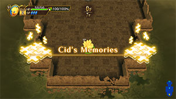
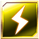

  

 

<table class="dungeonNext">
  <tr>
    <th>Previous</th>
    <td><a href="/chocobo-3/story-dungeons/mayor-gale's-memories">Mayor Gale's Memories</a></td>
    <th>Next</th>
    <td><a href="/chocobo-3/story-dungeons/freja's-memories">Freja's Memories</a></td>
  </tr>
</table>

# Overview

<table class="dungeonOverview">
  <tr>
    <th>Unlock</th>
    <td class="highlightYellow">Clear Mayor Gale's Memories (Chapter 1).</td>
  </tr>
  <tr>
    <th>Location</th>
    <td class="highlightYellow">Stella's House (Chapter 1).</td>
  </tr>
</table>

<table class="dungeonTable">
  <tr>
    <th>Title</th>
    <td colspan="3">-</td>
  </tr>
  <tr>
    <th>Description</th>
    <td colspan="3">Normal dungeon with no restrictions.</td>
  </tr>
  <tr>
    <th>Floors</th>
    <td>7F</td>
    <th>Bosses</th>
    <td>6F</td>
  </tr>
  <tr>
    <th>Change Crystals</th>
    <td>0F</td>
    <th>Checkpoints</th>
    <td>None</td>
  </tr>
  <tr>
    <th>Max Level</th>
    <td>-</td>
    <th>Bring Buddy</th>
    <td>Yes</td>
  </tr>
  <tr>
    <th>Bring In Items</th>
    <td>Yes</td>
    <th>Take Out Items</th>
    <td>Yes</td>
  </tr>
  <tr>
    <th>Shops/Duels</th>
    <td>No</td>
    <th>Den of Monsters</th>
    <td>No</td>
  </tr>
  <tr>
    <th>Reapers</th>
    <td>Yes</td>
    <th>Bookmark</th>
    <td>Yes</td>
  </tr>
  <tr>
    <th>Unidentified</th>
    <td colspan="3">None</td>
  </tr>
  <tr>
    <th>Rewards</th>
    <td colspan="3">1.  Cid's Memories (7F). 2.  Cid added to  Buddy Registry. 3. Dungeon added to  Mirror of Memory. 4. New item added to Noiroo's Bookstore. ・  Poison Book[1] - 300 gil. 5.  Harry's Hardware access. ・  Cloth Bag - 200 gil. 6. Can receive  Cid's Letter. 7. Can unlock  Freja's Memories. 8. Can unlock  A Maiden's Memories.</td>
  </tr>
</table>

# Strategy

[Content]

# Monsters

<ul><li><a href="#monster-table">Monster Table</a></li><li><a href="#monster-details">Monster Details</a></li></ul>

 

 Monster Table 

Monster Colors - Boss F - 　 means field of view is limited. R - 　 means  Reaper can spawn.

<table class="monsterTable">
  <thead>
    <tr>
      <th>F</th>
      <th colspan="4">Monsters</th>
      <th>R</th>
    </tr>
  </thead>
  <tbody>
    <tr class="changeCrystal">
      <td class="centeredText">0</td>
      <td colspan="4" class="centeredText">Change Crystal</td>
      <td></td>
    </tr>
    <tr>
      <td class="centeredText">1</td>
      <td> Steel Bat (40%)</td>
      <td> Ghost (20%)</td>
      <td> Goblin (40%)</td>
      <td class="highlightGray"></td>
      <td class="highlightReaper"></td>
    </tr>
    <tr>
      <td class="centeredText">2</td>
      <td> Steel Bat (40%)</td>
      <td> Ghost (20%)</td>
      <td> Goblin (40%)</td>
      <td class="highlightGray"></td>
      <td class="highlightReaper"></td>
    </tr>
    <tr>
      <td class="centeredText">3</td>
      <td> Steel Bat (20%)</td>
      <td> Ghost (20%)</td>
      <td> Goblin (30%)</td>
      <td> Mandra (30%)</td>
      <td class="highlightReaper"></td>
    </tr>
    <tr>
      <td class="centeredText">4</td>
      <td> Vulture (20%)</td>
      <td> Ghost (15%)</td>
      <td> Goblin (35%)</td>
      <td> Mandra (30%)</td>
      <td class="highlightReaper"></td>
    </tr>
    <tr>
      <td class="centeredText">5</td>
      <td> Vulture (20%)</td>
      <td> Ghost (15%)</td>
      <td> Goblin (35%)</td>
      <td> Mandra (30%)</td>
      <td class="highlightReaper"></td>
    </tr>
    <tr>
      <td class="centeredText">6</td>
      <td> Mandra Shade</td>
      <td class="highlightGray"></td>
      <td class="highlightGray"></td>
      <td class="highlightGray"></td>
      <td class="highlightGray"></td>
    </tr>
    <tr class="highlightYellow">
      <td class="centeredText">7</td>
      <td colspan="4" class="centeredText"> Cid's Memories</td>
      <td></td>
    </tr>
  </tbody>
</table>

 

 Monster Details 

Stat Colors - Hard Mode

### Standard

#### Steel Bat (1-3F)

<table class="buddyOverview">
  <tr class="noPad">
    <th colspan="13" class="highlightGreen">Stats</th>
  </tr>
  <tr>
    <td rowspan="4"></td>
    <td class="hp">HP</td>
    <td>22 / 28</td>
    <td class="atk">Attack</td>
    <td>5 / 8</td>
    <td class="mag">Magic</td>
    <td>18 / 19</td>
    <th>JP</th>
    <td>8 (40%)</td>
    <th>Item 1</th>
    <td colspan="3">Potion (8%)</td>
  </tr>
  <tr>
    <td class="sp">Exp</td>
    <td>19</td>
    <td class="def">Defense</td>
    <td>25 / 27</td>
    <td class="mnd">Mind</td>
    <td>39 / 40</td>
    <th>BP</th>
    <td>3 (50%)</td>
    <th>Item 2</th>
    <td colspan="3">Ether (8%)</td>
  </tr>
  <tr>
    <th>Hit</th>
    <td>95</td>
    <th>Evasion</th>
    <td>8</td>
    <th>Crit</th>
    <td>5</td>
    <th>Gil</th>
    <td>4 (10%)</td>
    <th>Steal</th>
    <td colspan="3">Warp Wings (30%)</td>
  </tr>
  <tr>
    <th>Lv</th>
    <td>2</td>
    <th>Special</th>
    <td></td>
    <th>Resist</th>
    <td colspan="3"></td>
    <th>Weak</th>
    <td colspan="3"></td>
  </tr>
  <tr>
    <th colspan="13" class="abilityName">Ultrasonic Wave</th>
  </tr>
  <tr class="elementIcon">
    <th>Element</th>
    <td>-</td>
    <th>Range</th>
    <td></td>
    <th>Notes</th>
    <td colspan="8" class="leftText">Deal damage to a target up to 2 tiles ahead.</td>
  </tr>
  <tr>
    <th>Rate / CD</th>
    <td colspan="2">20% / 6T</td>
    <th>Count</th>
    <td>∞</td>
    <th>Multiplier</th>
    <td>x1.0</td>
    <th>Value</th>
    <td>0</td>
    <th>Type</th>
    <td class="leftText">Magic</td>
    <th>Calc</th>
    <td class="leftText">Stat</td>
  </tr>
</table>

#### Ghost (1-5F)

<table class="buddyOverview">
  <tr class="noPad">
    <th colspan="13" class="highlightGreen">Stats</th>
  </tr>
  <tr>
    <td rowspan="4"></td>
    <td class="hp">HP</td>
    <td>22 / 28</td>
    <td class="atk">Attack</td>
    <td>5 / 8</td>
    <td class="mag">Magic</td>
    <td>26 / 27</td>
    <th>JP</th>
    <td>2 (40%)</td>
    <th>Item 1</th>
    <td colspan="3">Stinky Greens (14%)</td>
  </tr>
  <tr>
    <td class="sp">Exp</td>
    <td>19</td>
    <td class="def">Defense</td>
    <td>25 / 27</td>
    <td class="mnd">Mind</td>
    <td>39 / 40</td>
    <th>BP</th>
    <td>3 (50%)</td>
    <th>Item 2</th>
    <td colspan="3">Warp Wings (8%)</td>
  </tr>
  <tr>
    <th>Hit</th>
    <td>95</td>
    <th>Evasion</th>
    <td>8</td>
    <th>Crit</th>
    <td>5</td>
    <th>Gil</th>
    <td>-</td>
    <th>Steal</th>
    <td colspan="3">Stinky Greens (60%)</td>
  </tr>
  <tr>
    <th>Lv</th>
    <td>2</td>
    <th>Special</th>
    <td></td>
    <th>Resist</th>
    <td colspan="3"></td>
    <th>Weak</th>
    <td colspan="3"></td>
  </tr>
  <tr>
    <th colspan="13" class="abilityName">Hunger Strike</th>
  </tr>
  <tr class="elementIcon">
    <th>Element</th>
    <td>-</td>
    <th>Range</th>
    <td></td>
    <th>Notes</th>
    <td colspan="8" class="leftText">Lower Food Level by 10.</td>
  </tr>
  <tr>
    <th>Rate / CD</th>
    <td colspan="2">10% / 3T</td>
    <th>Count</th>
    <td>∞</td>
    <th>Multiplier</th>
    <td>x1.0</td>
    <th>Value</th>
    <td>10</td>
    <th>Type</th>
    <td class="leftText">Magic</td>
    <th>Calc</th>
    <td class="leftText">Fixed</td>
  </tr>
</table>

#### Goblin (1-5F)

<table class="buddyOverview">
  <tr class="noPad">
    <th colspan="13" class="highlightGreen">Stats</th>
  </tr>
  <tr>
    <td rowspan="4"></td>
    <td class="hp">HP</td>
    <td>42 / 55</td>
    <td class="atk">Attack</td>
    <td>8 / 10</td>
    <td class="mag">Magic</td>
    <td>10 / 11</td>
    <th>JP</th>
    <td>8 (40%)</td>
    <th>Item 1</th>
    <td colspan="3">Leather Talons (14%)</td>
  </tr>
  <tr>
    <td class="sp">Exp</td>
    <td>24</td>
    <td class="def">Defense</td>
    <td>32 / 34</td>
    <td class="mnd">Mind</td>
    <td>27 / 28</td>
    <th>BP</th>
    <td>3 (50%)</td>
    <th>Item 2</th>
    <td colspan="3">Leather Saddle (8%)</td>
  </tr>
  <tr>
    <th>Hit</th>
    <td>95</td>
    <th>Evasion</th>
    <td>4</td>
    <th>Crit</th>
    <td>20</td>
    <th>Gil</th>
    <td>6 (30%)</td>
    <th>Steal</th>
    <td colspan="3">Leather Talons (60%)</td>
  </tr>
  <tr>
    <th>Lv</th>
    <td>2</td>
    <th>Special</th>
    <td>-</td>
    <th>Resist</th>
    <td colspan="3"></td>
    <th>Weak</th>
    <td colspan="3"></td>
  </tr>
  <tr>
    <th colspan="13" class="abilityName">Goblin Punch</th>
  </tr>
  <tr class="elementIcon">
    <th>Element</th>
    <td>-</td>
    <th>Range</th>
    <td></td>
    <th>Notes</th>
    <td colspan="8" class="leftText">Deal damage to a target 1 tile ahead.</td>
  </tr>
  <tr>
    <th>Rate / CD</th>
    <td colspan="2">20% / 0T</td>
    <th>Count</th>
    <td>∞</td>
    <th>Multiplier</th>
    <td>x2.0</td>
    <th>Value</th>
    <td>0</td>
    <th>Type</th>
    <td class="leftText">Physical</td>
    <th>Calc</th>
    <td class="leftText">Stat</td>
  </tr>
</table>

#### Mandra (3-5F)

<table class="buddyOverview">
  <tr class="noPad">
    <th colspan="13" class="highlightGreen">Stats</th>
  </tr>
  <tr>
    <td rowspan="4"></td>
    <td class="hp">HP</td>
    <td>28 / 37</td>
    <td class="atk">Attack</td>
    <td>8 / 10</td>
    <td class="mag">Magic</td>
    <td>18 / 19</td>
    <th>JP</th>
    <td>8 (40%)</td>
    <th>Item 1</th>
    <td colspan="3">Potion (8%)</td>
  </tr>
  <tr>
    <td class="sp">Exp</td>
    <td>24</td>
    <td class="def">Defense</td>
    <td>32 / 34</td>
    <td class="mnd">Mind</td>
    <td>27 / 28</td>
    <th>BP</th>
    <td>3 (50%)</td>
    <th>Item 2</th>
    <td colspan="3">Ether (8%)</td>
  </tr>
  <tr>
    <th>Hit</th>
    <td>95</td>
    <th>Evasion</th>
    <td>2</td>
    <th>Crit</th>
    <td>5</td>
    <th>Gil</th>
    <td>6 (30%)</td>
    <th>Steal</th>
    <td colspan="3">Leather Saddle (60%)</td>
  </tr>
  <tr>
    <th>Lv</th>
    <td>2</td>
    <th>Special</th>
    <td>-</td>
    <th>Resist</th>
    <td colspan="3"></td>
    <th>Weak</th>
    <td colspan="3">-</td>
  </tr>
  <tr>
    <th colspan="13" class="abilityName">Seeds</th>
  </tr>
  <tr class="elementIcon">
    <th>Element</th>
    <td>-</td>
    <th>Range</th>
    <td></td>
    <th>Notes</th>
    <td colspan="8" class="leftText">Deal damage to a target up to 3 tiles ahead.</td>
  </tr>
  <tr>
    <th>Rate / CD</th>
    <td colspan="2">30% / 0T</td>
    <th>Count</th>
    <td>∞</td>
    <th>Multiplier</th>
    <td>x2.0</td>
    <th>Value</th>
    <td>0</td>
    <th>Type</th>
    <td class="leftText">Physical</td>
    <th>Calc</th>
    <td class="leftText">Stat</td>
  </tr>
</table>

#### Vulture (4-5F)

<table class="buddyOverview">
  <tr class="noPad">
    <th colspan="13" class="highlightGreen">Stats</th>
  </tr>
  <tr>
    <td rowspan="4"></td>
    <td class="hp">HP</td>
    <td>22 / 28</td>
    <td class="atk">Attack</td>
    <td>13 / 15</td>
    <td class="mag">Magic</td>
    <td>10 / 11</td>
    <th>JP</th>
    <td>8 (40%)</td>
    <th>Item 1</th>
    <td colspan="3">Warp Wings (8%)</td>
  </tr>
  <tr>
    <td class="sp">Exp</td>
    <td>24</td>
    <td class="def">Defense</td>
    <td>25 / 27</td>
    <td class="mnd">Mind</td>
    <td>27 / 28</td>
    <th>BP</th>
    <td>3 (50%)</td>
    <th>Item 2</th>
    <td colspan="3">Bejeweled Collar (8%)</td>
  </tr>
  <tr>
    <th>Hit</th>
    <td>85</td>
    <th>Evasion</th>
    <td>8</td>
    <th>Crit</th>
    <td>20</td>
    <th>Gil</th>
    <td>7 (10%)</td>
    <th>Steal</th>
    <td colspan="3">Warp Wings (30%)</td>
  </tr>
  <tr>
    <th>Lv</th>
    <td>2</td>
    <th>Special</th>
    <td></td>
    <th>Resist</th>
    <td colspan="3">-</td>
    <th>Weak</th>
    <td colspan="3"></td>
  </tr>
  <tr>
    <th colspan="13" class="abilityName">Gale</th>
  </tr>
  <tr class="elementIcon">
    <th>Element</th>
    <td></td>
    <th>Range</th>
    <td></td>
    <th>Notes</th>
    <td colspan="8" class="leftText">Deal wind damage to a target 1 tile ahead.</td>
  </tr>
  <tr>
    <th>Rate / CD</th>
    <td colspan="2">10% / 0T</td>
    <th>Count</th>
    <td>∞</td>
    <th>Multiplier</th>
    <td>x1.0</td>
    <th>Value</th>
    <td>0</td>
    <th>Type</th>
    <td class="leftText">Magic</td>
    <th>Calc</th>
    <td class="leftText">Stat</td>
  </tr>
</table>

### Boss

#### Mandra Shade (6F)

<table class="buddyOverview">
  <tr class="noPad">
    <th colspan="14" class="highlightBoss">Stats</th>
  </tr>
  <tr>
    <td rowspan="4"></td>
    <td class="hp">HP</td>
    <td>100 / 119</td>
    <td class="atk">Attack</td>
    <td>10 / 10</td>
    <td class="mag">Magic</td>
    <td>30 / 30</td>
    <th>JP</th>
    <td colspan="2">60 (100%)</td>
    <th>Item 1</th>
    <td colspan="5">Leather Talons (100%)</td>
  </tr>
  <tr>
    <td class="sp">Exp</td>
    <td>80</td>
    <td class="def">Defense</td>
    <td>50 / 50</td>
    <td class="mnd">Mind</td>
    <td>50 / 50</td>
    <th>BP</th>
    <td colspan="2">-</td>
    <th>Item 2</th>
    <td colspan="5">-</td>
  </tr>
  <tr>
    <th>Hit</th>
    <td>90</td>
    <th>Evasion</th>
    <td>10</td>
    <th>Crit</th>
    <td>10</td>
    <th>Gil</th>
    <td colspan="2">900 (100%)</td>
    <th>Steal</th>
    <td colspan="5">Leather Talons (100%)</td>
  </tr>
  <tr>
    <th>Lv</th>
    <td>6</td>
    <th>Special</th>
    <td>-</td>
    <th>Resist</th>
    <td colspan="4"></td>
    <th>Weak</th>
    <td colspan="5">-</td>
  </tr>
  <tr>
    <th colspan="14" class="statusResists">Status Resistances</th>
  </tr>
  <tr>
    <th></th>
    <th></th>
    <th></th>
    <th></th>
    <th></th>
    <th></th>
    <th></th>
    <th></th>
    <th></th>
    <th colspan="2">Knockback</th>
    <th>Stun</th>
    <th>Warp</th>
    <th>Ratio</th>
  </tr>
  <tr>
    <td>◯</td>
    <td>◯</td>
    <td>✕</td>
    <td>◯</td>
    <td>◯</td>
    <td>◯</td>
    <td>◯</td>
    <td>◯</td>
    <td>◯</td>
    <td colspan="2">◯</td>
    <td>◯</td>
    <td>◯</td>
    <td>◯</td>
  </tr>
  <tr>
    <th colspan="14" class="abilityName">Dreamy Flower</th>
  </tr>
  <tr class="elementIcon">
    <th>Element</th>
    <td>-</td>
    <th>Range</th>
    <td></td>
    <th>Notes</th>
    <td colspan="13" class="leftText">Inflict Sleep on targets in a 1 tile radius.</td>
  </tr>
  <tr>
    <th>Rate / CD</th>
    <td colspan="2">10% | 20% / 4T</td>
    <th>Count</th>
    <td>∞</td>
    <th>Multiplier</th>
    <td>x1.0</td>
    <th>Value</th>
    <td>0</td>
    <th>Type</th>
    <td colspan="2" class="leftText">Other</td>
    <th>Calc</th>
    <td class="leftText">None</td>
  </tr>
  <tr>
    <th colspan="14" class="abilityName">Seeds</th>
  </tr>
  <tr class="elementIcon">
    <th>Element</th>
    <td>-</td>
    <th>Range</th>
    <td></td>
    <th>Notes</th>
    <td colspan="13" class="leftText">Deal damage to a target up to 3 tiles ahead.</td>
  </tr>
  <tr>
    <th>Rate / CD</th>
    <td colspan="2">20% | 40% / 0T</td>
    <th>Count</th>
    <td>∞</td>
    <th>Multiplier</th>
    <td>x2.0</td>
    <th>Value</th>
    <td>0</td>
    <th>Type</th>
    <td colspan="2" class="leftText">Physical</td>
    <th>Calc</th>
    <td class="leftText">Stat</td>
  </tr>
</table>

# Items

 Floor 

See the dungeon data JSON file for exact item spawn rates per floor.

<table class="dungeonItemTable">
  <tr>
    <th colspan="3" class="highlightPurple"> Talons</th>
  </tr>
  <tr>
    <th>Item</th>
    <th>Floor</th>
    <th>Rate Range</th>
  </tr>
  <tr>
    <td>Rusty Talons</td>
    <td>1-5</td>
    <td>4.39%</td>
  </tr>
  <tr>
    <td>Leather Talons</td>
    <td>1-5</td>
    <td>8.77%</td>
  </tr>
  <tr>
    <th colspan="3" class="highlightPurple"> Saddles</th>
  </tr>
  <tr>
    <th>Item</th>
    <th>Floor</th>
    <th>Rate Range</th>
  </tr>
  <tr>
    <td>Rusty Saddle</td>
    <td>1-5</td>
    <td>4.39%</td>
  </tr>
  <tr>
    <td>Leather Saddle</td>
    <td>1-5</td>
    <td>8.77%</td>
  </tr>
  <tr>
    <th colspan="3" class="highlightPurple"> Collars</th>
  </tr>
  <tr>
    <th>Item</th>
    <th>Floor</th>
    <th>Rate Range</th>
  </tr>
  <tr>
    <td>Bejeweled Collar</td>
    <td>1-5</td>
    <td>4.39%</td>
  </tr>
  <tr>
    <th colspan="3" class="highlightPurple"> Greens</th>
  </tr>
  <tr>
    <th>Item</th>
    <th>Floor</th>
    <th>Rate Range</th>
  </tr>
  <tr>
    <td>Gysahl Greens</td>
    <td>1-5</td>
    <td>8.77%</td>
  </tr>
  <tr>
    <th colspan="3" class="highlightPurple"> Medicines</th>
  </tr>
  <tr>
    <th>Item</th>
    <th>Floor</th>
    <th>Rate Range</th>
  </tr>
  <tr>
    <td>Potion</td>
    <td>1-5</td>
    <td>13.16%</td>
  </tr>
  <tr>
    <td>Ether</td>
    <td>1-5</td>
    <td>13.16%</td>
  </tr>
  <tr>
    <td>Antidote</td>
    <td>1-5</td>
    <td>4.39%</td>
  </tr>
  <tr>
    <th colspan="3" class="highlightPurple"> Books</th>
  </tr>
  <tr>
    <th>Item</th>
    <th>Floor</th>
    <th>Rate Range</th>
  </tr>
  <tr>
    <td>Silence Book</td>
    <td>1-5</td>
    <td>8.77%</td>
  </tr>
  <tr>
    <td>Blind Book</td>
    <td>1-5</td>
    <td>8.77%</td>
  </tr>
  <tr>
    <td>Dispel Book</td>
    <td>1-5</td>
    <td>8.77%</td>
  </tr>
  <tr>
    <th colspan="3" class="highlightPurple"> Other</th>
  </tr>
  <tr>
    <th>Item</th>
    <th>Floor</th>
    <th>Rate Range</th>
  </tr>
  <tr>
    <td>Teleport Wings</td>
    <td>1-5</td>
    <td>2.19%</td>
  </tr>
  <tr>
    <td>Polishing Cream</td>
    <td>1-5</td>
    <td>1.32%</td>
  </tr>
</table>

 

 Drop / Steal 

Monster Colors - Boss

<table class="dungeonDropTable">
  <thead>
    <tr>
      <th>Floor</th>
      <th>Monster</th>
      <th>Drop 1</th>
      <th>Drop 2</th>
      <th>Steal</th>
    </tr>
  </thead>
  <tbody>
    <tr>
      <td>1-3</td>
      <td> Steel Bat</td>
      <td>Potion (8%)</td>
      <td>Ether (8%)</td>
      <td>Warp Wings (30%)</td>
    </tr>
    <tr>
      <td>1-5</td>
      <td> Ghost</td>
      <td>Stinky Greens (14%)</td>
      <td>Warp Wings (8%)</td>
      <td>Stinky Greens (60%)</td>
    </tr>
    <tr>
      <td>1-5</td>
      <td> Goblin</td>
      <td>Leather Talons (14%)</td>
      <td>Leather Saddle (8%)</td>
      <td>Leather Talons (60%)</td>
    </tr>
    <tr>
      <td>3-5</td>
      <td> Mandra</td>
      <td>Potion (8%)</td>
      <td>Ether (8%)</td>
      <td>Leather Saddle (60%)</td>
    </tr>
    <tr>
      <td>4-5</td>
      <td> Vulture</td>
      <td>Warp Wings (8%)</td>
      <td>Bejeweled Collar (8%)</td>
      <td>Warp Wings (30%)</td>
    </tr>
    <tr>
      <td>6</td>
      <td> Mandra Shade</td>
      <td>Leather Talons (100%)</td>
      <td>-</td>
      <td>Leather Talons (100%)</td>
    </tr>
  </tbody>
</table>
