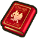

  

 

<table class="dungeonNext">
  <tr>
    <th>Previous</th>
    <td><a href="/chocobo-3/story-dungeons/cid's-memories">Cid's Memories</a></td>
    <th>Next</th>
    <td><a href="/chocobo-3/story-dungeons/guardian-of-the-flame">Guardian Of The Flame</a></td>
  </tr>
</table>

# Overview

<table class="dungeonOverview">
  <tr>
    <th>Unlock</th>
    <td class="highlightYellow">Clear Cid's Memories (Chapter 1).</td>
  </tr>
  <tr>
    <th>Location</th>
    <td class="highlightYellow">Freja's Forge (Chapter 2).</td>
  </tr>
</table>

<table class="dungeonTable">
  <tr>
    <th>Title</th>
    <td colspan="3">-</td>
  </tr>
  <tr>
    <th>Description</th>
    <td colspan="3">Normal dungeon with no restrictions.</td>
  </tr>
  <tr>
    <th>Floors</th>
    <td>9F</td>
    <th>Bosses</th>
    <td>8F</td>
  </tr>
  <tr>
    <th>Job Crystals</th>
    <td>0F</td>
    <th>Checkpoints</th>
    <td>None</td>
  </tr>
  <tr>
    <th>Max Level</th>
    <td>-</td>
    <th>Bring Buddy</th>
    <td>Yes</td>
  </tr>
  <tr>
    <th>Bring In Items</th>
    <td>Yes</td>
    <th>Take Out Items</th>
    <td>Yes</td>
  </tr>
  <tr>
    <th>Shops/Duels</th>
    <td>No</td>
    <th>Den of Monsters</th>
    <td>No</td>
  </tr>
  <tr>
    <th>Reapers</th>
    <td>Yes</td>
    <th>Bookmark</th>
    <td>Yes</td>
  </tr>
  <tr>
    <th>Unidentified</th>
    <td colspan="3">Equipment</td>
  </tr>
  <tr>
    <th>Rewards</th>
    <td colspan="3">1.  Freja's Memories (9F). 2.  Freja added to  Buddy Registry. 3. Dungeon added to  Mirror of Memory. 4.  Freja's Forge access. 5. Can receive  Freja's Letter. 6. Can unlock  Guardian of the Flame. 7. Can unlock  Pastor Roche's Memories. 8. Can unlock  Flora's Memories. 9. Can unlock  Marris's Memories.</td>
  </tr>
</table>

# Strategy

[Content]

# Monsters

<ul><li><a href="#monster-table">Monster Table</a></li><li><a href="#monster-details">Monster Details</a></li></ul>

 

 Monster Table 

Monster Colors - Boss F - 　 means field of view is limited. R - 　 means  Reaper can spawn.

<table class="monsterTable">
  <thead>
    <tr>
      <th>F</th>
      <th colspan="4">Monsters</th>
      <th>R</th>
    </tr>
  </thead>
  <tbody>
    <tr class="changeCrystal">
      <td class="centeredText">0</td>
      <td colspan="4" class="centeredText">Change Crystal</td>
      <td></td>
    </tr>
    <tr>
      <td class="centeredText">1</td>
      <td> Skeleton (50%)</td>
      <td> Mandra (40%)</td>
      <td> Bomb (10%)</td>
      <td class="highlightGray"></td>
      <td class="highlightReaper"></td>
    </tr>
    <tr>
      <td class="centeredText">2</td>
      <td> Skeleton (40%)</td>
      <td> Mandra (40%)</td>
      <td> Bomb (20%)</td>
      <td class="highlightGray"></td>
      <td class="highlightReaper"></td>
    </tr>
    <tr>
      <td class="centeredText highlightFog">3</td>
      <td> Skeleton (30%)</td>
      <td> Mandra (30%)</td>
      <td> Bomb (30%)</td>
      <td> Vulture (10%)</td>
      <td class="highlightReaper"></td>
    </tr>
    <tr>
      <td class="centeredText highlightFog">4</td>
      <td> Skeleton (20%)</td>
      <td> Mandra (30%)</td>
      <td> Bomb (30%)</td>
      <td> Vulture (20%)</td>
      <td class="highlightReaper"></td>
    </tr>
    <tr>
      <td class="centeredText highlightFog">5</td>
      <td> Tonberry (30%)</td>
      <td> Mandra (10%)</td>
      <td> Bomb (40%)</td>
      <td> Vulture (20%)</td>
      <td class="highlightReaper"></td>
    </tr>
    <tr>
      <td class="centeredText highlightFog">6</td>
      <td> Tonberry (30%)</td>
      <td> Cactuar (20%)</td>
      <td> Bomb (30%)</td>
      <td> Iron Giant (20%)</td>
      <td class="highlightReaper"></td>
    </tr>
    <tr>
      <td class="centeredText highlightFog">7</td>
      <td> Tonberry (20%)</td>
      <td> Cactuar (20%)</td>
      <td> Bomb (30%)</td>
      <td> Iron Giant (30%)</td>
      <td class="highlightReaper"></td>
    </tr>
    <tr>
      <td class="centeredText">8</td>
      <td> Skeleton Shade</td>
      <td class="highlightGray"></td>
      <td class="highlightGray"></td>
      <td class="highlightGray"></td>
      <td class="highlightGray"></td>
    </tr>
    <tr class="highlightYellow">
      <td class="centeredText">9</td>
      <td colspan="4" class="centeredText"> Freja's Memories</td>
      <td></td>
    </tr>
  </tbody>
</table>

 

 Monster Details 

Stat Colors - Hard Mode

### Standard

#### Skeleton (1-4F)

<table class="buddyOverview">
  <tr class="noPad">
    <th colspan="13" class="highlightGreen">Stats</th>
  </tr>
  <tr>
    <td rowspan="4"></td>
    <td class="hp">HP</td>
    <td>24 / 31</td>
    <td class="atk">Attack</td>
    <td>10 / 12</td>
    <td class="mag">Magic</td>
    <td>27 / 28</td>
    <th>JP</th>
    <td>2 (40%)</td>
    <th>Item 1</th>
    <td colspan="3">Antidote (8%)</td>
  </tr>
  <tr>
    <td class="sp">Exp</td>
    <td>40</td>
    <td class="def">Defense</td>
    <td>42 / 43</td>
    <td class="mnd">Mind</td>
    <td>20 / 21</td>
    <th>BP</th>
    <td>3 (50%)</td>
    <th>Item 2</th>
    <td colspan="3">Bejeweled Collar (8%)</td>
  </tr>
  <tr>
    <th>Hit</th>
    <td>95</td>
    <th>Evasion</th>
    <td>4</td>
    <th>Crit</th>
    <td>5</td>
    <th>Gil</th>
    <td>-</td>
    <th>Steal</th>
    <td colspan="3">Antidote (60%)</td>
  </tr>
  <tr>
    <th>Lv</th>
    <td>3</td>
    <th>Special</th>
    <td></td>
    <th>Resist</th>
    <td colspan="3"></td>
    <th>Weak</th>
    <td colspan="3"></td>
  </tr>
  <tr>
    <th colspan="13" class="abilityName">Poison Slash</th>
  </tr>
  <tr class="elementIcon">
    <th>Element</th>
    <td>-</td>
    <th>Range</th>
    <td></td>
    <th>Notes</th>
    <td colspan="8" class="leftText">Deal damage + Poison to a target 1 tile ahead.</td>
  </tr>
  <tr>
    <th>Rate / CD</th>
    <td colspan="2">20% / 3T</td>
    <th>Count</th>
    <td>∞</td>
    <th>Multiplier</th>
    <td>x1.0</td>
    <th>Value</th>
    <td>0</td>
    <th>Type</th>
    <td class="leftText">Physical</td>
    <th>Calc</th>
    <td class="leftText">Stat</td>
  </tr>
</table>

#### Mandra (1-5F)

<table class="buddyOverview">
  <tr class="noPad">
    <th colspan="13" class="highlightGreen">Stats</th>
  </tr>
  <tr>
    <td rowspan="4"></td>
    <td class="hp">HP</td>
    <td>31 / 40</td>
    <td class="atk">Attack</td>
    <td>10 / 12</td>
    <td class="mag">Magic</td>
    <td>19 / 20</td>
    <th>JP</th>
    <td>10 (40%)</td>
    <th>Item 1</th>
    <td colspan="3">Gysahl Greens (14%)</td>
  </tr>
  <tr>
    <td class="sp">Exp</td>
    <td>40</td>
    <td class="def">Defense</td>
    <td>34 / 35</td>
    <td class="mnd">Mind</td>
    <td>28 / 29</td>
    <th>BP</th>
    <td>3 (50%)</td>
    <th>Item 2</th>
    <td colspan="3">Large Gysahl Greens (8%)</td>
  </tr>
  <tr>
    <th>Hit</th>
    <td>95</td>
    <th>Evasion</th>
    <td>2</td>
    <th>Crit</th>
    <td>5</td>
    <th>Gil</th>
    <td>8 (10%)</td>
    <th>Steal</th>
    <td colspan="3">Large Gysahl Greens (60%)</td>
  </tr>
  <tr>
    <th>Lv</th>
    <td>3</td>
    <th>Special</th>
    <td>-</td>
    <th>Resist</th>
    <td colspan="3"></td>
    <th>Weak</th>
    <td colspan="3">-</td>
  </tr>
  <tr>
    <th colspan="13" class="abilityName">Seeds</th>
  </tr>
  <tr class="elementIcon">
    <th>Element</th>
    <td>-</td>
    <th>Range</th>
    <td></td>
    <th>Notes</th>
    <td colspan="8" class="leftText">Deal damage to a target up to 3 tiles ahead.</td>
  </tr>
  <tr>
    <th>Rate / CD</th>
    <td colspan="2">30% / 0T</td>
    <th>Count</th>
    <td>∞</td>
    <th>Multiplier</th>
    <td>x2.0</td>
    <th>Value</th>
    <td>0</td>
    <th>Type</th>
    <td class="leftText">Physical</td>
    <th>Calc</th>
    <td class="leftText">Stat</td>
  </tr>
</table>

#### Bomb (1-7F)

<table class="buddyOverview">
  <tr class="noPad">
    <th colspan="13" class="highlightGreen">Stats</th>
  </tr>
  <tr>
    <td rowspan="4"></td>
    <td class="hp">HP</td>
    <td>46 / 61</td>
    <td class="atk">Attack</td>
    <td>8 / 10</td>
    <td class="mag">Magic</td>
    <td>19 / 20</td>
    <th>JP</th>
    <td>10 (40%)</td>
    <th>Item 1</th>
    <td colspan="3">Fire Talons (8%)</td>
  </tr>
  <tr>
    <td class="sp">Exp</td>
    <td>40</td>
    <td class="def">Defense</td>
    <td>27 / 28</td>
    <td class="mnd">Mind</td>
    <td>28 / 29</td>
    <th>BP</th>
    <td>3 (50%)</td>
    <th>Item 2</th>
    <td colspan="3">Bomb Shard (2%)</td>
  </tr>
  <tr>
    <th>Hit</th>
    <td>95</td>
    <th>Evasion</th>
    <td>4</td>
    <th>Crit</th>
    <td>5</td>
    <th>Gil</th>
    <td>8 (10%)</td>
    <th>Steal</th>
    <td colspan="3">Bomb Shard (30%)</td>
  </tr>
  <tr>
    <th>Lv</th>
    <td>3</td>
    <th>Special</th>
    <td></td>
    <th>Resist</th>
    <td colspan="3"></td>
    <th>Weak</th>
    <td colspan="3"></td>
  </tr>
  <tr>
    <th colspan="13" class="abilityName">Self-Destruct</th>
  </tr>
  <tr class="elementIcon">
    <th>Element</th>
    <td></td>
    <th>Range</th>
    <td></td>
    <th>Notes</th>
    <td colspan="8" class="leftText">Halve the HP of targets in a 3 tile radius, then collapse.</td>
  </tr>
  <tr>
    <th>Rate / CD</th>
    <td colspan="2">10% / 0T</td>
    <th>Count</th>
    <td>1</td>
    <th>Multiplier</th>
    <td>x1.0</td>
    <th>Value</th>
    <td>50</td>
    <th>Type</th>
    <td class="leftText">Magic</td>
    <th>Calc</th>
    <td class="leftText">Ratio</td>
  </tr>
  <tr>
    <th colspan="13" class="abilityName">Silence</th>
  </tr>
  <tr class="elementIcon">
    <th>Element</th>
    <td>-</td>
    <th>Range</th>
    <td></td>
    <th>Notes</th>
    <td colspan="8" class="leftText">Inflict Silence on a target up to 3 tiles ahead.</td>
  </tr>
  <tr>
    <th>Rate / CD</th>
    <td colspan="2">10% / 6T</td>
    <th>Count</th>
    <td>∞</td>
    <th>Multiplier</th>
    <td>x1.0</td>
    <th>Value</th>
    <td>0</td>
    <th>Type</th>
    <td class="leftText">Other</td>
    <th>Calc</th>
    <td class="leftText">None</td>
  </tr>
</table>

#### Vulture (3-5F)

<table class="buddyOverview">
  <tr class="noPad">
    <th colspan="13" class="highlightGreen">Stats</th>
  </tr>
  <tr>
    <td rowspan="4"></td>
    <td class="hp">HP</td>
    <td>24 / 31</td>
    <td class="atk">Attack</td>
    <td>15 / 17</td>
    <td class="mag">Magic</td>
    <td>11 / 12</td>
    <th>JP</th>
    <td>10 (40%)</td>
    <th>Item 1</th>
    <td colspan="3">Warp Wings (8%)</td>
  </tr>
  <tr>
    <td class="sp">Exp</td>
    <td>40</td>
    <td class="def">Defense</td>
    <td>27 / 28</td>
    <td class="mnd">Mind</td>
    <td>28 / 29</td>
    <th>BP</th>
    <td>3 (50%)</td>
    <th>Item 2</th>
    <td colspan="3">Bejeweled Collar (8%)</td>
  </tr>
  <tr>
    <th>Hit</th>
    <td>85</td>
    <th>Evasion</th>
    <td>8</td>
    <th>Crit</th>
    <td>20</td>
    <th>Gil</th>
    <td>9 (10%)</td>
    <th>Steal</th>
    <td colspan="3">Warp Wings (30%)</td>
  </tr>
  <tr>
    <th>Lv</th>
    <td>3</td>
    <th>Special</th>
    <td></td>
    <th>Resist</th>
    <td colspan="3">-</td>
    <th>Weak</th>
    <td colspan="3"></td>
  </tr>
  <tr>
    <th colspan="13" class="abilityName">Wing Flap</th>
  </tr>
  <tr class="elementIcon">
    <th>Element</th>
    <td>-</td>
    <th>Range</th>
    <td></td>
    <th>Notes</th>
    <td colspan="8" class="leftText">Temporarily cast Haste.</td>
  </tr>
  <tr>
    <th>Rate / CD</th>
    <td colspan="2">20% / 30T</td>
    <th>Count</th>
    <td>∞</td>
    <th>Multiplier</th>
    <td>x1.0</td>
    <th>Value</th>
    <td>0</td>
    <th>Type</th>
    <td class="leftText">Other</td>
    <th>Calc</th>
    <td class="leftText">None</td>
  </tr>
  <tr>
    <th colspan="13" class="abilityName">Gale</th>
  </tr>
  <tr class="elementIcon">
    <th>Element</th>
    <td></td>
    <th>Range</th>
    <td></td>
    <th>Notes</th>
    <td colspan="8" class="leftText">Deal wind damage to a target 1 tile ahead.</td>
  </tr>
  <tr>
    <th>Rate / CD</th>
    <td colspan="2">20% / 0T</td>
    <th>Count</th>
    <td>∞</td>
    <th>Multiplier</th>
    <td>x1.0</td>
    <th>Value</th>
    <td>0</td>
    <th>Type</th>
    <td class="leftText">Magic</td>
    <th>Calc</th>
    <td class="leftText">Stat</td>
  </tr>
</table>

#### Tonberry (5-7F)

<table class="buddyOverview">
  <tr class="noPad">
    <th colspan="13" class="highlightGreen">Stats</th>
  </tr>
  <tr>
    <td rowspan="4"></td>
    <td class="hp">HP</td>
    <td>24 / 31</td>
    <td class="atk">Attack</td>
    <td>10 / 12</td>
    <td class="mag">Magic</td>
    <td>27 / 28</td>
    <th>JP</th>
    <td>18 (40%)</td>
    <th>Item 1</th>
    <td colspan="3">Potion (14%)</td>
  </tr>
  <tr>
    <td class="sp">Exp</td>
    <td>48</td>
    <td class="def">Defense</td>
    <td>27 / 28</td>
    <td class="mnd">Mind</td>
    <td>999 / 999</td>
    <th>BP</th>
    <td>3 (50%)</td>
    <th>Item 2</th>
    <td colspan="3">Ether (8%)</td>
  </tr>
  <tr>
    <th>Hit</th>
    <td>95</td>
    <th>Evasion</th>
    <td>8</td>
    <th>Crit</th>
    <td>100</td>
    <th>Gil</th>
    <td>9 (30%)</td>
    <th>Steal</th>
    <td colspan="3">Fire Talons (60%)</td>
  </tr>
  <tr>
    <th>Lv</th>
    <td>3</td>
    <th>Special</th>
    <td></td>
    <th>Resist</th>
    <td colspan="3"></td>
    <th>Weak</th>
    <td colspan="3">-</td>
  </tr>
  <tr>
    <th colspan="13" class="abilityName">Knife</th>
  </tr>
  <tr class="elementIcon">
    <th>Element</th>
    <td>-</td>
    <th>Range</th>
    <td></td>
    <th>Notes</th>
    <td colspan="8" class="leftText">Halve the HP of a target 1 tile ahead.</td>
  </tr>
  <tr>
    <th>Rate / CD</th>
    <td colspan="2">10% / 6T</td>
    <th>Count</th>
    <td>∞</td>
    <th>Multiplier</th>
    <td>x1.0</td>
    <th>Value</th>
    <td>50</td>
    <th>Type</th>
    <td class="leftText">Physical</td>
    <th>Calc</th>
    <td class="leftText">Ratio</td>
  </tr>
  <tr>
    <th colspan="13" class="abilityName">Slow</th>
  </tr>
  <tr class="elementIcon">
    <th>Element</th>
    <td>-</td>
    <th>Range</th>
    <td></td>
    <th>Notes</th>
    <td colspan="8" class="leftText">Inflict Slow on a target up to 2 tiles ahead.</td>
  </tr>
  <tr>
    <th>Rate / CD</th>
    <td colspan="2">5% / 6T</td>
    <th>Count</th>
    <td>∞</td>
    <th>Multiplier</th>
    <td>x1.0</td>
    <th>Value</th>
    <td>0</td>
    <th>Type</th>
    <td class="leftText">Other</td>
    <th>Calc</th>
    <td class="leftText">None</td>
  </tr>
</table>

#### Cactuar (6-7F)

<table class="buddyOverview">
  <tr class="noPad">
    <th colspan="13" class="highlightGreen">Stats</th>
  </tr>
  <tr>
    <td rowspan="4"></td>
    <td class="hp">HP</td>
    <td>31 / 40</td>
    <td class="atk">Attack</td>
    <td>15 / 17</td>
    <td class="mag">Magic</td>
    <td>11 / 12</td>
    <th>JP</th>
    <td>18 (40%)</td>
    <th>Item 1</th>
    <td colspan="3">-</td>
  </tr>
  <tr>
    <td class="sp">Exp</td>
    <td>48</td>
    <td class="def">Defense</td>
    <td>34 / 35</td>
    <td class="mnd">Mind</td>
    <td>40 / 41</td>
    <th>BP</th>
    <td>3 (50%)</td>
    <th>Item 2</th>
    <td colspan="3">-</td>
  </tr>
  <tr>
    <th>Hit</th>
    <td>95</td>
    <th>Evasion</th>
    <td>8</td>
    <th>Crit</th>
    <td>5</td>
    <th>Gil</th>
    <td>9 (30%)</td>
    <th>Steal</th>
    <td colspan="3">Bejeweled Collar (60%)</td>
  </tr>
  <tr>
    <th>Lv</th>
    <td>3</td>
    <th>Special</th>
    <td>-</td>
    <th>Resist</th>
    <td colspan="3"></td>
    <th>Weak</th>
    <td colspan="3"></td>
  </tr>
  <tr>
    <th colspan="13" class="abilityName">Gil Toss</th>
  </tr>
  <tr class="elementIcon">
    <th>Element</th>
    <td>-</td>
    <th>Range</th>
    <td></td>
    <th>Notes</th>
    <td colspan="8" class="leftText">Deal damage to a target up to 3 tiles ahead.</td>
  </tr>
  <tr>
    <th>Rate / CD</th>
    <td colspan="2">30% / 0T</td>
    <th>Count</th>
    <td>∞</td>
    <th>Multiplier</th>
    <td>x2.0</td>
    <th>Value</th>
    <td>0</td>
    <th>Type</th>
    <td class="leftText">Physical</td>
    <th>Calc</th>
    <td class="leftText">Stat</td>
  </tr>
  <tr>
    <th colspan="13" class="abilityName">Erase</th>
  </tr>
  <tr class="elementIcon">
    <th>Element</th>
    <td>-</td>
    <th>Range</th>
    <td></td>
    <th>Notes</th>
    <td colspan="8" class="leftText">Wipe player buffs of a target up to 3 tiles ahead.</td>
  </tr>
  <tr>
    <th>Rate / CD</th>
    <td colspan="2">10% / 6T</td>
    <th>Count</th>
    <td>∞</td>
    <th>Multiplier</th>
    <td>x1.0</td>
    <th>Value</th>
    <td>0</td>
    <th>Type</th>
    <td class="leftText">Other</td>
    <th>Calc</th>
    <td class="leftText">None</td>
  </tr>
</table>

#### Iron Giant (6-7F)

<table class="buddyOverview">
  <tr class="noPad">
    <th colspan="13" class="highlightGreen">Stats</th>
  </tr>
  <tr>
    <td rowspan="4"></td>
    <td class="hp">HP</td>
    <td>46 / 61</td>
    <td class="atk">Attack</td>
    <td>15 / 17</td>
    <td class="mag">Magic</td>
    <td>11 / 12</td>
    <th>JP</th>
    <td>10 (40%)</td>
    <th>Item 1</th>
    <td colspan="3">Potion (30%)</td>
  </tr>
  <tr>
    <td class="sp">Exp</td>
    <td>48</td>
    <td class="def">Defense</td>
    <td>34 / 35</td>
    <td class="mnd">Mind</td>
    <td>20 / 21</td>
    <th>BP</th>
    <td>3 (50%)</td>
    <th>Item 2</th>
    <td colspan="3">Fire Saddle (8%)</td>
  </tr>
  <tr>
    <th>Hit</th>
    <td>85</td>
    <th>Evasion</th>
    <td>2</td>
    <th>Crit</th>
    <td>5</td>
    <th>Gil</th>
    <td>9 (30%)</td>
    <th>Steal</th>
    <td colspan="3">Potion (60%)</td>
  </tr>
  <tr>
    <th>Lv</th>
    <td>3</td>
    <th>Special</th>
    <td></td>
    <th>Resist</th>
    <td colspan="3">-</td>
    <th>Weak</th>
    <td colspan="3"></td>
  </tr>
  <tr>
    <th colspan="13" class="abilityName">Battle Cry</th>
  </tr>
  <tr class="elementIcon">
    <th>Element</th>
    <td>-</td>
    <th>Range</th>
    <td></td>
    <th>Notes</th>
    <td colspan="8" class="leftText">Temporarily cast Bravery.</td>
  </tr>
  <tr>
    <th>Rate / CD</th>
    <td colspan="2">5% / 30T</td>
    <th>Count</th>
    <td>∞</td>
    <th>Multiplier</th>
    <td>x1.0</td>
    <th>Value</th>
    <td>0</td>
    <th>Type</th>
    <td class="leftText">Other</td>
    <th>Calc</th>
    <td class="leftText">None</td>
  </tr>
</table>

### Boss

#### Skeleton Shade (8F)

<table class="buddyOverview">
  <tr class="noPad">
    <th colspan="14" class="highlightBoss">Stats</th>
  </tr>
  <tr>
    <td rowspan="4"></td>
    <td class="hp">HP</td>
    <td>180 / 215</td>
    <td class="atk">Attack</td>
    <td>25 / 25</td>
    <td class="mag">Magic</td>
    <td>20 / 20</td>
    <th>JP</th>
    <td colspan="2">90 (100%)</td>
    <th>Item 1</th>
    <td colspan="5">Fire Talons (50%)</td>
  </tr>
  <tr>
    <td class="sp">Exp</td>
    <td>90</td>
    <td class="def">Defense</td>
    <td>50 / 50</td>
    <td class="mnd">Mind</td>
    <td>40 / 40</td>
    <th>BP</th>
    <td colspan="2">-</td>
    <th>Item 2</th>
    <td colspan="5">Fire Saddle (50%)</td>
  </tr>
  <tr>
    <th>Hit</th>
    <td>90</td>
    <th>Evasion</th>
    <td>0</td>
    <th>Crit</th>
    <td>0</td>
    <th>Gil</th>
    <td colspan="2">1000 (100%)</td>
    <th>Steal</th>
    <td colspan="5">Fire Saddle (100%)</td>
  </tr>
  <tr>
    <th>Lv</th>
    <td>8</td>
    <th>Special</th>
    <td></td>
    <th>Resist</th>
    <td colspan="4"></td>
    <th>Weak</th>
    <td colspan="5"></td>
  </tr>
  <tr>
    <th colspan="14" class="statusResists">Status Resistances</th>
  </tr>
  <tr>
    <th></th>
    <th></th>
    <th></th>
    <th></th>
    <th></th>
    <th></th>
    <th></th>
    <th></th>
    <th></th>
    <th colspan="2">Knockback</th>
    <th>Stun</th>
    <th>Warp</th>
    <th>Ratio</th>
  </tr>
  <tr>
    <td>◯</td>
    <td>◯</td>
    <td>✕</td>
    <td>◯</td>
    <td>◯</td>
    <td>◯</td>
    <td>◯</td>
    <td>◯</td>
    <td>◯</td>
    <td colspan="2">◯</td>
    <td>◯</td>
    <td>◯</td>
    <td>◯</td>
  </tr>
  <tr>
    <th colspan="14" class="abilityName">Poison Slash</th>
  </tr>
  <tr class="elementIcon">
    <th>Element</th>
    <td>-</td>
    <th>Range</th>
    <td></td>
    <th>Notes</th>
    <td colspan="13" class="leftText">Deal damage + Poison to a target 1 tile ahead.</td>
  </tr>
  <tr>
    <th>Rate / CD</th>
    <td colspan="2">10% | 30% / 3T</td>
    <th>Count</th>
    <td>∞</td>
    <th>Multiplier</th>
    <td>x1.0</td>
    <th>Value</th>
    <td>0</td>
    <th>Type</th>
    <td colspan="2" class="leftText">Physical</td>
    <th>Calc</th>
    <td class="leftText">Stat</td>
  </tr>
  <tr>
    <th colspan="14" class="abilityName">Shell</th>
  </tr>
  <tr class="elementIcon">
    <th>Element</th>
    <td>-</td>
    <th>Range</th>
    <td></td>
    <th>Notes</th>
    <td colspan="13" class="leftText">Temporarily cast Shell on self or a target up to 2 tiles ahead.</td>
  </tr>
  <tr>
    <th>Rate / CD</th>
    <td colspan="2">20% | 10% / 6T</td>
    <th>Count</th>
    <td>∞</td>
    <th>Multiplier</th>
    <td>x1.0</td>
    <th>Value</th>
    <td>0</td>
    <th>Type</th>
    <td colspan="2" class="leftText">Other</td>
    <th>Calc</th>
    <td class="leftText">None</td>
  </tr>
</table>

# Items

 Floor 

See the dungeon data JSON file for exact item spawn rates per floor.

<table class="dungeonItemTable">
  <tr>
    <th colspan="3" class="highlightPurple"> Talons</th>
  </tr>
  <tr>
    <th>Item</th>
    <th>Floor</th>
    <th>Rate Range</th>
  </tr>
  <tr>
    <td>Leather Talons</td>
    <td>1-7</td>
    <td>3.73%</td>
  </tr>
  <tr>
    <td>Fire Talons</td>
    <td>1-7</td>
    <td>7.46%</td>
  </tr>
  <tr>
    <th colspan="3" class="highlightPurple"> Saddles</th>
  </tr>
  <tr>
    <th>Item</th>
    <th>Floor</th>
    <th>Rate Range</th>
  </tr>
  <tr>
    <td>Leather Saddle</td>
    <td>1-7</td>
    <td>3.73%</td>
  </tr>
  <tr>
    <td>Fire Saddle</td>
    <td>1-7</td>
    <td>7.46%</td>
  </tr>
  <tr>
    <th colspan="3" class="highlightPurple"> Collars</th>
  </tr>
  <tr>
    <th>Item</th>
    <th>Floor</th>
    <th>Rate Range</th>
  </tr>
  <tr>
    <td>Bejeweled Collar</td>
    <td>1-7</td>
    <td>3.73%</td>
  </tr>
  <tr>
    <td>Memory Collar</td>
    <td>1-7</td>
    <td>3.73%</td>
  </tr>
  <tr>
    <th colspan="3" class="highlightPurple"> Greens</th>
  </tr>
  <tr>
    <th>Item</th>
    <th>Floor</th>
    <th>Rate Range</th>
  </tr>
  <tr>
    <td>Gysahl Greens</td>
    <td>1-7</td>
    <td>7.46%</td>
  </tr>
  <tr>
    <th colspan="3" class="highlightPurple"> Medicines</th>
  </tr>
  <tr>
    <th>Item</th>
    <th>Floor</th>
    <th>Rate Range</th>
  </tr>
  <tr>
    <td>Potion</td>
    <td>1-7</td>
    <td>11.19%</td>
  </tr>
  <tr>
    <td>Ether</td>
    <td>1-7</td>
    <td>11.19%</td>
  </tr>
  <tr>
    <td>Antidote</td>
    <td>1-7</td>
    <td>3.73%</td>
  </tr>
  <tr>
    <th colspan="3" class="highlightPurple"> Books</th>
  </tr>
  <tr>
    <th>Item</th>
    <th>Floor</th>
    <th>Rate Range</th>
  </tr>
  <tr>
    <td>Silence Book</td>
    <td>1-7</td>
    <td>7.46%</td>
  </tr>
  <tr>
    <td>Blind Book</td>
    <td>1-7</td>
    <td>7.46%</td>
  </tr>
  <tr>
    <td>Dispel Book</td>
    <td>1-7</td>
    <td>7.46%</td>
  </tr>
  <tr>
    <th colspan="3" class="highlightPurple"> Other</th>
  </tr>
  <tr>
    <th>Item</th>
    <th>Floor</th>
    <th>Rate Range</th>
  </tr>
  <tr>
    <td>Appraisal Glasses</td>
    <td>1-7</td>
    <td>11.19%</td>
  </tr>
  <tr>
    <td>Teleport Wings</td>
    <td>1-7</td>
    <td>1.87%</td>
  </tr>
  <tr>
    <td>Polishing Cream</td>
    <td>1-7</td>
    <td>1.12%</td>
  </tr>
</table>

 

 Drop / Steal 

Monster Colors - Boss

<table class="dungeonDropTable">
  <thead>
    <tr>
      <th>Floor</th>
      <th>Monster</th>
      <th>Drop 1</th>
      <th>Drop 2</th>
      <th>Steal</th>
    </tr>
  </thead>
  <tbody>
    <tr>
      <td>1-4</td>
      <td> Skeleton</td>
      <td>Antidote (8%)</td>
      <td>Bejeweled Collar (8%)</td>
      <td>Antidote (60%)</td>
    </tr>
    <tr>
      <td>1-5</td>
      <td> Mandra</td>
      <td>Gysahl Greens (14%)</td>
      <td>Large Gysahl Greens (8%)</td>
      <td>Large Gysahl Greens (60%)</td>
    </tr>
    <tr>
      <td>1-7</td>
      <td> Bomb</td>
      <td>Fire Talons (8%)</td>
      <td>Bomb Shard (2%)</td>
      <td>Bomb Shard (30%)</td>
    </tr>
    <tr>
      <td>3-5</td>
      <td> Vulture</td>
      <td>Warp Wings (8%)</td>
      <td>Bejeweled Collar (8%)</td>
      <td>Warp Wings (30%)</td>
    </tr>
    <tr>
      <td>5-7</td>
      <td> Tonberry</td>
      <td>Potion (14%)</td>
      <td>Ether (8%)</td>
      <td>Fire Talons (60%)</td>
    </tr>
    <tr>
      <td>6-7</td>
      <td> Cactuar</td>
      <td>-</td>
      <td>-</td>
      <td>Bejeweled Collar (60%)</td>
    </tr>
    <tr>
      <td>6-7</td>
      <td> Iron Giant</td>
      <td>Potion (30%)</td>
      <td>Fire Saddle (8%)</td>
      <td>Potion (60%)</td>
    </tr>
    <tr>
      <td>8</td>
      <td> Skeleton Shade</td>
      <td>Fire Talons (50%)</td>
      <td>Fire Saddle (50%)</td>
      <td>Fire Saddle (100%)</td>
    </tr>
  </tbody>
</table>
