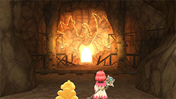
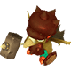
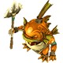
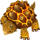
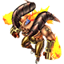

  

# Overview

<table class="dungeonOverview">
  <tr>
    <th>Unlock</th>
    <td class="highlightYellow">Clear Freja's Memories (Chapter 2).</td>
  </tr>
  <tr>
    <th>Location</th>
    <td class="highlightYellow">Fuego Mines (Chapter 2).</td>
  </tr>
</table>

<table class="dungeonTable">
  <tr>
    <th>Title</th>
    <td colspan="3">-</td>
  </tr>
  <tr>
    <th>Description</th>
    <td colspan="3">Normal dungeon with no restrictions.</td>
  </tr>
  <tr>
    <th>Floors</th>
    <td>22F</td>
    <th>Bosses</th>
    <td>22F</td>
  </tr>
  <tr>
    <th>Change Crystals</th>
    <td>0F, 21F</td>
    <th>Checkpoints</th>
    <td>10F</td>
  </tr>
  <tr>
    <th>Max Level</th>
    <td>-</td>
    <th>Bring Buddy</th>
    <td>Yes</td>
  </tr>
  <tr>
    <th>Bring In Items</th>
    <td>Yes</td>
    <th>Take Out Items</th>
    <td>Yes</td>
  </tr>
  <tr>
    <th>Shops/Duels</th>
    <td>Yes</td>
    <th>Den of Monsters</th>
    <td>No</td>
  </tr>
  <tr>
    <th>Reapers</th>
    <td>Yes</td>
    <th>Bookmark</th>
    <td>Yes</td>
  </tr>
  <tr>
    <th>Unidentified</th>
    <td colspan="3">Equipment, Consumables</td>
  </tr>
  <tr>
    <th>Rewards</th>
    <td colspan="3">1.  Black Mage's Memories (10F). 2. Can unlock  Another White Mage's Memories. ・ After reaching 10F and checking the door. 3.  Fire Apple (21F). ・ Chocobo's  Max SP 3 → 4. 4. Dungeon added to  Mirror of Memory. 5. Can unlock  Meja's Memories. 6. Can unlock  Stella's Memories. 7. Can unlock  Harry's Memories. 8. Can unlock  The Genius Inventor's Memories. ・ Must also clear Another White Mage's Memories.</td>
  </tr>
</table>

# Strategy

[Content]

# Monsters

<ul><li><a href="#monster-table">Monster Table</a></li><li><a href="#duel-table">Duel Table</a></li><li><a href="#monster-details">Monster Details</a></li></ul>

 

 Monster Table 

Monster Colors - Boss F - 　 means field of view is limited, N means it's a checkpoint floor. S - 　 means a Shop Trap can appear. D - 　 means a Duel Trap can appear. R - 　 means  Reaper can spawn.

<table class="monsterTable">
  <thead>
    <tr>
      <th>F</th>
      <th>S</th>
      <th>D</th>
      <th colspan="5">Monsters</th>
      <th>R</th>
    </tr>
  </thead>
  <tbody>
    <tr class="changeCrystal">
      <td class="centeredText">0</td>
      <td></td>
      <td></td>
      <td colspan="5" class="centeredText">Change Crystal</td>
      <td></td>
    </tr>
    <tr>
      <td class="centeredText highlightFog">1</td>
      <td class="highlightGray"></td>
      <td class="highlightGray"></td>
      <td> Werebat (40%)</td>
      <td> Goblin (30%)</td>
      <td> Red Marshmallow (30%)</td>
      <td class="highlightGray"></td>
      <td class="highlightGray"></td>
      <td class="highlightReaper"></td>
    </tr>
    <tr>
      <td class="centeredText highlightFog">2</td>
      <td class="highlightGray"></td>
      <td class="highlightGray"></td>
      <td> Werebat (30%)</td>
      <td> Goblin (40%)</td>
      <td> Red Marshmallow (30%)</td>
      <td class="highlightGray"></td>
      <td class="highlightGray"></td>
      <td class="highlightReaper"></td>
    </tr>
    <tr>
      <td class="centeredText highlightFog">3</td>
      <td class="highlightShop"></td>
      <td class="highlightDuel"></td>
      <td> Werebat (20%)</td>
      <td> Goblin (30%)</td>
      <td> Red Marshmallow (30%)</td>
      <td> Goblin Guard (20%)</td>
      <td class="highlightGray"></td>
      <td class="highlightReaper"></td>
    </tr>
    <tr>
      <td class="centeredText highlightFog">4</td>
      <td class="highlightShop"></td>
      <td class="highlightDuel"></td>
      <td> Bomb (20%)</td>
      <td> Goblin (20%)</td>
      <td> Red Marshmallow (30%)</td>
      <td> Goblin Guard (30%)</td>
      <td class="highlightGray"></td>
      <td class="highlightReaper"></td>
    </tr>
    <tr>
      <td class="centeredText highlightFog">5</td>
      <td class="highlightShop"></td>
      <td class="highlightDuel"></td>
      <td> Bomb (20%)</td>
      <td> Goblin (20%)</td>
      <td> Red Marshmallow (30%)</td>
      <td> Goblin Guard (30%)</td>
      <td class="highlightGray"></td>
      <td class="highlightReaper"></td>
    </tr>
    <tr>
      <td class="centeredText highlightFog">6</td>
      <td class="highlightShop"></td>
      <td class="highlightDuel"></td>
      <td> Bomb (30%)</td>
      <td> Mandra Red (20%)</td>
      <td> Red Marshmallow (20%)</td>
      <td> Goblin Guard (30%)</td>
      <td class="highlightGray"></td>
      <td class="highlightReaper"></td>
    </tr>
    <tr>
      <td class="centeredText highlightFog">7</td>
      <td class="highlightShop"></td>
      <td class="highlightDuel"></td>
      <td> Bomb (30%)</td>
      <td> Mandra Red (30%)</td>
      <td> Red Cap (20%)</td>
      <td> Goblin Guard (20%)</td>
      <td class="highlightGray"></td>
      <td class="highlightReaper"></td>
    </tr>
    <tr>
      <td class="centeredText highlightFog">8</td>
      <td class="highlightShop"></td>
      <td class="highlightDuel"></td>
      <td> Bomb (30%)</td>
      <td> Mandra Red (30%)</td>
      <td> Red Cap (20%)</td>
      <td> Goblin Guard (20%)</td>
      <td class="highlightGray"></td>
      <td class="highlightReaper"></td>
    </tr>
    <tr>
      <td class="centeredText highlightFog">9</td>
      <td class="highlightGray"></td>
      <td class="highlightGray"></td>
      <td> Bomb (20%)</td>
      <td> Mandra Red (30%)</td>
      <td> Red Cap (30%)</td>
      <td> Desert Sahagin (20%)</td>
      <td class="highlightGray"></td>
      <td class="highlightReaper"></td>
    </tr>
    <tr class="highlightYellow">
      <td class="centeredText checkpoint">10</td>
      <td></td>
      <td></td>
      <td colspan="5" class="centeredText"> Black Mage's Memories</td>
      <td></td>
    </tr>
    <tr>
      <td class="centeredText highlightFog">11</td>
      <td class="highlightGray"></td>
      <td class="highlightGray"></td>
      <td> Land Turtle (20%)</td>
      <td> Fire Elemental (20%)</td>
      <td> Red Cap (30%)</td>
      <td> Desert Sahagin (30%)</td>
      <td class="highlightGray"></td>
      <td class="highlightReaper"></td>
    </tr>
    <tr>
      <td class="centeredText highlightFog">12</td>
      <td class="highlightGray"></td>
      <td class="highlightGray"></td>
      <td> Land Turtle (20%)</td>
      <td> Fire Elemental (20%)</td>
      <td> Red Cap (30%)</td>
      <td> Desert Sahagin (30%)</td>
      <td class="highlightGray"></td>
      <td class="highlightReaper"></td>
    </tr>
    <tr>
      <td class="centeredText highlightFog">13</td>
      <td class="highlightShop"></td>
      <td class="highlightDuel"></td>
      <td> Land Turtle (20%)</td>
      <td> Fire Elemental (20%)</td>
      <td> Heat Basilisk (30%)</td>
      <td> Desert Sahagin (20%)</td>
      <td> Demon (10%)</td>
      <td class="highlightReaper"></td>
    </tr>
    <tr>
      <td class="centeredText highlightFog">14</td>
      <td class="highlightShop"></td>
      <td class="highlightDuel"></td>
      <td> Land Turtle (20%)</td>
      <td> Fire Elemental (20%)</td>
      <td> Heat Basilisk (30%)</td>
      <td> Desert Sahagin (20%)</td>
      <td> Demon (10%)</td>
      <td class="highlightReaper"></td>
    </tr>
    <tr>
      <td class="centeredText highlightFog">15</td>
      <td class="highlightShop"></td>
      <td class="highlightDuel"></td>
      <td> Land Turtle (20%)</td>
      <td> Fire Elemental (20%)</td>
      <td> Heat Basilisk (30%)</td>
      <td> Desert Sahagin (10%)</td>
      <td> Demon (20%)</td>
      <td class="highlightReaper"></td>
    </tr>
    <tr>
      <td class="centeredText highlightFog">16</td>
      <td class="highlightShop"></td>
      <td class="highlightDuel"></td>
      <td> Land Turtle (20%)</td>
      <td> Fire Elemental (20%)</td>
      <td> Heat Basilisk (30%)</td>
      <td> Desert Sahagin (10%)</td>
      <td> Demon (20%)</td>
      <td class="highlightReaper"></td>
    </tr>
    <tr>
      <td class="centeredText highlightFog">17</td>
      <td class="highlightShop"></td>
      <td class="highlightDuel"></td>
      <td> Fire Dragon (30%)</td>
      <td> Fire Elemental (20%)</td>
      <td> Heat Basilisk (20%)</td>
      <td> Desert Sahagin (10%)</td>
      <td> Demon (20%)</td>
      <td class="highlightReaper"></td>
    </tr>
    <tr>
      <td class="centeredText highlightFog">18</td>
      <td class="highlightShop"></td>
      <td class="highlightDuel"></td>
      <td> Fire Dragon (30%)</td>
      <td> Fire Elemental (20%)</td>
      <td> Heat Basilisk (20%)</td>
      <td> Desert Sahagin (10%)</td>
      <td> Demon (20%)</td>
      <td class="highlightReaper"></td>
    </tr>
    <tr>
      <td class="centeredText highlightFog">19</td>
      <td class="highlightShop"></td>
      <td class="highlightDuel"></td>
      <td> Fire Dragon (30%)</td>
      <td> Fire Elemental (20%)</td>
      <td> Heat Basilisk (10%)</td>
      <td> Desert Sahagin (10%)</td>
      <td> Demon (30%)</td>
      <td class="highlightReaper"></td>
    </tr>
    <tr>
      <td class="centeredText highlightFog">20</td>
      <td class="highlightShop"></td>
      <td class="highlightDuel"></td>
      <td> Fire Dragon (30%)</td>
      <td> Fire Elemental (20%)</td>
      <td> Heat Basilisk (10%)</td>
      <td> Desert Sahagin (10%)</td>
      <td> Demon (30%)</td>
      <td class="highlightReaper"></td>
    </tr>
    <tr class="changeCrystal">
      <td class="centeredText">21</td>
      <td></td>
      <td></td>
      <td colspan="5" class="centeredText">Change Crystal  Fire Apple</td>
      <td></td>
    </tr>
    <tr>
      <td class="centeredText">22</td>
      <td class="highlightGray"></td>
      <td class="highlightGray"></td>
      <td> Phoenix</td>
      <td> Mach (Summon)</td>
      <td class="highlightGray"></td>
      <td class="highlightGray"></td>
      <td class="highlightGray"></td>
      <td class="highlightGray"></td>
    </tr>
  </tbody>
</table>

 Duel Table 

Duel Traps have a 30% chance to be generated between 3-8F and 13-20F.

<table class="monsterTable">
  <thead>
    <tr>
      <th class="highlightDuel">F</th>
      <th class="highlightDuel" colspan="2">Possible Bosses</th>
    </tr>
  </thead>
  <tbody>
    <tr>
      <td class="centeredText">3-8</td>
      <td> Flan Princess (80%)</td>
      <td> Mini Cactuar (20%)</td>
    </tr>
    <tr>
      <td class="centeredText">13-20</td>
      <td> Ifrit (80%)</td>
      <td> Mini Cactuar (20%)</td>
    </tr>
  </tbody>
</table>

 

 Monster Details 

Stat Colors - Hard Mode

### Standard

#### Werebat (1-3F)

<table class="buddyOverview">
  <tr class="noPad">
    <th colspan="13" class="highlightGreen">Stats</th>
  </tr>
  <tr>
    <td rowspan="4"></td>
    <td class="hp">HP</td>
    <td>32 / 40</td>
    <td class="atk">Attack</td>
    <td>15 / 16</td>
    <td class="mag">Magic</td>
    <td>23 / 24</td>
    <th>JP</th>
    <td>12 (40%)</td>
    <th>Item 1</th>
    <td colspan="3">Potion (8%)</td>
  </tr>
  <tr>
    <td class="sp">Exp</td>
    <td>41</td>
    <td class="def">Defense</td>
    <td>31 / 32</td>
    <td class="mnd">Mind</td>
    <td>44 / 45</td>
    <th>BP</th>
    <td>3 (40%)</td>
    <th>Item 2</th>
    <td colspan="3">Ether (8%)</td>
  </tr>
  <tr>
    <th>Hit</th>
    <td>95</td>
    <th>Evasion</th>
    <td>8</td>
    <th>Crit</th>
    <td>5</td>
    <th>Gil</th>
    <td>12 (10%)</td>
    <th>Steal</th>
    <td colspan="3">Warp Wings (30%)</td>
  </tr>
  <tr>
    <th>Lv</th>
    <td>7</td>
    <th>Special</th>
    <td></td>
    <th>Resist</th>
    <td colspan="3"></td>
    <th>Weak</th>
    <td colspan="3"></td>
  </tr>
  <tr>
    <th colspan="13" class="abilityName">Ultrasonic Wave</th>
  </tr>
  <tr class="elementIcon">
    <th>Element</th>
    <td>-</td>
    <th>Range</th>
    <td></td>
    <th>Notes</th>
    <td colspan="8" class="leftText">Deal damage to a target up to 2 tiles ahead.</td>
  </tr>
  <tr>
    <th>Rate / CD</th>
    <td colspan="2">20% / 6T</td>
    <th>Count</th>
    <td>∞</td>
    <th>Multiplier</th>
    <td>x1.0</td>
    <th>Value</th>
    <td>0</td>
    <th>Type</th>
    <td class="leftText">Magic</td>
    <th>Calc</th>
    <td class="leftText">Stat</td>
  </tr>
  <tr>
    <th colspan="13" class="abilityName">Blood Drain</th>
  </tr>
  <tr class="elementIcon">
    <th>Element</th>
    <td>-</td>
    <th>Range</th>
    <td></td>
    <th>Notes</th>
    <td colspan="8" class="leftText">Drain HP from a target 1 tile ahead.</td>
  </tr>
  <tr>
    <th>Rate / CD</th>
    <td colspan="2">20% / 3T</td>
    <th>Count</th>
    <td>∞</td>
    <th>Multiplier</th>
    <td>x1.0</td>
    <th>Value</th>
    <td>0</td>
    <th>Type</th>
    <td class="leftText">Magic</td>
    <th>Calc</th>
    <td class="leftText">Stat</td>
  </tr>
</table>

#### Goblin (1-5F)

<table class="buddyOverview">
  <tr class="noPad">
    <th colspan="13" class="highlightGreen">Stats</th>
  </tr>
  <tr>
    <td rowspan="4"></td>
    <td class="hp">HP</td>
    <td>63 / 80</td>
    <td class="atk">Attack</td>
    <td>18 / 20</td>
    <td class="mag">Magic</td>
    <td>15 / 16</td>
    <th>JP</th>
    <td>12 (40%)</td>
    <th>Item 1</th>
    <td colspan="3">Potion (14%)</td>
  </tr>
  <tr>
    <td class="sp">Exp</td>
    <td>52</td>
    <td class="def">Defense</td>
    <td>38 / 39</td>
    <td class="mnd">Mind</td>
    <td>32 / 33</td>
    <th>BP</th>
    <td>3 (40%)</td>
    <th>Item 2</th>
    <td colspan="3">Gysahl Greens (8%)</td>
  </tr>
  <tr>
    <th>Hit</th>
    <td>95</td>
    <th>Evasion</th>
    <td>4</td>
    <th>Crit</th>
    <td>20</td>
    <th>Gil</th>
    <td>16 (30%)</td>
    <th>Steal</th>
    <td colspan="3">Potion (60%)</td>
  </tr>
  <tr>
    <th>Lv</th>
    <td>7</td>
    <th>Special</th>
    <td>-</td>
    <th>Resist</th>
    <td colspan="3"></td>
    <th>Weak</th>
    <td colspan="3"></td>
  </tr>
  <tr>
    <th colspan="13" class="abilityName">Goblin Punch</th>
  </tr>
  <tr class="elementIcon">
    <th>Element</th>
    <td>-</td>
    <th>Range</th>
    <td></td>
    <th>Notes</th>
    <td colspan="8" class="leftText">Deal damage to a target 1 tile ahead.</td>
  </tr>
  <tr>
    <th>Rate / CD</th>
    <td colspan="2">20% / 0T</td>
    <th>Count</th>
    <td>∞</td>
    <th>Multiplier</th>
    <td>x2.0</td>
    <th>Value</th>
    <td>0</td>
    <th>Type</th>
    <td class="leftText">Physical</td>
    <th>Calc</th>
    <td class="leftText">Stat</td>
  </tr>
</table>

#### Red Marshmallow (1-6F)

<table class="buddyOverview">
  <tr class="noPad">
    <th colspan="13" class="highlightGreen">Stats</th>
  </tr>
  <tr>
    <td rowspan="4"></td>
    <td class="hp">HP</td>
    <td>67 / 86</td>
    <td class="atk">Attack</td>
    <td>16 / 17</td>
    <td class="mag">Magic</td>
    <td>24 / 25</td>
    <th>JP</th>
    <td>12 (40%)</td>
    <th>Item 1</th>
    <td colspan="3">-</td>
  </tr>
  <tr>
    <td class="sp">Exp</td>
    <td>64</td>
    <td class="def">Defense</td>
    <td>32 / 33</td>
    <td class="mnd">Mind</td>
    <td>33 / 34</td>
    <th>BP</th>
    <td>3 (40%)</td>
    <th>Item 2</th>
    <td colspan="3">-</td>
  </tr>
  <tr>
    <th>Hit</th>
    <td>95</td>
    <th>Evasion</th>
    <td>4</td>
    <th>Crit</th>
    <td>5</td>
    <th>Gil</th>
    <td>18 (10%)</td>
    <th>Steal</th>
    <td colspan="3">Ether (60%)</td>
  </tr>
  <tr>
    <th>Lv</th>
    <td>8</td>
    <th>Special</th>
    <td>-</td>
    <th>Resist</th>
    <td colspan="3"></td>
    <th>Weak</th>
    <td colspan="3"></td>
  </tr>
  <tr>
    <th colspan="13" class="abilityName">Divide</th>
  </tr>
  <tr class="elementIcon">
    <th>Element</th>
    <td>-</td>
    <th>Range</th>
    <td></td>
    <th>Notes</th>
    <td colspan="8" class="leftText">Reduce current HP by 1/2 to create a clone when hit.</td>
  </tr>
  <tr>
    <th>Rate / CD</th>
    <td colspan="2">60% / 0T</td>
    <th>Count</th>
    <td>1</td>
    <th>Multiplier</th>
    <td>x1.0</td>
    <th>Value</th>
    <td>0</td>
    <th>Type</th>
    <td class="leftText">Other</td>
    <th>Calc</th>
    <td class="leftText">None</td>
  </tr>
  <tr>
    <th colspan="13" class="abilityName">Digest</th>
  </tr>
  <tr class="elementIcon">
    <th>Element</th>
    <td>-</td>
    <th>Range</th>
    <td></td>
    <th>Notes</th>
    <td colspan="8" class="leftText">Drain HP from a target 1 tile ahead.</td>
  </tr>
  <tr>
    <th>Rate / CD</th>
    <td colspan="2">10% / 4T</td>
    <th>Count</th>
    <td>∞</td>
    <th>Multiplier</th>
    <td>x1.0</td>
    <th>Value</th>
    <td>0</td>
    <th>Type</th>
    <td class="leftText">Magic</td>
    <th>Calc</th>
    <td class="leftText">Stat</td>
  </tr>
  <tr>
    <th colspan="13" class="abilityName">Fire</th>
  </tr>
  <tr class="elementIcon">
    <th>Element</th>
    <td></td>
    <th>Range</th>
    <td></td>
    <th>Notes</th>
    <td colspan="8" class="leftText">Deal fire damage to a target up to 2 tiles ahead.</td>
  </tr>
  <tr>
    <th>Rate / CD</th>
    <td colspan="2">10% / 4T</td>
    <th>Count</th>
    <td>∞</td>
    <th>Multiplier</th>
    <td>x1.0</td>
    <th>Value</th>
    <td>8</td>
    <th>Type</th>
    <td class="leftText">Magic</td>
    <th>Calc</th>
    <td class="leftText">Stat</td>
  </tr>
</table>

#### Goblin Guard (3-8F)

<table class="buddyOverview">
  <tr class="noPad">
    <th colspan="13" class="highlightGreen">Stats</th>
  </tr>
  <tr>
    <td rowspan="4"></td>
    <td class="hp">HP</td>
    <td>67 / 86</td>
    <td class="atk">Attack</td>
    <td>20 / 22</td>
    <td class="mag">Magic</td>
    <td>16 / 17</td>
    <th>JP</th>
    <td>12 (40%)</td>
    <th>Item 1</th>
    <td colspan="3">Wood Talons (8%)</td>
  </tr>
  <tr>
    <td class="sp">Exp</td>
    <td>64</td>
    <td class="def">Defense</td>
    <td>39 / 40</td>
    <td class="mnd">Mind</td>
    <td>33 / 34</td>
    <th>BP</th>
    <td>3 (40%)</td>
    <th>Item 2</th>
    <td colspan="3">Wood Saddle (8%)</td>
  </tr>
  <tr>
    <th>Hit</th>
    <td>95</td>
    <th>Evasion</th>
    <td>4</td>
    <th>Crit</th>
    <td>20</td>
    <th>Gil</th>
    <td>18 (30%)</td>
    <th>Steal</th>
    <td colspan="3">Wood Saddle (60%)</td>
  </tr>
  <tr>
    <th>Lv</th>
    <td>8</td>
    <th>Special</th>
    <td>-</td>
    <th>Resist</th>
    <td colspan="3"></td>
    <th>Weak</th>
    <td colspan="3"></td>
  </tr>
  <tr>
    <th colspan="13" class="abilityName">Goblin Punch</th>
  </tr>
  <tr class="elementIcon">
    <th>Element</th>
    <td>-</td>
    <th>Range</th>
    <td></td>
    <th>Notes</th>
    <td colspan="8" class="leftText">Deal damage to a target 1 tile ahead.</td>
  </tr>
  <tr>
    <th>Rate / CD</th>
    <td colspan="2">20% / 0T</td>
    <th>Count</th>
    <td>∞</td>
    <th>Multiplier</th>
    <td>x2.0</td>
    <th>Value</th>
    <td>0</td>
    <th>Type</th>
    <td class="leftText">Physical</td>
    <th>Calc</th>
    <td class="leftText">Stat</td>
  </tr>
  <tr>
    <th colspan="13" class="abilityName">Goblin Shield</th>
  </tr>
  <tr class="elementIcon">
    <th>Element</th>
    <td>-</td>
    <th>Range</th>
    <td></td>
    <th>Notes</th>
    <td colspan="8" class="leftText">Temporarily cast Protect.</td>
  </tr>
  <tr>
    <th>Rate / CD</th>
    <td colspan="2">10% / 30T</td>
    <th>Count</th>
    <td>∞</td>
    <th>Multiplier</th>
    <td>x1.0</td>
    <th>Value</th>
    <td>0</td>
    <th>Type</th>
    <td class="leftText">Other</td>
    <th>Calc</th>
    <td class="leftText">None</td>
  </tr>
</table>

#### Bomb (4-9F)

<table class="buddyOverview">
  <tr class="noPad">
    <th colspan="13" class="highlightGreen">Stats</th>
  </tr>
  <tr>
    <td rowspan="4"></td>
    <td class="hp">HP</td>
    <td>72 / 91</td>
    <td class="atk">Attack</td>
    <td>17 / 19</td>
    <td class="mag">Magic</td>
    <td>25 / 26</td>
    <th>JP</th>
    <td>12 (40%)</td>
    <th>Item 1</th>
    <td colspan="3">Fire Talons (8%)</td>
  </tr>
  <tr>
    <td class="sp">Exp</td>
    <td>72</td>
    <td class="def">Defense</td>
    <td>33 / 34</td>
    <td class="mnd">Mind</td>
    <td>34 / 35</td>
    <th>BP</th>
    <td>3 (40%)</td>
    <th>Item 2</th>
    <td colspan="3">Bomb Shard (2%)</td>
  </tr>
  <tr>
    <th>Hit</th>
    <td>95</td>
    <th>Evasion</th>
    <td>4</td>
    <th>Crit</th>
    <td>5</td>
    <th>Gil</th>
    <td>20 (10%)</td>
    <th>Steal</th>
    <td colspan="3">Bomb Shard (30%)</td>
  </tr>
  <tr>
    <th>Lv</th>
    <td>9</td>
    <th>Special</th>
    <td></td>
    <th>Resist</th>
    <td colspan="3"></td>
    <th>Weak</th>
    <td colspan="3"></td>
  </tr>
  <tr>
    <th colspan="13" class="abilityName">Self-Destruct</th>
  </tr>
  <tr class="elementIcon">
    <th>Element</th>
    <td></td>
    <th>Range</th>
    <td></td>
    <th>Notes</th>
    <td colspan="8" class="leftText">Halve the HP of targets in a 3 tile radius, then collapse.</td>
  </tr>
  <tr>
    <th>Rate / CD</th>
    <td colspan="2">10% / 0T</td>
    <th>Count</th>
    <td>1</td>
    <th>Multiplier</th>
    <td>x1.0</td>
    <th>Value</th>
    <td>50</td>
    <th>Type</th>
    <td class="leftText">Magic</td>
    <th>Calc</th>
    <td class="leftText">Ratio</td>
  </tr>
  <tr>
    <th colspan="13" class="abilityName">Blaze</th>
  </tr>
  <tr class="elementIcon">
    <th>Element</th>
    <td>-</td>
    <th>Range</th>
    <td></td>
    <th>Notes</th>
    <td colspan="8" class="leftText">Temporarily cast Bravery.</td>
  </tr>
  <tr>
    <th>Rate / CD</th>
    <td colspan="2">5% / 5T</td>
    <th>Count</th>
    <td>∞</td>
    <th>Multiplier</th>
    <td>x1.0</td>
    <th>Value</th>
    <td>0</td>
    <th>Type</th>
    <td class="leftText">Other</td>
    <th>Calc</th>
    <td class="leftText">None</td>
  </tr>
</table>

#### Mandra Red (6-9F)

<table class="buddyOverview">
  <tr class="noPad">
    <th colspan="13" class="highlightGreen">Stats</th>
  </tr>
  <tr>
    <td rowspan="4"></td>
    <td class="hp">HP</td>
    <td>48 / 59</td>
    <td class="atk">Attack</td>
    <td>22 / 24</td>
    <td class="mag">Magic</td>
    <td>25 / 26</td>
    <th>JP</th>
    <td>12 (40%)</td>
    <th>Item 1</th>
    <td colspan="3">Gysahl Greens (14%)</td>
  </tr>
  <tr>
    <td class="sp">Exp</td>
    <td>72</td>
    <td class="def">Defense</td>
    <td>40 / 41</td>
    <td class="mnd">Mind</td>
    <td>34 / 35</td>
    <th>BP</th>
    <td>3 (40%)</td>
    <th>Item 2</th>
    <td colspan="3">Large Gysahl Greens (8%)</td>
  </tr>
  <tr>
    <th>Hit</th>
    <td>95</td>
    <th>Evasion</th>
    <td>2</td>
    <th>Crit</th>
    <td>5</td>
    <th>Gil</th>
    <td>20 (10%)</td>
    <th>Steal</th>
    <td colspan="3">Large Gysahl Greens (60%)</td>
  </tr>
  <tr>
    <th>Lv</th>
    <td>9</td>
    <th>Special</th>
    <td>-</td>
    <th>Resist</th>
    <td colspan="3"></td>
    <th>Weak</th>
    <td colspan="3">-</td>
  </tr>
  <tr>
    <th colspan="13" class="abilityName">Seeds</th>
  </tr>
  <tr class="elementIcon">
    <th>Element</th>
    <td>-</td>
    <th>Range</th>
    <td></td>
    <th>Notes</th>
    <td colspan="8" class="leftText">Deal damage to a target up to 3 tiles ahead.</td>
  </tr>
  <tr>
    <th>Rate / CD</th>
    <td colspan="2">20% / 0T</td>
    <th>Count</th>
    <td>∞</td>
    <th>Multiplier</th>
    <td>x2.0</td>
    <th>Value</th>
    <td>0</td>
    <th>Type</th>
    <td class="leftText">Physical</td>
    <th>Calc</th>
    <td class="leftText">Stat</td>
  </tr>
  <tr>
    <th colspan="13" class="abilityName">Dreamy Flower</th>
  </tr>
  <tr class="elementIcon">
    <th>Element</th>
    <td>-</td>
    <th>Range</th>
    <td></td>
    <th>Notes</th>
    <td colspan="8" class="leftText">Inflict Sleep on targets in a 1 tile radius.</td>
  </tr>
  <tr>
    <th>Rate / CD</th>
    <td colspan="2">10% / 4T</td>
    <th>Count</th>
    <td>∞</td>
    <th>Multiplier</th>
    <td>x1.0</td>
    <th>Value</th>
    <td>0</td>
    <th>Type</th>
    <td class="leftText">Other</td>
    <th>Calc</th>
    <td class="leftText">None</td>
  </tr>
  <tr>
    <th colspan="13" class="abilityName">Baby's Breath</th>
  </tr>
  <tr class="elementIcon">
    <th>Element</th>
    <td>-</td>
    <th>Range</th>
    <td></td>
    <th>Notes</th>
    <td colspan="8" class="leftText">Inflict Blind on targets in a 1 tile radius.</td>
  </tr>
  <tr>
    <th>Rate / CD</th>
    <td colspan="2">10% / 4T</td>
    <th>Count</th>
    <td>∞</td>
    <th>Multiplier</th>
    <td>x1.0</td>
    <th>Value</th>
    <td>0</td>
    <th>Type</th>
    <td class="leftText">Other</td>
    <th>Calc</th>
    <td class="leftText">None</td>
  </tr>
</table>

#### Red Cap (7-12F)

<table class="buddyOverview">
  <tr class="noPad">
    <th colspan="13" class="highlightGreen">Stats</th>
  </tr>
  <tr>
    <td rowspan="4"></td>
    <td class="hp">HP</td>
    <td>76 / 95</td>
    <td class="atk">Attack</td>
    <td>24 / 26</td>
    <td class="mag">Magic</td>
    <td>18 / 19</td>
    <th>JP</th>
    <td>12 (40%)</td>
    <th>Item 1</th>
    <td colspan="3">Potion (14%)</td>
  </tr>
  <tr>
    <td class="sp">Exp</td>
    <td>74</td>
    <td class="def">Defense</td>
    <td>41 / 42</td>
    <td class="mnd">Mind</td>
    <td>35 / 36</td>
    <th>BP</th>
    <td>3 (40%)</td>
    <th>Item 2</th>
    <td colspan="3">Fire Saddle (8%)</td>
  </tr>
  <tr>
    <th>Hit</th>
    <td>95</td>
    <th>Evasion</th>
    <td>4</td>
    <th>Crit</th>
    <td>20</td>
    <th>Gil</th>
    <td>22 (30%)</td>
    <th>Steal</th>
    <td colspan="3">Hi-Potion (60%)</td>
  </tr>
  <tr>
    <th>Lv</th>
    <td>10</td>
    <th>Special</th>
    <td>-</td>
    <th>Resist</th>
    <td colspan="3"></td>
    <th>Weak</th>
    <td colspan="3"></td>
  </tr>
  <tr>
    <th colspan="13" class="abilityName">Goblin Punch</th>
  </tr>
  <tr class="elementIcon">
    <th>Element</th>
    <td>-</td>
    <th>Range</th>
    <td></td>
    <th>Notes</th>
    <td colspan="8" class="leftText">Deal damage to a target 1 tile ahead.</td>
  </tr>
  <tr>
    <th>Rate / CD</th>
    <td colspan="2">20% / 0T</td>
    <th>Count</th>
    <td>∞</td>
    <th>Multiplier</th>
    <td>x2.0</td>
    <th>Value</th>
    <td>0</td>
    <th>Type</th>
    <td class="leftText">Physical</td>
    <th>Calc</th>
    <td class="leftText">Stat</td>
  </tr>
  <tr>
    <th colspan="13" class="abilityName">Goblin's Grit</th>
  </tr>
  <tr class="elementIcon">
    <th>Element</th>
    <td>-</td>
    <th>Range</th>
    <td></td>
    <th>Notes</th>
    <td colspan="8" class="leftText">Temporarily cast Bravery.</td>
  </tr>
  <tr>
    <th>Rate / CD</th>
    <td colspan="2">10% / 30T</td>
    <th>Count</th>
    <td>∞</td>
    <th>Multiplier</th>
    <td>x1.0</td>
    <th>Value</th>
    <td>0</td>
    <th>Type</th>
    <td class="leftText">Other</td>
    <th>Calc</th>
    <td class="leftText">None</td>
  </tr>
</table>

#### Desert Sahagin (9-20F)

<table class="buddyOverview">
  <tr class="noPad">
    <th colspan="13" class="highlightGreen">Stats</th>
  </tr>
  <tr>
    <td rowspan="4"></td>
    <td class="hp">HP</td>
    <td>53 / 67</td>
    <td class="atk">Attack</td>
    <td>26 / 28</td>
    <td class="mag">Magic</td>
    <td>27 / 28</td>
    <th>JP</th>
    <td>14 (40%)</td>
    <th>Item 1</th>
    <td colspan="3">Potion (8%)</td>
  </tr>
  <tr>
    <td class="sp">Exp</td>
    <td>90</td>
    <td class="def">Defense</td>
    <td>42 / 43</td>
    <td class="mnd">Mind</td>
    <td>36 / 37</td>
    <th>BP</th>
    <td>3 (40%)</td>
    <th>Item 2</th>
    <td colspan="3">Hi-Potion (8%)</td>
  </tr>
  <tr>
    <th>Hit</th>
    <td>95</td>
    <th>Evasion</th>
    <td>4</td>
    <th>Crit</th>
    <td>5</td>
    <th>Gil</th>
    <td>28 (30%)</td>
    <th>Steal</th>
    <td colspan="3">Salt Water (60%)</td>
  </tr>
  <tr>
    <th>Lv</th>
    <td>11</td>
    <th>Special</th>
    <td>-</td>
    <th>Resist</th>
    <td colspan="3">-</td>
    <th>Weak</th>
    <td colspan="3"></td>
  </tr>
  <tr>
    <th colspan="13" class="abilityName">Trident</th>
  </tr>
  <tr class="elementIcon">
    <th>Element</th>
    <td>-</td>
    <th>Range</th>
    <td></td>
    <th>Notes</th>
    <td colspan="8" class="leftText">Deal damage + Knockback to a target 1 tile ahead.</td>
  </tr>
  <tr>
    <th>Rate / CD</th>
    <td colspan="2">20% / 0T</td>
    <th>Count</th>
    <td>∞</td>
    <th>Multiplier</th>
    <td>x1.0</td>
    <th>Value</th>
    <td>0</td>
    <th>Type</th>
    <td class="leftText">Physical</td>
    <th>Calc</th>
    <td class="leftText">Stat</td>
  </tr>
</table>

#### Land Turtle (11-16F)

<table class="buddyOverview">
  <tr class="noPad">
    <th colspan="13" class="highlightGreen">Stats</th>
  </tr>
  <tr>
    <td rowspan="4"></td>
    <td class="hp">HP</td>
    <td>80 / 100</td>
    <td class="atk">Attack</td>
    <td>36 / 38</td>
    <td class="mag">Magic</td>
    <td>27 / 28</td>
    <th>JP</th>
    <td>14 (40%)</td>
    <th>Item 1</th>
    <td colspan="3">Bronze Saddle (8%)</td>
  </tr>
  <tr>
    <td class="sp">Exp</td>
    <td>75</td>
    <td class="def">Defense</td>
    <td>50 / 51</td>
    <td class="mnd">Mind</td>
    <td>28 / 29</td>
    <th>BP</th>
    <td>3 (40%)</td>
    <th>Item 2</th>
    <td colspan="3">Gold Saddle (8%)</td>
  </tr>
  <tr>
    <th>Hit</th>
    <td>95</td>
    <th>Evasion</th>
    <td>2</td>
    <th>Crit</th>
    <td>5</td>
    <th>Gil</th>
    <td>24 (10%)</td>
    <th>Steal</th>
    <td colspan="3">Bronze Saddle (60%)</td>
  </tr>
  <tr>
    <th>Lv</th>
    <td>11</td>
    <th>Special</th>
    <td></td>
    <th>Resist</th>
    <td colspan="3">-</td>
    <th>Weak</th>
    <td colspan="3"></td>
  </tr>
  <tr>
    <th colspan="13" class="abilityName">Miraculous Shell</th>
  </tr>
  <tr class="elementIcon">
    <th>Element</th>
    <td>-</td>
    <th>Range</th>
    <td></td>
    <th>Notes</th>
    <td colspan="8" class="leftText">Temporarily cast Protect.</td>
  </tr>
  <tr>
    <th>Rate / CD</th>
    <td colspan="2">10% / 12T</td>
    <th>Count</th>
    <td>∞</td>
    <th>Multiplier</th>
    <td>x1.0</td>
    <th>Value</th>
    <td>0</td>
    <th>Type</th>
    <td class="leftText">Other</td>
    <th>Calc</th>
    <td class="leftText">None</td>
  </tr>
  <tr>
    <th colspan="13" class="abilityName">Rush</th>
  </tr>
  <tr class="elementIcon">
    <th>Element</th>
    <td>-</td>
    <th>Range</th>
    <td></td>
    <th>Notes</th>
    <td colspan="8" class="leftText">Deal damage + Knockback to a target 1 tile ahead.</td>
  </tr>
  <tr>
    <th>Rate / CD</th>
    <td colspan="2">10% / 0T</td>
    <th>Count</th>
    <td>∞</td>
    <th>Multiplier</th>
    <td>x1.0</td>
    <th>Value</th>
    <td>0</td>
    <th>Type</th>
    <td class="leftText">Physical</td>
    <th>Calc</th>
    <td class="leftText">Stat</td>
  </tr>
</table>

#### Fire Elemental (11-20F)

<table class="buddyOverview">
  <tr class="noPad">
    <th colspan="13" class="highlightGreen">Stats</th>
  </tr>
  <tr>
    <td rowspan="4"></td>
    <td class="hp">HP</td>
    <td>2 / 2</td>
    <td class="atk">Attack</td>
    <td>21 / 22</td>
    <td class="mag">Magic</td>
    <td>28 / 29</td>
    <th>JP</th>
    <td>30 (40%)</td>
    <th>Item 1</th>
    <td colspan="3">-</td>
  </tr>
  <tr>
    <td class="sp">Exp</td>
    <td>76</td>
    <td class="def">Defense</td>
    <td>43 / 44</td>
    <td class="mnd">Mind</td>
    <td>37 / 38</td>
    <th>BP</th>
    <td>3 (40%)</td>
    <th>Item 2</th>
    <td colspan="3">-</td>
  </tr>
  <tr>
    <th>Hit</th>
    <td>95</td>
    <th>Evasion</th>
    <td>4</td>
    <th>Crit</th>
    <td>0</td>
    <th>Gil</th>
    <td>-</td>
    <th>Steal</th>
    <td colspan="3">Hi-Ether (60%)</td>
  </tr>
  <tr>
    <th>Lv</th>
    <td>12</td>
    <th>Special</th>
    <td></td>
    <th>Resist</th>
    <td colspan="3"></td>
    <th>Weak</th>
    <td colspan="3"></td>
  </tr>
  <tr>
    <th colspan="13" class="abilityName">Fire</th>
  </tr>
  <tr class="elementIcon">
    <th>Element</th>
    <td></td>
    <th>Range</th>
    <td></td>
    <th>Notes</th>
    <td colspan="8" class="leftText">Deal fire damage to a target up to 2 tiles ahead.</td>
  </tr>
  <tr>
    <th>Rate / CD</th>
    <td colspan="2">20% / 4T</td>
    <th>Count</th>
    <td>∞</td>
    <th>Multiplier</th>
    <td>x1.0</td>
    <th>Value</th>
    <td>8</td>
    <th>Type</th>
    <td class="leftText">Magic</td>
    <th>Calc</th>
    <td class="leftText">Stat</td>
  </tr>
</table>

#### Heat Basilisk (13-20F)

<table class="buddyOverview">
  <tr class="noPad">
    <th colspan="13" class="highlightGreen">Stats</th>
  </tr>
  <tr>
    <td rowspan="4"></td>
    <td class="hp">HP</td>
    <td>56 / 70</td>
    <td class="atk">Attack</td>
    <td>21 / 22</td>
    <td class="mag">Magic</td>
    <td>28 / 29</td>
    <th>JP</th>
    <td>14 (40%)</td>
    <th>Item 1</th>
    <td colspan="3">Gysahl Greens (14%)</td>
  </tr>
  <tr>
    <td class="sp">Exp</td>
    <td>91</td>
    <td class="def">Defense</td>
    <td>36 / 37</td>
    <td class="mnd">Mind</td>
    <td>29 / 30</td>
    <th>BP</th>
    <td>3 (40%)</td>
    <th>Item 2</th>
    <td colspan="3">Gold Talons (8%)</td>
  </tr>
  <tr>
    <th>Hit</th>
    <td>85</td>
    <th>Evasion</th>
    <td>4</td>
    <th>Crit</th>
    <td>20</td>
    <th>Gil</th>
    <td>26 (10%)</td>
    <th>Steal</th>
    <td colspan="3">Bronze Talons (60%)</td>
  </tr>
  <tr>
    <th>Lv</th>
    <td>12</td>
    <th>Special</th>
    <td></td>
    <th>Resist</th>
    <td colspan="3">-</td>
    <th>Weak</th>
    <td colspan="3"></td>
  </tr>
  <tr>
    <th colspan="13" class="abilityName">Flames</th>
  </tr>
  <tr class="elementIcon">
    <th>Element</th>
    <td></td>
    <th>Range</th>
    <td></td>
    <th>Notes</th>
    <td colspan="8" class="leftText">Deal fire damage to all targets up to 2 tiles ahead.</td>
  </tr>
  <tr>
    <th>Rate / CD</th>
    <td colspan="2">30% / 0T</td>
    <th>Count</th>
    <td>∞</td>
    <th>Multiplier</th>
    <td>x1.0</td>
    <th>Value</th>
    <td>0</td>
    <th>Type</th>
    <td class="leftText">Magic</td>
    <th>Calc</th>
    <td class="leftText">Stat</td>
  </tr>
</table>

#### Demon (13-20F)

<table class="buddyOverview">
  <tr class="noPad">
    <th colspan="13" class="highlightGreen">Stats</th>
  </tr>
  <tr>
    <td rowspan="4"></td>
    <td class="hp">HP</td>
    <td>44 / 55</td>
    <td class="atk">Attack</td>
    <td>30 / 32</td>
    <td class="mag">Magic</td>
    <td>37 / 38</td>
    <th>JP</th>
    <td>16 (40%)</td>
    <th>Item 1</th>
    <td colspan="3">Ether (14%)</td>
  </tr>
  <tr>
    <td class="sp">Exp</td>
    <td>92</td>
    <td class="def">Defense</td>
    <td>44 / 45</td>
    <td class="mnd">Mind</td>
    <td>50 / 51</td>
    <th>BP</th>
    <td>3 (40%)</td>
    <th>Item 2</th>
    <td colspan="3">Hi-Ether (8%)</td>
  </tr>
  <tr>
    <th>Hit</th>
    <td>85</td>
    <th>Evasion</th>
    <td>4</td>
    <th>Crit</th>
    <td>5</td>
    <th>Gil</th>
    <td>33 (10%)</td>
    <th>Steal</th>
    <td colspan="3">Devil's Tonic (60%)</td>
  </tr>
  <tr>
    <th>Lv</th>
    <td>13</td>
    <th>Special</th>
    <td></td>
    <th>Resist</th>
    <td colspan="3"></td>
    <th>Weak</th>
    <td colspan="3"></td>
  </tr>
  <tr>
    <th colspan="13" class="abilityName">Demon Touch</th>
  </tr>
  <tr class="elementIcon">
    <th>Element</th>
    <td>-</td>
    <th>Range</th>
    <td></td>
    <th>Notes</th>
    <td colspan="8" class="leftText">Halve an adjacent target's SP.</td>
  </tr>
  <tr>
    <th>Rate / CD</th>
    <td colspan="2">20% / 3T</td>
    <th>Count</th>
    <td>∞</td>
    <th>Multiplier</th>
    <td>x1.0</td>
    <th>Value</th>
    <td>50</td>
    <th>Type</th>
    <td class="leftText">Magic</td>
    <th>Calc</th>
    <td class="leftText">Ratio</td>
  </tr>
  <tr>
    <th colspan="13" class="abilityName">Demon Eye</th>
  </tr>
  <tr class="elementIcon">
    <th>Element</th>
    <td>-</td>
    <th>Range</th>
    <td></td>
    <th>Notes</th>
    <td colspan="8" class="leftText">Inflict Silence on a target 1 tile ahead.</td>
  </tr>
  <tr>
    <th>Rate / CD</th>
    <td colspan="2">20% / 3T</td>
    <th>Count</th>
    <td>∞</td>
    <th>Multiplier</th>
    <td>x1.0</td>
    <th>Value</th>
    <td>0</td>
    <th>Type</th>
    <td class="leftText">Other</td>
    <th>Calc</th>
    <td class="leftText">None</td>
  </tr>
</table>

#### Fire Dragon (17-20F)

<table class="buddyOverview">
  <tr class="noPad">
    <th colspan="13" class="highlightGreen">Stats</th>
  </tr>
  <tr>
    <td rowspan="4"></td>
    <td class="hp">HP</td>
    <td>62 / 76</td>
    <td class="atk">Attack</td>
    <td>42 / 44</td>
    <td class="mag">Magic</td>
    <td>30 / 31</td>
    <th>JP</th>
    <td>20 (40%)</td>
    <th>Item 1</th>
    <td colspan="3">Potion (14%)</td>
  </tr>
  <tr>
    <td class="sp">Exp</td>
    <td>117</td>
    <td class="def">Defense</td>
    <td>45 / 46</td>
    <td class="mnd">Mind</td>
    <td>51 / 52</td>
    <th>BP</th>
    <td>3 (40%)</td>
    <th>Item 2</th>
    <td colspan="3">Hi-Potion (14%)</td>
  </tr>
  <tr>
    <th>Hit</th>
    <td>85</td>
    <th>Evasion</th>
    <td>8</td>
    <th>Crit</th>
    <td>0</td>
    <th>Gil</th>
    <td>30 (20%)</td>
    <th>Steal</th>
    <td colspan="3">Hi-Potion (60%)</td>
  </tr>
  <tr>
    <th>Lv</th>
    <td>14</td>
    <th>Special</th>
    <td></td>
    <th>Resist</th>
    <td colspan="3"></td>
    <th>Weak</th>
    <td colspan="3"></td>
  </tr>
  <tr>
    <th colspan="13" class="abilityName">Dragon Breath</th>
  </tr>
  <tr class="elementIcon">
    <th>Element</th>
    <td></td>
    <th>Range</th>
    <td></td>
    <th>Notes</th>
    <td colspan="8" class="leftText">Deal fire damage to all targets up to 2 tiles ahead.</td>
  </tr>
  <tr>
    <th>Rate / CD</th>
    <td colspan="2">20% / 0T</td>
    <th>Count</th>
    <td>∞</td>
    <th>Multiplier</th>
    <td>x1.0</td>
    <th>Value</th>
    <td>0</td>
    <th>Type</th>
    <td class="leftText">Magic</td>
    <th>Calc</th>
    <td class="leftText">Stat</td>
  </tr>
  <tr>
    <th colspan="13" class="abilityName">Slow Breath</th>
  </tr>
  <tr class="elementIcon">
    <th>Element</th>
    <td>-</td>
    <th>Range</th>
    <td></td>
    <th>Notes</th>
    <td colspan="8" class="leftText">Deal damage + Slow to a target 1 tile ahead.</td>
  </tr>
  <tr>
    <th>Rate / CD</th>
    <td colspan="2">10% / 6T</td>
    <th>Count</th>
    <td>∞</td>
    <th>Multiplier</th>
    <td>x1.0</td>
    <th>Value</th>
    <td>0</td>
    <th>Type</th>
    <td class="leftText">Magic</td>
    <th>Calc</th>
    <td class="leftText">Stat</td>
  </tr>
  <tr>
    <th colspan="13" class="abilityName">Fire</th>
  </tr>
  <tr class="elementIcon">
    <th>Element</th>
    <td></td>
    <th>Range</th>
    <td></td>
    <th>Notes</th>
    <td colspan="8" class="leftText">Deal fire damage to a target up to 2 tiles ahead.</td>
  </tr>
  <tr>
    <th>Rate / CD</th>
    <td colspan="2">10% / 4T</td>
    <th>Count</th>
    <td>∞</td>
    <th>Multiplier</th>
    <td>x1.0</td>
    <th>Value</th>
    <td>8</td>
    <th>Type</th>
    <td class="leftText">Magic</td>
    <th>Calc</th>
    <td class="leftText">Stat</td>
  </tr>
</table>

#### Mach (22F)

<table class="buddyOverview">
  <tr class="noPad">
    <th colspan="13" class="highlightGreen">Stats</th>
  </tr>
  <tr>
    <td rowspan="4"></td>
    <td class="hp">HP</td>
    <td>34 / 43</td>
    <td class="atk">Attack</td>
    <td>25 / 27</td>
    <td class="mag">Magic</td>
    <td>16 / 17</td>
    <th>JP</th>
    <td>10 (10%)</td>
    <th>Item 1</th>
    <td colspan="3">Potion (30%)</td>
  </tr>
  <tr>
    <td class="sp">Exp</td>
    <td>64</td>
    <td class="def">Defense</td>
    <td>32 / 33</td>
    <td class="mnd">Mind</td>
    <td>33 / 34</td>
    <th>BP</th>
    <td>3 (40%)</td>
    <th>Item 2</th>
    <td colspan="3">Ether (30%)</td>
  </tr>
  <tr>
    <th>Hit</th>
    <td>85</td>
    <th>Evasion</th>
    <td>8</td>
    <th>Crit</th>
    <td>20</td>
    <th>Gil</th>
    <td>-</td>
    <th>Steal</th>
    <td colspan="3">Hi-Potion (50%)</td>
  </tr>
  <tr>
    <th>Lv</th>
    <td>8</td>
    <th>Special</th>
    <td></td>
    <th>Resist</th>
    <td colspan="3">-</td>
    <th>Weak</th>
    <td colspan="3"></td>
  </tr>
  <tr>
    <th colspan="13" class="abilityName">Peck</th>
  </tr>
  <tr class="elementIcon">
    <th>Element</th>
    <td>-</td>
    <th>Range</th>
    <td></td>
    <th>Notes</th>
    <td colspan="8" class="leftText">Deal damage + Knockback to a target 1 tile ahead.</td>
  </tr>
  <tr>
    <th>Rate / CD</th>
    <td colspan="2">20% / 0T</td>
    <th>Count</th>
    <td>∞</td>
    <th>Multiplier</th>
    <td>x2.0</td>
    <th>Value</th>
    <td>0</td>
    <th>Type</th>
    <td class="leftText">Physical</td>
    <th>Calc</th>
    <td class="leftText">Stat</td>
  </tr>
  <tr>
    <th colspan="13" class="abilityName">Gale</th>
  </tr>
  <tr class="elementIcon">
    <th>Element</th>
    <td></td>
    <th>Range</th>
    <td></td>
    <th>Notes</th>
    <td colspan="8" class="leftText">Deal wind damage to a target 1 tile ahead.</td>
  </tr>
  <tr>
    <th>Rate / CD</th>
    <td colspan="2">20% / 0T</td>
    <th>Count</th>
    <td>∞</td>
    <th>Multiplier</th>
    <td>x1.0</td>
    <th>Value</th>
    <td>0</td>
    <th>Type</th>
    <td class="leftText">Magic</td>
    <th>Calc</th>
    <td class="leftText">Stat</td>
  </tr>
</table>

### Boss

#### Phoenix (22F)

<table class="buddyOverview">
  <tr class="noPad">
    <th colspan="14" class="highlightBoss">Stats</th>
  </tr>
  <tr>
    <td rowspan="4"></td>
    <td class="hp">HP</td>
    <td>570 / 683</td>
    <td class="atk">Attack</td>
    <td>38 / 38</td>
    <td class="mag">Magic</td>
    <td>32 / 32</td>
    <th>JP</th>
    <td colspan="2">100 (100%)</td>
    <th>Item 1</th>
    <td colspan="5">Phoenix Magicite (100%)</td>
  </tr>
  <tr>
    <td class="sp">Exp</td>
    <td>200</td>
    <td class="def">Defense</td>
    <td>40 / 40</td>
    <td class="mnd">Mind</td>
    <td>48 / 48</td>
    <th>BP</th>
    <td colspan="2">1 (100%)</td>
    <th>Item 2</th>
    <td colspan="5">-</td>
  </tr>
  <tr>
    <th>Hit</th>
    <td>90</td>
    <th>Evasion</th>
    <td>5</td>
    <th>Crit</th>
    <td>5</td>
    <th>Gil</th>
    <td colspan="2">2000 (100%)</td>
    <th>Steal</th>
    <td colspan="5">Phoenix Down (100%)</td>
  </tr>
  <tr>
    <th>Lv</th>
    <td>15</td>
    <th>Special</th>
    <td></td>
    <th>Resist</th>
    <td colspan="4">-</td>
    <th>Weak</th>
    <td colspan="5">-</td>
  </tr>
  <tr>
    <th colspan="14" class="statusResists">Status Resistances</th>
  </tr>
  <tr>
    <th></th>
    <th></th>
    <th></th>
    <th></th>
    <th></th>
    <th></th>
    <th></th>
    <th></th>
    <th></th>
    <th colspan="2">Knockback</th>
    <th>Stun</th>
    <th>Warp</th>
    <th>Ratio</th>
  </tr>
  <tr>
    <td>◯</td>
    <td>✕</td>
    <td>✕</td>
    <td>◯</td>
    <td>✕</td>
    <td>◯</td>
    <td>◯</td>
    <td>◯</td>
    <td>◯</td>
    <td colspan="2">◯</td>
    <td>◯</td>
    <td>◯</td>
    <td>◯</td>
  </tr>
  <tr>
    <th colspan="14" class="abilityName">Flames of Rebirth</th>
  </tr>
  <tr class="elementIcon">
    <th>Element</th>
    <td></td>
    <th>Range</th>
    <td></td>
    <th>Notes</th>
    <td colspan="13" class="leftText">Deal fire damage to targets in the room + Heal user's HP.</td>
  </tr>
  <tr>
    <th>Rate / CD</th>
    <td colspan="2">0% | 100% / 0T</td>
    <th>Count</th>
    <td>1</td>
    <th>Multiplier</th>
    <td>x3.0</td>
    <th>Value</th>
    <td>24</td>
    <th>Type</th>
    <td colspan="2" class="leftText">Magic</td>
    <th>Calc</th>
    <td class="leftText">Stat</td>
  </tr>
  <tr>
    <th colspan="14" class="abilityName">Revivifying Flames</th>
  </tr>
  <tr class="elementIcon">
    <th>Element</th>
    <td>-</td>
    <th>Range</th>
    <td></td>
    <th>Notes</th>
    <td colspan="13" class="leftText">Heal the user's HP by 10% + Cures ailments.</td>
  </tr>
  <tr>
    <th>Rate / CD</th>
    <td colspan="2">10% | 0% / 8T</td>
    <th>Count</th>
    <td>∞</td>
    <th>Multiplier</th>
    <td>x1.0</td>
    <th>Value</th>
    <td>10</td>
    <th>Type</th>
    <td colspan="2" class="leftText">Healing</td>
    <th>Calc</th>
    <td class="leftText">Unknown</td>
  </tr>
  <tr>
    <th colspan="14" class="abilityName">Wing Flap</th>
  </tr>
  <tr class="elementIcon">
    <th>Element</th>
    <td>-</td>
    <th>Range</th>
    <td></td>
    <th>Notes</th>
    <td colspan="13" class="leftText">Summon 1~3 Machs.</td>
  </tr>
  <tr>
    <th>Rate / CD</th>
    <td colspan="2">20% | 20% / 8T</td>
    <th>Count</th>
    <td>∞</td>
    <th>Multiplier</th>
    <td>x1.0</td>
    <th>Value</th>
    <td>0</td>
    <th>Type</th>
    <td colspan="2" class="leftText">Other</td>
    <th>Calc</th>
    <td class="leftText">None</td>
  </tr>
  <tr>
    <th colspan="14" class="abilityName">Fire Breath</th>
  </tr>
  <tr class="elementIcon">
    <th>Element</th>
    <td></td>
    <th>Range</th>
    <td></td>
    <th>Notes</th>
    <td colspan="13" class="leftText">Deal fire damage to all targets up to 2 tiles ahead, creates fire tiles.</td>
  </tr>
  <tr>
    <th>Rate / CD</th>
    <td colspan="2">20% | 30% / 0T</td>
    <th>Count</th>
    <td>∞</td>
    <th>Multiplier</th>
    <td>x1.0</td>
    <th>Value</th>
    <td>0</td>
    <th>Type</th>
    <td colspan="2" class="leftText">Magic</td>
    <th>Calc</th>
    <td class="leftText">Stat</td>
  </tr>
  <tr>
    <th colspan="14" class="abilityName">High Speed</th>
  </tr>
  <tr class="elementIcon">
    <th>Element</th>
    <td>-</td>
    <th>Range</th>
    <td></td>
    <th>Notes</th>
    <td colspan="13" class="leftText">Move up to 5 tiles away, creates fire tiles.</td>
  </tr>
  <tr>
    <th>Rate / CD</th>
    <td colspan="2">30% | 20% / 6T</td>
    <th>Count</th>
    <td>∞</td>
    <th>Multiplier</th>
    <td>x1.0</td>
    <th>Value</th>
    <td>0</td>
    <th>Type</th>
    <td colspan="2" class="leftText">Other</td>
    <th>Calc</th>
    <td class="leftText">None</td>
  </tr>
</table>

### Duel

#### Flan Princess (3-8F)

<table class="buddyOverview">
  <tr class="noPad">
    <th colspan="14" class="highlightOrange2">Stats</th>
  </tr>
  <tr>
    <td rowspan="4"></td>
    <td class="hp">HP</td>
    <td>390 / 467</td>
    <td class="atk">Attack</td>
    <td>20 / 20</td>
    <td class="mag">Magic</td>
    <td>30 / 30</td>
    <th>JP</th>
    <td colspan="2">80 (100%)</td>
    <th>Item 1</th>
    <td colspan="5">Wood Saddle (60%)</td>
  </tr>
  <tr>
    <td class="sp">Exp</td>
    <td>100</td>
    <td class="def">Defense</td>
    <td>44 / 44</td>
    <td class="mnd">Mind</td>
    <td>44 / 44</td>
    <th>BP</th>
    <td colspan="2">1 (50%)</td>
    <th>Item 2</th>
    <td colspan="5">-</td>
  </tr>
  <tr>
    <th>Hit</th>
    <td>90</td>
    <th>Evasion</th>
    <td>5</td>
    <th>Crit</th>
    <td>5</td>
    <th>Gil</th>
    <td colspan="2">1000 (100%)</td>
    <th>Steal</th>
    <td colspan="5">Bronze Saddle (100%)</td>
  </tr>
  <tr>
    <th>Lv</th>
    <td>9</td>
    <th>Special</th>
    <td>-</td>
    <th>Resist</th>
    <td colspan="4"></td>
    <th>Weak</th>
    <td colspan="5"></td>
  </tr>
  <tr>
    <th colspan="14" class="statusResists">Status Resistances</th>
  </tr>
  <tr>
    <th></th>
    <th></th>
    <th></th>
    <th></th>
    <th></th>
    <th></th>
    <th></th>
    <th></th>
    <th></th>
    <th colspan="2">Knockback</th>
    <th>Stun</th>
    <th>Warp</th>
    <th>Ratio</th>
  </tr>
  <tr>
    <td>◯</td>
    <td>◯</td>
    <td>✕</td>
    <td>◯</td>
    <td>◯</td>
    <td>◯</td>
    <td>◯</td>
    <td>◯</td>
    <td>◯</td>
    <td colspan="2">◯</td>
    <td>◯</td>
    <td>◯</td>
    <td>◯</td>
  </tr>
  <tr>
    <th colspan="14" class="abilityName">Divide</th>
  </tr>
  <tr class="elementIcon">
    <th>Element</th>
    <td>-</td>
    <th>Range</th>
    <td></td>
    <th>Notes</th>
    <td colspan="13" class="leftText">Reduce current HP by 1/2 to create a clone when hit.</td>
  </tr>
  <tr>
    <th>Rate / CD</th>
    <td colspan="2">30% | 30% / 0T</td>
    <th>Count</th>
    <td>1</td>
    <th>Multiplier</th>
    <td>x1.0</td>
    <th>Value</th>
    <td>0</td>
    <th>Type</th>
    <td colspan="2" class="leftText">Other</td>
    <th>Calc</th>
    <td class="leftText">None</td>
  </tr>
  <tr>
    <th colspan="14" class="abilityName">Jiggle</th>
  </tr>
  <tr class="elementIcon">
    <th>Element</th>
    <td>-</td>
    <th>Range</th>
    <td></td>
    <th>Notes</th>
    <td colspan="13" class="leftText">Lower Food Level by 10.</td>
  </tr>
  <tr>
    <th>Rate / CD</th>
    <td colspan="2">20% | 20% / 8T</td>
    <th>Count</th>
    <td>∞</td>
    <th>Multiplier</th>
    <td>x1.0</td>
    <th>Value</th>
    <td>10</td>
    <th>Type</th>
    <td colspan="2" class="leftText">Magic</td>
    <th>Calc</th>
    <td class="leftText">Fixed</td>
  </tr>
  <tr>
    <th colspan="14" class="abilityName">Erase</th>
  </tr>
  <tr class="elementIcon">
    <th>Element</th>
    <td>-</td>
    <th>Range</th>
    <td></td>
    <th>Notes</th>
    <td colspan="13" class="leftText">Wipe player buffs of a target up to 3 tiles ahead.</td>
  </tr>
  <tr>
    <th>Rate / CD</th>
    <td colspan="2">10% | 10% / 6T</td>
    <th>Count</th>
    <td>∞</td>
    <th>Multiplier</th>
    <td>x1.0</td>
    <th>Value</th>
    <td>0</td>
    <th>Type</th>
    <td colspan="2" class="leftText">Other</td>
    <th>Calc</th>
    <td class="leftText">None</td>
  </tr>
  <tr>
    <th colspan="14" class="abilityName">Cure</th>
  </tr>
  <tr class="elementIcon">
    <th>Element</th>
    <td>-</td>
    <th>Range</th>
    <td></td>
    <th>Notes</th>
    <td colspan="13" class="leftText">Heal HP of self or a target up to 2 tiles ahead.</td>
  </tr>
  <tr>
    <th>Rate / CD</th>
    <td colspan="2">10% | 10% / 4T</td>
    <th>Count</th>
    <td>∞</td>
    <th>Multiplier</th>
    <td>x1.0</td>
    <th>Value</th>
    <td>30</td>
    <th>Type</th>
    <td colspan="2" class="leftText">Healing</td>
    <th>Calc</th>
    <td class="leftText">Stat</td>
  </tr>
</table>

#### Mini Cactuar (3-8/13-20F)

<table class="buddyOverview">
  <tr class="noPad">
    <th colspan="14" class="highlightOrange2">Stats</th>
  </tr>
  <tr>
    <td rowspan="4"></td>
    <td class="hp">HP</td>
    <td>5 / 5</td>
    <td class="atk">Attack</td>
    <td>20 / 20</td>
    <td class="mag">Magic</td>
    <td>99 / 99</td>
    <th>JP</th>
    <td colspan="2">200 (100%)</td>
    <th>Item 1</th>
    <td colspan="5">-</td>
  </tr>
  <tr>
    <td class="sp">Exp</td>
    <td>200</td>
    <td class="def">Defense</td>
    <td>99 / 99</td>
    <td class="mnd">Mind</td>
    <td>99 / 99</td>
    <th>BP</th>
    <td colspan="2">1 (50%)</td>
    <th>Item 2</th>
    <td colspan="5">-</td>
  </tr>
  <tr>
    <th>Hit</th>
    <td>90</td>
    <th>Evasion</th>
    <td>5</td>
    <th>Crit</th>
    <td>5</td>
    <th>Gil</th>
    <td colspan="2">2000 (100%)</td>
    <th>Steal</th>
    <td colspan="5">Bejeweled Collar (100%)</td>
  </tr>
  <tr>
    <th>Lv</th>
    <td>10</td>
    <th>Special</th>
    <td></td>
    <th>Resist</th>
    <td colspan="4"></td>
    <th>Weak</th>
    <td colspan="5">-</td>
  </tr>
  <tr>
    <th colspan="14" class="statusResists">Status Resistances</th>
  </tr>
  <tr>
    <th></th>
    <th></th>
    <th></th>
    <th></th>
    <th></th>
    <th></th>
    <th></th>
    <th></th>
    <th></th>
    <th colspan="2">Knockback</th>
    <th>Stun</th>
    <th>Warp</th>
    <th>Ratio</th>
  </tr>
  <tr>
    <td>◯</td>
    <td>◯</td>
    <td>✕</td>
    <td>◯</td>
    <td>◯</td>
    <td>◯</td>
    <td>◯</td>
    <td>◯</td>
    <td>◯</td>
    <td colspan="2">◯</td>
    <td>◯</td>
    <td>◯</td>
    <td>◯</td>
  </tr>
  <tr>
    <th colspan="14" class="abilityName">Escape</th>
  </tr>
  <tr class="elementIcon">
    <th>Element</th>
    <td>-</td>
    <th>Range</th>
    <td></td>
    <th>Notes</th>
    <td colspan="13" class="leftText">The user vanishes from the current floor.</td>
  </tr>
  <tr>
    <th>Rate / CD</th>
    <td colspan="2">5% | 10% / 0T</td>
    <th>Count</th>
    <td>∞</td>
    <th>Multiplier</th>
    <td>x1.0</td>
    <th>Value</th>
    <td>0</td>
    <th>Type</th>
    <td colspan="2" class="leftText">Other</td>
    <th>Calc</th>
    <td class="leftText">None</td>
  </tr>
  <tr>
    <th colspan="14" class="abilityName">Escape</th>
  </tr>
  <tr class="elementIcon">
    <th>Element</th>
    <td>-</td>
    <th>Range</th>
    <td></td>
    <th>Notes</th>
    <td colspan="13" class="leftText">The user vanishes from the current floor. (Miss)</td>
  </tr>
  <tr>
    <th>Rate / CD</th>
    <td colspan="2">20% | 20% / 0T</td>
    <th>Count</th>
    <td>∞</td>
    <th>Multiplier</th>
    <td>x1.0</td>
    <th>Value</th>
    <td>0</td>
    <th>Type</th>
    <td colspan="2" class="leftText">Other</td>
    <th>Calc</th>
    <td class="leftText">None</td>
  </tr>
</table>

#### Ifrit (13-20F)

<table class="buddyOverview">
  <tr class="noPad">
    <th colspan="14" class="highlightOrange2">Stats</th>
  </tr>
  <tr>
    <td rowspan="4"></td>
    <td class="hp">HP</td>
    <td>450 / 539</td>
    <td class="atk">Attack</td>
    <td>34 / 34</td>
    <td class="mag">Magic</td>
    <td>26 / 26</td>
    <th>JP</th>
    <td colspan="2">90 (100%)</td>
    <th>Item 1</th>
    <td colspan="5">Ifrit Magicite (100%)</td>
  </tr>
  <tr>
    <td class="sp">Exp</td>
    <td>140</td>
    <td class="def">Defense</td>
    <td>34 / 34</td>
    <td class="mnd">Mind</td>
    <td>46 / 46</td>
    <th>BP</th>
    <td colspan="2">1 (100%)</td>
    <th>Item 2</th>
    <td colspan="5">Bronze Saddle (50%)</td>
  </tr>
  <tr>
    <th>Hit</th>
    <td>90</td>
    <th>Evasion</th>
    <td>5</td>
    <th>Crit</th>
    <td>5</td>
    <th>Gil</th>
    <td colspan="2">1200 (100%)</td>
    <th>Steal</th>
    <td colspan="5">Bronze Talons (100%)</td>
  </tr>
  <tr>
    <th>Lv</th>
    <td>12</td>
    <th>Special</th>
    <td>-</td>
    <th>Resist</th>
    <td colspan="4">-</td>
    <th>Weak</th>
    <td colspan="5">-</td>
  </tr>
  <tr>
    <th colspan="14" class="statusResists">Status Resistances</th>
  </tr>
  <tr>
    <th></th>
    <th></th>
    <th></th>
    <th></th>
    <th></th>
    <th></th>
    <th></th>
    <th></th>
    <th></th>
    <th colspan="2">Knockback</th>
    <th>Stun</th>
    <th>Warp</th>
    <th>Ratio</th>
  </tr>
  <tr>
    <td>◯</td>
    <td>◯</td>
    <td>✕</td>
    <td>◯</td>
    <td>◯</td>
    <td>◯</td>
    <td>◯</td>
    <td>◯</td>
    <td>◯</td>
    <td colspan="2">◯</td>
    <td>◯</td>
    <td>◯</td>
    <td>◯</td>
  </tr>
  <tr>
    <th colspan="14" class="abilityName">Hellfire</th>
  </tr>
  <tr class="elementIcon">
    <th>Element</th>
    <td></td>
    <th>Range</th>
    <td></td>
    <th>Notes</th>
    <td colspan="13" class="leftText">Deal fire damage + Power Break to targets in the room.</td>
  </tr>
  <tr>
    <th>Rate / CD</th>
    <td colspan="2">0% | 100% / 0T</td>
    <th>Count</th>
    <td>1</td>
    <th>Multiplier</th>
    <td>x5.0</td>
    <th>Value</th>
    <td>20</td>
    <th>Type</th>
    <td colspan="2" class="leftText">Magic</td>
    <th>Calc</th>
    <td class="leftText">Stat</td>
  </tr>
  <tr>
    <th colspan="14" class="abilityName">Meteor Strike</th>
  </tr>
  <tr class="elementIcon">
    <th>Element</th>
    <td></td>
    <th>Range</th>
    <td></td>
    <th>Notes</th>
    <td colspan="13" class="leftText">Deal fire damage to a target up to 10 tiles ahead.</td>
  </tr>
  <tr>
    <th>Rate / CD</th>
    <td colspan="2">20% | 30% / 6T</td>
    <th>Count</th>
    <td>∞</td>
    <th>Multiplier</th>
    <td>x2.0</td>
    <th>Value</th>
    <td>16</td>
    <th>Type</th>
    <td colspan="2" class="leftText">Magic</td>
    <th>Calc</th>
    <td class="leftText">Stat</td>
  </tr>
  <tr>
    <th colspan="14" class="abilityName">Heat Knuckle</th>
  </tr>
  <tr class="elementIcon">
    <th>Element</th>
    <td></td>
    <th>Range</th>
    <td></td>
    <th>Notes</th>
    <td colspan="13" class="leftText">Deal fire damage + Strong Knockback to a target up to 3 tiles ahead.</td>
  </tr>
  <tr>
    <th>Rate / CD</th>
    <td colspan="2">20% | 30% / 0T</td>
    <th>Count</th>
    <td>∞</td>
    <th>Multiplier</th>
    <td>x2.0</td>
    <th>Value</th>
    <td>0</td>
    <th>Type</th>
    <td colspan="2" class="leftText">Physical</td>
    <th>Calc</th>
    <td class="leftText">Stat</td>
  </tr>
  <tr>
    <th colspan="14" class="abilityName">Inferno</th>
  </tr>
  <tr class="elementIcon">
    <th>Element</th>
    <td></td>
    <th>Range</th>
    <td></td>
    <th>Notes</th>
    <td colspan="13" class="leftText">Deal fire damage to targets in the room + set a 3x3 area ablaze.</td>
  </tr>
  <tr>
    <th>Rate / CD</th>
    <td colspan="2">20% | 30% / 8T</td>
    <th>Count</th>
    <td>∞</td>
    <th>Multiplier</th>
    <td>x2.0</td>
    <th>Value</th>
    <td>14</td>
    <th>Type</th>
    <td colspan="2" class="leftText">Magic</td>
    <th>Calc</th>
    <td class="leftText">Stat</td>
  </tr>
  <tr>
    <th colspan="14" class="abilityName">Burning Heal</th>
  </tr>
  <tr class="elementIcon">
    <th>Element</th>
    <td>-</td>
    <th>Range</th>
    <td></td>
    <th>Notes</th>
    <td colspan="13" class="leftText">Heal the user's HP by 10% + Cure ailments.</td>
  </tr>
  <tr>
    <th>Rate / CD</th>
    <td colspan="2">10% | 10% / 6T</td>
    <th>Count</th>
    <td>∞</td>
    <th>Multiplier</th>
    <td>x1.0</td>
    <th>Value</th>
    <td>10</td>
    <th>Type</th>
    <td colspan="2" class="leftText">Healing</td>
    <th>Calc</th>
    <td class="leftText">Unknown</td>
  </tr>
</table>

### Shop

#### Dungeon Hero X (3-8/13-20F)

<table class="buddyOverview">
  <tr class="noPad">
    <th colspan="14" class="highlightOrange2">Stats</th>
  </tr>
  <tr>
    <td rowspan="4"></td>
    <td class="hp">HP</td>
    <td>900 / 1079</td>
    <td class="atk">Attack</td>
    <td>60 / 60</td>
    <td class="mag">Magic</td>
    <td>50 / 50</td>
    <th>JP</th>
    <td colspan="2">1 (100%)</td>
    <th>Item 1</th>
    <td colspan="5">-</td>
  </tr>
  <tr>
    <td class="sp">Exp</td>
    <td>1</td>
    <td class="def">Defense</td>
    <td>80 / 80</td>
    <td class="mnd">Mind</td>
    <td>80 / 80</td>
    <th>BP</th>
    <td colspan="2">-</td>
    <th>Item 2</th>
    <td colspan="5">-</td>
  </tr>
  <tr>
    <th>Hit</th>
    <td>90</td>
    <th>Evasion</th>
    <td>5</td>
    <th>Crit</th>
    <td>5</td>
    <th>Gil</th>
    <td colspan="2">1 (100%)</td>
    <th>Steal</th>
    <td colspan="5">-</td>
  </tr>
  <tr>
    <th>Lv</th>
    <td>30</td>
    <th>Special</th>
    <td></td>
    <th>Resist</th>
    <td colspan="4">-</td>
    <th>Weak</th>
    <td colspan="5">-</td>
  </tr>
  <tr>
    <th colspan="14" class="statusResists">Status Resistances</th>
  </tr>
  <tr>
    <th></th>
    <th></th>
    <th></th>
    <th></th>
    <th></th>
    <th></th>
    <th></th>
    <th></th>
    <th></th>
    <th colspan="2">Knockback</th>
    <th>Stun</th>
    <th>Warp</th>
    <th>Ratio</th>
  </tr>
  <tr>
    <td>◯</td>
    <td>✕</td>
    <td>✕</td>
    <td>✕</td>
    <td>✕</td>
    <td>✕</td>
    <td>✕</td>
    <td>◯</td>
    <td>◯</td>
    <td colspan="2">✕</td>
    <td>◯</td>
    <td>✕</td>
    <td>✕</td>
  </tr>
  <tr>
    <th colspan="14" class="abilityName">Mog Beam X</th>
  </tr>
  <tr class="elementIcon">
    <th>Element</th>
    <td>-</td>
    <th>Range</th>
    <td></td>
    <th>Notes</th>
    <td colspan="13" class="leftText">Deal 777 damage to targets lined up within 10 tiles (3 tiles wide).</td>
  </tr>
  <tr>
    <th>Rate / CD</th>
    <td colspan="2">20% | 20% / 6T</td>
    <th>Count</th>
    <td>∞</td>
    <th>Multiplier</th>
    <td>x1.0</td>
    <th>Value</th>
    <td>777</td>
    <th>Type</th>
    <td colspan="2" class="leftText">Magic</td>
    <th>Calc</th>
    <td class="leftText">Fixed</td>
  </tr>
  <tr>
    <th colspan="14" class="abilityName">Mog Beam X</th>
  </tr>
  <tr class="elementIcon">
    <th>Element</th>
    <td>-</td>
    <th>Range</th>
    <td></td>
    <th>Notes</th>
    <td colspan="13" class="leftText">Deal 77 damage to self.</td>
  </tr>
  <tr>
    <th>Rate / CD</th>
    <td colspan="2">10% | 10% / 6T</td>
    <th>Count</th>
    <td>∞</td>
    <th>Multiplier</th>
    <td>x1.0</td>
    <th>Value</th>
    <td>77</td>
    <th>Type</th>
    <td colspan="2" class="leftText">Magic</td>
    <th>Calc</th>
    <td class="leftText">Fixed</td>
  </tr>
  <tr>
    <th colspan="14" class="abilityName">Teleport</th>
  </tr>
  <tr class="elementIcon">
    <th>Element</th>
    <td>-</td>
    <th>Range</th>
    <td></td>
    <th>Notes</th>
    <td colspan="13" class="leftText">Warp next to the player.</td>
  </tr>
  <tr>
    <th>Rate / CD</th>
    <td colspan="2">10% | 10% / 3T</td>
    <th>Count</th>
    <td>∞</td>
    <th>Multiplier</th>
    <td>x1.0</td>
    <th>Value</th>
    <td>0</td>
    <th>Type</th>
    <td colspan="2" class="leftText">Other</td>
    <th>Calc</th>
    <td class="leftText">None</td>
  </tr>
  <tr>
    <th colspan="14" class="abilityName">Teleport</th>
  </tr>
  <tr class="elementIcon">
    <th>Element</th>
    <td>-</td>
    <th>Range</th>
    <td></td>
    <th>Notes</th>
    <td colspan="13" class="leftText">Warp to a different spot in the room when hit.</td>
  </tr>
  <tr>
    <th>Rate / CD</th>
    <td colspan="2">100% | 100% / 3T</td>
    <th>Count</th>
    <td>∞</td>
    <th>Multiplier</th>
    <td>x1.0</td>
    <th>Value</th>
    <td>0</td>
    <th>Type</th>
    <td colspan="2" class="leftText">Other</td>
    <th>Calc</th>
    <td class="leftText">None</td>
  </tr>
</table>

# Items

 Floor 

See the dungeon data JSON file for exact item spawn rates per floor.

<table class="dungeonItemTable">
  <tr>
    <th colspan="3" class="highlightPurple"> Talons</th>
  </tr>
  <tr>
    <th>Item</th>
    <th>Floor</th>
    <th>Rate Range</th>
  </tr>
  <tr>
    <td>Wood Talons</td>
    <td>1-15</td>
    <td>1.38% ~ 4.32%</td>
  </tr>
  <tr>
    <td>Fire Talons</td>
    <td>1-20</td>
    <td>1.38% ~ 2.16%</td>
  </tr>
  <tr>
    <td>Gold Talons</td>
    <td>3-20</td>
    <td>1.38% ~ 2.07%</td>
  </tr>
  <tr>
    <td>Bronze Talons</td>
    <td>7-20</td>
    <td>1.53% ~ 2.84%</td>
  </tr>
  <tr>
    <td>Blind Talons</td>
    <td>7-20</td>
    <td>1.38% ~ 1.53%</td>
  </tr>
  <tr>
    <th colspan="3" class="highlightPurple"> Saddles</th>
  </tr>
  <tr>
    <th>Item</th>
    <th>Floor</th>
    <th>Rate Range</th>
  </tr>
  <tr>
    <td>Wood Saddle</td>
    <td>1-15</td>
    <td>1.38% ~ 4.32%</td>
  </tr>
  <tr>
    <td>Fire Saddle</td>
    <td>1-20</td>
    <td>1.38% ~ 2.16%</td>
  </tr>
  <tr>
    <td>Gold Saddle</td>
    <td>3-20</td>
    <td>1.38% ~ 2.07%</td>
  </tr>
  <tr>
    <td>Bronze Saddle</td>
    <td>7-20</td>
    <td>1.53% ~ 2.84%</td>
  </tr>
  <tr>
    <td>No-Blind Saddle</td>
    <td>7-20</td>
    <td>1.38% ~ 1.53%</td>
  </tr>
  <tr>
    <th colspan="3" class="highlightPurple"> Collars</th>
  </tr>
  <tr>
    <th>Item</th>
    <th>Floor</th>
    <th>Rate Range</th>
  </tr>
  <tr>
    <td>Anti-Poison Collar</td>
    <td>1-20</td>
    <td>1.38% ~ 2.16%</td>
  </tr>
  <tr>
    <td>No-Blind Collar</td>
    <td>1-20</td>
    <td>1.38% ~ 2.16%</td>
  </tr>
  <tr>
    <td>Memory Collar</td>
    <td>1-20</td>
    <td>1.38% ~ 2.16%</td>
  </tr>
  <tr>
    <td>Bejeweled Collar</td>
    <td>1-20</td>
    <td>1.38% ~ 2.16%</td>
  </tr>
  <tr>
    <td>No-Silence Collar</td>
    <td>11-20</td>
    <td>1.38% ~ 1.42%</td>
  </tr>
  <tr>
    <td>Blind Collar</td>
    <td>11-20</td>
    <td>1.38% ~ 1.42%</td>
  </tr>
  <tr>
    <th colspan="3" class="highlightPurple"> Greens</th>
  </tr>
  <tr>
    <th>Item</th>
    <th>Floor</th>
    <th>Rate Range</th>
  </tr>
  <tr>
    <td>Gysahl Greens</td>
    <td>1-20</td>
    <td>2.77% ~ 4.32%</td>
  </tr>
  <tr>
    <td>Large Gysahl Greens</td>
    <td>5-20</td>
    <td>1.38% ~ 1.63%</td>
  </tr>
  <tr>
    <th colspan="3" class="highlightPurple"> Medicines</th>
  </tr>
  <tr>
    <th>Item</th>
    <th>Floor</th>
    <th>Rate Range</th>
  </tr>
  <tr>
    <td>Potion</td>
    <td>1-20</td>
    <td>4.15% ~ 6.48%</td>
  </tr>
  <tr>
    <td>Ether</td>
    <td>1-20</td>
    <td>4.15% ~ 6.48%</td>
  </tr>
  <tr>
    <td>Antidote</td>
    <td>1-20</td>
    <td>1.38% ~ 2.16%</td>
  </tr>
  <tr>
    <td>Poison Drink</td>
    <td>1-20</td>
    <td>1.38% ~ 2.16%</td>
  </tr>
  <tr>
    <td>Echo Drops</td>
    <td>5-20</td>
    <td>1.38% ~ 1.63%</td>
  </tr>
  <tr>
    <td>Eye Drops</td>
    <td>5-20</td>
    <td>1.38% ~ 1.63%</td>
  </tr>
  <tr>
    <td>Hi-Potion</td>
    <td>11-20</td>
    <td>2.77% ~ 2.84%</td>
  </tr>
  <tr>
    <td>Hi-Ether</td>
    <td>11-20</td>
    <td>2.77% ~ 2.84%</td>
  </tr>
  <tr>
    <th colspan="3" class="highlightPurple"> Books</th>
  </tr>
  <tr>
    <th>Item</th>
    <th>Floor</th>
    <th>Rate Range</th>
  </tr>
  <tr>
    <td>Fire Book</td>
    <td>1-20</td>
    <td>2.77% ~ 4.32%</td>
  </tr>
  <tr>
    <td>Blizzard Book</td>
    <td>1-20</td>
    <td>2.77% ~ 4.32%</td>
  </tr>
  <tr>
    <td>Thunder Book</td>
    <td>1-20</td>
    <td>2.77% ~ 4.32%</td>
  </tr>
  <tr>
    <td>Water Book</td>
    <td>1-20</td>
    <td>2.77% ~ 4.32%</td>
  </tr>
  <tr>
    <td>Aero Book</td>
    <td>1-20</td>
    <td>2.77% ~ 4.32%</td>
  </tr>
  <tr>
    <td>Stone Book</td>
    <td>1-20</td>
    <td>2.77% ~ 4.32%</td>
  </tr>
  <tr>
    <td>Poison Book</td>
    <td>1-20</td>
    <td>2.77% ~ 4.32%</td>
  </tr>
  <tr>
    <td>Silence Book</td>
    <td>1-20</td>
    <td>2.77% ~ 4.32%</td>
  </tr>
  <tr>
    <td>Blind Book</td>
    <td>1-20</td>
    <td>2.77% ~ 4.32%</td>
  </tr>
  <tr>
    <td>Dispel Book</td>
    <td>1-20</td>
    <td>2.77% ~ 4.32%</td>
  </tr>
  <tr>
    <td>Sleep Book</td>
    <td>5-20</td>
    <td>2.77% ~ 3.26%</td>
  </tr>
  <tr>
    <td>Confuse Book</td>
    <td>5-20</td>
    <td>2.77% ~ 3.26%</td>
  </tr>
  <tr>
    <td>Immobilize Book</td>
    <td>5-20</td>
    <td>2.77% ~ 3.26%</td>
  </tr>
  <tr>
    <td>Slow Book</td>
    <td>5-20</td>
    <td>2.77% ~ 3.26%</td>
  </tr>
  <tr>
    <td>Sleepga Book</td>
    <td>5-20</td>
    <td>1.38% ~ 1.63%</td>
  </tr>
  <tr>
    <td>Slowga Book</td>
    <td>5-20</td>
    <td>1.38% ~ 1.63%</td>
  </tr>
  <tr>
    <th colspan="3" class="highlightPurple"> Other</th>
  </tr>
  <tr>
    <th>Item</th>
    <th>Floor</th>
    <th>Rate Range</th>
  </tr>
  <tr>
    <td>Appraisal Glasses</td>
    <td>1-20</td>
    <td>4.15% ~ 6.48%</td>
  </tr>
  <tr>
    <td>Phoenix Down</td>
    <td>1-20</td>
    <td>0.69% ~ 1.08%</td>
  </tr>
  <tr>
    <td>Teleport Wings</td>
    <td>1-20</td>
    <td>1.38% ~ 2.16%</td>
  </tr>
  <tr>
    <td>Polishing Cream</td>
    <td>1-20</td>
    <td>1.11% ~ 1.73%</td>
  </tr>
  <tr>
    <td>Bomb Shard</td>
    <td>1-20</td>
    <td>1.38% ~ 2.16%</td>
  </tr>
  <tr>
    <td>Angel's Robe</td>
    <td>11-20</td>
    <td>1.38% ~ 1.42%</td>
  </tr>
</table>

 Shop 

Shop Traps have a 30% chance to be generated between 3-8F and 13-20F.

#### Merchandise (3-8F)

<table class="dungeonItemTable">
  <thead>
    <tr>
      <th>Item</th>
      <th>Price</th>
    </tr>
  </thead>
  <tbody>
    <tr>
      <td>Gysahl Greens</td>
      <td>150</td>
    </tr>
    <tr>
      <td>Potion</td>
      <td>120</td>
    </tr>
    <tr>
      <td>Ether</td>
      <td>120</td>
    </tr>
    <tr>
      <td>Appraisal Glasses</td>
      <td>300</td>
    </tr>
    <tr>
      <td>Wood Talons</td>
      <td>140</td>
    </tr>
    <tr>
      <td>Fire Talons</td>
      <td>200</td>
    </tr>
    <tr>
      <td>Wood Saddle</td>
      <td>140</td>
    </tr>
    <tr>
      <td>Fire Saddle</td>
      <td>200</td>
    </tr>
    <tr>
      <td>Fire Book [1]</td>
      <td>300</td>
    </tr>
    <tr>
      <td>Phoenix Down</td>
      <td>600</td>
    </tr>
  </tbody>
</table>

#### Merchandise (13-20F)

<table class="dungeonItemTable">
  <thead>
    <tr>
      <th>Item</th>
      <th>Price</th>
    </tr>
  </thead>
  <tbody>
    <tr>
      <td>Gysahl Greens</td>
      <td>150</td>
    </tr>
    <tr>
      <td>Potion</td>
      <td>120</td>
    </tr>
    <tr>
      <td>Ether</td>
      <td>120</td>
    </tr>
    <tr>
      <td>Appraisal Glasses</td>
      <td>300</td>
    </tr>
    <tr>
      <td>Bronze Talons</td>
      <td>180</td>
    </tr>
    <tr>
      <td>Fire Talons</td>
      <td>200</td>
    </tr>
    <tr>
      <td>Bronze Saddle</td>
      <td>180</td>
    </tr>
    <tr>
      <td>Fire Saddle</td>
      <td>200</td>
    </tr>
    <tr>
      <td>Water Book [1]</td>
      <td>300</td>
    </tr>
    <tr>
      <td>Teleport Wings</td>
      <td>800</td>
    </tr>
  </tbody>
</table>

 

 Drop / Steal 

Monster Colors - Boss

<table class="dungeonDropTable">
  <thead>
    <tr>
      <th>Floor</th>
      <th>Monster</th>
      <th>Drop 1</th>
      <th>Drop 2</th>
      <th>Steal</th>
    </tr>
  </thead>
  <tbody>
    <tr>
      <td>1-3</td>
      <td> Werebat</td>
      <td>Potion (8%)</td>
      <td>Ether (8%)</td>
      <td>Warp Wings (30%)</td>
    </tr>
    <tr>
      <td>1-5</td>
      <td> Goblin</td>
      <td>Potion (14%)</td>
      <td>Gysahl Greens (8%)</td>
      <td>Potion (60%)</td>
    </tr>
    <tr>
      <td>1-6</td>
      <td> Red Marshmallow</td>
      <td>-</td>
      <td>-</td>
      <td>Ether (60%)</td>
    </tr>
    <tr>
      <td>3-8</td>
      <td> Goblin Guard</td>
      <td>Wood Talons (8%)</td>
      <td>Wood Saddle (8%)</td>
      <td>Wood Saddle (60%)</td>
    </tr>
    <tr>
      <td>4-9</td>
      <td> Bomb</td>
      <td>Fire Talons (8%)</td>
      <td>Bomb Shard (2%)</td>
      <td>Bomb Shard (30%)</td>
    </tr>
    <tr>
      <td>6-9</td>
      <td> Mandra Red</td>
      <td>Gysahl Greens (14%)</td>
      <td>Large Gysahl Greens (8%)</td>
      <td>Large Gysahl Greens (60%)</td>
    </tr>
    <tr>
      <td>7-12</td>
      <td> Red Cap</td>
      <td>Potion (14%)</td>
      <td>Fire Saddle (8%)</td>
      <td>Hi-Potion (60%)</td>
    </tr>
    <tr>
      <td>9-20</td>
      <td> Desert Sahagin</td>
      <td>Potion (8%)</td>
      <td>Hi-Potion (8%)</td>
      <td>Salt Water (60%)</td>
    </tr>
    <tr>
      <td>11-16</td>
      <td> Land Turtle</td>
      <td>Bronze Saddle (8%)</td>
      <td>Gold Saddle (8%)</td>
      <td>Bronze Saddle (60%)</td>
    </tr>
    <tr>
      <td>11-20</td>
      <td> Fire Elemental</td>
      <td>-</td>
      <td>-</td>
      <td>Hi-Ether (60%)</td>
    </tr>
    <tr>
      <td>13-20</td>
      <td> Heat Basilisk</td>
      <td>Gysahl Greens (14%)</td>
      <td>Gold Talons (8%)</td>
      <td>Bronze Talons (60%)</td>
    </tr>
    <tr>
      <td>13-20</td>
      <td> Demon</td>
      <td>Ether (14%)</td>
      <td>Hi-Ether (8%)</td>
      <td>Devil's Tonic (60%)</td>
    </tr>
    <tr>
      <td>17-20</td>
      <td> Fire Dragon</td>
      <td>Potion (14%)</td>
      <td>Hi-Potion (14%)</td>
      <td>Hi-Potion (60%)</td>
    </tr>
    <tr>
      <td>22</td>
      <td> Mach</td>
      <td>Potion (30%)</td>
      <td>Ether (30%)</td>
      <td>Hi-Potion (50%)</td>
    </tr>
    <tr>
      <td>22</td>
      <td> Phoenix</td>
      <td>Phoenix Magicite (100%)</td>
      <td>-</td>
      <td>Phoenix Down (100%)</td>
    </tr>
    <tr class="highlightDuel">
      <td>3-8</td>
      <td> Flan Princess</td>
      <td>Wood Saddle (60%)</td>
      <td>-</td>
      <td>Bronze Saddle (100%)</td>
    </tr>
    <tr class="highlightDuel">
      <td>3-20</td>
      <td> Mini Cactuar</td>
      <td>-</td>
      <td>-</td>
      <td>Bejeweled Collar (100%)</td>
    </tr>
    <tr class="highlightDuel">
      <td>13-20</td>
      <td> Ifrit</td>
      <td>Ifrit Magicite (100%)</td>
      <td>Bronze Saddle (50%)</td>
      <td>Bronze Talons (100%)</td>
    </tr>
    <tr class="highlightShop">
      <td>3-20</td>
      <td> Dungeon Hero X</td>
      <td>-</td>
      <td>-</td>
      <td>-</td>
    </tr>
  </tbody>
</table>
