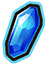
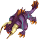
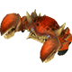
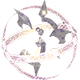
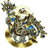
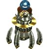
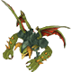
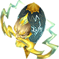
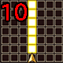

  

 

<table class="dungeonNext">
  <tr>
    <th>Previous</th>
    <td><a href="/chocobo-3/story-dungeons/shirma's-memories">Shirma's Memories</a></td>
    <th>Next</th>
    <td><a href="/chocobo-3/story-dungeons/ancient-ruins">Ancient Ruins</a></td>
  </tr>
</table>

# Overview

<table class="dungeonOverview">
  <tr>
    <th>Unlock</th>
    <td class="highlightYellow">Clear Shirma's Memories (Chapter 4).</td>
  </tr>
  <tr>
    <th>Location</th>
    <td class="highlightYellow">Clocktower Piazza (Chapter 4).</td>
  </tr>
</table>

<table class="dungeonTable">
  <tr>
    <th>Title</th>
    <td colspan="3">-</td>
  </tr>
  <tr>
    <th>Description</th>
    <td colspan="3">Normal dungeon with no restrictions.</td>
  </tr>
  <tr>
    <th>Floors</th>
    <td>40F</td>
    <th>Bosses</th>
    <td>10F, 30F, 40F</td>
  </tr>
  <tr>
    <th>Change Crystals</th>
    <td>0F, 39F</td>
    <th>Checkpoints</th>
    <td>10F, 30F</td>
  </tr>
  <tr>
    <th>Max Level</th>
    <td>-</td>
    <th>Bring Buddy</th>
    <td>Yes</td>
  </tr>
  <tr>
    <th>Bring In Items</th>
    <td>Yes</td>
    <th>Take Out Items</th>
    <td>Yes</td>
  </tr>
  <tr>
    <th>Shops/Duels</th>
    <td>Yes</td>
    <th>Den of Monsters</th>
    <td>Yes</td>
  </tr>
  <tr>
    <th>Reapers</th>
    <td>Yes</td>
    <th>Bookmark</th>
    <td>Yes</td>
  </tr>
  <tr>
    <th>Unidentified</th>
    <td colspan="3">Equipment, Consumables</td>
  </tr>
  <tr>
    <th>Rewards</th>
    <td colspan="3">1.  Dark Knight's Memories (30F). 2.  Light Apple (39F). ・ Chocobo's  Max SP 5 → 6. 3. Dungeon added to  Mirror of Memory. 4. Can unlock  Ancient Ruins.</td>
  </tr>
</table>

# Strategy

[Content]

# Monsters

<ul><li><a href="#monster-table">Monster Table</a></li><li><a href="#monster-details">Monster Details</a></li></ul>

 

 Monster Table 

Monster Colors - Boss F - 　 means field of view is limited. S - 　 means a Shop Trap can appear. D - 　 means a Duel Trap can appear. M - 　 means a Den of Monsters can appear. R - 　 means  Reaper can spawn.

<table class="monsterTable">
  <thead>
    <tr>
      <th>F</th>
      <th>S</th>
      <th>D</th>
      <th>M</th>
      <th colspan="5">Monsters</th>
      <th>R</th>
    </tr>
  </thead>
  <tbody>
    <tr class="changeCrystal">
      <td class="centeredText">0</td>
      <td></td>
      <td></td>
      <td></td>
      <td colspan="5" class="centeredText">Change Crystal</td>
      <td></td>
    </tr>
    <tr>
      <td class="centeredText">1</td>
      <td class="highlightGray"></td>
      <td class="highlightGray"></td>
      <td class="highlightGray"></td>
      <td> Cactuar (30%)</td>
      <td> Flying Eye (35%)</td>
      <td> Mandra (35%)</td>
      <td class="highlightGray"></td>
      <td class="highlightGray"></td>
      <td class="highlightReaper"></td>
    </tr>
    <tr>
      <td class="centeredText">2</td>
      <td class="highlightGray"></td>
      <td class="highlightGray"></td>
      <td class="highlightGray"></td>
      <td> Cactuar (30%)</td>
      <td> Flying Eye (35%)</td>
      <td> Mandra (35%)</td>
      <td class="highlightGray"></td>
      <td class="highlightGray"></td>
      <td class="highlightReaper"></td>
    </tr>
    <tr>
      <td class="centeredText">3</td>
      <td class="highlightShop"></td>
      <td class="highlightDuel"></td>
      <td class="highlightMH"></td>
      <td> Cactuar (30%)</td>
      <td> Flying Eye (35%)</td>
      <td> Mandra (35%)</td>
      <td class="highlightGray"></td>
      <td class="highlightGray"></td>
      <td class="highlightReaper"></td>
    </tr>
    <tr>
      <td class="centeredText">4</td>
      <td class="highlightShop"></td>
      <td class="highlightDuel"></td>
      <td class="highlightMH"></td>
      <td> Starshell (10%)</td>
      <td> Flying Eye (30%)</td>
      <td> Mandra (30%)</td>
      <td> Tonberry (30%)</td>
      <td class="highlightGray"></td>
      <td class="highlightReaper"></td>
    </tr>
    <tr>
      <td class="centeredText">5</td>
      <td class="highlightShop"></td>
      <td class="highlightDuel"></td>
      <td class="highlightMH"></td>
      <td> Starshell (10%)</td>
      <td> Iron Giant Silver (30%)</td>
      <td> Vulture (30%)</td>
      <td> Tonberry (30%)</td>
      <td class="highlightGray"></td>
      <td class="highlightReaper"></td>
    </tr>
    <tr>
      <td class="centeredText">6</td>
      <td class="highlightShop"></td>
      <td class="highlightDuel"></td>
      <td class="highlightMH"></td>
      <td> Starshell (10%)</td>
      <td> Iron Giant Silver (25%)</td>
      <td> Vulture (25%)</td>
      <td> Tonberry (30%)</td>
      <td> Magic Pot (10%)</td>
      <td class="highlightReaper"></td>
    </tr>
    <tr>
      <td class="centeredText">7</td>
      <td class="highlightShop"></td>
      <td class="highlightDuel"></td>
      <td class="highlightMH"></td>
      <td> Starshell (10%)</td>
      <td> Iron Giant Silver (25%)</td>
      <td> Vulture (25%)</td>
      <td> Tonberry (30%)</td>
      <td> Magic Pot (10%)</td>
      <td class="highlightReaper"></td>
    </tr>
    <tr>
      <td class="centeredText">8</td>
      <td class="highlightShop"></td>
      <td class="highlightDuel"></td>
      <td class="highlightMH"></td>
      <td> Starshell (10%)</td>
      <td> Iron Giant Silver (25%)</td>
      <td> Vulture (30%)</td>
      <td> Ahriman (25%)</td>
      <td> Magic Pot (10%)</td>
      <td class="highlightReaper"></td>
    </tr>
    <tr>
      <td class="centeredText">9</td>
      <td class="highlightGray"></td>
      <td class="highlightGray"></td>
      <td class="highlightGray"></td>
      <td> Starshell (10%)</td>
      <td> Iron Giant Silver (25%)</td>
      <td> Vulture (30%)</td>
      <td> Ahriman (25%)</td>
      <td> Magic Pot (10%)</td>
      <td class="highlightReaper"></td>
    </tr>
    <tr>
      <td class="centeredText">10</td>
      <td class="highlightGray"></td>
      <td class="highlightGray"></td>
      <td class="highlightGray"></td>
      <td> Behemoth</td>
      <td class="highlightGray"></td>
      <td class="highlightGray"></td>
      <td class="highlightGray"></td>
      <td class="highlightGray"></td>
      <td class="highlightGray"></td>
    </tr>
    <tr>
      <td class="centeredText">11</td>
      <td class="highlightGray"></td>
      <td class="highlightGray"></td>
      <td class="highlightGray"></td>
      <td> Starshell (10%)</td>
      <td> Mandragora (29%)</td>
      <td> Coeurl (24%)</td>
      <td> Ahriman (29%)</td>
      <td> Magic Pot (10%)</td>
      <td class="highlightReaper"></td>
    </tr>
    <tr>
      <td class="centeredText">12</td>
      <td class="highlightGray"></td>
      <td class="highlightGray"></td>
      <td class="highlightGray"></td>
      <td> Starshell (10%)</td>
      <td> Mandragora (29%)</td>
      <td> Coeurl (24%)</td>
      <td> Ahriman (29%)</td>
      <td> Magic Pot (10%)</td>
      <td class="highlightReaper"></td>
    </tr>
    <tr>
      <td class="centeredText">13</td>
      <td class="highlightShop"></td>
      <td class="highlightDuel"></td>
      <td class="highlightMH"></td>
      <td> Toad (25%)</td>
      <td> Mandragora (30%)</td>
      <td> Coeurl (25%)</td>
      <td> Flan Princess (10%)</td>
      <td> Magic Pot (10%)</td>
      <td class="highlightReaper"></td>
    </tr>
    <tr>
      <td class="centeredText">14</td>
      <td class="highlightShop"></td>
      <td class="highlightDuel"></td>
      <td class="highlightMH"></td>
      <td> Toad (25%)</td>
      <td> Mandragora (30%)</td>
      <td> Coeurl (25%)</td>
      <td> Flan Princess (10%)</td>
      <td> Magic Pot (10%)</td>
      <td class="highlightReaper"></td>
    </tr>
    <tr>
      <td class="centeredText">15</td>
      <td class="highlightShop"></td>
      <td class="highlightDuel"></td>
      <td class="highlightMH"></td>
      <td> Toad (30%)</td>
      <td> Dry Cactuar (25%)</td>
      <td> Lizard (25%)</td>
      <td> Flan Princess (10%)</td>
      <td> Magic Pot (10%)</td>
      <td class="highlightReaper"></td>
    </tr>
    <tr>
      <td class="centeredText">16</td>
      <td class="highlightShop"></td>
      <td class="highlightDuel"></td>
      <td class="highlightMH"></td>
      <td> Toad (30%)</td>
      <td> Dry Cactuar (25%)</td>
      <td> Lizard (25%)</td>
      <td> Flan Princess (10%)</td>
      <td> Magic Pot (10%)</td>
      <td class="highlightReaper"></td>
    </tr>
    <tr>
      <td class="centeredText">17</td>
      <td class="highlightShop"></td>
      <td class="highlightDuel"></td>
      <td class="highlightMH"></td>
      <td> Cockatrice (25%)</td>
      <td> Dry Cactuar (30%)</td>
      <td> Lizard (25%)</td>
      <td> Flan Princess (10%)</td>
      <td> Magic Pot (10%)</td>
      <td class="highlightReaper"></td>
    </tr>
    <tr>
      <td class="centeredText">18</td>
      <td class="highlightShop"></td>
      <td class="highlightDuel"></td>
      <td class="highlightMH"></td>
      <td> Cockatrice (25%)</td>
      <td> Dry Cactuar (30%)</td>
      <td> Lizard (25%)</td>
      <td> Flan Princess (10%)</td>
      <td> Magic Pot (10%)</td>
      <td class="highlightReaper"></td>
    </tr>
    <tr>
      <td class="centeredText">19</td>
      <td class="highlightGray"></td>
      <td class="highlightGray"></td>
      <td class="highlightGray"></td>
      <td> Cockatrice (25%)</td>
      <td> Red Scissors (25%)</td>
      <td> Lizard (30%)</td>
      <td> Flan Princess (10%)</td>
      <td> Magic Pot (10%)</td>
      <td class="highlightReaper"></td>
    </tr>
    <tr>
      <td class="centeredText">20</td>
      <td class="highlightGray"></td>
      <td class="highlightGray"></td>
      <td class="highlightGray"></td>
      <td> Cockatrice (25%)</td>
      <td> Red Scissors (25%)</td>
      <td> Lizard (30%)</td>
      <td> Flan Princess (10%)</td>
      <td> Thunder Elemental (10%)</td>
      <td class="highlightReaper"></td>
    </tr>
    <tr>
      <td class="centeredText">21</td>
      <td class="highlightGray"></td>
      <td class="highlightGray"></td>
      <td class="highlightGray"></td>
      <td> Cockatrice (20%)</td>
      <td> Red Scissors (25%)</td>
      <td> Lizard (20%)</td>
      <td> Grenade (20%)</td>
      <td> Thunder Elemental (15%)</td>
      <td class="highlightReaper"></td>
    </tr>
    <tr>
      <td class="centeredText">22</td>
      <td class="highlightGray"></td>
      <td class="highlightGray"></td>
      <td class="highlightGray"></td>
      <td> Cockatrice (20%)</td>
      <td> Red Scissors (25%)</td>
      <td> Master Tonberry (20%)</td>
      <td> Grenade (20%)</td>
      <td> Thunder Elemental (15%)</td>
      <td class="highlightReaper"></td>
    </tr>
    <tr>
      <td class="centeredText">23</td>
      <td class="highlightShop"></td>
      <td class="highlightDuel"></td>
      <td class="highlightMH"></td>
      <td> Bloodbones (20%)</td>
      <td> Red Scissors (20%)</td>
      <td> Master Tonberry (20%)</td>
      <td> Grenade (25%)</td>
      <td> Thunder Elemental (15%)</td>
      <td class="highlightReaper"></td>
    </tr>
    <tr>
      <td class="centeredText">24</td>
      <td class="highlightShop"></td>
      <td class="highlightDuel"></td>
      <td class="highlightMH"></td>
      <td> Bloodbones (20%)</td>
      <td> Red Scissors (20%)</td>
      <td> Master Tonberry (25%)</td>
      <td> Grenade (20%)</td>
      <td> Thunder Elemental (15%)</td>
      <td class="highlightReaper"></td>
    </tr>
    <tr>
      <td class="centeredText">25</td>
      <td class="highlightShop"></td>
      <td class="highlightDuel"></td>
      <td class="highlightMH"></td>
      <td> Bloodbones (20%)</td>
      <td> Simurgh (20%)</td>
      <td> Master Tonberry (25%)</td>
      <td> Grenade (20%)</td>
      <td> Thunder Elemental (15%)</td>
      <td class="highlightReaper"></td>
    </tr>
    <tr>
      <td class="centeredText">26</td>
      <td class="highlightShop"></td>
      <td class="highlightDuel"></td>
      <td class="highlightMH"></td>
      <td> Bloodbones (25%)</td>
      <td> Simurgh (25%)</td>
      <td> Master Tonberry (20%)</td>
      <td> Grenade (15%)</td>
      <td> Thunder Elemental (15%)</td>
      <td class="highlightReaper"></td>
    </tr>
    <tr>
      <td class="centeredText">27</td>
      <td class="highlightShop"></td>
      <td class="highlightDuel"></td>
      <td class="highlightMH"></td>
      <td> Bloodbones (25%)</td>
      <td> Simurgh (25%)</td>
      <td> Master Tonberry (15%)</td>
      <td> Malboro (20%)</td>
      <td> Thunder Elemental (15%)</td>
      <td class="highlightReaper"></td>
    </tr>
    <tr>
      <td class="centeredText">28</td>
      <td class="highlightShop"></td>
      <td class="highlightDuel"></td>
      <td class="highlightMH"></td>
      <td> Bloodbones (20%)</td>
      <td> Simurgh (25%)</td>
      <td> Panther (20%)</td>
      <td> Malboro (20%)</td>
      <td> Thunder Elemental (15%)</td>
      <td class="highlightReaper"></td>
    </tr>
    <tr>
      <td class="centeredText">29</td>
      <td class="highlightGray"></td>
      <td class="highlightGray"></td>
      <td class="highlightGray"></td>
      <td> Bloodbones (20%)</td>
      <td> Simurgh (20%)</td>
      <td> Panther (20%)</td>
      <td> Malboro (25%)</td>
      <td> Thunder Elemental (15%)</td>
      <td class="highlightReaper"></td>
    </tr>
    <tr>
      <td class="centeredText">30</td>
      <td class="highlightGray"></td>
      <td class="highlightGray"></td>
      <td class="highlightGray"></td>
      <td colspan="5"> Croma Shade (1st battle) →  Croma (2nd battle) → Dark Knight's Memories</td>
      <td class="highlightGray"></td>
    </tr>
    <tr>
      <td class="centeredText">31</td>
      <td class="highlightGray"></td>
      <td class="highlightGray"></td>
      <td class="highlightGray"></td>
      <td> Flan Amarillo (25%)</td>
      <td> Simurgh (15%)</td>
      <td> Panther (25%)</td>
      <td> Malboro (20%)</td>
      <td> Light Elemental (15%)</td>
      <td class="highlightReaper"></td>
    </tr>
    <tr>
      <td class="centeredText">32</td>
      <td class="highlightGray"></td>
      <td class="highlightGray"></td>
      <td class="highlightGray"></td>
      <td> Flan Amarillo (25%)</td>
      <td> Simurgh (15%)</td>
      <td> Panther (25%)</td>
      <td> Malboro (20%)</td>
      <td> Light Elemental (15%)</td>
      <td class="highlightReaper"></td>
    </tr>
    <tr>
      <td class="centeredText">33</td>
      <td class="highlightShop"></td>
      <td class="highlightDuel"></td>
      <td class="highlightMH"></td>
      <td> Flan Amarillo (25%)</td>
      <td> Belial (20%)</td>
      <td> Panther (20%)</td>
      <td> Malboro (20%)</td>
      <td> Light Elemental (15%)</td>
      <td class="highlightReaper"></td>
    </tr>
    <tr>
      <td class="centeredText">34</td>
      <td class="highlightShop"></td>
      <td class="highlightDuel"></td>
      <td class="highlightMH"></td>
      <td> Flan Amarillo (20%)</td>
      <td> Belial (25%)</td>
      <td> Panther (15%)</td>
      <td> Iron Giant Steel (25%)</td>
      <td> Light Elemental (15%)</td>
      <td class="highlightReaper"></td>
    </tr>
    <tr>
      <td class="centeredText">35</td>
      <td class="highlightShop"></td>
      <td class="highlightDuel"></td>
      <td class="highlightMH"></td>
      <td> Flan Amarillo (20%)</td>
      <td> Belial (25%)</td>
      <td> Panther (15%)</td>
      <td> Iron Giant Steel (25%)</td>
      <td> Light Elemental (15%)</td>
      <td class="highlightReaper"></td>
    </tr>
    <tr>
      <td class="centeredText">36</td>
      <td class="highlightShop"></td>
      <td class="highlightDuel"></td>
      <td class="highlightMH"></td>
      <td> Flan Amarillo (15%)</td>
      <td> Belial (20%)</td>
      <td> Thunder Dragon (25%)</td>
      <td> Iron Giant Steel (25%)</td>
      <td> Light Elemental (15%)</td>
      <td class="highlightReaper"></td>
    </tr>
    <tr>
      <td class="centeredText">37</td>
      <td class="highlightShop"></td>
      <td class="highlightDuel"></td>
      <td class="highlightMH"></td>
      <td> Flan Amarillo (15%)</td>
      <td> Belial (20%)</td>
      <td> Thunder Dragon (25%)</td>
      <td> Iron Giant Steel (25%)</td>
      <td> Light Elemental (15%)</td>
      <td class="highlightReaper"></td>
    </tr>
    <tr>
      <td class="centeredText">38</td>
      <td class="highlightShop"></td>
      <td class="highlightDuel"></td>
      <td class="highlightMH"></td>
      <td> Flan Amarillo (15%)</td>
      <td> Belial (20%)</td>
      <td> Thunder Dragon (25%)</td>
      <td> Iron Giant Steel (25%)</td>
      <td> Light Elemental (15%)</td>
      <td class="highlightReaper"></td>
    </tr>
    <tr class="changeCrystal">
      <td class="centeredText">39</td>
      <td></td>
      <td></td>
      <td></td>
      <td colspan="5" class="centeredText">Change Crystal  Light Apple</td>
      <td></td>
    </tr>
    <tr>
      <td class="centeredText">40</td>
      <td class="highlightGray"></td>
      <td class="highlightGray"></td>
      <td class="highlightGray"></td>
      <td> Alexander</td>
      <td> Right Arm</td>
      <td> Left Arm</td>
      <td class="highlightGray"></td>
      <td class="highlightGray"></td>
      <td class="highlightGray"></td>
    </tr>
  </tbody>
</table>

 Duel Table 

Duel Traps have a 30% chance to be generated between 3-8F, 13-18F, 23-28F, and 33-38F.

<table class="monsterTable">
  <thead>
    <tr>
      <th class="highlightDuel">F</th>
      <th class="highlightDuel" colspan="2">Possible Bosses</th>
    </tr>
  </thead>
  <tbody>
    <tr>
      <td class="centeredText">3-8</td>
      <td> Malboro (80%)</td>
      <td> Mini Cactuar (20%)</td>
    </tr>
    <tr>
      <td class="centeredText">13-18</td>
      <td> Gigantuar (80%)</td>
      <td> Mini Cactuar (20%)</td>
    </tr>
    <tr>
      <td class="centeredText">23-28</td>
      <td> Moloch (80%)</td>
      <td> Mini Cactuar (20%)</td>
    </tr>
    <tr>
      <td class="centeredText">33-38</td>
      <td> Ramuh (80%)</td>
      <td> Mini Cactuar (20%)</td>
    </tr>
  </tbody>
</table>

 

 Monster Details 

Stat Colors - Hard Mode

### Standard

#### Cactuar (1-3F)

<table class="buddyOverview">
  <tr class="noPad">
    <th colspan="13" class="highlightGreen">Stats</th>
  </tr>
  <tr>
    <td rowspan="4"></td>
    <td class="hp">HP</td>
    <td>106 / 130</td>
    <td class="atk">Attack</td>
    <td>98 / 100</td>
    <td class="mag">Magic</td>
    <td>39 / 41</td>
    <th>JP</th>
    <td>40 (40%)</td>
    <th>Item 1</th>
    <td colspan="3">-</td>
  </tr>
  <tr>
    <td class="sp">Exp</td>
    <td>232</td>
    <td class="def">Defense</td>
    <td>61 / 63</td>
    <td class="mnd">Mind</td>
    <td>66 / 67</td>
    <th>BP</th>
    <td>3 (40%)</td>
    <th>Item 2</th>
    <td colspan="3">-</td>
  </tr>
  <tr>
    <th>Hit</th>
    <td>95</td>
    <th>Evasion</th>
    <td>8</td>
    <th>Crit</th>
    <td>5</td>
    <th>Gil</th>
    <td>74 (30%)</td>
    <th>Steal</th>
    <td colspan="3">Bejeweled Collar (60%)</td>
  </tr>
  <tr>
    <th>Lv</th>
    <td>30</td>
    <th>Special</th>
    <td>-</td>
    <th>Resist</th>
    <td colspan="3"></td>
    <th>Weak</th>
    <td colspan="3"></td>
  </tr>
  <tr>
    <th colspan="13" class="abilityName">Gil Toss</th>
  </tr>
  <tr class="elementIcon">
    <th>Element</th>
    <td>-</td>
    <th>Range</th>
    <td></td>
    <th>Notes</th>
    <td colspan="8" class="leftText">Deal damage to a target up to 3 tiles ahead.</td>
  </tr>
  <tr>
    <th>Rate / CD</th>
    <td colspan="2">30% / 0T</td>
    <th>Count</th>
    <td>∞</td>
    <th>Multiplier</th>
    <td>x2.0</td>
    <th>Value</th>
    <td>0</td>
    <th>Type</th>
    <td class="leftText">Physical</td>
    <th>Calc</th>
    <td class="leftText">Stat</td>
  </tr>
  <tr>
    <th colspan="13" class="abilityName">Erase</th>
  </tr>
  <tr class="elementIcon">
    <th>Element</th>
    <td>-</td>
    <th>Range</th>
    <td></td>
    <th>Notes</th>
    <td colspan="8" class="leftText">Wipe player buffs of a target up to 3 tiles ahead.</td>
  </tr>
  <tr>
    <th>Rate / CD</th>
    <td colspan="2">10% / 6T</td>
    <th>Count</th>
    <td>∞</td>
    <th>Multiplier</th>
    <td>x1.0</td>
    <th>Value</th>
    <td>0</td>
    <th>Type</th>
    <td class="leftText">Other</td>
    <th>Calc</th>
    <td class="leftText">None</td>
  </tr>
  <tr>
    <th colspan="13" class="abilityName">1000 Needles</th>
  </tr>
  <tr class="elementIcon">
    <th>Element</th>
    <td>-</td>
    <th>Range</th>
    <td></td>
    <th>Notes</th>
    <td colspan="8" class="leftText">Reduce a target's HP to one digit up to 3 tiles ahead.</td>
  </tr>
  <tr>
    <th>Rate / CD</th>
    <td colspan="2">5% / 8T</td>
    <th>Count</th>
    <td>∞</td>
    <th>Multiplier</th>
    <td>x1.0</td>
    <th>Value</th>
    <td>-1</td>
    <th>Type</th>
    <td class="leftText">Physical</td>
    <th>Calc</th>
    <td class="leftText">Ratio</td>
  </tr>
</table>

#### Flying Eye (1-4F)

<table class="buddyOverview">
  <tr class="noPad">
    <th colspan="13" class="highlightGreen">Stats</th>
  </tr>
  <tr>
    <td rowspan="4"></td>
    <td class="hp">HP</td>
    <td>106 / 130</td>
    <td class="atk">Attack</td>
    <td>58 / 60</td>
    <td class="mag">Magic</td>
    <td>55 / 57</td>
    <th>JP</th>
    <td>26 (40%)</td>
    <th>Item 1</th>
    <td colspan="3">Hi-Potion (14%)</td>
  </tr>
  <tr>
    <td class="sp">Exp</td>
    <td>194</td>
    <td class="def">Defense</td>
    <td>61 / 63</td>
    <td class="mnd">Mind</td>
    <td>66 / 67</td>
    <th>BP</th>
    <td>3 (40%)</td>
    <th>Item 2</th>
    <td colspan="3">Hi-Ether (8%)</td>
  </tr>
  <tr>
    <th>Hit</th>
    <td>95</td>
    <th>Evasion</th>
    <td>8</td>
    <th>Crit</th>
    <td>5</td>
    <th>Gil</th>
    <td>62 (10%)</td>
    <th>Steal</th>
    <td colspan="3">Warp Wings (30%)</td>
  </tr>
  <tr>
    <th>Lv</th>
    <td>30</td>
    <th>Special</th>
    <td></td>
    <th>Resist</th>
    <td colspan="3"></td>
    <th>Weak</th>
    <td colspan="3">-</td>
  </tr>
  <tr>
    <th colspan="13" class="abilityName">Hypnosis</th>
  </tr>
  <tr class="elementIcon">
    <th>Element</th>
    <td>-</td>
    <th>Range</th>
    <td></td>
    <th>Notes</th>
    <td colspan="8" class="leftText">Inflict Sleep on a target 1 tile ahead.</td>
  </tr>
  <tr>
    <th>Rate / CD</th>
    <td colspan="2">15% / 3T</td>
    <th>Count</th>
    <td>∞</td>
    <th>Multiplier</th>
    <td>x1.0</td>
    <th>Value</th>
    <td>0</td>
    <th>Type</th>
    <td class="leftText">Other</td>
    <th>Calc</th>
    <td class="leftText">None</td>
  </tr>
  <tr>
    <th colspan="13" class="abilityName">Protect</th>
  </tr>
  <tr class="elementIcon">
    <th>Element</th>
    <td>-</td>
    <th>Range</th>
    <td></td>
    <th>Notes</th>
    <td colspan="8" class="leftText">Temporarily cast Protect on self or a target up to 2 tiles ahead.</td>
  </tr>
  <tr>
    <th>Rate / CD</th>
    <td colspan="2">10% / 6T</td>
    <th>Count</th>
    <td>∞</td>
    <th>Multiplier</th>
    <td>x1.0</td>
    <th>Value</th>
    <td>0</td>
    <th>Type</th>
    <td class="leftText">Other</td>
    <th>Calc</th>
    <td class="leftText">None</td>
  </tr>
  <tr>
    <th colspan="13" class="abilityName">Gaze</th>
  </tr>
  <tr class="elementIcon">
    <th>Element</th>
    <td>-</td>
    <th>Range</th>
    <td></td>
    <th>Notes</th>
    <td colspan="8" class="leftText">Inflict Silence on a target 1 tile ahead.</td>
  </tr>
  <tr>
    <th>Rate / CD</th>
    <td colspan="2">10% / 6T</td>
    <th>Count</th>
    <td>∞</td>
    <th>Multiplier</th>
    <td>x1.0</td>
    <th>Value</th>
    <td>0</td>
    <th>Type</th>
    <td class="leftText">Other</td>
    <th>Calc</th>
    <td class="leftText">None</td>
  </tr>
</table>

#### Mandra (1-4F)

<table class="buddyOverview">
  <tr class="noPad">
    <th colspan="13" class="highlightGreen">Stats</th>
  </tr>
  <tr>
    <td rowspan="4"></td>
    <td class="hp">HP</td>
    <td>109 / 134</td>
    <td class="atk">Attack</td>
    <td>80 / 85</td>
    <td class="mag">Magic</td>
    <td>49 / 51</td>
    <th>JP</th>
    <td>24 (40%)</td>
    <th>Item 1</th>
    <td colspan="3">Gysahl Greens (14%)</td>
  </tr>
  <tr>
    <td class="sp">Exp</td>
    <td>195</td>
    <td class="def">Defense</td>
    <td>63 / 64</td>
    <td class="mnd">Mind</td>
    <td>55 / 55</td>
    <th>BP</th>
    <td>3 (40%)</td>
    <th>Item 2</th>
    <td colspan="3">Large Gysahl Greens (8%)</td>
  </tr>
  <tr>
    <th>Hit</th>
    <td>95</td>
    <th>Evasion</th>
    <td>2</td>
    <th>Crit</th>
    <td>5</td>
    <th>Gil</th>
    <td>64 (10%)</td>
    <th>Steal</th>
    <td colspan="3">Large Gysahl Greens (60%)</td>
  </tr>
  <tr>
    <th>Lv</th>
    <td>31</td>
    <th>Special</th>
    <td>-</td>
    <th>Resist</th>
    <td colspan="3"></td>
    <th>Weak</th>
    <td colspan="3">-</td>
  </tr>
  <tr>
    <th colspan="13" class="abilityName">Seeds</th>
  </tr>
  <tr class="elementIcon">
    <th>Element</th>
    <td>-</td>
    <th>Range</th>
    <td></td>
    <th>Notes</th>
    <td colspan="8" class="leftText">Deal damage to a target up to 3 tiles ahead.</td>
  </tr>
  <tr>
    <th>Rate / CD</th>
    <td colspan="2">20% / 0T</td>
    <th>Count</th>
    <td>∞</td>
    <th>Multiplier</th>
    <td>x2.0</td>
    <th>Value</th>
    <td>0</td>
    <th>Type</th>
    <td class="leftText">Physical</td>
    <th>Calc</th>
    <td class="leftText">Stat</td>
  </tr>
  <tr>
    <th colspan="13" class="abilityName">Dreamy Flower</th>
  </tr>
  <tr class="elementIcon">
    <th>Element</th>
    <td>-</td>
    <th>Range</th>
    <td></td>
    <th>Notes</th>
    <td colspan="8" class="leftText">Inflict Sleep on targets in a 1 tile radius.</td>
  </tr>
  <tr>
    <th>Rate / CD</th>
    <td colspan="2">10% / 4T</td>
    <th>Count</th>
    <td>∞</td>
    <th>Multiplier</th>
    <td>x1.0</td>
    <th>Value</th>
    <td>0</td>
    <th>Type</th>
    <td class="leftText">Other</td>
    <th>Calc</th>
    <td class="leftText">None</td>
  </tr>
  <tr>
    <th colspan="13" class="abilityName">Baby's Breath</th>
  </tr>
  <tr class="elementIcon">
    <th>Element</th>
    <td>-</td>
    <th>Range</th>
    <td></td>
    <th>Notes</th>
    <td colspan="8" class="leftText">Inflict Blind on targets in a 1 tile radius.</td>
  </tr>
  <tr>
    <th>Rate / CD</th>
    <td colspan="2">10% / 4T</td>
    <th>Count</th>
    <td>∞</td>
    <th>Multiplier</th>
    <td>x1.0</td>
    <th>Value</th>
    <td>0</td>
    <th>Type</th>
    <td class="leftText">Other</td>
    <th>Calc</th>
    <td class="leftText">None</td>
  </tr>
</table>

#### Tonberry (4-7F)

<table class="buddyOverview">
  <tr class="noPad">
    <th colspan="13" class="highlightGreen">Stats</th>
  </tr>
  <tr>
    <td rowspan="4"></td>
    <td class="hp">HP</td>
    <td>80 / 98</td>
    <td class="atk">Attack</td>
    <td>80 / 85</td>
    <td class="mag">Magic</td>
    <td>57 / 59</td>
    <th>JP</th>
    <td>40 (40%)</td>
    <th>Item 1</th>
    <td colspan="3">Garnet Talons (8%)</td>
  </tr>
  <tr>
    <td class="sp">Exp</td>
    <td>234</td>
    <td class="def">Defense</td>
    <td>55 / 56</td>
    <td class="mnd">Mind</td>
    <td>999 / 999</td>
    <th>BP</th>
    <td>3 (40%)</td>
    <th>Item 2</th>
    <td colspan="3">Hi-Ether (8%)</td>
  </tr>
  <tr>
    <th>Hit</th>
    <td>95</td>
    <th>Evasion</th>
    <td>8</td>
    <th>Crit</th>
    <td>100</td>
    <th>Gil</th>
    <td>76 (30%)</td>
    <th>Steal</th>
    <td colspan="3">Hi-Potion (60%)</td>
  </tr>
  <tr>
    <th>Lv</th>
    <td>31</td>
    <th>Special</th>
    <td></td>
    <th>Resist</th>
    <td colspan="3"></td>
    <th>Weak</th>
    <td colspan="3">-</td>
  </tr>
  <tr>
    <th colspan="13" class="abilityName">Knife</th>
  </tr>
  <tr class="elementIcon">
    <th>Element</th>
    <td>-</td>
    <th>Range</th>
    <td></td>
    <th>Notes</th>
    <td colspan="8" class="leftText">Halve the HP of a target 1 tile ahead.</td>
  </tr>
  <tr>
    <th>Rate / CD</th>
    <td colspan="2">10% / 6T</td>
    <th>Count</th>
    <td>∞</td>
    <th>Multiplier</th>
    <td>x1.0</td>
    <th>Value</th>
    <td>50</td>
    <th>Type</th>
    <td class="leftText">Physical</td>
    <th>Calc</th>
    <td class="leftText">Ratio</td>
  </tr>
  <tr>
    <th colspan="13" class="abilityName">Slow</th>
  </tr>
  <tr class="elementIcon">
    <th>Element</th>
    <td>-</td>
    <th>Range</th>
    <td></td>
    <th>Notes</th>
    <td colspan="8" class="leftText">Inflict Slow on a target up to 2 tiles ahead.</td>
  </tr>
  <tr>
    <th>Rate / CD</th>
    <td colspan="2">5% / 6T</td>
    <th>Count</th>
    <td>∞</td>
    <th>Multiplier</th>
    <td>x1.0</td>
    <th>Value</th>
    <td>0</td>
    <th>Type</th>
    <td class="leftText">Other</td>
    <th>Calc</th>
    <td class="leftText">None</td>
  </tr>
</table>

#### Starshell (4-12F)

<table class="buddyOverview">
  <tr class="noPad">
    <th colspan="13" class="highlightGreen">Stats</th>
  </tr>
  <tr>
    <td rowspan="4"></td>
    <td class="hp">HP</td>
    <td>189 / 231</td>
    <td class="atk">Attack</td>
    <td>90 / 95</td>
    <td class="mag">Magic</td>
    <td>61 / 63</td>
    <th>JP</th>
    <td>30 (40%)</td>
    <th>Item 1</th>
    <td colspan="3">Hi-Potion (14%)</td>
  </tr>
  <tr>
    <td class="sp">Exp</td>
    <td>221</td>
    <td class="def">Defense</td>
    <td>65 / 66</td>
    <td class="mnd">Mind</td>
    <td>57 / 57</td>
    <th>BP</th>
    <td>3 (40%)</td>
    <th>Item 2</th>
    <td colspan="3">Bomb Shard (2%)</td>
  </tr>
  <tr>
    <th>Hit</th>
    <td>95</td>
    <th>Evasion</th>
    <td>4</td>
    <th>Crit</th>
    <td>5</td>
    <th>Gil</th>
    <td>76 (10%)</td>
    <th>Steal</th>
    <td colspan="3">Bomb Shard (30%)</td>
  </tr>
  <tr>
    <th>Lv</th>
    <td>37</td>
    <th>Special</th>
    <td></td>
    <th>Resist</th>
    <td colspan="3"></td>
    <th>Weak</th>
    <td colspan="3"></td>
  </tr>
  <tr>
    <th colspan="13" class="abilityName">Self-Destruct</th>
  </tr>
  <tr class="elementIcon">
    <th>Element</th>
    <td></td>
    <th>Range</th>
    <td></td>
    <th>Notes</th>
    <td colspan="8" class="leftText">Halve the HP of targets in a 3 tile radius, then collapse.</td>
  </tr>
  <tr>
    <th>Rate / CD</th>
    <td colspan="2">5% / 0T</td>
    <th>Count</th>
    <td>1</td>
    <th>Multiplier</th>
    <td>x1.0</td>
    <th>Value</th>
    <td>50</td>
    <th>Type</th>
    <td class="leftText">Magic</td>
    <th>Calc</th>
    <td class="leftText">Ratio</td>
  </tr>
  <tr>
    <th colspan="13" class="abilityName">Blaze</th>
  </tr>
  <tr class="elementIcon">
    <th>Element</th>
    <td>-</td>
    <th>Range</th>
    <td></td>
    <th>Notes</th>
    <td colspan="8" class="leftText">Temporarily cast Bravery.</td>
  </tr>
  <tr>
    <th>Rate / CD</th>
    <td colspan="2">5% / 5T</td>
    <th>Count</th>
    <td>∞</td>
    <th>Multiplier</th>
    <td>x1.0</td>
    <th>Value</th>
    <td>0</td>
    <th>Type</th>
    <td class="leftText">Other</td>
    <th>Calc</th>
    <td class="leftText">None</td>
  </tr>
  <tr>
    <th colspan="13" class="abilityName">Haste</th>
  </tr>
  <tr class="elementIcon">
    <th>Element</th>
    <td>-</td>
    <th>Range</th>
    <td></td>
    <th>Notes</th>
    <td colspan="8" class="leftText">Temporarily cast Haste on self or a target up to 2 tiles ahead.</td>
  </tr>
  <tr>
    <th>Rate / CD</th>
    <td colspan="2">5% / 10T</td>
    <th>Count</th>
    <td>∞</td>
    <th>Multiplier</th>
    <td>x1.0</td>
    <th>Value</th>
    <td>0</td>
    <th>Type</th>
    <td class="leftText">Other</td>
    <th>Calc</th>
    <td class="leftText">None</td>
  </tr>
</table>

#### Vulture (5-9F)

<table class="buddyOverview">
  <tr class="noPad">
    <th colspan="13" class="highlightGreen">Stats</th>
  </tr>
  <tr>
    <td rowspan="4"></td>
    <td class="hp">HP</td>
    <td>82 / 100</td>
    <td class="atk">Attack</td>
    <td>105 / 110</td>
    <td class="mag">Magic</td>
    <td>43 / 45</td>
    <th>JP</th>
    <td>24 (40%)</td>
    <th>Item 1</th>
    <td colspan="3">Hi-Potion (14%)</td>
  </tr>
  <tr>
    <td class="sp">Exp</td>
    <td>196</td>
    <td class="def">Defense</td>
    <td>56 / 58</td>
    <td class="mnd">Mind</td>
    <td>55 / 55</td>
    <th>BP</th>
    <td>3 (40%)</td>
    <th>Item 2</th>
    <td colspan="3">Warp Wings (8%)</td>
  </tr>
  <tr>
    <th>Hit</th>
    <td>85</td>
    <th>Evasion</th>
    <td>8</td>
    <th>Crit</th>
    <td>20</td>
    <th>Gil</th>
    <td>79 (10%)</td>
    <th>Steal</th>
    <td colspan="3">Warp Wings (30%)</td>
  </tr>
  <tr>
    <th>Lv</th>
    <td>32</td>
    <th>Special</th>
    <td></td>
    <th>Resist</th>
    <td colspan="3">-</td>
    <th>Weak</th>
    <td colspan="3"></td>
  </tr>
  <tr>
    <th colspan="13" class="abilityName">Wing Flap</th>
  </tr>
  <tr class="elementIcon">
    <th>Element</th>
    <td>-</td>
    <th>Range</th>
    <td></td>
    <th>Notes</th>
    <td colspan="8" class="leftText">Temporarily cast Haste.</td>
  </tr>
  <tr>
    <th>Rate / CD</th>
    <td colspan="2">10% / 30T</td>
    <th>Count</th>
    <td>∞</td>
    <th>Multiplier</th>
    <td>x1.0</td>
    <th>Value</th>
    <td>0</td>
    <th>Type</th>
    <td class="leftText">Other</td>
    <th>Calc</th>
    <td class="leftText">None</td>
  </tr>
  <tr>
    <th colspan="13" class="abilityName">Gale</th>
  </tr>
  <tr class="elementIcon">
    <th>Element</th>
    <td></td>
    <th>Range</th>
    <td></td>
    <th>Notes</th>
    <td colspan="8" class="leftText">Deal wind damage to a target 1 tile ahead.</td>
  </tr>
  <tr>
    <th>Rate / CD</th>
    <td colspan="2">10% / 0T</td>
    <th>Count</th>
    <td>∞</td>
    <th>Multiplier</th>
    <td>x1.0</td>
    <th>Value</th>
    <td>0</td>
    <th>Type</th>
    <td class="leftText">Magic</td>
    <th>Calc</th>
    <td class="leftText">Stat</td>
  </tr>
</table>

#### Iron Giant Silver (5-9F)

<table class="buddyOverview">
  <tr class="noPad">
    <th colspan="13" class="highlightGreen">Stats</th>
  </tr>
  <tr>
    <td rowspan="4"></td>
    <td class="hp">HP</td>
    <td>168 / 206</td>
    <td class="atk">Attack</td>
    <td>105 / 110</td>
    <td class="mag">Magic</td>
    <td>43 / 45</td>
    <th>JP</th>
    <td>24 (40%)</td>
    <th>Item 1</th>
    <td colspan="3">Hi-Potion (14%)</td>
  </tr>
  <tr>
    <td class="sp">Exp</td>
    <td>235</td>
    <td class="def">Defense</td>
    <td>64 / 66</td>
    <td class="mnd">Mind</td>
    <td>47 / 47</td>
    <th>BP</th>
    <td>3 (40%)</td>
    <th>Item 2</th>
    <td colspan="3">Emerald Saddle (8%)</td>
  </tr>
  <tr>
    <th>Hit</th>
    <td>85</td>
    <th>Evasion</th>
    <td>2</td>
    <th>Crit</th>
    <td>5</td>
    <th>Gil</th>
    <td>79 (10%)</td>
    <th>Steal</th>
    <td colspan="3">Emerald Saddle (60%)</td>
  </tr>
  <tr>
    <th>Lv</th>
    <td>32</td>
    <th>Special</th>
    <td></td>
    <th>Resist</th>
    <td colspan="3">-</td>
    <th>Weak</th>
    <td colspan="3"></td>
  </tr>
  <tr>
    <th colspan="13" class="abilityName">Battle Cry</th>
  </tr>
  <tr class="elementIcon">
    <th>Element</th>
    <td>-</td>
    <th>Range</th>
    <td></td>
    <th>Notes</th>
    <td colspan="8" class="leftText">Temporarily cast Bravery.</td>
  </tr>
  <tr>
    <th>Rate / CD</th>
    <td colspan="2">5% / 30T</td>
    <th>Count</th>
    <td>∞</td>
    <th>Multiplier</th>
    <td>x1.0</td>
    <th>Value</th>
    <td>0</td>
    <th>Type</th>
    <td class="leftText">Other</td>
    <th>Calc</th>
    <td class="leftText">None</td>
  </tr>
  <tr>
    <th colspan="13" class="abilityName">Slash</th>
  </tr>
  <tr class="elementIcon">
    <th>Element</th>
    <td>-</td>
    <th>Range</th>
    <td></td>
    <th>Notes</th>
    <td colspan="8" class="leftText">Deal damage to a target 1 tile ahead.</td>
  </tr>
  <tr>
    <th>Rate / CD</th>
    <td colspan="2">10% / 0T</td>
    <th>Count</th>
    <td>∞</td>
    <th>Multiplier</th>
    <td>x2.0</td>
    <th>Value</th>
    <td>0</td>
    <th>Type</th>
    <td class="leftText">Physical</td>
    <th>Calc</th>
    <td class="leftText">Stat</td>
  </tr>
</table>

#### Magic Pot (6-19F)

<table class="buddyOverview">
  <tr class="noPad">
    <th colspan="13" class="highlightGreen">Stats</th>
  </tr>
  <tr>
    <td rowspan="4"></td>
    <td class="hp">HP</td>
    <td>82 / 100</td>
    <td class="atk">Attack</td>
    <td>105 / 110</td>
    <td class="mag">Magic</td>
    <td>59 / 61</td>
    <th>JP</th>
    <td>-</td>
    <th>Item 1</th>
    <td colspan="3">-</td>
  </tr>
  <tr>
    <td class="sp">Exp</td>
    <td>156</td>
    <td class="def">Defense</td>
    <td>56 / 58</td>
    <td class="mnd">Mind</td>
    <td>67 / 67</td>
    <th>BP</th>
    <td>3 (40%)</td>
    <th>Item 2</th>
    <td colspan="3">-</td>
  </tr>
  <tr>
    <th>Hit</th>
    <td>95</td>
    <th>Evasion</th>
    <td>8</td>
    <th>Crit</th>
    <td>5</td>
    <th>Gil</th>
    <td>-</td>
    <th>Steal</th>
    <td colspan="3">Elixir (5%)</td>
  </tr>
  <tr>
    <th>Lv</th>
    <td>32</td>
    <th>Special</th>
    <td>-</td>
    <th>Resist</th>
    <td colspan="3"></td>
    <th>Weak</th>
    <td colspan="3">-</td>
  </tr>
  <tr>
    <th colspan="13" class="abilityName">Steal</th>
  </tr>
  <tr class="elementIcon">
    <th>Element</th>
    <td>-</td>
    <th>Range</th>
    <td></td>
    <th>Notes</th>
    <td colspan="8" class="leftText">Steal an inventory item from a target 1 tile ahead.</td>
  </tr>
  <tr>
    <th>Rate / CD</th>
    <td colspan="2">50% / 0T</td>
    <th>Count</th>
    <td>∞</td>
    <th>Multiplier</th>
    <td>x1.0</td>
    <th>Value</th>
    <td>0</td>
    <th>Type</th>
    <td class="leftText">Other</td>
    <th>Calc</th>
    <td class="leftText">None</td>
  </tr>
  <tr>
    <th colspan="13" class="abilityName">Thunder</th>
  </tr>
  <tr class="elementIcon">
    <th>Element</th>
    <td></td>
    <th>Range</th>
    <td></td>
    <th>Notes</th>
    <td colspan="8" class="leftText">Deal thunder damage to a target up to 2 tiles ahead.</td>
  </tr>
  <tr>
    <th>Rate / CD</th>
    <td colspan="2">10% / 4T</td>
    <th>Count</th>
    <td>∞</td>
    <th>Multiplier</th>
    <td>x1.0</td>
    <th>Value</th>
    <td>8</td>
    <th>Type</th>
    <td class="leftText">Magic</td>
    <th>Calc</th>
    <td class="leftText">Stat</td>
  </tr>
  <tr>
    <th colspan="13" class="abilityName">Cure</th>
  </tr>
  <tr class="elementIcon">
    <th>Element</th>
    <td>-</td>
    <th>Range</th>
    <td></td>
    <th>Notes</th>
    <td colspan="8" class="leftText">Heal HP of self or a target up to 2 tiles ahead.</td>
  </tr>
  <tr>
    <th>Rate / CD</th>
    <td colspan="2">5% / 4T</td>
    <th>Count</th>
    <td>∞</td>
    <th>Multiplier</th>
    <td>x1.0</td>
    <th>Value</th>
    <td>30</td>
    <th>Type</th>
    <td class="leftText">Healing</td>
    <th>Calc</th>
    <td class="leftText">Stat</td>
  </tr>
</table>

#### Ahriman (8-12F)

<table class="buddyOverview">
  <tr class="noPad">
    <th colspan="13" class="highlightGreen">Stats</th>
  </tr>
  <tr>
    <td rowspan="4"></td>
    <td class="hp">HP</td>
    <td>115 / 141</td>
    <td class="atk">Attack</td>
    <td>70 / 75</td>
    <td class="mag">Magic</td>
    <td>61 / 63</td>
    <th>JP</th>
    <td>32 (40%)</td>
    <th>Item 1</th>
    <td colspan="3">Hi-Ether (14%)</td>
  </tr>
  <tr>
    <td class="sp">Exp</td>
    <td>197</td>
    <td class="def">Defense</td>
    <td>66 / 67</td>
    <td class="mnd">Mind</td>
    <td>67 / 67</td>
    <th>BP</th>
    <td>3 (40%)</td>
    <th>Item 2</th>
    <td colspan="3">Turbo Ether (8%)</td>
  </tr>
  <tr>
    <th>Hit</th>
    <td>95</td>
    <th>Evasion</th>
    <td>8</td>
    <th>Crit</th>
    <td>5</td>
    <th>Gil</th>
    <td>68 (10%)</td>
    <th>Steal</th>
    <td colspan="3">Warp Wings (30%)</td>
  </tr>
  <tr>
    <th>Lv</th>
    <td>33</td>
    <th>Special</th>
    <td></td>
    <th>Resist</th>
    <td colspan="3"></td>
    <th>Weak</th>
    <td colspan="3">-</td>
  </tr>
  <tr>
    <th colspan="13" class="abilityName">Gaze</th>
  </tr>
  <tr class="elementIcon">
    <th>Element</th>
    <td>-</td>
    <th>Range</th>
    <td></td>
    <th>Notes</th>
    <td colspan="8" class="leftText">Inflict Silence on a target 1 tile ahead.</td>
  </tr>
  <tr>
    <th>Rate / CD</th>
    <td colspan="2">15% / 6T</td>
    <th>Count</th>
    <td>∞</td>
    <th>Multiplier</th>
    <td>x1.0</td>
    <th>Value</th>
    <td>0</td>
    <th>Type</th>
    <td class="leftText">Other</td>
    <th>Calc</th>
    <td class="leftText">None</td>
  </tr>
  <tr>
    <th colspan="13" class="abilityName">Protect</th>
  </tr>
  <tr class="elementIcon">
    <th>Element</th>
    <td>-</td>
    <th>Range</th>
    <td></td>
    <th>Notes</th>
    <td colspan="8" class="leftText">Temporarily cast Protect on self or a target up to 2 tiles ahead.</td>
  </tr>
  <tr>
    <th>Rate / CD</th>
    <td colspan="2">10% / 6T</td>
    <th>Count</th>
    <td>∞</td>
    <th>Multiplier</th>
    <td>x1.0</td>
    <th>Value</th>
    <td>0</td>
    <th>Type</th>
    <td class="leftText">Other</td>
    <th>Calc</th>
    <td class="leftText">None</td>
  </tr>
  <tr>
    <th colspan="13" class="abilityName">Haste</th>
  </tr>
  <tr class="elementIcon">
    <th>Element</th>
    <td>-</td>
    <th>Range</th>
    <td></td>
    <th>Notes</th>
    <td colspan="8" class="leftText">Temporarily cast Haste on self or a target up to 2 tiles ahead.</td>
  </tr>
  <tr>
    <th>Rate / CD</th>
    <td colspan="2">10% / 10T</td>
    <th>Count</th>
    <td>∞</td>
    <th>Multiplier</th>
    <td>x1.0</td>
    <th>Value</th>
    <td>0</td>
    <th>Type</th>
    <td class="leftText">Other</td>
    <th>Calc</th>
    <td class="leftText">None</td>
  </tr>
  <tr>
    <th colspan="13" class="abilityName">Manaward</th>
  </tr>
  <tr class="elementIcon">
    <th>Element</th>
    <td>-</td>
    <th>Range</th>
    <td></td>
    <th>Notes</th>
    <td colspan="8" class="leftText">Temporarily cast Manaward on self.</td>
  </tr>
  <tr>
    <th>Rate / CD</th>
    <td colspan="2">10% / 10T</td>
    <th>Count</th>
    <td>∞</td>
    <th>Multiplier</th>
    <td>x1.0</td>
    <th>Value</th>
    <td>0</td>
    <th>Type</th>
    <td class="leftText">Other</td>
    <th>Calc</th>
    <td class="leftText">None</td>
  </tr>
</table>

#### Mandragora (11-14F)

<table class="buddyOverview">
  <tr class="noPad">
    <th colspan="13" class="highlightGreen">Stats</th>
  </tr>
  <tr>
    <td rowspan="4"></td>
    <td class="hp">HP</td>
    <td>115 / 141</td>
    <td class="atk">Attack</td>
    <td>90 / 95</td>
    <td class="mag">Magic</td>
    <td>53 / 55</td>
    <th>JP</th>
    <td>30 (40%)</td>
    <th>Item 1</th>
    <td colspan="3">Gysahl Greens (14%)</td>
  </tr>
  <tr>
    <td class="sp">Exp</td>
    <td>197</td>
    <td class="def">Defense</td>
    <td>66 / 67</td>
    <td class="mnd">Mind</td>
    <td>55 / 55</td>
    <th>BP</th>
    <td>3 (40%)</td>
    <th>Item 2</th>
    <td colspan="3">Large Gysahl Greens (8%)</td>
  </tr>
  <tr>
    <th>Hit</th>
    <td>95</td>
    <th>Evasion</th>
    <td>2</td>
    <th>Crit</th>
    <td>5</td>
    <th>Gil</th>
    <td>68 (10%)</td>
    <th>Steal</th>
    <td colspan="3">Large Gysahl Greens (60%)</td>
  </tr>
  <tr>
    <th>Lv</th>
    <td>33</td>
    <th>Special</th>
    <td>-</td>
    <th>Resist</th>
    <td colspan="3"></td>
    <th>Weak</th>
    <td colspan="3">-</td>
  </tr>
  <tr>
    <th colspan="13" class="abilityName">Seeds</th>
  </tr>
  <tr class="elementIcon">
    <th>Element</th>
    <td>-</td>
    <th>Range</th>
    <td></td>
    <th>Notes</th>
    <td colspan="8" class="leftText">Deal damage to a target up to 3 tiles ahead.</td>
  </tr>
  <tr>
    <th>Rate / CD</th>
    <td colspan="2">20% / 0T</td>
    <th>Count</th>
    <td>∞</td>
    <th>Multiplier</th>
    <td>x2.0</td>
    <th>Value</th>
    <td>0</td>
    <th>Type</th>
    <td class="leftText">Physical</td>
    <th>Calc</th>
    <td class="leftText">Stat</td>
  </tr>
  <tr>
    <th colspan="13" class="abilityName">Dreamy Flower</th>
  </tr>
  <tr class="elementIcon">
    <th>Element</th>
    <td>-</td>
    <th>Range</th>
    <td></td>
    <th>Notes</th>
    <td colspan="8" class="leftText">Inflict Sleep on targets in a 1 tile radius.</td>
  </tr>
  <tr>
    <th>Rate / CD</th>
    <td colspan="2">10% / 4T</td>
    <th>Count</th>
    <td>∞</td>
    <th>Multiplier</th>
    <td>x1.0</td>
    <th>Value</th>
    <td>0</td>
    <th>Type</th>
    <td class="leftText">Other</td>
    <th>Calc</th>
    <td class="leftText">None</td>
  </tr>
  <tr>
    <th colspan="13" class="abilityName">Scream</th>
  </tr>
  <tr class="elementIcon">
    <th>Element</th>
    <td>-</td>
    <th>Range</th>
    <td></td>
    <th>Notes</th>
    <td colspan="8" class="leftText">Inflict Stun on targets in a 2 tile radius.</td>
  </tr>
  <tr>
    <th>Rate / CD</th>
    <td colspan="2">10% / 4T</td>
    <th>Count</th>
    <td>∞</td>
    <th>Multiplier</th>
    <td>x1.0</td>
    <th>Value</th>
    <td>0</td>
    <th>Type</th>
    <td class="leftText">Other</td>
    <th>Calc</th>
    <td class="leftText">None</td>
  </tr>
</table>

#### Coeurl (11-14F)

<table class="buddyOverview">
  <tr class="noPad">
    <th colspan="13" class="highlightGreen">Stats</th>
  </tr>
  <tr>
    <td rowspan="4"></td>
    <td class="hp">HP</td>
    <td>86 / 105</td>
    <td class="atk">Attack</td>
    <td>95 / 100</td>
    <td class="mag">Magic</td>
    <td>47 / 49</td>
    <th>JP</th>
    <td>24 (40%)</td>
    <th>Item 1</th>
    <td colspan="3">Hi-Potion (14%)</td>
  </tr>
  <tr>
    <td class="sp">Exp</td>
    <td>218</td>
    <td class="def">Defense</td>
    <td>59 / 61</td>
    <td class="mnd">Mind</td>
    <td>55 / 56</td>
    <th>BP</th>
    <td>3 (40%)</td>
    <th>Item 2</th>
    <td colspan="3">Emerald Talons (8%)</td>
  </tr>
  <tr>
    <th>Hit</th>
    <td>85</td>
    <th>Evasion</th>
    <td>8</td>
    <th>Crit</th>
    <td>5</td>
    <th>Gil</th>
    <td>70 (10%)</td>
    <th>Steal</th>
    <td colspan="3">Hi-Potion (60%)</td>
  </tr>
  <tr>
    <th>Lv</th>
    <td>34</td>
    <th>Special</th>
    <td></td>
    <th>Resist</th>
    <td colspan="3">-</td>
    <th>Weak</th>
    <td colspan="3">-</td>
  </tr>
  <tr>
    <th colspan="13" class="abilityName">Bite</th>
  </tr>
  <tr class="elementIcon">
    <th>Element</th>
    <td>-</td>
    <th>Range</th>
    <td></td>
    <th>Notes</th>
    <td colspan="8" class="leftText">Deal damage + Immobilize to a target 1 tile ahead.</td>
  </tr>
  <tr>
    <th>Rate / CD</th>
    <td colspan="2">30% / 4T</td>
    <th>Count</th>
    <td>∞</td>
    <th>Multiplier</th>
    <td>x1.0</td>
    <th>Value</th>
    <td>0</td>
    <th>Type</th>
    <td class="leftText">Physical</td>
    <th>Calc</th>
    <td class="leftText">Stat</td>
  </tr>
  <tr>
    <th colspan="13" class="abilityName">Chaotic Eye</th>
  </tr>
  <tr class="elementIcon">
    <th>Element</th>
    <td>-</td>
    <th>Range</th>
    <td></td>
    <th>Notes</th>
    <td colspan="8" class="leftText">Inflict Silence on a target 1 tile ahead.</td>
  </tr>
  <tr>
    <th>Rate / CD</th>
    <td colspan="2">10% / 4T</td>
    <th>Count</th>
    <td>∞</td>
    <th>Multiplier</th>
    <td>x1.0</td>
    <th>Value</th>
    <td>0</td>
    <th>Type</th>
    <td class="leftText">Other</td>
    <th>Calc</th>
    <td class="leftText">None</td>
  </tr>
</table>

#### Toad (13-16F)

<table class="buddyOverview">
  <tr class="noPad">
    <th colspan="13" class="highlightGreen">Stats</th>
  </tr>
  <tr>
    <td rowspan="4"></td>
    <td class="hp">HP</td>
    <td>177 / 217</td>
    <td class="atk">Attack</td>
    <td>75 / 80</td>
    <td class="mag">Magic</td>
    <td>47 / 49</td>
    <th>JP</th>
    <td>26 (40%)</td>
    <th>Item 1</th>
    <td colspan="3">Poison Drink (14%)</td>
  </tr>
  <tr>
    <td class="sp">Exp</td>
    <td>174</td>
    <td class="def">Defense</td>
    <td>59 / 61</td>
    <td class="mnd">Mind</td>
    <td>55 / 56</td>
    <th>BP</th>
    <td>3 (40%)</td>
    <th>Item 2</th>
    <td colspan="3">Stinky Greens (8%)</td>
  </tr>
  <tr>
    <th>Hit</th>
    <td>95</td>
    <th>Evasion</th>
    <td>2</td>
    <th>Crit</th>
    <td>5</td>
    <th>Gil</th>
    <td>70 (30%)</td>
    <th>Steal</th>
    <td colspan="3">Poison Drink (60%)</td>
  </tr>
  <tr>
    <th>Lv</th>
    <td>34</td>
    <th>Special</th>
    <td>-</td>
    <th>Resist</th>
    <td colspan="3">-</td>
    <th>Weak</th>
    <td colspan="3"></td>
  </tr>
  <tr>
    <th colspan="13" class="abilityName">Silence</th>
  </tr>
  <tr class="elementIcon">
    <th>Element</th>
    <td>-</td>
    <th>Range</th>
    <td></td>
    <th>Notes</th>
    <td colspan="8" class="leftText">Inflict Silence on a target up to 3 tiles ahead.</td>
  </tr>
  <tr>
    <th>Rate / CD</th>
    <td colspan="2">10% / 6T</td>
    <th>Count</th>
    <td>∞</td>
    <th>Multiplier</th>
    <td>x1.0</td>
    <th>Value</th>
    <td>0</td>
    <th>Type</th>
    <td class="leftText">Other</td>
    <th>Calc</th>
    <td class="leftText">None</td>
  </tr>
  <tr>
    <th colspan="13" class="abilityName">Jump</th>
  </tr>
  <tr class="elementIcon">
    <th>Element</th>
    <td>-</td>
    <th>Range</th>
    <td></td>
    <th>Notes</th>
    <td colspan="8" class="leftText">Deal damage + Knockback to a target 1 tile ahead.</td>
  </tr>
  <tr>
    <th>Rate / CD</th>
    <td colspan="2">20% / 0T</td>
    <th>Count</th>
    <td>∞</td>
    <th>Multiplier</th>
    <td>x1.0</td>
    <th>Value</th>
    <td>0</td>
    <th>Type</th>
    <td class="leftText">Physical</td>
    <th>Calc</th>
    <td class="leftText">Stat</td>
  </tr>
  <tr>
    <th colspan="13" class="abilityName">Sticky Goo</th>
  </tr>
  <tr class="elementIcon">
    <th>Element</th>
    <td>-</td>
    <th>Range</th>
    <td></td>
    <th>Notes</th>
    <td colspan="8" class="leftText">Inflict Slow on a target 1 tile ahead.</td>
  </tr>
  <tr>
    <th>Rate / CD</th>
    <td colspan="2">10% / 6T</td>
    <th>Count</th>
    <td>∞</td>
    <th>Multiplier</th>
    <td>x1.0</td>
    <th>Value</th>
    <td>0</td>
    <th>Type</th>
    <td class="leftText">Other</td>
    <th>Calc</th>
    <td class="leftText">None</td>
  </tr>
</table>

#### Flan Princess (13-20F)

<table class="buddyOverview">
  <tr class="noPad">
    <th colspan="13" class="highlightGreen">Stats</th>
  </tr>
  <tr>
    <td rowspan="4"></td>
    <td class="hp">HP</td>
    <td>202 / 247</td>
    <td class="atk">Attack</td>
    <td>104 / 108</td>
    <td class="mag">Magic</td>
    <td>67 / 69</td>
    <th>JP</th>
    <td>26 (40%)</td>
    <th>Item 1</th>
    <td colspan="3">-</td>
  </tr>
  <tr>
    <td class="sp">Exp</td>
    <td>244</td>
    <td class="def">Defense</td>
    <td>68 / 71</td>
    <td class="mnd">Mind</td>
    <td>58 / 58</td>
    <th>BP</th>
    <td>3 (40%)</td>
    <th>Item 2</th>
    <td colspan="3">-</td>
  </tr>
  <tr>
    <th>Hit</th>
    <td>95</td>
    <th>Evasion</th>
    <td>4</td>
    <th>Crit</th>
    <td>5</td>
    <th>Gil</th>
    <td>82 (10%)</td>
    <th>Steal</th>
    <td colspan="3">Hi-Potion (60%)</td>
  </tr>
  <tr>
    <th>Lv</th>
    <td>40</td>
    <th>Special</th>
    <td>-</td>
    <th>Resist</th>
    <td colspan="3"></td>
    <th>Weak</th>
    <td colspan="3"></td>
  </tr>
  <tr>
    <th colspan="13" class="abilityName">Divide</th>
  </tr>
  <tr class="elementIcon">
    <th>Element</th>
    <td>-</td>
    <th>Range</th>
    <td></td>
    <th>Notes</th>
    <td colspan="8" class="leftText">Reduce current HP by 1/2 to create a clone when hit.</td>
  </tr>
  <tr>
    <th>Rate / CD</th>
    <td colspan="2">60% / 0T</td>
    <th>Count</th>
    <td>1</td>
    <th>Multiplier</th>
    <td>x1.0</td>
    <th>Value</th>
    <td>0</td>
    <th>Type</th>
    <td class="leftText">Other</td>
    <th>Calc</th>
    <td class="leftText">None</td>
  </tr>
  <tr>
    <th colspan="13" class="abilityName">Digest</th>
  </tr>
  <tr class="elementIcon">
    <th>Element</th>
    <td>-</td>
    <th>Range</th>
    <td></td>
    <th>Notes</th>
    <td colspan="8" class="leftText">Drain HP from a target 1 tile ahead.</td>
  </tr>
  <tr>
    <th>Rate / CD</th>
    <td colspan="2">10% / 4T</td>
    <th>Count</th>
    <td>∞</td>
    <th>Multiplier</th>
    <td>x1.0</td>
    <th>Value</th>
    <td>0</td>
    <th>Type</th>
    <td class="leftText">Magic</td>
    <th>Calc</th>
    <td class="leftText">Stat</td>
  </tr>
  <tr>
    <th colspan="13" class="abilityName">Dia</th>
  </tr>
  <tr class="elementIcon">
    <th>Element</th>
    <td></td>
    <th>Range</th>
    <td></td>
    <th>Notes</th>
    <td colspan="8" class="leftText">Deal light damage to a target up to 3 tiles ahead.</td>
  </tr>
  <tr>
    <th>Rate / CD</th>
    <td colspan="2">10% / 6T</td>
    <th>Count</th>
    <td>∞</td>
    <th>Multiplier</th>
    <td>x1.0</td>
    <th>Value</th>
    <td>8</td>
    <th>Type</th>
    <td class="leftText">Magic</td>
    <th>Calc</th>
    <td class="leftText">Stat</td>
  </tr>
</table>

#### Dry Cactuar (15-18F)

<table class="buddyOverview">
  <tr class="noPad">
    <th colspan="13" class="highlightGreen">Stats</th>
  </tr>
  <tr>
    <td rowspan="4"></td>
    <td class="hp">HP</td>
    <td>120 / 147</td>
    <td class="atk">Attack</td>
    <td>120 / 125</td>
    <td class="mag">Magic</td>
    <td>49 / 51</td>
    <th>JP</th>
    <td>40 (40%)</td>
    <th>Item 1</th>
    <td colspan="3">-</td>
  </tr>
  <tr>
    <td class="sp">Exp</td>
    <td>262</td>
    <td class="def">Defense</td>
    <td>69 / 70</td>
    <td class="mnd">Mind</td>
    <td>68 / 68</td>
    <th>BP</th>
    <td>3 (40%)</td>
    <th>Item 2</th>
    <td colspan="3">-</td>
  </tr>
  <tr>
    <th>Hit</th>
    <td>95</td>
    <th>Evasion</th>
    <td>8</td>
    <th>Crit</th>
    <td>5</td>
    <th>Gil</th>
    <td>86 (30%)</td>
    <th>Steal</th>
    <td colspan="3">Bejeweled Collar (60%)</td>
  </tr>
  <tr>
    <th>Lv</th>
    <td>35</td>
    <th>Special</th>
    <td>-</td>
    <th>Resist</th>
    <td colspan="3"></td>
    <th>Weak</th>
    <td colspan="3"></td>
  </tr>
  <tr>
    <th colspan="13" class="abilityName">Gil Toss</th>
  </tr>
  <tr class="elementIcon">
    <th>Element</th>
    <td>-</td>
    <th>Range</th>
    <td></td>
    <th>Notes</th>
    <td colspan="8" class="leftText">Deal damage to a target up to 3 tiles ahead.</td>
  </tr>
  <tr>
    <th>Rate / CD</th>
    <td colspan="2">30% / 0T</td>
    <th>Count</th>
    <td>∞</td>
    <th>Multiplier</th>
    <td>x2.0</td>
    <th>Value</th>
    <td>0</td>
    <th>Type</th>
    <td class="leftText">Physical</td>
    <th>Calc</th>
    <td class="leftText">Stat</td>
  </tr>
  <tr>
    <th colspan="13" class="abilityName">Erase</th>
  </tr>
  <tr class="elementIcon">
    <th>Element</th>
    <td>-</td>
    <th>Range</th>
    <td></td>
    <th>Notes</th>
    <td colspan="8" class="leftText">Wipe player buffs of a target up to 3 tiles ahead.</td>
  </tr>
  <tr>
    <th>Rate / CD</th>
    <td colspan="2">10% / 6T</td>
    <th>Count</th>
    <td>∞</td>
    <th>Multiplier</th>
    <td>x1.0</td>
    <th>Value</th>
    <td>0</td>
    <th>Type</th>
    <td class="leftText">Other</td>
    <th>Calc</th>
    <td class="leftText">None</td>
  </tr>
</table>

#### Lizard (15-21F)

<table class="buddyOverview">
  <tr class="noPad">
    <th colspan="13" class="highlightGreen">Stats</th>
  </tr>
  <tr>
    <td rowspan="4"></td>
    <td class="hp">HP</td>
    <td>120 / 147</td>
    <td class="atk">Attack</td>
    <td>80 / 85</td>
    <td class="mag">Magic</td>
    <td>57 / 59</td>
    <th>JP</th>
    <td>26 (40%)</td>
    <th>Item 1</th>
    <td colspan="3">Hi-Potion (14%)</td>
  </tr>
  <tr>
    <td class="sp">Exp</td>
    <td>262</td>
    <td class="def">Defense</td>
    <td>61 / 62</td>
    <td class="mnd">Mind</td>
    <td>48 / 48</td>
    <th>BP</th>
    <td>3 (40%)</td>
    <th>Item 2</th>
    <td colspan="3">Turbo Ether (8%)</td>
  </tr>
  <tr>
    <th>Hit</th>
    <td>85</td>
    <th>Evasion</th>
    <td>4</td>
    <th>Crit</th>
    <td>20</td>
    <th>Gil</th>
    <td>72 (10%)</td>
    <th>Steal</th>
    <td colspan="3">Hi-Potion (60%)</td>
  </tr>
  <tr>
    <th>Lv</th>
    <td>35</td>
    <th>Special</th>
    <td></td>
    <th>Resist</th>
    <td colspan="3">-</td>
    <th>Weak</th>
    <td colspan="3"></td>
  </tr>
  <tr>
    <th colspan="13" class="abilityName">Flames</th>
  </tr>
  <tr class="elementIcon">
    <th>Element</th>
    <td></td>
    <th>Range</th>
    <td></td>
    <th>Notes</th>
    <td colspan="8" class="leftText">Deal fire damage to all targets up to 2 tiles ahead.</td>
  </tr>
  <tr>
    <th>Rate / CD</th>
    <td colspan="2">10% / 0T</td>
    <th>Count</th>
    <td>∞</td>
    <th>Multiplier</th>
    <td>x1.0</td>
    <th>Value</th>
    <td>0</td>
    <th>Type</th>
    <td class="leftText">Magic</td>
    <th>Calc</th>
    <td class="leftText">Stat</td>
  </tr>
  <tr>
    <th colspan="13" class="abilityName">Poison Breath</th>
  </tr>
  <tr class="elementIcon">
    <th>Element</th>
    <td>-</td>
    <th>Range</th>
    <td></td>
    <th>Notes</th>
    <td colspan="8" class="leftText">Deal damage + Poison to a target 1 tile ahead.</td>
  </tr>
  <tr>
    <th>Rate / CD</th>
    <td colspan="2">10% / 3T</td>
    <th>Count</th>
    <td>∞</td>
    <th>Multiplier</th>
    <td>x1.0</td>
    <th>Value</th>
    <td>0</td>
    <th>Type</th>
    <td class="leftText">Magic</td>
    <th>Calc</th>
    <td class="leftText">Stat</td>
  </tr>
</table>

#### Cockatrice (17-22F)

<table class="buddyOverview">
  <tr class="noPad">
    <th colspan="13" class="highlightGreen">Stats</th>
  </tr>
  <tr>
    <td rowspan="4"></td>
    <td class="hp">HP</td>
    <td>90 / 110</td>
    <td class="atk">Attack</td>
    <td>125 / 130</td>
    <td class="mag">Magic</td>
    <td>51 / 53</td>
    <th>JP</th>
    <td>30 (40%)</td>
    <th>Item 1</th>
    <td colspan="3">Hi-Potion (14%)</td>
  </tr>
  <tr>
    <td class="sp">Exp</td>
    <td>220</td>
    <td class="def">Defense</td>
    <td>62 / 65</td>
    <td class="mnd">Mind</td>
    <td>56 / 57</td>
    <th>BP</th>
    <td>3 (40%)</td>
    <th>Item 2</th>
    <td colspan="3">Warp Wings (8%)</td>
  </tr>
  <tr>
    <th>Hit</th>
    <td>85</td>
    <th>Evasion</th>
    <td>8</td>
    <th>Crit</th>
    <td>20</td>
    <th>Gil</th>
    <td>88 (10%)</td>
    <th>Steal</th>
    <td colspan="3">Warp Wings (30%)</td>
  </tr>
  <tr>
    <th>Lv</th>
    <td>36</td>
    <th>Special</th>
    <td></td>
    <th>Resist</th>
    <td colspan="3">-</td>
    <th>Weak</th>
    <td colspan="3"></td>
  </tr>
  <tr>
    <th colspan="13" class="abilityName">Wing Flap</th>
  </tr>
  <tr class="elementIcon">
    <th>Element</th>
    <td>-</td>
    <th>Range</th>
    <td></td>
    <th>Notes</th>
    <td colspan="8" class="leftText">Temporarily cast Haste.</td>
  </tr>
  <tr>
    <th>Rate / CD</th>
    <td colspan="2">10% / 30T</td>
    <th>Count</th>
    <td>∞</td>
    <th>Multiplier</th>
    <td>x1.0</td>
    <th>Value</th>
    <td>0</td>
    <th>Type</th>
    <td class="leftText">Other</td>
    <th>Calc</th>
    <td class="leftText">None</td>
  </tr>
  <tr>
    <th colspan="13" class="abilityName">Peck</th>
  </tr>
  <tr class="elementIcon">
    <th>Element</th>
    <td>-</td>
    <th>Range</th>
    <td></td>
    <th>Notes</th>
    <td colspan="8" class="leftText">Deal damage + Knockback to a target 1 tile ahead.</td>
  </tr>
  <tr>
    <th>Rate / CD</th>
    <td colspan="2">10% / 0T</td>
    <th>Count</th>
    <td>∞</td>
    <th>Multiplier</th>
    <td>x2.0</td>
    <th>Value</th>
    <td>0</td>
    <th>Type</th>
    <td class="leftText">Physical</td>
    <th>Calc</th>
    <td class="leftText">Stat</td>
  </tr>
</table>

#### Red Scissors (19-24F)

<table class="buddyOverview">
  <tr class="noPad">
    <th colspan="13" class="highlightGreen">Stats</th>
  </tr>
  <tr>
    <td rowspan="4"></td>
    <td class="hp">HP</td>
    <td>90 / 110</td>
    <td class="atk">Attack</td>
    <td>125 / 130</td>
    <td class="mag">Magic</td>
    <td>51 / 53</td>
    <th>JP</th>
    <td>26 (40%)</td>
    <th>Item 1</th>
    <td colspan="3">Salt Water (14%)</td>
  </tr>
  <tr>
    <td class="sp">Exp</td>
    <td>264</td>
    <td class="def">Defense</td>
    <td>79 / 82</td>
    <td class="mnd">Mind</td>
    <td>48 / 49</td>
    <th>BP</th>
    <td>3 (40%)</td>
    <th>Item 2</th>
    <td colspan="3">Garnet Talons (8%)</td>
  </tr>
  <tr>
    <th>Hit</th>
    <td>95</td>
    <th>Evasion</th>
    <td>4</td>
    <th>Crit</th>
    <td>5</td>
    <th>Gil</th>
    <td>74 (10%)</td>
    <th>Steal</th>
    <td colspan="3">Ruby Talons (60%)</td>
  </tr>
  <tr>
    <th>Lv</th>
    <td>36</td>
    <th>Special</th>
    <td>-</td>
    <th>Resist</th>
    <td colspan="3">-</td>
    <th>Weak</th>
    <td colspan="3"></td>
  </tr>
  <tr>
    <th colspan="13" class="abilityName">Pinch</th>
  </tr>
  <tr class="elementIcon">
    <th>Element</th>
    <td>-</td>
    <th>Range</th>
    <td></td>
    <th>Notes</th>
    <td colspan="8" class="leftText">Deal damage + Immobilize to a target 1 tile ahead.</td>
  </tr>
  <tr>
    <th>Rate / CD</th>
    <td colspan="2">20% / 6T</td>
    <th>Count</th>
    <td>∞</td>
    <th>Multiplier</th>
    <td>x1.0</td>
    <th>Value</th>
    <td>0</td>
    <th>Type</th>
    <td class="leftText">Physical</td>
    <th>Calc</th>
    <td class="leftText">Stat</td>
  </tr>
  <tr>
    <th colspan="13" class="abilityName">Salt Water</th>
  </tr>
  <tr class="elementIcon">
    <th>Element</th>
    <td>-</td>
    <th>Range</th>
    <td></td>
    <th>Notes</th>
    <td colspan="8" class="leftText">Lower hone value of equipped Talons or Saddle by 1.</td>
  </tr>
  <tr>
    <th>Rate / CD</th>
    <td colspan="2">10% / 12T</td>
    <th>Count</th>
    <td>∞</td>
    <th>Multiplier</th>
    <td>x1.0</td>
    <th>Value</th>
    <td>0</td>
    <th>Type</th>
    <td class="leftText">Other</td>
    <th>Calc</th>
    <td class="leftText">None</td>
  </tr>
</table>

#### Thunder Elemental (20-29F)

<table class="buddyOverview">
  <tr class="noPad">
    <th colspan="13" class="highlightGreen">Stats</th>
  </tr>
  <tr>
    <td rowspan="4"></td>
    <td class="hp">HP</td>
    <td>4 / 4</td>
    <td class="atk">Attack</td>
    <td>90 / 95</td>
    <td class="mag">Magic</td>
    <td>61 / 63</td>
    <th>JP</th>
    <td>50 (40%)</td>
    <th>Item 1</th>
    <td colspan="3">-</td>
  </tr>
  <tr>
    <td class="sp">Exp</td>
    <td>221</td>
    <td class="def">Defense</td>
    <td>73 / 74</td>
    <td class="mnd">Mind</td>
    <td>57 / 57</td>
    <th>BP</th>
    <td>3 (40%)</td>
    <th>Item 2</th>
    <td colspan="3">-</td>
  </tr>
  <tr>
    <th>Hit</th>
    <td>95</td>
    <th>Evasion</th>
    <td>4</td>
    <th>Crit</th>
    <td>0</td>
    <th>Gil</th>
    <td>-</td>
    <th>Steal</th>
    <td colspan="3">Turbo Ether (60%)</td>
  </tr>
  <tr>
    <th>Lv</th>
    <td>37</td>
    <th>Special</th>
    <td></td>
    <th>Resist</th>
    <td colspan="3"></td>
    <th>Weak</th>
    <td colspan="3"></td>
  </tr>
  <tr>
    <th colspan="13" class="abilityName">Thunder</th>
  </tr>
  <tr class="elementIcon">
    <th>Element</th>
    <td></td>
    <th>Range</th>
    <td></td>
    <th>Notes</th>
    <td colspan="8" class="leftText">Deal thunder damage to a target up to 2 tiles ahead.</td>
  </tr>
  <tr>
    <th>Rate / CD</th>
    <td colspan="2">20% / 4T</td>
    <th>Count</th>
    <td>∞</td>
    <th>Multiplier</th>
    <td>x1.0</td>
    <th>Value</th>
    <td>8</td>
    <th>Type</th>
    <td class="leftText">Magic</td>
    <th>Calc</th>
    <td class="leftText">Stat</td>
  </tr>
  <tr>
    <th colspan="13" class="abilityName">Cura</th>
  </tr>
  <tr class="elementIcon">
    <th>Element</th>
    <td>-</td>
    <th>Range</th>
    <td></td>
    <th>Notes</th>
    <td colspan="8" class="leftText">Heal HP of self or a target up to 3 tiles ahead.</td>
  </tr>
  <tr>
    <th>Rate / CD</th>
    <td colspan="2">5% / 8T</td>
    <th>Count</th>
    <td>∞</td>
    <th>Multiplier</th>
    <td>x1.0</td>
    <th>Value</th>
    <td>60</td>
    <th>Type</th>
    <td class="leftText">Healing</td>
    <th>Calc</th>
    <td class="leftText">Stat</td>
  </tr>
</table>

#### Grenade (21-26F)

<table class="buddyOverview">
  <tr class="noPad">
    <th colspan="13" class="highlightGreen">Stats</th>
  </tr>
  <tr>
    <td rowspan="4"></td>
    <td class="hp">HP</td>
    <td>189 / 231</td>
    <td class="atk">Attack</td>
    <td>90 / 95</td>
    <td class="mag">Magic</td>
    <td>61 / 63</td>
    <th>JP</th>
    <td>30 (40%)</td>
    <th>Item 1</th>
    <td colspan="3">Hi-Potion (14%)</td>
  </tr>
  <tr>
    <td class="sp">Exp</td>
    <td>221</td>
    <td class="def">Defense</td>
    <td>65 / 66</td>
    <td class="mnd">Mind</td>
    <td>57 / 57</td>
    <th>BP</th>
    <td>3 (40%)</td>
    <th>Item 2</th>
    <td colspan="3">Bomb Shard (2%)</td>
  </tr>
  <tr>
    <th>Hit</th>
    <td>95</td>
    <th>Evasion</th>
    <td>4</td>
    <th>Crit</th>
    <td>5</td>
    <th>Gil</th>
    <td>76 (10%)</td>
    <th>Steal</th>
    <td colspan="3">Bomb Shard (30%)</td>
  </tr>
  <tr>
    <th>Lv</th>
    <td>37</td>
    <th>Special</th>
    <td></td>
    <th>Resist</th>
    <td colspan="3"></td>
    <th>Weak</th>
    <td colspan="3"></td>
  </tr>
  <tr>
    <th colspan="13" class="abilityName">Self-Destruct</th>
  </tr>
  <tr class="elementIcon">
    <th>Element</th>
    <td></td>
    <th>Range</th>
    <td></td>
    <th>Notes</th>
    <td colspan="8" class="leftText">Halve the HP of targets in a 3 tile radius, then collapse.</td>
  </tr>
  <tr>
    <th>Rate / CD</th>
    <td colspan="2">5% / 0T</td>
    <th>Count</th>
    <td>1</td>
    <th>Multiplier</th>
    <td>x1.0</td>
    <th>Value</th>
    <td>50</td>
    <th>Type</th>
    <td class="leftText">Magic</td>
    <th>Calc</th>
    <td class="leftText">Ratio</td>
  </tr>
  <tr>
    <th colspan="13" class="abilityName">Blaze</th>
  </tr>
  <tr class="elementIcon">
    <th>Element</th>
    <td>-</td>
    <th>Range</th>
    <td></td>
    <th>Notes</th>
    <td colspan="8" class="leftText">Temporarily cast Bravery.</td>
  </tr>
  <tr>
    <th>Rate / CD</th>
    <td colspan="2">5% / 5T</td>
    <th>Count</th>
    <td>∞</td>
    <th>Multiplier</th>
    <td>x1.0</td>
    <th>Value</th>
    <td>0</td>
    <th>Type</th>
    <td class="leftText">Other</td>
    <th>Calc</th>
    <td class="leftText">None</td>
  </tr>
  <tr>
    <th colspan="13" class="abilityName">Haste</th>
  </tr>
  <tr class="elementIcon">
    <th>Element</th>
    <td>-</td>
    <th>Range</th>
    <td></td>
    <th>Notes</th>
    <td colspan="8" class="leftText">Temporarily cast Haste on self or a target up to 2 tiles ahead.</td>
  </tr>
  <tr>
    <th>Rate / CD</th>
    <td colspan="2">5% / 10T</td>
    <th>Count</th>
    <td>∞</td>
    <th>Multiplier</th>
    <td>x1.0</td>
    <th>Value</th>
    <td>0</td>
    <th>Type</th>
    <td class="leftText">Other</td>
    <th>Calc</th>
    <td class="leftText">None</td>
  </tr>
</table>

#### Master Tonberry (22-27F)

<table class="buddyOverview">
  <tr class="noPad">
    <th colspan="13" class="highlightGreen">Stats</th>
  </tr>
  <tr>
    <td rowspan="4"></td>
    <td class="hp">HP</td>
    <td>94 / 115</td>
    <td class="atk">Attack</td>
    <td>115 / 120</td>
    <td class="mag">Magic</td>
    <td>71 / 73</td>
    <th>JP</th>
    <td>40 (40%)</td>
    <th>Item 1</th>
    <td colspan="3">Turbo Ether (8%)</td>
  </tr>
  <tr>
    <td class="sp">Exp</td>
    <td>290</td>
    <td class="def">Defense</td>
    <td>66 / 67</td>
    <td class="mnd">Mind</td>
    <td>999 / 999</td>
    <th>BP</th>
    <td>3 (40%)</td>
    <th>Item 2</th>
    <td colspan="3">Gysahl Greens (8%)</td>
  </tr>
  <tr>
    <th>Hit</th>
    <td>95</td>
    <th>Evasion</th>
    <td>8</td>
    <th>Crit</th>
    <td>100</td>
    <th>Gil</th>
    <td>93 (30%)</td>
    <th>Steal</th>
    <td colspan="3">Hi-Potion (60%)</td>
  </tr>
  <tr>
    <th>Lv</th>
    <td>38</td>
    <th>Special</th>
    <td></td>
    <th>Resist</th>
    <td colspan="3"></td>
    <th>Weak</th>
    <td colspan="3">-</td>
  </tr>
  <tr>
    <th colspan="13" class="abilityName">Knife</th>
  </tr>
  <tr class="elementIcon">
    <th>Element</th>
    <td>-</td>
    <th>Range</th>
    <td></td>
    <th>Notes</th>
    <td colspan="8" class="leftText">Halve the HP of a target 1 tile ahead.</td>
  </tr>
  <tr>
    <th>Rate / CD</th>
    <td colspan="2">10% / 6T</td>
    <th>Count</th>
    <td>∞</td>
    <th>Multiplier</th>
    <td>x1.0</td>
    <th>Value</th>
    <td>50</td>
    <th>Type</th>
    <td class="leftText">Physical</td>
    <th>Calc</th>
    <td class="leftText">Ratio</td>
  </tr>
  <tr>
    <th colspan="13" class="abilityName">Jugular</th>
  </tr>
  <tr class="elementIcon">
    <th>Element</th>
    <td>-</td>
    <th>Range</th>
    <td></td>
    <th>Notes</th>
    <td colspan="8" class="leftText">Reduce an adjacent target's HP to one digit + Knockback.</td>
  </tr>
  <tr>
    <th>Rate / CD</th>
    <td colspan="2">5% / 6T</td>
    <th>Count</th>
    <td>∞</td>
    <th>Multiplier</th>
    <td>x1.0</td>
    <th>Value</th>
    <td>-1</td>
    <th>Type</th>
    <td class="leftText">Physical</td>
    <th>Calc</th>
    <td class="leftText">Ratio</td>
  </tr>
  <tr>
    <th colspan="13" class="abilityName">Slow</th>
  </tr>
  <tr class="elementIcon">
    <th>Element</th>
    <td>-</td>
    <th>Range</th>
    <td></td>
    <th>Notes</th>
    <td colspan="8" class="leftText">Inflict Slow on a target up to 2 tiles ahead.</td>
  </tr>
  <tr>
    <th>Rate / CD</th>
    <td colspan="2">5% / 6T</td>
    <th>Count</th>
    <td>∞</td>
    <th>Multiplier</th>
    <td>x1.0</td>
    <th>Value</th>
    <td>0</td>
    <th>Type</th>
    <td class="leftText">Other</td>
    <th>Calc</th>
    <td class="leftText">None</td>
  </tr>
</table>

#### Bloodbones (23-29F)

<table class="buddyOverview">
  <tr class="noPad">
    <th colspan="13" class="highlightGreen">Stats</th>
  </tr>
  <tr>
    <td rowspan="4"></td>
    <td class="hp">HP</td>
    <td>94 / 115</td>
    <td class="atk">Attack</td>
    <td>115 / 120</td>
    <td class="mag">Magic</td>
    <td>71 / 73</td>
    <th>JP</th>
    <td>2 (40%)</td>
    <th>Item 1</th>
    <td colspan="3">Hi-Potion (14%)</td>
  </tr>
  <tr>
    <td class="sp">Exp</td>
    <td>242</td>
    <td class="def">Defense</td>
    <td>83 / 84</td>
    <td class="mnd">Mind</td>
    <td>49 / 49</td>
    <th>BP</th>
    <td>3 (40%)</td>
    <th>Item 2</th>
    <td colspan="3">Stinky Greens (8%)</td>
  </tr>
  <tr>
    <th>Hit</th>
    <td>95</td>
    <th>Evasion</th>
    <td>4</td>
    <th>Crit</th>
    <td>5</td>
    <th>Gil</th>
    <td>-</td>
    <th>Steal</th>
    <td colspan="3">Undead Bashers (30%)</td>
  </tr>
  <tr>
    <th>Lv</th>
    <td>38</td>
    <th>Special</th>
    <td></td>
    <th>Resist</th>
    <td colspan="3"></td>
    <th>Weak</th>
    <td colspan="3"></td>
  </tr>
  <tr>
    <th colspan="13" class="abilityName">Poison Slash</th>
  </tr>
  <tr class="elementIcon">
    <th>Element</th>
    <td>-</td>
    <th>Range</th>
    <td></td>
    <th>Notes</th>
    <td colspan="8" class="leftText">Deal damage + Poison to a target 1 tile ahead.</td>
  </tr>
  <tr>
    <th>Rate / CD</th>
    <td colspan="2">10% / 3T</td>
    <th>Count</th>
    <td>∞</td>
    <th>Multiplier</th>
    <td>x1.0</td>
    <th>Value</th>
    <td>0</td>
    <th>Type</th>
    <td class="leftText">Physical</td>
    <th>Calc</th>
    <td class="leftText">Stat</td>
  </tr>
  <tr>
    <th colspan="13" class="abilityName">Horror Cloud</th>
  </tr>
  <tr class="elementIcon">
    <th>Element</th>
    <td>-</td>
    <th>Range</th>
    <td></td>
    <th>Notes</th>
    <td colspan="8" class="leftText">Inflict Slow on a target 1 tile ahead.</td>
  </tr>
  <tr>
    <th>Rate / CD</th>
    <td colspan="2">10% / 3T</td>
    <th>Count</th>
    <td>∞</td>
    <th>Multiplier</th>
    <td>x1.0</td>
    <th>Value</th>
    <td>0</td>
    <th>Type</th>
    <td class="leftText">Other</td>
    <th>Calc</th>
    <td class="leftText">None</td>
  </tr>
  <tr>
    <th colspan="13" class="abilityName">Summon</th>
  </tr>
  <tr class="elementIcon">
    <th>Element</th>
    <td>-</td>
    <th>Range</th>
    <td></td>
    <th>Notes</th>
    <td colspan="8" class="leftText">Warp a different monster on the current floor to self.</td>
  </tr>
  <tr>
    <th>Rate / CD</th>
    <td colspan="2">10% / 12T</td>
    <th>Count</th>
    <td>1</td>
    <th>Multiplier</th>
    <td>x1.0</td>
    <th>Value</th>
    <td>0</td>
    <th>Type</th>
    <td class="leftText">Other</td>
    <th>Calc</th>
    <td class="leftText">None</td>
  </tr>
</table>

#### Simurgh (25-32F)

<table class="buddyOverview">
  <tr class="noPad">
    <th colspan="13" class="highlightGreen">Stats</th>
  </tr>
  <tr>
    <td rowspan="4"></td>
    <td class="hp">HP</td>
    <td>96 / 117</td>
    <td class="atk">Attack</td>
    <td>140 / 144</td>
    <td class="mag">Magic</td>
    <td>57 / 59</td>
    <th>JP</th>
    <td>32 (40%)</td>
    <th>Item 1</th>
    <td colspan="3">Hi-Potion (14%)</td>
  </tr>
  <tr>
    <td class="sp">Exp</td>
    <td>243</td>
    <td class="def">Defense</td>
    <td>67 / 68</td>
    <td class="mnd">Mind</td>
    <td>57 / 58</td>
    <th>BP</th>
    <td>3 (40%)</td>
    <th>Item 2</th>
    <td colspan="3">Warp Wings (8%)</td>
  </tr>
  <tr>
    <th>Hit</th>
    <td>85</td>
    <th>Evasion</th>
    <td>8</td>
    <th>Crit</th>
    <td>20</td>
    <th>Gil</th>
    <td>96 (10%)</td>
    <th>Steal</th>
    <td colspan="3">Warp Wings (30%)</td>
  </tr>
  <tr>
    <th>Lv</th>
    <td>39</td>
    <th>Special</th>
    <td></td>
    <th>Resist</th>
    <td colspan="3">-</td>
    <th>Weak</th>
    <td colspan="3"></td>
  </tr>
  <tr>
    <th colspan="13" class="abilityName">Wing Flap</th>
  </tr>
  <tr class="elementIcon">
    <th>Element</th>
    <td>-</td>
    <th>Range</th>
    <td></td>
    <th>Notes</th>
    <td colspan="8" class="leftText">Temporarily cast Haste.</td>
  </tr>
  <tr>
    <th>Rate / CD</th>
    <td colspan="2">20% / 30T</td>
    <th>Count</th>
    <td>∞</td>
    <th>Multiplier</th>
    <td>x1.0</td>
    <th>Value</th>
    <td>0</td>
    <th>Type</th>
    <td class="leftText">Other</td>
    <th>Calc</th>
    <td class="leftText">None</td>
  </tr>
  <tr>
    <th colspan="13" class="abilityName">Peck</th>
  </tr>
  <tr class="elementIcon">
    <th>Element</th>
    <td>-</td>
    <th>Range</th>
    <td></td>
    <th>Notes</th>
    <td colspan="8" class="leftText">Deal damage + Knockback to a target 1 tile ahead.</td>
  </tr>
  <tr>
    <th>Rate / CD</th>
    <td colspan="2">20% / 0T</td>
    <th>Count</th>
    <td>∞</td>
    <th>Multiplier</th>
    <td>x2.0</td>
    <th>Value</th>
    <td>0</td>
    <th>Type</th>
    <td class="leftText">Physical</td>
    <th>Calc</th>
    <td class="leftText">Stat</td>
  </tr>
  <tr>
    <th colspan="13" class="abilityName">Gale</th>
  </tr>
  <tr class="elementIcon">
    <th>Element</th>
    <td></td>
    <th>Range</th>
    <td></td>
    <th>Notes</th>
    <td colspan="8" class="leftText">Deal wind damage to a target 1 tile ahead.</td>
  </tr>
  <tr>
    <th>Rate / CD</th>
    <td colspan="2">10% / 0T</td>
    <th>Count</th>
    <td>∞</td>
    <th>Multiplier</th>
    <td>x1.0</td>
    <th>Value</th>
    <td>0</td>
    <th>Type</th>
    <td class="leftText">Magic</td>
    <th>Calc</th>
    <td class="leftText">Stat</td>
  </tr>
</table>

#### Malboro (27-33F)

<table class="buddyOverview">
  <tr class="noPad">
    <th colspan="13" class="highlightGreen">Stats</th>
  </tr>
  <tr>
    <td rowspan="4"></td>
    <td class="hp">HP</td>
    <td>132 / 160</td>
    <td class="atk">Attack</td>
    <td>120 / 124</td>
    <td class="mag">Magic</td>
    <td>65 / 67</td>
    <th>JP</th>
    <td>32 (40%)</td>
    <th>Item 1</th>
    <td colspan="3">Gysahl Greens (14%)</td>
  </tr>
  <tr>
    <td class="sp">Exp</td>
    <td>243</td>
    <td class="def">Defense</td>
    <td>75 / 76</td>
    <td class="mnd">Mind</td>
    <td>57 / 58</td>
    <th>BP</th>
    <td>3 (40%)</td>
    <th>Item 2</th>
    <td colspan="3">Hi-Potion (8%)</td>
  </tr>
  <tr>
    <th>Hit</th>
    <td>95</td>
    <th>Evasion</th>
    <td>2</td>
    <th>Crit</th>
    <td>5</td>
    <th>Gil</th>
    <td>80 (10%)</td>
    <th>Steal</th>
    <td colspan="3">Remedy (60%)</td>
  </tr>
  <tr>
    <th>Lv</th>
    <td>39</td>
    <th>Special</th>
    <td>-</td>
    <th>Resist</th>
    <td colspan="3"></td>
    <th>Weak</th>
    <td colspan="3">-</td>
  </tr>
  <tr>
    <th colspan="13" class="abilityName">Bad Breath</th>
  </tr>
  <tr class="elementIcon">
    <th>Element</th>
    <td>-</td>
    <th>Range</th>
    <td></td>
    <th>Notes</th>
    <td colspan="8" class="leftText">Inflict Blind, Confuse, or Silence on a target 1 tile ahead.</td>
  </tr>
  <tr>
    <th>Rate / CD</th>
    <td colspan="2">30% / 3T</td>
    <th>Count</th>
    <td>∞</td>
    <th>Multiplier</th>
    <td>x1.0</td>
    <th>Value</th>
    <td>0</td>
    <th>Type</th>
    <td class="leftText">Other</td>
    <th>Calc</th>
    <td class="leftText">None</td>
  </tr>
</table>

#### Panther (28-35F)

<table class="buddyOverview">
  <tr class="noPad">
    <th colspan="13" class="highlightGreen">Stats</th>
  </tr>
  <tr>
    <td rowspan="4"></td>
    <td class="hp">HP</td>
    <td>98 / 119</td>
    <td class="atk">Attack</td>
    <td>124 / 128</td>
    <td class="mag">Magic</td>
    <td>59 / 61</td>
    <th>JP</th>
    <td>32 (40%)</td>
    <th>Item 1</th>
    <td colspan="3">Hi-Potion (14%)</td>
  </tr>
  <tr>
    <td class="sp">Exp</td>
    <td>244</td>
    <td class="def">Defense</td>
    <td>68 / 71</td>
    <td class="mnd">Mind</td>
    <td>58 / 58</td>
    <th>BP</th>
    <td>3 (40%)</td>
    <th>Item 2</th>
    <td colspan="3">Sapphire Talons (8%)</td>
  </tr>
  <tr>
    <th>Hit</th>
    <td>85</td>
    <th>Evasion</th>
    <td>8</td>
    <th>Crit</th>
    <td>5</td>
    <th>Gil</th>
    <td>82 (10%)</td>
    <th>Steal</th>
    <td colspan="3">X-Potion (60%)</td>
  </tr>
  <tr>
    <th>Lv</th>
    <td>40</td>
    <th>Special</th>
    <td></td>
    <th>Resist</th>
    <td colspan="3">-</td>
    <th>Weak</th>
    <td colspan="3">-</td>
  </tr>
  <tr>
    <th colspan="13" class="abilityName">Bite</th>
  </tr>
  <tr class="elementIcon">
    <th>Element</th>
    <td>-</td>
    <th>Range</th>
    <td></td>
    <th>Notes</th>
    <td colspan="8" class="leftText">Deal damage + Immobilize to a target 1 tile ahead.</td>
  </tr>
  <tr>
    <th>Rate / CD</th>
    <td colspan="2">30% / 4T</td>
    <th>Count</th>
    <td>∞</td>
    <th>Multiplier</th>
    <td>x1.0</td>
    <th>Value</th>
    <td>0</td>
    <th>Type</th>
    <td class="leftText">Physical</td>
    <th>Calc</th>
    <td class="leftText">Stat</td>
  </tr>
  <tr>
    <th colspan="13" class="abilityName">Chaotic Eye</th>
  </tr>
  <tr class="elementIcon">
    <th>Element</th>
    <td>-</td>
    <th>Range</th>
    <td></td>
    <th>Notes</th>
    <td colspan="8" class="leftText">Inflict Silence on a target 1 tile ahead.</td>
  </tr>
  <tr>
    <th>Rate / CD</th>
    <td colspan="2">10% / 4T</td>
    <th>Count</th>
    <td>∞</td>
    <th>Multiplier</th>
    <td>x1.0</td>
    <th>Value</th>
    <td>0</td>
    <th>Type</th>
    <td class="leftText">Other</td>
    <th>Calc</th>
    <td class="leftText">None</td>
  </tr>
</table>

#### Flan Amarillo (31-38F)

<table class="buddyOverview">
  <tr class="noPad">
    <th colspan="13" class="highlightGreen">Stats</th>
  </tr>
  <tr>
    <td rowspan="4"></td>
    <td class="hp">HP</td>
    <td>202 / 247</td>
    <td class="atk">Attack</td>
    <td>104 / 108</td>
    <td class="mag">Magic</td>
    <td>67 / 69</td>
    <th>JP</th>
    <td>26 (40%)</td>
    <th>Item 1</th>
    <td colspan="3">-</td>
  </tr>
  <tr>
    <td class="sp">Exp</td>
    <td>244</td>
    <td class="def">Defense</td>
    <td>68 / 71</td>
    <td class="mnd">Mind</td>
    <td>58 / 58</td>
    <th>BP</th>
    <td>3 (40%)</td>
    <th>Item 2</th>
    <td colspan="3">-</td>
  </tr>
  <tr>
    <th>Hit</th>
    <td>95</td>
    <th>Evasion</th>
    <td>4</td>
    <th>Crit</th>
    <td>5</td>
    <th>Gil</th>
    <td>82 (10%)</td>
    <th>Steal</th>
    <td colspan="3">Hi-Potion (60%)</td>
  </tr>
  <tr>
    <th>Lv</th>
    <td>40</td>
    <th>Special</th>
    <td>-</td>
    <th>Resist</th>
    <td colspan="3"></td>
    <th>Weak</th>
    <td colspan="3"></td>
  </tr>
  <tr>
    <th colspan="13" class="abilityName">Divide</th>
  </tr>
  <tr class="elementIcon">
    <th>Element</th>
    <td>-</td>
    <th>Range</th>
    <td></td>
    <th>Notes</th>
    <td colspan="8" class="leftText">Reduce current HP by 1/2 to create a clone when hit.</td>
  </tr>
  <tr>
    <th>Rate / CD</th>
    <td colspan="2">60% / 0T</td>
    <th>Count</th>
    <td>1</td>
    <th>Multiplier</th>
    <td>x1.0</td>
    <th>Value</th>
    <td>0</td>
    <th>Type</th>
    <td class="leftText">Other</td>
    <th>Calc</th>
    <td class="leftText">None</td>
  </tr>
  <tr>
    <th colspan="13" class="abilityName">Digest</th>
  </tr>
  <tr class="elementIcon">
    <th>Element</th>
    <td>-</td>
    <th>Range</th>
    <td></td>
    <th>Notes</th>
    <td colspan="8" class="leftText">Drain HP from a target 1 tile ahead.</td>
  </tr>
  <tr>
    <th>Rate / CD</th>
    <td colspan="2">10% / 4T</td>
    <th>Count</th>
    <td>∞</td>
    <th>Multiplier</th>
    <td>x1.0</td>
    <th>Value</th>
    <td>0</td>
    <th>Type</th>
    <td class="leftText">Magic</td>
    <th>Calc</th>
    <td class="leftText">Stat</td>
  </tr>
  <tr>
    <th colspan="13" class="abilityName">Thunder</th>
  </tr>
  <tr class="elementIcon">
    <th>Element</th>
    <td></td>
    <th>Range</th>
    <td></td>
    <th>Notes</th>
    <td colspan="8" class="leftText">Deal thunder damage to a target up to 2 tiles ahead.</td>
  </tr>
  <tr>
    <th>Rate / CD</th>
    <td colspan="2">10% / 4T</td>
    <th>Count</th>
    <td>∞</td>
    <th>Multiplier</th>
    <td>x1.0</td>
    <th>Value</th>
    <td>8</td>
    <th>Type</th>
    <td class="leftText">Magic</td>
    <th>Calc</th>
    <td class="leftText">Stat</td>
  </tr>
</table>

#### Light Elemental (31-38F)

<table class="buddyOverview">
  <tr class="noPad">
    <th colspan="13" class="highlightGreen">Stats</th>
  </tr>
  <tr>
    <td rowspan="4"></td>
    <td class="hp">HP</td>
    <td>4 / 4</td>
    <td class="atk">Attack</td>
    <td>90 / 95</td>
    <td class="mag">Magic</td>
    <td>61 / 63</td>
    <th>JP</th>
    <td>50 (40%)</td>
    <th>Item 1</th>
    <td colspan="3">-</td>
  </tr>
  <tr>
    <td class="sp">Exp</td>
    <td>221</td>
    <td class="def">Defense</td>
    <td>73 / 74</td>
    <td class="mnd">Mind</td>
    <td>57 / 57</td>
    <th>BP</th>
    <td>3 (40%)</td>
    <th>Item 2</th>
    <td colspan="3">-</td>
  </tr>
  <tr>
    <th>Hit</th>
    <td>95</td>
    <th>Evasion</th>
    <td>4</td>
    <th>Crit</th>
    <td>0</td>
    <th>Gil</th>
    <td>-</td>
    <th>Steal</th>
    <td colspan="3">Turbo Ether (60%)</td>
  </tr>
  <tr>
    <th>Lv</th>
    <td>37</td>
    <th>Special</th>
    <td></td>
    <th>Resist</th>
    <td colspan="3"></td>
    <th>Weak</th>
    <td colspan="3"></td>
  </tr>
  <tr>
    <th colspan="13" class="abilityName">Dia</th>
  </tr>
  <tr class="elementIcon">
    <th>Element</th>
    <td></td>
    <th>Range</th>
    <td></td>
    <th>Notes</th>
    <td colspan="8" class="leftText">Deal light damage to a target up to 3 tiles ahead.</td>
  </tr>
  <tr>
    <th>Rate / CD</th>
    <td colspan="2">20% / 6T</td>
    <th>Count</th>
    <td>∞</td>
    <th>Multiplier</th>
    <td>x1.0</td>
    <th>Value</th>
    <td>8</td>
    <th>Type</th>
    <td class="leftText">Magic</td>
    <th>Calc</th>
    <td class="leftText">Stat</td>
  </tr>
  <tr>
    <th colspan="13" class="abilityName">Holy</th>
  </tr>
  <tr class="elementIcon">
    <th>Element</th>
    <td></td>
    <th>Range</th>
    <td></td>
    <th>Notes</th>
    <td colspan="8" class="leftText">Deal light damage to a target up to 3 tiles ahead.</td>
  </tr>
  <tr>
    <th>Rate / CD</th>
    <td colspan="2">10% / 12T</td>
    <th>Count</th>
    <td>∞</td>
    <th>Multiplier</th>
    <td>x2.0</td>
    <th>Value</th>
    <td>16</td>
    <th>Type</th>
    <td class="leftText">Magic</td>
    <th>Calc</th>
    <td class="leftText">Stat</td>
  </tr>
  <tr>
    <th colspan="13" class="abilityName">Cura</th>
  </tr>
  <tr class="elementIcon">
    <th>Element</th>
    <td>-</td>
    <th>Range</th>
    <td></td>
    <th>Notes</th>
    <td colspan="8" class="leftText">Heal HP of self or a target up to 3 tiles ahead.</td>
  </tr>
  <tr>
    <th>Rate / CD</th>
    <td colspan="2">5% / 8T</td>
    <th>Count</th>
    <td>∞</td>
    <th>Multiplier</th>
    <td>x1.0</td>
    <th>Value</th>
    <td>60</td>
    <th>Type</th>
    <td class="leftText">Healing</td>
    <th>Calc</th>
    <td class="leftText">Stat</td>
  </tr>
</table>

#### Belial (33-38F)

<table class="buddyOverview">
  <tr class="noPad">
    <th colspan="13" class="highlightGreen">Stats</th>
  </tr>
  <tr>
    <td rowspan="4"></td>
    <td class="hp">HP</td>
    <td>100 / 122</td>
    <td class="atk">Attack</td>
    <td>128 / 132</td>
    <td class="mag">Magic</td>
    <td>77 / 79</td>
    <th>JP</th>
    <td>32 (40%)</td>
    <th>Item 1</th>
    <td colspan="3">Hi-Ether (14%)</td>
  </tr>
  <tr>
    <td class="sp">Exp</td>
    <td>294</td>
    <td class="def">Defense</td>
    <td>79 / 80</td>
    <td class="mnd">Mind</td>
    <td>70 / 70</td>
    <th>BP</th>
    <td>3 (40%)</td>
    <th>Item 2</th>
    <td colspan="3">Turbo Ether (8%)</td>
  </tr>
  <tr>
    <th>Hit</th>
    <td>85</td>
    <th>Evasion</th>
    <td>4</td>
    <th>Crit</th>
    <td>5</td>
    <th>Gil</th>
    <td>100 (10%)</td>
    <th>Steal</th>
    <td colspan="3">Devil's Tonic (60%)</td>
  </tr>
  <tr>
    <th>Lv</th>
    <td>41</td>
    <th>Special</th>
    <td></td>
    <th>Resist</th>
    <td colspan="3"></td>
    <th>Weak</th>
    <td colspan="3"></td>
  </tr>
  <tr>
    <th colspan="13" class="abilityName">Demon Touch</th>
  </tr>
  <tr class="elementIcon">
    <th>Element</th>
    <td>-</td>
    <th>Range</th>
    <td></td>
    <th>Notes</th>
    <td colspan="8" class="leftText">Halve an adjacent target's SP.</td>
  </tr>
  <tr>
    <th>Rate / CD</th>
    <td colspan="2">20% / 3T</td>
    <th>Count</th>
    <td>∞</td>
    <th>Multiplier</th>
    <td>x1.0</td>
    <th>Value</th>
    <td>50</td>
    <th>Type</th>
    <td class="leftText">Magic</td>
    <th>Calc</th>
    <td class="leftText">Ratio</td>
  </tr>
  <tr>
    <th colspan="13" class="abilityName">Annul</th>
  </tr>
  <tr class="elementIcon">
    <th>Element</th>
    <td>-</td>
    <th>Range</th>
    <td></td>
    <th>Notes</th>
    <td colspan="8" class="leftText">Reduce an adjacent target's SP to 0.</td>
  </tr>
  <tr>
    <th>Rate / CD</th>
    <td colspan="2">10% / 3T</td>
    <th>Count</th>
    <td>∞</td>
    <th>Multiplier</th>
    <td>x1.0</td>
    <th>Value</th>
    <td>100</td>
    <th>Type</th>
    <td class="leftText">Magic</td>
    <th>Calc</th>
    <td class="leftText">Ratio</td>
  </tr>
  <tr>
    <th colspan="13" class="abilityName">Dark</th>
  </tr>
  <tr class="elementIcon">
    <th>Element</th>
    <td></td>
    <th>Range</th>
    <td></td>
    <th>Notes</th>
    <td colspan="8" class="leftText">Deal dark damage to a target up to 3 tiles ahead.</td>
  </tr>
  <tr>
    <th>Rate / CD</th>
    <td colspan="2">10% / 6T</td>
    <th>Count</th>
    <td>∞</td>
    <th>Multiplier</th>
    <td>x1.0</td>
    <th>Value</th>
    <td>8</td>
    <th>Type</th>
    <td class="leftText">Magic</td>
    <th>Calc</th>
    <td class="leftText">Stat</td>
  </tr>
  <tr>
    <th colspan="13" class="abilityName">Demon Eye</th>
  </tr>
  <tr class="elementIcon">
    <th>Element</th>
    <td>-</td>
    <th>Range</th>
    <td></td>
    <th>Notes</th>
    <td colspan="8" class="leftText">Inflict Silence on a target 1 tile ahead.</td>
  </tr>
  <tr>
    <th>Rate / CD</th>
    <td colspan="2">10% / 3T</td>
    <th>Count</th>
    <td>∞</td>
    <th>Multiplier</th>
    <td>x1.0</td>
    <th>Value</th>
    <td>0</td>
    <th>Type</th>
    <td class="leftText">Other</td>
    <th>Calc</th>
    <td class="leftText">None</td>
  </tr>
</table>

#### Iron Giant Steel (34-38F)

<table class="buddyOverview">
  <tr class="noPad">
    <th colspan="13" class="highlightGreen">Stats</th>
  </tr>
  <tr>
    <td rowspan="4"></td>
    <td class="hp">HP</td>
    <td>210 / 256</td>
    <td class="atk">Attack</td>
    <td>152 / 156</td>
    <td class="mag">Magic</td>
    <td>63 / 65</td>
    <th>JP</th>
    <td>32 (40%)</td>
    <th>Item 1</th>
    <td colspan="3">X-Potion (14%)</td>
  </tr>
  <tr>
    <td class="sp">Exp</td>
    <td>319</td>
    <td class="def">Defense</td>
    <td>80 / 81</td>
    <td class="mnd">Mind</td>
    <td>50 / 51</td>
    <th>BP</th>
    <td>3 (40%)</td>
    <th>Item 2</th>
    <td colspan="3">Sapphire Saddle (8%)</td>
  </tr>
  <tr>
    <th>Hit</th>
    <td>85</td>
    <th>Evasion</th>
    <td>2</td>
    <th>Crit</th>
    <td>5</td>
    <th>Gil</th>
    <td>103 (10%)</td>
    <th>Steal</th>
    <td colspan="3">Sapphire Saddle (60%)</td>
  </tr>
  <tr>
    <th>Lv</th>
    <td>42</td>
    <th>Special</th>
    <td></td>
    <th>Resist</th>
    <td colspan="3">-</td>
    <th>Weak</th>
    <td colspan="3"></td>
  </tr>
  <tr>
    <th colspan="13" class="abilityName">Battle Cry</th>
  </tr>
  <tr class="elementIcon">
    <th>Element</th>
    <td>-</td>
    <th>Range</th>
    <td></td>
    <th>Notes</th>
    <td colspan="8" class="leftText">Temporarily cast Bravery.</td>
  </tr>
  <tr>
    <th>Rate / CD</th>
    <td colspan="2">5% / 30T</td>
    <th>Count</th>
    <td>∞</td>
    <th>Multiplier</th>
    <td>x1.0</td>
    <th>Value</th>
    <td>0</td>
    <th>Type</th>
    <td class="leftText">Other</td>
    <th>Calc</th>
    <td class="leftText">None</td>
  </tr>
  <tr>
    <th colspan="13" class="abilityName">Slash</th>
  </tr>
  <tr class="elementIcon">
    <th>Element</th>
    <td>-</td>
    <th>Range</th>
    <td></td>
    <th>Notes</th>
    <td colspan="8" class="leftText">Deal damage to a target 1 tile ahead.</td>
  </tr>
  <tr>
    <th>Rate / CD</th>
    <td colspan="2">10% / 0T</td>
    <th>Count</th>
    <td>∞</td>
    <th>Multiplier</th>
    <td>x2.0</td>
    <th>Value</th>
    <td>0</td>
    <th>Type</th>
    <td class="leftText">Physical</td>
    <th>Calc</th>
    <td class="leftText">Stat</td>
  </tr>
  <tr>
    <th colspan="13" class="abilityName">Multi Slash</th>
  </tr>
  <tr class="elementIcon">
    <th>Element</th>
    <td>-</td>
    <th>Range</th>
    <td></td>
    <th>Notes</th>
    <td colspan="8" class="leftText">Deal damage + Knockback to a target 1 tile ahead.</td>
  </tr>
  <tr>
    <th>Rate / CD</th>
    <td colspan="2">10% / 0T</td>
    <th>Count</th>
    <td>∞</td>
    <th>Multiplier</th>
    <td>x1.0</td>
    <th>Value</th>
    <td>0</td>
    <th>Type</th>
    <td class="leftText">Physical</td>
    <th>Calc</th>
    <td class="leftText">Stat</td>
  </tr>
</table>

#### Thunder Dragon (36-38F)

<table class="buddyOverview">
  <tr class="noPad">
    <th colspan="13" class="highlightGreen">Stats</th>
  </tr>
  <tr>
    <td rowspan="4"></td>
    <td class="hp">HP</td>
    <td>143 / 175</td>
    <td class="atk">Attack</td>
    <td>156 / 160</td>
    <td class="mag">Magic</td>
    <td>73 / 75</td>
    <th>JP</th>
    <td>40 (40%)</td>
    <th>Item 1</th>
    <td colspan="3">X-Potion (14%)</td>
  </tr>
  <tr>
    <td class="sp">Exp</td>
    <td>320</td>
    <td class="def">Defense</td>
    <td>81 / 82</td>
    <td class="mnd">Mind</td>
    <td>71 / 71</td>
    <th>BP</th>
    <td>3 (40%)</td>
    <th>Item 2</th>
    <td colspan="3">Turbo Ether (14%)</td>
  </tr>
  <tr>
    <th>Hit</th>
    <td>85</td>
    <th>Evasion</th>
    <td>8</td>
    <th>Crit</th>
    <td>0</td>
    <th>Gil</th>
    <td>88 (20%)</td>
    <th>Steal</th>
    <td colspan="3">X-Potion (60%)</td>
  </tr>
  <tr>
    <th>Lv</th>
    <td>43</td>
    <th>Special</th>
    <td></td>
    <th>Resist</th>
    <td colspan="3"></td>
    <th>Weak</th>
    <td colspan="3"></td>
  </tr>
  <tr>
    <th colspan="13" class="abilityName">Dragon Breath</th>
  </tr>
  <tr class="elementIcon">
    <th>Element</th>
    <td></td>
    <th>Range</th>
    <td></td>
    <th>Notes</th>
    <td colspan="8" class="leftText">Deal thunder damage to all targets up to 2 tiles ahead.</td>
  </tr>
  <tr>
    <th>Rate / CD</th>
    <td colspan="2">20% / 0T</td>
    <th>Count</th>
    <td>∞</td>
    <th>Multiplier</th>
    <td>x1.0</td>
    <th>Value</th>
    <td>0</td>
    <th>Type</th>
    <td class="leftText">Magic</td>
    <th>Calc</th>
    <td class="leftText">Stat</td>
  </tr>
  <tr>
    <th colspan="13" class="abilityName">Slow Breath</th>
  </tr>
  <tr class="elementIcon">
    <th>Element</th>
    <td>-</td>
    <th>Range</th>
    <td></td>
    <th>Notes</th>
    <td colspan="8" class="leftText">Deal damage + Slow to a target 1 tile ahead.</td>
  </tr>
  <tr>
    <th>Rate / CD</th>
    <td colspan="2">10% / 6T</td>
    <th>Count</th>
    <td>∞</td>
    <th>Multiplier</th>
    <td>x1.0</td>
    <th>Value</th>
    <td>0</td>
    <th>Type</th>
    <td class="leftText">Magic</td>
    <th>Calc</th>
    <td class="leftText">Stat</td>
  </tr>
  <tr>
    <th colspan="13" class="abilityName">Thundaga</th>
  </tr>
  <tr class="elementIcon">
    <th>Element</th>
    <td></td>
    <th>Range</th>
    <td></td>
    <th>Notes</th>
    <td colspan="8" class="leftText">Deal thunder damage to targets in a 2 tile radius from up to 3 tiles ahead.</td>
  </tr>
  <tr>
    <th>Rate / CD</th>
    <td colspan="2">10% / 8T</td>
    <th>Count</th>
    <td>∞</td>
    <th>Multiplier</th>
    <td>x2.0</td>
    <th>Value</th>
    <td>12</td>
    <th>Type</th>
    <td class="leftText">Magic</td>
    <th>Calc</th>
    <td class="leftText">Stat</td>
  </tr>
</table>

### Boss

#### Behemoth (10F)

<table class="buddyOverview">
  <tr class="noPad">
    <th colspan="14" class="highlightBoss">Stats</th>
  </tr>
  <tr>
    <td rowspan="4"></td>
    <td class="hp">HP</td>
    <td>900 / 1079</td>
    <td class="atk">Attack</td>
    <td>108 / 108</td>
    <td class="mag">Magic</td>
    <td>80 / 80</td>
    <th>JP</th>
    <td colspan="2">100 (100%)</td>
    <th>Item 1</th>
    <td colspan="5">Thunder Saddle (50%)</td>
  </tr>
  <tr>
    <td class="sp">Exp</td>
    <td>800</td>
    <td class="def">Defense</td>
    <td>82 / 82</td>
    <td class="mnd">Mind</td>
    <td>60 / 60</td>
    <th>BP</th>
    <td colspan="2">1 (100%)</td>
    <th>Item 2</th>
    <td colspan="5">Thunder Talons (50%)</td>
  </tr>
  <tr>
    <th>Hit</th>
    <td>90</td>
    <th>Evasion</th>
    <td>2</td>
    <th>Crit</th>
    <td>10</td>
    <th>Gil</th>
    <td colspan="2">1500 (100%)</td>
    <th>Steal</th>
    <td colspan="5">Rage of Zeus (50%)</td>
  </tr>
  <tr>
    <th>Lv</th>
    <td>40</td>
    <th>Special</th>
    <td>-</td>
    <th>Resist</th>
    <td colspan="4">-</td>
    <th>Weak</th>
    <td colspan="5">-</td>
  </tr>
  <tr>
    <th colspan="14" class="statusResists">Status Resistances</th>
  </tr>
  <tr>
    <th></th>
    <th></th>
    <th></th>
    <th></th>
    <th></th>
    <th></th>
    <th></th>
    <th></th>
    <th></th>
    <th colspan="2">Knockback</th>
    <th>Stun</th>
    <th>Warp</th>
    <th>Ratio</th>
  </tr>
  <tr>
    <td>◯</td>
    <td>✕</td>
    <td>✕</td>
    <td>✕</td>
    <td>✕</td>
    <td>◯</td>
    <td>◯</td>
    <td>◯</td>
    <td>◯</td>
    <td colspan="2">◯</td>
    <td>◯</td>
    <td>◯</td>
    <td>◯</td>
  </tr>
  <tr>
    <th colspan="14" class="abilityName">Warcry</th>
  </tr>
  <tr class="elementIcon">
    <th>Element</th>
    <td>-</td>
    <th>Range</th>
    <td></td>
    <th>Notes</th>
    <td colspan="13" class="leftText">Temporarily cast Bravery.</td>
  </tr>
  <tr>
    <th>Rate / CD</th>
    <td colspan="2">30% | 10% / 0T</td>
    <th>Count</th>
    <td>∞</td>
    <th>Multiplier</th>
    <td>x1.0</td>
    <th>Value</th>
    <td>0</td>
    <th>Type</th>
    <td colspan="2" class="leftText">Other</td>
    <th>Calc</th>
    <td class="leftText">None</td>
  </tr>
  <tr>
    <th colspan="14" class="abilityName">Rush</th>
  </tr>
  <tr class="elementIcon">
    <th>Element</th>
    <td>-</td>
    <th>Range</th>
    <td></td>
    <th>Notes</th>
    <td colspan="13" class="leftText">Deal damage + Strong Knockback to a target up to 3 tiles ahead.</td>
  </tr>
  <tr>
    <th>Rate / CD</th>
    <td colspan="2">20% | 20% / 0T</td>
    <th>Count</th>
    <td>∞</td>
    <th>Multiplier</th>
    <td>x1.0</td>
    <th>Value</th>
    <td>0</td>
    <th>Type</th>
    <td colspan="2" class="leftText">Physical</td>
    <th>Calc</th>
    <td class="leftText">Stat</td>
  </tr>
  <tr>
    <th colspan="14" class="abilityName">Meteor</th>
  </tr>
  <tr class="elementIcon">
    <th>Element</th>
    <td>-</td>
    <th>Range</th>
    <td></td>
    <th>Notes</th>
    <td colspan="13" class="leftText">Deal damage to targets in a 3 tile radius from up to 3 tiles ahead.</td>
  </tr>
  <tr>
    <th>Rate / CD</th>
    <td colspan="2">100% | 85% / 12T</td>
    <th>Count</th>
    <td>∞</td>
    <th>Multiplier</th>
    <td>x2.0</td>
    <th>Value</th>
    <td>20</td>
    <th>Type</th>
    <td colspan="2" class="leftText">Magic</td>
    <th>Calc</th>
    <td class="leftText">Stat</td>
  </tr>
  <tr>
    <th colspan="14" class="abilityName">Manaward</th>
  </tr>
  <tr class="elementIcon">
    <th>Element</th>
    <td>-</td>
    <th>Range</th>
    <td></td>
    <th>Notes</th>
    <td colspan="13" class="leftText">Temporarily cast Manaward.</td>
  </tr>
  <tr>
    <th>Rate / CD</th>
    <td colspan="2">10% | 10% / 10T</td>
    <th>Count</th>
    <td>∞</td>
    <th>Multiplier</th>
    <td>x1.0</td>
    <th>Value</th>
    <td>0</td>
    <th>Type</th>
    <td colspan="2" class="leftText">Other</td>
    <th>Calc</th>
    <td class="leftText">None</td>
  </tr>
</table>

#### Croma Shade (30F)

<table class="buddyOverview">
  <tr class="noPad">
    <th colspan="14" class="highlightBoss">Stats</th>
  </tr>
  <tr>
    <td rowspan="4"></td>
    <td class="hp">HP</td>
    <td>300 / 359</td>
    <td class="atk">Attack</td>
    <td>60 / 60</td>
    <td class="mag">Magic</td>
    <td>80 / 80</td>
    <th>JP</th>
    <td colspan="2">-</td>
    <th>Item 1</th>
    <td colspan="5">-</td>
  </tr>
  <tr>
    <td class="sp">Exp</td>
    <td>0</td>
    <td class="def">Defense</td>
    <td>85 / 85</td>
    <td class="mnd">Mind</td>
    <td>75 / 75</td>
    <th>BP</th>
    <td colspan="2">-</td>
    <th>Item 2</th>
    <td colspan="5">-</td>
  </tr>
  <tr>
    <th>Hit</th>
    <td>90</td>
    <th>Evasion</th>
    <td>5</td>
    <th>Crit</th>
    <td>10</td>
    <th>Gil</th>
    <td colspan="2">-</td>
    <th>Steal</th>
    <td colspan="5">Elemental Bashers (50%)</td>
  </tr>
  <tr>
    <th>Lv</th>
    <td>38</td>
    <th>Special</th>
    <td>-</td>
    <th>Resist</th>
    <td colspan="4">-</td>
    <th>Weak</th>
    <td colspan="5">-</td>
  </tr>
  <tr>
    <th colspan="14" class="statusResists">Status Resistances</th>
  </tr>
  <tr>
    <th></th>
    <th></th>
    <th></th>
    <th></th>
    <th></th>
    <th></th>
    <th></th>
    <th></th>
    <th></th>
    <th colspan="2">Knockback</th>
    <th>Stun</th>
    <th>Warp</th>
    <th>Ratio</th>
  </tr>
  <tr>
    <td>◯</td>
    <td>✕</td>
    <td>✕</td>
    <td>✕</td>
    <td>✕</td>
    <td>◯</td>
    <td>◯</td>
    <td>◯</td>
    <td>◯</td>
    <td colspan="2">◯</td>
    <td>◯</td>
    <td>◯</td>
    <td>◯</td>
  </tr>
  <tr>
    <th colspan="14" class="abilityName">Warp</th>
  </tr>
  <tr class="elementIcon">
    <th>Element</th>
    <td>-</td>
    <th>Range</th>
    <td></td>
    <th>Notes</th>
    <td colspan="13" class="leftText">Warp to a random tile in the room when hit.</td>
  </tr>
  <tr>
    <th>Rate / CD</th>
    <td colspan="2">100% | 100% / 0T</td>
    <th>Count</th>
    <td>∞</td>
    <th>Multiplier</th>
    <td>x1.0</td>
    <th>Value</th>
    <td>0</td>
    <th>Type</th>
    <td colspan="2" class="leftText">Other</td>
    <th>Calc</th>
    <td class="leftText">None</td>
  </tr>
  <tr>
    <th colspan="14" class="abilityName">Meteor</th>
  </tr>
  <tr class="elementIcon">
    <th>Element</th>
    <td>-</td>
    <th>Range</th>
    <td></td>
    <th>Notes</th>
    <td colspan="13" class="leftText">Deal damage to targets in a 3 tile radius from up to 3 tiles ahead.</td>
  </tr>
  <tr>
    <th>Rate / CD</th>
    <td colspan="2">30% | 30% / 12T</td>
    <th>Count</th>
    <td>∞</td>
    <th>Multiplier</th>
    <td>x2.0</td>
    <th>Value</th>
    <td>20</td>
    <th>Type</th>
    <td colspan="2" class="leftText">Magic</td>
    <th>Calc</th>
    <td class="leftText">Stat</td>
  </tr>
  <tr>
    <th colspan="14" class="abilityName">Fire</th>
  </tr>
  <tr class="elementIcon">
    <th>Element</th>
    <td></td>
    <th>Range</th>
    <td></td>
    <th>Notes</th>
    <td colspan="13" class="leftText">Deal fire damage to a target up to 2 tiles ahead.</td>
  </tr>
  <tr>
    <th>Rate / CD</th>
    <td colspan="2">30% | 30% / 4T</td>
    <th>Count</th>
    <td>∞</td>
    <th>Multiplier</th>
    <td>x1.0</td>
    <th>Value</th>
    <td>8</td>
    <th>Type</th>
    <td colspan="2" class="leftText">Magic</td>
    <th>Calc</th>
    <td class="leftText">Stat</td>
  </tr>
  <tr>
    <th colspan="14" class="abilityName">Blizzard</th>
  </tr>
  <tr class="elementIcon">
    <th>Element</th>
    <td></td>
    <th>Range</th>
    <td></td>
    <th>Notes</th>
    <td colspan="13" class="leftText">Deal ice damage to a target up to 2 tiles ahead.</td>
  </tr>
  <tr>
    <th>Rate / CD</th>
    <td colspan="2">30% | 30% / 4T</td>
    <th>Count</th>
    <td>∞</td>
    <th>Multiplier</th>
    <td>x1.0</td>
    <th>Value</th>
    <td>8</td>
    <th>Type</th>
    <td colspan="2" class="leftText">Magic</td>
    <th>Calc</th>
    <td class="leftText">Stat</td>
  </tr>
  <tr>
    <th colspan="14" class="abilityName">Thunder</th>
  </tr>
  <tr class="elementIcon">
    <th>Element</th>
    <td></td>
    <th>Range</th>
    <td></td>
    <th>Notes</th>
    <td colspan="13" class="leftText">Deal thunder damage to a target up to 2 tiles ahead.</td>
  </tr>
  <tr>
    <th>Rate / CD</th>
    <td colspan="2">30% | 30% / 4T</td>
    <th>Count</th>
    <td>∞</td>
    <th>Multiplier</th>
    <td>x1.0</td>
    <th>Value</th>
    <td>8</td>
    <th>Type</th>
    <td colspan="2" class="leftText">Magic</td>
    <th>Calc</th>
    <td class="leftText">Stat</td>
  </tr>
  <tr>
    <th colspan="14" class="abilityName">Immobilizer</th>
  </tr>
  <tr class="elementIcon">
    <th>Element</th>
    <td>-</td>
    <th>Range</th>
    <td></td>
    <th>Notes</th>
    <td colspan="13" class="leftText">Inflict Immobilize on a target 1 tile ahead.</td>
  </tr>
  <tr>
    <th>Rate / CD</th>
    <td colspan="2">100% | 100% / 0T</td>
    <th>Count</th>
    <td>∞</td>
    <th>Multiplier</th>
    <td>x1.0</td>
    <th>Value</th>
    <td>0</td>
    <th>Type</th>
    <td colspan="2" class="leftText">Other</td>
    <th>Calc</th>
    <td class="leftText">None</td>
  </tr>
</table>

#### Croma (30F)

<table class="buddyOverview">
  <tr class="noPad">
    <th colspan="14" class="highlightBoss">Stats</th>
  </tr>
  <tr>
    <td rowspan="4"></td>
    <td class="hp">HP</td>
    <td>400 / 479</td>
    <td class="atk">Attack</td>
    <td>70 / 70</td>
    <td class="mag">Magic</td>
    <td>88 / 88</td>
    <th>JP</th>
    <td colspan="2">-</td>
    <th>Item 1</th>
    <td colspan="5">-</td>
  </tr>
  <tr>
    <td class="sp">Exp</td>
    <td>0</td>
    <td class="def">Defense</td>
    <td>90 / 90</td>
    <td class="mnd">Mind</td>
    <td>80 / 80</td>
    <th>BP</th>
    <td colspan="2">-</td>
    <th>Item 2</th>
    <td colspan="5">-</td>
  </tr>
  <tr>
    <th>Hit</th>
    <td>90</td>
    <th>Evasion</th>
    <td>5</td>
    <th>Crit</th>
    <td>10</td>
    <th>Gil</th>
    <td colspan="2">-</td>
    <th>Steal</th>
    <td colspan="5">Trident Talons (50%)</td>
  </tr>
  <tr>
    <th>Lv</th>
    <td>42</td>
    <th>Special</th>
    <td>-</td>
    <th>Resist</th>
    <td colspan="4">-</td>
    <th>Weak</th>
    <td colspan="5">-</td>
  </tr>
  <tr>
    <th colspan="14" class="statusResists">Status Resistances</th>
  </tr>
  <tr>
    <th></th>
    <th></th>
    <th></th>
    <th></th>
    <th></th>
    <th></th>
    <th></th>
    <th></th>
    <th></th>
    <th colspan="2">Knockback</th>
    <th>Stun</th>
    <th>Warp</th>
    <th>Ratio</th>
  </tr>
  <tr>
    <td>◯</td>
    <td>✕</td>
    <td>✕</td>
    <td>✕</td>
    <td>✕</td>
    <td>◯</td>
    <td>◯</td>
    <td>◯</td>
    <td>◯</td>
    <td colspan="2">◯</td>
    <td>◯</td>
    <td>◯</td>
    <td>◯</td>
  </tr>
  <tr>
    <th colspan="14" class="abilityName">Warp</th>
  </tr>
  <tr class="elementIcon">
    <th>Element</th>
    <td>-</td>
    <th>Range</th>
    <td></td>
    <th>Notes</th>
    <td colspan="13" class="leftText">Warp to a random tile in the room when hit.</td>
  </tr>
  <tr>
    <th>Rate / CD</th>
    <td colspan="2">100% | 100% / 0T</td>
    <th>Count</th>
    <td>∞</td>
    <th>Multiplier</th>
    <td>x1.0</td>
    <th>Value</th>
    <td>0</td>
    <th>Type</th>
    <td colspan="2" class="leftText">Other</td>
    <th>Calc</th>
    <td class="leftText">None</td>
  </tr>
  <tr>
    <th colspan="14" class="abilityName">Maxym</th>
  </tr>
  <tr class="elementIcon">
    <th>Element</th>
    <td>-</td>
    <th>Range</th>
    <td></td>
    <th>Notes</th>
    <td colspan="13" class="leftText">Deal damage to targets in the room.</td>
  </tr>
  <tr>
    <th>Rate / CD</th>
    <td colspan="2">0% | 50% / 6T</td>
    <th>Count</th>
    <td>∞</td>
    <th>Multiplier</th>
    <td>x4.0</td>
    <th>Value</th>
    <td>20</td>
    <th>Type</th>
    <td colspan="2" class="leftText">Magic</td>
    <th>Calc</th>
    <td class="leftText">Stat</td>
  </tr>
  <tr>
    <th colspan="14" class="abilityName">Firaga</th>
  </tr>
  <tr class="elementIcon">
    <th>Element</th>
    <td></td>
    <th>Range</th>
    <td></td>
    <th>Notes</th>
    <td colspan="13" class="leftText">Deal fire damage to targets in a 2 tile radius from up to 3 tiles ahead.</td>
  </tr>
  <tr>
    <th>Rate / CD</th>
    <td colspan="2">15% | 0% / 8T</td>
    <th>Count</th>
    <td>∞</td>
    <th>Multiplier</th>
    <td>x2.0</td>
    <th>Value</th>
    <td>12</td>
    <th>Type</th>
    <td colspan="2" class="leftText">Magic</td>
    <th>Calc</th>
    <td class="leftText">Stat</td>
  </tr>
  <tr>
    <th colspan="14" class="abilityName">Blizzaga</th>
  </tr>
  <tr class="elementIcon">
    <th>Element</th>
    <td></td>
    <th>Range</th>
    <td></td>
    <th>Notes</th>
    <td colspan="13" class="leftText">Deal ice damage to targets in a 2 tile radius from up to 3 tiles ahead.</td>
  </tr>
  <tr>
    <th>Rate / CD</th>
    <td colspan="2">15% | 0% / 8T</td>
    <th>Count</th>
    <td>∞</td>
    <th>Multiplier</th>
    <td>x2.0</td>
    <th>Value</th>
    <td>12</td>
    <th>Type</th>
    <td colspan="2" class="leftText">Magic</td>
    <th>Calc</th>
    <td class="leftText">Stat</td>
  </tr>
  <tr>
    <th colspan="14" class="abilityName">Thundaga</th>
  </tr>
  <tr class="elementIcon">
    <th>Element</th>
    <td></td>
    <th>Range</th>
    <td></td>
    <th>Notes</th>
    <td colspan="13" class="leftText">Deal thunder damage to targets in a 2 tile radius from up to 3 tiles ahead.</td>
  </tr>
  <tr>
    <th>Rate / CD</th>
    <td colspan="2">15% | 0% / 8T</td>
    <th>Count</th>
    <td>∞</td>
    <th>Multiplier</th>
    <td>x2.0</td>
    <th>Value</th>
    <td>12</td>
    <th>Type</th>
    <td colspan="2" class="leftText">Magic</td>
    <th>Calc</th>
    <td class="leftText">Stat</td>
  </tr>
  <tr>
    <th colspan="14" class="abilityName">Immobilizer</th>
  </tr>
  <tr class="elementIcon">
    <th>Element</th>
    <td>-</td>
    <th>Range</th>
    <td></td>
    <th>Notes</th>
    <td colspan="13" class="leftText">Inflict Immobilize on a target 1 tile ahead.</td>
  </tr>
  <tr>
    <th>Rate / CD</th>
    <td colspan="2">100% | 100% / 0T</td>
    <th>Count</th>
    <td>∞</td>
    <th>Multiplier</th>
    <td>x1.0</td>
    <th>Value</th>
    <td>0</td>
    <th>Type</th>
    <td colspan="2" class="leftText">Other</td>
    <th>Calc</th>
    <td class="leftText">None</td>
  </tr>
</table>

#### Alexander (40F)

<table class="buddyOverview">
  <tr class="noPad">
    <th colspan="14" class="highlightBoss">Stats</th>
  </tr>
  <tr>
    <td rowspan="4"></td>
    <td class="hp">HP</td>
    <td>1800 / 2158</td>
    <td class="atk">Attack</td>
    <td>130 / 130</td>
    <td class="mag">Magic</td>
    <td>85 / 85</td>
    <th>JP</th>
    <td colspan="2">400 (100%)</td>
    <th>Item 1</th>
    <td colspan="5">Alexander Magicite (100%)</td>
  </tr>
  <tr>
    <td class="sp">Exp</td>
    <td>1500</td>
    <td class="def">Defense</td>
    <td>75 / 75</td>
    <td class="mnd">Mind</td>
    <td>60 / 60</td>
    <th>BP</th>
    <td colspan="2">1 (100%)</td>
    <th>Item 2</th>
    <td colspan="5">-</td>
  </tr>
  <tr>
    <th>Hit</th>
    <td>100</td>
    <th>Evasion</th>
    <td>0</td>
    <th>Crit</th>
    <td>10</td>
    <th>Gil</th>
    <td colspan="2">3000 (100%)</td>
    <th>Steal</th>
    <td colspan="5">X-Potion (30%)</td>
  </tr>
  <tr>
    <th>Lv</th>
    <td>45</td>
    <th>Special</th>
    <td>-</td>
    <th>Resist</th>
    <td colspan="4">-</td>
    <th>Weak</th>
    <td colspan="5">-</td>
  </tr>
  <tr>
    <th colspan="14" class="statusResists">Status Resistances</th>
  </tr>
  <tr>
    <th></th>
    <th></th>
    <th></th>
    <th></th>
    <th></th>
    <th></th>
    <th></th>
    <th></th>
    <th></th>
    <th colspan="2">Knockback</th>
    <th>Stun</th>
    <th>Warp</th>
    <th>Ratio</th>
  </tr>
  <tr>
    <td>◯</td>
    <td>✕</td>
    <td>✕</td>
    <td>✕</td>
    <td>✕</td>
    <td>◯</td>
    <td>◯</td>
    <td>◯</td>
    <td>◯</td>
    <td colspan="2">✕</td>
    <td>◯</td>
    <td>✕</td>
    <td>◯</td>
  </tr>
  <tr>
    <th colspan="14" class="abilityName">Last Judgment</th>
  </tr>
  <tr class="elementIcon">
    <th>Element</th>
    <td></td>
    <th>Range</th>
    <td></td>
    <th>Notes</th>
    <td colspan="13" class="leftText">Deal light damage to targets in the room, wipe player buffs, restore Left Arm and Right Arm, remove Holy Judgment's charge-up.</td>
  </tr>
  <tr>
    <th>Rate / CD</th>
    <td colspan="2">0% | 100% / 0T</td>
    <th>Count</th>
    <td>1</td>
    <th>Multiplier</th>
    <td>x4.0</td>
    <th>Value</th>
    <td>30</td>
    <th>Type</th>
    <td colspan="2" class="leftText">Magic</td>
    <th>Calc</th>
    <td class="leftText">Stat</td>
  </tr>
  <tr>
    <th colspan="14" class="abilityName">Holy Judgment</th>
  </tr>
  <tr class="elementIcon">
    <th>Element</th>
    <td></td>
    <th>Range</th>
    <td></td>
    <th>Notes</th>
    <td colspan="13" class="leftText">Deal light damage + Strong Knockback to targets lined up within 10 tiles.</td>
  </tr>
  <tr>
    <th>Rate / CD</th>
    <td colspan="2">20% | 20% / 6T</td>
    <th>Count</th>
    <td>∞</td>
    <th>Multiplier</th>
    <td>x2.0</td>
    <th>Value</th>
    <td>24</td>
    <th>Type</th>
    <td colspan="2" class="leftText">Magic</td>
    <th>Calc</th>
    <td class="leftText">Stat</td>
  </tr>
  <tr>
    <th colspan="14" class="abilityName">Restore</th>
  </tr>
  <tr class="elementIcon">
    <th>Element</th>
    <td>-</td>
    <th>Range</th>
    <td></td>
    <th>Notes</th>
    <td colspan="13" class="leftText">Restore Left Arm and Right Arm.</td>
  </tr>
  <tr>
    <th>Rate / CD</th>
    <td colspan="2">40% | 50% / 6T</td>
    <th>Count</th>
    <td>∞</td>
    <th>Multiplier</th>
    <td>x1.0</td>
    <th>Value</th>
    <td>0</td>
    <th>Type</th>
    <td colspan="2" class="leftText">Other</td>
    <th>Calc</th>
    <td class="leftText">None</td>
  </tr>
  <tr>
    <th colspan="14" class="abilityName">Homing Laser</th>
  </tr>
  <tr class="elementIcon">
    <th>Element</th>
    <td>-</td>
    <th>Range</th>
    <td></td>
    <th>Notes</th>
    <td colspan="13" class="leftText">Deal damage to Chocobo's previous position on the next turn.</td>
  </tr>
  <tr>
    <th>Rate / CD</th>
    <td colspan="2">20% | 30% / 3T</td>
    <th>Count</th>
    <td>∞</td>
    <th>Multiplier</th>
    <td>x3.0</td>
    <th>Value</th>
    <td>25</td>
    <th>Type</th>
    <td colspan="2" class="leftText">Magic</td>
    <th>Calc</th>
    <td class="leftText">Stat</td>
  </tr>
  <tr>
    <th colspan="14" class="abilityName">Pray</th>
  </tr>
  <tr class="elementIcon">
    <th>Element</th>
    <td>-</td>
    <th>Range</th>
    <td></td>
    <th>Notes</th>
    <td colspan="13" class="leftText">Heal the user's HP by 10% + Cure ailments.</td>
  </tr>
  <tr>
    <th>Rate / CD</th>
    <td colspan="2">10% | 10% / 16T</td>
    <th>Count</th>
    <td>3</td>
    <th>Multiplier</th>
    <td>x1.0</td>
    <th>Value</th>
    <td>10</td>
    <th>Type</th>
    <td colspan="2" class="leftText">Healing</td>
    <th>Calc</th>
    <td class="leftText">Unknown</td>
  </tr>
</table>

#### Left Arm (40F)

<table class="buddyOverview">
  <tr class="noPad">
    <th colspan="14" class="highlightBoss">Stats</th>
  </tr>
  <tr>
    <td rowspan="4"></td>
    <td class="hp">HP</td>
    <td>100 / 119</td>
    <td class="atk">Attack</td>
    <td>160 / 160</td>
    <td class="mag">Magic</td>
    <td>80 / 80</td>
    <th>JP</th>
    <td colspan="2">10 (10%)</td>
    <th>Item 1</th>
    <td colspan="5">Hi-Potion (50%)</td>
  </tr>
  <tr>
    <td class="sp">Exp</td>
    <td>10</td>
    <td class="def">Defense</td>
    <td>50 / 50</td>
    <td class="mnd">Mind</td>
    <td>50 / 50</td>
    <th>BP</th>
    <td colspan="2">-</td>
    <th>Item 2</th>
    <td colspan="5">X-Potion (10%)</td>
  </tr>
  <tr>
    <th>Hit</th>
    <td>100</td>
    <th>Evasion</th>
    <td>0</td>
    <th>Crit</th>
    <td>10</td>
    <th>Gil</th>
    <td colspan="2">-</td>
    <th>Steal</th>
    <td colspan="5">Hi-Potion (50%)</td>
  </tr>
  <tr>
    <th>Lv</th>
    <td>40</td>
    <th>Special</th>
    <td></td>
    <th>Resist</th>
    <td colspan="4">-</td>
    <th>Weak</th>
    <td colspan="5">-</td>
  </tr>
  <tr>
    <th colspan="14" class="statusResists">Status Resistances</th>
  </tr>
  <tr>
    <th></th>
    <th></th>
    <th></th>
    <th></th>
    <th></th>
    <th></th>
    <th></th>
    <th></th>
    <th></th>
    <th colspan="2">Knockback</th>
    <th>Stun</th>
    <th>Warp</th>
    <th>Ratio</th>
  </tr>
  <tr>
    <td>◯</td>
    <td>◯</td>
    <td>◯</td>
    <td>◯</td>
    <td>◯</td>
    <td>◯</td>
    <td>◯</td>
    <td>◯</td>
    <td>◯</td>
    <td colspan="2">◯</td>
    <td>◯</td>
    <td>◯</td>
    <td>◯</td>
  </tr>
</table>

#### Right Arm (40F)

<table class="buddyOverview">
  <tr class="noPad">
    <th colspan="14" class="highlightBoss">Stats</th>
  </tr>
  <tr>
    <td rowspan="4"></td>
    <td class="hp">HP</td>
    <td>100 / 119</td>
    <td class="atk">Attack</td>
    <td>100 / 100</td>
    <td class="mag">Magic</td>
    <td>70 / 70</td>
    <th>JP</th>
    <td colspan="2">10 (10%)</td>
    <th>Item 1</th>
    <td colspan="5">Hi-Ether (50%)</td>
  </tr>
  <tr>
    <td class="sp">Exp</td>
    <td>10</td>
    <td class="def">Defense</td>
    <td>50 / 50</td>
    <td class="mnd">Mind</td>
    <td>50 / 50</td>
    <th>BP</th>
    <td colspan="2">-</td>
    <th>Item 2</th>
    <td colspan="5">Turbo Ether (10%)</td>
  </tr>
  <tr>
    <th>Hit</th>
    <td>100</td>
    <th>Evasion</th>
    <td>0</td>
    <th>Crit</th>
    <td>10</td>
    <th>Gil</th>
    <td colspan="2">-</td>
    <th>Steal</th>
    <td colspan="5">Hi-Ether (50%)</td>
  </tr>
  <tr>
    <th>Lv</th>
    <td>40</td>
    <th>Special</th>
    <td></td>
    <th>Resist</th>
    <td colspan="4">-</td>
    <th>Weak</th>
    <td colspan="5">-</td>
  </tr>
  <tr>
    <th colspan="14" class="statusResists">Status Resistances</th>
  </tr>
  <tr>
    <th></th>
    <th></th>
    <th></th>
    <th></th>
    <th></th>
    <th></th>
    <th></th>
    <th></th>
    <th></th>
    <th colspan="2">Knockback</th>
    <th>Stun</th>
    <th>Warp</th>
    <th>Ratio</th>
  </tr>
  <tr>
    <td>◯</td>
    <td>◯</td>
    <td>◯</td>
    <td>◯</td>
    <td>◯</td>
    <td>◯</td>
    <td>◯</td>
    <td>◯</td>
    <td>◯</td>
    <td colspan="2">◯</td>
    <td>◯</td>
    <td>◯</td>
    <td>◯</td>
  </tr>
  <tr>
    <th colspan="14" class="abilityName">Protect</th>
  </tr>
  <tr class="elementIcon">
    <th>Element</th>
    <td>-</td>
    <th>Range</th>
    <td></td>
    <th>Notes</th>
    <td colspan="13" class="leftText">Temporarily cast Protect on self or a target up to 2 tiles ahead.</td>
  </tr>
  <tr>
    <th>Rate / CD</th>
    <td colspan="2">100% | 0% / 6T</td>
    <th>Count</th>
    <td>∞</td>
    <th>Multiplier</th>
    <td>x1.0</td>
    <th>Value</th>
    <td>0</td>
    <th>Type</th>
    <td colspan="2" class="leftText">Other</td>
    <th>Calc</th>
    <td class="leftText">None</td>
  </tr>
  <tr>
    <th colspan="14" class="abilityName">Shell</th>
  </tr>
  <tr class="elementIcon">
    <th>Element</th>
    <td>-</td>
    <th>Range</th>
    <td></td>
    <th>Notes</th>
    <td colspan="13" class="leftText">Temporarily cast Shell on self or a target up to 2 tiles ahead.</td>
  </tr>
  <tr>
    <th>Rate / CD</th>
    <td colspan="2">100% | 0% / 6T</td>
    <th>Count</th>
    <td>∞</td>
    <th>Multiplier</th>
    <td>x1.0</td>
    <th>Value</th>
    <td>0</td>
    <th>Type</th>
    <td colspan="2" class="leftText">Other</td>
    <th>Calc</th>
    <td class="leftText">None</td>
  </tr>
  <tr>
    <th colspan="14" class="abilityName">Cura</th>
  </tr>
  <tr class="elementIcon">
    <th>Element</th>
    <td>-</td>
    <th>Range</th>
    <td></td>
    <th>Notes</th>
    <td colspan="13" class="leftText">Heal HP of self or a target up to 3 tiles ahead.</td>
  </tr>
  <tr>
    <th>Rate / CD</th>
    <td colspan="2">50% | 0% / 8T</td>
    <th>Count</th>
    <td>∞</td>
    <th>Multiplier</th>
    <td>x1.0</td>
    <th>Value</th>
    <td>60</td>
    <th>Type</th>
    <td colspan="2" class="leftText">Healing</td>
    <th>Calc</th>
    <td class="leftText">Stat</td>
  </tr>
</table>

### Duel

#### Malboro (3-8F)

<table class="buddyOverview">
  <tr class="noPad">
    <th colspan="14" class="highlightOrange2">Stats</th>
  </tr>
  <tr>
    <td rowspan="4"></td>
    <td class="hp">HP</td>
    <td>900 / 1079</td>
    <td class="atk">Attack</td>
    <td>90 / 90</td>
    <td class="mag">Magic</td>
    <td>50 / 50</td>
    <th>JP</th>
    <td colspan="2">160 (100%)</td>
    <th>Item 1</th>
    <td colspan="5">Garnet Talons (50%)</td>
  </tr>
  <tr>
    <td class="sp">Exp</td>
    <td>400</td>
    <td class="def">Defense</td>
    <td>68 / 68</td>
    <td class="mnd">Mind</td>
    <td>60 / 60</td>
    <th>BP</th>
    <td colspan="2">1 (50%)</td>
    <th>Item 2</th>
    <td colspan="5">Garnet Saddle (50%)</td>
  </tr>
  <tr>
    <th>Hit</th>
    <td>90</td>
    <th>Evasion</th>
    <td>5</td>
    <th>Crit</th>
    <td>10</td>
    <th>Gil</th>
    <td colspan="2">1200 (100%)</td>
    <th>Steal</th>
    <td colspan="5">Remedy (100%)</td>
  </tr>
  <tr>
    <th>Lv</th>
    <td>10</td>
    <th>Special</th>
    <td>-</td>
    <th>Resist</th>
    <td colspan="4"></td>
    <th>Weak</th>
    <td colspan="5">-</td>
  </tr>
  <tr>
    <th colspan="14" class="statusResists">Status Resistances</th>
  </tr>
  <tr>
    <th></th>
    <th></th>
    <th></th>
    <th></th>
    <th></th>
    <th></th>
    <th></th>
    <th></th>
    <th></th>
    <th colspan="2">Knockback</th>
    <th>Stun</th>
    <th>Warp</th>
    <th>Ratio</th>
  </tr>
  <tr>
    <td>◯</td>
    <td>✕</td>
    <td>✕</td>
    <td>✕</td>
    <td>✕</td>
    <td>◯</td>
    <td>◯</td>
    <td>◯</td>
    <td>◯</td>
    <td colspan="2">◯</td>
    <td>◯</td>
    <td>◯</td>
    <td>◯</td>
  </tr>
  <tr>
    <th colspan="14" class="abilityName">Bad Breath</th>
  </tr>
  <tr class="elementIcon">
    <th>Element</th>
    <td>-</td>
    <th>Range</th>
    <td></td>
    <th>Notes</th>
    <td colspan="13" class="leftText">Inflict Blind, Confuse, or Silence on a target 1 tile ahead.</td>
  </tr>
  <tr>
    <th>Rate / CD</th>
    <td colspan="2">30% | 10% / 3T</td>
    <th>Count</th>
    <td>∞</td>
    <th>Multiplier</th>
    <td>x1.0</td>
    <th>Value</th>
    <td>0</td>
    <th>Type</th>
    <td colspan="2" class="leftText">Other</td>
    <th>Calc</th>
    <td class="leftText">None</td>
  </tr>
  <tr>
    <th colspan="14" class="abilityName">Poison Tentacles</th>
  </tr>
  <tr class="elementIcon">
    <th>Element</th>
    <td>-</td>
    <th>Range</th>
    <td></td>
    <th>Notes</th>
    <td colspan="13" class="leftText">Deal damage + Poison to a target 1 tile ahead.</td>
  </tr>
  <tr>
    <th>Rate / CD</th>
    <td colspan="2">10% | 10% / 3T</td>
    <th>Count</th>
    <td>∞</td>
    <th>Multiplier</th>
    <td>x1.0</td>
    <th>Value</th>
    <td>0</td>
    <th>Type</th>
    <td colspan="2" class="leftText">Physical</td>
    <th>Calc</th>
    <td class="leftText">Stat</td>
  </tr>
  <tr>
    <th colspan="14" class="abilityName">Protect</th>
  </tr>
  <tr class="elementIcon">
    <th>Element</th>
    <td>-</td>
    <th>Range</th>
    <td></td>
    <th>Notes</th>
    <td colspan="13" class="leftText">Temporarily cast Protect on self or a target up to 2 tiles ahead.</td>
  </tr>
  <tr>
    <th>Rate / CD</th>
    <td colspan="2">0% | 80% / 6T</td>
    <th>Count</th>
    <td>∞</td>
    <th>Multiplier</th>
    <td>x1.0</td>
    <th>Value</th>
    <td>0</td>
    <th>Type</th>
    <td colspan="2" class="leftText">Other</td>
    <th>Calc</th>
    <td class="leftText">None</td>
  </tr>
</table>

#### Mini Cactuar (3-8/13-18/23-28/33-38F)

<table class="buddyOverview">
  <tr class="noPad">
    <th colspan="14" class="highlightOrange2">Stats</th>
  </tr>
  <tr>
    <td rowspan="4"></td>
    <td class="hp">HP</td>
    <td>15 / 17</td>
    <td class="atk">Attack</td>
    <td>110 / 110</td>
    <td class="mag">Magic</td>
    <td>99 / 99</td>
    <th>JP</th>
    <td colspan="2">400 (100%)</td>
    <th>Item 1</th>
    <td colspan="5">-</td>
  </tr>
  <tr>
    <td class="sp">Exp</td>
    <td>600</td>
    <td class="def">Defense</td>
    <td>99 / 99</td>
    <td class="mnd">Mind</td>
    <td>99 / 99</td>
    <th>BP</th>
    <td colspan="2">1 (50%)</td>
    <th>Item 2</th>
    <td colspan="5">-</td>
  </tr>
  <tr>
    <th>Hit</th>
    <td>90</td>
    <th>Evasion</th>
    <td>5</td>
    <th>Crit</th>
    <td>10</td>
    <th>Gil</th>
    <td colspan="2">4000 (100%)</td>
    <th>Steal</th>
    <td colspan="5">Defense Collar (100%)</td>
  </tr>
  <tr>
    <th>Lv</th>
    <td>10</td>
    <th>Special</th>
    <td></td>
    <th>Resist</th>
    <td colspan="4"></td>
    <th>Weak</th>
    <td colspan="5">-</td>
  </tr>
  <tr>
    <th colspan="14" class="statusResists">Status Resistances</th>
  </tr>
  <tr>
    <th></th>
    <th></th>
    <th></th>
    <th></th>
    <th></th>
    <th></th>
    <th></th>
    <th></th>
    <th></th>
    <th colspan="2">Knockback</th>
    <th>Stun</th>
    <th>Warp</th>
    <th>Ratio</th>
  </tr>
  <tr>
    <td>✕</td>
    <td>✕</td>
    <td>✕</td>
    <td>◯</td>
    <td>◯</td>
    <td>◯</td>
    <td>◯</td>
    <td>◯</td>
    <td>◯</td>
    <td colspan="2">◯</td>
    <td>◯</td>
    <td>◯</td>
    <td>◯</td>
  </tr>
  <tr>
    <th colspan="14" class="abilityName">Escape</th>
  </tr>
  <tr class="elementIcon">
    <th>Element</th>
    <td>-</td>
    <th>Range</th>
    <td></td>
    <th>Notes</th>
    <td colspan="13" class="leftText">The user vanishes from the current floor.</td>
  </tr>
  <tr>
    <th>Rate / CD</th>
    <td colspan="2">5% | 10% / 0T</td>
    <th>Count</th>
    <td>∞</td>
    <th>Multiplier</th>
    <td>x1.0</td>
    <th>Value</th>
    <td>0</td>
    <th>Type</th>
    <td colspan="2" class="leftText">Other</td>
    <th>Calc</th>
    <td class="leftText">None</td>
  </tr>
  <tr>
    <th colspan="14" class="abilityName">1000 Needles</th>
  </tr>
  <tr class="elementIcon">
    <th>Element</th>
    <td>-</td>
    <th>Range</th>
    <td></td>
    <th>Notes</th>
    <td colspan="13" class="leftText">Reduce a target's HP to one digit up to 3 tiles ahead.</td>
  </tr>
  <tr>
    <th>Rate / CD</th>
    <td colspan="2">5% | 5% / 8T</td>
    <th>Count</th>
    <td>∞</td>
    <th>Multiplier</th>
    <td>x1.0</td>
    <th>Value</th>
    <td>-1</td>
    <th>Type</th>
    <td colspan="2" class="leftText">Physical</td>
    <th>Calc</th>
    <td class="leftText">Ratio</td>
  </tr>
  <tr>
    <th colspan="14" class="abilityName">Escape</th>
  </tr>
  <tr class="elementIcon">
    <th>Element</th>
    <td>-</td>
    <th>Range</th>
    <td></td>
    <th>Notes</th>
    <td colspan="13" class="leftText">The user vanishes from the current floor. (Miss)</td>
  </tr>
  <tr>
    <th>Rate / CD</th>
    <td colspan="2">20% | 20% / 0T</td>
    <th>Count</th>
    <td>∞</td>
    <th>Multiplier</th>
    <td>x1.0</td>
    <th>Value</th>
    <td>0</td>
    <th>Type</th>
    <td colspan="2" class="leftText">Other</td>
    <th>Calc</th>
    <td class="leftText">None</td>
  </tr>
</table>

#### Gigantuar (13-18F)

<table class="buddyOverview">
  <tr class="noPad">
    <th colspan="14" class="highlightOrange2">Stats</th>
  </tr>
  <tr>
    <td rowspan="4"></td>
    <td class="hp">HP</td>
    <td>900 / 1079</td>
    <td class="atk">Attack</td>
    <td>98 / 98</td>
    <td class="mag">Magic</td>
    <td>62 / 62</td>
    <th>JP</th>
    <td colspan="2">200 (100%)</td>
    <th>Item 1</th>
    <td colspan="5">Elemental Bashers (50%)</td>
  </tr>
  <tr>
    <td class="sp">Exp</td>
    <td>400</td>
    <td class="def">Defense</td>
    <td>80 / 80</td>
    <td class="mnd">Mind</td>
    <td>70 / 70</td>
    <th>BP</th>
    <td colspan="2">1 (50%)</td>
    <th>Item 2</th>
    <td colspan="5">Emerald Saddle (50%)</td>
  </tr>
  <tr>
    <th>Hit</th>
    <td>90</td>
    <th>Evasion</th>
    <td>5</td>
    <th>Crit</th>
    <td>10</td>
    <th>Gil</th>
    <td colspan="2">1400 (100%)</td>
    <th>Steal</th>
    <td colspan="5">Haste Drink (100%)</td>
  </tr>
  <tr>
    <th>Lv</th>
    <td>10</td>
    <th>Special</th>
    <td>-</td>
    <th>Resist</th>
    <td colspan="4"></td>
    <th>Weak</th>
    <td colspan="5"></td>
  </tr>
  <tr>
    <th colspan="14" class="statusResists">Status Resistances</th>
  </tr>
  <tr>
    <th></th>
    <th></th>
    <th></th>
    <th></th>
    <th></th>
    <th></th>
    <th></th>
    <th></th>
    <th></th>
    <th colspan="2">Knockback</th>
    <th>Stun</th>
    <th>Warp</th>
    <th>Ratio</th>
  </tr>
  <tr>
    <td>◯</td>
    <td>✕</td>
    <td>✕</td>
    <td>✕</td>
    <td>✕</td>
    <td>◯</td>
    <td>◯</td>
    <td>◯</td>
    <td>◯</td>
    <td colspan="2">◯</td>
    <td>◯</td>
    <td>◯</td>
    <td>◯</td>
  </tr>
  <tr>
    <th colspan="14" class="abilityName">Gil Toss</th>
  </tr>
  <tr class="elementIcon">
    <th>Element</th>
    <td>-</td>
    <th>Range</th>
    <td></td>
    <th>Notes</th>
    <td colspan="13" class="leftText">Deal damage to a target up to 3 tiles ahead.</td>
  </tr>
  <tr>
    <th>Rate / CD</th>
    <td colspan="2">30% | 10% / 0T</td>
    <th>Count</th>
    <td>∞</td>
    <th>Multiplier</th>
    <td>x2.0</td>
    <th>Value</th>
    <td>0</td>
    <th>Type</th>
    <td colspan="2" class="leftText">Physical</td>
    <th>Calc</th>
    <td class="leftText">Stat</td>
  </tr>
  <tr>
    <th colspan="14" class="abilityName">1000 Needles</th>
  </tr>
  <tr class="elementIcon">
    <th>Element</th>
    <td>-</td>
    <th>Range</th>
    <td></td>
    <th>Notes</th>
    <td colspan="13" class="leftText">Reduce a target's HP to one digit up to 3 tiles ahead.</td>
  </tr>
  <tr>
    <th>Rate / CD</th>
    <td colspan="2">10% | 10% / 8T</td>
    <th>Count</th>
    <td>∞</td>
    <th>Multiplier</th>
    <td>x1.0</td>
    <th>Value</th>
    <td>-1</td>
    <th>Type</th>
    <td colspan="2" class="leftText">Physical</td>
    <th>Calc</th>
    <td class="leftText">Ratio</td>
  </tr>
  <tr>
    <th colspan="14" class="abilityName">Erase</th>
  </tr>
  <tr class="elementIcon">
    <th>Element</th>
    <td>-</td>
    <th>Range</th>
    <td></td>
    <th>Notes</th>
    <td colspan="13" class="leftText">Wipe player buffs of a target up to 3 tiles ahead.</td>
  </tr>
  <tr>
    <th>Rate / CD</th>
    <td colspan="2">30% | 10% / 6T</td>
    <th>Count</th>
    <td>∞</td>
    <th>Multiplier</th>
    <td>x1.0</td>
    <th>Value</th>
    <td>0</td>
    <th>Type</th>
    <td colspan="2" class="leftText">Other</td>
    <th>Calc</th>
    <td class="leftText">None</td>
  </tr>
  <tr>
    <th colspan="14" class="abilityName">Cura</th>
  </tr>
  <tr class="elementIcon">
    <th>Element</th>
    <td>-</td>
    <th>Range</th>
    <td></td>
    <th>Notes</th>
    <td colspan="13" class="leftText">Heal HP of self or a target up to 3 tiles ahead.</td>
  </tr>
  <tr>
    <th>Rate / CD</th>
    <td colspan="2">0% | 100% / 8T</td>
    <th>Count</th>
    <td>∞</td>
    <th>Multiplier</th>
    <td>x1.0</td>
    <th>Value</th>
    <td>60</td>
    <th>Type</th>
    <td colspan="2" class="leftText">Healing</td>
    <th>Calc</th>
    <td class="leftText">Stat</td>
  </tr>
</table>

#### Moloch (23-28F)

<table class="buddyOverview">
  <tr class="noPad">
    <th colspan="14" class="highlightOrange2">Stats</th>
  </tr>
  <tr>
    <td rowspan="4"></td>
    <td class="hp">HP</td>
    <td>600 / 719</td>
    <td class="atk">Attack</td>
    <td>96 / 96</td>
    <td class="mag">Magic</td>
    <td>70 / 70</td>
    <th>JP</th>
    <td colspan="2">220 (100%)</td>
    <th>Item 1</th>
    <td colspan="5">Sapphire Talons (50%)</td>
  </tr>
  <tr>
    <td class="sp">Exp</td>
    <td>500</td>
    <td class="def">Defense</td>
    <td>95 / 95</td>
    <td class="mnd">Mind</td>
    <td>55 / 55</td>
    <th>BP</th>
    <td colspan="2">1 (50%)</td>
    <th>Item 2</th>
    <td colspan="5">Sapphire Saddle (50%)</td>
  </tr>
  <tr>
    <th>Hit</th>
    <td>90</td>
    <th>Evasion</th>
    <td>5</td>
    <th>Crit</th>
    <td>10</td>
    <th>Gil</th>
    <td colspan="2">1500 (100%)</td>
    <th>Steal</th>
    <td colspan="5">X-Potion (100%)</td>
  </tr>
  <tr>
    <th>Lv</th>
    <td>10</td>
    <th>Special</th>
    <td></td>
    <th>Resist</th>
    <td colspan="4"></td>
    <th>Weak</th>
    <td colspan="5"></td>
  </tr>
  <tr>
    <th colspan="14" class="statusResists">Status Resistances</th>
  </tr>
  <tr>
    <th></th>
    <th></th>
    <th></th>
    <th></th>
    <th></th>
    <th></th>
    <th></th>
    <th></th>
    <th></th>
    <th colspan="2">Knockback</th>
    <th>Stun</th>
    <th>Warp</th>
    <th>Ratio</th>
  </tr>
  <tr>
    <td>◯</td>
    <td>✕</td>
    <td>✕</td>
    <td>✕</td>
    <td>✕</td>
    <td>◯</td>
    <td>◯</td>
    <td>◯</td>
    <td>◯</td>
    <td colspan="2">◯</td>
    <td>◯</td>
    <td>◯</td>
    <td>◯</td>
  </tr>
  <tr>
    <th colspan="14" class="abilityName">Demon Touch</th>
  </tr>
  <tr class="elementIcon">
    <th>Element</th>
    <td>-</td>
    <th>Range</th>
    <td></td>
    <th>Notes</th>
    <td colspan="13" class="leftText">Halve an adjacent target's SP.</td>
  </tr>
  <tr>
    <th>Rate / CD</th>
    <td colspan="2">20% | 10% / 3T</td>
    <th>Count</th>
    <td>∞</td>
    <th>Multiplier</th>
    <td>x1.0</td>
    <th>Value</th>
    <td>50</td>
    <th>Type</th>
    <td colspan="2" class="leftText">Magic</td>
    <th>Calc</th>
    <td class="leftText">Ratio</td>
  </tr>
  <tr>
    <th colspan="14" class="abilityName">Annul</th>
  </tr>
  <tr class="elementIcon">
    <th>Element</th>
    <td>-</td>
    <th>Range</th>
    <td></td>
    <th>Notes</th>
    <td colspan="13" class="leftText">Reduce an adjacent target's SP to 0.</td>
  </tr>
  <tr>
    <th>Rate / CD</th>
    <td colspan="2">10% | 20% / 3T</td>
    <th>Count</th>
    <td>∞</td>
    <th>Multiplier</th>
    <td>x1.0</td>
    <th>Value</th>
    <td>100</td>
    <th>Type</th>
    <td colspan="2" class="leftText">Magic</td>
    <th>Calc</th>
    <td class="leftText">Ratio</td>
  </tr>
  <tr>
    <th colspan="14" class="abilityName">Demon Eye</th>
  </tr>
  <tr class="elementIcon">
    <th>Element</th>
    <td>-</td>
    <th>Range</th>
    <td></td>
    <th>Notes</th>
    <td colspan="13" class="leftText">Inflict Silence on a target 1 tile ahead.</td>
  </tr>
  <tr>
    <th>Rate / CD</th>
    <td colspan="2">10% | 20% / 3T</td>
    <th>Count</th>
    <td>∞</td>
    <th>Multiplier</th>
    <td>x1.0</td>
    <th>Value</th>
    <td>0</td>
    <th>Type</th>
    <td colspan="2" class="leftText">Other</td>
    <th>Calc</th>
    <td class="leftText">None</td>
  </tr>
  <tr>
    <th colspan="14" class="abilityName">Dark</th>
  </tr>
  <tr class="elementIcon">
    <th>Element</th>
    <td></td>
    <th>Range</th>
    <td></td>
    <th>Notes</th>
    <td colspan="13" class="leftText">Deal dark damage to a target up to 3 tiles ahead.</td>
  </tr>
  <tr>
    <th>Rate / CD</th>
    <td colspan="2">10% | 100% / 6T</td>
    <th>Count</th>
    <td>∞</td>
    <th>Multiplier</th>
    <td>x1.0</td>
    <th>Value</th>
    <td>8</td>
    <th>Type</th>
    <td colspan="2" class="leftText">Magic</td>
    <th>Calc</th>
    <td class="leftText">Stat</td>
  </tr>
</table>

#### Ramuh (33-38F)

<table class="buddyOverview">
  <tr class="noPad">
    <th colspan="14" class="highlightOrange2">Stats</th>
  </tr>
  <tr>
    <td rowspan="4"></td>
    <td class="hp">HP</td>
    <td>750 / 899</td>
    <td class="atk">Attack</td>
    <td>98 / 98</td>
    <td class="mag">Magic</td>
    <td>75 / 75</td>
    <th>JP</th>
    <td colspan="2">240 (100%)</td>
    <th>Item 1</th>
    <td colspan="5">Ramuh Magicite (100%)</td>
  </tr>
  <tr>
    <td class="sp">Exp</td>
    <td>600</td>
    <td class="def">Defense</td>
    <td>80 / 80</td>
    <td class="mnd">Mind</td>
    <td>60 / 60</td>
    <th>BP</th>
    <td colspan="2">1 (100%)</td>
    <th>Item 2</th>
    <td colspan="5">Ruby Saddle (50%)</td>
  </tr>
  <tr>
    <th>Hit</th>
    <td>90</td>
    <th>Evasion</th>
    <td>5</td>
    <th>Crit</th>
    <td>10</td>
    <th>Gil</th>
    <td colspan="2">1600 (100%)</td>
    <th>Steal</th>
    <td colspan="5">Turbo Ether (100%)</td>
  </tr>
  <tr>
    <th>Lv</th>
    <td>10</td>
    <th>Special</th>
    <td>-</td>
    <th>Resist</th>
    <td colspan="4">-</td>
    <th>Weak</th>
    <td colspan="5">-</td>
  </tr>
  <tr>
    <th colspan="14" class="statusResists">Status Resistances</th>
  </tr>
  <tr>
    <th></th>
    <th></th>
    <th></th>
    <th></th>
    <th></th>
    <th></th>
    <th></th>
    <th></th>
    <th></th>
    <th colspan="2">Knockback</th>
    <th>Stun</th>
    <th>Warp</th>
    <th>Ratio</th>
  </tr>
  <tr>
    <td>◯</td>
    <td>✕</td>
    <td>✕</td>
    <td>✕</td>
    <td>✕</td>
    <td>◯</td>
    <td>◯</td>
    <td>◯</td>
    <td>◯</td>
    <td colspan="2">◯</td>
    <td>✕</td>
    <td>◯</td>
    <td>◯</td>
  </tr>
  <tr>
    <th colspan="14" class="abilityName">Judgment Bolt</th>
  </tr>
  <tr class="elementIcon">
    <th>Element</th>
    <td></td>
    <th>Range</th>
    <td></td>
    <th>Notes</th>
    <td colspan="13" class="leftText">Deal thunder damage + Stun to targets in the room.</td>
  </tr>
  <tr>
    <th>Rate / CD</th>
    <td colspan="2">0% | 100% / 0T</td>
    <th>Count</th>
    <td>1</td>
    <th>Multiplier</th>
    <td>x6.0</td>
    <th>Value</th>
    <td>30</td>
    <th>Type</th>
    <td colspan="2" class="leftText">Magic</td>
    <th>Calc</th>
    <td class="leftText">Stat</td>
  </tr>
  <tr>
    <th colspan="14" class="abilityName">Thunderstorm</th>
  </tr>
  <tr class="elementIcon">
    <th>Element</th>
    <td></td>
    <th>Range</th>
    <td></td>
    <th>Notes</th>
    <td colspan="13" class="leftText">Deal thunder damage to targets in the room.</td>
  </tr>
  <tr>
    <th>Rate / CD</th>
    <td colspan="2">10% | 30% / 6T</td>
    <th>Count</th>
    <td>∞</td>
    <th>Multiplier</th>
    <td>x2.0</td>
    <th>Value</th>
    <td>20</td>
    <th>Type</th>
    <td colspan="2" class="leftText">Magic</td>
    <th>Calc</th>
    <td class="leftText">Stat</td>
  </tr>
  <tr>
    <th colspan="14" class="abilityName">Lightning</th>
  </tr>
  <tr class="elementIcon">
    <th>Element</th>
    <td></td>
    <th>Range</th>
    <td></td>
    <th>Notes</th>
    <td colspan="13" class="leftText">Deal thunder damage + Power Break to a target up to 5 tiles ahead.</td>
  </tr>
  <tr>
    <th>Rate / CD</th>
    <td colspan="2">20% | 20% / 1T</td>
    <th>Count</th>
    <td>∞</td>
    <th>Multiplier</th>
    <td>x1.0</td>
    <th>Value</th>
    <td>15</td>
    <th>Type</th>
    <td colspan="2" class="leftText">Magic</td>
    <th>Calc</th>
    <td class="leftText">Stat</td>
  </tr>
  <tr>
    <th colspan="14" class="abilityName">Discharge</th>
  </tr>
  <tr class="elementIcon">
    <th>Element</th>
    <td></td>
    <th>Range</th>
    <td></td>
    <th>Notes</th>
    <td colspan="13" class="leftText">Deal thunder damage + Armor Break to a target up to 5 tiles ahead.</td>
  </tr>
  <tr>
    <th>Rate / CD</th>
    <td colspan="2">20% | 20% / 1T</td>
    <th>Count</th>
    <td>∞</td>
    <th>Multiplier</th>
    <td>x1.0</td>
    <th>Value</th>
    <td>15</td>
    <th>Type</th>
    <td colspan="2" class="leftText">Magic</td>
    <th>Calc</th>
    <td class="leftText">Stat</td>
  </tr>
  <tr>
    <th colspan="14" class="abilityName">Electric Charge</th>
  </tr>
  <tr class="elementIcon">
    <th>Element</th>
    <td>-</td>
    <th>Range</th>
    <td></td>
    <th>Notes</th>
    <td colspan="13" class="leftText">Heal the user's HP by 10% + Cure ailments.</td>
  </tr>
  <tr>
    <th>Rate / CD</th>
    <td colspan="2">40% | 0% / 8T</td>
    <th>Count</th>
    <td>∞</td>
    <th>Multiplier</th>
    <td>x1.0</td>
    <th>Value</th>
    <td>10</td>
    <th>Type</th>
    <td colspan="2" class="leftText">Healing</td>
    <th>Calc</th>
    <td class="leftText">Unknown</td>
  </tr>
</table>

### Shop

#### Dungeon Hero X (3-8/13-18/23-28/33-38F)

<table class="buddyOverview">
  <tr class="noPad">
    <th colspan="14" class="highlightOrange2">Stats</th>
  </tr>
  <tr>
    <td rowspan="4"></td>
    <td class="hp">HP</td>
    <td>1800 / 2158</td>
    <td class="atk">Attack</td>
    <td>140 / 140</td>
    <td class="mag">Magic</td>
    <td>99 / 99</td>
    <th>JP</th>
    <td colspan="2">1 (100%)</td>
    <th>Item 1</th>
    <td colspan="5">-</td>
  </tr>
  <tr>
    <td class="sp">Exp</td>
    <td>1</td>
    <td class="def">Defense</td>
    <td>180 / 180</td>
    <td class="mnd">Mind</td>
    <td>99 / 99</td>
    <th>BP</th>
    <td colspan="2">-</td>
    <th>Item 2</th>
    <td colspan="5">-</td>
  </tr>
  <tr>
    <th>Hit</th>
    <td>90</td>
    <th>Evasion</th>
    <td>5</td>
    <th>Crit</th>
    <td>5</td>
    <th>Gil</th>
    <td colspan="2">1 (100%)</td>
    <th>Steal</th>
    <td colspan="5">-</td>
  </tr>
  <tr>
    <th>Lv</th>
    <td>90</td>
    <th>Special</th>
    <td></td>
    <th>Resist</th>
    <td colspan="4">-</td>
    <th>Weak</th>
    <td colspan="5">-</td>
  </tr>
  <tr>
    <th colspan="14" class="statusResists">Status Resistances</th>
  </tr>
  <tr>
    <th></th>
    <th></th>
    <th></th>
    <th></th>
    <th></th>
    <th></th>
    <th></th>
    <th></th>
    <th></th>
    <th colspan="2">Knockback</th>
    <th>Stun</th>
    <th>Warp</th>
    <th>Ratio</th>
  </tr>
  <tr>
    <td>◯</td>
    <td>✕</td>
    <td>✕</td>
    <td>✕</td>
    <td>✕</td>
    <td>✕</td>
    <td>✕</td>
    <td>◯</td>
    <td>◯</td>
    <td colspan="2">✕</td>
    <td>◯</td>
    <td>✕</td>
    <td>✕</td>
  </tr>
  <tr>
    <th colspan="14" class="abilityName">Mog Beam X</th>
  </tr>
  <tr class="elementIcon">
    <th>Element</th>
    <td>-</td>
    <th>Range</th>
    <td></td>
    <th>Notes</th>
    <td colspan="13" class="leftText">Deal 777 damage to targets lined up within 10 tiles (3 tiles wide).</td>
  </tr>
  <tr>
    <th>Rate / CD</th>
    <td colspan="2">20% | 20% / 6T</td>
    <th>Count</th>
    <td>∞</td>
    <th>Multiplier</th>
    <td>x1.0</td>
    <th>Value</th>
    <td>777</td>
    <th>Type</th>
    <td colspan="2" class="leftText">Magic</td>
    <th>Calc</th>
    <td class="leftText">Fixed</td>
  </tr>
  <tr>
    <th colspan="14" class="abilityName">Mog Beam X</th>
  </tr>
  <tr class="elementIcon">
    <th>Element</th>
    <td>-</td>
    <th>Range</th>
    <td></td>
    <th>Notes</th>
    <td colspan="13" class="leftText">Deal 77 damage to self.</td>
  </tr>
  <tr>
    <th>Rate / CD</th>
    <td colspan="2">10% | 10% / 6T</td>
    <th>Count</th>
    <td>∞</td>
    <th>Multiplier</th>
    <td>x1.0</td>
    <th>Value</th>
    <td>77</td>
    <th>Type</th>
    <td colspan="2" class="leftText">Magic</td>
    <th>Calc</th>
    <td class="leftText">Fixed</td>
  </tr>
  <tr>
    <th colspan="14" class="abilityName">Teleport</th>
  </tr>
  <tr class="elementIcon">
    <th>Element</th>
    <td>-</td>
    <th>Range</th>
    <td></td>
    <th>Notes</th>
    <td colspan="13" class="leftText">Warp next to the player.</td>
  </tr>
  <tr>
    <th>Rate / CD</th>
    <td colspan="2">10% | 10% / 3T</td>
    <th>Count</th>
    <td>∞</td>
    <th>Multiplier</th>
    <td>x1.0</td>
    <th>Value</th>
    <td>0</td>
    <th>Type</th>
    <td colspan="2" class="leftText">Other</td>
    <th>Calc</th>
    <td class="leftText">None</td>
  </tr>
  <tr>
    <th colspan="14" class="abilityName">Teleport</th>
  </tr>
  <tr class="elementIcon">
    <th>Element</th>
    <td>-</td>
    <th>Range</th>
    <td></td>
    <th>Notes</th>
    <td colspan="13" class="leftText">Warp to a different spot in the room when hit.</td>
  </tr>
  <tr>
    <th>Rate / CD</th>
    <td colspan="2">100% | 100% / 3T</td>
    <th>Count</th>
    <td>∞</td>
    <th>Multiplier</th>
    <td>x1.0</td>
    <th>Value</th>
    <td>0</td>
    <th>Type</th>
    <td colspan="2" class="leftText">Other</td>
    <th>Calc</th>
    <td class="leftText">None</td>
  </tr>
</table>

# Items

 Floor 

See the dungeon data JSON file for exact item spawn rates per floor.

<table class="dungeonItemTable">
  <tr>
    <th colspan="3" class="highlightPurple"> Talons</th>
  </tr>
  <tr>
    <th>Item</th>
    <th>Floor</th>
    <th>Rate Range</th>
  </tr>
  <tr>
    <td>Mythril Talons</td>
    <td>1-4</td>
    <td>0.88%</td>
  </tr>
  <tr>
    <td>Sleep Talons</td>
    <td>1-9</td>
    <td>0.88% ~ 0.9%</td>
  </tr>
  <tr>
    <td>Garnet Talons</td>
    <td>1-14</td>
    <td>0.87% ~ 1.8%</td>
  </tr>
  <tr>
    <td>Treasure Talons</td>
    <td>1-20</td>
    <td>0.87% ~ 0.9%</td>
  </tr>
  <tr>
    <td>Rage Talons</td>
    <td>1-29</td>
    <td>0.85% ~ 0.9%</td>
  </tr>
  <tr>
    <td>Thunder Talons</td>
    <td>1-38</td>
    <td>0.84% ~ 0.9%</td>
  </tr>
  <tr>
    <td>Absolute Talons</td>
    <td>1-38</td>
    <td>0.84% ~ 0.9%</td>
  </tr>
  <tr>
    <td>Gil Talons</td>
    <td>1-38</td>
    <td>0.84% ~ 0.9%</td>
  </tr>
  <tr>
    <td>Elemental Bashers</td>
    <td>1-38</td>
    <td>0.84% ~ 0.9%</td>
  </tr>
  <tr>
    <td>Emerald Talons</td>
    <td>11-24</td>
    <td>0.85% ~ 1.77%</td>
  </tr>
  <tr>
    <td>Happy Talons</td>
    <td>11-38</td>
    <td>0.84% ~ 0.88%</td>
  </tr>
  <tr>
    <td>Undead Bashers</td>
    <td>11-38</td>
    <td>0.84% ~ 0.88%</td>
  </tr>
  <tr>
    <td>Sapphire Talons</td>
    <td>21-34</td>
    <td>0.84% ~ 1.73%</td>
  </tr>
  <tr>
    <td>Silence Talons</td>
    <td>21-38</td>
    <td>0.84% ~ 0.87%</td>
  </tr>
  <tr>
    <td>Ruby Talons</td>
    <td>31-38</td>
    <td>1.68% ~ 1.71%</td>
  </tr>
  <tr>
    <td>Trident Talons</td>
    <td>31-38</td>
    <td>0.84% ~ 0.85%</td>
  </tr>
  <tr>
    <th colspan="3" class="highlightPurple"> Saddles</th>
  </tr>
  <tr>
    <th>Item</th>
    <th>Floor</th>
    <th>Rate Range</th>
  </tr>
  <tr>
    <td>Mythril Saddle</td>
    <td>1-4</td>
    <td>0.88%</td>
  </tr>
  <tr>
    <td>No-Sleep Saddle</td>
    <td>1-9</td>
    <td>0.88% ~ 0.9%</td>
  </tr>
  <tr>
    <td>Garnet Saddle</td>
    <td>1-14</td>
    <td>0.87% ~ 1.8%</td>
  </tr>
  <tr>
    <td>Heavy Saddle</td>
    <td>1-29</td>
    <td>0.85% ~ 0.9%</td>
  </tr>
  <tr>
    <td>Thunder Saddle</td>
    <td>1-38</td>
    <td>0.84% ~ 0.9%</td>
  </tr>
  <tr>
    <td>Absolute Saddle</td>
    <td>1-38</td>
    <td>0.84% ~ 0.9%</td>
  </tr>
  <tr>
    <td>Lightweight Saddle</td>
    <td>1-38</td>
    <td>0.84% ~ 0.9%</td>
  </tr>
  <tr>
    <td>Emerald Saddle</td>
    <td>11-24</td>
    <td>0.85% ~ 1.77%</td>
  </tr>
  <tr>
    <td>Sapphire Saddle</td>
    <td>21-34</td>
    <td>0.84% ~ 1.73%</td>
  </tr>
  <tr>
    <td>No-Silence Saddle</td>
    <td>21-38</td>
    <td>0.84% ~ 0.87%</td>
  </tr>
  <tr>
    <td>Ruby Saddle</td>
    <td>31-38</td>
    <td>1.68% ~ 1.71%</td>
  </tr>
  <tr>
    <td>Life Saddle</td>
    <td>31-38</td>
    <td>0.84% ~ 0.85%</td>
  </tr>
  <tr>
    <th colspan="3" class="highlightPurple"> Collars</th>
  </tr>
  <tr>
    <th>Item</th>
    <th>Floor</th>
    <th>Rate Range</th>
  </tr>
  <tr>
    <td>No-Confuse Collar</td>
    <td>1-38</td>
    <td>0.84% ~ 0.9%</td>
  </tr>
  <tr>
    <td>No-Slow Collar</td>
    <td>1-38</td>
    <td>0.84% ~ 0.9%</td>
  </tr>
  <tr>
    <td>Hunger Collar</td>
    <td>1-38</td>
    <td>0.84% ~ 0.9%</td>
  </tr>
  <tr>
    <td>Defense Collar</td>
    <td>1-38</td>
    <td>0.84% ~ 0.9%</td>
  </tr>
  <tr>
    <td>Strength Collar</td>
    <td>1-38</td>
    <td>0.84% ~ 0.9%</td>
  </tr>
  <tr>
    <td>Regen Collar</td>
    <td>1-38</td>
    <td>0.84% ~ 0.9%</td>
  </tr>
  <tr>
    <td>Fatigue Collar</td>
    <td>1-38</td>
    <td>0.84% ~ 0.9%</td>
  </tr>
  <tr>
    <td>No-SP Collar</td>
    <td>1-38</td>
    <td>0.84% ~ 0.9%</td>
  </tr>
  <tr>
    <td>Anti-Theft Collar</td>
    <td>1-38</td>
    <td>0.84% ~ 0.9%</td>
  </tr>
  <tr>
    <td>Evasion Collar</td>
    <td>1-38</td>
    <td>0.84% ~ 0.9%</td>
  </tr>
  <tr>
    <td>Slow Collar</td>
    <td>1-38</td>
    <td>0.84% ~ 0.9%</td>
  </tr>
  <tr>
    <td>Silence Collar</td>
    <td>1-38</td>
    <td>0.84% ~ 0.9%</td>
  </tr>
  <tr>
    <td>Blind Collar</td>
    <td>1-38</td>
    <td>0.84% ~ 0.9%</td>
  </tr>
  <tr>
    <td>Bejeweled Collar</td>
    <td>1-38</td>
    <td>0.84% ~ 0.9%</td>
  </tr>
  <tr>
    <td>Clairvoyance Collar</td>
    <td>21-38</td>
    <td>0.84% ~ 0.87%</td>
  </tr>
  <tr>
    <td>Appraiser's Collar</td>
    <td>31-38</td>
    <td>0.84% ~ 0.85%</td>
  </tr>
  <tr>
    <th colspan="3" class="highlightPurple"> Greens</th>
  </tr>
  <tr>
    <th>Item</th>
    <th>Floor</th>
    <th>Rate Range</th>
  </tr>
  <tr>
    <td>Gysahl Greens</td>
    <td>1-38</td>
    <td>1.68% ~ 1.8%</td>
  </tr>
  <tr>
    <td>Large Gysahl Greens</td>
    <td>1-38</td>
    <td>0.84% ~ 0.9%</td>
  </tr>
  <tr>
    <td>Stinky Greens</td>
    <td>1-38</td>
    <td>0.84% ~ 0.9%</td>
  </tr>
  <tr>
    <td>Sticky Greens</td>
    <td>1-38</td>
    <td>0.84% ~ 0.9%</td>
  </tr>
  <tr>
    <td>Crawly Greens</td>
    <td>1-38</td>
    <td>0.84% ~ 0.9%</td>
  </tr>
  <tr>
    <td>Filling Greens</td>
    <td>1-38</td>
    <td>0.84% ~ 0.9%</td>
  </tr>
  <tr>
    <td>Slimming Greens</td>
    <td>1-38</td>
    <td>0.84% ~ 0.9%</td>
  </tr>
  <tr>
    <th colspan="3" class="highlightPurple"> Medicines</th>
  </tr>
  <tr>
    <th>Item</th>
    <th>Floor</th>
    <th>Rate Range</th>
  </tr>
  <tr>
    <td>Hi-Potion</td>
    <td>1-38</td>
    <td>2.51% ~ 2.7%</td>
  </tr>
  <tr>
    <td>X-Potion</td>
    <td>1-38</td>
    <td>1.68% ~ 1.8%</td>
  </tr>
  <tr>
    <td>Hi-Ether</td>
    <td>1-38</td>
    <td>2.51% ~ 2.7%</td>
  </tr>
  <tr>
    <td>Turbo Ether</td>
    <td>1-38</td>
    <td>1.68% ~ 1.8%</td>
  </tr>
  <tr>
    <td>Antidote</td>
    <td>1-38</td>
    <td>0.84% ~ 0.9%</td>
  </tr>
  <tr>
    <td>Echo Drops</td>
    <td>1-38</td>
    <td>0.84% ~ 0.9%</td>
  </tr>
  <tr>
    <td>Eye Drops</td>
    <td>1-38</td>
    <td>0.84% ~ 0.9%</td>
  </tr>
  <tr>
    <td>Expanding Drink</td>
    <td>1-38</td>
    <td>0.84% ~ 0.9%</td>
  </tr>
  <tr>
    <td>Shrinking Drink</td>
    <td>1-38</td>
    <td>0.84% ~ 0.9%</td>
  </tr>
  <tr>
    <td>Amnesia Drink</td>
    <td>1-38</td>
    <td>0.84% ~ 0.9%</td>
  </tr>
  <tr>
    <td>Explosive Drink</td>
    <td>1-38</td>
    <td>0.84% ~ 0.9%</td>
  </tr>
  <tr>
    <td>Salt Water</td>
    <td>1-38</td>
    <td>0.84% ~ 0.9%</td>
  </tr>
  <tr>
    <td>Blind Drink</td>
    <td>1-38</td>
    <td>0.84% ~ 0.9%</td>
  </tr>
  <tr>
    <td>Silence Drink</td>
    <td>1-38</td>
    <td>0.84% ~ 0.9%</td>
  </tr>
  <tr>
    <td>Poison Drink</td>
    <td>1-38</td>
    <td>0.84% ~ 0.9%</td>
  </tr>
  <tr>
    <td>Sleep Drink</td>
    <td>1-38</td>
    <td>0.84% ~ 0.9%</td>
  </tr>
  <tr>
    <td>Haste Drink</td>
    <td>1-38</td>
    <td>0.84% ~ 0.9%</td>
  </tr>
  <tr>
    <td>Goblin's Tonic</td>
    <td>1-38</td>
    <td>0.84% ~ 0.9%</td>
  </tr>
  <tr>
    <td>Devil's Tonic</td>
    <td>1-38</td>
    <td>0.84% ~ 0.9%</td>
  </tr>
  <tr>
    <td>Remedy</td>
    <td>31-38</td>
    <td>0.84% ~ 0.85%</td>
  </tr>
  <tr>
    <th colspan="3" class="highlightPurple"> Books</th>
  </tr>
  <tr>
    <th>Item</th>
    <th>Floor</th>
    <th>Rate Range</th>
  </tr>
  <tr>
    <td>Fire Book</td>
    <td>1-38</td>
    <td>1.68% ~ 1.8%</td>
  </tr>
  <tr>
    <td>Blizzard Book</td>
    <td>1-38</td>
    <td>1.68% ~ 1.8%</td>
  </tr>
  <tr>
    <td>Thunder Book</td>
    <td>1-38</td>
    <td>1.68% ~ 1.8%</td>
  </tr>
  <tr>
    <td>Water Book</td>
    <td>1-38</td>
    <td>1.68% ~ 1.8%</td>
  </tr>
  <tr>
    <td>Aero Book</td>
    <td>1-38</td>
    <td>1.68% ~ 1.8%</td>
  </tr>
  <tr>
    <td>Stone Book</td>
    <td>1-38</td>
    <td>1.68% ~ 1.8%</td>
  </tr>
  <tr>
    <td>Drain Book</td>
    <td>1-38</td>
    <td>1.68% ~ 1.8%</td>
  </tr>
  <tr>
    <td>Poison Book</td>
    <td>1-38</td>
    <td>1.68% ~ 1.8%</td>
  </tr>
  <tr>
    <td>Sleep Book</td>
    <td>1-38</td>
    <td>1.68% ~ 1.8%</td>
  </tr>
  <tr>
    <td>Silence Book</td>
    <td>1-38</td>
    <td>1.68% ~ 1.8%</td>
  </tr>
  <tr>
    <td>Blind Book</td>
    <td>1-38</td>
    <td>1.68% ~ 1.8%</td>
  </tr>
  <tr>
    <td>Confuse Book</td>
    <td>1-38</td>
    <td>1.68% ~ 1.8%</td>
  </tr>
  <tr>
    <td>Immobilize Book</td>
    <td>1-38</td>
    <td>1.68% ~ 1.8%</td>
  </tr>
  <tr>
    <td>Slow Book</td>
    <td>1-38</td>
    <td>1.68% ~ 1.8%</td>
  </tr>
  <tr>
    <td>Protect Book</td>
    <td>1-38</td>
    <td>1.68% ~ 1.8%</td>
  </tr>
  <tr>
    <td>Shell Book</td>
    <td>1-38</td>
    <td>1.68% ~ 1.8%</td>
  </tr>
  <tr>
    <td>Dispel Book</td>
    <td>1-38</td>
    <td>1.68% ~ 1.8%</td>
  </tr>
  <tr>
    <td>Sight Book</td>
    <td>1-38</td>
    <td>1.68% ~ 1.8%</td>
  </tr>
  <tr>
    <td>Sleepga Book</td>
    <td>1-38</td>
    <td>0.84% ~ 0.9%</td>
  </tr>
  <tr>
    <td>Slowga Book</td>
    <td>1-38</td>
    <td>0.84% ~ 0.9%</td>
  </tr>
  <tr>
    <td>Dia Book</td>
    <td>11-38</td>
    <td>1.68% ~ 1.77%</td>
  </tr>
  <tr>
    <th colspan="3" class="highlightPurple"> Other</th>
  </tr>
  <tr>
    <th>Item</th>
    <th>Floor</th>
    <th>Rate Range</th>
  </tr>
  <tr>
    <td>Appraisal Glasses</td>
    <td>1-38</td>
    <td>2.51% ~ 2.7%</td>
  </tr>
  <tr>
    <td>Scholar's Glasses</td>
    <td>1-38</td>
    <td>0.84% ~ 0.9%</td>
  </tr>
  <tr>
    <td>Phoenix Down</td>
    <td>1-38</td>
    <td>0.42% ~ 0.45%</td>
  </tr>
  <tr>
    <td>Angel's Robe</td>
    <td>1-38</td>
    <td>0.84% ~ 0.9%</td>
  </tr>
  <tr>
    <td>Teleport Wings</td>
    <td>1-38</td>
    <td>0.84% ~ 0.9%</td>
  </tr>
  <tr>
    <td>Warp Wings</td>
    <td>1-38</td>
    <td>1.68% ~ 1.8%</td>
  </tr>
  <tr>
    <td>Polishing Cream</td>
    <td>1-38</td>
    <td>0.67% ~ 0.72%</td>
  </tr>
  <tr>
    <td>Rage of Zeus</td>
    <td>1-38</td>
    <td>0.84% ~ 0.9%</td>
  </tr>
</table>

 Shop 

Shop Traps have a 30% chance to be generated between 3-8F, 13-18F, 23-28F, and 33-38F.

#### Merchandise (3-8F)

<table class="dungeonItemTable">
  <thead>
    <tr>
      <th>Item</th>
      <th>Price</th>
    </tr>
  </thead>
  <tbody>
    <tr>
      <td>Gysahl Greens</td>
      <td>150</td>
    </tr>
    <tr>
      <td>Hi-Potion</td>
      <td>300</td>
    </tr>
    <tr>
      <td>Hi-Ether</td>
      <td>300</td>
    </tr>
    <tr>
      <td>Appraisal Glasses</td>
      <td>300</td>
    </tr>
    <tr>
      <td>Garnet Talons</td>
      <td>420</td>
    </tr>
    <tr>
      <td>Thunder Talons</td>
      <td>320</td>
    </tr>
    <tr>
      <td>Garnet Saddle</td>
      <td>420</td>
    </tr>
    <tr>
      <td>Thunder Saddle</td>
      <td>320</td>
    </tr>
    <tr>
      <td>Thunder Book [1]</td>
      <td>300</td>
    </tr>
    <tr>
      <td>Phoenix Down</td>
      <td>600</td>
    </tr>
  </tbody>
</table>

#### Merchandise (13-18F)

<table class="dungeonItemTable">
  <thead>
    <tr>
      <th>Item</th>
      <th>Price</th>
    </tr>
  </thead>
  <tbody>
    <tr>
      <td>Gysahl Greens</td>
      <td>150</td>
    </tr>
    <tr>
      <td>Hi-Potion</td>
      <td>300</td>
    </tr>
    <tr>
      <td>Hi-Ether</td>
      <td>300</td>
    </tr>
    <tr>
      <td>Appraisal Glasses</td>
      <td>300</td>
    </tr>
    <tr>
      <td>Emerald Talons</td>
      <td>460</td>
    </tr>
    <tr>
      <td>Thunder Talons</td>
      <td>320</td>
    </tr>
    <tr>
      <td>Emerald Saddle</td>
      <td>460</td>
    </tr>
    <tr>
      <td>Thunder Saddle</td>
      <td>320</td>
    </tr>
    <tr>
      <td>Thunder Book [1]</td>
      <td>300</td>
    </tr>
    <tr>
      <td>Teleport Wings</td>
      <td>800</td>
    </tr>
  </tbody>
</table>

#### Merchandise (23-28F)

<table class="dungeonItemTable">
  <thead>
    <tr>
      <th>Item</th>
      <th>Price</th>
    </tr>
  </thead>
  <tbody>
    <tr>
      <td>Gysahl Greens</td>
      <td>150</td>
    </tr>
    <tr>
      <td>Hi-Potion</td>
      <td>300</td>
    </tr>
    <tr>
      <td>Hi-Ether</td>
      <td>300</td>
    </tr>
    <tr>
      <td>Appraisal Glasses</td>
      <td>300</td>
    </tr>
    <tr>
      <td>Sapphire Talons</td>
      <td>500</td>
    </tr>
    <tr>
      <td>Thunder Talons</td>
      <td>320</td>
    </tr>
    <tr>
      <td>Sapphire Saddle</td>
      <td>500</td>
    </tr>
    <tr>
      <td>Thunder Saddle</td>
      <td>320</td>
    </tr>
    <tr>
      <td>Aero Book [1]</td>
      <td>300</td>
    </tr>
    <tr>
      <td>Phoenix Down</td>
      <td>600</td>
    </tr>
  </tbody>
</table>

#### Merchandise (33-38F)

<table class="dungeonItemTable">
  <thead>
    <tr>
      <th>Item</th>
      <th>Price</th>
    </tr>
  </thead>
  <tbody>
    <tr>
      <td>Gysahl Greens</td>
      <td>150</td>
    </tr>
    <tr>
      <td>Hi-Potion</td>
      <td>300</td>
    </tr>
    <tr>
      <td>Hi-Ether</td>
      <td>300</td>
    </tr>
    <tr>
      <td>Appraisal Glasses</td>
      <td>300</td>
    </tr>
    <tr>
      <td>Ruby Talons</td>
      <td>540</td>
    </tr>
    <tr>
      <td>Thunder Talons</td>
      <td>320</td>
    </tr>
    <tr>
      <td>Ruby Saddle</td>
      <td>540</td>
    </tr>
    <tr>
      <td>Thunder Saddle</td>
      <td>320</td>
    </tr>
    <tr>
      <td>Stone Book [1]</td>
      <td>300</td>
    </tr>
    <tr>
      <td>Teleport Wings</td>
      <td>800</td>
    </tr>
  </tbody>
</table>

 

 Drop / Steal 

Monster Colors - Boss

<table class="dungeonDropTable">
  <thead>
    <tr>
      <th>Floor</th>
      <th>Monster</th>
      <th>Drop 1</th>
      <th>Drop 2</th>
      <th>Steal</th>
    </tr>
  </thead>
  <tbody>
    <tr>
      <td>1-3</td>
      <td> Cactuar</td>
      <td>-</td>
      <td>-</td>
      <td>Bejeweled Collar (60%)</td>
    </tr>
    <tr>
      <td>1-4</td>
      <td> Flying Eye</td>
      <td>Hi-Potion (14%)</td>
      <td>Hi-Ether (8%)</td>
      <td>Warp Wings (30%)</td>
    </tr>
    <tr>
      <td>1-4</td>
      <td> Mandra</td>
      <td>Gysahl Greens (14%)</td>
      <td>Large Gysahl Greens (8%)</td>
      <td>Large Gysahl Greens (60%)</td>
    </tr>
    <tr>
      <td>4-7</td>
      <td> Tonberry</td>
      <td>Garnet Talons (8%)</td>
      <td>Hi-Ether (8%)</td>
      <td>Hi-Potion (60%)</td>
    </tr>
    <tr>
      <td>4-12</td>
      <td> Starshell</td>
      <td>Hi-Potion (14%)</td>
      <td>Bomb Shard (2%)</td>
      <td>Bomb Shard (30%)</td>
    </tr>
    <tr>
      <td>5-9</td>
      <td> Vulture</td>
      <td>Hi-Potion (14%)</td>
      <td>Warp Wings (8%)</td>
      <td>Warp Wings (30%)</td>
    </tr>
    <tr>
      <td>5-9</td>
      <td> Iron Giant Silver</td>
      <td>Hi-Potion (14%)</td>
      <td>Emerald Saddle (8%)</td>
      <td>Emerald Saddle (60%)</td>
    </tr>
    <tr>
      <td>6-19</td>
      <td> Magic Pot</td>
      <td>-</td>
      <td>-</td>
      <td>Elixir (5%)</td>
    </tr>
    <tr>
      <td>8-12</td>
      <td> Ahriman</td>
      <td>Hi-Ether (14%)</td>
      <td>Turbo Ether (8%)</td>
      <td>Warp Wings (30%)</td>
    </tr>
    <tr>
      <td>11-14</td>
      <td> Mandragora</td>
      <td>Gysahl Greens (14%)</td>
      <td>Large Gysahl Greens (8%)</td>
      <td>Large Gysahl Greens (60%)</td>
    </tr>
    <tr>
      <td>11-14</td>
      <td> Coeurl</td>
      <td>Hi-Potion (14%)</td>
      <td>Emerald Talons (8%)</td>
      <td>Hi-Potion (60%)</td>
    </tr>
    <tr>
      <td>13-16</td>
      <td> Toad</td>
      <td>Poison Drink (14%)</td>
      <td>Stinky Greens (8%)</td>
      <td>Poison Drink (60%)</td>
    </tr>
    <tr>
      <td>13-20</td>
      <td> Flan Princess</td>
      <td>-</td>
      <td>-</td>
      <td>Hi-Potion (60%)</td>
    </tr>
    <tr>
      <td>15-18</td>
      <td> Dry Cactuar</td>
      <td>-</td>
      <td>-</td>
      <td>Bejeweled Collar (60%)</td>
    </tr>
    <tr>
      <td>15-21</td>
      <td> Lizard</td>
      <td>Hi-Potion (14%)</td>
      <td>Turbo Ether (8%)</td>
      <td>Hi-Potion (60%)</td>
    </tr>
    <tr>
      <td>17-22</td>
      <td> Cockatrice</td>
      <td>Hi-Potion (14%)</td>
      <td>Warp Wings (8%)</td>
      <td>Warp Wings (30%)</td>
    </tr>
    <tr>
      <td>19-24</td>
      <td> Red Scissors</td>
      <td>Salt Water (14%)</td>
      <td>Garnet Talons (8%)</td>
      <td>Ruby Talons (60%)</td>
    </tr>
    <tr>
      <td>20-29</td>
      <td> Thunder Elemental</td>
      <td>-</td>
      <td>-</td>
      <td>Turbo Ether (60%)</td>
    </tr>
    <tr>
      <td>21-26</td>
      <td> Grenade</td>
      <td>Hi-Potion (14%)</td>
      <td>Bomb Shard (2%)</td>
      <td>Bomb Shard (30%)</td>
    </tr>
    <tr>
      <td>22-27</td>
      <td> Master Tonberry</td>
      <td>Turbo Ether (8%)</td>
      <td>Gysahl Greens (8%)</td>
      <td>Hi-Potion (60%)</td>
    </tr>
    <tr>
      <td>23-29</td>
      <td> Bloodbones</td>
      <td>Hi-Potion (14%)</td>
      <td>Stinky Greens (8%)</td>
      <td>Undead Bashers (30%)</td>
    </tr>
    <tr>
      <td>25-32</td>
      <td> Simurgh</td>
      <td>Hi-Potion (14%)</td>
      <td>Warp Wings (8%)</td>
      <td>Warp Wings (30%)</td>
    </tr>
    <tr>
      <td>27-33</td>
      <td> Malboro</td>
      <td>Gysahl Greens (14%)</td>
      <td>Hi-Potion (8%)</td>
      <td>Remedy (60%)</td>
    </tr>
    <tr>
      <td>28-35</td>
      <td> Panther</td>
      <td>Hi-Potion (14%)</td>
      <td>Sapphire Talons (8%)</td>
      <td>X-Potion (60%)</td>
    </tr>
    <tr>
      <td>31-38</td>
      <td> Flan Amarillo</td>
      <td>-</td>
      <td>-</td>
      <td>Hi-Potion (60%)</td>
    </tr>
    <tr>
      <td>31-38</td>
      <td> Light Elemental</td>
      <td>-</td>
      <td>-</td>
      <td>Turbo Ether (60%)</td>
    </tr>
    <tr>
      <td>33-38</td>
      <td> Belial</td>
      <td>Hi-Ether (14%)</td>
      <td>Turbo Ether (8%)</td>
      <td>Devil's Tonic (60%)</td>
    </tr>
    <tr>
      <td>34-38</td>
      <td> Iron Giant Steel</td>
      <td>X-Potion (14%)</td>
      <td>Sapphire Saddle (8%)</td>
      <td>Sapphire Saddle (60%)</td>
    </tr>
    <tr>
      <td>36-38</td>
      <td> Thunder Dragon</td>
      <td>X-Potion (14%)</td>
      <td>Turbo Ether (14%)</td>
      <td>X-Potion (60%)</td>
    </tr>
    <tr>
      <td>10</td>
      <td> Behemoth</td>
      <td>Thunder Saddle (50%)</td>
      <td>Thunder Talons (50%)</td>
      <td>Rage of Zeus (50%)</td>
    </tr>
    <tr>
      <td>30</td>
      <td> Croma Shade</td>
      <td>-</td>
      <td>-</td>
      <td>Elemental Bashers (50%)</td>
    </tr>
    <tr>
      <td>30</td>
      <td> Croma</td>
      <td>-</td>
      <td>-</td>
      <td>Trident Talons (50%)</td>
    </tr>
    <tr>
      <td>40</td>
      <td> Alexander</td>
      <td>Alexander Magicite (100%)</td>
      <td>-</td>
      <td>X-Potion (30%)</td>
    </tr>
    <tr>
      <td>40</td>
      <td> Left Arm</td>
      <td>Hi-Potion (50%)</td>
      <td>X-Potion (10%)</td>
      <td>Hi-Potion (50%)</td>
    </tr>
    <tr>
      <td>40</td>
      <td> Right Arm</td>
      <td>Hi-Ether (50%)</td>
      <td>Turbo Ether (10%)</td>
      <td>Hi-Ether (50%)</td>
    </tr>
    <tr class="highlightDuel">
      <td>3-8</td>
      <td> Malboro</td>
      <td>Garnet Talons (50%)</td>
      <td>Garnet Saddle (50%)</td>
      <td>Remedy (100%)</td>
    </tr>
    <tr class="highlightDuel">
      <td>3-38</td>
      <td> Mini Cactuar</td>
      <td>-</td>
      <td>-</td>
      <td>Defense Collar (100%)</td>
    </tr>
    <tr class="highlightDuel">
      <td>13-18</td>
      <td> Gigantuar</td>
      <td>Elemental Bashers (50%)</td>
      <td>Emerald Saddle (50%)</td>
      <td>Haste Drink (100%)</td>
    </tr>
    <tr class="highlightDuel">
      <td>23-28</td>
      <td> Moloch</td>
      <td>Sapphire Talons (50%)</td>
      <td>Sapphire Saddle (50%)</td>
      <td>X-Potion (100%)</td>
    </tr>
    <tr class="highlightDuel">
      <td>33-38</td>
      <td> Ramuh</td>
      <td>Ramuh Magicite (100%)</td>
      <td>Ruby Saddle (50%)</td>
      <td>Turbo Ether (100%)</td>
    </tr>
    <tr class="highlightShop">
      <td>3-38</td>
      <td> Dungeon Hero X</td>
      <td>-</td>
      <td>-</td>
      <td>-</td>
    </tr>
  </tbody>
</table>
