

  

 

<table class="dungeonNext">
  <tr>
    <th>Previous</th>
    <td><a href="/chocobo-3/story-dungeons/meja's-memories">Meja's Memories</a></td>
    <th>Next</th>
    <td><a href="/chocobo-3/story-dungeons/shirma's-memories">Shirma's Memories</a></td>
  </tr>
</table>

# Overview

<table class="dungeonOverview">
  <tr>
    <th>Unlock</th>
    <td class="highlightYellow">Clear Meja's Memories (Chapter 3).</td>
  </tr>
  <tr>
    <th>Location</th>
    <td class="highlightYellow">Levia Point (Chapter 3).</td>
  </tr>
</table>

<table class="dungeonTable">
  <tr>
    <th>Title</th>
    <td colspan="3">-</td>
  </tr>
  <tr>
    <th>Description</th>
    <td colspan="3">Normal dungeon with no restrictions.</td>
  </tr>
  <tr>
    <th>Floors</th>
    <td>30F</td>
    <th>Bosses</th>
    <td>20F, 30F</td>
  </tr>
  <tr>
    <th>Change Crystals</th>
    <td>0F, 29F</td>
    <th>Checkpoints</th>
    <td>10F, 20F</td>
  </tr>
  <tr>
    <th>Max Level</th>
    <td>-</td>
    <th>Bring Buddy</th>
    <td>Yes</td>
  </tr>
  <tr>
    <th>Bring In Items</th>
    <td>Yes</td>
    <th>Take Out Items</th>
    <td>Yes</td>
  </tr>
  <tr>
    <th>Shops/Duels</th>
    <td>Yes</td>
    <th>Den of Monsters</th>
    <td>Yes</td>
  </tr>
  <tr>
    <th>Reapers</th>
    <td>Yes</td>
    <th>Bookmark</th>
    <td>Yes</td>
  </tr>
  <tr>
    <th>Unidentified</th>
    <td colspan="3">Equipment, Consumables</td>
  </tr>
  <tr>
    <th>Rewards</th>
    <td colspan="3">1.  Scholar's Memories (10F). 2.  Water Apple (29F). ・ Chocobo's  Max SP 4 → 5. 3. Dungeon added to  Mirror of Memory. 4. Can unlock  Shirma's Memories.</td>
  </tr>
</table>

# Strategy

[Content]

# Monsters

<ul><li><a href="#monster-table">Monster Table</a></li><li><a href="#monster-details">Monster Details</a></li></ul>

 

 Monster Table 

Monster Colors - Boss F - 　 means field of view is limited, N means it's a checkpoint floor. S - 　 means a Shop Trap can appear. D - 　 means a Duel Trap can appear. M - 　 means a Den of Monsters can appear. R - 　 means  Reaper can spawn.

<table class="monsterTable">
  <thead>
    <tr>
      <th>F</th>
      <th>S</th>
      <th>D</th>
      <th>M</th>
      <th colspan="5">Monsters</th>
      <th>R</th>
    </tr>
  </thead>
  <tbody>
    <tr class="changeCrystal">
      <td class="centeredText">0</td>
      <td></td>
      <td></td>
      <td></td>
      <td colspan="5" class="centeredText">Change Crystal</td>
      <td></td>
    </tr>
    <tr>
      <td class="centeredText highlightFog">1</td>
      <td class="highlightGray"></td>
      <td class="highlightGray"></td>
      <td class="highlightGray"></td>
      <td> Frog (35%)</td>
      <td>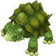 Turtle (30%)</td>
      <td> Ice Flan (35%)</td>
      <td class="highlightGray"></td>
      <td class="highlightGray"></td>
      <td class="highlightReaper"></td>
    </tr>
    <tr>
      <td class="centeredText highlightFog">2</td>
      <td class="highlightGray"></td>
      <td class="highlightGray"></td>
      <td class="highlightGray"></td>
      <td> Frog (35%)</td>
      <td> Turtle (30%)</td>
      <td> Ice Flan (35%)</td>
      <td class="highlightGray"></td>
      <td class="highlightGray"></td>
      <td class="highlightReaper"></td>
    </tr>
    <tr>
      <td class="centeredText highlightFog">3</td>
      <td class="highlightShop"></td>
      <td class="highlightDuel"></td>
      <td class="highlightMH"></td>
      <td> Frog (25%)</td>
      <td> Turtle (25%)</td>
      <td> Ice Flan (25%)</td>
      <td> Scissors (25%)</td>
      <td class="highlightGray"></td>
      <td class="highlightReaper"></td>
    </tr>
    <tr>
      <td class="centeredText highlightFog">4</td>
      <td class="highlightShop"></td>
      <td class="highlightDuel"></td>
      <td class="highlightMH"></td>
      <td>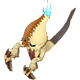 Ghost (25%)</td>
      <td> Turtle (25%)</td>
      <td> Ice Flan (25%)</td>
      <td> Scissors (25%)</td>
      <td class="highlightGray"></td>
      <td class="highlightReaper"></td>
    </tr>
    <tr>
      <td class="centeredText highlightFog">5</td>
      <td class="highlightShop"></td>
      <td class="highlightDuel"></td>
      <td class="highlightMH"></td>
      <td> Ghost (25%)</td>
      <td>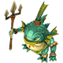 Sahagin (25%)</td>
      <td> Ice Flan (25%)</td>
      <td> Scissors (25%)</td>
      <td class="highlightGray"></td>
      <td class="highlightReaper"></td>
    </tr>
    <tr>
      <td class="centeredText highlightFog">6</td>
      <td class="highlightShop"></td>
      <td class="highlightDuel"></td>
      <td class="highlightMH"></td>
      <td> Ghost (25%)</td>
      <td> Sahagin (25%)</td>
      <td>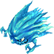 Torpedo (25%)</td>
      <td> Scissors (25%)</td>
      <td class="highlightGray"></td>
      <td class="highlightReaper"></td>
    </tr>
    <tr>
      <td class="centeredText highlightFog">7</td>
      <td class="highlightShop"></td>
      <td class="highlightDuel"></td>
      <td class="highlightMH"></td>
      <td> Ghost (25%)</td>
      <td> Sahagin (25%)</td>
      <td> Torpedo (25%)</td>
      <td> Scissors (25%)</td>
      <td class="highlightGray"></td>
      <td class="highlightReaper"></td>
    </tr>
    <tr>
      <td class="centeredText highlightFog">8</td>
      <td class="highlightShop"></td>
      <td class="highlightDuel"></td>
      <td class="highlightMH"></td>
      <td> Ghost (25%)</td>
      <td> Sahagin (25%)</td>
      <td> Torpedo (25%)</td>
      <td> Skeleton (25%)</td>
      <td class="highlightGray"></td>
      <td class="highlightReaper"></td>
    </tr>
    <tr>
      <td class="centeredText highlightFog">9</td>
      <td class="highlightGray"></td>
      <td class="highlightGray"></td>
      <td class="highlightGray"></td>
      <td> Ghost (25%)</td>
      <td> Sahagin (25%)</td>
      <td> Torpedo (25%)</td>
      <td> Skeleton (25%)</td>
      <td class="highlightGray"></td>
      <td class="highlightReaper"></td>
    </tr>
    <tr class="highlightYellow">
      <td class="centeredText checkpoint">10</td>
      <td></td>
      <td></td>
      <td></td>
      <td colspan="5" class="centeredText"> Scholar's Memories</td>
      <td></td>
    </tr>
    <tr>
      <td class="centeredText highlightFog">11</td>
      <td class="highlightGray"></td>
      <td class="highlightGray"></td>
      <td class="highlightGray"></td>
      <td> Cluster (10%)</td>
      <td> Sahagin (30%)</td>
      <td> Torpedo (30%)</td>
      <td> Skeleton (30%)</td>
      <td class="highlightGray"></td>
      <td class="highlightReaper"></td>
    </tr>
    <tr>
      <td class="centeredText highlightFog">12</td>
      <td class="highlightGray"></td>
      <td class="highlightGray"></td>
      <td class="highlightGray"></td>
      <td> Cluster (10%)</td>
      <td> Lamia (30%)</td>
      <td> Torpedo (30%)</td>
      <td> Skeleton (30%)</td>
      <td class="highlightGray"></td>
      <td class="highlightReaper"></td>
    </tr>
    <tr>
      <td class="centeredText highlightFog">13</td>
      <td class="highlightShop"></td>
      <td class="highlightDuel"></td>
      <td class="highlightMH"></td>
      <td> Cluster (15%)</td>
      <td> Lamia (25%)</td>
      <td> Gigantoad (15%)</td>
      <td> Skeleton (20%)</td>
      <td>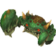 Big Scissors (25%)</td>
      <td class="highlightReaper"></td>
    </tr>
    <tr>
      <td class="centeredText highlightFog">14</td>
      <td class="highlightShop"></td>
      <td class="highlightDuel"></td>
      <td class="highlightMH"></td>
      <td> Cluster (15%)</td>
      <td> Lamia (25%)</td>
      <td> Gigantoad (15%)</td>
      <td> Skeleton (20%)</td>
      <td> Big Scissors (25%)</td>
      <td class="highlightReaper"></td>
    </tr>
    <tr>
      <td class="centeredText highlightFog">15</td>
      <td class="highlightShop"></td>
      <td class="highlightDuel"></td>
      <td class="highlightMH"></td>
      <td> Cluster (15%)</td>
      <td> Lamia (20%)</td>
      <td> Gigantoad (25%)</td>
      <td> Adamantoise (15%)</td>
      <td> Big Scissors (25%)</td>
      <td class="highlightReaper"></td>
    </tr>
    <tr>
      <td class="centeredText highlightFog">16</td>
      <td class="highlightShop"></td>
      <td class="highlightDuel"></td>
      <td class="highlightMH"></td>
      <td>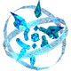 Water Elemental (15%)</td>
      <td> Lamia (20%)</td>
      <td> Gigantoad (25%)</td>
      <td> Adamantoise (15%)</td>
      <td> Big Scissors (25%)</td>
      <td class="highlightReaper"></td>
    </tr>
    <tr>
      <td class="centeredText highlightFog">17</td>
      <td class="highlightShop"></td>
      <td class="highlightDuel"></td>
      <td class="highlightMH"></td>
      <td> Water Elemental (15%)</td>
      <td> Revenant (15%)</td>
      <td> Gigantoad (25%)</td>
      <td> Adamantoise (25%)</td>
      <td> Big Scissors (20%)</td>
      <td class="highlightReaper"></td>
    </tr>
    <tr>
      <td class="centeredText highlightFog">18</td>
      <td class="highlightShop"></td>
      <td class="highlightDuel"></td>
      <td class="highlightMH"></td>
      <td> Water Elemental (15%)</td>
      <td> Revenant (15%)</td>
      <td> Gigantoad (25%)</td>
      <td> Adamantoise (25%)</td>
      <td> Big Scissors (20%)</td>
      <td class="highlightReaper"></td>
    </tr>
    <tr>
      <td class="centeredText highlightFog">19</td>
      <td class="highlightGray"></td>
      <td class="highlightGray"></td>
      <td class="highlightGray"></td>
      <td> Water Elemental (15%)</td>
      <td> Revenant (25%)</td>
      <td> Gigantoad (20%)</td>
      <td> Adamantoise (25%)</td>
      <td>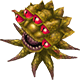 Ochu (15%)</td>
      <td class="highlightReaper"></td>
    </tr>
    <tr>
      <td class="centeredText checkpoint">20</td>
      <td></td>
      <td></td>
      <td></td>
      <td> Fire Elemental</td>
      <td> Water Elemental</td>
      <td> Light Elemental</td>
      <td>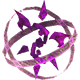 Dark Elemental</td>
      <td></td>
      <td></td>
    </tr>
    <tr>
      <td class="centeredText highlightFog">21</td>
      <td class="highlightGray"></td>
      <td class="highlightGray"></td>
      <td class="highlightGray"></td>
      <td> Water Elemental (15%)</td>
      <td> Revenant (25%)</td>
      <td> Magic Pot (15%)</td>
      <td> Adamantoise (20%)</td>
      <td> Ochu (25%)</td>
      <td class="highlightReaper"></td>
    </tr>
    <tr>
      <td class="centeredText highlightFog">22</td>
      <td class="highlightGray"></td>
      <td class="highlightGray"></td>
      <td class="highlightGray"></td>
      <td> Water Elemental (15%)</td>
      <td> Revenant (20%)</td>
      <td> Magic Pot (15%)</td>
      <td> Sahagin Prince (25%)</td>
      <td> Ochu (25%)</td>
      <td class="highlightReaper"></td>
    </tr>
    <tr>
      <td class="centeredText highlightFog">23</td>
      <td class="highlightShop"></td>
      <td class="highlightDuel"></td>
      <td class="highlightMH"></td>
      <td> Ice Elemental (15%)</td>
      <td> Revenant (20%)</td>
      <td> Magic Pot (15%)</td>
      <td> Sahagin Prince (25%)</td>
      <td> Ochu (25%)</td>
      <td class="highlightReaper"></td>
    </tr>
    <tr>
      <td class="centeredText highlightFog">24</td>
      <td class="highlightShop"></td>
      <td class="highlightDuel"></td>
      <td class="highlightMH"></td>
      <td> Ice Elemental (15%)</td>
      <td>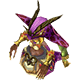 Lamia Queen (25%)</td>
      <td> Magic Pot (15%)</td>
      <td> Sahagin Prince (25%)</td>
      <td> Ochu (20%)</td>
      <td class="highlightReaper"></td>
    </tr>
    <tr>
      <td class="centeredText highlightFog">25</td>
      <td class="highlightShop"></td>
      <td class="highlightDuel"></td>
      <td class="highlightMH"></td>
      <td> Ice Elemental (15%)</td>
      <td> Lamia Queen (25%)</td>
      <td> Magic Pot (15%)</td>
      <td> Sahagin Prince (25%)</td>
      <td> Ochu (20%)</td>
      <td class="highlightReaper"></td>
    </tr>
    <tr>
      <td class="centeredText highlightFog">26</td>
      <td class="highlightShop"></td>
      <td class="highlightDuel"></td>
      <td class="highlightMH"></td>
      <td> Ice Elemental (15%)</td>
      <td> Lamia Queen (25%)</td>
      <td> Magic Pot (10%)</td>
      <td> Sahagin Prince (25%)</td>
      <td> Ice Dragon (25%)</td>
      <td class="highlightReaper"></td>
    </tr>
    <tr>
      <td class="centeredText highlightFog">27</td>
      <td class="highlightShop"></td>
      <td class="highlightDuel"></td>
      <td class="highlightMH"></td>
      <td> Ice Elemental (15%)</td>
      <td> Lamia Queen (25%)</td>
      <td> Magic Pot (10%)</td>
      <td> Sahagin Prince (25%)</td>
      <td> Ice Dragon (25%)</td>
      <td class="highlightReaper"></td>
    </tr>
    <tr>
      <td class="centeredText highlightFog">28</td>
      <td class="highlightShop"></td>
      <td class="highlightDuel"></td>
      <td class="highlightMH"></td>
      <td> Ice Elemental (15%)</td>
      <td> Lamia Queen (25%)</td>
      <td> Magic Pot (10%)</td>
      <td> Sahagin Prince (25%)</td>
      <td> Ice Dragon (25%)</td>
      <td class="highlightReaper"></td>
    </tr>
    <tr class="changeCrystal">
      <td class="centeredText">29</td>
      <td></td>
      <td></td>
      <td></td>
      <td colspan="5" class="centeredText">Change Crystal  Water Apple</td>
      <td></td>
    </tr>
    <tr>
      <td class="centeredText">30</td>
      <td class="highlightGray"></td>
      <td class="highlightGray"></td>
      <td class="highlightGray"></td>
      <td>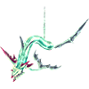 Leviathan</td>
      <td class="highlightGray"></td>
      <td class="highlightGray"></td>
      <td class="highlightGray"></td>
      <td class="highlightGray"></td>
      <td class="highlightGray"></td>
    </tr>
  </tbody>
</table>

 

 Duel Table 

Duel Traps have a 30% chance to be generated between 3-8F, 13-18F, and 23-28F.

<table class="monsterTable">
  <thead>
    <tr>
      <th class="highlightDuel">F</th>
      <th class="highlightDuel" colspan="2">Possible Bosses</th>
    </tr>
  </thead>
  <tbody>
    <tr>
      <td class="centeredText">3-8</td>
      <td> Wraith (80%)</td>
      <td> Mini Cactuar (20%)</td>
    </tr>
    <tr>
      <td class="centeredText">13-18</td>
      <td> Genbu (80%)</td>
      <td> Mini Cactuar (20%)</td>
    </tr>
    <tr>
      <td class="centeredText">23-28</td>
      <td> Shiva (80%)</td>
      <td> Mini Cactuar (20%)</td>
    </tr>
  </tbody>
</table>

 

 Monster Details 

Stat Colors - Hard Mode

### Standard

#### Frog (1-3F)

<table class="buddyOverview">
  <tr class="noPad">
    <th colspan="13" class="highlightGreen">Stats</th>
  </tr>
  <tr>
    <td rowspan="4"></td>
    <td class="hp">HP</td>
    <td>105 / 130</td>
    <td class="atk">Attack</td>
    <td>31 / 34</td>
    <td class="mag">Magic</td>
    <td>25 / 26</td>
    <th>JP</th>
    <td>16 (40%)</td>
    <th>Item 1</th>
    <td colspan="3">Poison Drink (14%)</td>
  </tr>
  <tr>
    <td class="sp">Exp</td>
    <td>80</td>
    <td class="def">Defense</td>
    <td>41 / 42</td>
    <td class="mnd">Mind</td>
    <td>42 / 43</td>
    <th>BP</th>
    <td>3 (40%)</td>
    <th>Item 2</th>
    <td colspan="3">Stinky Greens (8%)</td>
  </tr>
  <tr>
    <th>Hit</th>
    <td>95</td>
    <th>Evasion</th>
    <td>2</td>
    <th>Crit</th>
    <td>5</td>
    <th>Gil</th>
    <td>36 (30%)</td>
    <th>Steal</th>
    <td colspan="3">Poison Drink (60%)</td>
  </tr>
  <tr>
    <th>Lv</th>
    <td>17</td>
    <th>Special</th>
    <td>-</td>
    <th>Resist</th>
    <td colspan="3">-</td>
    <th>Weak</th>
    <td colspan="3">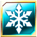</td>
  </tr>
  <tr>
    <th colspan="13" class="abilityName">Silence</th>
  </tr>
  <tr class="elementIcon">
    <th>Element</th>
    <td>-</td>
    <th>Range</th>
    <td></td>
    <th>Notes</th>
    <td colspan="8" class="leftText">Inflict Silence on a target up to 3 tiles ahead.</td>
  </tr>
  <tr>
    <th>Rate / CD</th>
    <td colspan="2">10% / 6T</td>
    <th>Count</th>
    <td>∞</td>
    <th>Multiplier</th>
    <td>x1.0</td>
    <th>Value</th>
    <td>0</td>
    <th>Type</th>
    <td class="leftText">Other</td>
    <th>Calc</th>
    <td class="leftText">None</td>
  </tr>
  <tr>
    <th colspan="13" class="abilityName">Jump</th>
  </tr>
  <tr class="elementIcon">
    <th>Element</th>
    <td>-</td>
    <th>Range</th>
    <td></td>
    <th>Notes</th>
    <td colspan="8" class="leftText">Deal damage + Knockback to a target 1 tile ahead.</td>
  </tr>
  <tr>
    <th>Rate / CD</th>
    <td colspan="2">20% / 0T</td>
    <th>Count</th>
    <td>∞</td>
    <th>Multiplier</th>
    <td>x1.0</td>
    <th>Value</th>
    <td>0</td>
    <th>Type</th>
    <td class="leftText">Physical</td>
    <th>Calc</th>
    <td class="leftText">Stat</td>
  </tr>
  <tr>
    <th colspan="13" class="abilityName">Poison Horn</th>
  </tr>
  <tr class="elementIcon">
    <th>Element</th>
    <td>-</td>
    <th>Range</th>
    <td></td>
    <th>Notes</th>
    <td colspan="8" class="leftText">Deal damage + Poison to a target 1 tile ahead.</td>
  </tr>
  <tr>
    <th>Rate / CD</th>
    <td colspan="2">10% / 3T</td>
    <th>Count</th>
    <td>∞</td>
    <th>Multiplier</th>
    <td>x1.0</td>
    <th>Value</th>
    <td>0</td>
    <th>Type</th>
    <td class="leftText">Physical</td>
    <th>Calc</th>
    <td class="leftText">Stat</td>
  </tr>
</table>

#### Turtle (1-4F)

<table class="buddyOverview">
  <tr class="noPad">
    <th colspan="13" class="highlightGreen">Stats</th>
  </tr>
  <tr>
    <td rowspan="4"></td>
    <td class="hp">HP</td>
    <td>109 / 136</td>
    <td class="atk">Attack</td>
    <td>52 / 55</td>
    <td class="mag">Magic</td>
    <td>34 / 35</td>
    <th>JP</th>
    <td>16 (40%)</td>
    <th>Item 1</th>
    <td colspan="3">Potion (14%)</td>
  </tr>
  <tr>
    <td class="sp">Exp</td>
    <td>122</td>
    <td class="def">Defense</td>
    <td>57 / 59</td>
    <td class="mnd">Mind</td>
    <td>35 / 36</td>
    <th>BP</th>
    <td>3 (40%)</td>
    <th>Item 2</th>
    <td colspan="3">Gysahl Greens (8%)</td>
  </tr>
  <tr>
    <th>Hit</th>
    <td>95</td>
    <th>Evasion</th>
    <td>2</td>
    <th>Crit</th>
    <td>5</td>
    <th>Gil</th>
    <td>38 (10%)</td>
    <th>Steal</th>
    <td colspan="3">Protect Book (60%)</td>
  </tr>
  <tr>
    <th>Lv</th>
    <td>18</td>
    <th>Special</th>
    <td></td>
    <th>Resist</th>
    <td colspan="3">-</td>
    <th>Weak</th>
    <td colspan="3"></td>
  </tr>
  <tr>
    <th colspan="13" class="abilityName">Miraculous Shell</th>
  </tr>
  <tr class="elementIcon">
    <th>Element</th>
    <td>-</td>
    <th>Range</th>
    <td></td>
    <th>Notes</th>
    <td colspan="8" class="leftText">Temporarily cast Protect.</td>
  </tr>
  <tr>
    <th>Rate / CD</th>
    <td colspan="2">10% / 12T</td>
    <th>Count</th>
    <td>∞</td>
    <th>Multiplier</th>
    <td>x1.0</td>
    <th>Value</th>
    <td>0</td>
    <th>Type</th>
    <td class="leftText">Other</td>
    <th>Calc</th>
    <td class="leftText">None</td>
  </tr>
</table>

#### Ice Flan (1-5F)

<table class="buddyOverview">
  <tr class="noPad">
    <th colspan="13" class="highlightGreen">Stats</th>
  </tr>
  <tr>
    <td rowspan="4"></td>
    <td class="hp">HP</td>
    <td>109 / 136</td>
    <td class="atk">Attack</td>
    <td>34 / 35</td>
    <td class="mag">Magic</td>
    <td>34 / 35</td>
    <th>JP</th>
    <td>16 (40%)</td>
    <th>Item 1</th>
    <td colspan="3">-</td>
  </tr>
  <tr>
    <td class="sp">Exp</td>
    <td>122</td>
    <td class="def">Defense</td>
    <td>42 / 43</td>
    <td class="mnd">Mind</td>
    <td>43 / 44</td>
    <th>BP</th>
    <td>3 (40%)</td>
    <th>Item 2</th>
    <td colspan="3">-</td>
  </tr>
  <tr>
    <th>Hit</th>
    <td>95</td>
    <th>Evasion</th>
    <td>4</td>
    <th>Crit</th>
    <td>5</td>
    <th>Gil</th>
    <td>38 (10%)</td>
    <th>Steal</th>
    <td colspan="3">Hi-Potion (60%)</td>
  </tr>
  <tr>
    <th>Lv</th>
    <td>18</td>
    <th>Special</th>
    <td>-</td>
    <th>Resist</th>
    <td colspan="3"></td>
    <th>Weak</th>
    <td colspan="3"></td>
  </tr>
  <tr>
    <th colspan="13" class="abilityName">Divide</th>
  </tr>
  <tr class="elementIcon">
    <th>Element</th>
    <td>-</td>
    <th>Range</th>
    <td></td>
    <th>Notes</th>
    <td colspan="8" class="leftText">Reduce current HP by 1/2 to create a clone when hit.</td>
  </tr>
  <tr>
    <th>Rate / CD</th>
    <td colspan="2">60% / 0T</td>
    <th>Count</th>
    <td>1</td>
    <th>Multiplier</th>
    <td>x1.0</td>
    <th>Value</th>
    <td>0</td>
    <th>Type</th>
    <td class="leftText">Other</td>
    <th>Calc</th>
    <td class="leftText">None</td>
  </tr>
  <tr>
    <th colspan="13" class="abilityName">Digest</th>
  </tr>
  <tr class="elementIcon">
    <th>Element</th>
    <td>-</td>
    <th>Range</th>
    <td></td>
    <th>Notes</th>
    <td colspan="8" class="leftText">Drain HP from a target 1 tile ahead.</td>
  </tr>
  <tr>
    <th>Rate / CD</th>
    <td colspan="2">10% / 4T</td>
    <th>Count</th>
    <td>∞</td>
    <th>Multiplier</th>
    <td>x1.0</td>
    <th>Value</th>
    <td>0</td>
    <th>Type</th>
    <td class="leftText">Magic</td>
    <th>Calc</th>
    <td class="leftText">Stat</td>
  </tr>
  <tr>
    <th colspan="13" class="abilityName">Blizzard</th>
  </tr>
  <tr class="elementIcon">
    <th>Element</th>
    <td></td>
    <th>Range</th>
    <td>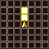</td>
    <th>Notes</th>
    <td colspan="8" class="leftText">Deal ice damage to a target up to 2 tiles ahead.</td>
  </tr>
  <tr>
    <th>Rate / CD</th>
    <td colspan="2">10% / 4T</td>
    <th>Count</th>
    <td>∞</td>
    <th>Multiplier</th>
    <td>x1.0</td>
    <th>Value</th>
    <td>8</td>
    <th>Type</th>
    <td class="leftText">Magic</td>
    <th>Calc</th>
    <td class="leftText">Stat</td>
  </tr>
</table>

#### Scissors (3-7F)

<table class="buddyOverview">
  <tr class="noPad">
    <th colspan="13" class="highlightGreen">Stats</th>
  </tr>
  <tr>
    <td rowspan="4"></td>
    <td class="hp">HP</td>
    <td>56 / 69</td>
    <td class="atk">Attack</td>
    <td>55 / 58</td>
    <td class="mag">Magic</td>
    <td>27 / 28</td>
    <th>JP</th>
    <td>18 (40%)</td>
    <th>Item 1</th>
    <td colspan="3">Potion (14%)</td>
  </tr>
  <tr>
    <td class="sp">Exp</td>
    <td>147</td>
    <td class="def">Defense</td>
    <td>59 / 60</td>
    <td class="mnd">Mind</td>
    <td>36 / 37</td>
    <th>BP</th>
    <td>3 (40%)</td>
    <th>Item 2</th>
    <td colspan="3">Ether (8%)</td>
  </tr>
  <tr>
    <th>Hit</th>
    <td>95</td>
    <th>Evasion</th>
    <td>4</td>
    <th>Crit</th>
    <td>5</td>
    <th>Gil</th>
    <td>40 (10%)</td>
    <th>Steal</th>
    <td colspan="3">Salt Water (60%)</td>
  </tr>
  <tr>
    <th>Lv</th>
    <td>19</td>
    <th>Special</th>
    <td>-</td>
    <th>Resist</th>
    <td colspan="3">-</td>
    <th>Weak</th>
    <td colspan="3"></td>
  </tr>
  <tr>
    <th colspan="13" class="abilityName">Pinch</th>
  </tr>
  <tr class="elementIcon">
    <th>Element</th>
    <td>-</td>
    <th>Range</th>
    <td></td>
    <th>Notes</th>
    <td colspan="8" class="leftText">Deal damage + Immobilize to a target 1 tile ahead.</td>
  </tr>
  <tr>
    <th>Rate / CD</th>
    <td colspan="2">20% / 6T</td>
    <th>Count</th>
    <td>∞</td>
    <th>Multiplier</th>
    <td>x1.0</td>
    <th>Value</th>
    <td>0</td>
    <th>Type</th>
    <td class="leftText">Physical</td>
    <th>Calc</th>
    <td class="leftText">Stat</td>
  </tr>
</table>

#### Ghost (4-9F)

<table class="buddyOverview">
  <tr class="noPad">
    <th colspan="13" class="highlightGreen">Stats</th>
  </tr>
  <tr>
    <td rowspan="4"></td>
    <td class="hp">HP</td>
    <td>56 / 69</td>
    <td class="atk">Attack</td>
    <td>35 / 38</td>
    <td class="mag">Magic</td>
    <td>43 / 44</td>
    <th>JP</th>
    <td>2 (40%)</td>
    <th>Item 1</th>
    <td colspan="3">Stinky Greens (14%)</td>
  </tr>
  <tr>
    <td class="sp">Exp</td>
    <td>98</td>
    <td class="def">Defense</td>
    <td>43 / 43</td>
    <td class="mnd">Mind</td>
    <td>56 / 57</td>
    <th>BP</th>
    <td>3 (40%)</td>
    <th>Item 2</th>
    <td colspan="3">Warp Wings (8%)</td>
  </tr>
  <tr>
    <th>Hit</th>
    <td>95</td>
    <th>Evasion</th>
    <td>8</td>
    <th>Crit</th>
    <td>5</td>
    <th>Gil</th>
    <td>-</td>
    <th>Steal</th>
    <td colspan="3">Stinky Greens (60%)</td>
  </tr>
  <tr>
    <th>Lv</th>
    <td>19</td>
    <th>Special</th>
    <td></td>
    <th>Resist</th>
    <td colspan="3"></td>
    <th>Weak</th>
    <td colspan="3"></td>
  </tr>
  <tr>
    <th colspan="13" class="abilityName">Hunger Strike</th>
  </tr>
  <tr class="elementIcon">
    <th>Element</th>
    <td>-</td>
    <th>Range</th>
    <td></td>
    <th>Notes</th>
    <td colspan="8" class="leftText">Lower Food Level by 10.</td>
  </tr>
  <tr>
    <th>Rate / CD</th>
    <td colspan="2">40% / 3T</td>
    <th>Count</th>
    <td>∞</td>
    <th>Multiplier</th>
    <td>x1.0</td>
    <th>Value</th>
    <td>10</td>
    <th>Type</th>
    <td class="leftText">Magic</td>
    <th>Calc</th>
    <td class="leftText">Fixed</td>
  </tr>
  <tr>
    <th colspan="13" class="abilityName">Rust in Pieces</th>
  </tr>
  <tr class="elementIcon">
    <th>Element</th>
    <td>-</td>
    <th>Range</th>
    <td></td>
    <th>Notes</th>
    <td colspan="8" class="leftText">Lower hone value of equipped Talons or Saddle by 1.</td>
  </tr>
  <tr>
    <th>Rate / CD</th>
    <td colspan="2">10% / 3T</td>
    <th>Count</th>
    <td>∞</td>
    <th>Multiplier</th>
    <td>x1.0</td>
    <th>Value</th>
    <td>0</td>
    <th>Type</th>
    <td class="leftText">Other</td>
    <th>Calc</th>
    <td class="leftText">None</td>
  </tr>
</table>

#### Sahagin (5-11F)

<table class="buddyOverview">
  <tr class="noPad">
    <th colspan="13" class="highlightGreen">Stats</th>
  </tr>
  <tr>
    <td rowspan="4"></td>
    <td class="hp">HP</td>
    <td>78 / 97</td>
    <td class="atk">Attack</td>
    <td>48 / 51</td>
    <td class="mag">Magic</td>
    <td>36 / 37</td>
    <th>JP</th>
    <td>18 (40%)</td>
    <th>Item 1</th>
    <td colspan="3">Potion (14%)</td>
  </tr>
  <tr>
    <td class="sp">Exp</td>
    <td>148</td>
    <td class="def">Defense</td>
    <td>51 / 52</td>
    <td class="mnd">Mind</td>
    <td>45 / 46</td>
    <th>BP</th>
    <td>3 (40%)</td>
    <th>Item 2</th>
    <td colspan="3">Water Saddle (8%)</td>
  </tr>
  <tr>
    <th>Hit</th>
    <td>95</td>
    <th>Evasion</th>
    <td>4</td>
    <th>Crit</th>
    <td>5</td>
    <th>Gil</th>
    <td>50 (30%)</td>
    <th>Steal</th>
    <td colspan="3">Salt Water (60%)</td>
  </tr>
  <tr>
    <th>Lv</th>
    <td>20</td>
    <th>Special</th>
    <td>-</td>
    <th>Resist</th>
    <td colspan="3">-</td>
    <th>Weak</th>
    <td colspan="3"></td>
  </tr>
  <tr>
    <th colspan="13" class="abilityName">Trident</th>
  </tr>
  <tr class="elementIcon">
    <th>Element</th>
    <td>-</td>
    <th>Range</th>
    <td></td>
    <th>Notes</th>
    <td colspan="8" class="leftText">Deal damage + Knockback to a target 1 tile ahead.</td>
  </tr>
  <tr>
    <th>Rate / CD</th>
    <td colspan="2">10% / 0T</td>
    <th>Count</th>
    <td>∞</td>
    <th>Multiplier</th>
    <td>x1.0</td>
    <th>Value</th>
    <td>0</td>
    <th>Type</th>
    <td class="leftText">Physical</td>
    <th>Calc</th>
    <td class="leftText">Stat</td>
  </tr>
  <tr>
    <th colspan="13" class="abilityName">Rusty Water</th>
  </tr>
  <tr class="elementIcon">
    <th>Element</th>
    <td>-</td>
    <th>Range</th>
    <td></td>
    <th>Notes</th>
    <td colspan="8" class="leftText">Lower hone value of equipped Talons or Saddle by 1.</td>
  </tr>
  <tr>
    <th>Rate / CD</th>
    <td colspan="2">10% / 12T</td>
    <th>Count</th>
    <td>∞</td>
    <th>Multiplier</th>
    <td>x1.0</td>
    <th>Value</th>
    <td>0</td>
    <th>Type</th>
    <td class="leftText">Other</td>
    <th>Calc</th>
    <td class="leftText">None</td>
  </tr>
</table>

#### Torpedo (6-12F)

<table class="buddyOverview">
  <tr class="noPad">
    <th colspan="13" class="highlightGreen">Stats</th>
  </tr>
  <tr>
    <td rowspan="4"></td>
    <td class="hp">HP</td>
    <td>118 / 146</td>
    <td class="atk">Attack</td>
    <td>38 / 41</td>
    <td class="mag">Magic</td>
    <td>36 / 37</td>
    <th>JP</th>
    <td>18 (40%)</td>
    <th>Item 1</th>
    <td colspan="3">Water Talons (8%)</td>
  </tr>
  <tr>
    <td class="sp">Exp</td>
    <td>124</td>
    <td class="def">Defense</td>
    <td>43 / 44</td>
    <td class="mnd">Mind</td>
    <td>45 / 46</td>
    <th>BP</th>
    <td>3 (40%)</td>
    <th>Item 2</th>
    <td colspan="3">Bomb Shard (2%)</td>
  </tr>
  <tr>
    <th>Hit</th>
    <td>95</td>
    <th>Evasion</th>
    <td>4</td>
    <th>Crit</th>
    <td>5</td>
    <th>Gil</th>
    <td>42 (10%)</td>
    <th>Steal</th>
    <td colspan="3">Bomb Shard (30%)</td>
  </tr>
  <tr>
    <th>Lv</th>
    <td>20</td>
    <th>Special</th>
    <td></td>
    <th>Resist</th>
    <td colspan="3"></td>
    <th>Weak</th>
    <td colspan="3"></td>
  </tr>
  <tr>
    <th colspan="13" class="abilityName">Self-Destruct</th>
  </tr>
  <tr class="elementIcon">
    <th>Element</th>
    <td></td>
    <th>Range</th>
    <td></td>
    <th>Notes</th>
    <td colspan="8" class="leftText">Halve the HP of targets in a 3 tile radius, then collapse.</td>
  </tr>
  <tr>
    <th>Rate / CD</th>
    <td colspan="2">10% / 0T</td>
    <th>Count</th>
    <td>1</td>
    <th>Multiplier</th>
    <td>x1.0</td>
    <th>Value</th>
    <td>50</td>
    <th>Type</th>
    <td class="leftText">Magic</td>
    <th>Calc</th>
    <td class="leftText">Ratio</td>
  </tr>
  <tr>
    <th colspan="13" class="abilityName">Blaze</th>
  </tr>
  <tr class="elementIcon">
    <th>Element</th>
    <td>-</td>
    <th>Range</th>
    <td></td>
    <th>Notes</th>
    <td colspan="8" class="leftText">Temporarily cast Bravery.</td>
  </tr>
  <tr>
    <th>Rate / CD</th>
    <td colspan="2">5% / 5T</td>
    <th>Count</th>
    <td>∞</td>
    <th>Multiplier</th>
    <td>x1.0</td>
    <th>Value</th>
    <td>0</td>
    <th>Type</th>
    <td class="leftText">Other</td>
    <th>Calc</th>
    <td class="leftText">None</td>
  </tr>
</table>

#### Skeleton (8-14F)

<table class="buddyOverview">
  <tr class="noPad">
    <th colspan="13" class="highlightGreen">Stats</th>
  </tr>
  <tr>
    <td rowspan="4"></td>
    <td class="hp">HP</td>
    <td>60 / 74</td>
    <td class="atk">Attack</td>
    <td>51 / 54</td>
    <td class="mag">Magic</td>
    <td>45 / 46</td>
    <th>JP</th>
    <td>2 (40%)</td>
    <th>Item 1</th>
    <td colspan="3">Potion (14%)</td>
  </tr>
  <tr>
    <td class="sp">Exp</td>
    <td>125</td>
    <td class="def">Defense</td>
    <td>61 / 62</td>
    <td class="mnd">Mind</td>
    <td>38 / 39</td>
    <th>BP</th>
    <td>3 (40%)</td>
    <th>Item 2</th>
    <td colspan="3">Stinky Greens (8%)</td>
  </tr>
  <tr>
    <th>Hit</th>
    <td>95</td>
    <th>Evasion</th>
    <td>4</td>
    <th>Crit</th>
    <td>5</td>
    <th>Gil</th>
    <td>-</td>
    <th>Steal</th>
    <td colspan="3">Antidote (60%)</td>
  </tr>
  <tr>
    <th>Lv</th>
    <td>21</td>
    <th>Special</th>
    <td></td>
    <th>Resist</th>
    <td colspan="3"></td>
    <th>Weak</th>
    <td colspan="3"></td>
  </tr>
  <tr>
    <th colspan="13" class="abilityName">Poison Slash</th>
  </tr>
  <tr class="elementIcon">
    <th>Element</th>
    <td>-</td>
    <th>Range</th>
    <td></td>
    <th>Notes</th>
    <td colspan="8" class="leftText">Deal damage + Poison to a target 1 tile ahead.</td>
  </tr>
  <tr>
    <th>Rate / CD</th>
    <td colspan="2">10% / 3T</td>
    <th>Count</th>
    <td>∞</td>
    <th>Multiplier</th>
    <td>x1.0</td>
    <th>Value</th>
    <td>0</td>
    <th>Type</th>
    <td class="leftText">Physical</td>
    <th>Calc</th>
    <td class="leftText">Stat</td>
  </tr>
  <tr>
    <th colspan="13" class="abilityName">Horror Cloud</th>
  </tr>
  <tr class="elementIcon">
    <th>Element</th>
    <td>-</td>
    <th>Range</th>
    <td></td>
    <th>Notes</th>
    <td colspan="8" class="leftText">Inflict Slow on a target 1 tile ahead.</td>
  </tr>
  <tr>
    <th>Rate / CD</th>
    <td colspan="2">10% / 3T</td>
    <th>Count</th>
    <td>∞</td>
    <th>Multiplier</th>
    <td>x1.0</td>
    <th>Value</th>
    <td>0</td>
    <th>Type</th>
    <td class="leftText">Other</td>
    <th>Calc</th>
    <td class="leftText">None</td>
  </tr>
</table>

#### Cluster (11-15F)

<table class="buddyOverview">
  <tr class="noPad">
    <th colspan="13" class="highlightGreen">Stats</th>
  </tr>
  <tr>
    <td rowspan="4"></td>
    <td class="hp">HP</td>
    <td>118 / 146</td>
    <td class="atk">Attack</td>
    <td>38 / 41</td>
    <td class="mag">Magic</td>
    <td>36 / 37</td>
    <th>JP</th>
    <td>18 (40%)</td>
    <th>Item 1</th>
    <td colspan="3">Water Talons (8%)</td>
  </tr>
  <tr>
    <td class="sp">Exp</td>
    <td>124</td>
    <td class="def">Defense</td>
    <td>43 / 44</td>
    <td class="mnd">Mind</td>
    <td>45 / 46</td>
    <th>BP</th>
    <td>3 (40%)</td>
    <th>Item 2</th>
    <td colspan="3">Bomb Shard (2%)</td>
  </tr>
  <tr>
    <th>Hit</th>
    <td>95</td>
    <th>Evasion</th>
    <td>4</td>
    <th>Crit</th>
    <td>5</td>
    <th>Gil</th>
    <td>42 (10%)</td>
    <th>Steal</th>
    <td colspan="3">Bomb Shard (30%)</td>
  </tr>
  <tr>
    <th>Lv</th>
    <td>20</td>
    <th>Special</th>
    <td></td>
    <th>Resist</th>
    <td colspan="3"></td>
    <th>Weak</th>
    <td colspan="3"></td>
  </tr>
  <tr>
    <th colspan="13" class="abilityName">Self-Destruct</th>
  </tr>
  <tr class="elementIcon">
    <th>Element</th>
    <td></td>
    <th>Range</th>
    <td></td>
    <th>Notes</th>
    <td colspan="8" class="leftText">Halve the HP of targets in a 3 tile radius, then collapse.</td>
  </tr>
  <tr>
    <th>Rate / CD</th>
    <td colspan="2">10% / 0T</td>
    <th>Count</th>
    <td>1</td>
    <th>Multiplier</th>
    <td>x1.0</td>
    <th>Value</th>
    <td>50</td>
    <th>Type</th>
    <td class="leftText">Magic</td>
    <th>Calc</th>
    <td class="leftText">Ratio</td>
  </tr>
  <tr>
    <th colspan="13" class="abilityName">Blaze</th>
  </tr>
  <tr class="elementIcon">
    <th>Element</th>
    <td>-</td>
    <th>Range</th>
    <td></td>
    <th>Notes</th>
    <td colspan="8" class="leftText">Temporarily cast Bravery.</td>
  </tr>
  <tr>
    <th>Rate / CD</th>
    <td colspan="2">5% / 5T</td>
    <th>Count</th>
    <td>∞</td>
    <th>Multiplier</th>
    <td>x1.0</td>
    <th>Value</th>
    <td>0</td>
    <th>Type</th>
    <td class="leftText">Other</td>
    <th>Calc</th>
    <td class="leftText">None</td>
  </tr>
</table>

#### Lamia (12-16F)

<table class="buddyOverview">
  <tr class="noPad">
    <th colspan="13" class="highlightGreen">Stats</th>
  </tr>
  <tr>
    <td rowspan="4"></td>
    <td class="hp">HP</td>
    <td>81 / 100</td>
    <td class="atk">Attack</td>
    <td>41 / 44</td>
    <td class="mag">Magic</td>
    <td>45 / 46</td>
    <th>JP</th>
    <td>18 (40%)</td>
    <th>Item 1</th>
    <td colspan="3">Hi-Potion (8%)</td>
  </tr>
  <tr>
    <td class="sp">Exp</td>
    <td>150</td>
    <td class="def">Defense</td>
    <td>52 / 53</td>
    <td class="mnd">Mind</td>
    <td>58 / 59</td>
    <th>BP</th>
    <td>3 (40%)</td>
    <th>Item 2</th>
    <td colspan="3">Hi-Ether (8%)</td>
  </tr>
  <tr>
    <th>Hit</th>
    <td>95</td>
    <th>Evasion</th>
    <td>4</td>
    <th>Crit</th>
    <td>5</td>
    <th>Gil</th>
    <td>44 (30%)</td>
    <th>Steal</th>
    <td colspan="3">Goblin's Tonic (60%)</td>
  </tr>
  <tr>
    <th>Lv</th>
    <td>21</td>
    <th>Special</th>
    <td>-</td>
    <th>Resist</th>
    <td colspan="3">-</td>
    <th>Weak</th>
    <td colspan="3"></td>
  </tr>
  <tr>
    <th colspan="13" class="abilityName">Entice</th>
  </tr>
  <tr class="elementIcon">
    <th>Element</th>
    <td>-</td>
    <th>Range</th>
    <td></td>
    <th>Notes</th>
    <td colspan="8" class="leftText">Inflict Confuse on a target 1 tile ahead.</td>
  </tr>
  <tr>
    <th>Rate / CD</th>
    <td colspan="2">10% / 8T</td>
    <th>Count</th>
    <td>∞</td>
    <th>Multiplier</th>
    <td>x1.0</td>
    <th>Value</th>
    <td>0</td>
    <th>Type</th>
    <td class="leftText">Other</td>
    <th>Calc</th>
    <td class="leftText">None</td>
  </tr>
  <tr>
    <th colspan="13" class="abilityName">Silence</th>
  </tr>
  <tr class="elementIcon">
    <th>Element</th>
    <td>-</td>
    <th>Range</th>
    <td></td>
    <th>Notes</th>
    <td colspan="8" class="leftText">Inflict Silence on a target up to 3 tiles ahead.</td>
  </tr>
  <tr>
    <th>Rate / CD</th>
    <td colspan="2">10% / 6T</td>
    <th>Count</th>
    <td>∞</td>
    <th>Multiplier</th>
    <td>x1.0</td>
    <th>Value</th>
    <td>0</td>
    <th>Type</th>
    <td class="leftText">Other</td>
    <th>Calc</th>
    <td class="leftText">None</td>
  </tr>
</table>

#### Big Scissors (13-18F)

<table class="buddyOverview">
  <tr class="noPad">
    <th colspan="13" class="highlightGreen">Stats</th>
  </tr>
  <tr>
    <td rowspan="4"></td>
    <td class="hp">HP</td>
    <td>62 / 76</td>
    <td class="atk">Attack</td>
    <td>74 / 77</td>
    <td class="mag">Magic</td>
    <td>30 / 31</td>
    <th>JP</th>
    <td>20 (40%)</td>
    <th>Item 1</th>
    <td colspan="3">Hi-Potion (14%)</td>
  </tr>
  <tr>
    <td class="sp">Exp</td>
    <td>175</td>
    <td class="def">Defense</td>
    <td>62 / 63</td>
    <td class="mnd">Mind</td>
    <td>39 / 40</td>
    <th>BP</th>
    <td>3 (40%)</td>
    <th>Item 2</th>
    <td colspan="3">Gysahl Greens (8%)</td>
  </tr>
  <tr>
    <th>Hit</th>
    <td>95</td>
    <th>Evasion</th>
    <td>4</td>
    <th>Crit</th>
    <td>5</td>
    <th>Gil</th>
    <td>46 (10%)</td>
    <th>Steal</th>
    <td colspan="3">Salt Water (60%)</td>
  </tr>
  <tr>
    <th>Lv</th>
    <td>22</td>
    <th>Special</th>
    <td>-</td>
    <th>Resist</th>
    <td colspan="3">-</td>
    <th>Weak</th>
    <td colspan="3"></td>
  </tr>
  <tr>
    <th colspan="13" class="abilityName">Pinch</th>
  </tr>
  <tr class="elementIcon">
    <th>Element</th>
    <td>-</td>
    <th>Range</th>
    <td></td>
    <th>Notes</th>
    <td colspan="8" class="leftText">Deal damage + Immobilize to a target 1 tile ahead.</td>
  </tr>
  <tr>
    <th>Rate / CD</th>
    <td colspan="2">20% / 6T</td>
    <th>Count</th>
    <td>∞</td>
    <th>Multiplier</th>
    <td>x1.0</td>
    <th>Value</th>
    <td>0</td>
    <th>Type</th>
    <td class="leftText">Physical</td>
    <th>Calc</th>
    <td class="leftText">Stat</td>
  </tr>
  <tr>
    <th colspan="13" class="abilityName">Salt Water</th>
  </tr>
  <tr class="elementIcon">
    <th>Element</th>
    <td>-</td>
    <th>Range</th>
    <td></td>
    <th>Notes</th>
    <td colspan="8" class="leftText">Lower hone value of equipped Talons or Saddle by 1.</td>
  </tr>
  <tr>
    <th>Rate / CD</th>
    <td colspan="2">10% / 12T</td>
    <th>Count</th>
    <td>∞</td>
    <th>Multiplier</th>
    <td>x1.0</td>
    <th>Value</th>
    <td>0</td>
    <th>Type</th>
    <td class="leftText">Other</td>
    <th>Calc</th>
    <td class="leftText">None</td>
  </tr>
</table>

#### Gigantoad (13-19F)

<table class="buddyOverview">
  <tr class="noPad">
    <th colspan="13" class="highlightGreen">Stats</th>
  </tr>
  <tr>
    <td rowspan="4"></td>
    <td class="hp">HP</td>
    <td>126 / 155</td>
    <td class="atk">Attack</td>
    <td>44 / 47</td>
    <td class="mag">Magic</td>
    <td>30 / 31</td>
    <th>JP</th>
    <td>20 (40%)</td>
    <th>Item 1</th>
    <td colspan="3">Poison Drink (14%)</td>
  </tr>
  <tr>
    <td class="sp">Exp</td>
    <td>116</td>
    <td class="def">Defense</td>
    <td>45 / 46</td>
    <td class="mnd">Mind</td>
    <td>47 / 48</td>
    <th>BP</th>
    <td>3 (40%)</td>
    <th>Item 2</th>
    <td colspan="3">Stinky Greens (8%)</td>
  </tr>
  <tr>
    <th>Hit</th>
    <td>95</td>
    <th>Evasion</th>
    <td>2</td>
    <th>Crit</th>
    <td>5</td>
    <th>Gil</th>
    <td>46 (30%)</td>
    <th>Steal</th>
    <td colspan="3">Poison Drink (60%)</td>
  </tr>
  <tr>
    <th>Lv</th>
    <td>22</td>
    <th>Special</th>
    <td>-</td>
    <th>Resist</th>
    <td colspan="3">-</td>
    <th>Weak</th>
    <td colspan="3"></td>
  </tr>
  <tr>
    <th colspan="13" class="abilityName">Silence</th>
  </tr>
  <tr class="elementIcon">
    <th>Element</th>
    <td>-</td>
    <th>Range</th>
    <td></td>
    <th>Notes</th>
    <td colspan="8" class="leftText">Inflict Silence on a target up to 3 tiles ahead.</td>
  </tr>
  <tr>
    <th>Rate / CD</th>
    <td colspan="2">10% / 6T</td>
    <th>Count</th>
    <td>∞</td>
    <th>Multiplier</th>
    <td>x1.0</td>
    <th>Value</th>
    <td>0</td>
    <th>Type</th>
    <td class="leftText">Other</td>
    <th>Calc</th>
    <td class="leftText">None</td>
  </tr>
  <tr>
    <th colspan="13" class="abilityName">Jump</th>
  </tr>
  <tr class="elementIcon">
    <th>Element</th>
    <td>-</td>
    <th>Range</th>
    <td></td>
    <th>Notes</th>
    <td colspan="8" class="leftText">Deal damage + Knockback to a target 1 tile ahead.</td>
  </tr>
  <tr>
    <th>Rate / CD</th>
    <td colspan="2">20% / 0T</td>
    <th>Count</th>
    <td>∞</td>
    <th>Multiplier</th>
    <td>x1.0</td>
    <th>Value</th>
    <td>0</td>
    <th>Type</th>
    <td class="leftText">Physical</td>
    <th>Calc</th>
    <td class="leftText">Stat</td>
  </tr>
  <tr>
    <th colspan="13" class="abilityName">Sticky Goo</th>
  </tr>
  <tr class="elementIcon">
    <th>Element</th>
    <td>-</td>
    <th>Range</th>
    <td></td>
    <th>Notes</th>
    <td colspan="8" class="leftText">Inflict Slow on a target 1 tile ahead.</td>
  </tr>
  <tr>
    <th>Rate / CD</th>
    <td colspan="2">10% / 6T</td>
    <th>Count</th>
    <td>∞</td>
    <th>Multiplier</th>
    <td>x1.0</td>
    <th>Value</th>
    <td>0</td>
    <th>Type</th>
    <td class="leftText">Other</td>
    <th>Calc</th>
    <td class="leftText">None</td>
  </tr>
</table>

#### Adamantoise (15-21F)

<table class="buddyOverview">
  <tr class="noPad">
    <th colspan="13" class="highlightGreen">Stats</th>
  </tr>
  <tr>
    <td rowspan="4"></td>
    <td class="hp">HP</td>
    <td>130 / 161</td>
    <td class="atk">Attack</td>
    <td>77 / 80</td>
    <td class="mag">Magic</td>
    <td>39 / 40</td>
    <th>JP</th>
    <td>20 (40%)</td>
    <th>Item 1</th>
    <td colspan="3">Copper Saddle (8%)</td>
  </tr>
  <tr>
    <td class="sp">Exp</td>
    <td>147</td>
    <td class="def">Defense</td>
    <td>63 / 64</td>
    <td class="mnd">Mind</td>
    <td>40 / 41</td>
    <th>BP</th>
    <td>3 (40%)</td>
    <th>Item 2</th>
    <td colspan="3">Water Saddle (8%)</td>
  </tr>
  <tr>
    <th>Hit</th>
    <td>95</td>
    <th>Evasion</th>
    <td>2</td>
    <th>Crit</th>
    <td>5</td>
    <th>Gil</th>
    <td>48 (10%)</td>
    <th>Steal</th>
    <td colspan="3">Water Saddle (60%)</td>
  </tr>
  <tr>
    <th>Lv</th>
    <td>23</td>
    <th>Special</th>
    <td></td>
    <th>Resist</th>
    <td colspan="3">-</td>
    <th>Weak</th>
    <td colspan="3"></td>
  </tr>
  <tr>
    <th colspan="13" class="abilityName">Miraculous Shell</th>
  </tr>
  <tr class="elementIcon">
    <th>Element</th>
    <td>-</td>
    <th>Range</th>
    <td></td>
    <th>Notes</th>
    <td colspan="8" class="leftText">Temporarily cast Protect.</td>
  </tr>
  <tr>
    <th>Rate / CD</th>
    <td colspan="2">10% / 12T</td>
    <th>Count</th>
    <td>∞</td>
    <th>Multiplier</th>
    <td>x1.0</td>
    <th>Value</th>
    <td>0</td>
    <th>Type</th>
    <td class="leftText">Other</td>
    <th>Calc</th>
    <td class="leftText">None</td>
  </tr>
  <tr>
    <th colspan="13" class="abilityName">Rush</th>
  </tr>
  <tr class="elementIcon">
    <th>Element</th>
    <td>-</td>
    <th>Range</th>
    <td></td>
    <th>Notes</th>
    <td colspan="8" class="leftText">Deal damage + Knockback to a target 1 tile ahead.</td>
  </tr>
  <tr>
    <th>Rate / CD</th>
    <td colspan="2">20% / 0T</td>
    <th>Count</th>
    <td>∞</td>
    <th>Multiplier</th>
    <td>x1.0</td>
    <th>Value</th>
    <td>0</td>
    <th>Type</th>
    <td class="leftText">Physical</td>
    <th>Calc</th>
    <td class="leftText">Stat</td>
  </tr>
  <tr>
    <th colspan="13" class="abilityName">Shell</th>
  </tr>
  <tr class="elementIcon">
    <th>Element</th>
    <td>-</td>
    <th>Range</th>
    <td></td>
    <th>Notes</th>
    <td colspan="8" class="leftText">Temporarily cast Shell on self or a target up to 2 tiles ahead.</td>
  </tr>
  <tr>
    <th>Rate / CD</th>
    <td colspan="2">5% / 6T</td>
    <th>Count</th>
    <td>∞</td>
    <th>Multiplier</th>
    <td>x1.0</td>
    <th>Value</th>
    <td>0</td>
    <th>Type</th>
    <td class="leftText">Other</td>
    <th>Calc</th>
    <td class="leftText">None</td>
  </tr>
</table>

#### Water Elemental (16-22F)

<table class="buddyOverview">
  <tr class="noPad">
    <th colspan="13" class="highlightGreen">Stats</th>
  </tr>
  <tr>
    <td rowspan="4"></td>
    <td class="hp">HP</td>
    <td>3 / 3</td>
    <td class="atk">Attack</td>
    <td>41 / 44</td>
    <td class="mag">Magic</td>
    <td>37 / 38</td>
    <th>JP</th>
    <td>40 (40%)</td>
    <th>Item 1</th>
    <td colspan="3">-</td>
  </tr>
  <tr>
    <td class="sp">Exp</td>
    <td>125</td>
    <td class="def">Defense</td>
    <td>52 / 53</td>
    <td class="mnd">Mind</td>
    <td>46 / 47</td>
    <th>BP</th>
    <td>3 (40%)</td>
    <th>Item 2</th>
    <td colspan="3">-</td>
  </tr>
  <tr>
    <th>Hit</th>
    <td>95</td>
    <th>Evasion</th>
    <td>4</td>
    <th>Crit</th>
    <td>0</td>
    <th>Gil</th>
    <td>-</td>
    <th>Steal</th>
    <td colspan="3">Hi-Ether (60%)</td>
  </tr>
  <tr>
    <th>Lv</th>
    <td>21</td>
    <th>Special</th>
    <td></td>
    <th>Resist</th>
    <td colspan="3"></td>
    <th>Weak</th>
    <td colspan="3"></td>
  </tr>
  <tr>
    <th colspan="13" class="abilityName">Water</th>
  </tr>
  <tr class="elementIcon">
    <th>Element</th>
    <td></td>
    <th>Range</th>
    <td></td>
    <th>Notes</th>
    <td colspan="8" class="leftText">Deal water damage to a target up to 2 tiles ahead.</td>
  </tr>
  <tr>
    <th>Rate / CD</th>
    <td colspan="2">20% / 4T</td>
    <th>Count</th>
    <td>∞</td>
    <th>Multiplier</th>
    <td>x1.0</td>
    <th>Value</th>
    <td>8</td>
    <th>Type</th>
    <td class="leftText">Magic</td>
    <th>Calc</th>
    <td class="leftText">Stat</td>
  </tr>
  <tr>
    <th colspan="13" class="abilityName">Cure</th>
  </tr>
  <tr class="elementIcon">
    <th>Element</th>
    <td>-</td>
    <th>Range</th>
    <td></td>
    <th>Notes</th>
    <td colspan="8" class="leftText">Heal HP of self or a target up to 2 tiles ahead.</td>
  </tr>
  <tr>
    <th>Rate / CD</th>
    <td colspan="2">5% / 4T</td>
    <th>Count</th>
    <td>∞</td>
    <th>Multiplier</th>
    <td>x1.0</td>
    <th>Value</th>
    <td>30</td>
    <th>Type</th>
    <td class="leftText">Healing</td>
    <th>Calc</th>
    <td class="leftText">Stat</td>
  </tr>
</table>

#### Revenant (17-23F)

<table class="buddyOverview">
  <tr class="noPad">
    <th colspan="13" class="highlightGreen">Stats</th>
  </tr>
  <tr>
    <td rowspan="4"></td>
    <td class="hp">HP</td>
    <td>64 / 79</td>
    <td class="atk">Attack</td>
    <td>47 / 50</td>
    <td class="mag">Magic</td>
    <td>47 / 48</td>
    <th>JP</th>
    <td>2 (40%)</td>
    <th>Item 1</th>
    <td colspan="3">Stinky Greens (14%)</td>
  </tr>
  <tr>
    <td class="sp">Exp</td>
    <td>117</td>
    <td class="def">Defense</td>
    <td>46 / 47</td>
    <td class="mnd">Mind</td>
    <td>60 / 61</td>
    <th>BP</th>
    <td>3 (40%)</td>
    <th>Item 2</th>
    <td colspan="3">Warp Wings (8%)</td>
  </tr>
  <tr>
    <th>Hit</th>
    <td>95</td>
    <th>Evasion</th>
    <td>8</td>
    <th>Crit</th>
    <td>5</td>
    <th>Gil</th>
    <td>-</td>
    <th>Steal</th>
    <td colspan="3">Stinky Greens (60%)</td>
  </tr>
  <tr>
    <th>Lv</th>
    <td>23</td>
    <th>Special</th>
    <td></td>
    <th>Resist</th>
    <td colspan="3"></td>
    <th>Weak</th>
    <td colspan="3"></td>
  </tr>
  <tr>
    <th colspan="13" class="abilityName">Hunger Strike</th>
  </tr>
  <tr class="elementIcon">
    <th>Element</th>
    <td>-</td>
    <th>Range</th>
    <td></td>
    <th>Notes</th>
    <td colspan="8" class="leftText">Lower Food Level by 10.</td>
  </tr>
  <tr>
    <th>Rate / CD</th>
    <td colspan="2">40% / 3T</td>
    <th>Count</th>
    <td>∞</td>
    <th>Multiplier</th>
    <td>x1.0</td>
    <th>Value</th>
    <td>10</td>
    <th>Type</th>
    <td class="leftText">Magic</td>
    <th>Calc</th>
    <td class="leftText">Fixed</td>
  </tr>
  <tr>
    <th colspan="13" class="abilityName">Rust in Pieces</th>
  </tr>
  <tr class="elementIcon">
    <th>Element</th>
    <td>-</td>
    <th>Range</th>
    <td></td>
    <th>Notes</th>
    <td colspan="8" class="leftText">Lower hone value of equipped Talons or Saddle by 1.</td>
  </tr>
  <tr>
    <th>Rate / CD</th>
    <td colspan="2">10% / 3T</td>
    <th>Count</th>
    <td>∞</td>
    <th>Multiplier</th>
    <td>x1.0</td>
    <th>Value</th>
    <td>0</td>
    <th>Type</th>
    <td class="leftText">Other</td>
    <th>Calc</th>
    <td class="leftText">None</td>
  </tr>
  <tr>
    <th colspan="13" class="abilityName">Curse</th>
  </tr>
  <tr class="elementIcon">
    <th>Element</th>
    <td>-</td>
    <th>Range</th>
    <td></td>
    <th>Notes</th>
    <td colspan="8" class="leftText">Curse equipped Talons, Saddle, or Collar.</td>
  </tr>
  <tr>
    <th>Rate / CD</th>
    <td colspan="2">10% / 3T</td>
    <th>Count</th>
    <td>∞</td>
    <th>Multiplier</th>
    <td>x1.0</td>
    <th>Value</th>
    <td>0</td>
    <th>Type</th>
    <td class="leftText">Other</td>
    <th>Calc</th>
    <td class="leftText">None</td>
  </tr>
</table>

#### Ochu (19-25F)

<table class="buddyOverview">
  <tr class="noPad">
    <th colspan="13" class="highlightGreen">Stats</th>
  </tr>
  <tr>
    <td rowspan="4"></td>
    <td class="hp">HP</td>
    <td>90 / 110</td>
    <td class="atk">Attack</td>
    <td>60 / 63</td>
    <td class="mag">Magic</td>
    <td>40 / 41</td>
    <th>JP</th>
    <td>20 (40%)</td>
    <th>Item 1</th>
    <td colspan="3">Hi-Potion (8%)</td>
  </tr>
  <tr>
    <td class="sp">Exp</td>
    <td>148</td>
    <td class="def">Defense</td>
    <td>55 / 56</td>
    <td class="mnd">Mind</td>
    <td>49 / 50</td>
    <th>BP</th>
    <td>3 (40%)</td>
    <th>Item 2</th>
    <td colspan="3">Remedy (8%)</td>
  </tr>
  <tr>
    <th>Hit</th>
    <td>95</td>
    <th>Evasion</th>
    <td>2</td>
    <th>Crit</th>
    <td>5</td>
    <th>Gil</th>
    <td>50 (10%)</td>
    <th>Steal</th>
    <td colspan="3">Remedy (60%)</td>
  </tr>
  <tr>
    <th>Lv</th>
    <td>24</td>
    <th>Special</th>
    <td>-</td>
    <th>Resist</th>
    <td colspan="3"></td>
    <th>Weak</th>
    <td colspan="3">-</td>
  </tr>
  <tr>
    <th colspan="13" class="abilityName">Poison Tentacles</th>
  </tr>
  <tr class="elementIcon">
    <th>Element</th>
    <td>-</td>
    <th>Range</th>
    <td></td>
    <th>Notes</th>
    <td colspan="8" class="leftText">Deal damage + Poison to a target 1 tile ahead.</td>
  </tr>
  <tr>
    <th>Rate / CD</th>
    <td colspan="2">20% / 3T</td>
    <th>Count</th>
    <td>∞</td>
    <th>Multiplier</th>
    <td>x1.0</td>
    <th>Value</th>
    <td>0</td>
    <th>Type</th>
    <td class="leftText">Physical</td>
    <th>Calc</th>
    <td class="leftText">Stat</td>
  </tr>
</table>

#### Magic Pot (21-28F)

<table class="buddyOverview">
  <tr class="noPad">
    <th colspan="13" class="highlightGreen">Stats</th>
  </tr>
  <tr>
    <td rowspan="4"></td>
    <td class="hp">HP</td>
    <td>66 / 81</td>
    <td class="atk">Attack</td>
    <td>80 / 83</td>
    <td class="mag">Magic</td>
    <td>48 / 49</td>
    <th>JP</th>
    <td>-</td>
    <th>Item 1</th>
    <td colspan="3">-</td>
  </tr>
  <tr>
    <td class="sp">Exp</td>
    <td>118</td>
    <td class="def">Defense</td>
    <td>47 / 48</td>
    <td class="mnd">Mind</td>
    <td>61 / 62</td>
    <th>BP</th>
    <td>3 (40%)</td>
    <th>Item 2</th>
    <td colspan="3">-</td>
  </tr>
  <tr>
    <th>Hit</th>
    <td>95</td>
    <th>Evasion</th>
    <td>8</td>
    <th>Crit</th>
    <td>5</td>
    <th>Gil</th>
    <td>-</td>
    <th>Steal</th>
    <td colspan="3">Elixir (5%)</td>
  </tr>
  <tr>
    <th>Lv</th>
    <td>24</td>
    <th>Special</th>
    <td>-</td>
    <th>Resist</th>
    <td colspan="3"></td>
    <th>Weak</th>
    <td colspan="3">-</td>
  </tr>
  <tr>
    <th colspan="13" class="abilityName">Steal</th>
  </tr>
  <tr class="elementIcon">
    <th>Element</th>
    <td>-</td>
    <th>Range</th>
    <td></td>
    <th>Notes</th>
    <td colspan="8" class="leftText">Steal an inventory item from a target 1 tile ahead.</td>
  </tr>
  <tr>
    <th>Rate / CD</th>
    <td colspan="2">50% / 0T</td>
    <th>Count</th>
    <td>∞</td>
    <th>Multiplier</th>
    <td>x1.0</td>
    <th>Value</th>
    <td>0</td>
    <th>Type</th>
    <td class="leftText">Other</td>
    <th>Calc</th>
    <td class="leftText">None</td>
  </tr>
  <tr>
    <th colspan="13" class="abilityName">Blizzard</th>
  </tr>
  <tr class="elementIcon">
    <th>Element</th>
    <td></td>
    <th>Range</th>
    <td></td>
    <th>Notes</th>
    <td colspan="8" class="leftText">Deal ice damage to a target up to 2 tiles ahead.</td>
  </tr>
  <tr>
    <th>Rate / CD</th>
    <td colspan="2">10% / 4T</td>
    <th>Count</th>
    <td>∞</td>
    <th>Multiplier</th>
    <td>x1.0</td>
    <th>Value</th>
    <td>8</td>
    <th>Type</th>
    <td class="leftText">Magic</td>
    <th>Calc</th>
    <td class="leftText">Stat</td>
  </tr>
  <tr>
    <th colspan="13" class="abilityName">Cure</th>
  </tr>
  <tr class="elementIcon">
    <th>Element</th>
    <td>-</td>
    <th>Range</th>
    <td></td>
    <th>Notes</th>
    <td colspan="8" class="leftText">Heal HP of self or a target up to 2 tiles ahead.</td>
  </tr>
  <tr>
    <th>Rate / CD</th>
    <td colspan="2">5% / 4T</td>
    <th>Count</th>
    <td>∞</td>
    <th>Multiplier</th>
    <td>x1.0</td>
    <th>Value</th>
    <td>30</td>
    <th>Type</th>
    <td class="leftText">Healing</td>
    <th>Calc</th>
    <td class="leftText">Stat</td>
  </tr>
</table>

#### Sahagin Prince (22-28F)

<table class="buddyOverview">
  <tr class="noPad">
    <th colspan="13" class="highlightGreen">Stats</th>
  </tr>
  <tr>
    <td rowspan="4"></td>
    <td class="hp">HP</td>
    <td>90 / 110</td>
    <td class="atk">Attack</td>
    <td>60 / 63</td>
    <td class="mag">Magic</td>
    <td>40 / 41</td>
    <th>JP</th>
    <td>20 (40%)</td>
    <th>Item 1</th>
    <td colspan="3">Hi-Potion (14%)</td>
  </tr>
  <tr>
    <td class="sp">Exp</td>
    <td>177</td>
    <td class="def">Defense</td>
    <td>55 / 56</td>
    <td class="mnd">Mind</td>
    <td>49 / 50</td>
    <th>BP</th>
    <td>3 (40%)</td>
    <th>Item 2</th>
    <td colspan="3">Gysahl Greens (8%)</td>
  </tr>
  <tr>
    <th>Hit</th>
    <td>95</td>
    <th>Evasion</th>
    <td>4</td>
    <th>Crit</th>
    <td>5</td>
    <th>Gil</th>
    <td>60 (30%)</td>
    <th>Steal</th>
    <td colspan="3">Salt Water (60%)</td>
  </tr>
  <tr>
    <th>Lv</th>
    <td>24</td>
    <th>Special</th>
    <td>-</td>
    <th>Resist</th>
    <td colspan="3">-</td>
    <th>Weak</th>
    <td colspan="3"></td>
  </tr>
  <tr>
    <th colspan="13" class="abilityName">Trident</th>
  </tr>
  <tr class="elementIcon">
    <th>Element</th>
    <td>-</td>
    <th>Range</th>
    <td></td>
    <th>Notes</th>
    <td colspan="8" class="leftText">Deal damage + Knockback to a target 1 tile ahead.</td>
  </tr>
  <tr>
    <th>Rate / CD</th>
    <td colspan="2">10% / 0T</td>
    <th>Count</th>
    <td>∞</td>
    <th>Multiplier</th>
    <td>x1.0</td>
    <th>Value</th>
    <td>0</td>
    <th>Type</th>
    <td class="leftText">Physical</td>
    <th>Calc</th>
    <td class="leftText">Stat</td>
  </tr>
  <tr>
    <th colspan="13" class="abilityName">Rusty Water</th>
  </tr>
  <tr class="elementIcon">
    <th>Element</th>
    <td>-</td>
    <th>Range</th>
    <td></td>
    <th>Notes</th>
    <td colspan="8" class="leftText">Lower hone value of equipped Talons or Saddle by 1.</td>
  </tr>
  <tr>
    <th>Rate / CD</th>
    <td colspan="2">10% / 12T</td>
    <th>Count</th>
    <td>∞</td>
    <th>Multiplier</th>
    <td>x1.0</td>
    <th>Value</th>
    <td>0</td>
    <th>Type</th>
    <td class="leftText">Other</td>
    <th>Calc</th>
    <td class="leftText">None</td>
  </tr>
  <tr>
    <th colspan="13" class="abilityName">Bubble Shower</th>
  </tr>
  <tr class="elementIcon">
    <th>Element</th>
    <td></td>
    <th>Range</th>
    <td></td>
    <th>Notes</th>
    <td colspan="8" class="leftText">Deal water damage to a target up to 3 tiles ahead.</td>
  </tr>
  <tr>
    <th>Rate / CD</th>
    <td colspan="2">20% / 0T</td>
    <th>Count</th>
    <td>∞</td>
    <th>Multiplier</th>
    <td>x1.0</td>
    <th>Value</th>
    <td>0</td>
    <th>Type</th>
    <td class="leftText">Magic</td>
    <th>Calc</th>
    <td class="leftText">Stat</td>
  </tr>
</table>

#### Ice Elemental (23-28F)

<table class="buddyOverview">
  <tr class="noPad">
    <th colspan="13" class="highlightGreen">Stats</th>
  </tr>
  <tr>
    <td rowspan="4"></td>
    <td class="hp">HP</td>
    <td>3 / 3</td>
    <td class="atk">Attack</td>
    <td>41 / 44</td>
    <td class="mag">Magic</td>
    <td>37 / 38</td>
    <th>JP</th>
    <td>40 (40%)</td>
    <th>Item 1</th>
    <td colspan="3">-</td>
  </tr>
  <tr>
    <td class="sp">Exp</td>
    <td>125</td>
    <td class="def">Defense</td>
    <td>52 / 53</td>
    <td class="mnd">Mind</td>
    <td>46 / 47</td>
    <th>BP</th>
    <td>3 (40%)</td>
    <th>Item 2</th>
    <td colspan="3">-</td>
  </tr>
  <tr>
    <th>Hit</th>
    <td>95</td>
    <th>Evasion</th>
    <td>4</td>
    <th>Crit</th>
    <td>0</td>
    <th>Gil</th>
    <td>-</td>
    <th>Steal</th>
    <td colspan="3">Hi-Ether (60%)</td>
  </tr>
  <tr>
    <th>Lv</th>
    <td>21</td>
    <th>Special</th>
    <td></td>
    <th>Resist</th>
    <td colspan="3"></td>
    <th>Weak</th>
    <td colspan="3"></td>
  </tr>
  <tr>
    <th colspan="13" class="abilityName">Blizzard</th>
  </tr>
  <tr class="elementIcon">
    <th>Element</th>
    <td></td>
    <th>Range</th>
    <td></td>
    <th>Notes</th>
    <td colspan="8" class="leftText">Deal ice damage to a target up to 2 tiles ahead.</td>
  </tr>
  <tr>
    <th>Rate / CD</th>
    <td colspan="2">20% / 4T</td>
    <th>Count</th>
    <td>∞</td>
    <th>Multiplier</th>
    <td>x1.0</td>
    <th>Value</th>
    <td>8</td>
    <th>Type</th>
    <td class="leftText">Magic</td>
    <th>Calc</th>
    <td class="leftText">Stat</td>
  </tr>
  <tr>
    <th colspan="13" class="abilityName">Cure</th>
  </tr>
  <tr class="elementIcon">
    <th>Element</th>
    <td>-</td>
    <th>Range</th>
    <td></td>
    <th>Notes</th>
    <td colspan="8" class="leftText">Heal HP of self or a target up to 2 tiles ahead.</td>
  </tr>
  <tr>
    <th>Rate / CD</th>
    <td colspan="2">5% / 4T</td>
    <th>Count</th>
    <td>∞</td>
    <th>Multiplier</th>
    <td>x1.0</td>
    <th>Value</th>
    <td>30</td>
    <th>Type</th>
    <td class="leftText">Healing</td>
    <th>Calc</th>
    <td class="leftText">Stat</td>
  </tr>
</table>

#### Lamia Queen (24-28F)

<table class="buddyOverview">
  <tr class="noPad">
    <th colspan="13" class="highlightGreen">Stats</th>
  </tr>
  <tr>
    <td rowspan="4"></td>
    <td class="hp">HP</td>
    <td>92 / 113</td>
    <td class="atk">Attack</td>
    <td>51 / 52</td>
    <td class="mag">Magic</td>
    <td>49 / 50</td>
    <th>JP</th>
    <td>20 (40%)</td>
    <th>Item 1</th>
    <td colspan="3">Hi-Potion (8%)</td>
  </tr>
  <tr>
    <td class="sp">Exp</td>
    <td>178</td>
    <td class="def">Defense</td>
    <td>56 / 57</td>
    <td class="mnd">Mind</td>
    <td>62 / 63</td>
    <th>BP</th>
    <td>3 (40%)</td>
    <th>Item 2</th>
    <td colspan="3">Hi-Ether (8%)</td>
  </tr>
  <tr>
    <th>Hit</th>
    <td>95</td>
    <th>Evasion</th>
    <td>4</td>
    <th>Crit</th>
    <td>5</td>
    <th>Gil</th>
    <td>52 (30%)</td>
    <th>Steal</th>
    <td colspan="3">Goblin's Tonic (60%)</td>
  </tr>
  <tr>
    <th>Lv</th>
    <td>25</td>
    <th>Special</th>
    <td>-</td>
    <th>Resist</th>
    <td colspan="3">-</td>
    <th>Weak</th>
    <td colspan="3"></td>
  </tr>
  <tr>
    <th colspan="13" class="abilityName">Entice</th>
  </tr>
  <tr class="elementIcon">
    <th>Element</th>
    <td>-</td>
    <th>Range</th>
    <td></td>
    <th>Notes</th>
    <td colspan="8" class="leftText">Inflict Confuse on a target 1 tile ahead.</td>
  </tr>
  <tr>
    <th>Rate / CD</th>
    <td colspan="2">10% / 8T</td>
    <th>Count</th>
    <td>∞</td>
    <th>Multiplier</th>
    <td>x1.0</td>
    <th>Value</th>
    <td>0</td>
    <th>Type</th>
    <td class="leftText">Other</td>
    <th>Calc</th>
    <td class="leftText">None</td>
  </tr>
  <tr>
    <th colspan="13" class="abilityName">Silence</th>
  </tr>
  <tr class="elementIcon">
    <th>Element</th>
    <td>-</td>
    <th>Range</th>
    <td></td>
    <th>Notes</th>
    <td colspan="8" class="leftText">Inflict Silence on a target up to 3 tiles ahead.</td>
  </tr>
  <tr>
    <th>Rate / CD</th>
    <td colspan="2">10% / 6T</td>
    <th>Count</th>
    <td>∞</td>
    <th>Multiplier</th>
    <td>x1.0</td>
    <th>Value</th>
    <td>0</td>
    <th>Type</th>
    <td class="leftText">Other</td>
    <th>Calc</th>
    <td class="leftText">None</td>
  </tr>
  <tr>
    <th colspan="13" class="abilityName">Cursed Dance</th>
  </tr>
  <tr class="elementIcon">
    <th>Element</th>
    <td>-</td>
    <th>Range</th>
    <td></td>
    <th>Notes</th>
    <td colspan="8" class="leftText">Curse equipped Talons, Saddle, or Collar.</td>
  </tr>
  <tr>
    <th>Rate / CD</th>
    <td colspan="2">10% / 12T</td>
    <th>Count</th>
    <td>∞</td>
    <th>Multiplier</th>
    <td>x1.0</td>
    <th>Value</th>
    <td>0</td>
    <th>Type</th>
    <td class="leftText">Other</td>
    <th>Calc</th>
    <td class="leftText">None</td>
  </tr>
</table>

#### Ice Dragon (26-28F)

<table class="buddyOverview">
  <tr class="noPad">
    <th colspan="13" class="highlightGreen">Stats</th>
  </tr>
  <tr>
    <td rowspan="4"></td>
    <td class="hp">HP</td>
    <td>95 / 117</td>
    <td class="atk">Attack</td>
    <td>86 / 89</td>
    <td class="mag">Magic</td>
    <td>42 / 43</td>
    <th>JP</th>
    <td>30 (40%)</td>
    <th>Item 1</th>
    <td colspan="3">Hi-Potion (14%)</td>
  </tr>
  <tr>
    <td class="sp">Exp</td>
    <td>204</td>
    <td class="def">Defense</td>
    <td>57 / 58</td>
    <td class="mnd">Mind</td>
    <td>63 / 64</td>
    <th>BP</th>
    <td>3 (40%)</td>
    <th>Item 2</th>
    <td colspan="3">Hi-Ether (14%)</td>
  </tr>
  <tr>
    <th>Hit</th>
    <td>85</td>
    <th>Evasion</th>
    <td>8</td>
    <th>Crit</th>
    <td>0</td>
    <th>Gil</th>
    <td>54 (20%)</td>
    <th>Steal</th>
    <td colspan="3">Hi-Potion (60%)</td>
  </tr>
  <tr>
    <th>Lv</th>
    <td>26</td>
    <th>Special</th>
    <td></td>
    <th>Resist</th>
    <td colspan="3"></td>
    <th>Weak</th>
    <td colspan="3"></td>
  </tr>
  <tr>
    <th colspan="13" class="abilityName">Dragon Breath</th>
  </tr>
  <tr class="elementIcon">
    <th>Element</th>
    <td></td>
    <th>Range</th>
    <td></td>
    <th>Notes</th>
    <td colspan="8" class="leftText">Deal ice damage to all targets up to 2 tiles ahead.</td>
  </tr>
  <tr>
    <th>Rate / CD</th>
    <td colspan="2">20% / 0T</td>
    <th>Count</th>
    <td>∞</td>
    <th>Multiplier</th>
    <td>x1.0</td>
    <th>Value</th>
    <td>0</td>
    <th>Type</th>
    <td class="leftText">Magic</td>
    <th>Calc</th>
    <td class="leftText">Stat</td>
  </tr>
  <tr>
    <th colspan="13" class="abilityName">Slow Breath</th>
  </tr>
  <tr class="elementIcon">
    <th>Element</th>
    <td>-</td>
    <th>Range</th>
    <td></td>
    <th>Notes</th>
    <td colspan="8" class="leftText">Deal damage + Slow to a target 1 tile ahead.</td>
  </tr>
  <tr>
    <th>Rate / CD</th>
    <td colspan="2">10% / 6T</td>
    <th>Count</th>
    <td>∞</td>
    <th>Multiplier</th>
    <td>x1.0</td>
    <th>Value</th>
    <td>0</td>
    <th>Type</th>
    <td class="leftText">Magic</td>
    <th>Calc</th>
    <td class="leftText">Stat</td>
  </tr>
  <tr>
    <th colspan="13" class="abilityName">Blizzaga</th>
  </tr>
  <tr class="elementIcon">
    <th>Element</th>
    <td></td>
    <th>Range</th>
    <td></td>
    <th>Notes</th>
    <td colspan="8" class="leftText">Deal ice damage to targets in a 2 tile radius from up to 3 tiles ahead.</td>
  </tr>
  <tr>
    <th>Rate / CD</th>
    <td colspan="2">10% / 8T</td>
    <th>Count</th>
    <td>∞</td>
    <th>Multiplier</th>
    <td>x2.0</td>
    <th>Value</th>
    <td>12</td>
    <th>Type</th>
    <td class="leftText">Magic</td>
    <th>Calc</th>
    <td class="leftText">Stat</td>
  </tr>
</table>

### Boss

#### Fire Elemental (20F)

<table class="buddyOverview">
  <tr class="noPad">
    <th colspan="14" class="highlightBoss">Stats</th>
  </tr>
  <tr>
    <td rowspan="4"></td>
    <td class="hp">HP</td>
    <td>6 / 7</td>
    <td class="atk">Attack</td>
    <td>38 / 38</td>
    <td class="mag">Magic</td>
    <td>40 / 40</td>
    <th>JP</th>
    <td colspan="2">30 (60%)</td>
    <th>Item 1</th>
    <td colspan="5">Ether (40%)</td>
  </tr>
  <tr>
    <td class="sp">Exp</td>
    <td>160</td>
    <td class="def">Defense</td>
    <td>99 / 99</td>
    <td class="mnd">Mind</td>
    <td>35 / 35</td>
    <th>BP</th>
    <td colspan="2">1 (100%)</td>
    <th>Item 2</th>
    <td colspan="5">Hi-Ether (30%)</td>
  </tr>
  <tr>
    <th>Hit</th>
    <td>90</td>
    <th>Evasion</th>
    <td>5</td>
    <th>Crit</th>
    <td>10</td>
    <th>Gil</th>
    <td colspan="2">-</td>
    <th>Steal</th>
    <td colspan="5">Hi-Ether (80%)</td>
  </tr>
  <tr>
    <th>Lv</th>
    <td>20</td>
    <th>Special</th>
    <td></td>
    <th>Resist</th>
    <td colspan="4"></td>
    <th>Weak</th>
    <td colspan="5"></td>
  </tr>
  <tr>
    <th colspan="14" class="statusResists">Status Resistances</th>
  </tr>
  <tr>
    <th></th>
    <th></th>
    <th></th>
    <th></th>
    <th></th>
    <th></th>
    <th></th>
    <th></th>
    <th></th>
    <th colspan="2">Knockback</th>
    <th>Stun</th>
    <th>Warp</th>
    <th>Ratio</th>
  </tr>
  <tr>
    <td>◯</td>
    <td>◯</td>
    <td>✕</td>
    <td>◯</td>
    <td>✕</td>
    <td>◯</td>
    <td>◯</td>
    <td>◯</td>
    <td>◯</td>
    <td colspan="2">◯</td>
    <td>◯</td>
    <td>◯</td>
    <td>◯</td>
  </tr>
  <tr>
    <th colspan="14" class="abilityName">Fire</th>
  </tr>
  <tr class="elementIcon">
    <th>Element</th>
    <td></td>
    <th>Range</th>
    <td></td>
    <th>Notes</th>
    <td colspan="13" class="leftText">Deal fire damage to a target up to 2 tiles ahead.</td>
  </tr>
  <tr>
    <th>Rate / CD</th>
    <td colspan="2">10% | 20% / 4T</td>
    <th>Count</th>
    <td>∞</td>
    <th>Multiplier</th>
    <td>x1.0</td>
    <th>Value</th>
    <td>8</td>
    <th>Type</th>
    <td colspan="2" class="leftText">Magic</td>
    <th>Calc</th>
    <td class="leftText">Stat</td>
  </tr>
  <tr>
    <th colspan="14" class="abilityName">Firaga</th>
  </tr>
  <tr class="elementIcon">
    <th>Element</th>
    <td></td>
    <th>Range</th>
    <td></td>
    <th>Notes</th>
    <td colspan="13" class="leftText">Deal fire damage to targets in a 2 tile radius from up to 3 tiles ahead.</td>
  </tr>
  <tr>
    <th>Rate / CD</th>
    <td colspan="2">0% | 10% / 8T</td>
    <th>Count</th>
    <td>∞</td>
    <th>Multiplier</th>
    <td>x2.0</td>
    <th>Value</th>
    <td>12</td>
    <th>Type</th>
    <td colspan="2" class="leftText">Magic</td>
    <th>Calc</th>
    <td class="leftText">Stat</td>
  </tr>
  <tr>
    <th colspan="14" class="abilityName">Cure</th>
  </tr>
  <tr class="elementIcon">
    <th>Element</th>
    <td>-</td>
    <th>Range</th>
    <td></td>
    <th>Notes</th>
    <td colspan="13" class="leftText">Heal HP of self or a target up to 2 tiles ahead.</td>
  </tr>
  <tr>
    <th>Rate / CD</th>
    <td colspan="2">10% | 20% / 4T</td>
    <th>Count</th>
    <td>∞</td>
    <th>Multiplier</th>
    <td>x1.0</td>
    <th>Value</th>
    <td>30</td>
    <th>Type</th>
    <td colspan="2" class="leftText">Healing</td>
    <th>Calc</th>
    <td class="leftText">Stat</td>
  </tr>
</table>

#### Water Elemental (20F)

<table class="buddyOverview">
  <tr class="noPad">
    <th colspan="14" class="highlightBoss">Stats</th>
  </tr>
  <tr>
    <td rowspan="4"></td>
    <td class="hp">HP</td>
    <td>6 / 7</td>
    <td class="atk">Attack</td>
    <td>40 / 40</td>
    <td class="mag">Magic</td>
    <td>42 / 42</td>
    <th>JP</th>
    <td colspan="2">40 (60%)</td>
    <th>Item 1</th>
    <td colspan="5">Ether (40%)</td>
  </tr>
  <tr>
    <td class="sp">Exp</td>
    <td>170</td>
    <td class="def">Defense</td>
    <td>99 / 99</td>
    <td class="mnd">Mind</td>
    <td>35 / 35</td>
    <th>BP</th>
    <td colspan="2">1 (100%)</td>
    <th>Item 2</th>
    <td colspan="5">Hi-Ether (30%)</td>
  </tr>
  <tr>
    <th>Hit</th>
    <td>90</td>
    <th>Evasion</th>
    <td>5</td>
    <th>Crit</th>
    <td>10</td>
    <th>Gil</th>
    <td colspan="2">-</td>
    <th>Steal</th>
    <td colspan="5">Hi-Ether (80%)</td>
  </tr>
  <tr>
    <th>Lv</th>
    <td>20</td>
    <th>Special</th>
    <td></td>
    <th>Resist</th>
    <td colspan="4"></td>
    <th>Weak</th>
    <td colspan="5"></td>
  </tr>
  <tr>
    <th colspan="14" class="statusResists">Status Resistances</th>
  </tr>
  <tr>
    <th></th>
    <th></th>
    <th></th>
    <th></th>
    <th></th>
    <th></th>
    <th></th>
    <th></th>
    <th></th>
    <th colspan="2">Knockback</th>
    <th>Stun</th>
    <th>Warp</th>
    <th>Ratio</th>
  </tr>
  <tr>
    <td>◯</td>
    <td>◯</td>
    <td>✕</td>
    <td>◯</td>
    <td>✕</td>
    <td>◯</td>
    <td>◯</td>
    <td>◯</td>
    <td>◯</td>
    <td colspan="2">◯</td>
    <td>◯</td>
    <td>◯</td>
    <td>◯</td>
  </tr>
  <tr>
    <th colspan="14" class="abilityName">Water</th>
  </tr>
  <tr class="elementIcon">
    <th>Element</th>
    <td></td>
    <th>Range</th>
    <td></td>
    <th>Notes</th>
    <td colspan="13" class="leftText">Deal water damage to a target up to 2 tiles ahead.</td>
  </tr>
  <tr>
    <th>Rate / CD</th>
    <td colspan="2">10% | 20% / 4T</td>
    <th>Count</th>
    <td>∞</td>
    <th>Multiplier</th>
    <td>x1.0</td>
    <th>Value</th>
    <td>8</td>
    <th>Type</th>
    <td colspan="2" class="leftText">Magic</td>
    <th>Calc</th>
    <td class="leftText">Stat</td>
  </tr>
  <tr>
    <th colspan="14" class="abilityName">Waterga</th>
  </tr>
  <tr class="elementIcon">
    <th>Element</th>
    <td></td>
    <th>Range</th>
    <td></td>
    <th>Notes</th>
    <td colspan="13" class="leftText">Deal water damage to targets in a 3 tile radius from up to 3 tiles ahead.</td>
  </tr>
  <tr>
    <th>Rate / CD</th>
    <td colspan="2">0% | 10% / 8T</td>
    <th>Count</th>
    <td>∞</td>
    <th>Multiplier</th>
    <td>x2.0</td>
    <th>Value</th>
    <td>12</td>
    <th>Type</th>
    <td colspan="2" class="leftText">Magic</td>
    <th>Calc</th>
    <td class="leftText">Stat</td>
  </tr>
</table>

#### Light Elemental (20F)

<table class="buddyOverview">
  <tr class="noPad">
    <th colspan="14" class="highlightBoss">Stats</th>
  </tr>
  <tr>
    <td rowspan="4"></td>
    <td class="hp">HP</td>
    <td>7 / 8</td>
    <td class="atk">Attack</td>
    <td>44 / 44</td>
    <td class="mag">Magic</td>
    <td>43 / 43</td>
    <th>JP</th>
    <td colspan="2">50 (60%)</td>
    <th>Item 1</th>
    <td colspan="5">Ether (40%)</td>
  </tr>
  <tr>
    <td class="sp">Exp</td>
    <td>180</td>
    <td class="def">Defense</td>
    <td>99 / 99</td>
    <td class="mnd">Mind</td>
    <td>35 / 35</td>
    <th>BP</th>
    <td colspan="2">1 (100%)</td>
    <th>Item 2</th>
    <td colspan="5">Hi-Ether (30%)</td>
  </tr>
  <tr>
    <th>Hit</th>
    <td>90</td>
    <th>Evasion</th>
    <td>5</td>
    <th>Crit</th>
    <td>10</td>
    <th>Gil</th>
    <td colspan="2">-</td>
    <th>Steal</th>
    <td colspan="5">Hi-Ether (80%)</td>
  </tr>
  <tr>
    <th>Lv</th>
    <td>20</td>
    <th>Special</th>
    <td></td>
    <th>Resist</th>
    <td colspan="4"></td>
    <th>Weak</th>
    <td colspan="5"></td>
  </tr>
  <tr>
    <th colspan="14" class="statusResists">Status Resistances</th>
  </tr>
  <tr>
    <th></th>
    <th></th>
    <th></th>
    <th></th>
    <th></th>
    <th></th>
    <th></th>
    <th></th>
    <th></th>
    <th colspan="2">Knockback</th>
    <th>Stun</th>
    <th>Warp</th>
    <th>Ratio</th>
  </tr>
  <tr>
    <td>◯</td>
    <td>◯</td>
    <td>✕</td>
    <td>◯</td>
    <td>✕</td>
    <td>◯</td>
    <td>◯</td>
    <td>◯</td>
    <td>◯</td>
    <td colspan="2">◯</td>
    <td>◯</td>
    <td>◯</td>
    <td>◯</td>
  </tr>
  <tr>
    <th colspan="14" class="abilityName">Dia</th>
  </tr>
  <tr class="elementIcon">
    <th>Element</th>
    <td></td>
    <th>Range</th>
    <td></td>
    <th>Notes</th>
    <td colspan="13" class="leftText">Deal light damage to a target up to 3 tiles ahead.</td>
  </tr>
  <tr>
    <th>Rate / CD</th>
    <td colspan="2">10% | 20% / 6T</td>
    <th>Count</th>
    <td>∞</td>
    <th>Multiplier</th>
    <td>x1.0</td>
    <th>Value</th>
    <td>8</td>
    <th>Type</th>
    <td colspan="2" class="leftText">Magic</td>
    <th>Calc</th>
    <td class="leftText">Stat</td>
  </tr>
  <tr>
    <th colspan="14" class="abilityName">Holy</th>
  </tr>
  <tr class="elementIcon">
    <th>Element</th>
    <td></td>
    <th>Range</th>
    <td></td>
    <th>Notes</th>
    <td colspan="13" class="leftText">Deal light damage to a target up to 3 tiles ahead.</td>
  </tr>
  <tr>
    <th>Rate / CD</th>
    <td colspan="2">0% | 10% / 12T</td>
    <th>Count</th>
    <td>∞</td>
    <th>Multiplier</th>
    <td>x2.0</td>
    <th>Value</th>
    <td>16</td>
    <th>Type</th>
    <td colspan="2" class="leftText">Magic</td>
    <th>Calc</th>
    <td class="leftText">Stat</td>
  </tr>
  <tr>
    <th colspan="14" class="abilityName">Cure</th>
  </tr>
  <tr class="elementIcon">
    <th>Element</th>
    <td>-</td>
    <th>Range</th>
    <td></td>
    <th>Notes</th>
    <td colspan="13" class="leftText">Heal HP of self or a target up to 2 tiles ahead.</td>
  </tr>
  <tr>
    <th>Rate / CD</th>
    <td colspan="2">10% | 20% / 4T</td>
    <th>Count</th>
    <td>∞</td>
    <th>Multiplier</th>
    <td>x1.0</td>
    <th>Value</th>
    <td>30</td>
    <th>Type</th>
    <td colspan="2" class="leftText">Healing</td>
    <th>Calc</th>
    <td class="leftText">Stat</td>
  </tr>
</table>

#### Dark Elemental (20F)

<table class="buddyOverview">
  <tr class="noPad">
    <th colspan="14" class="highlightBoss">Stats</th>
  </tr>
  <tr>
    <td rowspan="4"></td>
    <td class="hp">HP</td>
    <td>9 / 10</td>
    <td class="atk">Attack</td>
    <td>50 / 50</td>
    <td class="mag">Magic</td>
    <td>44 / 44</td>
    <th>JP</th>
    <td colspan="2">60 (60%)</td>
    <th>Item 1</th>
    <td colspan="5">Ether (40%)</td>
  </tr>
  <tr>
    <td class="sp">Exp</td>
    <td>190</td>
    <td class="def">Defense</td>
    <td>99 / 99</td>
    <td class="mnd">Mind</td>
    <td>35 / 35</td>
    <th>BP</th>
    <td colspan="2">1 (100%)</td>
    <th>Item 2</th>
    <td colspan="5">Hi-Ether (30%)</td>
  </tr>
  <tr>
    <th>Hit</th>
    <td>90</td>
    <th>Evasion</th>
    <td>5</td>
    <th>Crit</th>
    <td>10</td>
    <th>Gil</th>
    <td colspan="2">-</td>
    <th>Steal</th>
    <td colspan="5">Hi-Ether (80%)</td>
  </tr>
  <tr>
    <th>Lv</th>
    <td>20</td>
    <th>Special</th>
    <td></td>
    <th>Resist</th>
    <td colspan="4"></td>
    <th>Weak</th>
    <td colspan="5"></td>
  </tr>
  <tr>
    <th colspan="14" class="statusResists">Status Resistances</th>
  </tr>
  <tr>
    <th></th>
    <th></th>
    <th></th>
    <th></th>
    <th></th>
    <th></th>
    <th></th>
    <th></th>
    <th></th>
    <th colspan="2">Knockback</th>
    <th>Stun</th>
    <th>Warp</th>
    <th>Ratio</th>
  </tr>
  <tr>
    <td>◯</td>
    <td>◯</td>
    <td>✕</td>
    <td>◯</td>
    <td>✕</td>
    <td>◯</td>
    <td>◯</td>
    <td>◯</td>
    <td>◯</td>
    <td colspan="2">◯</td>
    <td>◯</td>
    <td>◯</td>
    <td>◯</td>
  </tr>
  <tr>
    <th colspan="14" class="abilityName">Dark</th>
  </tr>
  <tr class="elementIcon">
    <th>Element</th>
    <td></td>
    <th>Range</th>
    <td></td>
    <th>Notes</th>
    <td colspan="13" class="leftText">Deal dark damage to a target up to 3 tiles ahead.</td>
  </tr>
  <tr>
    <th>Rate / CD</th>
    <td colspan="2">10% | 20% / 6T</td>
    <th>Count</th>
    <td>∞</td>
    <th>Multiplier</th>
    <td>x1.0</td>
    <th>Value</th>
    <td>8</td>
    <th>Type</th>
    <td colspan="2" class="leftText">Magic</td>
    <th>Calc</th>
    <td class="leftText">Stat</td>
  </tr>
</table>

#### Leviathan (30F)

<table class="buddyOverview">
  <tr class="noPad">
    <th colspan="14" class="highlightBoss">Stats</th>
  </tr>
  <tr>
    <td rowspan="4"></td>
    <td class="hp">HP</td>
    <td>1020 / 1223</td>
    <td class="atk">Attack</td>
    <td>62 / 62</td>
    <td class="mag">Magic</td>
    <td>48 / 48</td>
    <th>JP</th>
    <td colspan="2">200 (100%)</td>
    <th>Item 1</th>
    <td colspan="5">Leviathan Magicite (100%)</td>
  </tr>
  <tr>
    <td class="sp">Exp</td>
    <td>600</td>
    <td class="def">Defense</td>
    <td>64 / 64</td>
    <td class="mnd">Mind</td>
    <td>64 / 64</td>
    <th>BP</th>
    <td colspan="2">1 (100%)</td>
    <th>Item 2</th>
    <td colspan="5">-</td>
  </tr>
  <tr>
    <th>Hit</th>
    <td>90</td>
    <th>Evasion</th>
    <td>5</td>
    <th>Crit</th>
    <td>10</td>
    <th>Gil</th>
    <td colspan="2">2200 (100%)</td>
    <th>Steal</th>
    <td colspan="5">Angel's Robe (100%)</td>
  </tr>
  <tr>
    <th>Lv</th>
    <td>30</td>
    <th>Special</th>
    <td>-</td>
    <th>Resist</th>
    <td colspan="4">-</td>
    <th>Weak</th>
    <td colspan="5">-</td>
  </tr>
  <tr>
    <th colspan="14" class="statusResists">Status Resistances</th>
  </tr>
  <tr>
    <th></th>
    <th></th>
    <th></th>
    <th></th>
    <th></th>
    <th></th>
    <th></th>
    <th></th>
    <th></th>
    <th colspan="2">Knockback</th>
    <th>Stun</th>
    <th>Warp</th>
    <th>Ratio</th>
  </tr>
  <tr>
    <td>◯</td>
    <td>✕</td>
    <td>✕</td>
    <td>✕</td>
    <td>✕</td>
    <td>◯</td>
    <td>◯</td>
    <td>◯</td>
    <td>◯</td>
    <td colspan="2">✕</td>
    <td>◯</td>
    <td>✕</td>
    <td>◯</td>
  </tr>
  <tr>
    <th colspan="14" class="abilityName">Tsunami</th>
  </tr>
  <tr class="elementIcon">
    <th>Element</th>
    <td></td>
    <th>Range</th>
    <td></td>
    <th>Notes</th>
    <td colspan="13" class="leftText">Deal water damage + Armor Break to targets in the room.</td>
  </tr>
  <tr>
    <th>Rate / CD</th>
    <td colspan="2">0% | 100% / 0T</td>
    <th>Count</th>
    <td>1</td>
    <th>Multiplier</th>
    <td>x5.0</td>
    <th>Value</th>
    <td>30</td>
    <th>Type</th>
    <td colspan="2" class="leftText">Magic</td>
    <th>Calc</th>
    <td class="leftText">Stat</td>
  </tr>
  <tr>
    <th colspan="14" class="abilityName">Tidal Wave</th>
  </tr>
  <tr class="elementIcon">
    <th>Element</th>
    <td></td>
    <th>Range</th>
    <td></td>
    <th>Notes</th>
    <td colspan="13" class="leftText">Deal water damage + Strong Knockback to targets in the room.</td>
  </tr>
  <tr>
    <th>Rate / CD</th>
    <td colspan="2">30% | 40% / 4T</td>
    <th>Count</th>
    <td>∞</td>
    <th>Multiplier</th>
    <td>x2.0</td>
    <th>Value</th>
    <td>18</td>
    <th>Type</th>
    <td colspan="2" class="leftText">Magic</td>
    <th>Calc</th>
    <td class="leftText">Stat</td>
  </tr>
  <tr>
    <th colspan="14" class="abilityName">Tail Whip</th>
  </tr>
  <tr class="elementIcon">
    <th>Element</th>
    <td>-</td>
    <th>Range</th>
    <td></td>
    <th>Notes</th>
    <td colspan="13" class="leftText">Deal damage + Stun to a target 1 tile ahead.</td>
  </tr>
  <tr>
    <th>Rate / CD</th>
    <td colspan="2">30% | 40% / 1T</td>
    <th>Count</th>
    <td>∞</td>
    <th>Multiplier</th>
    <td>x2.0</td>
    <th>Value</th>
    <td>14</td>
    <th>Type</th>
    <td colspan="2" class="leftText">Physical</td>
    <th>Calc</th>
    <td class="leftText">Stat</td>
  </tr>
  <tr>
    <th colspan="14" class="abilityName">Drop of Life</th>
  </tr>
  <tr class="elementIcon">
    <th>Element</th>
    <td>-</td>
    <th>Range</th>
    <td></td>
    <th>Notes</th>
    <td colspan="13" class="leftText">Heal the user's HP by 8% + Cure ailments.</td>
  </tr>
  <tr>
    <th>Rate / CD</th>
    <td colspan="2">10% | 10% / 6T</td>
    <th>Count</th>
    <td>∞</td>
    <th>Multiplier</th>
    <td>x1.0</td>
    <th>Value</th>
    <td>8</td>
    <th>Type</th>
    <td colspan="2" class="leftText">Healing</td>
    <th>Calc</th>
    <td class="leftText">Unknown</td>
  </tr>
  <tr>
    <th colspan="14" class="abilityName">Bubble Shower</th>
  </tr>
  <tr class="elementIcon">
    <th>Element</th>
    <td></td>
    <th>Range</th>
    <td></td>
    <th>Notes</th>
    <td colspan="13" class="leftText">Deal water damage from up to 5 tiles ahead.</td>
  </tr>
  <tr>
    <th>Rate / CD</th>
    <td colspan="2">30% | 40% / 0T</td>
    <th>Count</th>
    <td>∞</td>
    <th>Multiplier</th>
    <td>x1.0</td>
    <th>Value</th>
    <td>0</td>
    <th>Type</th>
    <td colspan="2" class="leftText">Magic</td>
    <th>Calc</th>
    <td class="leftText">Stat</td>
  </tr>
  <tr>
    <th colspan="14" class="abilityName">Manaward</th>
  </tr>
  <tr class="elementIcon">
    <th>Element</th>
    <td>-</td>
    <th>Range</th>
    <td></td>
    <th>Notes</th>
    <td colspan="13" class="leftText">Temporarily cast Manaward on self.</td>
  </tr>
  <tr>
    <th>Rate / CD</th>
    <td colspan="2">30% | 0% / 10T</td>
    <th>Count</th>
    <td>∞</td>
    <th>Multiplier</th>
    <td>x1.0</td>
    <th>Value</th>
    <td>0</td>
    <th>Type</th>
    <td colspan="2" class="leftText">Other</td>
    <th>Calc</th>
    <td class="leftText">None</td>
  </tr>
  <tr>
    <th colspan="14" class="abilityName">Blizzard</th>
  </tr>
  <tr class="elementIcon">
    <th>Element</th>
    <td></td>
    <th>Range</th>
    <td></td>
    <th>Notes</th>
    <td colspan="13" class="leftText">Deal ice damage to a target up to 2 tiles ahead.</td>
  </tr>
  <tr>
    <th>Rate / CD</th>
    <td colspan="2">10% | 20% / 4T</td>
    <th>Count</th>
    <td>∞</td>
    <th>Multiplier</th>
    <td>x1.0</td>
    <th>Value</th>
    <td>8</td>
    <th>Type</th>
    <td colspan="2" class="leftText">Magic</td>
    <th>Calc</th>
    <td class="leftText">Stat</td>
  </tr>
</table>

### Duel

#### Wraith (3-8F)

<table class="buddyOverview">
  <tr class="noPad">
    <th colspan="14" class="highlightOrange2">Stats</th>
  </tr>
  <tr>
    <td rowspan="4"></td>
    <td class="hp">HP</td>
    <td>450 / 539</td>
    <td class="atk">Attack</td>
    <td>43 / 43</td>
    <td class="mag">Magic</td>
    <td>38 / 38</td>
    <th>JP</th>
    <td colspan="2">100 (100%)</td>
    <th>Item 1</th>
    <td colspan="5">Stinky Greens (50%)</td>
  </tr>
  <tr>
    <td class="sp">Exp</td>
    <td>200</td>
    <td class="def">Defense</td>
    <td>49 / 49</td>
    <td class="mnd">Mind</td>
    <td>80 / 80</td>
    <th>BP</th>
    <td colspan="2">1 (50%)</td>
    <th>Item 2</th>
    <td colspan="5">Gysahl Greens (50%)</td>
  </tr>
  <tr>
    <th>Hit</th>
    <td>90</td>
    <th>Evasion</th>
    <td>5</td>
    <th>Crit</th>
    <td>10</td>
    <th>Gil</th>
    <td colspan="2">1000 (100%)</td>
    <th>Steal</th>
    <td colspan="5">Stinky Greens (100%)</td>
  </tr>
  <tr>
    <th>Lv</th>
    <td>18</td>
    <th>Special</th>
    <td></td>
    <th>Resist</th>
    <td colspan="4"></td>
    <th>Weak</th>
    <td colspan="5"></td>
  </tr>
  <tr>
    <th colspan="14" class="statusResists">Status Resistances</th>
  </tr>
  <tr>
    <th></th>
    <th></th>
    <th></th>
    <th></th>
    <th></th>
    <th></th>
    <th></th>
    <th></th>
    <th></th>
    <th colspan="2">Knockback</th>
    <th>Stun</th>
    <th>Warp</th>
    <th>Ratio</th>
  </tr>
  <tr>
    <td>◯</td>
    <td>◯</td>
    <td>✕</td>
    <td>◯</td>
    <td>✕</td>
    <td>◯</td>
    <td>◯</td>
    <td>◯</td>
    <td>◯</td>
    <td colspan="2">◯</td>
    <td>◯</td>
    <td>◯</td>
    <td>◯</td>
  </tr>
  <tr>
    <th colspan="14" class="abilityName">Hunger Strike</th>
  </tr>
  <tr class="elementIcon">
    <th>Element</th>
    <td>-</td>
    <th>Range</th>
    <td></td>
    <th>Notes</th>
    <td colspan="13" class="leftText">Lower Food Level by 10.</td>
  </tr>
  <tr>
    <th>Rate / CD</th>
    <td colspan="2">40% | 40% / 3T</td>
    <th>Count</th>
    <td>∞</td>
    <th>Multiplier</th>
    <td>x1.0</td>
    <th>Value</th>
    <td>10</td>
    <th>Type</th>
    <td colspan="2" class="leftText">Magic</td>
    <th>Calc</th>
    <td class="leftText">Fixed</td>
  </tr>
  <tr>
    <th colspan="14" class="abilityName">Rust in Pieces</th>
  </tr>
  <tr class="elementIcon">
    <th>Element</th>
    <td>-</td>
    <th>Range</th>
    <td></td>
    <th>Notes</th>
    <td colspan="13" class="leftText">Lower hone value of equipped Talons or Saddle by 1.</td>
  </tr>
  <tr>
    <th>Rate / CD</th>
    <td colspan="2">10% | 20% / 3T</td>
    <th>Count</th>
    <td>∞</td>
    <th>Multiplier</th>
    <td>x1.0</td>
    <th>Value</th>
    <td>0</td>
    <th>Type</th>
    <td colspan="2" class="leftText">Other</td>
    <th>Calc</th>
    <td class="leftText">None</td>
  </tr>
  <tr>
    <th colspan="14" class="abilityName">Rot-a-lot</th>
  </tr>
  <tr class="elementIcon">
    <th>Element</th>
    <td>-</td>
    <th>Range</th>
    <td></td>
    <th>Notes</th>
    <td colspan="13" class="leftText">Transform a Greens category item into Stinky Greens.</td>
  </tr>
  <tr>
    <th>Rate / CD</th>
    <td colspan="2">10% | 20% / 3T</td>
    <th>Count</th>
    <td>∞</td>
    <th>Multiplier</th>
    <td>x1.0</td>
    <th>Value</th>
    <td>0</td>
    <th>Type</th>
    <td colspan="2" class="leftText">Other</td>
    <th>Calc</th>
    <td class="leftText">None</td>
  </tr>
</table>

#### Mini Cactuar (3-8/13-18/23-28F)

<table class="buddyOverview">
  <tr class="noPad">
    <th colspan="14" class="highlightOrange2">Stats</th>
  </tr>
  <tr>
    <td rowspan="4"></td>
    <td class="hp">HP</td>
    <td>12 / 14</td>
    <td class="atk">Attack</td>
    <td>99 / 99</td>
    <td class="mag">Magic</td>
    <td>99 / 99</td>
    <th>JP</th>
    <td colspan="2">300 (100%)</td>
    <th>Item 1</th>
    <td colspan="5">-</td>
  </tr>
  <tr>
    <td class="sp">Exp</td>
    <td>300</td>
    <td class="def">Defense</td>
    <td>99 / 99</td>
    <td class="mnd">Mind</td>
    <td>99 / 99</td>
    <th>BP</th>
    <td colspan="2">1 (50%)</td>
    <th>Item 2</th>
    <td colspan="5">-</td>
  </tr>
  <tr>
    <th>Hit</th>
    <td>90</td>
    <th>Evasion</th>
    <td>5</td>
    <th>Crit</th>
    <td>10</td>
    <th>Gil</th>
    <td colspan="2">3000 (100%)</td>
    <th>Steal</th>
    <td colspan="5">No-Confuse Collar (100%)</td>
  </tr>
  <tr>
    <th>Lv</th>
    <td>25</td>
    <th>Special</th>
    <td></td>
    <th>Resist</th>
    <td colspan="4"></td>
    <th>Weak</th>
    <td colspan="5">-</td>
  </tr>
  <tr>
    <th colspan="14" class="statusResists">Status Resistances</th>
  </tr>
  <tr>
    <th></th>
    <th></th>
    <th></th>
    <th></th>
    <th></th>
    <th></th>
    <th></th>
    <th></th>
    <th></th>
    <th colspan="2">Knockback</th>
    <th>Stun</th>
    <th>Warp</th>
    <th>Ratio</th>
  </tr>
  <tr>
    <td>◯</td>
    <td>◯</td>
    <td>✕</td>
    <td>◯</td>
    <td>◯</td>
    <td>◯</td>
    <td>◯</td>
    <td>◯</td>
    <td>◯</td>
    <td colspan="2">◯</td>
    <td>◯</td>
    <td>◯</td>
    <td>◯</td>
  </tr>
  <tr>
    <th colspan="14" class="abilityName">Escape</th>
  </tr>
  <tr class="elementIcon">
    <th>Element</th>
    <td>-</td>
    <th>Range</th>
    <td></td>
    <th>Notes</th>
    <td colspan="13" class="leftText">The user vanishes from the current floor.</td>
  </tr>
  <tr>
    <th>Rate / CD</th>
    <td colspan="2">10% | 20% / 0T</td>
    <th>Count</th>
    <td>∞</td>
    <th>Multiplier</th>
    <td>x1.0</td>
    <th>Value</th>
    <td>0</td>
    <th>Type</th>
    <td colspan="2" class="leftText">Other</td>
    <th>Calc</th>
    <td class="leftText">None</td>
  </tr>
  <tr>
    <th colspan="14" class="abilityName">Escape</th>
  </tr>
  <tr class="elementIcon">
    <th>Element</th>
    <td>-</td>
    <th>Range</th>
    <td></td>
    <th>Notes</th>
    <td colspan="13" class="leftText">The user vanishes from the current floor. (Miss)</td>
  </tr>
  <tr>
    <th>Rate / CD</th>
    <td colspan="2">20% | 20% / 0T</td>
    <th>Count</th>
    <td>∞</td>
    <th>Multiplier</th>
    <td>x1.0</td>
    <th>Value</th>
    <td>0</td>
    <th>Type</th>
    <td colspan="2" class="leftText">Other</td>
    <th>Calc</th>
    <td class="leftText">None</td>
  </tr>
</table>

#### Genbu (13-18F)

<table class="buddyOverview">
  <tr class="noPad">
    <th colspan="14" class="highlightOrange2">Stats</th>
  </tr>
  <tr>
    <td rowspan="4"></td>
    <td class="hp">HP</td>
    <td>300 / 359</td>
    <td class="atk">Attack</td>
    <td>62 / 62</td>
    <td class="mag">Magic</td>
    <td>42 / 42</td>
    <th>JP</th>
    <td colspan="2">80 (100%)</td>
    <th>Item 1</th>
    <td colspan="5">Water Saddle (50%)</td>
  </tr>
  <tr>
    <td class="sp">Exp</td>
    <td>300</td>
    <td class="def">Defense</td>
    <td>82 / 82</td>
    <td class="mnd">Mind</td>
    <td>50 / 50</td>
    <th>BP</th>
    <td colspan="2">1 (50%)</td>
    <th>Item 2</th>
    <td colspan="5">Coral Saddle (50%)</td>
  </tr>
  <tr>
    <th>Hit</th>
    <td>90</td>
    <th>Evasion</th>
    <td>5</td>
    <th>Crit</th>
    <td>10</td>
    <th>Gil</th>
    <td colspan="2">1200 (100%)</td>
    <th>Steal</th>
    <td colspan="5">Coral Saddle (100%)</td>
  </tr>
  <tr>
    <th>Lv</th>
    <td>22</td>
    <th>Special</th>
    <td></td>
    <th>Resist</th>
    <td colspan="4">-</td>
    <th>Weak</th>
    <td colspan="5"></td>
  </tr>
  <tr>
    <th colspan="14" class="statusResists">Status Resistances</th>
  </tr>
  <tr>
    <th></th>
    <th></th>
    <th></th>
    <th></th>
    <th></th>
    <th></th>
    <th></th>
    <th></th>
    <th></th>
    <th colspan="2">Knockback</th>
    <th>Stun</th>
    <th>Warp</th>
    <th>Ratio</th>
  </tr>
  <tr>
    <td>◯</td>
    <td>◯</td>
    <td>✕</td>
    <td>◯</td>
    <td>✕</td>
    <td>◯</td>
    <td>◯</td>
    <td>◯</td>
    <td>◯</td>
    <td colspan="2">◯</td>
    <td>◯</td>
    <td>◯</td>
    <td>◯</td>
  </tr>
  <tr>
    <th colspan="14" class="abilityName">Miraculous Shell</th>
  </tr>
  <tr class="elementIcon">
    <th>Element</th>
    <td>-</td>
    <th>Range</th>
    <td></td>
    <th>Notes</th>
    <td colspan="13" class="leftText">Temporarily cast Protect.</td>
  </tr>
  <tr>
    <th>Rate / CD</th>
    <td colspan="2">30% | 10% / 12T</td>
    <th>Count</th>
    <td>∞</td>
    <th>Multiplier</th>
    <td>x1.0</td>
    <th>Value</th>
    <td>0</td>
    <th>Type</th>
    <td colspan="2" class="leftText">Other</td>
    <th>Calc</th>
    <td class="leftText">None</td>
  </tr>
  <tr>
    <th colspan="14" class="abilityName">Rush</th>
  </tr>
  <tr class="elementIcon">
    <th>Element</th>
    <td>-</td>
    <th>Range</th>
    <td></td>
    <th>Notes</th>
    <td colspan="13" class="leftText">Deal damage + Knockback to a target 1 tile ahead.</td>
  </tr>
  <tr>
    <th>Rate / CD</th>
    <td colspan="2">10% | 20% / 0T</td>
    <th>Count</th>
    <td>∞</td>
    <th>Multiplier</th>
    <td>x1.0</td>
    <th>Value</th>
    <td>0</td>
    <th>Type</th>
    <td colspan="2" class="leftText">Physical</td>
    <th>Calc</th>
    <td class="leftText">Stat</td>
  </tr>
  <tr>
    <th colspan="14" class="abilityName">Manaward</th>
  </tr>
  <tr class="elementIcon">
    <th>Element</th>
    <td>-</td>
    <th>Range</th>
    <td></td>
    <th>Notes</th>
    <td colspan="13" class="leftText">Temporarily cast Manaward on self.</td>
  </tr>
  <tr>
    <th>Rate / CD</th>
    <td colspan="2">0% | 20% / 10T</td>
    <th>Count</th>
    <td>∞</td>
    <th>Multiplier</th>
    <td>x1.0</td>
    <th>Value</th>
    <td>0</td>
    <th>Type</th>
    <td colspan="2" class="leftText">Other</td>
    <th>Calc</th>
    <td class="leftText">None</td>
  </tr>
  <tr>
    <th colspan="14" class="abilityName">Blizzard</th>
  </tr>
  <tr class="elementIcon">
    <th>Element</th>
    <td></td>
    <th>Range</th>
    <td></td>
    <th>Notes</th>
    <td colspan="13" class="leftText">Deal ice damage to a target up to 2 tiles ahead.</td>
  </tr>
  <tr>
    <th>Rate / CD</th>
    <td colspan="2">20% | 20% / 4T</td>
    <th>Count</th>
    <td>∞</td>
    <th>Multiplier</th>
    <td>x1.0</td>
    <th>Value</th>
    <td>8</td>
    <th>Type</th>
    <td colspan="2" class="leftText">Magic</td>
    <th>Calc</th>
    <td class="leftText">Stat</td>
  </tr>
</table>

#### Shiva (23-28F)

<table class="buddyOverview">
  <tr class="noPad">
    <th colspan="14" class="highlightOrange2">Stats</th>
  </tr>
  <tr>
    <td rowspan="4"></td>
    <td class="hp">HP</td>
    <td>690 / 827</td>
    <td class="atk">Attack</td>
    <td>58 / 58</td>
    <td class="mag">Magic</td>
    <td>46 / 46</td>
    <th>JP</th>
    <td colspan="2">120 (100%)</td>
    <th>Item 1</th>
    <td colspan="5">Shiva Magicite (100%)</td>
  </tr>
  <tr>
    <td class="sp">Exp</td>
    <td>400</td>
    <td class="def">Defense</td>
    <td>64 / 64</td>
    <td class="mnd">Mind</td>
    <td>68 / 68</td>
    <th>BP</th>
    <td colspan="2">1 (100%)</td>
    <th>Item 2</th>
    <td colspan="5">Coral Talons (50%)</td>
  </tr>
  <tr>
    <th>Hit</th>
    <td>90</td>
    <th>Evasion</th>
    <td>5</td>
    <th>Crit</th>
    <td>10</td>
    <th>Gil</th>
    <td colspan="2">1400 (100%)</td>
    <th>Steal</th>
    <td colspan="5">Coral Talons (100%)</td>
  </tr>
  <tr>
    <th>Lv</th>
    <td>26</td>
    <th>Special</th>
    <td>-</td>
    <th>Resist</th>
    <td colspan="4">-</td>
    <th>Weak</th>
    <td colspan="5">-</td>
  </tr>
  <tr>
    <th colspan="14" class="statusResists">Status Resistances</th>
  </tr>
  <tr>
    <th></th>
    <th></th>
    <th></th>
    <th></th>
    <th></th>
    <th></th>
    <th></th>
    <th></th>
    <th></th>
    <th colspan="2">Knockback</th>
    <th>Stun</th>
    <th>Warp</th>
    <th>Ratio</th>
  </tr>
  <tr>
    <td>◯</td>
    <td>◯</td>
    <td>✕</td>
    <td>◯</td>
    <td>✕</td>
    <td>◯</td>
    <td>◯</td>
    <td>◯</td>
    <td>◯</td>
    <td colspan="2">◯</td>
    <td>◯</td>
    <td>◯</td>
    <td>◯</td>
  </tr>
  <tr>
    <th colspan="14" class="abilityName">Diamond Dust</th>
  </tr>
  <tr class="elementIcon">
    <th>Element</th>
    <td></td>
    <th>Range</th>
    <td></td>
    <th>Notes</th>
    <td colspan="13" class="leftText">Deal ice damage + Sleep to targets in the room.</td>
  </tr>
  <tr>
    <th>Rate / CD</th>
    <td colspan="2">0% | 100% / 0T</td>
    <th>Count</th>
    <td>1</td>
    <th>Multiplier</th>
    <td>x5.0</td>
    <th>Value</th>
    <td>22</td>
    <th>Type</th>
    <td colspan="2" class="leftText">Magic</td>
    <th>Calc</th>
    <td class="leftText">Stat</td>
  </tr>
  <tr>
    <th colspan="14" class="abilityName">Ice Storm</th>
  </tr>
  <tr class="elementIcon">
    <th>Element</th>
    <td></td>
    <th>Range</th>
    <td></td>
    <th>Notes</th>
    <td colspan="13" class="leftText">Deal ice damage to targets in the room + freeze a 3x3 area.</td>
  </tr>
  <tr>
    <th>Rate / CD</th>
    <td colspan="2">30% | 10% / 6T</td>
    <th>Count</th>
    <td>∞</td>
    <th>Multiplier</th>
    <td>x2.0</td>
    <th>Value</th>
    <td>6</td>
    <th>Type</th>
    <td colspan="2" class="leftText">Magic</td>
    <th>Calc</th>
    <td class="leftText">Stat</td>
  </tr>
  <tr>
    <th colspan="14" class="abilityName">Ice Dance</th>
  </tr>
  <tr class="elementIcon">
    <th>Element</th>
    <td>-</td>
    <th>Range</th>
    <td></td>
    <th>Notes</th>
    <td colspan="13" class="leftText">Move up to 5 tiles away, creates ice tiles.</td>
  </tr>
  <tr>
    <th>Rate / CD</th>
    <td colspan="2">20% | 30% / 6T</td>
    <th>Count</th>
    <td>∞</td>
    <th>Multiplier</th>
    <td>x1.0</td>
    <th>Value</th>
    <td>0</td>
    <th>Type</th>
    <td colspan="2" class="leftText">Other</td>
    <th>Calc</th>
    <td class="leftText">None</td>
  </tr>
  <tr>
    <th colspan="14" class="abilityName">Glacier</th>
  </tr>
  <tr class="elementIcon">
    <th>Element</th>
    <td>-</td>
    <th>Range</th>
    <td></td>
    <th>Notes</th>
    <td colspan="13" class="leftText">Heal the user's HP by 10% + Cure ailments.</td>
  </tr>
  <tr>
    <th>Rate / CD</th>
    <td colspan="2">20% | 10% / 6T</td>
    <th>Count</th>
    <td>∞</td>
    <th>Multiplier</th>
    <td>x1.0</td>
    <th>Value</th>
    <td>10</td>
    <th>Type</th>
    <td colspan="2" class="leftText">Healing</td>
    <th>Calc</th>
    <td class="leftText">Unknown</td>
  </tr>
  <tr>
    <th colspan="14" class="abilityName">Blizzard</th>
  </tr>
  <tr class="elementIcon">
    <th>Element</th>
    <td></td>
    <th>Range</th>
    <td></td>
    <th>Notes</th>
    <td colspan="13" class="leftText">Deal ice damage to a target up to 2 tiles ahead.</td>
  </tr>
  <tr>
    <th>Rate / CD</th>
    <td colspan="2">10% | 20% / 4T</td>
    <th>Count</th>
    <td>∞</td>
    <th>Multiplier</th>
    <td>x1.0</td>
    <th>Value</th>
    <td>8</td>
    <th>Type</th>
    <td colspan="2" class="leftText">Magic</td>
    <th>Calc</th>
    <td class="leftText">Stat</td>
  </tr>
</table>

### Shop

#### Dungeon Hero X (3-8/13-18/23-28F)

<table class="buddyOverview">
  <tr class="noPad">
    <th colspan="14" class="highlightOrange2">Stats</th>
  </tr>
  <tr>
    <td rowspan="4"></td>
    <td class="hp">HP</td>
    <td>1200 / 1439</td>
    <td class="atk">Attack</td>
    <td>150 / 150</td>
    <td class="mag">Magic</td>
    <td>150 / 150</td>
    <th>JP</th>
    <td colspan="2">1 (100%)</td>
    <th>Item 1</th>
    <td colspan="5">-</td>
  </tr>
  <tr>
    <td class="sp">Exp</td>
    <td>1</td>
    <td class="def">Defense</td>
    <td>150 / 150</td>
    <td class="mnd">Mind</td>
    <td>150 / 150</td>
    <th>BP</th>
    <td colspan="2">-</td>
    <th>Item 2</th>
    <td colspan="5">-</td>
  </tr>
  <tr>
    <th>Hit</th>
    <td>90</td>
    <th>Evasion</th>
    <td>5</td>
    <th>Crit</th>
    <td>5</td>
    <th>Gil</th>
    <td colspan="2">1 (100%)</td>
    <th>Steal</th>
    <td colspan="5">-</td>
  </tr>
  <tr>
    <th>Lv</th>
    <td>60</td>
    <th>Special</th>
    <td></td>
    <th>Resist</th>
    <td colspan="4">-</td>
    <th>Weak</th>
    <td colspan="5">-</td>
  </tr>
  <tr>
    <th colspan="14" class="statusResists">Status Resistances</th>
  </tr>
  <tr>
    <th></th>
    <th></th>
    <th></th>
    <th></th>
    <th></th>
    <th></th>
    <th></th>
    <th></th>
    <th></th>
    <th colspan="2">Knockback</th>
    <th>Stun</th>
    <th>Warp</th>
    <th>Ratio</th>
  </tr>
  <tr>
    <td>◯</td>
    <td>✕</td>
    <td>✕</td>
    <td>✕</td>
    <td>✕</td>
    <td>✕</td>
    <td>✕</td>
    <td>◯</td>
    <td>◯</td>
    <td colspan="2">✕</td>
    <td>◯</td>
    <td>✕</td>
    <td>✕</td>
  </tr>
  <tr>
    <th colspan="14" class="abilityName">Mog Beam X</th>
  </tr>
  <tr class="elementIcon">
    <th>Element</th>
    <td>-</td>
    <th>Range</th>
    <td></td>
    <th>Notes</th>
    <td colspan="13" class="leftText">Deal 777 damage to targets lined up within 10 tiles (3 tiles wide).</td>
  </tr>
  <tr>
    <th>Rate / CD</th>
    <td colspan="2">20% | 20% / 6T</td>
    <th>Count</th>
    <td>∞</td>
    <th>Multiplier</th>
    <td>x1.0</td>
    <th>Value</th>
    <td>777</td>
    <th>Type</th>
    <td colspan="2" class="leftText">Magic</td>
    <th>Calc</th>
    <td class="leftText">Fixed</td>
  </tr>
  <tr>
    <th colspan="14" class="abilityName">Mog Beam X</th>
  </tr>
  <tr class="elementIcon">
    <th>Element</th>
    <td>-</td>
    <th>Range</th>
    <td></td>
    <th>Notes</th>
    <td colspan="13" class="leftText">Deal 77 damage to self.</td>
  </tr>
  <tr>
    <th>Rate / CD</th>
    <td colspan="2">10% | 10% / 6T</td>
    <th>Count</th>
    <td>∞</td>
    <th>Multiplier</th>
    <td>x1.0</td>
    <th>Value</th>
    <td>77</td>
    <th>Type</th>
    <td colspan="2" class="leftText">Magic</td>
    <th>Calc</th>
    <td class="leftText">Fixed</td>
  </tr>
  <tr>
    <th colspan="14" class="abilityName">Teleport</th>
  </tr>
  <tr class="elementIcon">
    <th>Element</th>
    <td>-</td>
    <th>Range</th>
    <td></td>
    <th>Notes</th>
    <td colspan="13" class="leftText">Warp next to the player.</td>
  </tr>
  <tr>
    <th>Rate / CD</th>
    <td colspan="2">10% | 10% / 3T</td>
    <th>Count</th>
    <td>∞</td>
    <th>Multiplier</th>
    <td>x1.0</td>
    <th>Value</th>
    <td>0</td>
    <th>Type</th>
    <td colspan="2" class="leftText">Other</td>
    <th>Calc</th>
    <td class="leftText">None</td>
  </tr>
  <tr>
    <th colspan="14" class="abilityName">Teleport</th>
  </tr>
  <tr class="elementIcon">
    <th>Element</th>
    <td>-</td>
    <th>Range</th>
    <td></td>
    <th>Notes</th>
    <td colspan="13" class="leftText">Warp to a different spot in the room when hit.</td>
  </tr>
  <tr>
    <th>Rate / CD</th>
    <td colspan="2">100% | 100% / 3T</td>
    <th>Count</th>
    <td>∞</td>
    <th>Multiplier</th>
    <td>x1.0</td>
    <th>Value</th>
    <td>0</td>
    <th>Type</th>
    <td colspan="2" class="leftText">Other</td>
    <th>Calc</th>
    <td class="leftText">None</td>
  </tr>
</table>

# Items

 Floor 

See the dungeon data JSON file for exact item spawn rates per floor.

<table class="dungeonItemTable">
  <tr>
    <th colspan="3" class="highlightPurple"> Talons</th>
  </tr>
  <tr>
    <th>Item</th>
    <th>Floor</th>
    <th>Rate Range</th>
  </tr>
  <tr>
    <td>Copper Talons</td>
    <td>1-4</td>
    <td>1.02%</td>
  </tr>
  <tr>
    <td>Iron Talons</td>
    <td>1-14</td>
    <td>0.93% ~ 2.03%</td>
  </tr>
  <tr>
    <td>Water Talons</td>
    <td>1-28</td>
    <td>0.9% ~ 1.02%</td>
  </tr>
  <tr>
    <td>Gold Talons</td>
    <td>1-28</td>
    <td>0.9% ~ 1.02%</td>
  </tr>
  <tr>
    <td>Poison Talons</td>
    <td>1-28</td>
    <td>0.9% ~ 1.02%</td>
  </tr>
  <tr>
    <td>Blind Talons</td>
    <td>1-19</td>
    <td>0.93% ~ 1.02%</td>
  </tr>
  <tr>
    <td>Unlucky Talons</td>
    <td>1-28</td>
    <td>0.9% ~ 1.02%</td>
  </tr>
  <tr>
    <td>Treasure Talons</td>
    <td>1-28</td>
    <td>0.9% ~ 1.02%</td>
  </tr>
  <tr>
    <td>Rage Talons</td>
    <td>5-28</td>
    <td>0.9% ~ 1.02%</td>
  </tr>
  <tr>
    <td>Steel Talons</td>
    <td>11-24</td>
    <td>0.9% ~ 1.86%</td>
  </tr>
  <tr>
    <td>Giga Bashers</td>
    <td>11-28</td>
    <td>0.9% ~ 0.93%</td>
  </tr>
  <tr>
    <td>Sleep Talons</td>
    <td>15-28</td>
    <td>0.9% ~ 0.93%</td>
  </tr>
  <tr>
    <td>Coral Talons</td>
    <td>21-28</td>
    <td>1.8% ~ 1.83%</td>
  </tr>
  <tr>
    <th colspan="3" class="highlightPurple"> Saddles</th>
  </tr>
  <tr>
    <th>Item</th>
    <th>Floor</th>
    <th>Rate Range</th>
  </tr>
  <tr>
    <td>Copper Saddle</td>
    <td>1-4</td>
    <td>1.02%</td>
  </tr>
  <tr>
    <td>Iron Saddle</td>
    <td>1-14</td>
    <td>0.93% ~ 2.03%</td>
  </tr>
  <tr>
    <td>Water Saddle</td>
    <td>1-28</td>
    <td>0.9% ~ 1.02%</td>
  </tr>
  <tr>
    <td>Gold Saddle</td>
    <td>1-28</td>
    <td>0.9% ~ 1.02%</td>
  </tr>
  <tr>
    <td>Anti-Poison Saddle</td>
    <td>1-28</td>
    <td>0.9% ~ 1.02%</td>
  </tr>
  <tr>
    <td>No-Blind Saddle</td>
    <td>1-19</td>
    <td>0.93% ~ 1.02%</td>
  </tr>
  <tr>
    <td>No-SP Saddle</td>
    <td>1-28</td>
    <td>0.9% ~ 1.02%</td>
  </tr>
  <tr>
    <td>Heavy Saddle</td>
    <td>5-28</td>
    <td>0.9% ~ 1.02%</td>
  </tr>
  <tr>
    <td>Steel Saddle</td>
    <td>11-24</td>
    <td>0.9% ~ 1.86%</td>
  </tr>
  <tr>
    <td>No-Sleep Saddle</td>
    <td>15-28</td>
    <td>0.9% ~ 0.93%</td>
  </tr>
  <tr>
    <td>Coral Saddle</td>
    <td>21-28</td>
    <td>1.8% ~ 1.83%</td>
  </tr>
  <tr>
    <th colspan="3" class="highlightPurple"> Collars</th>
  </tr>
  <tr>
    <th>Item</th>
    <th>Floor</th>
    <th>Rate Range</th>
  </tr>
  <tr>
    <td>Anti-Poison Collar</td>
    <td>1-28</td>
    <td>0.9% ~ 1.02%</td>
  </tr>
  <tr>
    <td>No-Blind Collar</td>
    <td>1-28</td>
    <td>0.9% ~ 1.02%</td>
  </tr>
  <tr>
    <td>No-Sleep Collar</td>
    <td>1-28</td>
    <td>0.9% ~ 1.02%</td>
  </tr>
  <tr>
    <td>No-Confuse Collar</td>
    <td>1-28</td>
    <td>0.9% ~ 1.02%</td>
  </tr>
  <tr>
    <td>No-Silence Collar</td>
    <td>1-28</td>
    <td>0.9% ~ 1.02%</td>
  </tr>
  <tr>
    <td>Hunger Collar</td>
    <td>1-28</td>
    <td>0.9% ~ 1.02%</td>
  </tr>
  <tr>
    <td>Regen Collar</td>
    <td>1-28</td>
    <td>0.9% ~ 1.02%</td>
  </tr>
  <tr>
    <td>Fatigue Collar</td>
    <td>1-28</td>
    <td>0.9% ~ 1.02%</td>
  </tr>
  <tr>
    <td>Memory Collar</td>
    <td>1-19</td>
    <td>0.93% ~ 1.02%</td>
  </tr>
  <tr>
    <td>Long Kick Collar</td>
    <td>1-28</td>
    <td>0.9% ~ 1.02%</td>
  </tr>
  <tr>
    <td>Blind Collar</td>
    <td>1-28</td>
    <td>0.9% ~ 1.02%</td>
  </tr>
  <tr>
    <td>Bejeweled Collar</td>
    <td>1-28</td>
    <td>0.9% ~ 1.02%</td>
  </tr>
  <tr>
    <td>Evasion Collar</td>
    <td>11-28</td>
    <td>0.9% ~ 0.93%</td>
  </tr>
  <tr>
    <td>Silence Collar</td>
    <td>11-28</td>
    <td>0.9% ~ 0.93%</td>
  </tr>
  <tr>
    <td>No-Slow Collar</td>
    <td>21-28</td>
    <td>0.9% ~ 0.91%</td>
  </tr>
  <tr>
    <td>Anti-Theft Collar</td>
    <td>21-28</td>
    <td>0.9% ~ 0.91%</td>
  </tr>
  <tr>
    <td>Slow Collar</td>
    <td>21-28</td>
    <td>0.9% ~ 0.91%</td>
  </tr>
  <tr>
    <th colspan="3" class="highlightPurple"> Greens</th>
  </tr>
  <tr>
    <th>Item</th>
    <th>Floor</th>
    <th>Rate Range</th>
  </tr>
  <tr>
    <td>Gysahl Greens</td>
    <td>1-28</td>
    <td>1.8% ~ 2.03%</td>
  </tr>
  <tr>
    <td>Large Gysahl Greens</td>
    <td>1-28</td>
    <td>0.9% ~ 1.02%</td>
  </tr>
  <tr>
    <td>Stinky Greens</td>
    <td>1-28</td>
    <td>0.9% ~ 1.02%</td>
  </tr>
  <tr>
    <td>Sleepy Greens</td>
    <td>1-28</td>
    <td>0.9% ~ 1.02%</td>
  </tr>
  <tr>
    <td>Filling Greens</td>
    <td>1-28</td>
    <td>0.9% ~ 1.02%</td>
  </tr>
  <tr>
    <td>Slimming Greens</td>
    <td>11-28</td>
    <td>0.9% ~ 0.93%</td>
  </tr>
  <tr>
    <th colspan="3" class="highlightPurple"> Medicines</th>
  </tr>
  <tr>
    <th>Item</th>
    <th>Floor</th>
    <th>Rate Range</th>
  </tr>
  <tr>
    <td>Potion</td>
    <td>1-28</td>
    <td>2.7% ~ 3.05%</td>
  </tr>
  <tr>
    <td>Hi-Potion</td>
    <td>1-28</td>
    <td>1.8% ~ 2.03%</td>
  </tr>
  <tr>
    <td>Ether</td>
    <td>1-28</td>
    <td>2.7% ~ 3.05%</td>
  </tr>
  <tr>
    <td>Hi-Ether</td>
    <td>1-28</td>
    <td>1.8% ~ 2.03%</td>
  </tr>
  <tr>
    <td>Antidote</td>
    <td>1-28</td>
    <td>0.9% ~ 1.02%</td>
  </tr>
  <tr>
    <td>Echo Drops</td>
    <td>1-28</td>
    <td>0.9% ~ 1.02%</td>
  </tr>
  <tr>
    <td>Eye Drops</td>
    <td>1-28</td>
    <td>0.9% ~ 1.02%</td>
  </tr>
  <tr>
    <td>Explosive Drink</td>
    <td>1-28</td>
    <td>0.9% ~ 1.02%</td>
  </tr>
  <tr>
    <td>Salt Water</td>
    <td>1-28</td>
    <td>0.9% ~ 1.02%</td>
  </tr>
  <tr>
    <td>Poison Drink</td>
    <td>1-28</td>
    <td>0.9% ~ 1.02%</td>
  </tr>
  <tr>
    <td>Sleep Drink</td>
    <td>1-28</td>
    <td>0.9% ~ 1.02%</td>
  </tr>
  <tr>
    <td>Haste Drink</td>
    <td>1-28</td>
    <td>0.9% ~ 1.02%</td>
  </tr>
  <tr>
    <td>Expanding Drink</td>
    <td>11-28</td>
    <td>0.9% ~ 0.93%</td>
  </tr>
  <tr>
    <td>Amnesia Drink</td>
    <td>11-28</td>
    <td>0.9% ~ 0.93%</td>
  </tr>
  <tr>
    <td>Goblin's Tonic</td>
    <td>11-28</td>
    <td>0.9% ~ 0.93%</td>
  </tr>
  <tr>
    <th colspan="3" class="highlightPurple"> Books</th>
  </tr>
  <tr>
    <th>Item</th>
    <th>Floor</th>
    <th>Rate Range</th>
  </tr>
  <tr>
    <td>Fire Book</td>
    <td>1-28</td>
    <td>1.8% ~ 2.03%</td>
  </tr>
  <tr>
    <td>Blizzard Book</td>
    <td>1-28</td>
    <td>1.8% ~ 2.03%</td>
  </tr>
  <tr>
    <td>Thunder Book</td>
    <td>1-28</td>
    <td>1.8% ~ 2.03%</td>
  </tr>
  <tr>
    <td>Water Book</td>
    <td>1-28</td>
    <td>1.8% ~ 2.03%</td>
  </tr>
  <tr>
    <td>Aero Book</td>
    <td>1-28</td>
    <td>1.8% ~ 2.03%</td>
  </tr>
  <tr>
    <td>Stone Book</td>
    <td>1-28</td>
    <td>1.8% ~ 2.03%</td>
  </tr>
  <tr>
    <td>Drain Book</td>
    <td>1-28</td>
    <td>1.8% ~ 2.03%</td>
  </tr>
  <tr>
    <td>Poison Book</td>
    <td>1-28</td>
    <td>1.8% ~ 2.03%</td>
  </tr>
  <tr>
    <td>Sleep Book</td>
    <td>1-28</td>
    <td>1.8% ~ 2.03%</td>
  </tr>
  <tr>
    <td>Silence Book</td>
    <td>1-28</td>
    <td>1.8% ~ 2.03%</td>
  </tr>
  <tr>
    <td>Blind Book</td>
    <td>1-28</td>
    <td>1.8% ~ 2.03%</td>
  </tr>
  <tr>
    <td>Confuse Book</td>
    <td>1-28</td>
    <td>1.8% ~ 2.03%</td>
  </tr>
  <tr>
    <td>Immobilize Book</td>
    <td>1-28</td>
    <td>1.8% ~ 2.03%</td>
  </tr>
  <tr>
    <td>Slow Book</td>
    <td>1-28</td>
    <td>1.8% ~ 2.03%</td>
  </tr>
  <tr>
    <td>Protect Book</td>
    <td>1-28</td>
    <td>1.8% ~ 2.03%</td>
  </tr>
  <tr>
    <td>Shell Book</td>
    <td>1-28</td>
    <td>1.8% ~ 2.03%</td>
  </tr>
  <tr>
    <td>Dispel Book</td>
    <td>1-28</td>
    <td>1.8% ~ 2.03%</td>
  </tr>
  <tr>
    <td>Sleepga Book</td>
    <td>1-28</td>
    <td>0.9% ~ 1.02%</td>
  </tr>
  <tr>
    <td>Slowga Book</td>
    <td>1-28</td>
    <td>0.9% ~ 1.02%</td>
  </tr>
  <tr>
    <td>Sight Book</td>
    <td>21-28</td>
    <td>1.8% ~ 1.83%</td>
  </tr>
  <tr>
    <th colspan="3" class="highlightPurple"> Other</th>
  </tr>
  <tr>
    <th>Item</th>
    <th>Floor</th>
    <th>Rate Range</th>
  </tr>
  <tr>
    <td>Appraisal Glasses</td>
    <td>1-28</td>
    <td>2.7% ~ 3.05%</td>
  </tr>
  <tr>
    <td>Phoenix Down</td>
    <td>1-28</td>
    <td>0.45% ~ 0.51%</td>
  </tr>
  <tr>
    <td>Angel's Robe</td>
    <td>1-28</td>
    <td>0.9% ~ 1.02%</td>
  </tr>
  <tr>
    <td>Teleport Wings</td>
    <td>1-28</td>
    <td>0.9% ~ 1.02%</td>
  </tr>
  <tr>
    <td>Warp Wings</td>
    <td>1-28</td>
    <td>1.8% ~ 2.03%</td>
  </tr>
  <tr>
    <td>Polishing Cream</td>
    <td>1-28</td>
    <td>0.72% ~ 0.81%</td>
  </tr>
  <tr>
    <td>Antarctic Wind</td>
    <td>1-28</td>
    <td>0.45% ~ 0.51%</td>
  </tr>
  <tr>
    <td>Sea Serpent Scale</td>
    <td>1-28</td>
    <td>0.45% ~ 0.51%</td>
  </tr>
</table>

 Shop 

Shop Traps have a 30% chance to be generated between 3-8F, 13-18F, and 23-28F.

#### Merchandise (3-8F)

<table class="dungeonItemTable">
  <thead>
    <tr>
      <th>Item</th>
      <th>Price</th>
    </tr>
  </thead>
  <tbody>
    <tr>
      <td>Gysahl Greens</td>
      <td>150</td>
    </tr>
    <tr>
      <td>Potion</td>
      <td>120</td>
    </tr>
    <tr>
      <td>Ether</td>
      <td>120</td>
    </tr>
    <tr>
      <td>Appraisal Glasses</td>
      <td>300</td>
    </tr>
    <tr>
      <td>Iron Talons</td>
      <td>260</td>
    </tr>
    <tr>
      <td>Water Talons</td>
      <td>240</td>
    </tr>
    <tr>
      <td>Iron Saddle</td>
      <td>260</td>
    </tr>
    <tr>
      <td>Water Saddle</td>
      <td>240</td>
    </tr>
    <tr>
      <td>Water Book [1]</td>
      <td>300</td>
    </tr>
    <tr>
      <td>Phoenix Down</td>
      <td>600</td>
    </tr>
  </tbody>
</table>

#### Merchandise (13-18F)

<table class="dungeonItemTable">
  <thead>
    <tr>
      <th>Item</th>
      <th>Price</th>
    </tr>
  </thead>
  <tbody>
    <tr>
      <td>Gysahl Greens</td>
      <td>150</td>
    </tr>
    <tr>
      <td>Potion</td>
      <td>120</td>
    </tr>
    <tr>
      <td>Ether</td>
      <td>120</td>
    </tr>
    <tr>
      <td>Appraisal Glasses</td>
      <td>300</td>
    </tr>
    <tr>
      <td>Steel Talons</td>
      <td>300</td>
    </tr>
    <tr>
      <td>Water Talons</td>
      <td>240</td>
    </tr>
    <tr>
      <td>Steel Saddle</td>
      <td>300</td>
    </tr>
    <tr>
      <td>Water Saddle</td>
      <td>240</td>
    </tr>
    <tr>
      <td>Water Book [1]</td>
      <td>300</td>
    </tr>
    <tr>
      <td>Phoenix Down</td>
      <td>600</td>
    </tr>
  </tbody>
</table>

#### Merchandise (23-28F)

<table class="dungeonItemTable">
  <thead>
    <tr>
      <th>Item</th>
      <th>Price</th>
    </tr>
  </thead>
  <tbody>
    <tr>
      <td>Gysahl Greens</td>
      <td>150</td>
    </tr>
    <tr>
      <td>Hi-Potion</td>
      <td>300</td>
    </tr>
    <tr>
      <td>Ether</td>
      <td>120</td>
    </tr>
    <tr>
      <td>Appraisal Glasses</td>
      <td>300</td>
    </tr>
    <tr>
      <td>Coral Talons</td>
      <td>340</td>
    </tr>
    <tr>
      <td>Water Talons</td>
      <td>240</td>
    </tr>
    <tr>
      <td>Coral Saddle</td>
      <td>340</td>
    </tr>
    <tr>
      <td>Water Saddle</td>
      <td>240</td>
    </tr>
    <tr>
      <td>Thunder Book [1]</td>
      <td>300</td>
    </tr>
    <tr>
      <td>Teleport Wings</td>
      <td>800</td>
    </tr>
  </tbody>
</table>

 

 Drop / Steal 

Monster Colors - Boss

<table class="dungeonDropTable">
  <thead>
    <tr>
      <th>Floor</th>
      <th>Monster</th>
      <th>Drop 1</th>
      <th>Drop 2</th>
      <th>Steal</th>
    </tr>
  </thead>
  <tbody>
    <tr>
      <td>1-3</td>
      <td> Frog</td>
      <td>Poison Drink (14%)</td>
      <td>Stinky Greens (8%)</td>
      <td>Poison Drink (60%)</td>
    </tr>
    <tr>
      <td>1-4</td>
      <td> Turtle</td>
      <td>Potion (14%)</td>
      <td>Gysahl Greens (8%)</td>
      <td>Protect Book (60%)</td>
    </tr>
    <tr>
      <td>1-5</td>
      <td> Ice Flan</td>
      <td>-</td>
      <td>-</td>
      <td>Hi-Potion (60%)</td>
    </tr>
    <tr>
      <td>3-7</td>
      <td> Scissors</td>
      <td>Potion (14%)</td>
      <td>Ether (8%)</td>
      <td>Salt Water (60%)</td>
    </tr>
    <tr>
      <td>4-9</td>
      <td> Ghost</td>
      <td>Stinky Greens (14%)</td>
      <td>Warp Wings (8%)</td>
      <td>Stinky Greens (60%)</td>
    </tr>
    <tr>
      <td>5-11</td>
      <td> Sahagin</td>
      <td>Potion (14%)</td>
      <td>Water Saddle (8%)</td>
      <td>Salt Water (60%)</td>
    </tr>
    <tr>
      <td>6-12</td>
      <td> Torpedo</td>
      <td>Water Talons (8%)</td>
      <td>Bomb Shard (2%)</td>
      <td>Bomb Shard (30%)</td>
    </tr>
    <tr>
      <td>8-14</td>
      <td> Skeleton</td>
      <td>Potion (14%)</td>
      <td>Stinky Greens (8%)</td>
      <td>Antidote (60%)</td>
    </tr>
    <tr>
      <td>11-15</td>
      <td> Cluster</td>
      <td>Water Talons (8%)</td>
      <td>Bomb Shard (2%)</td>
      <td>Bomb Shard (30%)</td>
    </tr>
    <tr>
      <td>12-16</td>
      <td> Lamia</td>
      <td>Hi-Potion (8%)</td>
      <td>Hi-Ether (8%)</td>
      <td>Goblin's Tonic (60%)</td>
    </tr>
    <tr>
      <td>13-18</td>
      <td> Big Scissors</td>
      <td>Hi-Potion (14%)</td>
      <td>Gysahl Greens (8%)</td>
      <td>Salt Water (60%)</td>
    </tr>
    <tr>
      <td>13-19</td>
      <td> Gigantoad</td>
      <td>Poison Drink (14%)</td>
      <td>Stinky Greens (8%)</td>
      <td>Poison Drink (60%)</td>
    </tr>
    <tr>
      <td>15-21</td>
      <td> Adamantoise</td>
      <td>Copper Saddle (8%)</td>
      <td>Water Saddle (8%)</td>
      <td>Water Saddle (60%)</td>
    </tr>
    <tr>
      <td>16-22</td>
      <td> Water Elemental</td>
      <td>-</td>
      <td>-</td>
      <td>Hi-Ether (60%)</td>
    </tr>
    <tr>
      <td>17-23</td>
      <td> Revenant</td>
      <td>Stinky Greens (14%)</td>
      <td>Warp Wings (8%)</td>
      <td>Stinky Greens (60%)</td>
    </tr>
    <tr>
      <td>19-25</td>
      <td> Ochu</td>
      <td>Hi-Potion (8%)</td>
      <td>Remedy (8%)</td>
      <td>Remedy (60%)</td>
    </tr>
    <tr>
      <td>21-28</td>
      <td> Magic Pot</td>
      <td>-</td>
      <td>-</td>
      <td>Elixir (5%)</td>
    </tr>
    <tr>
      <td>22-28</td>
      <td> Sahagin Prince</td>
      <td>Hi-Potion (14%)</td>
      <td>Gysahl Greens (8%)</td>
      <td>Salt Water (60%)</td>
    </tr>
    <tr>
      <td>23-28</td>
      <td> Ice Elemental</td>
      <td>-</td>
      <td>-</td>
      <td>Hi-Ether (60%)</td>
    </tr>
    <tr>
      <td>24-28</td>
      <td> Lamia Queen</td>
      <td>Hi-Potion (8%)</td>
      <td>Hi-Ether (8%)</td>
      <td>Goblin's Tonic (60%)</td>
    </tr>
    <tr>
      <td>26-28</td>
      <td> Ice Dragon</td>
      <td>Hi-Potion (14%)</td>
      <td>Hi-Ether (14%)</td>
      <td>Hi-Potion (60%)</td>
    </tr>
    <tr>
      <td>20</td>
      <td> Fire Elemental</td>
      <td>Ether (40%)</td>
      <td>Hi-Ether (30%)</td>
      <td>Hi-Ether (80%)</td>
    </tr>
    <tr>
      <td>20</td>
      <td> Water Elemental</td>
      <td>Ether (40%)</td>
      <td>Hi-Ether (30%)</td>
      <td>Hi-Ether (80%)</td>
    </tr>
    <tr>
      <td>20</td>
      <td> Light Elemental</td>
      <td>Ether (40%)</td>
      <td>Hi-Ether (30%)</td>
      <td>Hi-Ether (80%)</td>
    </tr>
    <tr>
      <td>20</td>
      <td> Dark Elemental</td>
      <td>Ether (40%)</td>
      <td>Hi-Ether (30%)</td>
      <td>Hi-Ether (80%)</td>
    </tr>
    <tr>
      <td>30</td>
      <td> Leviathan</td>
      <td>Leviathan Magicite (100%)</td>
      <td>-</td>
      <td>Angel's Robe (100%)</td>
    </tr>
    <tr class="highlightDuel">
      <td>3-8</td>
      <td> Wraith</td>
      <td>Stinky Greens (50%)</td>
      <td>Gysahl Greens (50%)</td>
      <td>Stinky Greens (100%)</td>
    </tr>
    <tr class="highlightDuel">
      <td>3-28</td>
      <td> Mini Cactuar</td>
      <td>-</td>
      <td>-</td>
      <td>No-Confuse Collar (100%)</td>
    </tr>
    <tr class="highlightDuel">
      <td>13-18</td>
      <td> Genbu</td>
      <td>Water Saddle (50%)</td>
      <td>Coral Saddle (50%)</td>
      <td>Coral Saddle (100%)</td>
    </tr>
    <tr class="highlightDuel">
      <td>23-28</td>
      <td> Shiva</td>
      <td>Shiva Magicite (100%)</td>
      <td>Coral Talons (50%)</td>
      <td>Coral Talons (100%)</td>
    </tr>
    <tr class="highlightShop">
      <td>3-28</td>
      <td> Dungeon Hero X</td>
      <td>-</td>
      <td>-</td>
      <td>-</td>
    </tr>
  </tbody>
</table>
