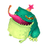
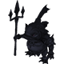

  

 

<table class="dungeonNext">
  <tr>
    <th>Previous</th>
    <td><a href="/chocobo-3/story-dungeons/guardian-of-the-flame">Guardian of the Flame</a></td>
    <th>Next</th>
    <td><a href="/chocobo-3/story-dungeons/guardian-of-the-water">Guardian of the Water</a></td>
  </tr>
</table>

# Overview

<table class="dungeonOverview">
  <tr>
    <th>Unlock</th>
    <td class="highlightYellow">Clear Guardian of the Flame (Chapter 2).</td>
  </tr>
  <tr>
    <th>Location</th>
    <td class="highlightYellow">Dardola's Dining (Chapter 3).</td>
  </tr>
</table>

<table class="dungeonTable">
  <tr>
    <th>Title</th>
    <td colspan="3">-</td>
  </tr>
  <tr>
    <th>Description</th>
    <td colspan="3">Normal dungeon with no restrictions.</td>
  </tr>
  <tr>
    <th>Floors</th>
    <td>12F</td>
    <th>Bosses</th>
    <td>11F</td>
  </tr>
  <tr>
    <th>Change Crystals</th>
    <td>0F</td>
    <th>Checkpoints</th>
    <td>None</td>
  </tr>
  <tr>
    <th>Max Level</th>
    <td>-</td>
    <th>Bring Buddy</th>
    <td>Yes</td>
  </tr>
  <tr>
    <th>Bring In Items</th>
    <td>Yes</td>
    <th>Take Out Items</th>
    <td>Yes</td>
  </tr>
  <tr>
    <th>Shops/Duels</th>
    <td>No</td>
    <th>Den of Monsters</th>
    <td>No</td>
  </tr>
  <tr>
    <th>Reapers</th>
    <td>Yes</td>
    <th>Bookmark</th>
    <td>Yes</td>
  </tr>
  <tr>
    <th>Unidentified</th>
    <td colspan="3">Equipment</td>
  </tr>
  <tr>
    <th>Rewards</th>
    <td colspan="3">1.  Dragoon's Memories (12F). 2.  Meja's Memories (12F). 3.  Meja added to  Buddy Registry. 4. Dungeon added to  Mirror of Memory. 5. Can receive  Meja's Letter. 6. Can unlock  Guardian of the Water.</td>
  </tr>
</table>

# Strategy

[Content]

# Monsters

<ul><li><a href="#monster-table">Monster Table</a></li><li><a href="#monster-details">Monster Details</a></li></ul>

 

 Monster Table 

Monster Colors - Boss F - 　 means field of view is limited. R - 　 means  Reaper can spawn.

<table class="monsterTable">
  <thead>
    <tr>
      <th>F</th>
      <th colspan="4">Monsters</th>
      <th>R</th>
    </tr>
  </thead>
  <tbody>
    <tr class="changeCrystal">
      <td class="centeredText">0</td>
      <td colspan="4" class="centeredText">Change Crystal</td>
      <td></td>
    </tr>
    <tr>
      <td class="centeredText highlightFog">1</td>
      <td> Frog (40%)</td>
      <td> Scissors (30%)</td>
      <td> Ghost (30%)</td>
      <td class="highlightGray"></td>
      <td class="highlightReaper"></td>
    </tr>
    <tr>
      <td class="centeredText highlightFog">2</td>
      <td> Frog (40%)</td>
      <td> Scissors (30%)</td>
      <td> Ghost (30%)</td>
      <td class="highlightGray"></td>
      <td class="highlightReaper"></td>
    </tr>
    <tr>
      <td class="centeredText highlightFog">3</td>
      <td> Frog (25%)</td>
      <td> Scissors (25%)</td>
      <td> Ghost (25%)</td>
      <td> Turtle (25%)</td>
      <td class="highlightReaper"></td>
    </tr>
    <tr>
      <td class="centeredText highlightFog">4</td>
      <td> Frog (25%)</td>
      <td> Scissors (25%)</td>
      <td> Ghost (25%)</td>
      <td> Turtle (25%)</td>
      <td class="highlightReaper"></td>
    </tr>
    <tr>
      <td class="centeredText highlightFog">5</td>
      <td> Sahagin (25%)</td>
      <td> Scissors (25%)</td>
      <td> Blue Jelly (25%)</td>
      <td> Turtle (25%)</td>
      <td class="highlightReaper"></td>
    </tr>
    <tr>
      <td class="centeredText highlightFog">6</td>
      <td> Sahagin (25%)</td>
      <td> Scissors (25%)</td>
      <td> Blue Jelly (25%)</td>
      <td> Turtle (25%)</td>
      <td class="highlightReaper"></td>
    </tr>
    <tr>
      <td class="centeredText highlightFog">7</td>
      <td> Sahagin (25%)</td>
      <td> Demon (25%)</td>
      <td> Blue Jelly (25%)</td>
      <td> Turtle (25%)</td>
      <td class="highlightReaper"></td>
    </tr>
    <tr>
      <td class="centeredText highlightFog">8</td>
      <td> Sahagin (25%)</td>
      <td> Demon (25%)</td>
      <td> Blue Jelly (25%)</td>
      <td> Turtle (25%)</td>
      <td class="highlightReaper"></td>
    </tr>
    <tr>
      <td class="centeredText highlightFog">9</td>
      <td> Sahagin (25%)</td>
      <td> Demon (25%)</td>
      <td> Blue Jelly (25%)</td>
      <td> Turtle (25%)</td>
      <td class="highlightReaper"></td>
    </tr>
    <tr>
      <td class="centeredText highlightFog">10</td>
      <td> Sahagin (25%)</td>
      <td> Demon (25%)</td>
      <td> Blue Jelly (25%)</td>
      <td> Turtle (25%)</td>
      <td class="highlightReaper"></td>
    </tr>
    <tr>
      <td class="centeredText">11</td>
      <td> Sahagin Shade</td>
      <td class="highlightGray"></td>
      <td class="highlightGray"></td>
      <td class="highlightGray"></td>
      <td class="highlightGray"></td>
    </tr>
    <tr class="highlightYellow">
      <td class="centeredText">12</td>
      <td colspan="4" class="centeredText"> Dragoon's Memories  Meja's Memories</td>
      <td></td>
    </tr>
  </tbody>
</table>

 

 Monster Details 

Stat Colors - Hard Mode

### Standard

#### Frog (1-4F)

<table class="buddyOverview">
  <tr class="noPad">
    <th colspan="13" class="highlightGreen">Stats</th>
  </tr>
  <tr>
    <td rowspan="4"></td>
    <td class="hp">HP</td>
    <td>93 / 116</td>
    <td class="atk">Attack</td>
    <td>24 / 26</td>
    <td class="mag">Magic</td>
    <td>22 / 23</td>
    <th>JP</th>
    <td>14 (40%)</td>
    <th>Item 1</th>
    <td colspan="3">Poison Drink (14%)</td>
  </tr>
  <tr>
    <td class="sp">Exp</td>
    <td>78</td>
    <td class="def">Defense</td>
    <td>38 / 39</td>
    <td class="mnd">Mind</td>
    <td>39 / 40</td>
    <th>BP</th>
    <td>3 (50%)</td>
    <th>Item 2</th>
    <td colspan="3">Stinky Greens (8%)</td>
  </tr>
  <tr>
    <th>Hit</th>
    <td>95</td>
    <th>Evasion</th>
    <td>2</td>
    <th>Crit</th>
    <td>5</td>
    <th>Gil</th>
    <td>30 (30%)</td>
    <th>Steal</th>
    <td colspan="3">Poison Drink (60%)</td>
  </tr>
  <tr>
    <th>Lv</th>
    <td>14</td>
    <th>Special</th>
    <td>-</td>
    <th>Resist</th>
    <td colspan="3">-</td>
    <th>Weak</th>
    <td colspan="3"></td>
  </tr>
  <tr>
    <th colspan="13" class="abilityName">Silence</th>
  </tr>
  <tr class="elementIcon">
    <th>Element</th>
    <td>-</td>
    <th>Range</th>
    <td></td>
    <th>Notes</th>
    <td colspan="8" class="leftText">Inflict Silence on a target up to 3 tiles ahead.</td>
  </tr>
  <tr>
    <th>Rate / CD</th>
    <td colspan="2">10% / 6T</td>
    <th>Count</th>
    <td>∞</td>
    <th>Multiplier</th>
    <td>x1.0</td>
    <th>Value</th>
    <td>0</td>
    <th>Type</th>
    <td class="leftText">Other</td>
    <th>Calc</th>
    <td class="leftText">None</td>
  </tr>
  <tr>
    <th colspan="13" class="abilityName">Jump</th>
  </tr>
  <tr class="elementIcon">
    <th>Element</th>
    <td>-</td>
    <th>Range</th>
    <td></td>
    <th>Notes</th>
    <td colspan="8" class="leftText">Deal damage + Knockback to a target 1 tile ahead.</td>
  </tr>
  <tr>
    <th>Rate / CD</th>
    <td colspan="2">20% / 0T</td>
    <th>Count</th>
    <td>∞</td>
    <th>Multiplier</th>
    <td>x1.0</td>
    <th>Value</th>
    <td>0</td>
    <th>Type</th>
    <td class="leftText">Physical</td>
    <th>Calc</th>
    <td class="leftText">Stat</td>
  </tr>
  <tr>
    <th colspan="13" class="abilityName">Poison Horn</th>
  </tr>
  <tr class="elementIcon">
    <th>Element</th>
    <td>-</td>
    <th>Range</th>
    <td></td>
    <th>Notes</th>
    <td colspan="8" class="leftText">Deal damage + Poison to a target 1 tile ahead.</td>
  </tr>
  <tr>
    <th>Rate / CD</th>
    <td colspan="2">10% / 3T</td>
    <th>Count</th>
    <td>∞</td>
    <th>Multiplier</th>
    <td>x1.0</td>
    <th>Value</th>
    <td>0</td>
    <th>Type</th>
    <td class="leftText">Physical</td>
    <th>Calc</th>
    <td class="leftText">Stat</td>
  </tr>
</table>

#### Ghost (1-4F)

<table class="buddyOverview">
  <tr class="noPad">
    <th colspan="13" class="highlightGreen">Stats</th>
  </tr>
  <tr>
    <td rowspan="4"></td>
    <td class="hp">HP</td>
    <td>46 / 57</td>
    <td class="atk">Attack</td>
    <td>24 / 26</td>
    <td class="mag">Magic</td>
    <td>38 / 39</td>
    <th>JP</th>
    <td>2 (40%)</td>
    <th>Item 1</th>
    <td colspan="3">Stinky Greens (14%)</td>
  </tr>
  <tr>
    <td class="sp">Exp</td>
    <td>78</td>
    <td class="def">Defense</td>
    <td>38 / 39</td>
    <td class="mnd">Mind</td>
    <td>51 / 52</td>
    <th>BP</th>
    <td>3 (50%)</td>
    <th>Item 2</th>
    <td colspan="3">Warp Wings (8%)</td>
  </tr>
  <tr>
    <th>Hit</th>
    <td>95</td>
    <th>Evasion</th>
    <td>8</td>
    <th>Crit</th>
    <td>5</td>
    <th>Gil</th>
    <td>-</td>
    <th>Steal</th>
    <td colspan="3">Stinky Greens (60%)</td>
  </tr>
  <tr>
    <th>Lv</th>
    <td>14</td>
    <th>Special</th>
    <td></td>
    <th>Resist</th>
    <td colspan="3"></td>
    <th>Weak</th>
    <td colspan="3"></td>
  </tr>
  <tr>
    <th colspan="13" class="abilityName">Hunger Strike</th>
  </tr>
  <tr class="elementIcon">
    <th>Element</th>
    <td>-</td>
    <th>Range</th>
    <td></td>
    <th>Notes</th>
    <td colspan="8" class="leftText">Lower Food Level by 10.</td>
  </tr>
  <tr>
    <th>Rate / CD</th>
    <td colspan="2">10% / 3T</td>
    <th>Count</th>
    <td>∞</td>
    <th>Multiplier</th>
    <td>x1.0</td>
    <th>Value</th>
    <td>10</td>
    <th>Type</th>
    <td class="leftText">Magic</td>
    <th>Calc</th>
    <td class="leftText">Fixed</td>
  </tr>
  <tr>
    <th colspan="13" class="abilityName">Rust in Pieces</th>
  </tr>
  <tr class="elementIcon">
    <th>Element</th>
    <td>-</td>
    <th>Range</th>
    <td></td>
    <th>Notes</th>
    <td colspan="8" class="leftText">Lower hone value of equipped Talons or Saddle by 1.</td>
  </tr>
  <tr>
    <th>Rate / CD</th>
    <td colspan="2">10% / 3T</td>
    <th>Count</th>
    <td>∞</td>
    <th>Multiplier</th>
    <td>x1.0</td>
    <th>Value</th>
    <td>0</td>
    <th>Type</th>
    <td class="leftText">Other</td>
    <th>Calc</th>
    <td class="leftText">None</td>
  </tr>
</table>

#### Scissors (1-6F)

<table class="buddyOverview">
  <tr class="noPad">
    <th colspan="13" class="highlightGreen">Stats</th>
  </tr>
  <tr>
    <td rowspan="4"></td>
    <td class="hp">HP</td>
    <td>48 / 59</td>
    <td class="atk">Attack</td>
    <td>44 / 46</td>
    <td class="mag">Magic</td>
    <td>23 / 24</td>
    <th>JP</th>
    <td>14 (40%)</td>
    <th>Item 1</th>
    <td colspan="3">Potion (14%)</td>
  </tr>
  <tr>
    <td class="sp">Exp</td>
    <td>118</td>
    <td class="def">Defense</td>
    <td>54 / 55</td>
    <td class="mnd">Mind</td>
    <td>32 / 33</td>
    <th>BP</th>
    <td>3 (50%)</td>
    <th>Item 2</th>
    <td colspan="3">Gold Talons (8%)</td>
  </tr>
  <tr>
    <th>Hit</th>
    <td>95</td>
    <th>Evasion</th>
    <td>4</td>
    <th>Crit</th>
    <td>5</td>
    <th>Gil</th>
    <td>32 (10%)</td>
    <th>Steal</th>
    <td colspan="3">Salt Water (60%)</td>
  </tr>
  <tr>
    <th>Lv</th>
    <td>15</td>
    <th>Special</th>
    <td>-</td>
    <th>Resist</th>
    <td colspan="3">-</td>
    <th>Weak</th>
    <td colspan="3"></td>
  </tr>
  <tr>
    <th colspan="13" class="abilityName">Pinch</th>
  </tr>
  <tr class="elementIcon">
    <th>Element</th>
    <td>-</td>
    <th>Range</th>
    <td></td>
    <th>Notes</th>
    <td colspan="8" class="leftText">Deal damage + Immobilize to a target 1 tile ahead.</td>
  </tr>
  <tr>
    <th>Rate / CD</th>
    <td colspan="2">20% / 6T</td>
    <th>Count</th>
    <td>∞</td>
    <th>Multiplier</th>
    <td>x1.0</td>
    <th>Value</th>
    <td>0</td>
    <th>Type</th>
    <td class="leftText">Physical</td>
    <th>Calc</th>
    <td class="leftText">Stat</td>
  </tr>
</table>

#### Turtle (3-10F)

<table class="buddyOverview">
  <tr class="noPad">
    <th colspan="13" class="highlightGreen">Stats</th>
  </tr>
  <tr>
    <td rowspan="4"></td>
    <td class="hp">HP</td>
    <td>97 / 121</td>
    <td class="atk">Attack</td>
    <td>44 / 46</td>
    <td class="mag">Magic</td>
    <td>31 / 32</td>
    <th>JP</th>
    <td>14 (40%)</td>
    <th>Item 1</th>
    <td colspan="3">Potion (14%)</td>
  </tr>
  <tr>
    <td class="sp">Exp</td>
    <td>99</td>
    <td class="def">Defense</td>
    <td>54 / 55</td>
    <td class="mnd">Mind</td>
    <td>32 / 33</td>
    <th>BP</th>
    <td>3 (50%)</td>
    <th>Item 2</th>
    <td colspan="3">Gold Saddle (8%)</td>
  </tr>
  <tr>
    <th>Hit</th>
    <td>95</td>
    <th>Evasion</th>
    <td>2</td>
    <th>Crit</th>
    <td>5</td>
    <th>Gil</th>
    <td>32 (10%)</td>
    <th>Steal</th>
    <td colspan="3">Gold Saddle (60%)</td>
  </tr>
  <tr>
    <th>Lv</th>
    <td>15</td>
    <th>Special</th>
    <td></td>
    <th>Resist</th>
    <td colspan="3">-</td>
    <th>Weak</th>
    <td colspan="3"></td>
  </tr>
  <tr>
    <th colspan="13" class="abilityName">Miraculous Shell</th>
  </tr>
  <tr class="elementIcon">
    <th>Element</th>
    <td>-</td>
    <th>Range</th>
    <td></td>
    <th>Notes</th>
    <td colspan="8" class="leftText">Temporarily cast Protect.</td>
  </tr>
  <tr>
    <th>Rate / CD</th>
    <td colspan="2">10% / 12T</td>
    <th>Count</th>
    <td>∞</td>
    <th>Multiplier</th>
    <td>x1.0</td>
    <th>Value</th>
    <td>0</td>
    <th>Type</th>
    <td class="leftText">Other</td>
    <th>Calc</th>
    <td class="leftText">None</td>
  </tr>
</table>

#### Sahagin (5-10F)

<table class="buddyOverview">
  <tr class="noPad">
    <th colspan="13" class="highlightGreen">Stats</th>
  </tr>
  <tr>
    <td rowspan="4"></td>
    <td class="hp">HP</td>
    <td>67 / 83</td>
    <td class="atk">Attack</td>
    <td>36 / 39</td>
    <td class="mag">Magic</td>
    <td>32 / 33</td>
    <th>JP</th>
    <td>14 (40%)</td>
    <th>Item 1</th>
    <td colspan="3">Gysahl Greens (14%)</td>
  </tr>
  <tr>
    <td class="sp">Exp</td>
    <td>120</td>
    <td class="def">Defense</td>
    <td>47 / 48</td>
    <td class="mnd">Mind</td>
    <td>41 / 42</td>
    <th>BP</th>
    <td>3 (50%)</td>
    <th>Item 2</th>
    <td colspan="3">Hi-Potion (8%)</td>
  </tr>
  <tr>
    <th>Hit</th>
    <td>95</td>
    <th>Evasion</th>
    <td>4</td>
    <th>Crit</th>
    <td>5</td>
    <th>Gil</th>
    <td>40 (30%)</td>
    <th>Steal</th>
    <td colspan="3">Salt Water (60%)</td>
  </tr>
  <tr>
    <th>Lv</th>
    <td>16</td>
    <th>Special</th>
    <td>-</td>
    <th>Resist</th>
    <td colspan="3">-</td>
    <th>Weak</th>
    <td colspan="3"></td>
  </tr>
  <tr>
    <th colspan="13" class="abilityName">Trident</th>
  </tr>
  <tr class="elementIcon">
    <th>Element</th>
    <td>-</td>
    <th>Range</th>
    <td></td>
    <th>Notes</th>
    <td colspan="8" class="leftText">Deal damage + Knockback to a target 1 tile ahead.</td>
  </tr>
  <tr>
    <th>Rate / CD</th>
    <td colspan="2">10% / 0T</td>
    <th>Count</th>
    <td>∞</td>
    <th>Multiplier</th>
    <td>x1.0</td>
    <th>Value</th>
    <td>0</td>
    <th>Type</th>
    <td class="leftText">Physical</td>
    <th>Calc</th>
    <td class="leftText">Stat</td>
  </tr>
  <tr>
    <th colspan="13" class="abilityName">Rusty Water</th>
  </tr>
  <tr class="elementIcon">
    <th>Element</th>
    <td>-</td>
    <th>Range</th>
    <td></td>
    <th>Notes</th>
    <td colspan="8" class="leftText">Lower hone value of equipped Talons or Saddle by 1.</td>
  </tr>
  <tr>
    <th>Rate / CD</th>
    <td colspan="2">10% / 12T</td>
    <th>Count</th>
    <td>∞</td>
    <th>Multiplier</th>
    <td>x1.0</td>
    <th>Value</th>
    <td>0</td>
    <th>Type</th>
    <td class="leftText">Other</td>
    <th>Calc</th>
    <td class="leftText">None</td>
  </tr>
</table>

#### Blue Jelly (5-10F)

<table class="buddyOverview">
  <tr class="noPad">
    <th colspan="13" class="highlightGreen">Stats</th>
  </tr>
  <tr>
    <td rowspan="4"></td>
    <td class="hp">HP</td>
    <td>93 / 116</td>
    <td class="atk">Attack</td>
    <td>24 / 26</td>
    <td class="mag">Magic</td>
    <td>30 / 31</td>
    <th>JP</th>
    <td>14 (40%)</td>
    <th>Item 1</th>
    <td colspan="3">-</td>
  </tr>
  <tr>
    <td class="sp">Exp</td>
    <td>98</td>
    <td class="def">Defense</td>
    <td>38 / 39</td>
    <td class="mnd">Mind</td>
    <td>39 / 40</td>
    <th>BP</th>
    <td>3 (50%)</td>
    <th>Item 2</th>
    <td colspan="3">-</td>
  </tr>
  <tr>
    <th>Hit</th>
    <td>95</td>
    <th>Evasion</th>
    <td>4</td>
    <th>Crit</th>
    <td>5</td>
    <th>Gil</th>
    <td>30 (10%)</td>
    <th>Steal</th>
    <td colspan="3">Ether (60%)</td>
  </tr>
  <tr>
    <th>Lv</th>
    <td>14</td>
    <th>Special</th>
    <td>-</td>
    <th>Resist</th>
    <td colspan="3"></td>
    <th>Weak</th>
    <td colspan="3"></td>
  </tr>
  <tr>
    <th colspan="13" class="abilityName">Divide</th>
  </tr>
  <tr class="elementIcon">
    <th>Element</th>
    <td>-</td>
    <th>Range</th>
    <td></td>
    <th>Notes</th>
    <td colspan="8" class="leftText">Reduce current HP by 1/2 to create a clone when hit.</td>
  </tr>
  <tr>
    <th>Rate / CD</th>
    <td colspan="2">60% / 0T</td>
    <th>Count</th>
    <td>1</td>
    <th>Multiplier</th>
    <td>x1.0</td>
    <th>Value</th>
    <td>0</td>
    <th>Type</th>
    <td class="leftText">Other</td>
    <th>Calc</th>
    <td class="leftText">None</td>
  </tr>
  <tr>
    <th colspan="13" class="abilityName">Digest</th>
  </tr>
  <tr class="elementIcon">
    <th>Element</th>
    <td>-</td>
    <th>Range</th>
    <td></td>
    <th>Notes</th>
    <td colspan="8" class="leftText">Drain HP from a target 1 tile ahead.</td>
  </tr>
  <tr>
    <th>Rate / CD</th>
    <td colspan="2">10% / 4T</td>
    <th>Count</th>
    <td>∞</td>
    <th>Multiplier</th>
    <td>x1.0</td>
    <th>Value</th>
    <td>0</td>
    <th>Type</th>
    <td class="leftText">Magic</td>
    <th>Calc</th>
    <td class="leftText">Stat</td>
  </tr>
  <tr>
    <th colspan="13" class="abilityName">Water</th>
  </tr>
  <tr class="elementIcon">
    <th>Element</th>
    <td></td>
    <th>Range</th>
    <td></td>
    <th>Notes</th>
    <td colspan="8" class="leftText">Deal water damage to a target up to 2 tiles ahead.</td>
  </tr>
  <tr>
    <th>Rate / CD</th>
    <td colspan="2">10% / 4T</td>
    <th>Count</th>
    <td>∞</td>
    <th>Multiplier</th>
    <td>x1.0</td>
    <th>Value</th>
    <td>8</td>
    <th>Type</th>
    <td class="leftText">Magic</td>
    <th>Calc</th>
    <td class="leftText">Stat</td>
  </tr>
</table>

#### Demon (7-10F)

<table class="buddyOverview">
  <tr class="noPad">
    <th colspan="13" class="highlightGreen">Stats</th>
  </tr>
  <tr>
    <td rowspan="4"></td>
    <td class="hp">HP</td>
    <td>52 / 64</td>
    <td class="atk">Attack</td>
    <td>39 / 42</td>
    <td class="mag">Magic</td>
    <td>41 / 42</td>
    <th>JP</th>
    <td>16 (40%)</td>
    <th>Item 1</th>
    <td colspan="3">Ether (14%)</td>
  </tr>
  <tr>
    <td class="sp">Exp</td>
    <td>121</td>
    <td class="def">Defense</td>
    <td>48 / 49</td>
    <td class="mnd">Mind</td>
    <td>54 / 55</td>
    <th>BP</th>
    <td>3 (50%)</td>
    <th>Item 2</th>
    <td colspan="3">Hi-Ether (8%)</td>
  </tr>
  <tr>
    <th>Hit</th>
    <td>85</td>
    <th>Evasion</th>
    <td>4</td>
    <th>Crit</th>
    <td>5</td>
    <th>Gil</th>
    <td>43 (10%)</td>
    <th>Steal</th>
    <td colspan="3">Devil's Tonic (60%)</td>
  </tr>
  <tr>
    <th>Lv</th>
    <td>17</td>
    <th>Special</th>
    <td></td>
    <th>Resist</th>
    <td colspan="3"></td>
    <th>Weak</th>
    <td colspan="3"></td>
  </tr>
  <tr>
    <th colspan="13" class="abilityName">Demon Touch</th>
  </tr>
  <tr class="elementIcon">
    <th>Element</th>
    <td>-</td>
    <th>Range</th>
    <td></td>
    <th>Notes</th>
    <td colspan="8" class="leftText">Halve an adjacent target's SP.</td>
  </tr>
  <tr>
    <th>Rate / CD</th>
    <td colspan="2">20% / 3T</td>
    <th>Count</th>
    <td>∞</td>
    <th>Multiplier</th>
    <td>x1.0</td>
    <th>Value</th>
    <td>50</td>
    <th>Type</th>
    <td class="leftText">Magic</td>
    <th>Calc</th>
    <td class="leftText">Ratio</td>
  </tr>
  <tr>
    <th colspan="13" class="abilityName">Demon Eye</th>
  </tr>
  <tr class="elementIcon">
    <th>Element</th>
    <td>-</td>
    <th>Range</th>
    <td></td>
    <th>Notes</th>
    <td colspan="8" class="leftText">Inflict Silence on a target 1 tile ahead.</td>
  </tr>
  <tr>
    <th>Rate / CD</th>
    <td colspan="2">10% / 3T</td>
    <th>Count</th>
    <td>∞</td>
    <th>Multiplier</th>
    <td>x1.0</td>
    <th>Value</th>
    <td>0</td>
    <th>Type</th>
    <td class="leftText">Other</td>
    <th>Calc</th>
    <td class="leftText">None</td>
  </tr>
</table>

### Boss

#### Sahagin Shade (11F)

<table class="buddyOverview">
  <tr class="noPad">
    <th colspan="14" class="highlightBoss">Stats</th>
  </tr>
  <tr>
    <td rowspan="4"></td>
    <td class="hp">HP</td>
    <td>750 / 899</td>
    <td class="atk">Attack</td>
    <td>50 / 50</td>
    <td class="mag">Magic</td>
    <td>50 / 50</td>
    <th>JP</th>
    <td colspan="2">80 (100%)</td>
    <th>Item 1</th>
    <td colspan="5">Gold Talons (50%)</td>
  </tr>
  <tr>
    <td class="sp">Exp</td>
    <td>200</td>
    <td class="def">Defense</td>
    <td>60 / 60</td>
    <td class="mnd">Mind</td>
    <td>60 / 60</td>
    <th>BP</th>
    <td colspan="2">-</td>
    <th>Item 2</th>
    <td colspan="5">Gold Saddle (50%)</td>
  </tr>
  <tr>
    <th>Hit</th>
    <td>90</td>
    <th>Evasion</th>
    <td>5</td>
    <th>Crit</th>
    <td>10</td>
    <th>Gil</th>
    <td colspan="2">1200 (100%)</td>
    <th>Steal</th>
    <td colspan="5">Gold Saddle (100%)</td>
  </tr>
  <tr>
    <th>Lv</th>
    <td>20</td>
    <th>Special</th>
    <td>-</td>
    <th>Resist</th>
    <td colspan="4">-</td>
    <th>Weak</th>
    <td colspan="5"></td>
  </tr>
  <tr>
    <th colspan="14" class="statusResists">Status Resistances</th>
  </tr>
  <tr>
    <th></th>
    <th></th>
    <th></th>
    <th></th>
    <th></th>
    <th></th>
    <th></th>
    <th></th>
    <th></th>
    <th colspan="2">Knockback</th>
    <th>Stun</th>
    <th>Warp</th>
    <th>Ratio</th>
  </tr>
  <tr>
    <td>◯</td>
    <td>◯</td>
    <td>✕</td>
    <td>◯</td>
    <td>✕</td>
    <td>◯</td>
    <td>◯</td>
    <td>◯</td>
    <td>◯</td>
    <td colspan="2">◯</td>
    <td>◯</td>
    <td>◯</td>
    <td>◯</td>
  </tr>
  <tr>
    <th colspan="14" class="abilityName">Trident</th>
  </tr>
  <tr class="elementIcon">
    <th>Element</th>
    <td>-</td>
    <th>Range</th>
    <td></td>
    <th>Notes</th>
    <td colspan="13" class="leftText">Deal damage + Knockback to a target 1 tile ahead.</td>
  </tr>
  <tr>
    <th>Rate / CD</th>
    <td colspan="2">10% | 20% / 0T</td>
    <th>Count</th>
    <td>∞</td>
    <th>Multiplier</th>
    <td>x1.0</td>
    <th>Value</th>
    <td>0</td>
    <th>Type</th>
    <td colspan="2" class="leftText">Physical</td>
    <th>Calc</th>
    <td class="leftText">Stat</td>
  </tr>
  <tr>
    <th colspan="14" class="abilityName">Bubble Shower</th>
  </tr>
  <tr class="elementIcon">
    <th>Element</th>
    <td></td>
    <th>Range</th>
    <td></td>
    <th>Notes</th>
    <td colspan="13" class="leftText">Deal water damage to a target up to 3 tiles ahead.</td>
  </tr>
  <tr>
    <th>Rate / CD</th>
    <td colspan="2">20% | 10% / 0T</td>
    <th>Count</th>
    <td>∞</td>
    <th>Multiplier</th>
    <td>x1.0</td>
    <th>Value</th>
    <td>0</td>
    <th>Type</th>
    <td colspan="2" class="leftText">Magic</td>
    <th>Calc</th>
    <td class="leftText">Stat</td>
  </tr>
  <tr>
    <th colspan="14" class="abilityName">Erase</th>
  </tr>
  <tr class="elementIcon">
    <th>Element</th>
    <td>-</td>
    <th>Range</th>
    <td></td>
    <th>Notes</th>
    <td colspan="13" class="leftText">Wipe player buffs of a target up to 3 tiles ahead.</td>
  </tr>
  <tr>
    <th>Rate / CD</th>
    <td colspan="2">10% | 10% / 6T</td>
    <th>Count</th>
    <td>∞</td>
    <th>Multiplier</th>
    <td>x1.0</td>
    <th>Value</th>
    <td>0</td>
    <th>Type</th>
    <td colspan="2" class="leftText">Other</td>
    <th>Calc</th>
    <td class="leftText">None</td>
  </tr>
</table>

# Items

 Floor 

See the dungeon data JSON file for exact item spawn rates per floor.

<table class="dungeonItemTable">
  <tr>
    <th colspan="3" class="highlightPurple"> Talons</th>
  </tr>
  <tr>
    <th>Item</th>
    <th>Floor</th>
    <th>Rate Range</th>
  </tr>
  <tr>
    <td>Bronze Talons</td>
    <td>1-5</td>
    <td>1.22%</td>
  </tr>
  <tr>
    <td>Copper Talons</td>
    <td>1-10</td>
    <td>1.19% ~ 2.44%</td>
  </tr>
  <tr>
    <td>Gold Talons</td>
    <td>1-10</td>
    <td>2.39% ~ 2.44%</td>
  </tr>
  <tr>
    <td>Blind Talons</td>
    <td>1-10</td>
    <td>1.19% ~ 1.22%</td>
  </tr>
  <tr>
    <td>Poison Talons</td>
    <td>6-10</td>
    <td>1.19%</td>
  </tr>
  <tr>
    <td>Unlucky Talons</td>
    <td>6-10</td>
    <td>1.19%</td>
  </tr>
  <tr>
    <th colspan="3" class="highlightPurple"> Saddles</th>
  </tr>
  <tr>
    <th>Item</th>
    <th>Floor</th>
    <th>Rate Range</th>
  </tr>
  <tr>
    <td>Bronze Saddle</td>
    <td>1-5</td>
    <td>1.22%</td>
  </tr>
  <tr>
    <td>Copper Saddle</td>
    <td>1-10</td>
    <td>2.39% ~ 2.44%</td>
  </tr>
  <tr>
    <td>Water Saddle</td>
    <td>1-10</td>
    <td>1.19% ~ 1.22%</td>
  </tr>
  <tr>
    <td>Gold Saddle</td>
    <td>1-10</td>
    <td>2.39% ~ 2.44%</td>
  </tr>
  <tr>
    <td>No-Blind Saddle</td>
    <td>1-10</td>
    <td>1.19% ~ 1.22%</td>
  </tr>
  <tr>
    <td>Anti-Poison Saddle</td>
    <td>6-10</td>
    <td>1.19%</td>
  </tr>
  <tr>
    <td>No-SP Saddle</td>
    <td>6-10</td>
    <td>1.19%</td>
  </tr>
  <tr>
    <th colspan="3" class="highlightPurple"> Collars</th>
  </tr>
  <tr>
    <th>Item</th>
    <th>Floor</th>
    <th>Rate Range</th>
  </tr>
  <tr>
    <td>Anti-Poison Collar</td>
    <td>1-10</td>
    <td>1.19% ~ 1.22%</td>
  </tr>
  <tr>
    <td>No-Blind Collar</td>
    <td>1-10</td>
    <td>1.19% ~ 1.22%</td>
  </tr>
  <tr>
    <td>No-Sleep Collar</td>
    <td>1-10</td>
    <td>1.19% ~ 1.22%</td>
  </tr>
  <tr>
    <td>No-Silence Collar</td>
    <td>1-10</td>
    <td>1.19% ~ 1.22%</td>
  </tr>
  <tr>
    <td>Fatigue Collar</td>
    <td>1-10</td>
    <td>1.19% ~ 1.22%</td>
  </tr>
  <tr>
    <td>Memory Collar</td>
    <td>1-10</td>
    <td>1.19% ~ 1.22%</td>
  </tr>
  <tr>
    <td>Long Kick Collar</td>
    <td>1-10</td>
    <td>1.19% ~ 1.22%</td>
  </tr>
  <tr>
    <td>Blind Collar</td>
    <td>1-10</td>
    <td>1.19% ~ 1.22%</td>
  </tr>
  <tr>
    <td>Bejeweled Collar</td>
    <td>1-10</td>
    <td>1.19% ~ 1.22%</td>
  </tr>
  <tr>
    <th colspan="3" class="highlightPurple"> Greens</th>
  </tr>
  <tr>
    <th>Item</th>
    <th>Floor</th>
    <th>Rate Range</th>
  </tr>
  <tr>
    <td>Gysahl Greens</td>
    <td>1-10</td>
    <td>2.39% ~ 2.44%</td>
  </tr>
  <tr>
    <td>Stinky Greens</td>
    <td>1-10</td>
    <td>1.19% ~ 1.22%</td>
  </tr>
  <tr>
    <th colspan="3" class="highlightPurple"> Medicines</th>
  </tr>
  <tr>
    <th>Item</th>
    <th>Floor</th>
    <th>Rate Range</th>
  </tr>
  <tr>
    <td>Potion</td>
    <td>1-10</td>
    <td>3.58% ~ 3.67%</td>
  </tr>
  <tr>
    <td>Hi-Potion</td>
    <td>1-10</td>
    <td>2.39% ~ 2.44%</td>
  </tr>
  <tr>
    <td>Ether</td>
    <td>1-10</td>
    <td>3.58% ~ 3.67%</td>
  </tr>
  <tr>
    <td>Hi-Ether</td>
    <td>1-10</td>
    <td>2.39% ~ 2.44%</td>
  </tr>
  <tr>
    <td>Antidote</td>
    <td>1-10</td>
    <td>1.19% ~ 1.22%</td>
  </tr>
  <tr>
    <td>Echo Drops</td>
    <td>1-10</td>
    <td>1.19% ~ 1.22%</td>
  </tr>
  <tr>
    <td>Eye Drops</td>
    <td>1-10</td>
    <td>1.19% ~ 1.22%</td>
  </tr>
  <tr>
    <td>Salt Water</td>
    <td>1-10</td>
    <td>1.19% ~ 1.22%</td>
  </tr>
  <tr>
    <td>Poison Drink</td>
    <td>1-10</td>
    <td>1.19% ~ 1.22%</td>
  </tr>
  <tr>
    <th colspan="3" class="highlightPurple"> Books</th>
  </tr>
  <tr>
    <th>Item</th>
    <th>Floor</th>
    <th>Rate Range</th>
  </tr>
  <tr>
    <td>Fire Book</td>
    <td>1-10</td>
    <td>2.39% ~ 2.44%</td>
  </tr>
  <tr>
    <td>Blizzard Book</td>
    <td>1-10</td>
    <td>2.39% ~ 2.44%</td>
  </tr>
  <tr>
    <td>Thunder Book</td>
    <td>1-10</td>
    <td>2.39% ~ 2.44%</td>
  </tr>
  <tr>
    <td>Water Book</td>
    <td>1-10</td>
    <td>2.39% ~ 2.44%</td>
  </tr>
  <tr>
    <td>Aero Book</td>
    <td>1-10</td>
    <td>2.39% ~ 2.44%</td>
  </tr>
  <tr>
    <td>Stone Book</td>
    <td>1-10</td>
    <td>2.39% ~ 2.44%</td>
  </tr>
  <tr>
    <td>Poison Book</td>
    <td>1-10</td>
    <td>2.39% ~ 2.44%</td>
  </tr>
  <tr>
    <td>Sleep Book</td>
    <td>1-10</td>
    <td>2.39% ~ 2.44%</td>
  </tr>
  <tr>
    <td>Silence Book</td>
    <td>1-10</td>
    <td>2.39% ~ 2.44%</td>
  </tr>
  <tr>
    <td>Blind Book</td>
    <td>1-10</td>
    <td>2.39% ~ 2.44%</td>
  </tr>
  <tr>
    <td>Confuse Book</td>
    <td>1-10</td>
    <td>2.39% ~ 2.44%</td>
  </tr>
  <tr>
    <td>Immobilize Book</td>
    <td>1-10</td>
    <td>2.39% ~ 2.44%</td>
  </tr>
  <tr>
    <td>Slow Book</td>
    <td>1-10</td>
    <td>2.39% ~ 2.44%</td>
  </tr>
  <tr>
    <td>Protect Book</td>
    <td>1-10</td>
    <td>2.39% ~ 2.44%</td>
  </tr>
  <tr>
    <td>Shell Book</td>
    <td>1-10</td>
    <td>2.39% ~ 2.44%</td>
  </tr>
  <tr>
    <td>Dispel Book</td>
    <td>1-10</td>
    <td>2.39% ~ 2.44%</td>
  </tr>
  <tr>
    <td>Sleepga Book</td>
    <td>1-10</td>
    <td>1.19% ~ 1.22%</td>
  </tr>
  <tr>
    <td>Slowga Book</td>
    <td>1-10</td>
    <td>1.19% ~ 1.22%</td>
  </tr>
  <tr>
    <th colspan="3" class="highlightPurple"> Other</th>
  </tr>
  <tr>
    <th>Item</th>
    <th>Floor</th>
    <th>Rate Range</th>
  </tr>
  <tr>
    <td>Appraisal Glasses</td>
    <td>1-10</td>
    <td>3.58% ~ 3.67%</td>
  </tr>
  <tr>
    <td>Teleport Wings</td>
    <td>1-10</td>
    <td>1.19% ~ 1.22%</td>
  </tr>
  <tr>
    <td>Warp Wings</td>
    <td>1-10</td>
    <td>2.39% ~ 2.44%</td>
  </tr>
  <tr>
    <td>Polishing Cream</td>
    <td>1-10</td>
    <td>0.95% ~ 0.98%</td>
  </tr>
</table>

 

 Drop / Steal 

Monster Colors - Boss

<table class="dungeonDropTable">
  <thead>
    <tr>
      <th>Floor</th>
      <th>Monster</th>
      <th>Drop 1</th>
      <th>Drop 2</th>
      <th>Steal</th>
    </tr>
  </thead>
  <tbody>
    <tr>
      <td>1-4</td>
      <td> Frog</td>
      <td>Poison Drink (14%)</td>
      <td>Stinky Greens (8%)</td>
      <td>Poison Drink (60%)</td>
    </tr>
    <tr>
      <td>1-4</td>
      <td> Ghost</td>
      <td>Stinky Greens (14%)</td>
      <td>Warp Wings (8%)</td>
      <td>Stinky Greens (60%)</td>
    </tr>
    <tr>
      <td>1-6</td>
      <td> Scissors</td>
      <td>Potion (14%)</td>
      <td>Gold Talons (8%)</td>
      <td>Salt Water (60%)</td>
    </tr>
    <tr>
      <td>3-10</td>
      <td> Turtle</td>
      <td>Potion (14%)</td>
      <td>Gold Saddle (8%)</td>
      <td>Gold Saddle (60%)</td>
    </tr>
    <tr>
      <td>5-10</td>
      <td> Sahagin</td>
      <td>Gysahl Greens (14%)</td>
      <td>Hi-Potion (8%)</td>
      <td>Salt Water (60%)</td>
    </tr>
    <tr>
      <td>5-10</td>
      <td> Blue Jelly</td>
      <td>-</td>
      <td>-</td>
      <td>Ether (60%)</td>
    </tr>
    <tr>
      <td>7-10</td>
      <td> Demon</td>
      <td>Ether (14%)</td>
      <td>Hi-Ether (8%)</td>
      <td>Devil's Tonic (60%)</td>
    </tr>
    <tr>
      <td>11</td>
      <td> Sahagin Shade</td>
      <td>Gold Talons (50%)</td>
      <td>Gold Saddle (50%)</td>
      <td>Gold Saddle (100%)</td>
    </tr>
  </tbody>
</table>
