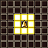

  

 

<table class="dungeonNext">
  <tr>
    <th>Previous</th>
    <td><a href="/chocobo-3/story-dungeons/guardian-of-the-water">Guardian of the Water</a></td>
    <th>Next</th>
    <td><a href="/chocobo-3/story-dungeons/guardian-of-the-light">Guardian of the Light</a></td>
  </tr>
</table>

# Overview

<table class="dungeonOverview">
  <tr>
    <th>Unlock</th>
    <td class="highlightYellow">Clear Guardian of the Water (Chapter 3).</td>
  </tr>
  <tr>
    <th>Location</th>
    <td class="highlightYellow">Stella's House (Chapter 4).</td>
  </tr>
</table>

<table class="dungeonTable">
  <tr>
    <th>Title</th>
    <td colspan="3">-</td>
  </tr>
  <tr>
    <th>Description</th>
    <td colspan="3">Normal dungeon with no restrictions.</td>
  </tr>
  <tr>
    <th>Floors</th>
    <td>14F</td>
    <th>Bosses</th>
    <td>13F</td>
  </tr>
  <tr>
    <th>Change Crystals</th>
    <td>0F</td>
    <th>Checkpoints</th>
    <td>None</td>
  </tr>
  <tr>
    <th>Max Level</th>
    <td>-</td>
    <th>Bring Buddy</th>
    <td>Yes</td>
  </tr>
  <tr>
    <th>Bring In Items</th>
    <td>Yes</td>
    <th>Take Out Items</th>
    <td>Yes</td>
  </tr>
  <tr>
    <th>Shops/Duels</th>
    <td>No</td>
    <th>Den of Monsters</th>
    <td>Yes</td>
  </tr>
  <tr>
    <th>Reapers</th>
    <td>Yes</td>
    <th>Bookmark</th>
    <td>Yes</td>
  </tr>
  <tr>
    <th>Unidentified</th>
    <td colspan="3">Equipment, Consumables</td>
  </tr>
  <tr>
    <th>Rewards</th>
    <td colspan="3">1.  Shirma's Memories (14F). 2. Dungeon added to  Mirror of Memory. 3. Can unlock  Guardian of the Light.</td>
  </tr>
</table>

# Strategy

[Content]

# Monsters

<ul><li><a href="#monster-table">Monster Table</a></li><li><a href="#monster-details">Monster Details</a></li></ul>

 

 Monster Table 

Monster Colors - Boss F - 　 means field of view is limited. M - 　 means a Den of Monsters can appear. R - 　 means  Reaper can spawn.

<table class="monsterTable">
  <thead>
    <tr>
      <th>F</th>
      <th>M</th>
      <th colspan="4">Monsters</th>
      <th>R</th>
    </tr>
  </thead>
  <tbody>
    <tr>
      <td class="centeredText">0</td>
      <td class="highlightGray"></td>
      <td class="highlightGray"></td>
      <td class="highlightGray"></td>
      <td class="highlightGray"></td>
      <td class="highlightGray"></td>
      <td class="highlightGray"></td>
    </tr>
    <tr>
      <td class="centeredText highlightFog">1</td>
      <td class="highlightGray"></td>
      <td> Malboro (40%)</td>
      <td> Lamia (40%)</td>
      <td> Mandra (20%)</td>
      <td class="highlightGray"></td>
      <td class="highlightReaper"></td>
    </tr>
    <tr>
      <td class="centeredText highlightFog">2</td>
      <td class="highlightGray"></td>
      <td> Malboro (40%)</td>
      <td> Lamia (40%)</td>
      <td> Mandra (20%)</td>
      <td class="highlightGray"></td>
      <td class="highlightReaper"></td>
    </tr>
    <tr>
      <td class="centeredText highlightFog">3</td>
      <td class="highlightMH"></td>
      <td> Malboro (30%)</td>
      <td> Lamia (30%)</td>
      <td> Mandra (20%)</td>
      <td> Lizard (20%)</td>
      <td class="highlightReaper"></td>
    </tr>
    <tr>
      <td class="centeredText highlightFog">4</td>
      <td class="highlightMH"></td>
      <td> Malboro (30%)</td>
      <td> Lamia (30%)</td>
      <td> Mandra (20%)</td>
      <td> Lizard (20%)</td>
      <td class="highlightReaper"></td>
    </tr>
    <tr>
      <td class="centeredText highlightFog">5</td>
      <td class="highlightMH"></td>
      <td> Malboro (20%)</td>
      <td> Lamia (30%)</td>
      <td> Coeurl (20%)</td>
      <td> Lizard (30%)</td>
      <td class="highlightReaper"></td>
    </tr>
    <tr>
      <td class="centeredText highlightFog">6</td>
      <td class="highlightMH"></td>
      <td> Malboro (20%)</td>
      <td> Lamia (30%)</td>
      <td> Coeurl (20%)</td>
      <td> Lizard (30%)</td>
      <td class="highlightReaper"></td>
    </tr>
    <tr>
      <td class="centeredText highlightFog">7</td>
      <td class="highlightMH"></td>
      <td> Flying Eye (20%)</td>
      <td> Lamia (30%)</td>
      <td> Coeurl (20%)</td>
      <td> Lizard (30%)</td>
      <td class="highlightReaper"></td>
    </tr>
    <tr>
      <td class="centeredText highlightFog">8</td>
      <td class="highlightMH"></td>
      <td> Flying Eye (20%)</td>
      <td> Light Dragon (30%)</td>
      <td> Coeurl (20%)</td>
      <td> Lizard (30%)</td>
      <td class="highlightReaper"></td>
    </tr>
    <tr>
      <td class="centeredText highlightFog">9</td>
      <td class="highlightMH"></td>
      <td> Flying Eye (20%)</td>
      <td> Light Dragon (30%)</td>
      <td> Coeurl (20%)</td>
      <td> Lizard (30%)</td>
      <td class="highlightReaper"></td>
    </tr>
    <tr>
      <td class="centeredText highlightFog">10</td>
      <td class="highlightMH"></td>
      <td> Flying Eye (20%)</td>
      <td> Light Dragon (30%)</td>
      <td> Coeurl (20%)</td>
      <td> Lizard (30%)</td>
      <td class="highlightReaper"></td>
    </tr>
    <tr>
      <td class="centeredText highlightFog">11</td>
      <td class="highlightMH"></td>
      <td> Flying Eye (20%)</td>
      <td> Light Dragon (30%)</td>
      <td> Coeurl (30%)</td>
      <td> Lizard (20%)</td>
      <td class="highlightReaper"></td>
    </tr>
    <tr>
      <td class="centeredText highlightFog">12</td>
      <td class="highlightGray"></td>
      <td> Flying Eye (20%)</td>
      <td> Light Dragon (30%)</td>
      <td> Coeurl (30%)</td>
      <td> Lizard (20%)</td>
      <td class="highlightReaper"></td>
    </tr>
    <tr>
      <td class="centeredText">13</td>
      <td class="highlightGray"></td>
      <td> Iron Giant Shade</td>
      <td class="highlightGray"></td>
      <td class="highlightGray"></td>
      <td class="highlightGray"></td>
      <td class="highlightGray"></td>
    </tr>
    <tr>
      <td class="centeredText">14</td>
      <td class="highlightGray"></td>
      <td class="highlightGray"></td>
      <td class="highlightGray"></td>
      <td class="highlightGray"></td>
      <td class="highlightGray"></td>
      <td class="highlightGray"></td>
    </tr>
  </tbody>
</table>

 

 Monster Details 

Stat Colors - Hard Mode

### Standard

#### Mandra (1-4F)

<table class="buddyOverview">
  <tr class="noPad">
    <th colspan="13" class="highlightGreen">Stats</th>
  </tr>
  <tr>
    <td rowspan="4"></td>
    <td class="hp">HP</td>
    <td>101 / 124</td>
    <td class="atk">Attack</td>
    <td>72 / 75</td>
    <td class="mag">Magic</td>
    <td>44 / 45</td>
    <th>JP</th>
    <td>24 (40%)</td>
    <th>Item 1</th>
    <td colspan="3">Gysahl Greens (14%)</td>
  </tr>
  <tr>
    <td class="sp">Exp</td>
    <td>172</td>
    <td class="def">Defense</td>
    <td>59 / 60</td>
    <td class="mnd">Mind</td>
    <td>53 / 54</td>
    <th>BP</th>
    <td>3 (50%)</td>
    <th>Item 2</th>
    <td colspan="3">Large Gysahl Greens (8%)</td>
  </tr>
  <tr>
    <th>Hit</th>
    <td>95</td>
    <th>Evasion</th>
    <td>2</td>
    <th>Crit</th>
    <td>5</td>
    <th>Gil</th>
    <td>58 (10%)</td>
    <th>Steal</th>
    <td colspan="3">Large Gysahl Greens (60%)</td>
  </tr>
  <tr>
    <th>Lv</th>
    <td>28</td>
    <th>Special</th>
    <td>-</td>
    <th>Resist</th>
    <td colspan="3"></td>
    <th>Weak</th>
    <td colspan="3">-</td>
  </tr>
  <tr>
    <th colspan="13" class="abilityName">Seeds</th>
  </tr>
  <tr class="elementIcon">
    <th>Element</th>
    <td>-</td>
    <th>Range</th>
    <td></td>
    <th>Notes</th>
    <td colspan="8" class="leftText">Deal damage to a target up to 3 tiles ahead.</td>
  </tr>
  <tr>
    <th>Rate / CD</th>
    <td colspan="2">20% / 0T</td>
    <th>Count</th>
    <td>∞</td>
    <th>Multiplier</th>
    <td>x2.0</td>
    <th>Value</th>
    <td>0</td>
    <th>Type</th>
    <td class="leftText">Physical</td>
    <th>Calc</th>
    <td class="leftText">Stat</td>
  </tr>
  <tr>
    <th colspan="13" class="abilityName">Dreamy Flower</th>
  </tr>
  <tr class="elementIcon">
    <th>Element</th>
    <td>-</td>
    <th>Range</th>
    <td></td>
    <th>Notes</th>
    <td colspan="8" class="leftText">Inflict Sleep on targets in a 1 tile radius.</td>
  </tr>
  <tr>
    <th>Rate / CD</th>
    <td colspan="2">10% / 4T</td>
    <th>Count</th>
    <td>∞</td>
    <th>Multiplier</th>
    <td>x1.0</td>
    <th>Value</th>
    <td>0</td>
    <th>Type</th>
    <td class="leftText">Other</td>
    <th>Calc</th>
    <td class="leftText">None</td>
  </tr>
  <tr>
    <th colspan="13" class="abilityName">Baby's Breath</th>
  </tr>
  <tr class="elementIcon">
    <th>Element</th>
    <td>-</td>
    <th>Range</th>
    <td></td>
    <th>Notes</th>
    <td colspan="8" class="leftText">Inflict Blind on targets in a 1 tile radius.</td>
  </tr>
  <tr>
    <th>Rate / CD</th>
    <td colspan="2">10% / 4T</td>
    <th>Count</th>
    <td>∞</td>
    <th>Multiplier</th>
    <td>x1.0</td>
    <th>Value</th>
    <td>0</td>
    <th>Type</th>
    <td class="leftText">Other</td>
    <th>Calc</th>
    <td class="leftText">None</td>
  </tr>
</table>

#### Malboro (1-6F)

<table class="buddyOverview">
  <tr class="noPad">
    <th colspan="13" class="highlightGreen">Stats</th>
  </tr>
  <tr>
    <td rowspan="4"></td>
    <td class="hp">HP</td>
    <td>98 / 121</td>
    <td class="atk">Attack</td>
    <td>69 / 72</td>
    <td class="mag">Magic</td>
    <td>43 / 44</td>
    <th>JP</th>
    <td>22 (40%)</td>
    <th>Item 1</th>
    <td colspan="3">Hi-Potion (14%)</td>
  </tr>
  <tr>
    <td class="sp">Exp</td>
    <td>171</td>
    <td class="def">Defense</td>
    <td>58 / 59</td>
    <td class="mnd">Mind</td>
    <td>52 / 53</td>
    <th>BP</th>
    <td>3 (50%)</td>
    <th>Item 2</th>
    <td colspan="3">Remedy (8%)</td>
  </tr>
  <tr>
    <th>Hit</th>
    <td>95</td>
    <th>Evasion</th>
    <td>2</td>
    <th>Crit</th>
    <td>5</td>
    <th>Gil</th>
    <td>56 (10%)</td>
    <th>Steal</th>
    <td colspan="3">Remedy (60%)</td>
  </tr>
  <tr>
    <th>Lv</th>
    <td>27</td>
    <th>Special</th>
    <td>-</td>
    <th>Resist</th>
    <td colspan="3"></td>
    <th>Weak</th>
    <td colspan="3">-</td>
  </tr>
  <tr>
    <th colspan="13" class="abilityName">Bad Breath</th>
  </tr>
  <tr class="elementIcon">
    <th>Element</th>
    <td>-</td>
    <th>Range</th>
    <td></td>
    <th>Notes</th>
    <td colspan="8" class="leftText">Inflict Blind, Confuse, or Silence on a target 1 tile ahead.</td>
  </tr>
  <tr>
    <th>Rate / CD</th>
    <td colspan="2">30% / 3T</td>
    <th>Count</th>
    <td>∞</td>
    <th>Multiplier</th>
    <td>x1.0</td>
    <th>Value</th>
    <td>0</td>
    <th>Type</th>
    <td class="leftText">Other</td>
    <th>Calc</th>
    <td class="leftText">None</td>
  </tr>
</table>

#### Lamia (1-7F)

<table class="buddyOverview">
  <tr class="noPad">
    <th colspan="13" class="highlightGreen">Stats</th>
  </tr>
  <tr>
    <td rowspan="4"></td>
    <td class="hp">HP</td>
    <td>98 / 121</td>
    <td class="atk">Attack</td>
    <td>53 / 52</td>
    <td class="mag">Magic</td>
    <td>51 / 52</td>
    <th>JP</th>
    <td>22 (40%)</td>
    <th>Item 1</th>
    <td colspan="3">Dispel Book (8%)</td>
  </tr>
  <tr>
    <td class="sp">Exp</td>
    <td>205</td>
    <td class="def">Defense</td>
    <td>58 / 59</td>
    <td class="mnd">Mind</td>
    <td>64 / 65</td>
    <th>BP</th>
    <td>3 (50%)</td>
    <th>Item 2</th>
    <td colspan="3">Hi-Ether (8%)</td>
  </tr>
  <tr>
    <th>Hit</th>
    <td>95</td>
    <th>Evasion</th>
    <td>4</td>
    <th>Crit</th>
    <td>5</td>
    <th>Gil</th>
    <td>56 (30%)</td>
    <th>Steal</th>
    <td colspan="3">Goblin's Tonic (60%)</td>
  </tr>
  <tr>
    <th>Lv</th>
    <td>27</td>
    <th>Special</th>
    <td>-</td>
    <th>Resist</th>
    <td colspan="3">-</td>
    <th>Weak</th>
    <td colspan="3"></td>
  </tr>
  <tr>
    <th colspan="13" class="abilityName">Entice</th>
  </tr>
  <tr class="elementIcon">
    <th>Element</th>
    <td>-</td>
    <th>Range</th>
    <td></td>
    <th>Notes</th>
    <td colspan="8" class="leftText">Inflict Confuse on a target 1 tile ahead.</td>
  </tr>
  <tr>
    <th>Rate / CD</th>
    <td colspan="2">10% / 8T</td>
    <th>Count</th>
    <td>∞</td>
    <th>Multiplier</th>
    <td>x1.0</td>
    <th>Value</th>
    <td>0</td>
    <th>Type</th>
    <td class="leftText">Other</td>
    <th>Calc</th>
    <td class="leftText">None</td>
  </tr>
  <tr>
    <th colspan="13" class="abilityName">Silence</th>
  </tr>
  <tr class="elementIcon">
    <th>Element</th>
    <td>-</td>
    <th>Range</th>
    <td></td>
    <th>Notes</th>
    <td colspan="8" class="leftText">Inflict Silence on a target up to 3 tiles ahead.</td>
  </tr>
  <tr>
    <th>Rate / CD</th>
    <td colspan="2">10% / 6T</td>
    <th>Count</th>
    <td>∞</td>
    <th>Multiplier</th>
    <td>x1.0</td>
    <th>Value</th>
    <td>0</td>
    <th>Type</th>
    <td class="leftText">Other</td>
    <th>Calc</th>
    <td class="leftText">None</td>
  </tr>
  <tr>
    <th colspan="13" class="abilityName">Cursed Dance</th>
  </tr>
  <tr class="elementIcon">
    <th>Element</th>
    <td>-</td>
    <th>Range</th>
    <td></td>
    <th>Notes</th>
    <td colspan="8" class="leftText">Curse equipped Talons, Saddle, or Collar.</td>
  </tr>
  <tr>
    <th>Rate / CD</th>
    <td colspan="2">10% / 12T</td>
    <th>Count</th>
    <td>∞</td>
    <th>Multiplier</th>
    <td>x1.0</td>
    <th>Value</th>
    <td>0</td>
    <th>Type</th>
    <td class="leftText">Other</td>
    <th>Calc</th>
    <td class="leftText">None</td>
  </tr>
</table>

#### Lizard (3-12F)

<table class="buddyOverview">
  <tr class="noPad">
    <th colspan="13" class="highlightGreen">Stats</th>
  </tr>
  <tr>
    <td rowspan="4"></td>
    <td class="hp">HP</td>
    <td>101 / 124</td>
    <td class="atk">Attack</td>
    <td>52 / 55</td>
    <td class="mag">Magic</td>
    <td>44 / 45</td>
    <th>JP</th>
    <td>24 (40%)</td>
    <th>Item 1</th>
    <td colspan="3">Hi-Potion (14%)</td>
  </tr>
  <tr>
    <td class="sp">Exp</td>
    <td>206</td>
    <td class="def">Defense</td>
    <td>51 / 52</td>
    <td class="mnd">Mind</td>
    <td>45 / 46</td>
    <th>BP</th>
    <td>3 (50%)</td>
    <th>Item 2</th>
    <td colspan="3">Hi-Ether (8%)</td>
  </tr>
  <tr>
    <th>Hit</th>
    <td>85</td>
    <th>Evasion</th>
    <td>4</td>
    <th>Crit</th>
    <td>20</td>
    <th>Gil</th>
    <td>58 (10%)</td>
    <th>Steal</th>
    <td colspan="3">Hi-Potion (60%)</td>
  </tr>
  <tr>
    <th>Lv</th>
    <td>28</td>
    <th>Special</th>
    <td></td>
    <th>Resist</th>
    <td colspan="3">-</td>
    <th>Weak</th>
    <td colspan="3"></td>
  </tr>
  <tr>
    <th colspan="13" class="abilityName">Flames</th>
  </tr>
  <tr class="elementIcon">
    <th>Element</th>
    <td></td>
    <th>Range</th>
    <td></td>
    <th>Notes</th>
    <td colspan="8" class="leftText">Deal fire damage to all targets up to 2 tiles ahead.</td>
  </tr>
  <tr>
    <th>Rate / CD</th>
    <td colspan="2">20% / 0T</td>
    <th>Count</th>
    <td>∞</td>
    <th>Multiplier</th>
    <td>x1.0</td>
    <th>Value</th>
    <td>0</td>
    <th>Type</th>
    <td class="leftText">Magic</td>
    <th>Calc</th>
    <td class="leftText">Stat</td>
  </tr>
</table>

#### Coeurl (5-12F)

<table class="buddyOverview">
  <tr class="noPad">
    <th colspan="13" class="highlightGreen">Stats</th>
  </tr>
  <tr>
    <td rowspan="4"></td>
    <td class="hp">HP</td>
    <td>74 / 91</td>
    <td class="atk">Attack</td>
    <td>72 / 75</td>
    <td class="mag">Magic</td>
    <td>36 / 37</td>
    <th>JP</th>
    <td>22 (40%)</td>
    <th>Item 1</th>
    <td colspan="3">Hi-Potion (14%)</td>
  </tr>
  <tr>
    <td class="sp">Exp</td>
    <td>172</td>
    <td class="def">Defense</td>
    <td>51 / 52</td>
    <td class="mnd">Mind</td>
    <td>53 / 54</td>
    <th>BP</th>
    <td>3 (50%)</td>
    <th>Item 2</th>
    <td colspan="3">Haste Drink (14%)</td>
  </tr>
  <tr>
    <th>Hit</th>
    <td>85</td>
    <th>Evasion</th>
    <td>8</td>
    <th>Crit</th>
    <td>5</td>
    <th>Gil</th>
    <td>58 (10%)</td>
    <th>Steal</th>
    <td colspan="3">Haste Drink (30%)</td>
  </tr>
  <tr>
    <th>Lv</th>
    <td>28</td>
    <th>Special</th>
    <td></td>
    <th>Resist</th>
    <td colspan="3">-</td>
    <th>Weak</th>
    <td colspan="3">-</td>
  </tr>
  <tr>
    <th colspan="13" class="abilityName">Bite</th>
  </tr>
  <tr class="elementIcon">
    <th>Element</th>
    <td>-</td>
    <th>Range</th>
    <td></td>
    <th>Notes</th>
    <td colspan="8" class="leftText">Deal damage + Immobilize to a target 1 tile ahead.</td>
  </tr>
  <tr>
    <th>Rate / CD</th>
    <td colspan="2">30% / 4T</td>
    <th>Count</th>
    <td>∞</td>
    <th>Multiplier</th>
    <td>x1.0</td>
    <th>Value</th>
    <td>0</td>
    <th>Type</th>
    <td class="leftText">Physical</td>
    <th>Calc</th>
    <td class="leftText">Stat</td>
  </tr>
</table>

#### Flying Eye (7-12F)

<table class="buddyOverview">
  <tr class="noPad">
    <th colspan="13" class="highlightGreen">Stats</th>
  </tr>
  <tr>
    <td rowspan="4"></td>
    <td class="hp">HP</td>
    <td>101 / 124</td>
    <td class="atk">Attack</td>
    <td>52 / 55</td>
    <td class="mag">Magic</td>
    <td>52 / 53</td>
    <th>JP</th>
    <td>26 (40%)</td>
    <th>Item 1</th>
    <td colspan="3">Hi-Potion (14%)</td>
  </tr>
  <tr>
    <td class="sp">Exp</td>
    <td>172</td>
    <td class="def">Defense</td>
    <td>59 / 60</td>
    <td class="mnd">Mind</td>
    <td>65 / 66</td>
    <th>BP</th>
    <td>3 (50%)</td>
    <th>Item 2</th>
    <td colspan="3">Hi-Ether (8%)</td>
  </tr>
  <tr>
    <th>Hit</th>
    <td>95</td>
    <th>Evasion</th>
    <td>8</td>
    <th>Crit</th>
    <td>5</td>
    <th>Gil</th>
    <td>58 (10%)</td>
    <th>Steal</th>
    <td colspan="3">Warp Wings (30%)</td>
  </tr>
  <tr>
    <th>Lv</th>
    <td>28</td>
    <th>Special</th>
    <td></td>
    <th>Resist</th>
    <td colspan="3"></td>
    <th>Weak</th>
    <td colspan="3">-</td>
  </tr>
  <tr>
    <th colspan="13" class="abilityName">Hypnosis</th>
  </tr>
  <tr class="elementIcon">
    <th>Element</th>
    <td>-</td>
    <th>Range</th>
    <td></td>
    <th>Notes</th>
    <td colspan="8" class="leftText">Inflict Sleep on a target 1 tile ahead.</td>
  </tr>
  <tr>
    <th>Rate / CD</th>
    <td colspan="2">15% / 3T</td>
    <th>Count</th>
    <td>∞</td>
    <th>Multiplier</th>
    <td>x1.0</td>
    <th>Value</th>
    <td>0</td>
    <th>Type</th>
    <td class="leftText">Other</td>
    <th>Calc</th>
    <td class="leftText">None</td>
  </tr>
  <tr>
    <th colspan="13" class="abilityName">Protect</th>
  </tr>
  <tr class="elementIcon">
    <th>Element</th>
    <td>-</td>
    <th>Range</th>
    <td></td>
    <th>Notes</th>
    <td colspan="8" class="leftText">Temporarily cast Protect on self or a target up to 2 tiles ahead.</td>
  </tr>
  <tr>
    <th>Rate / CD</th>
    <td colspan="2">10% / 6T</td>
    <th>Count</th>
    <td>∞</td>
    <th>Multiplier</th>
    <td>x1.0</td>
    <th>Value</th>
    <td>0</td>
    <th>Type</th>
    <td class="leftText">Other</td>
    <th>Calc</th>
    <td class="leftText">None</td>
  </tr>
  <tr>
    <th colspan="13" class="abilityName">Gaze</th>
  </tr>
  <tr class="elementIcon">
    <th>Element</th>
    <td>-</td>
    <th>Range</th>
    <td></td>
    <th>Notes</th>
    <td colspan="8" class="leftText">Inflict Silence on a target 1 tile ahead.</td>
  </tr>
  <tr>
    <th>Rate / CD</th>
    <td colspan="2">10% / 6T</td>
    <th>Count</th>
    <td>∞</td>
    <th>Multiplier</th>
    <td>x1.0</td>
    <th>Value</th>
    <td>0</td>
    <th>Type</th>
    <td class="leftText">Other</td>
    <th>Calc</th>
    <td class="leftText">None</td>
  </tr>
</table>

#### Light Dragon (8-12F)

<table class="buddyOverview">
  <tr class="noPad">
    <th colspan="13" class="highlightGreen">Stats</th>
  </tr>
  <tr>
    <td rowspan="4"></td>
    <td class="hp">HP</td>
    <td>104 / 127</td>
    <td class="atk">Attack</td>
    <td>95 / 98</td>
    <td class="mag">Magic</td>
    <td>45 / 47</td>
    <th>JP</th>
    <td>30 (40%)</td>
    <th>Item 1</th>
    <td colspan="3">Hi-Potion (14%)</td>
  </tr>
  <tr>
    <td class="sp">Exp</td>
    <td>207</td>
    <td class="def">Defense</td>
    <td>60 / 61</td>
    <td class="mnd">Mind</td>
    <td>66 / 66</td>
    <th>BP</th>
    <td>3 (50%)</td>
    <th>Item 2</th>
    <td colspan="3">Hi-Ether (14%)</td>
  </tr>
  <tr>
    <th>Hit</th>
    <td>85</td>
    <th>Evasion</th>
    <td>8</td>
    <th>Crit</th>
    <td>0</td>
    <th>Gil</th>
    <td>60 (20%)</td>
    <th>Steal</th>
    <td colspan="3">Hi-Potion (60%)</td>
  </tr>
  <tr>
    <th>Lv</th>
    <td>29</td>
    <th>Special</th>
    <td></td>
    <th>Resist</th>
    <td colspan="3"></td>
    <th>Weak</th>
    <td colspan="3"></td>
  </tr>
  <tr>
    <th colspan="13" class="abilityName">Slow Breath</th>
  </tr>
  <tr class="elementIcon">
    <th>Element</th>
    <td>-</td>
    <th>Range</th>
    <td></td>
    <th>Notes</th>
    <td colspan="8" class="leftText">Deal damage + Slow to a target 1 tile ahead.</td>
  </tr>
  <tr>
    <th>Rate / CD</th>
    <td colspan="2">20% / 6T</td>
    <th>Count</th>
    <td>∞</td>
    <th>Multiplier</th>
    <td>x1.0</td>
    <th>Value</th>
    <td>0</td>
    <th>Type</th>
    <td class="leftText">Magic</td>
    <th>Calc</th>
    <td class="leftText">Stat</td>
  </tr>
  <tr>
    <th colspan="13" class="abilityName">Erase</th>
  </tr>
  <tr class="elementIcon">
    <th>Element</th>
    <td>-</td>
    <th>Range</th>
    <td></td>
    <th>Notes</th>
    <td colspan="8" class="leftText">Wipe player buffs of a target up to 3 tiles ahead.</td>
  </tr>
  <tr>
    <th>Rate / CD</th>
    <td colspan="2">20% / 6T</td>
    <th>Count</th>
    <td>∞</td>
    <th>Multiplier</th>
    <td>x1.0</td>
    <th>Value</th>
    <td>0</td>
    <th>Type</th>
    <td class="leftText">Other</td>
    <th>Calc</th>
    <td class="leftText">None</td>
  </tr>
</table>

### Boss

#### Iron Giant Shade (13F)

<table class="buddyOverview">
  <tr class="noPad">
    <th colspan="14" class="highlightBoss">Stats</th>
  </tr>
  <tr>
    <td rowspan="4"></td>
    <td class="hp">HP</td>
    <td>600 / 719</td>
    <td class="atk">Attack</td>
    <td>105 / 105</td>
    <td class="mag">Magic</td>
    <td>40 / 40</td>
    <th>JP</th>
    <td colspan="2">120 (100%)</td>
    <th>Item 1</th>
    <td colspan="5">Heavy Saddle (50%)</td>
  </tr>
  <tr>
    <td class="sp">Exp</td>
    <td>580</td>
    <td class="def">Defense</td>
    <td>70 / 70</td>
    <td class="mnd">Mind</td>
    <td>60 / 60</td>
    <th>BP</th>
    <td colspan="2">-</td>
    <th>Item 2</th>
    <td colspan="5">Giga Bashers (40%)</td>
  </tr>
  <tr>
    <th>Hit</th>
    <td>80</td>
    <th>Evasion</th>
    <td>10</td>
    <th>Crit</th>
    <td>10</td>
    <th>Gil</th>
    <td colspan="2">1200 (100%)</td>
    <th>Steal</th>
    <td colspan="5">Rage Talons (50%)</td>
  </tr>
  <tr>
    <th>Lv</th>
    <td>30</td>
    <th>Special</th>
    <td></td>
    <th>Resist</th>
    <td colspan="4">-</td>
    <th>Weak</th>
    <td colspan="5"></td>
  </tr>
  <tr>
    <th colspan="14" class="statusResists">Status Resistances</th>
  </tr>
  <tr>
    <th></th>
    <th></th>
    <th></th>
    <th></th>
    <th></th>
    <th></th>
    <th></th>
    <th></th>
    <th></th>
    <th colspan="2">Knockback</th>
    <th>Stun</th>
    <th>Warp</th>
    <th>Ratio</th>
  </tr>
  <tr>
    <td>◯</td>
    <td>✕</td>
    <td>✕</td>
    <td>✕</td>
    <td>✕</td>
    <td>◯</td>
    <td>◯</td>
    <td>◯</td>
    <td>◯</td>
    <td colspan="2">◯</td>
    <td>◯</td>
    <td>◯</td>
    <td>◯</td>
  </tr>
  <tr>
    <th colspan="14" class="abilityName">Battle Cry</th>
  </tr>
  <tr class="elementIcon">
    <th>Element</th>
    <td>-</td>
    <th>Range</th>
    <td></td>
    <th>Notes</th>
    <td colspan="13" class="leftText">Temporarily cast Bravery.</td>
  </tr>
  <tr>
    <th>Rate / CD</th>
    <td colspan="2">30% | 10% / 30T</td>
    <th>Count</th>
    <td>∞</td>
    <th>Multiplier</th>
    <td>x1.0</td>
    <th>Value</th>
    <td>0</td>
    <th>Type</th>
    <td colspan="2" class="leftText">Other</td>
    <th>Calc</th>
    <td class="leftText">None</td>
  </tr>
  <tr>
    <th colspan="14" class="abilityName">Slash</th>
  </tr>
  <tr class="elementIcon">
    <th>Element</th>
    <td>-</td>
    <th>Range</th>
    <td></td>
    <th>Notes</th>
    <td colspan="13" class="leftText">Deal damage to a target 1 tile ahead.</td>
  </tr>
  <tr>
    <th>Rate / CD</th>
    <td colspan="2">10% | 30% / 0T</td>
    <th>Count</th>
    <td>∞</td>
    <th>Multiplier</th>
    <td>x2.0</td>
    <th>Value</th>
    <td>0</td>
    <th>Type</th>
    <td colspan="2" class="leftText">Physical</td>
    <th>Calc</th>
    <td class="leftText">Stat</td>
  </tr>
</table>

# Items

 Floor 

See the dungeon data JSON file for exact item spawn rates per floor.

<table class="dungeonItemTable">
  <tr>
    <th colspan="3" class="highlightPurple"> Talons</th>
  </tr>
  <tr>
    <th>Item</th>
    <th>Floor</th>
    <th>Rate Range</th>
  </tr>
  <tr>
    <td>Coral Talons</td>
    <td>1-6</td>
    <td>0.88%</td>
  </tr>
  <tr>
    <td>Mythril Talons</td>
    <td>1-12</td>
    <td>1.76%</td>
  </tr>
  <tr>
    <td>Ice Talons</td>
    <td>1-12</td>
    <td>1.76%</td>
  </tr>
  <tr>
    <td>Gold Talons</td>
    <td>1-12</td>
    <td>0.88%</td>
  </tr>
  <tr>
    <td>Poison Talons</td>
    <td>1-12</td>
    <td>0.88%</td>
  </tr>
  <tr>
    <td>Sleep Talons</td>
    <td>1-12</td>
    <td>0.88%</td>
  </tr>
  <tr>
    <td>Absolute Talons</td>
    <td>1-12</td>
    <td>1.76%</td>
  </tr>
  <tr>
    <td>Unlucky Talons</td>
    <td>1-12</td>
    <td>0.88%</td>
  </tr>
  <tr>
    <td>Rage Talons</td>
    <td>1-12</td>
    <td>0.88%</td>
  </tr>
  <tr>
    <td>Treasure Talons</td>
    <td>1-12</td>
    <td>0.88%</td>
  </tr>
  <tr>
    <td>Giga Bashers</td>
    <td>1-12</td>
    <td>0.88%</td>
  </tr>
  <tr>
    <td>Gil Talons</td>
    <td>7-12</td>
    <td>0.88%</td>
  </tr>
  <tr>
    <th colspan="3" class="highlightPurple"> Saddles</th>
  </tr>
  <tr>
    <th>Item</th>
    <th>Floor</th>
    <th>Rate Range</th>
  </tr>
  <tr>
    <td>Coral Saddle</td>
    <td>1-6</td>
    <td>0.88%</td>
  </tr>
  <tr>
    <td>Mythril Saddle</td>
    <td>1-12</td>
    <td>1.76%</td>
  </tr>
  <tr>
    <td>Ice Saddle</td>
    <td>1-12</td>
    <td>1.76%</td>
  </tr>
  <tr>
    <td>Gold Saddle</td>
    <td>1-12</td>
    <td>0.88%</td>
  </tr>
  <tr>
    <td>No-Sleep Saddle</td>
    <td>1-12</td>
    <td>0.88%</td>
  </tr>
  <tr>
    <td>Anti-Poison Saddle</td>
    <td>1-12</td>
    <td>0.88%</td>
  </tr>
  <tr>
    <td>Absolute Saddle</td>
    <td>1-12</td>
    <td>1.76%</td>
  </tr>
  <tr>
    <td>Heavy Saddle</td>
    <td>1-12</td>
    <td>0.88%</td>
  </tr>
  <tr>
    <td>No-SP Saddle</td>
    <td>1-12</td>
    <td>0.88%</td>
  </tr>
  <tr>
    <td>Lightweight Saddle</td>
    <td>7-12</td>
    <td>0.88%</td>
  </tr>
  <tr>
    <th colspan="3" class="highlightPurple"> Collars</th>
  </tr>
  <tr>
    <th>Item</th>
    <th>Floor</th>
    <th>Rate Range</th>
  </tr>
  <tr>
    <td>No-Sleep Collar</td>
    <td>1-12</td>
    <td>0.88%</td>
  </tr>
  <tr>
    <td>No-Confuse Collar</td>
    <td>1-12</td>
    <td>0.88%</td>
  </tr>
  <tr>
    <td>No-Slow Collar</td>
    <td>1-12</td>
    <td>0.88%</td>
  </tr>
  <tr>
    <td>No-Silence Collar</td>
    <td>1-12</td>
    <td>0.88%</td>
  </tr>
  <tr>
    <td>Hunger Collar</td>
    <td>1-12</td>
    <td>0.88%</td>
  </tr>
  <tr>
    <td>Regen Collar</td>
    <td>1-12</td>
    <td>0.88%</td>
  </tr>
  <tr>
    <td>Fatigue Collar</td>
    <td>1-12</td>
    <td>0.88%</td>
  </tr>
  <tr>
    <td>Long Kick Collar</td>
    <td>1-12</td>
    <td>0.88%</td>
  </tr>
  <tr>
    <td>Anti-Theft Collar</td>
    <td>1-12</td>
    <td>0.88%</td>
  </tr>
  <tr>
    <td>Evasion Collar</td>
    <td>1-12</td>
    <td>0.88%</td>
  </tr>
  <tr>
    <td>Slow Collar</td>
    <td>1-12</td>
    <td>0.88%</td>
  </tr>
  <tr>
    <td>Silence Collar</td>
    <td>1-12</td>
    <td>0.88%</td>
  </tr>
  <tr>
    <td>Blind Collar</td>
    <td>1-12</td>
    <td>0.88%</td>
  </tr>
  <tr>
    <td>Bejeweled Collar</td>
    <td>1-12</td>
    <td>0.88%</td>
  </tr>
  <tr>
    <th colspan="3" class="highlightPurple"> Greens</th>
  </tr>
  <tr>
    <th>Item</th>
    <th>Floor</th>
    <th>Rate Range</th>
  </tr>
  <tr>
    <td>Gysahl Greens</td>
    <td>1-12</td>
    <td>1.76%</td>
  </tr>
  <tr>
    <td>Stinky Greens</td>
    <td>1-12</td>
    <td>0.88%</td>
  </tr>
  <tr>
    <td>Sticky Greens</td>
    <td>1-12</td>
    <td>0.88%</td>
  </tr>
  <tr>
    <td>Sleepy Greens</td>
    <td>1-12</td>
    <td>0.88%</td>
  </tr>
  <tr>
    <td>Filling Greens</td>
    <td>1-12</td>
    <td>0.88%</td>
  </tr>
  <tr>
    <td>Slimming Greens</td>
    <td>1-12</td>
    <td>0.88%</td>
  </tr>
  <tr>
    <th colspan="3" class="highlightPurple"> Medicines</th>
  </tr>
  <tr>
    <th>Item</th>
    <th>Floor</th>
    <th>Rate Range</th>
  </tr>
  <tr>
    <td>Hi-Potion</td>
    <td>1-12</td>
    <td>2.64%</td>
  </tr>
  <tr>
    <td>X-Potion</td>
    <td>1-12</td>
    <td>1.76%</td>
  </tr>
  <tr>
    <td>Hi-Ether</td>
    <td>1-12</td>
    <td>2.64%</td>
  </tr>
  <tr>
    <td>Turbo Ether</td>
    <td>1-12</td>
    <td>1.76%</td>
  </tr>
  <tr>
    <td>Antidote</td>
    <td>1-12</td>
    <td>0.88%</td>
  </tr>
  <tr>
    <td>Echo Drops</td>
    <td>1-12</td>
    <td>0.88%</td>
  </tr>
  <tr>
    <td>Eye Drops</td>
    <td>1-12</td>
    <td>0.88%</td>
  </tr>
  <tr>
    <td>Expanding Drink</td>
    <td>1-12</td>
    <td>0.88%</td>
  </tr>
  <tr>
    <td>Shrinking Drink</td>
    <td>1-12</td>
    <td>0.88%</td>
  </tr>
  <tr>
    <td>Amnesia Drink</td>
    <td>1-12</td>
    <td>0.88%</td>
  </tr>
  <tr>
    <td>Explosive Drink</td>
    <td>1-12</td>
    <td>0.88%</td>
  </tr>
  <tr>
    <td>Salt Water</td>
    <td>1-12</td>
    <td>0.88%</td>
  </tr>
  <tr>
    <td>Poison Drink</td>
    <td>1-12</td>
    <td>0.88%</td>
  </tr>
  <tr>
    <td>Sleep Drink</td>
    <td>1-12</td>
    <td>0.88%</td>
  </tr>
  <tr>
    <td>Haste Drink</td>
    <td>1-12</td>
    <td>0.88%</td>
  </tr>
  <tr>
    <td>Goblin's Tonic</td>
    <td>1-12</td>
    <td>0.88%</td>
  </tr>
  <tr>
    <th colspan="3" class="highlightPurple"> Books</th>
  </tr>
  <tr>
    <th>Item</th>
    <th>Floor</th>
    <th>Rate Range</th>
  </tr>
  <tr>
    <td>Fire Book</td>
    <td>1-12</td>
    <td>1.76%</td>
  </tr>
  <tr>
    <td>Blizzard Book</td>
    <td>1-12</td>
    <td>1.76%</td>
  </tr>
  <tr>
    <td>Thunder Book</td>
    <td>1-12</td>
    <td>1.76%</td>
  </tr>
  <tr>
    <td>Water Book</td>
    <td>1-12</td>
    <td>1.76%</td>
  </tr>
  <tr>
    <td>Aero Book</td>
    <td>1-12</td>
    <td>1.76%</td>
  </tr>
  <tr>
    <td>Stone Book</td>
    <td>1-12</td>
    <td>1.76%</td>
  </tr>
  <tr>
    <td>Drain Book</td>
    <td>1-12</td>
    <td>1.76%</td>
  </tr>
  <tr>
    <td>Poison Book</td>
    <td>1-12</td>
    <td>1.76%</td>
  </tr>
  <tr>
    <td>Sleep Book</td>
    <td>1-12</td>
    <td>1.76%</td>
  </tr>
  <tr>
    <td>Silence Book</td>
    <td>1-12</td>
    <td>1.76%</td>
  </tr>
  <tr>
    <td>Blind Book</td>
    <td>1-12</td>
    <td>1.76%</td>
  </tr>
  <tr>
    <td>Confuse Book</td>
    <td>1-12</td>
    <td>1.76%</td>
  </tr>
  <tr>
    <td>Immobilize Book</td>
    <td>1-12</td>
    <td>1.76%</td>
  </tr>
  <tr>
    <td>Slow Book</td>
    <td>1-12</td>
    <td>1.76%</td>
  </tr>
  <tr>
    <td>Protect Book</td>
    <td>1-12</td>
    <td>1.76%</td>
  </tr>
  <tr>
    <td>Shell Book</td>
    <td>1-12</td>
    <td>1.76%</td>
  </tr>
  <tr>
    <td>Dispel Book</td>
    <td>1-12</td>
    <td>1.76%</td>
  </tr>
  <tr>
    <td>Sight Book</td>
    <td>1-12</td>
    <td>1.76%</td>
  </tr>
  <tr>
    <td>Sleepga Book</td>
    <td>1-12</td>
    <td>0.88%</td>
  </tr>
  <tr>
    <td>Slowga Book</td>
    <td>1-12</td>
    <td>0.88%</td>
  </tr>
  <tr>
    <th colspan="3" class="highlightPurple"> Other</th>
  </tr>
  <tr>
    <th>Item</th>
    <th>Floor</th>
    <th>Rate Range</th>
  </tr>
  <tr>
    <td>Appraisal Glasses</td>
    <td>1-12</td>
    <td>2.64%</td>
  </tr>
  <tr>
    <td>Teleport Wings</td>
    <td>1-12</td>
    <td>0.88%</td>
  </tr>
  <tr>
    <td>Warp Wings</td>
    <td>1-12</td>
    <td>1.76%</td>
  </tr>
  <tr>
    <td>Polishing Cream</td>
    <td>1-12</td>
    <td>0.7%</td>
  </tr>
</table>

 

 Drop / Steal 

Monster Colors - Boss

<table class="dungeonDropTable">
  <thead>
    <tr>
      <th>Floor</th>
      <th>Monster</th>
      <th>Drop 1</th>
      <th>Drop 2</th>
      <th>Steal</th>
    </tr>
  </thead>
  <tbody>
    <tr>
      <td>1-4</td>
      <td> Mandra</td>
      <td>Gysahl Greens (14%)</td>
      <td>Large Gysahl Greens (8%)</td>
      <td>Large Gysahl Greens (60%)</td>
    </tr>
    <tr>
      <td>1-6</td>
      <td> Malboro</td>
      <td>Hi-Potion (14%)</td>
      <td>Remedy (8%)</td>
      <td>Remedy (60%)</td>
    </tr>
    <tr>
      <td>1-7</td>
      <td> Lamia</td>
      <td>Dispel Book (8%)</td>
      <td>Hi-Ether (8%)</td>
      <td>Goblin's Tonic (60%)</td>
    </tr>
    <tr>
      <td>3-12</td>
      <td> Lizard</td>
      <td>Hi-Potion (14%)</td>
      <td>Hi-Ether (8%)</td>
      <td>Hi-Potion (60%)</td>
    </tr>
    <tr>
      <td>5-12</td>
      <td> Coeurl</td>
      <td>Hi-Potion (14%)</td>
      <td>Haste Drink (14%)</td>
      <td>Haste Drink (30%)</td>
    </tr>
    <tr>
      <td>7-12</td>
      <td> Flying Eye</td>
      <td>Hi-Potion (14%)</td>
      <td>Hi-Ether (8%)</td>
      <td>Warp Wings (30%)</td>
    </tr>
    <tr>
      <td>8-12</td>
      <td> Light Dragon</td>
      <td>Hi-Potion (14%)</td>
      <td>Hi-Ether (14%)</td>
      <td>Hi-Potion (60%)</td>
    </tr>
    <tr>
      <td>13</td>
      <td> Iron Giant Shade</td>
      <td>Heavy Saddle (50%)</td>
      <td>Giga Bashers (40%)</td>
      <td>Rage Talons (50%)</td>
    </tr>
  </tbody>
</table>
