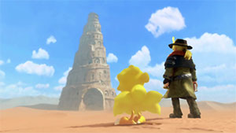
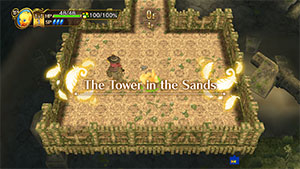
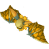
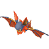

  

 

<table class="dungeonNext">
  <tr>
    <th>Next</th>
    <td><a href="/chocobo-3/story-dungeons/mayor-gale's-memories">Mayor Gale's Memories</a></td>
  </tr>
</table>

# Overview

<table class="dungeonOverview">
  <tr>
    <th>Unlock</th>
    <td class="highlightYellow">Proceed to this dungeon during the opening.</td>
  </tr>
  <tr>
    <th>Location</th>
    <td class="highlightYellow">-</td>
  </tr>
</table>

<table class="dungeonTable">
  <tr>
    <th>Title</th>
    <td colspan="3">-</td>
  </tr>
  <tr>
    <th>Description</th>
    <td colspan="3">-</td>
  </tr>
  <tr>
    <th>Floors</th>
    <td>4F</td>
    <th>Bosses</th>
    <td>3F</td>
  </tr>
  <tr>
    <th>Change Crystals</th>
    <td>None</td>
    <th>Checkpoints</th>
    <td>None</td>
  </tr>
  <tr>
    <th>Max Level</th>
    <td>-</td>
    <th>Bring Buddy</th>
    <td>-</td>
  </tr>
  <tr>
    <th>Bring In Items</th>
    <td>-</td>
    <th>Take Out Items</th>
    <td>Yes</td>
  </tr>
  <tr>
    <th>Shops/Duels</th>
    <td>No</td>
    <th>Den of Monsters</th>
    <td>No</td>
  </tr>
  <tr>
    <th>Reapers</th>
    <td>No</td>
    <th>Bookmark</th>
    <td>No</td>
  </tr>
  <tr>
    <th>Unidentified</th>
    <td colspan="3">None</td>
  </tr>
  <tr>
    <th>Rewards</th>
    <td colspan="3">1.  Goblin's Fortune access. 2. Can unlock  Mayor Gale's Memories.</td>
  </tr>
</table>

# Strategy

[Content]

# Monsters

<ul><li><a href="#monster-table">Monster Table</a></li><li><a href="#monster-details">Monster Details</a></li></ul>

 

 Monster Table 

Monster Colors - Boss

<table class="monsterTable">
  <thead>
    <tr>
      <th>F</th>
      <th colspan="0">Monsters</th>
    </tr>
  </thead>
  <tbody>
    <tr class="highlightYellow">
      <td class="centeredText">0</td>
      <td class="centeredText">Static Item Floor</td>
    </tr>
    <tr>
      <td class="centeredText">1</td>
      <td> Steel Bat</td>
    </tr>
    <tr>
      <td class="centeredText">2</td>
      <td> Steel Bat x 4</td>
    </tr>
    <tr>
      <td class="centeredText">3</td>
      <td> Werebat</td>
    </tr>
    <tr class="highlightYellow">
      <td class="centeredText">4</td>
      <td class="centeredText">Goal Floor</td>
    </tr>
  </tbody>
</table>

 

 Monster Details 

Stat Colors - Hard Mode

### Standard

#### Steel Bat (1-2F)

<table class="buddyOverview">
  <tr class="noPad">
    <th colspan="11" class="highlightGreen">Stats</th>
  </tr>
  <tr>
    <td rowspan="4"></td>
    <td class="hp">HP</td>
    <td>20 / 26</td>
    <td class="atk">Attack</td>
    <td>3 / 5</td>
    <td class="mag">Magic</td>
    <td>17 / 18</td>
    <th>JP</th>
    <td>-</td>
    <th>Item 1</th>
    <td class="leftText">-</td>
  </tr>
  <tr>
    <td class="sp">Exp</td>
    <td>6</td>
    <td class="def">Defense</td>
    <td>24 / 25</td>
    <td class="mnd">Mind</td>
    <td>38 / 39</td>
    <th>BP</th>
    <td>-</td>
    <th>Item 2</th>
    <td class="leftText">-</td>
  </tr>
  <tr>
    <th>Hit</th>
    <td>95</td>
    <th>Evasion</th>
    <td>8</td>
    <th>Crit</th>
    <td>5</td>
    <th>Gil</th>
    <td>-</td>
    <th>Steal</th>
    <td class="leftText">-</td>
  </tr>
  <tr>
    <th>Lv</th>
    <td>1</td>
    <th>Special</th>
    <td></td>
    <th>Resist</th>
    <td colspan="3"></td>
    <th>Weak</th>
    <td></td>
  </tr>
</table>

### Boss

#### Werebat (3F)

<table class="buddyOverview">
  <tr class="noPad">
    <th colspan="14" class="highlightBoss">Stats</th>
  </tr>
  <tr>
    <td rowspan="4"></td>
    <td class="hp">HP</td>
    <td>125 / 149</td>
    <td class="atk">Attack</td>
    <td>10 / 10</td>
    <td class="mag">Magic</td>
    <td>20 / 20</td>
    <th>JP</th>
    <td>-</td>
    <th>Item 1</th>
    <td colspan="5" class="leftText">-</td>
  </tr>
  <tr>
    <td class="sp">Exp</td>
    <td>58</td>
    <td class="def">Defense</td>
    <td>20 / 20</td>
    <td class="mnd">Mind</td>
    <td>8 / 8</td>
    <th>BP</th>
    <td>-</td>
    <th>Item 2</th>
    <td colspan="5" class="leftText">-</td>
  </tr>
  <tr>
    <th>Hit</th>
    <td>100</td>
    <th>Evasion</th>
    <td>10</td>
    <th>Crit</th>
    <td>5</td>
    <th>Gil</th>
    <td>-</td>
    <th>Steal</th>
    <td colspan="5" class="leftText">-</td>
  </tr>
  <tr>
    <th>Lv</th>
    <td>10</td>
    <th>Special</th>
    <td>-</td>
    <th>Resist</th>
    <td colspan="3"></td>
    <th>Weak</th>
    <td colspan="5"></td>
  </tr>
  <tr>
    <th colspan="14" class="statusResists">Status Resistances</th>
  </tr>
  <tr>
    <th></th>
    <th></th>
    <th></th>
    <th></th>
    <th></th>
    <th></th>
    <th></th>
    <th></th>
    <th></th>
    <th>Knock</th>
    <th>Stun</th>
    <th>Warp</th>
    <th>Ratio</th>
  </tr>
  <tr>
    <td>◯</td>
    <td>◯</td>
    <td>◯</td>
    <td>◯</td>
    <td>◯</td>
    <td>◯</td>
    <td>◯</td>
    <td>◯</td>
    <td>◯</td>
    <td>◯</td>
    <td>◯</td>
    <td>◯</td>
    <td>◯</td>
  </tr>
</table>

# Items

 Static 

 

<table class="dungeonItemTable">
  <tr>
    <th colspan="3" class="highlightPurple"> Talons</th>
  </tr>
  <tr>
    <th>Item</th>
    <th>Floor</th>
    <th>Count</th>
  </tr>
  <tr>
    <td>Rusty Talons</td>
    <td>0</td>
    <td>1</td>
  </tr>
  <tr>
    <th colspan="3" class="highlightPurple"> Saddles</th>
  </tr>
  <tr>
    <th>Item</th>
    <th>Floor</th>
    <th>Count</th>
  </tr>
  <tr>
    <td>Rusty Saddle</td>
    <td>0</td>
    <td>1</td>
  </tr>
  <tr>
    <th colspan="3" class="highlightPurple"> Greens</th>
  </tr>
  <tr>
    <th>Item</th>
    <th>Floor</th>
    <th>Count</th>
  </tr>
  <tr>
    <td>Gysahl Greens</td>
    <td>0</td>
    <td>1</td>
  </tr>
</table>

 

 Drop / Steal 

Monster Colors - Boss

<table class="dungeonDropTable">
  <thead>
    <tr>
      <th>Floor</th>
      <th>Monster</th>
      <th>Drop 1</th>
      <th>Drop 2</th>
      <th>Steal</th>
    </tr>
  </thead>
  <tbody>
    <tr>
      <td>1-2</td>
      <td> Steel Bat</td>
      <td>-</td>
      <td>-</td>
      <td>-</td>
    </tr>
    <tr>
      <td>3</td>
      <td> Werebat</td>
      <td>-</td>
      <td>-</td>
      <td>-</td>
    </tr>
  </tbody>
</table>
