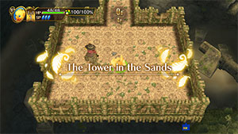

# Before Playing

### FAQ

#### Is This a New Game?

No, it's a modern remaster of Final Fantasy Fables: Chocobo's Dungeon (Wii / DS). They adjusted the game's balance, added co-op gameplay, monster collecting, new jobs, etc.

#### What's Up With Chocobo's New Voice?

Yep, I hate the new voice too. But nothing can be done about it, so just get used to it.

#### Is This Game Difficult?

I'd say it's harder than Pokemon Mystery Dungeon, but easier than Shiren, if you're familiar with those series. Level is retained throughout the main story, but there are challenge dungeons that restrict player level and such. Overall, it plays more like a JRPG with roguelike controls than an actual roguelike, and bosses are tougher.

#### Can You Just Reload If You Collapse?

Yes, in Normal Mode you can reload your save an unlimited number of times without penalty. Hard Mode is stricter, and will treat it as if you collapsed if you reload from the same Bookmark 2 times. ※ You might be able to use Cloud Saves to work around the Hard Mode restrictions.

#### Are There Missables?

None of the important stuff in this game is permanently missable. The dungeons [The Tower in the Sands](/story-dungeons/the-tower-in-the-sands) and [Insatiable Hunger 1](/extra-dungeons/insatiable-hunger) cannot be played again once cleared. Otherwise, there are just optional story scenes that can only be viewed during certain chapters.

#### Source for Data Found On This Site?

The data was collected via a combination of memory editing, datamining, and player testing. That said, I don't claim to know everything about the game, so I apologize if there are inaccuracies.

### Normal Mode vs. Hard Mode

#### 1. Stronger Enemies

Hard - HP, Attack, Defense, Magic, and Mind get multiplied by a set amount based on monster type. 　・The multiplier ranges between x1.00 ~ x1.50, and is a static number per monster type.

#### 2. Changes to Bookmark Feature

##### Resuming from a Bookmark

Normal - Can resume from a Bookmark an unlimited number of times. Hard - Can resume from a Bookmark 1 time (The game assumes you collapsed if you try to reload again).

##### Bookmark Disabled Locations

Hard - Certain locations such as boss floors no longer allow Bookmarks.

#### 3. Harsher Collapse Penalty

Normal - Lose all items and gil you were carrying, excluding equipped items. Hard - Lose all items and gil you were carrying, including equipped items.

#### 4. Scaling Experience Points

Normal - Defeated foes grant a fixed amount of experience points, regardless of Chocobo's level. Hard - Defeated foes grant a variable amount of experience points, depending on Chocobo's level. 　・Exp decreases if Chocobo's level is higher than the enemy's level, down to a minimum of ~1/6 exp.

#### 5. Slower HP Regen

Normal - Chocobo recovers 1 HP every 2 turns. Hard - Chocobo recovers 1 HP every 3 turns.

#### 6. Buddy Revive Condition Changes

Normal - Chocobo's Buddy gets revived with 50% HP when you advance to the next floor. 　・The Beastmaster job's "Assemble" ability can be used to revive a buddy. Hard - Chocobo's Buddy only revives when you advance to a floor with a Change Crystal. 　・The Beastmaster job's "Assemble" ability cannot be used to revive a buddy.

#### 7. Unconfirmed Changes

Some players seem to think hard mode also...

- Has a reduced item drop rate.
- Reduces the amount of JP defeated enemies drop.
- Uses a different damage calculation compared to Normal Mode.
- Changes the minimum values for damage dealt and damage received.
- Reduces power or ratio values of some enemy abilities, effectively boosting damage dealt.
- Lowers player damage dealt or raises player damage received, separate from enemy stat changes.
- Changes some of the mechanics of Insatiable Hunger (Endless).

# Beginnings

### The Tower in the Sands

The game whisks you straight into a tutorial dungeon called [The Tower In The Sands](/story-dungeons/the-tower-in-the-sands) after the opening. It's only 4F (4 floors) deep and it's impossible to collapse, so spend some time checking out menus and controls. In particular, you'll want to pick up and equip the Rusty Talons and Rusty Saddle found on 0F.

#### 3F - Werebat (Boss)

Werebat has 125 HP or 149 HP on Hard Mode and hits much harder than the Steel Bats on 1-2F. Open the Ability menu and press L + A to assign a shortcut for Chocobo Kick, then kick the bat until you win. Cid will fully heal you if your HP gets low, so there's absolutely no danger.

### Town of Lostime

# Stella's Farm

### Mystery Person's Letters (1, 3, 4)

# Mayor Gale

### Mayor Gale's Memories

# Cid

### Cid's Memories
