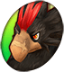
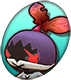
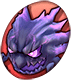
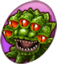
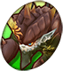
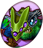

# Overview

# Characters

#### Cid

<table class="buddyOverview">
  <tr class="noPad">
    <td rowspan="3"></td>
    <th class="unlock">Unlock</th>
    <td colspan="3" class="highlightYellow leftText"></td>
  </tr>
  <tr>
    <th>Equip Bonus</th>
    <th>Special</th>
    <th>Resists</th>
    <th>Weakness</th>
  </tr>
  <tr>
    <td>75%</td>
    <td>-</td>
    <td>-</td>
    <td>-</td>
  </tr>
</table>

<table class="buddyOverview">
  <tr>
    <th rowspan="3">Stats (Lv99)</th>
    <td class="hp">HP</td>
    <td>733</td>
    <td class="atk">Attack</td>
    <td>119 (230)</td>
    <td class="mag">Magic</td>
    <td>119</td>
  </tr>
  <tr>
    <td class="sp">SP</td>
    <td>4</td>
    <td class="def">Defense</td>
    <td>119 (230)</td>
    <td class="mnd">Mind</td>
    <td>119</td>
  </tr>
  <tr>
    <td class="hit">Hit</td>
    <td>98</td>
    <td class="evade">Evasion</td>
    <td>8</td>
    <td class="crit">Crit</td>
    <td>10</td>
  </tr>
</table>

<table class="abilityTable">
  <tr>
    <th>Ability</th>
    <th>SP</th>
    <th>Category</th>
    <th>Power</th>
    <th>Ratio</th>
    <th>Type</th>
    <th>Element</th>
    <th>Range</th>
  </tr>
  <tr>
    <td>A.R.T.</td>
    <td>2.0</td>
    <td>Magic</td>
    <td>10</td>
    <td>250</td>
    <td>Normal</td>
    <td>-</td>
    <td></td>
  </tr>
  <tr>
    <td>Note 1</td>
    <td colspan="7">Attack a foe up to 4 tiles ahead of you.</td>
  </tr>
  <tr>
    <td>Note 2</td>
    <td colspan="7">Unleash the power of Cid's handgun to attack a foe up to 4 tiles ahead of you.</td>
  </tr>
</table>

#### Freja

<table class="buddyOverview">
  <tr class="noPad">
    <td rowspan="3"></td>
    <th class="unlock">Unlock</th>
    <td colspan="3" class="highlightYellow leftText"></td>
  </tr>
  <tr>
    <th>Equip Bonus</th>
    <th>Special</th>
    <th>Resists</th>
    <th>Weakness</th>
  </tr>
  <tr>
    <td>78%</td>
    <td>-</td>
    <td>-</td>
    <td>-</td>
  </tr>
</table>

<table class="buddyOverview">
  <tr>
    <th rowspan="3">Stats (Lv99)</th>
    <td class="hp">HP</td>
    <td>791</td>
    <td class="atk">Attack</td>
    <td>121 (237)</td>
    <td class="mag">Magic</td>
    <td>107</td>
  </tr>
  <tr>
    <td class="sp">SP</td>
    <td>4</td>
    <td class="def">Defense</td>
    <td>126 (242)</td>
    <td class="mnd">Mind</td>
    <td>109</td>
  </tr>
  <tr>
    <td class="hit">Hit</td>
    <td>98</td>
    <td class="evade">Evasion</td>
    <td>6</td>
    <td class="crit">Crit</td>
    <td>10</td>
  </tr>
</table>

<table class="abilityTable">
  <tr>
    <th>Ability</th>
    <th>SP</th>
    <th>Category</th>
    <th>Power</th>
    <th>Ratio</th>
    <th>Type</th>
    <th>Element</th>
    <th>Range</th>
  </tr>
  <tr>
    <td>Earth Hammer</td>
    <td>3.0</td>
    <td>Physical</td>
    <td>0</td>
    <td>150</td>
    <td>Normal</td>
    <td>-</td>
    <td></td>
  </tr>
  <tr>
    <td>Note 1</td>
    <td colspan="7">Stun a foe 1 tile ahead of you.</td>
  </tr>
  <tr>
    <td>Note 2</td>
    <td colspan="7">Use Freja's massive hammer to stun a foe 1 tile ahead of you.</td>
  </tr>
</table>

#### Meja

<table class="buddyOverview">
  <tr class="noPad">
    <td rowspan="3"></td>
    <th class="unlock">Unlock</th>
    <td colspan="3" class="highlightYellow leftText"></td>
  </tr>
  <tr>
    <th>Equip Bonus</th>
    <th>Special</th>
    <th>Resists</th>
    <th>Weakness</th>
  </tr>
  <tr>
    <td>77%</td>
    <td>-</td>
    <td>-</td>
    <td>-</td>
  </tr>
</table>

<table class="buddyOverview">
  <tr>
    <th rowspan="3">Stats (Lv99)</th>
    <td class="hp">HP</td>
    <td>689</td>
    <td class="atk">Attack</td>
    <td>111 (225)</td>
    <td class="mag">Magic</td>
    <td>128</td>
  </tr>
  <tr>
    <td class="sp">SP</td>
    <td>4</td>
    <td class="def">Defense</td>
    <td>114 (228)</td>
    <td class="mnd">Mind</td>
    <td>130</td>
  </tr>
  <tr>
    <td class="hit">Hit</td>
    <td>96</td>
    <td class="evade">Evasion</td>
    <td>7</td>
    <td class="crit">Crit</td>
    <td>9</td>
  </tr>
</table>

<table class="abilityTable">
  <tr>
    <th>Ability</th>
    <th>SP</th>
    <th>Category</th>
    <th>Power</th>
    <th>Ratio</th>
    <th>Type</th>
    <th>Element</th>
    <th>Range</th>
  </tr>
  <tr>
    <td>Cleansing Prayer</td>
    <td>0.5</td>
    <td>Other</td>
    <td>0</td>
    <td>0</td>
    <td>No Damage</td>
    <td>-</td>
    <td></td>
  </tr>
  <tr>
    <td>Note 1</td>
    <td colspan="7">Cure all of Chocobo's ailments.</td>
  </tr>
  <tr>
    <td>Note 2</td>
    <td colspan="7">Use Meja's prayers and purifying water to cure all of Chocobo's ailments.</td>
  </tr>
</table>

#### Shirma

<table class="buddyOverview">
  <tr class="noPad">
    <td rowspan="3"></td>
    <th class="unlock">Unlock</th>
    <td colspan="3" class="highlightYellow leftText"></td>
  </tr>
  <tr>
    <th>Equip Bonus</th>
    <th>Special</th>
    <th>Resists</th>
    <th>Weakness</th>
  </tr>
  <tr>
    <td>77%</td>
    <td>-</td>
    <td>-</td>
    <td>-</td>
  </tr>
</table>

<table class="buddyOverview">
  <tr>
    <th rowspan="3">Stats (Lv99)</th>
    <td class="hp">HP</td>
    <td>689</td>
    <td class="atk">Attack</td>
    <td>111 (225)</td>
    <td class="mag">Magic</td>
    <td>128</td>
  </tr>
  <tr>
    <td class="sp">SP</td>
    <td>5</td>
    <td class="def">Defense</td>
    <td>114 (228)</td>
    <td class="mnd">Mind</td>
    <td>130</td>
  </tr>
  <tr>
    <td class="hit">Hit</td>
    <td>96</td>
    <td class="evade">Evasion</td>
    <td>7</td>
    <td class="crit">Crit</td>
    <td>9</td>
  </tr>
</table>

<table class="abilityTable">
  <tr>
    <th>Ability</th>
    <th>SP</th>
    <th>Category</th>
    <th>Power</th>
    <th>Ratio</th>
    <th>Type</th>
    <th>Element</th>
    <th>Range</th>
  </tr>
  <tr>
    <td>Cure</td>
    <td>1.5</td>
    <td>Healing</td>
    <td>180</td>
    <td>100</td>
    <td>Normal</td>
    <td>-</td>
    <td></td>
  </tr>
  <tr>
    <td>Note 1</td>
    <td colspan="7">Restore some of Chocobo's HP.</td>
  </tr>
  <tr>
    <td>Note 2</td>
    <td colspan="7">Cast a healing spell to restore some of Chocobo's HP.</td>
  </tr>
</table>

#### Croma

<table class="buddyOverview">
  <tr class="noPad">
    <td rowspan="3"></td>
    <th class="unlock">Unlock</th>
    <td colspan="3" class="highlightYellow leftText"></td>
  </tr>
  <tr>
    <th>Equip Bonus</th>
    <th>Special</th>
    <th>Resists</th>
    <th>Weakness</th>
  </tr>
  <tr>
    <td>72%</td>
    <td>-</td>
    <td>-</td>
    <td>-</td>
  </tr>
</table>

<table class="buddyOverview">
  <tr>
    <th rowspan="3">Stats (Lv99)</th>
    <td class="hp">HP</td>
    <td>674</td>
    <td class="atk">Attack</td>
    <td>109 (216)</td>
    <td class="mag">Magic</td>
    <td>130</td>
  </tr>
  <tr>
    <td class="sp">SP</td>
    <td>5</td>
    <td class="def">Defense</td>
    <td>111 (218)</td>
    <td class="mnd">Mind</td>
    <td>128</td>
  </tr>
  <tr>
    <td class="hit">Hit</td>
    <td>96</td>
    <td class="evade">Evasion</td>
    <td>7</td>
    <td class="crit">Crit</td>
    <td>9</td>
  </tr>
</table>

<table class="abilityTable">
  <tr>
    <th>Ability</th>
    <th>SP</th>
    <th>Category</th>
    <th>Power</th>
    <th>Ratio</th>
    <th>Type</th>
    <th>Element</th>
    <th>Range</th>
  </tr>
  <tr>
    <td>Maxym</td>
    <td>3.0</td>
    <td>Magic</td>
    <td>50</td>
    <td>140</td>
    <td>Normal</td>
    <td>-</td>
    <td></td>
  </tr>
  <tr>
    <td>Note 1</td>
    <td colspan="7">Deal magical damage to all foes within a 3-tile radius.</td>
  </tr>
  <tr>
    <td>Note 2</td>
    <td colspan="7">Unleash pure magical energy to deal damage to all foes within a 3-tile radius.</td>
  </tr>
</table>

#### Raffaello

<table class="buddyOverview">
  <tr class="noPad">
    <td rowspan="3"></td>
    <th class="unlock">Unlock</th>
    <td colspan="3" class="highlightYellow leftText"></td>
  </tr>
  <tr>
    <th>Equip Bonus</th>
    <th>Special</th>
    <th>Resists</th>
    <th>Weakness</th>
  </tr>
  <tr>
    <td>80%</td>
    <td></td>
    <td>-</td>
    <td>-</td>
  </tr>
</table>

<table class="buddyOverview">
  <tr>
    <th rowspan="3">Stats (Lv99)</th>
    <td class="hp">HP</td>
    <td>718</td>
    <td class="atk">Attack</td>
    <td>114 (233)</td>
    <td class="mag">Magic</td>
    <td>121</td>
  </tr>
  <tr>
    <td class="sp">SP</td>
    <td>4</td>
    <td class="def">Defense</td>
    <td>116 (235)</td>
    <td class="mnd">Mind</td>
    <td>121</td>
  </tr>
  <tr>
    <td class="hit">Hit</td>
    <td>97</td>
    <td class="evade">Evasion</td>
    <td>7</td>
    <td class="crit">Crit</td>
    <td>9</td>
  </tr>
</table>

<table class="abilityTable">
  <tr>
    <th>Ability</th>
    <th>SP</th>
    <th>Category</th>
    <th>Power</th>
    <th>Ratio</th>
    <th>Type</th>
    <th>Element</th>
    <th>Range</th>
  </tr>
  <tr>
    <td>Ray of Hope</td>
    <td>1.5</td>
    <td>Other</td>
    <td>0</td>
    <td>0</td>
    <td>No Damage</td>
    <td>-</td>
    <td></td>
  </tr>
  <tr>
    <td>Note 1</td>
    <td colspan="7">Cast Protect and Shell on Chocobo.</td>
  </tr>
  <tr>
    <td>Note 2</td>
    <td colspan="7">Bask in a heavenly ray of hope to cast Protect and Shell on Chocobo.</td>
  </tr>
</table>

#### Irma

<table class="buddyOverview">
  <tr class="noPad">
    <td rowspan="3"></td>
    <th class="unlock">Unlock</th>
    <td colspan="3" class="highlightYellow leftText"></td>
  </tr>
  <tr>
    <th>Equip Bonus</th>
    <th>Special</th>
    <th>Resists</th>
    <th>Weakness</th>
  </tr>
  <tr>
    <td>79%</td>
    <td>-</td>
    <td>-</td>
    <td>-</td>
  </tr>
</table>

<table class="buddyOverview">
  <tr>
    <th rowspan="3">Stats (Lv99)</th>
    <td class="hp">HP</td>
    <td>747</td>
    <td class="atk">Attack</td>
    <td>121 (238)</td>
    <td class="mag">Magic</td>
    <td>111</td>
  </tr>
  <tr>
    <td class="sp">SP</td>
    <td>4</td>
    <td class="def">Defense</td>
    <td>121 (238)</td>
    <td class="mnd">Mind</td>
    <td>121</td>
  </tr>
  <tr>
    <td class="hit">Hit</td>
    <td>99</td>
    <td class="evade">Evasion</td>
    <td>8</td>
    <td class="crit">Crit</td>
    <td>10</td>
  </tr>
</table>

<table class="abilityTable">
  <tr>
    <th>Ability</th>
    <th>SP</th>
    <th>Category</th>
    <th>Power</th>
    <th>Ratio</th>
    <th>Type</th>
    <th>Element</th>
    <th>Range</th>
  </tr>
  <tr>
    <td>Ravaging Battleaxe</td>
    <td>3.0</td>
    <td>Physical</td>
    <td>20</td>
    <td>200</td>
    <td>Normal</td>
    <td>-</td>
    <td></td>
  </tr>
  <tr>
    <td>Note 1</td>
    <td colspan="7">Deal damage to all foes within a 3-tile radius.</td>
  </tr>
  <tr>
    <td>Note 2</td>
    <td colspan="7">Use Irma's battleaxe to deal damage to all foes within a 3-tile radius.</td>
  </tr>
</table>

#### Volg

<table class="buddyOverview">
  <tr class="noPad">
    <td rowspan="3"></td>
    <th class="unlock">Unlock</th>
    <td colspan="3" class="highlightYellow leftText"></td>
  </tr>
  <tr>
    <th>Equip Bonus</th>
    <th>Special</th>
    <th>Resists</th>
    <th>Weakness</th>
  </tr>
  <tr>
    <td>83%</td>
    <td>-</td>
    <td>-</td>
    <td>-</td>
  </tr>
</table>

<table class="buddyOverview">
  <tr>
    <th rowspan="3">Stats (Lv99)</th>
    <td class="hp">HP</td>
    <td>762</td>
    <td class="atk">Attack</td>
    <td>123 (246)</td>
    <td class="mag">Magic</td>
    <td>109</td>
  </tr>
  <tr>
    <td class="sp">SP</td>
    <td>4</td>
    <td class="def">Defense</td>
    <td>123 (246)</td>
    <td class="mnd">Mind</td>
    <td>114</td>
  </tr>
  <tr>
    <td class="hit">Hit</td>
    <td>99</td>
    <td class="evade">Evasion</td>
    <td>6</td>
    <td class="crit">Crit</td>
    <td>10</td>
  </tr>
</table>

<table class="abilityTable">
  <tr>
    <th>Ability</th>
    <th>SP</th>
    <th>Category</th>
    <th>Power</th>
    <th>Ratio</th>
    <th>Type</th>
    <th>Element</th>
    <th>Range</th>
  </tr>
  <tr>
    <td>Chocobo Kick+</td>
    <td>3.0</td>
    <td>Physical</td>
    <td>20</td>
    <td>200</td>
    <td>Normal</td>
    <td>-</td>
    <td></td>
  </tr>
  <tr>
    <td>Note 1</td>
    <td colspan="7">Pierce all foes up to 6 tiles ahead of you.</td>
  </tr>
  <tr>
    <td>Note 2</td>
    <td colspan="7">Deliver a powerful kick to pierce all foes up to 6 tiles ahead of you.</td>
  </tr>
</table>

#### Atla

<table class="buddyOverview">
  <tr class="noPad">
    <td rowspan="3"></td>
    <th class="unlock">Unlock</th>
    <td colspan="3" class="highlightYellow leftText"></td>
  </tr>
  <tr>
    <th>Equip Bonus</th>
    <th>Special</th>
    <th>Resists</th>
    <th>Weakness</th>
  </tr>
  <tr>
    <td>74%</td>
    <td>-</td>
    <td>-</td>
    <td>-</td>
  </tr>
</table>

<table class="buddyOverview">
  <tr>
    <th rowspan="3">Stats (Lv99)</th>
    <td class="hp">HP</td>
    <td>733</td>
    <td class="atk">Attack</td>
    <td>116 (226)</td>
    <td class="mag">Magic</td>
    <td>114</td>
  </tr>
  <tr>
    <td class="sp">SP</td>
    <td>5</td>
    <td class="def">Defense</td>
    <td>116 (226)</td>
    <td class="mnd">Mind</td>
    <td>116</td>
  </tr>
  <tr>
    <td class="hit">Hit</td>
    <td>100</td>
    <td class="evade">Evasion</td>
    <td>9</td>
    <td class="crit">Crit</td>
    <td>10</td>
  </tr>
</table>

<table class="abilityTable">
  <tr>
    <th>Ability</th>
    <th>SP</th>
    <th>Category</th>
    <th>Power</th>
    <th>Ratio</th>
    <th>Type</th>
    <th>Element</th>
    <th>Range</th>
  </tr>
  <tr>
    <td>Mug</td>
    <td>2.0</td>
    <td>Physical</td>
    <td>10</td>
    <td>190</td>
    <td>Normal</td>
    <td>-</td>
    <td></td>
  </tr>
  <tr>
    <td>Note 1</td>
    <td colspan="7">Steal an item from a foe 1 tile ahead of you and knock them back.</td>
  </tr>
  <tr>
    <td>Note 2</td>
    <td colspan="7">Use a tricky Treasure Hunter's technique to steal an item from a foe 1 tile ahead of you and knock them back. Cannot be used with a full bag.</td>
  </tr>
</table>

#### Camilla

<table class="buddyOverview">
  <tr class="noPad">
    <td rowspan="3"></td>
    <th class="unlock">Unlock</th>
    <td colspan="3" class="highlightYellow leftText"></td>
  </tr>
  <tr>
    <th>Equip Bonus</th>
    <th>Special</th>
    <th>Resists</th>
    <th>Weakness</th>
  </tr>
  <tr>
    <td>80%</td>
    <td>-</td>
    <td>-</td>
    <td>-</td>
  </tr>
</table>

<table class="buddyOverview">
  <tr>
    <th rowspan="3">Stats (Lv99)</th>
    <td class="hp">HP</td>
    <td>733</td>
    <td class="atk">Attack</td>
    <td>119 (238)</td>
    <td class="mag">Magic</td>
    <td>119</td>
  </tr>
  <tr>
    <td class="sp">SP</td>
    <td>4</td>
    <td class="def">Defense</td>
    <td>119 (238)</td>
    <td class="mnd">Mind</td>
    <td>119</td>
  </tr>
  <tr>
    <td class="hit">Hit</td>
    <td>98</td>
    <td class="evade">Evasion</td>
    <td>8</td>
    <td class="crit">Crit</td>
    <td>10</td>
  </tr>
</table>

<table class="abilityTable">
  <tr>
    <th>Ability</th>
    <th>SP</th>
    <th>Category</th>
    <th>Power</th>
    <th>Ratio</th>
    <th>Type</th>
    <th>Element</th>
    <th>Range</th>
  </tr>
  <tr>
    <td>Chocobo Kick</td>
    <td>2.0</td>
    <td>Physical</td>
    <td>0</td>
    <td>160</td>
    <td>Normal</td>
    <td>-</td>
    <td></td>
  </tr>
  <tr>
    <td>Note 1</td>
    <td colspan="7">Attack a foe 1 tile ahead of you.</td>
  </tr>
  <tr>
    <td>Note 2</td>
    <td colspan="7">Deliver a kick to a foe 1 tile ahead of you.</td>
  </tr>
</table>

<table class="abilityTable">
  <tr>
    <th>Ability</th>
    <th>SP</th>
    <th>Category</th>
    <th>Power</th>
    <th>Ratio</th>
    <th>Type</th>
    <th>Element</th>
    <th>Range</th>
  </tr>
  <tr>
    <td>Chocobo Drop</td>
    <td>2.0</td>
    <td>Physical</td>
    <td>0</td>
    <td>140</td>
    <td>Normal</td>
    <td>-</td>
    <td></td>
  </tr>
  <tr>
    <td>Note 1</td>
    <td colspan="7">Attack all foes within a 1-tile radius.</td>
  </tr>
  <tr>
    <td>Note 2</td>
    <td colspan="7">Deliver a tail attack against all foes within a 1-tile radius.</td>
  </tr>
</table>

<table class="abilityTable">
  <tr>
    <th>Ability</th>
    <th>SP</th>
    <th>Category</th>
    <th>Power</th>
    <th>Ratio</th>
    <th>Type</th>
    <th>Element</th>
    <th>Range</th>
  </tr>
  <tr>
    <td>Chocobo Kick+</td>
    <td>2.0</td>
    <td>Physical</td>
    <td>10</td>
    <td>160</td>
    <td>Normal</td>
    <td>-</td>
    <td></td>
  </tr>
  <tr>
    <td>Note 1</td>
    <td colspan="7">Attack a foe 1 tile ahead of you and knock them back.</td>
  </tr>
  <tr>
    <td>Note 2</td>
    <td colspan="7">Deliver a powerful kick to knock back a foe 1 tile ahead of you.</td>
  </tr>
</table>

<table class="abilityTable">
  <tr>
    <th>Ability</th>
    <th>SP</th>
    <th>Category</th>
    <th>Power</th>
    <th>Ratio</th>
    <th>Type</th>
    <th>Element</th>
    <th>Range</th>
  </tr>
  <tr>
    <td>Dig</td>
    <td>2.0</td>
    <td>Other</td>
    <td>0</td>
    <td>100</td>
    <td>No Damage</td>
    <td>-</td>
    <td></td>
  </tr>
  <tr>
    <td>Note 1</td>
    <td colspan="7">Dig up an item once per dungeon floor.</td>
  </tr>
  <tr>
    <td>Note 2</td>
    <td colspan="7">Dig into the ground and discover an item once per dungeon floor. Cannot be used with a full bag.</td>
  </tr>
</table>

<table class="abilityTable">
  <tr>
    <th>Ability</th>
    <th>SP</th>
    <th>Category</th>
    <th>Power</th>
    <th>Ratio</th>
    <th>Type</th>
    <th>Element</th>
    <th>Range</th>
  </tr>
  <tr>
    <td>Chocomet</td>
    <td>2.0</td>
    <td>Physical</td>
    <td>10</td>
    <td>190</td>
    <td>Normal</td>
    <td>-</td>
    <td></td>
  </tr>
  <tr>
    <td>Note 1</td>
    <td colspan="7">Drop a meteor on an area 3 tiles ahead of you.</td>
  </tr>
  <tr>
    <td>Note 2</td>
    <td colspan="7">Bring down a comet to smite foes in an area 3 tiles ahead of you.</td>
  </tr>
</table>

<table class="abilityTable">
  <tr>
    <th>Ability</th>
    <th>SP</th>
    <th>Category</th>
    <th>Power</th>
    <th>Ratio</th>
    <th>Type</th>
    <th>Element</th>
    <th>Range</th>
  </tr>
  <tr>
    <td>Chocobo Dash</td>
    <td>2.0</td>
    <td>Other</td>
    <td>0</td>
    <td>100</td>
    <td>No Damage</td>
    <td>-</td>
    <td></td>
  </tr>
  <tr>
    <td>Note 1</td>
    <td colspan="7">Cast Haste to temporarily increase Chocobo's speed.</td>
  </tr>
  <tr>
    <td>Note 2</td>
    <td colspan="7">Cast Haste to temporarily increase Chocobo's speed.</td>
  </tr>
</table>

<table class="abilityTable">
  <tr>
    <th>Ability</th>
    <th>SP</th>
    <th>Category</th>
    <th>Power</th>
    <th>Ratio</th>
    <th>Type</th>
    <th>Element</th>
    <th>Range</th>
  </tr>
  <tr>
    <td>Chocobo Kick Zero</td>
    <td>2.0</td>
    <td>Physical</td>
    <td>0</td>
    <td>180</td>
    <td>Normal</td>
    <td>-</td>
    <td></td>
  </tr>
  <tr>
    <td>Note 1</td>
    <td colspan="7">Stun a foe 1 tile ahead of you and knock them back.</td>
  </tr>
  <tr>
    <td>Note 2</td>
    <td colspan="7">Deliver a kick that stuns a foe 1 tile ahead of you and knocks them back.</td>
  </tr>
</table>

<table class="abilityTable">
  <tr>
    <th>Ability</th>
    <th>SP</th>
    <th>Category</th>
    <th>Power</th>
    <th>Ratio</th>
    <th>Type</th>
    <th>Element</th>
    <th>Range</th>
  </tr>
  <tr>
    <td>Chocobash</td>
    <td>2.0</td>
    <td>Physical</td>
    <td>30</td>
    <td>200</td>
    <td>Level</td>
    <td>-</td>
    <td></td>
  </tr>
  <tr>
    <td>Note 1</td>
    <td colspan="7">Attack all enemies within a 3-tile radius.</td>
  </tr>
  <tr>
    <td>Note 2</td>
    <td colspan="7">Deliver an attack that scales with your level to all foes within a 3-tile radius.</td>
  </tr>
</table>

#### Scarecrow

<table class="buddyOverview">
  <tr class="noPad">
    <td rowspan="3"></td>
    <th class="unlock">Unlock</th>
    <td colspan="3" class="highlightYellow leftText"></td>
  </tr>
  <tr>
    <th>Equip Bonus</th>
    <th>Special</th>
    <th>Resists</th>
    <th>Weakness</th>
  </tr>
  <tr>
    <td>63%</td>
    <td>-</td>
    <td>-</td>
    <td></td>
  </tr>
</table>

<table class="buddyOverview">
  <tr>
    <th rowspan="3">Stats (Lv99)</th>
    <td class="hp">HP</td>
    <td>555</td>
    <td class="atk">Attack</td>
    <td>95 (188)</td>
    <td class="mag">Magic</td>
    <td>95</td>
  </tr>
  <tr>
    <td class="sp">SP</td>
    <td>4</td>
    <td class="def">Defense</td>
    <td>95 (188)</td>
    <td class="mnd">Mind</td>
    <td>95</td>
  </tr>
  <tr>
    <td class="hit">Hit</td>
    <td>90</td>
    <td class="evade">Evasion</td>
    <td>2</td>
    <td class="crit">Crit</td>
    <td>5</td>
  </tr>
</table>

<table class="abilityTable">
  <tr>
    <th>Ability</th>
    <th>SP</th>
    <th>Category</th>
    <th>Power</th>
    <th>Ratio</th>
    <th>Type</th>
    <th>Element</th>
    <th>Range</th>
  </tr>
  <tr>
    <td>Manafont</td>
    <td>4.0</td>
    <td>Healing</td>
    <td>0</td>
    <td>0</td>
    <td>Normal</td>
    <td>-</td>
    <td></td>
  </tr>
  <tr>
    <td>Note 1</td>
    <td colspan="7">Use the Amethyst to fully restore Chocobo's SP.</td>
  </tr>
  <tr>
    <td>Note 2</td>
    <td colspan="7">Use Scarecrow's Amethyst to fully restore Chocobo's SP.</td>
  </tr>
</table>

#### Shiroma

<table class="buddyOverview">
  <tr class="noPad">
    <td rowspan="3"></td>
    <th class="unlock">Unlock</th>
    <td colspan="3" class="highlightYellow leftText"></td>
  </tr>
  <tr>
    <th>Equip Bonus</th>
    <th>Special</th>
    <th>Resists</th>
    <th>Weakness</th>
  </tr>
  <tr>
    <td>77%</td>
    <td>-</td>
    <td>-</td>
    <td>-</td>
  </tr>
</table>

<table class="buddyOverview">
  <tr>
    <th rowspan="3">Stats (Lv99)</th>
    <td class="hp">HP</td>
    <td>689</td>
    <td class="atk">Attack</td>
    <td>111 (225)</td>
    <td class="mag">Magic</td>
    <td>128</td>
  </tr>
  <tr>
    <td class="sp">SP</td>
    <td>5</td>
    <td class="def">Defense</td>
    <td>114 (228)</td>
    <td class="mnd">Mind</td>
    <td>130</td>
  </tr>
  <tr>
    <td class="hit">Hit</td>
    <td>96</td>
    <td class="evade">Evasion</td>
    <td>7</td>
    <td class="crit">Crit</td>
    <td>9</td>
  </tr>
</table>

<table class="abilityTable">
  <tr>
    <th>Ability</th>
    <th>SP</th>
    <th>Category</th>
    <th>Power</th>
    <th>Ratio</th>
    <th>Type</th>
    <th>Element</th>
    <th>Range</th>
  </tr>
  <tr>
    <td>Cure</td>
    <td>1.5</td>
    <td>Healing</td>
    <td>180</td>
    <td>100</td>
    <td>Normal</td>
    <td>-</td>
    <td></td>
  </tr>
  <tr>
    <td>Note 1</td>
    <td colspan="7">Restore some of Chocobo's HP.</td>
  </tr>
  <tr>
    <td>Note 2</td>
    <td colspan="7">Cast a healing spell to restore some of Chocobo's HP.</td>
  </tr>
</table>

#### Cid

<table class="buddyOverview">
  <tr class="noPad">
    <td rowspan="3"></td>
    <th class="unlock">Unlock</th>
    <td colspan="3" class="highlightYellow leftText"></td>
  </tr>
  <tr>
    <th>Equip Bonus</th>
    <th>Special</th>
    <th>Resists</th>
    <th>Weakness</th>
  </tr>
  <tr>
    <td>81%</td>
    <td>-</td>
    <td>-</td>
    <td>-</td>
  </tr>
</table>

<table class="buddyOverview">
  <tr>
    <th rowspan="3">Stats (Lv99)</th>
    <td class="hp">HP</td>
    <td>718</td>
    <td class="atk">Attack</td>
    <td>116 (236)</td>
    <td class="mag">Magic</td>
    <td>126</td>
  </tr>
  <tr>
    <td class="sp">SP</td>
    <td>5</td>
    <td class="def">Defense</td>
    <td>121 (241)</td>
    <td class="mnd">Mind</td>
    <td>126</td>
  </tr>
  <tr>
    <td class="hit">Hit</td>
    <td>97</td>
    <td class="evade">Evasion</td>
    <td>7</td>
    <td class="crit">Crit</td>
    <td>9</td>
  </tr>
</table>

<table class="abilityTable">
  <tr>
    <th>Ability</th>
    <th>SP</th>
    <th>Category</th>
    <th>Power</th>
    <th>Ratio</th>
    <th>Type</th>
    <th>Element</th>
    <th>Range</th>
  </tr>
  <tr>
    <td>Land Mine</td>
    <td>1.0</td>
    <td>Other</td>
    <td>30</td>
    <td>120</td>
    <td>No Damage</td>
    <td>-</td>
    <td></td>
  </tr>
  <tr>
    <td>Note 1</td>
    <td colspan="7">Lay a trap that damages all foes within a 1-tile radius.</td>
  </tr>
  <tr>
    <td>Note 2</td>
    <td colspan="7">Lay a trap that explodes when stepped on, dealing damage to all foes within a 1-tile radius.</td>
  </tr>
</table>

#### Keeper of Time

<table class="buddyOverview">
  <tr class="noPad">
    <td rowspan="3"></td>
    <th class="unlock">Unlock</th>
    <td colspan="3" class="highlightYellow leftText"></td>
  </tr>
  <tr>
    <th>Equip Bonus</th>
    <th>Special</th>
    <th>Resists</th>
    <th>Weakness</th>
  </tr>
  <tr>
    <td>83%</td>
    <td></td>
    <td>     </td>
    <td>-</td>
  </tr>
</table>

<table class="buddyOverview">
  <tr>
    <th rowspan="3">Stats (Lv99)</th>
    <td class="hp">HP</td>
    <td>733</td>
    <td class="atk">Attack</td>
    <td>119 (242)</td>
    <td class="mag">Magic</td>
    <td>130</td>
  </tr>
  <tr>
    <td class="sp">SP</td>
    <td>4</td>
    <td class="def">Defense</td>
    <td>130 (253)</td>
    <td class="mnd">Mind</td>
    <td>130</td>
  </tr>
  <tr>
    <td class="hit">Hit</td>
    <td>95</td>
    <td class="evade">Evasion</td>
    <td>4</td>
    <td class="crit">Crit</td>
    <td>10</td>
  </tr>
</table>

<table class="abilityTable">
  <tr>
    <th>Ability</th>
    <th>SP</th>
    <th>Category</th>
    <th>Power</th>
    <th>Ratio</th>
    <th>Type</th>
    <th>Element</th>
    <th>Range</th>
  </tr>
  <tr>
    <td>Megaflare</td>
    <td>3.0</td>
    <td>Magic</td>
    <td>17</td>
    <td>200</td>
    <td>Normal</td>
    <td>-</td>
    <td></td>
  </tr>
  <tr>
    <td>Note 1</td>
    <td colspan="7">Deal explosive damage to all foes in the room.</td>
  </tr>
  <tr>
    <td>Note 2</td>
    <td colspan="7">Unleash Keeper of Time Bahamut's fiery breath attack to deal explosive damage to all foes in the room.</td>
  </tr>
</table>

#### Steel Bat

<table class="buddyOverview">
  <tr class="noPad">
    <td rowspan="3"></td>
    <th class="unlock">Unlock</th>
    <td colspan="3" class="highlightYellow leftText">Defeat Steel Bat and collect 10 BP (Bats).</td>
  </tr>
  <tr>
    <th>Equip Bonus</th>
    <th>Special</th>
    <th>Resists</th>
    <th>Weakness</th>
  </tr>
  <tr>
    <td>74%</td>
    <td></td>
    <td></td>
    <td></td>
  </tr>
</table>

<table class="buddyOverview">
  <tr>
    <th rowspan="3">Stats (Lv99)</th>
    <td class="hp">HP</td>
    <td>659</td>
    <td class="atk">Attack</td>
    <td>107 (217)</td>
    <td class="mag">Magic</td>
    <td>119</td>
  </tr>
  <tr>
    <td class="sp">SP</td>
    <td>4</td>
    <td class="def">Defense</td>
    <td>107 (217)</td>
    <td class="mnd">Mind</td>
    <td>130</td>
  </tr>
  <tr>
    <td class="hit">Hit</td>
    <td>95</td>
    <td class="evade">Evasion</td>
    <td>8</td>
    <td class="crit">Crit</td>
    <td>5</td>
  </tr>
</table>

<table class="abilityTable">
  <tr>
    <th>Ability</th>
    <th>SP</th>
    <th>Category</th>
    <th>Power</th>
    <th>Ratio</th>
    <th>Type</th>
    <th>Element</th>
    <th>Range</th>
  </tr>
  <tr>
    <td>Ultrasonic Wave</td>
    <td>1.0</td>
    <td>Magic</td>
    <td>20</td>
    <td>120</td>
    <td>Normal</td>
    <td>-</td>
    <td></td>
  </tr>
  <tr>
    <td>Note 1</td>
    <td colspan="7">Attack a foe up to 2 tiles ahead of you.</td>
  </tr>
  <tr>
    <td>Note 2</td>
    <td colspan="7">Unleash an ultrasonic wave attack on a foe up to 2 tiles ahead of you.</td>
  </tr>
</table>

#### Werebat

<table class="buddyOverview">
  <tr class="noPad">
    <td rowspan="3"></td>
    <th class="unlock">Unlock</th>
    <td colspan="3" class="highlightYellow leftText">Defeat Werebat and collect 40 BP (Bats).</td>
  </tr>
  <tr>
    <th>Equip Bonus</th>
    <th>Special</th>
    <th>Resists</th>
    <th>Weakness</th>
  </tr>
  <tr>
    <td>74%</td>
    <td></td>
    <td></td>
    <td></td>
  </tr>
</table>

<table class="buddyOverview">
  <tr>
    <th rowspan="3">Stats (Lv99)</th>
    <td class="hp">HP</td>
    <td>659</td>
    <td class="atk">Attack</td>
    <td>107 (217)</td>
    <td class="mag">Magic</td>
    <td>119</td>
  </tr>
  <tr>
    <td class="sp">SP</td>
    <td>4</td>
    <td class="def">Defense</td>
    <td>107 (217)</td>
    <td class="mnd">Mind</td>
    <td>130</td>
  </tr>
  <tr>
    <td class="hit">Hit</td>
    <td>95</td>
    <td class="evade">Evasion</td>
    <td>8</td>
    <td class="crit">Crit</td>
    <td>5</td>
  </tr>
</table>

<table class="abilityTable">
  <tr>
    <th>Ability</th>
    <th>SP</th>
    <th>Category</th>
    <th>Power</th>
    <th>Ratio</th>
    <th>Type</th>
    <th>Element</th>
    <th>Range</th>
  </tr>
  <tr>
    <td>Blood Drain</td>
    <td>1.5</td>
    <td>Magic</td>
    <td>10</td>
    <td>120</td>
    <td>Normal</td>
    <td>-</td>
    <td></td>
  </tr>
  <tr>
    <td>Note 1</td>
    <td colspan="7">Drain HP from a foe 1 tile ahead of you.</td>
  </tr>
  <tr>
    <td>Note 2</td>
    <td colspan="7">Bite like a bat to drain HP from a foe 1 tile ahead of you.</td>
  </tr>
</table>

#### Bloody Bat

<table class="buddyOverview">
  <tr class="noPad">
    <td rowspan="3"></td>
    <th class="unlock">Unlock</th>
    <td colspan="3" class="highlightYellow leftText">Defeat Bloody Bat and collect 70 BP (Bats).</td>
  </tr>
  <tr>
    <th>Equip Bonus</th>
    <th>Special</th>
    <th>Resists</th>
    <th>Weakness</th>
  </tr>
  <tr>
    <td>72%</td>
    <td></td>
    <td></td>
    <td></td>
  </tr>
</table>

<table class="buddyOverview">
  <tr>
    <th rowspan="3">Stats (Lv99)</th>
    <td class="hp">HP</td>
    <td>659</td>
    <td class="atk">Attack</td>
    <td>107 (214)</td>
    <td class="mag">Magic</td>
    <td>119</td>
  </tr>
  <tr>
    <td class="sp">SP</td>
    <td>4</td>
    <td class="def">Defense</td>
    <td>107 (214)</td>
    <td class="mnd">Mind</td>
    <td>130</td>
  </tr>
  <tr>
    <td class="hit">Hit</td>
    <td>95</td>
    <td class="evade">Evasion</td>
    <td>8</td>
    <td class="crit">Crit</td>
    <td>5</td>
  </tr>
</table>

<table class="abilityTable">
  <tr>
    <th>Ability</th>
    <th>SP</th>
    <th>Category</th>
    <th>Power</th>
    <th>Ratio</th>
    <th>Type</th>
    <th>Element</th>
    <th>Range</th>
  </tr>
  <tr>
    <td>Wing Flap</td>
    <td>3.0</td>
    <td>Other</td>
    <td>0</td>
    <td>0</td>
    <td>No Damage</td>
    <td>-</td>
    <td></td>
  </tr>
  <tr>
    <td>Note 1</td>
    <td colspan="7">Temporarily cast Haste on Chocobo.</td>
  </tr>
  <tr>
    <td>Note 2</td>
    <td colspan="7">Frantically flap your wings to cast Haste on Chocobo.</td>
  </tr>
</table>

#### Darksteel

<table class="buddyOverview">
  <tr class="noPad">
    <td rowspan="3"></td>
    <th class="unlock">Unlock</th>
    <td colspan="3" class="highlightYellow leftText">Defeat Darksteel and collect 100 BP (Bats).</td>
  </tr>
  <tr>
    <th>Equip Bonus</th>
    <th>Special</th>
    <th>Resists</th>
    <th>Weakness</th>
  </tr>
  <tr>
    <td>78%</td>
    <td></td>
    <td></td>
    <td></td>
  </tr>
</table>

<table class="buddyOverview">
  <tr>
    <th rowspan="3">Stats (Lv99)</th>
    <td class="hp">HP</td>
    <td>659</td>
    <td class="atk">Attack</td>
    <td>107 (223)</td>
    <td class="mag">Magic</td>
    <td>119</td>
  </tr>
  <tr>
    <td class="sp">SP</td>
    <td>4</td>
    <td class="def">Defense</td>
    <td>107 (223)</td>
    <td class="mnd">Mind</td>
    <td>130</td>
  </tr>
  <tr>
    <td class="hit">Hit</td>
    <td>95</td>
    <td class="evade">Evasion</td>
    <td>8</td>
    <td class="crit">Crit</td>
    <td>5</td>
  </tr>
</table>

<table class="abilityTable">
  <tr>
    <th>Ability</th>
    <th>SP</th>
    <th>Category</th>
    <th>Power</th>
    <th>Ratio</th>
    <th>Type</th>
    <th>Element</th>
    <th>Range</th>
  </tr>
  <tr>
    <td>Dark</td>
    <td>1.5</td>
    <td>Magic</td>
    <td>20</td>
    <td>120</td>
    <td>Normal</td>
    <td></td>
    <td></td>
  </tr>
  <tr>
    <td>Note 1</td>
    <td colspan="7">Deal Dark damage to a foe up to 3 tiles ahead of you.</td>
  </tr>
  <tr>
    <td>Note 2</td>
    <td colspan="7">Use the power of wicked magic to deal Dark damage to a foe up to 3 tiles ahead of you.</td>
  </tr>
</table>

#### Scissors

<table class="buddyOverview">
  <tr class="noPad">
    <td rowspan="3"></td>
    <th class="unlock">Unlock</th>
    <td colspan="3" class="highlightYellow leftText">Defeat Scissors and collect 15 BP (Scissors).</td>
  </tr>
  <tr>
    <th>Equip Bonus</th>
    <th>Special</th>
    <th>Resists</th>
    <th>Weakness</th>
  </tr>
  <tr>
    <td>72%</td>
    <td>-</td>
    <td>-</td>
    <td></td>
  </tr>
</table>

<table class="buddyOverview">
  <tr>
    <th rowspan="3">Stats (Lv99)</th>
    <td class="hp">HP</td>
    <td>659</td>
    <td class="atk">Attack</td>
    <td>130 (237)</td>
    <td class="mag">Magic</td>
    <td>107</td>
  </tr>
  <tr>
    <td class="sp">SP</td>
    <td>4</td>
    <td class="def">Defense</td>
    <td>130 (237)</td>
    <td class="mnd">Mind</td>
    <td>107</td>
  </tr>
  <tr>
    <td class="hit">Hit</td>
    <td>95</td>
    <td class="evade">Evasion</td>
    <td>4</td>
    <td class="crit">Crit</td>
    <td>5</td>
  </tr>
</table>

<table class="abilityTable">
  <tr>
    <th>Ability</th>
    <th>SP</th>
    <th>Category</th>
    <th>Power</th>
    <th>Ratio</th>
    <th>Type</th>
    <th>Element</th>
    <th>Range</th>
  </tr>
  <tr>
    <td>Pinch</td>
    <td>1.5</td>
    <td>Physical</td>
    <td>0</td>
    <td>120</td>
    <td>Normal</td>
    <td>-</td>
    <td></td>
  </tr>
  <tr>
    <td>Note 1</td>
    <td colspan="7">Immobilize a foe 1 tile ahead of you.</td>
  </tr>
  <tr>
    <td>Note 2</td>
    <td colspan="7">Snip with some supersized pincers to immobilize a foe 1 tile ahead of you.</td>
  </tr>
</table>

#### Big Scissors

<table class="buddyOverview">
  <tr class="noPad">
    <td rowspan="3"></td>
    <th class="unlock">Unlock</th>
    <td colspan="3" class="highlightYellow leftText">Defeat Big Scissors and collect 40 BP (Scissors).</td>
  </tr>
  <tr>
    <th>Equip Bonus</th>
    <th>Special</th>
    <th>Resists</th>
    <th>Weakness</th>
  </tr>
  <tr>
    <td>70%</td>
    <td>-</td>
    <td>-</td>
    <td></td>
  </tr>
</table>

<table class="buddyOverview">
  <tr>
    <th rowspan="3">Stats (Lv99)</th>
    <td class="hp">HP</td>
    <td>659</td>
    <td class="atk">Attack</td>
    <td>130 (234)</td>
    <td class="mag">Magic</td>
    <td>107</td>
  </tr>
  <tr>
    <td class="sp">SP</td>
    <td>4</td>
    <td class="def">Defense</td>
    <td>130 (234)</td>
    <td class="mnd">Mind</td>
    <td>107</td>
  </tr>
  <tr>
    <td class="hit">Hit</td>
    <td>95</td>
    <td class="evade">Evasion</td>
    <td>4</td>
    <td class="crit">Crit</td>
    <td>5</td>
  </tr>
</table>

<table class="abilityTable">
  <tr>
    <th>Ability</th>
    <th>SP</th>
    <th>Category</th>
    <th>Power</th>
    <th>Ratio</th>
    <th>Type</th>
    <th>Element</th>
    <th>Range</th>
  </tr>
  <tr>
    <td>Big Scissors</td>
    <td>2.5</td>
    <td>Physical</td>
    <td>0</td>
    <td>200</td>
    <td>Normal</td>
    <td>-</td>
    <td></td>
  </tr>
  <tr>
    <td>Note 1</td>
    <td colspan="7">Deal huge damage to a foe 1 tile ahead of you.</td>
  </tr>
  <tr>
    <td>Note 2</td>
    <td colspan="7">Swing some supersized pincers to deal huge damage to a foe 1 tile ahead of you.</td>
  </tr>
</table>

#### Red Scissors

<table class="buddyOverview">
  <tr class="noPad">
    <td rowspan="3"></td>
    <th class="unlock">Unlock</th>
    <td colspan="3" class="highlightYellow leftText">Defeat Red Scissors and collect 70 BP (Scissors).</td>
  </tr>
  <tr>
    <th>Equip Bonus</th>
    <th>Special</th>
    <th>Resists</th>
    <th>Weakness</th>
  </tr>
  <tr>
    <td>78%</td>
    <td>-</td>
    <td>-</td>
    <td></td>
  </tr>
</table>

<table class="buddyOverview">
  <tr>
    <th rowspan="3">Stats (Lv99)</th>
    <td class="hp">HP</td>
    <td>659</td>
    <td class="atk">Attack</td>
    <td>130 (246)</td>
    <td class="mag">Magic</td>
    <td>107</td>
  </tr>
  <tr>
    <td class="sp">SP</td>
    <td>4</td>
    <td class="def">Defense</td>
    <td>130 (246)</td>
    <td class="mnd">Mind</td>
    <td>107</td>
  </tr>
  <tr>
    <td class="hit">Hit</td>
    <td>95</td>
    <td class="evade">Evasion</td>
    <td>4</td>
    <td class="crit">Crit</td>
    <td>5</td>
  </tr>
</table>

<table class="abilityTable">
  <tr>
    <th>Ability</th>
    <th>SP</th>
    <th>Category</th>
    <th>Power</th>
    <th>Ratio</th>
    <th>Type</th>
    <th>Element</th>
    <th>Range</th>
  </tr>
  <tr>
    <td>Scissor Guard</td>
    <td>1.5</td>
    <td>Other</td>
    <td>0</td>
    <td>0</td>
    <td>No Damage</td>
    <td>-</td>
    <td></td>
  </tr>
  <tr>
    <td>Note 1</td>
    <td colspan="7">Temporarily cast Protect on Chocobo.</td>
  </tr>
  <tr>
    <td>Note 2</td>
    <td colspan="7">Use your pincers as a shield to temporarily cast Protect on Chocobo.</td>
  </tr>
</table>

#### Assault Scissors

<table class="buddyOverview">
  <tr class="noPad">
    <td rowspan="3"></td>
    <th class="unlock">Unlock</th>
    <td colspan="3" class="highlightYellow leftText">Defeat Assault Scissors and collect 100 BP (Scissors).</td>
  </tr>
  <tr>
    <th>Equip Bonus</th>
    <th>Special</th>
    <th>Resists</th>
    <th>Weakness</th>
  </tr>
  <tr>
    <td>74%</td>
    <td>-</td>
    <td>-</td>
    <td></td>
  </tr>
</table>

<table class="buddyOverview">
  <tr>
    <th rowspan="3">Stats (Lv99)</th>
    <td class="hp">HP</td>
    <td>659</td>
    <td class="atk">Attack</td>
    <td>130 (240)</td>
    <td class="mag">Magic</td>
    <td>107</td>
  </tr>
  <tr>
    <td class="sp">SP</td>
    <td>4</td>
    <td class="def">Defense</td>
    <td>130 (240)</td>
    <td class="mnd">Mind</td>
    <td>107</td>
  </tr>
  <tr>
    <td class="hit">Hit</td>
    <td>95</td>
    <td class="evade">Evasion</td>
    <td>4</td>
    <td class="crit">Crit</td>
    <td>5</td>
  </tr>
</table>

<table class="abilityTable">
  <tr>
    <th>Ability</th>
    <th>SP</th>
    <th>Category</th>
    <th>Power</th>
    <th>Ratio</th>
    <th>Type</th>
    <th>Element</th>
    <th>Range</th>
  </tr>
  <tr>
    <td>Bubble Shower</td>
    <td>1.5</td>
    <td>Magic</td>
    <td>20</td>
    <td>150</td>
    <td>Normal</td>
    <td></td>
    <td></td>
  </tr>
  <tr>
    <td>Note 1</td>
    <td colspan="7">Deal Water damage to a foe up to 3 tiles ahead of you.</td>
  </tr>
  <tr>
    <td>Note 2</td>
    <td colspan="7">Blow a flurry of bubbles to deal Water damage to a foe up to 3 tiles ahead of you.</td>
  </tr>
</table>

#### Frog

<table class="buddyOverview">
  <tr class="noPad">
    <td rowspan="3"></td>
    <th class="unlock">Unlock</th>
    <td colspan="3" class="highlightYellow leftText">Defeat Frog and collect 15 BP (Frogs).</td>
  </tr>
  <tr>
    <th>Equip Bonus</th>
    <th>Special</th>
    <th>Resists</th>
    <th>Weakness</th>
  </tr>
  <tr>
    <td>78%</td>
    <td>-</td>
    <td>-</td>
    <td> </td>
  </tr>
</table>

<table class="buddyOverview">
  <tr>
    <th rowspan="3">Stats (Lv99)</th>
    <td class="hp">HP</td>
    <td>806</td>
    <td class="atk">Attack</td>
    <td>107 (223)</td>
    <td class="mag">Magic</td>
    <td>107</td>
  </tr>
  <tr>
    <td class="sp">SP</td>
    <td>4</td>
    <td class="def">Defense</td>
    <td>107 (223)</td>
    <td class="mnd">Mind</td>
    <td>119</td>
  </tr>
  <tr>
    <td class="hit">Hit</td>
    <td>95</td>
    <td class="evade">Evasion</td>
    <td>2</td>
    <td class="crit">Crit</td>
    <td>5</td>
  </tr>
</table>

<table class="abilityTable">
  <tr>
    <th>Ability</th>
    <th>SP</th>
    <th>Category</th>
    <th>Power</th>
    <th>Ratio</th>
    <th>Type</th>
    <th>Element</th>
    <th>Range</th>
  </tr>
  <tr>
    <td>Silence</td>
    <td>1.0</td>
    <td>Other</td>
    <td>0</td>
    <td>0</td>
    <td>No Damage</td>
    <td>-</td>
    <td></td>
  </tr>
  <tr>
    <td>Note 1</td>
    <td colspan="7">Silence a foe up to 3 tiles ahead of you.</td>
  </tr>
  <tr>
    <td>Note 2</td>
    <td colspan="7">Cast a sealing spell to silence a foe up to 3 tiles ahead of you.</td>
  </tr>
</table>

#### Gigantoad

<table class="buddyOverview">
  <tr class="noPad">
    <td rowspan="3"></td>
    <th class="unlock">Unlock</th>
    <td colspan="3" class="highlightYellow leftText">Defeat Gigantoad and collect 40 BP (Frogs).</td>
  </tr>
  <tr>
    <th>Equip Bonus</th>
    <th>Special</th>
    <th>Resists</th>
    <th>Weakness</th>
  </tr>
  <tr>
    <td>74%</td>
    <td>-</td>
    <td>-</td>
    <td> </td>
  </tr>
</table>

<table class="buddyOverview">
  <tr>
    <th rowspan="3">Stats (Lv99)</th>
    <td class="hp">HP</td>
    <td>806</td>
    <td class="atk">Attack</td>
    <td>107 (217)</td>
    <td class="mag">Magic</td>
    <td>107</td>
  </tr>
  <tr>
    <td class="sp">SP</td>
    <td>4</td>
    <td class="def">Defense</td>
    <td>107 (217)</td>
    <td class="mnd">Mind</td>
    <td>119</td>
  </tr>
  <tr>
    <td class="hit">Hit</td>
    <td>95</td>
    <td class="evade">Evasion</td>
    <td>2</td>
    <td class="crit">Crit</td>
    <td>5</td>
  </tr>
</table>

<table class="abilityTable">
  <tr>
    <th>Ability</th>
    <th>SP</th>
    <th>Category</th>
    <th>Power</th>
    <th>Ratio</th>
    <th>Type</th>
    <th>Element</th>
    <th>Range</th>
  </tr>
  <tr>
    <td>Jump</td>
    <td>1.0</td>
    <td>Physical</td>
    <td>0</td>
    <td>150</td>
    <td>Normal</td>
    <td>-</td>
    <td></td>
  </tr>
  <tr>
    <td>Note 1</td>
    <td colspan="7">Attack a foe 1 tile ahead of you and knock them back.</td>
  </tr>
  <tr>
    <td>Note 2</td>
    <td colspan="7">Leap forward like a toad to attack a foe 1 tile ahead of you and knock them back.</td>
  </tr>
</table>

#### Toad

<table class="buddyOverview">
  <tr class="noPad">
    <td rowspan="3"></td>
    <th class="unlock">Unlock</th>
    <td colspan="3" class="highlightYellow leftText">Defeat Toad and collect 70 BP (Frogs).</td>
  </tr>
  <tr>
    <th>Equip Bonus</th>
    <th>Special</th>
    <th>Resists</th>
    <th>Weakness</th>
  </tr>
  <tr>
    <td>72%</td>
    <td>-</td>
    <td>-</td>
    <td> </td>
  </tr>
</table>

<table class="buddyOverview">
  <tr>
    <th rowspan="3">Stats (Lv99)</th>
    <td class="hp">HP</td>
    <td>806</td>
    <td class="atk">Attack</td>
    <td>107 (214)</td>
    <td class="mag">Magic</td>
    <td>107</td>
  </tr>
  <tr>
    <td class="sp">SP</td>
    <td>4</td>
    <td class="def">Defense</td>
    <td>107 (214)</td>
    <td class="mnd">Mind</td>
    <td>119</td>
  </tr>
  <tr>
    <td class="hit">Hit</td>
    <td>95</td>
    <td class="evade">Evasion</td>
    <td>2</td>
    <td class="crit">Crit</td>
    <td>5</td>
  </tr>
</table>

<table class="abilityTable">
  <tr>
    <th>Ability</th>
    <th>SP</th>
    <th>Category</th>
    <th>Power</th>
    <th>Ratio</th>
    <th>Type</th>
    <th>Element</th>
    <th>Range</th>
  </tr>
  <tr>
    <td>Sticky Goo</td>
    <td>2.0</td>
    <td>Other</td>
    <td>0</td>
    <td>0</td>
    <td>No Damage</td>
    <td>-</td>
    <td></td>
  </tr>
  <tr>
    <td>Note 1</td>
    <td colspan="7">Slow down a foe 1 tile ahead of you.</td>
  </tr>
  <tr>
    <td>Note 2</td>
    <td colspan="7">Spew a sticky liquid to slow down a foe 1 tile ahead of you.</td>
  </tr>
</table>

#### Poison Toad

<table class="buddyOverview">
  <tr class="noPad">
    <td rowspan="3"></td>
    <th class="unlock">Unlock</th>
    <td colspan="3" class="highlightYellow leftText">Defeat Poison Toad and collect 100 BP (Frogs).</td>
  </tr>
  <tr>
    <th>Equip Bonus</th>
    <th>Special</th>
    <th>Resists</th>
    <th>Weakness</th>
  </tr>
  <tr>
    <td>76%</td>
    <td>-</td>
    <td>-</td>
    <td> </td>
  </tr>
</table>

<table class="buddyOverview">
  <tr>
    <th rowspan="3">Stats (Lv99)</th>
    <td class="hp">HP</td>
    <td>806</td>
    <td class="atk">Attack</td>
    <td>107 (220)</td>
    <td class="mag">Magic</td>
    <td>107</td>
  </tr>
  <tr>
    <td class="sp">SP</td>
    <td>4</td>
    <td class="def">Defense</td>
    <td>107 (220)</td>
    <td class="mnd">Mind</td>
    <td>119</td>
  </tr>
  <tr>
    <td class="hit">Hit</td>
    <td>95</td>
    <td class="evade">Evasion</td>
    <td>2</td>
    <td class="crit">Crit</td>
    <td>5</td>
  </tr>
</table>

<table class="abilityTable">
  <tr>
    <th>Ability</th>
    <th>SP</th>
    <th>Category</th>
    <th>Power</th>
    <th>Ratio</th>
    <th>Type</th>
    <th>Element</th>
    <th>Range</th>
  </tr>
  <tr>
    <td>Poison Horn</td>
    <td>1.5</td>
    <td>Physical</td>
    <td>20</td>
    <td>100</td>
    <td>Normal</td>
    <td>-</td>
    <td></td>
  </tr>
  <tr>
    <td>Note 1</td>
    <td colspan="7">Poison a foe 1 tile ahead of you.</td>
  </tr>
  <tr>
    <td>Note 2</td>
    <td colspan="7">Use your deadly horn to inflict poison on a foe 1 tile ahead of you.</td>
  </tr>
</table>

#### Ahriman

<table class="buddyOverview">
  <tr class="noPad">
    <td rowspan="3"></td>
    <th class="unlock">Unlock</th>
    <td colspan="3" class="highlightYellow leftText">Defeat Ahriman and collect 15 BP (Floaters).</td>
  </tr>
  <tr>
    <th>Equip Bonus</th>
    <th>Special</th>
    <th>Resists</th>
    <th>Weakness</th>
  </tr>
  <tr>
    <td>74%</td>
    <td></td>
    <td></td>
    <td>-</td>
  </tr>
</table>

<table class="buddyOverview">
  <tr>
    <th rowspan="3">Stats (Lv99)</th>
    <td class="hp">HP</td>
    <td>733</td>
    <td class="atk">Attack</td>
    <td>107 (217)</td>
    <td class="mag">Magic</td>
    <td>130</td>
  </tr>
  <tr>
    <td class="sp">SP</td>
    <td>4</td>
    <td class="def">Defense</td>
    <td>119 (229)</td>
    <td class="mnd">Mind</td>
    <td>130</td>
  </tr>
  <tr>
    <td class="hit">Hit</td>
    <td>95</td>
    <td class="evade">Evasion</td>
    <td>8</td>
    <td class="crit">Crit</td>
    <td>5</td>
  </tr>
</table>

<table class="abilityTable">
  <tr>
    <th>Ability</th>
    <th>SP</th>
    <th>Category</th>
    <th>Power</th>
    <th>Ratio</th>
    <th>Type</th>
    <th>Element</th>
    <th>Range</th>
  </tr>
  <tr>
    <td>Gaze</td>
    <td>1.0</td>
    <td>Other</td>
    <td>0</td>
    <td>0</td>
    <td>No Damage</td>
    <td>-</td>
    <td></td>
  </tr>
  <tr>
    <td>Note 1</td>
    <td colspan="7">Silence a foe 1 tile ahead of you.</td>
  </tr>
  <tr>
    <td>Note 2</td>
    <td colspan="7">Use an unsettling stare to silence a foe 1 tile ahead of you.</td>
  </tr>
</table>

#### Flying Eye

<table class="buddyOverview">
  <tr class="noPad">
    <td rowspan="3"></td>
    <th class="unlock">Unlock</th>
    <td colspan="3" class="highlightYellow leftText">Defeat Flying Eye and collect 40 BP (Floaters).</td>
  </tr>
  <tr>
    <th>Equip Bonus</th>
    <th>Special</th>
    <th>Resists</th>
    <th>Weakness</th>
  </tr>
  <tr>
    <td>74%</td>
    <td></td>
    <td></td>
    <td>-</td>
  </tr>
</table>

<table class="buddyOverview">
  <tr>
    <th rowspan="3">Stats (Lv99)</th>
    <td class="hp">HP</td>
    <td>733</td>
    <td class="atk">Attack</td>
    <td>107 (217)</td>
    <td class="mag">Magic</td>
    <td>130</td>
  </tr>
  <tr>
    <td class="sp">SP</td>
    <td>4</td>
    <td class="def">Defense</td>
    <td>119 (229)</td>
    <td class="mnd">Mind</td>
    <td>130</td>
  </tr>
  <tr>
    <td class="hit">Hit</td>
    <td>95</td>
    <td class="evade">Evasion</td>
    <td>8</td>
    <td class="crit">Crit</td>
    <td>5</td>
  </tr>
</table>

<table class="abilityTable">
  <tr>
    <th>Ability</th>
    <th>SP</th>
    <th>Category</th>
    <th>Power</th>
    <th>Ratio</th>
    <th>Type</th>
    <th>Element</th>
    <th>Range</th>
  </tr>
  <tr>
    <td>Hypnosis</td>
    <td>1.0</td>
    <td>Other</td>
    <td>0</td>
    <td>0</td>
    <td>No Damage</td>
    <td>-</td>
    <td></td>
  </tr>
  <tr>
    <td>Note 1</td>
    <td colspan="7">Put a foe 1 tile ahead of you to sleep.</td>
  </tr>
  <tr>
    <td>Note 2</td>
    <td colspan="7">Use a hypnotizing technique to put a foe 1 tile ahead of you to sleep.</td>
  </tr>
</table>

#### Dark Eye

<table class="buddyOverview">
  <tr class="noPad">
    <td rowspan="3"></td>
    <th class="unlock">Unlock</th>
    <td colspan="3" class="highlightYellow leftText">Defeat Dark Eye and collect 70 BP (Floaters).</td>
  </tr>
  <tr>
    <th>Equip Bonus</th>
    <th>Special</th>
    <th>Resists</th>
    <th>Weakness</th>
  </tr>
  <tr>
    <td>70%</td>
    <td></td>
    <td></td>
    <td>-</td>
  </tr>
</table>

<table class="buddyOverview">
  <tr>
    <th rowspan="3">Stats (Lv99)</th>
    <td class="hp">HP</td>
    <td>733</td>
    <td class="atk">Attack</td>
    <td>107 (211)</td>
    <td class="mag">Magic</td>
    <td>130</td>
  </tr>
  <tr>
    <td class="sp">SP</td>
    <td>4</td>
    <td class="def">Defense</td>
    <td>119 (223)</td>
    <td class="mnd">Mind</td>
    <td>130</td>
  </tr>
  <tr>
    <td class="hit">Hit</td>
    <td>95</td>
    <td class="evade">Evasion</td>
    <td>8</td>
    <td class="crit">Crit</td>
    <td>5</td>
  </tr>
</table>

<table class="abilityTable">
  <tr>
    <th>Ability</th>
    <th>SP</th>
    <th>Category</th>
    <th>Power</th>
    <th>Ratio</th>
    <th>Type</th>
    <th>Element</th>
    <th>Range</th>
  </tr>
  <tr>
    <td>Dark</td>
    <td>1.5</td>
    <td>Magic</td>
    <td>20</td>
    <td>120</td>
    <td>Normal</td>
    <td></td>
    <td></td>
  </tr>
  <tr>
    <td>Note 1</td>
    <td colspan="7">Deal Dark damage to a foe up to 3 tiles ahead of you.</td>
  </tr>
  <tr>
    <td>Note 2</td>
    <td colspan="7">Use the power of wicked magic to deal Dark damage to a foe up to 3 tiles ahead of you.</td>
  </tr>
</table>

#### Glacial Eye

<table class="buddyOverview">
  <tr class="noPad">
    <td rowspan="3"></td>
    <th class="unlock">Unlock</th>
    <td colspan="3" class="highlightYellow leftText">Defeat Glacial Eye and collect 100 BP (Floaters).</td>
  </tr>
  <tr>
    <th>Equip Bonus</th>
    <th>Special</th>
    <th>Resists</th>
    <th>Weakness</th>
  </tr>
  <tr>
    <td>70%</td>
    <td></td>
    <td></td>
    <td>-</td>
  </tr>
</table>

<table class="buddyOverview">
  <tr>
    <th rowspan="3">Stats (Lv99)</th>
    <td class="hp">HP</td>
    <td>733</td>
    <td class="atk">Attack</td>
    <td>107 (211)</td>
    <td class="mag">Magic</td>
    <td>130</td>
  </tr>
  <tr>
    <td class="sp">SP</td>
    <td>4</td>
    <td class="def">Defense</td>
    <td>119 (223)</td>
    <td class="mnd">Mind</td>
    <td>130</td>
  </tr>
  <tr>
    <td class="hit">Hit</td>
    <td>95</td>
    <td class="evade">Evasion</td>
    <td>8</td>
    <td class="crit">Crit</td>
    <td>5</td>
  </tr>
</table>

<table class="abilityTable">
  <tr>
    <th>Ability</th>
    <th>SP</th>
    <th>Category</th>
    <th>Power</th>
    <th>Ratio</th>
    <th>Type</th>
    <th>Element</th>
    <th>Range</th>
  </tr>
  <tr>
    <td>Haste</td>
    <td>3.0</td>
    <td>Other</td>
    <td>0</td>
    <td>0</td>
    <td>No Damage</td>
    <td>-</td>
    <td></td>
  </tr>
  <tr>
    <td>Note 1</td>
    <td colspan="7">Temporarily cast Haste on Chocobo.</td>
  </tr>
  <tr>
    <td>Note 2</td>
    <td colspan="7">Speed up time and temporarily cast Haste on Chocobo.</td>
  </tr>
</table>

#### Turtle

<table class="buddyOverview">
  <tr class="noPad">
    <td rowspan="3"></td>
    <th class="unlock">Unlock</th>
    <td colspan="3" class="highlightYellow leftText">Defeat Turtle and collect 10 BP (Turtles).</td>
  </tr>
  <tr>
    <th>Equip Bonus</th>
    <th>Special</th>
    <th>Resists</th>
    <th>Weakness</th>
  </tr>
  <tr>
    <td>96%</td>
    <td></td>
    <td>-</td>
    <td> </td>
  </tr>
</table>

<table class="buddyOverview">
  <tr>
    <th rowspan="3">Stats (Lv99)</th>
    <td class="hp">HP</td>
    <td>806</td>
    <td class="atk">Attack</td>
    <td>130 (273)</td>
    <td class="mag">Magic</td>
    <td>119</td>
  </tr>
  <tr>
    <td class="sp">SP</td>
    <td>4</td>
    <td class="def">Defense</td>
    <td>142 (285)</td>
    <td class="mnd">Mind</td>
    <td>107</td>
  </tr>
  <tr>
    <td class="hit">Hit</td>
    <td>95</td>
    <td class="evade">Evasion</td>
    <td>2</td>
    <td class="crit">Crit</td>
    <td>5</td>
  </tr>
</table>

<table class="abilityTable">
  <tr>
    <th>Ability</th>
    <th>SP</th>
    <th>Category</th>
    <th>Power</th>
    <th>Ratio</th>
    <th>Type</th>
    <th>Element</th>
    <th>Range</th>
  </tr>
  <tr>
    <td>Miraculous Shell</td>
    <td>1.5</td>
    <td>Other</td>
    <td>0</td>
    <td>0</td>
    <td>No Damage</td>
    <td>-</td>
    <td></td>
  </tr>
  <tr>
    <td>Note 1</td>
    <td colspan="7">Temporarily cast Protect on Chocobo.</td>
  </tr>
  <tr>
    <td>Note 2</td>
    <td colspan="7">Channel a turtle's steadfast resilience to temporarily cast Protect on Chocobo.</td>
  </tr>
</table>

#### Land Turtle

<table class="buddyOverview">
  <tr class="noPad">
    <td rowspan="3"></td>
    <th class="unlock">Unlock</th>
    <td colspan="3" class="highlightYellow leftText">Defeat Land Turtle and collect 40 BP (Turtles).</td>
  </tr>
  <tr>
    <th>Equip Bonus</th>
    <th>Special</th>
    <th>Resists</th>
    <th>Weakness</th>
  </tr>
  <tr>
    <td>96%</td>
    <td></td>
    <td>-</td>
    <td>  </td>
  </tr>
</table>

<table class="buddyOverview">
  <tr>
    <th rowspan="3">Stats (Lv99)</th>
    <td class="hp">HP</td>
    <td>806</td>
    <td class="atk">Attack</td>
    <td>130 (273)</td>
    <td class="mag">Magic</td>
    <td>119</td>
  </tr>
  <tr>
    <td class="sp">SP</td>
    <td>4</td>
    <td class="def">Defense</td>
    <td>142 (285)</td>
    <td class="mnd">Mind</td>
    <td>107</td>
  </tr>
  <tr>
    <td class="hit">Hit</td>
    <td>95</td>
    <td class="evade">Evasion</td>
    <td>2</td>
    <td class="crit">Crit</td>
    <td>5</td>
  </tr>
</table>

<table class="abilityTable">
  <tr>
    <th>Ability</th>
    <th>SP</th>
    <th>Category</th>
    <th>Power</th>
    <th>Ratio</th>
    <th>Type</th>
    <th>Element</th>
    <th>Range</th>
  </tr>
  <tr>
    <td>Mysterious Shell</td>
    <td>1.5</td>
    <td>Other</td>
    <td>0</td>
    <td>0</td>
    <td>No Damage</td>
    <td>-</td>
    <td></td>
  </tr>
  <tr>
    <td>Note 1</td>
    <td colspan="7">Temporarily cast Shell on Chocobo.</td>
  </tr>
  <tr>
    <td>Note 2</td>
    <td colspan="7">Channel a turtle's stubborn resolution to temporarily cast Shell on Chocobo.</td>
  </tr>
</table>

#### Adamantoise

<table class="buddyOverview">
  <tr class="noPad">
    <td rowspan="3"></td>
    <th class="unlock">Unlock</th>
    <td colspan="3" class="highlightYellow leftText">Defeat Adamantoise and collect 70 BP (Turtles).</td>
  </tr>
  <tr>
    <th>Equip Bonus</th>
    <th>Special</th>
    <th>Resists</th>
    <th>Weakness</th>
  </tr>
  <tr>
    <td>98%</td>
    <td></td>
    <td>-</td>
    <td> </td>
  </tr>
</table>

<table class="buddyOverview">
  <tr>
    <th rowspan="3">Stats (Lv99)</th>
    <td class="hp">HP</td>
    <td>806</td>
    <td class="atk">Attack</td>
    <td>130 (276)</td>
    <td class="mag">Magic</td>
    <td>119</td>
  </tr>
  <tr>
    <td class="sp">SP</td>
    <td>4</td>
    <td class="def">Defense</td>
    <td>142 (288)</td>
    <td class="mnd">Mind</td>
    <td>107</td>
  </tr>
  <tr>
    <td class="hit">Hit</td>
    <td>95</td>
    <td class="evade">Evasion</td>
    <td>2</td>
    <td class="crit">Crit</td>
    <td>5</td>
  </tr>
</table>

<table class="abilityTable">
  <tr>
    <th>Ability</th>
    <th>SP</th>
    <th>Category</th>
    <th>Power</th>
    <th>Ratio</th>
    <th>Type</th>
    <th>Element</th>
    <th>Range</th>
  </tr>
  <tr>
    <td>Barrier </td>
    <td>2.5</td>
    <td>Other</td>
    <td>0</td>
    <td>0</td>
    <td>No Damage</td>
    <td>-</td>
    <td></td>
  </tr>
  <tr>
    <td>Note 1</td>
    <td colspan="7">Temporarily cast Barrier on Chocobo.</td>
  </tr>
  <tr>
    <td>Note 2</td>
    <td colspan="7">Cast Barrier on Chocobo to conjure a magical shield and temporarily protect against physical attacks.</td>
  </tr>
</table>

#### Genbu

<table class="buddyOverview">
  <tr class="noPad">
    <td rowspan="3"></td>
    <th class="unlock">Unlock</th>
    <td colspan="3" class="highlightYellow leftText">Defeat Genbu and collect 100 BP (Turtles).</td>
  </tr>
  <tr>
    <th>Equip Bonus</th>
    <th>Special</th>
    <th>Resists</th>
    <th>Weakness</th>
  </tr>
  <tr>
    <td>98%</td>
    <td></td>
    <td>-</td>
    <td> </td>
  </tr>
</table>

<table class="buddyOverview">
  <tr>
    <th rowspan="3">Stats (Lv99)</th>
    <td class="hp">HP</td>
    <td>806</td>
    <td class="atk">Attack</td>
    <td>130 (276)</td>
    <td class="mag">Magic</td>
    <td>119</td>
  </tr>
  <tr>
    <td class="sp">SP</td>
    <td>4</td>
    <td class="def">Defense</td>
    <td>142 (288)</td>
    <td class="mnd">Mind</td>
    <td>107</td>
  </tr>
  <tr>
    <td class="hit">Hit</td>
    <td>95</td>
    <td class="evade">Evasion</td>
    <td>2</td>
    <td class="crit">Crit</td>
    <td>5</td>
  </tr>
</table>

<table class="abilityTable">
  <tr>
    <th>Ability</th>
    <th>SP</th>
    <th>Category</th>
    <th>Power</th>
    <th>Ratio</th>
    <th>Type</th>
    <th>Element</th>
    <th>Range</th>
  </tr>
  <tr>
    <td>Manaward</td>
    <td>2.5</td>
    <td>Other</td>
    <td>0</td>
    <td>0</td>
    <td>No Damage</td>
    <td>-</td>
    <td></td>
  </tr>
  <tr>
    <td>Note 1</td>
    <td colspan="7">Temporarily cast Manaward on Chocobo.</td>
  </tr>
  <tr>
    <td>Note 2</td>
    <td colspan="7">Cast Manaward on Chocobo to conjure a magical aura and temporarily protect against magic attacks.</td>
  </tr>
</table>

#### Skeleton

<table class="buddyOverview">
  <tr class="noPad">
    <td rowspan="3"></td>
    <th class="unlock">Unlock</th>
    <td colspan="3" class="highlightYellow leftText">Defeat Skeleton and collect 10 BP (Skeletons).</td>
  </tr>
  <tr>
    <th>Equip Bonus</th>
    <th>Special</th>
    <th>Resists</th>
    <th>Weakness</th>
  </tr>
  <tr>
    <td>84%</td>
    <td></td>
    <td></td>
    <td> </td>
  </tr>
</table>

<table class="buddyOverview">
  <tr>
    <th rowspan="3">Stats (Lv99)</th>
    <td class="hp">HP</td>
    <td>659</td>
    <td class="atk">Attack</td>
    <td>119 (244)</td>
    <td class="mag">Magic</td>
    <td>130</td>
  </tr>
  <tr>
    <td class="sp">SP</td>
    <td>4</td>
    <td class="def">Defense</td>
    <td>130 (255)</td>
    <td class="mnd">Mind</td>
    <td>107</td>
  </tr>
  <tr>
    <td class="hit">Hit</td>
    <td>95</td>
    <td class="evade">Evasion</td>
    <td>4</td>
    <td class="crit">Crit</td>
    <td>5</td>
  </tr>
</table>

<table class="abilityTable">
  <tr>
    <th>Ability</th>
    <th>SP</th>
    <th>Category</th>
    <th>Power</th>
    <th>Ratio</th>
    <th>Type</th>
    <th>Element</th>
    <th>Range</th>
  </tr>
  <tr>
    <td>Blizzard</td>
    <td>1.0</td>
    <td>Magic</td>
    <td>20</td>
    <td>120</td>
    <td>Normal</td>
    <td></td>
    <td></td>
  </tr>
  <tr>
    <td>Note 1</td>
    <td colspan="7">Deal Ice damage to a foe up to 3 tiles ahead of you.</td>
  </tr>
  <tr>
    <td>Note 2</td>
    <td colspan="7">Cast a spell to deal Ice damage to a foe up to 3 tiles ahead of you.</td>
  </tr>
</table>

#### Doom Knight

<table class="buddyOverview">
  <tr class="noPad">
    <td rowspan="3"></td>
    <th class="unlock">Unlock</th>
    <td colspan="3" class="highlightYellow leftText">Defeat Doom Knight and collect 40 BP (Skeletons).</td>
  </tr>
  <tr>
    <th>Equip Bonus</th>
    <th>Special</th>
    <th>Resists</th>
    <th>Weakness</th>
  </tr>
  <tr>
    <td>87%</td>
    <td></td>
    <td></td>
    <td> </td>
  </tr>
</table>

<table class="buddyOverview">
  <tr>
    <th rowspan="3">Stats (Lv99)</th>
    <td class="hp">HP</td>
    <td>659</td>
    <td class="atk">Attack</td>
    <td>119 (248)</td>
    <td class="mag">Magic</td>
    <td>130</td>
  </tr>
  <tr>
    <td class="sp">SP</td>
    <td>4</td>
    <td class="def">Defense</td>
    <td>130 (259)</td>
    <td class="mnd">Mind</td>
    <td>107</td>
  </tr>
  <tr>
    <td class="hit">Hit</td>
    <td>95</td>
    <td class="evade">Evasion</td>
    <td>4</td>
    <td class="crit">Crit</td>
    <td>5</td>
  </tr>
</table>

<table class="abilityTable">
  <tr>
    <th>Ability</th>
    <th>SP</th>
    <th>Category</th>
    <th>Power</th>
    <th>Ratio</th>
    <th>Type</th>
    <th>Element</th>
    <th>Range</th>
  </tr>
  <tr>
    <td>Poison Slash</td>
    <td>1.0</td>
    <td>Physical</td>
    <td>0</td>
    <td>120</td>
    <td>Normal</td>
    <td>-</td>
    <td></td>
  </tr>
  <tr>
    <td>Note 1</td>
    <td colspan="7">Poison a foe 1 tile ahead of you.</td>
  </tr>
  <tr>
    <td>Note 2</td>
    <td colspan="7">Slash with a deadly sword to poison a foe 1 tile ahead of you.</td>
  </tr>
</table>

#### Bloodbones

<table class="buddyOverview">
  <tr class="noPad">
    <td rowspan="3"></td>
    <th class="unlock">Unlock</th>
    <td colspan="3" class="highlightYellow leftText">Defeat Bloodbones and collect 70 BP (Skeletons).</td>
  </tr>
  <tr>
    <th>Equip Bonus</th>
    <th>Special</th>
    <th>Resists</th>
    <th>Weakness</th>
  </tr>
  <tr>
    <td>90%</td>
    <td></td>
    <td></td>
    <td> </td>
  </tr>
</table>

<table class="buddyOverview">
  <tr>
    <th rowspan="3">Stats (Lv99)</th>
    <td class="hp">HP</td>
    <td>659</td>
    <td class="atk">Attack</td>
    <td>119 (253)</td>
    <td class="mag">Magic</td>
    <td>130</td>
  </tr>
  <tr>
    <td class="sp">SP</td>
    <td>4</td>
    <td class="def">Defense</td>
    <td>130 (264)</td>
    <td class="mnd">Mind</td>
    <td>107</td>
  </tr>
  <tr>
    <td class="hit">Hit</td>
    <td>95</td>
    <td class="evade">Evasion</td>
    <td>4</td>
    <td class="crit">Crit</td>
    <td>5</td>
  </tr>
</table>

<table class="abilityTable">
  <tr>
    <th>Ability</th>
    <th>SP</th>
    <th>Category</th>
    <th>Power</th>
    <th>Ratio</th>
    <th>Type</th>
    <th>Element</th>
    <th>Range</th>
  </tr>
  <tr>
    <td>Shell</td>
    <td>1.0</td>
    <td>Other</td>
    <td>0</td>
    <td>0</td>
    <td>No Damage</td>
    <td>-</td>
    <td></td>
  </tr>
  <tr>
    <td>Note 1</td>
    <td colspan="7">Temporarily cast Shell on Chocobo.</td>
  </tr>
  <tr>
    <td>Note 2</td>
    <td colspan="7">Cast Shell on Chocobo to conjure a magical aura and temporarily reduce magic damage.</td>
  </tr>
</table>

#### Lich

<table class="buddyOverview">
  <tr class="noPad">
    <td rowspan="3"></td>
    <th class="unlock">Unlock</th>
    <td colspan="3" class="highlightYellow leftText">Defeat Lich and collect 100 BP (Skeletons).</td>
  </tr>
  <tr>
    <th>Equip Bonus</th>
    <th>Special</th>
    <th>Resists</th>
    <th>Weakness</th>
  </tr>
  <tr>
    <td>81%</td>
    <td></td>
    <td></td>
    <td> </td>
  </tr>
</table>

<table class="buddyOverview">
  <tr>
    <th rowspan="3">Stats (Lv99)</th>
    <td class="hp">HP</td>
    <td>659</td>
    <td class="atk">Attack</td>
    <td>119 (239)</td>
    <td class="mag">Magic</td>
    <td>130</td>
  </tr>
  <tr>
    <td class="sp">SP</td>
    <td>4</td>
    <td class="def">Defense</td>
    <td>130 (250)</td>
    <td class="mnd">Mind</td>
    <td>107</td>
  </tr>
  <tr>
    <td class="hit">Hit</td>
    <td>95</td>
    <td class="evade">Evasion</td>
    <td>4</td>
    <td class="crit">Crit</td>
    <td>5</td>
  </tr>
</table>

<table class="abilityTable">
  <tr>
    <th>Ability</th>
    <th>SP</th>
    <th>Category</th>
    <th>Power</th>
    <th>Ratio</th>
    <th>Type</th>
    <th>Element</th>
    <th>Range</th>
  </tr>
  <tr>
    <td>Horror Cloud</td>
    <td>2.0</td>
    <td>Other</td>
    <td>0</td>
    <td>0</td>
    <td>No Damage</td>
    <td>-</td>
    <td></td>
  </tr>
  <tr>
    <td>Note 1</td>
    <td colspan="7">Slow down a foe 1 tile ahead of you.</td>
  </tr>
  <tr>
    <td>Note 2</td>
    <td colspan="7">Conjure a creepy cloud to slow down a foe 1 tile ahead of you.</td>
  </tr>
</table>

#### Fire Dragon

<table class="buddyOverview">
  <tr class="noPad">
    <td rowspan="3"></td>
    <th class="unlock">Unlock</th>
    <td colspan="3" class="highlightYellow leftText">Defeat Fire Dragon and collect 10 BP (Dragons).</td>
  </tr>
  <tr>
    <th>Equip Bonus</th>
    <th>Special</th>
    <th>Resists</th>
    <th>Weakness</th>
  </tr>
  <tr>
    <td>72%</td>
    <td> </td>
    <td></td>
    <td></td>
  </tr>
</table>

<table class="buddyOverview">
  <tr>
    <th rowspan="3">Stats (Lv99)</th>
    <td class="hp">HP</td>
    <td>733</td>
    <td class="atk">Attack</td>
    <td>130 (237)</td>
    <td class="mag">Magic</td>
    <td>119</td>
  </tr>
  <tr>
    <td class="sp">SP</td>
    <td>4</td>
    <td class="def">Defense</td>
    <td>119 (226)</td>
    <td class="mnd">Mind</td>
    <td>119</td>
  </tr>
  <tr>
    <td class="hit">Hit</td>
    <td>85</td>
    <td class="evade">Evasion</td>
    <td>8</td>
    <td class="crit">Crit</td>
    <td>0</td>
  </tr>
</table>

<table class="abilityTable">
  <tr>
    <th>Ability</th>
    <th>SP</th>
    <th>Category</th>
    <th>Power</th>
    <th>Ratio</th>
    <th>Type</th>
    <th>Element</th>
    <th>Range</th>
  </tr>
  <tr>
    <td>Dragon Breath</td>
    <td>1.5</td>
    <td>Magic</td>
    <td>20</td>
    <td>120</td>
    <td>Normal</td>
    <td></td>
    <td></td>
  </tr>
  <tr>
    <td>Note 1</td>
    <td colspan="7">Deal Fire damage to all foes up to 2 tiles ahead of you.</td>
  </tr>
  <tr>
    <td>Note 2</td>
    <td colspan="7">Unleash a fiery breath attack to deal Fire damage to all foes up to 2 tiles ahead of you.</td>
  </tr>
</table>

#### Ice Dragon

<table class="buddyOverview">
  <tr class="noPad">
    <td rowspan="3"></td>
    <th class="unlock">Unlock</th>
    <td colspan="3" class="highlightYellow leftText">Defeat Ice Dragon and collect 25 BP (Dragons).</td>
  </tr>
  <tr>
    <th>Equip Bonus</th>
    <th>Special</th>
    <th>Resists</th>
    <th>Weakness</th>
  </tr>
  <tr>
    <td>72%</td>
    <td> </td>
    <td></td>
    <td></td>
  </tr>
</table>

<table class="buddyOverview">
  <tr>
    <th rowspan="3">Stats (Lv99)</th>
    <td class="hp">HP</td>
    <td>733</td>
    <td class="atk">Attack</td>
    <td>130 (237)</td>
    <td class="mag">Magic</td>
    <td>119</td>
  </tr>
  <tr>
    <td class="sp">SP</td>
    <td>4</td>
    <td class="def">Defense</td>
    <td>119 (226)</td>
    <td class="mnd">Mind</td>
    <td>119</td>
  </tr>
  <tr>
    <td class="hit">Hit</td>
    <td>85</td>
    <td class="evade">Evasion</td>
    <td>8</td>
    <td class="crit">Crit</td>
    <td>0</td>
  </tr>
</table>

<table class="abilityTable">
  <tr>
    <th>Ability</th>
    <th>SP</th>
    <th>Category</th>
    <th>Power</th>
    <th>Ratio</th>
    <th>Type</th>
    <th>Element</th>
    <th>Range</th>
  </tr>
  <tr>
    <td>Dragon Breath</td>
    <td>1.5</td>
    <td>Magic</td>
    <td>20</td>
    <td>120</td>
    <td>Normal</td>
    <td></td>
    <td></td>
  </tr>
  <tr>
    <td>Note 1</td>
    <td colspan="7">Deal Ice damage to all foes up to 2 tiles ahead of you.</td>
  </tr>
  <tr>
    <td>Note 2</td>
    <td colspan="7">Unleash a frosty breath attack to deal Ice damage to all foes up to 2 tiles ahead of you.</td>
  </tr>
</table>

#### Mist Dragon

<table class="buddyOverview">
  <tr class="noPad">
    <td rowspan="3"></td>
    <th class="unlock">Unlock</th>
    <td colspan="3" class="highlightYellow leftText">Defeat Mist Dragon and collect 40 BP (Dragons).</td>
  </tr>
  <tr>
    <th>Equip Bonus</th>
    <th>Special</th>
    <th>Resists</th>
    <th>Weakness</th>
  </tr>
  <tr>
    <td>72%</td>
    <td> </td>
    <td></td>
    <td></td>
  </tr>
</table>

<table class="buddyOverview">
  <tr>
    <th rowspan="3">Stats (Lv99)</th>
    <td class="hp">HP</td>
    <td>733</td>
    <td class="atk">Attack</td>
    <td>130 (237)</td>
    <td class="mag">Magic</td>
    <td>119</td>
  </tr>
  <tr>
    <td class="sp">SP</td>
    <td>4</td>
    <td class="def">Defense</td>
    <td>119 (226)</td>
    <td class="mnd">Mind</td>
    <td>119</td>
  </tr>
  <tr>
    <td class="hit">Hit</td>
    <td>85</td>
    <td class="evade">Evasion</td>
    <td>8</td>
    <td class="crit">Crit</td>
    <td>0</td>
  </tr>
</table>

<table class="abilityTable">
  <tr>
    <th>Ability</th>
    <th>SP</th>
    <th>Category</th>
    <th>Power</th>
    <th>Ratio</th>
    <th>Type</th>
    <th>Element</th>
    <th>Range</th>
  </tr>
  <tr>
    <td>Dragon Breath</td>
    <td>1.5</td>
    <td>Magic</td>
    <td>20</td>
    <td>120</td>
    <td>Normal</td>
    <td></td>
    <td></td>
  </tr>
  <tr>
    <td>Note 1</td>
    <td colspan="7">Deal Water damage to all foes up to 2 tiles ahead of you.</td>
  </tr>
  <tr>
    <td>Note 2</td>
    <td colspan="7">Unleash a bubbly breath attack to deal Water damage to all foes up to 2 tiles ahead of you.</td>
  </tr>
</table>

#### Thunder Dragon

<table class="buddyOverview">
  <tr class="noPad">
    <td rowspan="3"></td>
    <th class="unlock">Unlock</th>
    <td colspan="3" class="highlightYellow leftText">Defeat Thunder Dragon and collect 55 BP (Dragons).</td>
  </tr>
  <tr>
    <th>Equip Bonus</th>
    <th>Special</th>
    <th>Resists</th>
    <th>Weakness</th>
  </tr>
  <tr>
    <td>72%</td>
    <td> </td>
    <td></td>
    <td></td>
  </tr>
</table>

<table class="buddyOverview">
  <tr>
    <th rowspan="3">Stats (Lv99)</th>
    <td class="hp">HP</td>
    <td>733</td>
    <td class="atk">Attack</td>
    <td>130 (237)</td>
    <td class="mag">Magic</td>
    <td>119</td>
  </tr>
  <tr>
    <td class="sp">SP</td>
    <td>4</td>
    <td class="def">Defense</td>
    <td>119 (226)</td>
    <td class="mnd">Mind</td>
    <td>119</td>
  </tr>
  <tr>
    <td class="hit">Hit</td>
    <td>85</td>
    <td class="evade">Evasion</td>
    <td>8</td>
    <td class="crit">Crit</td>
    <td>0</td>
  </tr>
</table>

<table class="abilityTable">
  <tr>
    <th>Ability</th>
    <th>SP</th>
    <th>Category</th>
    <th>Power</th>
    <th>Ratio</th>
    <th>Type</th>
    <th>Element</th>
    <th>Range</th>
  </tr>
  <tr>
    <td>Dragon Breath</td>
    <td>1.5</td>
    <td>Magic</td>
    <td>20</td>
    <td>120</td>
    <td>Normal</td>
    <td></td>
    <td></td>
  </tr>
  <tr>
    <td>Note 1</td>
    <td colspan="7">Deal Thunder damage to all foes up to 2 tiles ahead of you.</td>
  </tr>
  <tr>
    <td>Note 2</td>
    <td colspan="7">Unleash a crackling breath attack to deal Thunder damage to all foes up to 2 tiles ahead of you.</td>
  </tr>
</table>

#### Storm Dragon

<table class="buddyOverview">
  <tr class="noPad">
    <td rowspan="3"></td>
    <th class="unlock">Unlock</th>
    <td colspan="3" class="highlightYellow leftText">Defeat Storm Dragon and collect 60 BP (Dragons).</td>
  </tr>
  <tr>
    <th>Equip Bonus</th>
    <th>Special</th>
    <th>Resists</th>
    <th>Weakness</th>
  </tr>
  <tr>
    <td>72%</td>
    <td> </td>
    <td></td>
    <td></td>
  </tr>
</table>

<table class="buddyOverview">
  <tr>
    <th rowspan="3">Stats (Lv99)</th>
    <td class="hp">HP</td>
    <td>733</td>
    <td class="atk">Attack</td>
    <td>130 (237)</td>
    <td class="mag">Magic</td>
    <td>119</td>
  </tr>
  <tr>
    <td class="sp">SP</td>
    <td>4</td>
    <td class="def">Defense</td>
    <td>119 (226)</td>
    <td class="mnd">Mind</td>
    <td>119</td>
  </tr>
  <tr>
    <td class="hit">Hit</td>
    <td>85</td>
    <td class="evade">Evasion</td>
    <td>8</td>
    <td class="crit">Crit</td>
    <td>0</td>
  </tr>
</table>

<table class="abilityTable">
  <tr>
    <th>Ability</th>
    <th>SP</th>
    <th>Category</th>
    <th>Power</th>
    <th>Ratio</th>
    <th>Type</th>
    <th>Element</th>
    <th>Range</th>
  </tr>
  <tr>
    <td>Dragon Breath</td>
    <td>1.5</td>
    <td>Magic</td>
    <td>20</td>
    <td>120</td>
    <td>Normal</td>
    <td></td>
    <td></td>
  </tr>
  <tr>
    <td>Note 1</td>
    <td colspan="7">Deal Wind damage to all foes up to 2 tiles ahead of you.</td>
  </tr>
  <tr>
    <td>Note 2</td>
    <td colspan="7">Unleash a gusty breath attack to deal Wind damage to all foes up to 2 tiles ahead of you.</td>
  </tr>
</table>

#### Earth Dragon

<table class="buddyOverview">
  <tr class="noPad">
    <td rowspan="3"></td>
    <th class="unlock">Unlock</th>
    <td colspan="3" class="highlightYellow leftText">Defeat Earth Dragon and collect 75 BP (Dragons).</td>
  </tr>
  <tr>
    <th>Equip Bonus</th>
    <th>Special</th>
    <th>Resists</th>
    <th>Weakness</th>
  </tr>
  <tr>
    <td>72%</td>
    <td> </td>
    <td></td>
    <td></td>
  </tr>
</table>

<table class="buddyOverview">
  <tr>
    <th rowspan="3">Stats (Lv99)</th>
    <td class="hp">HP</td>
    <td>733</td>
    <td class="atk">Attack</td>
    <td>130 (237)</td>
    <td class="mag">Magic</td>
    <td>119</td>
  </tr>
  <tr>
    <td class="sp">SP</td>
    <td>4</td>
    <td class="def">Defense</td>
    <td>119 (226)</td>
    <td class="mnd">Mind</td>
    <td>119</td>
  </tr>
  <tr>
    <td class="hit">Hit</td>
    <td>85</td>
    <td class="evade">Evasion</td>
    <td>8</td>
    <td class="crit">Crit</td>
    <td>0</td>
  </tr>
</table>

<table class="abilityTable">
  <tr>
    <th>Ability</th>
    <th>SP</th>
    <th>Category</th>
    <th>Power</th>
    <th>Ratio</th>
    <th>Type</th>
    <th>Element</th>
    <th>Range</th>
  </tr>
  <tr>
    <td>Dragon Breath</td>
    <td>1.5</td>
    <td>Magic</td>
    <td>20</td>
    <td>120</td>
    <td>Normal</td>
    <td></td>
    <td></td>
  </tr>
  <tr>
    <td>Note 1</td>
    <td colspan="7">Deal Earth damage to all foes up to 2 tiles ahead of you.</td>
  </tr>
  <tr>
    <td>Note 2</td>
    <td colspan="7">Unleash a rocky breath attack to deal Earth damage to all foes up to 2 tiles ahead of you.</td>
  </tr>
</table>

#### Light Dragon

<table class="buddyOverview">
  <tr class="noPad">
    <td rowspan="3"></td>
    <th class="unlock">Unlock</th>
    <td colspan="3" class="highlightYellow leftText">Defeat Light Dragon and collect 90 BP (Dragons).</td>
  </tr>
  <tr>
    <th>Equip Bonus</th>
    <th>Special</th>
    <th>Resists</th>
    <th>Weakness</th>
  </tr>
  <tr>
    <td>72%</td>
    <td> </td>
    <td></td>
    <td></td>
  </tr>
</table>

<table class="buddyOverview">
  <tr>
    <th rowspan="3">Stats (Lv99)</th>
    <td class="hp">HP</td>
    <td>733</td>
    <td class="atk">Attack</td>
    <td>130 (237)</td>
    <td class="mag">Magic</td>
    <td>119</td>
  </tr>
  <tr>
    <td class="sp">SP</td>
    <td>4</td>
    <td class="def">Defense</td>
    <td>119 (226)</td>
    <td class="mnd">Mind</td>
    <td>119</td>
  </tr>
  <tr>
    <td class="hit">Hit</td>
    <td>85</td>
    <td class="evade">Evasion</td>
    <td>8</td>
    <td class="crit">Crit</td>
    <td>0</td>
  </tr>
</table>

<table class="abilityTable">
  <tr>
    <th>Ability</th>
    <th>SP</th>
    <th>Category</th>
    <th>Power</th>
    <th>Ratio</th>
    <th>Type</th>
    <th>Element</th>
    <th>Range</th>
  </tr>
  <tr>
    <td>Dragon Breath</td>
    <td>1.5</td>
    <td>Magic</td>
    <td>20</td>
    <td>120</td>
    <td>Normal</td>
    <td></td>
    <td></td>
  </tr>
  <tr>
    <td>Note 1</td>
    <td colspan="7">Deal Light damage to all foes up to 2 tiles ahead of you.</td>
  </tr>
  <tr>
    <td>Note 2</td>
    <td colspan="7">Unleash a shimmering breath attack to deal Light damage to all foes up to 2 tiles ahead of you.</td>
  </tr>
</table>

#### Dark Dragon

<table class="buddyOverview">
  <tr class="noPad">
    <td rowspan="3"></td>
    <th class="unlock">Unlock</th>
    <td colspan="3" class="highlightYellow leftText">Defeat Dark Dragon and collect 110 BP (Dragons).</td>
  </tr>
  <tr>
    <th>Equip Bonus</th>
    <th>Special</th>
    <th>Resists</th>
    <th>Weakness</th>
  </tr>
  <tr>
    <td>72%</td>
    <td> </td>
    <td></td>
    <td></td>
  </tr>
</table>

<table class="buddyOverview">
  <tr>
    <th rowspan="3">Stats (Lv99)</th>
    <td class="hp">HP</td>
    <td>733</td>
    <td class="atk">Attack</td>
    <td>130 (237)</td>
    <td class="mag">Magic</td>
    <td>119</td>
  </tr>
  <tr>
    <td class="sp">SP</td>
    <td>4</td>
    <td class="def">Defense</td>
    <td>119 (226)</td>
    <td class="mnd">Mind</td>
    <td>119</td>
  </tr>
  <tr>
    <td class="hit">Hit</td>
    <td>85</td>
    <td class="evade">Evasion</td>
    <td>8</td>
    <td class="crit">Crit</td>
    <td>0</td>
  </tr>
</table>

<table class="abilityTable">
  <tr>
    <th>Ability</th>
    <th>SP</th>
    <th>Category</th>
    <th>Power</th>
    <th>Ratio</th>
    <th>Type</th>
    <th>Element</th>
    <th>Range</th>
  </tr>
  <tr>
    <td>Dragon Breath</td>
    <td>1.5</td>
    <td>Magic</td>
    <td>20</td>
    <td>120</td>
    <td>Normal</td>
    <td></td>
    <td></td>
  </tr>
  <tr>
    <td>Note 1</td>
    <td colspan="7">Deal Dark damage to all foes up to 2 tiles ahead of you.</td>
  </tr>
  <tr>
    <td>Note 2</td>
    <td colspan="7">Unleash a sinister breath attack to deal Dark damage to all foes up to 2 tiles ahead of you.</td>
  </tr>
</table>

#### Ghost

<table class="buddyOverview">
  <tr class="noPad">
    <td rowspan="3"></td>
    <th class="unlock">Unlock</th>
    <td colspan="3" class="highlightYellow leftText">Defeat Ghost and collect 15 BP (Ghosts).</td>
  </tr>
  <tr>
    <th>Equip Bonus</th>
    <th>Special</th>
    <th>Resists</th>
    <th>Weakness</th>
  </tr>
  <tr>
    <td>85%</td>
    <td> </td>
    <td></td>
    <td> </td>
  </tr>
</table>

<table class="buddyOverview">
  <tr>
    <th rowspan="3">Stats (Lv99)</th>
    <td class="hp">HP</td>
    <td>659</td>
    <td class="atk">Attack</td>
    <td>107 (233)</td>
    <td class="mag">Magic</td>
    <td>136</td>
  </tr>
  <tr>
    <td class="sp">SP</td>
    <td>4</td>
    <td class="def">Defense</td>
    <td>107 (233)</td>
    <td class="mnd">Mind</td>
    <td>130</td>
  </tr>
  <tr>
    <td class="hit">Hit</td>
    <td>95</td>
    <td class="evade">Evasion</td>
    <td>8</td>
    <td class="crit">Crit</td>
    <td>5</td>
  </tr>
</table>

<table class="abilityTable">
  <tr>
    <th>Ability</th>
    <th>SP</th>
    <th>Category</th>
    <th>Power</th>
    <th>Ratio</th>
    <th>Type</th>
    <th>Element</th>
    <th>Range</th>
  </tr>
  <tr>
    <td>Fire</td>
    <td>1.0</td>
    <td>Magic</td>
    <td>20</td>
    <td>120</td>
    <td>Normal</td>
    <td></td>
    <td></td>
  </tr>
  <tr>
    <td>Note 1</td>
    <td colspan="7">Deal Fire damage to a foe up to 3 tiles ahead of you.</td>
  </tr>
  <tr>
    <td>Note 2</td>
    <td colspan="7">Cast a spell to deal Fire damage to a foe up to 3 tiles ahead of you.</td>
  </tr>
</table>

#### Revenant

<table class="buddyOverview">
  <tr class="noPad">
    <td rowspan="3"></td>
    <th class="unlock">Unlock</th>
    <td colspan="3" class="highlightYellow leftText">Defeat Revenant and collect 40 BP (Ghosts).</td>
  </tr>
  <tr>
    <th>Equip Bonus</th>
    <th>Special</th>
    <th>Resists</th>
    <th>Weakness</th>
  </tr>
  <tr>
    <td>83%</td>
    <td> </td>
    <td></td>
    <td> </td>
  </tr>
</table>

<table class="buddyOverview">
  <tr>
    <th rowspan="3">Stats (Lv99)</th>
    <td class="hp">HP</td>
    <td>659</td>
    <td class="atk">Attack</td>
    <td>107 (230)</td>
    <td class="mag">Magic</td>
    <td>136</td>
  </tr>
  <tr>
    <td class="sp">SP</td>
    <td>4</td>
    <td class="def">Defense</td>
    <td>107 (230)</td>
    <td class="mnd">Mind</td>
    <td>130</td>
  </tr>
  <tr>
    <td class="hit">Hit</td>
    <td>95</td>
    <td class="evade">Evasion</td>
    <td>8</td>
    <td class="crit">Crit</td>
    <td>5</td>
  </tr>
</table>

<table class="abilityTable">
  <tr>
    <th>Ability</th>
    <th>SP</th>
    <th>Category</th>
    <th>Power</th>
    <th>Ratio</th>
    <th>Type</th>
    <th>Element</th>
    <th>Range</th>
  </tr>
  <tr>
    <td>Slow</td>
    <td>2.0</td>
    <td>Other</td>
    <td>0</td>
    <td>0</td>
    <td>No Damage</td>
    <td>-</td>
    <td></td>
  </tr>
  <tr>
    <td>Note 1</td>
    <td colspan="7">Slow down a foe up to 3 tiles ahead of you.</td>
  </tr>
  <tr>
    <td>Note 2</td>
    <td colspan="7">Cast a spell to manipulate time and slow down a foe up to 3 tiles ahead of you.</td>
  </tr>
</table>

#### Wraith

<table class="buddyOverview">
  <tr class="noPad">
    <td rowspan="3"></td>
    <th class="unlock">Unlock</th>
    <td colspan="3" class="highlightYellow leftText">Defeat Wraith and collect 70 BP (Ghosts).</td>
  </tr>
  <tr>
    <th>Equip Bonus</th>
    <th>Special</th>
    <th>Resists</th>
    <th>Weakness</th>
  </tr>
  <tr>
    <td>85%</td>
    <td> </td>
    <td></td>
    <td> </td>
  </tr>
</table>

<table class="buddyOverview">
  <tr>
    <th rowspan="3">Stats (Lv99)</th>
    <td class="hp">HP</td>
    <td>659</td>
    <td class="atk">Attack</td>
    <td>107 (233)</td>
    <td class="mag">Magic</td>
    <td>136</td>
  </tr>
  <tr>
    <td class="sp">SP</td>
    <td>4</td>
    <td class="def">Defense</td>
    <td>107 (233)</td>
    <td class="mnd">Mind</td>
    <td>130</td>
  </tr>
  <tr>
    <td class="hit">Hit</td>
    <td>95</td>
    <td class="evade">Evasion</td>
    <td>8</td>
    <td class="crit">Crit</td>
    <td>5</td>
  </tr>
</table>

<table class="abilityTable">
  <tr>
    <th>Ability</th>
    <th>SP</th>
    <th>Category</th>
    <th>Power</th>
    <th>Ratio</th>
    <th>Type</th>
    <th>Element</th>
    <th>Range</th>
  </tr>
  <tr>
    <td>Blizzard</td>
    <td>1.0</td>
    <td>Magic</td>
    <td>20</td>
    <td>120</td>
    <td>Normal</td>
    <td></td>
    <td></td>
  </tr>
  <tr>
    <td>Note 1</td>
    <td colspan="7">Deal Ice damage to a foe up to 3 tiles ahead of you.</td>
  </tr>
  <tr>
    <td>Note 2</td>
    <td colspan="7">Cast a spell to deal Ice damage to a foe up to 3 tiles ahead of you.</td>
  </tr>
</table>

#### Specter

<table class="buddyOverview">
  <tr class="noPad">
    <td rowspan="3"></td>
    <th class="unlock">Unlock</th>
    <td colspan="3" class="highlightYellow leftText">Defeat Specter and collect 100 BP (Ghosts).</td>
  </tr>
  <tr>
    <th>Equip Bonus</th>
    <th>Special</th>
    <th>Resists</th>
    <th>Weakness</th>
  </tr>
  <tr>
    <td>86%</td>
    <td> </td>
    <td></td>
    <td> </td>
  </tr>
</table>

<table class="buddyOverview">
  <tr>
    <th rowspan="3">Stats (Lv99)</th>
    <td class="hp">HP</td>
    <td>659</td>
    <td class="atk">Attack</td>
    <td>107 (235)</td>
    <td class="mag">Magic</td>
    <td>136</td>
  </tr>
  <tr>
    <td class="sp">SP</td>
    <td>4</td>
    <td class="def">Defense</td>
    <td>107 (235)</td>
    <td class="mnd">Mind</td>
    <td>130</td>
  </tr>
  <tr>
    <td class="hit">Hit</td>
    <td>95</td>
    <td class="evade">Evasion</td>
    <td>8</td>
    <td class="crit">Crit</td>
    <td>5</td>
  </tr>
</table>

<table class="abilityTable">
  <tr>
    <th>Ability</th>
    <th>SP</th>
    <th>Category</th>
    <th>Power</th>
    <th>Ratio</th>
    <th>Type</th>
    <th>Element</th>
    <th>Range</th>
  </tr>
  <tr>
    <td>Dark</td>
    <td>1.0</td>
    <td>Magic</td>
    <td>20</td>
    <td>120</td>
    <td>Normal</td>
    <td></td>
    <td></td>
  </tr>
  <tr>
    <td>Note 1</td>
    <td colspan="7">Deal Dark damage to a foe up to 3 tiles ahead of you.</td>
  </tr>
  <tr>
    <td>Note 2</td>
    <td colspan="7">Use the power of wicked magic to deal Dark damage to a foe up to 3 tiles ahead of you.</td>
  </tr>
</table>

#### Vulture

<table class="buddyOverview">
  <tr class="noPad">
    <td rowspan="3"></td>
    <th class="unlock">Unlock</th>
    <td colspan="3" class="highlightYellow leftText">Defeat Vulture and collect 15 BP (Vultures).</td>
  </tr>
  <tr>
    <th>Equip Bonus</th>
    <th>Special</th>
    <th>Resists</th>
    <th>Weakness</th>
  </tr>
  <tr>
    <td>70%</td>
    <td></td>
    <td>-</td>
    <td></td>
  </tr>
</table>

<table class="buddyOverview">
  <tr>
    <th rowspan="3">Stats (Lv99)</th>
    <td class="hp">HP</td>
    <td>659</td>
    <td class="atk">Attack</td>
    <td>130 (234)</td>
    <td class="mag">Magic</td>
    <td>107</td>
  </tr>
  <tr>
    <td class="sp">SP</td>
    <td>4</td>
    <td class="def">Defense</td>
    <td>107 (211)</td>
    <td class="mnd">Mind</td>
    <td>119</td>
  </tr>
  <tr>
    <td class="hit">Hit</td>
    <td>85</td>
    <td class="evade">Evasion</td>
    <td>8</td>
    <td class="crit">Crit</td>
    <td>20</td>
  </tr>
</table>

<table class="abilityTable">
  <tr>
    <th>Ability</th>
    <th>SP</th>
    <th>Category</th>
    <th>Power</th>
    <th>Ratio</th>
    <th>Type</th>
    <th>Element</th>
    <th>Range</th>
  </tr>
  <tr>
    <td>Peck</td>
    <td>1.0</td>
    <td>Physical</td>
    <td>0</td>
    <td>140</td>
    <td>Normal</td>
    <td>-</td>
    <td></td>
  </tr>
  <tr>
    <td>Note 1</td>
    <td colspan="7">Attack a foe 1 tile ahead of you and knock them back.</td>
  </tr>
  <tr>
    <td>Note 2</td>
    <td colspan="7">Peck with a razor-sharp beak to attack a foe 1 tile ahead of you and knock them back.</td>
  </tr>
</table>

#### Mach

<table class="buddyOverview">
  <tr class="noPad">
    <td rowspan="3"></td>
    <th class="unlock">Unlock</th>
    <td colspan="3" class="highlightYellow leftText">Defeat Mach and collect 40 BP (Vultures).</td>
  </tr>
  <tr>
    <th>Equip Bonus</th>
    <th>Special</th>
    <th>Resists</th>
    <th>Weakness</th>
  </tr>
  <tr>
    <td>74%</td>
    <td></td>
    <td>-</td>
    <td></td>
  </tr>
</table>

<table class="buddyOverview">
  <tr>
    <th rowspan="3">Stats (Lv99)</th>
    <td class="hp">HP</td>
    <td>659</td>
    <td class="atk">Attack</td>
    <td>130 (240)</td>
    <td class="mag">Magic</td>
    <td>107</td>
  </tr>
  <tr>
    <td class="sp">SP</td>
    <td>4</td>
    <td class="def">Defense</td>
    <td>107 (217)</td>
    <td class="mnd">Mind</td>
    <td>119</td>
  </tr>
  <tr>
    <td class="hit">Hit</td>
    <td>85</td>
    <td class="evade">Evasion</td>
    <td>8</td>
    <td class="crit">Crit</td>
    <td>20</td>
  </tr>
</table>

<table class="abilityTable">
  <tr>
    <th>Ability</th>
    <th>SP</th>
    <th>Category</th>
    <th>Power</th>
    <th>Ratio</th>
    <th>Type</th>
    <th>Element</th>
    <th>Range</th>
  </tr>
  <tr>
    <td>Gale</td>
    <td>1.0</td>
    <td>Magic</td>
    <td>20</td>
    <td>150</td>
    <td>Normal</td>
    <td></td>
    <td></td>
  </tr>
  <tr>
    <td>Note 1</td>
    <td colspan="7">Deal Wind damage to a foe 1 tile ahead of you.</td>
  </tr>
  <tr>
    <td>Note 2</td>
    <td colspan="7">Fiercely flap your wings to whip up a whirlwind and deal Wind damage to a foe 1 tile ahead of you.</td>
  </tr>
</table>

#### Cockatrice

<table class="buddyOverview">
  <tr class="noPad">
    <td rowspan="3"></td>
    <th class="unlock">Unlock</th>
    <td colspan="3" class="highlightYellow leftText">Defeat Cockatrice and collect 70 BP (Vultures).</td>
  </tr>
  <tr>
    <th>Equip Bonus</th>
    <th>Special</th>
    <th>Resists</th>
    <th>Weakness</th>
  </tr>
  <tr>
    <td>74%</td>
    <td></td>
    <td>-</td>
    <td></td>
  </tr>
</table>

<table class="buddyOverview">
  <tr>
    <th rowspan="3">Stats (Lv99)</th>
    <td class="hp">HP</td>
    <td>659</td>
    <td class="atk">Attack</td>
    <td>130 (240)</td>
    <td class="mag">Magic</td>
    <td>107</td>
  </tr>
  <tr>
    <td class="sp">SP</td>
    <td>4</td>
    <td class="def">Defense</td>
    <td>107 (217)</td>
    <td class="mnd">Mind</td>
    <td>119</td>
  </tr>
  <tr>
    <td class="hit">Hit</td>
    <td>85</td>
    <td class="evade">Evasion</td>
    <td>8</td>
    <td class="crit">Crit</td>
    <td>20</td>
  </tr>
</table>

<table class="abilityTable">
  <tr>
    <th>Ability</th>
    <th>SP</th>
    <th>Category</th>
    <th>Power</th>
    <th>Ratio</th>
    <th>Type</th>
    <th>Element</th>
    <th>Range</th>
  </tr>
  <tr>
    <td>Intimidate</td>
    <td>2.5</td>
    <td>Other</td>
    <td>0</td>
    <td>0</td>
    <td>No Damage</td>
    <td>-</td>
    <td></td>
  </tr>
  <tr>
    <td>Note 1</td>
    <td colspan="7">Stun a foe 1 tile ahead of you.</td>
  </tr>
  <tr>
    <td>Note 2</td>
    <td colspan="7">Let out a scary shriek to stun a foe 1 tile ahead of you.</td>
  </tr>
</table>

#### Simurgh

<table class="buddyOverview">
  <tr class="noPad">
    <td rowspan="3"></td>
    <th class="unlock">Unlock</th>
    <td colspan="3" class="highlightYellow leftText">Defeat Simurgh and collect 100 BP (Vultures).</td>
  </tr>
  <tr>
    <th>Equip Bonus</th>
    <th>Special</th>
    <th>Resists</th>
    <th>Weakness</th>
  </tr>
  <tr>
    <td>70%</td>
    <td></td>
    <td>-</td>
    <td></td>
  </tr>
</table>

<table class="buddyOverview">
  <tr>
    <th rowspan="3">Stats (Lv99)</th>
    <td class="hp">HP</td>
    <td>659</td>
    <td class="atk">Attack</td>
    <td>130 (234)</td>
    <td class="mag">Magic</td>
    <td>107</td>
  </tr>
  <tr>
    <td class="sp">SP</td>
    <td>4</td>
    <td class="def">Defense</td>
    <td>107 (211)</td>
    <td class="mnd">Mind</td>
    <td>119</td>
  </tr>
  <tr>
    <td class="hit">Hit</td>
    <td>85</td>
    <td class="evade">Evasion</td>
    <td>8</td>
    <td class="crit">Crit</td>
    <td>20</td>
  </tr>
</table>

<table class="abilityTable">
  <tr>
    <th>Ability</th>
    <th>SP</th>
    <th>Category</th>
    <th>Power</th>
    <th>Ratio</th>
    <th>Type</th>
    <th>Element</th>
    <th>Range</th>
  </tr>
  <tr>
    <td>Wing Flap</td>
    <td>3.0</td>
    <td>Other</td>
    <td>0</td>
    <td>0</td>
    <td>No Damage</td>
    <td>-</td>
    <td></td>
  </tr>
  <tr>
    <td>Note 1</td>
    <td colspan="7">Temporarily cast Haste on Chocobo.</td>
  </tr>
  <tr>
    <td>Note 2</td>
    <td colspan="7">Frantically flap your wings to cast Haste on Chocobo.</td>
  </tr>
</table>

#### Mandra

<table class="buddyOverview">
  <tr class="noPad">
    <td rowspan="3"></td>
    <th class="unlock">Unlock</th>
    <td colspan="3" class="highlightYellow leftText">Defeat Mandra and collect 15 BP (Mandras).</td>
  </tr>
  <tr>
    <th>Equip Bonus</th>
    <th>Special</th>
    <th>Resists</th>
    <th>Weakness</th>
  </tr>
  <tr>
    <td>74%</td>
    <td>-</td>
    <td> </td>
    <td>-</td>
  </tr>
</table>

<table class="buddyOverview">
  <tr>
    <th rowspan="3">Stats (Lv99)</th>
    <td class="hp">HP</td>
    <td>733</td>
    <td class="atk">Attack</td>
    <td>119 (229)</td>
    <td class="mag">Magic</td>
    <td>119</td>
  </tr>
  <tr>
    <td class="sp">SP</td>
    <td>4</td>
    <td class="def">Defense</td>
    <td>119 (229)</td>
    <td class="mnd">Mind</td>
    <td>119</td>
  </tr>
  <tr>
    <td class="hit">Hit</td>
    <td>95</td>
    <td class="evade">Evasion</td>
    <td>2</td>
    <td class="crit">Crit</td>
    <td>5</td>
  </tr>
</table>

<table class="abilityTable">
  <tr>
    <th>Ability</th>
    <th>SP</th>
    <th>Category</th>
    <th>Power</th>
    <th>Ratio</th>
    <th>Type</th>
    <th>Element</th>
    <th>Range</th>
  </tr>
  <tr>
    <td>Seeds</td>
    <td>1.0</td>
    <td>Physical</td>
    <td>0</td>
    <td>120</td>
    <td>Normal</td>
    <td>-</td>
    <td></td>
  </tr>
  <tr>
    <td>Note 1</td>
    <td colspan="7">Attack a foe up to 3 tiles ahead of you.</td>
  </tr>
  <tr>
    <td>Note 2</td>
    <td colspan="7">Fire a rock-hard seed at a foe up to 3 tiles ahead of you.</td>
  </tr>
</table>

#### Mandra Red

<table class="buddyOverview">
  <tr class="noPad">
    <td rowspan="3"></td>
    <th class="unlock">Unlock</th>
    <td colspan="3" class="highlightYellow leftText">Defeat Mandra Red and collect 40 BP (Mandras).</td>
  </tr>
  <tr>
    <th>Equip Bonus</th>
    <th>Special</th>
    <th>Resists</th>
    <th>Weakness</th>
  </tr>
  <tr>
    <td>76%</td>
    <td>-</td>
    <td> </td>
    <td>-</td>
  </tr>
</table>

<table class="buddyOverview">
  <tr>
    <th rowspan="3">Stats (Lv99)</th>
    <td class="hp">HP</td>
    <td>733</td>
    <td class="atk">Attack</td>
    <td>119 (232)</td>
    <td class="mag">Magic</td>
    <td>119</td>
  </tr>
  <tr>
    <td class="sp">SP</td>
    <td>4</td>
    <td class="def">Defense</td>
    <td>119 (232)</td>
    <td class="mnd">Mind</td>
    <td>119</td>
  </tr>
  <tr>
    <td class="hit">Hit</td>
    <td>95</td>
    <td class="evade">Evasion</td>
    <td>2</td>
    <td class="crit">Crit</td>
    <td>5</td>
  </tr>
</table>

<table class="abilityTable">
  <tr>
    <th>Ability</th>
    <th>SP</th>
    <th>Category</th>
    <th>Power</th>
    <th>Ratio</th>
    <th>Type</th>
    <th>Element</th>
    <th>Range</th>
  </tr>
  <tr>
    <td>Baby's Breath</td>
    <td>1.0</td>
    <td>Other</td>
    <td>0</td>
    <td>0</td>
    <td>No Damage</td>
    <td>-</td>
    <td></td>
  </tr>
  <tr>
    <td>Note 1</td>
    <td colspan="7">Blind a foe 1 tile ahead of you.</td>
  </tr>
  <tr>
    <td>Note 2</td>
    <td colspan="7">Scatter tear-inducing pollen to blind a foe 1 tile ahead of you.</td>
  </tr>
</table>

#### Mandragora

<table class="buddyOverview">
  <tr class="noPad">
    <td rowspan="3"></td>
    <th class="unlock">Unlock</th>
    <td colspan="3" class="highlightYellow leftText">Defeat Mandragora and collect 70 BP (Mandras).</td>
  </tr>
  <tr>
    <th>Equip Bonus</th>
    <th>Special</th>
    <th>Resists</th>
    <th>Weakness</th>
  </tr>
  <tr>
    <td>74%</td>
    <td>-</td>
    <td> </td>
    <td>-</td>
  </tr>
</table>

<table class="buddyOverview">
  <tr>
    <th rowspan="3">Stats (Lv99)</th>
    <td class="hp">HP</td>
    <td>733</td>
    <td class="atk">Attack</td>
    <td>119 (229)</td>
    <td class="mag">Magic</td>
    <td>119</td>
  </tr>
  <tr>
    <td class="sp">SP</td>
    <td>4</td>
    <td class="def">Defense</td>
    <td>119 (229)</td>
    <td class="mnd">Mind</td>
    <td>119</td>
  </tr>
  <tr>
    <td class="hit">Hit</td>
    <td>95</td>
    <td class="evade">Evasion</td>
    <td>2</td>
    <td class="crit">Crit</td>
    <td>5</td>
  </tr>
</table>

<table class="abilityTable">
  <tr>
    <th>Ability</th>
    <th>SP</th>
    <th>Category</th>
    <th>Power</th>
    <th>Ratio</th>
    <th>Type</th>
    <th>Element</th>
    <th>Range</th>
  </tr>
  <tr>
    <td>Scream</td>
    <td>2.0</td>
    <td>Other</td>
    <td>0</td>
    <td>0</td>
    <td>No Damage</td>
    <td>-</td>
    <td></td>
  </tr>
  <tr>
    <td>Note 1</td>
    <td colspan="7">Stun a foe 1 tile ahead of you.</td>
  </tr>
  <tr>
    <td>Note 2</td>
    <td colspan="7">Unleash an ear-splitting scream to stun a foe 1 tile ahead of you.</td>
  </tr>
</table>

#### Mandra Dark

<table class="buddyOverview">
  <tr class="noPad">
    <td rowspan="3"></td>
    <th class="unlock">Unlock</th>
    <td colspan="3" class="highlightYellow leftText">Defeat Mandra Dark and collect 100 BP (Mandras).</td>
  </tr>
  <tr>
    <th>Equip Bonus</th>
    <th>Special</th>
    <th>Resists</th>
    <th>Weakness</th>
  </tr>
  <tr>
    <td>76%</td>
    <td>-</td>
    <td> </td>
    <td>-</td>
  </tr>
</table>

<table class="buddyOverview">
  <tr>
    <th rowspan="3">Stats (Lv99)</th>
    <td class="hp">HP</td>
    <td>733</td>
    <td class="atk">Attack</td>
    <td>119 (232)</td>
    <td class="mag">Magic</td>
    <td>119</td>
  </tr>
  <tr>
    <td class="sp">SP</td>
    <td>4</td>
    <td class="def">Defense</td>
    <td>119 (232)</td>
    <td class="mnd">Mind</td>
    <td>119</td>
  </tr>
  <tr>
    <td class="hit">Hit</td>
    <td>95</td>
    <td class="evade">Evasion</td>
    <td>2</td>
    <td class="crit">Crit</td>
    <td>5</td>
  </tr>
</table>

<table class="abilityTable">
  <tr>
    <th>Ability</th>
    <th>SP</th>
    <th>Category</th>
    <th>Power</th>
    <th>Ratio</th>
    <th>Type</th>
    <th>Element</th>
    <th>Range</th>
  </tr>
  <tr>
    <td>Dreamy Flower</td>
    <td>2.0</td>
    <td>Other</td>
    <td>0</td>
    <td>0</td>
    <td>No Damage</td>
    <td>-</td>
    <td></td>
  </tr>
  <tr>
    <td>Note 1</td>
    <td colspan="7">Put all foes within a 1-tile radius to sleep.</td>
  </tr>
  <tr>
    <td>Note 2</td>
    <td colspan="7">Scatter sleep-inducing pollen to put all foes within a 1-tile radius to sleep.</td>
  </tr>
</table>

#### Lamia

<table class="buddyOverview">
  <tr class="noPad">
    <td rowspan="3"></td>
    <th class="unlock">Unlock</th>
    <td colspan="3" class="highlightYellow leftText">Defeat Lamia and collect 15 BP (Lamias).</td>
  </tr>
  <tr>
    <th>Equip Bonus</th>
    <th>Special</th>
    <th>Resists</th>
    <th>Weakness</th>
  </tr>
  <tr>
    <td>74%</td>
    <td>-</td>
    <td>-</td>
    <td> </td>
  </tr>
</table>

<table class="buddyOverview">
  <tr>
    <th rowspan="3">Stats (Lv99)</th>
    <td class="hp">HP</td>
    <td>733</td>
    <td class="atk">Attack</td>
    <td>107 (217)</td>
    <td class="mag">Magic</td>
    <td>130</td>
  </tr>
  <tr>
    <td class="sp">SP</td>
    <td>4</td>
    <td class="def">Defense</td>
    <td>119 (229)</td>
    <td class="mnd">Mind</td>
    <td>130</td>
  </tr>
  <tr>
    <td class="hit">Hit</td>
    <td>95</td>
    <td class="evade">Evasion</td>
    <td>4</td>
    <td class="crit">Crit</td>
    <td>5</td>
  </tr>
</table>

<table class="abilityTable">
  <tr>
    <th>Ability</th>
    <th>SP</th>
    <th>Category</th>
    <th>Power</th>
    <th>Ratio</th>
    <th>Type</th>
    <th>Element</th>
    <th>Range</th>
  </tr>
  <tr>
    <td>Slap</td>
    <td>3.0</td>
    <td>Physical</td>
    <td>0</td>
    <td>120</td>
    <td>Normal</td>
    <td>-</td>
    <td></td>
  </tr>
  <tr>
    <td>Note 1</td>
    <td colspan="7">Stun a foe 1 tile ahead of you.</td>
  </tr>
  <tr>
    <td>Note 2</td>
    <td colspan="7">Deliver a sharp slap to stun a foe 1 tile ahead of you.</td>
  </tr>
</table>

#### Lamia Queen

<table class="buddyOverview">
  <tr class="noPad">
    <td rowspan="3"></td>
    <th class="unlock">Unlock</th>
    <td colspan="3" class="highlightYellow leftText">Defeat Lamia Queen and collect 40 BP (Lamias).</td>
  </tr>
  <tr>
    <th>Equip Bonus</th>
    <th>Special</th>
    <th>Resists</th>
    <th>Weakness</th>
  </tr>
  <tr>
    <td>78%</td>
    <td>-</td>
    <td>-</td>
    <td> </td>
  </tr>
</table>

<table class="buddyOverview">
  <tr>
    <th rowspan="3">Stats (Lv99)</th>
    <td class="hp">HP</td>
    <td>733</td>
    <td class="atk">Attack</td>
    <td>107 (223)</td>
    <td class="mag">Magic</td>
    <td>130</td>
  </tr>
  <tr>
    <td class="sp">SP</td>
    <td>4</td>
    <td class="def">Defense</td>
    <td>119 (235)</td>
    <td class="mnd">Mind</td>
    <td>130</td>
  </tr>
  <tr>
    <td class="hit">Hit</td>
    <td>95</td>
    <td class="evade">Evasion</td>
    <td>4</td>
    <td class="crit">Crit</td>
    <td>5</td>
  </tr>
</table>

<table class="abilityTable">
  <tr>
    <th>Ability</th>
    <th>SP</th>
    <th>Category</th>
    <th>Power</th>
    <th>Ratio</th>
    <th>Type</th>
    <th>Element</th>
    <th>Range</th>
  </tr>
  <tr>
    <td>Entice</td>
    <td>1.0</td>
    <td>Other</td>
    <td>0</td>
    <td>0</td>
    <td>No Damage</td>
    <td>-</td>
    <td></td>
  </tr>
  <tr>
    <td>Note 1</td>
    <td colspan="7">Confuse a foe 1 tile ahead of you.</td>
  </tr>
  <tr>
    <td>Note 2</td>
    <td colspan="7">Blow a seductive magic kiss to confuse a foe 1 tile ahead of you.</td>
  </tr>
</table>

#### Medusa

<table class="buddyOverview">
  <tr class="noPad">
    <td rowspan="3"></td>
    <th class="unlock">Unlock</th>
    <td colspan="3" class="highlightYellow leftText">Defeat Medusa and collect 70 BP (Lamias).</td>
  </tr>
  <tr>
    <th>Equip Bonus</th>
    <th>Special</th>
    <th>Resists</th>
    <th>Weakness</th>
  </tr>
  <tr>
    <td>78%</td>
    <td>-</td>
    <td>-</td>
    <td> </td>
  </tr>
</table>

<table class="buddyOverview">
  <tr>
    <th rowspan="3">Stats (Lv99)</th>
    <td class="hp">HP</td>
    <td>733</td>
    <td class="atk">Attack</td>
    <td>107 (223)</td>
    <td class="mag">Magic</td>
    <td>130</td>
  </tr>
  <tr>
    <td class="sp">SP</td>
    <td>4</td>
    <td class="def">Defense</td>
    <td>119 (235)</td>
    <td class="mnd">Mind</td>
    <td>130</td>
  </tr>
  <tr>
    <td class="hit">Hit</td>
    <td>95</td>
    <td class="evade">Evasion</td>
    <td>4</td>
    <td class="crit">Crit</td>
    <td>5</td>
  </tr>
</table>

<table class="abilityTable">
  <tr>
    <th>Ability</th>
    <th>SP</th>
    <th>Category</th>
    <th>Power</th>
    <th>Ratio</th>
    <th>Type</th>
    <th>Element</th>
    <th>Range</th>
  </tr>
  <tr>
    <td>Erase</td>
    <td>1.5</td>
    <td>Other</td>
    <td>0</td>
    <td>0</td>
    <td>No Damage</td>
    <td>-</td>
    <td></td>
  </tr>
  <tr>
    <td>Note 1</td>
    <td colspan="7">Remove buffs from a foe up to 3 tiles ahead of you.</td>
  </tr>
  <tr>
    <td>Note 2</td>
    <td colspan="7">Cast a status-altering spell to remove buffs from a foe up to 3 tiles ahead of you.</td>
  </tr>
</table>

#### Lilith

<table class="buddyOverview">
  <tr class="noPad">
    <td rowspan="3"></td>
    <th class="unlock">Unlock</th>
    <td colspan="3" class="highlightYellow leftText">Defeat Lilith and collect 100 BP (Lamias).</td>
  </tr>
  <tr>
    <th>Equip Bonus</th>
    <th>Special</th>
    <th>Resists</th>
    <th>Weakness</th>
  </tr>
  <tr>
    <td>74%</td>
    <td>-</td>
    <td>-</td>
    <td> </td>
  </tr>
</table>

<table class="buddyOverview">
  <tr>
    <th rowspan="3">Stats (Lv99)</th>
    <td class="hp">HP</td>
    <td>733</td>
    <td class="atk">Attack</td>
    <td>107 (217)</td>
    <td class="mag">Magic</td>
    <td>130</td>
  </tr>
  <tr>
    <td class="sp">SP</td>
    <td>4</td>
    <td class="def">Defense</td>
    <td>119 (229)</td>
    <td class="mnd">Mind</td>
    <td>130</td>
  </tr>
  <tr>
    <td class="hit">Hit</td>
    <td>95</td>
    <td class="evade">Evasion</td>
    <td>4</td>
    <td class="crit">Crit</td>
    <td>5</td>
  </tr>
</table>

<table class="abilityTable">
  <tr>
    <th>Ability</th>
    <th>SP</th>
    <th>Category</th>
    <th>Power</th>
    <th>Ratio</th>
    <th>Type</th>
    <th>Element</th>
    <th>Range</th>
  </tr>
  <tr>
    <td>Dark</td>
    <td>1.5</td>
    <td>Magic</td>
    <td>20</td>
    <td>120</td>
    <td>Normal</td>
    <td></td>
    <td></td>
  </tr>
  <tr>
    <td>Note 1</td>
    <td colspan="7">Deal Dark damage to a foe up to 3 tiles ahead of you.</td>
  </tr>
  <tr>
    <td>Note 2</td>
    <td colspan="7">Use the power of wicked magic to deal Dark damage to a foe up to 3 tiles ahead of you.</td>
  </tr>
</table>

#### Bomb

<table class="buddyOverview">
  <tr class="noPad">
    <td rowspan="3"></td>
    <th class="unlock">Unlock</th>
    <td colspan="3" class="highlightYellow leftText">Defeat Bomb and collect 10 BP (Bombs).</td>
  </tr>
  <tr>
    <th>Equip Bonus</th>
    <th>Special</th>
    <th>Resists</th>
    <th>Weakness</th>
  </tr>
  <tr>
    <td>88%</td>
    <td></td>
    <td></td>
    <td></td>
  </tr>
</table>

<table class="buddyOverview">
  <tr>
    <th rowspan="3">Stats (Lv99)</th>
    <td class="hp">HP</td>
    <td>806</td>
    <td class="atk">Attack</td>
    <td>107 (238)</td>
    <td class="mag">Magic</td>
    <td>119</td>
  </tr>
  <tr>
    <td class="sp">SP</td>
    <td>4</td>
    <td class="def">Defense</td>
    <td>107 (238)</td>
    <td class="mnd">Mind</td>
    <td>119</td>
  </tr>
  <tr>
    <td class="hit">Hit</td>
    <td>95</td>
    <td class="evade">Evasion</td>
    <td>4</td>
    <td class="crit">Crit</td>
    <td>5</td>
  </tr>
</table>

<table class="abilityTable">
  <tr>
    <th>Ability</th>
    <th>SP</th>
    <th>Category</th>
    <th>Power</th>
    <th>Ratio</th>
    <th>Type</th>
    <th>Element</th>
    <th>Range</th>
  </tr>
  <tr>
    <td>Self-Destruct</td>
    <td>1.0</td>
    <td>Magic</td>
    <td>50</td>
    <td>100</td>
    <td>Ratio</td>
    <td></td>
    <td></td>
  </tr>
  <tr>
    <td>Note 1</td>
    <td colspan="7">Self-destruct and deal half their current HP in damage (999 max) to all foes within a 3-tile radius.</td>
  </tr>
  <tr>
    <td>Note 2</td>
    <td colspan="7">Self-destruct and deal half their current HP in damage to all foes within a 3-tile radius. Damage maxes out at 999.</td>
  </tr>
</table>

#### Cluster

<table class="buddyOverview">
  <tr class="noPad">
    <td rowspan="3"></td>
    <th class="unlock">Unlock</th>
    <td colspan="3" class="highlightYellow leftText">Defeat Cluster and collect 25 BP (Bombs).</td>
  </tr>
  <tr>
    <th>Equip Bonus</th>
    <th>Special</th>
    <th>Resists</th>
    <th>Weakness</th>
  </tr>
  <tr>
    <td>88%</td>
    <td></td>
    <td></td>
    <td></td>
  </tr>
</table>

<table class="buddyOverview">
  <tr>
    <th rowspan="3">Stats (Lv99)</th>
    <td class="hp">HP</td>
    <td>806</td>
    <td class="atk">Attack</td>
    <td>107 (238)</td>
    <td class="mag">Magic</td>
    <td>119</td>
  </tr>
  <tr>
    <td class="sp">SP</td>
    <td>4</td>
    <td class="def">Defense</td>
    <td>107 (238)</td>
    <td class="mnd">Mind</td>
    <td>119</td>
  </tr>
  <tr>
    <td class="hit">Hit</td>
    <td>95</td>
    <td class="evade">Evasion</td>
    <td>4</td>
    <td class="crit">Crit</td>
    <td>5</td>
  </tr>
</table>

<table class="abilityTable">
  <tr>
    <th>Ability</th>
    <th>SP</th>
    <th>Category</th>
    <th>Power</th>
    <th>Ratio</th>
    <th>Type</th>
    <th>Element</th>
    <th>Range</th>
  </tr>
  <tr>
    <td>Self-Destruct</td>
    <td>1.0</td>
    <td>Magic</td>
    <td>50</td>
    <td>100</td>
    <td>Ratio</td>
    <td></td>
    <td></td>
  </tr>
  <tr>
    <td>Note 1</td>
    <td colspan="7">Self-destruct and deal half their current HP in damage (999 max) to all foes within a 3-tile radius.</td>
  </tr>
  <tr>
    <td>Note 2</td>
    <td colspan="7">Self-destruct and deal half their current HP in damage to all foes within a 3-tile radius. Damage maxes out at 999.</td>
  </tr>
</table>

#### Torpedo 

<table class="buddyOverview">
  <tr class="noPad">
    <td rowspan="3"></td>
    <th class="unlock">Unlock</th>
    <td colspan="3" class="highlightYellow leftText">Defeat Torpedo  and collect 40 BP (Bombs).</td>
  </tr>
  <tr>
    <th>Equip Bonus</th>
    <th>Special</th>
    <th>Resists</th>
    <th>Weakness</th>
  </tr>
  <tr>
    <td>88%</td>
    <td></td>
    <td></td>
    <td></td>
  </tr>
</table>

<table class="buddyOverview">
  <tr>
    <th rowspan="3">Stats (Lv99)</th>
    <td class="hp">HP</td>
    <td>806</td>
    <td class="atk">Attack</td>
    <td>107 (238)</td>
    <td class="mag">Magic</td>
    <td>119</td>
  </tr>
  <tr>
    <td class="sp">SP</td>
    <td>4</td>
    <td class="def">Defense</td>
    <td>107 (238)</td>
    <td class="mnd">Mind</td>
    <td>119</td>
  </tr>
  <tr>
    <td class="hit">Hit</td>
    <td>95</td>
    <td class="evade">Evasion</td>
    <td>4</td>
    <td class="crit">Crit</td>
    <td>5</td>
  </tr>
</table>

<table class="abilityTable">
  <tr>
    <th>Ability</th>
    <th>SP</th>
    <th>Category</th>
    <th>Power</th>
    <th>Ratio</th>
    <th>Type</th>
    <th>Element</th>
    <th>Range</th>
  </tr>
  <tr>
    <td>Self-Destruct</td>
    <td>1.0</td>
    <td>Magic</td>
    <td>50</td>
    <td>100</td>
    <td>Ratio</td>
    <td></td>
    <td></td>
  </tr>
  <tr>
    <td>Note 1</td>
    <td colspan="7">Self-destruct and deal half their current HP in damage (999 max) to all foes within a 3-tile radius.</td>
  </tr>
  <tr>
    <td>Note 2</td>
    <td colspan="7">Self-destruct and deal half their current HP in damage to all foes within a 3-tile radius. Damage maxes out at 999.</td>
  </tr>
</table>

#### Grenade

<table class="buddyOverview">
  <tr class="noPad">
    <td rowspan="3"></td>
    <th class="unlock">Unlock</th>
    <td colspan="3" class="highlightYellow leftText">Defeat Grenade and collect 55 BP (Bombs).</td>
  </tr>
  <tr>
    <th>Equip Bonus</th>
    <th>Special</th>
    <th>Resists</th>
    <th>Weakness</th>
  </tr>
  <tr>
    <td>88%</td>
    <td></td>
    <td></td>
    <td></td>
  </tr>
</table>

<table class="buddyOverview">
  <tr>
    <th rowspan="3">Stats (Lv99)</th>
    <td class="hp">HP</td>
    <td>806</td>
    <td class="atk">Attack</td>
    <td>107 (238)</td>
    <td class="mag">Magic</td>
    <td>119</td>
  </tr>
  <tr>
    <td class="sp">SP</td>
    <td>4</td>
    <td class="def">Defense</td>
    <td>107 (238)</td>
    <td class="mnd">Mind</td>
    <td>119</td>
  </tr>
  <tr>
    <td class="hit">Hit</td>
    <td>95</td>
    <td class="evade">Evasion</td>
    <td>4</td>
    <td class="crit">Crit</td>
    <td>5</td>
  </tr>
</table>

<table class="abilityTable">
  <tr>
    <th>Ability</th>
    <th>SP</th>
    <th>Category</th>
    <th>Power</th>
    <th>Ratio</th>
    <th>Type</th>
    <th>Element</th>
    <th>Range</th>
  </tr>
  <tr>
    <td>Self-Destruct</td>
    <td>1.0</td>
    <td>Magic</td>
    <td>50</td>
    <td>100</td>
    <td>Ratio</td>
    <td></td>
    <td></td>
  </tr>
  <tr>
    <td>Note 1</td>
    <td colspan="7">Self-destruct and deal half their current HP in damage (999 max) to all foes within a 3-tile radius.</td>
  </tr>
  <tr>
    <td>Note 2</td>
    <td colspan="7">Self-destruct and deal half their current HP in damage to all foes within a 3-tile radius. Damage maxes out at 999.</td>
  </tr>
</table>

#### Balloon

<table class="buddyOverview">
  <tr class="noPad">
    <td rowspan="3"></td>
    <th class="unlock">Unlock</th>
    <td colspan="3" class="highlightYellow leftText">Defeat Balloon and collect 60 BP (Bombs).</td>
  </tr>
  <tr>
    <th>Equip Bonus</th>
    <th>Special</th>
    <th>Resists</th>
    <th>Weakness</th>
  </tr>
  <tr>
    <td>88%</td>
    <td></td>
    <td></td>
    <td></td>
  </tr>
</table>

<table class="buddyOverview">
  <tr>
    <th rowspan="3">Stats (Lv99)</th>
    <td class="hp">HP</td>
    <td>806</td>
    <td class="atk">Attack</td>
    <td>107 (238)</td>
    <td class="mag">Magic</td>
    <td>119</td>
  </tr>
  <tr>
    <td class="sp">SP</td>
    <td>4</td>
    <td class="def">Defense</td>
    <td>107 (238)</td>
    <td class="mnd">Mind</td>
    <td>119</td>
  </tr>
  <tr>
    <td class="hit">Hit</td>
    <td>95</td>
    <td class="evade">Evasion</td>
    <td>4</td>
    <td class="crit">Crit</td>
    <td>5</td>
  </tr>
</table>

<table class="abilityTable">
  <tr>
    <th>Ability</th>
    <th>SP</th>
    <th>Category</th>
    <th>Power</th>
    <th>Ratio</th>
    <th>Type</th>
    <th>Element</th>
    <th>Range</th>
  </tr>
  <tr>
    <td>Self-Destruct</td>
    <td>1.0</td>
    <td>Magic</td>
    <td>50</td>
    <td>100</td>
    <td>Ratio</td>
    <td></td>
    <td></td>
  </tr>
  <tr>
    <td>Note 1</td>
    <td colspan="7">Self-destruct and deal half their current HP in damage (999 max) to all foes within a 3-tile radius.</td>
  </tr>
  <tr>
    <td>Note 2</td>
    <td colspan="7">Self-destruct and deal half their current HP in damage to all foes within a 3-tile radius. Damage maxes out at 999.</td>
  </tr>
</table>

#### Claymore

<table class="buddyOverview">
  <tr class="noPad">
    <td rowspan="3"></td>
    <th class="unlock">Unlock</th>
    <td colspan="3" class="highlightYellow leftText">Defeat Claymore and collect 75 BP (Bombs).</td>
  </tr>
  <tr>
    <th>Equip Bonus</th>
    <th>Special</th>
    <th>Resists</th>
    <th>Weakness</th>
  </tr>
  <tr>
    <td>88%</td>
    <td></td>
    <td></td>
    <td></td>
  </tr>
</table>

<table class="buddyOverview">
  <tr>
    <th rowspan="3">Stats (Lv99)</th>
    <td class="hp">HP</td>
    <td>806</td>
    <td class="atk">Attack</td>
    <td>107 (238)</td>
    <td class="mag">Magic</td>
    <td>119</td>
  </tr>
  <tr>
    <td class="sp">SP</td>
    <td>4</td>
    <td class="def">Defense</td>
    <td>107 (238)</td>
    <td class="mnd">Mind</td>
    <td>119</td>
  </tr>
  <tr>
    <td class="hit">Hit</td>
    <td>95</td>
    <td class="evade">Evasion</td>
    <td>4</td>
    <td class="crit">Crit</td>
    <td>5</td>
  </tr>
</table>

<table class="abilityTable">
  <tr>
    <th>Ability</th>
    <th>SP</th>
    <th>Category</th>
    <th>Power</th>
    <th>Ratio</th>
    <th>Type</th>
    <th>Element</th>
    <th>Range</th>
  </tr>
  <tr>
    <td>Self-Destruct</td>
    <td>1.0</td>
    <td>Magic</td>
    <td>50</td>
    <td>100</td>
    <td>Ratio</td>
    <td></td>
    <td></td>
  </tr>
  <tr>
    <td>Note 1</td>
    <td colspan="7">Self-destruct and deal half their current HP in damage (999 max) to all foes within a 3-tile radius.</td>
  </tr>
  <tr>
    <td>Note 2</td>
    <td colspan="7">Self-destruct and deal half their current HP in damage to all foes within a 3-tile radius. Damage maxes out at 999.</td>
  </tr>
</table>

#### Starshell

<table class="buddyOverview">
  <tr class="noPad">
    <td rowspan="3"></td>
    <th class="unlock">Unlock</th>
    <td colspan="3" class="highlightYellow leftText">Defeat Starshell and collect 90 BP (Bombs).</td>
  </tr>
  <tr>
    <th>Equip Bonus</th>
    <th>Special</th>
    <th>Resists</th>
    <th>Weakness</th>
  </tr>
  <tr>
    <td>88%</td>
    <td></td>
    <td></td>
    <td></td>
  </tr>
</table>

<table class="buddyOverview">
  <tr>
    <th rowspan="3">Stats (Lv99)</th>
    <td class="hp">HP</td>
    <td>806</td>
    <td class="atk">Attack</td>
    <td>107 (238)</td>
    <td class="mag">Magic</td>
    <td>119</td>
  </tr>
  <tr>
    <td class="sp">SP</td>
    <td>4</td>
    <td class="def">Defense</td>
    <td>107 (238)</td>
    <td class="mnd">Mind</td>
    <td>119</td>
  </tr>
  <tr>
    <td class="hit">Hit</td>
    <td>95</td>
    <td class="evade">Evasion</td>
    <td>4</td>
    <td class="crit">Crit</td>
    <td>5</td>
  </tr>
</table>

<table class="abilityTable">
  <tr>
    <th>Ability</th>
    <th>SP</th>
    <th>Category</th>
    <th>Power</th>
    <th>Ratio</th>
    <th>Type</th>
    <th>Element</th>
    <th>Range</th>
  </tr>
  <tr>
    <td>Self-Destruct</td>
    <td>1.0</td>
    <td>Magic</td>
    <td>50</td>
    <td>100</td>
    <td>Ratio</td>
    <td></td>
    <td></td>
  </tr>
  <tr>
    <td>Note 1</td>
    <td colspan="7">Self-destruct and deal half their current HP in damage (999 max) to all foes within a 3-tile radius.</td>
  </tr>
  <tr>
    <td>Note 2</td>
    <td colspan="7">Self-destruct and deal half their current HP in damage to all foes within a 3-tile radius. Damage maxes out at 999.</td>
  </tr>
</table>

#### Napalm

<table class="buddyOverview">
  <tr class="noPad">
    <td rowspan="3"></td>
    <th class="unlock">Unlock</th>
    <td colspan="3" class="highlightYellow leftText">Defeat Napalm and collect 110 BP (Bombs).</td>
  </tr>
  <tr>
    <th>Equip Bonus</th>
    <th>Special</th>
    <th>Resists</th>
    <th>Weakness</th>
  </tr>
  <tr>
    <td>88%</td>
    <td></td>
    <td></td>
    <td></td>
  </tr>
</table>

<table class="buddyOverview">
  <tr>
    <th rowspan="3">Stats (Lv99)</th>
    <td class="hp">HP</td>
    <td>806</td>
    <td class="atk">Attack</td>
    <td>107 (238)</td>
    <td class="mag">Magic</td>
    <td>119</td>
  </tr>
  <tr>
    <td class="sp">SP</td>
    <td>4</td>
    <td class="def">Defense</td>
    <td>107 (238)</td>
    <td class="mnd">Mind</td>
    <td>119</td>
  </tr>
  <tr>
    <td class="hit">Hit</td>
    <td>95</td>
    <td class="evade">Evasion</td>
    <td>4</td>
    <td class="crit">Crit</td>
    <td>5</td>
  </tr>
</table>

<table class="abilityTable">
  <tr>
    <th>Ability</th>
    <th>SP</th>
    <th>Category</th>
    <th>Power</th>
    <th>Ratio</th>
    <th>Type</th>
    <th>Element</th>
    <th>Range</th>
  </tr>
  <tr>
    <td>Self-Destruct</td>
    <td>1.0</td>
    <td>Magic</td>
    <td>50</td>
    <td>100</td>
    <td>Ratio</td>
    <td></td>
    <td></td>
  </tr>
  <tr>
    <td>Note 1</td>
    <td colspan="7">Self-destruct and deal half their current HP in damage (999 max) to all foes within a 3-tile radius.</td>
  </tr>
  <tr>
    <td>Note 2</td>
    <td colspan="7">Self-destruct and deal half their current HP in damage to all foes within a 3-tile radius. Damage maxes out at 999.</td>
  </tr>
</table>

#### Coeurl

<table class="buddyOverview">
  <tr class="noPad">
    <td rowspan="3"></td>
    <th class="unlock">Unlock</th>
    <td colspan="3" class="highlightYellow leftText">Defeat Coeurl and collect 20 BP (Coeurls).</td>
  </tr>
  <tr>
    <th>Equip Bonus</th>
    <th>Special</th>
    <th>Resists</th>
    <th>Weakness</th>
  </tr>
  <tr>
    <td>72%</td>
    <td></td>
    <td>-</td>
    <td>-</td>
  </tr>
</table>

<table class="buddyOverview">
  <tr>
    <th rowspan="3">Stats (Lv99)</th>
    <td class="hp">HP</td>
    <td>659</td>
    <td class="atk">Attack</td>
    <td>119 (226)</td>
    <td class="mag">Magic</td>
    <td>107</td>
  </tr>
  <tr>
    <td class="sp">SP</td>
    <td>4</td>
    <td class="def">Defense</td>
    <td>107 (214)</td>
    <td class="mnd">Mind</td>
    <td>119</td>
  </tr>
  <tr>
    <td class="hit">Hit</td>
    <td>85</td>
    <td class="evade">Evasion</td>
    <td>8</td>
    <td class="crit">Crit</td>
    <td>5</td>
  </tr>
</table>

<table class="abilityTable">
  <tr>
    <th>Ability</th>
    <th>SP</th>
    <th>Category</th>
    <th>Power</th>
    <th>Ratio</th>
    <th>Type</th>
    <th>Element</th>
    <th>Range</th>
  </tr>
  <tr>
    <td>Chaotic Eye</td>
    <td>1.0</td>
    <td>Other</td>
    <td>0</td>
    <td>0</td>
    <td>No Damage</td>
    <td>-</td>
    <td></td>
  </tr>
  <tr>
    <td>Note 1</td>
    <td colspan="7">Silence a foe 1 tile ahead of you.</td>
  </tr>
  <tr>
    <td>Note 2</td>
    <td colspan="7">Use an unsettling stare to silence a foe 1 tile ahead of you.</td>
  </tr>
</table>

#### Panther

<table class="buddyOverview">
  <tr class="noPad">
    <td rowspan="3"></td>
    <th class="unlock">Unlock</th>
    <td colspan="3" class="highlightYellow leftText">Defeat Panther and collect 40 BP (Coeurls).</td>
  </tr>
  <tr>
    <th>Equip Bonus</th>
    <th>Special</th>
    <th>Resists</th>
    <th>Weakness</th>
  </tr>
  <tr>
    <td>68%</td>
    <td></td>
    <td>-</td>
    <td>-</td>
  </tr>
</table>

<table class="buddyOverview">
  <tr>
    <th rowspan="3">Stats (Lv99)</th>
    <td class="hp">HP</td>
    <td>659</td>
    <td class="atk">Attack</td>
    <td>119 (220)</td>
    <td class="mag">Magic</td>
    <td>107</td>
  </tr>
  <tr>
    <td class="sp">SP</td>
    <td>4</td>
    <td class="def">Defense</td>
    <td>107 (208)</td>
    <td class="mnd">Mind</td>
    <td>119</td>
  </tr>
  <tr>
    <td class="hit">Hit</td>
    <td>85</td>
    <td class="evade">Evasion</td>
    <td>8</td>
    <td class="crit">Crit</td>
    <td>5</td>
  </tr>
</table>

<table class="abilityTable">
  <tr>
    <th>Ability</th>
    <th>SP</th>
    <th>Category</th>
    <th>Power</th>
    <th>Ratio</th>
    <th>Type</th>
    <th>Element</th>
    <th>Range</th>
  </tr>
  <tr>
    <td>Thunder</td>
    <td>1.5</td>
    <td>Magic</td>
    <td>20</td>
    <td>140</td>
    <td>Normal</td>
    <td></td>
    <td></td>
  </tr>
  <tr>
    <td>Note 1</td>
    <td colspan="7">Deal Thunder damage to a foe up to 3 tiles ahead of you.</td>
  </tr>
  <tr>
    <td>Note 2</td>
    <td colspan="7">Cast a spell to deal Thunder damage to a foe up to 3 tiles ahead of you.</td>
  </tr>
</table>

#### Queen Coeurl

<table class="buddyOverview">
  <tr class="noPad">
    <td rowspan="3"></td>
    <th class="unlock">Unlock</th>
    <td colspan="3" class="highlightYellow leftText">Defeat Queen Coeurl and collect 70 BP (Coeurls).</td>
  </tr>
  <tr>
    <th>Equip Bonus</th>
    <th>Special</th>
    <th>Resists</th>
    <th>Weakness</th>
  </tr>
  <tr>
    <td>68%</td>
    <td></td>
    <td>-</td>
    <td>-</td>
  </tr>
</table>

<table class="buddyOverview">
  <tr>
    <th rowspan="3">Stats (Lv99)</th>
    <td class="hp">HP</td>
    <td>659</td>
    <td class="atk">Attack</td>
    <td>119 (220)</td>
    <td class="mag">Magic</td>
    <td>107</td>
  </tr>
  <tr>
    <td class="sp">SP</td>
    <td>4</td>
    <td class="def">Defense</td>
    <td>107 (208)</td>
    <td class="mnd">Mind</td>
    <td>119</td>
  </tr>
  <tr>
    <td class="hit">Hit</td>
    <td>85</td>
    <td class="evade">Evasion</td>
    <td>8</td>
    <td class="crit">Crit</td>
    <td>5</td>
  </tr>
</table>

<table class="abilityTable">
  <tr>
    <th>Ability</th>
    <th>SP</th>
    <th>Category</th>
    <th>Power</th>
    <th>Ratio</th>
    <th>Type</th>
    <th>Element</th>
    <th>Range</th>
  </tr>
  <tr>
    <td>Scratch</td>
    <td>1.0</td>
    <td>Physical</td>
    <td>0</td>
    <td>100</td>
    <td>Normal</td>
    <td>-</td>
    <td></td>
  </tr>
  <tr>
    <td>Note 1</td>
    <td colspan="7">Attack a foe 1 tile ahead of you and knock them back.</td>
  </tr>
  <tr>
    <td>Note 2</td>
    <td colspan="7">Slash with sharp claws to attack a foe 1 tile ahead of you and knock them back.</td>
  </tr>
</table>

#### Bandercoeurl

<table class="buddyOverview">
  <tr class="noPad">
    <td rowspan="3"></td>
    <th class="unlock">Unlock</th>
    <td colspan="3" class="highlightYellow leftText">Defeat Bandercoeurl and collect 100 BP (Coeurls).</td>
  </tr>
  <tr>
    <th>Equip Bonus</th>
    <th>Special</th>
    <th>Resists</th>
    <th>Weakness</th>
  </tr>
  <tr>
    <td>68%</td>
    <td></td>
    <td>-</td>
    <td>-</td>
  </tr>
</table>

<table class="buddyOverview">
  <tr>
    <th rowspan="3">Stats (Lv99)</th>
    <td class="hp">HP</td>
    <td>659</td>
    <td class="atk">Attack</td>
    <td>119 (220)</td>
    <td class="mag">Magic</td>
    <td>107</td>
  </tr>
  <tr>
    <td class="sp">SP</td>
    <td>4</td>
    <td class="def">Defense</td>
    <td>107 (208)</td>
    <td class="mnd">Mind</td>
    <td>119</td>
  </tr>
  <tr>
    <td class="hit">Hit</td>
    <td>85</td>
    <td class="evade">Evasion</td>
    <td>8</td>
    <td class="crit">Crit</td>
    <td>5</td>
  </tr>
</table>

<table class="abilityTable">
  <tr>
    <th>Ability</th>
    <th>SP</th>
    <th>Category</th>
    <th>Power</th>
    <th>Ratio</th>
    <th>Type</th>
    <th>Element</th>
    <th>Range</th>
  </tr>
  <tr>
    <td>Bite</td>
    <td>1.5</td>
    <td>Physical</td>
    <td>0</td>
    <td>100</td>
    <td>Normal</td>
    <td>-</td>
    <td></td>
  </tr>
  <tr>
    <td>Note 1</td>
    <td colspan="7">Immobilize a foe 1 tile ahead of you.</td>
  </tr>
  <tr>
    <td>Note 2</td>
    <td colspan="7">Bite with a beastly fang to immobilize a foe 1 tile ahead of you.</td>
  </tr>
</table>

#### Fire Elemental

<table class="buddyOverview">
  <tr class="noPad">
    <td rowspan="3"></td>
    <th class="unlock">Unlock</th>
    <td colspan="3" class="highlightYellow leftText">Defeat Fire Elemental and collect 10 BP (Elementals).</td>
  </tr>
  <tr>
    <th>Equip Bonus</th>
    <th>Special</th>
    <th>Resists</th>
    <th>Weakness</th>
  </tr>
  <tr>
    <td>75%</td>
    <td></td>
    <td>      </td>
    <td></td>
  </tr>
</table>

<table class="buddyOverview">
  <tr>
    <th rowspan="3">Stats (Lv99)</th>
    <td class="hp">HP</td>
    <td>5</td>
    <td class="atk">Attack</td>
    <td>119 (230)</td>
    <td class="mag">Magic</td>
    <td>119</td>
  </tr>
  <tr>
    <td class="sp">SP</td>
    <td>4</td>
    <td class="def">Defense</td>
    <td>119 (230)</td>
    <td class="mnd">Mind</td>
    <td>119</td>
  </tr>
  <tr>
    <td class="hit">Hit</td>
    <td>95</td>
    <td class="evade">Evasion</td>
    <td>4</td>
    <td class="crit">Crit</td>
    <td>0</td>
  </tr>
</table>

<table class="abilityTable">
  <tr>
    <th>Ability</th>
    <th>SP</th>
    <th>Category</th>
    <th>Power</th>
    <th>Ratio</th>
    <th>Type</th>
    <th>Element</th>
    <th>Range</th>
  </tr>
  <tr>
    <td>Fire</td>
    <td>1.5</td>
    <td>Magic</td>
    <td>20</td>
    <td>120</td>
    <td>Normal</td>
    <td></td>
    <td></td>
  </tr>
  <tr>
    <td>Note 1</td>
    <td colspan="7">Deal Fire damage to a foe up to 3 tiles ahead of you.</td>
  </tr>
  <tr>
    <td>Note 2</td>
    <td colspan="7">Cast a spell to deal Fire damage to a foe up to 3 tiles ahead of you.</td>
  </tr>
</table>

#### Ice Elemental

<table class="buddyOverview">
  <tr class="noPad">
    <td rowspan="3"></td>
    <th class="unlock">Unlock</th>
    <td colspan="3" class="highlightYellow leftText">Defeat Ice Elemental and collect 25 BP (Elementals).</td>
  </tr>
  <tr>
    <th>Equip Bonus</th>
    <th>Special</th>
    <th>Resists</th>
    <th>Weakness</th>
  </tr>
  <tr>
    <td>75%</td>
    <td></td>
    <td>      </td>
    <td></td>
  </tr>
</table>

<table class="buddyOverview">
  <tr>
    <th rowspan="3">Stats (Lv99)</th>
    <td class="hp">HP</td>
    <td>5</td>
    <td class="atk">Attack</td>
    <td>119 (230)</td>
    <td class="mag">Magic</td>
    <td>119</td>
  </tr>
  <tr>
    <td class="sp">SP</td>
    <td>4</td>
    <td class="def">Defense</td>
    <td>119 (230)</td>
    <td class="mnd">Mind</td>
    <td>119</td>
  </tr>
  <tr>
    <td class="hit">Hit</td>
    <td>95</td>
    <td class="evade">Evasion</td>
    <td>4</td>
    <td class="crit">Crit</td>
    <td>0</td>
  </tr>
</table>

<table class="abilityTable">
  <tr>
    <th>Ability</th>
    <th>SP</th>
    <th>Category</th>
    <th>Power</th>
    <th>Ratio</th>
    <th>Type</th>
    <th>Element</th>
    <th>Range</th>
  </tr>
  <tr>
    <td>Blizzard</td>
    <td>1.5</td>
    <td>Magic</td>
    <td>20</td>
    <td>120</td>
    <td>Normal</td>
    <td></td>
    <td></td>
  </tr>
  <tr>
    <td>Note 1</td>
    <td colspan="7">Deal Ice damage to a foe up to 3 tiles ahead of you.</td>
  </tr>
  <tr>
    <td>Note 2</td>
    <td colspan="7">Cast a spell to deal Ice damage to a foe up to 3 tiles ahead of you.</td>
  </tr>
</table>

#### Water Elemental

<table class="buddyOverview">
  <tr class="noPad">
    <td rowspan="3"></td>
    <th class="unlock">Unlock</th>
    <td colspan="3" class="highlightYellow leftText">Defeat Water Elemental and collect 40 BP (Elementals).</td>
  </tr>
  <tr>
    <th>Equip Bonus</th>
    <th>Special</th>
    <th>Resists</th>
    <th>Weakness</th>
  </tr>
  <tr>
    <td>75%</td>
    <td></td>
    <td>      </td>
    <td></td>
  </tr>
</table>

<table class="buddyOverview">
  <tr>
    <th rowspan="3">Stats (Lv99)</th>
    <td class="hp">HP</td>
    <td>5</td>
    <td class="atk">Attack</td>
    <td>119 (230)</td>
    <td class="mag">Magic</td>
    <td>119</td>
  </tr>
  <tr>
    <td class="sp">SP</td>
    <td>4</td>
    <td class="def">Defense</td>
    <td>119 (230)</td>
    <td class="mnd">Mind</td>
    <td>119</td>
  </tr>
  <tr>
    <td class="hit">Hit</td>
    <td>95</td>
    <td class="evade">Evasion</td>
    <td>4</td>
    <td class="crit">Crit</td>
    <td>0</td>
  </tr>
</table>

<table class="abilityTable">
  <tr>
    <th>Ability</th>
    <th>SP</th>
    <th>Category</th>
    <th>Power</th>
    <th>Ratio</th>
    <th>Type</th>
    <th>Element</th>
    <th>Range</th>
  </tr>
  <tr>
    <td>Water</td>
    <td>1.5</td>
    <td>Magic</td>
    <td>20</td>
    <td>120</td>
    <td>Normal</td>
    <td></td>
    <td></td>
  </tr>
  <tr>
    <td>Note 1</td>
    <td colspan="7">Deal Water damage to a foe up to 3 tiles ahead of you.</td>
  </tr>
  <tr>
    <td>Note 2</td>
    <td colspan="7">Cast a spell to deal Water damage to a foe up to 3 tiles ahead of you.</td>
  </tr>
</table>

#### Thunder Elemental

<table class="buddyOverview">
  <tr class="noPad">
    <td rowspan="3"></td>
    <th class="unlock">Unlock</th>
    <td colspan="3" class="highlightYellow leftText">Defeat Thunder Elemental and collect 55 BP (Elementals).</td>
  </tr>
  <tr>
    <th>Equip Bonus</th>
    <th>Special</th>
    <th>Resists</th>
    <th>Weakness</th>
  </tr>
  <tr>
    <td>75%</td>
    <td></td>
    <td>      </td>
    <td></td>
  </tr>
</table>

<table class="buddyOverview">
  <tr>
    <th rowspan="3">Stats (Lv99)</th>
    <td class="hp">HP</td>
    <td>5</td>
    <td class="atk">Attack</td>
    <td>119 (230)</td>
    <td class="mag">Magic</td>
    <td>119</td>
  </tr>
  <tr>
    <td class="sp">SP</td>
    <td>4</td>
    <td class="def">Defense</td>
    <td>119 (230)</td>
    <td class="mnd">Mind</td>
    <td>119</td>
  </tr>
  <tr>
    <td class="hit">Hit</td>
    <td>95</td>
    <td class="evade">Evasion</td>
    <td>4</td>
    <td class="crit">Crit</td>
    <td>0</td>
  </tr>
</table>

<table class="abilityTable">
  <tr>
    <th>Ability</th>
    <th>SP</th>
    <th>Category</th>
    <th>Power</th>
    <th>Ratio</th>
    <th>Type</th>
    <th>Element</th>
    <th>Range</th>
  </tr>
  <tr>
    <td>Thunder</td>
    <td>1.5</td>
    <td>Magic</td>
    <td>20</td>
    <td>120</td>
    <td>Normal</td>
    <td></td>
    <td></td>
  </tr>
  <tr>
    <td>Note 1</td>
    <td colspan="7">Deal Thunder damage to a foe up to 3 tiles ahead of you.</td>
  </tr>
  <tr>
    <td>Note 2</td>
    <td colspan="7">Cast a spell to deal Thunder damage to a foe up to 3 tiles ahead of you.</td>
  </tr>
</table>

#### Air Elemental

<table class="buddyOverview">
  <tr class="noPad">
    <td rowspan="3"></td>
    <th class="unlock">Unlock</th>
    <td colspan="3" class="highlightYellow leftText">Defeat Air Elemental and collect 60 BP (Elementals).</td>
  </tr>
  <tr>
    <th>Equip Bonus</th>
    <th>Special</th>
    <th>Resists</th>
    <th>Weakness</th>
  </tr>
  <tr>
    <td>75%</td>
    <td></td>
    <td>      </td>
    <td></td>
  </tr>
</table>

<table class="buddyOverview">
  <tr>
    <th rowspan="3">Stats (Lv99)</th>
    <td class="hp">HP</td>
    <td>5</td>
    <td class="atk">Attack</td>
    <td>119 (230)</td>
    <td class="mag">Magic</td>
    <td>119</td>
  </tr>
  <tr>
    <td class="sp">SP</td>
    <td>4</td>
    <td class="def">Defense</td>
    <td>119 (230)</td>
    <td class="mnd">Mind</td>
    <td>119</td>
  </tr>
  <tr>
    <td class="hit">Hit</td>
    <td>95</td>
    <td class="evade">Evasion</td>
    <td>4</td>
    <td class="crit">Crit</td>
    <td>0</td>
  </tr>
</table>

<table class="abilityTable">
  <tr>
    <th>Ability</th>
    <th>SP</th>
    <th>Category</th>
    <th>Power</th>
    <th>Ratio</th>
    <th>Type</th>
    <th>Element</th>
    <th>Range</th>
  </tr>
  <tr>
    <td>Aero</td>
    <td>1.5</td>
    <td>Magic</td>
    <td>20</td>
    <td>120</td>
    <td>Normal</td>
    <td></td>
    <td></td>
  </tr>
  <tr>
    <td>Note 1</td>
    <td colspan="7">Deal Wind damage to a foe up to 3 tiles ahead of you.</td>
  </tr>
  <tr>
    <td>Note 2</td>
    <td colspan="7">Cast a spell to deal Wind damage to a foe up to 3 tiles ahead of you.</td>
  </tr>
</table>

#### Earth Elemental

<table class="buddyOverview">
  <tr class="noPad">
    <td rowspan="3"></td>
    <th class="unlock">Unlock</th>
    <td colspan="3" class="highlightYellow leftText">Defeat Earth Elemental and collect 75 BP (Elementals).</td>
  </tr>
  <tr>
    <th>Equip Bonus</th>
    <th>Special</th>
    <th>Resists</th>
    <th>Weakness</th>
  </tr>
  <tr>
    <td>75%</td>
    <td></td>
    <td>      </td>
    <td></td>
  </tr>
</table>

<table class="buddyOverview">
  <tr>
    <th rowspan="3">Stats (Lv99)</th>
    <td class="hp">HP</td>
    <td>5</td>
    <td class="atk">Attack</td>
    <td>119 (230)</td>
    <td class="mag">Magic</td>
    <td>119</td>
  </tr>
  <tr>
    <td class="sp">SP</td>
    <td>4</td>
    <td class="def">Defense</td>
    <td>119 (230)</td>
    <td class="mnd">Mind</td>
    <td>119</td>
  </tr>
  <tr>
    <td class="hit">Hit</td>
    <td>95</td>
    <td class="evade">Evasion</td>
    <td>4</td>
    <td class="crit">Crit</td>
    <td>0</td>
  </tr>
</table>

<table class="abilityTable">
  <tr>
    <th>Ability</th>
    <th>SP</th>
    <th>Category</th>
    <th>Power</th>
    <th>Ratio</th>
    <th>Type</th>
    <th>Element</th>
    <th>Range</th>
  </tr>
  <tr>
    <td>Stone</td>
    <td>1.5</td>
    <td>Magic</td>
    <td>20</td>
    <td>120</td>
    <td>Normal</td>
    <td></td>
    <td></td>
  </tr>
  <tr>
    <td>Note 1</td>
    <td colspan="7">Deal Earth damage to a foe up to 3 tiles ahead of you.</td>
  </tr>
  <tr>
    <td>Note 2</td>
    <td colspan="7">Cast a spell to deal Earth damage to a foe up to 3 tiles ahead of you.</td>
  </tr>
</table>

#### Light Elemental

<table class="buddyOverview">
  <tr class="noPad">
    <td rowspan="3"></td>
    <th class="unlock">Unlock</th>
    <td colspan="3" class="highlightYellow leftText">Defeat Light Elemental and collect 90 BP (Elementals).</td>
  </tr>
  <tr>
    <th>Equip Bonus</th>
    <th>Special</th>
    <th>Resists</th>
    <th>Weakness</th>
  </tr>
  <tr>
    <td>75%</td>
    <td></td>
    <td>      </td>
    <td></td>
  </tr>
</table>

<table class="buddyOverview">
  <tr>
    <th rowspan="3">Stats (Lv99)</th>
    <td class="hp">HP</td>
    <td>5</td>
    <td class="atk">Attack</td>
    <td>119 (230)</td>
    <td class="mag">Magic</td>
    <td>119</td>
  </tr>
  <tr>
    <td class="sp">SP</td>
    <td>4</td>
    <td class="def">Defense</td>
    <td>119 (230)</td>
    <td class="mnd">Mind</td>
    <td>119</td>
  </tr>
  <tr>
    <td class="hit">Hit</td>
    <td>95</td>
    <td class="evade">Evasion</td>
    <td>4</td>
    <td class="crit">Crit</td>
    <td>0</td>
  </tr>
</table>

<table class="abilityTable">
  <tr>
    <th>Ability</th>
    <th>SP</th>
    <th>Category</th>
    <th>Power</th>
    <th>Ratio</th>
    <th>Type</th>
    <th>Element</th>
    <th>Range</th>
  </tr>
  <tr>
    <td>Dia</td>
    <td>1.5</td>
    <td>Magic</td>
    <td>20</td>
    <td>120</td>
    <td>Normal</td>
    <td></td>
    <td></td>
  </tr>
  <tr>
    <td>Note 1</td>
    <td colspan="7">Deal Light damage to a foe up to 3 tiles ahead of you.</td>
  </tr>
  <tr>
    <td>Note 2</td>
    <td colspan="7">Cast a spell to deal Light damage to a foe up to 3 tiles ahead of you.</td>
  </tr>
</table>

#### Dark Elemental

<table class="buddyOverview">
  <tr class="noPad">
    <td rowspan="3"></td>
    <th class="unlock">Unlock</th>
    <td colspan="3" class="highlightYellow leftText">Defeat Dark Elemental and collect 110 BP (Elementals).</td>
  </tr>
  <tr>
    <th>Equip Bonus</th>
    <th>Special</th>
    <th>Resists</th>
    <th>Weakness</th>
  </tr>
  <tr>
    <td>75%</td>
    <td></td>
    <td>      </td>
    <td></td>
  </tr>
</table>

<table class="buddyOverview">
  <tr>
    <th rowspan="3">Stats (Lv99)</th>
    <td class="hp">HP</td>
    <td>5</td>
    <td class="atk">Attack</td>
    <td>119 (230)</td>
    <td class="mag">Magic</td>
    <td>119</td>
  </tr>
  <tr>
    <td class="sp">SP</td>
    <td>4</td>
    <td class="def">Defense</td>
    <td>119 (230)</td>
    <td class="mnd">Mind</td>
    <td>119</td>
  </tr>
  <tr>
    <td class="hit">Hit</td>
    <td>95</td>
    <td class="evade">Evasion</td>
    <td>4</td>
    <td class="crit">Crit</td>
    <td>0</td>
  </tr>
</table>

<table class="abilityTable">
  <tr>
    <th>Ability</th>
    <th>SP</th>
    <th>Category</th>
    <th>Power</th>
    <th>Ratio</th>
    <th>Type</th>
    <th>Element</th>
    <th>Range</th>
  </tr>
  <tr>
    <td>Dark</td>
    <td>1.5</td>
    <td>Magic</td>
    <td>20</td>
    <td>120</td>
    <td>Normal</td>
    <td></td>
    <td></td>
  </tr>
  <tr>
    <td>Note 1</td>
    <td colspan="7">Deal Dark damage to a foe up to 3 tiles ahead of you.</td>
  </tr>
  <tr>
    <td>Note 2</td>
    <td colspan="7">Use the power of wicked magic to deal Dark damage to a foe up to 3 tiles ahead of you.</td>
  </tr>
</table>

#### Malboro

<table class="buddyOverview">
  <tr class="noPad">
    <td rowspan="3"></td>
    <th class="unlock">Unlock</th>
    <td colspan="3" class="highlightYellow leftText">Defeat Malboro and collect 15 BP (Malboros).</td>
  </tr>
  <tr>
    <th>Equip Bonus</th>
    <th>Special</th>
    <th>Resists</th>
    <th>Weakness</th>
  </tr>
  <tr>
    <td>78%</td>
    <td>-</td>
    <td> </td>
    <td>-</td>
  </tr>
</table>

<table class="buddyOverview">
  <tr>
    <th rowspan="3">Stats (Lv99)</th>
    <td class="hp">HP</td>
    <td>733</td>
    <td class="atk">Attack</td>
    <td>119 (235)</td>
    <td class="mag">Magic</td>
    <td>119</td>
  </tr>
  <tr>
    <td class="sp">SP</td>
    <td>4</td>
    <td class="def">Defense</td>
    <td>119 (235)</td>
    <td class="mnd">Mind</td>
    <td>119</td>
  </tr>
  <tr>
    <td class="hit">Hit</td>
    <td>95</td>
    <td class="evade">Evasion</td>
    <td>2</td>
    <td class="crit">Crit</td>
    <td>5</td>
  </tr>
</table>

<table class="abilityTable">
  <tr>
    <th>Ability</th>
    <th>SP</th>
    <th>Category</th>
    <th>Power</th>
    <th>Ratio</th>
    <th>Type</th>
    <th>Element</th>
    <th>Range</th>
  </tr>
  <tr>
    <td>Protect</td>
    <td>1.5</td>
    <td>Other</td>
    <td>0</td>
    <td>0</td>
    <td>No Damage</td>
    <td>-</td>
    <td></td>
  </tr>
  <tr>
    <td>Note 1</td>
    <td colspan="7">Temporarily cast Protect on Chocobo.</td>
  </tr>
  <tr>
    <td>Note 2</td>
    <td colspan="7">Cast Protect on Chocobo to conjure a magical shield and temporarily reduce physical damage.</td>
  </tr>
</table>

#### Ochu

<table class="buddyOverview">
  <tr class="noPad">
    <td rowspan="3"></td>
    <th class="unlock">Unlock</th>
    <td colspan="3" class="highlightYellow leftText">Defeat Ochu and collect 40 BP (Malboros).</td>
  </tr>
  <tr>
    <th>Equip Bonus</th>
    <th>Special</th>
    <th>Resists</th>
    <th>Weakness</th>
  </tr>
  <tr>
    <td>76%</td>
    <td>-</td>
    <td> </td>
    <td>-</td>
  </tr>
</table>

<table class="buddyOverview">
  <tr>
    <th rowspan="3">Stats (Lv99)</th>
    <td class="hp">HP</td>
    <td>733</td>
    <td class="atk">Attack</td>
    <td>119 (232)</td>
    <td class="mag">Magic</td>
    <td>119</td>
  </tr>
  <tr>
    <td class="sp">SP</td>
    <td>4</td>
    <td class="def">Defense</td>
    <td>119 (232)</td>
    <td class="mnd">Mind</td>
    <td>119</td>
  </tr>
  <tr>
    <td class="hit">Hit</td>
    <td>95</td>
    <td class="evade">Evasion</td>
    <td>2</td>
    <td class="crit">Crit</td>
    <td>5</td>
  </tr>
</table>

<table class="abilityTable">
  <tr>
    <th>Ability</th>
    <th>SP</th>
    <th>Category</th>
    <th>Power</th>
    <th>Ratio</th>
    <th>Type</th>
    <th>Element</th>
    <th>Range</th>
  </tr>
  <tr>
    <td>Poison Tentacles</td>
    <td>1.5</td>
    <td>Physical</td>
    <td>20</td>
    <td>100</td>
    <td>Normal</td>
    <td>-</td>
    <td></td>
  </tr>
  <tr>
    <td>Note 1</td>
    <td colspan="7">Poison a foe 1 tile ahead of you.</td>
  </tr>
  <tr>
    <td>Note 2</td>
    <td colspan="7">Flail deadly tentacles to poison a foe 1 tile ahead of you.</td>
  </tr>
</table>

#### Great Malboro

<table class="buddyOverview">
  <tr class="noPad">
    <td rowspan="3"></td>
    <th class="unlock">Unlock</th>
    <td colspan="3" class="highlightYellow leftText">Defeat Great Malboro and collect 70 BP (Malboros).</td>
  </tr>
  <tr>
    <th>Equip Bonus</th>
    <th>Special</th>
    <th>Resists</th>
    <th>Weakness</th>
  </tr>
  <tr>
    <td>78%</td>
    <td>-</td>
    <td> </td>
    <td>-</td>
  </tr>
</table>

<table class="buddyOverview">
  <tr>
    <th rowspan="3">Stats (Lv99)</th>
    <td class="hp">HP</td>
    <td>733</td>
    <td class="atk">Attack</td>
    <td>119 (235)</td>
    <td class="mag">Magic</td>
    <td>119</td>
  </tr>
  <tr>
    <td class="sp">SP</td>
    <td>4</td>
    <td class="def">Defense</td>
    <td>119 (235)</td>
    <td class="mnd">Mind</td>
    <td>119</td>
  </tr>
  <tr>
    <td class="hit">Hit</td>
    <td>95</td>
    <td class="evade">Evasion</td>
    <td>2</td>
    <td class="crit">Crit</td>
    <td>5</td>
  </tr>
</table>

<table class="abilityTable">
  <tr>
    <th>Ability</th>
    <th>SP</th>
    <th>Category</th>
    <th>Power</th>
    <th>Ratio</th>
    <th>Type</th>
    <th>Element</th>
    <th>Range</th>
  </tr>
  <tr>
    <td>Bad Breath</td>
    <td>1.0</td>
    <td>Other</td>
    <td>0</td>
    <td>0</td>
    <td>No Damage</td>
    <td>-</td>
    <td></td>
  </tr>
  <tr>
    <td>Note 1</td>
    <td colspan="7">Blind, confuse, or silence a foe 1 tile ahead of you.</td>
  </tr>
  <tr>
    <td>Note 2</td>
    <td colspan="7">Emit a thoroughly malodorous miasma to blind, confuse, or silence a foe 1 tile ahead of you.</td>
  </tr>
</table>

#### Malboro King

<table class="buddyOverview">
  <tr class="noPad">
    <td rowspan="3"></td>
    <th class="unlock">Unlock</th>
    <td colspan="3" class="highlightYellow leftText">Defeat Malboro King and collect 100 BP (Malboros).</td>
  </tr>
  <tr>
    <th>Equip Bonus</th>
    <th>Special</th>
    <th>Resists</th>
    <th>Weakness</th>
  </tr>
  <tr>
    <td>76%</td>
    <td>-</td>
    <td> </td>
    <td>-</td>
  </tr>
</table>

<table class="buddyOverview">
  <tr>
    <th rowspan="3">Stats (Lv99)</th>
    <td class="hp">HP</td>
    <td>733</td>
    <td class="atk">Attack</td>
    <td>119 (232)</td>
    <td class="mag">Magic</td>
    <td>119</td>
  </tr>
  <tr>
    <td class="sp">SP</td>
    <td>4</td>
    <td class="def">Defense</td>
    <td>119 (232)</td>
    <td class="mnd">Mind</td>
    <td>119</td>
  </tr>
  <tr>
    <td class="hit">Hit</td>
    <td>95</td>
    <td class="evade">Evasion</td>
    <td>2</td>
    <td class="crit">Crit</td>
    <td>5</td>
  </tr>
</table>

<table class="abilityTable">
  <tr>
    <th>Ability</th>
    <th>SP</th>
    <th>Category</th>
    <th>Power</th>
    <th>Ratio</th>
    <th>Type</th>
    <th>Element</th>
    <th>Range</th>
  </tr>
  <tr>
    <td>Slow</td>
    <td>2.0</td>
    <td>Other</td>
    <td>0</td>
    <td>0</td>
    <td>No Damage</td>
    <td>-</td>
    <td></td>
  </tr>
  <tr>
    <td>Note 1</td>
    <td colspan="7">Slow down a foe up to 3 tiles ahead of you.</td>
  </tr>
  <tr>
    <td>Note 2</td>
    <td colspan="7">Cast a spell to manipulate time and slow down a foe up to 3 tiles ahead of you.</td>
  </tr>
</table>

#### Iron Giant

<table class="buddyOverview">
  <tr class="noPad">
    <td rowspan="3"></td>
    <th class="unlock">Unlock</th>
    <td colspan="3" class="highlightYellow leftText">Defeat Iron Giant and collect 20 BP (Iron Giants).</td>
  </tr>
  <tr>
    <th>Equip Bonus</th>
    <th>Special</th>
    <th>Resists</th>
    <th>Weakness</th>
  </tr>
  <tr>
    <td>76%</td>
    <td> </td>
    <td>-</td>
    <td></td>
  </tr>
</table>

<table class="buddyOverview">
  <tr>
    <th rowspan="3">Stats (Lv99)</th>
    <td class="hp">HP</td>
    <td>806</td>
    <td class="atk">Attack</td>
    <td>130 (243)</td>
    <td class="mag">Magic</td>
    <td>107</td>
  </tr>
  <tr>
    <td class="sp">SP</td>
    <td>4</td>
    <td class="def">Defense</td>
    <td>119 (232)</td>
    <td class="mnd">Mind</td>
    <td>107</td>
  </tr>
  <tr>
    <td class="hit">Hit</td>
    <td>85</td>
    <td class="evade">Evasion</td>
    <td>2</td>
    <td class="crit">Crit</td>
    <td>5</td>
  </tr>
</table>

<table class="abilityTable">
  <tr>
    <th>Ability</th>
    <th>SP</th>
    <th>Category</th>
    <th>Power</th>
    <th>Ratio</th>
    <th>Type</th>
    <th>Element</th>
    <th>Range</th>
  </tr>
  <tr>
    <td>Battle Cry</td>
    <td>2.0</td>
    <td>Other</td>
    <td>0</td>
    <td>0</td>
    <td>No Damage</td>
    <td>-</td>
    <td></td>
  </tr>
  <tr>
    <td>Note 1</td>
    <td colspan="7">Temporarily cast Bravery on Chocobo.</td>
  </tr>
  <tr>
    <td>Note 2</td>
    <td colspan="7">Offer words of encouragement to temporarily cast Bravery on Chocobo.</td>
  </tr>
</table>

#### Iron Giant Steel

<table class="buddyOverview">
  <tr class="noPad">
    <td rowspan="3"></td>
    <th class="unlock">Unlock</th>
    <td colspan="3" class="highlightYellow leftText">Defeat Iron Giant Steel and collect 40 BP (Iron Giants).</td>
  </tr>
  <tr>
    <th>Equip Bonus</th>
    <th>Special</th>
    <th>Resists</th>
    <th>Weakness</th>
  </tr>
  <tr>
    <td>74%</td>
    <td> </td>
    <td>-</td>
    <td></td>
  </tr>
</table>

<table class="buddyOverview">
  <tr>
    <th rowspan="3">Stats (Lv99)</th>
    <td class="hp">HP</td>
    <td>806</td>
    <td class="atk">Attack</td>
    <td>130 (240)</td>
    <td class="mag">Magic</td>
    <td>107</td>
  </tr>
  <tr>
    <td class="sp">SP</td>
    <td>4</td>
    <td class="def">Defense</td>
    <td>119 (229)</td>
    <td class="mnd">Mind</td>
    <td>107</td>
  </tr>
  <tr>
    <td class="hit">Hit</td>
    <td>85</td>
    <td class="evade">Evasion</td>
    <td>2</td>
    <td class="crit">Crit</td>
    <td>5</td>
  </tr>
</table>

<table class="abilityTable">
  <tr>
    <th>Ability</th>
    <th>SP</th>
    <th>Category</th>
    <th>Power</th>
    <th>Ratio</th>
    <th>Type</th>
    <th>Element</th>
    <th>Range</th>
  </tr>
  <tr>
    <td>Multi Slash</td>
    <td>1.0</td>
    <td>Physical</td>
    <td>0</td>
    <td>100</td>
    <td>Normal</td>
    <td>-</td>
    <td></td>
  </tr>
  <tr>
    <td>Note 1</td>
    <td colspan="7">Attack a foe 1 tile ahead of you and knock them back.</td>
  </tr>
  <tr>
    <td>Note 2</td>
    <td colspan="7">Wildly swing a greatsword to attack a foe 1 tile ahead of you and knock them back.</td>
  </tr>
</table>

#### Iron Giant Silver

<table class="buddyOverview">
  <tr class="noPad">
    <td rowspan="3"></td>
    <th class="unlock">Unlock</th>
    <td colspan="3" class="highlightYellow leftText">Defeat Iron Giant Silver and collect 70 BP (Iron Giants).</td>
  </tr>
  <tr>
    <th>Equip Bonus</th>
    <th>Special</th>
    <th>Resists</th>
    <th>Weakness</th>
  </tr>
  <tr>
    <td>74%</td>
    <td> </td>
    <td>-</td>
    <td></td>
  </tr>
</table>

<table class="buddyOverview">
  <tr>
    <th rowspan="3">Stats (Lv99)</th>
    <td class="hp">HP</td>
    <td>806</td>
    <td class="atk">Attack</td>
    <td>130 (240)</td>
    <td class="mag">Magic</td>
    <td>107</td>
  </tr>
  <tr>
    <td class="sp">SP</td>
    <td>4</td>
    <td class="def">Defense</td>
    <td>119 (229)</td>
    <td class="mnd">Mind</td>
    <td>107</td>
  </tr>
  <tr>
    <td class="hit">Hit</td>
    <td>85</td>
    <td class="evade">Evasion</td>
    <td>2</td>
    <td class="crit">Crit</td>
    <td>5</td>
  </tr>
</table>

<table class="abilityTable">
  <tr>
    <th>Ability</th>
    <th>SP</th>
    <th>Category</th>
    <th>Power</th>
    <th>Ratio</th>
    <th>Type</th>
    <th>Element</th>
    <th>Range</th>
  </tr>
  <tr>
    <td>Slash</td>
    <td>2.5</td>
    <td>Physical</td>
    <td>0</td>
    <td>200</td>
    <td>Normal</td>
    <td>-</td>
    <td></td>
  </tr>
  <tr>
    <td>Note 1</td>
    <td colspan="7">Deal double damage to a foe 1 tile ahead of you.</td>
  </tr>
  <tr>
    <td>Note 2</td>
    <td colspan="7">Unleash an almighty greatsword swing to deal double damage to a foe 1 tile ahead of you.</td>
  </tr>
</table>

#### Iron Giant Gold

<table class="buddyOverview">
  <tr class="noPad">
    <td rowspan="3"></td>
    <th class="unlock">Unlock</th>
    <td colspan="3" class="highlightYellow leftText">Defeat Iron Giant Gold and collect 100 BP (Iron Giants).</td>
  </tr>
  <tr>
    <th>Equip Bonus</th>
    <th>Special</th>
    <th>Resists</th>
    <th>Weakness</th>
  </tr>
  <tr>
    <td>76%</td>
    <td> </td>
    <td>-</td>
    <td></td>
  </tr>
</table>

<table class="buddyOverview">
  <tr>
    <th rowspan="3">Stats (Lv99)</th>
    <td class="hp">HP</td>
    <td>806</td>
    <td class="atk">Attack</td>
    <td>130 (243)</td>
    <td class="mag">Magic</td>
    <td>107</td>
  </tr>
  <tr>
    <td class="sp">SP</td>
    <td>4</td>
    <td class="def">Defense</td>
    <td>119 (232)</td>
    <td class="mnd">Mind</td>
    <td>107</td>
  </tr>
  <tr>
    <td class="hit">Hit</td>
    <td>85</td>
    <td class="evade">Evasion</td>
    <td>2</td>
    <td class="crit">Crit</td>
    <td>5</td>
  </tr>
</table>

<table class="abilityTable">
  <tr>
    <th>Ability</th>
    <th>SP</th>
    <th>Category</th>
    <th>Power</th>
    <th>Ratio</th>
    <th>Type</th>
    <th>Element</th>
    <th>Range</th>
  </tr>
  <tr>
    <td>Overhead Smash</td>
    <td>3.5</td>
    <td>Physical</td>
    <td>50</td>
    <td>100</td>
    <td>Ratio</td>
    <td>-</td>
    <td></td>
  </tr>
  <tr>
    <td>Note 1</td>
    <td colspan="7">Strike a foe 1 tile ahead of you and deal half their current HP in damage (999 max).</td>
  </tr>
  <tr>
    <td>Note 2</td>
    <td colspan="7">Perform an overhead greatsword strike on a foe 1 tile ahead of you and deal damage equivalent to half their current HP. Damage maxes out at 999.</td>
  </tr>
</table>

#### Lizard

<table class="buddyOverview">
  <tr class="noPad">
    <td rowspan="3"></td>
    <th class="unlock">Unlock</th>
    <td colspan="3" class="highlightYellow leftText">Defeat Lizard and collect 20 BP (Lizards).</td>
  </tr>
  <tr>
    <th>Equip Bonus</th>
    <th>Special</th>
    <th>Resists</th>
    <th>Weakness</th>
  </tr>
  <tr>
    <td>72%</td>
    <td></td>
    <td>-</td>
    <td></td>
  </tr>
</table>

<table class="buddyOverview">
  <tr>
    <th rowspan="3">Stats (Lv99)</th>
    <td class="hp">HP</td>
    <td>733</td>
    <td class="atk">Attack</td>
    <td>107 (214)</td>
    <td class="mag">Magic</td>
    <td>119</td>
  </tr>
  <tr>
    <td class="sp">SP</td>
    <td>4</td>
    <td class="def">Defense</td>
    <td>107 (214)</td>
    <td class="mnd">Mind</td>
    <td>107</td>
  </tr>
  <tr>
    <td class="hit">Hit</td>
    <td>85</td>
    <td class="evade">Evasion</td>
    <td>4</td>
    <td class="crit">Crit</td>
    <td>20</td>
  </tr>
</table>

<table class="abilityTable">
  <tr>
    <th>Ability</th>
    <th>SP</th>
    <th>Category</th>
    <th>Power</th>
    <th>Ratio</th>
    <th>Type</th>
    <th>Element</th>
    <th>Range</th>
  </tr>
  <tr>
    <td>Poison Breath</td>
    <td>1.5</td>
    <td>Magic</td>
    <td>20</td>
    <td>120</td>
    <td>Normal</td>
    <td>-</td>
    <td></td>
  </tr>
  <tr>
    <td>Note 1</td>
    <td colspan="7">Poison a foe 1 tile ahead of you.</td>
  </tr>
  <tr>
    <td>Note 2</td>
    <td colspan="7">Unleash a venomous breath attack to poison a foe 1 tile ahead of you.</td>
  </tr>
</table>

#### Heat Basilisk

<table class="buddyOverview">
  <tr class="noPad">
    <td rowspan="3"></td>
    <th class="unlock">Unlock</th>
    <td colspan="3" class="highlightYellow leftText">Defeat Heat Basilisk and collect 40 BP (Lizards).</td>
  </tr>
  <tr>
    <th>Equip Bonus</th>
    <th>Special</th>
    <th>Resists</th>
    <th>Weakness</th>
  </tr>
  <tr>
    <td>73%</td>
    <td></td>
    <td>-</td>
    <td></td>
  </tr>
</table>

<table class="buddyOverview">
  <tr>
    <th rowspan="3">Stats (Lv99)</th>
    <td class="hp">HP</td>
    <td>733</td>
    <td class="atk">Attack</td>
    <td>107 (215)</td>
    <td class="mag">Magic</td>
    <td>119</td>
  </tr>
  <tr>
    <td class="sp">SP</td>
    <td>4</td>
    <td class="def">Defense</td>
    <td>107 (215)</td>
    <td class="mnd">Mind</td>
    <td>107</td>
  </tr>
  <tr>
    <td class="hit">Hit</td>
    <td>85</td>
    <td class="evade">Evasion</td>
    <td>4</td>
    <td class="crit">Crit</td>
    <td>20</td>
  </tr>
</table>

<table class="abilityTable">
  <tr>
    <th>Ability</th>
    <th>SP</th>
    <th>Category</th>
    <th>Power</th>
    <th>Ratio</th>
    <th>Type</th>
    <th>Element</th>
    <th>Range</th>
  </tr>
  <tr>
    <td>Flames</td>
    <td>2.0</td>
    <td>Magic</td>
    <td>20</td>
    <td>120</td>
    <td>Normal</td>
    <td></td>
    <td></td>
  </tr>
  <tr>
    <td>Note 1</td>
    <td colspan="7">Deal Fire damage to all foes up to 2 tiles ahead of you.</td>
  </tr>
  <tr>
    <td>Note 2</td>
    <td colspan="7">Unleash a fiery breath attack to deal Fire damage to all foes up to 2 tiles ahead of you.</td>
  </tr>
</table>

#### Basilisk

<table class="buddyOverview">
  <tr class="noPad">
    <td rowspan="3"></td>
    <th class="unlock">Unlock</th>
    <td colspan="3" class="highlightYellow leftText">Defeat Basilisk and collect 70 BP (Lizards).</td>
  </tr>
  <tr>
    <th>Equip Bonus</th>
    <th>Special</th>
    <th>Resists</th>
    <th>Weakness</th>
  </tr>
  <tr>
    <td>72%</td>
    <td></td>
    <td>-</td>
    <td></td>
  </tr>
</table>

<table class="buddyOverview">
  <tr>
    <th rowspan="3">Stats (Lv99)</th>
    <td class="hp">HP</td>
    <td>733</td>
    <td class="atk">Attack</td>
    <td>107 (214)</td>
    <td class="mag">Magic</td>
    <td>119</td>
  </tr>
  <tr>
    <td class="sp">SP</td>
    <td>4</td>
    <td class="def">Defense</td>
    <td>107 (214)</td>
    <td class="mnd">Mind</td>
    <td>107</td>
  </tr>
  <tr>
    <td class="hit">Hit</td>
    <td>85</td>
    <td class="evade">Evasion</td>
    <td>4</td>
    <td class="crit">Crit</td>
    <td>20</td>
  </tr>
</table>

<table class="abilityTable">
  <tr>
    <th>Ability</th>
    <th>SP</th>
    <th>Category</th>
    <th>Power</th>
    <th>Ratio</th>
    <th>Type</th>
    <th>Element</th>
    <th>Range</th>
  </tr>
  <tr>
    <td>Bash</td>
    <td>3.0</td>
    <td>Physical</td>
    <td>0</td>
    <td>130</td>
    <td>Normal</td>
    <td>-</td>
    <td></td>
  </tr>
  <tr>
    <td>Note 1</td>
    <td colspan="7">Stun a foe 1 tile ahead of you.</td>
  </tr>
  <tr>
    <td>Note 2</td>
    <td colspan="7">Swing an iron club to stun a foe 1 tile ahead of you.</td>
  </tr>
</table>

#### Dark Basilisk

<table class="buddyOverview">
  <tr class="noPad">
    <td rowspan="3"></td>
    <th class="unlock">Unlock</th>
    <td colspan="3" class="highlightYellow leftText">Defeat Dark Basilisk and collect 100 BP (Lizards).</td>
  </tr>
  <tr>
    <th>Equip Bonus</th>
    <th>Special</th>
    <th>Resists</th>
    <th>Weakness</th>
  </tr>
  <tr>
    <td>74%</td>
    <td></td>
    <td>-</td>
    <td></td>
  </tr>
</table>

<table class="buddyOverview">
  <tr>
    <th rowspan="3">Stats (Lv99)</th>
    <td class="hp">HP</td>
    <td>733</td>
    <td class="atk">Attack</td>
    <td>107 (217)</td>
    <td class="mag">Magic</td>
    <td>119</td>
  </tr>
  <tr>
    <td class="sp">SP</td>
    <td>4</td>
    <td class="def">Defense</td>
    <td>107 (217)</td>
    <td class="mnd">Mind</td>
    <td>107</td>
  </tr>
  <tr>
    <td class="hit">Hit</td>
    <td>85</td>
    <td class="evade">Evasion</td>
    <td>4</td>
    <td class="crit">Crit</td>
    <td>20</td>
  </tr>
</table>

<table class="abilityTable">
  <tr>
    <th>Ability</th>
    <th>SP</th>
    <th>Category</th>
    <th>Power</th>
    <th>Ratio</th>
    <th>Type</th>
    <th>Element</th>
    <th>Range</th>
  </tr>
  <tr>
    <td>Dark</td>
    <td>1.5</td>
    <td>Magic</td>
    <td>20</td>
    <td>130</td>
    <td>Normal</td>
    <td></td>
    <td></td>
  </tr>
  <tr>
    <td>Note 1</td>
    <td colspan="7">Deal Dark damage to a foe up to 3 tiles ahead of you.</td>
  </tr>
  <tr>
    <td>Note 2</td>
    <td colspan="7">Use the power of wicked magic to deal Dark damage to a foe up to 3 tiles ahead of you.</td>
  </tr>
</table>

#### Goblin

<table class="buddyOverview">
  <tr class="noPad">
    <td rowspan="3"></td>
    <th class="unlock">Unlock</th>
    <td colspan="3" class="highlightYellow leftText">Defeat Goblin and collect 10 BP (Goblins).</td>
  </tr>
  <tr>
    <th>Equip Bonus</th>
    <th>Special</th>
    <th>Resists</th>
    <th>Weakness</th>
  </tr>
  <tr>
    <td>75%</td>
    <td>-</td>
    <td>  </td>
    <td> </td>
  </tr>
</table>

<table class="buddyOverview">
  <tr>
    <th rowspan="3">Stats (Lv99)</th>
    <td class="hp">HP</td>
    <td>806</td>
    <td class="atk">Attack</td>
    <td>119 (230)</td>
    <td class="mag">Magic</td>
    <td>107</td>
  </tr>
  <tr>
    <td class="sp">SP</td>
    <td>4</td>
    <td class="def">Defense</td>
    <td>119 (230)</td>
    <td class="mnd">Mind</td>
    <td>119</td>
  </tr>
  <tr>
    <td class="hit">Hit</td>
    <td>95</td>
    <td class="evade">Evasion</td>
    <td>4</td>
    <td class="crit">Crit</td>
    <td>20</td>
  </tr>
</table>

<table class="abilityTable">
  <tr>
    <th>Ability</th>
    <th>SP</th>
    <th>Category</th>
    <th>Power</th>
    <th>Ratio</th>
    <th>Type</th>
    <th>Element</th>
    <th>Range</th>
  </tr>
  <tr>
    <td>Goblin Punch</td>
    <td>2.5</td>
    <td>Physical</td>
    <td>0</td>
    <td>200</td>
    <td>Normal</td>
    <td>-</td>
    <td></td>
  </tr>
  <tr>
    <td>Note 1</td>
    <td colspan="7">Attack a foe 1 tile ahead of you.</td>
  </tr>
  <tr>
    <td>Note 2</td>
    <td colspan="7">Use a hidden goblin technique to attack a foe 1 tile ahead of you.</td>
  </tr>
</table>

#### Goblin Guard

<table class="buddyOverview">
  <tr class="noPad">
    <td rowspan="3"></td>
    <th class="unlock">Unlock</th>
    <td colspan="3" class="highlightYellow leftText">Defeat Goblin Guard and collect 40 BP (Goblins).</td>
  </tr>
  <tr>
    <th>Equip Bonus</th>
    <th>Special</th>
    <th>Resists</th>
    <th>Weakness</th>
  </tr>
  <tr>
    <td>79%</td>
    <td>-</td>
    <td>  </td>
    <td> </td>
  </tr>
</table>

<table class="buddyOverview">
  <tr>
    <th rowspan="3">Stats (Lv99)</th>
    <td class="hp">HP</td>
    <td>806</td>
    <td class="atk">Attack</td>
    <td>119 (236)</td>
    <td class="mag">Magic</td>
    <td>107</td>
  </tr>
  <tr>
    <td class="sp">SP</td>
    <td>4</td>
    <td class="def">Defense</td>
    <td>119 (236)</td>
    <td class="mnd">Mind</td>
    <td>119</td>
  </tr>
  <tr>
    <td class="hit">Hit</td>
    <td>95</td>
    <td class="evade">Evasion</td>
    <td>4</td>
    <td class="crit">Crit</td>
    <td>20</td>
  </tr>
</table>

<table class="abilityTable">
  <tr>
    <th>Ability</th>
    <th>SP</th>
    <th>Category</th>
    <th>Power</th>
    <th>Ratio</th>
    <th>Type</th>
    <th>Element</th>
    <th>Range</th>
  </tr>
  <tr>
    <td>Goblin Shield</td>
    <td>1.5</td>
    <td>Other</td>
    <td>0</td>
    <td>0</td>
    <td>No Damage</td>
    <td>-</td>
    <td></td>
  </tr>
  <tr>
    <td>Note 1</td>
    <td colspan="7">Temporarily cast Protect on Chocobo.</td>
  </tr>
  <tr>
    <td>Note 2</td>
    <td colspan="7">Use a defensive goblin technique to temporarily cast Protect on Chocobo.</td>
  </tr>
</table>

#### Red Cap

<table class="buddyOverview">
  <tr class="noPad">
    <td rowspan="3"></td>
    <th class="unlock">Unlock</th>
    <td colspan="3" class="highlightYellow leftText">Defeat Red Cap and collect 70 BP (Goblins).</td>
  </tr>
  <tr>
    <th>Equip Bonus</th>
    <th>Special</th>
    <th>Resists</th>
    <th>Weakness</th>
  </tr>
  <tr>
    <td>77%</td>
    <td>-</td>
    <td>  </td>
    <td> </td>
  </tr>
</table>

<table class="buddyOverview">
  <tr>
    <th rowspan="3">Stats (Lv99)</th>
    <td class="hp">HP</td>
    <td>806</td>
    <td class="atk">Attack</td>
    <td>119 (233)</td>
    <td class="mag">Magic</td>
    <td>107</td>
  </tr>
  <tr>
    <td class="sp">SP</td>
    <td>4</td>
    <td class="def">Defense</td>
    <td>119 (233)</td>
    <td class="mnd">Mind</td>
    <td>119</td>
  </tr>
  <tr>
    <td class="hit">Hit</td>
    <td>95</td>
    <td class="evade">Evasion</td>
    <td>4</td>
    <td class="crit">Crit</td>
    <td>20</td>
  </tr>
</table>

<table class="abilityTable">
  <tr>
    <th>Ability</th>
    <th>SP</th>
    <th>Category</th>
    <th>Power</th>
    <th>Ratio</th>
    <th>Type</th>
    <th>Element</th>
    <th>Range</th>
  </tr>
  <tr>
    <td>Fire</td>
    <td>1.5</td>
    <td>Magic</td>
    <td>20</td>
    <td>140</td>
    <td>Normal</td>
    <td></td>
    <td></td>
  </tr>
  <tr>
    <td>Note 1</td>
    <td colspan="7">Deal Fire damage to a foe up to 3 tiles ahead of you.</td>
  </tr>
  <tr>
    <td>Note 2</td>
    <td colspan="7">Cast a spell to deal Fire damage to a foe up to 3 tiles ahead of you.</td>
  </tr>
</table>

#### Goblin Prince

<table class="buddyOverview">
  <tr class="noPad">
    <td rowspan="3"></td>
    <th class="unlock">Unlock</th>
    <td colspan="3" class="highlightYellow leftText">Defeat Goblin Prince and collect 100 BP (Goblins).</td>
  </tr>
  <tr>
    <th>Equip Bonus</th>
    <th>Special</th>
    <th>Resists</th>
    <th>Weakness</th>
  </tr>
  <tr>
    <td>77%</td>
    <td>-</td>
    <td>  </td>
    <td> </td>
  </tr>
</table>

<table class="buddyOverview">
  <tr>
    <th rowspan="3">Stats (Lv99)</th>
    <td class="hp">HP</td>
    <td>806</td>
    <td class="atk">Attack</td>
    <td>119 (233)</td>
    <td class="mag">Magic</td>
    <td>107</td>
  </tr>
  <tr>
    <td class="sp">SP</td>
    <td>4</td>
    <td class="def">Defense</td>
    <td>119 (233)</td>
    <td class="mnd">Mind</td>
    <td>119</td>
  </tr>
  <tr>
    <td class="hit">Hit</td>
    <td>95</td>
    <td class="evade">Evasion</td>
    <td>4</td>
    <td class="crit">Crit</td>
    <td>20</td>
  </tr>
</table>

<table class="abilityTable">
  <tr>
    <th>Ability</th>
    <th>SP</th>
    <th>Category</th>
    <th>Power</th>
    <th>Ratio</th>
    <th>Type</th>
    <th>Element</th>
    <th>Range</th>
  </tr>
  <tr>
    <td>Goblin's Grit</td>
    <td>2.0</td>
    <td>Other</td>
    <td>0</td>
    <td>0</td>
    <td>No Damage</td>
    <td>-</td>
    <td></td>
  </tr>
  <tr>
    <td>Note 1</td>
    <td colspan="7">Temporarily cast Bravery on Chocobo.</td>
  </tr>
  <tr>
    <td>Note 2</td>
    <td colspan="7">Become a beacon of inspiration and temporarily cast Bravery on Chocobo.</td>
  </tr>
</table>

#### Tonberry

<table class="buddyOverview">
  <tr class="noPad">
    <td rowspan="3"></td>
    <th class="unlock">Unlock</th>
    <td colspan="3" class="highlightYellow leftText">Defeat Tonberry and collect 20 BP (Tonberries).</td>
  </tr>
  <tr>
    <th>Equip Bonus</th>
    <th>Special</th>
    <th>Resists</th>
    <th>Weakness</th>
  </tr>
  <tr>
    <td>75%</td>
    <td></td>
    <td>     </td>
    <td>-</td>
  </tr>
</table>

<table class="buddyOverview">
  <tr>
    <th rowspan="3">Stats (Lv99)</th>
    <td class="hp">HP</td>
    <td>659</td>
    <td class="atk">Attack</td>
    <td>119 (230)</td>
    <td class="mag">Magic</td>
    <td>130</td>
  </tr>
  <tr>
    <td class="sp">SP</td>
    <td>4</td>
    <td class="def">Defense</td>
    <td>107 (218)</td>
    <td class="mnd">Mind</td>
    <td>999</td>
  </tr>
  <tr>
    <td class="hit">Hit</td>
    <td>95</td>
    <td class="evade">Evasion</td>
    <td>8</td>
    <td class="crit">Crit</td>
    <td>100</td>
  </tr>
</table>

<table class="abilityTable">
  <tr>
    <th>Ability</th>
    <th>SP</th>
    <th>Category</th>
    <th>Power</th>
    <th>Ratio</th>
    <th>Type</th>
    <th>Element</th>
    <th>Range</th>
  </tr>
  <tr>
    <td>Knife</td>
    <td>3.5</td>
    <td>Physical</td>
    <td>50</td>
    <td>100</td>
    <td>Ratio</td>
    <td>-</td>
    <td></td>
  </tr>
  <tr>
    <td>Note 1</td>
    <td colspan="7">Strike a foe 1 tile ahead of you and deal half their current HP in damage (999 max).</td>
  </tr>
  <tr>
    <td>Note 2</td>
    <td colspan="7">Deliver a sharp knife strike to a foe 1 tile ahead of you and deal damage equivalent to half their current HP. Damage maxes out at 999.</td>
  </tr>
</table>

#### Cryptonberry

<table class="buddyOverview">
  <tr class="noPad">
    <td rowspan="3"></td>
    <th class="unlock">Unlock</th>
    <td colspan="3" class="highlightYellow leftText">Defeat Cryptonberry and collect 40 BP (Tonberries).</td>
  </tr>
  <tr>
    <th>Equip Bonus</th>
    <th>Special</th>
    <th>Resists</th>
    <th>Weakness</th>
  </tr>
  <tr>
    <td>77%</td>
    <td></td>
    <td>     </td>
    <td>-</td>
  </tr>
</table>

<table class="buddyOverview">
  <tr>
    <th rowspan="3">Stats (Lv99)</th>
    <td class="hp">HP</td>
    <td>659</td>
    <td class="atk">Attack</td>
    <td>119 (233)</td>
    <td class="mag">Magic</td>
    <td>130</td>
  </tr>
  <tr>
    <td class="sp">SP</td>
    <td>4</td>
    <td class="def">Defense</td>
    <td>107 (221)</td>
    <td class="mnd">Mind</td>
    <td>999</td>
  </tr>
  <tr>
    <td class="hit">Hit</td>
    <td>95</td>
    <td class="evade">Evasion</td>
    <td>8</td>
    <td class="crit">Crit</td>
    <td>100</td>
  </tr>
</table>

<table class="abilityTable">
  <tr>
    <th>Ability</th>
    <th>SP</th>
    <th>Category</th>
    <th>Power</th>
    <th>Ratio</th>
    <th>Type</th>
    <th>Element</th>
    <th>Range</th>
  </tr>
  <tr>
    <td>Slow</td>
    <td>2.0</td>
    <td>Other</td>
    <td>0</td>
    <td>0</td>
    <td>No Damage</td>
    <td>-</td>
    <td></td>
  </tr>
  <tr>
    <td>Note 1</td>
    <td colspan="7">Slow down a foe up to 3 tiles ahead of you.</td>
  </tr>
  <tr>
    <td>Note 2</td>
    <td colspan="7">Cast a spell to manipulate time and slow down a foe up to 3 tiles ahead of you.</td>
  </tr>
</table>

#### Master Tonberry

<table class="buddyOverview">
  <tr class="noPad">
    <td rowspan="3"></td>
    <th class="unlock">Unlock</th>
    <td colspan="3" class="highlightYellow leftText">Defeat Master Tonberry and collect 70 BP (Tonberries).</td>
  </tr>
  <tr>
    <th>Equip Bonus</th>
    <th>Special</th>
    <th>Resists</th>
    <th>Weakness</th>
  </tr>
  <tr>
    <td>75%</td>
    <td></td>
    <td>     </td>
    <td>-</td>
  </tr>
</table>

<table class="buddyOverview">
  <tr>
    <th rowspan="3">Stats (Lv99)</th>
    <td class="hp">HP</td>
    <td>659</td>
    <td class="atk">Attack</td>
    <td>119 (230)</td>
    <td class="mag">Magic</td>
    <td>130</td>
  </tr>
  <tr>
    <td class="sp">SP</td>
    <td>4</td>
    <td class="def">Defense</td>
    <td>107 (218)</td>
    <td class="mnd">Mind</td>
    <td>999</td>
  </tr>
  <tr>
    <td class="hit">Hit</td>
    <td>95</td>
    <td class="evade">Evasion</td>
    <td>8</td>
    <td class="crit">Crit</td>
    <td>100</td>
  </tr>
</table>

<table class="abilityTable">
  <tr>
    <th>Ability</th>
    <th>SP</th>
    <th>Category</th>
    <th>Power</th>
    <th>Ratio</th>
    <th>Type</th>
    <th>Element</th>
    <th>Range</th>
  </tr>
  <tr>
    <td>Jugular</td>
    <td>4.0</td>
    <td>Physical</td>
    <td>-1</td>
    <td>100</td>
    <td>Ratio</td>
    <td>-</td>
    <td></td>
  </tr>
  <tr>
    <td>Note 1</td>
    <td colspan="7">Reduce a foe's HP to single digits and knock them back.</td>
  </tr>
  <tr>
    <td>Note 2</td>
    <td colspan="7">Aim for a foe's weak spot to reduce their HP to single digits and knock them back. Damage maxes out at 999.</td>
  </tr>
</table>

#### Tonberry King

<table class="buddyOverview">
  <tr class="noPad">
    <td rowspan="3"></td>
    <th class="unlock">Unlock</th>
    <td colspan="3" class="highlightYellow leftText">Defeat Tonberry King and collect 100 BP (Tonberries).</td>
  </tr>
  <tr>
    <th>Equip Bonus</th>
    <th>Special</th>
    <th>Resists</th>
    <th>Weakness</th>
  </tr>
  <tr>
    <td>79%</td>
    <td></td>
    <td>     </td>
    <td>-</td>
  </tr>
</table>

<table class="buddyOverview">
  <tr>
    <th rowspan="3">Stats (Lv99)</th>
    <td class="hp">HP</td>
    <td>659</td>
    <td class="atk">Attack</td>
    <td>119 (236)</td>
    <td class="mag">Magic</td>
    <td>130</td>
  </tr>
  <tr>
    <td class="sp">SP</td>
    <td>4</td>
    <td class="def">Defense</td>
    <td>107 (224)</td>
    <td class="mnd">Mind</td>
    <td>999</td>
  </tr>
  <tr>
    <td class="hit">Hit</td>
    <td>95</td>
    <td class="evade">Evasion</td>
    <td>8</td>
    <td class="crit">Crit</td>
    <td>100</td>
  </tr>
</table>

<table class="abilityTable">
  <tr>
    <th>Ability</th>
    <th>SP</th>
    <th>Category</th>
    <th>Power</th>
    <th>Ratio</th>
    <th>Type</th>
    <th>Element</th>
    <th>Range</th>
  </tr>
  <tr>
    <td>Karma</td>
    <td>4.0</td>
    <td>Magic</td>
    <td>50</td>
    <td>100</td>
    <td>Ratio</td>
    <td>-</td>
    <td></td>
  </tr>
  <tr>
    <td>Note 1</td>
    <td colspan="7">Strike to slow down a foe 1 tile ahead of you and deal damage equivalent to half their current HP (999 max).</td>
  </tr>
  <tr>
    <td>Note 2</td>
    <td colspan="7">Brandish a blade forged from hatred to slow down a foe 1 tile ahead of you and deal damage equivalent to half their current HP. Damage maxes out at 999.</td>
  </tr>
</table>

#### Red Marshmallow

<table class="buddyOverview">
  <tr class="noPad">
    <td rowspan="3"></td>
    <th class="unlock">Unlock</th>
    <td colspan="3" class="highlightYellow leftText">Defeat Red Marshmallow and collect 10 BP (Flan).</td>
  </tr>
  <tr>
    <th>Equip Bonus</th>
    <th>Special</th>
    <th>Resists</th>
    <th>Weakness</th>
  </tr>
  <tr>
    <td>75%</td>
    <td>-</td>
    <td></td>
    <td></td>
  </tr>
</table>

<table class="buddyOverview">
  <tr>
    <th rowspan="3">Stats (Lv99)</th>
    <td class="hp">HP</td>
    <td>806</td>
    <td class="atk">Attack</td>
    <td>107 (218)</td>
    <td class="mag">Magic</td>
    <td>130</td>
  </tr>
  <tr>
    <td class="sp">SP</td>
    <td>4</td>
    <td class="def">Defense</td>
    <td>107 (218)</td>
    <td class="mnd">Mind</td>
    <td>119</td>
  </tr>
  <tr>
    <td class="hit">Hit</td>
    <td>95</td>
    <td class="evade">Evasion</td>
    <td>4</td>
    <td class="crit">Crit</td>
    <td>5</td>
  </tr>
</table>

<table class="abilityTable">
  <tr>
    <th>Ability</th>
    <th>SP</th>
    <th>Category</th>
    <th>Power</th>
    <th>Ratio</th>
    <th>Type</th>
    <th>Element</th>
    <th>Range</th>
  </tr>
  <tr>
    <td>Fire</td>
    <td>1.5</td>
    <td>Magic</td>
    <td>20</td>
    <td>120</td>
    <td>Normal</td>
    <td></td>
    <td></td>
  </tr>
  <tr>
    <td>Note 1</td>
    <td colspan="7">Deal Fire damage to a foe up to 3 tiles ahead of you.</td>
  </tr>
  <tr>
    <td>Note 2</td>
    <td colspan="7">Cast a spell to deal Fire damage to a foe up to 3 tiles ahead of you.</td>
  </tr>
</table>

#### Ice Flan

<table class="buddyOverview">
  <tr class="noPad">
    <td rowspan="3"></td>
    <th class="unlock">Unlock</th>
    <td colspan="3" class="highlightYellow leftText">Defeat Ice Flan and collect 25 BP (Flan).</td>
  </tr>
  <tr>
    <th>Equip Bonus</th>
    <th>Special</th>
    <th>Resists</th>
    <th>Weakness</th>
  </tr>
  <tr>
    <td>75%</td>
    <td>-</td>
    <td></td>
    <td></td>
  </tr>
</table>

<table class="buddyOverview">
  <tr>
    <th rowspan="3">Stats (Lv99)</th>
    <td class="hp">HP</td>
    <td>806</td>
    <td class="atk">Attack</td>
    <td>107 (218)</td>
    <td class="mag">Magic</td>
    <td>130</td>
  </tr>
  <tr>
    <td class="sp">SP</td>
    <td>4</td>
    <td class="def">Defense</td>
    <td>107 (218)</td>
    <td class="mnd">Mind</td>
    <td>119</td>
  </tr>
  <tr>
    <td class="hit">Hit</td>
    <td>95</td>
    <td class="evade">Evasion</td>
    <td>4</td>
    <td class="crit">Crit</td>
    <td>5</td>
  </tr>
</table>

<table class="abilityTable">
  <tr>
    <th>Ability</th>
    <th>SP</th>
    <th>Category</th>
    <th>Power</th>
    <th>Ratio</th>
    <th>Type</th>
    <th>Element</th>
    <th>Range</th>
  </tr>
  <tr>
    <td>Blizzard</td>
    <td>1.5</td>
    <td>Magic</td>
    <td>20</td>
    <td>120</td>
    <td>Normal</td>
    <td></td>
    <td></td>
  </tr>
  <tr>
    <td>Note 1</td>
    <td colspan="7">Deal Ice damage to a foe up to 3 tiles ahead of you.</td>
  </tr>
  <tr>
    <td>Note 2</td>
    <td colspan="7">Cast a spell to deal Ice damage to a foe up to 3 tiles ahead of you.</td>
  </tr>
</table>

#### Blue Jelly

<table class="buddyOverview">
  <tr class="noPad">
    <td rowspan="3"></td>
    <th class="unlock">Unlock</th>
    <td colspan="3" class="highlightYellow leftText">Defeat Blue Jelly and collect 40 BP (Flan).</td>
  </tr>
  <tr>
    <th>Equip Bonus</th>
    <th>Special</th>
    <th>Resists</th>
    <th>Weakness</th>
  </tr>
  <tr>
    <td>75%</td>
    <td>-</td>
    <td></td>
    <td></td>
  </tr>
</table>

<table class="buddyOverview">
  <tr>
    <th rowspan="3">Stats (Lv99)</th>
    <td class="hp">HP</td>
    <td>806</td>
    <td class="atk">Attack</td>
    <td>107 (218)</td>
    <td class="mag">Magic</td>
    <td>130</td>
  </tr>
  <tr>
    <td class="sp">SP</td>
    <td>4</td>
    <td class="def">Defense</td>
    <td>107 (218)</td>
    <td class="mnd">Mind</td>
    <td>119</td>
  </tr>
  <tr>
    <td class="hit">Hit</td>
    <td>95</td>
    <td class="evade">Evasion</td>
    <td>4</td>
    <td class="crit">Crit</td>
    <td>5</td>
  </tr>
</table>

<table class="abilityTable">
  <tr>
    <th>Ability</th>
    <th>SP</th>
    <th>Category</th>
    <th>Power</th>
    <th>Ratio</th>
    <th>Type</th>
    <th>Element</th>
    <th>Range</th>
  </tr>
  <tr>
    <td>Water</td>
    <td>1.5</td>
    <td>Magic</td>
    <td>20</td>
    <td>120</td>
    <td>Normal</td>
    <td></td>
    <td></td>
  </tr>
  <tr>
    <td>Note 1</td>
    <td colspan="7">Deal Water damage to a foe up to 3 tiles ahead of you.</td>
  </tr>
  <tr>
    <td>Note 2</td>
    <td colspan="7">Cast a spell to deal Water damage to a foe up to 3 tiles ahead of you.</td>
  </tr>
</table>

#### Flan Amarillo

<table class="buddyOverview">
  <tr class="noPad">
    <td rowspan="3"></td>
    <th class="unlock">Unlock</th>
    <td colspan="3" class="highlightYellow leftText">Defeat Flan Amarillo and collect 55 BP (Flan).</td>
  </tr>
  <tr>
    <th>Equip Bonus</th>
    <th>Special</th>
    <th>Resists</th>
    <th>Weakness</th>
  </tr>
  <tr>
    <td>75%</td>
    <td>-</td>
    <td></td>
    <td></td>
  </tr>
</table>

<table class="buddyOverview">
  <tr>
    <th rowspan="3">Stats (Lv99)</th>
    <td class="hp">HP</td>
    <td>806</td>
    <td class="atk">Attack</td>
    <td>107 (218)</td>
    <td class="mag">Magic</td>
    <td>130</td>
  </tr>
  <tr>
    <td class="sp">SP</td>
    <td>4</td>
    <td class="def">Defense</td>
    <td>107 (218)</td>
    <td class="mnd">Mind</td>
    <td>119</td>
  </tr>
  <tr>
    <td class="hit">Hit</td>
    <td>95</td>
    <td class="evade">Evasion</td>
    <td>4</td>
    <td class="crit">Crit</td>
    <td>5</td>
  </tr>
</table>

<table class="abilityTable">
  <tr>
    <th>Ability</th>
    <th>SP</th>
    <th>Category</th>
    <th>Power</th>
    <th>Ratio</th>
    <th>Type</th>
    <th>Element</th>
    <th>Range</th>
  </tr>
  <tr>
    <td>Thunder</td>
    <td>1.5</td>
    <td>Magic</td>
    <td>20</td>
    <td>120</td>
    <td>Normal</td>
    <td></td>
    <td></td>
  </tr>
  <tr>
    <td>Note 1</td>
    <td colspan="7">Deal Thunder damage to a foe up to 3 tiles ahead of you.</td>
  </tr>
  <tr>
    <td>Note 2</td>
    <td colspan="7">Cast a spell to deal Thunder damage to a foe up to 3 tiles ahead of you.</td>
  </tr>
</table>

#### Green Slime

<table class="buddyOverview">
  <tr class="noPad">
    <td rowspan="3"></td>
    <th class="unlock">Unlock</th>
    <td colspan="3" class="highlightYellow leftText">Defeat Green Slime and collect 60 BP (Flan).</td>
  </tr>
  <tr>
    <th>Equip Bonus</th>
    <th>Special</th>
    <th>Resists</th>
    <th>Weakness</th>
  </tr>
  <tr>
    <td>75%</td>
    <td>-</td>
    <td></td>
    <td></td>
  </tr>
</table>

<table class="buddyOverview">
  <tr>
    <th rowspan="3">Stats (Lv99)</th>
    <td class="hp">HP</td>
    <td>806</td>
    <td class="atk">Attack</td>
    <td>107 (218)</td>
    <td class="mag">Magic</td>
    <td>130</td>
  </tr>
  <tr>
    <td class="sp">SP</td>
    <td>4</td>
    <td class="def">Defense</td>
    <td>107 (218)</td>
    <td class="mnd">Mind</td>
    <td>119</td>
  </tr>
  <tr>
    <td class="hit">Hit</td>
    <td>95</td>
    <td class="evade">Evasion</td>
    <td>4</td>
    <td class="crit">Crit</td>
    <td>5</td>
  </tr>
</table>

<table class="abilityTable">
  <tr>
    <th>Ability</th>
    <th>SP</th>
    <th>Category</th>
    <th>Power</th>
    <th>Ratio</th>
    <th>Type</th>
    <th>Element</th>
    <th>Range</th>
  </tr>
  <tr>
    <td>Aero</td>
    <td>1.5</td>
    <td>Magic</td>
    <td>20</td>
    <td>120</td>
    <td>Normal</td>
    <td></td>
    <td></td>
  </tr>
  <tr>
    <td>Note 1</td>
    <td colspan="7">Deal Wind damage to a foe up to 3 tiles ahead of you.</td>
  </tr>
  <tr>
    <td>Note 2</td>
    <td colspan="7">Cast a spell to deal Wind damage to a foe up to 3 tiles ahead of you.</td>
  </tr>
</table>

#### Brown Mousse

<table class="buddyOverview">
  <tr class="noPad">
    <td rowspan="3"></td>
    <th class="unlock">Unlock</th>
    <td colspan="3" class="highlightYellow leftText">Defeat Brown Mousse and collect 75 BP (Flan).</td>
  </tr>
  <tr>
    <th>Equip Bonus</th>
    <th>Special</th>
    <th>Resists</th>
    <th>Weakness</th>
  </tr>
  <tr>
    <td>75%</td>
    <td>-</td>
    <td></td>
    <td></td>
  </tr>
</table>

<table class="buddyOverview">
  <tr>
    <th rowspan="3">Stats (Lv99)</th>
    <td class="hp">HP</td>
    <td>806</td>
    <td class="atk">Attack</td>
    <td>107 (218)</td>
    <td class="mag">Magic</td>
    <td>130</td>
  </tr>
  <tr>
    <td class="sp">SP</td>
    <td>4</td>
    <td class="def">Defense</td>
    <td>107 (218)</td>
    <td class="mnd">Mind</td>
    <td>119</td>
  </tr>
  <tr>
    <td class="hit">Hit</td>
    <td>95</td>
    <td class="evade">Evasion</td>
    <td>4</td>
    <td class="crit">Crit</td>
    <td>5</td>
  </tr>
</table>

<table class="abilityTable">
  <tr>
    <th>Ability</th>
    <th>SP</th>
    <th>Category</th>
    <th>Power</th>
    <th>Ratio</th>
    <th>Type</th>
    <th>Element</th>
    <th>Range</th>
  </tr>
  <tr>
    <td>Stone</td>
    <td>1.5</td>
    <td>Magic</td>
    <td>20</td>
    <td>120</td>
    <td>Normal</td>
    <td></td>
    <td></td>
  </tr>
  <tr>
    <td>Note 1</td>
    <td colspan="7">Deal Earth damage to a foe up to 3 tiles ahead of you.</td>
  </tr>
  <tr>
    <td>Note 2</td>
    <td colspan="7">Cast a spell to deal Earth damage to a foe up to 3 tiles ahead of you.</td>
  </tr>
</table>

#### Flan Princess

<table class="buddyOverview">
  <tr class="noPad">
    <td rowspan="3"></td>
    <th class="unlock">Unlock</th>
    <td colspan="3" class="highlightYellow leftText">Defeat Flan Princess and collect 90 BP (Flan).</td>
  </tr>
  <tr>
    <th>Equip Bonus</th>
    <th>Special</th>
    <th>Resists</th>
    <th>Weakness</th>
  </tr>
  <tr>
    <td>75%</td>
    <td>-</td>
    <td></td>
    <td></td>
  </tr>
</table>

<table class="buddyOverview">
  <tr>
    <th rowspan="3">Stats (Lv99)</th>
    <td class="hp">HP</td>
    <td>806</td>
    <td class="atk">Attack</td>
    <td>107 (218)</td>
    <td class="mag">Magic</td>
    <td>130</td>
  </tr>
  <tr>
    <td class="sp">SP</td>
    <td>4</td>
    <td class="def">Defense</td>
    <td>107 (218)</td>
    <td class="mnd">Mind</td>
    <td>119</td>
  </tr>
  <tr>
    <td class="hit">Hit</td>
    <td>95</td>
    <td class="evade">Evasion</td>
    <td>4</td>
    <td class="crit">Crit</td>
    <td>5</td>
  </tr>
</table>

<table class="abilityTable">
  <tr>
    <th>Ability</th>
    <th>SP</th>
    <th>Category</th>
    <th>Power</th>
    <th>Ratio</th>
    <th>Type</th>
    <th>Element</th>
    <th>Range</th>
  </tr>
  <tr>
    <td>Dia</td>
    <td>1.5</td>
    <td>Magic</td>
    <td>20</td>
    <td>120</td>
    <td>Normal</td>
    <td></td>
    <td></td>
  </tr>
  <tr>
    <td>Note 1</td>
    <td colspan="7">Deal Light damage to a foe up to 3 tiles ahead of you.</td>
  </tr>
  <tr>
    <td>Note 2</td>
    <td colspan="7">Cast a spell to deal Light damage to a foe up to 3 tiles ahead of you.</td>
  </tr>
</table>

#### Dark Bavarois

<table class="buddyOverview">
  <tr class="noPad">
    <td rowspan="3"></td>
    <th class="unlock">Unlock</th>
    <td colspan="3" class="highlightYellow leftText">Defeat Dark Bavarois and collect 110 BP (Flan).</td>
  </tr>
  <tr>
    <th>Equip Bonus</th>
    <th>Special</th>
    <th>Resists</th>
    <th>Weakness</th>
  </tr>
  <tr>
    <td>75%</td>
    <td>-</td>
    <td></td>
    <td></td>
  </tr>
</table>

<table class="buddyOverview">
  <tr>
    <th rowspan="3">Stats (Lv99)</th>
    <td class="hp">HP</td>
    <td>806</td>
    <td class="atk">Attack</td>
    <td>107 (218)</td>
    <td class="mag">Magic</td>
    <td>130</td>
  </tr>
  <tr>
    <td class="sp">SP</td>
    <td>4</td>
    <td class="def">Defense</td>
    <td>107 (218)</td>
    <td class="mnd">Mind</td>
    <td>119</td>
  </tr>
  <tr>
    <td class="hit">Hit</td>
    <td>95</td>
    <td class="evade">Evasion</td>
    <td>4</td>
    <td class="crit">Crit</td>
    <td>5</td>
  </tr>
</table>

<table class="abilityTable">
  <tr>
    <th>Ability</th>
    <th>SP</th>
    <th>Category</th>
    <th>Power</th>
    <th>Ratio</th>
    <th>Type</th>
    <th>Element</th>
    <th>Range</th>
  </tr>
  <tr>
    <td>Dark</td>
    <td>1.5</td>
    <td>Magic</td>
    <td>20</td>
    <td>120</td>
    <td>Normal</td>
    <td></td>
    <td></td>
  </tr>
  <tr>
    <td>Note 1</td>
    <td colspan="7">Deal Dark damage to a foe up to 3 tiles ahead of you.</td>
  </tr>
  <tr>
    <td>Note 2</td>
    <td colspan="7">Use the power of wicked magic to deal Dark damage to a foe up to 3 tiles ahead of you.</td>
  </tr>
</table>

#### Sahagin

<table class="buddyOverview">
  <tr class="noPad">
    <td rowspan="3"></td>
    <th class="unlock">Unlock</th>
    <td colspan="3" class="highlightYellow leftText">Defeat Sahagin and collect 20 BP (Sahagins).</td>
  </tr>
  <tr>
    <th>Equip Bonus</th>
    <th>Special</th>
    <th>Resists</th>
    <th>Weakness</th>
  </tr>
  <tr>
    <td>70%</td>
    <td>-</td>
    <td>-</td>
    <td> </td>
  </tr>
</table>

<table class="buddyOverview">
  <tr>
    <th rowspan="3">Stats (Lv99)</th>
    <td class="hp">HP</td>
    <td>733</td>
    <td class="atk">Attack</td>
    <td>119 (223)</td>
    <td class="mag">Magic</td>
    <td>119</td>
  </tr>
  <tr>
    <td class="sp">SP</td>
    <td>4</td>
    <td class="def">Defense</td>
    <td>119 (223)</td>
    <td class="mnd">Mind</td>
    <td>119</td>
  </tr>
  <tr>
    <td class="hit">Hit</td>
    <td>95</td>
    <td class="evade">Evasion</td>
    <td>4</td>
    <td class="crit">Crit</td>
    <td>5</td>
  </tr>
</table>

<table class="abilityTable">
  <tr>
    <th>Ability</th>
    <th>SP</th>
    <th>Category</th>
    <th>Power</th>
    <th>Ratio</th>
    <th>Type</th>
    <th>Element</th>
    <th>Range</th>
  </tr>
  <tr>
    <td>Bubble Shower</td>
    <td>1.5</td>
    <td>Magic</td>
    <td>20</td>
    <td>120</td>
    <td>Normal</td>
    <td></td>
    <td></td>
  </tr>
  <tr>
    <td>Note 1</td>
    <td colspan="7">Deal Water damage to a foe up to 3 tiles ahead of you.</td>
  </tr>
  <tr>
    <td>Note 2</td>
    <td colspan="7">Blow a flurry of bubbles to deal Water damage to a foe up to 3 tiles ahead of you.</td>
  </tr>
</table>

#### Desert Sahagin

<table class="buddyOverview">
  <tr class="noPad">
    <td rowspan="3"></td>
    <th class="unlock">Unlock</th>
    <td colspan="3" class="highlightYellow leftText">Defeat Desert Sahagin and collect 40 BP (Sahagins).</td>
  </tr>
  <tr>
    <th>Equip Bonus</th>
    <th>Special</th>
    <th>Resists</th>
    <th>Weakness</th>
  </tr>
  <tr>
    <td>72%</td>
    <td>-</td>
    <td>-</td>
    <td>  </td>
  </tr>
</table>

<table class="buddyOverview">
  <tr>
    <th rowspan="3">Stats (Lv99)</th>
    <td class="hp">HP</td>
    <td>733</td>
    <td class="atk">Attack</td>
    <td>119 (226)</td>
    <td class="mag">Magic</td>
    <td>119</td>
  </tr>
  <tr>
    <td class="sp">SP</td>
    <td>4</td>
    <td class="def">Defense</td>
    <td>119 (226)</td>
    <td class="mnd">Mind</td>
    <td>119</td>
  </tr>
  <tr>
    <td class="hit">Hit</td>
    <td>95</td>
    <td class="evade">Evasion</td>
    <td>4</td>
    <td class="crit">Crit</td>
    <td>5</td>
  </tr>
</table>

<table class="abilityTable">
  <tr>
    <th>Ability</th>
    <th>SP</th>
    <th>Category</th>
    <th>Power</th>
    <th>Ratio</th>
    <th>Type</th>
    <th>Element</th>
    <th>Range</th>
  </tr>
  <tr>
    <td>Fire</td>
    <td>1.5</td>
    <td>Magic</td>
    <td>20</td>
    <td>120</td>
    <td>Normal</td>
    <td></td>
    <td></td>
  </tr>
  <tr>
    <td>Note 1</td>
    <td colspan="7">Deal Fire damage to a foe up to 3 tiles ahead of you.</td>
  </tr>
  <tr>
    <td>Note 2</td>
    <td colspan="7">Cast a spell to deal Fire damage to a foe up to 3 tiles ahead of you.</td>
  </tr>
</table>

#### Sahagin Prince

<table class="buddyOverview">
  <tr class="noPad">
    <td rowspan="3"></td>
    <th class="unlock">Unlock</th>
    <td colspan="3" class="highlightYellow leftText">Defeat Sahagin Prince and collect 70 BP (Sahagins).</td>
  </tr>
  <tr>
    <th>Equip Bonus</th>
    <th>Special</th>
    <th>Resists</th>
    <th>Weakness</th>
  </tr>
  <tr>
    <td>76%</td>
    <td>-</td>
    <td>-</td>
    <td> </td>
  </tr>
</table>

<table class="buddyOverview">
  <tr>
    <th rowspan="3">Stats (Lv99)</th>
    <td class="hp">HP</td>
    <td>733</td>
    <td class="atk">Attack</td>
    <td>119 (232)</td>
    <td class="mag">Magic</td>
    <td>119</td>
  </tr>
  <tr>
    <td class="sp">SP</td>
    <td>4</td>
    <td class="def">Defense</td>
    <td>119 (232)</td>
    <td class="mnd">Mind</td>
    <td>119</td>
  </tr>
  <tr>
    <td class="hit">Hit</td>
    <td>95</td>
    <td class="evade">Evasion</td>
    <td>4</td>
    <td class="crit">Crit</td>
    <td>5</td>
  </tr>
</table>

<table class="abilityTable">
  <tr>
    <th>Ability</th>
    <th>SP</th>
    <th>Category</th>
    <th>Power</th>
    <th>Ratio</th>
    <th>Type</th>
    <th>Element</th>
    <th>Range</th>
  </tr>
  <tr>
    <td>Trident</td>
    <td>1.0</td>
    <td>Physical</td>
    <td>0</td>
    <td>100</td>
    <td>Normal</td>
    <td>-</td>
    <td></td>
  </tr>
  <tr>
    <td>Note 1</td>
    <td colspan="7">Attack a foe 1 tile ahead of you and knock them back.</td>
  </tr>
  <tr>
    <td>Note 2</td>
    <td colspan="7">Strike with a trident to attack a foe 1 tile ahead of you and knock them back.</td>
  </tr>
</table>

#### Sahagin Zombie

<table class="buddyOverview">
  <tr class="noPad">
    <td rowspan="3"></td>
    <th class="unlock">Unlock</th>
    <td colspan="3" class="highlightYellow leftText">Defeat Sahagin Zombie and collect 100 BP (Sahagins).</td>
  </tr>
  <tr>
    <th>Equip Bonus</th>
    <th>Special</th>
    <th>Resists</th>
    <th>Weakness</th>
  </tr>
  <tr>
    <td>85%</td>
    <td></td>
    <td>-</td>
    <td> </td>
  </tr>
</table>

<table class="buddyOverview">
  <tr>
    <th rowspan="3">Stats (Lv99)</th>
    <td class="hp">HP</td>
    <td>733</td>
    <td class="atk">Attack</td>
    <td>119 (245)</td>
    <td class="mag">Magic</td>
    <td>119</td>
  </tr>
  <tr>
    <td class="sp">SP</td>
    <td>4</td>
    <td class="def">Defense</td>
    <td>119 (245)</td>
    <td class="mnd">Mind</td>
    <td>119</td>
  </tr>
  <tr>
    <td class="hit">Hit</td>
    <td>95</td>
    <td class="evade">Evasion</td>
    <td>4</td>
    <td class="crit">Crit</td>
    <td>5</td>
  </tr>
</table>

<table class="abilityTable">
  <tr>
    <th>Ability</th>
    <th>SP</th>
    <th>Category</th>
    <th>Power</th>
    <th>Ratio</th>
    <th>Type</th>
    <th>Element</th>
    <th>Range</th>
  </tr>
  <tr>
    <td>Waterga</td>
    <td>2.0</td>
    <td>Magic</td>
    <td>12</td>
    <td>200</td>
    <td>Normal</td>
    <td></td>
    <td></td>
  </tr>
  <tr>
    <td>Note 1</td>
    <td colspan="7">Deal Water damage to all foes within a 3-tile radius.</td>
  </tr>
  <tr>
    <td>Note 2</td>
    <td colspan="7">Conjure a swirling storm to deal Water damage to all foes within a 3-tile radius.</td>
  </tr>
</table>

#### Demon

<table class="buddyOverview">
  <tr class="noPad">
    <td rowspan="3"></td>
    <th class="unlock">Unlock</th>
    <td colspan="3" class="highlightYellow leftText">Defeat Demon and collect 15 BP (Demons).</td>
  </tr>
  <tr>
    <th>Equip Bonus</th>
    <th>Special</th>
    <th>Resists</th>
    <th>Weakness</th>
  </tr>
  <tr>
    <td>76%</td>
    <td></td>
    <td></td>
    <td></td>
  </tr>
</table>

<table class="buddyOverview">
  <tr>
    <th rowspan="3">Stats (Lv99)</th>
    <td class="hp">HP</td>
    <td>659</td>
    <td class="atk">Attack</td>
    <td>119 (232)</td>
    <td class="mag">Magic</td>
    <td>130</td>
  </tr>
  <tr>
    <td class="sp">SP</td>
    <td>4</td>
    <td class="def">Defense</td>
    <td>119 (232)</td>
    <td class="mnd">Mind</td>
    <td>130</td>
  </tr>
  <tr>
    <td class="hit">Hit</td>
    <td>85</td>
    <td class="evade">Evasion</td>
    <td>4</td>
    <td class="crit">Crit</td>
    <td>5</td>
  </tr>
</table>

<table class="abilityTable">
  <tr>
    <th>Ability</th>
    <th>SP</th>
    <th>Category</th>
    <th>Power</th>
    <th>Ratio</th>
    <th>Type</th>
    <th>Element</th>
    <th>Range</th>
  </tr>
  <tr>
    <td>Demon Eye</td>
    <td>1.0</td>
    <td>Other</td>
    <td>0</td>
    <td>0</td>
    <td>No Damage</td>
    <td>-</td>
    <td></td>
  </tr>
  <tr>
    <td>Note 1</td>
    <td colspan="7">Silence a foe 1 tile ahead of you.</td>
  </tr>
  <tr>
    <td>Note 2</td>
    <td colspan="7">Use an unsettling stare to silence a foe 1 tile ahead of you.</td>
  </tr>
</table>

#### Belial

<table class="buddyOverview">
  <tr class="noPad">
    <td rowspan="3"></td>
    <th class="unlock">Unlock</th>
    <td colspan="3" class="highlightYellow leftText">Defeat Belial and collect 40 BP (Demons).</td>
  </tr>
  <tr>
    <th>Equip Bonus</th>
    <th>Special</th>
    <th>Resists</th>
    <th>Weakness</th>
  </tr>
  <tr>
    <td>74%</td>
    <td></td>
    <td></td>
    <td></td>
  </tr>
</table>

<table class="buddyOverview">
  <tr>
    <th rowspan="3">Stats (Lv99)</th>
    <td class="hp">HP</td>
    <td>659</td>
    <td class="atk">Attack</td>
    <td>119 (229)</td>
    <td class="mag">Magic</td>
    <td>130</td>
  </tr>
  <tr>
    <td class="sp">SP</td>
    <td>4</td>
    <td class="def">Defense</td>
    <td>119 (229)</td>
    <td class="mnd">Mind</td>
    <td>130</td>
  </tr>
  <tr>
    <td class="hit">Hit</td>
    <td>85</td>
    <td class="evade">Evasion</td>
    <td>4</td>
    <td class="crit">Crit</td>
    <td>5</td>
  </tr>
</table>

<table class="abilityTable">
  <tr>
    <th>Ability</th>
    <th>SP</th>
    <th>Category</th>
    <th>Power</th>
    <th>Ratio</th>
    <th>Type</th>
    <th>Element</th>
    <th>Range</th>
  </tr>
  <tr>
    <td>Dark</td>
    <td>1.5</td>
    <td>Magic</td>
    <td>20</td>
    <td>120</td>
    <td>Normal</td>
    <td></td>
    <td></td>
  </tr>
  <tr>
    <td>Note 1</td>
    <td colspan="7">Deal Dark damage to a foe up to 3 tiles ahead of you.</td>
  </tr>
  <tr>
    <td>Note 2</td>
    <td colspan="7">Use the power of wicked magic to deal Dark damage to a foe up to 3 tiles ahead of you.</td>
  </tr>
</table>

#### Moloch

<table class="buddyOverview">
  <tr class="noPad">
    <td rowspan="3"></td>
    <th class="unlock">Unlock</th>
    <td colspan="3" class="highlightYellow leftText">Defeat Moloch and collect 70 BP (Demons).</td>
  </tr>
  <tr>
    <th>Equip Bonus</th>
    <th>Special</th>
    <th>Resists</th>
    <th>Weakness</th>
  </tr>
  <tr>
    <td>72%</td>
    <td></td>
    <td></td>
    <td></td>
  </tr>
</table>

<table class="buddyOverview">
  <tr>
    <th rowspan="3">Stats (Lv99)</th>
    <td class="hp">HP</td>
    <td>659</td>
    <td class="atk">Attack</td>
    <td>119 (226)</td>
    <td class="mag">Magic</td>
    <td>130</td>
  </tr>
  <tr>
    <td class="sp">SP</td>
    <td>4</td>
    <td class="def">Defense</td>
    <td>119 (226)</td>
    <td class="mnd">Mind</td>
    <td>130</td>
  </tr>
  <tr>
    <td class="hit">Hit</td>
    <td>85</td>
    <td class="evade">Evasion</td>
    <td>4</td>
    <td class="crit">Crit</td>
    <td>5</td>
  </tr>
</table>

<table class="abilityTable">
  <tr>
    <th>Ability</th>
    <th>SP</th>
    <th>Category</th>
    <th>Power</th>
    <th>Ratio</th>
    <th>Type</th>
    <th>Element</th>
    <th>Range</th>
  </tr>
  <tr>
    <td>Meteor</td>
    <td>3.5</td>
    <td>Magic</td>
    <td>20</td>
    <td>200</td>
    <td>Normal</td>
    <td>-</td>
    <td></td>
  </tr>
  <tr>
    <td>Note 1</td>
    <td colspan="7">Rain meteors on all foes within a 3-tile radius.</td>
  </tr>
  <tr>
    <td>Note 2</td>
    <td colspan="7">Conjure a comet storm to rain meteors down on all foes within a 3-tile radius.</td>
  </tr>
</table>

#### Balrog

<table class="buddyOverview">
  <tr class="noPad">
    <td rowspan="3"></td>
    <th class="unlock">Unlock</th>
    <td colspan="3" class="highlightYellow leftText">Defeat Balrog and collect 100 BP (Demons).</td>
  </tr>
  <tr>
    <th>Equip Bonus</th>
    <th>Special</th>
    <th>Resists</th>
    <th>Weakness</th>
  </tr>
  <tr>
    <td>72%</td>
    <td></td>
    <td></td>
    <td></td>
  </tr>
</table>

<table class="buddyOverview">
  <tr>
    <th rowspan="3">Stats (Lv99)</th>
    <td class="hp">HP</td>
    <td>659</td>
    <td class="atk">Attack</td>
    <td>119 (226)</td>
    <td class="mag">Magic</td>
    <td>130</td>
  </tr>
  <tr>
    <td class="sp">SP</td>
    <td>4</td>
    <td class="def">Defense</td>
    <td>119 (226)</td>
    <td class="mnd">Mind</td>
    <td>130</td>
  </tr>
  <tr>
    <td class="hit">Hit</td>
    <td>85</td>
    <td class="evade">Evasion</td>
    <td>4</td>
    <td class="crit">Crit</td>
    <td>5</td>
  </tr>
</table>

<table class="abilityTable">
  <tr>
    <th>Ability</th>
    <th>SP</th>
    <th>Category</th>
    <th>Power</th>
    <th>Ratio</th>
    <th>Type</th>
    <th>Element</th>
    <th>Range</th>
  </tr>
  <tr>
    <td>Demon Strike</td>
    <td>2.5</td>
    <td>Physical</td>
    <td>0</td>
    <td>200</td>
    <td>Normal</td>
    <td>-</td>
    <td></td>
  </tr>
  <tr>
    <td>Note 1</td>
    <td colspan="7">Deal huge damage to a foe 1 tile ahead of you.</td>
  </tr>
  <tr>
    <td>Note 2</td>
    <td colspan="7">Unleash a mighty punch to deal huge damage to a foe 1 tile ahead of you.</td>
  </tr>
</table>

#### Cactuar

<table class="buddyOverview">
  <tr class="noPad">
    <td rowspan="3"></td>
    <th class="unlock">Unlock</th>
    <td colspan="3" class="highlightYellow leftText">Defeat Cactuar and collect 15 BP (Cactuars).</td>
  </tr>
  <tr>
    <th>Equip Bonus</th>
    <th>Special</th>
    <th>Resists</th>
    <th>Weakness</th>
  </tr>
  <tr>
    <td>72%</td>
    <td>-</td>
    <td></td>
    <td></td>
  </tr>
</table>

<table class="buddyOverview">
  <tr>
    <th rowspan="3">Stats (Lv99)</th>
    <td class="hp">HP</td>
    <td>733</td>
    <td class="atk">Attack</td>
    <td>130 (237)</td>
    <td class="mag">Magic</td>
    <td>107</td>
  </tr>
  <tr>
    <td class="sp">SP</td>
    <td>4</td>
    <td class="def">Defense</td>
    <td>119 (226)</td>
    <td class="mnd">Mind</td>
    <td>130</td>
  </tr>
  <tr>
    <td class="hit">Hit</td>
    <td>95</td>
    <td class="evade">Evasion</td>
    <td>8</td>
    <td class="crit">Crit</td>
    <td>5</td>
  </tr>
</table>

<table class="abilityTable">
  <tr>
    <th>Ability</th>
    <th>SP</th>
    <th>Category</th>
    <th>Power</th>
    <th>Ratio</th>
    <th>Type</th>
    <th>Element</th>
    <th>Range</th>
  </tr>
  <tr>
    <td>Gil Toss</td>
    <td>1.0</td>
    <td>Physical</td>
    <td>0</td>
    <td>100</td>
    <td>Normal</td>
    <td>-</td>
    <td></td>
  </tr>
  <tr>
    <td>Note 1</td>
    <td colspan="7">Throw gil at a foe up to 3 tiles ahead of you.</td>
  </tr>
  <tr>
    <td>Note 2</td>
    <td colspan="7">Throw gil at a foe up to 3 tiles ahead of you.</td>
  </tr>
</table>

#### Dry Cactuar

<table class="buddyOverview">
  <tr class="noPad">
    <td rowspan="3"></td>
    <th class="unlock">Unlock</th>
    <td colspan="3" class="highlightYellow leftText">Defeat Dry Cactuar and collect 40 BP (Cactuars).</td>
  </tr>
  <tr>
    <th>Equip Bonus</th>
    <th>Special</th>
    <th>Resists</th>
    <th>Weakness</th>
  </tr>
  <tr>
    <td>76%</td>
    <td>-</td>
    <td></td>
    <td> </td>
  </tr>
</table>

<table class="buddyOverview">
  <tr>
    <th rowspan="3">Stats (Lv99)</th>
    <td class="hp">HP</td>
    <td>733</td>
    <td class="atk">Attack</td>
    <td>130 (243)</td>
    <td class="mag">Magic</td>
    <td>107</td>
  </tr>
  <tr>
    <td class="sp">SP</td>
    <td>4</td>
    <td class="def">Defense</td>
    <td>119 (232)</td>
    <td class="mnd">Mind</td>
    <td>130</td>
  </tr>
  <tr>
    <td class="hit">Hit</td>
    <td>95</td>
    <td class="evade">Evasion</td>
    <td>8</td>
    <td class="crit">Crit</td>
    <td>5</td>
  </tr>
</table>

<table class="abilityTable">
  <tr>
    <th>Ability</th>
    <th>SP</th>
    <th>Category</th>
    <th>Power</th>
    <th>Ratio</th>
    <th>Type</th>
    <th>Element</th>
    <th>Range</th>
  </tr>
  <tr>
    <td>Erase</td>
    <td>1.5</td>
    <td>Other</td>
    <td>0</td>
    <td>0</td>
    <td>No Damage</td>
    <td>-</td>
    <td></td>
  </tr>
  <tr>
    <td>Note 1</td>
    <td colspan="7">Remove buffs from a foe up to 3 tiles ahead of you.</td>
  </tr>
  <tr>
    <td>Note 2</td>
    <td colspan="7">Cast a status-altering spell to remove buffs from a foe up to 3 tiles ahead of you.</td>
  </tr>
</table>

#### Gigantuar

<table class="buddyOverview">
  <tr class="noPad">
    <td rowspan="3"></td>
    <th class="unlock">Unlock</th>
    <td colspan="3" class="highlightYellow leftText">Defeat Gigantuar and collect 70 BP (Cactuars).</td>
  </tr>
  <tr>
    <th>Equip Bonus</th>
    <th>Special</th>
    <th>Resists</th>
    <th>Weakness</th>
  </tr>
  <tr>
    <td>76%</td>
    <td>-</td>
    <td></td>
    <td></td>
  </tr>
</table>

<table class="buddyOverview">
  <tr>
    <th rowspan="3">Stats (Lv99)</th>
    <td class="hp">HP</td>
    <td>733</td>
    <td class="atk">Attack</td>
    <td>130 (243)</td>
    <td class="mag">Magic</td>
    <td>107</td>
  </tr>
  <tr>
    <td class="sp">SP</td>
    <td>4</td>
    <td class="def">Defense</td>
    <td>119 (232)</td>
    <td class="mnd">Mind</td>
    <td>130</td>
  </tr>
  <tr>
    <td class="hit">Hit</td>
    <td>95</td>
    <td class="evade">Evasion</td>
    <td>8</td>
    <td class="crit">Crit</td>
    <td>5</td>
  </tr>
</table>

<table class="abilityTable">
  <tr>
    <th>Ability</th>
    <th>SP</th>
    <th>Category</th>
    <th>Power</th>
    <th>Ratio</th>
    <th>Type</th>
    <th>Element</th>
    <th>Range</th>
  </tr>
  <tr>
    <td>Cure</td>
    <td>1.0</td>
    <td>Healing</td>
    <td>0</td>
    <td>100</td>
    <td>Normal</td>
    <td>-</td>
    <td></td>
  </tr>
  <tr>
    <td>Note 1</td>
    <td colspan="7">Restore a small amount of Chocobo's HP.</td>
  </tr>
  <tr>
    <td>Note 2</td>
    <td colspan="7">Cast a healing spell to restore a small amount of Chocobo's HP.</td>
  </tr>
</table>

#### Crazy Cactus

<table class="buddyOverview">
  <tr class="noPad">
    <td rowspan="3"></td>
    <th class="unlock">Unlock</th>
    <td colspan="3" class="highlightYellow leftText">Defeat Crazy Cactus and collect 100 BP (Cactuars).</td>
  </tr>
  <tr>
    <th>Equip Bonus</th>
    <th>Special</th>
    <th>Resists</th>
    <th>Weakness</th>
  </tr>
  <tr>
    <td>72%</td>
    <td>-</td>
    <td></td>
    <td></td>
  </tr>
</table>

<table class="buddyOverview">
  <tr>
    <th rowspan="3">Stats (Lv99)</th>
    <td class="hp">HP</td>
    <td>733</td>
    <td class="atk">Attack</td>
    <td>130 (237)</td>
    <td class="mag">Magic</td>
    <td>107</td>
  </tr>
  <tr>
    <td class="sp">SP</td>
    <td>4</td>
    <td class="def">Defense</td>
    <td>119 (226)</td>
    <td class="mnd">Mind</td>
    <td>130</td>
  </tr>
  <tr>
    <td class="hit">Hit</td>
    <td>95</td>
    <td class="evade">Evasion</td>
    <td>8</td>
    <td class="crit">Crit</td>
    <td>5</td>
  </tr>
</table>

<table class="abilityTable">
  <tr>
    <th>Ability</th>
    <th>SP</th>
    <th>Category</th>
    <th>Power</th>
    <th>Ratio</th>
    <th>Type</th>
    <th>Element</th>
    <th>Range</th>
  </tr>
  <tr>
    <td>Thunder</td>
    <td>1.5</td>
    <td>Magic</td>
    <td>20</td>
    <td>150</td>
    <td>Normal</td>
    <td></td>
    <td></td>
  </tr>
  <tr>
    <td>Note 1</td>
    <td colspan="7">Deal Thunder damage to a foe up to 3 tiles ahead of you.</td>
  </tr>
  <tr>
    <td>Note 2</td>
    <td colspan="7">Cast a spell to deal Thunder damage to a foe up to 3 tiles ahead of you.</td>
  </tr>
</table>

#### Mini Cactuar

<table class="buddyOverview">
  <tr class="noPad">
    <td rowspan="3"></td>
    <th class="unlock">Unlock</th>
    <td colspan="3" class="highlightYellow leftText">Defeat Mini Cactuar and collect 130 BP (Cactuars).</td>
  </tr>
  <tr>
    <th>Equip Bonus</th>
    <th>Special</th>
    <th>Resists</th>
    <th>Weakness</th>
  </tr>
  <tr>
    <td>72%</td>
    <td>-</td>
    <td>     </td>
    <td>-</td>
  </tr>
</table>

<table class="buddyOverview">
  <tr>
    <th rowspan="3">Stats (Lv99)</th>
    <td class="hp">HP</td>
    <td>733</td>
    <td class="atk">Attack</td>
    <td>130 (237)</td>
    <td class="mag">Magic</td>
    <td>107</td>
  </tr>
  <tr>
    <td class="sp">SP</td>
    <td>4</td>
    <td class="def">Defense</td>
    <td>119 (226)</td>
    <td class="mnd">Mind</td>
    <td>130</td>
  </tr>
  <tr>
    <td class="hit">Hit</td>
    <td>95</td>
    <td class="evade">Evasion</td>
    <td>8</td>
    <td class="crit">Crit</td>
    <td>5</td>
  </tr>
</table>

<table class="abilityTable">
  <tr>
    <th>Ability</th>
    <th>SP</th>
    <th>Category</th>
    <th>Power</th>
    <th>Ratio</th>
    <th>Type</th>
    <th>Element</th>
    <th>Range</th>
  </tr>
  <tr>
    <td>1000 Needles</td>
    <td>3.5</td>
    <td>Physical</td>
    <td>-1</td>
    <td>100</td>
    <td>Ratio</td>
    <td>-</td>
    <td></td>
  </tr>
  <tr>
    <td>Note 1</td>
    <td colspan="7">Strike a foe up to 3 tiles ahead of you and reduce their HP to single digits.</td>
  </tr>
  <tr>
    <td>Note 2</td>
    <td colspan="7">Fire a flurry of needles at a foe up to 3 tiles ahead of you and reduce their HP to single digits. Damage maxes out at 999.</td>
  </tr>
</table>

#### Magic Pot

<table class="buddyOverview">
  <tr class="noPad">
    <td rowspan="3"></td>
    <th class="unlock">Unlock</th>
    <td colspan="3" class="highlightYellow leftText">Defeat Magic Pot and collect 30 BP (Magic Pots).</td>
  </tr>
  <tr>
    <th>Equip Bonus</th>
    <th>Special</th>
    <th>Resists</th>
    <th>Weakness</th>
  </tr>
  <tr>
    <td>74%</td>
    <td>-</td>
    <td>     </td>
    <td>-</td>
  </tr>
</table>

<table class="buddyOverview">
  <tr>
    <th rowspan="3">Stats (Lv99)</th>
    <td class="hp">HP</td>
    <td>659</td>
    <td class="atk">Attack</td>
    <td>130 (240)</td>
    <td class="mag">Magic</td>
    <td>130</td>
  </tr>
  <tr>
    <td class="sp">SP</td>
    <td>4</td>
    <td class="def">Defense</td>
    <td>107 (217)</td>
    <td class="mnd">Mind</td>
    <td>130</td>
  </tr>
  <tr>
    <td class="hit">Hit</td>
    <td>95</td>
    <td class="evade">Evasion</td>
    <td>8</td>
    <td class="crit">Crit</td>
    <td>5</td>
  </tr>
</table>

<table class="abilityTable">
  <tr>
    <th>Ability</th>
    <th>SP</th>
    <th>Category</th>
    <th>Power</th>
    <th>Ratio</th>
    <th>Type</th>
    <th>Element</th>
    <th>Range</th>
  </tr>
  <tr>
    <td>Steal</td>
    <td>1.0</td>
    <td>Other</td>
    <td>0</td>
    <td>0</td>
    <td>No Damage</td>
    <td>-</td>
    <td></td>
  </tr>
  <tr>
    <td>Note 1</td>
    <td colspan="7">Steal an item from a foe 1 tile ahead of you.</td>
  </tr>
  <tr>
    <td>Note 2</td>
    <td colspan="7">Steal an item from a foe 1 tile ahead of you.
Cannot be used with a full bag.</td>
  </tr>
</table>

#### Reaper

<table class="buddyOverview">
  <tr class="noPad">
    <td rowspan="3"></td>
    <th class="unlock">Unlock</th>
    <td colspan="3" class="highlightYellow leftText">Defeat Reaper and collect 1 BP (Reapers).</td>
  </tr>
  <tr>
    <th>Equip Bonus</th>
    <th>Special</th>
    <th>Resists</th>
    <th>Weakness</th>
  </tr>
  <tr>
    <td>99%</td>
    <td></td>
    <td>-</td>
    <td>-</td>
  </tr>
</table>

<table class="buddyOverview">
  <tr>
    <th rowspan="3">Stats (Lv99)</th>
    <td class="hp">HP</td>
    <td>777</td>
    <td class="atk">Attack</td>
    <td>160 (307)</td>
    <td class="mag">Magic</td>
    <td>130</td>
  </tr>
  <tr>
    <td class="sp">SP</td>
    <td>4</td>
    <td class="def">Defense</td>
    <td>75 (222)</td>
    <td class="mnd">Mind</td>
    <td>95</td>
  </tr>
  <tr>
    <td class="hit">Hit</td>
    <td>100</td>
    <td class="evade">Evasion</td>
    <td>15</td>
    <td class="crit">Crit</td>
    <td>15</td>
  </tr>
</table>

<table class="abilityTable">
  <tr>
    <th>Ability</th>
    <th>SP</th>
    <th>Category</th>
    <th>Power</th>
    <th>Ratio</th>
    <th>Type</th>
    <th>Element</th>
    <th>Range</th>
  </tr>
  <tr>
    <td>Grim Scythe</td>
    <td>1.0</td>
    <td>Physical</td>
    <td>0</td>
    <td>150</td>
    <td>Normal</td>
    <td>-</td>
    <td></td>
  </tr>
  <tr>
    <td>Note 1</td>
    <td colspan="7">Swing a soul-harvesting scythe at a foe 1 tile ahead of you.</td>
  </tr>
  <tr>
    <td>Note 2</td>
    <td colspan="7">Swing a soul-harvesting scythe at a foe 1 tile ahead of you.</td>
  </tr>
</table>

#### Dungeon Hero X

<table class="buddyOverview">
  <tr class="noPad">
    <td rowspan="3"></td>
    <th class="unlock">Unlock</th>
    <td colspan="3" class="highlightYellow leftText">Defeat Dungeon Hero X and collect 5 BP (Heroes).</td>
  </tr>
  <tr>
    <th>Equip Bonus</th>
    <th>Special</th>
    <th>Resists</th>
    <th>Weakness</th>
  </tr>
  <tr>
    <td>65%</td>
    <td></td>
    <td>     </td>
    <td>-</td>
  </tr>
</table>

<table class="buddyOverview">
  <tr>
    <th rowspan="3">Stats (Lv99)</th>
    <td class="hp">HP</td>
    <td>777</td>
    <td class="atk">Attack</td>
    <td>119 (215)</td>
    <td class="mag">Magic</td>
    <td>119</td>
  </tr>
  <tr>
    <td class="sp">SP</td>
    <td>4</td>
    <td class="def">Defense</td>
    <td>136 (232)</td>
    <td class="mnd">Mind</td>
    <td>130</td>
  </tr>
  <tr>
    <td class="hit">Hit</td>
    <td>99</td>
    <td class="evade">Evasion</td>
    <td>10</td>
    <td class="crit">Crit</td>
    <td>10</td>
  </tr>
</table>

<table class="abilityTable">
  <tr>
    <th>Ability</th>
    <th>SP</th>
    <th>Category</th>
    <th>Power</th>
    <th>Ratio</th>
    <th>Type</th>
    <th>Element</th>
    <th>Range</th>
  </tr>
  <tr>
    <td>Mog Beam X</td>
    <td>3.5</td>
    <td>Magic</td>
    <td>30</td>
    <td>300</td>
    <td>Normal</td>
    <td>-</td>
    <td></td>
  </tr>
  <tr>
    <td>Note 1</td>
    <td colspan="7">Pierce all foes in the 3 rows of 6 tiles ahead of you.</td>
  </tr>
  <tr>
    <td>Note 2</td>
    <td colspan="7">Unleash Dungeon Hero X's ultimate ability to pierce all foes in the 3 rows of 6 tiles ahead of you.</td>
  </tr>
</table>

#### Ifrit

<table class="buddyOverview">
  <tr class="noPad">
    <td rowspan="3"></td>
    <th class="unlock">Unlock</th>
    <td colspan="3" class="highlightYellow leftText"></td>
  </tr>
  <tr>
    <th>Equip Bonus</th>
    <th>Special</th>
    <th>Resists</th>
    <th>Weakness</th>
  </tr>
  <tr>
    <td>75%</td>
    <td></td>
    <td> </td>
    <td></td>
  </tr>
</table>

<table class="buddyOverview">
  <tr>
    <th rowspan="3">Stats (Lv99)</th>
    <td class="hp">HP</td>
    <td>733</td>
    <td class="atk">Attack</td>
    <td>130 (241)</td>
    <td class="mag">Magic</td>
    <td>119</td>
  </tr>
  <tr>
    <td class="sp">SP</td>
    <td>4</td>
    <td class="def">Defense</td>
    <td>119 (230)</td>
    <td class="mnd">Mind</td>
    <td>119</td>
  </tr>
  <tr>
    <td class="hit">Hit</td>
    <td>90</td>
    <td class="evade">Evasion</td>
    <td>8</td>
    <td class="crit">Crit</td>
    <td>15</td>
  </tr>
</table>

<table class="abilityTable">
  <tr>
    <th>Ability</th>
    <th>SP</th>
    <th>Category</th>
    <th>Power</th>
    <th>Ratio</th>
    <th>Type</th>
    <th>Element</th>
    <th>Range</th>
  </tr>
  <tr>
    <td>Hellfire</td>
    <td>2.5</td>
    <td>Magic</td>
    <td>18</td>
    <td>180</td>
    <td>Normal</td>
    <td></td>
    <td></td>
  </tr>
  <tr>
    <td>Note 1</td>
    <td colspan="7">Deal Fire damage to all foes within a 3-tile radius and reduce their attack.</td>
  </tr>
  <tr>
    <td>Note 2</td>
    <td colspan="7">Unleash Ifrit's ultimate ability to deal Fire damage to all foes within a 3-tile radius and reduce their attack.</td>
  </tr>
</table>

#### Shiva

<table class="buddyOverview">
  <tr class="noPad">
    <td rowspan="3"></td>
    <th class="unlock">Unlock</th>
    <td colspan="3" class="highlightYellow leftText"></td>
  </tr>
  <tr>
    <th>Equip Bonus</th>
    <th>Special</th>
    <th>Resists</th>
    <th>Weakness</th>
  </tr>
  <tr>
    <td>78%</td>
    <td></td>
    <td> </td>
    <td></td>
  </tr>
</table>

<table class="buddyOverview">
  <tr>
    <th rowspan="3">Stats (Lv99)</th>
    <td class="hp">HP</td>
    <td>733</td>
    <td class="atk">Attack</td>
    <td>107 (223)</td>
    <td class="mag">Magic</td>
    <td>130</td>
  </tr>
  <tr>
    <td class="sp">SP</td>
    <td>4</td>
    <td class="def">Defense</td>
    <td>119 (235)</td>
    <td class="mnd">Mind</td>
    <td>130</td>
  </tr>
  <tr>
    <td class="hit">Hit</td>
    <td>95</td>
    <td class="evade">Evasion</td>
    <td>8</td>
    <td class="crit">Crit</td>
    <td>10</td>
  </tr>
</table>

<table class="abilityTable">
  <tr>
    <th>Ability</th>
    <th>SP</th>
    <th>Category</th>
    <th>Power</th>
    <th>Ratio</th>
    <th>Type</th>
    <th>Element</th>
    <th>Range</th>
  </tr>
  <tr>
    <td>Diamond Dust</td>
    <td>2.5</td>
    <td>Magic</td>
    <td>22</td>
    <td>220</td>
    <td>Normal</td>
    <td></td>
    <td></td>
  </tr>
  <tr>
    <td>Note 1</td>
    <td colspan="7">Deal Ice damage to all foes within a 3-tile radius and put them to sleep.</td>
  </tr>
  <tr>
    <td>Note 2</td>
    <td colspan="7">Unleash Shiva's ultimate ability to deal Ice damage to all foes within a 3-tile radius and put them to sleep.</td>
  </tr>
</table>

#### Ramuh

<table class="buddyOverview">
  <tr class="noPad">
    <td rowspan="3"></td>
    <th class="unlock">Unlock</th>
    <td colspan="3" class="highlightYellow leftText"></td>
  </tr>
  <tr>
    <th>Equip Bonus</th>
    <th>Special</th>
    <th>Resists</th>
    <th>Weakness</th>
  </tr>
  <tr>
    <td>73%</td>
    <td></td>
    <td> </td>
    <td></td>
  </tr>
</table>

<table class="buddyOverview">
  <tr>
    <th rowspan="3">Stats (Lv99)</th>
    <td class="hp">HP</td>
    <td>659</td>
    <td class="atk">Attack</td>
    <td>119 (227)</td>
    <td class="mag">Magic</td>
    <td>130</td>
  </tr>
  <tr>
    <td class="sp">SP</td>
    <td>4</td>
    <td class="def">Defense</td>
    <td>130 (238)</td>
    <td class="mnd">Mind</td>
    <td>119</td>
  </tr>
  <tr>
    <td class="hit">Hit</td>
    <td>95</td>
    <td class="evade">Evasion</td>
    <td>2</td>
    <td class="crit">Crit</td>
    <td>10</td>
  </tr>
</table>

<table class="abilityTable">
  <tr>
    <th>Ability</th>
    <th>SP</th>
    <th>Category</th>
    <th>Power</th>
    <th>Ratio</th>
    <th>Type</th>
    <th>Element</th>
    <th>Range</th>
  </tr>
  <tr>
    <td>Judgment Bolt</td>
    <td>4.0</td>
    <td>Magic</td>
    <td>20</td>
    <td>220</td>
    <td>Normal</td>
    <td></td>
    <td></td>
  </tr>
  <tr>
    <td>Note 1</td>
    <td colspan="7">Deal Thunder damage to all foes within a 3-tile radius and stun them.</td>
  </tr>
  <tr>
    <td>Note 2</td>
    <td colspan="7">Unleash Ramuh's ultimate ability to deal Thunder damage to all foes within a 3-tile radius and stun them.</td>
  </tr>
</table>

#### Behemoth

<table class="buddyOverview">
  <tr class="noPad">
    <td rowspan="3"></td>
    <th class="unlock">Unlock</th>
    <td colspan="3" class="highlightYellow leftText"></td>
  </tr>
  <tr>
    <th>Equip Bonus</th>
    <th>Special</th>
    <th>Resists</th>
    <th>Weakness</th>
  </tr>
  <tr>
    <td>74%</td>
    <td>-</td>
    <td>-</td>
    <td>-</td>
  </tr>
</table>

<table class="buddyOverview">
  <tr>
    <th rowspan="3">Stats (Lv99)</th>
    <td class="hp">HP</td>
    <td>806</td>
    <td class="atk">Attack</td>
    <td>130 (240)</td>
    <td class="mag">Magic</td>
    <td>119</td>
  </tr>
  <tr>
    <td class="sp">SP</td>
    <td>4</td>
    <td class="def">Defense</td>
    <td>130 (240)</td>
    <td class="mnd">Mind</td>
    <td>119</td>
  </tr>
  <tr>
    <td class="hit">Hit</td>
    <td>95</td>
    <td class="evade">Evasion</td>
    <td>4</td>
    <td class="crit">Crit</td>
    <td>10</td>
  </tr>
</table>

<table class="abilityTable">
  <tr>
    <th>Ability</th>
    <th>SP</th>
    <th>Category</th>
    <th>Power</th>
    <th>Ratio</th>
    <th>Type</th>
    <th>Element</th>
    <th>Range</th>
  </tr>
  <tr>
    <td>Meteor</td>
    <td>3.0</td>
    <td>Magic</td>
    <td>24</td>
    <td>240</td>
    <td>Normal</td>
    <td>-</td>
    <td></td>
  </tr>
  <tr>
    <td>Note 1</td>
    <td colspan="7">Rain meteors on all foes within a 3-tile radius.</td>
  </tr>
  <tr>
    <td>Note 2</td>
    <td colspan="7">Conjure a comet storm to rain meteors down on all foes within a 3-tile radius.</td>
  </tr>
</table>

#### Phoenix

<table class="buddyOverview">
  <tr class="noPad">
    <td rowspan="3"></td>
    <th class="unlock">Unlock</th>
    <td colspan="3" class="highlightYellow leftText"></td>
  </tr>
  <tr>
    <th>Equip Bonus</th>
    <th>Special</th>
    <th>Resists</th>
    <th>Weakness</th>
  </tr>
  <tr>
    <td>66%</td>
    <td></td>
    <td> </td>
    <td></td>
  </tr>
</table>

<table class="buddyOverview">
  <tr>
    <th rowspan="3">Stats (Lv99)</th>
    <td class="hp">HP</td>
    <td>733</td>
    <td class="atk">Attack</td>
    <td>119 (217)</td>
    <td class="mag">Magic</td>
    <td>130</td>
  </tr>
  <tr>
    <td class="sp">SP</td>
    <td>4</td>
    <td class="def">Defense</td>
    <td>119 (217)</td>
    <td class="mnd">Mind</td>
    <td>130</td>
  </tr>
  <tr>
    <td class="hit">Hit</td>
    <td>95</td>
    <td class="evade">Evasion</td>
    <td>8</td>
    <td class="crit">Crit</td>
    <td>10</td>
  </tr>
</table>

<table class="abilityTable">
  <tr>
    <th>Ability</th>
    <th>SP</th>
    <th>Category</th>
    <th>Power</th>
    <th>Ratio</th>
    <th>Type</th>
    <th>Element</th>
    <th>Range</th>
  </tr>
  <tr>
    <td>Flames of Rebirth</td>
    <td>4.0</td>
    <td>Healing</td>
    <td>999</td>
    <td>100</td>
    <td>Normal</td>
    <td>-</td>
    <td></td>
  </tr>
  <tr>
    <td>Note 1</td>
    <td colspan="7">Fully restore Chocobo's HP and cast Raise.</td>
  </tr>
  <tr>
    <td>Note 2</td>
    <td colspan="7">Unleash Phoenix's ultimate ability to fully restore Chocobo's HP and cast Raise.</td>
  </tr>
</table>

#### Leviathan

<table class="buddyOverview">
  <tr class="noPad">
    <td rowspan="3"></td>
    <th class="unlock">Unlock</th>
    <td colspan="3" class="highlightYellow leftText"></td>
  </tr>
  <tr>
    <th>Equip Bonus</th>
    <th>Special</th>
    <th>Resists</th>
    <th>Weakness</th>
  </tr>
  <tr>
    <td>73%</td>
    <td></td>
    <td> </td>
    <td></td>
  </tr>
</table>

<table class="buddyOverview">
  <tr>
    <th rowspan="3">Stats (Lv99)</th>
    <td class="hp">HP</td>
    <td>806</td>
    <td class="atk">Attack</td>
    <td>119 (227)</td>
    <td class="mag">Magic</td>
    <td>130</td>
  </tr>
  <tr>
    <td class="sp">SP</td>
    <td>4</td>
    <td class="def">Defense</td>
    <td>119 (227)</td>
    <td class="mnd">Mind</td>
    <td>130</td>
  </tr>
  <tr>
    <td class="hit">Hit</td>
    <td>95</td>
    <td class="evade">Evasion</td>
    <td>4</td>
    <td class="crit">Crit</td>
    <td>10</td>
  </tr>
</table>

<table class="abilityTable">
  <tr>
    <th>Ability</th>
    <th>SP</th>
    <th>Category</th>
    <th>Power</th>
    <th>Ratio</th>
    <th>Type</th>
    <th>Element</th>
    <th>Range</th>
  </tr>
  <tr>
    <td>Tsunami</td>
    <td>2.5</td>
    <td>Magic</td>
    <td>22</td>
    <td>220</td>
    <td>Normal</td>
    <td></td>
    <td></td>
  </tr>
  <tr>
    <td>Note 1</td>
    <td colspan="7">Deal Water damage to all foes within a 3-tile radius and weaken their defenses.</td>
  </tr>
  <tr>
    <td>Note 2</td>
    <td colspan="7">Unleash Leviathan's ultimate ability to deal Water damage to all foes within a 3-tile radius and weaken their defenses.</td>
  </tr>
</table>

#### Alexander

<table class="buddyOverview">
  <tr class="noPad">
    <td rowspan="3"></td>
    <th class="unlock">Unlock</th>
    <td colspan="3" class="highlightYellow leftText"></td>
  </tr>
  <tr>
    <th>Equip Bonus</th>
    <th>Special</th>
    <th>Resists</th>
    <th>Weakness</th>
  </tr>
  <tr>
    <td>77%</td>
    <td></td>
    <td></td>
    <td></td>
  </tr>
</table>

<table class="buddyOverview">
  <tr>
    <th rowspan="3">Stats (Lv99)</th>
    <td class="hp">HP</td>
    <td>806</td>
    <td class="atk">Attack</td>
    <td>119 (233)</td>
    <td class="mag">Magic</td>
    <td>119</td>
  </tr>
  <tr>
    <td class="sp">SP</td>
    <td>4</td>
    <td class="def">Defense</td>
    <td>136 (250)</td>
    <td class="mnd">Mind</td>
    <td>130</td>
  </tr>
  <tr>
    <td class="hit">Hit</td>
    <td>90</td>
    <td class="evade">Evasion</td>
    <td>2</td>
    <td class="crit">Crit</td>
    <td>10</td>
  </tr>
</table>

<table class="abilityTable">
  <tr>
    <th>Ability</th>
    <th>SP</th>
    <th>Category</th>
    <th>Power</th>
    <th>Ratio</th>
    <th>Type</th>
    <th>Element</th>
    <th>Range</th>
  </tr>
  <tr>
    <td>Last Judgment</td>
    <td>2.5</td>
    <td>Magic</td>
    <td>20</td>
    <td>270</td>
    <td>Normal</td>
    <td></td>
    <td></td>
  </tr>
  <tr>
    <td>Note 1</td>
    <td colspan="7">Deal Light damage to all foes within a 3-tile radius and remove their buffs.</td>
  </tr>
  <tr>
    <td>Note 2</td>
    <td colspan="7">Unleash Alexander's ultimate ability to deal Light damage to all foes within a 3-tile radius and remove their buffs.</td>
  </tr>
</table>

#### Bahamut

<table class="buddyOverview">
  <tr class="noPad">
    <td rowspan="3"></td>
    <th class="unlock">Unlock</th>
    <td colspan="3" class="highlightYellow leftText"></td>
  </tr>
  <tr>
    <th>Equip Bonus</th>
    <th>Special</th>
    <th>Resists</th>
    <th>Weakness</th>
  </tr>
  <tr>
    <td>70%</td>
    <td></td>
    <td>     </td>
    <td>-</td>
  </tr>
</table>

<table class="buddyOverview">
  <tr>
    <th rowspan="3">Stats (Lv99)</th>
    <td class="hp">HP</td>
    <td>733</td>
    <td class="atk">Attack</td>
    <td>130 (234)</td>
    <td class="mag">Magic</td>
    <td>130</td>
  </tr>
  <tr>
    <td class="sp">SP</td>
    <td>4</td>
    <td class="def">Defense</td>
    <td>119 (223)</td>
    <td class="mnd">Mind</td>
    <td>130</td>
  </tr>
  <tr>
    <td class="hit">Hit</td>
    <td>95</td>
    <td class="evade">Evasion</td>
    <td>4</td>
    <td class="crit">Crit</td>
    <td>10</td>
  </tr>
</table>

<table class="abilityTable">
  <tr>
    <th>Ability</th>
    <th>SP</th>
    <th>Category</th>
    <th>Power</th>
    <th>Ratio</th>
    <th>Type</th>
    <th>Element</th>
    <th>Range</th>
  </tr>
  <tr>
    <td>Gigaflare</td>
    <td>4.0</td>
    <td>Magic</td>
    <td>30</td>
    <td>300</td>
    <td>Normal</td>
    <td>-</td>
    <td></td>
  </tr>
  <tr>
    <td>Note 1</td>
    <td colspan="7">Deal damage to all foes within a 3-tile radius.</td>
  </tr>
  <tr>
    <td>Note 2</td>
    <td colspan="7">Unleash the dragon king Bahamut's ultimate breath attack to deal damage to all foes within a 3-tile radius.</td>
  </tr>
</table>

#### Omega

<table class="buddyOverview">
  <tr class="noPad">
    <td rowspan="3"></td>
    <th class="unlock">Unlock</th>
    <td colspan="3" class="highlightYellow leftText"></td>
  </tr>
  <tr>
    <th>Equip Bonus</th>
    <th>Special</th>
    <th>Resists</th>
    <th>Weakness</th>
  </tr>
  <tr>
    <td>86%</td>
    <td>-</td>
    <td>    </td>
    <td></td>
  </tr>
</table>

<table class="buddyOverview">
  <tr>
    <th rowspan="3">Stats (Lv99)</th>
    <td class="hp">HP</td>
    <td>806</td>
    <td class="atk">Attack</td>
    <td>142 (270)</td>
    <td class="mag">Magic</td>
    <td>142</td>
  </tr>
  <tr>
    <td class="sp">SP</td>
    <td>4</td>
    <td class="def">Defense</td>
    <td>119 (247)</td>
    <td class="mnd">Mind</td>
    <td>119</td>
  </tr>
  <tr>
    <td class="hit">Hit</td>
    <td>90</td>
    <td class="evade">Evasion</td>
    <td>2</td>
    <td class="crit">Crit</td>
    <td>15</td>
  </tr>
</table>

<table class="abilityTable">
  <tr>
    <th>Ability</th>
    <th>SP</th>
    <th>Category</th>
    <th>Power</th>
    <th>Ratio</th>
    <th>Type</th>
    <th>Element</th>
    <th>Range</th>
  </tr>
  <tr>
    <td>Wave Cannon</td>
    <td>3.0</td>
    <td>Magic</td>
    <td>25</td>
    <td>230</td>
    <td>Normal</td>
    <td>-</td>
    <td></td>
  </tr>
  <tr>
    <td>Note 1</td>
    <td colspan="7">Confuse all foes up to 6 tiles ahead of you.</td>
  </tr>
  <tr>
    <td>Note 2</td>
    <td colspan="7">Unleash the Omega Weapon's ultimate attack to confuse all foes up to 6 tiles ahead of you.</td>
  </tr>
</table>

#### Shinryu

<table class="buddyOverview">
  <tr class="noPad">
    <td rowspan="3"></td>
    <th class="unlock">Unlock</th>
    <td colspan="3" class="highlightYellow leftText"></td>
  </tr>
  <tr>
    <th>Equip Bonus</th>
    <th>Special</th>
    <th>Resists</th>
    <th>Weakness</th>
  </tr>
  <tr>
    <td>89%</td>
    <td></td>
    <td>     </td>
    <td>-</td>
  </tr>
</table>

<table class="buddyOverview">
  <tr>
    <th rowspan="3">Stats (Lv99)</th>
    <td class="hp">HP</td>
    <td>806</td>
    <td class="atk">Attack</td>
    <td>119 (251)</td>
    <td class="mag">Magic</td>
    <td>142</td>
  </tr>
  <tr>
    <td class="sp">SP</td>
    <td>4</td>
    <td class="def">Defense</td>
    <td>119 (251)</td>
    <td class="mnd">Mind</td>
    <td>142</td>
  </tr>
  <tr>
    <td class="hit">Hit</td>
    <td>95</td>
    <td class="evade">Evasion</td>
    <td>2</td>
    <td class="crit">Crit</td>
    <td>10</td>
  </tr>
</table>

<table class="abilityTable">
  <tr>
    <th>Ability</th>
    <th>SP</th>
    <th>Category</th>
    <th>Power</th>
    <th>Ratio</th>
    <th>Type</th>
    <th>Element</th>
    <th>Range</th>
  </tr>
  <tr>
    <td>Lightning Bolt</td>
    <td>4.0</td>
    <td>Magic</td>
    <td>23</td>
    <td>230</td>
    <td>Normal</td>
    <td></td>
    <td></td>
  </tr>
  <tr>
    <td>Note 1</td>
    <td colspan="7">Deal Thunder damage to all foes within a 3-tile radius and cast Barrier or Manaward on Chocobo.</td>
  </tr>
  <tr>
    <td>Note 2</td>
    <td colspan="7">Deal Thunder damage to all foes within a 3-tile radius and cast Barrier or Manaward on Chocobo.</td>
  </tr>
</table>

#### Devil Chocobo

<table class="buddyOverview">
  <tr class="noPad">
    <td rowspan="3"></td>
    <th class="unlock">Unlock</th>
    <td colspan="3" class="highlightYellow leftText"></td>
  </tr>
  <tr>
    <th>Equip Bonus</th>
    <th>Special</th>
    <th>Resists</th>
    <th>Weakness</th>
  </tr>
  <tr>
    <td>76%</td>
    <td>-</td>
    <td>-</td>
    <td>-</td>
  </tr>
</table>

<table class="buddyOverview">
  <tr>
    <th rowspan="3">Stats (Lv99)</th>
    <td class="hp">HP</td>
    <td>733</td>
    <td class="atk">Attack</td>
    <td>130 (243)</td>
    <td class="mag">Magic</td>
    <td>119</td>
  </tr>
  <tr>
    <td class="sp">SP</td>
    <td>4</td>
    <td class="def">Defense</td>
    <td>130 (243)</td>
    <td class="mnd">Mind</td>
    <td>119</td>
  </tr>
  <tr>
    <td class="hit">Hit</td>
    <td>95</td>
    <td class="evade">Evasion</td>
    <td>4</td>
    <td class="crit">Crit</td>
    <td>10</td>
  </tr>
</table>

<table class="abilityTable">
  <tr>
    <th>Ability</th>
    <th>SP</th>
    <th>Category</th>
    <th>Power</th>
    <th>Ratio</th>
    <th>Type</th>
    <th>Element</th>
    <th>Range</th>
  </tr>
  <tr>
    <td>Purple Breath</td>
    <td>2.5</td>
    <td>Magic</td>
    <td>22</td>
    <td>220</td>
    <td>Normal</td>
    <td>-</td>
    <td></td>
  </tr>
  <tr>
    <td>Note 1</td>
    <td colspan="7">Poison all foes up to 6 tiles ahead of you.</td>
  </tr>
  <tr>
    <td>Note 2</td>
    <td colspan="7">Fire a beam of light from Devil Chocobo's Amethyst to poison all foes up to 6 tiles ahead of you.</td>
  </tr>
</table>

#### Cryshale

<table class="buddyOverview">
  <tr class="noPad">
    <td rowspan="3"></td>
    <th class="unlock">Unlock</th>
    <td colspan="3" class="highlightYellow leftText"></td>
  </tr>
  <tr>
    <th>Equip Bonus</th>
    <th>Special</th>
    <th>Resists</th>
    <th>Weakness</th>
  </tr>
  <tr>
    <td>74%</td>
    <td></td>
    <td>-</td>
    <td>-</td>
  </tr>
</table>

<table class="buddyOverview">
  <tr>
    <th rowspan="3">Stats (Lv99)</th>
    <td class="hp">HP</td>
    <td>659</td>
    <td class="atk">Attack</td>
    <td>119 (229)</td>
    <td class="mag">Magic</td>
    <td>142</td>
  </tr>
  <tr>
    <td class="sp">SP</td>
    <td>4</td>
    <td class="def">Defense</td>
    <td>130 (240)</td>
    <td class="mnd">Mind</td>
    <td>142</td>
  </tr>
  <tr>
    <td class="hit">Hit</td>
    <td>95</td>
    <td class="evade">Evasion</td>
    <td>12</td>
    <td class="crit">Crit</td>
    <td>5</td>
  </tr>
</table>

<table class="abilityTable">
  <tr>
    <th>Ability</th>
    <th>SP</th>
    <th>Category</th>
    <th>Power</th>
    <th>Ratio</th>
    <th>Type</th>
    <th>Element</th>
    <th>Range</th>
  </tr>
  <tr>
    <td>Plasga</td>
    <td>2.5</td>
    <td>Magic</td>
    <td>22</td>
    <td>220</td>
    <td>Normal</td>
    <td>-</td>
    <td></td>
  </tr>
  <tr>
    <td>Note 1</td>
    <td colspan="7">Slow down all foes up to 6 tiles ahead of you.</td>
  </tr>
  <tr>
    <td>Note 2</td>
    <td colspan="7">Fire a magnetic beam to slow down all foes up to 6 tiles ahead of you.</td>
  </tr>
</table>

#### Skullhammer

<table class="buddyOverview">
  <tr class="noPad">
    <td rowspan="3"></td>
    <th class="unlock">Unlock</th>
    <td colspan="3" class="highlightYellow leftText"></td>
  </tr>
  <tr>
    <th>Equip Bonus</th>
    <th>Special</th>
    <th>Resists</th>
    <th>Weakness</th>
  </tr>
  <tr>
    <td>83%</td>
    <td></td>
    <td></td>
    <td> </td>
  </tr>
</table>

<table class="buddyOverview">
  <tr>
    <th rowspan="3">Stats (Lv99)</th>
    <td class="hp">HP</td>
    <td>806</td>
    <td class="atk">Attack</td>
    <td>142 (265)</td>
    <td class="mag">Magic</td>
    <td>107</td>
  </tr>
  <tr>
    <td class="sp">SP</td>
    <td>4</td>
    <td class="def">Defense</td>
    <td>107 (230)</td>
    <td class="mnd">Mind</td>
    <td>107</td>
  </tr>
  <tr>
    <td class="hit">Hit</td>
    <td>90</td>
    <td class="evade">Evasion</td>
    <td>4</td>
    <td class="crit">Crit</td>
    <td>15</td>
  </tr>
</table>

<table class="abilityTable">
  <tr>
    <th>Ability</th>
    <th>SP</th>
    <th>Category</th>
    <th>Power</th>
    <th>Ratio</th>
    <th>Type</th>
    <th>Element</th>
    <th>Range</th>
  </tr>
  <tr>
    <td>Quake</td>
    <td>2.0</td>
    <td>Magic</td>
    <td>22</td>
    <td>220</td>
    <td>Normal</td>
    <td></td>
    <td></td>
  </tr>
  <tr>
    <td>Note 1</td>
    <td colspan="7">Deal Earth damage to all foes within a 3-tile radius.</td>
  </tr>
  <tr>
    <td>Note 2</td>
    <td colspan="7">Deliver a powerful hammer strike to shake the ground and deal Earth damage to all foes within a 3-tile radius.</td>
  </tr>
</table>

#### Glazguz

<table class="buddyOverview">
  <tr class="noPad">
    <td rowspan="3"></td>
    <th class="unlock">Unlock</th>
    <td colspan="3" class="highlightYellow leftText"></td>
  </tr>
  <tr>
    <th>Equip Bonus</th>
    <th>Special</th>
    <th>Resists</th>
    <th>Weakness</th>
  </tr>
  <tr>
    <td>75%</td>
    <td>-</td>
    <td></td>
    <td> </td>
  </tr>
</table>

<table class="buddyOverview">
  <tr>
    <th rowspan="3">Stats (Lv99)</th>
    <td class="hp">HP</td>
    <td>733</td>
    <td class="atk">Attack</td>
    <td>130 (241)</td>
    <td class="mag">Magic</td>
    <td>119</td>
  </tr>
  <tr>
    <td class="sp">SP</td>
    <td>4</td>
    <td class="def">Defense</td>
    <td>130 (241)</td>
    <td class="mnd">Mind</td>
    <td>119</td>
  </tr>
  <tr>
    <td class="hit">Hit</td>
    <td>95</td>
    <td class="evade">Evasion</td>
    <td>8</td>
    <td class="crit">Crit</td>
    <td>10</td>
  </tr>
</table>

<table class="abilityTable">
  <tr>
    <th>Ability</th>
    <th>SP</th>
    <th>Category</th>
    <th>Power</th>
    <th>Ratio</th>
    <th>Type</th>
    <th>Element</th>
    <th>Range</th>
  </tr>
  <tr>
    <td>Flash</td>
    <td>2.5</td>
    <td>Magic</td>
    <td>22</td>
    <td>220</td>
    <td>Normal</td>
    <td>-</td>
    <td></td>
  </tr>
  <tr>
    <td>Note 1</td>
    <td colspan="7">Silence or blind all foes within a 6-tile radius.</td>
  </tr>
  <tr>
    <td>Note 2</td>
    <td colspan="7">Emit a magical flash of light to silence or blind all foes within a 6-tile radius.</td>
  </tr>
</table>

#### Eta

<table class="buddyOverview">
  <tr class="noPad">
    <td rowspan="3"></td>
    <th class="unlock">Unlock</th>
    <td colspan="3" class="highlightYellow leftText"></td>
  </tr>
  <tr>
    <th>Equip Bonus</th>
    <th>Special</th>
    <th>Resists</th>
    <th>Weakness</th>
  </tr>
  <tr>
    <td>55%</td>
    <td></td>
    <td>-</td>
    <td></td>
  </tr>
</table>

<table class="buddyOverview">
  <tr>
    <th rowspan="3">Stats (Lv99)</th>
    <td class="hp">HP</td>
    <td>733</td>
    <td class="atk">Attack</td>
    <td>153 (234)</td>
    <td class="mag">Magic</td>
    <td>119</td>
  </tr>
  <tr>
    <td class="sp">SP</td>
    <td>4</td>
    <td class="def">Defense</td>
    <td>130 (211)</td>
    <td class="mnd">Mind</td>
    <td>119</td>
  </tr>
  <tr>
    <td class="hit">Hit</td>
    <td>95</td>
    <td class="evade">Evasion</td>
    <td>4</td>
    <td class="crit">Crit</td>
    <td>5</td>
  </tr>
</table>

<table class="abilityTable">
  <tr>
    <th>Ability</th>
    <th>SP</th>
    <th>Category</th>
    <th>Power</th>
    <th>Ratio</th>
    <th>Type</th>
    <th>Element</th>
    <th>Range</th>
  </tr>
  <tr>
    <td>Inferno</td>
    <td>3.0</td>
    <td>Magic</td>
    <td>12</td>
    <td>200</td>
    <td>Normal</td>
    <td></td>
    <td></td>
  </tr>
  <tr>
    <td>Note 1</td>
    <td colspan="7">Deal Fire damage to all foes in the room.</td>
  </tr>
  <tr>
    <td>Note 2</td>
    <td colspan="7">Eta, made in the image of the legendary fire beast, unleashes searing flames at all foes within the room.</td>
  </tr>
</table>

#### Sigma

<table class="buddyOverview">
  <tr class="noPad">
    <td rowspan="3"></td>
    <th class="unlock">Unlock</th>
    <td colspan="3" class="highlightYellow leftText"></td>
  </tr>
  <tr>
    <th>Equip Bonus</th>
    <th>Special</th>
    <th>Resists</th>
    <th>Weakness</th>
  </tr>
  <tr>
    <td>55%</td>
    <td></td>
    <td>-</td>
    <td></td>
  </tr>
</table>

<table class="buddyOverview">
  <tr>
    <th rowspan="3">Stats (Lv99)</th>
    <td class="hp">HP</td>
    <td>733</td>
    <td class="atk">Attack</td>
    <td>142 (223)</td>
    <td class="mag">Magic</td>
    <td>119</td>
  </tr>
  <tr>
    <td class="sp">SP</td>
    <td>4</td>
    <td class="def">Defense</td>
    <td>130 (211)</td>
    <td class="mnd">Mind</td>
    <td>130</td>
  </tr>
  <tr>
    <td class="hit">Hit</td>
    <td>95</td>
    <td class="evade">Evasion</td>
    <td>4</td>
    <td class="crit">Crit</td>
    <td>5</td>
  </tr>
</table>

<table class="abilityTable">
  <tr>
    <th>Ability</th>
    <th>SP</th>
    <th>Category</th>
    <th>Power</th>
    <th>Ratio</th>
    <th>Type</th>
    <th>Element</th>
    <th>Range</th>
  </tr>
  <tr>
    <td>Tidal Wave</td>
    <td>3.0</td>
    <td>Magic</td>
    <td>12</td>
    <td>200</td>
    <td>Normal</td>
    <td></td>
    <td></td>
  </tr>
  <tr>
    <td>Note 1</td>
    <td colspan="7">Deal Water damage to all foes in the room.</td>
  </tr>
  <tr>
    <td>Note 2</td>
    <td colspan="7">Sigma, made in the image of the legendary water beast, unleashes destructive waves at all foes within the room.</td>
  </tr>
</table>

#### Epsilon

<table class="buddyOverview">
  <tr class="noPad">
    <td rowspan="3"></td>
    <th class="unlock">Unlock</th>
    <td colspan="3" class="highlightYellow leftText"></td>
  </tr>
  <tr>
    <th>Equip Bonus</th>
    <th>Special</th>
    <th>Resists</th>
    <th>Weakness</th>
  </tr>
  <tr>
    <td>55%</td>
    <td></td>
    <td>-</td>
    <td></td>
  </tr>
</table>

<table class="buddyOverview">
  <tr>
    <th rowspan="3">Stats (Lv99)</th>
    <td class="hp">HP</td>
    <td>733</td>
    <td class="atk">Attack</td>
    <td>142 (223)</td>
    <td class="mag">Magic</td>
    <td>130</td>
  </tr>
  <tr>
    <td class="sp">SP</td>
    <td>4</td>
    <td class="def">Defense</td>
    <td>130 (211)</td>
    <td class="mnd">Mind</td>
    <td>119</td>
  </tr>
  <tr>
    <td class="hit">Hit</td>
    <td>95</td>
    <td class="evade">Evasion</td>
    <td>4</td>
    <td class="crit">Crit</td>
    <td>5</td>
  </tr>
</table>

<table class="abilityTable">
  <tr>
    <th>Ability</th>
    <th>SP</th>
    <th>Category</th>
    <th>Power</th>
    <th>Ratio</th>
    <th>Type</th>
    <th>Element</th>
    <th>Range</th>
  </tr>
  <tr>
    <td>Megaflare</td>
    <td>3.0</td>
    <td>Magic</td>
    <td>12</td>
    <td>200</td>
    <td>Normal</td>
    <td>-</td>
    <td></td>
  </tr>
  <tr>
    <td>Note 1</td>
    <td colspan="7">Deal explosive damage to all foes in the room.</td>
  </tr>
  <tr>
    <td>Note 2</td>
    <td colspan="7">Epsilon, made in the image of the legendary dragon, unleashes chaotic energies at all foes within the room.</td>
  </tr>
</table>

#### OMG

<table class="buddyOverview">
  <tr class="noPad">
    <td rowspan="3"></td>
    <th class="unlock">Unlock</th>
    <td colspan="3" class="highlightYellow leftText"></td>
  </tr>
  <tr>
    <th>Equip Bonus</th>
    <th>Special</th>
    <th>Resists</th>
    <th>Weakness</th>
  </tr>
  <tr>
    <td>86%</td>
    <td>-</td>
    <td>    </td>
    <td></td>
  </tr>
</table>

<table class="buddyOverview">
  <tr>
    <th rowspan="3">Stats (Lv99)</th>
    <td class="hp">HP</td>
    <td>806</td>
    <td class="atk">Attack</td>
    <td>142 (270)</td>
    <td class="mag">Magic</td>
    <td>142</td>
  </tr>
  <tr>
    <td class="sp">SP</td>
    <td>4</td>
    <td class="def">Defense</td>
    <td>119 (247)</td>
    <td class="mnd">Mind</td>
    <td>119</td>
  </tr>
  <tr>
    <td class="hit">Hit</td>
    <td>90</td>
    <td class="evade">Evasion</td>
    <td>2</td>
    <td class="crit">Crit</td>
    <td>15</td>
  </tr>
</table>

<table class="abilityTable">
  <tr>
    <th>Ability</th>
    <th>SP</th>
    <th>Category</th>
    <th>Power</th>
    <th>Ratio</th>
    <th>Type</th>
    <th>Element</th>
    <th>Range</th>
  </tr>
  <tr>
    <td>Electric Slide</td>
    <td>3.0</td>
    <td>Physical</td>
    <td>0</td>
    <td>200</td>
    <td>Normal</td>
    <td>-</td>
    <td></td>
  </tr>
  <tr>
    <td>Note 1</td>
    <td colspan="7">Strike all foes within a 1-tile radius and reduce their attack or defense.</td>
  </tr>
  <tr>
    <td>Note 2</td>
    <td colspan="7">Even miniaturized, this entity still embodies the power of a world-ending weapon.
Strike all foes within a 1-tile radius and reduce their attack or defense.</td>
  </tr>
</table>

#### Freelancer

<table class="buddyOverview">
  <tr class="noPad">
    <td rowspan="3"></td>
    <th class="unlock">Unlock</th>
    <td colspan="3" class="highlightYellow leftText"></td>
  </tr>
  <tr>
    <th>Equip Bonus</th>
    <th>Special</th>
    <th>Resists</th>
    <th>Weakness</th>
  </tr>
  <tr>
    <td>100%</td>
    <td>-</td>
    <td>-</td>
    <td>-</td>
  </tr>
</table>

<table class="buddyOverview">
  <tr>
    <th rowspan="3">Stats (Lv99)</th>
    <td class="hp">HP</td>
    <td>733</td>
    <td class="atk">Attack</td>
    <td>119 (268)</td>
    <td class="mag">Magic</td>
    <td>119</td>
  </tr>
  <tr>
    <td class="sp">SP</td>
    <td>5</td>
    <td class="def">Defense</td>
    <td>119 (268)</td>
    <td class="mnd">Mind</td>
    <td>119</td>
  </tr>
  <tr>
    <td class="hit">Hit</td>
    <td>98</td>
    <td class="evade">Evasion</td>
    <td>8</td>
    <td class="crit">Crit</td>
    <td>10</td>
  </tr>
</table>

<table class="abilityTable">
  <tr>
    <th>Ability</th>
    <th>SP</th>
    <th>Category</th>
    <th>Power</th>
    <th>Ratio</th>
    <th>Type</th>
    <th>Element</th>
    <th>Range</th>
  </tr>
  <tr>
    <td>Chocomet</td>
    <td>3.0</td>
    <td>Physical</td>
    <td>10</td>
    <td>190</td>
    <td>Normal</td>
    <td>-</td>
    <td></td>
  </tr>
  <tr>
    <td>Note 1</td>
    <td colspan="7">Drop a meteor on an area 3 tiles ahead of you.</td>
  </tr>
  <tr>
    <td>Note 2</td>
    <td colspan="7">Bring down a comet to smite foes in an area 3 tiles ahead of you.</td>
  </tr>
</table>

#### Knight

<table class="buddyOverview">
  <tr class="noPad">
    <td rowspan="3"></td>
    <th class="unlock">Unlock</th>
    <td colspan="3" class="highlightYellow leftText"></td>
  </tr>
  <tr>
    <th>Equip Bonus</th>
    <th>Special</th>
    <th>Resists</th>
    <th>Weakness</th>
  </tr>
  <tr>
    <td>100%</td>
    <td>-</td>
    <td>-</td>
    <td>-</td>
  </tr>
</table>

<table class="buddyOverview">
  <tr>
    <th rowspan="3">Stats (Lv99)</th>
    <td class="hp">HP</td>
    <td>791</td>
    <td class="atk">Attack</td>
    <td>121 (270)</td>
    <td class="mag">Magic</td>
    <td>107</td>
  </tr>
  <tr>
    <td class="sp">SP</td>
    <td>5</td>
    <td class="def">Defense</td>
    <td>126 (275)</td>
    <td class="mnd">Mind</td>
    <td>109</td>
  </tr>
  <tr>
    <td class="hit">Hit</td>
    <td>98</td>
    <td class="evade">Evasion</td>
    <td>6</td>
    <td class="crit">Crit</td>
    <td>10</td>
  </tr>
</table>

<table class="abilityTable">
  <tr>
    <th>Ability</th>
    <th>SP</th>
    <th>Category</th>
    <th>Power</th>
    <th>Ratio</th>
    <th>Type</th>
    <th>Element</th>
    <th>Range</th>
  </tr>
  <tr>
    <td>Camelot</td>
    <td>4.0</td>
    <td>Physical</td>
    <td>10</td>
    <td>200</td>
    <td>Normal</td>
    <td>-</td>
    <td></td>
  </tr>
  <tr>
    <td>Note 1</td>
    <td colspan="7">Slow down all foes within a 1-tile radius and knock them back.</td>
  </tr>
  <tr>
    <td>Note 2</td>
    <td colspan="7">Summon the spirits of legendary knights to slow down all foes within a 1-tile radius and knock them back.</td>
  </tr>
</table>

#### Dragoon

<table class="buddyOverview">
  <tr class="noPad">
    <td rowspan="3"></td>
    <th class="unlock">Unlock</th>
    <td colspan="3" class="highlightYellow leftText"></td>
  </tr>
  <tr>
    <th>Equip Bonus</th>
    <th>Special</th>
    <th>Resists</th>
    <th>Weakness</th>
  </tr>
  <tr>
    <td>100%</td>
    <td>-</td>
    <td>-</td>
    <td>-</td>
  </tr>
</table>

<table class="buddyOverview">
  <tr>
    <th rowspan="3">Stats (Lv99)</th>
    <td class="hp">HP</td>
    <td>762</td>
    <td class="atk">Attack</td>
    <td>123 (272)</td>
    <td class="mag">Magic</td>
    <td>109</td>
  </tr>
  <tr>
    <td class="sp">SP</td>
    <td>5</td>
    <td class="def">Defense</td>
    <td>123 (272)</td>
    <td class="mnd">Mind</td>
    <td>114</td>
  </tr>
  <tr>
    <td class="hit">Hit</td>
    <td>99</td>
    <td class="evade">Evasion</td>
    <td>6</td>
    <td class="crit">Crit</td>
    <td>10</td>
  </tr>
</table>

<table class="abilityTable">
  <tr>
    <th>Ability</th>
    <th>SP</th>
    <th>Category</th>
    <th>Power</th>
    <th>Ratio</th>
    <th>Type</th>
    <th>Element</th>
    <th>Range</th>
  </tr>
  <tr>
    <td>Holy Lance</td>
    <td>3.0</td>
    <td>Physical</td>
    <td>10</td>
    <td>200</td>
    <td>Normal</td>
    <td></td>
    <td></td>
  </tr>
  <tr>
    <td>Note 1</td>
    <td colspan="7">Pierce all foes in 3 directions ahead of you, up to 2 tiles away.</td>
  </tr>
  <tr>
    <td>Note 2</td>
    <td colspan="7">Thrust forward with a forking lance gleaming with draconic fury to pierce all foes in 3 directions ahead of you, up to 2 tiles away.</td>
  </tr>
</table>

#### Dark Knight

<table class="buddyOverview">
  <tr class="noPad">
    <td rowspan="3"></td>
    <th class="unlock">Unlock</th>
    <td colspan="3" class="highlightYellow leftText"></td>
  </tr>
  <tr>
    <th>Equip Bonus</th>
    <th>Special</th>
    <th>Resists</th>
    <th>Weakness</th>
  </tr>
  <tr>
    <td>100%</td>
    <td>-</td>
    <td>-</td>
    <td>-</td>
  </tr>
</table>

<table class="buddyOverview">
  <tr>
    <th rowspan="3">Stats (Lv99)</th>
    <td class="hp">HP</td>
    <td>689</td>
    <td class="atk">Attack</td>
    <td>126 (275)</td>
    <td class="mag">Magic</td>
    <td>121</td>
  </tr>
  <tr>
    <td class="sp">SP</td>
    <td>5</td>
    <td class="def">Defense</td>
    <td>114 (263)</td>
    <td class="mnd">Mind</td>
    <td>109</td>
  </tr>
  <tr>
    <td class="hit">Hit</td>
    <td>97</td>
    <td class="evade">Evasion</td>
    <td>6</td>
    <td class="crit">Crit</td>
    <td>10</td>
  </tr>
</table>

<table class="abilityTable">
  <tr>
    <th>Ability</th>
    <th>SP</th>
    <th>Category</th>
    <th>Power</th>
    <th>Ratio</th>
    <th>Type</th>
    <th>Element</th>
    <th>Range</th>
  </tr>
  <tr>
    <td>Dark Blade</td>
    <td>4.0</td>
    <td>Physical</td>
    <td>10</td>
    <td>260</td>
    <td>Spend HP</td>
    <td></td>
    <td></td>
  </tr>
  <tr>
    <td>Note 1</td>
    <td colspan="7">Sacrifice HP to deal Dark damage to a foe 1 tile ahead of you and knock them back.</td>
  </tr>
  <tr>
    <td>Note 2</td>
    <td colspan="7">Use the legendary power of the Dark Knight's blade to sacrifice HP, deal Dark damage to a foe 1 tile ahead of you, and knock them back.</td>
  </tr>
</table>

#### Ninja

<table class="buddyOverview">
  <tr class="noPad">
    <td rowspan="3"></td>
    <th class="unlock">Unlock</th>
    <td colspan="3" class="highlightYellow leftText"></td>
  </tr>
  <tr>
    <th>Equip Bonus</th>
    <th>Special</th>
    <th>Resists</th>
    <th>Weakness</th>
  </tr>
  <tr>
    <td>100%</td>
    <td>-</td>
    <td>-</td>
    <td>-</td>
  </tr>
</table>

<table class="buddyOverview">
  <tr>
    <th rowspan="3">Stats (Lv99)</th>
    <td class="hp">HP</td>
    <td>747</td>
    <td class="atk">Attack</td>
    <td>121 (270)</td>
    <td class="mag">Magic</td>
    <td>111</td>
  </tr>
  <tr>
    <td class="sp">SP</td>
    <td>5</td>
    <td class="def">Defense</td>
    <td>121 (270)</td>
    <td class="mnd">Mind</td>
    <td>121</td>
  </tr>
  <tr>
    <td class="hit">Hit</td>
    <td>99</td>
    <td class="evade">Evasion</td>
    <td>8</td>
    <td class="crit">Crit</td>
    <td>10</td>
  </tr>
</table>

<table class="abilityTable">
  <tr>
    <th>Ability</th>
    <th>SP</th>
    <th>Category</th>
    <th>Power</th>
    <th>Ratio</th>
    <th>Type</th>
    <th>Element</th>
    <th>Range</th>
  </tr>
  <tr>
    <td>Fuma Shuriken</td>
    <td>2.5</td>
    <td>Physical</td>
    <td>10</td>
    <td>200</td>
    <td>Normal</td>
    <td>-</td>
    <td></td>
  </tr>
  <tr>
    <td>Note 1</td>
    <td colspan="7">Attack a foe up to 3 tiles ahead of you and knock them back.</td>
  </tr>
  <tr>
    <td>Note 2</td>
    <td colspan="7">Hurl a massive shuriken to deal huge damage to a foe up to 3 tiles ahead of you and knock them back.</td>
  </tr>
</table>

#### Thief

<table class="buddyOverview">
  <tr class="noPad">
    <td rowspan="3"></td>
    <th class="unlock">Unlock</th>
    <td colspan="3" class="highlightYellow leftText"></td>
  </tr>
  <tr>
    <th>Equip Bonus</th>
    <th>Special</th>
    <th>Resists</th>
    <th>Weakness</th>
  </tr>
  <tr>
    <td>100%</td>
    <td>-</td>
    <td>-</td>
    <td>-</td>
  </tr>
</table>

<table class="buddyOverview">
  <tr>
    <th rowspan="3">Stats (Lv99)</th>
    <td class="hp">HP</td>
    <td>733</td>
    <td class="atk">Attack</td>
    <td>116 (265)</td>
    <td class="mag">Magic</td>
    <td>114</td>
  </tr>
  <tr>
    <td class="sp">SP</td>
    <td>5</td>
    <td class="def">Defense</td>
    <td>116 (265)</td>
    <td class="mnd">Mind</td>
    <td>116</td>
  </tr>
  <tr>
    <td class="hit">Hit</td>
    <td>100</td>
    <td class="evade">Evasion</td>
    <td>9</td>
    <td class="crit">Crit</td>
    <td>10</td>
  </tr>
</table>

<table class="abilityTable">
  <tr>
    <th>Ability</th>
    <th>SP</th>
    <th>Category</th>
    <th>Power</th>
    <th>Ratio</th>
    <th>Type</th>
    <th>Element</th>
    <th>Range</th>
  </tr>
  <tr>
    <td>Alert</td>
    <td>2.5</td>
    <td>Other</td>
    <td>0</td>
    <td>100</td>
    <td>No Damage</td>
    <td>-</td>
    <td></td>
  </tr>
  <tr>
    <td>Note 1</td>
    <td colspan="7">See the floor layout, including enemies, traps, and items.</td>
  </tr>
  <tr>
    <td>Note 2</td>
    <td colspan="7">Use a cunning Thief's technique to reveal a floor map featuring the locations of enemies, traps, and items.</td>
  </tr>
</table>

#### Scholar

<table class="buddyOverview">
  <tr class="noPad">
    <td rowspan="3"></td>
    <th class="unlock">Unlock</th>
    <td colspan="3" class="highlightYellow leftText"></td>
  </tr>
  <tr>
    <th>Equip Bonus</th>
    <th>Special</th>
    <th>Resists</th>
    <th>Weakness</th>
  </tr>
  <tr>
    <td>100%</td>
    <td>-</td>
    <td>-</td>
    <td>-</td>
  </tr>
</table>

<table class="buddyOverview">
  <tr>
    <th rowspan="3">Stats (Lv99)</th>
    <td class="hp">HP</td>
    <td>718</td>
    <td class="atk">Attack</td>
    <td>116 (265)</td>
    <td class="mag">Magic</td>
    <td>126</td>
  </tr>
  <tr>
    <td class="sp">SP</td>
    <td>5</td>
    <td class="def">Defense</td>
    <td>121 (270)</td>
    <td class="mnd">Mind</td>
    <td>126</td>
  </tr>
  <tr>
    <td class="hit">Hit</td>
    <td>97</td>
    <td class="evade">Evasion</td>
    <td>7</td>
    <td class="crit">Crit</td>
    <td>9</td>
  </tr>
</table>

<table class="abilityTable">
  <tr>
    <th>Ability</th>
    <th>SP</th>
    <th>Category</th>
    <th>Power</th>
    <th>Ratio</th>
    <th>Type</th>
    <th>Element</th>
    <th>Range</th>
  </tr>
  <tr>
    <td>Mystical Tome</td>
    <td>2.5</td>
    <td>Other</td>
    <td>0</td>
    <td>100</td>
    <td>Varies</td>
    <td>-</td>
    <td></td>
  </tr>
  <tr>
    <td>Note 1</td>
    <td colspan="7">Cast Flare, Meteor, Sleepga, or Slowga.</td>
  </tr>
  <tr>
    <td>Note 2</td>
    <td colspan="7">Tap into the power of a complex tome to cast Flare, Meteor, Sleepga, or Slowga.</td>
  </tr>
</table>

#### Black Mage

<table class="buddyOverview">
  <tr class="noPad">
    <td rowspan="3"></td>
    <th class="unlock">Unlock</th>
    <td colspan="3" class="highlightYellow leftText"></td>
  </tr>
  <tr>
    <th>Equip Bonus</th>
    <th>Special</th>
    <th>Resists</th>
    <th>Weakness</th>
  </tr>
  <tr>
    <td>100%</td>
    <td>-</td>
    <td>-</td>
    <td>-</td>
  </tr>
</table>

<table class="buddyOverview">
  <tr>
    <th rowspan="3">Stats (Lv99)</th>
    <td class="hp">HP</td>
    <td>674</td>
    <td class="atk">Attack</td>
    <td>109 (258)</td>
    <td class="mag">Magic</td>
    <td>130</td>
  </tr>
  <tr>
    <td class="sp">SP</td>
    <td>5</td>
    <td class="def">Defense</td>
    <td>111 (260)</td>
    <td class="mnd">Mind</td>
    <td>128</td>
  </tr>
  <tr>
    <td class="hit">Hit</td>
    <td>96</td>
    <td class="evade">Evasion</td>
    <td>7</td>
    <td class="crit">Crit</td>
    <td>9</td>
  </tr>
</table>

<table class="abilityTable">
  <tr>
    <th>Ability</th>
    <th>SP</th>
    <th>Category</th>
    <th>Power</th>
    <th>Ratio</th>
    <th>Type</th>
    <th>Element</th>
    <th>Range</th>
  </tr>
  <tr>
    <td>Quake</td>
    <td>3.5</td>
    <td>Magic</td>
    <td>20</td>
    <td>140</td>
    <td>Normal</td>
    <td></td>
    <td></td>
  </tr>
  <tr>
    <td>Note 1</td>
    <td colspan="7">Deal Earth damage to all foes within a 3-tile radius and stun them.</td>
  </tr>
  <tr>
    <td>Note 2</td>
    <td colspan="7">Cast a powerful spell that deals Earth damage to all foes within a 3-tile radius and stuns them.</td>
  </tr>
</table>

#### White Mage

<table class="buddyOverview">
  <tr class="noPad">
    <td rowspan="3"></td>
    <th class="unlock">Unlock</th>
    <td colspan="3" class="highlightYellow leftText"></td>
  </tr>
  <tr>
    <th>Equip Bonus</th>
    <th>Special</th>
    <th>Resists</th>
    <th>Weakness</th>
  </tr>
  <tr>
    <td>100%</td>
    <td>-</td>
    <td>-</td>
    <td>-</td>
  </tr>
</table>

<table class="buddyOverview">
  <tr>
    <th rowspan="3">Stats (Lv99)</th>
    <td class="hp">HP</td>
    <td>689</td>
    <td class="atk">Attack</td>
    <td>111 (260)</td>
    <td class="mag">Magic</td>
    <td>128</td>
  </tr>
  <tr>
    <td class="sp">SP</td>
    <td>5</td>
    <td class="def">Defense</td>
    <td>114 (263)</td>
    <td class="mnd">Mind</td>
    <td>130</td>
  </tr>
  <tr>
    <td class="hit">Hit</td>
    <td>96</td>
    <td class="evade">Evasion</td>
    <td>7</td>
    <td class="crit">Crit</td>
    <td>9</td>
  </tr>
</table>

<table class="abilityTable">
  <tr>
    <th>Ability</th>
    <th>SP</th>
    <th>Category</th>
    <th>Power</th>
    <th>Ratio</th>
    <th>Type</th>
    <th>Element</th>
    <th>Range</th>
  </tr>
  <tr>
    <td>Curaga</td>
    <td>3.0</td>
    <td>Healing</td>
    <td>600</td>
    <td>100</td>
    <td>Normal</td>
    <td>-</td>
    <td></td>
  </tr>
  <tr>
    <td>Note 1</td>
    <td colspan="7">Restore a large amount of Chocobo's HP.</td>
  </tr>
  <tr>
    <td>Note 2</td>
    <td colspan="7">Cast a healing spell to restore a large amount of Chocobo's HP.</td>
  </tr>
</table>

#### Dancer

<table class="buddyOverview">
  <tr class="noPad">
    <td rowspan="3"></td>
    <th class="unlock">Unlock</th>
    <td colspan="3" class="highlightYellow leftText"></td>
  </tr>
  <tr>
    <th>Equip Bonus</th>
    <th>Special</th>
    <th>Resists</th>
    <th>Weakness</th>
  </tr>
  <tr>
    <td>100%</td>
    <td>-</td>
    <td>-</td>
    <td>-</td>
  </tr>
</table>

<table class="buddyOverview">
  <tr>
    <th rowspan="3">Stats (Lv99)</th>
    <td class="hp">HP</td>
    <td>733</td>
    <td class="atk">Attack</td>
    <td>114 (263)</td>
    <td class="mag">Magic</td>
    <td>123</td>
  </tr>
  <tr>
    <td class="sp">SP</td>
    <td>5</td>
    <td class="def">Defense</td>
    <td>121 (270)</td>
    <td class="mnd">Mind</td>
    <td>123</td>
  </tr>
  <tr>
    <td class="hit">Hit</td>
    <td>97</td>
    <td class="evade">Evasion</td>
    <td>8</td>
    <td class="crit">Crit</td>
    <td>10</td>
  </tr>
</table>

<table class="abilityTable">
  <tr>
    <th>Ability</th>
    <th>SP</th>
    <th>Category</th>
    <th>Power</th>
    <th>Ratio</th>
    <th>Type</th>
    <th>Element</th>
    <th>Range</th>
  </tr>
  <tr>
    <td>Blade Dance</td>
    <td>4.0</td>
    <td>Physical</td>
    <td>10</td>
    <td>300</td>
    <td>Normal</td>
    <td>-</td>
    <td></td>
  </tr>
  <tr>
    <td>Note 1</td>
    <td colspan="7">Deal huge damage to all foes within a 3-tile radius.</td>
  </tr>
  <tr>
    <td>Note 2</td>
    <td colspan="7">Perform a dance full of swift movements to deal huge damage to all foes within a 3-tile radius.</td>
  </tr>
</table>

#### Red Mage

<table class="buddyOverview">
  <tr class="noPad">
    <td rowspan="3"></td>
    <th class="unlock">Unlock</th>
    <td colspan="3" class="highlightYellow leftText"></td>
  </tr>
  <tr>
    <th>Equip Bonus</th>
    <th>Special</th>
    <th>Resists</th>
    <th>Weakness</th>
  </tr>
  <tr>
    <td>100%</td>
    <td>-</td>
    <td>-</td>
    <td>-</td>
  </tr>
</table>

<table class="buddyOverview">
  <tr>
    <th rowspan="3">Stats (Lv99)</th>
    <td class="hp">HP</td>
    <td>718</td>
    <td class="atk">Attack</td>
    <td>114 (263)</td>
    <td class="mag">Magic</td>
    <td>121</td>
  </tr>
  <tr>
    <td class="sp">SP</td>
    <td>5</td>
    <td class="def">Defense</td>
    <td>116 (265)</td>
    <td class="mnd">Mind</td>
    <td>121</td>
  </tr>
  <tr>
    <td class="hit">Hit</td>
    <td>97</td>
    <td class="evade">Evasion</td>
    <td>7</td>
    <td class="crit">Crit</td>
    <td>9</td>
  </tr>
</table>

<table class="abilityTable">
  <tr>
    <th>Ability</th>
    <th>SP</th>
    <th>Category</th>
    <th>Power</th>
    <th>Ratio</th>
    <th>Type</th>
    <th>Element</th>
    <th>Range</th>
  </tr>
  <tr>
    <td>Maxym</td>
    <td>4.0</td>
    <td>Magic</td>
    <td>60</td>
    <td>160</td>
    <td>Normal</td>
    <td>-</td>
    <td></td>
  </tr>
  <tr>
    <td>Note 1</td>
    <td colspan="7">Deal magical damage to all foes within a 3-tile radius.</td>
  </tr>
  <tr>
    <td>Note 2</td>
    <td colspan="7">Unleash pure magical energy to deal damage to all foes within a 3-tile radius.</td>
  </tr>
</table>

#### Beastmaster

<table class="buddyOverview">
  <tr class="noPad">
    <td rowspan="3"></td>
    <th class="unlock">Unlock</th>
    <td colspan="3" class="highlightYellow leftText"></td>
  </tr>
  <tr>
    <th>Equip Bonus</th>
    <th>Special</th>
    <th>Resists</th>
    <th>Weakness</th>
  </tr>
  <tr>
    <td>100%</td>
    <td>-</td>
    <td>-</td>
    <td>-</td>
  </tr>
</table>

<table class="buddyOverview">
  <tr>
    <th rowspan="3">Stats (Lv99)</th>
    <td class="hp">HP</td>
    <td>762</td>
    <td class="atk">Attack</td>
    <td>111 (260)</td>
    <td class="mag">Magic</td>
    <td>109</td>
  </tr>
  <tr>
    <td class="sp">SP</td>
    <td>5</td>
    <td class="def">Defense</td>
    <td>119 (268)</td>
    <td class="mnd">Mind</td>
    <td>119</td>
  </tr>
  <tr>
    <td class="hit">Hit</td>
    <td>96</td>
    <td class="evade">Evasion</td>
    <td>7</td>
    <td class="crit">Crit</td>
    <td>9</td>
  </tr>
</table>

<table class="abilityTable">
  <tr>
    <th>Ability</th>
    <th>SP</th>
    <th>Category</th>
    <th>Power</th>
    <th>Ratio</th>
    <th>Type</th>
    <th>Element</th>
    <th>Range</th>
  </tr>
  <tr>
    <td>Treat Wounds</td>
    <td>3.0</td>
    <td>Healing</td>
    <td>160</td>
    <td>100</td>
    <td>Normal</td>
    <td>-</td>
    <td></td>
  </tr>
  <tr>
    <td>Note 1</td>
    <td colspan="7">Restore a moderate amount of HP to the party.</td>
  </tr>
  <tr>
    <td>Note 2</td>
    <td colspan="7">Treat your wounds to restore a moderate amount of HP to the party.</td>
  </tr>
</table>

#### Machinist

<table class="buddyOverview">
  <tr class="noPad">
    <td rowspan="3"></td>
    <th class="unlock">Unlock</th>
    <td colspan="3" class="highlightYellow leftText"></td>
  </tr>
  <tr>
    <th>Equip Bonus</th>
    <th>Special</th>
    <th>Resists</th>
    <th>Weakness</th>
  </tr>
  <tr>
    <td>100%</td>
    <td>-</td>
    <td>-</td>
    <td>-</td>
  </tr>
</table>

<table class="buddyOverview">
  <tr>
    <th rowspan="3">Stats (Lv99)</th>
    <td class="hp">HP</td>
    <td>674</td>
    <td class="atk">Attack</td>
    <td>123 (272)</td>
    <td class="mag">Magic</td>
    <td>119</td>
  </tr>
  <tr>
    <td class="sp">SP</td>
    <td>5</td>
    <td class="def">Defense</td>
    <td>111 (260)</td>
    <td class="mnd">Mind</td>
    <td>109</td>
  </tr>
  <tr>
    <td class="hit">Hit</td>
    <td>100</td>
    <td class="evade">Evasion</td>
    <td>8</td>
    <td class="crit">Crit</td>
    <td>10</td>
  </tr>
</table>

<table class="abilityTable">
  <tr>
    <th>Ability</th>
    <th>SP</th>
    <th>Category</th>
    <th>Power</th>
    <th>Ratio</th>
    <th>Type</th>
    <th>Element</th>
    <th>Range</th>
  </tr>
  <tr>
    <td>Ultimate Fire</td>
    <td>4.0</td>
    <td>Physical</td>
    <td>10</td>
    <td>200</td>
    <td>Normal</td>
    <td>-</td>
    <td></td>
  </tr>
  <tr>
    <td>Note 1</td>
    <td colspan="7">Deal huge damage to all foes up to 6 tiles ahead of you.</td>
  </tr>
  <tr>
    <td>Note 2</td>
    <td colspan="7">Concentrate your fire to launch a piercing shot that deals huge damage to all foes up to 6 tiles ahead of you.</td>
  </tr>
</table>

#### Alpha

<table class="buddyOverview">
  <tr class="noPad">
    <td rowspan="3"></td>
    <th class="unlock">Unlock</th>
    <td colspan="3" class="highlightYellow leftText"></td>
  </tr>
  <tr>
    <th>Equip Bonus</th>
    <th>Special</th>
    <th>Resists</th>
    <th>Weakness</th>
  </tr>
  <tr>
    <td>100%</td>
    <td>-</td>
    <td>-</td>
    <td>-</td>
  </tr>
</table>

<table class="buddyOverview">
  <tr>
    <th rowspan="3">Stats (Lv99)</th>
    <td class="hp">HP</td>
    <td>733</td>
    <td class="atk">Attack</td>
    <td>119 (268)</td>
    <td class="mag">Magic</td>
    <td>119</td>
  </tr>
  <tr>
    <td class="sp">SP</td>
    <td>5</td>
    <td class="def">Defense</td>
    <td>119 (268)</td>
    <td class="mnd">Mind</td>
    <td>119</td>
  </tr>
  <tr>
    <td class="hit">Hit</td>
    <td>98</td>
    <td class="evade">Evasion</td>
    <td>8</td>
    <td class="crit">Crit</td>
    <td>10</td>
  </tr>
</table>

<table class="abilityTable">
  <tr>
    <th>Ability</th>
    <th>SP</th>
    <th>Category</th>
    <th>Power</th>
    <th>Ratio</th>
    <th>Type</th>
    <th>Element</th>
    <th>Range</th>
  </tr>
  <tr>
    <td>Chocobo Drop</td>
    <td>1.0</td>
    <td>Physical</td>
    <td>0</td>
    <td>140</td>
    <td>Normal</td>
    <td>-</td>
    <td></td>
  </tr>
  <tr>
    <td>Note 1</td>
    <td colspan="7">Attack all foes within a 1-tile radius.</td>
  </tr>
  <tr>
    <td>Note 2</td>
    <td colspan="7">Deliver a tail attack against all foes within a 1-tile radius.</td>
  </tr>
</table>
