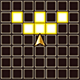
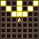

# Overview

# Jobs

<table class="jobLinksImage jobLinksTable">
  <tr>
    <th colspan="7">Job Links</th>
  </tr>
  <tr>
    <td> <a href="#freelancer">Freelancer</a></td>
    <td> <a href="#knight">Knight</a></td>
    <td> <a href="#dragoon">Dragoon</a></td>
    <td> <a href="#dark-knight">Dark Knight</a></td>
    <td> <a href="#ninja">Ninja</a></td>
    <td> <a href="#thief">Thief</a></td>
    <td> <a href="#scholar">Scholar</a></td>
  </tr>
  <tr>
    <td> <a href="#black-mage">Black Mage</a></td>
    <td> <a href="#white-mage">White Mage</a></td>
    <td> <a href="#dancer">Dancer</a></td>
    <td> <a href="#red-mage">Red Mage</a></td>
    <td> <a href="#beastmaster">Beastmaster</a></td>
    <td> <a href="#machinist">Machinist</a></td>
    <td> <a href="#alpha">Alpha</a></td>
  </tr>
</table>

 

 

  Freelancer

##### Freelancer Overview

<table class="dungeonOverview">
  <tr>
    <th>ID</th>
    <td colspan="10">0</td>
  </tr>
  <tr>
    <th>Unlock</th>
    <td colspan="10" class="highlightYellow">The player starts the game as this Job.</td>
  </tr>
  <tr>
    <th>Food Level</th>
    <td colspan="10">1% / 12 Turns. (Normal)</td>
  </tr>
  <tr>
    <th>JP Total</th>
    <td colspan="11">12,700 (Low)</td>
  </tr>
  <tr>
    <td colspan="11" class="tableDivider2"></td>
  </tr>
  <tr>
    <th rowspan="2">Stats (%)</th>
    <td class="hp">HP</td>
    <td>100%</td>
    <td class="atk">Attack</td>
    <td>100%</td>
    <td class="def">Defense</td>
    <td>100%</td>
    <td class="mag">Magic</td>
    <td>100%</td>
    <td class="mnd">Mind</td>
    <td>100%</td>
  </tr>
  <tr>
    <td class="hit">Hit</td>
    <td>100%</td>
    <td class="eva">Evade</td>
    <td>100%</td>
    <td class="crit">Crit</td>
    <td colspan="5">-</td>
  </tr>
  <tr>
    <td colspan="11" class="tableDivider2"></td>
  </tr>
  <tr>
    <th rowspan="2">Stats (Lv99)</th>
    <td class="hp">HP</td>
    <td>832</td>
    <td class="atk">Attack</td>
    <td>119</td>
    <td class="def">Defense</td>
    <td>119</td>
    <td class="mag">Magic</td>
    <td>119</td>
    <td class="mnd">Mind</td>
    <td>119</td>
  </tr>
  <tr>
    <td class="hit">Hit</td>
    <td>98.0</td>
    <td class="eva">Evade</td>
    <td>8.0</td>
    <td class="crit">Crit</td>
    <td colspan="5">10</td>
  </tr>
  <tr>
    <td colspan="11" class="tableDivider2"></td>
  </tr>
  <tr>
    <th rowspan="2">JP / Level</th>
    <td class="highlightGray">Lv1</td>
    <td>0</td>
    <td class="highlightGray">Lv2</td>
    <td>100</td>
    <td class="highlightGray">Lv3</td>
    <td>200</td>
    <td class="highlightGray">Lv4</td>
    <td colspan="3">400</td>
  </tr>
  <tr>
    <td class="highlightGray">Lv5</td>
    <td>800</td>
    <td class="highlightGray">Lv6</td>
    <td>1,600</td>
    <td class="highlightGray">Lv7</td>
    <td>3,200</td>
    <td class="highlightGray">Lv8</td>
    <td colspan="3">6,400</td>
  </tr>
</table>

##### Freelancer Abilities

<table class="jobTable">
  <tr>
    <th colspan="13" class="abilityName">Lv1 - Chocobo Kick (1.0 SP)</th>
  </tr>
  <tr>
    <th>Text 1</th>
    <td colspan="11" class="leftText">Attack a foe 1 tile ahead of you.</td>
  </tr>
  <tr>
    <th>Text 2</th>
    <td colspan="11" class="leftText abi_desc">Deliver a kick to a foe 1 tile ahead of you.</td>
  </tr>
  <tr>
    <th>Notes</th>
    <td colspan="11" class="leftText blueText"></td>
  </tr>
  <tr class="elementIcon">
    <th>Range</th>
    <td></td>
    <th>Element</th>
    <td>-</td>
    <th>Power</th>
    <td>0</td>
    <th>Value</th>
    <td>160</td>
    <th>Type</th>
    <td>Physical</td>
    <th>Drain</th>
    <td>No</td>
  </tr>
  <tr>
    <th colspan="13" class="abilityName">Lv2 - Chocobo Drop (1.0 SP)</th>
  </tr>
  <tr>
    <th>Text 1</th>
    <td colspan="11" class="leftText">Attack all foes within a 1-tile radius.</td>
  </tr>
  <tr>
    <th>Text 2</th>
    <td colspan="11" class="leftText abi_desc">Deliver a tail attack against all foes within a 1-tile radius.</td>
  </tr>
  <tr>
    <th>Notes</th>
    <td colspan="11" class="leftText blueText"></td>
  </tr>
  <tr class="elementIcon">
    <th>Range</th>
    <td></td>
    <th>Element</th>
    <td>-</td>
    <th>Power</th>
    <td>0</td>
    <th>Value</th>
    <td>140</td>
    <th>Type</th>
    <td>Physical</td>
    <th>Drain</th>
    <td>No</td>
  </tr>
  <tr>
    <th colspan="13" class="abilityName">Lv3 - Chocobo Kick+ (1.5 SP)</th>
  </tr>
  <tr>
    <th>Text 1</th>
    <td colspan="11" class="leftText">Attack a foe 1 tile ahead of you and knock them back.</td>
  </tr>
  <tr>
    <th>Text 2</th>
    <td colspan="11" class="leftText abi_desc">Deliver a powerful kick to knock back a foe 1 tile ahead of you.</td>
  </tr>
  <tr>
    <th>Notes</th>
    <td colspan="11" class="leftText blueText"></td>
  </tr>
  <tr class="elementIcon">
    <th>Range</th>
    <td></td>
    <th>Element</th>
    <td>-</td>
    <th>Power</th>
    <td>10</td>
    <th>Value</th>
    <td>160</td>
    <th>Type</th>
    <td>Physical</td>
    <th>Drain</th>
    <td>No</td>
  </tr>
  <tr>
    <th colspan="13" class="abilityName">Lv4 - Dig (2.0 SP)</th>
  </tr>
  <tr>
    <th>Text 1</th>
    <td colspan="11" class="leftText">Dig up an item once per dungeon floor.</td>
  </tr>
  <tr>
    <th>Text 2</th>
    <td colspan="11" class="leftText abi_desc">Dig into the ground and discover an item once per dungeon floor. Cannot be used with a full bag.</td>
  </tr>
  <tr>
    <th>Notes</th>
    <td colspan="11" class="leftText blueText"></td>
  </tr>
  <tr class="elementIcon">
    <th>Range</th>
    <td></td>
    <th>Element</th>
    <td>-</td>
    <th>Power</th>
    <td>0</td>
    <th>Value</th>
    <td>100</td>
    <th>Type</th>
    <td>Other</td>
    <th>Drain</th>
    <td>No</td>
  </tr>
  <tr>
    <th colspan="13" class="abilityName">Lv5 - Chocomet (3.0 SP)</th>
  </tr>
  <tr>
    <th>Text 1</th>
    <td colspan="11" class="leftText">Drop a meteor on an area 3 tiles ahead of you.</td>
  </tr>
  <tr>
    <th>Text 2</th>
    <td colspan="11" class="leftText abi_desc">Bring down a comet to smite foes in an area 3 tiles ahead of you.</td>
  </tr>
  <tr>
    <th>Notes</th>
    <td colspan="11" class="leftText blueText"></td>
  </tr>
  <tr class="elementIcon">
    <th>Range</th>
    <td></td>
    <th>Element</th>
    <td>-</td>
    <th>Power</th>
    <td>10</td>
    <th>Value</th>
    <td>190</td>
    <th>Type</th>
    <td>Physical</td>
    <th>Drain</th>
    <td>No</td>
  </tr>
  <tr>
    <th colspan="13" class="abilityName">Lv6 - Chocobo Dash (3.0 SP)</th>
  </tr>
  <tr>
    <th>Text 1</th>
    <td colspan="11" class="leftText">Cast Haste and temporarily increase speed.</td>
  </tr>
  <tr>
    <th>Text 2</th>
    <td colspan="11" class="leftText abi_desc">Cast Haste to temporarily increase Chocobo's speed.</td>
  </tr>
  <tr>
    <th>Notes</th>
    <td colspan="11" class="leftText blueText"></td>
  </tr>
  <tr class="elementIcon">
    <th>Range</th>
    <td></td>
    <th>Element</th>
    <td>-</td>
    <th>Power</th>
    <td>0</td>
    <th>Value</th>
    <td>100</td>
    <th>Type</th>
    <td>Other</td>
    <th>Drain</th>
    <td>No</td>
  </tr>
  <tr>
    <th colspan="13" class="abilityName">Lv7 - Chocobo Kick Zero (2.0 SP)</th>
  </tr>
  <tr>
    <th>Text 1</th>
    <td colspan="11" class="leftText">Stun a foe 1 tile ahead of you and knock them back.</td>
  </tr>
  <tr>
    <th>Text 2</th>
    <td colspan="11" class="leftText abi_desc">Deliver a kick that stuns a foe 1 tile ahead of you and knocks them back.</td>
  </tr>
  <tr>
    <th>Notes</th>
    <td colspan="11" class="leftText blueText"></td>
  </tr>
  <tr class="elementIcon">
    <th>Range</th>
    <td></td>
    <th>Element</th>
    <td>-</td>
    <th>Power</th>
    <td>0</td>
    <th>Value</th>
    <td>180</td>
    <th>Type</th>
    <td>Physical</td>
    <th>Drain</th>
    <td>No</td>
  </tr>
  <tr>
    <th colspan="13" class="abilityName">Lv8 - Chocobash (4.5 SP)</th>
  </tr>
  <tr>
    <th>Text 1</th>
    <td colspan="11" class="leftText">Attack all enemies within a 3-tile radius.</td>
  </tr>
  <tr>
    <th>Text 2</th>
    <td colspan="11" class="leftText abi_desc">Deliver an attack that scales with your level to all foes within a 3-tile radius.</td>
  </tr>
  <tr>
    <th>Notes</th>
    <td colspan="11" class="leftText blueText"></td>
  </tr>
  <tr class="elementIcon">
    <th>Range</th>
    <td></td>
    <th>Element</th>
    <td>-</td>
    <th>Power</th>
    <td>30</td>
    <th>Value</th>
    <td>200</td>
    <th>Type</th>
    <td>Physical</td>
    <th>Drain</th>
    <td>No</td>
  </tr>
  <tr>
    <th colspan="13" class="abilityName">Lv8 - ??? (3.5 SP)</th>
  </tr>
  <tr>
    <th>Text 1</th>
    <td colspan="11" class="leftText">Attack a foe up to 3 tiles ahead of you (damage based on lost HP).</td>
  </tr>
  <tr>
    <th>Text 2</th>
    <td colspan="11" class="leftText abi_desc">Deliver a desperate attack on a foe up to 3 tiles ahead of you. Deals damage based on HP lost.</td>
  </tr>
  <tr>
    <th>Notes</th>
    <td colspan="11" class="leftText blueText"></td>
  </tr>
  <tr class="elementIcon">
    <th>Range</th>
    <td></td>
    <th>Element</th>
    <td>-</td>
    <th>Power</th>
    <td>0</td>
    <th>Value</th>
    <td>100</td>
    <th>Type</th>
    <td>Physical</td>
    <th>Drain</th>
    <td>No</td>
  </tr>
</table>

 

  Knight

##### Knight Overview

<table class="dungeonOverview">
  <tr>
    <th>ID</th>
    <td colspan="8">1</td>
  </tr>
  <tr>
    <th>Unlock</th>
    <td colspan="8" class="highlightYellow">Clear Mayor Gale's Memories.</td>
  </tr>
  <tr>
    <th>Food Level</th>
    <td colspan="8">1% / 10 Turns. (Fast)</td>
  </tr>
  <tr>
    <td colspan="9" class="tableDivider2"></td>
  </tr>
  <tr>
    <th rowspan="2">Stats (%)</th>
    <td class="hp">HP</td>
    <td>108%</td>
    <td class="atk">Attack</td>
    <td>102%</td>
    <td class="def">Defense</td>
    <td>106%</td>
    <td class="mag">Magic</td>
    <td>90%</td>
  </tr>
  <tr>
    <td class="mnd">Mind</td>
    <td>92%</td>
    <td class="hit">Hit</td>
    <td>101%</td>
    <td class="eva">Evade</td>
    <td>80%</td>
    <td class="crit">Crit</td>
    <td>-</td>
  </tr>
  <tr>
    <td colspan="9" class="tableDivider2"></td>
  </tr>
  <tr>
    <th rowspan="2">Stats (Lv99)</th>
    <td class="hp">HP</td>
    <td>898</td>
    <td class="atk">Attack</td>
    <td>121</td>
    <td class="def">Defense</td>
    <td>126</td>
    <td class="mag">Magic</td>
    <td>107</td>
  </tr>
  <tr>
    <td class="mnd">Mind</td>
    <td>109</td>
    <td class="hit">Hit</td>
    <td>98.98</td>
    <td class="eva">Evade</td>
    <td>6.4</td>
    <td class="crit">Crit</td>
    <td>10</td>
  </tr>
  <tr>
    <td colspan="9" class="tableDivider2"></td>
  </tr>
  <tr>
    <th>JP Total</th>
    <td colspan="9">15,240 (Normal)</td>
  </tr>
  <tr>
    <th rowspan="2">JP / Level</th>
    <td class="highlightGray">Lv1</td>
    <td>0</td>
    <td class="highlightGray">Lv2</td>
    <td>120</td>
    <td class="highlightGray">Lv3</td>
    <td>240</td>
    <td class="highlightGray">Lv4</td>
    <td>480</td>
  </tr>
  <tr>
    <td class="highlightGray">Lv5</td>
    <td>960</td>
    <td class="highlightGray">Lv6</td>
    <td>1,920</td>
    <td class="highlightGray">Lv7</td>
    <td>3,840</td>
    <td class="highlightGray">Lv8</td>
    <td>7,680</td>
  </tr>
</table>

##### Knight Abilities

<table class="jobTable">
  <tr>
    <th colspan="13" class="abilityName">Lv1 - Power Smack (1.0 SP)</th>
  </tr>
  <tr>
    <th>Text 1</th>
    <td colspan="11" class="leftText">Attack a foe 1 tile ahead of you and knock them back.</td>
  </tr>
  <tr>
    <th>Text 2</th>
    <td colspan="11" class="leftText abi_desc">Use a legendary Knight's technique to attack a foe 1 tile ahead of you and knock them back.</td>
  </tr>
  <tr>
    <th>Notes</th>
    <td colspan="11" class="leftText blueText"></td>
  </tr>
  <tr class="elementIcon">
    <th>Range</th>
    <td></td>
    <th>Element</th>
    <td>-</td>
    <th>Power</th>
    <td>0</td>
    <th>Value</th>
    <td>160</td>
    <th>Type</th>
    <td>Physical</td>
    <th>Drain</th>
    <td>No</td>
  </tr>
  <tr>
    <th colspan="13" class="abilityName">Lv2 - Circle Slash (1.0 SP)</th>
  </tr>
  <tr>
    <th>Text 1</th>
    <td colspan="11" class="leftText">Attack all foes within a 1-tile radius.</td>
  </tr>
  <tr>
    <th>Text 2</th>
    <td colspan="11" class="leftText abi_desc">Unleash a wrathful Knight's technique to attack all foes within a 1-tile radius.</td>
  </tr>
  <tr>
    <th>Notes</th>
    <td colspan="11" class="leftText blueText"></td>
  </tr>
  <tr class="elementIcon">
    <th>Range</th>
    <td></td>
    <th>Element</th>
    <td>-</td>
    <th>Power</th>
    <td>0</td>
    <th>Value</th>
    <td>140</td>
    <th>Type</th>
    <td>Physical</td>
    <th>Drain</th>
    <td>No</td>
  </tr>
  <tr>
    <th colspan="13" class="abilityName">Lv3 - Slow Burner (2.0 SP)</th>
  </tr>
  <tr>
    <th>Text 1</th>
    <td colspan="11" class="leftText">Slow down a foe 1 tile ahead of you and knock them back.</td>
  </tr>
  <tr>
    <th>Text 2</th>
    <td colspan="11" class="leftText abi_desc">Use a powerful Knight's technique to slow down a foe 1 tile ahead of you and knock them back.</td>
  </tr>
  <tr>
    <th>Notes</th>
    <td colspan="11" class="leftText blueText"></td>
  </tr>
  <tr class="elementIcon">
    <th>Range</th>
    <td></td>
    <th>Element</th>
    <td>-</td>
    <th>Power</th>
    <td>10</td>
    <th>Value</th>
    <td>140</td>
    <th>Type</th>
    <td>Physical</td>
    <th>Drain</th>
    <td>No</td>
  </tr>
  <tr>
    <th colspan="13" class="abilityName">Lv4 - Aegis Shield (1.5 SP)</th>
  </tr>
  <tr>
    <th>Text 1</th>
    <td colspan="11" class="leftText">Cast Protect and temporarily reduce physical damage.</td>
  </tr>
  <tr>
    <th>Text 2</th>
    <td colspan="11" class="leftText abi_desc">Use a stalwart Knight's technique to cast Protect and temporarily reduce physical damage.</td>
  </tr>
  <tr>
    <th>Notes</th>
    <td colspan="11" class="leftText blueText"></td>
  </tr>
  <tr class="elementIcon">
    <th>Range</th>
    <td></td>
    <th>Element</th>
    <td>-</td>
    <th>Power</th>
    <td>0</td>
    <th>Value</th>
    <td>100</td>
    <th>Type</th>
    <td>Other</td>
    <th>Drain</th>
    <td>No</td>
  </tr>
  <tr>
    <th colspan="13" class="abilityName">Lv5 - Excalibur (2.0 SP)</th>
  </tr>
  <tr>
    <th>Text 1</th>
    <td colspan="11" class="leftText">Attack all foes in the row of 3 tiles ahead of you.</td>
  </tr>
  <tr>
    <th>Text 2</th>
    <td colspan="11" class="leftText abi_desc">Use a deadly Knight's technique to attack all foes in the row of 3 tiles ahead of you.</td>
  </tr>
  <tr>
    <th>Notes</th>
    <td colspan="11" class="leftText blueText"></td>
  </tr>
  <tr class="elementIcon">
    <th>Range</th>
    <td></td>
    <th>Element</th>
    <td></td>
    <th>Power</th>
    <td>10</td>
    <th>Value</th>
    <td>180</td>
    <th>Type</th>
    <td>Physical</td>
    <th>Drain</th>
    <td>No</td>
  </tr>
  <tr>
    <th colspan="13" class="abilityName">Lv6 - Climhazzard (2.5 SP)</th>
  </tr>
  <tr>
    <th>Text 1</th>
    <td colspan="11" class="leftText">Attack all foes in a 1-tile cross and knock them back.</td>
  </tr>
  <tr>
    <th>Text 2</th>
    <td colspan="11" class="leftText abi_desc">Use a righteous Knight's technique to attack all foes in a 1-tile cross and knock them back.</td>
  </tr>
  <tr>
    <th>Notes</th>
    <td colspan="11" class="leftText blueText"></td>
  </tr>
  <tr class="elementIcon">
    <th>Range</th>
    <td></td>
    <th>Element</th>
    <td>-</td>
    <th>Power</th>
    <td>10</td>
    <th>Value</th>
    <td>180</td>
    <th>Type</th>
    <td>Physical</td>
    <th>Drain</th>
    <td>No</td>
  </tr>
  <tr>
    <th colspan="13" class="abilityName">Lv7 - Ragnarok (3.0 SP)</th>
  </tr>
  <tr>
    <th>Text 1</th>
    <td colspan="11" class="leftText">Deal huge damage to all foes within a 1-tile radius.</td>
  </tr>
  <tr>
    <th>Text 2</th>
    <td colspan="11" class="leftText abi_desc">Use the supreme Knight's technique to deal huge damage to all foes within a 1-tile radius.</td>
  </tr>
  <tr>
    <th>Notes</th>
    <td colspan="11" class="leftText blueText"></td>
  </tr>
  <tr class="elementIcon">
    <th>Range</th>
    <td></td>
    <th>Element</th>
    <td>-</td>
    <th>Power</th>
    <td>10</td>
    <th>Value</th>
    <td>240</td>
    <th>Type</th>
    <td>Physical</td>
    <th>Drain</th>
    <td>No</td>
  </tr>
  <tr>
    <th colspan="13" class="abilityName">Lv8 - Camelot (4.0 SP)</th>
  </tr>
  <tr>
    <th>Text 1</th>
    <td colspan="11" class="leftText">Slow down all foes within a 1-tile radius and knock them back.</td>
  </tr>
  <tr>
    <th>Text 2</th>
    <td colspan="11" class="leftText abi_desc">Summon the spirits of legendary knights to slow down all foes within a 1-tile radius and knock them back.</td>
  </tr>
  <tr>
    <th>Notes</th>
    <td colspan="11" class="leftText blueText"></td>
  </tr>
  <tr class="elementIcon">
    <th>Range</th>
    <td></td>
    <th>Element</th>
    <td>-</td>
    <th>Power</th>
    <td>10</td>
    <th>Value</th>
    <td>200</td>
    <th>Type</th>
    <td>Physical</td>
    <th>Drain</th>
    <td>No</td>
  </tr>
</table>

 

  Dragoon

##### Dragoon Overview

<table class="dungeonOverview">
  <tr>
    <th>ID</th>
    <td colspan="8">2</td>
  </tr>
  <tr>
    <th>Unlock</th>
    <td colspan="8" class="highlightYellow">Clear Meja's Memories.</td>
  </tr>
  <tr>
    <th>Food Level</th>
    <td colspan="8">1% / 10 Turns. (Fast)</td>
  </tr>
  <tr>
    <td colspan="9" class="tableDivider2"></td>
  </tr>
  <tr>
    <th rowspan="2">Stats (%)</th>
    <td class="hp">HP</td>
    <td>104%</td>
    <td class="atk">Attack</td>
    <td>104%</td>
    <td class="def">Defense</td>
    <td>104%</td>
    <td class="mag">Magic</td>
    <td>92%</td>
  </tr>
  <tr>
    <td class="mnd">Mind</td>
    <td>96%</td>
    <td class="hit">Hit</td>
    <td>102%</td>
    <td class="eva">Evade</td>
    <td>80%</td>
    <td class="crit">Crit</td>
    <td>-</td>
  </tr>
  <tr>
    <td colspan="9" class="tableDivider2"></td>
  </tr>
  <tr>
    <th rowspan="2">Stats (Lv99)</th>
    <td class="hp">HP</td>
    <td>865</td>
    <td class="atk">Attack</td>
    <td>123</td>
    <td class="def">Defense</td>
    <td>123</td>
    <td class="mag">Magic</td>
    <td>109</td>
  </tr>
  <tr>
    <td class="mnd">Mind</td>
    <td>114</td>
    <td class="hit">Hit</td>
    <td>99.96</td>
    <td class="eva">Evade</td>
    <td>6.4</td>
    <td class="crit">Crit</td>
    <td>10</td>
  </tr>
  <tr>
    <td colspan="9" class="tableDivider2"></td>
  </tr>
  <tr>
    <th>JP Total</th>
    <td colspan="9">17,780 (High)</td>
  </tr>
  <tr>
    <th rowspan="2">JP / Level</th>
    <td class="highlightGray">Lv1</td>
    <td>0</td>
    <td class="highlightGray">Lv2</td>
    <td>140</td>
    <td class="highlightGray">Lv3</td>
    <td>280</td>
    <td class="highlightGray">Lv4</td>
    <td>560</td>
  </tr>
  <tr>
    <td class="highlightGray">Lv5</td>
    <td>1,120</td>
    <td class="highlightGray">Lv6</td>
    <td>2,240</td>
    <td class="highlightGray">Lv7</td>
    <td>4,480</td>
    <td class="highlightGray">Lv8</td>
    <td>8,960</td>
  </tr>
</table>

##### Dragoon Abilities

<table class="jobTable">
  <tr>
    <th colspan="13" class="abilityName">Lv1 - Jump (1.0 SP)</th>
  </tr>
  <tr>
    <th>Text 1</th>
    <td colspan="11" class="leftText">Attack a foe up to 2 tiles ahead of you.</td>
  </tr>
  <tr>
    <th>Text 2</th>
    <td colspan="11" class="leftText abi_desc">Leap into the air like a Dragoon and attack a foe up to 2 tiles ahead of you. Can be used to move even when no enemy is in range.</td>
  </tr>
  <tr>
    <th>Notes</th>
    <td colspan="11" class="leftText blueText"></td>
  </tr>
  <tr class="elementIcon">
    <th>Range</th>
    <td></td>
    <th>Element</th>
    <td>-</td>
    <th>Power</th>
    <td>0</td>
    <th>Value</th>
    <td>160</td>
    <th>Type</th>
    <td>Physical</td>
    <th>Drain</th>
    <td>No</td>
  </tr>
  <tr>
    <th colspan="13" class="abilityName">Lv2 - Flame Lance (1.5 SP)</th>
  </tr>
  <tr>
    <th>Text 1</th>
    <td colspan="11" class="leftText">Deal piercing Fire damage to all foes up to 2 tiles ahead of you.</td>
  </tr>
  <tr>
    <th>Text 2</th>
    <td colspan="11" class="leftText abi_desc">Thrust forward with a lance burning with draconic fury to deal piercing Fire damage to all foes up to 2 tiles ahead of you.</td>
  </tr>
  <tr>
    <th>Notes</th>
    <td colspan="11" class="leftText blueText"></td>
  </tr>
  <tr class="elementIcon">
    <th>Range</th>
    <td></td>
    <th>Element</th>
    <td></td>
    <th>Power</th>
    <td>10</td>
    <th>Value</th>
    <td>180</td>
    <th>Type</th>
    <td>Physical</td>
    <th>Drain</th>
    <td>No</td>
  </tr>
  <tr>
    <th colspan="13" class="abilityName">Lv3 - Ice Lance (1.5 SP)</th>
  </tr>
  <tr>
    <th>Text 1</th>
    <td colspan="11" class="leftText">Deal piercing Ice damage to all foes up to 2 tiles ahead of you.</td>
  </tr>
  <tr>
    <th>Text 2</th>
    <td colspan="11" class="leftText abi_desc">Thrust forward with a lance chilled with draconic rage to deal piercing Ice damage to all foes up to 2 tiles ahead of you.</td>
  </tr>
  <tr>
    <th>Notes</th>
    <td colspan="11" class="leftText blueText"></td>
  </tr>
  <tr class="elementIcon">
    <th>Range</th>
    <td></td>
    <th>Element</th>
    <td></td>
    <th>Power</th>
    <td>10</td>
    <th>Value</th>
    <td>180</td>
    <th>Type</th>
    <td>Physical</td>
    <th>Drain</th>
    <td>No</td>
  </tr>
  <tr>
    <th colspan="13" class="abilityName">Lv4 - Lancet (2.0 SP)</th>
  </tr>
  <tr>
    <th>Text 1</th>
    <td colspan="11" class="leftText">Drain HP from a foe 1 tile ahead of you.</td>
  </tr>
  <tr>
    <th>Text 2</th>
    <td colspan="11" class="leftText abi_desc">Lash out at a foe 1 tile ahead of you to drain their HP.</td>
  </tr>
  <tr>
    <th>Notes</th>
    <td colspan="11" class="leftText blueText"></td>
  </tr>
  <tr class="elementIcon">
    <th>Range</th>
    <td></td>
    <th>Element</th>
    <td>-</td>
    <th>Power</th>
    <td>0</td>
    <th>Value</th>
    <td>80</td>
    <th>Type</th>
    <td>Physical</td>
    <th>Drain</th>
    <td>Yes</td>
  </tr>
  <tr>
    <th colspan="13" class="abilityName">Lv5 - High Jump (2.0 SP)</th>
  </tr>
  <tr>
    <th>Text 1</th>
    <td colspan="11" class="leftText">Attack a foe up to 3 tiles ahead of you.</td>
  </tr>
  <tr>
    <th>Text 2</th>
    <td colspan="11" class="leftText abi_desc">Leap into the air like a Dragoon and attack a foe up to 3 tiles ahead of you. Can be used to move even when no enemy is in range.</td>
  </tr>
  <tr>
    <th>Notes</th>
    <td colspan="11" class="leftText blueText"></td>
  </tr>
  <tr class="elementIcon">
    <th>Range</th>
    <td></td>
    <th>Element</th>
    <td>-</td>
    <th>Power</th>
    <td>10</td>
    <th>Value</th>
    <td>200</td>
    <th>Type</th>
    <td>Physical</td>
    <th>Drain</th>
    <td>No</td>
  </tr>
  <tr>
    <th colspan="13" class="abilityName">Lv6 - Dragon Power (1.5 SP)</th>
  </tr>
  <tr>
    <th>Text 1</th>
    <td colspan="11" class="leftText">Cast Bravery and temporarily increase attack.</td>
  </tr>
  <tr>
    <th>Text 2</th>
    <td colspan="11" class="leftText abi_desc">Summon the power of dragons to cast Bravery and temporarily increase attack.</td>
  </tr>
  <tr>
    <th>Notes</th>
    <td colspan="11" class="leftText blueText"></td>
  </tr>
  <tr class="elementIcon">
    <th>Range</th>
    <td></td>
    <th>Element</th>
    <td>-</td>
    <th>Power</th>
    <td>0</td>
    <th>Value</th>
    <td>100</td>
    <th>Type</th>
    <td>Other</td>
    <th>Drain</th>
    <td>No</td>
  </tr>
  <tr>
    <th colspan="13" class="abilityName">Lv7 - Holy Lance (3.0 SP)</th>
  </tr>
  <tr>
    <th>Text 1</th>
    <td colspan="11" class="leftText">Pierce all foes in 3 directions ahead of you, up to 2 tiles away.</td>
  </tr>
  <tr>
    <th>Text 2</th>
    <td colspan="11" class="leftText abi_desc">Thrust forward with a forking lance gleaming with draconic fury to pierce all foes in 3 directions ahead of you, up to 2 tiles away.</td>
  </tr>
  <tr>
    <th>Notes</th>
    <td colspan="11" class="leftText blueText"></td>
  </tr>
  <tr class="elementIcon">
    <th>Range</th>
    <td></td>
    <th>Element</th>
    <td></td>
    <th>Power</th>
    <td>10</td>
    <th>Value</th>
    <td>200</td>
    <th>Type</th>
    <td>Physical</td>
    <th>Drain</th>
    <td>No</td>
  </tr>
  <tr>
    <th colspan="13" class="abilityName">Lv8 - Gungnir (3.0 SP)</th>
  </tr>
  <tr>
    <th>Text 1</th>
    <td colspan="11" class="leftText">Deal huge piercing damage to all foes up to 6 tiles ahead of you.</td>
  </tr>
  <tr>
    <th>Text 2</th>
    <td colspan="11" class="leftText abi_desc">Use the power of the legendary Odin's spear to deal huge piercing damage to all foes up to 6 tiles ahead of you.</td>
  </tr>
  <tr>
    <th>Notes</th>
    <td colspan="11" class="leftText blueText"></td>
  </tr>
  <tr class="elementIcon">
    <th>Range</th>
    <td></td>
    <th>Element</th>
    <td>-</td>
    <th>Power</th>
    <td>10</td>
    <th>Value</th>
    <td>240</td>
    <th>Type</th>
    <td>Physical</td>
    <th>Drain</th>
    <td>No</td>
  </tr>
</table>

 

  Dark Knight

##### Dark Knight Overview

<table class="dungeonOverview">
  <tr>
    <th>ID</th>
    <td colspan="8">3</td>
  </tr>
  <tr>
    <th>Unlock</th>
    <td colspan="8" class="highlightYellow">Guardian of the Light (30F)</td>
  </tr>
  <tr>
    <th>Food Level</th>
    <td colspan="8">1% / 10 Turns. (Fast)</td>
  </tr>
  <tr>
    <td colspan="9" class="tableDivider2"></td>
  </tr>
  <tr>
    <th rowspan="2">Stats (%)</th>
    <td class="hp">HP</td>
    <td>94%</td>
    <td class="atk">Attack</td>
    <td>106%</td>
    <td class="def">Defense</td>
    <td>96%</td>
    <td class="mag">Magic</td>
    <td>102%</td>
  </tr>
  <tr>
    <td class="mnd">Mind</td>
    <td>92%</td>
    <td class="hit">Hit</td>
    <td>99%</td>
    <td class="eva">Evade</td>
    <td>80%</td>
    <td class="crit">Crit</td>
    <td>-</td>
  </tr>
  <tr>
    <td colspan="9" class="tableDivider2"></td>
  </tr>
  <tr>
    <th rowspan="2">Stats (Lv99)</th>
    <td class="hp">HP</td>
    <td>782</td>
    <td class="atk">Attack</td>
    <td>126</td>
    <td class="def">Defense</td>
    <td>114</td>
    <td class="mag">Magic</td>
    <td>121</td>
  </tr>
  <tr>
    <td class="mnd">Mind</td>
    <td>109</td>
    <td class="hit">Hit</td>
    <td>97.02</td>
    <td class="eva">Evade</td>
    <td>6.4</td>
    <td class="crit">Crit</td>
    <td>10</td>
  </tr>
  <tr>
    <td colspan="9" class="tableDivider2"></td>
  </tr>
  <tr>
    <th>JP Total</th>
    <td colspan="9">19,050 (Very High)</td>
  </tr>
  <tr>
    <th rowspan="2">JP / Level</th>
    <td class="highlightGray">Lv1</td>
    <td>0</td>
    <td class="highlightGray">Lv2</td>
    <td>150</td>
    <td class="highlightGray">Lv3</td>
    <td>300</td>
    <td class="highlightGray">Lv4</td>
    <td>600</td>
  </tr>
  <tr>
    <td class="highlightGray">Lv5</td>
    <td>1,200</td>
    <td class="highlightGray">Lv6</td>
    <td>2,400</td>
    <td class="highlightGray">Lv7</td>
    <td>4,800</td>
    <td class="highlightGray">Lv8</td>
    <td>9,600</td>
  </tr>
</table>

##### Dark Knight Abilities

<table class="jobTable">
  <tr>
    <th colspan="13" class="abilityName">Lv1 - Shadow (0.0 SP)</th>
  </tr>
  <tr>
    <th>Text 1</th>
    <td colspan="11" class="leftText">Sacrifice HP to deal Dark damage to a foe 1 tile ahead of you.</td>
  </tr>
  <tr>
    <th>Text 2</th>
    <td colspan="11" class="leftText abi_desc">Call upon the powers of darkness to sacrifice HP and deal Dark damage to a foe 1 tile ahead of you.</td>
  </tr>
  <tr>
    <th>Notes</th>
    <td colspan="11" class="leftText blueText"></td>
  </tr>
  <tr class="elementIcon">
    <th>Range</th>
    <td></td>
    <th>Element</th>
    <td></td>
    <th>Power</th>
    <td>10</td>
    <th>Value</th>
    <td>160</td>
    <th>Type</th>
    <td>Physical</td>
    <th>Drain</th>
    <td>No</td>
  </tr>
  <tr>
    <th colspan="13" class="abilityName">Lv2 - Dark (1.5 SP)</th>
  </tr>
  <tr>
    <th>Text 1</th>
    <td colspan="11" class="leftText">Deal Dark damage to a foe up to 3 tiles ahead of you.</td>
  </tr>
  <tr>
    <th>Text 2</th>
    <td colspan="11" class="leftText abi_desc">Use the power of wicked magic to deal Dark damage to a foe up to 3 tiles ahead of you.</td>
  </tr>
  <tr>
    <th>Notes</th>
    <td colspan="11" class="leftText blueText"></td>
  </tr>
  <tr class="elementIcon">
    <th>Range</th>
    <td></td>
    <th>Element</th>
    <td></td>
    <th>Power</th>
    <td>10</td>
    <th>Value</th>
    <td>110</td>
    <th>Type</th>
    <td>Magical</td>
    <th>Drain</th>
    <td>No</td>
  </tr>
  <tr>
    <th colspan="13" class="abilityName">Lv3 - Covenant (1.0 SP)</th>
  </tr>
  <tr>
    <th>Text 1</th>
    <td colspan="11" class="leftText">Sacrifice defense to increase attack.</td>
  </tr>
  <tr>
    <th>Text 2</th>
    <td colspan="11" class="leftText abi_desc">Enter a dark covenant with the underworld to sacrifice defense and increase attack.</td>
  </tr>
  <tr>
    <th>Notes</th>
    <td colspan="11" class="leftText blueText"></td>
  </tr>
  <tr class="elementIcon">
    <th>Range</th>
    <td></td>
    <th>Element</th>
    <td>-</td>
    <th>Power</th>
    <td>0</td>
    <th>Value</th>
    <td>100</td>
    <th>Type</th>
    <td>Other</td>
    <th>Drain</th>
    <td>No</td>
  </tr>
  <tr>
    <th colspan="13" class="abilityName">Lv4 - Blood Sword (2.0 SP)</th>
  </tr>
  <tr>
    <th>Text 1</th>
    <td colspan="11" class="leftText">Drain HP from a foe 1 tile ahead of you.</td>
  </tr>
  <tr>
    <th>Text 2</th>
    <td colspan="11" class="leftText abi_desc">Unleash the powers of darkness within your blade to drain HP from a foe 1 tile ahead of you.</td>
  </tr>
  <tr>
    <th>Notes</th>
    <td colspan="11" class="leftText blueText"></td>
  </tr>
  <tr class="elementIcon">
    <th>Range</th>
    <td></td>
    <th>Element</th>
    <td></td>
    <th>Power</th>
    <td>10</td>
    <th>Value</th>
    <td>90</td>
    <th>Type</th>
    <td>Physical</td>
    <th>Drain</th>
    <td>Yes</td>
  </tr>
  <tr>
    <th colspan="13" class="abilityName">Lv5 - Dark Breaker (2.0 SP)</th>
  </tr>
  <tr>
    <th>Text 1</th>
    <td colspan="11" class="leftText">Attack all foes in the row of 3 tiles ahead of you and knock them back.</td>
  </tr>
  <tr>
    <th>Text 2</th>
    <td colspan="11" class="leftText abi_desc">Unleash the powers of darkness to attack all foes in the row ahead of you and knock them back.</td>
  </tr>
  <tr>
    <th>Notes</th>
    <td colspan="11" class="leftText blueText"></td>
  </tr>
  <tr class="elementIcon">
    <th>Range</th>
    <td></td>
    <th>Element</th>
    <td></td>
    <th>Power</th>
    <td>10</td>
    <th>Value</th>
    <td>160</td>
    <th>Type</th>
    <td>Physical</td>
    <th>Drain</th>
    <td>No</td>
  </tr>
  <tr>
    <th colspan="13" class="abilityName">Lv6 - Nightmare (2.5 SP)</th>
  </tr>
  <tr>
    <th>Text 1</th>
    <td colspan="11" class="leftText">Put all foes within a 1-tile radius to sleep.</td>
  </tr>
  <tr>
    <th>Text 2</th>
    <td colspan="11" class="leftText abi_desc">Use the powers of darkness to conjure nightmares that put all foes within a 1-tile radius to sleep.</td>
  </tr>
  <tr>
    <th>Notes</th>
    <td colspan="11" class="leftText blueText"></td>
  </tr>
  <tr class="elementIcon">
    <th>Range</th>
    <td></td>
    <th>Element</th>
    <td>-</td>
    <th>Power</th>
    <td>0</td>
    <th>Value</th>
    <td>100</td>
    <th>Type</th>
    <td>Other</td>
    <th>Drain</th>
    <td>No</td>
  </tr>
  <tr>
    <th colspan="13" class="abilityName">Lv7 - Dark Blade (4.0 SP)</th>
  </tr>
  <tr>
    <th>Text 1</th>
    <td colspan="11" class="leftText">Sacrifice HP to deal Dark damage to a foe 1 tile ahead of you and knock them back.</td>
  </tr>
  <tr>
    <th>Text 2</th>
    <td colspan="11" class="leftText abi_desc">Use the legendary power of the Dark Knight's blade to sacrifice HP, deal Dark damage to a foe 1 tile ahead of you, and knock them back.</td>
  </tr>
  <tr>
    <th>Notes</th>
    <td colspan="11" class="leftText blueText"></td>
  </tr>
  <tr class="elementIcon">
    <th>Range</th>
    <td></td>
    <th>Element</th>
    <td></td>
    <th>Power</th>
    <td>10</td>
    <th>Value</th>
    <td>260</td>
    <th>Type</th>
    <td>Physical</td>
    <th>Drain</th>
    <td>No</td>
  </tr>
  <tr>
    <th colspan="13" class="abilityName">Lv8 - Chaos (5.0 SP)</th>
  </tr>
  <tr>
    <th>Text 1</th>
    <td colspan="11" class="leftText">Drain HP from all foes within a 3-tile radius.</td>
  </tr>
  <tr>
    <th>Text 2</th>
    <td colspan="11" class="leftText abi_desc">Channel the power of darkness into pure chaos to drain HP from all foes within a 3-tile radius.</td>
  </tr>
  <tr>
    <th>Notes</th>
    <td colspan="11" class="leftText blueText"></td>
  </tr>
  <tr class="elementIcon">
    <th>Range</th>
    <td></td>
    <th>Element</th>
    <td></td>
    <th>Power</th>
    <td>20</td>
    <th>Value</th>
    <td>140</td>
    <th>Type</th>
    <td>Magical</td>
    <th>Drain</th>
    <td>No*1</td>
  </tr>
</table>

*1 - The player ability data file has this value set to False.

 

  Ninja

##### Ninja Overview

<table class="dungeonOverview">
  <tr>
    <th>ID</th>
    <td colspan="8">4</td>
  </tr>
  <tr>
    <th>Unlock</th>
    <td colspan="8" class="highlightYellow">Clear Volg's Memories.</td>
  </tr>
  <tr>
    <th>Food Level</th>
    <td colspan="8">1% / 10 Turns. (Fast)</td>
  </tr>
  <tr>
    <td colspan="9" class="tableDivider2"></td>
  </tr>
  <tr>
    <th rowspan="2">Stats (%)</th>
    <td class="hp">HP</td>
    <td>102%</td>
    <td class="atk">Attack</td>
    <td>102%</td>
    <td class="def">Defense</td>
    <td>102%</td>
    <td class="mag">Magic</td>
    <td>94%</td>
  </tr>
  <tr>
    <td class="mnd">Mind</td>
    <td>102%</td>
    <td class="hit">Hit</td>
    <td>102%</td>
    <td class="eva">Evade</td>
    <td>110%</td>
    <td class="crit">Crit</td>
    <td>-</td>
  </tr>
  <tr>
    <td colspan="9" class="tableDivider2"></td>
  </tr>
  <tr>
    <th rowspan="2">Stats (Lv99)</th>
    <td class="hp">HP</td>
    <td>848</td>
    <td class="atk">Attack</td>
    <td>121</td>
    <td class="def">Defense</td>
    <td>121</td>
    <td class="mag">Magic</td>
    <td>111</td>
  </tr>
  <tr>
    <td class="mnd">Mind</td>
    <td>121</td>
    <td class="hit">Hit</td>
    <td>99.96</td>
    <td class="eva">Evade</td>
    <td>8.8</td>
    <td class="crit">Crit</td>
    <td>10</td>
  </tr>
  <tr>
    <td colspan="9" class="tableDivider2"></td>
  </tr>
  <tr>
    <th>JP Total</th>
    <td colspan="9">19,050 (Very High)</td>
  </tr>
  <tr>
    <th rowspan="2">JP / Level</th>
    <td class="highlightGray">Lv1</td>
    <td>0</td>
    <td class="highlightGray">Lv2</td>
    <td>150</td>
    <td class="highlightGray">Lv3</td>
    <td>300</td>
    <td class="highlightGray">Lv4</td>
    <td>600</td>
  </tr>
  <tr>
    <td class="highlightGray">Lv5</td>
    <td>1,200</td>
    <td class="highlightGray">Lv6</td>
    <td>2,400</td>
    <td class="highlightGray">Lv7</td>
    <td>4,800</td>
    <td class="highlightGray">Lv8</td>
    <td>9,600</td>
  </tr>
</table>

##### Ninja Abilities

<table class="jobTable">
  <tr>
    <th colspan="13" class="abilityName">Lv1 - Shuriken (1.0 SP)</th>
  </tr>
  <tr>
    <th>Text 1</th>
    <td colspan="11" class="leftText">Attack a foe up to 3 tiles ahead of you.</td>
  </tr>
  <tr>
    <th>Text 2</th>
    <td colspan="11" class="leftText abi_desc">Hurl a deadly shuriken at a foe up to 3 tiles ahead of you.</td>
  </tr>
  <tr>
    <th>Notes</th>
    <td colspan="11" class="leftText blueText"></td>
  </tr>
  <tr class="elementIcon">
    <th>Range</th>
    <td></td>
    <th>Element</th>
    <td>-</td>
    <th>Power</th>
    <td>10</td>
    <th>Value</th>
    <td>100</td>
    <th>Type</th>
    <td>Physical</td>
    <th>Drain</th>
    <td>No</td>
  </tr>
  <tr>
    <th colspan="13" class="abilityName">Lv2 - Dual Wield (1.5 SP)</th>
  </tr>
  <tr>
    <th>Text 1</th>
    <td colspan="11" class="leftText">Cast Haste and temporarily increase speed.</td>
  </tr>
  <tr>
    <th>Text 2</th>
    <td colspan="11" class="leftText abi_desc">Shuffle your talons swiftly to cast Haste and temporarily increase speed.</td>
  </tr>
  <tr>
    <th>Notes</th>
    <td colspan="11" class="leftText blueText"></td>
  </tr>
  <tr class="elementIcon">
    <th>Range</th>
    <td></td>
    <th>Element</th>
    <td>-</td>
    <th>Power</th>
    <td>0</td>
    <th>Value</th>
    <td>0</td>
    <th>Type</th>
    <td>Other</td>
    <th>Drain</th>
    <td>No</td>
  </tr>
  <tr>
    <th colspan="13" class="abilityName">Lv3 - Art of Flames (2.0 SP)</th>
  </tr>
  <tr>
    <th>Text 1</th>
    <td colspan="11" class="leftText">Deal Fire damage to all foes in the row ahead of you.</td>
  </tr>
  <tr>
    <th>Text 2</th>
    <td colspan="11" class="leftText abi_desc">Use a fiery Ninja technique to deal Fire damage to all foes in the row ahead of you.</td>
  </tr>
  <tr>
    <th>Notes</th>
    <td colspan="11" class="leftText blueText"></td>
  </tr>
  <tr class="elementIcon">
    <th>Range</th>
    <td></td>
    <th>Element</th>
    <td></td>
    <th>Power</th>
    <td>30</td>
    <th>Value</th>
    <td>120</td>
    <th>Type</th>
    <td>Magical</td>
    <th>Drain</th>
    <td>No</td>
  </tr>
  <tr>
    <th colspan="13" class="abilityName">Lv3 - Art of Water (2.0 SP)</th>
  </tr>
  <tr>
    <th>Text 1</th>
    <td colspan="11" class="leftText">Deal Water damage to all foes in the row ahead of you.</td>
  </tr>
  <tr>
    <th>Text 2</th>
    <td colspan="11" class="leftText abi_desc">Use a fluid Ninja technique to deal Water damage to all foes in the row ahead of you.</td>
  </tr>
  <tr>
    <th>Notes</th>
    <td colspan="11" class="leftText blueText"></td>
  </tr>
  <tr class="elementIcon">
    <th>Range</th>
    <td></td>
    <th>Element</th>
    <td></td>
    <th>Power</th>
    <td>30</td>
    <th>Value</th>
    <td>120</td>
    <th>Type</th>
    <td>Magical</td>
    <th>Drain</th>
    <td>No</td>
  </tr>
  <tr>
    <th colspan="13" class="abilityName">Lv3 - Art of Lightning (2.0 SP)</th>
  </tr>
  <tr>
    <th>Text 1</th>
    <td colspan="11" class="leftText">Deal Thunder damage to all foes in the row ahead of you.</td>
  </tr>
  <tr>
    <th>Text 2</th>
    <td colspan="11" class="leftText abi_desc">Use an electrifying Ninja technique to deal Thunder damage to all foes in the row ahead of you.</td>
  </tr>
  <tr>
    <th>Notes</th>
    <td colspan="11" class="leftText blueText"></td>
  </tr>
  <tr class="elementIcon">
    <th>Range</th>
    <td></td>
    <th>Element</th>
    <td></td>
    <th>Power</th>
    <td>30</td>
    <th>Value</th>
    <td>120</td>
    <th>Type</th>
    <td>Magical</td>
    <th>Drain</th>
    <td>No</td>
  </tr>
  <tr>
    <th colspan="13" class="abilityName">Lv4 - Shadowbind (1.0 SP)</th>
  </tr>
  <tr>
    <th>Text 1</th>
    <td colspan="11" class="leftText">Immobilize a foe up to 3 tiles ahead of you.</td>
  </tr>
  <tr>
    <th>Text 2</th>
    <td colspan="11" class="leftText abi_desc">Use a shadowbinding Ninja technique to immobilize a foe up to 3 tiles ahead of you.</td>
  </tr>
  <tr>
    <th>Notes</th>
    <td colspan="11" class="leftText blueText"></td>
  </tr>
  <tr class="elementIcon">
    <th>Range</th>
    <td></td>
    <th>Element</th>
    <td>-</td>
    <th>Power</th>
    <td>0</td>
    <th>Value</th>
    <td>0</td>
    <th>Type</th>
    <td>Other</td>
    <th>Drain</th>
    <td>No</td>
  </tr>
  <tr>
    <th colspan="13" class="abilityName">Lv5 - Smoke Bomb (3.0 SP)</th>
  </tr>
  <tr>
    <th>Text 1</th>
    <td colspan="11" class="leftText">Warp to another location on the current floor.</td>
  </tr>
  <tr>
    <th>Text 2</th>
    <td colspan="11" class="leftText abi_desc">Use an elusive Ninja technique to disappear in a cloud of smoke and warp to another location on the same floor.</td>
  </tr>
  <tr>
    <th>Notes</th>
    <td colspan="11" class="leftText blueText"></td>
  </tr>
  <tr class="elementIcon">
    <th>Range</th>
    <td></td>
    <th>Element</th>
    <td>-</td>
    <th>Power</th>
    <td>0</td>
    <th>Value</th>
    <td>0</td>
    <th>Type</th>
    <td>Other</td>
    <th>Drain</th>
    <td>No</td>
  </tr>
  <tr>
    <th colspan="13" class="abilityName">Lv6 - Getaway (3.0 SP)</th>
  </tr>
  <tr>
    <th>Text 1</th>
    <td colspan="11" class="leftText">Escape from the dungeon.</td>
  </tr>
  <tr>
    <th>Text 2</th>
    <td colspan="11" class="leftText abi_desc">Use a difficult Ninja technique to escape from a dungeon immediately.</td>
  </tr>
  <tr>
    <th>Notes</th>
    <td colspan="11" class="leftText blueText"></td>
  </tr>
  <tr class="elementIcon">
    <th>Range</th>
    <td></td>
    <th>Element</th>
    <td>-</td>
    <th>Power</th>
    <td>0</td>
    <th>Value</th>
    <td>0</td>
    <th>Type</th>
    <td>Other</td>
    <th>Drain</th>
    <td>No</td>
  </tr>
  <tr>
    <th colspan="13" class="abilityName">Lv7 - Fuma Shuriken (2.5 SP)</th>
  </tr>
  <tr>
    <th>Text 1</th>
    <td colspan="11" class="leftText">Attack a foe up to 3 tiles ahead of you and knock them back.</td>
  </tr>
  <tr>
    <th>Text 2</th>
    <td colspan="11" class="leftText abi_desc">Hurl a massive shuriken to deal huge damage to a foe up to 3 tiles ahead of you and knock them back.</td>
  </tr>
  <tr>
    <th>Notes</th>
    <td colspan="11" class="leftText blueText"></td>
  </tr>
  <tr class="elementIcon">
    <th>Range</th>
    <td></td>
    <th>Element</th>
    <td>-</td>
    <th>Power</th>
    <td>10</td>
    <th>Value</th>
    <td>200</td>
    <th>Type</th>
    <td>Physical</td>
    <th>Drain</th>
    <td>No</td>
  </tr>
  <tr>
    <th colspan="13" class="abilityName">Lv8 - Neutralize (4.0 SP)</th>
  </tr>
  <tr>
    <th>Text 1</th>
    <td colspan="11" class="leftText">Deal huge damage to a foe 1 tile ahead of you and stun them.</td>
  </tr>
  <tr>
    <th>Text 2</th>
    <td colspan="11" class="leftText abi_desc">Use an ancient Ninja technique to deal huge damage to a foe 1 tile ahead of you and stun them.</td>
  </tr>
  <tr>
    <th>Notes</th>
    <td colspan="11" class="leftText blueText"></td>
  </tr>
  <tr class="elementIcon">
    <th>Range</th>
    <td></td>
    <th>Element</th>
    <td>-</td>
    <th>Power</th>
    <td>10</td>
    <th>Value</th>
    <td>300</td>
    <th>Type</th>
    <td>Physical</td>
    <th>Drain</th>
    <td>No</td>
  </tr>
</table>

 

  Thief

##### Thief Overview

<table class="dungeonOverview">
  <tr>
    <th>ID</th>
    <td colspan="8">5</td>
  </tr>
  <tr>
    <th>Unlock</th>
    <td colspan="8" class="highlightYellow">Steal from a dungeon shop.</td>
  </tr>
  <tr>
    <th>Food Level</th>
    <td colspan="8">1% / 12 Turns. (Normal)</td>
  </tr>
  <tr>
    <td colspan="9" class="tableDivider2"></td>
  </tr>
  <tr>
    <th rowspan="2">Stats (%)</th>
    <td class="hp">HP</td>
    <td>100%</td>
    <td class="atk">Attack</td>
    <td>98%</td>
    <td class="def">Defense</td>
    <td>98%</td>
    <td class="mag">Magic</td>
    <td>96%</td>
  </tr>
  <tr>
    <td class="mnd">Mind</td>
    <td>98%</td>
    <td class="hit">Hit</td>
    <td>103%</td>
    <td class="eva">Evade</td>
    <td>120%</td>
    <td class="crit">Crit</td>
    <td>-</td>
  </tr>
  <tr>
    <td colspan="9" class="tableDivider2"></td>
  </tr>
  <tr>
    <th rowspan="2">Stats (Lv99)</th>
    <td class="hp">HP</td>
    <td>832</td>
    <td class="atk">Attack</td>
    <td>116</td>
    <td class="def">Defense</td>
    <td>116</td>
    <td class="mag">Magic</td>
    <td>114</td>
  </tr>
  <tr>
    <td class="mnd">Mind</td>
    <td>116</td>
    <td class="hit">Hit</td>
    <td>100.94</td>
    <td class="eva">Evade</td>
    <td>9.6</td>
    <td class="crit">Crit</td>
    <td>10</td>
  </tr>
  <tr>
    <td colspan="9" class="tableDivider2"></td>
  </tr>
  <tr>
    <th>JP Total</th>
    <td colspan="9">15,240 (Normal)</td>
  </tr>
  <tr>
    <th rowspan="2">JP / Level</th>
    <td class="highlightGray">Lv1</td>
    <td>0</td>
    <td class="highlightGray">Lv2</td>
    <td>120</td>
    <td class="highlightGray">Lv3</td>
    <td>240</td>
    <td class="highlightGray">Lv4</td>
    <td>480</td>
  </tr>
  <tr>
    <td class="highlightGray">Lv5</td>
    <td>960</td>
    <td class="highlightGray">Lv6</td>
    <td>1,920</td>
    <td class="highlightGray">Lv7</td>
    <td>3,840</td>
    <td class="highlightGray">Lv8</td>
    <td>7,680</td>
  </tr>
</table>

##### Thief Abilities

<table class="jobTable">
  <tr>
    <th colspan="13" class="abilityName">Lv1 - Steal (1.0 SP)</th>
  </tr>
  <tr>
    <th>Text 1</th>
    <td colspan="11" class="leftText">Steal an item from a foe 1 tile ahead of you.</td>
  </tr>
  <tr>
    <th>Text 2</th>
    <td colspan="11" class="leftText abi_desc">Use a sneaky Thief's technique to steal an item from a foe 1 tile ahead of you. Cannot be used with a full bag.</td>
  </tr>
  <tr>
    <th>Notes</th>
    <td colspan="11" class="leftText blueText"></td>
  </tr>
  <tr class="elementIcon">
    <th>Range</th>
    <td></td>
    <th>Element</th>
    <td>-</td>
    <th>Power</th>
    <td>0</td>
    <th>Value</th>
    <td>100</td>
    <th>Type</th>
    <td>Other</td>
    <th>Drain</th>
    <td>No</td>
  </tr>
  <tr>
    <th colspan="13" class="abilityName">Lv1 - Blinding Needles (1.0 SP)</th>
  </tr>
  <tr>
    <th>Text 1</th>
    <td colspan="11" class="leftText">Blind a foe up to 3 tiles ahead of you.</td>
  </tr>
  <tr>
    <th>Text 2</th>
    <td colspan="11" class="leftText abi_desc">Throw needles coated with a dark substance to blind a foe up to 3 tiles ahead of you.</td>
  </tr>
  <tr>
    <th>Notes</th>
    <td colspan="11" class="leftText blueText"></td>
  </tr>
  <tr class="elementIcon">
    <th>Range</th>
    <td></td>
    <th>Element</th>
    <td>-</td>
    <th>Power</th>
    <td>0</td>
    <th>Value</th>
    <td>80</td>
    <th>Type</th>
    <td>Physical</td>
    <th>Drain</th>
    <td>No</td>
  </tr>
  <tr>
    <th colspan="13" class="abilityName">Lv2 - Stealthstep (1.5 SP)</th>
  </tr>
  <tr>
    <th>Text 1</th>
    <td colspan="11" class="leftText">Move without waking sleeping foes.</td>
  </tr>
  <tr>
    <th>Text 2</th>
    <td colspan="11" class="leftText abi_desc">Use an agile Thief's technique to walk quietly and sneak past sleeping foes.</td>
  </tr>
  <tr>
    <th>Notes</th>
    <td colspan="11" class="leftText blueText"></td>
  </tr>
  <tr class="elementIcon">
    <th>Range</th>
    <td></td>
    <th>Element</th>
    <td>-</td>
    <th>Power</th>
    <td>0</td>
    <th>Value</th>
    <td>100</td>
    <th>Type</th>
    <td>Other</td>
    <th>Drain</th>
    <td>No</td>
  </tr>
  <tr>
    <th colspan="13" class="abilityName">Lv2 - Poison Needles (1.0 SP)</th>
  </tr>
  <tr>
    <th>Text 1</th>
    <td colspan="11" class="leftText">Poison a foe up to 3 tiles ahead of you.</td>
  </tr>
  <tr>
    <th>Text 2</th>
    <td colspan="11" class="leftText abi_desc">Throw needles coated with a toxic substance to poison a foe up to 3 tiles ahead of you.</td>
  </tr>
  <tr>
    <th>Notes</th>
    <td colspan="11" class="leftText blueText"></td>
  </tr>
  <tr class="elementIcon">
    <th>Range</th>
    <td></td>
    <th>Element</th>
    <td>-</td>
    <th>Power</th>
    <td>0</td>
    <th>Value</th>
    <td>120</td>
    <th>Type</th>
    <td>Physical</td>
    <th>Drain</th>
    <td>No</td>
  </tr>
  <tr>
    <th colspan="13" class="abilityName">Lv3 - Alert (2.5 SP)</th>
  </tr>
  <tr>
    <th>Text 1</th>
    <td colspan="11" class="leftText">See the floor layout, including enemies, traps, and items.</td>
  </tr>
  <tr>
    <th>Text 2</th>
    <td colspan="11" class="leftText abi_desc">Use a cunning Thief's technique to reveal a floor map featuring the locations of enemies, traps, and items.</td>
  </tr>
  <tr>
    <th>Notes</th>
    <td colspan="11" class="leftText blueText"></td>
  </tr>
  <tr class="elementIcon">
    <th>Range</th>
    <td></td>
    <th>Element</th>
    <td>-</td>
    <th>Power</th>
    <td>0</td>
    <th>Value</th>
    <td>100</td>
    <th>Type</th>
    <td>Other</td>
    <th>Drain</th>
    <td>No</td>
  </tr>
  <tr>
    <th colspan="13" class="abilityName">Lv4 - Mug (2.0 SP)</th>
  </tr>
  <tr>
    <th>Text 1</th>
    <td colspan="11" class="leftText">Steal an item from a foe 1 tile ahead of you and knock them back.</td>
  </tr>
  <tr>
    <th>Text 2</th>
    <td colspan="11" class="leftText abi_desc">Use a clever Thief's technique to steal an item from a foe 1 tile ahead of you and knock them back. Cannot be used with a full bag.</td>
  </tr>
  <tr>
    <th>Notes</th>
    <td colspan="11" class="leftText blueText"></td>
  </tr>
  <tr class="elementIcon">
    <th>Range</th>
    <td></td>
    <th>Element</th>
    <td>-</td>
    <th>Power</th>
    <td>10</td>
    <th>Value</th>
    <td>180</td>
    <th>Type</th>
    <td>Physical</td>
    <th>Drain</th>
    <td>No</td>
  </tr>
  <tr>
    <th colspan="13" class="abilityName">Lv5 - Pickpocket (2.0 SP)</th>
  </tr>
  <tr>
    <th>Text 1</th>
    <td colspan="11" class="leftText">Steal gil from a foe 1 tile ahead of you.</td>
  </tr>
  <tr>
    <th>Text 2</th>
    <td colspan="11" class="leftText abi_desc">Use a frisky Thief's technique to steal gil from a foe 1 tile ahead of you. Cannot be used with a full wallet.</td>
  </tr>
  <tr>
    <th>Notes</th>
    <td colspan="11" class="leftText blueText"></td>
  </tr>
  <tr class="elementIcon">
    <th>Range</th>
    <td></td>
    <th>Element</th>
    <td>-</td>
    <th>Power</th>
    <td>0</td>
    <th>Value</th>
    <td>100</td>
    <th>Type</th>
    <td>Other</td>
    <th>Drain</th>
    <td>No</td>
  </tr>
  <tr>
    <th colspan="13" class="abilityName">Lv6 - Treasure Hunt (2.5 SP)</th>
  </tr>
  <tr>
    <th>Text 1</th>
    <td colspan="11" class="leftText">Increase item drop rate.</td>
  </tr>
  <tr>
    <th>Text 2</th>
    <td colspan="11" class="leftText abi_desc">Use a master Thief's technique to increase the drop rate of items.</td>
  </tr>
  <tr>
    <th>Notes</th>
    <td colspan="11" class="leftText blueText"></td>
  </tr>
  <tr class="elementIcon">
    <th>Range</th>
    <td></td>
    <th>Element</th>
    <td>-</td>
    <th>Power</th>
    <td>0</td>
    <th>Value</th>
    <td>100</td>
    <th>Type</th>
    <td>Other</td>
    <th>Drain</th>
    <td>No</td>
  </tr>
  <tr>
    <th colspan="13" class="abilityName">Lv7 - Flee (3.0 SP)</th>
  </tr>
  <tr>
    <th>Text 1</th>
    <td colspan="11" class="leftText">Warp to another location on the current floor.</td>
  </tr>
  <tr>
    <th>Text 2</th>
    <td colspan="11" class="leftText abi_desc">Use a slippery Thief's technique to warp to another location on the current floor.</td>
  </tr>
  <tr>
    <th>Notes</th>
    <td colspan="11" class="leftText blueText"></td>
  </tr>
  <tr class="elementIcon">
    <th>Range</th>
    <td></td>
    <th>Element</th>
    <td>-</td>
    <th>Power</th>
    <td>0</td>
    <th>Value</th>
    <td>100</td>
    <th>Type</th>
    <td>Other</td>
    <th>Drain</th>
    <td>No</td>
  </tr>
  <tr>
    <th colspan="13" class="abilityName">Lv8 - Artful Dodger (2.0 SP)</th>
  </tr>
  <tr>
    <th>Text 1</th>
    <td colspan="11" class="leftText">Cast Haste and temporarily increase speed.</td>
  </tr>
  <tr>
    <th>Text 2</th>
    <td colspan="11" class="leftText abi_desc">Use a dexterous Thief's technique to cast Haste and temporarily increase speed.</td>
  </tr>
  <tr>
    <th>Notes</th>
    <td colspan="11" class="leftText blueText"></td>
  </tr>
  <tr class="elementIcon">
    <th>Range</th>
    <td></td>
    <th>Element</th>
    <td>-</td>
    <th>Power</th>
    <td>0</td>
    <th>Value</th>
    <td>100</td>
    <th>Type</th>
    <td>Other</td>
    <th>Drain</th>
    <td>No</td>
  </tr>
</table>

 

  Scholar

##### Scholar Overview

<table class="dungeonOverview">
  <tr>
    <th>ID</th>
    <td colspan="8">6</td>
  </tr>
  <tr>
    <th>Unlock</th>
    <td colspan="8" class="highlightYellow">Guardian of the Water (10F).</td>
  </tr>
  <tr>
    <th>Food Level</th>
    <td colspan="8">1% / 12 Turns. (Normal)</td>
  </tr>
  <tr>
    <td colspan="9" class="tableDivider2"></td>
  </tr>
  <tr>
    <th rowspan="2">Stats (%)</th>
    <td class="hp">HP</td>
    <td>98%</td>
    <td class="atk">Attack</td>
    <td>98%</td>
    <td class="def">Defense</td>
    <td>102%</td>
    <td class="mag">Magic</td>
    <td>106%</td>
  </tr>
  <tr>
    <td class="mnd">Mind</td>
    <td>106%</td>
    <td class="hit">Hit</td>
    <td>99%</td>
    <td class="eva">Evade</td>
    <td>90%</td>
    <td class="crit">Crit</td>
    <td>-</td>
  </tr>
  <tr>
    <td colspan="9" class="tableDivider2"></td>
  </tr>
  <tr>
    <th rowspan="2">Stats (Lv99)</th>
    <td class="hp">HP</td>
    <td>815</td>
    <td class="atk">Attack</td>
    <td>116</td>
    <td class="def">Defense</td>
    <td>121</td>
    <td class="mag">Magic</td>
    <td>126</td>
  </tr>
  <tr>
    <td class="mnd">Mind</td>
    <td>126</td>
    <td class="hit">Hit</td>
    <td>97.02</td>
    <td class="eva">Evade</td>
    <td>7.2</td>
    <td class="crit">Crit</td>
    <td>10</td>
  </tr>
  <tr>
    <td colspan="9" class="tableDivider2"></td>
  </tr>
  <tr>
    <th>JP Total</th>
    <td colspan="9">12,700 (Low)</td>
  </tr>
  <tr>
    <th rowspan="2">JP / Level</th>
    <td class="highlightGray">Lv1</td>
    <td>0</td>
    <td class="highlightGray">Lv2</td>
    <td>100</td>
    <td class="highlightGray">Lv3</td>
    <td>200</td>
    <td class="highlightGray">Lv4</td>
    <td>400</td>
  </tr>
  <tr>
    <td class="highlightGray">Lv5</td>
    <td>800</td>
    <td class="highlightGray">Lv6</td>
    <td>1,600</td>
    <td class="highlightGray">Lv7</td>
    <td>3,200</td>
    <td class="highlightGray">Lv8</td>
    <td>6,400</td>
  </tr>
</table>

##### Scholar Abilities

<table class="jobTable">
  <tr>
    <th colspan="13" class="abilityName">Lv1 - Arcane Tome (1.5 SP)</th>
  </tr>
  <tr>
    <th>Text 1</th>
    <td colspan="11" class="leftText">Deal Fire, Ice, or Thunder damage to a foe up to 3 tiles ahead of you.</td>
  </tr>
  <tr>
    <th>Text 2</th>
    <td colspan="11" class="leftText abi_desc">Use an arcane tome to deal Fire, Ice, or Thunder damage to a foe up to 3 tiles ahead of you.</td>
  </tr>
  <tr>
    <th>Notes</th>
    <td colspan="11" class="leftText blueText"></td>
  </tr>
  <tr class="elementIcon">
    <th>Range</th>
    <td></td>
    <th>Element</th>
    <td>-</td>
    <th>Power</th>
    <td>20</td>
    <th>Value</th>
    <td>110</td>
    <th>Type</th>
    <td>Other</td>
    <th>Drain</th>
    <td>No</td>
  </tr>
  <tr>
    <th colspan="13" class="abilityName">Lv2 - Appraise (2.5 SP)</th>
  </tr>
  <tr>
    <th>Text 1</th>
    <td colspan="11" class="leftText">Appraise all items in your bag.</td>
  </tr>
  <tr>
    <th>Text 2</th>
    <td colspan="11" class="leftText abi_desc">Use a knowledgeable Scholar's technique to appraise all items in your bag.</td>
  </tr>
  <tr>
    <th>Notes</th>
    <td colspan="11" class="leftText blueText"></td>
  </tr>
  <tr class="elementIcon">
    <th>Range</th>
    <td></td>
    <th>Element</th>
    <td>-</td>
    <th>Power</th>
    <td>0</td>
    <th>Value</th>
    <td>100</td>
    <th>Type</th>
    <td>Other</td>
    <th>Drain</th>
    <td>No</td>
  </tr>
  <tr>
    <th colspan="13" class="abilityName">Lv3 - Search (3.0 SP)</th>
  </tr>
  <tr>
    <th>Text 1</th>
    <td colspan="11" class="leftText">See the floor layout, including enemies, traps, and items.</td>
  </tr>
  <tr>
    <th>Text 2</th>
    <td colspan="11" class="leftText abi_desc">Use a deductive Scholar's technique to reveal a floor map featuring the locations of enemies, traps, and items.</td>
  </tr>
  <tr>
    <th>Notes</th>
    <td colspan="11" class="leftText blueText"></td>
  </tr>
  <tr class="elementIcon">
    <th>Range</th>
    <td></td>
    <th>Element</th>
    <td>-</td>
    <th>Power</th>
    <td>0</td>
    <th>Value</th>
    <td>100</td>
    <th>Type</th>
    <td>Other</td>
    <th>Drain</th>
    <td>No</td>
  </tr>
  <tr>
    <th colspan="13" class="abilityName">Lv4 - Remedy (1.0 SP)</th>
  </tr>
  <tr>
    <th>Text 1</th>
    <td colspan="11" class="leftText">Cure all ailments.</td>
  </tr>
  <tr>
    <th>Text 2</th>
    <td colspan="11" class="leftText abi_desc">Use a savvy Scholar's technique to prepare a remedy that cures all ailments.</td>
  </tr>
  <tr>
    <th>Notes</th>
    <td colspan="11" class="leftText blueText"></td>
  </tr>
  <tr class="elementIcon">
    <th>Range</th>
    <td></td>
    <th>Element</th>
    <td>-</td>
    <th>Power</th>
    <td>0</td>
    <th>Value</th>
    <td>100</td>
    <th>Type</th>
    <td>Other</td>
    <th>Drain</th>
    <td>No</td>
  </tr>
  <tr>
    <th colspan="13" class="abilityName">Lv4 - Secret Elixir (2.0 SP)</th>
  </tr>
  <tr>
    <th>Text 1</th>
    <td colspan="11" class="leftText">Partially restore HP and Food Level.</td>
  </tr>
  <tr>
    <th>Text 2</th>
    <td colspan="11" class="leftText abi_desc">Quaff a tonic beloved by busy Scholars to restore HP and Food Level.</td>
  </tr>
  <tr>
    <th>Notes</th>
    <td colspan="11" class="leftText blueText"></td>
  </tr>
  <tr class="elementIcon">
    <th>Range</th>
    <td></td>
    <th>Element</th>
    <td>-</td>
    <th>Power</th>
    <td>30</td>
    <th>Value</th>
    <td>100</td>
    <th>Type</th>
    <td>Healing</td>
    <th>Drain</th>
    <td>No</td>
  </tr>
  <tr>
    <th colspan="13" class="abilityName">Lv5 - Alchemy (1.0 SP)</th>
  </tr>
  <tr>
    <th>Text 1</th>
    <td colspan="11" class="leftText">Temporarily boost the effectiveness of medicine.</td>
  </tr>
  <tr>
    <th>Text 2</th>
    <td colspan="11" class="leftText abi_desc">Use a pharmacological Scholar's technique to temporarily boost the effectiveness of medicine.</td>
  </tr>
  <tr>
    <th>Notes</th>
    <td colspan="11" class="leftText blueText"></td>
  </tr>
  <tr class="elementIcon">
    <th>Range</th>
    <td></td>
    <th>Element</th>
    <td>-</td>
    <th>Power</th>
    <td>0</td>
    <th>Value</th>
    <td>100</td>
    <th>Type</th>
    <td>Other</td>
    <th>Drain</th>
    <td>No</td>
  </tr>
  <tr>
    <th colspan="13" class="abilityName">Lv6 - Analysis (1.5 SP)</th>
  </tr>
  <tr>
    <th>Text 1</th>
    <td colspan="11" class="leftText">Temporarily boost the effectiveness of books.</td>
  </tr>
  <tr>
    <th>Text 2</th>
    <td colspan="11" class="leftText abi_desc">Use an erudite Scholar's technique to temporarily boost the effectiveness of books.</td>
  </tr>
  <tr>
    <th>Notes</th>
    <td colspan="11" class="leftText blueText"></td>
  </tr>
  <tr class="elementIcon">
    <th>Range</th>
    <td></td>
    <th>Element</th>
    <td>-</td>
    <th>Power</th>
    <td>0</td>
    <th>Value</th>
    <td>100</td>
    <th>Type</th>
    <td>Other</td>
    <th>Drain</th>
    <td>No</td>
  </tr>
  <tr>
    <th colspan="13" class="abilityName">Lv7 - Ingenuity (3.0 SP)</th>
  </tr>
  <tr>
    <th>Text 1</th>
    <td colspan="11" class="leftText">Invent an item once per dungeon floor.</td>
  </tr>
  <tr>
    <th>Text 2</th>
    <td colspan="11" class="leftText abi_desc">Conduct experiments to invent an item once per
dungeon floor. Cannot be used with a full bag.</td>
  </tr>
  <tr>
    <th>Notes</th>
    <td colspan="11" class="leftText blueText"></td>
  </tr>
  <tr class="elementIcon">
    <th>Range</th>
    <td></td>
    <th>Element</th>
    <td>-</td>
    <th>Power</th>
    <td>0</td>
    <th>Value</th>
    <td>100</td>
    <th>Type</th>
    <td>Other</td>
    <th>Drain</th>
    <td>No</td>
  </tr>
  <tr>
    <th colspan="13" class="abilityName">Lv8 - Mystical Tome (2.5 SP)</th>
  </tr>
  <tr>
    <th>Text 1</th>
    <td colspan="11" class="leftText">Cast Flare, Meteor, Sleepga, or Slowga.</td>
  </tr>
  <tr>
    <th>Text 2</th>
    <td colspan="11" class="leftText abi_desc">Tap into the power of a complex tome to cast Flare, Meteor, Sleepga, or Slowga.</td>
  </tr>
  <tr>
    <th>Notes</th>
    <td colspan="11" class="leftText blueText"></td>
  </tr>
  <tr class="elementIcon">
    <th>Range</th>
    <td></td>
    <th>Element</th>
    <td>-</td>
    <th>Power</th>
    <td>0</td>
    <th>Value</th>
    <td>100</td>
    <th>Type</th>
    <td>Other</td>
    <th>Drain</th>
    <td>No</td>
  </tr>
</table>

 

  Black Mage

##### Black Mage Overview

<table class="dungeonOverview">
  <tr>
    <th>ID</th>
    <td colspan="8">7</td>
  </tr>
  <tr>
    <th>Unlock</th>
    <td colspan="8" class="highlightYellow">Guardian of the Flame (10F).</td>
  </tr>
  <tr>
    <th>Food Level</th>
    <td colspan="8">1% / 12 Turns. (Normal)</td>
  </tr>
  <tr>
    <td colspan="9" class="tableDivider2"></td>
  </tr>
  <tr>
    <th rowspan="2">Stats (%)</th>
    <td class="hp">HP</td>
    <td>92%</td>
    <td class="atk">Attack</td>
    <td>92%</td>
    <td class="def">Defense</td>
    <td>94%</td>
    <td class="mag">Magic</td>
    <td>110%</td>
  </tr>
  <tr>
    <td class="mnd">Mind</td>
    <td>108%</td>
    <td class="hit">Hit</td>
    <td>98%</td>
    <td class="eva">Evade</td>
    <td>90%</td>
    <td class="crit">Crit</td>
    <td>-</td>
  </tr>
  <tr>
    <td colspan="9" class="tableDivider2"></td>
  </tr>
  <tr>
    <th rowspan="2">Stats (Lv99)</th>
    <td class="hp">HP</td>
    <td>765</td>
    <td class="atk">Attack</td>
    <td>109</td>
    <td class="def">Defense</td>
    <td>111</td>
    <td class="mag">Magic</td>
    <td>130</td>
  </tr>
  <tr>
    <td class="mnd">Mind</td>
    <td>128</td>
    <td class="hit">Hit</td>
    <td>96.04</td>
    <td class="eva">Evade</td>
    <td>7.2</td>
    <td class="crit">Crit</td>
    <td>10</td>
  </tr>
  <tr>
    <td colspan="9" class="tableDivider2"></td>
  </tr>
  <tr>
    <th>JP Total</th>
    <td colspan="9">15,240 (Normal)</td>
  </tr>
  <tr>
    <th rowspan="2">JP / Level</th>
    <td class="highlightGray">Lv1</td>
    <td>0</td>
    <td class="highlightGray">Lv2</td>
    <td>120</td>
    <td class="highlightGray">Lv3</td>
    <td>240</td>
    <td class="highlightGray">Lv4</td>
    <td>480</td>
  </tr>
  <tr>
    <td class="highlightGray">Lv5</td>
    <td>960</td>
    <td class="highlightGray">Lv6</td>
    <td>1,920</td>
    <td class="highlightGray">Lv7</td>
    <td>3,840</td>
    <td class="highlightGray">Lv8</td>
    <td>7,680</td>
  </tr>
</table>

##### Black Mage Abilities

<table class="jobTable">
  <tr>
    <th colspan="13" class="abilityName">Lv1 - Fire (1.0 SP)</th>
  </tr>
  <tr>
    <th>Text 1</th>
    <td colspan="11" class="leftText">Deal Fire damage to a foe up to 3 tiles ahead of you.</td>
  </tr>
  <tr>
    <th>Text 2</th>
    <td colspan="11" class="leftText abi_desc">Cast a spell to deal Fire damage to a foe up to 3 tiles ahead of you.</td>
  </tr>
  <tr>
    <th>Notes</th>
    <td colspan="11" class="leftText blueText"></td>
  </tr>
  <tr class="elementIcon">
    <th>Range</th>
    <td></td>
    <th>Element</th>
    <td></td>
    <th>Power</th>
    <td>25</td>
    <th>Value</th>
    <td>120</td>
    <th>Type</th>
    <td>Magical</td>
    <th>Drain</th>
    <td>No</td>
  </tr>
  <tr>
    <th colspan="13" class="abilityName">Lv1 - Water (1.0 SP)</th>
  </tr>
  <tr>
    <th>Text 1</th>
    <td colspan="11" class="leftText">Deal Water damage to a foe up to 3 tiles ahead of you.</td>
  </tr>
  <tr>
    <th>Text 2</th>
    <td colspan="11" class="leftText abi_desc">Cast a spell to deal Water damage to a foe up to 3 tiles ahead of you.</td>
  </tr>
  <tr>
    <th>Notes</th>
    <td colspan="11" class="leftText blueText"></td>
  </tr>
  <tr class="elementIcon">
    <th>Range</th>
    <td></td>
    <th>Element</th>
    <td></td>
    <th>Power</th>
    <td>25</td>
    <th>Value</th>
    <td>120</td>
    <th>Type</th>
    <td>Magical</td>
    <th>Drain</th>
    <td>No</td>
  </tr>
  <tr>
    <th colspan="13" class="abilityName">Lv1 - Blizzard (1.0 SP)</th>
  </tr>
  <tr>
    <th>Text 1</th>
    <td colspan="11" class="leftText">Deal Ice damage to a foe up to 3 tiles ahead of you.</td>
  </tr>
  <tr>
    <th>Text 2</th>
    <td colspan="11" class="leftText abi_desc">Cast a spell to deal Ice damage to a foe up to 3 tiles ahead of you.</td>
  </tr>
  <tr>
    <th>Notes</th>
    <td colspan="11" class="leftText blueText"></td>
  </tr>
  <tr class="elementIcon">
    <th>Range</th>
    <td></td>
    <th>Element</th>
    <td></td>
    <th>Power</th>
    <td>25</td>
    <th>Value</th>
    <td>120</td>
    <th>Type</th>
    <td>Magical</td>
    <th>Drain</th>
    <td>No</td>
  </tr>
  <tr>
    <th colspan="13" class="abilityName">Lv1 - Thunder (1.0 SP)</th>
  </tr>
  <tr>
    <th>Text 1</th>
    <td colspan="11" class="leftText">Deal Thunder damage to a foe up to 3 tiles ahead of you.</td>
  </tr>
  <tr>
    <th>Text 2</th>
    <td colspan="11" class="leftText abi_desc">Cast a spell to deal Thunder damage to a foe up to 3 tiles ahead of you.</td>
  </tr>
  <tr>
    <th>Notes</th>
    <td colspan="11" class="leftText blueText"></td>
  </tr>
  <tr class="elementIcon">
    <th>Range</th>
    <td></td>
    <th>Element</th>
    <td></td>
    <th>Power</th>
    <td>25</td>
    <th>Value</th>
    <td>120</td>
    <th>Type</th>
    <td>Magical</td>
    <th>Drain</th>
    <td>No</td>
  </tr>
  <tr>
    <th colspan="13" class="abilityName">Lv1 - Aero (1.0 SP)</th>
  </tr>
  <tr>
    <th>Text 1</th>
    <td colspan="11" class="leftText">Deal Wind damage to a foe up to 3 tiles ahead of you.</td>
  </tr>
  <tr>
    <th>Text 2</th>
    <td colspan="11" class="leftText abi_desc">Cast a spell to deal Wind damage to a foe up to 3 tiles ahead of you.</td>
  </tr>
  <tr>
    <th>Notes</th>
    <td colspan="11" class="leftText blueText"></td>
  </tr>
  <tr class="elementIcon">
    <th>Range</th>
    <td></td>
    <th>Element</th>
    <td></td>
    <th>Power</th>
    <td>25</td>
    <th>Value</th>
    <td>120</td>
    <th>Type</th>
    <td>Magical</td>
    <th>Drain</th>
    <td>No</td>
  </tr>
  <tr>
    <th colspan="13" class="abilityName">Lv1 - Stone (1.0 SP)</th>
  </tr>
  <tr>
    <th>Text 1</th>
    <td colspan="11" class="leftText">Deal Earth damage to a foe up to 3 tiles ahead of you.</td>
  </tr>
  <tr>
    <th>Text 2</th>
    <td colspan="11" class="leftText abi_desc">Cast a spell to deal Earth damage to a foe up to 3 tiles ahead of you.</td>
  </tr>
  <tr>
    <th>Notes</th>
    <td colspan="11" class="leftText blueText"></td>
  </tr>
  <tr class="elementIcon">
    <th>Range</th>
    <td></td>
    <th>Element</th>
    <td></td>
    <th>Power</th>
    <td>25</td>
    <th>Value</th>
    <td>120</td>
    <th>Type</th>
    <td>Magical</td>
    <th>Drain</th>
    <td>No</td>
  </tr>
  <tr>
    <th colspan="13" class="abilityName">Lv2 - Sleep (1.0 SP)</th>
  </tr>
  <tr>
    <th>Text 1</th>
    <td colspan="11" class="leftText">Put a foe up to 3 tiles ahead of you to sleep.</td>
  </tr>
  <tr>
    <th>Text 2</th>
    <td colspan="11" class="leftText abi_desc">Cast a spell of drowsiness to put a foe up to 3 tiles ahead of you to sleep.</td>
  </tr>
  <tr>
    <th>Notes</th>
    <td colspan="11" class="leftText blueText"></td>
  </tr>
  <tr class="elementIcon">
    <th>Range</th>
    <td></td>
    <th>Element</th>
    <td>-</td>
    <th>Power</th>
    <td>0</td>
    <th>Value</th>
    <td>0</td>
    <th>Type</th>
    <td>Other</td>
    <th>Drain</th>
    <td>No</td>
  </tr>
  <tr>
    <th colspan="13" class="abilityName">Lv3 - Drain (2.0 SP)</th>
  </tr>
  <tr>
    <th>Text 1</th>
    <td colspan="11" class="leftText">Drain HP from a foe up to 3 tiles ahead of you.</td>
  </tr>
  <tr>
    <th>Text 2</th>
    <td colspan="11" class="leftText abi_desc">Drain HP from a foe up to 3 tiles ahead of you.</td>
  </tr>
  <tr>
    <th>Notes</th>
    <td colspan="11" class="leftText blueText"></td>
  </tr>
  <tr class="elementIcon">
    <th>Range</th>
    <td></td>
    <th>Element</th>
    <td>-</td>
    <th>Power</th>
    <td>20</td>
    <th>Value</th>
    <td>100</td>
    <th>Type</th>
    <td>Magical</td>
    <th>Drain</th>
    <td>Yes</td>
  </tr>
  <tr>
    <th colspan="13" class="abilityName">Lv4 - Manaward (2.0 SP)</th>
  </tr>
  <tr>
    <th>Text 1</th>
    <td colspan="11" class="leftText">Cast Manaward and temporarily nullify magic.</td>
  </tr>
  <tr>
    <th>Text 2</th>
    <td colspan="11" class="leftText abi_desc">Cast Manaward to conjure a magical barrier that temporarily nullifies magic.</td>
  </tr>
  <tr>
    <th>Notes</th>
    <td colspan="11" class="leftText blueText"></td>
  </tr>
  <tr class="elementIcon">
    <th>Range</th>
    <td></td>
    <th>Element</th>
    <td>-</td>
    <th>Power</th>
    <td>0</td>
    <th>Value</th>
    <td>100</td>
    <th>Type</th>
    <td>Other</td>
    <th>Drain</th>
    <td>No</td>
  </tr>
  <tr>
    <th colspan="13" class="abilityName">Lv5 - Firaga (2.5 SP)</th>
  </tr>
  <tr>
    <th>Text 1</th>
    <td colspan="11" class="leftText">Deal Fire damage to all foes within a 3-tile radius.</td>
  </tr>
  <tr>
    <th>Text 2</th>
    <td colspan="11" class="leftText abi_desc">Cast a powerful spell that deals Fire damage to all foes within a 3-tile radius.</td>
  </tr>
  <tr>
    <th>Notes</th>
    <td colspan="11" class="leftText blueText"></td>
  </tr>
  <tr class="elementIcon">
    <th>Range</th>
    <td></td>
    <th>Element</th>
    <td></td>
    <th>Power</th>
    <td>30</td>
    <th>Value</th>
    <td>160</td>
    <th>Type</th>
    <td>Magical</td>
    <th>Drain</th>
    <td>No</td>
  </tr>
  <tr>
    <th colspan="13" class="abilityName">Lv5 - Waterga (2.5 SP)</th>
  </tr>
  <tr>
    <th>Text 1</th>
    <td colspan="11" class="leftText">Deal Water damage to all foes within a 3-tile radius.</td>
  </tr>
  <tr>
    <th>Text 2</th>
    <td colspan="11" class="leftText abi_desc">Cast a powerful spell that deals Water damage to all foes within a 3-tile radius.</td>
  </tr>
  <tr>
    <th>Notes</th>
    <td colspan="11" class="leftText blueText"></td>
  </tr>
  <tr class="elementIcon">
    <th>Range</th>
    <td></td>
    <th>Element</th>
    <td></td>
    <th>Power</th>
    <td>30</td>
    <th>Value</th>
    <td>160</td>
    <th>Type</th>
    <td>Magical</td>
    <th>Drain</th>
    <td>No</td>
  </tr>
  <tr>
    <th colspan="13" class="abilityName">Lv5 - Blizzaga (2.5 SP)</th>
  </tr>
  <tr>
    <th>Text 1</th>
    <td colspan="11" class="leftText">Deal Ice damage to all foes within a 3-tile radius.</td>
  </tr>
  <tr>
    <th>Text 2</th>
    <td colspan="11" class="leftText abi_desc">Cast a powerful spell that deals Ice damage to all foes within a 3-tile radius.</td>
  </tr>
  <tr>
    <th>Notes</th>
    <td colspan="11" class="leftText blueText"></td>
  </tr>
  <tr class="elementIcon">
    <th>Range</th>
    <td></td>
    <th>Element</th>
    <td></td>
    <th>Power</th>
    <td>30</td>
    <th>Value</th>
    <td>160</td>
    <th>Type</th>
    <td>Magical</td>
    <th>Drain</th>
    <td>No</td>
  </tr>
  <tr>
    <th colspan="13" class="abilityName">Lv5 - Thundaga (2.5 SP)</th>
  </tr>
  <tr>
    <th>Text 1</th>
    <td colspan="11" class="leftText">Deal Thunder damage to all foes within a 3-tile radius.</td>
  </tr>
  <tr>
    <th>Text 2</th>
    <td colspan="11" class="leftText abi_desc">Cast a powerful spell that deals Thunder damage to all foes within a 3-tile radius.</td>
  </tr>
  <tr>
    <th>Notes</th>
    <td colspan="11" class="leftText blueText"></td>
  </tr>
  <tr class="elementIcon">
    <th>Range</th>
    <td></td>
    <th>Element</th>
    <td></td>
    <th>Power</th>
    <td>30</td>
    <th>Value</th>
    <td>160</td>
    <th>Type</th>
    <td>Magical</td>
    <th>Drain</th>
    <td>No</td>
  </tr>
  <tr>
    <th colspan="13" class="abilityName">Lv5 - Aeroga (2.5 SP)</th>
  </tr>
  <tr>
    <th>Text 1</th>
    <td colspan="11" class="leftText">Deal Wind damage to all foes within a 3-tile radius.</td>
  </tr>
  <tr>
    <th>Text 2</th>
    <td colspan="11" class="leftText abi_desc">Cast a powerful spell that deals Wind damage to all foes within a 3-tile radius.</td>
  </tr>
  <tr>
    <th>Notes</th>
    <td colspan="11" class="leftText blueText"></td>
  </tr>
  <tr class="elementIcon">
    <th>Range</th>
    <td></td>
    <th>Element</th>
    <td></td>
    <th>Power</th>
    <td>30</td>
    <th>Value</th>
    <td>160</td>
    <th>Type</th>
    <td>Magical</td>
    <th>Drain</th>
    <td>No</td>
  </tr>
  <tr>
    <th colspan="13" class="abilityName">Lv6 - Quake (3.5 SP)</th>
  </tr>
  <tr>
    <th>Text 1</th>
    <td colspan="11" class="leftText">Deal Earth damage to all foes within a 3-tile radius and stun them.</td>
  </tr>
  <tr>
    <th>Text 2</th>
    <td colspan="11" class="leftText abi_desc">Cast a powerful spell that deals Earth damage to all foes within a 3-tile radius and stuns them.</td>
  </tr>
  <tr>
    <th>Notes</th>
    <td colspan="11" class="leftText blueText"></td>
  </tr>
  <tr class="elementIcon">
    <th>Range</th>
    <td></td>
    <th>Element</th>
    <td></td>
    <th>Power</th>
    <td>20</td>
    <th>Value</th>
    <td>140</td>
    <th>Type</th>
    <td>Magical</td>
    <th>Drain</th>
    <td>No</td>
  </tr>
  <tr>
    <th colspan="13" class="abilityName">Lv6 - Charge (1.0 SP)</th>
  </tr>
  <tr>
    <th>Text 1</th>
    <td colspan="11" class="leftText">Restore SP if you succeed in focusing your magical energy.</td>
  </tr>
  <tr>
    <th>Text 2</th>
    <td colspan="11" class="leftText abi_desc">Restore SP if you succeed in focusing your magical energy.</td>
  </tr>
  <tr>
    <th>Notes</th>
    <td colspan="11" class="leftText blueText"></td>
  </tr>
  <tr class="elementIcon">
    <th>Range</th>
    <td></td>
    <th>Element</th>
    <td>-</td>
    <th>Power</th>
    <td>0</td>
    <th>Value</th>
    <td>100</td>
    <th>Type</th>
    <td>Other</td>
    <th>Drain</th>
    <td>No</td>
  </tr>
  <tr>
    <th colspan="13" class="abilityName">Lv7 - Flare (3.0 SP)</th>
  </tr>
  <tr>
    <th>Text 1</th>
    <td colspan="11" class="leftText">Deal explosive damage to a foe up to 3 tiles ahead of you.</td>
  </tr>
  <tr>
    <th>Text 2</th>
    <td colspan="11" class="leftText abi_desc">Cast a powerful spell to unleash an explosion as hot as the sun and deal huge damage to a foe up to 3 tiles ahead of you.</td>
  </tr>
  <tr>
    <th>Notes</th>
    <td colspan="11" class="leftText blueText"></td>
  </tr>
  <tr class="elementIcon">
    <th>Range</th>
    <td></td>
    <th>Element</th>
    <td>-</td>
    <th>Power</th>
    <td>60</td>
    <th>Value</th>
    <td>200</td>
    <th>Type</th>
    <td>Magical</td>
    <th>Drain</th>
    <td>No</td>
  </tr>
  <tr>
    <th colspan="13" class="abilityName">Lv8 - Meteor (6.0 SP)</th>
  </tr>
  <tr>
    <th>Text 1</th>
    <td colspan="11" class="leftText">Drop a meteor on all foes within a 3-tile radius.</td>
  </tr>
  <tr>
    <th>Text 2</th>
    <td colspan="11" class="leftText abi_desc">Cast a powerful spell to drop a meteor on all foes within a 3-tile radius.</td>
  </tr>
  <tr>
    <th>Notes</th>
    <td colspan="11" class="leftText blueText"></td>
  </tr>
  <tr class="elementIcon">
    <th>Range</th>
    <td></td>
    <th>Element</th>
    <td>-</td>
    <th>Power</th>
    <td>55</td>
    <th>Value</th>
    <td>300</td>
    <th>Type</th>
    <td>Magical</td>
    <th>Drain</th>
    <td>No</td>
  </tr>
</table>

 

  White Mage

##### White Mage Overview

<table class="dungeonOverview">
  <tr>
    <th>ID</th>
    <td colspan="8">8</td>
  </tr>
  <tr>
    <th>Unlock</th>
    <td colspan="8" class="highlightYellow">Clear Pastor Roche's Memories.</td>
  </tr>
  <tr>
    <th>Food Level</th>
    <td colspan="8">1% / 12 Turns. (Normal)</td>
  </tr>
  <tr>
    <td colspan="9" class="tableDivider2"></td>
  </tr>
  <tr>
    <th rowspan="2">Stats (%)</th>
    <td class="hp">HP</td>
    <td>94%</td>
    <td class="atk">Attack</td>
    <td>94%</td>
    <td class="def">Defense</td>
    <td>96%</td>
    <td class="mag">Magic</td>
    <td>108%</td>
  </tr>
  <tr>
    <td class="mnd">Mind</td>
    <td>110%</td>
    <td class="hit">Hit</td>
    <td>98%</td>
    <td class="eva">Evade</td>
    <td>90%</td>
    <td class="crit">Crit</td>
    <td>-</td>
  </tr>
  <tr>
    <td colspan="9" class="tableDivider2"></td>
  </tr>
  <tr>
    <th rowspan="2">Stats (Lv99)</th>
    <td class="hp">HP</td>
    <td>782</td>
    <td class="atk">Attack</td>
    <td>111</td>
    <td class="def">Defense</td>
    <td>114</td>
    <td class="mag">Magic</td>
    <td>128</td>
  </tr>
  <tr>
    <td class="mnd">Mind</td>
    <td>130</td>
    <td class="hit">Hit</td>
    <td>96.04</td>
    <td class="eva">Evade</td>
    <td>7.2</td>
    <td class="crit">Crit</td>
    <td>10</td>
  </tr>
  <tr>
    <td colspan="9" class="tableDivider2"></td>
  </tr>
  <tr>
    <th>JP Total</th>
    <td colspan="9">12,700 (Low)</td>
  </tr>
  <tr>
    <th rowspan="2">JP / Level</th>
    <td class="highlightGray">Lv1</td>
    <td>0</td>
    <td class="highlightGray">Lv2</td>
    <td>100</td>
    <td class="highlightGray">Lv3</td>
    <td>200</td>
    <td class="highlightGray">Lv4</td>
    <td>400</td>
  </tr>
  <tr>
    <td class="highlightGray">Lv5</td>
    <td>800</td>
    <td class="highlightGray">Lv6</td>
    <td>1,600</td>
    <td class="highlightGray">Lv7</td>
    <td>3,200</td>
    <td class="highlightGray">Lv8</td>
    <td>6,400</td>
  </tr>
</table>

##### White Mage Abilities

<table class="jobTable">
  <tr>
    <th colspan="13" class="abilityName">Lv1 - Cure (1.0 SP)</th>
  </tr>
  <tr>
    <th>Text 1</th>
    <td colspan="11" class="leftText">Restore a small amount of HP.</td>
  </tr>
  <tr>
    <th>Text 2</th>
    <td colspan="11" class="leftText abi_desc">Cast a healing spell to restore a small amount of HP.</td>
  </tr>
  <tr>
    <th>Notes</th>
    <td colspan="11" class="leftText blueText"></td>
  </tr>
  <tr class="elementIcon">
    <th>Range</th>
    <td></td>
    <th>Element</th>
    <td>-</td>
    <th>Power</th>
    <td>30</td>
    <th>Value</th>
    <td>100</td>
    <th>Type</th>
    <td>Healing</td>
    <th>Drain</th>
    <td>No</td>
  </tr>
  <tr>
    <th colspan="13" class="abilityName">Lv2 - Protect (1.0 SP)</th>
  </tr>
  <tr>
    <th>Text 1</th>
    <td colspan="11" class="leftText">Cast Protect and temporarily reduce physical damage.</td>
  </tr>
  <tr>
    <th>Text 2</th>
    <td colspan="11" class="leftText abi_desc">Cast Protect to conjure a magical shield that temporarily reduces physical damage.</td>
  </tr>
  <tr>
    <th>Notes</th>
    <td colspan="11" class="leftText blueText"></td>
  </tr>
  <tr class="elementIcon">
    <th>Range</th>
    <td></td>
    <th>Element</th>
    <td>-</td>
    <th>Power</th>
    <td>0</td>
    <th>Value</th>
    <td>0</td>
    <th>Type</th>
    <td>Other</td>
    <th>Drain</th>
    <td>No</td>
  </tr>
  <tr>
    <th colspan="13" class="abilityName">Lv2 - Shell (1.0 SP)</th>
  </tr>
  <tr>
    <th>Text 1</th>
    <td colspan="11" class="leftText">Cast Shell and temporarily reduce magical damage.</td>
  </tr>
  <tr>
    <th>Text 2</th>
    <td colspan="11" class="leftText abi_desc">Cast Shell to conjure a magical aura that temporarily reduces magical damage.</td>
  </tr>
  <tr>
    <th>Notes</th>
    <td colspan="11" class="leftText blueText"></td>
  </tr>
  <tr class="elementIcon">
    <th>Range</th>
    <td></td>
    <th>Element</th>
    <td>-</td>
    <th>Power</th>
    <td>0</td>
    <th>Value</th>
    <td>0</td>
    <th>Type</th>
    <td>Other</td>
    <th>Drain</th>
    <td>No</td>
  </tr>
  <tr>
    <th colspan="13" class="abilityName">Lv3 - Escape (2.0 SP)</th>
  </tr>
  <tr>
    <th>Text 1</th>
    <td colspan="11" class="leftText">Warp to another location on the current floor.</td>
  </tr>
  <tr>
    <th>Text 2</th>
    <td colspan="11" class="leftText abi_desc">Use divine guidance to warp to another location on the current floor.</td>
  </tr>
  <tr>
    <th>Notes</th>
    <td colspan="11" class="leftText blueText"></td>
  </tr>
  <tr class="elementIcon">
    <th>Range</th>
    <td></td>
    <th>Element</th>
    <td>-</td>
    <th>Power</th>
    <td>0</td>
    <th>Value</th>
    <td>0</td>
    <th>Type</th>
    <td>Other</td>
    <th>Drain</th>
    <td>No</td>
  </tr>
  <tr>
    <th colspan="13" class="abilityName">Lv3 - Dia (1.5 SP)</th>
  </tr>
  <tr>
    <th>Text 1</th>
    <td colspan="11" class="leftText">Deal Light damage to a foe up to 3 tiles ahead of you.</td>
  </tr>
  <tr>
    <th>Text 2</th>
    <td colspan="11" class="leftText abi_desc">Cast a spell to deal Light damage to a foe up to 3 tiles ahead of you.</td>
  </tr>
  <tr>
    <th>Notes</th>
    <td colspan="11" class="leftText blueText"></td>
  </tr>
  <tr class="elementIcon">
    <th>Range</th>
    <td></td>
    <th>Element</th>
    <td></td>
    <th>Power</th>
    <td>20</td>
    <th>Value</th>
    <td>120</td>
    <th>Type</th>
    <td>Magical</td>
    <th>Drain</th>
    <td>No</td>
  </tr>
  <tr>
    <th colspan="13" class="abilityName">Lv3 - Silence (1.0 SP)</th>
  </tr>
  <tr>
    <th>Text 1</th>
    <td colspan="11" class="leftText">Silence a foe up to 3 tiles ahead of you.</td>
  </tr>
  <tr>
    <th>Text 2</th>
    <td colspan="11" class="leftText abi_desc">Cast a sealing spell to silence a foe up to 3 tiles ahead of you.</td>
  </tr>
  <tr>
    <th>Notes</th>
    <td colspan="11" class="leftText blueText"></td>
  </tr>
  <tr class="elementIcon">
    <th>Range</th>
    <td></td>
    <th>Element</th>
    <td>-</td>
    <th>Power</th>
    <td>0</td>
    <th>Value</th>
    <td>0</td>
    <th>Type</th>
    <td>Other</td>
    <th>Drain</th>
    <td>No</td>
  </tr>
  <tr>
    <th colspan="13" class="abilityName">Lv4 - Cura (2.0 SP)</th>
  </tr>
  <tr>
    <th>Text 1</th>
    <td colspan="11" class="leftText">Restore a moderate amount of HP.</td>
  </tr>
  <tr>
    <th>Text 2</th>
    <td colspan="11" class="leftText abi_desc">Cast a healing spell to restore a moderate amount of HP.</td>
  </tr>
  <tr>
    <th>Notes</th>
    <td colspan="11" class="leftText blueText"></td>
  </tr>
  <tr class="elementIcon">
    <th>Range</th>
    <td></td>
    <th>Element</th>
    <td>-</td>
    <th>Power</th>
    <td>120</td>
    <th>Value</th>
    <td>100</td>
    <th>Type</th>
    <td>Healing</td>
    <th>Drain</th>
    <td>No</td>
  </tr>
  <tr>
    <th colspan="13" class="abilityName">Lv4 - Slow (2.0 SP)</th>
  </tr>
  <tr>
    <th>Text 1</th>
    <td colspan="11" class="leftText">Slow down a foe up to 3 tiles ahead of you.</td>
  </tr>
  <tr>
    <th>Text 2</th>
    <td colspan="11" class="leftText abi_desc">Conjure chains of light to slow down a foe up to 3 tiles ahead of you.</td>
  </tr>
  <tr>
    <th>Notes</th>
    <td colspan="11" class="leftText blueText"></td>
  </tr>
  <tr class="elementIcon">
    <th>Range</th>
    <td></td>
    <th>Element</th>
    <td>-</td>
    <th>Power</th>
    <td>0</td>
    <th>Value</th>
    <td>0</td>
    <th>Type</th>
    <td>Other</td>
    <th>Drain</th>
    <td>No</td>
  </tr>
  <tr>
    <th colspan="13" class="abilityName">Lv5 - Esuna (1.0 SP)</th>
  </tr>
  <tr>
    <th>Text 1</th>
    <td colspan="11" class="leftText">Cure all ailments.</td>
  </tr>
  <tr>
    <th>Text 2</th>
    <td colspan="11" class="leftText abi_desc">Cast a purifying spell to cure all ailments.</td>
  </tr>
  <tr>
    <th>Notes</th>
    <td colspan="11" class="leftText blueText"></td>
  </tr>
  <tr class="elementIcon">
    <th>Range</th>
    <td></td>
    <th>Element</th>
    <td>-</td>
    <th>Power</th>
    <td>0</td>
    <th>Value</th>
    <td>0</td>
    <th>Type</th>
    <td>Other</td>
    <th>Drain</th>
    <td>No</td>
  </tr>
  <tr>
    <th colspan="13" class="abilityName">Lv5 - Manaward (2.0 SP)</th>
  </tr>
  <tr>
    <th>Text 1</th>
    <td colspan="11" class="leftText">Cast Manaward and temporarily nullify magic.</td>
  </tr>
  <tr>
    <th>Text 2</th>
    <td colspan="11" class="leftText abi_desc">Invoke a divine incantation to cast Manaward and temporarily nullify magic.</td>
  </tr>
  <tr>
    <th>Notes</th>
    <td colspan="11" class="leftText blueText"></td>
  </tr>
  <tr class="elementIcon">
    <th>Range</th>
    <td></td>
    <th>Element</th>
    <td>-</td>
    <th>Power</th>
    <td>0</td>
    <th>Value</th>
    <td>0</td>
    <th>Type</th>
    <td>Other</td>
    <th>Drain</th>
    <td>No</td>
  </tr>
  <tr>
    <th colspan="13" class="abilityName">Lv6 - Dispel (2.0 SP)</th>
  </tr>
  <tr>
    <th>Text 1</th>
    <td colspan="11" class="leftText">Remove curses from equipped items.</td>
  </tr>
  <tr>
    <th>Text 2</th>
    <td colspan="11" class="leftText abi_desc">Call upon divine favor to remove curses from equipped items.</td>
  </tr>
  <tr>
    <th>Notes</th>
    <td colspan="11" class="leftText blueText"></td>
  </tr>
  <tr class="elementIcon">
    <th>Range</th>
    <td></td>
    <th>Element</th>
    <td>-</td>
    <th>Power</th>
    <td>0</td>
    <th>Value</th>
    <td>0</td>
    <th>Type</th>
    <td>Other</td>
    <th>Drain</th>
    <td>No</td>
  </tr>
  <tr>
    <th colspan="13" class="abilityName">Lv6 - Charge (1.0 SP)</th>
  </tr>
  <tr>
    <th>Text 1</th>
    <td colspan="11" class="leftText">Restore SP if your prayers are heard.</td>
  </tr>
  <tr>
    <th>Text 2</th>
    <td colspan="11" class="leftText abi_desc">Restore SP if your prayers are heard.</td>
  </tr>
  <tr>
    <th>Notes</th>
    <td colspan="11" class="leftText blueText"></td>
  </tr>
  <tr class="elementIcon">
    <th>Range</th>
    <td></td>
    <th>Element</th>
    <td>-</td>
    <th>Power</th>
    <td>0</td>
    <th>Value</th>
    <td>100</td>
    <th>Type</th>
    <td>Other</td>
    <th>Drain</th>
    <td>No</td>
  </tr>
  <tr>
    <th colspan="13" class="abilityName">Lv7 - Curaga (3.0 SP)</th>
  </tr>
  <tr>
    <th>Text 1</th>
    <td colspan="11" class="leftText">Restore a large amount of HP.</td>
  </tr>
  <tr>
    <th>Text 2</th>
    <td colspan="11" class="leftText abi_desc">Cast a healing spell to restore a large amount of HP.</td>
  </tr>
  <tr>
    <th>Notes</th>
    <td colspan="11" class="leftText blueText"></td>
  </tr>
  <tr class="elementIcon">
    <th>Range</th>
    <td></td>
    <th>Element</th>
    <td>-</td>
    <th>Power</th>
    <td>600</td>
    <th>Value</th>
    <td>100</td>
    <th>Type</th>
    <td>Healing</td>
    <th>Drain</th>
    <td>No</td>
  </tr>
  <tr>
    <th colspan="13" class="abilityName">Lv7 - Holy (3.5 SP)</th>
  </tr>
  <tr>
    <th>Text 1</th>
    <td colspan="11" class="leftText">Deal Light damage to a foe up to 3 tiles ahead of you.</td>
  </tr>
  <tr>
    <th>Text 2</th>
    <td colspan="11" class="leftText abi_desc">Cast a powerful spell to deal Light damage to a foe up to 3 tiles ahead of you.</td>
  </tr>
  <tr>
    <th>Notes</th>
    <td colspan="11" class="leftText blueText"></td>
  </tr>
  <tr class="elementIcon">
    <th>Range</th>
    <td></td>
    <th>Element</th>
    <td></td>
    <th>Power</th>
    <td>55</td>
    <th>Value</th>
    <td>100</td>
    <th>Type</th>
    <td>Magical</td>
    <th>Drain</th>
    <td>No</td>
  </tr>
  <tr>
    <th colspan="13" class="abilityName">Lv8 - Teleport (2.0 SP)</th>
  </tr>
  <tr>
    <th>Text 1</th>
    <td colspan="11" class="leftText">Exit the dungeon.</td>
  </tr>
  <tr>
    <th>Text 2</th>
    <td colspan="11" class="leftText abi_desc">Use divine guidance to exit the dungeon.</td>
  </tr>
  <tr>
    <th>Notes</th>
    <td colspan="11" class="leftText blueText"></td>
  </tr>
  <tr class="elementIcon">
    <th>Range</th>
    <td></td>
    <th>Element</th>
    <td>-</td>
    <th>Power</th>
    <td>0</td>
    <th>Value</th>
    <td>0</td>
    <th>Type</th>
    <td>Other</td>
    <th>Drain</th>
    <td>No</td>
  </tr>
  <tr>
    <th colspan="13" class="abilityName">Lv8 - Raise (4.0 SP)</th>
  </tr>
  <tr>
    <th>Text 1</th>
    <td colspan="11" class="leftText">Automatically come back to life if you collapse on the current floor.</td>
  </tr>
  <tr>
    <th>Text 2</th>
    <td colspan="11" class="leftText abi_desc">Envelop yourself in holy light to automatically come back to life if you collapse on the current floor.</td>
  </tr>
  <tr>
    <th>Notes</th>
    <td colspan="11" class="leftText blueText"></td>
  </tr>
  <tr class="elementIcon">
    <th>Range</th>
    <td></td>
    <th>Element</th>
    <td>-</td>
    <th>Power</th>
    <td>0</td>
    <th>Value</th>
    <td>0</td>
    <th>Type</th>
    <td>Other</td>
    <th>Drain</th>
    <td>No</td>
  </tr>
</table>

 

  Dancer

##### Dancer Overview

<table class="dungeonOverview">
  <tr>
    <th>ID</th>
    <td colspan="8">9</td>
  </tr>
  <tr>
    <th>Unlock</th>
    <td colspan="8" class="highlightYellow">Clear Claire's Memories.</td>
  </tr>
  <tr>
    <th>Food Level</th>
    <td colspan="8">1% / 12 Turns. (Normal)</td>
  </tr>
  <tr>
    <td colspan="9" class="tableDivider2"></td>
  </tr>
  <tr>
    <th rowspan="2">Stats (%)</th>
    <td class="hp">HP</td>
    <td>100%</td>
    <td class="atk">Attack</td>
    <td>96%</td>
    <td class="def">Defense</td>
    <td>102%</td>
    <td class="mag">Magic</td>
    <td>104%</td>
  </tr>
  <tr>
    <td class="mnd">Mind</td>
    <td>104%</td>
    <td class="hit">Hit</td>
    <td>99%</td>
    <td class="eva">Evade</td>
    <td>110%</td>
    <td class="crit">Crit</td>
    <td>-</td>
  </tr>
  <tr>
    <td colspan="9" class="tableDivider2"></td>
  </tr>
  <tr>
    <th rowspan="2">Stats (Lv99)</th>
    <td class="hp">HP</td>
    <td>832</td>
    <td class="atk">Attack</td>
    <td>114</td>
    <td class="def">Defense</td>
    <td>121</td>
    <td class="mag">Magic</td>
    <td>123</td>
  </tr>
  <tr>
    <td class="mnd">Mind</td>
    <td>123</td>
    <td class="hit">Hit</td>
    <td>97.02</td>
    <td class="eva">Evade</td>
    <td>8.8</td>
    <td class="crit">Crit</td>
    <td>10</td>
  </tr>
  <tr>
    <td colspan="9" class="tableDivider2"></td>
  </tr>
  <tr>
    <th>JP Total</th>
    <td colspan="9">17,780 (High)</td>
  </tr>
  <tr>
    <th rowspan="2">JP / Level</th>
    <td class="highlightGray">Lv1</td>
    <td>0</td>
    <td class="highlightGray">Lv2</td>
    <td>140</td>
    <td class="highlightGray">Lv3</td>
    <td>280</td>
    <td class="highlightGray">Lv4</td>
    <td>560</td>
  </tr>
  <tr>
    <td class="highlightGray">Lv5</td>
    <td>1,120</td>
    <td class="highlightGray">Lv6</td>
    <td>2,240</td>
    <td class="highlightGray">Lv7</td>
    <td>4,480</td>
    <td class="highlightGray">Lv8</td>
    <td>8,960</td>
  </tr>
</table>

##### Dancer Abilities

<table class="jobTable">
  <tr>
    <th colspan="13" class="abilityName">Lv1 - Toe Kick (1.0 SP)</th>
  </tr>
  <tr>
    <th>Text 1</th>
    <td colspan="11" class="leftText">Attack a foe 1 tile ahead of you and knock them back.</td>
  </tr>
  <tr>
    <th>Text 2</th>
    <td colspan="11" class="leftText abi_desc">Use your dance-hardened toes to attack a foe 1 tile ahead of you and knock them back.</td>
  </tr>
  <tr>
    <th>Notes</th>
    <td colspan="11" class="leftText blueText"></td>
  </tr>
  <tr class="elementIcon">
    <th>Range</th>
    <td></td>
    <th>Element</th>
    <td>-</td>
    <th>Power</th>
    <td>0</td>
    <th>Value</th>
    <td>180</td>
    <th>Type</th>
    <td>Physical</td>
    <th>Drain</th>
    <td>No</td>
  </tr>
  <tr>
    <th colspan="13" class="abilityName">Lv2 - Pirouette (2.0 SP)</th>
  </tr>
  <tr>
    <th>Text 1</th>
    <td colspan="11" class="leftText">Attack all foes within a 1-tile radius and knock them back.</td>
  </tr>
  <tr>
    <th>Text 2</th>
    <td colspan="11" class="leftText abi_desc">Perform a graceful turn to attack all foes within a 1-tile radius and knock them back.</td>
  </tr>
  <tr>
    <th>Notes</th>
    <td colspan="11" class="leftText blueText"></td>
  </tr>
  <tr class="elementIcon">
    <th>Range</th>
    <td></td>
    <th>Element</th>
    <td>-</td>
    <th>Power</th>
    <td>10</td>
    <th>Value</th>
    <td>160</td>
    <th>Type</th>
    <td>Physical</td>
    <th>Drain</th>
    <td>No</td>
  </tr>
  <tr>
    <th colspan="13" class="abilityName">Lv3 - Flank Attack (2.0 SP)</th>
  </tr>
  <tr>
    <th>Text 1</th>
    <td colspan="11" class="leftText">Stun a foe 1 tile ahead of you.</td>
  </tr>
  <tr>
    <th>Text 2</th>
    <td colspan="11" class="leftText abi_desc">Swing your dance-hardened tail to stun a foe 1 tile ahead of you.</td>
  </tr>
  <tr>
    <th>Notes</th>
    <td colspan="11" class="leftText blueText"></td>
  </tr>
  <tr class="elementIcon">
    <th>Range</th>
    <td></td>
    <th>Element</th>
    <td>-</td>
    <th>Power</th>
    <td>10</td>
    <th>Value</th>
    <td>220</td>
    <th>Type</th>
    <td>Physical</td>
    <th>Drain</th>
    <td>No</td>
  </tr>
  <tr>
    <th colspan="13" class="abilityName">Lv4 - Sleepy Shuffle (3.0 SP)</th>
  </tr>
  <tr>
    <th>Text 1</th>
    <td colspan="11" class="leftText">Put all foes within a 1-tile radius to sleep.</td>
  </tr>
  <tr>
    <th>Text 2</th>
    <td colspan="11" class="leftText abi_desc">Perform a mesmerizing dance to put all foes within a 1-tile radius to sleep.</td>
  </tr>
  <tr>
    <th>Notes</th>
    <td colspan="11" class="leftText blueText"></td>
  </tr>
  <tr class="elementIcon">
    <th>Range</th>
    <td></td>
    <th>Element</th>
    <td>-</td>
    <th>Power</th>
    <td>0</td>
    <th>Value</th>
    <td>0</td>
    <th>Type</th>
    <td>Other</td>
    <th>Drain</th>
    <td>No</td>
  </tr>
  <tr>
    <th colspan="13" class="abilityName">Lv4 - Pas de Chat (3.0 SP)</th>
  </tr>
  <tr>
    <th>Text 1</th>
    <td colspan="11" class="leftText">Move without waking sleeping foes.</td>
  </tr>
  <tr>
    <th>Text 2</th>
    <td colspan="11" class="leftText abi_desc">Use catlike grace to sneak past sleeping foes without waking them.</td>
  </tr>
  <tr>
    <th>Notes</th>
    <td colspan="11" class="leftText blueText"></td>
  </tr>
  <tr class="elementIcon">
    <th>Range</th>
    <td></td>
    <th>Element</th>
    <td>-</td>
    <th>Power</th>
    <td>0</td>
    <th>Value</th>
    <td>0</td>
    <th>Type</th>
    <td>Other</td>
    <th>Drain</th>
    <td>No</td>
  </tr>
  <tr>
    <th colspan="13" class="abilityName">Lv5 - Blade Dance (4.0 SP)</th>
  </tr>
  <tr>
    <th>Text 1</th>
    <td colspan="11" class="leftText">Deal huge damage to all foes within a 3-tile radius.</td>
  </tr>
  <tr>
    <th>Text 2</th>
    <td colspan="11" class="leftText abi_desc">Perform a dance full of swift movements to deal huge damage to all foes within a 3-tile radius.</td>
  </tr>
  <tr>
    <th>Notes</th>
    <td colspan="11" class="leftText blueText"></td>
  </tr>
  <tr class="elementIcon">
    <th>Range</th>
    <td></td>
    <th>Element</th>
    <td>-</td>
    <th>Power</th>
    <td>10</td>
    <th>Value</th>
    <td>300</td>
    <th>Type</th>
    <td>Physical</td>
    <th>Drain</th>
    <td>No</td>
  </tr>
  <tr>
    <th colspan="13" class="abilityName">Lv6 - Meditate (1.0 SP)</th>
  </tr>
  <tr>
    <th>Text 1</th>
    <td colspan="11" class="leftText">Restore SP if you succeed in reaching a calm state of mind.</td>
  </tr>
  <tr>
    <th>Text 2</th>
    <td colspan="11" class="leftText abi_desc">Restore SP if you succeed in reaching a calm state of mind.</td>
  </tr>
  <tr>
    <th>Notes</th>
    <td colspan="11" class="leftText blueText"></td>
  </tr>
  <tr class="elementIcon">
    <th>Range</th>
    <td></td>
    <th>Element</th>
    <td>-</td>
    <th>Power</th>
    <td>0</td>
    <th>Value</th>
    <td>0</td>
    <th>Type</th>
    <td>Other</td>
    <th>Drain</th>
    <td>No</td>
  </tr>
  <tr>
    <th colspan="13" class="abilityName">Lv7 - Grand Finale (4.0 SP)</th>
  </tr>
  <tr>
    <th>Text 1</th>
    <td colspan="11" class="leftText">Restore HP and cure all ailments.</td>
  </tr>
  <tr>
    <th>Text 2</th>
    <td colspan="11" class="leftText abi_desc">Perform a dance that soothes both body and spirit to restore HP and cure all ailments.</td>
  </tr>
  <tr>
    <th>Notes</th>
    <td colspan="11" class="leftText blueText"></td>
  </tr>
  <tr class="elementIcon">
    <th>Range</th>
    <td></td>
    <th>Element</th>
    <td>-</td>
    <th>Power</th>
    <td>200</td>
    <th>Value</th>
    <td>300</td>
    <th>Type</th>
    <td>Healing</td>
    <th>Drain</th>
    <td>No</td>
  </tr>
  <tr>
    <th colspan="13" class="abilityName">Lv8 - Quick Step (3.0 SP)</th>
  </tr>
  <tr>
    <th>Text 1</th>
    <td colspan="11" class="leftText">Cast Haste and temporarily increase speed.</td>
  </tr>
  <tr>
    <th>Text 2</th>
    <td colspan="11" class="leftText abi_desc">Perform a frantic dance to cast Haste and temporarily increase speed.</td>
  </tr>
  <tr>
    <th>Notes</th>
    <td colspan="11" class="leftText blueText"></td>
  </tr>
  <tr class="elementIcon">
    <th>Range</th>
    <td></td>
    <th>Element</th>
    <td>-</td>
    <th>Power</th>
    <td>0</td>
    <th>Value</th>
    <td>0</td>
    <th>Type</th>
    <td>Other</td>
    <th>Drain</th>
    <td>No</td>
  </tr>
</table>

 

  Red Mage

##### Red Mage Overview

<table class="dungeonOverview">
  <tr>
    <th>ID</th>
    <td colspan="8">10</td>
  </tr>
  <tr>
    <th>Unlock</th>
    <td colspan="8" class="highlightYellow">Clear Charlotte's Memories.</td>
  </tr>
  <tr>
    <th>Food Level</th>
    <td colspan="8">1% / 12 Turns. (Normal)</td>
  </tr>
  <tr>
    <td colspan="9" class="tableDivider2"></td>
  </tr>
  <tr>
    <th rowspan="2">Stats (%)</th>
    <td class="hp">HP</td>
    <td>98%</td>
    <td class="atk">Attack</td>
    <td>96%</td>
    <td class="def">Defense</td>
    <td>98%</td>
    <td class="mag">Magic</td>
    <td>102%</td>
  </tr>
  <tr>
    <td class="mnd">Mind</td>
    <td>102%</td>
    <td class="hit">Hit</td>
    <td>99%</td>
    <td class="eva">Evade</td>
    <td>90%</td>
    <td class="crit">Crit</td>
    <td>-</td>
  </tr>
  <tr>
    <td colspan="9" class="tableDivider2"></td>
  </tr>
  <tr>
    <th rowspan="2">Stats (Lv99)</th>
    <td class="hp">HP</td>
    <td>815</td>
    <td class="atk">Attack</td>
    <td>114</td>
    <td class="def">Defense</td>
    <td>116</td>
    <td class="mag">Magic</td>
    <td>121</td>
  </tr>
  <tr>
    <td class="mnd">Mind</td>
    <td>121</td>
    <td class="hit">Hit</td>
    <td>97.02</td>
    <td class="eva">Evade</td>
    <td>7.2</td>
    <td class="crit">Crit</td>
    <td>10</td>
  </tr>
  <tr>
    <td colspan="9" class="tableDivider2"></td>
  </tr>
  <tr>
    <th>JP Total</th>
    <td colspan="9">17,780 (High)</td>
  </tr>
  <tr>
    <th rowspan="2">JP / Level</th>
    <td class="highlightGray">Lv1</td>
    <td>0</td>
    <td class="highlightGray">Lv2</td>
    <td>140</td>
    <td class="highlightGray">Lv3</td>
    <td>280</td>
    <td class="highlightGray">Lv4</td>
    <td>560</td>
  </tr>
  <tr>
    <td class="highlightGray">Lv5</td>
    <td>1,120</td>
    <td class="highlightGray">Lv6</td>
    <td>2,240</td>
    <td class="highlightGray">Lv7</td>
    <td>4,480</td>
    <td class="highlightGray">Lv8</td>
    <td>8,960</td>
  </tr>
</table>

##### Red Mage Abilities

<table class="jobTable">
  <tr>
    <th colspan="13" class="abilityName">Lv1 - Cure (1.5 SP)</th>
  </tr>
  <tr>
    <th>Text 1</th>
    <td colspan="11" class="leftText">Restore a small amount of HP.</td>
  </tr>
  <tr>
    <th>Text 2</th>
    <td colspan="11" class="leftText abi_desc">Cast a healing spell to restore a small amount of HP.</td>
  </tr>
  <tr>
    <th>Notes</th>
    <td colspan="11" class="leftText blueText"></td>
  </tr>
  <tr class="elementIcon">
    <th>Range</th>
    <td></td>
    <th>Element</th>
    <td>-</td>
    <th>Power</th>
    <td>60</td>
    <th>Value</th>
    <td>100</td>
    <th>Type</th>
    <td>Healing</td>
    <th>Drain</th>
    <td>No</td>
  </tr>
  <tr>
    <th colspan="13" class="abilityName">Lv1 - Fire (1.5 SP)</th>
  </tr>
  <tr>
    <th>Text 1</th>
    <td colspan="11" class="leftText">Deal Fire damage to a foe up to 3 tiles ahead of you.</td>
  </tr>
  <tr>
    <th>Text 2</th>
    <td colspan="11" class="leftText abi_desc">Cast a spell to deal Fire damage to a foe up to 3 tiles ahead of you.</td>
  </tr>
  <tr>
    <th>Notes</th>
    <td colspan="11" class="leftText blueText"></td>
  </tr>
  <tr class="elementIcon">
    <th>Range</th>
    <td></td>
    <th>Element</th>
    <td></td>
    <th>Power</th>
    <td>20</td>
    <th>Value</th>
    <td>120</td>
    <th>Type</th>
    <td>Magical</td>
    <th>Drain</th>
    <td>No</td>
  </tr>
  <tr>
    <th colspan="13" class="abilityName">Lv1 - Water (1.5 SP)</th>
  </tr>
  <tr>
    <th>Text 1</th>
    <td colspan="11" class="leftText">Deal Water damage to a foe up to 3 tiles ahead of you.</td>
  </tr>
  <tr>
    <th>Text 2</th>
    <td colspan="11" class="leftText abi_desc">Cast a spell to deal Water damage to a foe up to 3 tiles ahead of you.</td>
  </tr>
  <tr>
    <th>Notes</th>
    <td colspan="11" class="leftText blueText"></td>
  </tr>
  <tr class="elementIcon">
    <th>Range</th>
    <td></td>
    <th>Element</th>
    <td></td>
    <th>Power</th>
    <td>20</td>
    <th>Value</th>
    <td>120</td>
    <th>Type</th>
    <td>Magical</td>
    <th>Drain</th>
    <td>No</td>
  </tr>
  <tr>
    <th colspan="13" class="abilityName">Lv1 - Blizzard (1.5 SP)</th>
  </tr>
  <tr>
    <th>Text 1</th>
    <td colspan="11" class="leftText">Deal Ice damage to a foe up to 3 tiles ahead of you.</td>
  </tr>
  <tr>
    <th>Text 2</th>
    <td colspan="11" class="leftText abi_desc">Cast a spell to deal Ice damage to a foe up to 3 tiles ahead of you.</td>
  </tr>
  <tr>
    <th>Notes</th>
    <td colspan="11" class="leftText blueText"></td>
  </tr>
  <tr class="elementIcon">
    <th>Range</th>
    <td></td>
    <th>Element</th>
    <td></td>
    <th>Power</th>
    <td>20</td>
    <th>Value</th>
    <td>120</td>
    <th>Type</th>
    <td>Magical</td>
    <th>Drain</th>
    <td>No</td>
  </tr>
  <tr>
    <th colspan="13" class="abilityName">Lv1 - Thunder (1.5 SP)</th>
  </tr>
  <tr>
    <th>Text 1</th>
    <td colspan="11" class="leftText">Deal Thunder damage to a foe up to 3 tiles ahead of you.</td>
  </tr>
  <tr>
    <th>Text 2</th>
    <td colspan="11" class="leftText abi_desc">Cast a spell to deal Thunder damage to a foe up to 3 tiles ahead of you.</td>
  </tr>
  <tr>
    <th>Notes</th>
    <td colspan="11" class="leftText blueText"></td>
  </tr>
  <tr class="elementIcon">
    <th>Range</th>
    <td></td>
    <th>Element</th>
    <td></td>
    <th>Power</th>
    <td>20</td>
    <th>Value</th>
    <td>120</td>
    <th>Type</th>
    <td>Magical</td>
    <th>Drain</th>
    <td>No</td>
  </tr>
  <tr>
    <th colspan="13" class="abilityName">Lv1 - Aero (1.5 SP)</th>
  </tr>
  <tr>
    <th>Text 1</th>
    <td colspan="11" class="leftText">Deal Wind damage to a foe up to 3 tiles ahead of you.</td>
  </tr>
  <tr>
    <th>Text 2</th>
    <td colspan="11" class="leftText abi_desc">Cast a spell to deal Wind damage to a foe up to 3 tiles ahead of you.</td>
  </tr>
  <tr>
    <th>Notes</th>
    <td colspan="11" class="leftText blueText"></td>
  </tr>
  <tr class="elementIcon">
    <th>Range</th>
    <td></td>
    <th>Element</th>
    <td></td>
    <th>Power</th>
    <td>20</td>
    <th>Value</th>
    <td>120</td>
    <th>Type</th>
    <td>Magical</td>
    <th>Drain</th>
    <td>No</td>
  </tr>
  <tr>
    <th colspan="13" class="abilityName">Lv1 - Stone (1.5 SP)</th>
  </tr>
  <tr>
    <th>Text 1</th>
    <td colspan="11" class="leftText">Deal Earth damage to a foe up to 3 tiles ahead of you.</td>
  </tr>
  <tr>
    <th>Text 2</th>
    <td colspan="11" class="leftText abi_desc">Cast a spell to deal Earth damage to a foe up to 3 tiles ahead of you.</td>
  </tr>
  <tr>
    <th>Notes</th>
    <td colspan="11" class="leftText blueText"></td>
  </tr>
  <tr class="elementIcon">
    <th>Range</th>
    <td></td>
    <th>Element</th>
    <td></td>
    <th>Power</th>
    <td>20</td>
    <th>Value</th>
    <td>120</td>
    <th>Type</th>
    <td>Magical</td>
    <th>Drain</th>
    <td>No</td>
  </tr>
  <tr>
    <th colspan="13" class="abilityName">Lv2 - Protect (1.5 SP)</th>
  </tr>
  <tr>
    <th>Text 1</th>
    <td colspan="11" class="leftText">Cast Protect and temporarily reduce physical damage.</td>
  </tr>
  <tr>
    <th>Text 2</th>
    <td colspan="11" class="leftText abi_desc">Cast Protect to conjure a magical shield that temporarily reduces physical damage.</td>
  </tr>
  <tr>
    <th>Notes</th>
    <td colspan="11" class="leftText blueText"></td>
  </tr>
  <tr class="elementIcon">
    <th>Range</th>
    <td></td>
    <th>Element</th>
    <td>-</td>
    <th>Power</th>
    <td>0</td>
    <th>Value</th>
    <td>0</td>
    <th>Type</th>
    <td>Other</td>
    <th>Drain</th>
    <td>No</td>
  </tr>
  <tr>
    <th colspan="13" class="abilityName">Lv2 - Shell (1.5 SP)</th>
  </tr>
  <tr>
    <th>Text 1</th>
    <td colspan="11" class="leftText">Cast Shell and temporarily reduce magic damage.</td>
  </tr>
  <tr>
    <th>Text 2</th>
    <td colspan="11" class="leftText abi_desc">Cast Shell to conjure a magical aura that temporarily reduces magic damage.</td>
  </tr>
  <tr>
    <th>Notes</th>
    <td colspan="11" class="leftText blueText"></td>
  </tr>
  <tr class="elementIcon">
    <th>Range</th>
    <td></td>
    <th>Element</th>
    <td>-</td>
    <th>Power</th>
    <td>0</td>
    <th>Value</th>
    <td>0</td>
    <th>Type</th>
    <td>Other</td>
    <th>Drain</th>
    <td>No</td>
  </tr>
  <tr>
    <th colspan="13" class="abilityName">Lv3 - Sleep (1.5 SP)</th>
  </tr>
  <tr>
    <th>Text 1</th>
    <td colspan="11" class="leftText">Put a foe up to 3 tiles ahead of you to sleep.</td>
  </tr>
  <tr>
    <th>Text 2</th>
    <td colspan="11" class="leftText abi_desc">Cast a spell of drowsiness to put a foe up to 3 tiles ahead of you to sleep.</td>
  </tr>
  <tr>
    <th>Notes</th>
    <td colspan="11" class="leftText blueText"></td>
  </tr>
  <tr class="elementIcon">
    <th>Range</th>
    <td></td>
    <th>Element</th>
    <td>-</td>
    <th>Power</th>
    <td>0</td>
    <th>Value</th>
    <td>0</td>
    <th>Type</th>
    <td>Other</td>
    <th>Drain</th>
    <td>No</td>
  </tr>
  <tr>
    <th colspan="13" class="abilityName">Lv3 - Silence (1.5 SP)</th>
  </tr>
  <tr>
    <th>Text 1</th>
    <td colspan="11" class="leftText">Silence a foe up to 3 tiles ahead of you.</td>
  </tr>
  <tr>
    <th>Text 2</th>
    <td colspan="11" class="leftText abi_desc">Cast a sealing spell to silence a foe up to 3 tiles ahead of you.</td>
  </tr>
  <tr>
    <th>Notes</th>
    <td colspan="11" class="leftText blueText"></td>
  </tr>
  <tr class="elementIcon">
    <th>Range</th>
    <td></td>
    <th>Element</th>
    <td>-</td>
    <th>Power</th>
    <td>0</td>
    <th>Value</th>
    <td>0</td>
    <th>Type</th>
    <td>Other</td>
    <th>Drain</th>
    <td>No</td>
  </tr>
  <tr>
    <th colspan="13" class="abilityName">Lv4 - Esuna (1.5 SP)</th>
  </tr>
  <tr>
    <th>Text 1</th>
    <td colspan="11" class="leftText">Cure all ailments.</td>
  </tr>
  <tr>
    <th>Text 2</th>
    <td colspan="11" class="leftText abi_desc">Cast a purifying spell to cure all ailments.</td>
  </tr>
  <tr>
    <th>Notes</th>
    <td colspan="11" class="leftText blueText"></td>
  </tr>
  <tr class="elementIcon">
    <th>Range</th>
    <td></td>
    <th>Element</th>
    <td>-</td>
    <th>Power</th>
    <td>0</td>
    <th>Value</th>
    <td>0</td>
    <th>Type</th>
    <td>Other</td>
    <th>Drain</th>
    <td>No</td>
  </tr>
  <tr>
    <th colspan="13" class="abilityName">Lv5 - Drain (2.5 SP)</th>
  </tr>
  <tr>
    <th>Text 1</th>
    <td colspan="11" class="leftText">Drain HP from a foe up to 3 tiles ahead of you.</td>
  </tr>
  <tr>
    <th>Text 2</th>
    <td colspan="11" class="leftText abi_desc">Drain HP from a foe up to 3 tiles ahead of you.</td>
  </tr>
  <tr>
    <th>Notes</th>
    <td colspan="11" class="leftText blueText"></td>
  </tr>
  <tr class="elementIcon">
    <th>Range</th>
    <td></td>
    <th>Element</th>
    <td>-</td>
    <th>Power</th>
    <td>15</td>
    <th>Value</th>
    <td>100</td>
    <th>Type</th>
    <td>Magical</td>
    <th>Drain</th>
    <td>Yes</td>
  </tr>
  <tr>
    <th colspan="13" class="abilityName">Lv6 - Slow (2.5 SP)</th>
  </tr>
  <tr>
    <th>Text 1</th>
    <td colspan="11" class="leftText">Slow down a foe up to 3 tiles ahead of you.</td>
  </tr>
  <tr>
    <th>Text 2</th>
    <td colspan="11" class="leftText abi_desc">Conjure chains of light to slow down a foe up to 3 tiles ahead of you.</td>
  </tr>
  <tr>
    <th>Notes</th>
    <td colspan="11" class="leftText blueText"></td>
  </tr>
  <tr class="elementIcon">
    <th>Range</th>
    <td></td>
    <th>Element</th>
    <td>-</td>
    <th>Power</th>
    <td>0</td>
    <th>Value</th>
    <td>100</td>
    <th>Type</th>
    <td>Other</td>
    <th>Drain</th>
    <td>No</td>
  </tr>
  <tr>
    <th colspan="13" class="abilityName">Lv7 - Maxym (4.0 SP)</th>
  </tr>
  <tr>
    <th>Text 1</th>
    <td colspan="11" class="leftText">Deal magical damage to all foes within a 3-tile radius.</td>
  </tr>
  <tr>
    <th>Text 2</th>
    <td colspan="11" class="leftText abi_desc">Unleash pure magical energy to deal damage to all foes within a 3-tile radius.</td>
  </tr>
  <tr>
    <th>Notes</th>
    <td colspan="11" class="leftText blueText"></td>
  </tr>
  <tr class="elementIcon">
    <th>Range</th>
    <td></td>
    <th>Element</th>
    <td>-</td>
    <th>Power</th>
    <td>60</td>
    <th>Value</th>
    <td>160</td>
    <th>Type</th>
    <td>Magical</td>
    <th>Drain</th>
    <td>No</td>
  </tr>
  <tr>
    <th colspan="13" class="abilityName">Lv8 - Multicast (4.0 SP)</th>
  </tr>
  <tr>
    <th>Text 1</th>
    <td colspan="11" class="leftText">Temporarily reduce abilities' SP cost to 0. </td>
  </tr>
  <tr>
    <th>Text 2</th>
    <td colspan="11" class="leftText abi_desc">Draw power from whirling magic rings to temporarily reduce abilities' SP cost to 0.</td>
  </tr>
  <tr>
    <th>Notes</th>
    <td colspan="11" class="leftText blueText"></td>
  </tr>
  <tr class="elementIcon">
    <th>Range</th>
    <td></td>
    <th>Element</th>
    <td>-</td>
    <th>Power</th>
    <td>0</td>
    <th>Value</th>
    <td>100</td>
    <th>Type</th>
    <td>Other</td>
    <th>Drain</th>
    <td>No</td>
  </tr>
</table>

 

  Beastmaster

##### Beastmaster Overview

<table class="dungeonOverview">
  <tr>
    <th>ID</th>
    <td colspan="8">11</td>
  </tr>
  <tr>
    <th>Unlock</th>
    <td colspan="8" class="highlightYellow">Clear A Treasure Hunter's Memories.</td>
  </tr>
  <tr>
    <th>Food Level</th>
    <td colspan="8">1% / 10 Turns. (Fast)</td>
  </tr>
  <tr>
    <td colspan="9" class="tableDivider2"></td>
  </tr>
  <tr>
    <th rowspan="2">Stats (%)</th>
    <td class="hp">HP</td>
    <td>104%</td>
    <td class="atk">Attack</td>
    <td>94%</td>
    <td class="def">Defense</td>
    <td>100%</td>
    <td class="mag">Magic</td>
    <td>92%</td>
  </tr>
  <tr>
    <td class="mnd">Mind</td>
    <td>100%</td>
    <td class="hit">Hit</td>
    <td>98%</td>
    <td class="eva">Evade</td>
    <td>90%</td>
    <td class="crit">Crit</td>
    <td>-</td>
  </tr>
  <tr>
    <td colspan="9" class="tableDivider2"></td>
  </tr>
  <tr>
    <th rowspan="2">Stats (Lv99)</th>
    <td class="hp">HP</td>
    <td>865</td>
    <td class="atk">Attack</td>
    <td>111</td>
    <td class="def">Defense</td>
    <td>119</td>
    <td class="mag">Magic</td>
    <td>109</td>
  </tr>
  <tr>
    <td class="mnd">Mind</td>
    <td>119</td>
    <td class="hit">Hit</td>
    <td>96.04</td>
    <td class="eva">Evade</td>
    <td>7.2</td>
    <td class="crit">Crit</td>
    <td>10</td>
  </tr>
  <tr>
    <td colspan="9" class="tableDivider2"></td>
  </tr>
  <tr>
    <th>JP Total</th>
    <td colspan="9">19,050 (Very High)</td>
  </tr>
  <tr>
    <th rowspan="2">JP / Level</th>
    <td class="highlightGray">Lv1</td>
    <td>0</td>
    <td class="highlightGray">Lv2</td>
    <td>150</td>
    <td class="highlightGray">Lv3</td>
    <td>300</td>
    <td class="highlightGray">Lv4</td>
    <td>600</td>
  </tr>
  <tr>
    <td class="highlightGray">Lv5</td>
    <td>1,200</td>
    <td class="highlightGray">Lv6</td>
    <td>2,400</td>
    <td class="highlightGray">Lv7</td>
    <td>4,800</td>
    <td class="highlightGray">Lv8</td>
    <td>9,600</td>
  </tr>
</table>

##### Beastmaster Abilities

<table class="jobTable">
  <tr>
    <th colspan="13" class="abilityName">Lv1 - Lash (1.0 SP)</th>
  </tr>
  <tr>
    <th>Text 1</th>
    <td colspan="11" class="leftText">Attack a foe up to 3 tiles ahead of you.</td>
  </tr>
  <tr>
    <th>Text 2</th>
    <td colspan="11" class="leftText abi_desc">Wield a whip to attack a foe up to 3 tiles ahead of you.</td>
  </tr>
  <tr>
    <th>Notes</th>
    <td colspan="11" class="leftText blueText"></td>
  </tr>
  <tr class="elementIcon">
    <th>Range</th>
    <td></td>
    <th>Element</th>
    <td>-</td>
    <th>Power</th>
    <td>0</td>
    <th>Value</th>
    <td>140</td>
    <th>Type</th>
    <td>Physical</td>
    <th>Drain</th>
    <td>No</td>
  </tr>
  <tr>
    <th colspan="13" class="abilityName">Lv2 - Reward (1.5 SP)</th>
  </tr>
  <tr>
    <th>Text 1</th>
    <td colspan="11" class="leftText">Restore a small amount of HP to the party.</td>
  </tr>
  <tr>
    <th>Text 2</th>
    <td colspan="11" class="leftText abi_desc">Use the bonds of friendship to restore a small amount of HP to the party.</td>
  </tr>
  <tr>
    <th>Notes</th>
    <td colspan="11" class="leftText blueText"></td>
  </tr>
  <tr class="elementIcon">
    <th>Range</th>
    <td></td>
    <th>Element</th>
    <td>-</td>
    <th>Power</th>
    <td>30</td>
    <th>Value</th>
    <td>100</td>
    <th>Type</th>
    <td>Healing</td>
    <th>Drain</th>
    <td>No</td>
  </tr>
  <tr>
    <th colspan="13" class="abilityName">Lv3 - Safeguard (1.5 SP)</th>
  </tr>
  <tr>
    <th>Text 1</th>
    <td colspan="11" class="leftText">Cast Protect on the party and reduce physical damage.</td>
  </tr>
  <tr>
    <th>Text 2</th>
    <td colspan="11" class="leftText abi_desc">Cast Protect on the party to go on the defensive and temporarily reduce physical damage.</td>
  </tr>
  <tr>
    <th>Notes</th>
    <td colspan="11" class="leftText blueText"></td>
  </tr>
  <tr class="elementIcon">
    <th>Range</th>
    <td></td>
    <th>Element</th>
    <td>-</td>
    <th>Power</th>
    <td>0</td>
    <th>Value</th>
    <td>0</td>
    <th>Type</th>
    <td>Other</td>
    <th>Drain</th>
    <td>No</td>
  </tr>
  <tr>
    <th colspan="13" class="abilityName">Lv3 - Bulwark (1.5 SP)</th>
  </tr>
  <tr>
    <th>Text 1</th>
    <td colspan="11" class="leftText">Cast Shell on the party and reduce magical damage.</td>
  </tr>
  <tr>
    <th>Text 2</th>
    <td colspan="11" class="leftText abi_desc">Cast Shell on the party to conjure a protective barrier and temporarily reduce magic damage.</td>
  </tr>
  <tr>
    <th>Notes</th>
    <td colspan="11" class="leftText blueText"></td>
  </tr>
  <tr class="elementIcon">
    <th>Range</th>
    <td></td>
    <th>Element</th>
    <td>-</td>
    <th>Power</th>
    <td>0</td>
    <th>Value</th>
    <td>0</td>
    <th>Type</th>
    <td>Other</td>
    <th>Drain</th>
    <td>No</td>
  </tr>
  <tr>
    <th colspan="13" class="abilityName">Lv4 - Flail (2.0 SP)</th>
  </tr>
  <tr>
    <th>Text 1</th>
    <td colspan="11" class="leftText">Attack all foes within a 1-tile radius.</td>
  </tr>
  <tr>
    <th>Text 2</th>
    <td colspan="11" class="leftText abi_desc">Flail a whip to attack all foes within a 1-tile radius.</td>
  </tr>
  <tr>
    <th>Notes</th>
    <td colspan="11" class="leftText blueText"></td>
  </tr>
  <tr class="elementIcon">
    <th>Range</th>
    <td></td>
    <th>Element</th>
    <td>-</td>
    <th>Power</th>
    <td>0</td>
    <th>Value</th>
    <td>140</td>
    <th>Type</th>
    <td>Physical</td>
    <th>Drain</th>
    <td>No</td>
  </tr>
  <tr>
    <th colspan="13" class="abilityName">Lv5 - Gaze (2.0 SP)</th>
  </tr>
  <tr>
    <th>Text 1</th>
    <td colspan="11" class="leftText">Stun all foes within a 3-tile radius.</td>
  </tr>
  <tr>
    <th>Text 2</th>
    <td colspan="11" class="leftText abi_desc">Unleash an intimidating gaze to stun all foes within a 3-tile radius.</td>
  </tr>
  <tr>
    <th>Notes</th>
    <td colspan="11" class="leftText blueText"></td>
  </tr>
  <tr class="elementIcon">
    <th>Range</th>
    <td></td>
    <th>Element</th>
    <td>-</td>
    <th>Power</th>
    <td>0</td>
    <th>Value</th>
    <td>0</td>
    <th>Type</th>
    <td>Other</td>
    <th>Drain</th>
    <td>No</td>
  </tr>
  <tr>
    <th colspan="13" class="abilityName">Lv6 - True Grit (3.0 SP)</th>
  </tr>
  <tr>
    <th>Text 1</th>
    <td colspan="11" class="leftText">Cast Bravery on the party and increase attack.</td>
  </tr>
  <tr>
    <th>Text 2</th>
    <td colspan="11" class="leftText abi_desc">Cast Bravery on the party to brace yourselves and temporarily increase attack.</td>
  </tr>
  <tr>
    <th>Notes</th>
    <td colspan="11" class="leftText blueText"></td>
  </tr>
  <tr class="elementIcon">
    <th>Range</th>
    <td></td>
    <th>Element</th>
    <td>-</td>
    <th>Power</th>
    <td>0</td>
    <th>Value</th>
    <td>0</td>
    <th>Type</th>
    <td>Other</td>
    <th>Drain</th>
    <td>No</td>
  </tr>
  <tr>
    <th colspan="13" class="abilityName">Lv6 - Treat Wounds (3.0 SP)</th>
  </tr>
  <tr>
    <th>Text 1</th>
    <td colspan="11" class="leftText">Restore a moderate amount of HP to the party.</td>
  </tr>
  <tr>
    <th>Text 2</th>
    <td colspan="11" class="leftText abi_desc">Treat your wounds to restore a moderate amount of HP to the party.</td>
  </tr>
  <tr>
    <th>Notes</th>
    <td colspan="11" class="leftText blueText"></td>
  </tr>
  <tr class="elementIcon">
    <th>Range</th>
    <td></td>
    <th>Element</th>
    <td>-</td>
    <th>Power</th>
    <td>160</td>
    <th>Value</th>
    <td>100</td>
    <th>Type</th>
    <td>Healing</td>
    <th>Drain</th>
    <td>No</td>
  </tr>
  <tr>
    <th colspan="13" class="abilityName">Lv7 - Incite (3.0 SP)</th>
  </tr>
  <tr>
    <th>Text 1</th>
    <td colspan="11" class="leftText">Cast Haste on the party and increase speed.</td>
  </tr>
  <tr>
    <th>Text 2</th>
    <td colspan="11" class="leftText abi_desc">Cast Haste on the party to encourage each other and temporarily increase speed.</td>
  </tr>
  <tr>
    <th>Notes</th>
    <td colspan="11" class="leftText blueText"></td>
  </tr>
  <tr class="elementIcon">
    <th>Range</th>
    <td></td>
    <th>Element</th>
    <td>-</td>
    <th>Power</th>
    <td>0</td>
    <th>Value</th>
    <td>0</td>
    <th>Type</th>
    <td>Other</td>
    <th>Drain</th>
    <td>No</td>
  </tr>
  <tr>
    <th colspan="13" class="abilityName">Lv8 - Refill (5.0 SP)</th>
  </tr>
  <tr>
    <th>Text 1</th>
    <td colspan="11" class="leftText">Restore SP to your buddy.</td>
  </tr>
  <tr>
    <th>Text 2</th>
    <td colspan="11" class="leftText abi_desc">Donate some of your SP to your buddy.</td>
  </tr>
  <tr>
    <th>Notes</th>
    <td colspan="11" class="leftText blueText"></td>
  </tr>
  <tr class="elementIcon">
    <th>Range</th>
    <td></td>
    <th>Element</th>
    <td>-</td>
    <th>Power</th>
    <td>0</td>
    <th>Value</th>
    <td>0</td>
    <th>Type</th>
    <td>Healing</td>
    <th>Drain</th>
    <td>No</td>
  </tr>
  <tr>
    <th colspan="13" class="abilityName">Lv8 - Assemble (5.0 SP)</th>
  </tr>
  <tr>
    <th>Text 1</th>
    <td colspan="11" class="leftText">Switch buddies once per dungeon floor.</td>
  </tr>
  <tr>
    <th>Text 2</th>
    <td colspan="11" class="leftText abi_desc">Use a special Beastmaster's technique to switch buddies once per dungeon floor.</td>
  </tr>
  <tr>
    <th>Notes</th>
    <td colspan="11" class="leftText blueText"></td>
  </tr>
  <tr class="elementIcon">
    <th>Range</th>
    <td></td>
    <th>Element</th>
    <td>-</td>
    <th>Power</th>
    <td>0</td>
    <th>Value</th>
    <td>0</td>
    <th>Type</th>
    <td>Other</td>
    <th>Drain</th>
    <td>No</td>
  </tr>
</table>

 

  Machinist

##### Machinist Overview

<table class="dungeonOverview">
  <tr>
    <th>ID</th>
    <td colspan="8">12</td>
  </tr>
  <tr>
    <th>Unlock</th>
    <td colspan="8" class="highlightYellow">Clear A Genius Inventor's Memories.</td>
  </tr>
  <tr>
    <th>Food Level</th>
    <td colspan="8">1% / 12 Turns. (Normal)</td>
  </tr>
  <tr>
    <td colspan="9" class="tableDivider2"></td>
  </tr>
  <tr>
    <th rowspan="2">Stats (%)</th>
    <td class="hp">HP</td>
    <td>92%</td>
    <td class="atk">Attack</td>
    <td>104%</td>
    <td class="def">Defense</td>
    <td>94%</td>
    <td class="mag">Magic</td>
    <td>100%</td>
  </tr>
  <tr>
    <td class="mnd">Mind</td>
    <td>92%</td>
    <td class="hit">Hit</td>
    <td>103%</td>
    <td class="eva">Evade</td>
    <td>110%</td>
    <td class="crit">Crit</td>
    <td>-</td>
  </tr>
  <tr>
    <td colspan="9" class="tableDivider2"></td>
  </tr>
  <tr>
    <th rowspan="2">Stats (Lv99)</th>
    <td class="hp">HP</td>
    <td>765</td>
    <td class="atk">Attack</td>
    <td>123</td>
    <td class="def">Defense</td>
    <td>111</td>
    <td class="mag">Magic</td>
    <td>119</td>
  </tr>
  <tr>
    <td class="mnd">Mind</td>
    <td>109</td>
    <td class="hit">Hit</td>
    <td>100.94</td>
    <td class="eva">Evade</td>
    <td>8.8</td>
    <td class="crit">Crit</td>
    <td>10</td>
  </tr>
  <tr>
    <td colspan="9" class="tableDivider2"></td>
  </tr>
  <tr>
    <th>JP Total</th>
    <td colspan="9">17,780 (High)</td>
  </tr>
  <tr>
    <th rowspan="2">JP / Level</th>
    <td class="highlightGray">Lv1</td>
    <td>0</td>
    <td class="highlightGray">Lv2</td>
    <td>140</td>
    <td class="highlightGray">Lv3</td>
    <td>280</td>
    <td class="highlightGray">Lv4</td>
    <td>560</td>
  </tr>
  <tr>
    <td class="highlightGray">Lv5</td>
    <td>1,120</td>
    <td class="highlightGray">Lv6</td>
    <td>2,240</td>
    <td class="highlightGray">Lv7</td>
    <td>4,480</td>
    <td class="highlightGray">Lv8</td>
    <td>8,960</td>
  </tr>
</table>

##### Machinist Abilities

<table class="jobTable">
  <tr>
    <th colspan="13" class="abilityName">Lv1 - Potshot (1.0 SP)</th>
  </tr>
  <tr>
    <th>Text 1</th>
    <td colspan="11" class="leftText">Attack a foe up to 3 tiles ahead of you.</td>
  </tr>
  <tr>
    <th>Text 2</th>
    <td colspan="11" class="leftText abi_desc">Fire a projectile bursting with energy to attack a foe up to 3 tiles ahead of you.</td>
  </tr>
  <tr>
    <th>Notes</th>
    <td colspan="11" class="leftText blueText"></td>
  </tr>
  <tr class="elementIcon">
    <th>Range</th>
    <td></td>
    <th>Element</th>
    <td>-</td>
    <th>Power</th>
    <td>10</td>
    <th>Value</th>
    <td>120</td>
    <th>Type</th>
    <td>Physical</td>
    <th>Drain</th>
    <td>No</td>
  </tr>
  <tr>
    <th colspan="13" class="abilityName">Lv1 - Land Mine (1.0 SP)</th>
  </tr>
  <tr>
    <th>Text 1</th>
    <td colspan="11" class="leftText">Lay a trap that damages all foes within a 1-tile radius.</td>
  </tr>
  <tr>
    <th>Text 2</th>
    <td colspan="11" class="leftText abi_desc">Lay a trap that explodes when stepped on, damaging all foes within a 1-tile radius.</td>
  </tr>
  <tr>
    <th>Notes</th>
    <td colspan="11" class="leftText blueText"></td>
  </tr>
  <tr class="elementIcon">
    <th>Range</th>
    <td></td>
    <th>Element</th>
    <td>-</td>
    <th>Power</th>
    <td>30</td>
    <th>Value</th>
    <td>100</td>
    <th>Type</th>
    <td>Other</td>
    <th>Drain</th>
    <td>No</td>
  </tr>
  <tr>
    <th colspan="13" class="abilityName">Lv2 - Blinding Trap (1.0 SP)</th>
  </tr>
  <tr>
    <th>Text 1</th>
    <td colspan="11" class="leftText">Lay a trap that blinds all foes within a 1-tile radius.</td>
  </tr>
  <tr>
    <th>Text 2</th>
    <td colspan="11" class="leftText abi_desc">Lay a trap that emits a dazzling flash when stepped on, blinding all foes within a 1-tile radius.</td>
  </tr>
  <tr>
    <th>Notes</th>
    <td colspan="11" class="leftText blueText"></td>
  </tr>
  <tr class="elementIcon">
    <th>Range</th>
    <td></td>
    <th>Element</th>
    <td>-</td>
    <th>Power</th>
    <td>0</td>
    <th>Value</th>
    <td>0</td>
    <th>Type</th>
    <td>Other</td>
    <th>Drain</th>
    <td>No</td>
  </tr>
  <tr>
    <th colspan="13" class="abilityName">Lv3 - Analyze (3.0 SP)</th>
  </tr>
  <tr>
    <th>Text 1</th>
    <td colspan="11" class="leftText">See the floor layout, including enemies, traps, and items.</td>
  </tr>
  <tr>
    <th>Text 2</th>
    <td colspan="11" class="leftText abi_desc">Use an analytical Machinist's technique to reveal a floor map featuring the locations of enemies, traps, and items.</td>
  </tr>
  <tr>
    <th>Notes</th>
    <td colspan="11" class="leftText blueText"></td>
  </tr>
  <tr class="elementIcon">
    <th>Range</th>
    <td></td>
    <th>Element</th>
    <td>-</td>
    <th>Power</th>
    <td>0</td>
    <th>Value</th>
    <td>0</td>
    <th>Type</th>
    <td>Other</td>
    <th>Drain</th>
    <td>No</td>
  </tr>
  <tr>
    <th colspan="13" class="abilityName">Lv4 - Immobilizing Trap (1.5 SP)</th>
  </tr>
  <tr>
    <th>Text 1</th>
    <td colspan="11" class="leftText">Lay a trap that immobilizes all foes within a 1-tile radius.</td>
  </tr>
  <tr>
    <th>Text 2</th>
    <td colspan="11" class="leftText abi_desc">Lay a trap that sprays a sticky substance when stepped on, immobilizing all foes within a 1-tile radius.</td>
  </tr>
  <tr>
    <th>Notes</th>
    <td colspan="11" class="leftText blueText"></td>
  </tr>
  <tr class="elementIcon">
    <th>Range</th>
    <td></td>
    <th>Element</th>
    <td>-</td>
    <th>Power</th>
    <td>0</td>
    <th>Value</th>
    <td>0</td>
    <th>Type</th>
    <td>Other</td>
    <th>Drain</th>
    <td>No</td>
  </tr>
  <tr>
    <th colspan="13" class="abilityName">Lv5 - Slowing Trap (2.0 SP)</th>
  </tr>
  <tr>
    <th>Text 1</th>
    <td colspan="11" class="leftText">Lay a trap that slows down all foes within a 1-tile radius.</td>
  </tr>
  <tr>
    <th>Text 2</th>
    <td colspan="11" class="leftText abi_desc">Lay a trap that expels a special gas when stepped on, slowing down all foes within a 1-tile radius.</td>
  </tr>
  <tr>
    <th>Notes</th>
    <td colspan="11" class="leftText blueText"></td>
  </tr>
  <tr class="elementIcon">
    <th>Range</th>
    <td></td>
    <th>Element</th>
    <td>-</td>
    <th>Power</th>
    <td>0</td>
    <th>Value</th>
    <td>0</td>
    <th>Type</th>
    <td>Other</td>
    <th>Drain</th>
    <td>No</td>
  </tr>
  <tr>
    <th colspan="13" class="abilityName">Lv6 - Acid Shot (2.5 SP)</th>
  </tr>
  <tr>
    <th>Text 1</th>
    <td colspan="11" class="leftText">Attack a foe up to 3 tiles ahead of you and reduce their attack.</td>
  </tr>
  <tr>
    <th>Text 2</th>
    <td colspan="11" class="leftText abi_desc">Attack a foe up to 3 tiles ahead of you and reduce their attack.</td>
  </tr>
  <tr>
    <th>Notes</th>
    <td colspan="11" class="leftText blueText"></td>
  </tr>
  <tr class="elementIcon">
    <th>Range</th>
    <td></td>
    <th>Element</th>
    <td>-</td>
    <th>Power</th>
    <td>10</td>
    <th>Value</th>
    <td>140</td>
    <th>Type</th>
    <td>Physical</td>
    <th>Drain</th>
    <td>No</td>
  </tr>
  <tr>
    <th colspan="13" class="abilityName">Lv6 - Break Shot (2.5 SP)</th>
  </tr>
  <tr>
    <th>Text 1</th>
    <td colspan="11" class="leftText">Attack a foe up to 3 tiles ahead of you and weaken their defenses.</td>
  </tr>
  <tr>
    <th>Text 2</th>
    <td colspan="11" class="leftText abi_desc">Attack a foe up to 3 tiles ahead of you and weaken their defenses.</td>
  </tr>
  <tr>
    <th>Notes</th>
    <td colspan="11" class="leftText blueText"></td>
  </tr>
  <tr class="elementIcon">
    <th>Range</th>
    <td></td>
    <th>Element</th>
    <td>-</td>
    <th>Power</th>
    <td>10</td>
    <th>Value</th>
    <td>140</td>
    <th>Type</th>
    <td>Physical</td>
    <th>Drain</th>
    <td>No</td>
  </tr>
  <tr>
    <th colspan="13" class="abilityName">Lv7 - Wide Shot (3.0 SP)</th>
  </tr>
  <tr>
    <th>Text 1</th>
    <td colspan="11" class="leftText">Attack all foes in the 3 rows ahead of you.</td>
  </tr>
  <tr>
    <th>Text 2</th>
    <td colspan="11" class="leftText abi_desc">Fire a volley of shots to attack all foes in the 3 rows ahead of you.</td>
  </tr>
  <tr>
    <th>Notes</th>
    <td colspan="11" class="leftText blueText"></td>
  </tr>
  <tr class="elementIcon">
    <th>Range</th>
    <td></td>
    <th>Element</th>
    <td>-</td>
    <th>Power</th>
    <td>10</td>
    <th>Value</th>
    <td>120</td>
    <th>Type</th>
    <td>Physical</td>
    <th>Drain</th>
    <td>No</td>
  </tr>
  <tr>
    <th colspan="13" class="abilityName">Lv7 - Land Mine+ (2.5 SP)</th>
  </tr>
  <tr>
    <th>Text 1</th>
    <td colspan="11" class="leftText">Lay a trap that deals huge damage to all foes within a 1-tile radius.</td>
  </tr>
  <tr>
    <th>Text 2</th>
    <td colspan="11" class="leftText abi_desc">Lay a trap that explodes when stepped on, dealing huge damage to all foes within a 1-tile radius.</td>
  </tr>
  <tr>
    <th>Notes</th>
    <td colspan="11" class="leftText blueText"></td>
  </tr>
  <tr class="elementIcon">
    <th>Range</th>
    <td></td>
    <th>Element</th>
    <td>-</td>
    <th>Power</th>
    <td>30</td>
    <th>Value</th>
    <td>200</td>
    <th>Type</th>
    <td>Other</td>
    <th>Drain</th>
    <td>No</td>
  </tr>
  <tr>
    <th colspan="13" class="abilityName">Lv8 - Ultimate Fire (4.0 SP)</th>
  </tr>
  <tr>
    <th>Text 1</th>
    <td colspan="11" class="leftText">Deal huge damage to all foes up to 6 tiles ahead of you.</td>
  </tr>
  <tr>
    <th>Text 2</th>
    <td colspan="11" class="leftText abi_desc">Concentrate your fire to launch a piercing shot that deals huge damage to all foes up to 6 tiles ahead of you.</td>
  </tr>
  <tr>
    <th>Notes</th>
    <td colspan="11" class="leftText blueText"></td>
  </tr>
  <tr class="elementIcon">
    <th>Range</th>
    <td></td>
    <th>Element</th>
    <td>-</td>
    <th>Power</th>
    <td>10</td>
    <th>Value</th>
    <td>200</td>
    <th>Type</th>
    <td>Physical</td>
    <th>Drain</th>
    <td>No</td>
  </tr>
</table>

 

  Alpha

##### Alpha Overview

<table class="dungeonOverview">
  <tr>
    <th>ID</th>
    <td colspan="8">13</td>
  </tr>
  <tr>
    <th>Unlock</th>
    <td colspan="8" class="highlightYellow">Clear Interdimensional Rift.</td>
  </tr>
  <tr>
    <th>Food Level</th>
    <td colspan="8">1% / 14 Turns. (Slow)</td>
  </tr>
  <tr>
    <td colspan="9" class="tableDivider2"></td>
  </tr>
  <tr>
    <th rowspan="2">Stats (%)</th>
    <td class="hp">HP</td>
    <td>100%</td>
    <td class="atk">Attack</td>
    <td>100%</td>
    <td class="def">Defense</td>
    <td>100%</td>
    <td class="mag">Magic</td>
    <td>100%</td>
  </tr>
  <tr>
    <td class="mnd">Mind</td>
    <td>100%</td>
    <td class="hit">Hit</td>
    <td>100%</td>
    <td class="eva">Evade</td>
    <td>110%</td>
    <td class="crit">Crit</td>
    <td>-</td>
  </tr>
  <tr>
    <td colspan="9" class="tableDivider2"></td>
  </tr>
  <tr>
    <th rowspan="2">Stats (Lv99)</th>
    <td class="hp">HP</td>
    <td>832</td>
    <td class="atk">Attack</td>
    <td>119</td>
    <td class="def">Defense</td>
    <td>119</td>
    <td class="mag">Magic</td>
    <td>119</td>
  </tr>
  <tr>
    <td class="mnd">Mind</td>
    <td>119</td>
    <td class="hit">Hit</td>
    <td>98.0</td>
    <td class="eva">Evade</td>
    <td>8.8</td>
    <td class="crit">Crit</td>
    <td>10</td>
  </tr>
  <tr>
    <td colspan="9" class="tableDivider2"></td>
  </tr>
  <tr>
    <th>JP Total</th>
    <td colspan="9">19,050 (Very High)</td>
  </tr>
  <tr>
    <th rowspan="2">JP / Level</th>
    <td class="highlightGray">Lv1</td>
    <td>0</td>
    <td class="highlightGray">Lv2</td>
    <td>150</td>
    <td class="highlightGray">Lv3</td>
    <td>300</td>
    <td class="highlightGray">Lv4</td>
    <td>600</td>
  </tr>
  <tr>
    <td class="highlightGray">Lv5</td>
    <td>1,200</td>
    <td class="highlightGray">Lv6</td>
    <td>2,400</td>
    <td class="highlightGray">Lv7</td>
    <td>4,800</td>
    <td class="highlightGray">Lv8</td>
    <td>9,600</td>
  </tr>
</table>

##### Alpha Abilities

<table class="jobTable">
  <tr>
    <th colspan="13" class="abilityName">Lv1 - Chocobo Kick (1.0 SP)</th>
  </tr>
  <tr>
    <th>Text 1</th>
    <td colspan="11" class="leftText">Attack a foe 1 tile ahead of you.</td>
  </tr>
  <tr>
    <th>Text 2</th>
    <td colspan="11" class="leftText abi_desc">Deliver a kick to a foe 1 tile ahead of you.</td>
  </tr>
  <tr>
    <th>Notes</th>
    <td colspan="11" class="leftText blueText"></td>
  </tr>
  <tr class="elementIcon">
    <th>Range</th>
    <td></td>
    <th>Element</th>
    <td>-</td>
    <th>Power</th>
    <td>0</td>
    <th>Value</th>
    <td>160</td>
    <th>Type</th>
    <td>Physical</td>
    <th>Drain</th>
    <td>No</td>
  </tr>
  <tr>
    <th colspan="13" class="abilityName">Lv2 - Chocobo Drop (1.0 SP)</th>
  </tr>
  <tr>
    <th>Text 1</th>
    <td colspan="11" class="leftText">Attack all foes within a 1-tile radius.</td>
  </tr>
  <tr>
    <th>Text 2</th>
    <td colspan="11" class="leftText abi_desc">Deliver a tail attack against all foes within a 1-tile radius.</td>
  </tr>
  <tr>
    <th>Notes</th>
    <td colspan="11" class="leftText blueText"></td>
  </tr>
  <tr class="elementIcon">
    <th>Range</th>
    <td></td>
    <th>Element</th>
    <td>-</td>
    <th>Power</th>
    <td>0</td>
    <th>Value</th>
    <td>140</td>
    <th>Type</th>
    <td>Physical</td>
    <th>Drain</th>
    <td>No</td>
  </tr>
  <tr>
    <th colspan="13" class="abilityName">Lv2 - Appraise (2.5 SP)</th>
  </tr>
  <tr>
    <th>Text 1</th>
    <td colspan="11" class="leftText">Appraise all items in your bag.</td>
  </tr>
  <tr>
    <th>Text 2</th>
    <td colspan="11" class="leftText abi_desc">Use a knowledgeable Scholar's technique to appraise all items in your bag.</td>
  </tr>
  <tr>
    <th>Notes</th>
    <td colspan="11" class="leftText blueText"></td>
  </tr>
  <tr class="elementIcon">
    <th>Range</th>
    <td></td>
    <th>Element</th>
    <td>-</td>
    <th>Power</th>
    <td>0</td>
    <th>Value</th>
    <td>100</td>
    <th>Type</th>
    <td>Other</td>
    <th>Drain</th>
    <td>No</td>
  </tr>
  <tr>
    <th colspan="13" class="abilityName">Lv3 - Jump (1.0 SP)</th>
  </tr>
  <tr>
    <th>Text 1</th>
    <td colspan="11" class="leftText">Attack a foe up to 2 tiles ahead of you.</td>
  </tr>
  <tr>
    <th>Text 2</th>
    <td colspan="11" class="leftText abi_desc">Leap into the air like a Dragoon and attack a foe up to 2 tiles ahead of you. Can be used to move even when no enemy is in range.</td>
  </tr>
  <tr>
    <th>Notes</th>
    <td colspan="11" class="leftText blueText"></td>
  </tr>
  <tr class="elementIcon">
    <th>Range</th>
    <td></td>
    <th>Element</th>
    <td>-</td>
    <th>Power</th>
    <td>0</td>
    <th>Value</th>
    <td>160</td>
    <th>Type</th>
    <td>Physical</td>
    <th>Drain</th>
    <td>No</td>
  </tr>
  <tr>
    <th colspan="13" class="abilityName">Lv3 - Smoke Bomb (3.0 SP)</th>
  </tr>
  <tr>
    <th>Text 1</th>
    <td colspan="11" class="leftText">Warp to another location on the current floor.</td>
  </tr>
  <tr>
    <th>Text 2</th>
    <td colspan="11" class="leftText abi_desc">Use an elusive Ninja technique to disappear in a cloud of smoke and warp to another location on the same floor.</td>
  </tr>
  <tr>
    <th>Notes</th>
    <td colspan="11" class="leftText blueText"></td>
  </tr>
  <tr class="elementIcon">
    <th>Range</th>
    <td></td>
    <th>Element</th>
    <td>-</td>
    <th>Power</th>
    <td>0</td>
    <th>Value</th>
    <td>0</td>
    <th>Type</th>
    <td>Other</td>
    <th>Drain</th>
    <td>No</td>
  </tr>
  <tr>
    <th colspan="13" class="abilityName">Lv4 - Analyze (3.0 SP)</th>
  </tr>
  <tr>
    <th>Text 1</th>
    <td colspan="11" class="leftText">See the floor layout, including enemies, traps, and items.</td>
  </tr>
  <tr>
    <th>Text 2</th>
    <td colspan="11" class="leftText abi_desc">Use an analytical Machinist's technique to reveal a floor map featuring the locations of enemies, traps, and items.</td>
  </tr>
  <tr>
    <th>Notes</th>
    <td colspan="11" class="leftText blueText"></td>
  </tr>
  <tr class="elementIcon">
    <th>Range</th>
    <td></td>
    <th>Element</th>
    <td>-</td>
    <th>Power</th>
    <td>0</td>
    <th>Value</th>
    <td>0</td>
    <th>Type</th>
    <td>Other</td>
    <th>Drain</th>
    <td>No</td>
  </tr>
  <tr>
    <th colspan="13" class="abilityName">Lv5 - Sleepy Shuffle (3.0 SP)</th>
  </tr>
  <tr>
    <th>Text 1</th>
    <td colspan="11" class="leftText">Put all foes within a 1-tile radius to sleep.</td>
  </tr>
  <tr>
    <th>Text 2</th>
    <td colspan="11" class="leftText abi_desc">Perform a mesmerizing dance to put all foes within a 1-tile radius to sleep.</td>
  </tr>
  <tr>
    <th>Notes</th>
    <td colspan="11" class="leftText blueText"></td>
  </tr>
  <tr class="elementIcon">
    <th>Range</th>
    <td></td>
    <th>Element</th>
    <td>-</td>
    <th>Power</th>
    <td>0</td>
    <th>Value</th>
    <td>0</td>
    <th>Type</th>
    <td>Other</td>
    <th>Drain</th>
    <td>No</td>
  </tr>
  <tr>
    <th colspan="13" class="abilityName">Lv6 - High Jump (2.0 SP)</th>
  </tr>
  <tr>
    <th>Text 1</th>
    <td colspan="11" class="leftText">Attack a foe up to 3 tiles ahead of you.</td>
  </tr>
  <tr>
    <th>Text 2</th>
    <td colspan="11" class="leftText abi_desc">Leap into the air like a Dragoon and attack a foe up to 3 tiles ahead of you. Can be used to move even when no enemy is in range.</td>
  </tr>
  <tr>
    <th>Notes</th>
    <td colspan="11" class="leftText blueText"></td>
  </tr>
  <tr class="elementIcon">
    <th>Range</th>
    <td></td>
    <th>Element</th>
    <td>-</td>
    <th>Power</th>
    <td>10</td>
    <th>Value</th>
    <td>200</td>
    <th>Type</th>
    <td>Physical</td>
    <th>Drain</th>
    <td>No</td>
  </tr>
  <tr>
    <th colspan="13" class="abilityName">Lv6 - Alchemy (1.0 SP)</th>
  </tr>
  <tr>
    <th>Text 1</th>
    <td colspan="11" class="leftText">Temporarily boost the effectiveness of medicine.</td>
  </tr>
  <tr>
    <th>Text 2</th>
    <td colspan="11" class="leftText abi_desc">Use a pharmacological Scholar's technique to temporarily boost the effectiveness of medicine.</td>
  </tr>
  <tr>
    <th>Notes</th>
    <td colspan="11" class="leftText blueText"></td>
  </tr>
  <tr class="elementIcon">
    <th>Range</th>
    <td></td>
    <th>Element</th>
    <td>-</td>
    <th>Power</th>
    <td>0</td>
    <th>Value</th>
    <td>100</td>
    <th>Type</th>
    <td>Other</td>
    <th>Drain</th>
    <td>No</td>
  </tr>
  <tr>
    <th colspan="13" class="abilityName">Lv7 - Climhazzard (2.5 SP)</th>
  </tr>
  <tr>
    <th>Text 1</th>
    <td colspan="11" class="leftText">Attack all foes in a 1-tile cross and knock them back.</td>
  </tr>
  <tr>
    <th>Text 2</th>
    <td colspan="11" class="leftText abi_desc">Use a righteous Knight's technique to attack all foes in a 1-tile cross and knock them back.</td>
  </tr>
  <tr>
    <th>Notes</th>
    <td colspan="11" class="leftText blueText"></td>
  </tr>
  <tr class="elementIcon">
    <th>Range</th>
    <td></td>
    <th>Element</th>
    <td>-</td>
    <th>Power</th>
    <td>10</td>
    <th>Value</th>
    <td>180</td>
    <th>Type</th>
    <td>Physical</td>
    <th>Drain</th>
    <td>No</td>
  </tr>
  <tr>
    <th colspan="13" class="abilityName">Lv7 - Analysis (1.5 SP)</th>
  </tr>
  <tr>
    <th>Text 1</th>
    <td colspan="11" class="leftText">Temporarily boost the effectiveness of books.</td>
  </tr>
  <tr>
    <th>Text 2</th>
    <td colspan="11" class="leftText abi_desc">Use an erudite Scholar's technique to temporarily boost the effectiveness of books.</td>
  </tr>
  <tr>
    <th>Notes</th>
    <td colspan="11" class="leftText blueText"></td>
  </tr>
  <tr class="elementIcon">
    <th>Range</th>
    <td></td>
    <th>Element</th>
    <td>-</td>
    <th>Power</th>
    <td>0</td>
    <th>Value</th>
    <td>100</td>
    <th>Type</th>
    <td>Other</td>
    <th>Drain</th>
    <td>No</td>
  </tr>
  <tr>
    <th colspan="13" class="abilityName">Lv8 - Chocobo Dash (3.0 SP)</th>
  </tr>
  <tr>
    <th>Text 1</th>
    <td colspan="11" class="leftText">Cast Haste and temporarily increase speed.</td>
  </tr>
  <tr>
    <th>Text 2</th>
    <td colspan="11" class="leftText abi_desc">Cast Haste to temporarily increase Chocobo's speed.</td>
  </tr>
  <tr>
    <th>Notes</th>
    <td colspan="11" class="leftText blueText"></td>
  </tr>
  <tr class="elementIcon">
    <th>Range</th>
    <td></td>
    <th>Element</th>
    <td>-</td>
    <th>Power</th>
    <td>0</td>
    <th>Value</th>
    <td>100</td>
    <th>Type</th>
    <td>Other</td>
    <th>Drain</th>
    <td>No</td>
  </tr>
  <tr>
    <th colspan="13" class="abilityName">Lv8 - Mysterious Card (3.0 SP)</th>
  </tr>
  <tr>
    <th>Text 1</th>
    <td colspan="11" class="leftText">Triggers 1 out of 7 random abilities.</td>
  </tr>
  <tr>
    <th>Text 2</th>
    <td colspan="11" class="leftText abi_desc">Use one of Alpha's cards to trigger one of the following abilities: Maxym, Waterga, Neutralize, Slowga, Sleepga, Analyze, or Appraise.</td>
  </tr>
  <tr>
    <th>Notes</th>
    <td colspan="11" class="leftText blueText"></td>
  </tr>
  <tr class="elementIcon">
    <th>Range</th>
    <td></td>
    <th>Element</th>
    <td>-</td>
    <th>Power</th>
    <td>0</td>
    <th>Value</th>
    <td>0</td>
    <th>Type</th>
    <td>Other</td>
    <th>Drain</th>
    <td>No</td>
  </tr>
</table>

# Level & Stats

  Freelancer (Exp & Stats)

 

|Lv|Total Exp|Next Exp|HP|Atk|Def|Mag|Mnd|
|-|-|-|-|-|-|-|-|
|1|0|28|48|21|21|21|21|
|2|28|64|56|22|22|22|22|
|3|92|144|64|23|23|23|23|
|4|236|240|72|24|24|24|24|
|5|476|352|80|25|25|25|25|
|6|828|480|88|26|26|26|26|
|7|1,308|624|96|27|27|27|27|
|8|1,932|784|104|28|28|28|28|
|9|2,716|1,020|112|29|29|29|29|
|10|3,736|1,184|120|30|30|30|30|
|11|4,920|1,275|128|31|31|31|31|
|12|6,195|1,368|136|32|32|32|32|
|13|7,563|1,463|144|33|33|33|33|
|14|9,026|1,960|152|34|34|34|34|
|15|10,986|2,079|160|35|35|35|35|
|16|13,065|2,200|168|36|36|36|36|
|17|15,265|2,323|176|37|37|37|37|
|18|17,588|2,928|184|38|38|38|38|
|19|20,516|3,075|192|39|39|39|39|
|20|23,591|3,224|200|40|40|40|40|
|21|26,815|3,375|208|41|41|41|41|
|22|30,190|4,088|216|42|42|42|42|
|23|34,278|4,263|224|43|43|43|43|
|24|38,541|4,440|232|44|44|44|44|
|25|42,981|4,619|240|45|45|45|45|
|26|47,600|5,440|248|46|46|46|46|
|27|53,040|5,643|256|47|47|47|47|
|28|58,683|5,848|264|48|48|48|48|
|29|64,531|6,055|272|49|49|49|49|
|30|70,586|6,984|280|50|50|50|50|
|31|77,570|7,215|288|51|51|51|51|
|32|84,785|7,448|296|52|52|52|52|
|33|92,233|7,683|304|53|53|53|53|
|34|99,916|8,720|312|54|54|54|54|
|35|108,636|8,979|320|55|55|55|55|
|36|117,615|9,240|328|56|56|56|56|
|37|126,855|9,503|336|57|57|57|57|
|38|136,358|10,648|344|58|58|58|58|
|39|147,006|10,935|352|59|59|59|59|
|40|157,941|11,224|360|60|60|60|60|
|41|169,165|11,515|368|61|61|61|61|
|42|180,680|12,768|376|62|62|62|62|
|43|193,448|13,083|384|63|63|63|63|
|44|206,531|13,400|392|64|64|64|64|
|45|219,931|13,719|400|65|65|65|65|
|46|233,650|15,080|408|66|66|66|66|
|47|248,730|15,423|416|67|67|67|67|
|48|264,153|15,768|424|68|68|68|68|
|49|279,921|16,115|432|69|69|69|69|
|50|296,036|17,584|440|70|70|70|70|
|51|313,620|17,955|448|71|71|71|71|
|52|331,575|18,328|456|72|72|72|72|
|53|349,903|18,703|464|73|73|73|73|
|54|368,606|20,280|472|74|74|74|74|
|55|388,886|20,679|480|75|75|75|75|
|56|409,565|21,080|488|76|76|76|76|
|57|430,645|21,483|496|77|77|77|77|
|58|452,128|23,168|504|78|78|78|78|
|59|475,296|23,595|512|79|79|79|79|
|60|498,891|24,024|520|80|80|80|80|
|61|522,915|24,455|528|81|81|81|81|
|62|547,370|26,248|536|82|82|82|82|
|63|573,618|26,703|544|83|83|83|83|
|64|600,321|27,160|552|84|84|84|84|
|65|627,481|27,619|560|85|85|85|85|
|66|655,100|29,520|568|86|86|86|86|
|67|684,620|30,003|576|87|87|87|87|
|68|714,623|30,488|584|88|88|88|88|
|69|745,111|30,975|592|89|89|89|89|
|70|776,086|32,984|600|90|90|90|90|
|71|809,070|33,495|608|91|91|91|91|
|72|842,565|34,008|616|92|92|92|92|
|73|876,573|34,523|624|93|93|93|93|
|74|911,096|36,640|632|94|94|94|94|
|75|947,736|37,179|640|95|95|95|95|
|76|984,915|37,720|648|96|96|96|96|
|77|1,022,635|38,263|656|97|97|97|97|
|78|1,060,898|40,488|664|98|98|98|98|
|79|1,101,386|41,055|672|99|99|99|99|
|80|1,142,441|41,624|680|100|100|100|100|
|81|1,184,065|42,195|688|101|101|101|101|
|82|1,226,260|44,528|696|102|102|102|102|
|83|1,270,788|45,123|704|103|103|103|103|
|84|1,315,911|45,720|712|104|104|104|104|
|85|1,361,631|46,319|720|105|105|105|105|
|86|1,407,950|48,760|728|106|106|106|106|
|87|1,456,710|49,383|736|107|107|107|107|
|88|1,506,093|50,008|744|108|108|108|108|
|89|1,556,101|50,635|752|109|109|109|109|
|90|1,606,736|53,184|760|110|110|110|110|
|91|1,659,920|53,835|768|111|111|111|111|
|92|1,713,755|54,488|776|112|112|112|112|
|93|1,768,243|55,143|784|113|113|113|113|
|94|1,823,386|57,800|792|114|114|114|114|
|95|1,881,186|58,479|800|115|115|115|115|
|96|1,939,665|59,160|808|116|116|116|116|
|97|1,998,825|59,843|816|117|117|117|117|
|98|2,058,668|62,608|824|118|118|118|118|
|99|2,121,276|-|832|119|119|119|119|
