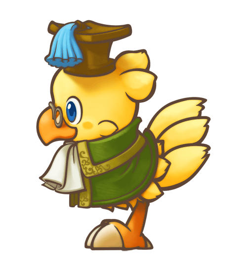
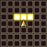

# Overview

# Jobs

<table class="jobLinksImage jobLinksTable">
  <tr>
    <th colspan="7">Job Links</th>
  </tr>
  <tr>
    <td> <a href="#freelancer">Freelancer</a></td>
    <td> <a href="#knight">Knight</a></td>
    <td> <a href="#dragoon">Dragoon</a></td>
    <td> <a href="#dark-knight">Dark Knight</a></td>
    <td> <a href="#ninja">Ninja</a></td>
    <td> <a href="#thief">Thief</a></td>
    <td> <a href="#scholar">Scholar</a></td>
  </tr>
  <tr>
    <td> <a href="#black-mage">Black Mage</a></td>
    <td> <a href="#white-mage">White Mage</a></td>
    <td> <a href="#dancer">Dancer</a></td>
    <td> <a href="#red-mage">Red Mage</a></td>
    <td> <a href="#beastmaster">Beastmaster</a></td>
    <td> <a href="#machinist">Machinist</a></td>
    <td> <a href="#alpha">Alpha</a></td>
  </tr>
</table>

 

  Freelancer

##### Freelancer Overview

<table class="dungeonOverview">
  <tr>
    <th>Unlock</th>
    <td colspan="16" class="highlightYellow">The player starts the game as this Job.</td>
  </tr>
  <tr>
    <th>Stats (%)</th>
    <td class="hp">HP</td>
    <td>100%</td>
    <td class="atk">Attack</td>
    <td>100%</td>
    <td class="def">Defense</td>
    <td>100%</td>
    <td class="mag">Magic</td>
    <td>100%</td>
    <td class="mnd">Mind</td>
    <td>100%</td>
  </tr>
  <tr>
    <th>Stats (Lv99)</th>
    <td class="hp">HP</td>
    <td>832</td>
    <td class="atk">Attack</td>
    <td>119</td>
    <td class="def">Defense</td>
    <td>119</td>
    <td class="mag">Magic</td>
    <td>119</td>
    <td class="mnd">Mind</td>
    <td>119</td>
  </tr>
  <tr>
    <th>Food Level</th>
    <td colspan="16">1% / 12 Turns. (Normal)</td>
  </tr>
</table>

##### Freelancer JP Requirements

<table>
  <tr>
    <th>Total</th>
    <td colspan="15">12,700 (Very Low)</td>
  </tr>
  <tr>
    <th>Lv1</th>
    <td>0</td>
    <th>Lv2</th>
    <td>100</td>
    <th>Lv3</th>
    <td>200</td>
    <th>Lv4</th>
    <td>400</td>
    <th>Lv5</th>
    <td>800</td>
    <th>Lv6</th>
    <td>1,600</td>
    <th>Lv7</th>
    <td>3,200</td>
    <th>Lv8</th>
    <td>6,400</td>
  </tr>
</table>

##### Freelancer Abilities

<table class="jobTable">
  <thead>
    <tr>
      <th>Lv</th>
      <th>Ability</th>
      <th>SP</th>
      <th>Notes</th>
      <th>Range</th>
    </tr>
  </thead>
  <tbody>
    <tr>
      <td>1</td>
      <td>Chocobo Kick</td>
      <td>1.0</td>
      <td>Attack a foe 1 tile ahead of you.</td>
      <td></td>
    </tr>
    <tr>
      <td>2</td>
      <td>Chocobo Drop</td>
      <td>1.0</td>
      <td>Attack all foes within a 1-tile radius.</td>
      <td></td>
    </tr>
    <tr>
      <td>3</td>
      <td>Chocobo Kick+</td>
      <td>1.5</td>
      <td>Attack a foe 1 tile ahead of you and knock them back.</td>
      <td></td>
    </tr>
    <tr>
      <td>4</td>
      <td>Dig</td>
      <td>2.0</td>
      <td>Dig up an item once per dungeon floor.</td>
      <td></td>
    </tr>
    <tr>
      <td>5</td>
      <td>Chocomet</td>
      <td>3.0</td>
      <td>Drop a meteor on an area 3 tiles ahead of you. Also deals damage in a 1-tile radius around the target.</td>
      <td></td>
    </tr>
    <tr>
      <td>6</td>
      <td>Chocobo Dash</td>
      <td>3.0</td>
      <td>Cast Haste and temporarily increase speed. Duration: 10 Turns.</td>
      <td></td>
    </tr>
    <tr>
      <td>7</td>
      <td>Chocobo Kick Zero</td>
      <td>2.0</td>
      <td>Stun a foe 1 tile ahead of you and knock them back.</td>
      <td></td>
    </tr>
    <tr>
      <td>8</td>
      <td>Chocobash</td>
      <td>4.5</td>
      <td>Attack all enemies within a 3-tile radius. Deals fixed damage equal to Level x 4 (Max: Lv99 → 396 damage).</td>
      <td></td>
    </tr>
    <tr>
      <td>8</td>
      <td>???</td>
      <td>3.5</td>
      <td>Attack a foe up to 3 tiles ahead of you (damage based on lost HP). Deals fixed damage equal to Chocobo's Max HP - Current HP.</td>
      <td></td>
    </tr>
  </tbody>
</table>

 

  Knight

##### Knight Overview

<table class="dungeonOverview">
  <tr>
    <th>Unlock</th>
    <td colspan="16" class="highlightYellow">Obtain Knight's Memories in Mayor Gale's Memories (5F).</td>
  </tr>
  <tr>
    <th>Stats (%)</th>
    <td class="hp">HP</td>
    <td>108%</td>
    <td class="atk">Attack</td>
    <td>102%</td>
    <td class="def">Defense</td>
    <td>106%</td>
    <td class="mag">Magic</td>
    <td>90%</td>
    <td class="mnd">Mind</td>
    <td>92%</td>
  </tr>
  <tr>
    <th>Stats (Lv99)</th>
    <td class="hp">HP</td>
    <td></td>
    <td class="atk">Attack</td>
    <td></td>
    <td class="def">Defense</td>
    <td></td>
    <td class="mag">Magic</td>
    <td></td>
    <td class="mnd">Mind</td>
    <td></td>
  </tr>
  <tr>
    <th>Food Level</th>
    <td colspan="16">1% / 10 Turns. (Fast)</td>
  </tr>
</table>

##### Knight JP Requirements

<table>
  <tr>
    <th>Total</th>
    <td colspan="15">15,240 (Low)</td>
  </tr>
  <tr>
    <th>Lv1</th>
    <td>0</td>
    <th>Lv2</th>
    <td>120</td>
    <th>Lv3</th>
    <td>240</td>
    <th>Lv4</th>
    <td>480</td>
    <th>Lv5</th>
    <td>960</td>
    <th>Lv6</th>
    <td>1,920</td>
    <th>Lv7</th>
    <td>3,840</td>
    <th>Lv8</th>
    <td>7,680</td>
  </tr>
</table>

##### Knight Abilities

<table class="jobTable">
  <thead>
    <tr>
      <th>Lv</th>
      <th>Ability</th>
      <th>SP</th>
      <th>Notes</th>
      <th>Range</th>
    </tr>
  </thead>
  <tbody>
    <tr>
      <td>1</td>
      <td>Power Smack</td>
      <td>1.0</td>
      <td>Attack a foe 1 tile ahead of you and knock them back.</td>
      <td></td>
    </tr>
    <tr>
      <td>2</td>
      <td>Circle Slash</td>
      <td>1.0</td>
      <td>Attack all foes within a 1-tile radius.</td>
      <td></td>
    </tr>
    <tr>
      <td>3</td>
      <td>Slow Burner</td>
      <td>2.0</td>
      <td>Slow down a foe 1 tile ahead of you and knock them back.</td>
      <td></td>
    </tr>
    <tr>
      <td>4</td>
      <td>Aegis Shield</td>
      <td>1.5</td>
      <td>Cast Protect and temporarily reduce physical damage.</td>
      <td></td>
    </tr>
    <tr>
      <td>5</td>
      <td>Excalibur</td>
      <td>2.0</td>
      <td>Attack all foes in the row of 3 tiles ahead of you.</td>
      <td></td>
    </tr>
    <tr>
      <td>6</td>
      <td>Climhazzard</td>
      <td>2.5</td>
      <td>Attack all foes in a 1-tile cross and knock them back.</td>
      <td></td>
    </tr>
    <tr>
      <td>7</td>
      <td>Ragnarok</td>
      <td>3.0</td>
      <td>Deal huge damage to all foes within a 1-tile radius.</td>
      <td></td>
    </tr>
    <tr>
      <td>8</td>
      <td>Camelot</td>
      <td>4.0</td>
      <td>Slow down all foes within a 1-tile radius and knock them back.</td>
      <td></td>
    </tr>
  </tbody>
</table>

 

  Dragoon

  Dark Knight

  Ninja

  Thief

  Scholar

  Black Mage

  White Mage

  Dancer

  Red Mage

  Beastmaster

  Machinist

  Alpha

# Level & Stats

  Freelancer (Exp & Stats)

|Lv|Total Exp|Next Exp|HP|Atk|Def|Mag|Mnd|
|-|-|-|-|-|-|-|-|
|1|0|28|48|21|21|21|21|
|2|28|64|56|22|22|22|22|
|3|92|144|64|23|23|23|23|
|4|236|240|72|24|24|24|24|
|5|476|352|80|25|25|25|25|
|6|828|480|88|26|26|26|26|
|7|1,308|624|96|27|27|27|27|
|8|1,932|784|104|28|28|28|28|
|9|2,716|1,020|112|29|29|29|29|
|10|3,736|1,184|120|30|30|30|30|
|11|4,920|1,275|128|31|31|31|31|
|12|6,195|1,368|136|32|32|32|32|
|13|7,563|1,463|144|33|33|33|33|
|14|9,026|1,960|152|34|34|34|34|
|15|10,986|2,079|160|35|35|35|35|
|16|13,065|2,200|168|36|36|36|36|
|17|15,265|2,323|176|37|37|37|37|
|18|17,588|2,928|184|38|38|38|38|
|19|20,516|3,075|192|39|39|39|39|
|20|23,591|3,224|200|40|40|40|40|
|21|26,815|3,375|208|41|41|41|41|
|22|30,190|4,088|216|42|42|42|42|
|23|34,278|4,263|224|43|43|43|43|
|24|38,541|4,440|232|44|44|44|44|
|25|42,981|4,619|240|45|45|45|45|
|26|47,600|5,440|248|46|46|46|46|
|27|53,040|5,643|256|47|47|47|47|
|28|58,683|5,848|264|48|48|48|48|
|29|64,531|6,055|272|49|49|49|49|
|30|70,586|6,984|280|50|50|50|50|
|31|77,570|7,215|288|51|51|51|51|
|32|84,785|7,448|296|52|52|52|52|
|33|92,233|7,683|304|53|53|53|53|
|34|99,916|8,720|312|54|54|54|54|
|35|108,636|8,979|320|55|55|55|55|
|36|117,615|9,240|328|56|56|56|56|
|37|126,855|9,503|336|57|57|57|57|
|38|136,358|10,648|344|58|58|58|58|
|39|147,006|10,935|352|59|59|59|59|
|40|157,941|11,224|360|60|60|60|60|
|41|169,165|11,515|368|61|61|61|61|
|42|180,680|12,768|376|62|62|62|62|
|43|193,448|13,083|384|63|63|63|63|
|44|206,531|13,400|392|64|64|64|64|
|45|219,931|13,719|400|65|65|65|65|
|46|233,650|15,080|408|66|66|66|66|
|47|248,730|15,423|416|67|67|67|67|
|48|264,153|15,768|424|68|68|68|68|
|49|279,921|16,115|432|69|69|69|69|
|50|296,036|17,584|440|70|70|70|70|
|51|313,620|17,955|448|71|71|71|71|
|52|331,575|18,328|456|72|72|72|72|
|53|349,903|18,703|464|73|73|73|73|
|54|368,606|20,280|472|74|74|74|74|
|55|388,886|20,679|480|75|75|75|75|
|56|409,565|21,080|488|76|76|76|76|
|57|430,645|21,483|496|77|77|77|77|
|58|452,128|23,168|504|78|78|78|78|
|59|475,296|23,595|512|79|79|79|79|
|60|498,891|24,024|520|80|80|80|80|
|61|522,915|24,455|528|81|81|81|81|
|62|547,370|26,248|536|82|82|82|82|
|63|573,618|26,703|544|83|83|83|83|
|64|600,321|27,160|552|84|84|84|84|
|65|627,481|27,619|560|85|85|85|85|
|66|655,100|29,520|568|86|86|86|86|
|67|684,620|30,003|576|87|87|87|87|
|68|714,623|30,488|584|88|88|88|88|
|69|745,111|30,975|592|89|89|89|89|
|70|776,086|32,984|600|90|90|90|90|
|71|809,070|33,495|608|91|91|91|91|
|72|842,565|34,008|616|92|92|92|92|
|73|876,573|34,523|624|93|93|93|93|
|74|911,096|36,640|632|94|94|94|94|
|75|947,736|37,179|640|95|95|95|95|
|76|984,915|37,720|648|96|96|96|96|
|77|1,022,635|38,263|656|97|97|97|97|
|78|1,060,898|40,488|664|98|98|98|98|
|79|1,101,386|41,055|672|99|99|99|99|
|80|1,142,441|41,624|680|100|100|100|100|
|81|1,184,065|42,195|688|101|101|101|101|
|82|1,226,260|44,528|696|102|102|102|102|
|83|1,270,788|45,123|704|103|103|103|103|
|84|1,315,911|45,720|712|104|104|104|104|
|85|1,361,631|46,319|720|105|105|105|105|
|86|1,407,950|48,760|728|106|106|106|106|
|87|1,456,710|49,383|736|107|107|107|107|
|88|1,506,093|50,008|744|108|108|108|108|
|89|1,556,101|50,635|752|109|109|109|109|
|90|1,606,736|53,184|760|110|110|110|110|
|91|1,659,920|53,835|768|111|111|111|111|
|92|1,713,755|54,488|776|112|112|112|112|
|93|1,768,243|55,143|784|113|113|113|113|
|94|1,823,386|57,800|792|114|114|114|114|
|95|1,881,186|58,479|800|115|115|115|115|
|96|1,939,665|59,160|808|116|116|116|116|
|97|1,998,825|59,843|816|117|117|117|117|
|98|2,058,668|62,608|824|118|118|118|118|
|99|2,121,276|-|832|119|119|119|119|
